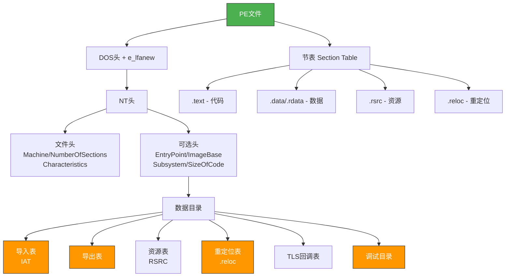
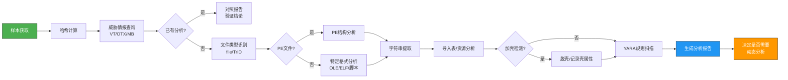

## 24.1 静态分析技巧

### 24.1.0 引言：为什么静态分析是恶意软件分析的基石

静态分析是指在不执行样本文件的情况下，通过检查其结构、代码、资源和元数据来理解其功能和意图的技术体系。与动态分析不同，静态分析没有样本执行的风险，适合作为每项分析的**第一步**，也常用于大规模自动化筛选。

**静态分析的三大核心价值：**

| 维度 | 说明 | 典型产出 |
|------|------|---------|
| 快速分类 | 在几分钟内判断样本类型、家族、加壳状态 | 哈希值、文件类型、编译时间戳 |
| 危险排除 | 避免执行高度危险样本时的误判风险 | 静态IOC列表、C2地址、持久化方式 |
| 规模化筛选 | 可脚本化，适合每天数百个样本的批量处理 | YARA命中报告、统计摘要 |

**局限性**：静态分析无法完全揭示运行时行为——反混淆、反调试、加壳技术会隐藏真实逻辑。因此，静态分析与动态分析互为补充，而非替代关系。

---

### 24.1.1 文件基础信息收集

恶意软件分析的第一步是收集样本的**客观元数据**。这些数据不依赖于分析者的主观判断，是后续所有分析的参考基准。

#### 哈希计算：样本的唯一指纹

哈希值是样本的数学摘要，用于标识、查询和去重。主流哈希类型及其应用场景对比如下：

| 算法 | 位长 | 安全性 | 主要用途 | 推荐场景 |
|------|------|--------|---------|---------|
| MD5 | 128位 | 已被碰撞攻破 | 历史数据库查询、内部去重 | VirusTotal旧记录检索 |
| SHA1 | 160位 | 存在理论碰撞 | 传统样本库标识 | MalwareBazaar检索 |
| SHA256 | 256位 | 目前安全 | 样本唯一标识、取证标准 | 所有新样本的首选标识 |
| ssdeep | 可变的 | 非加密哈希 | 模糊匹配相似样本 | 变体分析、同源判定 |
| imphash | N/A | 基于导入表 | PE结构相似度匹配 | 同源样本聚类 |
| TLSH | 可变长度 | 比ssdeep更精确 | 局部敏感哈希 | 大规模相似度检索 |

```bash
# === 标准哈希 ===
sha256sum sample.exe     # 首选标识
md5sum sample.exe        # 用于VT查重

# === 模糊哈希（相似度分析） ===
ssdeep sample.exe        # 输出CTPH格式模糊哈希
# 对于已知家族变体，ssdeep得分>55通常表示同源

# === PE特定哈希 ===
# 使用Python + pefile计算imphash
python3 -c "
import pefile, sys
pe = pefile.PE(sys.argv[1])
print(pe.get_imphash())
" sample.exe

# 使用TLSH
# 需先安装: pip install tlsh
python3 -c "
import tlsh, sys
with open(sys.argv[1], 'rb') as f:
    data = f.read()
print(tlsh.hash(data))
" sample.exe
```

**实战要点**：
- 始终保存SHA256作为永久标识——VT、Hybrid Analysis、AlienVault OTX均使用它作为主键
- ssdeep适合变体聚类：同一家族的不同版本ssdeep得分通常在50-90之间
- imphash（导入表哈希）在同编译器场景下特别有效
- 计算哈希时需注明算法类型，避免数据库冲突

#### 在线平台查询：站在前人的肩膀上

将哈希值提交到威胁情报平台，可以快速获取样本的历史分析记录：

| 平台 | 核心功能 | 免费限制 | 特别说明 |
|------|---------|---------|---------|
| VirusTotal | 70+引擎检测、社区评论、行为报告 | 每日500次查询 | 最全面的聚合平台 |
| Hybrid Analysis | 自动沙箱报告、MITRE ATT&CK映射 | 有限免费配额 | 提供详细的API调用跟踪 |
| MalwareBazaar | 样本共享、家族标签、签名 | 完全免费 | 由abuse.ch运营，质量高 |
| AlienVault OTX | 威胁情报脉冲、IOC共享 | 免费注册 | 关联APT活动跟踪 |
| Any.Run | 交互式在线沙箱 | 基础免费 | 支持Live交互 |
| Triage | 自动化沙箱+静态分析 | 每日20次 | 支持多平台（Win/Linux/Android） |

```bash
# 使用VT API查询（需要API密钥）
curl -s --request GET \
  --url "https://www.virustotal.com/api/v3/files/{SHA256_HASH}" \
  --header "x-apikey: $VT_API_KEY" | jq '.data.attributes.last_analysis_stats'

# 输出示例：
# {
#   "malicious": 45,
#   "suspicious": 2,
#   "undetected": 23,
#   "harmless": 1,
#   "timeout": 0
# }
```

**关键判断规则**：
- 检测率 > 30/70：很可能是恶意文件
- 检测率 5-30/70：可疑，需进一步验证
- 检测率 < 5/70：可能是白文件或高度定制化恶意软件
- 注意**首次提交时间**：如果样本在24小时内提交且检测率低，可能使用了零日规避技术

#### 文件类型识别：不要相信扩展名

恶意软件常通过双扩展名（如 `invoice.pdf.exe`）、RLO控制字符（`gpj.exe` 倒序渲染为 `exe.jpg`）、或者完全伪装扩展名来规避检测。

```bash
# === Linux file命令 ===
file sample.exe
# 典型输出：
# sample.exe: PE32+ executable (GUI) x86-64, for MS Windows
#
# 关键字段解读：
# PE32 = 32位, PE32+ = 64位
# GUI/CUI = 图形界面/控制台程序
# DLL = 动态链接库
# for MS Windows = 目标平台

# === TrID：更精确的识别 ===
# TrID基于文件签名数据库，可识别22000+文件类型
trid sample.exe
# 典型输出：
# 45.2% (.EXE) Win32 Executable (generic)
# 30.1% (.EXE) Win64 Executable (generic)
# 12.3% (.SCR) Win32 Screen Saver
# 8.7% (.CPL) Windows Control Panel Item
# 3.7% (.MSI) Windows Installer

# === Detect It Easy (DiE) ===
# 可识别加壳器、链接器版本、熵值
diec sample.exe
# 典型输出：
# PE: packer: UPX(3.96)[-]
# PE: linker: Microsoft Linker(14.16)
# entropy: 7.89 (likely packed)
```

**高级技巧**：对于Office文档，可以使用 `oleid` 检查OLE结构中的宏和ActiveX控件：

```bash
pip install oletools
oleid document.doc
# 输出示例：
# Indicators                    Value
# ----------------              -----
# OLE format                     yes
# Has Macros                      yes
# Excel 4.0 macros               no
# External Relationships          yes (3)
# Has ActiveX Controls            no
```

---

### 24.1.2 字符串分析：最直接的信息来源

字符串是可执行文件中以可读文本形式存在的数据片段。恶意软件通常包含大量字符串，用于配置、通信、错误处理和反分析。

#### 字符串提取工具对比

| 工具 | 能力 | 优势 | 局限性 |
|------|------|------|--------|
| `strings` | 基础ASCII/Unicode提取 | 系统自带，速度快 | 错过混淆/加密字符串 |
| `FLOSS` | 提取混淆/解密字符串 | FireEye出品，支持解码 | 对强加密无效 |
| `Radare2` | 递归字符串检测 | 可沿代码路径提取 | 学习曲线陡 |
| `YARA` | 模式匹配 | 可自定义提取规则 | 需要规则编写 |

```bash
# === strings命令全面用法 ===
# 提取ASCII字符串（至少5个连续可打印字符）
strings -n 5 sample.exe > ascii.txt

# 提取UTF-16LE Unicode字符串（Windows程序常用）
strings -n 5 -e l sample.exe > unicode.txt

# 提取所有编码的字符串
for enc in s S b l L B; do
    strings -n 5 -e $enc sample.exe >> strings_all.txt
done

# 条件过滤：提取URL和IP
strings sample.exe | grep -E '(https?://|[0-9]{1,3}\.){3}[0-9]{1,3}' > urls_ips.txt

# === FLOSS：火眼实验室的混淆字符串提取器 ===
# FLOSS使用模拟执行和启发式扫描，恢复被混淆的字符串
floss -n 6 sample.exe > floss_output.txt

# 仅输出解码后的字符串
floss --only decoded sample.exe > decoded_strings.txt
```

#### 关键字符串分类分析

| 类别 | 典型特征 | 分析价值 |
|------|---------|---------|
| C2通信 | URL、IP:端口、域名、User-Agent | 识别命令服务器、网络特征 |
| 文件操作 | `C:\Users\`, `%APPDATA%`, `\.exe` | 确定安装路径、自拷贝位置 |
| 持久化 | `SOFTWARE\Microsoft\Windows\CurrentVersion\Run`, 服务名 | 明确启动机制 |
| 加密相关 | AES, RC4, XOR, 密钥字符串 | 识别加密算法，辅助解密 |
| 调试信息 | `[ERROR]`, `[INFO]`, 变量名、函数名 | 暴露开发者命名习惯 |
| API函数 | `CreateRemoteThread`, `VirtualAllocEx` | 推断进程注入等行为 |
| 规避检测 | VMWare, VBOX, Sandboxie, wireshark | 识别反虚拟化/反调试逻辑 |
| 配置数据 | Base64字符串、二进制blob | 通常是加密的C2配置 |

#### 实战案例：通过字符串判定Emotet样本

假设分析一个恶意Office文档：

```bash
strings -n 8 malicious.doc | head -30
# 输出：
# Dim objXML As Object
# Dim objStream As Object
# HTTP/1.1
# WinHttp.WinHttpRequest.5.1
# ADODB.Stream
# https://evil.com/load.php?uid=
# WScript.Shell
# CreateObject
# vbNormalFocus

# 分析结论：
# 1. VBA宏通过WinHttpRequest下载payload（URL可见）
# 2. 使用ADODB.Stream写入文件（文件释放）
# 3. 调用WScript.Shell执行（代码执行）
# 4. 这是典型的Emotet/Dridex初始传播文档
```

**误区警示**：
- 很多C2地址存储在加密配置块中，字符串分析无法直接提取
- 合法程序也会包含API名称和URL，需结合上下文判断
- 字符串长度阈值过低（如默认3个字符）会产生大量噪音
- Unicode字符串在ASCII模式下会显示为分隔的乱码

---

### 24.1.3 PE文件结构深度分析

PE（Portable Executable）是Windows可执行文件的格式标准。深入理解PE结构是静态分析的核心能力。

#### PE结构的五层分析框架



#### 节（Section）分析：加壳检测的核心

PE文件的节（Section）是内容的逻辑分区。通过分析节的属性、大小、和熵值，可以快速判断加壳状态：

```python
import pefile
import math

def analyze_sections(filepath):
    """完整的节分析函数"""
    pe = pefile.PE(filepath)
    
    print(f"{'节名称':<10} {'虚拟大小':<12} {'原始大小':<12} {'熵值':<8} {'特征':<30} 判断")
    print("-" * 80)
    
    for section in pe.sections:
        name = section.Name.decode().rstrip('\x00').strip()
        vsize = section.Misc_VirtualSize
        rsize = section.SizeOfRawData
        
        # 计算熵值
        entropy = section.get_entropy()
        
        # 解析节特征
        chars = []
        if section.IMAGE_SCN_MEM_EXECUTE:
            chars.append("可执行")
        if section.IMAGE_SCN_MEM_WRITE:
            chars.append("可写")
        if section.IMAGE_SCN_MEM_READ:
            chars.append("可读")
        
        # 加壳判定
        verdict = ""
        if entropy > 7.0:
            verdict = "⚠️ 疑似加壳/加密"
        elif name in ['.text', '.rdata', '.data'] and entropy > 6.5:
            verdict = "⚠️ 节异常"
        elif name == '.text' and entropy > 6.0:
            verdict = "需要关注"
        else:
            verdict = "正常"
        
        print(f"{name:<10} 0x{vsize:<8X} 0x{rsize:<8X} "
              f"{entropy:<8.2f} {'|'.join(chars):<30} {verdict}")

analyze_sections("sample.exe")
```

**节分析的异常模式**：

| 模式 | 说明 | 典型案例 |
|------|------|---------|
| `.text` 可写+可执行 | 代码段"三可"（读/写/执行） | 壳代码的解压/解密节 |
| 高熵值（>7.5） | 数据已加密/压缩 | UPX、MPRESS、ASPack |
| 异常节名 | 非标准节名（UPX0、UPX1） | UPX壳 |
| 虚拟大小 >> 原始大小 | 壳预留了大段空白用于解压 | 现代壳通用特征 |
| 原始大小为0但有虚拟大小 | 节完全在内存中生成 | 某些高级壳 |

```bash
# 使用pev工具包快速检测
# 安装: apt install pev 或 brew install pev

# 查看PE节信息
readpe -S sample.exe

# 计算熵值
pescan -v sample.exe | grep -i entropy
```

#### Rich Header分析

Rich Header是PE文件头中的一个特殊结构，记录了编译环境的详细信息。由于它在编译时自动嵌入且不被常规查看器显示，却可以被对手修改伪造，因此成为溯源研究的重要阵地：

```bash
# 使用readpe读取Rich Header信息
readpe --rich sample.exe

# 使用Python提取
python3 -c "
import pefile
pe = pefile.PE('sample.exe')
rich_header = pe.parse_rich_header()
if rich_header:
    for entry in rich_header.get('values', []):
        print(f'工具ID: {entry[\"build_id\"]}, 工具名: {entry.get(\"tool_name\", \"unknown\")}, 计数: {entry[\"count\"]}')
"
```

**分析价值**：
- 同一恶意软件家族的变体通常共享相同的Rich Header指纹
- 可以反向推断恶意软件开发者的编译器工具链
- API/工具破解后，通过对齐Rich Header可关联不同样本

#### 导入表（Import Table）的行为推断

导入表列出了程序静态链接的所有外部函数调用。恶意软件的导入表往往具有鲜明的行为特征：

| 行为类型 | 关键API组合 | 功能推断 |
|---------|------------|---------|
| 进程注入 | `OpenProcess` + `VirtualAllocEx` + `WriteProcessMemory` + `CreateRemoteThread` | 经典DLL/Shellcode注入 |
| 键盘记录 | `SetWindowsHookEx` + `GetAsyncKeyState` + `GetForegroundWindow` | 键盘钩子记录器 |
| 屏幕捕获 | `CreateDC` + `BitBlt` + `GetDIBits` | 屏幕截图/录制 |
| 持久化 | `RegSetValueEx` (Run键) + `CreateService` | 注册表/服务持久化 |
| 网络通信 | `WSAStartup` + `connect` + `send`/`recv` + `WSASend` | TCP C2通信 |
| 数据窃取 | `FindFirstFile` + `ReadFile` + `InternetWriteFile` | 文件窃取上传 |

```python
# 导入表分析脚本
import pefile

pe = pefile.PE("sample.exe")

# 签名检测：预定义的行为特征
SUSPICIOUS_PATTERNS = {
    "进程注入": ["OpenProcess", "VirtualAllocEx", "WriteProcessMemory", "CreateRemoteThread"],
    "键盘记录": ["SetWindowsHookEx", "GetAsyncKeyState", "GetForegroundWindow"],
    "持久化注册表": ["RegSetValueEx", "RegCreateKeyEx"],
    "屏幕捕获": ["CreateDC", "BitBlt", "GetDIBits"],
    "代码注入常用": ["NtUnmapViewOfSection", "NtResumeThread", "GetThreadContext"],
}

if hasattr(pe, 'DIRECTORY_ENTRY_IMPORT'):
    found_apis = {}
    for entry in pe.DIRECTORY_ENTRY_IMPORT:
        dll_name = entry.dll.decode().lower()
        for imp in (entry.imports or []):
            if imp.name:
                api_name = imp.name.decode()
                found_apis[api_name] = dll_name
    
    print("=== 可疑行为检测 ===")
    for behavior, apis in SUSPICIOUS_PATTERNS.items():
        matched = [a for a in apis if a in found_apis]
        ratio = len(matched) / len(apis)
        if ratio >= 0.5:
            print(f"⚠️ {behavior}: {matched} (命中率: {ratio:.0%})")
        elif matched:
            print(f"  {behavior}: {matched} (部分匹配)")
```

**导入表分析要点**：
- 恶意软件代码常动态加载API（`GetProcAddress` + `LoadLibrary`），静态导入表可能只包含加载函数
- 合法程序也可能包含上述API（如远程桌面软件调用进程管理函数），需结合上下文
- 导入表中缺少某个关键函数但行为存在，提示API动态解析
- 导入函数数量极少（<20）的程序可能是壳加载器

#### 导出表（Export Table）分析

对于DLL文件，导出表暴露了其对外提供的函数接口。恶意DLL（如作为插件或注入目标的DLL）的导出表分析尤其重要：

```python
# 导出表分析
pe = pefile.PE("malicious.dll")

if hasattr(pe, 'DIRECTORY_ENTRY_EXPORT'):
    export_dir = pe.DIRECTORY_ENTRY_EXPORT
    print(f"DLL名称: {export_dir.name.decode() if export_dir.name else '未命名'}")
    print(f"导出函数数: {export_dir.struct.NumberOfFunctions}")
    print(f"命名函数数: {export_dir.struct.NumberOfNames}")
    
    for exp in export_dir.symbols:
        if exp.name:
            print(f"  [导出] {exp.name.decode()} @ RVA: 0x{exp.address:X}")
        else:
            print(f"  [导出] Ordinal: {exp.ordinal} @ RVA: 0x{exp.address:X}")
```

**导出表异常信号**：
- 合法系统DLL（如`kernel32.dll`）被程序自带时强烈可疑
- DLL仅导出序号值很小的非命名函数（如`Ordinal 1-5`）常见于恶意插件
- 导出函数名拼写错误或语义模糊（如`EncryptData`写为`EncryptDataaaa`）

#### 资源表（Resource Table）与隐藏数据

PE的资源节（`.rsrc`）可以包含图标、位图、对话框、版本信息、清单文件、甚至嵌入式PE文件：

```bash
# 使用ResourceHacker（Windows GUI工具）查看和提取资源
# 或使用Python pefile

python3 -c "
import pefile

pe = pefile.PE('sample.exe')

# 列出所有资源类型
if hasattr(pe, 'DIRECTORY_ENTRY_RESOURCE'):
    for resource_type in pe.DIRECTORY_ENTRY_RESOURCE.entries:
        type_name = resource_type.name if hasattr(resource_type, 'name') and resource_type.name else f'ID: {resource_type.id}'
        print(f'资源类型: {type_name}')
        for resource_id in resource_type.directory.entries:
            for resource_lang in resource_id.directory.entries:
                data = pe.get_data(resource_lang.data.struct.OffsetToData,
                                   resource_lang.data.struct.Size)
                print(f'  ID={resource_id.id}, 语言={resource_lang.id}, 大小={len(data)}字节')
                # 检查是否包含嵌入式PE
                if data[:2] == b'MZ':
                    print(f'    ⚠️ 发现嵌入式PE文件!')
"
```

**资源节分析要点**：
- 恶意软件常在资源中嵌入加密的payload，运行时解密释放到内存
- 资源中的版本信息可能被伪造为合法软件的版本号以欺骗用户
- 超大资源（相对于文件总大小）通常意味着内部嵌入了其他数据
- 图标与文件声称的功能不符（如PDF图标下的EXE文件）是经典社会工程学手法

#### 重定位表（Base Relocation Table）

可执行文件被加载到非首选基址时，系统根据重定位表调整地址引用：

```bash
# 查看重定位条目数
python3 -c "
import pefile
pe = pefile.PE('sample.exe')
if hasattr(pe, 'DIRECTORY_ENTRY_BASERELOC'):
    total = sum(len(b.entries) for b in pe.DIRECTORY_ENTRY_BASERELOC)
    print(f'重定位块数: {len(pe.DIRECTORY_ENTRY_BASERELOC)}')
    print(f'重定位条目总数: {total}')
else:
    print('无重定位表（可能为DLL或动态基址关闭）')
"
```

**分析价值**：
- EXE通常不需要重定位，如果存在大量重定位，可能是DLL转EXE或使用了特殊技术
- 如果重定位表为空但文件声称是DLL，可能是恶意DLL加载器
- ASLR（地址空间随机化）关闭时（`DllCharacteristics & 0x40 == 0`）的程序对漏洞利用更友好

#### 调试目录与PDB路径

PE文件的调试目录可能包含PDB（程序数据库）文件的完整路径，暴露源代码的组织结构：

```bash
python3 -c "
import pefile
pe = pefile.PE('sample.exe')
if hasattr(pe, 'DIRECTORY_ENTRY_DEBUG'):
    for debug in pe.DIRECTORY_ENTRY_DEBUG:
        if hasattr(debug, 'entry') and debug.entry.PdbFileName:
            pdb_path = debug.entry.PdbFileName.decode('utf-8', errors='replace')
            print(f'PDB路径: {pdb_path}')
            # PDB路径中的信息：
            # 编译器版本（由路径中的工具链版本推断）
            # 项目目录结构（暴露组织命名习惯）
            # 用户名（如 C:\\Users\\attacker\\...）
"
```

---

### 24.1.4 编译器与链接器指纹分析

每个编译器和链接器在生成的PE中都留下独特的签名痕迹：

```bash
# 使用DiE (Detect It Easy) 检测编译器信息
diec sample.exe

# 输出示例：
# compiler: Microsoft Visual C/C++(2015 v14.0)[libcmt]
# linker: Microsoft Linker(14.10)
# packer: UPX(3.96)[-]

# 使用pev工具链
readpe -a sample.exe | grep -i "compiler\|linker\|timestamp"
```

**编译器/链接器指纹的应用**：

| 编译器 | 链接器版本 | 暴露信息 | 分析价值 |
|--------|-----------|---------|---------|
| MSVC 2015 v14.0 | 14.10 | 使用Visual Studio 2015 Update 1 | 工具链老旧，可能为长期维护项目 |
| MinGW GCC 8.3 | 无MS链接器 | Linux交叉编译 | 开发者习惯Linux环境 |
| Delphi/C++Builder | Borland链接器 | 非主流Windows IDE | 常见于RAT软件（DarkComet等） |
| VC++ 6.0 | 6.0 | 极老编译器（1998） | 可能为复用旧代码或故意降级兼容 |

**编译时间戳分析**：

```bash
# 查看PE文件时间戳（可选头中的TimeDateStamp）
python3 -c "
import pefile, datetime
pe = pefile.PE('sample.exe')
timestamp = pe.FILE_HEADER.TimeDateStamp
if timestamp:
    dt = datetime.datetime.fromtimestamp(timestamp)
    print(f'编译时间戳: {dt}')
    # 如果时间戳在未来或为固定值(0x00000000/0xFFFFFFFF)，说明已被伪造
"
```

**异常时间戳模式**：
- `0x00000000`（1970-01-01）：时间戳被清零（常见于反分析）
- `0xFFFFFFFF`（2106-02-07）：时间戳被故意破坏
- 固定值如`0x4A5BED00`（2009-07-13）：特定构建系统的固定时间
- 未来时间：时钟被篡改

---

### 24.1.5 YARA规则与静态检测体系建设

YARA是一种基于模式匹配的恶意软件识别工具，是静态分析自动化的核心。

#### YARA规则的基本结构

```yara
rule Suspicious_String_Features : trojan
{
    meta:
        description = "检测包含可疑字符串的PE文件"
        author = "分析师姓名"
        date = "2025-01-15"
        reference = "样本SHA256: ABC123..."
        hash = "d41d8cd98f00b204e9800998ecf8427e"
    
    strings:
        $c2_url = "http://" nocase
        $reg_persist = "CurrentVersion\\Run" nocase
        $vbox_detect = "VBoxGuest" nocase ascii
        $api_inject = "CreateRemoteThread" ascii
    
    condition:
        // 至少命中2个字符串，且文件是PE
        uint16(0) == 0x5A4D and   // MZ头
        uint32(uint32(0x3C)) == 0x00004550 and  // PE签名
        #c2_url >= 1 and
        (#reg_persist + #api_inject) >= 1
}
```

#### YARA规则的编写原则

| 原则 | 说明 | 反例 |
|------|------|------|
| **特异性** | 规则应足够精确，避免误报 | `$a = "http://"` 太宽泛 |
| **多条件** | 多个条件同时满足提高准确率 | 单一字符串匹配不可靠 |
| **元数据** | 标注作者、来源、参考样本 | 无元数据的规则难以维护 |
| **模块利用** | 使用pe/elf/macho模块获取结构信息 | 纯字符串匹配不够精准 |
| **性能优化** | 使用`nocase`、`ascii`、`wide`控制搜索空间 | 不加修饰符的全量搜索 |

#### 实战：编写Shellcode检测规则

```yara
import "pe"

rule Shellcode_Loader_Indicators
{
    meta:
        description = "检测可能的Shellcode加载器特征"
        author = "分析团队"
    
    strings:
        $exec_mem = "VirtualAlloc" ascii
        $exec_native = "NtCreateSection" ascii
        $copy_mem = { 48 8B 4? 24 ?? 48 8B 54 24 ?? 48 8B 01 }  // mov instr pattern
        $call_rax = { FF D0 }  // call rax (执行shellcode)
        $call_rcx = { FF D1 }  // call rcx
    
    condition:
        pe.is_pe and
        (($exec_mem or $exec_native) and
        ($call_rax or $call_rcx))
}
```

#### 常用YARA库

- **YARA Community**：@Neo23x0维护的社区规则集
- **MalwareConfig**：专门检测恶意软件配置信息
- **CAPE规则**：与CAPE沙箱集成
- **Florian Roth规则**：高质量APT检测规则

```bash
# 使用YARA扫描
yara -s suspicious.yara sample.exe
# -s: 显示匹配的字符串
# -w: 无警告模式
# -m: 显示规则元数据

# 递归扫描目录
yara -r -m rules/ suspicious_yara_rules.yar ./malware_samples/
```

---

### 24.1.6 非PE格式静态分析

恶意软件不只有PE格式。现代威胁分布广泛，包括Office文档、脚本、ELF、Mach-O等：

#### Office文档（OLE2/OpenXML）分析

```bash
# === OLE格式文档分析 ===
# 使用oletools套件
pip install oletools

# 1. 检查OLE结构中的宏
olevba malicious.doc
# 输出示例：
# VBA MACRO Module1.bas
# in file: malicious.doc - OLE stream: Macros/VBA/Module1
# Type: VBA code
# Line 1: Sub AutoOpen()
# Line 2:   Dim payload As String
# Line 3:   payload = "powershell -NoP -NonI -W Hidden -Exec Bypass -Enc ...
# ---
# +----------+--------------------+-------------------------------------+
# |Type      |Keyword             |Description                          |
# +----------+--------------------+-------------------------------------+
# |AutoExec  |AutoOpen            |文档打开时自动执行                    |
# |Suspicious|CreateObject        |创建ACTIVEX对象                      |
# |Suspicious|WScript.Shell       |运行程序                             |
# |IOC       |http://evil.com     |URL                                  |
# +----------+--------------------+-------------------------------------+

# 2. 提取嵌入的OLE对象
oleobj malicious.doc

# 3. 检查外部链接（如远程模板注入）
oleid malicious.doc

# 4. 检查OLE2中的XML宏（Excel 4.0宏）
xlmmacro malicious.xls
```

**OpenXML (OOXML)文档分析**：

```bash
# 现代Office文档是ZIP包，可直接解压分析
unzip -l malicious.docx
# 关键内容文件：
# word/document.xml  - 文档主体
# word/vbaProject.bin - VBA宏（二进制OLE）
# word/_rels/ - 关系文件（外部链接）
# [Content_Types].xml - 文件类型定义

# 提取所有外部关系
python3 -c "
import zipfile
import xml.etree.ElementTree as ET

with zipfile.ZipFile('malicious.docx') as z:
    # 检查关系文件中的外部链接
    rels = [f for f in z.namelist() if f.endswith('.rels')]
    for rel_path in rels:
        content = z.read(rel_path)
        root = ET.fromstring(content)
        for rel in root:
            target = rel.get('Target', '')
            if target.startswith('http'):
                print(f'外部链接: {target} (in {rel_path})')
"
```

#### 脚本类恶意软件分析

PowerShell、VBScript、JavaScript是目前最常见的初始攻击向量：

```bash
# === PowerShell反混淆 ===
# 攻击者常使用多层Base64编码和字符串拼接

# 恶意PowerShell典型模式：
# powershell -NoP -NonI -Exec Bypass -Enc SQBmACgAWwBJAG4AdABQAHQA...

# 在线反混淆工具（推荐）：
# - CyberChef (https://gchq.github.io/CyberChef/)
# - PowerShell Decode (https://psdecode.azurewebsites.net/)

# 本地反混淆（使用PSDecode）
git clone https://github.com/R3MRUM/PSDecode.git
cd PSDecode
python3 psdecode.py -f obfuscated.ps1

# === JavaScript/HTML分析 ===
# 恶意JS通常从eval()开始，内容Base64编码或经多层反转

# 提取可能被混淆的内容：
grep -oP '(?<=eval\().*(?=\))' malicious.html | head -5

# 使用js-beautify格式化
npm install -g js-beautify
js-beautify malicious.js > beautified.js
```

#### ELF格式（Linux恶意软件）分析

随着Linux服务器、IoT设备成为攻击目标，ELF恶意软件分析重要性上升：

```bash
# === ELF文件基础分析 ===
file malware.elf
# ELF 64-bit LSB executable, x86-64, version 1 (SYSV)

# 查看节头
readelf -S malware.elf

# 查看动态符号表（调用的库函数）
readelf -s malware.elf | grep FUNC

# 查看字符串
strings malware.elf | grep -E '(https?://|/dev/|/proc/|/sys/)'

# ELF文件的典型恶意特征：
# - 动态链接使用了 libpcap/libpcap（嗅探器）
# - 包含 /dev/tcp 或 /proc/self/fd 路径（网络活动/进程操控）
# - 字符串中包含常见的DGA域名生成算法种子
# - stripped（剥离了符号表，逆向难度增加）
```

---

### 24.1.7 反分析检测

恶意软件越来越多地集成反静态分析技术，主动检测这些技术是静态分析的重要环节：

| 反分析技术 | 检测方法 | 静态指标 |
|-----------|---------|---------|
| 加壳/加密 | 熵值分析 | 节熵值 > 7.0，节名异常 |
| API混淆 | 导入表为空但动态调用 | 仅包含`LoadLibrary`、`GetProcAddress` |
| 字符串加密 | 关键字符串不可见 | FLOSS输出为空但有大量加密节 |
| 反调试API | 检测调试器相关导入 | `IsDebuggerPresent`、`NtQueryInformationProcess` |
| 时间戳伪造 | 查看PE时间戳 | 0x00000000、0xFFFFFFFF、未来时间 |
| PDB信息清除 | 调试目录为空或无效 | 调试目录中无PDB路径 |
| 导入表隐藏 | IAT位于代码段或混淆 | `DIRECTORY_ENTRY_IMPORT`指向异常位置 |
| 数字签名 | 签名是否被伪造/篡改 | 签名有效但哈希与VirusTotal记录不一致 |

```bash
# 反分析检测脚本
python3 << 'EOF'
import pefile

pe = pefile.PE("sample.exe")

checks = {
    "加壳/高熵": False,
    "API动态解析": False,
    "反调试API": False,
    "时间戳异常": False,
    "导入表异常": False,
}

# 1. 检查加壳
for section in pe.sections:
    if section.get_entropy() > 7.0:
        checks["加壳/高熵"] = True
        break

# 2. 检查API动态解析模式
if hasattr(pe, 'DIRECTORY_ENTRY_IMPORT'):
    dll_names = [e.dll.decode().lower() for e in pe.DIRECTORY_ENTRY_IMPORT]
    if 'kernel32.dll' in dll_names:
        for entry in pe.DIRECTORY_ENTRY_IMPORT:
            if entry.dll.decode().lower() == 'kernel32.dll':
                apis = [i.name.decode() for i in (entry.imports or []) if i.name]
                if 'loadlibrarya' in apis and 'getprocaddress' in apis:
                    checks["API动态解析"] = True

# 3. 检查反调试
anti_debug_apis = ['IsDebuggerPresent', 'CheckRemoteDebuggerPresent',
                   'NtQueryInformationProcess', 'NtSetInformationThread',
                   'OutputDebugStringA', 'ZwQueryInformationProcess']
if hasattr(pe, 'DIRECTORY_ENTRY_IMPORT'):
    for entry in pe.DIRECTORY_ENTRY_IMPORT:
        for imp in (entry.imports or []):
            if imp.name and imp.name.decode() in anti_debug_apis:
                checks["反调试API"] = True
                break

# 4. 检查时间戳
if pe.FILE_HEADER.TimeDateStamp in [0, 0xFFFFFFFF]:
    checks["时间戳异常"] = True

print("=== 反分析检测结果 ===")
for check, result in checks.items():
    status = "⚠️ 发现" if result else "✅ 未检出"
    print(f"  {status}: {check}")
EOF
```

---

### 24.1.8 综合分析与报告生成

#### 结构化分析流程



#### 自动化报告生成模板

```bash
#!/bin/bash
# static_analysis_report.sh - 自动生成静态分析报告

SAMPLE=$1
REPORT="${SAMPLE}_static_report.md"
SHA256=$(sha256sum "$SAMPLE" | cut -d' ' -f1)

cat > "$REPORT" << REPORTHDR
# 静态分析报告

## 基本信息
- 文件名: $(basename "$SAMPLE")
- 文件大小: $(stat -c%s "$SAMPLE") 字节
- SHA256: $SHA256
- 分析时间: $(date '+%Y-%m-%d %H:%M:%S')

## 文件类型
\`\`\`
$(file "$SAMPLE")
\`\`\`

## VT查询结果
$(curl -s --request GET \
  --url "https://www.virustotal.com/api/v3/files/$SHA256" \
  --header "x-apikey: $VT_API_KEY" 2>/dev/null | \
  jq '.data.attributes.last_analysis_stats // {"未查询到":"N/A"}' 2>/dev/null || echo "API查询失败")

## YARA匹配
$(yara -w rules/suspicious.yar "$SAMPLE" 2>/dev/null || echo "未匹配或YARA未配置")

## 节分析
$(python3 << PYEOF
import pefile, math
pe = pefile.PE("$SAMPLE")
for section in pe.sections:
    name = section.Name.decode().rstrip('\x00')
    e = section.get_entropy()
    print(f"- {name}: 熵值={e:.2f}")
PYEOF
)
REPORTHDR

echo "报告已生成: $REPORT"
```

---

### 24.1.9 常见误区与最佳实践

#### 五大常见误区

**误区一：依赖单一检测引擎**

误以为一个平台或工具的检测结果就是最终结论。实际上，不同引擎对同一样本的判定可能差异巨大——某个在VirusTotal上检测率为0的样本可能只是使用了更先进的规避技术。

**纠正**：综合多个平台信息（VT、Hybrid Analysis、沙箱报告、签名验证），并自己验证样本行为。

**误区二：信任文件扩展名**

误以为`.pdf`文件一定是PDF、`.docx`一定是文档。恶意软件利用Windows隐藏已知扩展名的默认设置，将`invoice.pdf.exe`显示为`invoice.pdf`。

**纠正**：每次分析前先用`file`命令检查真实类型，永远不依赖扩展名。

**误区三：忽略高熵值的意义**

认为高熵值只是技术细节，不关注它。实际上，高熵值（>7.0）往往是加壳或加密的直接证据。如果分析时跳过了加壳检测步骤，后面的所有静态分析结论都可能不可靠。

**纠正**：每次分析的第一步就应该计算各节熵值，提前确定是否需要脱壳或记录壳类型。

**误区四：过度解读导入表**

看到`CreateRemoteThread`就认为是恶意。实际上，合法软件（如IDE调试器、游戏反作弊系统）也会使用这些API。

**纠正**：API的组合比单个API更有意义。`CreateRemoteThread` + `VirtualAllocEx` + `WriteProcessMemory` 的组合远强于单独一个API的证据效力。

**误区五：忽略PDB路径信息**

认为PDB路径只是调试信息，不具分析价值。实际上，PDB路径常泄露开发者的项目名称、目录结构、甚至用户名。

**纠正**：每次PE分析都应检查PDB路径，记录路径中暴露的所有上下文信息。

#### 最佳实践清单

| 序号 | 实践 | 说明 |
|------|------|------|
| 1 | 建立分析基线 | 将已知白文件的哈希、特征入库，减少误报 |
| 2 | 版本控制 | 记录每个分析步骤和工具版本，确保结果可复现 |
| 3 | 交叉验证 | 关键结论（如文件类型、家族归属）不用单工具判定 |
| 4 | 关注边缘情况 | 每次分析都检查时间戳、PDB、Rich Header等易被忽略的信息 |
| 5 | 自动化优先 | 对常规样本编写自动分析脚本，人工精力留给疑难样本 |
| 6 | 保持工具更新 | 定期更新VT工具、YARA规则、oletools等依赖库 |
| 7 | 记录分析过程 | 每次分析记录从何处得到什么结论，方便回溯和复现 |

---

### 24.1.10 工具生态与进阶学习

#### 核心工具汇总

| 工具 | 功能 | 平台 | 推荐场景 |
|------|------|------|---------|
| `pefile` | PE文件解析 | Python库 | 脚本化PE分析 |
| `Detect It Easy (DiE)` | 编译/加壳识别 | Win/Linux | 快速加壳判定 |
| `pev` | PE分析工具集 | Linux/macOS | 命令行PE分析 |
| `oletools` | Office文档分析 | Python库 | 宏/外部链接检测 |
| `FLOSS` | 混淆字符串提取 | Win/Linux | 自动化字符串解码 |
| `YARA` | 模式匹配框架 | 跨平台 | 大规模样本筛选 |
| `Radare2` | 二进制分析框架 | 跨平台 | 深度逆向分析 |
| `Ghidra` | 反编译/静态分析 | 跨平台 | 源码级逆向 |
| `PEStudio` | 综合PE分析 | Windows (免费) | 快速综合评价 |
| `Binwalk` | 固件分析 | Linux | 嵌入式/固件提取 |
| `CAPA` | 行为模式匹配 | 跨平台 | FLARE团队出品，检测能力 |

#### 推荐进阶学习路径

1. **基础阶段**（2-4周）：掌握`file`、`strings`、`YARA`、`pefile`基础用法，能完成PE文件的基础分析
2. **中级阶段**（1-2月）：掌握导入表/导出表/资源分析、OLE格式分析、YARA规则编写、`FLOSS`使用
3. **高级阶段**（3-6月）：深入PE重定位/TLS/调试目录分析、手动脱壳基础、`Ghidra`反汇编阅读、脚本反混淆
4. **专家阶段**（6月+）：结合动态分析形成完整闭环、编写自动化分析管道、参与开源YARA规则维护、研究0day加壳技术

#### 参考资源

- **官方文档**：Microsoft PE格式规范（[MS-PE]）
- **经典书籍**：《Practical Malware Analysis》（Michael Sikorski）、《The Art of Memory Forensics》
- **在线训练**：MalwareUnicorn逆向工程教程、Lena151脱壳教程
- **社区资源**：VX-Underground样本库、Malpedia家族百科、APTnotes攻击行动记录

---

> **总结**：静态分析是恶意软件分析的起点和基础。从文件哈希、类型识别等最基本操作开始，到PE结构深度解析、YARA自动化规则、非PE格式分析，再到反分析技术检测和报告自动化，构建起一个完整的静态分析知识体系。记住：**静态分析的深度决定了动态分析的效率，静态分析中发现的每一个线索，都是动态分析中节约的每一分钟**。