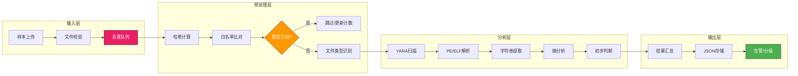

## 24.3 自动化分析技巧

### 24.3.1 自动化分析导论

#### 为什么需要自动化分析

恶意软件分析面临的现实挑战是**规模与速度的双重矛盾**。根据AV-TEST统计，2024年全球每日新增恶意软件样本超过45万个，而一个资深分析师在理想条件下，一天最多只能完成5-10个样本的深度分析。这意味着**手动分析一个样本的同时，有数万个样本在分析队列中等待**。自动化分析不是可选项，而是安全运营规模化运作的必要手段。

| 维度 | 手动分析 | 半自动分析 | 全自动分析 |
|------|---------|-----------|-----------|
| 样本吞吐量 | 5-10个/天/人 | 50-200个/天 | 10万+/天 |
| 单样本深度 | 极高 | 中等 | 基础-中等 |
| 分析一致性 | 因人而异 | 统一框架 | 完全一致 |
| 适用场景 | 新型威胁/APT溯源 | 已知变种识别 | 大规模筛选/分级 |
| 资源成本 | 最高 | 中等 | 最低 |

**自动化的核心价值体现在三个方面：**

- **规模化**：一台分析服务器可以在30分钟内完成数千个样本的初步研判，包含哈希比对、YARA扫描、PE结构分析、字符串提取和基础行为分类
- **标准化**：每一次分析的流程、参数、输出格式完全一致，可追溯、可审计、可比较
- **加速响应**：在应急响应场景中，自动化分析可以在样本上传后的60秒内给出初步判断，而人工分析至少需要15-30分钟

#### 自动化分析的适用范围

并非所有样本都适合全自动分析。高效的分析体系应该遵循**分级分类**原则，不同类型样本采用不同分析策略：

```text
                    ┌──────────────────────────────┐
                    │    未知复杂恶意软件           │
                    │  (APT样本/新型0Day/定制木马)  │
                    └──────────────┬───────────────┘
                                   │ 人工深度分析
                    ┌──────────────┴───────────────┐
                    │    已知家族变种               │
                    │  (勒索软件新变种/远控新版本)   │
                    └──────────────┬───────────────┘
                                   │ 半自动分析+人工复核
                    ┌──────────────┴───────────────┐
                    │    已知威胁批量样本            │
                    │  (已有YARA规则匹配/沙箱行为确认)│
                    └──────────────┬───────────────┘
                                   │ 全自动分析
                    ┌──────────────┴───────────────┐
                    │    大规模初筛样本              │
                    │  (每日海量上传/可疑文件预检)   │
                    └──────────────────────────────┘
                                   │ 自动化筛选
```

| 自动化层级 | 技术手段 | 人工介入 | 典型场景 |
|-----------|---------|---------|---------|
| 全自动分析（L1） | 哈希比对+YARA+白名单+文件类型检测 | 无需人工 | 已知文件识别/白名单过滤 |
| 自动研判（L2） | L1+PE分析+字符串+IOC提取+熵计算 | 每周复核规则 | 变种识别/恶意等级划分 |
| 半自动分析（L3） | L2+沙箱行为+网络模拟+代码相似度 | 人工确认结果 | 复杂样本分批研判 |
| 人工辅助（L4） | L3+全环境调试验证 | 主导分析 | APT样本/0Day分析 |

### 24.3.2 自动化分析管道架构

自动化分析不是单一脚本，而是一个**多阶段串联的分析管道（Pipeline）**。下图展示了一个典型自动化分析系统的架构：



**管道设计的关键原则：**

- **失败隔离**：每个阶段独立运行，一个阶段的失败不影响其他阶段
- **幂等性**：同一输入重复分析应得到相同结果（除动态沙箱外）
- **可追溯**：每个样本的分析链条完整记录，便于复盘
- **渐近式**：先做快速低成本的检测，再做资源消耗大的分析

#### 去重与白名单

自动化分析系统的第一关是去重。95%以上的"新"样本实际上是已有样本的微调版本，可以通过以下方式过滤：

```python
import hashlib
import sqlite3
from pathlib import Path

class SampleDeduplicator:
    """样本去重与白名单过滤"""

    KNOWN_HASHES = {
        # 常见系统文件哈希白名单（实际应维护数据库）
        "e3b0c44298fc1c149afbf4c8996fb92427ae41e4649b934ca495991b7852b855": "空的",
        "01ba4719c80b6fe911b091a7c05124b64eeece964e09c058ef8f9805daca546b": "已知工具",
    }

    def __init__(self, db_path: str = "analysis_cache.db"):
        self.db_path = db_path
        self._init_db()

    def _init_db(self):
        with sqlite3.connect(self.db_path) as conn:
            conn.execute("""
                CREATE TABLE IF NOT EXISTS sample_cache (
                    sha256 TEXT PRIMARY KEY,
                    first_seen TEXT,
                    last_seen TEXT,
                    analysis_result TEXT,
                    is_known_good INTEGER DEFAULT 0
                )
            """)

    def check_sample(self, filepath: str) -> dict:
        """检查样本是否已分析过"""
        with open(filepath, "rb") as f:
            sha256 = hashlib.sha256(f.read()).hexdigest()

        # 硬编码白名单检查
        if sha256 in self.KNOWN_HASHES:
            return {"status": "known_good", "reason": self.KNOWN_HASHES[sha256]}

        # 数据库缓存检查
        with sqlite3.connect(self.db_path) as conn:
            cursor = conn.execute(
                "SELECT analysis_result FROM sample_cache WHERE sha256 = ?", (sha256,)
            )
            row = cursor.fetchone()
            if row:
                return {"status": "cached", "analysis": row[0]}

        return {"status": "new", "sha256": sha256}
```

### 24.3.3 自动化YARA扫描集成

虽然24.4节会深入讲解YARA规则的编写，但这里需要掌握的是**如何将YARA引擎集成到自动化分析管道中**。

#### Python YARA引擎集成

```python
import yara
import os
from pathlib import Path
from typing import List, Dict

class YaraScanner:
    """YARA扫描引擎封装"""

    def __init__(self, rules_dir: str = "/etc/yara/rules"):
        self.rules_dir = Path(rules_dir)
        self.compiled_rules = {}
        self._load_rules()

    def _load_rules(self):
        """加载并编译所有YARA规则文件"""
        for yar_file in self.rules_dir.glob("**/*.yar"):
            try:
                # 按类别分组编译，便于后续分类统计
                category = yar_file.parent.name
                rules = yara.compile(filepath=str(yar_file))
                self.compiled_rules[category] = {
                    "rules": rules,
                    "filepath": str(yar_file),
                    "category": category,
                }
                print(f"[✓] Loaded rules from {yar_file}")
            except yara.SyntaxError as e:
                print(f"[✗] Syntax error in {yar_file}: {e}")
            except Exception as e:
                print(f"[✗] Failed to load {yar_file}: {e}")

    def scan_file(self, filepath: str) -> Dict[str, List]:
        """单文件多规则组扫描"""
        results = {}
        for category, rule_group in self.compiled_rules.items():
            try:
                matches = rule_group["rules"].match(filepath)
                if matches:
                    results[category] = [
                        {"rule": str(m), "namespace": m.namespace}
                        for m in matches
                    ]
            except Exception as e:
                results[category] = [{"error": str(e)}]
        return results

    def scan_batch(self, file_list: List[str]) -> List[Dict]:
        """批量扫描"""
        batch_results = []
        for filepath in file_list:
            matches = self.scan_file(filepath)
            if any(matches.values()):  # 只输出有匹配的结果
                batch_results.append({
                    "file": filepath,
                    "matches": matches,
                    "match_count": sum(len(v) for v in matches.values()),
                })
        return batch_results
```

#### YARA扫描策略

自动化系统中的YARA扫描不是简单的"匹配/不匹配"，需要根据规则类型制定不同策略：

| 规则类型 | 优先级 | 误报率 | 触发后动作 | 示例 |
|---------|--------|--------|-----------|------|
| 精确签名 | 最高 | 极低 | 直接判定恶意 | CobaltStrike特定字节序列 |
| 行为特征 | 高 | 低 | 标记为可疑需确认 | 加密API+勒索字串组合 |
| 通用检测 | 中 | 中 | 加权计分后结合其他证据 | 反调试API调用检测 |
| 启发式 | 低 | 高 | 仅记录不告警 | 高熵区段检测 |

```python
def evaluate_yara_results(matches: Dict) -> dict:
    """基于YARA匹配结果计算威胁评分"""

    RULE_WEIGHTS = {
        "ransomware": 40,
        "rat": 35,
        "stealer": 30,
        "exploit": 25,
        "packer": 15,
        "generic": 10,
        "heuristic": 5,
    }

    total_score = 0
    matched_categories = 0
    all_rules = []

    for category, category_matches in matches.items():
        if category_matches and "error" not in category_matches[0]:
            matched_categories += 1
            weight = RULE_WEIGHTS.get(category, 5)
            total_score += weight * len(category_matches)
            all_rules.extend([m["rule"] for m in category_matches])

    # 多类别命中时叠加加分
    if matched_categories >= 3:
        total_score = int(total_score * 1.5)
    elif matched_categories >= 2:
        total_score = int(total_score * 1.2)

    return {
        "score": min(total_score, 100),
        "matched_rules": all_rules,
        "matched_categories": matched_categories,
        "verdict": "malicious" if total_score >= 50 else "suspicious" if total_score >= 20 else "clean",
    }
```

### 24.3.4 自动化字符串分析与IOC提取

字符串分析是自动化分析中最实用也最高性价比的技术。一个规范的自动化字符串提取模块可以大幅提升分析师的工作效率。

#### IOC模式定义与提取

```python
import re
from typing import List, Set, Dict

class IOCExtractor:
    """自动化IOC提取器"""

    # IOC正则模式定义
    IOC_PATTERNS = {
        "ipv4": re.compile(
            r"\b(?:(?:25[0-5]|2[0-4]\d|[01]?\d\d?)\.){3}"
            r"(?:25[0-5]|2[0-4]\d|[01]?\d\d?)\b"
        ),
        "domain": re.compile(
            r"\b(?:[a-zA-Z0-9](?:[a-zA-Z0-9-]{0,61}[a-zA-Z0-9])?\.)"
            r"+[a-zA-Z]{2,}\b"
        ),
        "url": re.compile(
            r"https?://[^\s\"'<>(){}|\\^`\[\]]+"
        ),
        "email": re.compile(
            r"\b[A-Za-z0-9._%+-]+@[A-Za-z0-9.-]+\.[A-Za-z]{2,}\b"
        ),
        "filepath": re.compile(
            r"[A-Za-z]:(?:\\[^\s:/\\|<>\"*?]+)+"
            r"|/usr/[^\s]+|/etc/[^\s]+|/var/[^\s]+|/tmp/[^\s]+"
        ),
        "registry": re.compile(
            r"HKEY_[A-Z_]+\\[A-Za-z0-9_\\]+"
        ),
        "mutex": re.compile(
            r"(?:Global|Local|Session)\\[A-Za-z0-9_\-]+"
            r"|[A-Za-z0-9_\-]{8,40}(?<!\.exe)(?<!\.dll)"
        ),
        "ipv6": re.compile(
            r"\b(?:[a-fA-F0-9]{1,4}:){7}[a-fA-F0-9]{1,4}\b"
            r"|\b(?:[a-fA-F0-9]{1,4}:){1,7}:"
            r"|\b(?:[a-fA-F0-9]{1,4}:){1,6}:[a-fA-F0-9]{1,4}\b"
        ),
    }

    # 常见白名单域名（内部部署、已知安全域名）
    WHITELIST_DOMAINS = {
        "microsoft.com", "windows.com", "google.com",
        "apple.com", "github.com", "cloudflare.com",
        "localhost", "example.com",
    }

    def __init__(self, min_string_length: int = 6):
        self.min_length = min_string_length

    def extract_from_binary(self, data: bytes) -> dict:
        """从二进制数据中提取IOC"""

        # 提取可打印字符串
        strings = self._extract_strings(data)

        # 分类提取各类IOC
        iocs = {
            "ipv4": set(),
            "ipv6": set(),
            "domains": set(),
            "urls": set(),
            "emails": set(),
            "filepaths": set(),
            "registry_keys": set(),
            "mutexes": set(),
        }

        for s in strings:
            for ioc_type, pattern in self.IOC_PATTERNS.items():
                matches = pattern.findall(s)
                for m in matches:
                    # 域名白名单过滤
                    if ioc_type == "domain":
                        domain = m.lower()
                        if any(domain.endswith(wl) for wl in self.WHITELIST_DOMAINS):
                            continue

                    # 移除常见误报（IPv4中类似版本号的情况）
                    if ioc_type == "ipv4":
                        if self._is_false_positive_ip(m):
                            continue

                    iocs[ioc_type].add(m)

        # 转换为列表输出并统计
        result = {k: sorted(v) for k, v in iocs.items() if v}
        result["_stats"] = {
            "total_strings": len(strings),
            "total_iocs": sum(len(v) for v in iocs.values()),
        }

        return result

    def _extract_strings(self, data: bytes) -> List[str]:
        """从二进制数据中提取连续可打印字符串"""
        strings = []
        current = []

        for byte in data:
            if 32 <= byte <= 126:  # 可打印ASCII
                current.append(chr(byte))
            else:
                if len(current) >= self.min_length:
                    strings.append("".join(current))
                current = []

        if len(current) >= self.min_length:
            strings.append("".join(current))

        return strings

    def _is_false_positive_ip(self, ip: str) -> bool:
        """判断IP是否为常见误报（版本号、纯数字序列等）"""
        # 版本号模式：major.minor.patch.build
        parts = ip.split(".")
        if len(parts) != 4:
            return False
        # 所有段都小于等于255（已满足），但检查是否存在255以上的版本号段
        # 实际误报判断需要更多上下文
        return False
```

#### IOC可信度评分

不是所有IOC都价值相同，自动化系统应该对提取的IOC进行可信度分级：

| IOC类型 | 可信度 | 说明 |
|---------|--------|------|
| 硬编码IPv4地址 | 高 | 恶意软件中的硬编码C2地址很少来自正常应用 |
| 自定义域名 | 中高 | 需要结合注册日期、DNS解析等外部数据验证 |
| 文件路径 | 中 | 系统目录路径较可疑，临时目录路径价值较低 |
| URL | 中 | HTTP/HTTPS URL需要确认目标是否活跃 |
| 注册表键 | 中低 | 持久化注册表键可能是软件的正常配置 |
| 邮箱地址 | 低 | 恶意软件中嵌入邮箱的场景较少，需额外验证 |
| 互斥量 | 低 | 很多正常软件也使用互斥量 |

### 24.3.5 PE/ELF解析自动化

对Windows PE文件和Linux ELF文件的自动化解析是静态分析的核心环节。以下代码展示一个增强版的PE解析模块，它能自动识别加壳、异常结构和可疑特性：

```python
import pefile
import struct
from typing import Dict, Any

class PEAnalyzer:
    """自动化PE文件分析器"""

    PACKER_SIGNATURES = {
        "UPX": [b"UPX0", b"UPX1", b"UPX!"],
        "MPRESS": [b"MPRESS"],
        "VMProtect": [b"VMPROTECT"],
        "Themida": [b"THEMIDA", b"WINLICENSE"],
        "ASPack": [b"ASPack"],
        "Armadillo": [b"Armadillo"],
        "Enigma": [b"EnigmaVB"],
    }

    SUSPICIOUS_SECTION_FLAGS = {
        "writable_executable": 0xE0000020,  # IMAGE_SCN_MEM_EXECUTE | IMAGE_SCN_MEM_WRITE | IMAGE_SCN_MEM_READ
        "executable_code": 0x20000020,      # IMAGE_SCN_MEM_EXECUTE | IMAGE_SCN_MEM_READ
    }

    def __init__(self, filepath: str):
        self.filepath = filepath
        self.pe = None
        self.anomalies = []

    def analyze(self) -> Dict[str, Any]:
        """执行完整的PE自动分析"""
        try:
            self.pe = pefile.PE(self.filepath)
        except Exception as e:
            return {"error": f"Invalid PE file: {e}", "is_pe": False}

        return {
            "is_pe": True,
            "header": self._analyze_header(),
            "sections": self._analyze_sections(),
            "imports": self._analyze_imports(),
            "exports": self._analyze_exports(),
            "resources": self._analyze_resources(),
            "packer": self._detect_packer(),
            "anomalies": self.anomalies,
            "timestr": self._analyze_timestamp(),
            "rich_header": self._check_rich_header(),
        }

    def _analyze_sections(self) -> List[Dict]:
        """分析节区表，标记异常"""
        section_results = []
        for section in self.pe.sections:
            sec_info = {
                "name": section.Name.decode("utf-8", errors="ignore").strip("\x00"),
                "virtual_address": hex(section.VirtualAddress),
                "virtual_size": section.Misc_VirtualSize,
                "raw_size": section.SizeOfRawData,
                "entropy": round(section.get_entropy(), 3),
                "characteristics": hex(section.Characteristics),
            }

            # 标记可写可执行节区（可疑）
            if section.Characteristics & 0x20000000 and section.Characteristics & 0x80000000:
                self.anomalies.append(
                    f"节区 {sec_info['name']} 同时具有可写和可执行权限"
                )

            # 标记高熵节区（可能加壳或加密）
            if sec_info["entropy"] > 7.0:
                self.anomalies.append(
                    f"节区 {sec_info['name']} 熵值 {sec_info['entropy']} 异常偏高，可能加壳或加密"
                )

            # 标记虚拟大小远大于原始大小（可能被拉伸）
            if sec_info["virtual_size"] > sec_info["raw_size"] * 3 and sec_info["raw_size"] > 0:
                self.anomalies.append(
                    f"节区 {sec_info['name']} 虚拟大小({sec_info['virtual_size']})远大于原始大小({sec_info['raw_size']})"
                )

            section_results.append(sec_info)

        return section_results

    def _analyze_imports(self) -> Dict:
        """分析导入表，识别可疑API调用"""
        suspicious_apis = {
            "进程操作": ["CreateProcess", "CreateRemoteThread", "WriteProcessMemory",
                       "OpenProcess", "VirtualAllocEx", "SetWindowsHookEx"],
            "文件操作": ["DeleteFile", "MoveFile", "CopyFile", "CreateFile"],
            "网络通信": ["socket", "connect", "send", "recv", "WSASocket", "bind", "listen"],
            "加密操作": ["CryptEncrypt", "CryptDecrypt", "CryptGenKey", "BCryptEncrypt"],
            "注册表操作": ["RegCreateKey", "RegSetValue", "RegDeleteKey"],
            "服务操作": ["CreateService", "OpenSCManager", "StartService"],
            "隐蔽操作": ["HideCursor", "ShowWindow", "SetWindowDisplayAffinity"],
            "信息收集": ["GetComputerName", "GetUserName", "GetAdaptersInfo",
                       "GetSystemInfo", "GetTickCount"],
        }

        imports = {}
        suspicious_calls = {}

        if hasattr(self.pe, "DIRECTORY_ENTRY_IMPORT"):
            for entry in self.pe.DIRECTORY_ENTRY_IMPORT:
                dll_name = entry.dll.decode("utf-8", errors="ignore")
                funcs = []
                for imp in entry.imports:
                    if imp.name:
                        func_name = imp.name.decode("utf-8", errors="ignore")
                        funcs.append(func_name)

                        # 检查是否匹配可疑API分类
                        for category, apis in suspicious_apis.items():
                            if func_name in apis:
                                if category not in suspicious_calls:
                                    suspicious_calls[category] = []
                                suspicious_calls[category].append(func_name)
                imports[dll_name] = funcs

        return {
            "all_imports": imports,
            "suspicious_calls": suspicious_calls,
            "suspicious_count": sum(len(v) for v in suspicious_calls.values()),
        }

    def _detect_packer(self) -> Dict:
        """检测加壳工具"""
        if not self.pe:
            return {"packed": False}

        # 方法1：节区名称检测
        section_names = []
        for section in self.pe.sections:
            name = section.Name.decode("utf-8", errors="ignore").strip("\x00")
            section_names.append(name)

        for packer, sigs in self.PACKER_SIGNATURES.items():
            for sig in sigs:
                try:
                    if sig in section_names:
                        return {"packed": True, "packer": packer, "method": "section_name"}
                except:
                    pass

        # 方法2：熵值检测
        avg_entropy = 0
        if self.pe.sections:
            total_entropy = sum(s.get_entropy() for s in self.pe.sections)
            avg_entropy = total_entropy / len(self.pe.sections)

        if avg_entropy > 7.0:
            return {"packed": True, "packer": "unknown", "method": "high_entropy",
                    "avg_entropy": round(avg_entropy, 3)}

        # 方法3：导入表异常（加壳样本通常导入表很少）
        import_count = 0
        if hasattr(self.pe, "DIRECTORY_ENTRY_IMPORT"):
            for entry in self.pe.DIRECTORY_ENTRY_IMPORT:
                import_count += len(entry.imports)

        if import_count < 5 and avg_entropy > 6.5:
            return {"packed": True, "packer": "unknown", "method": "low_imports_high_entropy",
                    "import_count": import_count, "avg_entropy": round(avg_entropy, 3)}

        return {"packed": False, "confidence": "clean"}

    def _analyze_timestamp(self) -> Dict:
        """分析编译时间戳"""
        if self.pe.FILE_HEADER.TimeDateStamp == 0:
            return {"valid": False, "note": "时间戳为0，可能被篡改"}
        return {
            "valid": True,
            "timestamp": self.pe.FILE_HEADER.TimeDateStamp,
        }

    def _check_rich_header(self) -> Dict:
        """检查Rich Header（编译器指纹）"""
        try:
            offset = self.pe.get_data(self.pe.DOS_HEADER.e_lfanew - 128, 128)
            rich_pos = offset.find(b"Rich")
            if rich_pos >= 0:
                return {"present": True, "offset": hex(rich_pos)}
            return {"present": False, "note": "无Rich Header"}
        except:
            return {"present": False, "note": "无法解析"}

    def _analyze_header(self) -> Dict:
        return {
            "entry_point": hex(self.pe.OPTIONAL_HEADER.AddressOfEntryPoint),
            "image_base": hex(self.pe.OPTIONAL_HEADER.ImageBase),
            "subsystem": self.pe.OPTIONAL_HEADER.Subsystem,
            "dll_characteristics": hex(self.pe.OPTIONAL_HEADER.DllCharacteristics),
        }

    def _analyze_exports(self) -> List:
        if hasattr(self.pe, "DIRECTORY_ENTRY_EXPORT"):
            return [exp.name.decode("utf-8", errors="ignore")
                    for exp in self.pe.DIRECTORY_ENTRY_EXPORT.symbols if exp.name]
        return []

    def _analyze_resources(self) -> Dict:
        if not hasattr(self.pe, "DIRECTORY_ENTRY_RESOURCE"):
            return {"present": False}
        resources = []
        try:
            for entry in self.pe.DIRECTORY_ENTRY_RESOURCE.entries:
                if hasattr(entry, "directory"):
                    for subentry in entry.directory.entries:
                        resources.append({
                            "type": entry.name if entry.name else f"ID:{entry.id}",
                            "size": getattr(subentry.data, "struct", None) and
                                    subentry.data.struct.Size,
                        })
        except:
            pass
        return {"present": bool(resources), "entries": resources}
```

### 24.3.6 自动化决策引擎

自动化分析的最终目的是**做出判断**——这个样本是恶意、可疑还是安全。单一检测方法的误报率较高，多种检测手段综合评分的可靠性远高于单因子判断。

#### 加权评分模型

```python
class MalwareScorer:
    """基于多维度证据的综合威胁评分引擎"""

    WEIGHTS = {
        "yara_match": 30,        # YARA规则匹配
        "packer_detected": 20,   # 检测到加壳
        "suspicious_imports": 25, # 可疑API调用
        "high_entropy": 10,      # 高熵区段
        "anomalous_sections": 10, # 异常节区
        "suspicious_iocs": 15,   # 可疑IOC
        "rich_header": 5,        # Rich Header异常
        "timestamp_anomaly": 5,  # 时间戳异常
    }

    # 各维度的评分函数
    SCORE_FUNCTIONS = {
        "yara_match": lambda v: min(v * 15, 30),           # 每个匹配规则15分，上限30
        "packer_detected": lambda v: 20 if v else 0,
        "suspicious_imports": lambda v: min(v * 5, 25),    # 每个可疑API 5分，上限25
        "high_entropy": lambda v: min(v * 3, 10),          # 每个高熵区段3分
        "anomalous_sections": lambda v: min(v * 5, 10),    # 每个异常5分
        "suspicious_iocs": lambda v: min(len(v) * 3, 15),  # 每个可疑IOC 3分
        "rich_header": lambda v: 5 if v.get("present") else 0,
        "timestamp_anomaly": lambda v: 5 if not v.get("valid") else 0,
    }

    def score(self, analysis_result: Dict) -> Dict:
        """计算综合威胁评分"""
        scores = {}
        total = 0

        for dimension, score_fn in self.SCORE_FUNCTIONS.items():
            if dimension in analysis_result:
                value = analysis_result[dimension]
                dim_score = score_fn(value)
                scores[dimension] = {
                    "value": value,
                    "score": dim_score,
                    "weight": self.WEIGHTS.get(dimension, 0),
                }
                total += dim_score

        # 判定阈值（可调）
        if total >= 60:
            verdict = "malicious"
        elif total >= 30:
            verdict = "suspicious"
        elif total >= 10:
            verdict = "low_risk"
        else:
            verdict = "clean"

        return {
            "total_score": total,
            "verdict": verdict,
            "dimension_scores": scores,
            "recommendation": self._get_recommendation(verdict),
        }

    def _get_recommendation(self, verdict: str) -> str:
        """根据判定结果给出建议"""
        recommendations = {
            "malicious": "立即隔离样本，启动应急响应流程，关联分析同批次样本",
            "suspicious": "加入分析队列，优先级高，人工复核自动分析结果",
            "low_risk": "标记观察，30天后无告警自动归档",
            "clean": "加入白名单缓存，下次命中直接跳过",
        }
        return recommendations.get(verdict, "无建议")
```

#### 分级响应策略

不同威胁等级的样本应触发不同级别的响应动作：

```python
def routing_decision(scoring_result: Dict) -> str:
    """基于评分结果路由到不同的处理队列"""

    verdict = scoring_result["verdict"]
    score = scoring_result["total_score"]

    routes = {
        "malicious": "isolate_and_alert",   # 隔离告警
        "suspicious": "queue_for_review",    # 入人工审核队列
        "low_risk": "log_and_watch",         # 记录并观察
        "clean": "discard_or_cache",         # 丢弃或缓存
    }

    # 极端情况：分数超过90直接进入紧急处理
    if score >= 90:
        return "emergency_response"

    # 匹配多个恶意家族的情况
    if verdict == "malicious" and scoring_result.get("family_count", 0) >= 2:
        return "advanced_analysis"

    return routes.get(verdict, "queue_for_review")
```

### 24.3.7 自动化报告输出

自动化分析的输出应当机器可读（便于下游系统消费）和人可读（便于分析人员快速浏览）兼顾。

#### 标准自动化报告结构

```python
import json
from datetime import datetime
from typing import Dict, Any

class AnalysisReport:
    """标准化分析报告生成器"""

    def __init__(self, filepath: str):
        self.filepath = filepath
        self.timestamp = datetime.utcnow().isoformat() + "Z"
        self.sections = {}

    def set_basic_info(self, info: Dict):
        self.sections["basic_info"] = {
            "filename": info.get("filename", "unknown"),
            "filepath": self.filepath,
            "file_size": info.get("size", 0),
            "file_type": info.get("file_type", "unknown"),
            "md5": info.get("md5", ""),
            "sha1": info.get("sha1", ""),
            "sha256": info.get("sha256", ""),
            "analysis_time": self.timestamp,
        }

    def set_pe_analysis(self, pe_result: Dict):
        self.sections["pe_analysis"] = {
            "is_valid_pe": pe_result.get("is_pe", False),
            "entry_point": pe_result.get("header", {}).get("entry_point"),
            "image_base": pe_result.get("header", {}).get("image_base"),
            "sections": pe_result.get("sections", []),
            "packer": pe_result.get("packer", {}),
            "suspicious_imports": pe_result.get("imports", {}).get("suspicious_calls", {}),
            "anomalies": pe_result.get("anomalies", []),
        }

    def set_yara_results(self, yara_result: Dict):
        self.sections["yara_analysis"] = {
            "total_matches": sum(len(v) for v in yara_result.values()),
            "categories_matched": list(yara_result.keys()),
            "details": yara_result,
        }

    def set_ioc_results(self, ioc_result: Dict):
        stats = ioc_result.pop("_stats", {})
        self.sections["ioc_extraction"] = {
            "total_strings_analyzed": stats.get("total_strings", 0),
            "total_iocs": stats.get("total_iocs", 0),
            "iocs": {k: v[:20] for k, v in ioc_result.items()},  # 限制数量
            "ioc_count_by_type": {k: len(v) for k, v in ioc_result.items()},
        }

    def set_scoring(self, scoring_result: Dict):
        self.sections["threat_scoring"] = scoring_result

    def to_json(self, indent: int = 2) -> str:
        """输出为JSON格式（机器可读）"""
        return json.dumps(self.sections, indent=indent, ensure_ascii=False)

    def to_summary(self) -> str:
        """输出人类可读的摘要"""
        basic = self.sections.get("basic_info", {})
        scoring = self.sections.get("threat_scoring", {})

        lines = [
            f"━━━ 自动化分析报告 ━━━",
            f"文件: {basic.get('filename', 'N/A')}",
            f"SHA256: {basic.get('sha256', 'N/A')[:16]}...",
            f"大小: {basic.get('file_size', 0)} bytes",
            f"━━━ 判定结果 ━━━",
            f"威胁等级: {scoring.get('verdict', 'unknown')}",
            f"综合评分: {scoring.get('total_score', 0)}/100",
            f"━━━ 分析概要 ━━━",
        ]

        pe = self.sections.get("pe_analysis", {})
        if pe.get("is_valid_pe"):
            packer = pe.get("packer", {})
            if packer.get("packed"):
                lines.append(f"加壳检测: {packer.get('packer', '未知')}")
            anomalies = pe.get("anomalies", [])
            if anomalies:
                lines.append(f"异常项: {len(anomalies)} 项")
                for a in anomalies[:3]:
                    lines.append(f"  ⚠ {a}")
            imports = pe.get("suspicious_imports", {})
            if imports:
                total = sum(len(v) for v in imports.values())
                lines.append(f"可疑API: {total} 个调用")

        yara = self.sections.get("yara_analysis", {})
        if yara.get("total_matches", 0) > 0:
            lines.append(f"YARA匹配: {yara['total_matches']} 条规则")
            lines.append(f"  分类: {', '.join(yara.get('categories_matched', []))}")

        iocs = self.sections.get("ioc_extraction", {})
        if iocs.get("total_iocs", 0) > 0:
            lines.append(f"IOC提取: {iocs['total_iocs']} 个指标")
            for ioc_type, count in iocs.get("ioc_count_by_type", {}).items():
                if count > 0:
                    lines.append(f"  {ioc_type}: {count} 个")

        return "\n".join(lines)

    def to_stix(self) -> Dict:
        """输出为STIX格式（威胁情报交换）"""
        return {
            "type": "indicator",
            "spec_version": "2.1",
            "created": self.timestamp,
            "modified": self.timestamp,
            "name": f"Automated analysis of {self.sections.get('basic_info', {}).get('filename', 'unknown')}",
            "pattern": self._generate_stix_pattern(),
            "pattern_type": "stix",
            "valid_from": self.timestamp,
        }

    def _generate_stix_pattern(self) -> str:
        """生成STIX模式表达式"""
        basic = self.sections.get("basic_info", {})
        patterns = []
        sha256 = basic.get("sha256", "")
        if sha256:
            patterns.append(f"[file:hashes.'SHA-256' = '{sha256}']")
        return " OR ".join(patterns) if patterns else ""
```

### 24.3.8 完整自动化分析管道示例

以下代码将前述所有模块整合为一个完整的自动化分析管道：

```python
#!/usr/bin/env python3
"""
AutoAnalyzer v1.0 - 恶意软件自动化分析管道
用法: python auto_analyzer.py <file_or_directory>
"""

import os
import sys
import json
from pathlib import Path

class AutoAnalyzer:
    """自动化分析管道主类"""

    def __init__(self, rules_dir: str = "/etc/yara/rules"):
        self.deduplicator = SampleDeduplicator()
        self.yara_scanner = YaraScanner(rules_dir)
        self.ioc_extractor = IOCExtractor()
        self.scorer = MalwareScorer()

    def analyze(self, filepath: str) -> Dict:
        """对单个文件执行完整自动化分析"""

        result = {"filepath": filepath, "analysis_timestamp": datetime.utcnow().isoformat()}

        # 第一步：去重
        dedup = self.deduplicator.check_sample(filepath)
        if dedup["status"] in ("known_good", "cached"):
            result["dedup_status"] = dedup["status"]
            result["dedup_skip"] = True
            return result

        with open(filepath, "rb") as f:
            data = f.read()

        # 第二步：哈希计算
        result.update(self._compute_hashes(data))

        # 第三步：YARA扫描
        yara_result = self.yara_scanner.scan_file(filepath)
        result["yara_analysis"] = yara_result

        # 第四步：PE分析
        pe_analyzer = PEAnalyzer(filepath)
        pe_result = pe_analyzer.analyze()
        result["pe_analysis"] = pe_result

        # 第五步：IOC提取
        ioc_result = self.ioc_extractor.extract_from_binary(data)
        result["ioc_analysis"] = ioc_result

        # 第六步：综合评分
        scoring_input = {
            "yara_match": len([m for cats in yara_result.values() for m in cats]),
            "packer_detected": pe_result.get("packer", {}).get("packed", False),
            "suspicious_imports": pe_result.get("imports", {}).get("suspicious_count", 0),
            "high_entropy": sum(1 for s in pe_result.get("sections", []) if s.get("entropy", 0) > 7.0),
            "anomalous_sections": len(pe_result.get("anomalies", [])),
            "suspicious_iocs": ioc_result.get("ipv4", []),
            "rich_header": pe_result.get("rich_header", {}),
            "timestamp_anomaly": pe_result.get("timestr", {}),
            "family_count": len(yara_result),
        }
        scoring_result = self.scorer.score(scoring_input)
        result["threat_assessment"] = scoring_result

        return result

    def _compute_hashes(self, data: bytes) -> Dict:
        import hashlib
        return {
            "md5": hashlib.md5(data).hexdigest(),
            "sha1": hashlib.sha1(data).hexdigest(),
            "sha256": hashlib.sha256(data).hexdigest(),
        }

    def analyze_directory(self, directory: str, output_file: str = "auto_analysis.json"):
        """批量分析目录中的所有文件"""
        directory = Path(directory)
        results = []

        for filepath in sorted(directory.iterdir()):
            if filepath.is_file():
                try:
                    print(f"[→] Analyzing: {filepath.name}...", end=" ")
                    result = self.analyze(str(filepath))
                    results.append(result)
                    verdict = result.get("threat_assessment", {}).get("verdict", "unknown")
                    print(f"[{verdict.upper()}]")
                except Exception as e:
                    print(f"[ERROR] {e}")

        # 保存结果
        with open(output_file, "w") as f:
            json.dump(results, f, indent=2, ensure_ascii=False)

        print(f"\n[✓] 分析完成: {len(results)} 个样本")
        print(f"[✓] 结果已保存: {output_file}")
        return results


if __name__ == "__main__":
    if len(sys.argv) < 2:
        print("用法: python auto_analyzer.py <文件或目录>")
        sys.exit(1)

    target = sys.argv[1]
    analyzer = AutoAnalyzer()

    if os.path.isfile(target):
        result = analyzer.analyze(target)
        report = AnalysisReport(target)
        report.set_basic_info(result)
        report.set_pe_analysis(result.get("pe_analysis", {}))
        report.set_yara_results(result.get("yara_analysis", {}))
        report.set_ioc_results(result.get("ioc_analysis", {}))
        report.set_scoring(result.get("threat_assessment", {}))
        print(report.to_summary())
    elif os.path.isdir(target):
        analyzer.analyze_directory(target)
```

### 24.3.9 自动化分析常见误区与优化

#### 常见误区

| 误区 | 错误做法 | 正确做法 |
|------|---------|---------|
| 过度依赖单一规则 | 只要YARA匹配就判定恶意 | 多维度证据综合评分 |
| 忽视误报管理 | 从不复核自动化结果 | 建立误报反馈闭环 |
| 忽略样本老化 | 长期不更新YARA规则 | 每周同步威胁情报更新规则 |
| 管道无容错 | 任何阶段失败都导致整个任务失败 | 每个阶段独立捕获异常 |
| 缺乏性能监控 | 不关注吞吐量和延迟 | 监控每小时处理量和平均耗时 |

#### 性能优化建议

1. **并行处理**：Python的`concurrent.futures`或`multiprocessing`可以将单线程的YARA扫描速度提升5-10倍
2. **缓存热点数据**：频繁使用的YARA规则编译一次后应缓存到内存，避免每次扫描重新编译
3. **分级调度**：先做最便宜的分析（哈希比对），再做中等成本的分析（YARA），最后做高成本分析（PE解析）
4. **限制输出大小**：IOC提取和字符串分析可以设置数量上限，防止超大样本导致内存溢出
5. **使用SQLite缓存**：已经分析过的样本直接读取缓存，不再重复执行分析流程

```python
# 并行扫描示例
from concurrent.futures import ThreadPoolExecutor, as_completed

def parallel_scan(file_list, scanner, max_workers=8):
    """使用线程池并行执行YARA扫描"""
    results = {}
    with ThreadPoolExecutor(max_workers=max_workers) as executor:
        future_to_file = {
            executor.submit(scanner.scan_file, f): f
            for f in file_list
        }
        for future in as_completed(future_to_file):
            filepath = future_to_file[future]
            try:
                results[filepath] = future.result()
            except Exception as e:
                results[filepath] = {"error": str(e)}
    return results
```

### 24.3.10 自动化与人工分析的协作

自动化分析不是替代人工，而是**为人工分析提供高价值的起点**。有效的协作模式如下：

```text
                ┌──────────────────────────────┐
                │    样本流入                   │
                │  (邮件/上传/SIEM告警/蜜罐)     │
                └──────────────┬───────────────┘
                               ▼
                ┌──────────────────────────────┐
                │    自动化管道初筛             │
                │  (15-60秒完成)                │
                └──────────────┬───────────────┘
                               ▼
                ┌──────────────────────────────┐
                │    判定分发                   │
                │                              │
                │  clean → 丢弃/缓存            │
                │  low_risk → 周报汇总           │
                │  suspicious → 分析师队列       │
                │  malicious → 应急队列          │
                └──────────────┬───────────────┘
                               ▼
                ┌──────────────────────────────┐
                │    人工深度分析               │
                │  - 验证自动分析结论            │
                │  - 补充人工调试验证            │
                │  - 完善IOC/TTP提取            │
                │  - 更新YARA检测规则            │
                └──────────────┬───────────────┘
                               ▼
                ┌──────────────────────────────┐
                │    反馈循环                   │
                │  - 误报样本 -> 白名单         │
                │  - 新特征 -> 更新YARA规则     │
                │  - 评分偏差 -> 校准权重       │
                └──────────────────────────────┘
```

**一个高效的安全运营团队，其自动化管道应该能处理95%以上的常规样本，让分析师的精力集中在那5%的真正威胁上。** 反过来，分析师在深度分析中发现的新IOC和检测规则，应反哺到自动化管道中，形成持续进化的正向循环。

### 本章小结

自动化分析技巧是现代安全运营能力的基石，也是从初级分析师向高级安全工程师进阶的必经之路。核心要点如下：

1. **分层构建**：从最基础的哈希比对开始，逐步叠加YARA扫描、PE解析、IOC提取和评分引擎
2. **证据融合**：单一检测手段不可靠，多维度交叉验证才是自动化分析的基石
3. **关注误报**：自动化的最大敌人不是漏报而是误报，务必建立反馈闭环
4. **机器+人工**：自动化处理常规样本，人工聚焦高级威胁，两者互补而非替代
5. **持续迭代**：每次分析都是改进规则和校准参数的机会，将人工分析成果沉淀到自动化系统中

完成本章后，请继续阅读"24.4 YARA规则高级编写"深入学习YARA规则的语法和实战技巧，以及"24.6 批量分析与自动化工作流"了解如何将本章的技术组件组装为完整的分析流水线。