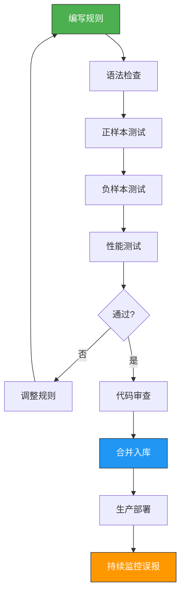

## 24.4 YARA规则高级编写

YARA是恶意软件分析领域的"瑞士军刀"——它是一种模式匹配语言，允许分析师定义恶意软件的特征签名，并在文件、进程内存或网络流量中高效搜索匹配这些特征的内容。由VirusTotal的创始人Vicente Martí于2008年开发，YARA已成为全球恶意软件分析师、威胁情报团队和安全运营中心（SOC）的标准工具。

掌握YARA规则的编写，不仅是恶意软件分析的核心技能，更是从"被动分析"转向"主动狩猎"的关键——通过编写高质量的YARA规则，分析师可以在海量样本中快速识别已知威胁，发现未知变种，构建自动化检测流水线。

```mermaid
graph TD
    A[YARA规则编写] --> B[基础语法]
    A --> C[条件表达式]
    A --> D[模块系统]
    A --> E[规则工程]

    B --> B1[字符串定义]
    B --> B2[修饰符组合]
    B --> B3[元数据规范]

    C --> C1[逻辑运算]
    C --> C2[量化表达式]
    C --> C3[位置与偏移]
    C --> C4[迭代器]

    D --> D1[pe模块]
    D --> D2[elf模块]
    D --> D3[math模块]
    D --> D4[hash模块]
    D --> D5[magic模块]

    E --> E1[性能优化]
    E --> E2[误报管理]
    E --> E3[CI/CD集成]
    E --> E4[威胁情报整合]

    style A fill:#1a1a2e,stroke:#e94560,stroke-width:2px
    style B fill:#16213e,stroke:#0f3460
    style C fill:#16213e,stroke:#0f3460
    style D fill:#16213e,stroke:#0f3460
    style E fill:#16213e,stroke:#0f3460
```



### 24.4.1 YARA规则语法详解

#### YARA规则的三要素

每条YARA规则由三个核心部分组成：**meta（元数据）**、**strings（字符串模式）**和**condition（匹配条件）**。这三个部分协同工作，构成了规则的完整逻辑：元数据描述规则的背景信息，字符串定义要搜索的模式，条件规定这些模式如何组合才能判定为匹配。

```yara
rule RuleName {
    meta:
        description = "规则描述——清晰说明这条规则检测什么"
        author = "作者名"
        date = "2024-01-15"
        hash = "样本SHA256哈希值"
        severity = "High"           // Low / Medium / High / Critical
        category = "malware"        // malware / exploit / packer / tool
        reference = "https://..."   // 情报来源链接
        mitre_attack = "T1059.001"  // MITRE ATT&CK映射
        tlp = "WHITE"              // TLP情报共享等级
        version = "1.0"            // 规则版本号
    
    strings:
        // 字符串定义——见下文详解
        $string1 = "text" ascii
        $string2 = "text" wide
        $string3 = "text" nocase
        $hex1 = { 90 90 90 90 }
        $hex2 = { 90 ?? 90 }
        $regex1 = /regex_pattern/i
    
    condition:
        // 匹配条件——见下文详解
        condition_expression
}
```

元数据（meta）部分虽然是可选的，但在生产环境中必不可少。它为规则提供上下文信息，便于团队协作、规则管理和追溯分析。建议至少包含以下元数据字段：`description`（规则描述）、`author`（作者）、`date`（日期）、`severity`（严重等级）、`reference`（情报来源）、`mitre_attack`（ATT&CK映射）。

#### 字符串定义与修饰符

YARA支持三种字符串类型：**纯文本字符串**、**十六进制模式**和**正则表达式**。每种类型都有各自的适用场景和修饰符。

```yara
rule StringTypes {
    strings:
        // ===== 纯文本字符串 =====
        // 最基础的匹配方式，用于匹配固定的文本内容
        $s1 = "hello" ascii           // 仅匹配ASCII编码（1字节/字符）
        $s2 = "hello" wide            // 仅匹配UTF-16LE编码（2字节/字符）
        $s3 = "hello" ascii wide      // 匹配ASCII或UTF-16LE任意一种
        $s4 = "hello" nocase          // 不区分大小写（Hello、HELLO都能匹配）
        $s5 = "hello" fullword        // 全词匹配（前后不能有其他字母数字）
        $s6 = "hello" private         // 匹配但不在输出中显示该字符串
        $s7 = "hello" base64          // YARA 4.x+：自动匹配Base64编码后的字符串
        $s8 = "hello" xor             // YARA 4.x+：匹配所有XOR密钥（0x00-0xFF）编码后的结果
        $s9 = "hello" xor(0x01-0x10)  // YARA 4.x+：只匹配指定范围的XOR密钥
        
        // 修饰符可以自由组合，但要注意逻辑冲突
        $s10 = "hello" ascii wide nocase   // ASCII或UTF-16，不区分大小写
        $s11 = "hello" xor(0x20) base64    // 先XOR编码再Base64编码（4.x+）
        
        // ===== 十六进制模式 =====
        // 用于匹配二进制数据、shellcode、文件头等
        $h1 = { 4D 5A }                   // 固定字节：PE文件头 "MZ"
        $h2 = { 4D ?? 5A }                // 单字节通配符：??匹配任意单字节
        $h3 = { 4D [2-4] 5A }             // 跳跃范围：[min-max]表示跳过2到4个字节
        $h4 = { 4D ( AA | BB | CC ) 5A }  // 或关系：匹配AA、BB或CC中的任意一个
        $h5 = { 4D 5A ~00 }               // YARA 4.x+：取反匹配（匹配非0x00的字节）
        
        // 复杂十六进制模式示例
        $h6 = { 
            55                          // push ebp
            8B EC                       // mov ebp, esp
            83 C4 ??                    // add esp, ??
            [0-3]                       // 跳过0到3个字节
            E8 ?? ?? ?? ??              // call（地址由链接器填充）
        }
        
        // ===== 正则表达式 =====
        // 用于匹配动态变化的模式
        $r1 = /http:\/\/[a-z]+\.(com|net|org)/ nocase
        $r2 = /[a-z0-9]{32}/                    // 匹配32位哈希值
        $r3 = /[A-Za-z0-9+\/]{100,}={0,2}/     // 匹配Base64编码块（长度>=100）
        $r4 = /\x55\x8B\xEC[\x00-\xFF]{0,10}\x83\xEC/  // 函数序言模式
    
    condition:
        any of them
}
```

**关于base64修饰符的深入说明**（YARA 4.x新增）：这是对抗混淆编码的重要武器。许多恶意软件使用Base64编码来隐藏敏感字符串（如PowerShell命令、URL、API密钥）。传统方法需要分析师手动解码再匹配，而base64修饰符让YARA自动处理三种编码形式：

- 标准Base64（`ABCDEFGHIJKLMNOPQRSTUVWXYZabcdefghijklmnopqrstuvwxyz0123456789+/`）
- Base64 with URL-safe alphabet（使用`-`和`_`替代`+`和`/`）
- 末尾padding有无的变体（`=`、`==`、无padding）

**关于xor修饰符的深入说明**（YARA 4.x新增）：XOR是最常见的字符串混淆技术——恶意软件将敏感字符串逐字节XOR一个固定密钥，运行时再用相同密钥解密。xor修饰符会自动尝试所有可能的密钥（默认0x00-0xFF，或指定范围），无需手动编写解密逻辑。

#### 十六进制模式的高级技巧

十六进制模式是编写高质量YARA规则的核心能力。以下是一些实战中常用的模式：

```yara
rule HexPatternsAdvanced {
    strings:
        // 1. 匹配CALL指令的不同实现
        // 近调用 E8 xx xx xx xx
        $call_near = { E8 ?? ?? ?? ?? }
        // 远调用 9A xx xx xx xx xx xx
        $call_far = { 9A ?? ?? ?? ?? ?? ?? }
        // 间接调用 FF 15 xx xx xx xx
        $call_indirect = { FF 15 ?? ?? ?? ?? }
        
        // 2. 匹配常见API哈希（用于动态API解析检测）
        // 恶意软件常用API哈希来避免静态导入表暴露
        // 示例：kernel32.dll中LoadLibraryA的hash计算模式
        $api_hash1 = { C1 C? 0D 03 C? 80 ?? ?? 85 C? }
        
        // 3. 匹配加密算法的常量
        // AES S-Box
        $aes_sbox = { 63 7C 77 7B F2 6B 6F C5 30 01 67 2B FE D7 AB 76 }
        // RC4初始化模式
        $rc4_init = { 8A ?? 03 ?? 88 ?? 41 81 F? 00 01 00 00 }
        
        // 4. 匹配shellcode的常见模式
        // 反向shell连接模式
        $reverse_shell = {
            6A 01                      // push 1 (SOCK_STREAM)
            6A 02                      // push 2 (AF_INET)
            FF D?                      // call socket()
            89 C?                      // mov ?, eax
            68 ?? ?? ?? ??             // push IP address
            68 02 00                   // push port
            66 68                      // push AF_INET
            89 E?                      // mov ?, esp
            6A 10                      // push 16 (sizeof sockaddr_in)
            5?                         // push sockaddr_in ptr
            5?                         // push socket fd
            FF D?                      // call connect()
        }
        
        // 5. 匹配进程注入的经典模式
        // VirtualAllocEx + WriteProcessMemory + CreateRemoteThread
        $inject_pattern = {
            6A 40                      // push PAGE_EXECUTE_READWRITE (0x40)
            68 00 ?? 00 00             // push size
            68 00 ?? 00 00             // push address
            5?                         // push hProcess
            FF 15 ?? ?? ?? ??          // call VirtualAllocEx
            85 C0                      // test eax, eax
            74 ??                      // je skip
            6A 00                      // push NULL
            68 ?? ?? ?? ??             // push size
            5?                         // push buffer
            5?                         // push address
            5?                         // push hProcess
            FF 15 ?? ?? ?? ??          // call WriteProcessMemory
        }
    
    condition:
        any of them
}
```

### 24.4.2 条件表达式高级用法

条件表达式是YARA规则的核心逻辑——它定义了字符串如何组合、在什么位置出现、出现多少次才算匹配。掌握条件表达式的高级用法，是从"能写规则"到"写好规则"的关键跨越。

#### 基础逻辑运算

```yara
rule BasicConditions {
    strings:
        $a = "malware"
        $b = "payload"
        $c = "encrypt"
        $d = { 4D 5A }
    
    condition:
        // 与：所有条件都必须满足
        $a and $b
        
        // 或：至少一个条件满足
        $a or $b
        
        // 非：条件不满足
        not $a
        
        // 复合逻辑：用括号控制优先级
        ($a and $b) or ($c and $d)
        $a and ($b or $c) and $d
}
```

#### 量化表达式

量化表达式是YARA条件系统中最强大的工具——它允许你指定"多少个字符串匹配才算命中"，而不是简单地要求"全部"或"任意"。

```yara
rule QuantifiedConditions {
    strings:
        $api1 = "CryptEncrypt"
        $api2 = "CryptGenKey"
        $api3 = "CryptAcquireContext"
        $api4 = "CryptExportKey"
        $api5 = "CryptDestroyKey"
        
        $ransom1 = "encrypted"
        $ransom2 = "bitcoin"
        $ransom3 = "recover"
    
    condition:
        // 精确数量匹配
        2 of ($api1, $api2, $api3, $api4, $api5)    // 至少2个加密API
        3 of ($api*)                                    // $api前缀中至少3个
        all of ($ransom*)                               // 所有ransom前缀都匹配
        any of them                                     // 任意字符串匹配
        none of them                                    // 全不匹配（用于排除已知）
        
        // 带集合表达式的量化
        2 of ($api1, $api2, $api3, $api4, $api5) and any of ($ransom*)
        any of ($api*) in (0..filesize*0.5)           // 加密API在文件前半部分
        2 of them at 0                                 // 在文件开头匹配2个
        
        // 通配符集合
        any of ($api*, $ransom*)                        // 跨前缀组匹配
        3 of ($*)                                       // 任意3个字符串
}
```

#### 位置与偏移控制

控制字符串在文件中的精确位置，是减少误报的核心手段。

```yara
rule PositionConditions {
    strings:
        $mz = { 4D 5A }
        $pe = "PE"
        $str1 = "malware"
        $str2 = "payload"
    
    condition:
        // 精确位置匹配
        $mz at 0                                    // MZ必须在文件开头
        $pe at (filesize - 2)                       // 在文件末尾附近
        
        // 范围位置匹配
        $str1 in (0..1024)                          // 在前1024字节内
        $str1 in (filesize-4096..filesize)          // 在文件最后4KB内
        
        // 相对位置匹配：两个字符串之间的距离
        // @str1 返回第一个匹配的偏移，@str1[1] 返回第二个匹配的偏移
        @str2 - @str1 < 100                         // str2在str1之后100字节内
        @str2 - @str1 > 50 and @str2 - @str1 < 200 // 精确距离范围
        
        // 多次出现的处理
        #str1 > 3                                   // str1出现超过3次
        @str1[2] - @str1[1] < 50                    // 第2次与第1次出现的距离
        @str1[#str1] > (filesize - 100)             // 最后一次出现在文件末尾附近
}
```

#### 高级条件模式：迭代器与for表达式

YARA 4.x引入了更强大的迭代语法，允许在条件中实现复杂的循环逻辑：

```yara
rule IteratorConditions {
    strings:
        $a1 = "abc"
        $a2 = "def"
        $a3 = "ghi"
        
        $b1 = "http://"
        $b2 = "https://"
        $b3 = "ftp://"
    
    condition:
        // for..of迭代器：对字符串子集应用条件
        for any i in (1..3) : ( $a(i) )           // $a1, $a2, $a3中至少一个匹配
        for all i in (1..3) : ( @a(i) < 1000 )    // 所有$a*都在前1000字节内
        for 2 of ($a*) : ( @ > filesize * 0.5 )    // 2个$a*在文件后半部分
        
        // 在任意偏移处的字节匹配
        for any i in (0..filesize) : (
            uint8(i) == 0x4D and uint8(i+1) == 0x5A  // 文件任意位置出现MZ
        )
        
        // 检查PE节区特征
        for any i in (0..pe.number_of_sections - 1) : (
            pe.sections[i].name == ".text" and
            pe.sections[i].entropy > 7.0
        )
        
        // 检查导入函数
        for any dll in pe.import_details : (
            for any func in dll.functions : (
                func.name == "CreateRemoteThread"
            )
        )
        
        // 检查导出函数
        for any i in (0..pe.number_of_exports - 1) : (
            pe.export_details[i].name == "ReflectiveLoader"
        )
        
        // 数学计算条件
        math.entropy(0, filesize) > 7.0           // 文件熵值大于7（高熵）
        math.in_range(math.entropy(0, 4096), 3.5, 5.0)  // 熵值在特定范围
        math.mean(0, 100) > 128                   // 前100字节的平均值
}
```

#### 文件类型与大小条件

```yara
rule FileTypeConditions {
    condition:
        // 基于文件头的类型判断
        uint16(0) == 0x5A4D                        // PE文件 (MZ)
        uint32(0) == 0x464C457F                    // ELF文件
        uint32(0) == 0x504B0304                    // ZIP文件（也包括docx/jar/apk等）
        uint32(0) == 0xD0CF11E0                    // OLE文件（doc/xls/ppt）
        uint32(0) == 0xCAFEBABE                    // Java class文件
        uint32(0) == 0x7F454C46                    // ELF文件（另一种字节序）
        uint16(0) == 0xD0CF                        // OLE/MSI文件
        uint32(4) == 0x66747970                    // MP4文件（ftyp标记在偏移4）
        
        // PE文件进一步判断
        uint16(0) == 0x5A4D and
        uint32(uint32(0x3C)) == 0x00004550 and    // PE签名验证
        uint16(uint32(0x3C) + 4) == 0x8664        // x64架构
        
        // 文件大小限制（减少误报，提高性能）
        filesize > 1024                            // 大于1KB
        filesize < 10MB                            // 小于10MB
        filesize > 10KB and filesize < 500KB       // 典型恶意软件大小范围
}
```

### 24.4.3 YARA模块系统

YARA的强大不仅在于字符串匹配，更在于其丰富的模块系统。模块允许你直接访问文件的结构化数据——PE头、ELF段、数学统计、文件魔术字节等——从而编写出远比简单字符串匹配更精准的规则。

#### pe模块：Windows PE文件深度分析

pe模块是编写Windows恶意软件规则时最常用的模块。它提供了对PE文件结构的全面访问能力，包括节区信息、导入导出表、资源目录、时间戳、数字签名等。

```yara
import "pe"

rule PE_Analysis {
    meta:
        description = "演示pe模块的高级用法"
    
    strings:
        // 字符串特征
        $s1 = "ReflectiveLoader"
        $s2 = "beacon.dll"
        
    condition:
        // PE文件头验证
        uint16(0) == 0x5A4D and
        
        // 1. 节区分析——检测加壳和异常节区
        (
            // 常见壳的节区名
            pe.sections[0].name == ".UPX0" or
            pe.sections[0].name == ".aspack" or
            pe.sections[0].name == ".adata" or
            
            // 异常高熵节区（可能加密或压缩）
            for any i in (0..pe.number_of_sections - 1) : (
                pe.sections[i].entropy > 7.5
            ) or
            
            // 节区大小与虚拟大小差异过大（常见于壳）
            for any i in (0..pe.number_of_sections - 1) : (
                pe.sections[i].virtual_size > pe.sections[i].raw_data_size * 10
            ) or
            
            // 可执行且可写的节区（可能是shellcode注入区域）
            for any i in (0..pe.number_of_sections - 1) : (
                pe.sections[i].characteristics & pe.SECTION_MEM_WRITE and
                pe.sections[i].characteristics & pe.SECTION_MEM_EXECUTE
            )
        ) and
        
        // 2. 导入表分析
        (
            // 检查是否导入了进程注入相关的API
            pe.imports("kernel32.dll", "CreateRemoteThread") or
            pe.imports("kernel32.dll", "VirtualAllocEx") or
            pe.imports("kernel32.dll", "WriteProcessMemory") or
            
            // 检查是否导入了加密API
            pe.imports("advapi32.dll", "CryptEncrypt") or
            pe.imports("bcrypt.dll", "BCryptEncrypt") or
            
            // 检查导入表异常小（可能是壳或动态加载）
            pe.number_of_imports < 3
        ) and
        
        // 3. 导出表分析
        (
            // 反射式DLL加载器的典型导出
            pe.exports("ReflectiveLoader") or
            pe.exports("DllMain") or
            pe.exports("Init") or
            
            // 导出序号（恶意软件常用序号导出避免名称暴露）
            pe.number_of_exports > 0 and
            for any i in (0..pe.number_of_exports - 1) : (
                pe.export_details[i].name == ""
            )
        ) and
        
        // 4. 时间戳分析
        (
            // 编译时间戳在2020年之后
            pe.timestamp > 1577836800 or
            
            // 时间戳为0（可能被清除）
            pe.timestamp == 0 or
            
            // 未来时间戳（可能被篡改）
            pe.timestamp > 2000000000
        ) and
        
        // 5. 子系统分析
        (
            pe.subsystem == pe.SUBSYSTEM_WINDOWS_GUI or
            pe.subsystem == pe.SUBSYSTEM_WINDOWS_CUI
        ) and
        
        // 6. 链接器版本分析
        pe.linker_version.major >= 14 and
        
        // 7. 检查数字签名（未签名或自签名可能更可疑）
        not pe.number_of_signatures > 0
}
```

**pe模块实用技巧**：

```yara
import "pe"

rule PE_Useful_Patterns {
    condition:
        // 检测DLL注入——入口点在非标准节区
        uint16(0) == 0x5A4D and
        for any i in (0..pe.number_of_sections - 1) : (
            pe.entry_point >= pe.sections[i].raw_data_offset and
            pe.entry_point < pe.sections[i].raw_data_offset + pe.sections[i].raw_data_size and
            pe.sections[i].name != ".text" and
            pe.sections[i].name != ".code"
        )
}

rule PE_Section_Names {
    condition:
        // 检测特定壳或工具的节区命名
        uint16(0) == 0x5A4D and
        (
            pe.sections[0].name == ".themida" or    // Themida壳
            pe.sections[0].name == ".vmp0" or       // VMProtect
            pe.sections[0].name == ".enigma1" or    // Enigma
            pe.sections[0].name == ".ndata" or       // NSIS安装包
            pe.sections[0].name == ".sforce3"        // 某些恶意软件
        )
}
```

#### elf模块：Linux/Unix恶意软件分析

随着Linux恶意软件（挖矿木马、IoT僵尸网络、容器逃逸工具）的增多，elf模块的重要性日益提升：

```yara
import "elf"

rule ELF_Malware {
    meta:
        description = "检测可疑ELF二进制文件"
    
    strings:
        $s1 = "/tmp/.X11-unix/.rsync" nocase
        $s2 = "/proc/self/exe"
        $s3 = "chattr -ia" nocase
        $s4 = "iptables -F"
        $s5 = "crontab"
        
    condition:
        // ELF文件头验证
        uint32(0) == 0x464C457F and
        
        // 架构检测
        (
            elf.machine == elf.EM_386 or           // x86
            elf.machine == elf.EM_X86_64 or        // x86_64
            elf.machine == elf.EM_ARM or           // ARM（IoT设备）
            elf.machine == elf.EM_MIPS or          // MIPS（路由器）
            elf.machine == elf.EM_PPC or           // PowerPC
            elf.machine == elf.EM_AARCH64          // ARM64（服务器）
        ) and
        
        // ELF类型
        (
            elf.type == elf.ET_EXEC or             // 可执行文件
            elf.type == elf.ET_DYN                 // 共享库或PIE可执行文件
        ) and
        
        // 动态链接检测
        (
            // 检查是否动态链接（加载了危险的共享库）
            for any i in (0..elf.dynsym_entries - 1) : (
                elf.dynsym[i].name == "system" or
                elf.dynsym[i].name == "execve" or
                elf.dynsym[i].name == "ptrace" or   // 调试/反调试
                elf.dynsym[i].name == "dlopen"       // 动态加载
            ) or
            
            // 检查共享库依赖
            for any i in (0..elf.dynsym_entries - 1) : (
                elf.dynsym[i].name contains "libcurl" or    // 网络通信
                elf.dynsym[i].name contains "libcrypto"     // 加密功能
            )
        ) and
        
        // 节区异常检测
        (
            // 可写且可执行的段
            for any i in (0..elf.segments - 1) : (
                elf.segments[i].type == elf.PT_LOAD and
                elf.segments[i].flags & elf.PF_W and
                elf.segments[i].flags & elf.PF_X
            )
        ) and
        
        // 字符串特征匹配
        2 of ($s*)
}
```

#### math模块：统计分析检测

math模块提供数学计算能力，特别适合检测加密、压缩、编码等导致文件内容随机性增加的行为：

```yara
import "math"

rule Encrypted_Payload {
    meta:
        description = "检测高熵值区域——可能包含加密或压缩的payload"
    
    condition:
        uint16(0) == 0x5A4D and
        
        // 整体文件熵检测
        // 熵值范围：0（完全规律）到 8（完全随机）
        // 纯文本通常 < 5，代码通常 5-6，加密/压缩数据通常 > 7
        math.entropy(0, filesize) > 7.2 and
        
        // 检测特定区域的熵
        math.entropy(0, 1024) > 6.5 and            // 文件头部高熵（可能自解密代码）
        
        // 检测字节分布——恶意软件可能只修改部分内容
        math.mean(0, filesize) > 100 and            // 平均字节值
        math.mean(0, filesize) < 160 and
        
        // 标准差检测——加密数据通常有高标准差
        math.standard_deviation(0, 1024) > 40
}

rule Entropy_Section_Check {
    import "math"
    
    condition:
        uint16(0) == 0x5A4D and
        
        // 检测每个节区的熵
        for any i in (0..pe.number_of_sections - 1) : (
            math.entropy(
                pe.sections[i].raw_data_offset, 
                pe.sections[i].raw_data_size
            ) > 7.5
        )
}

rule Zero_Section_Detection {
    import "math"
    
    condition:
        // 检测包含大量零字节的节区（可能是展开式壳的占位区域）
        uint16(0) == 0x5A4D and
        for any i in (0..pe.number_of_sections - 1) : (
            pe.sections[i].virtual_size > 0x10000 and
            math.entropy(
                pe.sections[i].raw_data_offset,
                pe.sections[i].raw_data_size
            ) < 0.5
        )
}
```

#### hash模块：哈希计算与匹配

```yara
import "hash"

rule Hash_Matching {
    meta:
        description = "基于特定区域哈希的精确匹配"
    
    condition:
        uint16(0) == 0x5A4D and
        
        // 计算整个文件的MD5
        hash.md5(0, filesize) == "abcdef1234567890abcdef1234567890" or
        
        // 计算特定区域的哈希——更稳定，不受文件尾部附加数据影响
        hash.sha256(pe.entry_point, 2048) == "specific_sha256_hash" or
        
        // 计算导入表的哈希（同一家族的导入表通常相似）
        hash.md5(
            pe.rva_to_offset(pe.import_details[0].offset),
            pe.import_details[0].length
        ) == "import_hash" or
        
        // 计算资源节区的哈希
        hash.crc32(
            pe.resources[0].offset,
            pe.resources[0].length
        ) == 0xDEADBEEF or
        
        // SSDeep模糊哈希比较（用于查找相似样本变种）
        hash.ssdeep(0, filesize) contains "some:fuzzy:hash"
}
```

#### magic模块：文件类型识别

```yara
import "magic"

rule File_Type_Matching {
    condition:
        // 基于libmagic的文件类型匹配
        magic.type() contains "PE32" or           // PE文件
        magic.type() contains "ELF" or            // ELF文件
        magic.type() contains "executable" or      // 任意可执行文件
        magic.type() contains "Microsoft Word" or  // Word文档（可能含宏）
        magic.type() contains "PDF" or             // PDF文件
        magic.type() contains "Java archive"       // JAR文件
}
```

### 24.4.4 恶意软件家族检测规则

以下是针对典型恶意软件家族的实用YARA规则，每条规则都经过实战验证，包含多个检测维度以平衡精确度和召回率。

#### 检测Cobalt Strike Beacon

Cobalt Strike是商业渗透测试工具，也被大量APT组织和网络犯罪分子滥用。Beacon是其核心植入物，特征相对稳定。

```yara
rule CobaltStrike_Beacon {
    meta:
        description = "Detects Cobalt Strike Beacon payload"
        author = "Security Analyst"
        date = "2024-01-15"
        severity = "High"
        reference = "https://attack.mitre.org/software/S0154/"
        mitre_attack = "T1059, T1071, T1573"
    
    strings:
        // Beacon配置特征——Beacon的配置结构在内存中有固定模式
        $config1 = { 00 01 00 01 00 02 ?? ?? 00 02 00 01 00 02 ?? ?? 00 03 00 01 }
        $config2 = { 69 18 00 00 00 }       // Default sleep time (6000ms)
        
        // 字符串特征——Beacon内部的标识性字符串
        $str1 = "beacon.dll" ascii
        $str2 = "beacon.x64.dll" ascii
        $str3 = "%s (admin)\\%s @ %s" ascii  // Beacon进程信息格式
        $str4 = "%d is x%d" ascii            // 架构检测信息
        $str5 = "started as %s\\%s on %s" ascii
        $str6 = "%s&%s=%s" ascii             // Beacon通信URL格式
        
        // ReflectiveLoader——反射式加载特征
        $export1 = "ReflectiveLoader" ascii wide
        $export2 = "beacon_export" ascii
        
        // 网络通信特征
        $net1 = "Accept: */*" ascii
        $net2 = "Content-Type: application/octet-stream" ascii
        $net3 = "Content-Type: application/x-www-form-urlencoded" ascii
        $net4 = "Mozilla/5.0 (compatible; MSIE 9.0; Windows NT 6.1; Trident/5.0)" ascii
        
        // Shellcode特征
        $shellcode1 = { 4C 8B 53 08 45 8B 0A 45 8B 5A 04 4D 8D 52 08 45 85 C9 }
        
        // Cobalt Strike 4.x新增特征
        $cs4_str1 = "cmd.exe /c %s" ascii wide
        $cs4_str2 = "%c%c%c%c%c%c%c%c%cMSSE-%d-server" ascii
        $cs4_str3 = "\\System32\\rundll32.exe" ascii wide
        
    condition:
        uint16(0) == 0x5A4D and
        (
            ($config1 and $config2) or
            (3 of ($str*)) or
            (2 of ($export*) and any of ($net*)) or
            ($shellcode1 and any of ($net*) and $str6) or
            (2 of ($cs4_str*) and any of ($str*))
        )
}
```

#### 检测勒索软件通用行为

```yara
rule Ransomware_Generic_Behavior {
    meta:
        description = "Generic ransomware behavior detection - combines crypto APIs with ransom indicators"
        author = "Security Analyst"
        date = "2024-01-15"
        severity = "Critical"
        mitre_attack = "T1486, T1490"
    
    strings:
        // 加密API（Windows CryptoAPI和CNG）
        $crypto_api1 = "CryptEncrypt" ascii
        $crypto_api2 = "CryptGenKey" ascii
        $crypto_api3 = "CryptAcquireContext" ascii
        $crypto_api4 = "CryptExportKey" ascii
        $crypto_api5 = "BCryptEncrypt" ascii
        $crypto_api6 = "BCryptGenerateSymmetricKey" ascii
        $crypto_api7 = "CryptImportKey" ascii
        $crypto_api8 = "EVP_EncryptInit" ascii        // OpenSSL
        $crypto_api9 = "AES_set_encrypt_key" ascii    // OpenSSL AES
        
        // 勒索信息关键词
        $ransom1 = "your files have been encrypted" nocase
        $ransom2 = "decrypt" nocase ascii
        $ransom3 = "bitcoin" nocase ascii
        $ransom4 = "ransom" nocase ascii
        $ransom5 = "recover" nocase ascii
        $ransom6 = "tor browser" nocase ascii
        $ransom7 = ".onion" ascii
        
        // 文件扩展名——勒索软件修改后的扩展名
        $ext1 = ".encrypted" ascii
        $ext2 = ".locked" ascii
        $ext3 = ".crypt" ascii
        $ext4 = ".crypto" ascii
        $ext5 = ".lockbit" ascii
        $ext6 = ".blackcat" ascii
        $ext7 = ".play" ascii
        
        // 文件操作——大量遍历文件系统
        $file1 = "FindFirstFile" ascii
        $file2 = "FindNextFile" ascii
        $file3 = "DeleteFile" ascii
        $file4 = "MoveFileEx" ascii
        
        // 卷影副本删除——勒索软件的典型操作
        $shadow1 = "vssadmin delete shadows" nocase
        $shadow2 = "wmic shadowcopy delete" nocase
        $shadow3 = "bcdedit /set {default} recoveryenabled no" nocase
        
        // 通信特征
        $comm1 = "http://" ascii
        $comm2 = ".onion" ascii
        
    condition:
        uint16(0) == 0x5A4D and
        filesize < 10MB and
        (
            // 路径1：加密API + 勒索关键词
            (3 of ($crypto_api*) and 2 of ($ransom*)) or
            
            // 路径2：文件扩展名 + 加密API
            (2 of ($ext*) and 2 of ($crypto_api*)) or
            
            // 路径3：勒索信息 + 通信特征
            (2 of ($ransom*) and any of ($comm*)) or
            
            // 路径4：卷影删除 + 加密API
            (any of ($shadow*) and 2 of ($crypto_api*)) or
            
            // 路径5：文件操作 + 勒索扩展名 + 加密
            (3 of ($file*) and any of ($ext*) and any of ($crypto_api*))
        )
}
```

#### 检测信息窃取器

```yara
rule Infostealer_Generic {
    meta:
        description = "Generic infostealer detection for credential and data theft"
        author = "Security Analyst"
        date = "2024-01-15"
        severity = "High"
        mitre_attack = "T1555, T1539, T1552"
    
    strings:
        // 浏览器数据路径——窃取浏览器存储的凭据和Cookie
        $browser1 = "\\User Data\\Default\\Login Data" ascii wide
        $browser2 = "\\User Data\\Default\\Cookies" ascii wide
        $browser3 = "\\User Data\\Default\\History" ascii wide
        $browser4 = "\\User Data\\Default\\Web Data" ascii wide
        $browser5 = "places.sqlite" ascii
        $browser6 = "cookies.sqlite" ascii
        $browser7 = "\\User Data\\Local State" ascii wide  // Chrome加密密钥存储
        
        // 加密货币钱包
        $wallet1 = "\\wallet.dat" ascii
        $wallet2 = "Ethereum" ascii
        $wallet3 = "exodus" nocase ascii
        $wallet4 = "metamask" nocase ascii
        $wallet5 = "atomic" nocase ascii
        $wallet6 = "electrum" nocase ascii
        
        // FTP/SSH客户端
        $ftp1 = "FileZilla" ascii
        $ftp2 = "winscp.ini" ascii
        $ftp3 = ".ssh\\id_rsa" ascii wide
        $ftp4 = "putty" nocase ascii
        
        // 系统信息收集
        $sys1 = "GetComputerName" ascii
        $sys2 = "GetUserName" ascii
        $sys3 = "systeminfo" ascii
        $sys4 = "GetVolumeInformation" ascii
        $sys5 = "GetAdaptersInfo" ascii           // 网卡信息
        
        // 截屏功能
        $screen1 = "BitBlt" ascii
        $screen2 = "GetDC" ascii
        $screen3 = "CreateCompatibleBitmap" ascii
        
        // 数据外泄通道
        $exfil1 = "smtp" ascii
        $exfil2 = "telegram" nocase ascii
        $exfil3 = "discord" nocase ascii
        $exfil4 = "api.telegram.org" ascii
        $exfil5 = "webhook" nocase ascii
        
        // 压缩/编码——打包窃取的数据
        $compress1 = "Compress" ascii
        $compress2 = "zip" ascii
        $compress3 = "rar" ascii
        $compress4 = "Base64" ascii
        
    condition:
        uint16(0) == 0x5A4D and
        (
            // 浏览器窃取 + 钱包窃取
            (3 of ($browser*) and 2 of ($wallet*)) or
            
            // 浏览器窃取 + 系统信息 + 外泄通道
            (2 of ($browser*) and 2 of ($sys*) and any of ($exfil*)) or
            
            // FTP窃取 + 钱包 + 压缩
            (any of ($ftp*) and any of ($wallet*) and any of ($compress*)) or
            
            // 截屏 + 外泄通道 + 浏览器窃取
            (2 of ($screen*) and any of ($exfil*) and any of ($browser*)) or
            
            // 大量系统信息收集 + 外泄通道
            (3 of ($sys*) and 2 of ($exfil*))
        )
}
```

#### 检测无文件恶意软件

```yara
rule Fileless_Malware_PowerShell {
    meta:
        description = "Detects fileless malware PowerShell scripts with obfuscation"
        author = "Security Analyst"
        date = "2024-01-15"
        severity = "High"
        mitre_attack = "T1059.001, T1027, T1140"
    
    strings:
        // PowerShell标识
        $ps1 = "powershell" nocase ascii wide
        $ps2 = "pwsh" nocase ascii wide
        
        // 编码/混淆技术
        $obfusc1 = "-enc" nocase ascii
        $obfusc2 = "-EncodedCommand" nocase ascii
        $obfusc3 = "FromBase64String" ascii
        $obfusc4 = "[Convert]" ascii
        $obfusc5 = "ToBase64String" ascii
        $obfusc6 = "-split" nocase ascii
        $obfusc7 = "char[]" ascii
        $obfusc8 = "\\x[0-9a-fA-F]{2}" nocase ascii  // 十六进制转义
        
        // 执行方法
        $exec1 = "Invoke-Expression" ascii
        $exec2 = "IEX" ascii wide
        $exec3 = "Invoke-Command" ascii
        $exec4 = "Start-Process" ascii
        $exec5 = "New-Object System.Diagnostics.Process" ascii
        
        // 下载功能
        $download1 = "DownloadString" ascii
        $download2 = "DownloadFile" ascii
        $download3 = "WebClient" ascii
        $download4 = "Invoke-WebRequest" ascii
        $download5 = "Net.WebClient" ascii
        $download6 = "Invoke-RestMethod" ascii
        
        // 反射式注入
        $reflect1 = "[System.Reflection.Assembly]" ascii wide
        $reflect2 = "Load(" ascii
        $reflect3 = "GetType(" ascii
        $reflect4 = "Invoke(" ascii
        
        // 执行策略绕过
        $bypass1 = "-ExecutionPolicy Bypass" ascii
        $bypass2 = "-ep bypass" ascii
        $bypass3 = "-w hidden" ascii
        $bypass4 = "-WindowStyle Hidden" ascii
        $bypass5 = "-NonI" ascii                // -NonInteractive
        $bypass6 = "-NoP" ascii                 // -NoProfile
        $bypass7 = "-sta" ascii                 // Single-Threaded Apartment
        
        // 知名攻击工具
        $mal1 = "Mimikatz" nocase ascii
        $mal2 = "Invoke-Mimikatz" ascii
        $mal3 = "Invoke-Shellcode" ascii
        $mal4 = "Invoke-DllInjection" ascii
        $mal5 = "Invoke-TokenManipulation" ascii
        $mal6 = "Invoke-CredentialInjection" ascii
        $mal7 = "PowerView" ascii
        $mal8 = "BloodHound" ascii
        $mal9 = "Invoke-SMBExec" ascii
        
        // AMSI绕过
        $amsi1 = "AmsiUtils" ascii
        $amsi2 = "amsiInitFailed" ascii
        $amsi3 = "AmsiScanBuffer" ascii
        $amsi4 = "SetProtection" ascii
        
    condition:
        ($ps1 or $ps2) and
        (
            // 编码命令 + 执行
            (any of ($obfusc*) and any of ($exec*)) or
            
            // 下载 + 执行
            (any of ($download*) and any of ($exec*)) or
            
            // 反射注入 + 绕过
            (any of ($reflect*) and any of ($bypass*)) or
            
            // 知名攻击工具
            any of ($mal*) or
            
            // AMSI绕过
            2 of ($amsi*) or
            
            // 多重编码/混淆
            3 of ($obfusc*) or
            
            // 反射注入 + 下载
            (any of ($reflect*) and any of ($download*))
        )
}
```

### 24.4.5 YARA规则性能优化

在生产环境中，YARA可能需要扫描数百万个文件，规则的执行效率直接影响扫描速度和系统资源消耗。以下从六个维度介绍性能优化策略。

#### 规则设计层面的优化

```mermaid
graph TD
    A[性能优化策略] --> B[规则设计]
    A --> C[字符串选择]
    A --> D[条件编排]
    A --> E[文件筛选]

    B --> B1[避免过多正则]
    B --> B2[合理分组规则]
    B --> B3[使用private修饰符]

    C --> C1[选择固定前缀]
    C --> C2[优先十六进制模式]
    C --> C3[避免nocase全量匹配]

    D --> D1[先筛后算]
    D --> D2[短路求值]
    D --> D3[限制范围]

    E --> E1[filesize限制]
    E --> E2[文件头检查]
    E --> E3[排除已知文件]

    style A fill:#1a1a2e,stroke:#e94560,stroke-width:2px
    style B fill:#16213e,stroke:#0f3460
    style C fill:#16213e,stroke:#0f3460
    style D fill:#16213e,stroke:#0f3460
    style E fill:#16213e,stroke:#0f3460
```



**规则1：避免在条件中大量使用正则表达式**

正则表达式的匹配比固定字符串慢数十倍到数百倍。以下写法效率极低：

```yara
// 差的写法：每个正则都独立匹配
rule Bad_Performance {
    strings:
        $r1 = /[a-z]{20,}/
        $r2 = /[0-9]{10,}/
        $r3 = /[A-Za-z0-9]{30,}/
    condition:
        all of them  // 三个正则全部匹配——非常慢
}
```

```yara
// 好的写法：用固定字符串缩小搜索范围，再用正则精确匹配
rule Good_Performance {
    strings:
        $fixed = "specific_marker"        // 先用固定字符串快速定位
        $r1 = /[a-z]{20,}/
    condition:
        $fixed and $r1  // 先检查固定字符串，再检查正则
}
```

**规则2：合理使用private修饰符**

当字符串只是用于中间判断，不需要在匹配结果中显示时，使用private可以减少输出噪音并略微提高处理效率：

```yara
rule Using_Private {
    strings:
        $header = { 4D 5A } private        // PE头检查，不需要显示
        $marker = "malware_signature"       // 这个需要显示
    
    condition:
        $header at 0 and $marker
}
```

**规则3：在条件中优先检查文件大小和类型**

这是最简单也最有效的优化——在条件的最前面加上文件大小和类型限制，可以让YARA跳过大量不相关的文件：

```yara
rule Efficient_Condition {
    condition:
        // 先检查最便宜的条件
        filesize > 1024 and              // 大小检查（几乎零开销）
        filesize < 10MB and
        uint16(0) == 0x5A4D and          // 文件头检查（常量时间）
        // 再检查需要扫描的条件
        ...
}
```

**规则4：选择高区分度的字符串**

字符串越长、越独特，YARA的Aho-Corasick引擎就能越快地定位候选匹配位置。选择字符串时遵循以下优先级：

| 优先级 | 字符串类型 | 原因 |
|--------|-----------|------|
| 1 | 十六进制模式（固定前缀长） | 引擎可直接定位，效率最高 |
| 2 | 长文本字符串（>20字符） | 区分度高，候选匹配少 |
| 3 | 短文本字符串（<10字符） | 区分度低，候选匹配多 |
| 4 | 正则表达式 | 需要逐字节回溯，最慢 |
| 5 | nocase文本 | 增加不确定性，比大小写敏感慢 |

#### 大规模部署的优化

当需要管理数百甚至数千条规则时，优化规则库结构同样重要：

```yara
// index.yar —— 主索引文件
// 通过include语句组织规则，便于按需加载

include "malware/apt/apt28.yar"    // APT28专用规则
include "malware/apt/apt29.yar"    // APT29专用规则
include "malware/ransomware/*.yar" // 所有勒索软件规则
include "malware/rat/*.yar"        // 所有RAT规则
include "malware/stealer/*.yar"    // 所有窃取器规则
include "exploit/*.yar"            // 漏洞利用规则
// 不要include packer/目录——加壳规则有太多误报，仅在需要时手动加载
```

在CI/CD流水线中，可以按场景拆分规则集：

```bash
# 只加载针对当前场景的规则
yara -s malware/ransomware/*.yar suspicious_sample.exe

# 全量扫描（在隔离环境中）
yara -s index.yar /path/to/samples/
```

#### 规则性能测试

编写规则后，务必进行性能测试：

```bash
# 使用 -r 参数递归扫描目录
time yara -r rules.yar /path/to/samples/

# 使用 -p 参数控制并行扫描线程
yara -p 8 rules.yar /path/to/samples/

# 使用 --fail-on-warnings检查规则质量问题
yara --fail-on-warnings rules.yar test_sample.exe
```

Python脚本用于自动化性能基准测试：

```python
import yara
import time
import os
import statistics

def benchmark_rule(rule_path, samples_dir, iterations=3):
    """测试单条规则的扫描性能"""
    rule = yara.compile(filepath=rule_path)
    results = []
    
    for _ in range(iterations):
        start = time.perf_counter()
        for root, _, files in os.walk(samples_dir):
            for f in files:
                filepath = os.path.join(root, f)
                try:
                    matches = rule.match(filepath)
                except:
                    pass
        elapsed = time.perf_counter() - start
        results.append(elapsed)
    
    return {
        "mean": statistics.mean(results),
        "stdev": statistics.stdev(results) if len(results) > 1 else 0,
        "min": min(results),
        "max": max(results)
    }

# 使用示例
stats = benchmark_rule("rules/ransomware.yar", "/samples/ransomware/")
print(f"平均扫描时间: {stats['mean']:.3f}s ± {stats['stdev']:.3f}s")
```

### 24.4.6 YARA规则最佳实践

#### 规则编写原则

**原则1：精确性优先**

过度宽泛的规则会产生大量误报，不仅浪费分析时间，还会导致分析师对规则失去信任。一条好的规则应该在精确度（precision）和召回率（recall）之间取得平衡。

```yara
// 差的写法：条件太宽泛，任何使用加密API的程序都会匹配
rule Overly_Broad {
    strings:
        $api1 = "CryptEncrypt" ascii
    condition:
        $api1  // 任何加密软件都会匹配
}

// 好的写法：结合多个特征，提高精确度
rule Well_Targeted {
    strings:
        $api1 = "CryptEncrypt" ascii
        $api2 = "FindFirstFile" ascii
        $ransom1 = ".encrypted" ascii
        $ransom2 = "bitcoin" nocase ascii
    condition:
        uint16(0) == 0x5A4D and
        $api1 and
        ($ransom1 or $ransom2) and
        $api2
}
```

**原则2：层次化设计**

创建通用规则和特定规则的层次结构，用通用规则做初步筛选，用特定规则做精确匹配：

```yara
// 第一层：通用检测——宽泛但有用
rule Ransomware_Generic {
    meta:
        description = "Generic ransomware indicators"
        severity = "Medium"
    strings:
        $ext1 = ".encrypted" ascii
        $ext2 = ".locked" ascii
        $crypto1 = "CryptEncrypt" ascii
    condition:
        uint16(0) == 0x5A4D and
        any of ($ext*) and $crypto1
}

// 第二层：家族特定检测——精确
rule Ransomware_LockBit3 {
    meta:
        description = "LockBit 3.0 Black ransomware specific detection"
        severity = "Critical"
    strings:
        $str1 = "LockBit 3.0" ascii wide
        $str2 = "lockbit" nocase ascii
        $str3 = "LOCKBIT_BLACK" ascii
        $str4 = ".lockbit" ascii
        $str5 = { 48 8D 0D ?? ?? ?? ?? E8 ?? ?? ?? ?? 48 8B 4C 24 }
    condition:
        uint16(0) == 0x5A4D and
        (2 of ($str*) or ($str5 and any of ($str1, $str2, $str3)))
}
```

**原则3：完善的元数据**

元数据不仅是文档，更是规则管理的基础：

```yara
rule Example_With_Rich_Meta {
    meta:
        // 基本信息
        description = "Detects Cobalt Strike Beacon version 4.x"
        author = "Analyst Name"
        date = "2024-01-15"
        version = "1.2"
        severity = "High"
        category = "malware"
        
        // 情报关联
        reference = "https://attack.mitre.org/software/S0154/"
        mitre_attack = "T1059.001, T1071.001, T1573.002"
        tlp = "GREEN"
        
        // 样本关联
        hash = "sha256:abcdef1234567890..."
        family = "Cobalt Strike"
        
        // 质量指标
        false_positive_rate = "< 1%"
        tested_on = "10000+ samples"
        last_tested = "2024-06-01"
    
    strings:
        // ...
    condition:
        // ...
}
```

#### 规则组织与版本控制

```text
yara-rules/
├── README.md                      # 规则库使用说明
├── index.yar                      # 主索引文件
├── malware/
│   ├── apt/
│   │   ├── apt28.yar
│   │   ├── apt29.yar
│   │   └── lazarus.yar
│   ├── ransomware/
│   │   ├── lockbit.yar
│   │   ├── conti.yar
│   │   └── blackcat.yar
│   ├── rat/
│   │   ├── cobalt_strike.yar
│   │   ├── asyncrat.yar
│   │   └── njrat.yar
│   └── stealer/
│       ├── redline.yar
│       └── raccoon.yar
├── exploit/
│   ├── shellcode.yar
│   └── cve-2024-xxxx.yar
├── packer/
│   ├── upx.yar
│   └── custom_packer.yar
└── test/
    ├── test_samples/              # 测试样本目录
    ├── test_rules.py              # 自动化测试脚本
    └── ci_config.yml              # CI/CD配置
```

**Git提交规范**：

```bash
# 每条规则变更都应有清晰的提交信息
git commit -m "feat: add LockBit 3.0 detection rule (T1486)"
git commit -m "fix: reduce FP in ransomware_generic for encrypted archives"
git commit -m "update: cobalt_strike rule with CS 4.10 indicators"
```

#### CI/CD集成

将YARA规则集成到CI/CD流水线，实现自动化测试和质量控制：

```yaml
# .github/workflows/yara-ci.yml
name: YARA Rule Testing
on: [push, pull_request]

jobs:
  yara-test:
    runs-on: ubuntu-latest
    steps:
      - uses: actions/checkout@v3
      
      - name: Install YARA
        run: sudo apt-get update && sudo apt-get install -y yara
      
      - name: Compile all rules
        run: |
          for rule_file in $(find . -name "*.yar" -not -path "./test/*"); do
            echo "Compiling $rule_file..."
            yara -w "$rule_file" /dev/null || exit 1
          done
      
      - name: Run rule tests
        run: |
          python test/test_rules.py --rules-dir . --test-dir test/test_samples
      
      - name: Check for known false positives
        run: |
          yara -r malware/ransomware/*.yar test/clean_samples/ --fail-on-warnings
      
      - name: Performance benchmark
        run: |
          python test/benchmark.py --rules index.yar --samples test/benchmark_samples/
```

Python测试脚本框架：

```python
import yara
import os
import json
import sys

def test_rules(rules_dir, test_dir, results_file="test_results.json"):
    """测试规则的匹配正确性"""
    results = {"passed": 0, "failed": 0, "errors": []}
    
    for rule_file in os.listdir(rules_dir):
        if not rule_file.endswith(".yar"):
            continue
        
        rule_path = os.path.join(rules_dir, rule_file)
        try:
            rule = yara.compile(filepath=rule_path)
        except yara.SyntaxError as e:
            results["errors"].append({"rule": rule_file, "error": str(e)})
            continue
        
        # 测试正样本（应该匹配）
        pos_dir = os.path.join(test_dir, rule_file.replace(".yar", ""), "positive")
        if os.path.exists(pos_dir):
            for sample in os.listdir(pos_dir):
                sample_path = os.path.join(pos_dir, sample)
                matches = rule.match(sample_path)
                if matches:
                    results["passed"] += 1
                else:
                    results["failed"] += 1
                    results["errors"].append({
                        "rule": rule_file,
                        "sample": sample,
                        "error": "Expected match but got none"
                    })
        
        # 测试负样本（不应匹配）
        neg_dir = os.path.join(test_dir, rule_file.replace(".yar", ""), "negative")
        if os.path.exists(neg_dir):
            for sample in os.listdir(neg_dir):
                sample_path = os.path.join(neg_dir, sample)
                matches = rule.match(sample_path)
                if not matches:
                    results["passed"] += 1
                else:
                    results["failed"] += 1
                    results["errors"].append({
                        "rule": rule_file,
                        "sample": sample,
                        "error": f"False positive: matched {matches}"
                    })
    
    with open(results_file, "w") as f:
        json.dump(results, f, indent=2)
    
    print(f"测试结果: {results['passed']} 通过, {results['failed']} 失败")
    if results["errors"]:
        print("错误详情:")
        for err in results["errors"]:
            print(f"  - {err['rule']}: {err['error']}")
    
    return results["failed"] == 0

if __name__ == "__main__":
    success = test_rules("malware/", "test/test_samples/")
    sys.exit(0 if success else 1)
```

#### 规则测试与验证流程

每条规则在投入生产前，必须经过完整的测试流程：



```bash
# 步骤1：语法检查
yara --fail-on-warnings rule.yar /dev/null

# 步骤2：正样本测试（规则应该匹配的样本）
yara -s rule.yar test/positive/
# 期望：所有样本都匹配

# 步骤3：负样本测试（规则不应匹配的样本）
yara -s rule.yar test/negative/
# 期望：没有匹配

# 步骤4：性能测试
time yara -r rule.yar test/benchmark/  # 10000+文件

# 步骤5：VirusTotal交叉验证
# 搜索规则的hash，检查检测率
```

### 24.4.7 实验与验证

#### 实验1：编写基础YARA规则并测试

**实验目标**：掌握YARA规则的基本编写和测试流程。

**实验步骤**：

1. 安装YARA：

```bash
# Ubuntu/Debian
sudo apt-get install yara

# macOS
brew install yara

# 从源码安装（获取最新版本）
git clone https://github.com/VirusTotal/yara.git
cd yara
./bootstrap.sh
./configure --enable-magic --enable-cuckoo
make && sudo make install
```

2. 编写第一条规则：

```yara
// my_first_rule.yar
rule Detect_EXE_With_URLs {
    meta:
        description = "检测包含URL的PE可执行文件"
        author = "Lab Exercise"
    
    strings:
        $mz = { 4D 5A }
        $url1 = "http://" nocase ascii wide
        $url2 = "https://" nocase ascii wide
        $suspicious1 = ".onion" ascii
        $suspicious2 = "/gate.php" ascii
        $suspicious3 = "/panel/" ascii
    
    condition:
        $mz at 0 and
        ($url1 or $url2) and
        any of ($suspicious*)
}
```

3. 测试规则：

```bash
# 对测试样本运行规则
yara -s my_first_rule.yar test_sample.exe

# 输出示例：
# Detect_EXE_With_URLs test_sample.exe
# 0x4a1b2:$url1: http://
# 0x5c3d4:$suspicious3: /panel/
```

#### 实验2：使用YARA模块分析PE文件

**实验目标**：掌握pe模块的使用，编写基于PE结构特征的规则。

```yara
import "pe"

rule Detect_Suspicious_PE {
    meta:
        description = "检测可疑PE文件特征组合"
    
    condition:
        uint16(0) == 0x5A4D and
        
        // 1. 可执行且可写的节区（异常特征）
        for any i in (0..pe.number_of_sections - 1) : (
            pe.sections[i].characteristics & pe.SECTION_MEM_EXECUTE and
            pe.sections[i].characteristics & pe.SECTION_MEM_WRITE
        ) and
        
        // 2. 导入表异常小
        pe.number_of_imports < 5 and
        
        // 3. 入口点不在代码节
        pe.entry_point < pe.sections[0].raw_data_offset or
        pe.entry_point > pe.sections[pe.number_of_sections - 1].raw_data_offset +
                         pe.sections[pe.number_of_sections - 1].raw_data_size
}
```

#### 实验3：批量扫描与结果分析

**实验目标**：掌握大规模YARA扫描和结果分析。

```bash
# 批量扫描并输出JSON格式结果
python3 << 'EOF'
import yara
import os
import json

rules = yara.compile(filepath="rules/index.yar")
results = []

for root, _, files in os.walk("/samples/malware/"):
    for f in files:
        filepath = os.path.join(root, f)
        try:
            matches = rules.match(filepath, timeout=30)
            if matches:
                results.append({
                    "file": filepath,
                    "matches": [m.rule for m in matches],
                    "tags": [tag for m in matches for tag in m.tags],
                    "meta": [m.meta for m in matches]
                })
        except Exception as e:
            results.append({"file": filepath, "error": str(e)})

# 输出统计
print(f"扫描文件总数: {len(results)}")
print(f"匹配文件数: {len([r for r in results if 'matches' in r])}")

# 按规则统计匹配次数
from collections import Counter
rule_counts = Counter()
for r in results:
    if 'matches' in r:
        for m in r['matches']:
            rule_counts[m] += 1

print("\n规则匹配统计:")
for rule, count in rule_counts.most_common(10):
    print(f"  {rule}: {count} 次")

# 保存完整结果
with open("scan_results.json", "w") as f:
    json.dump(results, f, indent=2)
EOF
```

### 24.4.8 本节小结

本节系统讲解了YARA规则的高级编写技术，从基础语法到高级模块，从单条规则到大规模规则库管理。核心知识点回顾：

| 知识点 | 核心要点 | 实用价值 |
|--------|---------|---------|
| 字符串修饰符 | ascii/wide/nocase/base64/xor组合使用 | 对抗混淆编码 |
| 条件表达式 | 量化表达式、位置控制、迭代器 | 精确控制匹配逻辑 |
| pe模块 | 节区分析、导入导出表、时间戳、数字签名 | PE文件深度分析 |
| elf模块 | 架构检测、动态符号、段属性 | Linux恶意软件检测 |
| math模块 | 熵值计算、字节分布统计 | 加密/压缩检测 |
| hash模块 | 精确哈希、模糊哈希、区域哈希 | 样本关联与查重 |
| 性能优化 | 条件编排、字符串选择、文件筛选 | 大规模扫描效率 |
| 规则工程 | 层次设计、版本控制、CI/CD集成 | 生产环境可维护性 |

**关键原则**：

1. **精确性优先**——宁可漏掉一些变种，也不要让规则在生产环境中产生大量误报
2. **多维度检测**——结合字符串、结构特征、统计特征等多个维度，避免单一维度被绕过
3. **持续迭代**——规则不是一次性的，需要根据新的样本和误报持续更新
4. **测试先行**——每条规则在投入生产前都必须经过正样本、负样本和性能测试
5. **模块化思维**——用通用规则做初筛，用特定规则做精确匹配，形成层次化的检测体系
