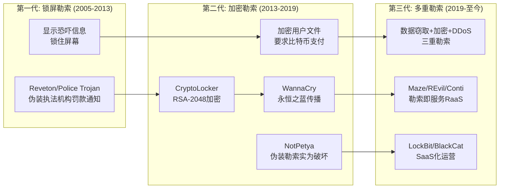
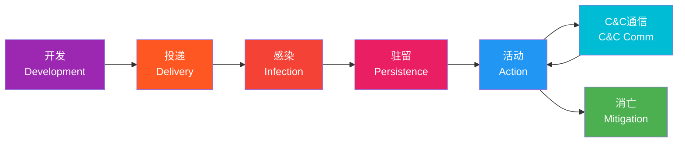
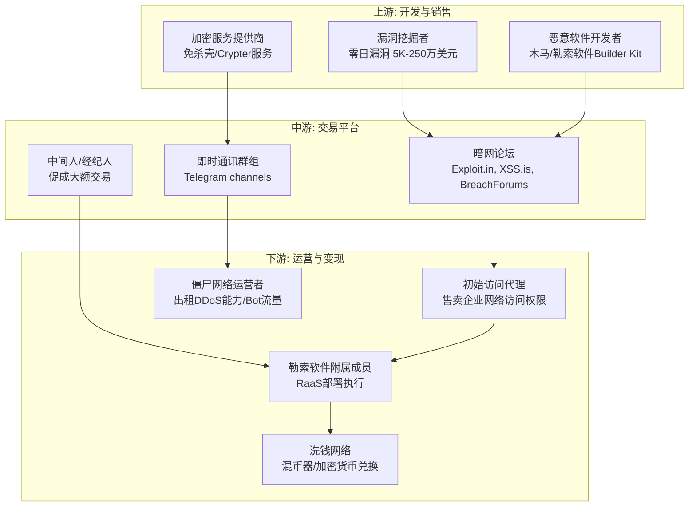
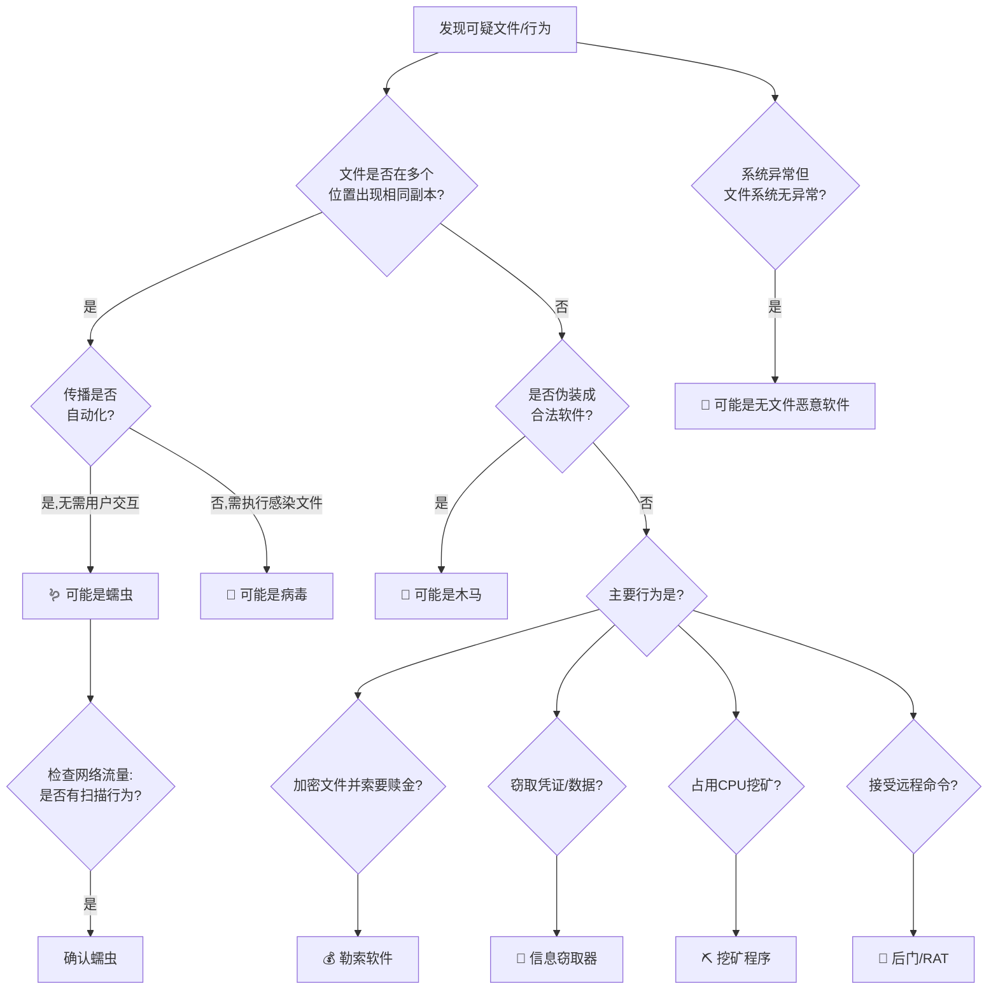

## 24.1 恶意软件概述与演化历史

恶意软件是网络攻防的核心战场。要有效分析和防御恶意软件，必须先建立完整的认知框架——它是什么、从何而来、如何分类、遵循怎样的演化规律。本节从定义出发，梳理四十年演化脉络，建立系统化分类体系，为后续的静态分析、动态分析和行为分析奠定理论基础。

### 24.1.1 恶意软件的严格定义

恶意软件（Malware，Malicious Software 的缩写）是指**任何被有意设计或修改，用于破坏计算机系统、窃取数据、获取未授权访问、或执行其他恶意功能的软件程序**。这个定义包含三个关键要素：

1. **意图性**：恶意软件的核心区分标准是"开发者意图"。一个含有安全漏洞的软件不是恶意软件（它是缺陷软件），但如果漏洞被故意植入（后门），则构成恶意软件。这个区分在法律层面尤为重要——CVE-2021-44228（Log4Shell）是漏洞，而被故意植入 Spring Framework 的 Spring4Shell 类后门则属于恶意代码。

2. **功能性损害**：恶意软件必须具备实际或潜在的损害能力，包括但不限于数据破坏、信息窃取、资源占用、未授权访问、拒绝服务等。

3. **非授权性**：恶意软件的运行违反了系统所有者或用户的明确意愿或合理预期。

需要注意的是，恶意软件的边界在实践中存在灰色地带。以下工具虽然具有潜在的恶意能力，但其分类取决于使用意图：

| 工具类型 | 合法用途 | 恶意用途 | 法律定性 |
|---------|---------|---------|---------|
| 远程管理工具（RAT） | 企业远程运维 | 秘密监控、未授权控制 | 取决于是否获得授权 |
| 渗透测试框架 | 安全评估 | 未授权攻击 | 取决于授权书 |
| 密码恢复工具 | 找回自己的密码 | 窃取他人凭证 | 取决于用途 |
| 流量劫持工具 | 网络调试分析 | 中间人攻击 | 取决于使用场景 |
| 系统监控软件 | 家长控制、企业合规 | 间谍活动 | 取决于知情同意 |

恶意软件的法律定义因司法管辖区而异。美国《计算机欺诈与滥用法》（CFAA, 18 U.S.C. § 1030）将"恶意软件"行为归入"未经授权访问"和"故意造成损害"两类。欧盟《网络犯罪公约》（布达佩斯公约）第4-6条专门规定了与恶意软件相关的犯罪行为。中国《刑法》第285-287条规定了"非法侵入计算机信息系统罪"和"破坏计算机信息系统罪"，《网络安全法》和《数据安全法》进一步细化了相关条款。

### 24.1.2 恶意软件的演化历程

恶意软件的发展与计算机技术和网络基础设施的演进紧密交织。理解这段历史不仅是学术兴趣——每一阶段的技术遗产至今仍在产生影响，许多经典技术在现代恶意软件中以改良形式重新出现。

#### 第一阶段：实验与恶作剧时代（1970年代-1980年代）

这一阶段的恶意软件主要由学术研究者和好奇心驱动的程序员创造，尚不具备大规模危害能力。

**Creeper（1971）**：运行在 TENEX 操作系统上的实验程序，在 ARPANET 节点间跳跃并显示"I'm the creeper, catch me if you can!"。它不是严格意义上的恶意软件（无损害意图），但确立了"自我复制程序"的概念原型。其对应的 Reaper 程序则可以视为第一个"杀毒程序"——它在网络中寻找并删除 Creeper 的副本。

**Elk Cloner（1982）**：由15岁的 Rich Skrenta 编写，通过 Apple II 软盘传播。感染软盘的引导扇区，每第50次启动时显示一首诗。这是第一个在野外传播的计算机病毒，技术上通过 hook 磁盘 I/O 中断实现自我复制。

**Brain（1986）**：由巴基斯坦拉合尔的 Basit 和 Amjad Farooq Alvi 兄弟编写，被认为是第一个广泛传播的 IBM PC 病毒。它感染软盘引导扇区，将原始引导记录复制到磁盘的空闲簇中，并标记这些簇为"坏簇"防止被覆盖。Brain 的代码中包含巴基斯坦拉合尔的地址和电话号码——作者声称这是为了追踪软件盗版而非恶意破坏。这一事件推动了第一代杀毒软件的诞生。

**核心技术特征**：
- 感染方式：引导扇区感染、文件感染
- 传播媒介：物理软盘
- 代码技术：hook 中断向量表（INT 13h）
- 检测难度：极低（文件大小变化明显，代码无混淆）
- 影响范围：单机或小型局域网

#### 第二阶段：互联网蠕虫时代（1990年代末-2000年代初）

互联网的商业化和普及为恶意软件提供了全新的传播途径，标志着"网络武器化"的开始。

**Morris 蠕虫（1988）**：严格来说早于这一阶段，但它是第一个引起广泛关注的互联网蠕虫。Robert Tappan Morris（康奈尔大学研究生）编写，利用 fingerd 的缓冲区溢出漏洞、sendmail 的 DEBUG 模式、rsh/rexec 的弱口令进行传播。由于编程逻辑错误（理论上限7次感染，实际因 retry 机制导致指数级增长），导致约6000台机器瘫痪（当时互联网的10%）。Morris 成为第一个依据1986年《计算机欺诈和滥用法》被定罪的人，被判3年缓刑、400小时社区服务和10,050美元罚款。此事件催生了 CERT/CC（计算机应急响应小组协调中心）的成立。

**Melissa（1999）**：由 David L. Smith 编写的宏病毒/蠕虫混合体，通过伪装为"来自某人的重要信息"的 Word 文档传播。打开文档后，宏代码读取 Outlook 通讯录，向前50个联系人发送携带感染附件的邮件。Melissa 在发现后数小时内感染了超过100,000台机器，造成约8000万美元的损失。它暴露了两个关键问题：Microsoft Office 宏的安全模型存在根本缺陷；电子邮件作为传播途径的效率惊人。

**ILOVEYOU（2000）**：由菲律宾的 Onel de Guzman 编写，伪装为情书的 VBS 脚本蠕虫。利用 Windows 的 Script Host 自动执行，并覆盖多种文件类型（.jpg、.mp3、.doc 等），造成不可逆的数据损失。ILOVEYOU 在全球造成约55-87亿美元的经济损失，感染了数千万台机器。值得注意的是，菲律宾当时没有计算机犯罪法律，de Guzman 未被起诉——这一事件直接推动了多国网络安全立法。

**CodeRed（2001）**：利用 Microsoft IIS 的 .ida 缓冲区溢出漏洞（MS01-033）传播。它不以文件形式存在于磁盘——完全驻留在内存中，这是一个里程碑式的技术突破。CodeRed 在被感染的系统上尝试对白宫网站发起 DDoS 攻击（通过硬编码IP重定向），并留下"Welcome to http://www.worm.com! Hacked By Chinese!"的网页。变种 CodeRed II 则在被感染系统上安装后门。

**Nimda（2001）**：在CodeRed爆发后不久出现，采用了前所未有的**五种传播方式**——邮件附件、网络共享、被感染网站（通过CodeRed II后门）、IIS漏洞利用、局域网浏览。Nimda 展示了"多向量传播"的强大威力，迫使安全行业开始从"单点防御"向"纵深防御"转变。

**SQL Slammer（2003）**：利用 Microsoft SQL Server 2000 的缓冲区溢出漏洞。它是一个376字节的 UDP 包——是至今最小的蠕虫之一。SQL Slammer 的传播速度打破了所有记录：在爆发后约**10分钟内**感染了全球75,000台服务器。它无需任何文件操作、无需任何用户交互，纯粹通过网络扫描和 UDP 包的指数级复制实现传播。SQL Slammer 证明了网络蠕虫的传播速度可以超越人类的响应能力。

**这一阶段的技术跃迁**：

| 维度 | 第一阶段 | 第二阶段 |
|------|---------|---------|
| 传播媒介 | 物理软盘 | 网络（邮件、Web、漏洞利用） |
| 传播速度 | 天/周级 | 秒/分钟级 |
| 感染规模 | 数千台 | 数百万台 |
| 驻留方式 | 磁盘文件/引导区 | 内存+文件+网络传播 |
| 技术复杂度 | 低 | 中（开始利用零日漏洞） |
| 经济损失 | 微小 | 数十亿美元 |

#### 第三阶段：经济利益驱动时代（2000年代中期-2010年代初）

当恶意软件开发者意识到网络犯罪可以产生巨大利润时，整个行业发生了质变——从"炫耀技术"转向"产业化运作"。

**Zeus 银行木马（2007-至今）**：Zeus 是现代网络犯罪的奠基性恶意软件。它通过"钓鱼邮件+下载器"的方式感染系统，然后 hook 浏览器进程，在用户访问银行网站时注入额外的表单字段（HTML 注入），实时窃取网上银行凭证。Zeus 的核心创新在于：

- **模块化架构**：核心功能精简，通过插件扩展（键盘记录、屏幕截图、FormGrabber、WebInject 等）
- **犯罪即服务（CaaS）**：以构建工具包（Builder Kit）形式在地下论坛出售，买家无需编程技能即可定制自己的僵尸网络
- **P2P 变种（GameOver Zeus）**：2011年出现的变种采用 P2P 通信架构，消除了单一 C&C 服务器的瓶颈

Zeus 的源代码在2011年泄露后催生了大量变种——Citadel、Ice IX、KINS、Sphinx——形成了一个延续至今的"木马家族"。据估计，Zeus 及其变种累计窃取了超过1亿美元。

**Conficker（2008）**：利用 Windows Server Service 的 MS08-067 漏洞传播，感染了超过900万台机器（包括法国海军、英国国防部、德国联邦军队的计算机系统）。Conficker 的技术亮点包括：
- 使用域名生成算法（DGA）每日生成50,000个可能的C&C域名，大幅增加域名黑名单封堵的难度
- 使用 RSA 签名验证更新包，防止被竞争对手劫持
- 对安全软件的域名进行封锁，阻止用户访问杀毒软件厂商网站

**Stuxnet（2010）**：这是网络战历史上的分水岭。Stuxnet 是一个高度复杂的蠕虫，由美国国家安全局（NSA）和以色列军方联合开发（代号"奥林匹克运动会"），专门针对伊朗纳坦兹核设施的西门子 S7-300 PLC 离心机控制系统。它同时利用了**四个零日漏洞**（Windows Shell LNK 漏洞、Print Spooler 权限提升、Windows Server Service 远程执行、Task Scheduler 权限提升），通过感染的 USB 闪存盘跨越物理隔离网络（air-gapped network）。Stuxnet 的 PLC 攻击模块会篡改离心机转速——先加速到物理极限再减速——同时向监控系统报告正常的运行数据。据估计，Stuxnet 摧毁了伊朗约1,000台离心机。它证明了：（1）网络武器可以造成物理世界的实质性破坏；（2）即使是物理隔离的系统也面临威胁；（3）国家级攻击者拥有近乎无限的资源和耐心。

#### 第四阶段：APT、勒索软件与供应链攻击时代（2010年代至今）

这一阶段的特征是威胁的高度多样化和专业化——不同类型的攻击者（国家、犯罪团伙、黑客活动分子、脚本小子）并存，攻击手法不断创新。

**高级持续性威胁（APT）**：

APT 的核心特征是"长期潜伏、精准打击、情报收集"。主要国家级 APT 组织包括：

| APT组织 | 别名 | 归属国家 | 代表攻击 | 特点 |
|---------|------|---------|---------|------|
| APT28 | Fancy Bear/Sofacy | 俄罗斯军事情报局(GRU) | 2016美国大选DNC入侵 | 鱼叉式钓鱼+零日漏洞 |
| APT29 | Cozy Bear/The Dukes | 俄罗斯对外情报局(SVR) | SolarWinds供应链攻击 | 高度隐蔽+长期潜伏 |
| Lazarus Group | Hidden Cobra | 朝鲜 | Sony Pictures(2014)、WannaCry(2017)、加密货币盗窃 | 双重目标：情报+资金 |
| APT41 | Double Dragon | 中国 | 电信、医疗、游戏行业 | 间谍活动+个人牟利混合 |
| Equation Group | — | 美国NSA | 震网病毒、永恒之蓝工具 | 超级隐匿+固件级植入 |
| Turla | Snake/Venomous Bear | 俄罗斯FSB | 利用卫星通信隐藏C&C | 极度隐蔽+反取证 |

**勒索软件的演化**：

勒索软件经历了从简单到复杂的三代演进：



**LockBit** 是当前最具代表性的勒索软件即服务（RaaS）组织。它自2019年出现以来已连续更新至3.0版本（LockBit Black），具备以下特征：通过赎金谈判门户展示数据样本以施压；为附属成员（affiliates）提供完整的面板和工具；支持Windows、Linux、macOS、ESXi多平台；利用合法工具（PSExec、Group Policy、PowerShell）进行横向移动。据记录，LockBit 在2023年占所有勒索软件攻击的约28%。

**供应链攻击的兴起**：

SolarWinds 事件（2020）是供应链攻击的里程碑——APT29 通过入侵 SolarWinds Orion 软件的构建环境，在合法更新包中植入后门（SUNBURST），影响了约18,000个组织，包括美国财政部、国土安全部、国务院等政府机构以及微软、FireEye 等科技企业。攻击者在目标环境中潜伏了**至少9个月**未被发现。

Kaseya 事件（2021）展示了供应链攻击对中小企业的毁灭性影响——REvil 勒索团伙入侵了 IT 管理软件 Kaseya VSA 的更新服务器，通过一个更新感染了约1,500家下游企业。

Log4Shell（2021年12月）虽然不是传统意义上的恶意软件，但其影响之广堪比恶意软件——几乎所有使用 Apache Log4j 2 的 Java 应用都受到影响，从 Minecraft 服务器到企业级云服务无一幸免。

### 24.1.3 恶意软件的分类体系

恶意软件可以从多个维度进行分类。实际分析中，一个恶意软件样本通常同时属于多个分类——例如 WannaCry 既是蠕虫（传播方式）、又是勒索软件（功能目的）、同时利用了永恒之蓝漏洞（技术特征）。

```mermaid
graph TD
    MW["🦠 恶意软件分类体系"]
    
    MW --> P["按传播方式"]
    MW --> F["按功能目的"]
    MW --> T["按技术特征"]
    MW --> D["按部署环境"]
    
    P --> P1["🦠 病毒 Virus<br/>需要宿主文件"]
    P --> P2["🪱 蠕虫 Worm<br/>自我复制传播"]
    P --> P3["🐴 木马 Trojan<br/>伪装合法软件"]
    P --> P4["📱 投递器 Dropper<br/>下载并执行恶意载荷"]
    
    F --> F1["🚪 后门 Backdoor"]
    F --> F2["🔑 信息窃取器 Infostealer"]
    F --> F3["💰 勒索软件 Ransomware"]
    F --> F4["⛏️ 挖矿程序 Cryptominer"]
    F --> F5["🤖 僵尸程序 Bot Agent"]
    F --> F6["👁️ 间谍软件 Spyware"]
    F --> F7["📺 广告软件 Adware"]
    F --> F8["💣 破坏性恶意软件 Wiper"]
    
    T --> T1["🛡️ Rootkit"]
    T --> T2["👻 无文件恶意软件"]
    T --> T3["🔄 多态恶意软件"]
    T --> T4["🧬 变形恶意软件"]
    T --> T5["📦 加壳恶意软件"]
    T --> T6["🤖 AI增强恶意软件"]
    
    D --> D1["🖥️ Windows 恶意软件"]
    D --> D2["🐧 Linux 恶意软件"]
    D --> D3["📱 移动端恶意软件"]
    D --> D4["🌐 IoT 恶意软件"]
    D --> D5["☁️ 云环境恶意软件"]

    style MW fill:#E91E63,stroke:#333,color:#fff
    style P fill:#FF5722,stroke:#333,color:#fff
    style F fill:#2196F3,stroke:#333,color:#fff
    style T fill:#9C27B0,stroke:#333,color:#fff
    style D fill:#4CAF50,stroke:#333,color:#fff
```



#### 按传播方式分类

**病毒（Virus）**

病毒是最早被识别和命名的恶意软件类型，其核心特征是**需要宿主文件**——病毒代码附着在合法文件中，当用户执行被感染文件时触发病毒代码的执行。病毒无法独立运行，这是它与蠕虫的根本区别。

病毒的感染技术主要有三种：

1. **文件感染型（File Infectors）**：修改可执行文件（.exe、.dll、.scr），将自身代码注入目标文件。常见手法包括：
   - **前置感染**：将病毒代码放在文件开头，原文件代码后移
   - **追加感染**：将病毒代码附加到文件末尾，修改入口点指向病毒代码
   - **空洞感染（Cavity Infection）**：利用PE文件中的代码段间隙（通常为连续的0x00字节），不影响文件大小，隐蔽性极高

2. **引导区感染型（Boot Sector Infectors）**：感染MBR（主引导记录）或VBR（卷引导记录），在操作系统加载之前获得控制权。由于现代系统的UEFI Secure Boot机制，此类病毒已大幅减少。

3. **宏病毒（Macro Viruses）**：利用Office文档的VBA宏功能传播。1995年的Concept病毒是第一个Word宏病毒。虽然Microsoft从Office 2007开始默认禁用宏，但通过社会工程诱导用户"启用内容"仍然是有效的攻击向量。

**蠕虫（Worm）**

蠕虫是最具传播力的恶意软件类型。与病毒不同，蠕虫是**完全独立的程序**，能够**自我复制并通过网络自动传播**，不需要用户交互或宿主文件。

蠕虫的传播技术包括：

- **网络服务漏洞利用**：如 CodeRed（IIS）、SQL Slammer（MSSQL）、WannaCry（SMB/EternalBlue）
- **邮件传播**：如 ILOVEYOU（Outlook）、Melissa（Word/Outlook）
- **即时通讯传播**：通过Skype、QQ、微信等平台发送恶意链接或文件
- **可移动介质传播**：利用Windows的AutoRun/AutoPlay功能（Conficker）
- **P2P网络传播**：将自身伪装为热门文件名发布到P2P共享网络

**木马（Trojan）**

木马伪装成有用的软件诱骗用户安装，其名称源自特洛伊木马。木马是当前数量最多的恶意软件类型。与病毒/蠕虫的关键区别是**木马不具备自我复制能力**——它依赖社会工程进行传播。

木马的常见伪装形式：
- 游戏作弊工具、破解软件（Crack/Keygen）
- 系统优化工具、驱动程序更新
- 盗版软件、影视资源
- 正常软件的"修改版"或"增强版"
- 冒充合法应用的钓鱼App

**投递器/下载器（Dropper/Downloader）**

投递器是一个专门用于在目标系统上安装恶意软件的程序。它可能直接携带恶意载荷（Dropper），或在执行后从远程服务器下载恶意载荷（Downloader）。投递器在现代攻击中极为常见，因为：

- 文件较小，容易通过安全检查
- 可以动态选择和下载最合适的载荷
- 便于在不同攻击阶段使用不同载荷
- 通过"多阶段投递"增加分析难度

#### 按功能目的分类

**后门（Backdoor）**

后门为攻击者提供对受感染系统的隐蔽远程访问能力。典型的后门功能包括：命令执行（远程Shell）、文件操作（上传/下载/删除）、屏幕监控（截图/录屏）、键盘记录、摄像头/麦克风监控、代理/隧道功能。

常见的后门类型包括：远程访问工具（RAT）如 Cobalt Strike Beacon、Metasploit Meterpreter；Web Shell 如 China Chopper、Weevely；固件/硬件后门如在BIOS/UEFI中植入的持久化后门。

**信息窃取器（Infostealer）**

专门窃取敏感信息的恶意软件，是网络犯罪"供应链"中的关键一环。典型的信息窃取器包括：RedLine Stealer（窃取浏览器凭证、加密货币钱包、信用卡信息）、Raccoon Stealer（类似功能，通过暗网订阅制销售）、Agent Tesla（键盘记录+屏幕截图+剪贴板监控）。

信息窃取器窃取的数据被称为"logs"（日志），在暗网市场（Genesis Market、Russian Market等）以每条0.5-50美元不等的价格出售。这些"logs"随后被用于：凭证填充攻击（Credential Stuffing）、银行欺诈、企业入侵（作为初始访问的跳板）、身份盗窃。

**勒索软件（Ransomware）**

勒索软件通过加密受害者文件（或锁住系统）并索要赎金来盈利。现代勒索软件已演化为"勒索即服务"（RaaS）模式——开发团队负责维护恶意软件和基础设施，附属成员（affiliates）负责实际入侵和部署。赎金分配通常是开发团队抽取20-30%，附属成员获得70-80%。

**Wiper（破坏性恶意软件）**

Wiper 不以盈利为目的，而是纯粹的破坏。它伪装成勒索软件（诱导受害者联系攻击者，暴露更多信息）或直接擦除数据。典型案例包括：NotPetya（2017，伪装勒索实为Wiper，造成全球约100亿美元损失）、Shamoon（2012，针对沙特阿美石油公司，擦除35,000台电脑）、WhisperGate（2022，针对乌克兰）。

#### 按技术特征分类

**Rootkit**

Rootkit 通过修改操作系统内核、系统调用表或引导过程来隐藏自身和其他恶意组件的存在。Rootkit 按照驻留层次从低到高分为：

| Rootkit类型 | 驻留层次 | 隐蔽性 | 检测难度 | 示例 |
|------------|---------|--------|---------|------|
| 用户态Rootkit | 应用层 | 低 | 低 | LD_PRELOAD劫持 |
| 内核态Rootkit | 操作系统内核 | 高 | 高 | 修改系统调用表(SDT) |
| 虚拟机级Rootkit | Hypervisor层 | 极高 | 极高 | Blue Pill概念 |
| 固件级Rootkit | BIOS/UEFI/固件 | 极高 | 极高 | LoJax(2018) |

LoJax（2018）是第一个在野发现的UEFI Rootkit——由 APT28（Fancy Bear）部署，它修改系统固件中的SPI闪存，即使重装操作系统甚至更换硬盘也无法清除。

**无文件恶意软件（Fileless Malware）**

无文件恶意软件不以传统文件形式存在于磁盘上，而是驻留在内存中或利用合法系统工具。这种恶意软件对抗传统基于文件扫描的检测方法极其有效。常见技术包括：

- **Living off the Land（LotL）**：使用系统自带的合法工具（PowerShell、WMI、cmd.exe、certutil、mshta）执行恶意操作
- **反射式DLL注入**：将DLL加载到内存中而不写入磁盘
- **进程镂空（Process Hollowing）**：挂起合法进程，替换其内存内容为恶意代码
- **WMI持久化**：将恶意代码存储在WMI（Windows Management Instrumentation）数据库中

**多态恶意软件（Polymorphic Malware）**

每次感染时改变自身的加密密钥和解密代码段，使得基于特征码的检测失效。基本结构是：

```text
[变异的解密器] + [加密的恶意代码]
```

解密器每次都不同（通过插入垃圾指令、改变指令顺序、使用不同的寄存器），但恶意代码的功能不变。查杀多态恶意软件需要使用**模拟器/沙箱**先运行解密器，再对解密后的静态代码进行检测。

**变形恶意软件（Metamorphic Malware）**

比多态更进一步——恶意软件在每次复制时**完全重写自身代码**，不依赖加密。变形引擎通过以下技术实现代码变换：
- 寄存器替换（用等效的寄存器替代）
- 指令替换（用等效指令替代，如 `xor eax,eax` 替代 `mov eax,0`）
- 代码重排（改变基本块的顺序）
- 插入死代码（添加不影响逻辑的指令）
- 控制流变换（改变跳转和分支结构）

Zmist（2000）是早期最复杂的变形病毒——它使用"代码融合"技术，将自身代码分散嵌入宿主文件的代码段间隙中。

#### 按部署环境分类

现代恶意软件已经从Windows PC扩展到了所有计算环境：

- **Linux恶意软件**：包括针对服务器的挖矿程序（如XMRig变种）、针对容器的恶意镜像、IoT僵尸网络（如Mirai）
- **移动端恶意软件**：Android平台的BankBot、FluBot（通过短信传播的银行木马）、间谍软件Pegasus（NSO Group，零点击入侵iOS）
- **IoT恶意软件**：Mirai（2016）感染了数十万IoT设备发起DDoS攻击，至今仍有大量变种活跃
- **云环境恶意软件**：针对Kubernetes集群、AWS Lambda、Azure Functions的新型攻击，如Cryptojacking（劫持云资源挖矿）

### 24.1.4 恶意软件生命周期

每个恶意软件从诞生到消亡都遵循一个可预测的生命周期。理解这个生命周期对于防御策略的制定至关重要。



1. **开发阶段**：攻击者编写或修改恶意软件，选择编程语言（C/C++用于高性能底层恶意软件，Python/Ruby用于快速原型，PowerShell用于无文件攻击，Go/Rust用于跨平台编译），编写加密和混淆代码，测试对安全软件的免杀能力。

2. **投递阶段**：选择投递方式——钓鱼邮件（最常见的初始向量，约占所有攻击的~40%）、水坑攻击（入侵目标常访问的网站）、恶意广告（通过广告网络投递）、供应链攻击、物理投递（USB投放）。

3. **感染阶段**：恶意代码在目标系统上执行。可能利用漏洞提权，绕过用户账户控制（UAC），禁用安全软件。

4. **驻留阶段**：建立持久化机制——修改注册表Run键、创建计划任务、安装服务、WMI事件订阅、DLL劫持、启动文件夹快捷方式等。

5. **活动阶段**：执行预设的恶意功能——加密文件（勒索软件）、窃取凭证（信息窃取器）、建立隧道（后门）、资源挖矿（矿机）。

6. **C&C通信阶段**：与命令控制服务器通信，接收指令、上传窃取的数据、下载更新。通信方式包括：HTTP/HTTPS（最常见，便于混入正常流量）、DNS隧道（利用DNS查询传输数据）、Tor网络（匿名通信）、合法云服务（Pastebin、Telegram、GitHub作为中转）。

7. **消亡阶段**：安全厂商更新特征码、操作系统修补漏洞、执法机构关停基础设施。但"消亡"是相对的——源代码泄露（如Zeus、Mirai）会催生大量变种，延长其生命周期。

### 24.1.5 恶意软件经济学

恶意软件已不是个人黑客的行为，而是一条完整的**地下经济产业链**：



**恶意软件即服务（MaaS）的典型定价**：

| 服务/产品 | 价格 | 说明 |
|----------|------|------|
| 僵尸网络租赁 | $50-500/天 | 按DDoS带宽和持续时间计费 |
| 信息窃取器订阅 | $100-300/月 | RedLine、Raccoon等 |
| RaaS附属会员 | 免费加入 | 赎金分成70-80%给附属成员 |
| 初始访问权限 | $500-100,000/次 | 取决于目标企业规模和权限级别 |
| 免杀服务 | $50-200/样本 | 保证24-72小时内不被杀软检出 |
| 僵尸网络Builder Kit | $200-5,000/终身 | Zeus、Mirai等源码泄露后价格下降 |
| 零日漏洞（Windows LPE） | $50,000-250,000 | Zerodium等漏洞收购平台报价 |

这条产业链的年收入估计超过**1万亿美元**（Cybersecurity Ventures, 2023），超过大多数国家的GDP。

### 24.1.6 前沿趋势与未来展望

恶意软件技术仍在快速演进。以下是当前最值得关注的前沿趋势：

**AI/LLM辅助恶意软件开发**：攻击者已经开始使用大语言模型辅助编写恶意代码、生成钓鱼邮件、分析防御机制。虽然目前AI尚不能独立创造高级恶意软件，但它大幅降低了技术门槛——一个不具备编程能力的犯罪分子可以借助AI编写有效的恶意脚本。

**Living off the Land 的极致化**：越来越多的攻击者使用合法的系统工具和商业软件（如Cobalt Strike、AnyDesk、TeamViewer）执行恶意操作，使得恶意流量与正常业务流量的区分越来越困难。

**跨平台恶意软件**：使用Go、Rust等语言编写的恶意软件（如BlackCat/ALPHV使用Rust、Hive使用Go）可以轻松跨平台编译，一份代码同时攻击Windows、Linux和macOS。

**攻击面扩大**：云原生环境（Kubernetes、容器、Serverless）、IoT设备、移动设备、工业控制系统（ICS/SCADA）、智能汽车等新兴计算平台不断扩展恶意软件的潜在目标范围。

### 24.1.7 常见误区与纠正

**误区1："我的系统是Linux/Mac，不会有恶意软件"**

事实：Linux恶意软件数量持续增长，尤其是针对服务器和云环境的挖矿程序和后门。macOS上的恶意软件也在增加——2022年发现的macOS恶意软件样本比2021年增加了超过50%。没有任何操作系统是免疫的。

**误区2："装了杀毒软件就安全了"**

事实：基于特征码的传统杀毒软件对已知恶意软件有效，但对零日恶意软件、无文件恶意软件和高级APT的检出率有限。现代防御需要结合端点检测与响应（EDR）、行为分析、网络流量分析（NTA）、威胁情报等多层次手段。

**误区3："恶意软件只通过邮件附件传播"**

事实：邮件附件只是众多传播方式之一。水坑攻击、恶意广告、供应链攻击、物理介质（USB）、即时通讯应用、社交平台、搜索引擎优化投毒（SEO Poisoning）等都是常见的传播途径。

**误区4："WannaCry/NotPetya已经是过去式，不用担心了"**

事实：WannaCry利用的永恒之蓝漏洞至今仍有大量未修补的系统存在。2023年仍有数千台设备被WannaCry感染。更关键的是，这两个恶意软件展示的攻击技术（SMB漏洞利用、P2P传播、供应链投毒）已被新一代恶意软件广泛采用。

**误区5："恶意软件分析只需要逆向工程"**

事实：完整的恶意软件分析体系包含静态分析（代码逆向）、动态分析（行为监控）、行为分析（网络流量+系统调用）、威胁情报关联等多个层面。单一技术无法提供完整的情报。

### 24.1.8 实战要点：识别恶意软件类型

在实际工作中，快速判断恶意软件的类型是选择分析方法和制定防御策略的第一步。以下是实用的快速判断流程：



**快速判断的技术指标**：

- **蠕虫特征**：大量网络扫描流量、异常的SMB/FTP/HTTP连接、短时间内多个系统出现相同症状
- **后门特征**：反向连接到外部IP、定时心跳包、异常的DNS查询模式、非工作时段的网络活动
- **勒索软件特征**：文件扩展名被修改、大量文件I/O操作、出现勒索说明文件（README.txt等）、Volume Shadow Copy被删除
- **信息窃取器特征**：浏览器进程被注入、大量数据外传（HTTPS POST请求）、剪贴板内容被频繁读取
- **Rootkit特征**：系统工具报告不一致（任务管理器与进程列表不同）、隐藏进程/文件/注册表项、Rootkit检测工具报警

### 24.1.9 工具与资源

学习恶意软件分析需要掌握一系列工具。以下是按分析阶段推荐的工具清单：

**基础分析工具**：

| 工具 | 用途 | 平台 | 费用 |
|------|------|------|------|
| PEStudio | PE文件静态分析（无运行） | Windows | 免费 |
| Detect It Easy (DIE) | 编译器/加壳器识别 | 全平台 | 免费 |
| FLOSS | 自动字符串提取（支持混淆） | Windows | 免费 |
| YARA | 恶意软件特征匹配引擎 | 全平台 | 免费 |
| VirusTotal | 多引擎在线扫描 | Web | 基础免费 |
| Any.Run | 在线交互式沙箱 | Web | 基础免费 |
| Hybrid Analysis | 在线动态分析 | Web | 免费 |

**进阶分析工具**：

| 工具 | 用途 | 平台 | 费用 |
|------|------|------|------|
| IDA Pro | 业界标准反汇编器 | 全平台 | 付费（有免费版本） |
| Ghidra | NSA开源逆向工程框架 | 全平台 | 免费 |
| x64dbg | Windows动态调试器 | Windows | 免费 |
| Wireshark | 网络协议分析 | 全平台 | 免费 |
| Process Monitor | 系统活动监控 | Windows | 免费 |
| INetSim | 模拟网络服务（沙箱用） | Linux | 免费 |

**在线资源**：

| 资源 | 说明 |
|------|------|
| MalwareBazaar | 恶意软件样本共享平台（abuse.ch） |
| Malpedia | 恶意软件家族百科 |
| MITRE ATT&CK | 攻击技术知识库 |
| vx-underground | 恶意软件技术论文和样本库 |
| CAPE Sandbox | 开源恶意软件沙箱 |
| VirusTotal | 多引擎扫描和行为分析 |
| AlienVault OTX | 开源威胁情报平台 |

### 24.1.10 本节小结

恶意软件的历史是一部攻防技术的螺旋式演化史——从1970年代的实验程序到今天的国家级网络武器，从个人恶作剧到万亿美元的地下产业链。理解这段历史和分类体系是恶意软件分析的基石。

核心要点回顾：

1. 恶意软件的本质特征是**意图性**——区分恶意软件和安全漏洞的关键在于是否故意植入
2. 恶意软件经历了**实验→网络传播→经济驱动→APT/勒索**四大阶段，每个阶段的技术遗产至今仍在发挥作用
3. 现代恶意软件可以按**传播方式、功能目的、技术特征、部署环境**四个维度进行分类，一个样本通常属于多个分类
4. 恶意软件已形成完整的**产业链**——从漏洞挖掘到投递传播，从感染驻留到C&C通信，每个环节都有专业化的参与者
5. **AI、跨平台、无文件化、供应链攻击**是当前最重要的前沿趋势
6. 快速识别恶意软件类型是选择分析方法和制定防御策略的第一步

下一节我们将深入恶意软件分析方法论，系统讲解静态分析、动态分析和行为分析三大核心方法。
