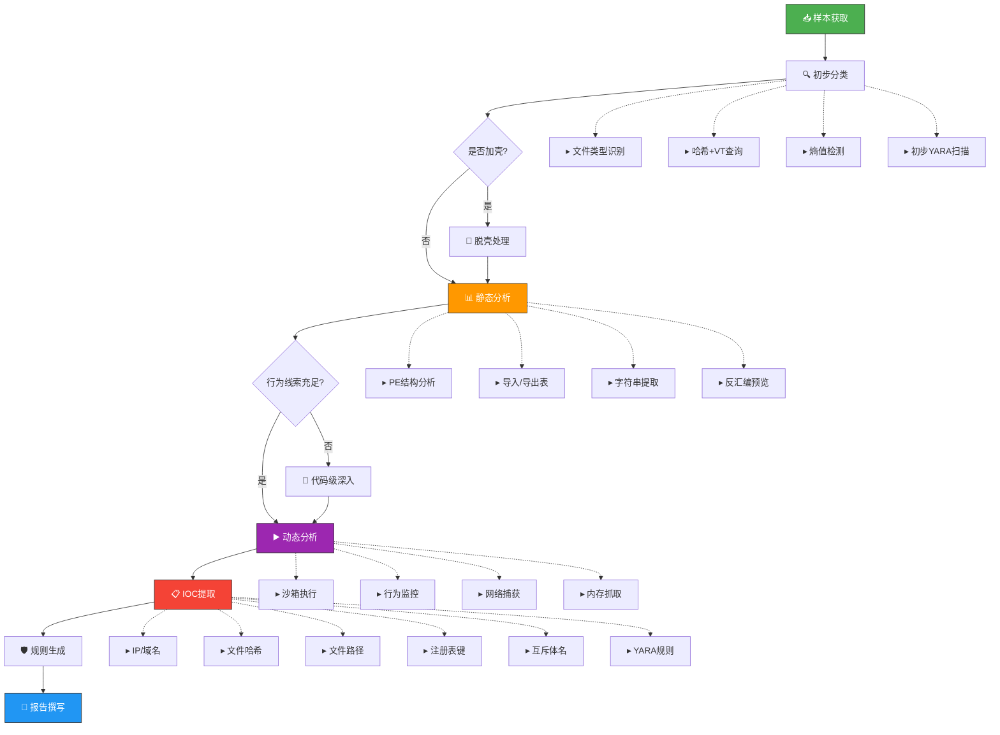

# 24.3 恶意软件分析方法论

恶意软件分析是一门在**不信任**前提下揭示软件真实意图的科学。与常规软件逆向不同，分析者面对的是刻意隐藏自身行为的对抗性对手。本章建立一套系统化的方法论体系——从哲学层面的分析范式，到可执行的操作流程，再到具体的工具链配置，层层递进，帮助读者构建完整的恶意软件分析能力框架。

---

## 24.3.1 分析范式：理解恶意软件的三种视角

安全行业经过数十年对抗，形成了三种互补的分析范式。理解它们的哲学基础，比单纯记住操作步骤更重要。

### 24.3.1.1 静态分析：从结构推断意图

**核心思想**：恶意软件如同书籍，即使不翻开阅读，封面标题（文件名）、目录结构（PE节区）、索引（导入表）和插图（字符串）已经透露了大量信息。

**理论基础**：静态分析基于一个关键假设——**恶意代码必须包含实现其功能的逻辑和数据**。一个能够连接C2服务器的恶意软件，其代码中必然包含URL字符串或IP地址的编码形式；一个能窃取密码的程序，必然调用了相关的系统API。无论作者如何隐藏，这些本质特征无法完全消除。

**哲学定位**：静态分析是**归纳式**推理——从可见的证据片段拼凑出完整画面。它的优势在于覆盖率高（可以看到所有代码路径），但致命弱点是**无法验证假设**——你推测某个函数是解密例程，但不运行就无法确认。

### 24.3.1.2 动态分析：从行为验证假设

**核心思想**：与其猜测程序做了什么，不如让它真正运行一次，观察它实际做了什么。

**理论基础**：动态分析基于**可观测性原则**——任何程序对系统产生影响（创建文件、修改注册表、发送网络包），都会留下可以被监控的痕迹。通过挂钩（Hooking）系统调用层，分析工具可以拦截并记录几乎所有用户态行为。

**哲学定位**：动态分析是**演绎式**推理——提出"如果这个样本是勒索软件，它应该会枚举文件并调用加密API"的假设，然后通过执行验证。它解决静态分析"无法确认"的问题，但引入了新的问题：**路径覆盖不全**。恶意软件可能只在特定日期、特定IP、特定用户名下触发恶意行为。

### 24.3.1.3 混合分析：互补验证的最优策略

**实战铁律**：静态分析提供假设，动态分析验证假设；动态分析发现异常行为，静态分析回溯根本原因。两者交替进行，形成迭代深化的分析循环。

| 维度 | 静态分析 | 动态分析 |
|------|----------|----------|
| 安全性 | 高（不执行代码） | 低（必须执行恶意代码） |
| 覆盖度 | 全路径覆盖 | 仅覆盖执行路径 |
| 抗对抗 | 弱（加壳/混淆后效果差） | 弱（沙箱检测/条件触发后失效） |
| 分析速度 | 快（自动化工具可批量） | 慢（需逐一执行+等待行为） |
| 深度 | 可达指令级细节 | 通常停留在API调用级 |
| 可扩展性 | 支持大规模自动化 | 受限于沙箱资源 |

---

## 24.3.2 静态分析方法论：从文件到代码的全链路解析

### 24.3.2.1 第一阶段：文件识别与分类

分析的第一步不是打开文件，而是**了解你面对的是什么**。

**文件类型识别**

```bash
# 不要相信扩展名——用工具验证真实文件类型
file suspicious.exe
# 输出示例: PE32 executable (GUI) Intel 80386, for MS Windows

# Linux ELF文件识别
file malware_sample
# 输出示例: ELF 64-bit LSB executable, x86-64, version 1 (SYSV)

# 进一步确认PE文件详细信息
exiftool suspicious.exe
```

**哈希计算与威胁情报交叉验证**

```bash
# 计算多种哈希用于VirusTotal查询和本地去重
md5sum suspicious.exe | cut -d' ' -f1
sha1sum suspicious.exe | cut -d' ' -f1
sha256sum suspicious.exe | cut -d' ' -f1

# 在线查询（可通过API自动进行）
# https://www.virustotal.com/gui/file/{sha256}
```

**熵值检测——加壳识别**

熵值（Shannon Entropy）是检测加壳或加密的**核心指标**。PE文件的正常节区熵值通常在2.0~6.5之间。当节区熵值接近7.5~8.0时，几乎可以确定该节区经过压缩或加密。

| 节区 | 正常熵值 | 加壳后熵值 | 典型工具 |
|------|----------|------------|----------|
| .text（代码） | 5.5~6.5 | 7.5~8.0 | UPX、ASPack |
| .data（数据） | 2.0~4.0 | 7.0~8.0 | VMProtect |
| .rdata（只读） | 4.0~5.5 | 7.0~7.5 | Themida |
| .rsrc（资源） | 3.0~6.0 | 7.0~8.0 | Enigma |

```bash
# 使用die (Detect It Easy) 检测加壳信息
diec suspicious.exe

# 使用Python计算熵值
python3 -c "
import sys, math
with open(sys.argv[1], 'rb') as f:
    data = f.read()
entropy = -sum((c/len(data)) * math.log2(c/len(data)) for c in [data.count(b) for b in range(256)] if c > 0)
print(f'Entropy: {entropy:.2f}')
print(f'File size: {len(data)} bytes')
" suspicious.exe
```

### 24.3.2.2 第二阶段：PE结构深度分析

PE（Portable Executable）格式是Windows恶意软件的基石。深入理解PE结构是在静态分析中获取关键线索的前提。

**DOS头与e_lfanew**：所有PE文件以DOS头`MZ`开始。`e_lfanew`字段指向真正的PE头起始位置。恶意软件作者有时会修改这个字段指向错误位置来干扰分析工具。

**NT头关键字段**：

```bash
# 使用readpe查看PE头信息
readpe -H suspicious.exe

# 输出应关注：
# - TimeDateStamp: 编译时间戳（可能被伪造）
# - Characteristics: 文件属性（是否为DLL、是否可执行）
# - NumberOfSections: 节区数量（加壳后常增多）
```

**Section Table——节区表的密码**：

```bash
# 查看节区详情
readpe -S suspicious.exe
```

重点关注：
- **节区名称异常**：恶意文件常用非标准名称如`.vmp`（VMProtect）、`.upx`（UPX）、`.themida`
- **节区特征异常**：同时具有写和执行属性的节区（`IMAGE_SCN_MEM_WRITE \| IMAGE_SCN_MEM_EXECUTE`）是可疑的——合法代码不应自修改
- **Raw Size与Virtual Size差异**：Raw Size远小于Virtual Size通常暗示该节区在加载时会被展开（脱壳特征）

**导入表分析——看清程序"认识谁"**

导入表（Import Table）列出程序调用的外部函数，是理解程序行为的**最快途径**。

| 可疑API组合 | 暗示行为 |
|-------------|----------|
| `CreateProcess` + `WriteProcessMemory` | 进程注入/代码注入 |
| `InternetOpen` + `URLDownloadToFile` | 网络下载/后续载荷获取 |
| `CryptEncrypt` + `FindFirstFile` | 文件加密（勒索软件特征） |
| `GetAsyncKeyState` + `SendMessage` | 键盘记录 |
| `RegSetValueEx` + `CreateService` | 持久化/自启动 |
| `VirtualAllocEx` + `SetWindowsHookEx` | DLL注入 |
| `socket` + `connect` + `send` | C2通信 |

```bash
# 查看导入表
readpe -i suspicious.exe

# 或使用Python脚本提取
python3 -c "
import pefile
pe = pefile.PE('suspicious.exe')
for entry in pe.DIRECTORY_ENTRY_IMPORT:
    print(f'[DLL] {entry.dll.decode()}')
    for imp in entry.imports:
        if imp.name:
            print(f'  - {imp.name.decode()}')
"
```

### 24.3.2.3 第三阶段：字符串分析与代码审计

**字符串提取——恶意软件的"自白"**

```bash
# 提取可打印字符串
strings -n 6 suspicious.exe | sort | uniq

# 提取宽字符字符串（UTF-16，常见于恶意软件）
strings -e l suspicious.exe

# 关注的关键字符串类型
strings suspicious.exe | grep -iE '(http|https|\.(com|cn|ru|xyz|top)|C:\\|\\\\.*\\\\.*|HKEY|SOFTWARE|Microsoft|Windows\\CurrentVersion|Run|Crypt|AES|RSA|encrypt|decrypt|key|password|admin|hidden|backdoor|reverse|shell|cmd)'
```

**关键字符串模式**：
- **URL/IP**：C2服务器地址、下载地址（注意编码变体如base64、hex编码）
- **文件路径**：安装路径、日志文件、配置文件（如`C:\Users\Public\svchost.exe`）
- **注册表键**：持久化位置（`Run`、`RunOnce`、`Services`）
- **加密密钥**：硬编码的AES密钥、RSA公钥
- **调试字符串**：未清理的开发者注释（如"connected to C2 server successfully"）
- **互斥体名**：防止多实例运行的互斥体名（可用于IOC检测）

**反汇编——代码级别的深入**

```bash
# 使用objdump做基础反汇编（针对Linux ELF）
objdump -d malware_sample | head -100

# 使用radare2做交互式反汇编
r2 suspicious.exe
# 在r2中: aaa (分析全部), afl (列出函数), s main (跳转到main)

# 更强大的选择：Ghidra（支持反编译为伪C代码）
# 需要安装Ghidra并通过headless模式使用
```

### 24.3.2.4 静态分析的先天局限与应对

| 局限 | 原因 | 应对策略 |
|------|------|----------|
| 加壳混淆 | 真实代码被压缩/加密，静态分析只能看到加载器 | 识别壳类型→脱壳→分析原始代码 |
| 控制流混淆 | 插入大量无害跳转/垃圾指令，增加阅读难度 | 使用反混淆工具（如de4dot针对.NET） |
| API哈希化 | 用哈希值替代导出函数名，导入表为空 | 动态分析捕获运行时解析的真实API |
| 反静态分析 | 检测调试器/分析工具的存在并隐藏行为 | 修补反调试检查点后继续分析 |

---

## 24.3.3 动态分析方法论：在对抗中观察真实行为

### 24.3.3.1 环境准备——沙箱的艺术

动态分析的核心矛盾是：**你希望恶意软件表现得真实，但又不让它真的造成危害**。

**硬件/虚拟机隔离方案对比**

| 方案 | 隔离级别 | 检测难度 | 适用场景 |
|------|----------|----------|----------|
| VirtualBox + Host-Only | 中等 | 低 | 基础分析、教学 |
| VMware Workstation + NAT隔离 | 中等 | 低→中 | 常见恶意软件分析 |
| 沙箱设备（FireEye、Cuckoo） | 高 | 中 | 企业级批量分析 |
| 物理隔离机（断网） | 最高 | 高 | APT样本、专业分析 |

**关键配置清单**：

```yaml
# 虚拟机配置最低要求
操作系统: Windows 10 21H2 (推荐)
内存: 4GB+
CPU: 2核+
网络: Host-Only 或自定义NAT（连接INetSim）
快照: 基础干净快照（安装分析工具前→后的双快照策略）

# 必须安装的分析工具集
- Process Monitor (procmon): 文件/注册表/进程活动
- Process Explorer: 进程树/句柄/加载DLL
- Wireshark/TShark: 网络流量捕获
- API Monitor: API调用级跟踪
- RegShot: 注册表快照对比
- TCPView: 网络连接实时监控
```

### 24.3.3.2 网络模拟——欺骗恶意软件的C2通信

恶意软件通常会尝试连接C2服务器接收指令。如果直接断网，部分恶意软件会进入"休眠"状态，导致动态分析失效。因此需要**模拟网络环境**而非简单断网。

**INetSim配置要点**：

```bash
# INetSim会模拟常见的网络服务
# 安装（在Ubuntu/Debian分析机上）
apt-get install inetsim

# 基础配置文件: /etc/inetsim/inetsim.conf
# 关键配置项：
start_service dns          # 模拟DNS，解析所有域名为127.0.0.1
start_service http         # 模拟HTTP，返回假页面
start_service https        # 模拟HTTPS（需自签名证书）
start_service smtp         # 模拟SMTP，捕获恶意邮件
start_service ftp          # 模拟FTP

# DNS伪装：将恶意域名全部解析到本地
# 在inetsim.conf中设置
dns_default_ip 192.168.56.1
```

**FakeNet-NG的陷阱机制**：

FakeNet-NG提供了更高级的交互式模拟。它可以在恶意软件请求特定URL时返回预配置的响应内容，这对于触发第二阶段载荷下载至关重要。

```bash
# 配置FakeNet-NG监听恶意软件的下载请求
# 在/etc/fakenet.conf中设置：
[HTTP]
port=80
default_response=/opt/fakenet/responses/default.html

# 针对特定URL返回特制诱饵响应
[HTTP.custom]
pattern=/config.ini
response=/opt/fakenet/responses/config.ini
```

### 24.3.3.3 行为监控体系

**Process Monitor（procmon）的过滤艺术**

procmon会捕获所有进程的系统活动，不做过滤会产生海量日志。必须建立高效的过滤策略：

```bash
# procmon过滤规则建议
# 1. 排除操作系统核心进程的噪声
Process Name IS NOT system
Process Name IS NOT svchost.exe  # 谨慎：恶意软件可能使用同名

# 2. 关注关键操作类型
Operation IS RegSetValue  # 注册表写入（持久化）
Operation IS CreateFile   # 文件创建（释放载荷）
Operation IS WriteFile    # 文件写入
Operation IS CreateProcess # 进程创建

# 3. 按进程路径筛选
Path CONTAINS C:\Users\   # 用户目录
Path CONTAINS C:\Windows\Temp  # 临时目录
```

**API Monitor——函数级别的行为取证**

```bash
# API Monitor捕获流程
# 1. 启动API Monitor → 选择监控模块（Win32 API / COM / .NET）
# 2. 设置目标进程（可以预先加载或启动后附加）
# 3. 选择关注的API分类：
#    - Process and Thread Functions
#    - File Management Functions
#    - Registry Functions
#    - Socket Functions
#    - Cryptography Functions
# 4. 启动恶意软件执行

# 重点关注API模式：
# - VirtualAllocEx + WriteProcessMemory + CreateRemoteThread → 经典进程注入
# - InternetOpen + InternetConnect + HttpOpenRequest → HTTP C2通信
# - RegCreateKeyEx + RegSetValueEx → 注册表持久化
```

### 24.3.3.4 沙箱逃逸检测——识别"装的"恶意软件

高级恶意软件会检测自己是否运行在分析环境中。如果检测到沙箱，它会表现得人畜无害。分析者的重要任务之一是**识别这种伪装**。

**常见沙箱检测手段**：

| 检测目标 | 检测方法 | 伪装方式 |
|----------|----------|----------|
| VM硬件特征 | 检测MAC地址前缀（00:0C:29 VMware）、特定I/O端口 | 修改VM配置/使用VMware硬编码 |
| 分析工具 | 检查进程列表中是否存在procmon.exe、wireshark.exe | 隐藏工具进程/使用便携版 |
| 用户活动 | 检测鼠标移动、键盘输入、最近打开的文件 | 保持沙箱中的人机交互模拟 |
| 运行时间 | 检查系统运行时间（Uptime < 30分钟则认为是沙箱） | 修改系统运行时间 |
| 硬盘大小 | 检测硬盘空间是否过小（<60GB常见于VM默认配置） | 分配足够大的虚拟硬盘 |
| MAC地址 | 某些沙箱使用特定的OUI范围 | 在配置中随机化MAC |

**检测沙箱逃逸的实战技巧**：

```bash
# 方法1：在procmon中查看恶意软件启动时的系统查询
# 搜索 QuerySystemInformation 操作——恶意软件常通过此API查询硬件信息

# 方法2：在x64dbg中设置断点
bp NtQuerySystemInformation  # 断在此处查看恶意软件询问了什么
bp NtQueryInformationProcess  # 断在进程信息查询（常见反调试）

# 方法3：观察启动延迟
# 如果恶意软件在启动后sleep了5-10秒才执行恶意行为，很可能是反沙箱检查
# 在procmon中查看时间线模式（Tools → Process Tree → 查看Times）
```

---

## 24.3.4 标准分析工作流：从样本到报告的完整路径



### 24.3.4.1 脱壳策略——穿透第一层保护

面对加壳样本，脱壳是绕不开的第一步。不同壳的脱壳难度差异巨大：

| 壳类型 | 例子 | 脱壳难度 | 推荐工具 |
|--------|------|----------|----------|
| 压缩壳 | UPX、MPRESS | 简单 | `upx -d` 直接解压 |
| 加密壳 | ASPack、Armadillo | 中等 | OllyDbg手动转储+重建IAT |
| 保护壳 | VMProtect、Themida | 困难 | 需使用专用工具或手动脱壳 |
| .NET混淆 | ConfuserEx | 中等 | de4dot（自动化脱.NET混淆） |

```bash
# UPX脱壳（最简单的情况）
upx -d packed.exe -o unpacked.exe

# 通用脱壳策略：运行时转储
# 步骤1：在调试器中设置断点在OEP（原始入口点）
# 步骤2：当断点触发时，使用Scylla或LordPE转储内存中的进程
# 步骤3：使用Import Reconstructor重建IAT
# 步骤4：用IDA/Ghidra分析转储后的文件
```

### 24.3.4.2 IOC提取——侦查成果的固化

IOC（Indicator of Compromise）是分析报告中最具实际价值的部分。系统化的IOC提取应覆盖以下类别：

**网络层IOC**
```text
C2域名: evil-c2.malware.top
IP地址: 192.168.1.100:443（端口）
URL路径: /gate.php?id={victim_id}
User-Agent: Mozilla/5.0 (Windows NT 6.1; rv:60.0) Gecko/20100101 Firefox/60.0
DNS请求: update.service-cdn.com
```

**主机层IOC**
```text
文件哈希（SHA256）: a1b2c3d4e5f6...
文件路径: C:\Users\Public\svchost.exe
注册表键: HKLM\SOFTWARE\Microsoft\Windows\CurrentVersion\Run\SystemHelper
互斥体名: Global\{B4C7E8F1-A2D3-4E56-9F01-23456789ABCD}
服务名: WindowsUpdateService
```

**检测规则**：将IOC转化为可执行的检测规则

```yara
rule Malware_Example_2024:
    meta:
        description = "Detection rule for example malware family"
        author = "Security Analyst"
        date = "2024-01-15"
        hash = "a1b2c3d4e5f6..."
    strings:
        $c2_url = "evil-c2.malware.top"
        $mutex = "Global\\{B4C7E8F1-A2D3-4E56-9F01-23456789ABCD}"
        $reg_path = "SystemHelper"
        $s1 = "This program cannot be run in DOS mode" wide  // PE特征
    condition:
        ($c2_url or $mutex or $reg_path) and $s1
```

---

## 24.3.5 工具矩阵：构建高效的分析工具链

根据分析阶段选择最合适的工具组合：

| 阶段 | 首选工具 | 替代方案 | 核心用途 |
|------|----------|----------|----------|
| 文件识别 | Detect It Easy (DIE) | TrID、file命令 | 真实文件类型+壳检测 |
| PE分析 | PE-bear | CFF Explorer、readpe | PE结构可视化分析 |
| 反汇编/反编译 | IDA Pro（收费） | Ghidra（免费）、radare2 | 深度代码分析 |
| 调试 | x64dbg | OllyDbg、WinDbg | 动态调试/单步跟踪 |
| 沙箱 | Cuckoo Sandbox | CAPE、Joe Sandbox | 自动化行为分析 |
| 网络模拟 | INetSim | FakeNet-NG | 网络服务欺骗 |
| 流量分析 | Wireshark | tcpdump + tshark | 网络包级分析 |
| 内存取证 | Volatility 3 | Rekall | 运行时内存快照分析 |
| IOC规则 | YARA | Sigma（日志层） | 检测规则编写 |
| 自动化 | Python + pefile/pydivert | PowerShell + .NET | 批量分析脚本 |

---

## 24.3.6 实战案例分析

### 案例一：勒索软件Emotet的加载器分析

**样本背景**：2023年捕获的Emotet变种，通过钓鱼邮件附件传播。

**分析过程**：

1. **初步识别**：文件为DLL格式，但扩展名为`.doc`——这是攻击者常用的伪装。`file`命令确认实际为PE32 DLL，熵值7.2→可能加壳。

2. **静态分析**：`readpe -i`显示导入表只有两个函数：`LoadLibraryA`和`GetProcAddress`——这是加载器（Loader）的典型特征，它在运行时动态解析后续需要的所有API。字符串提取发现base64编码的模糊字符串。

3. **动态分析**：在沙箱中执行，INetSim捕获到对`update-server.top`的DNS请求。procmon显示进程创建了`rundll32.exe`子进程并进行了进程镂空（Process Hollowing）。

4. **深入分析**：使用x64dbg下断点在`VirtualAllocEx`，观察到恶意软件在自身进程中分配了可执行内存，然后将加密的第二阶段载荷写入该区域并解密执行。

5. **IOC提取**：
   - C2域名：`update-server.top`
   - 互斥体：`EMOTET_{随机GUID}`
   - 释放路径：`%APPDATA%\Microsoft\svchost.dll`

### 案例二：APT组织使用的后门——静态与动态的矛盾

**样本背景**：某APT组织使用的自定义后门，C语言编写。

**分析痛点和突破**：

- 静态分析中导入表为空（所有API通过哈希动态解析）→ 静态分析无法识别功能
- 字符串全部经过XOR加密，`strings`命令无有效输出
- 动态执行后发现恶意软件先查询了注册表中的`HKLM\HARDWARE\DESCRIPTION\System\BIOS`中的系统UUID
- 只有特定UUID的系统才会触发恶意行为（针对性攻击）
- 突破方案：使用API Monitor设置断点在`RtlHashUuidToString`，修改返回值为目标UUID

---

## 24.3.7 常见误区与纠正

### 误区1：直接在生产环境或联网的VM中运行样本

**为什么不对**：即使看似无害的样本也可能释放勒索软件加密共享文件夹，或在联网后下载更危险的第二阶段载荷。

**正确做法**：始终在Host-Only或自定义隔离网络中分析。即使需要网络模拟，也使用INetSim/FakeNet-NG而非真实网络。

### 误区2：只看procmon日志，不看进程树

**为什么不对**：procmon的日志以线性时间排列，你看到的"svchost.exe在写入文件"可能实际是恶意软件通过DLL注入控制了一个合法的svchost进程。不关联进程树关系会误判。

**正确做法**：始终从Process Explorer的进程树视图开始分析，确定父子进程关系，再在procmon中按进程ID过滤。

### 误区3：一次动态分析够了

**为什么不对**：许多恶意软件具有条件触发行为——只在特定日期、特定键盘布局、特定进程存在时激活。

**正确做法**：至少进行三次动态分析：（1）默认环境（2）修改系统时间到不同月份（3）在不同用户权限下运行。对比三次的行为差异。

### 误区4：完全信任沙箱报告

**为什么不对**：沙箱报告的自动化分析可能遗漏关键行为，尤其是针对条件触发、时间触发、或使用非标准通信协议的恶意软件。沙箱报告的"无恶意行为"不等于"软件安全"。

**正确做法**：将沙箱报告作为**第一遍筛选**而非最终结论。对于沙箱报告可疑但不确定的样本，进行人工辅助分析确认。

### 误区5：忽视32位与64位分析的差异

**为什么不对**：64位Windows的WOW64层让32位恶意软件可以通过`SysWoW64`目录透明运行，而许多分析工具默认只监控32位或64位的系统路径。如果监控不全，可能会遗漏恶意行为。

**正确做法**：确保监控策略覆盖`C:\Windows\System32`（64位）和`C:\Windows\SysWOW64`（32位）两个路径。

---

## 24.3.8 进阶方向：超越基础分析

当掌握上述基础方法论后，可以探索以下进阶方向：

### 自动化分析流水线

构建端到端的分析流水线，实现样本的自动化提交、分析、报告生成：

```bash
#!/bin/bash
# 自动化分析脚本示例
SAMPLE=$1
HASH=$(sha256sum "$SAMPLE" | cut -d' ' -f1)

# 1. 文件类型识别
file "$SAMPLE"

# 2. 熵值检测
python3 -c "
import sys,math
d=open('$SAMPLE','rb').read()
e=-sum((c/len(d))*math.log2(c/len(d)) for c in [d.count(b) for b in range(256)] if c>0)
print(f'Entropy: {e:.2f}')
"

# 3. VirusTotal查询（需API Key）
curl -s --request GET \
  --url "https://www.virustotal.com/api/v3/files/$HASH" \
  --header "x-apikey: $VT_API_KEY" | jq '.data.attributes.last_analysis_stats'

# 4. 提交到Cuckoo沙箱
curl -F "file=@$SAMPLE" http://localhost:8090/tasks/create/file

echo "Analysis pipeline triggered for: $SAMPLE"
```

### 内存取证（Memory Forensics）

当恶意软件仅在内存中活动（无文件落地的无文件恶意软件）时，内存取证是唯一的分析手段：

```bash
# 使用Volatility 3分析内存转储
# 首先从沙箱中获取内存转储
# VMware: 挂起虚拟机后获取 .vmem 文件

# 列出进程
python3 vol.py -f memory.dump windows.pslist

# 查看网络连接
python3 vol.py -f memory.dump windows.netscan

# 扫描恶意代码注入
python3 vol.py -f memory.dump windows.malfind

# 提取特定进程内存
python3 vol.py -f memory.dump windows.dumpfiles --pid 1234
```

### 对抗性机器学习在恶意软件分析中的应用

前沿方向：使用机器学习模型辅助恶意软件分析

- **静态分类**：CNN提取PE文件的字节级特征，自动分类恶意软件家族
- **行为聚类**：使用DBSCAN等聚类算法对动态分析报告自动分簇
- **对抗样本检测**：识别经过对抗性扰动的恶意软件变种

---

## 小结

恶意软件分析方法是建立在"信任但不信任"哲学基础上的系统化流程。**静态分析设下路标，动态分析验证路径，两者交替迭代**是核心方法论。三条行动指南：

1. **永远在隔离环境中分析**——一个看似无害的二进制文件可能成为整个内网的突破口
2. **建立标准操作流程**——从文件分类→静态分析→动态分析→IOC提取→报告输出的标准化流水线能有效避免遗漏
3. **保持对抗思维**——恶意软件作者在暗处观察分析者的行为，不断设计新的反分析技术。持续学习新的逃逸手段和对抗方式是恶意软件分析人员的终身课题