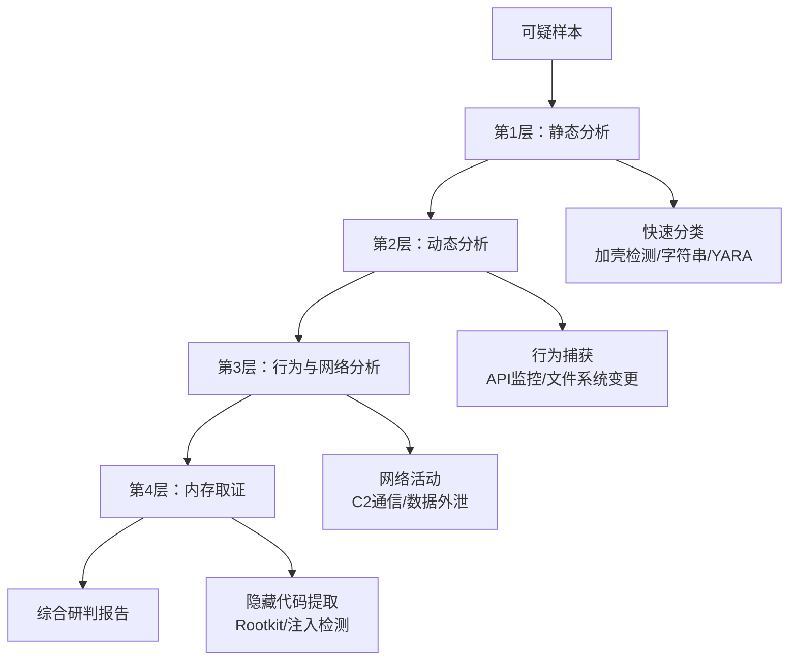

# 24.5 恶意软件分析工具链

## 概述

恶意软件分析工具链是一套系统化的软件工具集合，用于对可疑二进制文件或恶意代码进行解剖、行为追踪、特征提取和威胁评估。工具链的核心理念是**分层递进**：从无需执行的静态分析开始，逐步进入沙箱动态分析、内存取证和网络流量分析，每一层都为下一层提供线索和验证依据。

本章将从**工具的选型哲学**（道）、**分析流程与方法论**（法）、**各工具的具体使用技巧**（术）三个层次展开，而非简单地罗列工具名册。读者将理解"为什么用这个工具"和"如何组合工具得到最大效果"。

---

## 一、工具链的设计哲学（道）

### 1.1 为什么要使用系统化工具链？

- **单一工具永远不够**：IDA Pro 无法直接看到恶意软件的运行时行为，Process Monitor 无法识别花指令混淆后的控制流。每一类工具都有其能力边界。
- **反分析技术日趋复杂**：现代恶意软件会检测调试器、虚拟机和沙箱环境。一个工具链必须包含**反反分析**（anti-anti-analysis）组件来对抗。
- **效率要求**：专业分析师每天可能处理数十个样本，手动逐个工具操作不可行。工具链应支持**批量化、脚本化和自动化**。
- **可复现性**：团队协作时，不同分析师使用不同的工具集会导致结论不一致。标准化的工具链确保结果可复现、可审核。

### 1.2 分层分析模型

恶意软件分析工具链遵循经典的**分层模型**，每一层对应不同的分析深度：



- **第1层（静态分析）**：在不执行样本的前提下提取信息。目标是快速分类：是否为已知恶意软件、是否加壳、使用了哪些库函数。
- **第2层（动态分析）**：在受控环境中执行样本，监控其行为。目标是捕获进程创建、文件写入、注册表修改、API调用序列。
- **第3层（行为与网络分析）**：聚焦样本与外部世界的交互——DNS查询、HTTP请求、C2服务器通信、数据外泄尝试。
- **第4层（内存取证）**：分析样本执行后的内存快照，提取注入的代码、隐藏进程、Rootkit钩子等动态分析中看不到的痕迹。

### 1.3 工具选型三原则

| 原则 | 说明 | 示例 |
|------|------|------|
| **互补性** | 工具之间覆盖不同能力域，而非功能重叠 | Ghidra（反编译）+ x64dbg（调试）= 互补；安装两个调试器 = 冗余 |
| **可扩展性** | 支持插件/脚本/API，允许分析师定制 | IDA的IDAPython、Frida的JavaScript脚本、YARA的自定义规则 |
| **生态活跃度** | 社区维护频率、文档完善度、问题响应速度 | Ghidra每月发布、Cuckoo已停止维护而CAPE活跃 |

> **实用建议**：初学者容易陷入"装遍所有工具"的误区。推荐从**最小可用工具链**开始——Ghidra + x64dbg + Process Monitor + Wireshark + Volatility——再根据实际需求逐步扩展。

---

## 二、静态分析工具详解（器——静态层）

静态分析是工具链的第一道关卡，分析师在此阶段零风险地获取大量信息。下面按照**分析深度从浅到深**的顺序排列工具。

### 2.1 快速分类与格式识别

#### Detect It Easy（DIE）

DIE 是当前最主流的文件类型与加壳检测工具。它通过**签名数据库**识别编译器、加壳器、混淆器和加密算法。

- **核心能力**：支持超过 200 种加壳器和编译器的签名，可检测 UPX、Themida、VMProtect、ASPack 等常见壳，并能识别 .NET Reactor、ConfuserEx 等 .NET 混淆器。
- **脚本扩展**：DIE 使用 LUA 脚本定义签名，用户可为新型壳编写自定义脚本。
- **使用场景**：拿到样本第一步，用 DIE 检查是否加壳。若检测到 UPX，直接用 upx -d 脱壳；若检测到 VMProtect，则做好手动脱壳或直接进入动态分析的准备。

使用示例：
```bash
$ diec sample.exe
PE32 可执行文件 (控制台)
编译器: Microsoft Visual C++ 14.0 (2015)
保护: VMProtect v3.x [检测到]
```

> **注意**：DIE 的检测并非 100% 准确。新型或自定义壳可能逃逸签名检测，此时应结合熵值分析（见下文 2.3 节）综合判断。

#### PEStudio

PEStudio 专为 Windows PE 文件设计，是**零执行静态扫描**的标杆工具。它的核心价值在于**安全评分**机制——对 PE 文件中的每个可疑特征赋予风险等级。

- **关键功能**：
  - **指示器（Indicators）**：标记可疑的导入函数（如 VirtualAlloc、CreateRemoteThread、WriteProcessMemory）、异常节区名称（如 `.text` 节可执行+可写）、未签名的数字证书。
  - **VirusTotal 集成**：将样本哈希提交到 VT，查看已有检测结果。
  - **YARA 集成**：内置 YARA 规则扫描。
  - **字符串分析**：自动分类为 URL、IP 地址、注册表路径、文件名等。

**⚠️ 重要限制**：PEStudio 不执行样本，因此**无法检测**运行时行为或内存层面的混淆。

#### YARA

YARA 是行业标准的恶意软件模式匹配工具。它通过**规则（rule）**描述恶意软件的特征模式，实现快速检测和分类。

- **规则结构**：
  ```yara
  rule Suspicious_Network_Indicators
  {
      strings:
          $ip1 = /https?:\/\/\d{1,3}\.\d{1,3}\.\d{1,3}\.\d{1,3}/
          $sink = "sinkhole" nocase
          $mz = "MZ" at 0
      condition:
          $mz and (any of ($ip*))
  }
  ```
- **常用规则集**：分析师不必从头编写。社区提供了大量高质量规则集：
  - **YARA-Forge**：聚合多源规则，支持按需订阅。
  - **Florian Roth 规则库**：高质量恶意软件分类规则。
  - **CAPE 规则集**：从 CAPE Sandbox 中提取的配置提取规则。
- **编译与分发**：大型环境中，使用 `yarac` 将 `.yar` 规则编译为二进制 `.yarc`，可大幅提升扫描速度。

#### capa（FLARE 能力分析器）

capa 是 FireEye（现 Trellix）FLARE 团队开发的开源工具，用于**逆向识别恶意软件的能力**。与 YARA（基于签名）不同，capa 基于**语义分析**检测恶意功能。

- **检测能力举例**：
  - `"反调试": "通过 NtQueryInformationProcess 检测调试器"`
  - `"键盘记录": "注册键盘钩子"`
  - `"持久化": "安装为 Windows 服务"`
  - `"C2 通信": "通过 HTTP POST 发送加密数据"`
- **使用方式**：
  ```bash
  capa --rules /path/to/rules sample.exe
  ```
  输出包含匹配的能力名称、匹配依据的函数地址以及置信度评分。

**对比 YARA vs capa**：

| 特性 | YARA | capa |
|------|------|------|
| 匹配基础 | 字节/字符串模式 | 函数级语义模式 |
| 抗混淆能力 | 弱（加壳后几乎无效） | 中等（基于反编译结果） |
| 误报率 | 较低 | 较高 |
| 适用阶段 | 初级快速扫描 | 深入逆向分析 |

> **最佳实践**：先用 YARA 做快速分类，再用 capa 理解恶意功能。两者结合使用效果最佳。

### 2.2 反汇编与反编译

#### IDA Pro

IDA Pro 是商业反汇编器的事实标准。它支持 x86/x64/ARM/MIPS/PowerPC 等数十种架构，核心优势在于**交互式反汇编 + 反编译**。

- **关键特性**：
  - **F5 反编译**：Hex-Rays 反编译器将汇编转换为类 C 伪代码，大幅提升分析效率。
  - **IDAPython**：Python 脚本接口，支持批量分析、自动注释、自定义插件。
  - **FLIRT 签名**：自动识别标准库函数（如 VC++ CRT、STL），减少手动标记工作量。
  - **微码（Microcode）优化**：Hex-Rays 的中间表示层支持对控制流进行简化和去混淆。
- **重要插件**：
  - **Lumina**：共享函数签名数据库，可识别已知函数。
  - **HexRaysPyTools**：在反编译输出中添加结构体定义和类型信息。
  - **FindCrypt**：扫描可能的加密算法常数（S盒、魔数），帮助定位加密逻辑。
- **局限**：商业授权费用高（标准版约 $549/年，反编译器另购）；界面学习曲线陡峭。

#### Ghidra

Ghidra 是 NSA 开源的免费逆向工程平台，近年来已形成与 IDA Pro 分庭抗礼的格局。

- **核心优势**：
  - **完全免费**：开源且不受商业限制，适合团队部署。
  - **协作功能**：多个分析师可同时在同一个项目上工作，分析结果实时同步。
  - **强大的反编译器**：Ghidra 的 P-Code 中间表示支持跨架构分析，对 ARM/MIPS 的支持甚至优于 IDA。
  - **脚本化**：支持 Python（Jython）和 Java 脚本。
  - **程序集**：Ghidra 的"程序集"（Program Tree）视图对大型二进制文件的管理更出色。
- **典型工作流**：
  1. 创建项目 → 导入样本 → 自动分析（Auto-Analyze）。
  2. 检查反编译窗口，定位可疑函数。
  3. 使用函数调用图（Call Graph）追踪恶意逻辑。
  4. 用模式搜索查找 XOR 密钥或字符串引用。
- **局限**：启动速度慢（需加载 JVM），对某些新型编译器生成的代码解构不如 IDA 细致。

#### Binary Ninja

Binary Ninja 是 Vector 35 开发的现代逆向平台，特点是**中间语言（IL）驱动的核心架构**。

- **技术亮点**：
  - **多层 IL**：BNIL → MLIL → HLIL 三级抽象，每一层都保留了语义信息，方便编写跨架构的统一分析脚本。
  - **现代化 UI**：深色主题、快捷键自定义、内置终端。
  - **类型系统**：支持 C 结构体自动恢复，对面向对象代码的支持出色。
- **适用场景**：自动化逆向、批量分析、漏洞研究。对于交互式深度逆向，功能仍不及 IDA/Ghidra。
- **定价**：约 $299/年起步，低于 IDA，高于 Ghidra（免费）。

#### Radare2 / Rizin

Radare2（r2）是命令行风格的逆向框架，GitHub 超过 20,000 Stars。Rizin 是其社区复刻版。

- **适用场景**：
  - **远程/无头环境**：通过 SSH 连接的服务器，无法运行 GUI。
  - **自动化流水线**：r2pipe 接口允许 Python/Node.js/Rust 程序调用 r2 的分析能力。
  - **CTF 和漏洞分析**：轻量级，启动快，适合快速原型分析。
- **学习曲线**：极高。命令系统设计独特（类似 Vim 的模态操作），需要专门学习。

### 2.3 PE 结构分析与熵值检测

#### CFF Explorer

CFF Explorer 是 PE 结构查看的瑞士军刀。它能展示 PE 文件的所有结构——DOS 头、NT 头、节区表、导入表、导出表、资源节、TLS 回调。

- **核心用途**：
  - 检查导入表：`kernel32.dll` 中仅出现 `ExitProcess` 一个函数？极其可疑，通常是恶意软件的常见现象（可能使用动态 API 解析或哈希 API 调用）。
  - 节区检测：打开 PE 文件，查看节区名。标准节区（`.text` `.rdata` `.data` `.rsrc`）之外的命名节区（`.kkrev` `.mackt` 等自定义名）通常表示加壳。
  - 熵值分析：CFF Explorer 的"节区查看"页面显示每个节的熵值。正常代码节熵值约 5.0-6.5；加密或压缩后的节熵值接近 7.99。以 UPX 加壳为例，`.UPX0` 节熵值高达 7.9，这是一个明确的信号。

#### 010 Editor + PE Template

010 Editor 是专业级十六进制编辑器，配合 PE 模板解析引擎，可直接二进制层面编辑 PE 文件。

- **典型用法**：研究人员需要修改 PE 文件的入口点（OEP）或重定向导入表时，使用 010 Editor 的模板视图精确定位字段偏移量。

---

## 三、动态分析工具详解（器——动态层）

静态分析完成后（或遇到加壳严重无法直接反编译时），进入动态分析阶段。这里的核心原则是**隔离**：样本必须在与生产环境完全隔离的受控环境中执行。

### 3.1 环境隔离与模拟

#### INetSim

INetSim 是 Linux 平台的网络服务模拟器，在沙箱或分析虚拟机中运行。它模拟 DNS、HTTP、HTTPS、FTP、SMTP、POP3 等服务，让样本以为自己在连接真实网络，但所有流量都被拦截。

- **关键功能**：
  - DNS 解析：对任何域名解析请求返回虚假地址（默认 `10.0.2.x` 网段）。
  - HTTP/HTTPS 模拟：提供虚假的 Web 页面响应，可配置响应内容，模拟 C2 服务器的返回数据。
  - 虚假二进制下载：当恶意软件尝试下载第二阶段 payload 时，INetSim 返回一个无害的模拟文件。
- **配置要点**：
  ```yaml
  # /etc/inetsim/inetsim.conf
  service_bind_address  10.0.2.1
  dns_default_ip        10.0.2.1
  http_fake_response    /path/to/fake_response.html
  ```
- **局限**：样本检测到 INetSim 后可能休眠或退出（部分恶意软件在启动阶段检查 DNS 响应模式）。

#### FakeNet-NG

FakeNet-NG 是 Mandiant（现 Google Cloud）开发的 Windows 平台网络模拟器，适合在 Windows 分析虚拟机中直接运行。

- **与 INetSim 的差异**：FakeNet-NG 运行在 Windows 用户态和内核态驱动层面，能捕获更底层的网络请求。对于使用 Raw Socket 或自定义协议的样本更有效。
- **使用方式**：下载配置后启动 `FakeNet.exe`，所有流量在 GUI 中实时展示。

### 3.2 行为监控

#### Process Monitor（ProcMon）

ProcMon 是 Sysinternals 套件的核心工具，实时监控文件系统、注册表和进程/线程活动。

- **高效过滤**：未加过滤的 ProcMon 每秒产生数千条事件，分析无法进行。
  ```text
  Process Name Is sample.exe
  Operation Is CreateFile OR Operation Is RegSetValue OR Operation Is Process Create
  ```
- **关键观察点**：
  - 文件写入：样本在 `%AppData%` 或 `%Temp%` 下创建了自启动文件或配置。
  - 注册表修改：`HKCU\Software\Microsoft\Windows\CurrentVersion\Run` 新增键值 → 持久化机制。
  - 进程创建：样本以宿主身份运行 cmd.exe 或 powershell.exe → 可能的下载器行为。
- **进程树（Process Tree）**：ProcMon 的 Process Tree 功能可视化展示进程的父子关系，帮助理解恶意软件的启动链。

#### Regshot

Regshot 是一个轻量级注册表比较工具，在运行样本前后各拍摄一次系统快照并对比差异。

- **典型用法**：
  1. 执行样本前点击"1st shot"。
  2. 在受控环境中运行样本 30-60 秒。
  3. 点击"2nd shot"后点击"Compare"。
  4. 查看新增/修改/删除的注册表项。

#### Noriben

Noriben 是一个 Python 脚本框架，可视为**轻量级沙箱**。它将 ProcMon 的输出自动转换为按类别整理的报告。

- **工作原理**：Noriben 启动 ProcMon → 运行样本 → 停止 ProcMon → 解析日志 → 输出 HTML 报告。
- **使用方式**：
  ```cmd
  python noriben.py -t 120 -c "sample.exe arg1 arg2"
  ```
  `-t 120` 指定监控时长 120 秒。
- **适用场景**：快速行为概览。当你只需要确认样本是否写入文件、修改注册表或创建进程时，Noriben 比完整沙箱更轻量。

### 3.3 调试与动态插桩

#### x64dbg

x64dbg 是当前 Windows 平台**最流行的开源调试器**，逐渐取代 OllyDbg 成为首选。

- **核心功能**：
  - **断点系统**：硬件断点、内存断点、条件断点、日志断点。条件断点可在满足特定条件（如 `eax == 0x1234`）时暂停执行。
  - **ScyllaHide**：内置的反反调试插件，对抗 `IsDebuggerPresent`、`NtQueryInformationProcess`、`CheckRemoteDebuggerPresent` 等检测。
  - **脚本化**：x64dbg 的 `x64dbgpy` 插件允许 Python 脚本控制调试器。
  - **内存搜索**：搜索特征字节序列或字符串，定位解密后的 payload。
- **反反调试策略**：现代恶意软件会在执行恶意逻辑前调用反调试 API。x64dbg 配合 **ScyllaHide** 和 **TitanHide** 插件可以绕过大多数用户态反调试检测。
- **实操技巧**：当遇到 `NtDelayExecution`（使进程休眠）时，修改跳转指令或直接跳过调用。在 x64dbg 中 `NOP` 掉 `call NtDelayExecution` 即可快速跳过延迟。

#### Frida

Frida 是跨平台的动态插桩框架，允许在目标进程中注入 JavaScript 代码以拦截和修改函数调用。

- **应用场景**：
  - **Hook API 调用**：拦截 `recv` 查看加密前/解密后的数据。
  - **绕过反调试**：Hook `ptrace`（Android）、`IsDebuggerPresent`（Windows），返回假值。
  - **修改返回值**：在 `CryptUnprotectData` 返回后打印解密的内容。
- **Frida 脚本示例**：
  ```javascript
  // Hook Windows API WriteFile 并记录写入内容
  Interceptor.attach(Module.findExportByName("kernel32.dll", "WriteFile"), {
      onEnter: function(args) {
          var buf = args[1];
          var len = args[2].toInt32();
          console.log("WriteFile to handle:", args[0]);
          console.log("Buffer content:", hexdump(buf, {length: len}));
      }
  });
  ```
- **Frida-trace**：零代码追踪特定 API。一行命令即可监控目标进程的所有文件操作：
  ```bash
  frida-trace -p <PID> -i "CreateFile*"
  ```

> **专业建议**：x64dbg 适合交互式单步调试，Frida 适合自动化 Hook 和脚本化的批量分析。两者互补，而非替代。

#### dnSpy（.NET 恶意软件专用）

针对 .NET 编译的恶意软件，dnSpy 兼具反编译和调试功能。它可以直接修改 C# 代码并重新编译运行，非常适合分析 .NET 下载器和勒索软件。

### 3.4 网络流量分析

#### Wireshark

Wireshark 是网络流量分析的行业标准。在恶意软件分析中，它用于追踪 C2 通信。

- **关键过滤表达式**：
  ```text
  # 仅显示样本进程的流量
  ip.addr == 10.0.2.15

  # 仅显示 HTTP POST 请求
  http.request.method == POST

  # 查找明文 C2 数据
  tcp contains "command"

  # 跟踪完整的 TCP 流
  右键 → Follow → TCP Stream
  ```
- **典型发现**：
  - 样本在启动后 5 秒内发起 DNS 查询 → 确定 C2 域名。
  - HTTP POST 请求 Body 中包含 Base64 编码或 XOR 加密的载荷。
  - DNS TXT 查询返回的数据段可能隐藏着编码后的 C2 指令（DNS 隧道技术）。

#### Tcpview / TCPVCon

Sysinternals 提供的 TCP 连接实时查看工具，轻量直观。当样本发起网络连接时，Tcpview 立即显示目标 IP 和端口。

---

## 四、自动化分析平台

手动分析一个样本可能需要 30 分钟到数小时不等。自动化平台可以在几分钟内完成批量分析，并提供格式化的分析报告。

### 4.1 本地沙箱方案

#### CAPE Sandbox

CAPE（Config And Payload Extraction）是 Cuckoo Sandbox 的活跃复刻版，增加了**配置提取**和**Payload 提取**能力。

- **架构**：
  - **主机（Host）**：运行 CAPE Web 服务和任务管理器的 Linux 主机。
  - **客户机（Guest）**：执行样本的虚拟化 Windows 实例（通常为 Windows 7/10）。
  - **Agent**：客户机中运行的分析代理，将行为数据反馈给主机。
- **新增能力**：
  - **配置提取模块**：支持提取 Dridex、Emotet、FormBook 等常见家族的 C2 配置。
  - **Payload 提取**：从内存中 dump 下载的第二阶段载荷。
  - **自定义签入（YARA + Suricata）**：内置 YARA 和网络入侵检测规则匹配。
- **部署注意事项**：
  - 硬件要求较高：建议 32GB+ RAM、SSD 存储、支持硬件虚拟化的 CPU。
  - 面对反虚拟化检测较为脆弱，样本可通过 `cpuid` 指令、`rdtsc` 时间差检测等方式识别 CAPE 环境。

#### Cuckoo Sandbox（已停止维护）

Cuckoo 是沙箱技术的奠基者，自 2021 年起已进入维护模式。**不建议在新环境部署 Cuckoo**，应优先考虑 CAPE 或商业方案。

### 4.2 在线分析平台

| 平台 | 模型 | 特点 | 适用场景 |
|------|------|------|----------|
| **VirusTotal** | 免费+付费 | 集成 70+ 杀毒引擎，支持文件/URL/IP/域名检测 | 快速判白/判黑 |
| **ANY.RUN** | 免费+付费 | 交互式沙箱，支持实时操作和截图 | 需要手动交互的分析 |
| **Hybrid Analysis** | 免费 | 集成 VT，提供静态+动态报告的深度分析 | 取证级详细报告 |
| **Joe Sandbox** | 商业 | 支持 Windows/Android/macOS/Linux，检测率行业领先 | 企业级深度分析 |
| **Triage** | 免费+付费 | Hatching 运营的云沙箱，配置提取能力强 | 自动化流水线 |

#### ANY.RUN 的独特价值

ANY.RUN 提供**交互式沙箱体验**。分析师可以在远程浏览器中"看到"Windows 桌面，点击按钮、模拟用户操作。这在以下场景尤其有用：

- 勒索软件需要在用户交互后才开始加密。
- 恶意软件仅在鼠标点击特定界面元素时才下载第二阶段载荷。

---

## 五、内存取证与深度分析

有些恶意软件仅在内存中执行，行为监控和网络分析都无法捕获其完整逻辑。内存取证工具填补了这一空白。

### 5.1 Volatility 3

Volatility 是内存取证的事实标准。它分析 RAW 格式的内存转储（由 FTK Imager、WinPmem、或虚拟机的 .vmem 文件生成），提取运行中的进程、网络连接、打开的句柄、内核模块等信息。

- **常用插件**：
  ```bash
  # 列出所有进程（含隐藏进程）
  vol -f memory.dmp windows.pslist
  
  # 查看隐藏在进程列表中的恶意进程
  vol -f memory.dmp windows.psscan
  
  # 提取进程内存镜像
  vol -f memory.dmp windows.memmap --pid 1234 --dump
  
  # 检查内核钩子
  vol -f memory.dmp windows.ssdt
  
  # 检查网络连接（在进程已退出后仍能查看）
  vol -f memory.dmp windows.netscan
  ```
- **关键发现**：
  - `psscan` 发现了 `pslist` 中不存在的进程 → 隐藏进程（Rootkit）。
  - `netscan` 显示已关闭的连接残留 IP 地址 → 即使样本已退出，也能定位 C2 地址。
  - `malfind` 标记可疑内存页 → 检测代码注入。
- **Volatility 2 vs 3**：Volatility 3 使用 Python 3，无需 KDBG 偏移量，支持更多 Windows 版本（Windows 10/11）。Volatility 2 社区插件更丰富。

### 5.2 Rekall

Rekall 是 Volatility 的分支，增加了**实时分析**（无需先 dump 内存）和时间线分析功能。但社区活跃度已低于 Volatility 3，建议优先使用 Volatility。

### 5.3 MemProcFS

MemProcFS 创新地将内存镜像挂载为一个虚拟文件系统，让分析师可以用文件浏览器查看进程、内核对象和内存内容，无需学习命令行插件。对于不熟悉 Volatility 的分析师，MemProcFS 提供了更低的入门门槛。

---

## 六、完整分析案例演示

### 样本：模拟 Emotet 下载器

我们将一个模拟的 Emotet 下载器样本通过完整工具链进行分析，展示每一层的输出和判断。

#### 第 1 步：静态分析（DIE + PEStudio + YARA）

- **DIE 输出**：检测到 UPX 加壳。`upx -d sample.exe` 成功脱壳。
- **PEStudio 输出**：导入函数包括 `URLDownloadToFileW`、`CreateProcess`、`WriteProcessMemory`；VT 检测率 45/70；YARA 规则匹配 `trojan_emotet_downloader`。
- **判断**：高风险，疑似 Emotet 家族下载器。

#### 第 2 步：动态分析（ProcMon + INetSim + Wireshark）

- **ProcMon 捕获**：样本在 `%TEMP%\` 创建 `tmpXXXX.tmp` 文件并写入 2MB 数据；随后创建 `powershell.exe -enc <Base64>` 进程。
- **Wireshark 捕获**：HTTP GET 请求到 `hxxp://185.234.72.18/emotet/ep.exe`，响应为 2MB PE 文件。
- **INetSim 记录**：DNS 查询 `evil-c2.com` 解析为 10.0.2.1（模拟 IP）。
- **判断**：确认样本为 Emotet 下载器，从 C2 服务器下载第二阶段载荷（可能是后续的 TrickBot 或 Ryuk）。

#### 第 3 步：内存取证（Volatility）

- **malfind**：发现进程 `rundll32.exe` 的 `.text` 节包含异常的可执行内存页（RX → RWX），疑似进程注入。
- **netscan**：检测到已关闭的 TCP 连接到 `185.234.72.18:443`。
- **判断**：Emotet 通过进程注入将 shellcode 注入 `rundll32.exe`，建立了加密 C2 通信通道。

#### 最终报告结论

> 样本确认为 Emotet 下载器（SHA256: `d4c...`），使用 UPX 加壳，通过 HTTP 下载第二阶段载荷，将 shellcode 注入 `rundll32.exe` 实现持久化。建议：提取 C2 域名 `evil-c2.com` 加入检测规则，内存中 dump 的第二阶段载荷已提交至 Threat Intelligence 平台。

---

## 七、常见误区与纠正

| 编号 | 误区 | 正确做法 |
|------|------|----------|
| 1 | 静态分析可以解决所有问题 | 静态分析无法对抗执行时解密的代码；动态分析是必不可少的一环 |
| 2 | 沙箱报告 = 全部行为 | 恶意软件可检测沙箱并休眠；必须在多个环境中交叉验证 |
| 3 | YARA 规则命中 = 100% 恶意 | YARA 规则可能产生误报；需结合 VT 检测率和行为证据综合判断 |
| 4 | 脱壳后就可以放心分析 | 恶意软件可能使用了多阶段加壳（多层 UPX + 虚拟化壳）；需逐层脱壳 |
| 5 | 只要一个调试器就够了 | 不同调试器破解不同反调试技巧；x64dbg + Frida 的组合覆盖更全面 |
| 6 | 使用真实域名做 DNS 解析 | 未经隔离的分析环境可能让恶意软件成功连接 C2，造成安全事件 |
| 7 | 只分析 .exe 文件即可 | 恶意软件可能以 DLL、VBS、PowerShell、脚本、文档宏等形式交付 |

---

## 八、进阶方向

### 8.1 自动化流水线搭建

对于大型安全运营中心（SOC），手动分析不可持续。建立自动化分析流水线是进阶目标：

1. **文件入站**：邮件附件或 Web 下载 → 自动化捕获。
2. **YARA 初筛**：匹配已知规则 → 归类家族；未匹配 → 进入深度分析。
3. **CAPE 自动分析**：提交至本地沙箱，等待 5-10 分钟，获取报告。
4. **IOC 提取**：从报告中提取域名、IP、文件哈希、注册表键，自动导入 MISP 或威胁情报平台。
5. **告警推送**：向 SOC 分析师推送分析摘要，标记优先级。

### 8.2 对抗反分析技术

高级恶意软件使用多层反分析技术，包括：

- **反调试**：`NtSetInformationThread`（隐藏线程）、`ZwQueryInformationProcess`（检测调试器）、断点扫描（`0xCC` 字节检测）。
- **反虚拟化**：`cpuid` 检测虚拟机供应商、`rdtsc` 检测时间差（模拟器运行慢于真实硬件）、检查 MAC 前缀（`00:50:56`= VMware、`08:00:27`= VirtualBox）。
- **反沙箱**：休眠（`NtDelayExecution`）、检查用户账户名（不包含"Admin"、"Malware"、"Sandbox"等字符串才执行）、检查文件数量或 CPU 核心数。

应对方案：修改虚拟机 `vmx` 文件隐藏 VMware 特征、使用 **Unicorn Engine**（模拟执行）对抗环境检测、对样本进行**补丁（Patch）**绕过反调试检查。

### 8.3 硬件辅助分析

对于使用虚拟机保护的恶意软件（如 VMProtect、Themida），传统脱壳几乎不可能。此时需要：

- **硬件辅助虚拟化**：使用 Intel PT（Processor Trace）记录指令执行流。
- **Pin / DynamoRIO**：二进制插桩框架，在指令层面记录执行轨迹。
- **Unicorn Engine**：基于 QEMU 的轻量级 CPU 模拟器，不依赖操作系统，非常适合分析壳代码。

---

## 总结

| 分析层级 | 核心工具 | 目标产出 |
|----------|----------|----------|
| 静态分析 | DIE、PEStudio、YARA、capa、Ghidra | 文件类型、加壳检测、YARA 匹配、导入表分析 |
| 动态分析 | x64dbg、ProcMon、Frida、INetSim | 行为日志、API 调用序列、网络连接 |
| 自动化沙箱 | CAPE、ANY.RUN、Hybrid Analysis | 格式化的行为报告、IOC 提取 |
| 网络分析 | Wireshark、FakeNet-NG | C2 地址、协议特征、Payload |
| 内存取证 | Volatility 3、MemProcFS | 隐藏进程、注入代码、加密密钥 |

恶意软件分析工具链不是静止的——恶意软件技术不断演进，工具链也必须持续更新。建议每季度回顾一次工具链的覆盖度，关注社区动向（如 Ghidra 的新版本、CAPE 的新配置提取模块），确保工具链始终处于有效状态。

> **核心信条**：工具只是手段，分析思维才是核心。任何工具链都无法替代分析师对系统原理的深刻理解和对细节的敏锐洞察。