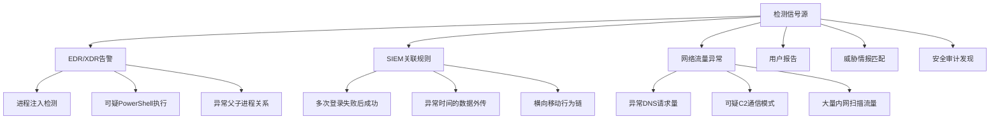
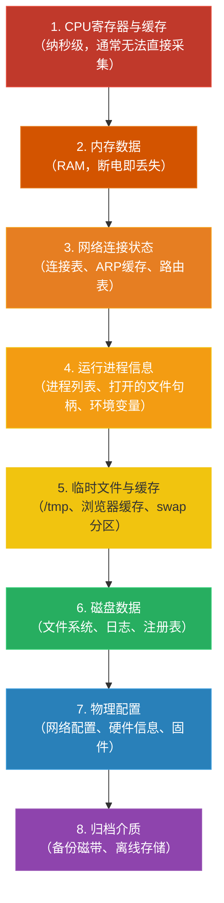

## 24.7 应急响应中的恶意软件处理流程

当恶意软件突破防线进入生产环境，应急响应的速度和质量直接决定了损失范围。一次处理不当的应急响应不仅无法根除威胁，还可能破坏关键证据、导致二次感染，甚至引发法律合规问题。本节从理论框架、六阶段实操流程、证据收集规范、实战案例四个维度，系统阐述恶意软件事件的应急响应方法论。

### 24.7.1 应急响应理论基础

#### 应急响应的定义与目标

应急响应（Incident Response，IR）是指组织在检测到安全事件后，按照预定义的流程和规范，对事件进行识别、遏制、根除和恢复的系统化过程。针对恶意软件事件，应急响应有三个核心目标：

1. **止损**：限制恶意软件的横向移动和数据泄露范围，将业务影响降到最低
2. **取证**：在不破坏证据链的前提下收集和保全数字证据，为后续溯源和法律追诉提供支撑
3. **加固**：消除攻击者利用的入口点，防止同类攻击再次发生

这三个目标之间存在张力——快速恢复业务可能需要牺牲部分取证深度，而彻底取证可能延长业务中断时间。应急响应指挥官需要在三者之间做出动态平衡。

#### NIST SP 800-61 应急响应框架

美国国家标准与技术研究院（NIST）发布的 SP 800-61《计算机安全事件处理指南》是业界公认的应急响应标准框架。该框架将应急响应划分为四个核心阶段，并强调准备阶段的基础作用：


在恶意软件应急响应实践中，通常将"检测与分析"和"遏制/根除/恢复"进一步细化为六个阶段：

| 阶段 | 核心任务 | 时间压力 | 关键产出 |
|------|---------|---------|---------|
| 准备（Preparation） | 建立团队、工具、预案 | 无（事前） | IR预案、工具包、通信矩阵 |
| 识别（Identification） | 确认事件、判断严重等级 | 高 | 事件工单、初始IOC |
| 遏制（Containment） | 隔离感染源、阻断传播 | 极高 | 隔离状态、证据快照 |
| 根除（Eradication） | 清除恶意组件、修补漏洞 | 中 | 清除报告、补丁记录 |
| 恢复（Recovery） | 恢复业务、验证安全 | 中 | 恢复报告、监控增强 |
| 总结（Lessons Learned） | 复盘、改进 | 低（事后） | 事件报告、改进建议 |

#### 恶意软件事件的特殊性

相比一般的网络安全事件，恶意软件事件有几个显著特征，这些特征决定了应急响应策略的差异：

**持久化机制的隐蔽性**：现代恶意软件（尤其是APT相关样本）通常采用多层持久化策略。一个Rootkit可能同时在注册表Run键、WMI事件订阅、计划任务、DLL劫持、固件等多个位置建立持久化点。仅清除其中一个会导致"打地鼠"式的反复感染。

**横向移动的连锁效应**：一旦攻击者在内网获得立足点，会利用Pass-the-Hash、PsExec、WMI远程执行等技术快速扩散。应急响应必须从"单机处理"思维升级为"全网排查"思维。

**反取证技术的对抗**：高级恶意软件会在被发现后启动自毁机制——清除日志、擦除磁盘痕迹、甚至触发勒索加密。应急响应的首要任务是抢在恶意软件自毁之前保全证据。

**供应链风险的外溢**：SolarWinds事件证明，恶意软件可以通过受信任的供应链渠道进入。应急响应时需要评估感染是否已经通过信任链扩散到上下游合作伙伴。

#### 事件严重等级划分

合理的严重等级划分决定了响应资源的调配规模：

| 等级 | 定义 | 响应要求 | 典型场景 |
|------|------|---------|---------|
| P1-紧急 | 核心业务受影响、数据大规模泄露 | 全员响应、15分钟内集结 | 勒索软件加密核心服务器、APT数据外泄 |
| P2-严重 | 非核心业务受影响、可疑横向移动 | 核心团队响应、1小时内集结 | 工作站感染木马、可疑C2通信 |
| P3-一般 | 单点感染、无明显横向移动 | 值班人员处理、4小时内响应 | 单台终端感染广告软件 |
| P4-低 | 已被安全设备拦截、无实际影响 | 记录并归档、下次例会讨论 | 邮件网关拦截的恶意附件 |

等级划分不是静态的——P3事件如果在调查中发现横向移动迹象，应立即升级为P1。

### 24.7.2 应急响应六阶段深度解析

#### 阶段一：准备（Preparation）

准备阶段是整个应急响应体系的地基。没有充分准备的团队在面对真实事件时会陷入混乱——找不到工具、不清楚流程、不知道该通知谁。

**团队建设与角色分工**

一个完整的应急响应团队（CSIRT/CERT）应包含以下角色：

| 角色 | 职责 | 技能要求 |
|------|------|---------|
| 事件指挥官（IC） | 总体决策、资源调配、对外沟通 | 项目管理、安全架构、沟通能力 |
| 恶意软件分析师 | 逆向分析恶意样本、提取IOC | IDA Pro/Ghidra、调试技术、恶意软件分类 |
| 取证分析师 | 内存/磁盘/网络取证 | Volatility、Autopsy、Wireshark |
| 系统管理员 | 执行隔离、清除、恢复操作 | 操作系统内部机制、补丁管理 |
| 威胁情报分析师 | 关联IOC与已知威胁情报 | MITRE ATT&CK、OSINT、TIP平台 |
| 法务/合规代表 | 证据链管理、法律合规咨询 | 数字取证法律、数据保护法规 |

对于中小规模组织，一个人可能兼任多个角色，但职责不能缺失。

**工具包准备**

应急响应工具包应预先准备并定期更新，分为三个层次：

**现场响应工具包（USB/移动硬盘）**：
```bash
# 内存获取工具
# Windows: WinPmem、DumpIt、Magnet RAM Capture
# Linux: AVML (Microsoft)、LiME
# macOS: osxpmem

# 磁盘镜像工具
# FTK Imager CLI、dd、Guymager

# 网络捕获工具
# tcpdump、WiShark portable、NetworkMiner

# 系统信息收集
# KAPE (Kroll Artifact Parser and Extractor)
# Velociraptor agent
# DFIR-ORC (ANSSI出品)
```

**分析环境**：
```bash
# 虚拟化分析环境（隔离网络）
# - REMnux (Linux恶意软件分析)
# - FlareVM (Windows恶意软件分析)
# - SIFT Workstation (数字取证)

# 沙箱环境
# - Cuckoo Sandbox / CAPE Sandbox
# - Any.Run (在线)
# - Joe Sandbox (在线)
```

**通信与协作**：
- 专用通信渠道（不使用可能被入侵的企业邮件系统）
- 事件工单系统
- 证据管理平台
- 加密存储空间

**预案与演练**

预案不能只停留在文档层面，必须通过定期演练验证其有效性：

- **桌面推演（Tabletop Exercise）**：每季度一次，模拟真实场景讨论决策过程
- **技术演练（Functional Exercise）**：每半年一次，在隔离环境中执行完整的IR流程
- **红蓝对抗（Purple Team）**：每年一次，由红队模拟真实攻击，蓝队执行应急响应

#### 阶段二：识别（Identification）

识别阶段的核心挑战是从海量告警中筛选出真正的恶意软件事件，并快速判断其严重等级。

**检测信号源**

恶意软件事件的检测信号通常来自以下渠道：



**初始分诊（Triage）**

收到告警后，需要在30分钟内完成初始分诊，回答以下关键问题：

1. **事件是否真实？** 排除误报（如合法管理工具触发的告警）
2. **感染范围有多大？** 是单机还是多机？是否有横向移动？
3. **恶意软件处于什么阶段？** 刚投递、已执行、已持久化、已在横向移动？
4. **数据是否已经泄露？** 是否检测到外传行为？
5. **业务影响程度？** 核心业务是否受影响？

```bash
# 初始分诊信息收集（Windows - 优先级从高到低）

# 1. 检查可疑进程及其网络连接
netstat -ano | findstr ESTABLISHED
tasklist /v /fi "STATUS eq Running"

# 2. 检查最近的登录事件
wevtutil qe Security "/q:*[System[(EventID=4624 or EventID=4625)]]" /c:50 /rd:true /f:text

# 3. 检查PowerShell执行历史
cat (Get-PSReadLineOption).HistorySavePath

# 4. 检查WMI事件订阅（常见持久化方式）
Get-WMIObject -Namespace root\Subscription -Class __EventFilter
Get-WMIObject -Namespace root\Subscription -Class CommandLineEventConsumer

# 5. 检查计划任务
schtasks /query /fo LIST /v | findstr /i "Task To Run"

# 6. 检查最近修改的文件
forfiles /P C:\Windows\Temp /S /D +0 /C "cmd /c echo @path @fdate @ftime"
```

**IOC提取与关联**

初始IOC（入侵指标）包括：
- **文件IOC**：文件名、MD5/SHA256哈希、文件路径、数字签名信息
- **网络IOC**：C2域名/IP、URL路径、JA3/JA3S指纹、DNS请求模式
- **行为IOC**：进程树、命令行参数、注册表修改、API调用序列

将提取的IOC与威胁情报源（如VirusTotal、AlienVault OTX、微步在线）进行关联，判断是否属于已知威胁家族。

#### 阶段三：遏制（Containment）

遏制阶段的目标是阻止恶意软件继续扩散，同时尽可能保留证据。这是时间最紧迫的阶段——每延迟一分钟，攻击者可能多控制一台主机、多窃取一批数据。

**遏制策略选择**

| 策略 | 操作 | 适用场景 | 代价 |
|------|------|---------|------|
| 网络隔离（断网不断电） | 禁用网卡/修改ACL/VLAN隔离 | 需要保留内存证据 | 业务中断 |
| DNS黑洞 | 将C2域名指向空地址 | C2通信明确 | 部分服务受影响 |
| 防火墙封锁 | 阻断特定IP/端口/协议 | 攻击路径已知 | 可能被绕过 |
| 账户禁用 | 禁用被利用的账户 | 凭据被盗 | 用户受影响 |
| 主机关机 | 强制关机 | 勒索软件加密中（最后手段） | 内存证据丢失 |

**关键决策：断网还是关机？**

```text
                ┌─────────────────────┐
                │  恶意软件正在执行？   │
                └──────┬──────┬───────┘
                  是   │      │  否
                       ▼      ▼
           ┌──────────────┐  ┌──────────────┐
           │ 正在加密文件？│  │ 需要内存取证？│
           └──┬────────┬──┘  └──┬────────┬──┘
           是 │        │ 否  是 │        │ 否
              ▼        ▼        ▼        ▼
         ┌────────┐ ┌────────┐ ┌────────┐ ┌────────┐
         │立即断电 │ │断网不断│ │断网不断│ │ 可以    │
         │（最后手│ │电,获取 │ │电,获取 │ │ 关机    │
         │段,丢失 │ │内存快照│ │内存快照│ │         │
         │证据）  │ │        │ │        │ │         │
         └────────┘ └────────┘ └────────┘ └────────┘
```

**注意事项**：如果选择断电（如勒索软件正在加密），必须记录断电时间点，这对后续时间线分析至关重要。

**网络层面遏制**

```bash
# 1. 通过防火墙封锁C2通信（以iptables为例）
# 立即生效，后续再补充永久规则
iptables -I FORWARD -d <C2_IP> -j DROP
iptables -I FORWARD -s <C2_IP> -j DROP

# 2. DNS层面封锁
# 在内部DNS服务器添加黑洞记录
echo "0.0.0.0 malicious-domain.com" >> /etc/hosts

# 3. VLAN隔离受感染网段
# 在交换机上执行（以Cisco为例）
# configure terminal
# interface vlan <infected_vlan>
#   shutdown

# 4. 检查横向移动痕迹
# 在所有可能被攻击的主机上执行
for ip in $(cat /tmp/suspicious_hosts.txt); do
    echo "=== Checking $ip ==="
    ssh $ip "last -n 20; netstat -tlnp; ps auxf" 2>/dev/null
done
```

**通知与升级**

遏制阶段需要同步执行通知流程：

- **内部通知**：CISO → 管理层 → 法务 → 公关（根据严重等级决定范围）
- **外部通知**：监管机构（如适用）、执法机关（如涉及犯罪）、外部IR服务商（如需要技术支持）
- **供应链通知**：如果感染可能通过供应链扩散，需要通知上下游合作伙伴

#### 阶段四：根除（Eradication）

根除阶段的目标是彻底清除恶意软件的所有组件，并修补被利用的入口点。这是最容易犯错的阶段——表面上清除了恶意文件，但遗漏了持久化机制，导致"治愈"后再次发作。

**恶意组件全面排查清单**

恶意软件通常由以下组件构成，每个都需要逐一排查和清除：

| 组件类型 | 排查方法 | 常见遗漏 |
|---------|---------|---------|
| 主程序文件 | 全盘扫描 + 哈希比对 | 临时目录中的释放文件 |
| 持久化机制 | 注册表/计划任务/WMI/服务/GPO | 多重持久化点 |
| 配置文件 | 搜索可疑XML/JSON/INI | 加密配置文件 |
| 插件/模块 | 扫描%TEMP%/AppData/回收站 | 内存加载的无文件模块 |
| 投递载荷 | 检查邮件附件/下载记录 | 通过合法渠道投递的文件 |
| 网络隧道 | 检查端口转发/代理配置 | DNS隧道/ICMP隧道 |

**持久化机制排查（Windows）**

```bash
# 系统化排查所有持久化点

# 1. 注册表自启动项
# Run/RunOnce键
reg query HKLM\SOFTWARE\Microsoft\Windows\CurrentVersion\Run
reg query HKCU\SOFTWARE\Microsoft\Windows\CurrentVersion\Run
reg query HKLM\SOFTWARE\Microsoft\Windows\CurrentVersion\RunOnce
reg query HKCU\SOFTWARE\Microsoft\Windows\CurrentVersion\RunOnce

# 2. 服务（关注最近创建的服务）
wmic service list brief | sort
sc query type= service state= all | findstr SERVICE_NAME

# 3. 计划任务
schtasks /query /fo CSV /v > C:\evidence\all_tasks.csv

# 4. WMI事件订阅
powershell -c "Get-WMIObject -Namespace root\Subscription -Class __EventFilter"
powershell -c "Get-WMIObject -Namespace root\Subscription -Class CommandLineEventConsumer"
powershell -c "Get-WMIObject -Namespace root\Subscription -Class __FilterToConsumerBinding"

# 5. 启动文件夹
dir /s /b "C:\Users\*\AppData\Roaming\Microsoft\Windows\Start Menu\Programs\Startup"
dir /s /b "C:\ProgramData\Microsoft\Windows\Start Menu\Programs\Startup"

# 6. DLL劫持/Side-Loading
# 检查System32目录中非Microsoft签名的DLL
powershell -c "Get-ChildItem C:\Windows\System32\*.dll | ForEach-Object { $sig = Get-AuthenticodeSignature $_.FullName; if($sig.Status -ne 'Valid') { Write-Output $_.FullName } }"

# 7. 浏览器扩展
dir /s /b "C:\Users\*\AppData\Local\Google\Chrome\User Data\Default\Extensions"
dir /s /b "C:\Users\*\AppData\Roaming\Mozilla\Firefox\Profiles\*.default\extensions"

# 8. COM对象劫持
reg query HKLM\SOFTWARE\Classes\CLSID /s /f InprocServer32
```

**漏洞修补**

根除阶段必须修补攻击者利用的入口点，否则同类攻击会再次发生。常见的漏洞修补措施：

- **已知CVE**：部署厂商发布的安全补丁
- **弱凭据**：强制密码重置、启用MFA
- **配置缺陷**：关闭不必要的服务端口、修复权限配置
- **供应链漏洞**：更新受影响的第三方组件

#### 阶段五：恢复（Recovery）

恢复阶段的目标是将受感染系统恢复到正常业务状态，同时确保恶意软件已被彻底清除。

**恢复策略选择**

| 策略 | 操作 | 适用场景 | 风险 |
|------|------|---------|------|
| 系统重装 | 格式化磁盘、全新安装OS | 高度确定感染范围已知 | 数据可能丢失 |
| 镜像恢复 | 从可信备份还原系统镜像 | 有近期干净备份 | 备份可能已被污染 |
| 原地修复 | 逐一清除恶意组件 | 感染轻微、系统配置复杂 | 可能遗漏组件 |
| 并行替换 | 部署新系统、迁移数据 | 业务不能长时间中断 | 资源消耗大 |

**验证恢复安全性**

恢复后必须进行验证，确保系统干净：

```bash
# 恢复后验证清单

# 1. 全盘反病毒扫描（使用多个引擎）
# ClamAV + 商业AV + YARA规则
clamscan -r --bell -i / > /tmp/clamav_result.txt
yara -r /opt/yara_rules/malware_index.yar / > /tmp/yara_result.txt

# 2. 检查是否还有异常网络连接
ss -tlnp | grep -v "127.0.0.1\|::1"
netstat -ano | grep ESTABLISHED

# 3. 检查系统文件完整性
# Windows: sfc /scannow
# Linux: rpm -Va (RPM系) / debsums -c (Debian系)

# 4. 对比已知良好的基线
diff <(md5sum /usr/bin/*) /tmp/baseline_md5.txt

# 5. 检查日志中是否还有可疑活动
journalctl --since "1 hour ago" | grep -i "error\|fail\|denied"
```

**分阶段恢复**

不要一次性恢复所有服务，应采用分阶段策略：

1. **第一阶段**：恢复核心业务系统，加强监控（48小时观察期）
2. **第二阶段**：恢复非核心业务系统
3. **第三阶段**：恢复全部功能，但保持增强监控（至少2周）
4. **第四阶段**：逐步回归正常监控水平

每个阶段之间留出观察窗口，确认没有异常后再进入下一阶段。

#### 阶段六：总结（Lessons Learned）

总结阶段是最容易被跳过的阶段，但它决定了组织能否从每次事件中提升防御能力。

**事件报告结构**

一份完整的事件报告应包含以下章节：

1. **事件概述**：时间线摘要、影响范围、业务损失评估
2. **技术分析**：攻击向量、恶意软件家族、TTP映射（MITRE ATT&CK）
3. **响应过程**：各阶段采取的措施、决策依据
4. **根因分析**：为什么攻击能够成功、哪些防御措施失效
5. **改进建议**：短期（1周）、中期（1月）、长期（1季度）改进措施
6. **IOC附录**：所有收集到的IOC清单
7. **时间线附录**：按时间顺序排列的关键事件

**MITRE ATT&CK映射**

将攻击者的TTP映射到MITRE ATT&CK框架，可以系统化地识别防御差距：

```text
攻击阶段          技术ID        技术名称              当前防御措施      差距
───────────────────────────────────────────────────────────────────────────
初始访问          T1566.001     钓鱼附件              邮件网关过滤      中
执行              T1059.001     PowerShell            无               高
持久化            T1053.005     计划任务              无               高
权限提升          T1068         漏洞利用              补丁管理滞后     高
防御规避          T1027         混淆文件              AV签名检测       中
凭证访问          T1003.001     LSASS内存             无               高
横向移动          T1021.002     SMB/Windows管理共享   网络分段不完善   中
数据外传          T1041         C2通道外传            无               高
```

### 24.7.3 证据收集与保全

证据收集的质量直接决定了事件分析的深度和法律追诉的可行性。证据收集必须遵循两个原则：**易失性优先**（先收集最容易丢失的数据）和**证据链完整**（每一步操作都必须记录）。

#### 数字证据易失性层级

按照数据易失性从高到低排列，证据收集应严格遵循此顺序：



#### 证据收集操作规范

**哈希验证**：收集的每份证据文件都必须计算哈希值，并记录在证据清单中：
```bash
# Windows (PowerShell)
Get-FileHash -Algorithm SHA256 C:\evidence\memory.raw | Out-File C:\evidence\hashes.txt
Get-FileHash -Algorithm SHA256 C:\evidence\disk.dd | Out-File C:\evidence\hashes.txt -Append

# Linux
sha256sum /evidence/* > /evidence/hashes.txt
```

**证据链记录**（Chain of Custody）：每份证据必须记录以下信息：
- 证据编号（唯一标识）
- 收集时间（UTC格式）
- 收集人
- 收集方法和工具
- 哈希值（SHA256）
- 存储位置
- 所有访问/转移记录

#### Windows系统证据收集

```bash
# === Windows系统完整证据收集脚本 ===
# 在U盘中创建收集脚本，以管理员权限运行

# 设置证据输出目录（使用当前日期时间）
set EVIDENCE_DIR=C:\evidence\%COMPUTERNAME%_%date:~0,4%%date:~5,2%%date:~8,2%
mkdir %EVIDENCE_DIR%

# --- 第1步：内存获取（最高优先级） ---
# 使用WinPmem获取完整内存转储
winpmem_mini_x64.exe %EVIDENCE_DIR%\memory.raw
:: 备选方案：Magnet RAM Capture（GUI工具，更易用）
:: MRC.exe /accepteula /go %EVIDENCE_DIR%\memory.mram

# --- 第2步：网络状态快照 ---
netstat -ano > %EVIDENCE_DIR%\netstat.txt
ipconfig /all > %EVIDENCE_DIR%\ipconfig.txt
arp -a > %EVIDENCE_DIR%\arp.txt
route print > %EVIDENCE_DIR%\route.txt
nbtstat -c > %EVIDENCE_DIR%\nbtstat.txt
netsh firewall show config > %EVIDENCE_DIR%\firewall.txt
netsh wlan show profiles > %EVIDENCE_DIR%\wifi_profiles.txt

# --- 第3步：进程信息 ---
tasklist /v > %EVIDENCE_DIR%\tasklist.txt
wmic process list full > %EVIDENCE_DIR%\wmic_process.txt
wmic process get name,parentprocessid,processid,commandline > %EVIDENCE_DIR%\process_cmdline.txt
# PowerShell版本（信息更丰富）
powershell -c "Get-Process | Select-Object Id,ProcessName,Path,CommandLine,ParentId,StartTime | Export-Csv %EVIDENCE_DIR%\processes.csv -NoTypeInformation"

# --- 第4步：系统信息 ---
systeminfo > %EVIDENCE_DIR%\systeminfo.txt
wmic product list full > %EVIDENCE_DIR%\installed_software.txt
wmic qfe list full > %EVIDENCE_DIR%\hotfixes.txt
wmic startup list full > %EVIDENCE_DIR%\startup.txt

# --- 第5步：事件日志 ---
wevtutil epl Security %EVIDENCE_DIR%\security.evtx
wevtutil epl System %EVIDENCE_DIR%\system.evtx
wevtutil epl Application %EVIDENCE_DIR%\application.evtx
wevtutil epl "Windows PowerShell" %EVIDENCE_DIR%\powershell.evtx
wevtutil epl "Microsoft-Windows-Sysmon/Operational" %EVIDENCE_DIR%\sysmon.evtx 2>nul
wevtutil epl "Microsoft-Windows-WMI-Activity/Operational" %EVIDENCE_DIR%\wmi.evtx 2>nul

# --- 第6步：注册表导出 ---
reg export HKLM %EVIDENCE_DIR%\hklm.reg
reg export HKCU %EVIDENCE_DIR%\hkcu.reg
reg export HKU %EVIDENCE_DIR%\hku.reg

# --- 第7步：计划任务与服务 ---
schtasks /query /fo CSV /v > %EVIDENCE_DIR%\schtasks.csv
sc query type= service state= all > %EVIDENCE_DIR%\services.txt

# --- 第8步：用户与组信息 ---
net user > %EVIDENCE_DIR%\users.txt
net localgroup administrators > %EVIDENCE_DIR%\admins.txt
wmic useraccount list full > %EVIDENCE_DIR%\user_details.txt
net session > %EVIDENCE_DIR%\sessions.txt 2>nul

# --- 第9步：共享与网络资源 ---
net share > %EVIDENCE_DIR%\shares.txt
net use > %EVIDENCE_DIR%\mapped_drives.txt
wmic share list full > %EVIDENCE_DIR%\share_details.txt

# --- 第10步：最近访问痕迹 ---
# 最近打开的文件
dir /s /b "%APPDATA%\Microsoft\Windows\Recent" > %EVIDENCE_DIR%\recent_files.txt
# USB设备历史
reg query "HKLM\SYSTEM\CurrentControlSet\Enum\USBSTOR" > %EVIDENCE_DIR%\usb_history.txt
```

#### Linux系统证据收集

```bash
#!/bin/bash
# === Linux系统完整证据收集脚本 ===
# 以root权限运行

EVIDENCE_DIR="/evidence/$(hostname)_$(date +%Y%m%d_%H%M%S)"
mkdir -p "$EVIDENCE_DIR"

echo "[*] 开始证据收集: $(date -u +%Y-%m-%dT%H:%M:%SZ)"

# --- 第1步：内存获取 ---
# 使用AVML（Microsoft开源工具）
if command -v avml &>/dev/null; then
    avml "$EVIDENCE_DIR/memory.lime"
elif [ -f /proc/vmcore ]; then
    cp /proc/vmcore "$EVIDENCE_DIR/memory.lime"
else
    echo "[!] 无法获取内存，尝试安装LiME"
    # LiME需要内核模块支持
    # insmod lime-$(uname -r).ko "path=$EVIDENCE_DIR/memory.lime format=lime"
fi

# --- 第2步：网络状态 ---
ss -tlnp > "$EVIDENCE_DIR/ss_listening.txt"
ss -tnp > "$EVIDENCE_DIR/ss_established.txt"
netstat -ano > "$EVIDENCE_DIR/netstat.txt"
ip addr > "$EVIDENCE_DIR/ip_addr.txt"
ip route > "$EVIDENCE_DIR/ip_route.txt"
arp -an > "$EVIDENCE_DIR/arp.txt"
iptables -L -n -v > "$EVIDENCE_DIR/iptables.txt"
cat /etc/resolv.conf > "$EVIDENCE_DIR/resolv.conf"

# --- 第3步：进程信息 ---
ps auxf > "$EVIDENCE_DIR/ps_auxf.txt"
ls -la /proc/*/exe 2>/dev/null > "$EVIDENCE_DIR/proc_exe.txt"
ls -la /proc/*/fd/ 2>/dev/null > "$EVIDENCE_DIR/proc_fd.txt"
cat /proc/*/cmdline 2>/dev/null | tr '\0' ' ' > "$EVIDENCE_DIR/all_cmdlines.txt"

# --- 第4步：系统信息 ---
uname -a > "$EVIDENCE_DIR/uname.txt"
cat /etc/os-release > "$EVIDENCE_DIR/os_release.txt"
rpm -qa 2>/dev/null > "$EVIDENCE_DIR/rpm_packages.txt" || dpkg -l 2>/dev/null > "$EVIDENCE_DIR/dpkg_packages.txt"
last -n 50 > "$EVIDENCE_DIR/last.txt"
lastb -n 50 > "$EVIDENCE_DIR/lastb.txt"
who > "$EVIDENCE_DIR/who.txt"
w > "$EVIDENCE_DIR/w.txt"

# --- 第5步：日志收集 ---
cp -r /var/log/ "$EVIDENCE_DIR/var_log/"
# journald日志
journalctl --since "7 days ago" > "$EVIDENCE_DIR/journal_7days.txt" 2>/dev/null

# --- 第6步：持久化机制 ---
# crontab
for user in $(cut -f1 -d: /etc/passwd); do
    crontab -l -u "$user" > "$EVIDENCE_DIR/crontab_${user}.txt" 2>/dev/null
done
cp /etc/crontab "$EVIDENCE_DIR/" 2>/dev/null
cp -r /etc/cron.d/ "$EVIDENCE_DIR/cron.d/" 2>/dev/null
cp -r /etc/cron.daily/ "$EVIDENCE_DIR/cron.daily/" 2>/dev/null

# systemd服务
systemctl list-unit-files --type=service > "$EVIDENCE_DIR/systemd_services.txt"
ls -la /etc/systemd/system/ > "$EVIDENCE_DIR/systemd_custom.txt"

# 启动脚本
cat /etc/rc.local > "$EVIDENCE_DIR/rc.local" 2>/dev/null
ls -la /etc/init.d/ > "$EVIDENCE_DIR/initd.txt"

# --- 第7步：用户信息 ---
cat /etc/passwd > "$EVIDENCE_DIR/passwd.txt"
cat /etc/shadow > "$EVIDENCE_DIR/shadow.txt" 2>/dev/null
cat /etc/group > "$EVIDENCE_DIR/group.txt"
cat /etc/sudoers > "$EVIDENCE_DIR/sudoers.txt" 2>/dev/null
find /home -name ".ssh" -type d -exec ls -la {} \; > "$EVIDENCE_DIR/ssh_keys.txt" 2>/dev/null

# --- 第8步：文件系统线索 ---
find /tmp -type f -mtime -7 -ls > "$EVIDENCE_DIR/tmp_recent.txt"
find /dev/shm -type f -ls > "$EVIDENCE_DIR/dev_shm.txt"
find / -name "*.conf" -newer /etc/hostname -ls > "$EVIDENCE_DIR/recent_conf.txt" 2>/dev/null
# 隐藏文件
find / -name ".*" -not -path "/proc/*" -not -path "/sys/*" -type f -ls > "$EVIDENCE_DIR/hidden_files.txt" 2>/dev/null

# --- 计算所有证据的哈希 ---
cd "$EVIDENCE_DIR"
find . -type f -exec sha256sum {} \; > hashes.txt

echo "[+] 证据收集完成: $(date -u +%Y-%m-%dT%H:%M:%SZ)"
echo "[+] 证据目录: $EVIDENCE_DIR"
echo "[+] 证据哈希已记录在 hashes.txt"
```

#### 网络流量证据

网络流量捕获应在遏制措施实施之前开始，因为封锁C2通信后就无法再捕获：

```bash
# 实时捕获恶意通信（后台运行）
# 保存为pcap文件供后续分析
tcpdump -i eth0 -w /evidence/capture_$(date +%Y%m%d_%H%M%S).pcap -s 0

# 如果已知C2地址，可以针对性捕获
tcpdump -i eth0 host <C2_IP> -w /evidence/c2_traffic.pcap -s 0

# 如果需要长期捕获，使用分段保存（每100MB一个文件）
tcpdump -i eth0 -w /evidence/capture_%Y%m%d_%H%M%S.pcap -C 100 -s 0
```

### 24.7.4 实战案例：勒索软件应急响应

以下案例基于多个真实事件的综合，展示了完整的恶意软件应急响应过程。

#### 事件背景

某中型企业（约500人）在周一早上发现多个文件服务器上的文件被加密，扩展名被改为`.locked`。财务部共享盘中所有Excel和PDF文件无法打开，同时EDR告警显示多台主机存在可疑的PowerShell执行记录。

#### 时间线还原

| 时间 | 事件 | 响应动作 |
|------|------|---------|
| T+0h | 文件服务器管理员发现文件被加密 | 上报IT经理，启动IR流程 |
| T+0.5h | IR团队集结，开始分诊 | 确认是勒索软件事件，判定为P1 |
| T+1h | 网络层遏制：封锁已知C2域名，VLAN隔离受感染网段 | 防火墙规则部署 |
| T+1.5h | 主机遏制：断开受感染服务器网络（保留内存） | 内存转储开始 |
| T+2h | 初步分析：确认恶意软件为LockBit变种 | 关联威胁情报，提取IOC |
| T+3h | 全网排查：使用IOC扫描所有主机 | 发现另外8台感染主机 |
| T+4h | 根因分析：攻击者通过RDP暴力破解进入 | 确认初始入口点 |
| T+5h | 根除：禁用所有外网RDP访问，重置所有管理员密码 | 修补漏洞 |
| T+8h | 恢复：从离线备份恢复文件服务器 | 验证备份完整性 |
| T+24h | 全面恢复：业务系统恢复运行 | 增强监控部署 |
| T+1周 | 事件报告完成，改进建议提交 | 安全加固措施执行 |

#### 关键决策与教训

**正确的决策**：
- 选择了网络隔离而非立即关机，保留了内存中的恶意软件运行痕迹
- 在遏制之前启动了网络流量捕获，获得了完整的C2通信数据
- 使用离线备份而非尝试解密，缩短了恢复时间

**改进空间**：
- RDP暴露在公网长达3个月未被发现，说明资产管理和暴露面监控不足
- 备份虽然可用，但距离感染发生已有72小时，部分数据丢失
- 应急响应团队花了30分钟才完成集结，说明值班制度需要优化

### 24.7.5 常见误区与纠正

#### 误区一：清除了恶意文件就等于根除了威胁

**错误做法**：删除恶意EXE文件，认为感染已清除。

**正确做法**：恶意软件通常包含多个组件——主程序、持久化机制、配置文件、插件模块。必须系统化排查所有组件，特别是持久化机制。一个典型的APT后门可能同时在注册表Run键、WMI事件订阅、计划任务、服务中建立持久化，只清除其中任何一个都会导致"治愈"后再次发作。

#### 误区二：使用同一台被感染的系统进行分析

**错误做法**：在感染主机上运行杀毒软件扫描，直接作为分析依据。

**正确做法**：高级恶意软件会Hook系统API，导致在同一台主机上运行的工具看到的是被篡改的信息（如隐藏进程、隐藏文件）。应将内存转储和磁盘镜像导出到干净的分析环境中进行分析。至少使用两台以上的扫描引擎交叉验证结果。

#### 误区三：急于恢复业务而跳过取证

**错误做法**：领导要求尽快恢复业务，直接重装系统覆盖了所有证据。

**正确做法**：在恢复之前必须完成关键证据的采集——至少包括内存转储、网络连接状态、关键日志。如果必须快速恢复，可以在恢复之前对磁盘做完整镜像（使用dd或FTK Imager），留待后续离线分析。记住：证据一旦被覆盖就无法恢复。

#### 误区四：只关注受感染主机，忽略横向移动

**错误做法**：清理了告警中提到的那台主机就结束响应。

**正确做法**：必须假设攻击者已经在内网横向移动。使用收集到的IOC（IP、域名、文件哈希、命令行特征）扫描全网。同时检查域控制器、关键服务器的日志，确认是否有异常登录或可疑操作。很多案例中，安全团队清理了表面上的感染，但攻击者早已在另一台主机上建立了新的据点。

#### 误区五：将事件报告束之高阁

**错误做法**：写完事件报告后就结束了，没有跟踪改进措施的执行。

**正确做法**：事件报告中的改进建议必须转化为具体的待办事项，分配责任人和截止日期，并在后续的安全会议上跟踪执行进度。如果改进措施没有落地，同类事件必然再次发生。

### 24.7.6 进阶：自动化响应与威胁狩猎

#### SOAR平台集成

对于频繁出现的恶意软件事件类型，可以通过SOAR（Security Orchestration, Automation and Response）平台将标准化的响应流程自动化：

```python
# SOAR playbook 伪代码示例：恶意软件事件自动化响应

def malware_incident_playbook(alert):
    """恶意软件事件自动化响应Playbook"""

    # 第1步：自动分诊
    enrichment = {
        "virustotal": query_virustotal(alert["file_hash"]),
        "abuseipdb": query_abuseipdb(alert["src_ip"]),
        "threat_intel": match_ioc_database(alert["ioc_list"]),
        "asset_criticality": lookup_asset_value(alert["hostname"])
    }

    # 第2步：自动判定严重等级
    severity = calculate_severity(
        detection_count=alert["count"],
        vt_detection_rate=enrichment["virustotal"]["positives"],
        asset_criticality=enrichment["asset_criticality"],
        threat_intel_match=enrichment["threat_intel"]["known_campaign"]
    )

    if severity >= "P2":
        # 第3步：自动遏制
        isolate_host(alert["hostname"], method="network")
        block_iocs_at_firewall(enrichment["threat_intel"]["c2_list"])
        create_forensic_snapshot(alert["hostname"])

        # 第4步：通知人工分析师
        notify_team(
            channel="ir-escalation",
            message=format_incident_summary(alert, enrichment, severity),
            mention_on_call_analyst()
        )
    else:
        # 低严重度：自动处置
        quarantine_file(alert["file_path"])
        update_endpoint_protection(alert["file_hash"])
        close_alert(alert["id"], resolution="auto-contained")
```

#### 主动威胁狩猎

不要等到告警才响应——通过主动威胁狩猎（Threat Hunting）可以在恶意软件造成损害之前发现它：

```bash
# 威胁狩猎查询示例

# 猎捕1：可疑的父子进程关系
# explorer.exe → cmd.exe → powershell.exe 是可疑的
SELECT process_name, parent_name, command_line, COUNT(*) as cnt
FROM process_events
WHERE parent_name = 'cmd.exe'
  AND process_name = 'powershell.exe'
  AND command_line LIKE '%-enc%' OR command_line LIKE '%bypass%'
GROUP BY process_name, parent_name
ORDER BY cnt DESC;

# 猎捕2：异常的DNS请求（DGA域名特征）
SELECT query_name, COUNT(*) as request_count
FROM dns_log
WHERE query_name NOT LIKE '%.internal.%'
  AND LENGTH(query_name) > 20
  AND query_name REGEXP '^[a-z0-9]{15,}\..*$'
GROUP BY query_name
HAVING request_count > 10
ORDER BY request_count DESC;

# 猎捕3：异常的PowerBase64命令
SELECT command_line, user, timestamp
FROM process_events
WHERE process_name = 'powershell.exe'
  AND (command_line LIKE '%[Convert]::FromBase64String%'
    OR command_line LIKE '%-EncodedCommand%'
    OR command_line LIKE '%System.IO.Compression%');
```

#### 构建恶意软件分析沙箱

对于需要深入分析的样本，部署本地沙箱可以避免样本外泄风险：

```yaml
# CAPE Sandbox 部署配置示例
# CAPE是Cuckoo Sandbox的活跃分支

# 基础架构
components:
  - cape-server    # 分析调度器
  - cape-web       # Web管理界面
  - cape-database  # PostgreSQL数据库
  - cape-machinery # 虚拟化管理（KVM/VMware/VirtualBox）

# 分析虚拟机配置
vms:
  windows10:
    platform: windows
    os_version: "10"
    memory: 4096
    snapshot: clean_baseline
    network: isolated_nat
  ubuntu22:
    platform: linux
    os_version: "22.04"
    memory: 2048
    snapshot: clean_baseline
    network: isolated_nat

# 分析超时
timeouts:
  default: 120      # 默认分析2分钟
  critical: 300     # 关键样本分析5分钟
  network_only: 60  # 网络行为分析1分钟
```

#### 持续改进机制

应急响应能力的提升是一个持续过程，需要建立以下机制：

1. **指标追踪**：MTTD（平均检测时间）、MTTR（平均响应时间）、MTTC（平均遏制时间）
2. **知识库维护**：将每次事件的IOC、TTP、处置方法沉淀到知识库
3. **预案迭代**：根据每次事件的经验教训更新IR预案
4. **工具更新**：定期更新工具包中的工具版本和规则库
5. **技能培养**：定期培训和演练，保持团队的技术敏锐度
