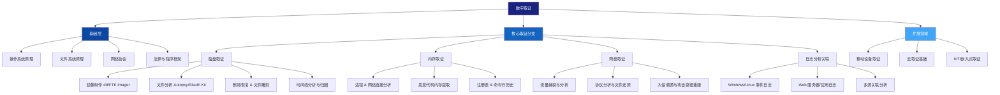
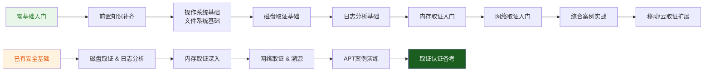

# 第25章 数字取证——章节概览

## 引言

数字取证（Digital Forensics）是网络安全领域中**承上启下**的核心学科。当安全事件发生后，组织不仅需要快速响应和恢复（事件响应），更需要深入调查事件的来龙去脉——谁、什么时间、通过什么方式、做了什么、留下了什么痕迹——收集和保存具有法律效力的电子证据，为后续的法律追诉、责任认定和安全改进提供坚实依据。可以说：**事件响应回答"发生了什么"，数字取证回答"是谁做的、怎么证明"。**

在当今数字化时代，每一起犯罪案件几乎都可能涉及数字证据。根据 Verizon 2024 年数据泄露调查报告（DBIR），超过 80% 的泄露事件涉及数字证据的提取与分析，而近 60% 的起诉案件因电子证据链不完整而导致定罪困难。从企业数据泄露事件到网络诈骗案件，从内部人员违规操作到国家级 APT 组织的持续渗透攻击，数字取证技术贯穿于安全事件生命周期的每一个环节。

数字取证并非单一技术，而是**涉及磁盘分析、内存分析、网络流量溯源、日志关联、移动设备提取、云环境收集、数据库审计、嵌入式/IoT 取证**等多个子领域的系统工程。一个成熟的数字取证专家既要具备扎实的操作系统原理和文件系统知识，又要熟悉法律程序和证据规则，能够在技术深度和法律严谨性之间取得平衡。

## 数字取证学科全景

数字取证自 1980 年代起步以来，已发展为包含多个分支的成熟学科。各分支的核心关注点和技术栈各不相同，下表清晰呈现了它们之间的差异：

| 取证分支 | 分析对象 | 核心关注 | 典型工具 | 难度等级 |
|---------|---------|---------|---------|---------|
| **磁盘取证** | 硬盘、SSD、USB | 文件系统、删除恢复、痕迹分析 | Autopsy, FTK Imager, The Sleuth Kit | ★★★☆☆ |
| **内存取证** | RAM、页面文件、休眠文件 | 运行时进程、网络连接、Rootkit | Volatility 3, Rekall, MemProcFS | ★★★★☆ |
| **网络取证** | PCAP、NetFlow、防火墙日志 | 流量还原、攻击溯源、协议分析 | Wireshark, Zeek, NetworkMiner | ★★★☆☆ |
| **日志取证** | 系统日志/应用日志/SIEM | 时间线重建、多源关联 | ELK Stack, Splunk, LogParser | ★★☆☆☆ |
| **移动取证** | 手机、平板、SIM卡 | 应用数据、通信记录、位置轨迹 | Cellebrite, Magnet AXIOM | ★★★★☆ |
| **云取证** | SaaS/IaaS/PaaS 环境 | 虚拟磁盘、API 日志、容器卷 | Cloud Forensics Utils，自定义脚本 | ★★★★☆ |
| **数据库取证** | 关系数据库、NoSQL | 事务日志、数据篡改追溯 | SQL Examiner, ApexSQL Log | ★★★☆☆ |
| **IoT/嵌入式取证** | 路由器、智能设备、工控系统 | 固件分析、内存转储、传感器日志 | Binwalk, Firmadyne | ★★★★★ |

> 📌 **本章重点覆盖**磁盘取证、内存取证、网络取证和日志分析四大核心分支，同时简要介绍移动设备和云取证的基础内容。其余分支作为进阶学习方向提供参考资源。

下面这张思维导图可以帮助你理解各分支之间的层次关系和依赖顺序：

## 数字取证的方法论与法律框架

技术操作只是数字取证的外壳，**严谨的方法论和合规的法律意识**才是其内核。理解以下核心概念，是开展任何取证工作的前提：

### 核心原则：洛卡德交换原理

在物理世界中，洛卡德交换原理（Locard's Exchange Principle）指出："每一次接触都会留下痕迹。"数字世界亦然——每一次登录、文件打开、网络连接、进程创建，都会在系统上留下或多或少的数字痕迹。数字取证的核心工作就是**发现、提取、保存和解释这些痕迹**，使其成为可采信的证据。

### 数字取证的基本原则

国际上公认的数字取证五大原则（源自 ACPO 指南和 SWGDE 标准）：

1. **最小干涉原则（Minimal Handling）**：取证操作应尽可能减少对原始数据的修改。任何操作都应首先创建原始数据的比特级副本（镜像），在所有分析工作中使用副本而非原始介质。
2. **证据链原则（Chain of Custody）**：从证据被获取的那一刻起，必须完整记录每一环节——谁、什么时间、因为什么目的、接触了什么证据。证据链的断裂可能直接导致证据在法庭上被排除。
3. **可重复性原则（Repeatability）**：取证分析的结果应当可以被其他取证人员使用相同的方法和工具重复验证。这意味着工具选择、参数设置、分析步骤都必须记录在案。
4. **全面性原则（Comprehensiveness）**：不应只关注"明显的证据"，而应全面收集可能相关的所有数据。侦查初期无法判断哪些数据最终会成为关键证据。
5. **时效性原则（Timeliness）**：数字证据极其脆弱——运行中的系统可能随时覆盖内存，日志可能被自动轮转删除，进程可能自动退出。取证响应必须迅速。

### 取证流程框架（NIST SP 800-86）

NIST SP 800-86（Guide to Integrating Forensic Techniques into Incident Response）将数字取证生命周期划分为四个阶段：

| 阶段 | 核心任务 | 关键输出 |
|------|---------|---------|
| **收集（Collection）** | 识别证据来源、获取授权、制作镜像、记录元数据 | 原始镜像文件（DD/E01）、哈希值、照片记录 |
| **检查（Examination）** | 对收集的数据进行技术检查，提取相关信息 | 文件系统时间线、恢复的文件、内存转储分析报告 |
| **分析（Analysis）** | 综合多种来源的信息，重建事件经过，得出结论 | 事件时间线、攻击路径图、归因分析 |
| **报告（Reporting）** | 撰写规范报告，以非技术人员也能理解的方式呈现发现 | 取证报告、专家证言摘要、可视化图表 |

四个阶段并非严格串行——在分析阶段发现新的线索，可能需要回头补充收集新的数据源，形成迭代深化的工作模式。

## 本章学习目标

通过本章的学习，读者将能够：

### 目标1：理解数字取证的基本概念和法律框架

掌握数字取证的定义、分类、基本原则（前述ACPO/SWGDE原则）和相关的法律法规要求（如《网络安全法》《电子数据取证规则》、GDPR、PCI DSS 等合规要求对取证的影响）。本章的目标不是让你成为法学专家，而是建立**合规取证意识**——知道哪些操作可能导致证据在法庭上被排除，懂得如何记录证据链，避免好心办坏事。

### 目标2：掌握磁盘取证的核心技术

磁盘取证是数字取证的基础。本章会深入讲解磁盘镜像制作（DD、E01、AFF 格式的优劣对比）、文件系统分析（NTFS、FAT32、ext4、APFS 的关键结构和取证关注点）、已删除文件恢复（元数据恢复与文件雕刻两种路径的适用场景）、时间线分析（MACB 时间线、Super Timeline 构建）等关键技术。学完本节，你应该能够从一台"死机"的硬盘中重建用户行为的完整时间线。

### 目标3：掌握内存取证技术

为什么需要内存取证？因为**磁盘上不存在的证据往往在内存中**——网络连接信息、加密通信的明文密钥、未保存的文件内容、正在运行的 Rootkit 代码。本章会深入 Windows/Linux 内存数据结构，教你使用 Volatility 3 和 Rekall 进行进程枚举、网络连接提取、DLL/驱动模块分析、CMD/PowerShell 历史命令提取、以及恶意代码的内存特征发现。

### 目标4：掌握网络取证技术

网络取证回答"数据在网络上是怎么走的"。本章涵盖网络流量捕获（TAP/端口镜像/网络嗅探的部署策略）、协议分析（HTTP/DNS/SMB 等关键协议的取证价值）、文件还原（从 PCAP 中提取传输的文件）和入侵溯源（从网络层面还原攻击路径——从初始入口点到内部横向扩散再到数据外泄）。

### 目标5：掌握日志分析与关联技术

日志是事件响应的"第一手资料"——但前提是你能从海量日志中**快速找到关键线索**。本章涵盖 Windows Event Log（特别是 PowerShell 日志、4688 进程创建事件、Sysmon）、Linux 系统日志（auth.log、syslog）、Web 服务器访问日志（Apache/Nginx/IIS 的请求模式分析）以及多源关联方法（时间窗口关联、IP 关联、用户行为基线分析）。

### 目标6：了解移动设备取证和云取证

移动设备已成为"每个人随身携带的取证金矿"——通信记录、位置轨迹、照片元数据、应用聊天记录。本章简要介绍 Android/iOS 的数据提取方法（逻辑提取与物理提取的差异）以及云环境（AWS/Azure/GCP）下的证据收集策略和特有挑战（多租户隔离、数据主权、API 采集权限）。

### 目标7：能够编写规范的取证报告

取证分析做得再好，如果无法以清晰、规范、有说服力的方式呈现，在法庭上或管理层面前就毫无价值。本章会讲解取证报告的标准结构、证据标记方法、时间线的可视化呈现方式，以及如何做好在面对交叉询问时站住脚的准备。

## 学习路线图：从入门到精通

本章内容按照**渐进式**学习曲线组织。不同基础的读者可以参考以下路径规划学习顺序：

### 建议学习时间分配

根据内容深度和实操密度，建议如下分配学习时间：

| 模块 | 建议时长 | 理论/实操比例 | 最关键实操 |
|------|---------|-------------|-----------|
| 磁盘取证 | 8-12小时 | 40%/60% | 用 dd/FTK Imager 制作镜像，用 Autopsy 分析案例镜像 |
| 内存取证 | 6-10小时 | 35%/65% | 用 Volatility 3 分析至少 3 个不同的内存转储样本 |
| 网络取证 | 6-8小时 | 40%/60% | 用 Wireshark 分析 PCAP，还原攻击流量 |
| 日志关联 | 4-6小时 | 45%/55% | 用 ELK 搭建日志分析环境，关联多源日志 |
| 综合案例 | 6-8小时 | 20%/80% | 完整走一遍从发现事件到出具报告的全流程 |

> 💡 **建议**：总学习时间约 30-45 小时，分 2-3 周完成，每周至少保留一次集中 4 小时以上的实操时段。

## 适用读者

本章内容适用于以下读者群体：

| 角色 | 关注重点 | 预期收获 |
|------|---------|---------|
| **安全运维工程师 / 事件响应人员** | 磁盘和内存取证实操、日志关联分析 | 能够独立完成常见安全事件的取证调查 |
| **企业安全团队成员** | 全流程取证方法、证据链管理、报告撰写 | 建立规范的内部取证流程和应急响应机制 |
| **有志于数字取证的安全研究人员** | 原理深入、工具细节、案例研究 | 打下系统性基础，为进一步考取认证做准备 |
| **安全管理者 / CISO** | 取证方法论、法律框架、合规要求 | 理解取证工作的价值和必要资源投入，做出明智决策 |
| **执法 / 法律相关人员** | 证据规则、链式保管、取证报告解读 | 能够评估取证工作的合规性和有效性 |

## 前置知识

学习本章内容前，建议读者具备以下基础知识：

| 领域 | 具体知识点 | 推荐学习途径 |
|------|-----------|-------------|
| **操作系统原理** | Windows 内核架构、进程/线程管理、虚拟内存、注册表；Linux 内核架构、文件权限、进程模型 | 《深入理解计算机系统》(CS:APP) 第7-9章 |
| **文件系统基础** | NTFS（MFT、$LogFile、$UsnJrnl）、ext4（inode、journal）、FAT32（FAT表、目录结构） | 第9章、16章（本书操作系统相关章节） |
| **网络协议基础** | TCP/IP 协议栈、HTTP/DNS/SMB 协议基本运作机制 | 《TCP/IP 详解》卷1，或本书网络基础章节 |
| **安全事件基本概念** | 什么是安全事件、事件响应流程（NIST SP 800-61）、常用安全术语（IoC、TTP、C2） | 第23章 事件响应基础 |

> ⚠️ 如果你对上述知识点完全陌生，建议先花 3-5 天补齐基础再开始本章学习。操作系统和文件系统的底层理解直接影响取证工作的深度。

## 工具环境与实验准备

数字取证是**极度依赖实操**的学科。光学理论不亲手操作，就像只看食谱不炒菜——永远学不会。建议在学习本章之前搭建好以下实验环境：

### 核心取证工具一览

| 工具 | 用途 | 平台 | 推荐版本 | 安装命令 / 方式 |
|------|------|------|---------|----------------|
| **Autopsy** | 图形化磁盘取证分析平台 | Windows/Linux | 4.21+ | apt install autopsy 或从 sleuthkit.org 下载安装包 |
| **FTK Imager** | 镜像制作与初步检查 | Windows | 4.7+ | 从 AccessData 官网下载免费版 |
| **dd / dc3dd** | 命令行磁盘镜像制作 | Linux | 系统自带 | apt install dc3dd（增强版dd，含哈希记录功能） |
| **The Sleuth Kit (TSK)** | 命令行文件系统分析 | Linux/Windows | 4.12+ | apt install sleuthkit |
| **Volatility 3** | 内存取证分析框架 | Python跨平台 | 2.5+ | git clone + pip install（推荐从 GitHub 获取最新版） |
| **Wireshark** | 网络流量捕获与分析 | 跨平台 | 4.2+ | apt install wireshark 或下载安装包 |
| **Zeek** | 网络流量元数据提取框架 | Linux | 6.1+ | apt install zeek 或从 zeek.org 安装 |
| **ELK Stack** | 日志集中管理与搜索 | Linux | 8.x | 使用 Docker Compose 一键部署（本章提供 docker-compose.yml） |
| **LogParser** | Windows 日志查询工具 | Windows | 2.2+ | 微软官方下载 |
| **CAINE Linux** | 集成取证工具的操作系统 | Linux (Live) | 12.x | 下载 ISO 制作启动 U盘或虚拟机使用 |
| **SIFT Workstation** | SANS 官方取证工作站 | Ubuntu | 最新版 | 下载 OVA 导入 VirtualBox/VMware |

### 实验环境搭建建议

1. **首选方案——取证工作站虚拟机**：下载 SIFT Workstation 或 CAINE 的 OVA 镜像，导入到 VirtualBox/VMware 中。这些系统已经预装好大部分取证工具，开箱即用。这是**最省力、最推荐**的方案。

2. **次选方案——自行配置 Ubuntu**：在 Ubuntu 22.04 LTS 或更新的系统上，逐一手动安装上述工具。可以更深入理解每个工具的安装依赖和配置，适合想要深入了解的学习者。

3. **练习材料来源**：
   - **DFIR Madness**（dfirmadness.com）——免费提供大量真实取证案例镜像
   - **CFreds**（cfreds.nist.gov）——NIST 计算机取证参考数据集
   - **Hacking Case**（hackingcase.com）——韩国 KISA 提供的取证练习案例
   - **CyberDefenders**——取证挑战平台，社区活跃，有指导教程
   - **BTLO（Blue Team Labs Online）**——蓝队练习平台，包含取证挑战
   - **TryHackMe | Hack The Box**（专门取证实战房间）

### 硬件要求

- **CPU**：至少 4 核，推荐 8 核以上（同时运行多个虚拟机时需要）
- **内存**：至少 16GB，推荐 32GB（Windows 宿主机 + 取证 VM + 分析工具同时运行）
- **存储**：至少 100GB 空闲空间（用于存放练习镜像和分析结果）
- **建议**：使用 SSD，机械硬盘在处理大镜像文件时速度瓶颈明显

## 取证认证与职业发展

数字取证是一个成熟的职业方向，拥有全球认可的认证体系：

| 认证名称 | 颁发机构 | 侧重点 | 参考价格 | 推荐指数 |
|---------|---------|-------|---------|---------|
| **GCFE**（GIAC Certified Forensic Examiner） | SANS | Windows 取证 | $949 | ★★★★★ |
| **GCFA**（GIAC Certified Forensic Analyst） | SANS | 高级取证与事件响应 | $949 | ★★★★★ |
| **GNFA**（GIAC Network Forensic Analyst） | SANS | 网络取证 | $949 | ★★★★☆ |
| **CHFI**（Computer Hacking Forensic Investigator） | EC-Council | 综合取证 | $1,199 | ★★★☆☆ |
| **CCFP**（Certified Cyber Forensics Professional） | ISC² | 高级取证管理 | $1,299 | ★★★☆☆ |
| **ACE**（AccessData Certified Examiner） | AccessData | FTK 工具认证 | $1,800 | ★★☆☆☆ |

> 💡 **学习路径建议**：如果目标是职业发展，建议按照 **CHFI（入门建体系）→ GCFE（取证深入）→ GCFA（高级实战）** 的路径递进。但请注意，认证不等于能力——**实践永远是第一位的**。建议在备考前先完成本章所有实操练习，累计至少 100 小时以上的动手实践。

## 常见误区

在开始正式学习之前，了解以下常见的认知误区有助于避免走弯路：

1. **误区：取证就是恢复删除文件**——恢复文件只是磁盘取证的极小一部分。真正的取证工作包含时间线分析、关联分析、行为模式重建等更高层次的工作。
2. **误区：取证工具可以全自动完成工作**——Autopsy 和 Volatility 确实能生成大量输出，但**解读这些输出需要深厚的领域知识**。工具只是放大器，分析师的能力才是核心。
3. **误区：取证只有在出现安全事件后才需要做**——许多取证技术可用于日常安全监控（如文件系统完整性检查、内存扫描），提前发现异常。
4. **误区：所有证据都在磁盘上**——内存和网络中的数据往往比磁盘数据更丰富、更及时。一个经验丰富的取证专家会从多个数据源交叉验证发现的证据。
5. **误区：有哈希值就足够证明证据完整性**——哈希值只是完整性验证的一部分。完整的证据链还需要记录获取时间、操作人、使用工具版本、存储介质控制等一系列元数据。

## 如何最大化本章的学习价值

1. **边读边做**：读完每一节的原理后，立刻打开虚拟机动手操作。理论读三遍不如实操一遍。
2. **做实验笔记**：每个工具的每次操作都记录——命令、参数、输出、你的解读。这是后期撰写取证报告的习惯养成。
3. **从已知数据中找线索**：在练习时，先试着在自己的虚拟机上模拟"犯案"（创建文件、访问网站、运行脚本），然后取证实操，看看能还原出多少信息。这种"已知答案"的练习能最快提升你对工具和数据的理解。
4. **参与社区挑战**：学完本章核心内容后，去 CyberDefenders 或 BTLO 参加实战挑战，检验自己的真实水平。
5. **不惧第一次失败**：分析一个未知镜像时，第一次往往找不到关键证据——这是完全正常的。失败过程本身就是最好的学习。

---

> ⚠️ **安全警告与免责声明**
> 
> 本章内容仅供**合法的安全测试与教育目的**使用。所有技术、工具和方法的讨论均旨在帮助安全从业者在**获得明确授权**的前提下进行防御性安全研究。
> 
> - 🚫 **未经授权**对任何系统、网络或应用进行安全测试是**违法行为**，可能面临刑事处罚和民事责任
> - ✅ 所有实践活动应在**隔离的实验环境**中进行（如虚拟机、CTF 平台、授权的靶场）
> - ✅ 遵守所在国家和地区的**网络安全法律法规**（如中国的《网络安全法》《数据安全法》《个人信息保护法》，美国的 CFAA，欧盟的 GDPR 等）
> - ✅ 遵循**负责任的漏洞披露**原则，发现漏洞后先联系厂商而非公开细节
> - ✅ 获取证据时确保有**合法授权**（法院令、雇主书面授权、或系统所有权证明）
> 
> 作者不对因滥用本章内容造成的任何后果承担责任。**取证知识是双刃剑**——用它保护正义还是侵犯隐私，取决于使用者的选择。