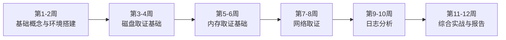
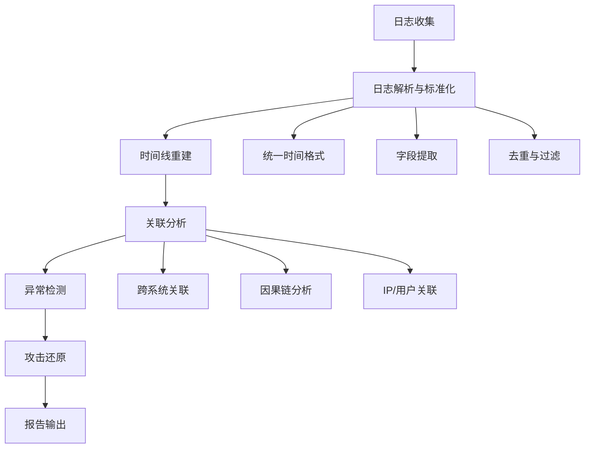
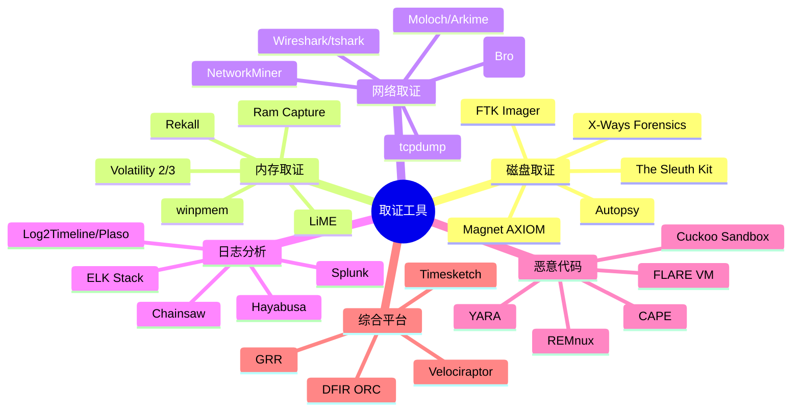
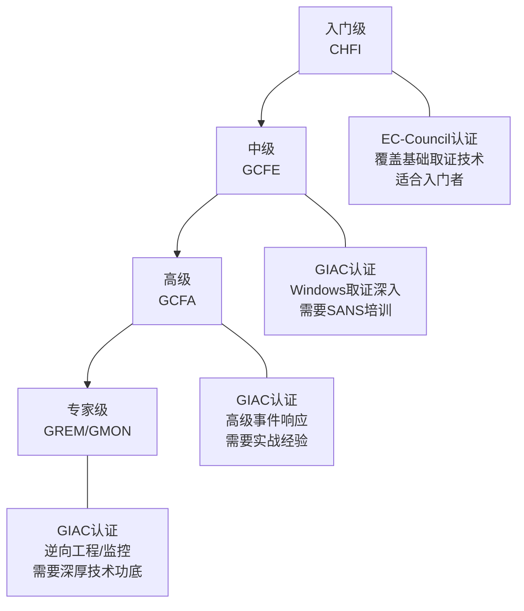

# 第25章 数字取证——练习方法

> 数字取证是一门"做中学"的学科。理论知识若不经过反复实践内化，在真实案件中将毫无价值。本章提供一套从入门到精通的系统化练习方案，覆盖磁盘取证、内存取证、网络取证、日志分析四大核心领域，并给出认证备考、实验室搭建和社区参与的长期成长路径。

## 一、学习路径总览

数字取证的学习应当遵循"先基础后专项、先单点后综合"的渐进原则。以下12周学习计划将取证技能分为六个阶段，每个阶段都有明确的理论目标、动手任务和自测项目。



| 阶段 | 周次 | 核心目标 | 产出物 |
|:---:|:---:|:---|:---|
| 基础入门 | 1-2 | 搭建取证环境，理解证据链与哈希校验 | 可运行的取证工作站 + 一份镜像哈希验证记录 |
| 磁盘取证 | 3-4 | 掌握文件系统分析、删除恢复、数据雕刻 | 从自制镜像中恢复3种以上文件类型 |
| 内存取证 | 5-6 | 掌握内存转储获取与Volatility分析 | 从内存镜像中识别恶意进程并提取工件 |
| 网络取证 | 7-8 | 掌握流量捕获、协议分析、恶意流量识别 | 从pcap中还原攻击链并提取传输文件 |
| 日志分析 | 9-10 | 掌握Windows/Linux日志分析与关联方法 | 搭建日志分析平台并完成攻击时间线重建 |
| 综合实战 | 11-12 | 完成端到端取证调查并撰写规范报告 | 一份完整的取证调查报告 |

## 二、第1-2周：基础概念与环境搭建

### 2.1 理论学习要点

这一阶段的重点是建立取证思维的基石。取证不是简单的"用工具扫描"，而是一套严格的方法论体系。

**必须掌握的核心概念：**

- **数字证据的特性**：易失性（volatility）、可复制性（reproducibility）、可传递性（transferability）。理解为什么内存数据比磁盘数据更易失，为什么每个操作都可能改变证据状态。
- **证据链（Chain of Custody）**：从证据获取、保管、分析到呈堂的每一步都需要完整记录。任何环节的断裂都可能导致证据在法庭上不被采信。一份标准的证据链记录应包含：证据编号、描述、获取时间、获取人、哈希值（MD5+SHA-256双哈希）、保管位置、每次访问记录。
- **写保护原则**：对原始介质的任何操作都可能改变证据。必须使用硬件写保护器或软件写保护机制，确保分析过程不修改原始数据。
- **文件系统基础**：理解MBR/GPT分区表、NTFS的MFT结构、EXT4的inode机制、FAT的目录项结构。文件删除的本质只是标记该空间为"可用"，实际数据仍保留在磁盘上，这是数据恢复的理论基础。

### 2.2 实践环境搭建

```bash
# ============================================
# 取证实验环境搭建完整流程
# ============================================

# ---- 方案A：使用SIFT Workstation（推荐初学者）----
# SIFT是SANS学院开发的专用取证虚拟机，预装了几乎所有取证工具
# 下载地址：https://www.sans.org/tools/sift-workstation/
# 镜像格式：OVA（VMware/VirtualBox均可导入）
# 系统配置建议：4核CPU、8GB+内存、100GB磁盘空间

# ---- 方案B：使用REMnux（适合Linux环境）----
# REMnux专注于恶意软件分析和逆向工程
# 下载地址：https://remnux.org/
# 安装命令（基于Ubuntu 22.04）：
sudo apt update && sudo apt install -y git
git clone https://github.com/REMnux/remnux-cli.git
sudo remnux-cli install

# ---- 方案C：手动搭建（适合已有Linux基础的用户）----
# 在Ubuntu 22.04/24.04上逐个安装取证工具

# 1. 安装The Sleuth Kit + Autopsy（磁盘取证核心工具）
sudo apt update
sudo apt install -y autopsy sleuthkit

# 2. 安装Volatility 3（内存取证框架）
pip3 install volatility3

# 3. 安装网络取证工具
sudo apt install -y wireshark tshark tcpdump nmap

# 4. 安装日志分析工具
sudo apt install -y log2timeline-plaso

# 5. 安装文件恢复工具
sudo apt install -y testdisk photorec extundelete foremost scalpel

# 6. 安装哈希校验工具
sudo apt install -y hashdeep md5sum sha256sum

# 7. 安装Hayabusa（Windows事件日志快速分析）
# 从GitHub releases下载：https://github.com/Yamato-Security/hayabusa/releases

# ---- 验证安装 ----
echo "=== 工具验证 ==="
autopsy --version 2>/dev/null || echo "Autopsy: 需通过浏览器访问 http://localhost:9999/autopsy"
volatility3 --version 2>/dev/null || echo "Volatility3: 未安装"
tshark --version | head -1
foremost -V 2>&1 | head -1
echo "=== 工具验证完成 ==="
```

### 2.3 第一阶段练习项目

**练习1：制作并验证取证镜像**

这是取证工作的第一步，必须做到零错误。

```bash
# 步骤1：创建测试磁盘镜像
dd if=/dev/zero of=/tmp/evidence_raw.img bs=1M count=200

# 步骤2：创建分区并格式化
sudo parted /tmp/evidence_raw.img mklabel msdos
sudo parted /tmp/evidence_raw.img mkpart primary ext4 1MiB 100MiB
sudo parted /tmp/evidence_raw.img mkpart primary ntfs 100MiB 200MiB

# 步骤3：挂载并写入测试数据
# EXT4分区
LOOP1=$(sudo losetup -fP --show /tmp/evidence_raw.img -o 1048576)
sudo mkfs.ext4 $LOOP1
sudo mkdir -p /mnt/test_ext4
sudo mount $LOOP1 /mnt/test_ext4
echo "这是一份机密文档" | sudo tee /mnt/test_ext4/secret_doc.txt
echo "财务报表数据" | sudo tee /mnt/test_ext4/finance_report.csv
sudo dd if=/dev/urandom of=/mnt/test_ext4/photo.jpg bs=1K count=50
sudo umount /mnt/test_ext4
sudo losetup -d $LOOP1

# 步骤4：计算原始镜像哈希值（证据完整性基准）
md5sum /tmp/evidence_raw.img
sha256sum /tmp/evidence_raw.img
# 将哈希值记录在证据链文档中，格式：
# 证据编号: EVD-2026-001
# 文件名: evidence_raw.img
# MD5: <hash>
# SHA-256: <hash>
# 获取时间: <timestamp>
# 获取人: <name>

# 步骤5：制作工作副本（永远不要在原始镜像上操作！）
cp /tmp/evidence_raw.img /tmp/evidence_work.img

# 步骤6：验证工作副本与原始镜像一致
md5sum /tmp/evidence_raw.img /tmp/evidence_work.img
# 两个哈希值必须完全相同
```

**练习2：使用Autopsy浏览镜像内容**

```bash
# 启动Autopsy（Web界面）
sudo autopsy &
# 浏览器访问 http://localhost:9999/autopsy

# 操作步骤：
# 1. 点击 "New Case" → 填写案件信息 → 创建
# 2. 点击 "Add Data Source" → 选择 "Disk Image or VM File"
# 3. 选择 /tmp/evidence_work.img
# 4. 等待导入完成（视镜像大小，可能需要几分钟）
# 5. 浏览左侧目录树，查看文件系统结构
# 6. 使用 "Keyword Search" 搜索 "机密"
# 7. 查看 "Timeline" 功能了解文件时间线
# 8. 导出感兴趣的文件用于后续分析
```

**自测标准**：
- [ ] 能独立完成从零搭建取证环境的全过程
- [ ] 能正确使用dd创建镜像并计算双哈希值
- [ ] 能在Autopsy中成功加载镜像并导航文件系统
- [ ] 理解"为什么不能在原始镜像上操作"的原理

## 三、第3-4周：磁盘取证基础

### 3.1 理论深化

**文件系统结构要点：**

| 文件系统 | 核心数据结构 | 删除机制 | 恢复可能性 |
|:---|:---|:---|:---|
| NTFS | MFT（主文件表） | MFT记录标记为"未使用"，数据簇未清除 | 高（MFT未覆盖时可完全恢复） |
| EXT4 | inode + journal | inode链接数归零，数据块标记为未分配 | 中高（依赖journal状态） |
| FAT32 | FAT表 + 目录项 | 目录项首字节置0xE5，FAT表清除 | 中（大文件易碎片化丢失） |
| APFS | B-tree + COW | 传统删除机制+COW快照 | 中（快照可能保留历史版本） |

**数据雕刻（File Carving）原理：**

当文件系统元数据（MFT、inode等）被破坏或覆写时，传统的基于文件系统元数据的恢复方法失效。数据雕刻通过扫描磁盘原始数据，根据文件类型的特征签名（magic bytes）来定位和提取文件。例如：

- JPEG文件：以 `FF D8 FF` 开头，以 `FF D9` 结尾
- PDF文件：以 `%PDF` 开头
- ZIP/Office文档：以 `50 4B 03 04`（PK..）开头
- PNG文件：以 `89 50 4E 47` 开头

### 3.2 实践任务详解

**练习1：NTFS MFT分析**

```bash
# 创建NTFS测试镜像
dd if=/dev/zero of=/tmp/ntfs_test.img bs=1M count=100
sudo mkfs.ntfs -f /tmp/ntfs_test.img

# 挂载并写入测试文件
sudo mkdir -p /mnt/ntfs_test
sudo mount -o loop /tmp/ntfs_test.img /mnt/ntfs_test
echo "NTFS文档内容" | sudo tee /mnt/ntfs_test/report.docx
echo "NTFS日志内容" | sudo tee /mnt/ntfs_test/server.log
sudo dd if=/dev/urandom of=/mnt/ntfs_test/database.db bs=1K count=200
sudo umount /mnt/ntfs_test

# 使用fls查看文件列表（包括已删除文件）
fls -r /tmp/ntfs_test.img
# 输出示例：
# r/r * 3:    report.docx
# r/r * 4:    server.log
# r/r * 5:    database.db
# *号表示已删除文件

# 使用icat提取特定inode的文件内容
icat /tmp/ntfs_test.img 3 > /tmp/recovered_report.docx
cat /tmp/recovered_report.docx

# 使用mactime生成时间线
fls -r -m "/" /tmp/ntfs_test.img > /tmp/ntfs_body.txt
mactime -b /tmp/ntfs_body.txt -d > /tmp/ntfs_timeline.csv
# 查看时间线CSV，了解文件创建、修改、访问时间
head -20 /tmp/ntfs_timeline.csv
```

**练习2：删除文件恢复全流程**

```bash
# ---- EXT4删除恢复 ----

# 创建EXT4测试镜像
dd if=/dev/zero of=/tmp/ext4_test.img bs=1M count=100
sudo mkfs.ext4 /tmp/ext4_test.img
sudo mkdir -p /mnt/ext4_test
sudo mount -o loop /tmp/ext4_test.img /mnt/ext4_test

# 写入多种类型的测试文件
echo "机密文档内容" | sudo tee /mnt/ext4_test/secret.txt
echo "员工薪资表" | sudo tee /mnt/ext4_test/salary.xlsx
sudo dd if=/dev/urandom of=/mnt/ext4_test/photo.png bs=1K count=100
sudo dd if=/dev/urandom of=/mnt/ext4_test/archive.zip bs=1K count=200

# 记录文件哈希值（作为恢复验证基准）
md5sum /mnt/ext4_test/*
# secret.txt:    a1b2c3d4e5f6...
# salary.xlsx:   f6e5d4c3b2a1...
# photo.png:     1a2b3c4d5e6f...
# archive.zip:   6f5e4d3c2b1a...

# 卸载并删除文件
sudo umount /mnt/ext4_test

# 重新挂载以删除文件
sudo mount -o loop /tmp/ext4_test.img /mnt/ext4_test
sudo rm /mnt/ext4_test/secret.txt
sudo rm /mnt/ext4_test/salary.xlsx
sudo umount /mnt/ext4_test

# 使用extundelete恢复
sudo extundelete /tmp/ext4_test.img --restore-all
# 恢复的文件在 RECOVERED_FILES/ 目录下
ls -la RECOVERED_FILES/
md5sum RECOVERED_FILES/*

# 对比恢复文件与原始文件的哈希值
# 如果哈希一致，说明文件被完整恢复
# 如果不一致，说明文件的部分数据簇已被覆写

# ---- 使用The Sleuth Kit进行更精细的恢复 ----

# 查看文件系统详细信息
sudo fsstat /tmp/ext4_test.img

# 列出所有文件（包括已删除的）
fls -r -d /tmp/ext4_test.img
# -d标志显示已删除的文件

# 根据inode号提取特定文件
icat /tmp/ext4_test.img <inode_number> > /tmp/recovered_file
```

**练习3：数据雕刻实战**

```bash
# ---- 使用foremost进行文件雕刻 ----

# foremost会根据文件头尾特征从原始镜像中提取文件
foremost -t jpg,png,pdf,doc,zip -i /tmp/ext4_test.img -o /tmp/foremost_recovery/

# 查看恢复结果
tree /tmp/foremost_recovery/
# 输出结构：
# /tmp/foremost_recovery/
# ├── jpg/
# │   └── 00000123.jpg
# ├── png/
# │   └── 00000456.png
# ├── zip/
# │   └── 00000789.zip
# └── report.txt    # foremost生成的恢复报告

# 查看恢复报告
cat /tmp/foremost_recovery/report.txt
# 报告会列出每个恢复文件的偏移量、大小、类型

# ---- 使用scalpel进行更精细的雕刻 ----

# 编辑scalpel配置文件，定义要搜索的文件类型
sudo cat > /tmp/scalpel.conf << 'EOF'
# 文件类型    大小限制    文件头         文件尾
jpg             y       20000000       \xff\xd9
pdf             y       20000000       %EOF
zip             y       20000000       PK\x05\x06
EOF

scalpel -c /tmp/scalpel.conf -o /tmp/scalpel_recovery/ /tmp/ext4_test.img

# ---- 使用binwalk检查嵌入文件 ----
# binwalk擅长识别嵌入在固件或其他文件中的文件
binwalk /tmp/ext4_test.img
binwalk -e /tmp/ext4_test.img  # 提取识别出的文件
```

**自测标准**：
- [ ] 能用fls列出NTFS/EXT4文件系统中的已删除文件
- [ ] 能用icat根据inode号提取特定文件
- [ ] 能用extundelete或photorec恢复已删除文件
- [ ] 能用foremost/scalpel从损坏的镜像中雕刻出文件
- [ ] 能正确对比恢复文件与原始文件的哈希值验证恢复质量

## 四、第5-6周：内存取证基础

### 4.1 理论要点

内存是数字取证中信息密度最高的数据源之一。相比磁盘取证，内存取证能获取到：

- **运行中的进程**：磁盘取证无法看到已加载但未写入磁盘的代码
- **网络连接状态**：已建立的TCP连接、DNS缓存、路由表
- **加密密钥**：SSL/TLS会话密钥、BitLocker密钥、PuTTY会话密钥
- **命令历史**：bash/zsh历史、PowerShell命令、cmd命令
- **注册表缓存**：Windows注册表的内存映像

**内存数据的易失性层级（从高到低）：**

| 数据类型 | 易失性等级 | 典型生命周期 | 取证价值 |
|:---|:---:|:---|:---|
| CPU寄存器/缓存 | 极高 | 纳秒级 | 仅在实时取证中有价值 |
| 进程内存空间 | 高 | 进程存活期间 | 运行时变量、解密后的数据 |
| 网络连接表 | 高 | 连接存活期间 | 攻击者的C2通信 |
| 内核数据结构 | 中高 | 系统运行期间 | 进程列表、驱动信息 |
| 磁盘交换区/休眠文件 | 中 | 关机后仍存在 | 可作为内存取证的替代源 |

### 4.2 实践任务详解

**练习1：获取内存转储**

```bash
# ---- Windows环境 ----
# 使用winpmem（开源内存获取工具）
# 下载地址：https://github.com/Velocidex/winpmem/releases
winpmem_mini_x64.exe C:\evidence\memory.raw
# 注意事项：
# - 必须以管理员权限运行
# - 获取过程中不要进行其他操作（避免改变内存状态）
# - 获取时间取决于内存大小（16GB约需30秒-2分钟）
# - 获取完成后立即计算哈希值

# 使用FTK Imager（图形化工具，适合初学者）
# 下载地址：https://www.exterro.com/ftk-imager
# 操作：File → Capture Memory → 选择保存路径 → Capture Memory

# ---- Linux环境 ----
# 方法1：使用LiME（Linux Memory Extractor）
# 下载并编译LiME内核模块
git clone https://github.com/504ensicsLabs/LiME.git
cd LiME/src
make
sudo insmod lime-$(uname -r).ko "path=/tmp/memory.lime format=lime"

# 方法2：直接从/dev/mem读取（需要物理内存访问权限）
sudo dd if=/dev/mem of=/tmp/memory_raw.bin bs=1M count=16384
# 注意：现代Linux内核通常限制/dev/mem访问

# 方法3：从虚拟机获取（最简单的方式）
# VMware：在VM菜单中 → Troubleshooting → Capture VM Memory
# VirtualBox：VBoxManage debugvm <vmname> dumpguestcore --filename /tmp/memory.dmp

# ---- 重要：获取后立即记录 ----
# 计算内存镜像哈希
md5sum /tmp/memory.lime
sha256sum /tmp/memory.lime
# 在证据链中记录：
# 证据编号: MEM-2026-001
# 来源系统: <hostname> / <IP地址>
# 获取时间: <精确时间戳>
# 获取工具: winpmem v4.0 / LiME
# 系统内存: <大小>
# 运行进程数: <获取时的进程数（从任务管理器记录）>
```

**练习2：Volatility 3基础操作**

```bash
# Volatility 3是目前最主流的内存取证框架
# 基本语法：vol3 -f <内存镜像> <插件名>

# ---- 第一步：识别内存镜像信息 ----
vol3 -f /tmp/memory.lime windows.info
# 输出包含：操作系统版本、内核版本、内存大小、系统时间等
# 这些信息决定了后续使用哪些插件

# ---- 第二步：列出所有进程 ----
vol3 -f /tmp/memory.lime windows.pslist
# 输出字段说明：
# PID: 进程ID    PPID: 父进程ID    ImageFileName: 进程名
# Offset(V): 虚拟内存地址    Threads: 线程数    Handles: 句柄数
# SessionId: 会话ID    Wow64: 是否为32位进程    CreateTime: 创建时间
# ExitTime: 退出时间

# ---- 第三步：检测进程注入（恶意代码检测核心）----
vol3 -f /tmp/memory.lime windows.malfind
# malfind通过检测进程内存中的可执行代码段（MEM_PRIVATE + PAGE_EXECUTE_READWRITE）
# 来识别潜在的进程注入攻击
# 输出包含：
# - 可疑进程的PID和内存区域
# - 内存区域权限（RWX表示可读写执行，高度可疑）
# - hexdump显示的前64字节内容
# - 如果检测到PE文件头（MZ标志），高度确认为注入

# ---- 第四步：提取可疑进程内存 ----
# 根据malfind结果，提取可疑进程的完整内存空间
vol3 -f /tmp/memory.lime windows.dumpfiles --pid 1234 --dump-dir /tmp/dumped/
# 提取的文件可以进一步用strings分析或用YARA规则扫描
strings /tmp/dumped/executable.1234.exe | grep -i "http\|password\|key"

# ---- 第五步：网络连接分析 ----
vol3 -f /tmp/memory.lime windows.netscan
# 输出包含：
# 本地地址:端口 → 远程地址:端口 → 协议 → 状态 → 进程
# 重点关注：
# - ESTABLISHED状态的连接（可能为C2通信）
# - 连接到外网IP的非标准端口连接
# - DNS查询缓存（windows.netscan也可查看）

# ---- 第六步：注册表分析 ----
vol3 -f /tmp/memory.lime windows.registry.hivelist
# 列出内存中所有注册表hive文件
# 结合windows.hashdump提取SAM数据库中的密码哈希
vol3 -f /tmp/memory.lime windows.hashdump

# ---- 第七步：命令行历史 ----
vol3 -f /tmp/memory.lime windows.cmdline
# 显示每个进程的命令行参数
# 可以看到攻击者执行的具体命令

# ---- 综合分析流程 ----
# 1. 先用windows.info确认系统信息
# 2. 用windows.pslist获取进程全貌
# 3. 用windows.malfind检测恶意注入
# 4. 用windows.netscan检查网络通信
# 5. 用windows.cmdline查看命令历史
# 6. 用windows.hashdump提取凭证
# 7. 对可疑进程用dumpfiles提取并进一步分析
```

**练习3：构建对比分析场景**

```bash
# 场景：对比正常系统与受感染系统的内存差异

# 步骤1：在干净的虚拟机中获取内存转储（baseline）
# 安装操作系统，更新补丁，运行常用软件
# 获取内存转储命名为 clean_memory.lime

# 步骤2：感染已知恶意样本（在隔离环境中！）
# 下载公开的恶意样本（如TheZoo仓库）
# https://github.com/ytisf/theZoo
# 在虚拟机中执行样本，等待一段时间让恶意代码充分驻留

# 步骤3：获取受感染系统的内存转储
# 命名为 infected_memory.lime

# 步骤4：对比分析
# 对比进程列表差异
vol3 -f clean_memory.lime windows.pslist > /tmp/clean_pslist.txt
vol3 -f infected_memory.lime windows.pslist > /tmp/infected_pslist.txt
diff /tmp/clean_pslist.txt /tmp/infected_pslist.txt

# 对比网络连接差异
vol3 -f clean_memory.lime windows.netscan > /tmp/clean_netscan.txt
vol3 -f infected_memory.lime windows.netscan > /tmp/infected_netscan.txt
diff /tmp/clean_netscan.txt /tmp/infected_netscan.txt

# 使用malfind检测感染后的新增可疑进程
vol3 -f infected_memory.lime windows.malfind > /tmp/malfind_results.txt
```

**自测标准**：
- [ ] 能在Windows和Linux环境下独立获取内存转储
- [ ] 能用Volatility 3完成完整的内存取证分析流程
- [ ] 能通过malfind识别进程注入并提取可疑进程
- [ ] 能对比正常/感染系统的内存差异
- [ ] 能从内存中提取密码哈希和网络连接信息

## 五、第7-8周：网络取证

### 5.1 理论要点

网络取证的核心是从流量数据包中重建攻击事件的时间线。关键概念包括：

- **全包捕获 vs 元数据捕获**：全包捕获（如tcpdump/Wireshark）记录每个数据包的完整内容，数据量极大但信息最完整；NetFlow/IPFIX只记录流元数据（五元组、字节数、时间戳），数据量小但无法查看载荷内容。
- **TCP流重组**：原始pcap中的数据包是分散的，需要通过TCP流重组来还原完整的应用层会话（如完整的HTTP请求/响应）。
- **加密流量分析**：HTTPS/TLS流量的加密载荷无法直接查看，但可以通过JA3指纹、证书信息、流量大小和时序模式来分析。

### 5.2 实践任务详解

**练习1：流量捕获与基础分析**

```bash
# ---- 使用tcpdump捕获流量 ----
# 捕获所有流量并保存为pcap文件
sudo tcpdump -i eth0 -w /tmp/capture_full.pcap -c 10000
# -i eth0: 指定网卡
# -w: 写入文件
# -c 10000: 捕获10000个包后停止

# 捕获特定主机的流量
sudo tcpdump -i eth0 host 192.168.1.100 -w /tmp/host_traffic.pcap

# 捕获特定端口的流量
sudo tcpdump -i eth0 port 80 or port 443 -w /tmp/web_traffic.pcap

# ---- 使用tshark进行命令行分析 ----

# 提取HTTP请求（包含主机名和URI）
tshark -r /tmp/capture_full.pcap -Y "http.request" \
  -T fields -e frame.time -e ip.src -e http.host -e http.request.uri \
  -E header=y

# 提取DNS查询（分析域名解析行为）
tshark -r /tmp/capture_full.pcap -Y "dns.flags.response == 0" \
  -T fields -e frame.time -e dns.qry.name -e dns.qry.type \
  -E header=y

# 提取TLS握手信息（JA3指纹）
tshark -r /tmp/capture_full.pcap -Y "tls.handshake.type == 1" \
  -T fields -e frame.time -e ip.src -e tls.handshake.extensions_server_name \
  -E header=y

# 统计通信双方
tshark -r /tmp/capture_full.pcap -z conv,ip -q

# 统计HTTP响应状态码分布
tshark -r /tmp/capture_full.pcap -Y "http.response" \
  -T fields -e http.response.code | sort | uniq -c | sort -rn

# 提取传输的文件（HTTP）
tshark -r /tmp/capture_full.pcap --export-objects "http,/tmp/extracted_files/"
# 导出的文件保存在 /tmp/extracted_files/ 目录
```

**练习2：恶意流量分析**

```bash
# ---- 使用公开的恶意流量样本 ----
# 来源1：Malware Traffic Analysis（推荐练习）
# https://www.malware-traffic-analysis.net/
# 提供带有详细分析指南的pcap文件和配套的恶意软件样本

# 来源2：Stratosphere IPS Dataset
# https://stratosphereips.org/datasets-2.html
# 包含正常流量和多种攻击类型的pcap文件

# 来源3：CICIDS2017数据集
# https://www.unb.ca/cic/datasets/ids-2017.html
# 包含DoS、DDoS、Brute Force等多种攻击类型的流量

# ---- 典型分析流程 ----

# 步骤1：初步概览
tshark -r malware.pcap -z io,phs -q  # 协议层次统计
tshark -r malware.pcap -z conv,ip -q  # 通信对统计
tshark -r malware.pcap -z http,tree -q  # HTTP请求树

# 步骤2：识别可疑DNS查询
# 恶意软件通常使用DGA（域名生成算法）产生大量随机域名
tshark -r malware.pcap -Y "dns.flags.response == 0" \
  -T fields -e dns.qry.name | sort | uniq -c | sort -rn | head -30

# 步骤3：分析HTTP POST请求（常见C2通信方式）
tshark -r malware.pcap -Y "http.request.method == POST" \
  -T fields -e frame.time -e ip.src -e http.host -e http.request.uri \
  -e http.content_type -e http.request.line \
  -E header=y

# 步骤4：提取可疑文件
tshark -r malware.pcap --export-objects "http,/tmp/malware_files/"
ls -la /tmp/malware_files/

# 步骤5：使用YARA规则扫描提取的文件
# 检查文件是否包含已知恶意特征
yara -r /path/to/yara_rules/ /tmp/malware_files/

# 步骤6：重建完整攻击时间线
# 将DNS、HTTP、SSL等事件按时间排序
tshark -r malware.pcap -T fields \
  -e frame.time -e _ws.col.Protocol -e _ws.col.Info \
  | head -100 > /tmp/traffic_timeline.txt
```

**练习3：从流量中提取传输的文件**

```bash
# 使用Wireshark的tshark导出HTTP对象
tshark -r evidence.pcap --export-objects "http,/tmp/http_objects/"

# 使用Wireshark的tshark导出SMB对象（Windows文件共享）
tshark -r evidence.pcap --export-objects "smb,/tmp/smb_objects/"

# 使用Wireshark的tshark导出FTP数据
tshark -r evidence.pcap --export-objects "ftp-data,/tmp/ftp_objects/"

# 检查导出文件的完整性
file /tmp/http_objects/*
md5sum /tmp/http_objects/*

# 如果pcap使用了特定的解密密钥（如SSLKEYLOGFILE）
tshark -r encrypted_traffic.pcap \
  -o tls.keylog_file:/path/to/sslkey.log \
  --export-objects "http,/tmp/decrypted_objects/"
```

**自测标准**：
- [ ] 能用tcpdump/tshark捕获和筛选特定流量
- [ ] 能从pcap中提取HTTP会话、DNS查询、TLS信息
- [ ] 能分析公开的恶意流量样本并重建攻击链
- [ ] 能从流量中提取传输的文件并验证完整性

## 六、第9-10周：日志分析

### 6.1 理论要点

日志是数字取证中最持久、最可靠的数据源之一。与内存和网络流量不同，日志一旦写入磁盘就相对稳定，且保留时间长（取决于存储策略）。

**日志分析的核心方法论：**



**关键日志源及其取证价值：**

| 操作系统 | 日志源 | 关键事件ID/类型 | 取证价值 |
|:---|:---|:---|:---|
| Windows | Security日志 | 4624（登录成功）、4625（登录失败）、4720（账户创建） | 暴力破解检测、权限提升追踪 |
| Windows | System日志 | 7045（服务安装）、1074（关机） | 恶意软件持久化检测 |
| Windows | PowerShell日志 | 4103（模块日志）、4104（脚本块日志） | PowerShell攻击检测 |
| Linux | /var/log/auth.log | SSH登录、sudo使用、su切换 | 未授权访问检测 |
| Linux | /var/log/syslog | 系统事件、服务状态 | 系统异常检测 |
| Linux | /var/log/apache2/access.log | Web请求 | Web攻击检测（SQL注入、XSS等） |

### 6.2 实践任务详解

**练习1：Windows事件日志分析**

```powershell
# ---- 使用PowerShell分析安全日志 ----

# 检查所有登录失败事件（暴力破解检测）
Get-WinEvent -LogName Security -FilterHashtable @{ID=4625} |
  Select-Object TimeCreated, @{N='TargetUser';E={$_.Properties[5].Value}},
    @{N='SourceIP';E={$_.Properties[19].Value}},
    @{N='LogonType';E={$_.Properties[10].Value}} |
  Sort-Object TimeCreated |
  Format-Table -AutoSize

# 按来源IP统计登录失败次数（识别暴力破解来源）
Get-WinEvent -LogName Security -FilterHashtable @{ID=4625} |
  Group-Object { $_.Properties[19].Value } |
  Sort-Object Count -Descending |
  Select-Object Count, Name -First 20

# 检查新账户创建事件（后门账户检测）
Get-WinEvent -LogName Security -FilterHashtable @{ID=4720} |
  Select-Object TimeCreated, @{N='NewUser';E={$_.Properties[0].Value}},
    @{N='Creator';E={$_.Properties[4].Value}} |
  Format-Table -AutoSize

# 检查可疑服务安装（持久化检测）
Get-WinEvent -LogName System -FilterHashtable @{ID=7045} |
  Select-Object TimeCreated, @{N='ServiceName';E={$_.Properties[0].Value}},
    @{N='ImagePath';E={$_.Properties[1].Value}} |
  Format-Table -AutoSize

# ---- 使用Hayabusa快速分析（推荐）----
# Hayabusa是Yamato-Security开发的Windows事件日志快速分析工具
# 比手动grep快100倍，且内置了大量检测规则

# 下载并安装
# https://github.com/Yamato-Security/hayabusa/releases

# 生成CSV时间线
hayabusa csv-timeline -d /path/to/winevtx/ -o /tmp/hayabusa_timeline.csv

# 生成JSON格式（适合自动化处理）
hayabusa json-timeline -d /path/to/winevtx/ -o /tmp/hayabusa_timeline.json

# 只显示高危和严重级别告警
hayabusa csv-timeline -d /path/to/winevtx/ -o /tmp/alerts_only.csv \
  --min-level high

# 按规则分组统计告警
hayabusa logon-summary -d /path/to/winevtx/
```

**练习2：Linux日志分析**

```bash
# ---- 认证日志分析 ----

# 检测SSH暴力破解
grep "Failed password" /var/log/auth.log |
  awk '{print $(NF-3)}' |   # 提取来源IP
  sort | uniq -c | sort -rn |
  head -20
# 输出示例：
# 1523 192.168.1.100    ← 这个IP尝试了1523次，明显是暴力破解
#    3 10.0.0.5
#    1 192.168.1.50

# 提取成功登录记录
grep "Accepted" /var/log/auth.log |
  awk '{print $1,$2,$3,$9,$11,$13}' |
  sort
# 输出格式：月 日 时间 用户 来源IP 端口

# 检测sudo权限提升
grep "sudo:" /var/log/auth.log | grep -v "session opened\|session closed"

# ---- Web日志分析 ----

# 检测SQL注入尝试
grep -iE "(union|select|insert|drop|update|delete|exec|script)" \
  /var/log/apache2/access.log |
  awk '{print $1}' | sort | uniq -c | sort -rn | head -10

# 检测目录遍历攻击
grep -E "\.\./|\.\.\\\\" /var/log/apache2/access.log

# 检测Webshell访问
grep -iE "\.(php|asp|aspx|jsp)\?.*=" /var/log/apache2/access.log |
  awk '{print $1, $7}' | sort | uniq -c | sort -rn | head -20

# 提取HTTP状态码分布（识别扫描器活动）
awk '{print $9}' /var/log/apache2/access.log |
  sort | uniq -c | sort -rn
# 404大量出现可能表示目录扫描
# 403大量出现可能表示权限探测

# 生成按小时分布的请求热力图
awk '{print $4}' /var/log/apache2/access.log |
  cut -d: -f2 | sort | uniq -c | sort -k2
```

**练习3：日志关联分析**

```bash
# ---- 搭建ELK Stack进行日志关联分析 ----

# 方法1：使用Docker Compose快速搭建
cat > /tmp/elk-compose.yml << 'EOF'
version: '3'
services:
  elasticsearch:
    image: docker.elastic.co/elasticsearch/elasticsearch:8.12.0
    environment:
      - discovery.type=single-node
      - xpack.security.enabled=false
      - "ES_JAVA_OPTS=-Xms512m -Xmx512m"
    ports:
      - "9200:9200"
    volumes:
      - es-data:/usr/share/elasticsearch/data

  logstash:
    image: docker.elastic.co/logstash/logstash:8.12.0
    volumes:
      - ./logstash.conf:/usr/share/logstash/pipeline/logstash.conf
    depends_on:
      - elasticsearch

  kibana:
    image: docker.elastic.co/kibana/kibana:8.12.0
    ports:
      - "5601:5601"
    depends_on:
      - elasticsearch

volumes:
  es-data:
EOF

# Logstash配置：解析Apache日志
cat > /tmp/logstash.conf << 'EOF'
input {
  file {
    path => "/var/log/apache2/access.log"
    start_position => "beginning"
  }
}
filter {
  grok {
    match => { "message" => "%{COMBINEDAPACHELOG}" }
  }
  date {
    match => [ "timestamp", "dd/MMM/yyyy:HH:mm:ss Z" ]
  }
  geoip {
    source => "clientip"
  }
}
output {
  elasticsearch {
    hosts => ["elasticsearch:9200"]
    index => "apache-logs"
  }
}
EOF

# 启动ELK Stack
docker compose -f /tmp/elk-compose.yml up -d

# 在Kibana中创建索引模式：http://localhost:5601
# 1. 进入 Management → Stack Management → Index Patterns
# 2. 创建 "apache-*" 索引模式
# 3. 进入 Discover 查看日志
# 4. 使用 KQL 查询：clientip: "192.168.1.100" AND response: "404"
# 5. 创建可视化仪表板展示攻击分布

# ---- 方法2：使用Splunk Free版本 ----
# 下载地址：https://www.splunk.com/en_us/download.html
# 免费版本每天500MB日志量
# 安装后访问 http://localhost:8000

# ---- 手动关联分析（不依赖工具）----
# 场景：将Windows安全日志与网络日志进行时间关联

# 步骤1：提取Windows登录事件的时间和来源IP
# （使用PowerShell导出为CSV）
Get-WinEvent -LogName Security -FilterHashtable @{ID=4624} |
  Select-Object TimeCreated, @{N='SourceIP';E={$_.Properties[18].Value}} |
  Export-Csv -Path /tmp/win_logons.csv -NoTypeInformation

# 步骤2：提取网络防火墙日志中的对应连接
grep "192.168.1.100" /var/log/firewall.log > /tmp/fw_events.txt

# 步骤3：按时间戳对齐两个日志源
# 使用Python脚本进行时间关联
python3 << 'PYEOF'
import csv
from datetime import datetime, timedelta

# 读取Windows登录事件
with open('/tmp/win_logons.csv') as f:
    reader = csv.DictReader(f)
    for row in reader:
        ts = datetime.strptime(row['TimeCreated'], '%Y-%m-%d %H:%M:%S')
        ip = row['SourceIP']
        print(f"[WIN] {ts} - Login from {ip}")
PYEOF
```

**自测标准**：
- [ ] 能用PowerShell/命令行分析Windows/Linux关键日志事件
- [ ] 能识别暴力破解、Web攻击等常见攻击模式
- [ ] 能搭建ELK Stack或Splunk进行日志关联分析
- [ ] 能从多个日志源重建攻击时间线

## 七、第11-12周：综合实战

### 7.1 综合取证项目

这是整个12周学习的最终考核，要求完成一次端到端的模拟取证调查。

**项目场景：企业数据泄露事件调查**

```text
背景：某公司发现敏感数据疑似泄露。你作为取证分析师，
      需要对提供的证据材料进行全面分析并出具调查报告。

证据材料：
  1. evidence.img - 涉事员工电脑的磁盘镜像（EXT4格式）
  2. memory.raw - 该电脑的内存转储
  3. network_capture.pcap - 公司出口流量捕获
  4. windows_logs/ - Windows事件日志（EVTX文件）
  5. linux_logs/ - 公司服务器日志

调查步骤：
  阶段1：证据完整性验证
    - 计算所有证据文件的哈希值
    - 记录证据链文档
    - 制作工作副本

  阶段2：磁盘取证分析
    - 使用fls/autopsy分析文件系统
    - 恢复已删除文件
    - 搜索关键词（"机密"、"密码"、"发送"等）
    - 提取最近访问的文档和浏览器历史

  阶段3：内存取证分析
    - 使用Volatility分析进程列表
    - 检测可疑进程和注入
    - 提取网络连接和凭证信息
    - 分析运行中的应用程序状态

  阶段4：网络取证分析
    - 分析pcap中的DNS查询和HTTP流量
    - 识别数据外传的网络活动
    - 提取传输的文件

  阶段5：日志分析
    - 分析Windows安全日志中的登录事件
    - 分析Web服务器日志中的访问行为
    - 关联多个日志源重建时间线

  阶段6：综合分析与报告
    - 将所有发现整合为统一的时间线
    - 确定数据泄露的范围和方式
    - 识别责任人及其操作序列
    - 撰写规范的取证调查报告
```

### 7.2 取证报告撰写规范

一份合格的取证报告必须包含以下要素：

```markdown
# 数字取证调查报告

## 报告信息
- 案件编号：CASE-2026-XXX
- 调查人员：[姓名]
- 报告日期：[日期]
- 机密级别：[分级]

## 1. 执行摘要
（200字以内的调查结论概述）

## 2. 调查范围与授权
- 调查目标
- 法律授权文件编号
- 证据清单

## 3. 证据链记录
| 证据编号 | 描述 | 获取时间 | 获取人 | MD5 | SHA-256 |
|:---|:---|:---|:---|:---|:---|

## 4. 调查方法论
- 采用的取证工具和版本
- 分析步骤概述
- 遵循的标准和规范

## 5. 调查发现
### 5.1 磁盘分析发现
### 5.2 内存分析发现
### 5.3 网络分析发现
### 5.4 日志分析发现

## 6. 时间线重建
（使用表格或图表展示关键事件的时间序列）

## 7. 结论与建议
- 调查结论
- 风险评估
- 改进建议

## 8. 附录
- 完整证据链
- 工具输出原始数据
- 技术术语表
```

### 7.3 CTF取证挑战练习平台

| 平台 | 网址 | 特点 | 难度 |
|:---|:---|:---|:---|
| CyberDefenders | cyberdefenders.org | 专业DFIR挑战，真实案件场景 | ⭐⭐-⭐⭐⭐⭐ |
| DFIR.training | dfir.training | 大量真实取证案例和工具教程 | ⭐⭐-⭐⭐⭐ |
| CTFtime | ctftime.org | 全球CTF赛事聚合平台 | ⭐-⭐⭐⭐⭐⭐ |
| NIST CFREDS | cfreds.nist.gov | 官方取证参考数据集 | ⭐⭐-⭐⭐⭐ |
| TryHackMe | tryhackme.com | 交互式取证房间（含指导） | ⭐-⭐⭐⭐ |
| PicoCTF | picoctf.com | 入门级CTF，适合初学者 | ⭐-⭐⭐ |

**每周至少完成2-3道CTF取证题目**，逐步提升难度。建议从TryHackMe的取证房间开始，过渡到CyberDefenders的中级挑战。

## 八、推荐学习资源

### 8.1 必读书籍

| 书名 | 作者 | 侧重点 | 推荐指数 |
|:---|:---|:---|:---:|
|《File System Forensic Analysis》| Brian Carrier | 文件系统取证的圣经级著作 | ⭐⭐⭐⭐⭐ |
|《The Art of Memory Forensics》| Ligh et al. | 内存取证权威指南 | ⭐⭐⭐⭐⭐ |
|《Network Forensics》| Ric Messier | 网络流量分析实战 | ⭐⭐⭐⭐ |
|《Incident Response & Computer Forensics》| Luttgens et al. | 应急响应与取证综合指南 | ⭐⭐⭐⭐ |
|《Practical Malware Analysis》| Sikorski & Honig | 恶意软件分析基础（取证相关） | ⭐⭐⭐⭐⭐ |
|《Windows Registry Forensics》| Harlan Carvey | Windows注册表取证专项 | ⭐⭐⭐⭐ |
|《Placing the Suspect Behind the Keyboard》| Davis et al. | 嫌疑人定位与行为分析 | ⭐⭐⭐⭐ |

### 8.2 在线课程

| 课程 | 机构 | 内容概要 | 费用 |
|:---|:---|:---|:---|
| FOR500: Windows Forensic Analysis | SANS | Windows取证分析核心课程 | $8,000+ |
| FOR508: Advanced Incident Response | SANS | 高级应急响应与取证 | $8,000+ |
| FOR572: Advanced Network Forensics | SANS | 高级网络取证 | $8,000+ |
| Digital Forensics Specialization | Coursera（University of Maryland） | 数字取证基础系列课程 | 免费旁听 |
| DFIR Foundations | DFIR.training | 在线自学取证基础 | 免费 |
| 13Cubed YouTube Channel | 13Cubed | Volatility和DFIR实战视频 | 免费 |

### 8.3 开源取证工具清单



### 8.4 免费取证数据集

| 数据集 | 来源 | 内容 | 用途 |
|:---|:---|:---|:---|
| CFREDS | NIST | 计算机取证参考数据集 | 标准化测试 |
| Digital Corpora | NIST | 磁盘镜像和内存转储 | 练习恢复 |
| Malware Traffic Analysis | 个人研究者 | 恶意流量pcap+分析 | 网络取证 |
| CICIDS2017 | University of New Brunswick | 入侵检测流量数据集 | 异常检测 |
| TheZoo | GitHub | 活跃恶意软件样本集 | 恶意代码分析 |
| Volatility Samples | Volatility Foundation | 内存取证样本 | 内存分析 |

## 九、认证考试准备

### 9.1 认证路径规划



| 认证 | 全称 | 机构 | 考试费用 | 前置要求 | 建议备考时间 |
|:---|:---|:---|:---:|:---|:---:|
| CHFI | Computer Hacking Forensic Investigator | EC-Council | $500 | 无 | 2-3个月 |
| GCFE | GIAC Certified Forensic Examiner | GIAC/SANS | $949 | SANS FOR500培训 | 3-4个月 |
| GCFA | GIAC Certified Forensic Analyst | GIAC/SANS | $949 | SANS FOR508培训 | 4-6个月 |
| GREM | GIAC Reverse Engineering Malware | GIAC/SANS | $949 | SANS FOR610培训 | 4-6个月 |
| GMON | GIAC Continuous Monitoring | GIAC/SANS | $949 | SANS FOR578培训 | 3-4个月 |

### 9.2 备考策略

**通用备考建议：**

1. **制定6-12个月的备考计划**：将考试大纲分解为每周的学习目标，确保每个知识点都有充足的学习和练习时间
2. **理论与实践并行**：每学完一个理论模块，立即在实验环境中动手验证。只看书不动手等于没学
3. **建立错题本**：记录练习中犯的错误和不理解的概念，定期回顾
4. **参加模拟考试**：GIAC考试允许开卷（可携带打印的参考材料），但时间紧张（4小时），需要熟练到能快速定位信息
5. **加入学习社区**：Reddit的r/cybersecurity、r/DigitalForensics、DFIR Slack社区等都是很好的交流平台

**针对GIAC考试的特别建议：**

```text
GIAC考试的特殊之处：
1. 开卷考试：允许携带所有参考资料（纸质）
2. 因此重点不是记忆，而是理解+快速检索能力
3. 建议建立个人索引系统（Index）：
   - 按关键词分类所有培训材料和手册内容
   - 每个条目标注：来源（书名/页码）、定义、命令、示例
   - 考试时通过索引快速定位答案

索引制作方法：
1. 使用Excel或专用工具（如GIAC Index Generator）
2. 列出培训讲义中的每个关键概念
3. 标注精确的页码和章节
4. 添加交叉引用（同一概念出现在多个地方）
5. 考前反复练习通过索引快速找到答案
```

## 十、持续提升：长期成长计划

### 10.1 建立个人取证实验室

**硬件配置建议：**

| 组件 | 最低配置 | 推荐配置 | 说明 |
|:---|:---|:---|:---|
| CPU | 4核 | 8核+（Intel i7/i9或AMD Ryzen 7/9） | 内存取证和哈希计算需要大量CPU |
| 内存 | 16GB | 32GB-64GB | 虚拟机+内存镜像分析需要大内存 |
| 存储 | 500GB SSD | 2TB NVMe SSD + 4TB HDD | SSD用于分析，HDD用于存储证据镜像 |
| 网卡 | 1Gbps | 2.5Gbps或10Gbps | 网络取证需要高带宽网卡 |
| 显示器 | 1080p | 双屏2K/4K | 多窗口并行分析效率更高 |

**虚拟化环境搭建：**

```bash
# 推荐使用Proxmox VE（开源虚拟化平台）
# 安装多个分析用虚拟机：
# 1. SIFT Workstation（取证分析主力）
# 2. REMnux（恶意软件分析）
# 3. Windows 10/11（目标系统分析）
# 4. Windows Server 2019/2022（日志分析）
# 5. Kali Linux（渗透测试辅助）
# 6. Ubuntu 22.04（通用分析环境）

# 使用快照功能管理实验状态
# 每次实验前创建快照，实验后恢复，保持环境清洁

# 建立隔离的取证网络
# 取证分析虚拟机只使用内部网络
# 避免在分析过程中产生外部网络流量（影响证据）
```

### 10.2 参与社区与职业发展

**社区参与建议：**

1. **在线社区**：
   - Reddit: r/cybersecurity, r/DigitalForensics, r/DFIR
   - DFIR Slack Community（通过dfir.community/slack加入）
   - GitHub: 关注取证工具的开源项目，提交PR或报告issue
   - Twitter/X: 关注@malaboria、@0xMachs3r、@AlexKornitzer等取证专家

2. **会议与活动**：
   - SANS DFIR Summit（年度）
   - DFRWS（数字取证研究研讨会）
   - BSides系列安全会议
   - Black Hat/DEF CON的取证相关议题

3. **开源贡献**：
   - 为Volatility、Autopsy等工具贡献插件或文档
   - 编写YARA规则并分享到社区
   - 在CTF中设计取证题目

**职业发展路径：**

```text
初级取证分析师（0-2年）
  ↓
中级DFIR分析师（2-5年）
  ↓
高级取证专家/事件响应负责人（5-8年）
  ↓
取证团队负责人/首席安全官（8年+）
```

### 10.3 保持技术更新

数字取证技术在快速演进，以下是当前的热点方向和学习建议：

- **云取证**：学习AWS CloudTrail、Azure Monitor、GCP Audit Log的取证方法
- **容器取证**：学习Docker/Kubernetes环境下的取证技术（如使用Volatility分析容器内存、分析容器日志）
- **IoT取证**：了解智能设备（路由器、摄像头、智能家居）的数据存储和提取方法
- **AI辅助取证**：关注机器学习在异常检测、恶意代码分类、日志分析中的应用
- **内存取证新技术**：Volatility 3持续更新，关注新的插件和分析方法
- **证据标准化**：关注STEP（Standard-based Evidence Processing）和SAX（Structured Audit eXchange）等新标准

**定期学习习惯：**

- 每周阅读1-2篇取证相关的研究论文或技术博客
- 每月完成1个CyberDefenders/DFIR.training的挑战
- 每季度学习一个新的取证工具或技术方向
- 每年参加至少1次安全会议或培训

## 十一、常见练习误区与纠正

### 误区1：只学工具不学原理

**错误表现**：只记住"用Volatility查进程"，但不理解内存中进程数据的存储结构。

**正确做法**：每个工具学习前，先理解其背后的取证原理。例如学Volatility前，先理解Windows EPROCESS结构、进程链表、虚拟地址空间映射等概念。工具会更新，但原理不会变。

### 误区2：在原始证据上操作

**错误表现**：直接在原始磁盘镜像或内存转储上运行分析工具，导致证据被修改。

**正确做法**：永远先制作工作副本，分析在副本上进行。原始证据加写保护存储。每次操作前计算哈希值，操作后再次计算，确保数据完整性。

### 误区3：忽视时间线分析

**错误表现**：孤立地分析单个证据源，没有将所有发现整合到统一的时间线上。

**正确做法**：取证的核心是"还原事件真相"，时间线是还原真相的关键工具。使用Plaso/log2timeline或手动方法将磁盘时间戳、内存中的进程创建时间、网络连接时间、日志事件时间对齐，形成完整的事件链。

### 误区4：过早下结论

**错误表现**：看到一个可疑进程或一条异常日志就下结论"系统被入侵了"。

**正确做法**：取证分析需要完整的证据链。单一证据可能是误报或正常行为。必须从多个数据源交叉验证，形成证据链，才能得出可靠结论。

### 误区5：不记录分析过程

**错误表现**：分析过程中做了很多操作，但没有记录具体步骤，无法重现分析过程。

**正确做法**：使用取证笔记模板，记录每一步操作：工具命令、参数、输出结果、分析判断。这不仅是取证规范的要求，也是在法庭上作证时的必要准备。

## 十二、本章小结

本章为数字取证学习者提供了一套完整的12周练习方案：

1. **循序渐进的学习路径**：从环境搭建到综合实战，每个阶段都有明确的目标和练习项目
2. **丰富的实操内容**：提供了大量可直接执行的命令和脚本，覆盖磁盘、内存、网络、日志四大取证领域
3. **规范的取证流程**：强调证据链管理、哈希校验、写保护等取证基本原则
4. **系统化的认证备考**：从入门到专家级的认证路径和备考策略
5. **长期成长计划**：实验室搭建、社区参与、技术更新的持续提升方案
6. **常见误区纠正**：帮助学习者避免典型错误，建立正确的取证思维

> 取证能力的提升没有捷径，唯有"理论指导下的反复实践"。建议学习者严格按照12周计划执行，每周投入至少10小时的实践时间。坚持下来，你将拥有一套完整的数字取证技能体系。
