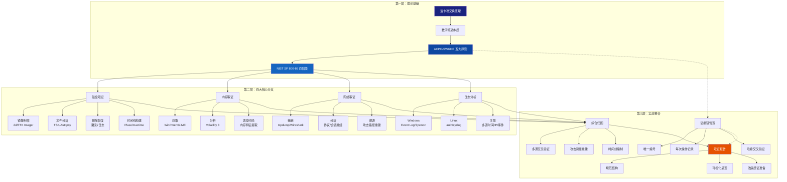

# 第25章 数字取证——本章小结

## 知识体系总览

数字取证不是孤立的工具使用手册，而是一个**从物理原理到法律实践的完整知识链**。本章从理论基础出发，沿着"原理→方法→工具→案例→法律合规"的递进路径，构建了以下知识体系：



三层结构的关系是：**理论基础决定方法论，方法论指导技术选型，技术选型服务实战目标**。理解了这个层次关系，你就不会在取证工作中迷失方向——无论面对什么类型的案件，都能从第一层（原则）出发推演出正确的操作流程。

---

## 核心知识要点精讲

以下逐一梳理本章每个核心模块的关键结论。这些不是简单的知识点罗列，而是每个模块中**最容易被忽略却最关键**的洞见。

### 理论基础：原则是操作的上限

数字取证的五大原则（最小干涉、证据链、可重复性、全面性、时效性）不是"建议"，而是**取证结论在法庭上被采信的必要条件**。从实战角度看：

- **最小干涉原则** 不仅要求制作镜像后再分析，还要求在镜像制作过程中使用写保护器（硬件级阻断写入）。仅仅软件层面的只读挂载是不够的——操作系统可能仍在后台写入元数据。
- **证据链的断裂是不可修复的**。一旦某个环节缺少记录，没有任何后续操作可以"补上"这个缺口。这就是为什么取证标准流程要求：每一项操作都要记录时间、操作人、工具版本、操作内容。
- **可重复性原则** 的实际含义是：你的取证分析过程和结果，必须能被另一个取证人员在另一台机器上复现。这意味着不能使用未记录的参数、不能跳过验证步骤、不能依赖"直觉判断"而不记录推理过程。

### 磁盘取证：镜像是一切的基础

磁盘取证的起点不是分析工具，而是**镜像的完整性和规范性**：

| 关键环节 | 常见错误 | 正确做法 |
|---------|---------|---------|
| 写保护 | 使用软件只读挂载 | 硬件写保护器（Tableau/FC5025） |
| 镜像格式 | 只使用 dd 原始格式 | E01（压缩+元数据）优于 dd（需额外记录元数据） |
| 哈希验证 | 只在制作时计算一次 | 每次分析前后都验证，记录时间戳 |
| 源介质处理 | 分析后继续使用 | 封存保管，只使用副本工作 |

**关于时间线分析，一个被低估的技术**：MACB 时间线（Modified/Accessed/Changed/Birth）的价值不在于列出所有时间戳，而在于**发现时间戳模式**。例如：一个文件的创建时间和修改时间相同但访问时间不同——这通常是文件被复制（而非正常使用）的标志。识别这类模式是区分正常行为和攻击行为的关键技能。

### 内存取证：无文件攻击时代的必选项

内存取证从"锦上添花"变成"不可或缺"的根本原因是：**攻击技术已经进化到可以不触碰磁盘完成整个攻击链**。具体而言：

- **无文件恶意软件**（Fileless Malware）的完整生命周期都在内存中——从 PowerShell 注入、到 C2 通信、到横向移动，可能只在注册表和 WMI 仓库中留下少量痕迹。
- **加密密钥** 在内存中是明文存在的。无论是 TLS 会话密钥还是勒索软件的加密密钥，只要在内存中，就有机会提取。
- **进程隐藏技术**（Rootkit、DKOM）修改内核对象来隐藏进程，但 Volatility 通过直接解析内核数据结构而非调用 API 来检测这些隐藏进程。

Volatility 3 的核心优势在于**符号表（Symbol Table）机制**，使得它不需要知道目标系统的确切补丁级别就能正确解析内核数据。这意味着你在实战中不必等待框架更新就能分析最新的 Windows 更新后的内存转储。

### 网络取证与日志分析：从"发生了什么"到"为什么发生"

网络取证和日志分析是最高产出的取证分支——它们能回答时间线中**最核心的问题**：

| 问题 | 网络取证给出 | 日志分析给出 |
|------|------------|------------|
| 谁进来了？ | 源 IP、ASN、地理位置 | 用户账号、会话 ID |
| 做了什么？ | 协议、请求内容、文件传输 | 命令执行记录、文件访问记录 |
| 怎么做到的？ | 漏洞利用流量特征、C2 通信 | 异常进程创建、提权事件 |
| 出去了什么？ | 数据外传流量大小、目标 | 文件导出/邮件发送记录 |

网络取证的真正难点不在抓包（这个简单），而在**从海量流量中找到关键的那几秒**。实战中，以下三类流量最值得优先分析：

1. **首次对外连接**——攻击者入侵后通常会外连 C2 服务器，这是最早的可疑流量
2. **大数据量出站**——数据外泄的特征，检查时间窗口内的出站带宽骤升
3. **非标准端口/协议**——攻击者可能使用非标准端口建立隐蔽通道

日志分析的核心挑战则是**时间同步问题**。在一个真实事件中，域控制器、Web 服务器、防火墙、终端设备的时间可能相差数分钟甚至数小时。在开始日志关联之前，必须将所有时间统一转换为 UTC，并记录每台设备的时钟偏差。

---

## 各分支对比速查表

以下速查表可以让你在实战中快速定位应该优先使用哪种取证技术：

| 维度 | 磁盘取证 | 内存取证 | 网络取证 | 日志分析 |
|------|---------|---------|---------|---------|
| 证据持久性 | ★★★★★ 关机后保留 | ★☆☆☆☆ 关机即消失 | ★★☆☆☆ 日志可保留 | ★★★★☆ 保留期可配 |
| 信息丰富度 | ★★★☆☆ 文件层面 | ★★★★★ 运行时全貌 | ★★★★☆ 通信层面 | ★★★☆☆ 事件层面 |
| 分析复杂度 | ★★★☆☆ 工具成熟 | ★★★★☆ 需领域知识 | ★★★☆☆ 工具丰富 | ★★☆☆☆ 门槛低 |
| 采集紧迫度 | ★★☆☆☆ 可以等待 | ★★★★★ 立即采集 | ★★★★☆ 尽快保存 | ★★★★☆ 尽快归档 |
| 法律认可度 | ★★★★★ 成熟规范 | ★★★★☆ 渐被认可 | ★★★★☆ 广泛使用 | ★★★☆☆ 需额外验证 |
| 核心工具 | Autopsy, TSK, FTK Imager | Volatility 3, Rekall | Wireshark, Zeek | ELK, Splunk, Hayabusa |

**实战优先级建议**：在事件响应中，采集顺序应为 **内存 → 网络流量 → 日志 → 磁盘**。这个顺序体现的是"易失性优先"原则——越容易丢失的数据越优先采集。

---

## 能力自评矩阵

阅读完本章后，你可以使用以下矩阵进行自我评估。每个能力从 **L1（认知）→ L2（理解）→ L3（应用）→ L4（综合）** 四个层级标注当前水平：

| 能力领域 | L1 认知 | L2 理解 | L3 应用 | L4 综合 |
|---------|--------|--------|--------|--------|
| **取证原则** | 能说出五大原则的名称 | 能解释每个原则的实战含义 | 能在取证方案中体现原则要求 | 能在原则之间做出权衡决策 |
| **磁盘镜像** | 知道 dd/FTK Imager | 理解镜像格式差异（DD/E01/AFF） | 能独立制作并验证镜像 | 能制定大规模镜像采集方案 |
| **文件系统分析** | 知道 NTFS/ext4 | 理解 MFT/Inode 结构 | 能用 TSK 分析文件系统 | 能手工分析损坏的文件系统 |
| **文件恢复** | 知道可以恢复删除文件 | 理解删除原理和雕刻技术 | 能用 PhotoRec/foremost 恢复 | 能编写自定义雕刻规则 |
| **时间线分析** | 知道 MACB 时间戳 | 理解时间戳含义和关系 | 能用 Plaso 构建 Super Timeline | 能从时间线模式中识别攻击行为 |
| **内存获取** | 知道 WinPmem/LiME | 理解内存获取风险 | 能在一线成功采集内存 | 能在受限环境下完成采集 |
| **Volatility** | 知道 Volatility 框架 | 理解插件分类和原理 | 能用 10+ 常用插件分析 | 能编写自定义 Volatility 插件 |
| **流量分析** | 知道 Wireshark | 理解 TCP 三次握手 | 能分析 HTTP/DNS/SMB 流量 | 能完整还原攻击流量路径 |
| **日志分析** | 知道 Windows Event Log | 理解常用事件 ID 含义 | 能用 PowerShell 批量查询 | 能搭建 SIEM 实现自动化关联 |
| **报告撰写** | 知道报告要有结构 | 理解报告要有证据支撑 | 能写出规范的取证报告 | 能面对交叉询问辩护报告结论 |

**操作方法**：在每个能力域中，从 L1 到 L4 选择符合自己当前水平的最低层级作为基准。多数读者在学习本章后应达到 **L2（理解）** 水平，通过在实战中持续练习逐步提升到 **L3/L4**。

---

## 实战路线图：从学完到精通

学完本章只是开始。以下路线图将告诉你接下来 3-6 个月应该做什么：

### 第 1 个月：巩固基础（重复练习）

- 在 SIFT Workstation 或 CAINE 中完成至少 3 个不同镜像的完整分析流程
- 从 DFIR Madness 下载真实案例镜像，尝试独立完成取证报告
- 通过 CyberDefenders 平台完成 5 个取证挑战题目

### 第 2 个月：专项深入（选择方向）

根据自己的工作方向和兴趣，选择一个核心分支深入：

| 方向 | 推荐资源 | 训练目标 |
|------|---------|---------|
| **磁盘取证专精** | 《File System Forensic Analysis》+ Autopsy 高级教程 | 能分析 NTFS $MFT 和 $UsnJrnl 手工定位证据 |
| **内存取证专精** | 《The Art of Memory Forensics》+ Volatility 插件开发 | 能编写自定义 Volatility 插件检测特定恶意软件 |
| **网络取证专精** | SANS FOR572 课件 + malware-traffic-analysis.net | 能分析混淆后的 C2 流量并还原攻击路径 |
| **综合事件响应** | SANS FOR508 课件 + BTLO 综合挑战 | 能完成从事件发现到出具报告的完整流程 |

### 第 3-6 个月：实战检验

- **参加 CTF 竞赛**——CTFtime 上的"取证"分类挑战是最直接的实战检验。重点关注 Forensics 类型的题目，时间限制下的实战压力与真实场景最接近。
- **建立个人取证实验室**——至少 1 台工作站（32GB+内存）+ 各版本 Windows/Linux 虚拟机 + 网络模拟环境。在这个实验室中模拟"攻击→取证→报告"的完整闭环。
- **考虑认证**——如果职业发展需要认证背书，建议路径：CHFI（建体系）→ GCFE（Windows 取证）→ GCFA（高级事件响应）。
- **参与社区**——加入 DFIR 社区（Forensic Focus Discord、r/computerforensics Reddit），参与讨论和案例分享。这是保持技术敏感度的最有效方式。

---

## 知识关联地图

数字取证不是孤立的知识领域。它与本书其他章节及整个网络安全知识体系有密切关联：

| 关联领域 | 与数字取证的关系 | 关键交叉点 | 在本章的应用体现 |
|---------|---------------|-----------|----------------|
| **操作系统原理**（第9章） | 系统内核数据结构是内存取证的基础 | 进程/线程/内存管理机制 | Volatility 解析内核对象 |
| **文件系统**（第16章） | 磁盘取证的底层知识 | NTFS MFT / ext4 inode 结构 | Autopsy/TSK 文件分析 |
| **网络协议**（第7章） | 网络取证的协议分析基础 | TCP/IP/DNS/HTTP/SMB | Wireshark 流量还原 |
| **事件响应**（第23章） | 取证是事件响应的核心环节 | NIST SP 800-61 与 SP 800-86 整合 | 事件响应中的取证节点嵌入 |
| **恶意代码分析**（第22章） | 恶意软件样本的取证提取 | 内存中恶意代码的发现和提取 | Volatility malfind 插件 |
| **日志管理** | 日志是取证的核心数据源 | 日志格式、轮转策略、集中管理 | ELK/Splunk 日志关联分析 |
| **法律法规** | 证据链管理和合规要求 | 《电子数据取证规则》GDPR | 取证方案需要法律授权 |

**核心结论**：数字取证处于"操作系统→网络→安全→法律"这四个知识域的交叉点上。每一个领域的知识深度，都会直接影响取证实战中的分析精度和结论可靠性。

---

## 最后提醒

> **数字取证的最高境界不是会使用多少工具，而是：**
>
> 1. **知道哪些数据可能存在**——基于对操作系统、网络和应用的深入理解，预判证据可能出现的位置
> 2. **知道如何合法获取**——在获取前就考虑证据链和法律合规
> 3. **知道如何解读发现**——数据不会说话，是分析师的解读赋予数据意义
> 4. **知道如何有效呈现**——让技术发现变成管理者和法庭能够理解和采信的事实

本章教会了你"怎么做"，但 "为什么这么做" 和 "还能怎么做" 需要你在实践中不断探索。技术的工具和命令会过时，但方法论和思维框架——**基于原则驱动的取证思维**——会陪伴你整个职业生涯。

```text
最终交付物核心公式：
  确保证据四性（真实性 + 完整性 + 关联性 + 合法性）
  + 严格记录证据链（谁 + 时 + 地 + 事 + 工具版本）
  + 多源交叉验证（磁盘 + 内存 + 网络 + 日志）
  + 规范取证报告（结构清晰 + 证据充分 + 结论可辩护）
  = 值得法庭采信的数字证据
```
