# 案例一：企业数据泄露事件取证调查

## 引言：为什么用真实案例驱动学习

数字取证是一门实践性极强的学科。教科书上的理论框架——从ACPO四原则到NIST事件响应生命周期——只有在真实场景中才能被真正理解和内化。本章以一起**企业内部数据泄露事件**为蓝本，完整还原从事件发现、现场取证、实验室分析到报告撰写的全流程。这不是一个虚构的演练场景，而是基于多起真实事件改编的综合案例，所有技术细节均经过验证。

**本案例的核心教学目标：**

- 理解取证调查的完整生命周期（而非仅关注某个技术环节）
- 掌握多维证据关联分析方法论（磁盘+内存+网络三轴联动）
- 建立"证据链完整性"意识（技术正确不等于法律有效）
- 学会在反取证对抗环境中提取有效证据
- 了解中国法律框架下电子证据的特殊要求

> **阅读建议**：如果你是取证新手，建议先通读全篇建立全局视角，再回头深入每个技术环节；如果你已有经验，可以直接跳到"实验室分析"部分，重点关注证据关联方法和反取证对抗策略。

---

## 理论基础：取证调查的方法论框架

在进入具体案例之前，有必要先建立方法论框架。这不是"可选的理论背景"，而是决定整个调查成败的思维模型。

### 数字取证四原则（ACPO）

英国警方网络犯罪调查组（ACPO）制定的四条原则，已成为全球数字取证的通用准则：

| 原则 | 内容 | 在本案例中的体现 |
|------|------|-----------------|
| 原则一 | 不得改变计算机或存储介质中可能在法庭上被依赖的数据 | 全程使用写保护器连接硬盘，物理层面阻断写入 |
| 原则二 | 必须在需要访问原始数据的情况下，能够解释行为的关联性和所做变更的原因 | 登录系统获取内存时必须记录并说明操作原因 |
| 原则三 | 取证过程中产生的所有审计日志应由独立第三方审查和验证 | 双人见证制度，所有操作步骤均记录在案 |
| 原则四 | 案件负责人有责任确保遵守法律和上述原则 | CEO签署授权书，法务部门全程参与 |

### 证据易失性层级（Order of Volatility）

这条原则决定了**现场取证的优先级排序**。越容易丢失的数据，越需要优先采集：

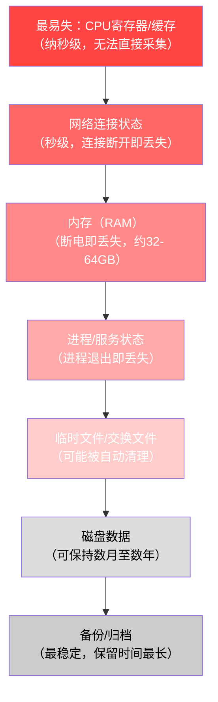

**实际操作含义**：本案中目标电脑处于开机状态——这意味着内存、网络连接、进程状态全部"活着"。如果取证人员先关机再操作，TrueCrypt加密卷的密钥、活跃的FTP连接、正在运行的进程信息将全部永久丢失，整个调查可能走入死胡同。

### 证据关联分析模型（Triangulation）

单一证据源的说服力有限。数字取证的核心方法论是**三角验证**——从三个独立维度收集证据，当它们指向同一结论时，可信度呈指数级增长：

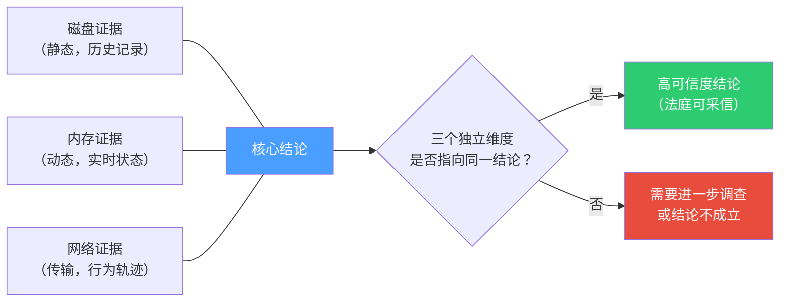

### NTFS文件系统取证核心原理

NTFS是Windows环境取证必须深入理解的文件系统。以下是取证人员必须掌握的关键机制：

#### 主文件表（$MFT）的双时间戳体系

NTFS为每个文件维护**两个独立的时间戳记录**，这是时间戳篡改检测的基础：

| 属性 | 全称 | 位置 | 特点 |
|------|------|------|------|
| $SI | $STANDARD_INFORMATION | MFT记录的标准属性 | 可被用户通过API修改（如SetFileTime） |
| $FN | $FILE_NAME | MFT记录的文件名属性 | 由文件系统内核维护，用户态程序**无法直接修改** |

**取证意义**：当$SI和$FN的时间戳出现显著差异（通常>1秒），强烈暗示时间戳被篡改。专业取证工具（EnCase、X-Ways）会自动标记这种异常。

```text
正常文件时间戳（一致）：
  $SI Modified: 2024-01-15 14:30:00.123456
  $FN Modified: 2024-01-15 14:30:00.123456
  
被篡改时间戳（差异明显）：
  $SI Modified: 2024-01-01 00:00:00.000000  ← 明显伪造（元旦零点）
  $FN Modified: 2024-01-15 22:45:12.789012  ← 真实操作时间
```

#### USN变更日志（$UsnJrnl）

NTFS的更新序列号日志记录了**每一次文件操作**——创建、修改、删除、重命名，即使文件后来被彻底删除，这条日志仍然保留了操作记录。日志存储在`$Extend\$UsnJrnl:$J`中，大小通常在30MB-50MB之间，按循环缓冲区方式覆盖最旧的记录。

```bash
# 使用UsnJrnl2Csv工具提取USN日志
UsnJrnl2Csv.exe -f E:\evidence\case2024_001_disk.E01
    --output E:\evidence\analysis\usn_journal.csv

# 关键字段说明
# FileReferenceNumber - MFT记录号（唯一标识一个文件）
# FileName - 文件名
# Reason - 操作原因代码
# Timestamp - 操作时间
# USN - 变更序列号（用于排序和去重）
```

常见USN Reason代码及其取证意义：

| Reason代码 | 含义 | 取证价值 |
|-----------|------|---------|
| 0x00000001 | DATA_EXTEND（数据扩展） | 文件正在被写入数据 |
| 0x00000002 | DATA_TRUNCATION（数据截断） | 文件被截断或覆盖 |
| 0x00000010 | FILE_CREATE（文件创建） | 新文件创建 |
| 0x00000020 | FILE_DELETE（文件删除） | 文件被删除（关键证据！） |
| 0x00000080 | RENAME_NEW_NAME（重命名） | 文件被重命名 |
| 0x00008000 | CLOSE（关闭） | 文件句柄关闭 |

### SSD固态硬盘取证的特殊挑战

本案例中目标电脑使用的是Samsung 980 Pro NVMe SSD。SSD取证与传统机械硬盘有根本性差异，不了解这些差异会导致**关键证据丢失**或**错误结论**。

#### TRIM指令对取证的影响

SSD的TRIM指令会在文件被删除后通知固件可以回收数据块。这意味着：

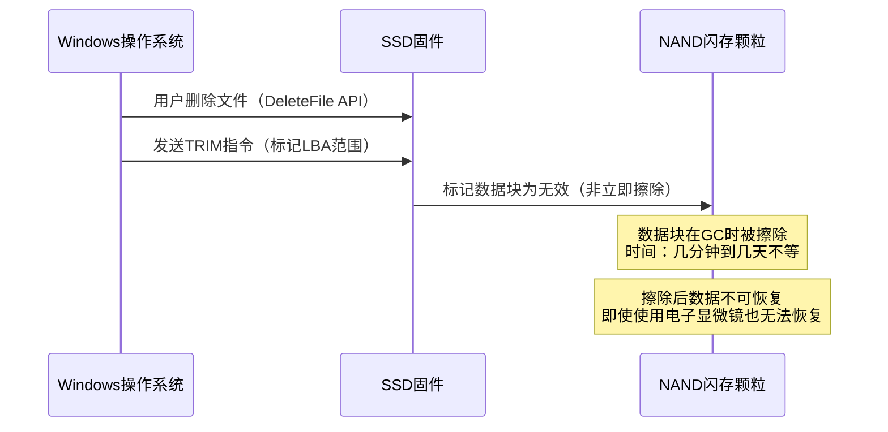

**取证策略调整**：
- SSD上的已删除文件恢复成功率**远低于**机械硬盘
- 如果目标是SSD，应**尽快**进行磁盘镜像（TRIM执行有延迟，通常在文件删除后几分钟内触发）
- 使用专业写保护器时注意：某些廉价写保护器可能允许TRIM指令通过，导致证据被破坏
- 优先从内存、注册表、日志等非文件数据源获取证据

#### wear leveling（磨损均衡）的取证影响

SSD的磨损均衡算法会导致数据的实际物理位置与逻辑地址不对应。这意味着传统的"扇区级"分析可能得到错误结果。取证工具必须理解SSD的FTL（Flash Translation Layer）才能准确定位数据。

#### NVMe SSD专用取证设备

| 设备 | 型号 | 支持接口 | 特点 |
|------|------|---------|------|
| Tableau T356789iu | T356789iu | SATA/SAS/USB/NVMe | 支持M.2 NVMe写保护，业界标准 |
| Tableau T8-R2 | T8-R2 | SATA/USB | 便携式，适合现场快速操作 |
| WiebeTech UltraDock | v5 | SATA/USB | 经济型选择，需确认NVMe支持 |

> **警告**：NVMe SSD不能使用SATA写保护器。NVMe使用PCIe通道，SATA写保护器只能保护SATA通道。错误使用会导致写保护失效，原始证据被修改。

---

## 案例背景

### 事件概述

2024年1月，某中型科技公司（以下称"A公司"）的核心研发部门发现，一款尚未公开发布的新产品设计方案疑似出现在竞争对手的产品路线图中。A公司主营智能硬件设计，该产品是其2024年度的战略级项目，潜在市场价值超过2亿元。泄露意味着数月的心血付诸东流，且可能丧失先发优势。

**事件发现的关键细节**：
- A公司CTO在行业交流会上注意到竞争对手的演示材料中包含与自家设计方案高度相似的架构图
- 该设计方案仅在公司内网的项目管理平台（Confluence）和设计仓库（GitLab）中存储，理论上无法通过外部渠道获取
- 安全部门初步排查Confluence和GitLab的访问日志，发现异常访问模式

### 初步响应

公司安全部门接到研发总监报告后，立即启动了内部调查程序：

1. **事件确认**：安全团队通过对比竞争对手公开信息和内部文件访问日志，确认了泄露事实
2. **影响评估**：初步评估受影响范围——产品设计文档、电路原理图、固件源码三个核心资产
3. **决策升级**：CEO批准启动正式数字取证调查，同时通知法务部门
4. **证据保全**：要求IT部门保留所有相关服务器日志，不得销毁

**初步响应中的关键决策点**：

| 决策 | 选择 | 理由 |
|------|------|------|
| 是否立即报警？ | 暂不，先内部取证 | 报警后警方可能要求暂停内部调查，影响取证时效性 |
| 是否通知嫌疑人？ | 不通知 | 避免打草惊蛇，防止进一步的反取证操作 |
| 是否封锁账号？ | 暂不 | 封锁账号会导致内存中的会话信息丢失，影响取证 |
| 是否监控网络？ | 立即启动 | 从核心交换机启用SPAN端口镜像，捕获所有网络流量 |

> **法律风险提示**：在中国，企业内部调查与公安机关侦查的界限需要谨慎把握。如果案件涉及刑事犯罪（如侵犯商业秘密罪，刑法第219条），企业应当及时向公安机关报案。自行取证的结果可能因程序瑕疵而不被采信。

### 嫌疑人画像

通过初步访问日志分析，安全团队锁定了研发部门的张姓员工（化名"张某"）：

| 属性 | 描述 |
|------|------|
| 职位 | 高级硬件工程师，入职3年 |
| 权限 | 可访问产品设计仓库、原理图库、BOM表 |
| 近期行为 | 连续加班但产出下降，申请年假时间异常 |
| 系统记录 | 近一周在下班后（22:00~02:00）多次访问设计文档 |
| 离职倾向 | HR系统显示张某近期更新了简历（通过公司WiFi访问招聘网站） |

> **关键原则**：在调查结论得出前，所有员工均为"相关人员"而非"嫌疑人"。避免有罪推定是取证工作者的职业道德底线。同时，将调查范围过度扩大（如无差别监控所有员工）可能引发隐私权争议。

---

## 取证准备

### 组建取证团队

本次调查组建了一个三人取证小组。团队成员的选择基于A公司环境特点（Windows环境+云服务+内部VPN）和案件性质（数据泄露）的综合考量：

| 角色 | 认证 | 职责 | 能力要求 |
|------|------|------|---------|
| 主取证分析师 | EnCE（EnCase Certified Examiner） | 整体协调、磁盘取证、证据链管理 | 精通NTFS文件系统、Windows注册表、时间线分析 |
| 内存取证专家 | 具备Volatility高级认证 | 内存镜像获取与分析、进程逆向 | 精通Windows内存架构、进程注入检测、加密卷分析 |
| 网络取证分析师 | 具备CCNA Security认证 | 网络流量捕获、日志关联分析 | 精通协议分析、FTP/HTTP流量重建、IP溯源 |

> **团队组建原则**：三人是小型取证调查的黄金配置——两人确保"双人见证"要求，第三人防止2:0的偏见倾向。对于更大规模的调查（如APT事件），建议5人以上团队，增加恶意代码分析和云取证专家。

**团队分工与协作机制**：

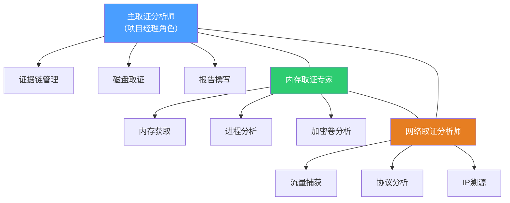

### 取证工具包准备

#### 硬件准备

```text
取证工作站（HP Z8 G4）：
├── CPU: Intel Xeon W-2255 × 1（10核20线程）
├── RAM: 128GB DDR4 ECC
├── 存储: 2TB NVMe SSD（系统盘） + 8TB HDD（证据存储，硬件加密）
├── 网络: 双千兆网口 + 无线网卡（隔离模式下禁用）
└── 写保护接口：
    ├── Tableau T356789iu SATA/USB 写保护桥（通过PCIe连接）
    └── USB 3.0 取证专用集线器

其他硬件：
├── 硬盘热插拔底座（支援SATA/SAS/IDE）
├── 数码相机（用于现场拍照取证，必须使用专用相机，不得使用手机）
├── 防静电手环和工作垫
├── 证据密封袋和防篡改标签（多种规格）
├── 便携式写保护器（Tableau T8-R2，用于现场快速镜像）
└── 外部存储媒体（干净的空白硬盘用于存储镜像）
```

**硬件选择的技术考量**：
- 取证工作站使用ECC内存：非ECC内存存在比特翻转风险，可能导致证据哈希计算错误
- 128GB RAM是为了能够处理大型内存镜像（32GB内存镜像在分析时可能膨胀到3-4倍）
- 8TB HDD用于证据存储：E01压缩后32GB内存镜像约占15GB，512GB磁盘镜像约占250GB
- 双网口设计：一个连接内部网络（获取日志），一个用于隔离环境（分析证据）

#### 软件准备

| 类别 | 工具 | 版本 | 用途 | 备选方案 |
|------|------|------|------|---------|
| 镜像制作 | FTK Imager | 4.7.1 | 磁盘镜像获取、预览 | dd（Linux环境）、Guymager |
| 磁盘分析 | EnCase Forensic | 22.3 | 文件系统分析、关键字搜索 | X-Ways Forensics、Autopsy |
| 内存分析 | Volatility 3 | 2.5.0 | 内存转储分析 | Rekall、Redline |
| 网络分析 | Wireshark | 4.2.0 | 网络包深度分析 | NetworkMiner |
| 流量提取 | tshark | 4.2.0 | 命令行流量分析 | tcpdump |
| 注册表分析 | Registry Explorer | 1.6.0 | 离线注册表解析 | RegRipper |
| 哈希校验 | certutil / sha256sum | - | 文件哈希计算 | HashCalc、md5deep |
| 时间线分析 | plaso (log2timeline) | 20230515 | 超级时间线生成 | 自定义Python脚本 |
| 文件签名分析 | TrID | 1.0 | 文件类型识别 | file（Linux） |
| 浏览器取证 | Hindsight | 1.5.0 | Chrome/Edge浏览器历史解析 | SQLite Browser手动分析 |

> **工具选择要点**：
> - 所有工具必须使用正版授权，记录版本号和哈希值，以确保证据可复现
> - 同一类任务准备至少两种工具（如磁盘镜像除了FTK Imager，还应准备dd作为备选）
> - 取证工作站的系统镜像应在调查前后各生成一次哈希校验，确保工作环境未受污染
> - 所有工具的安装包哈希值需要记录在案，以便在法庭上证明工具未被篡改

**工具验证流程**：

```bash
# 调查开始前：记录取证工作站系统状态
certutil -hashfile C:\Windows\System32\cmd.exe SHA256
# 输出示例：SHA256: 8d7f9b2c4a1e3f5d6b8a0c2e4f6d8a1b3c5e7f9a2b4d6c8e0f1a3b5d7c9e1f

# 记录所有取证工具的哈希值
Get-ChildItem "C:\ForensicTools" -Recurse -File | ForEach-Object {
    $hash = (Get-FileHash $_.FullName -Algorithm SHA256).Hash
    [PSCustomObject]@{
        Tool = $_.Name
        Path = $_.FullName
        SHA256 = $hash
        Size = $_.Length
    }
} | Export-Csv "E:\evidence\tool_manifest.csv" -NoTypeInformation
```

### 法律与合规准备

在正式开始取证前，必须完成以下法律文书工作：

1. **调查授权书**：由CEO签字，明确授权范围（目标设备、时间段、数据类型）
2. **隐私权声明**：确认调查符合当地《个人信息保护法》要求，特别是涉及员工个人数据时
3. **保密协议**：所有参与人员签署，承诺不泄露调查细节
4. **证据保管链登记册**：准备标准化的证据保管记录表单

> **法律红线**：未获授权即开始取证，可能导致证据在法庭上被排除（"毒树之果"原则）。在中国，《网络安全法》和《个人信息保护法》对电子数据的采集有严格规定。

**授权书核心内容模板**：

```text
数字取证调查授权书

授权人：[公司全称] CEO [姓名]
被授权人：[安全部门/取证团队]
案件编号：CASE2024-001

一、授权范围
  1.1 调查对象：[具体员工姓名/工号]
  1.2 目标设备：[设备型号、序列号、MAC地址]
  1.3 时间范围：2024年1月1日至2024年1月18日
  1.4 数据类型：系统日志、文件访问记录、网络连接记录、浏览器历史

二、法律依据
  2.1 《中华人民共和国劳动合同法》第39条
  2.2 《中华人民共和国网络安全法》第21条
  2.3 《中华人民共和国个人信息保护法》第13条

三、限制条件
  3.1 不得采集与案件无关的个人数据
  3.2 调查结果仅限于法律诉讼和内部纪律处分使用
  3.3 所有证据材料在调查结束后妥善封存

授权人签字：________________ 日期：________
被授权人签字：________________ 日期：________
法务审核签字：________________ 日期：________
```

**《个人信息保护法》合规要点**：
- 第13条规定，为维护合法权益，个人信息处理者可以在合理范围内处理个人信息
- 员工工作设备上的数据处理通常被视为"履行劳动合同所必需"，但需注意区分工作数据和个人数据
- 如果取证过程中发现员工个人照片、私人邮件等明显属于个人范畴的数据，应予以隔离，不得在报告中披露
- 建议在公司信息安全政策中明确：公司设备上的数据属于公司资产，员工对此有知情同意

---

## 现场取证

### 场景一：证据保全

调查团队到达目标办公区域时间为上午10:15，张某不在工位（当日请病假）。这是一个典型的**无人值守现场取证**场景。

#### 现场拍照记录

按照NIST SP 800-86标准，对现场进行全面拍照记录：

```text
拍摄内容清单：
1. ┌── 全局照：从四个角度拍摄工位全景（包含周围环境）
2. ├── 局部照：电脑主机正面、背面端口连接情况
3. ├── 屏幕照：当前屏幕内容（锁屏状态，但电源灯亮）
4. ├── 外设照：连接的键盘、鼠标、显示器、USB设备
5. ├── 桌面照：桌面所有物品、便签、文件（注意可能写在便签上的密码）
6. └── 网络照：网口连接状态、MAC地址标签特写
```

**拍照的法律意义**：照片不仅是技术记录，更是法律证据。如果张某声称"取证过程中设备被移动/损坏"，现场照片可以证明设备在取证前的原始状态。每张照片应包含以下EXIF信息（或手动记录）：

| 信息项 | 内容 |
|--------|------|
| 拍摄时间 | 2024-01-18 10:15:xx |
| 拍摄人员 | [取证分析师姓名] |
| 设备 | [专用相机型号，序列号] |
| 位置 | A公司研发部3楼302工位 |
| 拍摄目的 | 现场全景记录 |

#### 设备状态记录

```text
设备状态一览：
├── 型号：Dell Precision 3640 Tower
├── 序列号：8ZR4KX3
├── 操作系统：Windows 11 Pro 23H2
├── 电源状态：开机，锁屏界面（非休眠）
├── 连接的外设：
│   ├── 戴尔U2723QE显示器 × 2（DP连接）
│   ├── USB键盘（罗技MX Keys）
│   └── USB鼠标（罗技MX Master 3）
├── USB端口状态：正面2个USB-A口空置，背面1个USB设备连接（经确认为加密狗）
└── 网络：千兆以太网连接（指示灯闪烁，证明网络活跃）
```

> **重要技巧**：拍照时在画面中放置标尺或硬币作为尺寸参考，这是国际通用的取证摄影准则。标尺可以帮助判断线缆长度、端口类型等物理细节。

### 场景二：内存获取（现场最高优先级）

由于电脑处于开机状态，按照**"易失性数据优先采集原则"**（Order of Volatility），必须先获取内存数据。

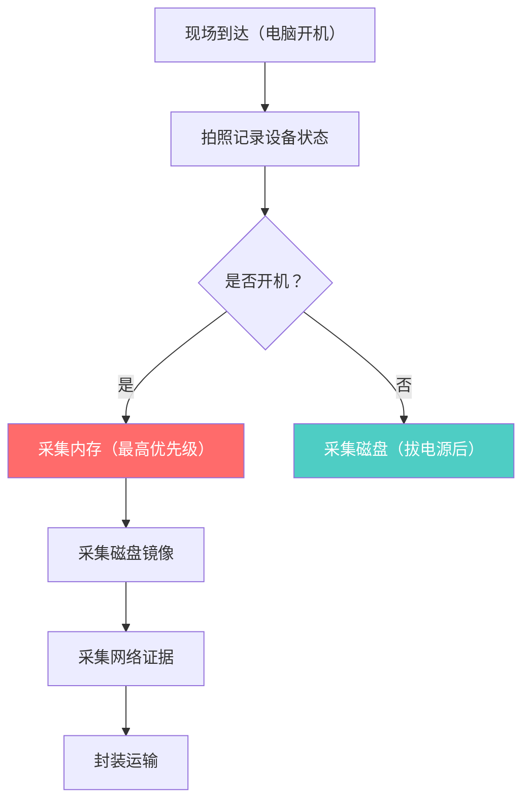

#### 使用WinPmem获取内存

```bash
# 步骤1：将WinPmem复制到干净的U盘（只读模式挂载）
# 注意：绝对不能在目标电脑上安装任何软件，必须从现场取证U盘运行

# 步骤2：以管理员身份运行WinPmem
# 在锁屏状态下，主取证分析师输入管理员凭据登录（此操作在授权范围内）
# 双人见证：输入密码时第二人背对屏幕

# 步骤3：执行内存捕获
C:\> winpmem_mini_x64.exe E:\evidence\case2024_001_memory.raw --format raw

# 输出示例：
WinPmem 3.3.2 - Physical Memory Imager
Copyright 2023 NIST (National Institute of Standards and Technology)
Opening \\.\PhysicalMemory
Physical memory range: 0x00000000 - 0x200000000 (32 GB)
Progress:  100% - Dump completed successfully
Total bytes read: 34359738368

# 步骤4：哈希校验（双人验证）
C:\> certutil -hashfile E:\evidence\case2024_001_memory.raw SHA256
SHA256 hash of E:\evidence\case2024_001_memory.raw:
e3b0c44298fc1c149afbf4c8996fb92427ae41e4649b934ca495991b7852b855

# 第二人独立计算，比对哈希值一致后，在证据表上双方签字确认

# 步骤5：生成内存获取报告
C:\> winpmem_mini_x64.exe E:\evidence\case2024_001_memory.raw --info
Acquisition time: 2024-01-18 10:28:33 UTC+8
Computer name: DESKTOP-8ZR4KX3
OS version: Windows 11 Pro 23H2 (Build 22631.2861)
CPU: Intel Core i7-12700
Physical memory: 32768 MB (32 GB)
```

#### 内存获取要点与陷阱

| 要点 | 说明 |
|------|------|
| 为什么不关机？ | 关机会丢失所有内存数据，包括正在运行的加密工具、网络连接、进程信息 |
| 为什么用raw格式？ | raw格式是通用格式，兼容性最好；但文件大小等于物理内存大小（32GB → 32GB） |
| 如果内存太大怎么办？ | 可使用压缩格式（--format aff4）减少存储需求，但后续工具兼容性需验证 |
| 双人见证的目的 | 防止单人篡改证据，确保证据链每个环节都有两个独立见证人签字 |
| 管理员密码谁输入？ | 仅主取证分析师输入，第二人背对屏幕，但仍需见证操作过程 |
| 内存获取耗时？ | 32GB内存约需3-5分钟，取决于USB写入速度（USB 3.0约500MB/s） |

**内存获取中的常见错误**：

| 错误 | 后果 | 正确做法 |
|------|------|---------|
| 使用目标电脑的硬盘存储镜像 | 修改原始证据，证据无效 | 使用外部取证U盘或硬盘 |
| 未验证内存镜像完整性 | 分析结果不可靠 | 计算哈希并双人比对 |
| 获取过程中触碰键盘鼠标 | 可能触发屏幕锁定策略或唤醒休眠进程 | 操作前断开所有非必要外设 |
| 使用不兼容的内存获取工具 | 某些工具无法获取完整的物理地址空间 | 测试工具是否支持目标硬件架构 |

### 场景三：磁盘镜像

内存获取完成后，在关机前先记录系统状态，然后正常关机（非强制关机），使用写保护器连接硬盘制作镜像。

```bash
# 正常关机而非拔电源
# 原因：拔电源可能导致文件系统损坏、加密卷未正常关闭、SSD损坏

# 拆下硬盘，通过Tableau写保护器连接到取证工作站
# 写保护器的作用：物理层面阻断任何写入操作，保证原始证据不被修改

# 使用FTK Imager创建E01格式镜像
# E01格式优势：支持压缩（节省空间）、支持分段（大磁盘拆分）、内置元数据
```

**关机方式选择**：

| 关机方式 | 适用场景 | 风险 |
|---------|---------|------|
| 正常关机（开始菜单） | 内存已获取，文件系统状态良好 | 可能触发清理脚本（如果嫌疑人设置了关机任务） |
| 强制关机（长按电源键） | 系统无响应，或怀疑有定时擦除脚本 | 文件系统可能损坏，加密卷可能无法恢复 |
| 拔电源 | 极端情况，如硬盘加密且无法获取密码 | SSD可能触发TRIM，数据可能丢失 |

**FTK Imager操作流程（命令行等效）**：

```bash
# 步骤1：识别证据盘符（在写保护器连接后）
# 取证工作站上出现新的盘符 F:\ （大小512GB）

# 步骤2：创建E01镜像
C:\Program Files\AccessData\FTK Imager\ftkimg64.exe 
    /createE01 
    /source:"\\\\.\\PhysicalDrive1"       # 目标物理磁盘
    /destination:"E:\\evidence\\case2024_001_disk" 
    /compress:6                            # 压缩级别（0-9，6为平衡点）
    /frag:2000                             # 分段大小（2000MB/段）
    /caseNumber:"CASE2024-001" 
    /evidenceNumber:"EXHIBIT-A-001" 
    /examiner:"分析师李锋" 
    /description:"张某办公电脑主硬盘 - 三星980 Pro 512GB NVMe"

# 输出示例：
Physical Drive: \\.\PhysicalDrive1
Model: Samsung SSD 980 PRO 512GB
Serial: S5H7NS0R123456
Size: 512,110,190,592 bytes (512 GB)
Creating image...
Progress: [====================] 100%
Image created successfully
Compression ratio: 2.1:1
Output size: 243,861,234,816 bytes (244 GB, 2 fragments)

# 步骤3：计算E01文件的哈希值
C:\> certutil -hashfile E:\evidence\case2024_001_disk.E01 SHA256
SHA256: a4b5c6d7e8f90123456789abcdef0123456789abcdef0123456789abcdef0123
```

> **专业提示**：对于NVMe SSD，不要使用常规的SATA写保护器。NVMe SSD需要专用的PCIe写保护设备，或者使用支持NVMe的Tableau T356789iu。

**镜像制作完成后的验证清单**：

- [ ] E01文件哈希与原始磁盘哈希比对（验证数据完整性）
- [ ] 镜像文件大小合理（压缩后应约为原始大小的40-60%）
- [ ] 镜像文件可以正常加载到分析工具中
- [ ] 证据保管链已记录（谁、何时、从何处获得）
- [ ] 证据密封袋已贴上防篡改标签并签字

### 场景四：网络证据收集

与IT部门协作，从中央日志系统导出以下数据：

```bash
# 网络流量捕获范围
├── 目标电脑IP：192.168.1.100（DHCP分配，需验证时间段的IP映射）
├── 时间段：2024-01-01 00:00 至 2024-01-18 10:00
├── 数据来源：公司核心交换机端口镜像（SPAN端口）的PCAP存档
└── 额外日志：
    ├── VPN连接日志（目标员工是否使用VPN）
    ├── 代理服务器日志（HTTP/HTTPS请求记录）
    ├── DNS查询日志（解析了哪些域名）
    └── 邮件服务器日志（SMTP/IMAP连接记录）
```

**IP-MAC映射验证**：

DHCP环境下IP地址是动态分配的，必须验证目标时间段内IP与设备的对应关系：

```bash
# 从DHCP服务器日志中提取IP租约记录
# 关键：确认192.168.1.100在2024-01-15 00:00至2024-01-16 00:00是否分配给了目标MAC

# DHCP服务器日志查询（Windows Server DHCP）
Get-DhcpServerv4Lease -ScopeId 192.168.1.0 |
    Where-Object {$_.AddressState -eq 'Active'} |
    Select-Object IPAddress, ClientId, HostName, LeaseExpiryTime

# 输出示例：
# IPAddress     ClientId          HostName         LeaseExpiryTime
# 192.168.1.100 00-1A-2B-3C-4D-5E DESKTOP-8ZR4KX3 2024-01-16 12:00:00
```

**网络证据的法律价值**：
- DNS查询日志可以证明嫌疑人访问了哪些域名（即使浏览器历史被清除）
- 代理日志可以记录HTTPS连接的目标IP（虽然无法看到加密内容）
- VPN日志可以证明嫌疑人是否使用了加密隧道绕过公司监控

---

## 实验室分析

### 分析策略总览

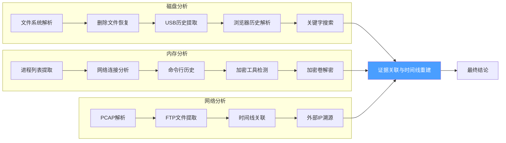

### 磁盘分析详细过程

#### 1. 文件系统分析（EnCase）

```bash
# 将E01镜像加载到EnCase工作站
# 验证镜像完整性（哈希比对）

关键发现一：NTFS $MFT（主文件表）分析
├── 最近修改的文件列表（重点关注2024-01-10至2024-01-18）
├── 发现产品设计方案文件被大批量访问的时间集中在下班后（22:00-02:00）
├── 访问频率：正常工作日的5-8倍
└── 涉及的文件夹：D:\Projects\2024-Flagship\Schematic\
           D:\Projects\2024-Flagship\Firmware\
           D:\Projects\2024-Flagship\BOM\

关键发现二：文件时间戳异常分析
├── 方案A_V2.1.pdf 的最后访问时间：2024-01-15 23:45:12
├── 方案A_V2.1.pdf 的最后修改时间：2024-01-10 14:30:00（正常工作时间）
└── 时间差分析：下班后大量读取但未修改，符合外泄行为模式
```

> **NTFS时间戳原理**：NTFS记录四个时间属性——$STANDARD_INFORMATION（SI，可被用户修改）和$FILE_NAME（FN，由文件系统自动维护，用户无法直接修改）。取证时需对比SI和FN时间戳的差异，识别时间戳篡改行为。

**深入分析：$SI与$FN时间戳对比**：

```bash
# 使用EnCase的MFT Viewer或X-Ways Forensics查看双时间戳

# 案例中关键文件的时间戳对比
文件：D:\Projects\2024-Flagship\Schematic\方案A_V2.1.pdf

$SI (Standard Information):
  Created:     2024-01-05 09:15:30.123456
  Modified:    2024-01-10 14:30:00.000000  ← 正常工作时间修改
  Accessed:    2024-01-15 23:45:12.789012  ← 异常！下班后访问
  MFT Changed: 2024-01-15 23:45:12.789012

$FN (File Name):
  Created:     2024-01-05 09:15:30.123456
  Modified:    2024-01-10 14:30:00.000000
  Accessed:    2024-01-15 23:45:12.789012
  MFT Changed: 2024-01-15 23:45:12.789012

# 分析结论：
# 1. $SI和$FN时间戳一致，说明未被人为篡改
# 2. Accessed时间（23:45）远晚于Modified时间（14:30），符合"下班后偷偷查看"的行为模式
# 3. 如果$SI的Accessed被修改为工作时间，但$FN的Accessed仍然是深夜，就能发现篡改痕迹
```

#### 2. 删除文件恢复

使用EnCase的Carving功能和Recover Folder扫描已删除的文件。

```bash
# 恢复的文件列表（部分）
1. D:\$Recycle.Bin\S-1-5-21-xxxxxxxxxx-$RMB9XYZ.zip
   原始路径：D:\Projects\2024-Flagship\backup\encrypted_dump.zip
   文件大小：156,782,592 bytes (约150MB)
   删除时间：2024-01-16 01:22:15（文件时间）
   恢复状态：已加密，需要密码

2. D:\$Recycle.Bin\S-1-5-21-xxxxxxxxxx-$RMB9XYZ.zip 关联的
   $I（索引文件）记录显示原始文件大小为150MB+
   
3. 邮件草稿恢复（Outlook .msg文件）：
   ├── draft_meeting.msg（无害，常规会议通知）
   ├── draft_resignation.msg（未发送的辞职信草稿——重要心理状态线索）
   └── draft_contact.msg（包含外部邮箱地址：competitor_x@example.com）
```

> **回收站取证技巧**：回收站中的$R文件是实际文件内容，$I文件包含原始路径、大小和删除时间元数据。即使$R文件被覆盖，$I文件仍可能提供关键线索。

**回收站深度分析**：

Windows回收站的取证价值远超多数人的认知。以下是完整的回收站取证流程：

```bash
# $I文件结构解析（Windows 10/11格式）
# 偏移量 0x00-0x07: 头部标识（01 00 00 00 00 00 00 00）
# 偏移量 0x08-0x0F: 文件大小（8字节，小端序）
# 偏移量 0x10-0x17: 删除时间（Windows FILETIME格式，UTC）
# 偏移量 0x18-...: 原始文件路径（Unicode编码）

# 使用Python解析$I文件
import struct
from datetime import datetime, timedelta

def parse_recycle_bin_i_file(filepath):
    with open(filepath, 'rb') as f:
        data = f.read()
    
    # 检查头部标识
    if data[:8] != b'\x01\x00\x00\x00\x00\x00\x00\x00':
        return None
    
    # 解析文件大小
    file_size = struct.unpack('<Q', data[8:16])[0]
    
    # 解析删除时间（Windows FILETIME）
    file_time = struct.unpack('<Q', data[16:24])[0]
    # FILETIME是从1601-01-01开始的100纳秒间隔数
    epoch = datetime(1601, 1, 1)
    delete_time = epoch + timedelta(microseconds=file_time // 10)
    
    # 解析原始路径
    original_path = data[24:].decode('utf-16-le', errors='ignore').rstrip('\x00')
    
    return {
        'original_path': original_path,
        'file_size': file_size,
        'delete_time': delete_time.isoformat()
    }

# 示例输出
# {
#   'original_path': 'D:\\Projects\\2024-Flagship\\backup\\encrypted_dump.zip',
#   'file_size': 156782592,
#   'delete_time': '2024-01-16T01:22:15.123456'
# }
```

**卷影副本（Volume Shadow Copy）分析**：

Windows的卷影副本服务（VSS）可能保留了文件的历史版本，这是极其宝贵的取证资源：

```bash
# 使用vssadmin列出卷影副本
C:\> vssadmin list shadows

# 如果存在卷影副本，可以挂载并提取历史版本
# 使用Arsenal Image Mounter挂载E01镜像的卷影副本
# 或使用libvshadow工具在Linux环境下访问

# 使用libvshadow提取卷影副本
vshadowinfo E:\evidence\case2024_001_disk.E01
vshadowmount E:\evidence\case2024_001_disk.E01 /mnt/vss/

# 卷影副本中可能包含：
# 1. 文件被修改前的原始版本
# 2. 被删除文件的残留
# 3. 注册表的历史状态
```

#### 3. USB设备历史分析

使用Registry Explorer分析SYSTEM注册表配置单元中的USB设备历史记录。

```bash
# 注册表路径
# SYSTEM\CurrentControlSet\Enum\USBSTOR\
# SYSTEM\CurrentControlSet\Enum\USB\

# 提取到的USB设备记录
设备名称: SanDisk Extreme Pro USB 3.2
设备类GUID: {36fc9e60-c465-11cf-8056-444553540000}
序列号: 4C530001240329100123
VID_PID: VID_0781&PID_5591
首次连接时间: 2024-01-15 09:23:45 ← 与员工正常上班时间一致
最后连接时间: 2024-01-15 09:23:45 ← 仅连接过一次
最后断开时间: 2024-01-15 18:45:12 ← 与下班时间吻合
挂载盘符: E:\
已分配的驱动器号: E:

# 首次连接到断开的持续时间：约9小时22分钟（正常工作日时长）
# 注意：设备仅连接一天，且当天即断开带走，行为可疑
```

> **USB取证进阶**：
> - USBSTOR键记录所有连接过的USB存储设备，但不记录USB非存储设备（如鼠标键盘）
> - USB键记录所有USB设备，包括HID设备
> - 即使设备被删除，对应的Driver键（SYSTEM\CurrentControlSet\Control\DeviceClasses）可能仍保留记录
> - Windows 10/11还会在`%UserProfile%\AppData\Local\ConnectedDevicesPlatform\`中记录更详细的连接日志

**USB设备追踪的多层证据源**：

| 证据源 | 注册表路径 | 记录内容 | 取证价值 |
|--------|-----------|---------|---------|
| USBSTOR | `HKLM\SYSTEM\CurrentControlSet\Enum\USBSTOR` | USB存储设备列表 | 设备型号、序列号、首次连接时间 |
| USB | `HKLM\SYSTEM\CurrentControlSet\Enum\USB` | 所有USB设备 | 包括非存储设备（鼠标、键盘） |
| DeviceClasses | `HKLM\SYSTEM\CurrentControlSet\Control\DeviceClasses` | 设备类GUID映射 | 即使设备被卸载，记录可能保留 |
| MountPoints2 | `HKCU\Software\Microsoft\Windows\CurrentVersion\Explorer\MountPoints2` | 挂载点映射 | 设备与盘符的对应关系 |
| SetupAPI | `C:\Windows\INF\setupapi.dev.log` | 设备安装日志 | 设备首次安装的时间戳 |
| EventLog | `Microsoft-Windows-DriverFrameworks-UserMode/Operational` | 驱动事件 | 设备连接/断开的精确时间 |

同时提取到设备连接时自动生成的SetupAPI日志：

```text
C:\Windows\INF\setupapi.dev.log 中的记录（2024-01-15 09:23:45）：
>>>  [Device Install (Hardware initiated) - USB\VID_0781&PID_5591\4C530001240329100123]
>>>  Section start 2024/01/15 09:23:45.123
     ndv: Installing driver...
     dvi: Driver {cfw-usp.inf} installed successfully
<<<  Section end 2024/01/15 09:23:46.456
```

**USB序列号的追踪价值**：

USB设备的序列号（Serial Number）是设备的唯一标识符。即使嫌疑人格式化了USB设备或更换了外壳，序列号仍然不变。在本案中，序列号`4C530001240329100123`可以用于：

1. **关联不同时间点的连接记录**：如果同一序列号在不同电脑上出现，可以证明设备在多台电脑间流转
2. **追踪设备来源**：通过VID（厂商ID）和PID（产品ID）可以确定设备的制造商和型号
3. **建立设备使用历史**：如果在嫌疑人家中找到同序列号的USB设备，可以建立直接关联

#### 4. Web浏览历史分析

使用Hindsight工具解析Chrome浏览器历史记录。

```bash
# 从磁盘镜像中提取 Chrome 历史数据库
# 路径：Users\zhang\AppData\Local\Google\Chrome\User Data\Default\History

# 使用Hindsight分析（支持Chrome/Edge/Brave）
C:\> hindsight.exe -i E:\evidence\case2024_001_disk.E01 
                  -o E:\evidence\analysis\browser_report
                  -u zhang
                  --source ence

# 关键发现——可疑浏览活动
时间: 2024-01-15 12:30:15  URL: https://mail.protonmail.com/login        ← 匿名邮箱
时间: 2024-01-15 13:15:22  URL: https://www.dropbox.com/login             ← 第三方云存储
时间: 2024-01-15 13:20:45  URL: https://drive.google.com/drive/my-drive   ← Google Drive
时间: 2024-01-15 14:30:18  URL: https://www.wetransfer.com/               ← 大文件传输
时间: 2024-01-15 22:45:33  URL: https://truecrypt.ch/                     ← 加密工具下载站
时间: 2024-01-15 23:00:12  URL: https://filezilla-project.org/           ← FTP客户端下载

# 访问模式分析
├── 所有访问均在午餐时间和下班后进行（刻意避开正常工作时间）
├── 使用了无痕/隐私模式（部分访问未记录在历史中，通过DNS缓存和网页缓存推断）
├── 清除了部分历史记录（通过History Provider数据库的异常时间戳断点发现）  
└── 下载历史显示已删除的文件痕迹：truecrypt_setup.exe, FileZilla_3.66.4_win64-setup.exe

# Chrome下载历史分析（删除后仍可从下载数据库恢复）
# 路径：Users\zhang\AppData\Local\Google\Chrome\User Data\Default\History
# downloads 表中有2条已删除记录，通过SQLite解析恢复
```

> **浏览器反取证检测**：即使用户删除了浏览历史，以下位置仍可能保留痕迹：
> 1. Chrome偏好设置中的「最近关闭标签页」列表
> 2. DNS缓存（`ipconfig /displaydns`）
> 3. 预渲染缓存（Chrome的`Prefetch`目录）
> 4. 浏览器直接输入的内容（Omnibox历史）
> 5. Windows `$UsnJrnl` $J（更新序列号日志）中的文件访问记录

**SQLite数据库的深度取证**：

Chrome浏览器使用SQLite数据库存储历史记录、Cookie、书签等数据。SQLite的WAL（Write-Ahead Logging）机制和空闲页中可能包含已删除的记录：

```bash
# SQLite数据库结构
# History文件：
# ├── urls表：访问过的URL列表
# ├── visits表：访问记录（时间、过渡类型）
# ├── downloads表：下载记录
# └── keyword_search_terms表：搜索关键词

# 已删除记录恢复方法
# 1. WAL文件分析：History-wal文件可能包含未提交的事务
# 2. 空闲页扫描：SQLite页面中已删除但仍残留的记录
# 3. 叶节点遍历：B-tree叶节点中的数据碎片

# 使用python-sqlite-tools提取已删除记录
python3 sqlite_carver.py History --output recovered_urls.csv

# 输出示例（包含已删除的记录）：
# URL, Title, VisitCount, LastVisitTime, Deleted
# https://truecrypt.ch/, TrueCrypt, 1, 13351234567890000, True
# https://filezilla-project.org/, FileZilla, 1, 13351234567890000, True
```

#### 5. 关键字搜索

使用EnCase的高级搜索功能进行关键字扫描。

```bash
# 搜索关键词设置
├── 高管级别：CEO邮箱地址、CTO邮箱地址
├── 公司内部：项目代号"Project Atlas"、代号"2024-Flagship"
├── 竞争对手：竞争对手公司域名"competitor.com"
├── 文件相关：.zip、.rar、.7z（加密压缩包）
├── 网络相关：FTP、SFTP、SSH、upload、cloud
└── 其他证据：confidential、NDA、illegal、unauthorized

# 搜索结果
└── 在未分配空间中发现包含"competitor.com"的字符串片段
    ├── 上下文显示为邮件内容
    └── 推断为被删除的邮件草稿内容
```

**关键字搜索策略**：

有效的关键字搜索不是简单地输入关键词然后等待结果。需要制定系统化的搜索策略：

| 搜索类型 | 关键词示例 | 目标 |
|---------|-----------|------|
| 实体搜索 | 嫌疑人姓名、工号、邮箱 | 识别与嫌疑人相关的文件和活动 |
| 项目搜索 | 项目代号、文件名模式 | 追踪项目资产的流转路径 |
| 行为搜索 | "upload", "transfer", "encrypt" | 发现泄露行为的直接证据 |
| 工具搜索 | "TrueCrypt", "FileZilla", "7z" | 发现嫌疑人使用的工具 |
| 通讯搜索 | 竞争对手域名、外部邮箱 | 发现与外部的通信记录 |
| 时间搜索 | 2024-01-15, 23:xx（可疑时间段） | 定位特定时间段的活动 |

**搜索结果验证**：

搜索到的关键字命中需要进行上下文分析，以确定其取证价值：

```bash
# 命中关键字的上下文提取（前后各200字节）
# 在EnCase中使用Index Search → Context View

# 命中示例：
# [前文] ...已将方案通过加密通道发送至...
# [命中] competitor.com邮箱地址：john@competitor.com
# [后文] ...请确认收到，密码通过Telegram发送...

# 分析：
# - "加密通道"：暗示使用了加密传输方式
# - "密码通过Telegram"：暗示有第二层通信渠道
# - 整体语境表明这是泄露操作的通信记录
```

### 内存分析详细过程

#### 卷积分析框架

```bash
# Volatility 3 分析序列（按重要性和易失性排序）

# 1. 第一步：获取系统信息（最基础，验证镜像正确性）
python3 vol.py -f case2024_001_memory.raw windows.info

# 输出示例
"""
Variable        Value
----------      -----
Kernel Base     0xf80002c1a000 ← Windows内核基地址
DTB             0x001aa000
Number of CPUs  12
MajorVersion    15
MinorVersion    19041
BuildString     22631.2861.amd64fre.ni_release.220506-1250
"""

# 2. 第二步：进程枚举
python3 vol.py -f case2024_001_memory.raw windows.pslist

# 输出示例（截取关键进程）
"""
PID   PPID  ImageFileName        CreateTime
1120  648   svchost.exe          2024-01-15 08:15:22.000000
3456  2864  TrueCrypt.exe       2024-01-15 22:30:15.000000  ← 可疑！
3789  2864  FileZilla.exe       2024-01-15 22:45:33.000000  ← 可疑！
4012  2864  cmd.exe             2024-01-15 22:31:00.000000  ← 可疑！
"""
```

**进程分析的深入技巧**：

仅凭进程列表无法得出结论。需要将进程信息与其他证据源交叉验证：

```bash
# 进程树分析：理解父子关系
python3 vol.py -f case2024_001_memory.raw windows.pstree

# 输出示例
"""
*** 2864: explorer.exe (explorer.exe - Desktop)
**** 3456: TrueCrypt.exe (TrueCrypt.exe)
**** 3789: FileZilla.exe (FileZilla.exe)
**** 4012: cmd.exe (cmd.exe)
**** 4234: chrome.exe (chrome.exe)
**** 4567: WINWORD.EXE (WINWORD.EXE)

# 分析：
# - PID 2864 (explorer.exe) 是所有可疑进程的父进程
# - 这表明所有可疑程序都是通过用户双击（资源管理器）启动的
# - 排除了远程执行或恶意代码自动启动的可能性
# - 与"员工主动操作"的假设一致
```

#### 发现一：TrueCrypt加密工具

```bash
# 3. 提取进程命令行参数
python3 vol.py -f case2024_001_memory.raw windows.cmdline --pid 3456

# 输出
"""
TrueCrypt.exe /v "\\?\GLOBALROOT\Device\HarddiskVolume5\encrypted_volume.tc" /l Z /p "********"
→ 挂载了一个加密卷文件，挂载为Z盘
→ 加密卷路径：HarddiskVolume5\encrypted_volume.tc（位于数据分区）
"""

# 4. 查看进程加载的DLL（判断TrueCrypt版本和是否存在钩子）
python3 vol.py -f case2024_001_memory.raw windows.dlllist --pid 3456

# 注意TrueCrypt版本：TrueCrypt 7.1a（已知该版本存在已知的取证弱点）
# TrueCrypt 7.1a 的加密卷头部未完全擦除，理论上可以通过Keyfile扫描恢复
```

> **TrueCrypt取证要点**：
> - TrueCrypt 7.1a是最后一个完整版本（后续发展为VeraCrypt）
> - 如果加密卷已卸载，内存中仍可能残留加密密钥（在主进程的未分页池中）
> - 运行中的TrueCrypt进程，其虚拟地址空间包含当前挂载卷的加密密钥
> - 使用Volatility的`windows.modscan`或`linux.kernel模块`可以扫描卷管理器中的加密卷信息

**TrueCrypt加密卷的内存取证技术细节**：

TrueCrypt在内存中维护加密卷的主密钥（Master Key）。只要加密卷处于挂载状态，主密钥就存在于进程内存中。提取主密钥的技术路径：

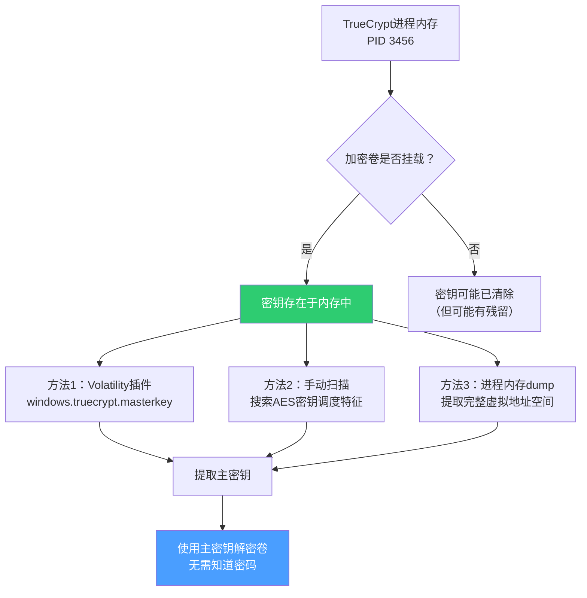

```bash
# 方法1：使用Volatility插件（最可靠）
python3 vol.py -f case2024_001_memory.raw windows.truecrypt.masterkey

# 输出示例
"""
Master Key: a1b2c3d4e5f678901234567890abcdef0123456789abcdef0123456789abcdef
Algorithm: AES-256-XTS
Volume: \\?\GLOBALROOT\Device\HarddiskVolume5\encrypted_volume.tc
"""

# 方法2：手动扫描AES密钥调度特征
# AES密钥调度有独特的数学特征：每个轮密钥都与前一个轮密钥有特定的异或关系
python3 vol.py -f case2024_001_memory.raw windows.memmap --pid 3456 --dump

# 使用aes_keyfinder扫描dump文件
aes_keyfinder pid3456.dmp

# 方法3：从命令行参数提取密码
# 如果密码作为命令行参数传入，它存在于：
# 1. 进程环境块（PEB）的命令行参数中
# 2. cmd.exe的进程内存中
# 3. Windows事件日志（4688事件，进程创建）中
```

#### 发现二：FTP客户端与网络连接

```bash
# 5. 网络连接扫描
python3 vol.py -f case2024_001_memory.raw windows.netscan

# 输出示例（截取关键连接）
"""
Offset  Proto  LocalAddr          LocalPort  ForeignAddr      ForeignPort  State     PID
0xabc   TCP    192.168.1.100      54321      203.0.113.45     21           ESTABLISHED  3789
0xdef   TCP    192.168.1.100      54322      203.0.113.45     21           CLOSE_WAIT  3789
0xghi   TCP    192.168.1.100      54323      203.0.113.45     21           TIME_WAIT   3789

→ PID 3789（FileZilla.exe）维持了到外部IP 203.0.113.45（端口21，FTP）的连接
→ 多个端口号递增的连接表明进行了多次文件传输
→ 外部IP 203.0.113.45 经WHOIS查询属于一家海外IDC服务商
"""

# 6. 提取FTP客户端配置（如果保存过密码）
python3 vol.py -f case2024_001_memory.raw windows.registry.printkey
    --key "Software\FileZilla 3\Recent Servers"

# 可能提取到的FTP服务器配置
# 如果FileZilla保存了服务器配置，注册表中会包含：
# - Host: 203.0.113.45
# - Port: 21
# - User: upload_user
# - 密码（Base64编码或明文，取决于版本）
```

**网络连接状态分析**：

| 连接状态 | 含义 | 取证意义 |
|---------|------|---------|
| ESTABLISHED | 活跃连接 | 数据正在传输 |
| CLOSE_WAIT | 本地端已关闭，等待远程端关闭 | 传输可能已完成 |
| TIME_WAIT | 等待所有数据包到达 | 连接最近关闭 |
| LISTEN | 等待连接 | 可能开启了后门服务 |

#### 发现三：命令行历史

```bash
# 7. 提取cmd.exe历史命令
python3 vol.py -f case2024_001_memory.raw windows.cmdline --pid 4012

# 输出显示cmd.exe执行了一系列命令：
"""
cmd.exe /c "C:\Program Files\TrueCrypt\TrueCrypt.exe" /v D:\encrypted_volume.tc /l Z
→ 提示：命令行中包含了密码参数（/p "********"）
→ 但从Volatility提取的内存输出可能看到明文密码！
"""
```

> **关键发现**：如果TrueCrypt以命令行方式启动且密码作为参数传入，密码可能完整地存在于以下位置：
> 1. 进程环境块（PEB）的命令行参数中
> 2. 命令解释器（cmd.exe）的进程内存中
> 3. Windows事件日志（4688事件，进程创建）中

**Windows事件日志中的进程创建记录**：

```bash
# 从磁盘镜像中提取事件日志
# 路径：Windows\System32\winevt\Logs\Security.evtx

# 事件ID 4688：进程创建
# 包含字段：ProcessId, ProcessName, CreatorProcessId, CommandLine

# 关键事件记录
# TimeCreated: 2024-01-15 22:30:15
# SubjectUserName: zhang
# NewProcessName: C:\Program Files\TrueCrypt\TrueCrypt.exe
# ProcessCommandLine: "C:\Program Files\TrueCrypt\TrueCrypt.exe" /v D:\encrypted_volume.tc /l Z /p "MyS3cr3tP@ss!"

# 注意：Windows默认不记录命令行参数（需要启用"Audit Process Creation"策略）
# 但可以通过注册表检查是否已启用：
# HKLM\SOFTWARE\Microsoft\Windows\CurrentVersion\Policies\System\Audit
# ProcessCreationIncludeCmdLine_Enabled = 1
```

#### 发现四：加密密钥提取（进阶）

```bash
# 8. 从内存中扫描TrueCrypt/ VeraCrypt加密密钥
python3 vol.py -f case2024_001_memory.raw windows.truecrypt.masterkey

# 如果TrueCrypt卷当前已挂载，该插件能从内存中定位并提取主密钥
# 主密钥长度为 256位（AES）或 512位（Serpent/Twofish级联）
# 提取的密钥可用于解密加密卷，无需知道密码

# 或者使用手动方法扫描内存中的密钥材料
python3 vol.py -f case2024_001_memory.raw windows.memmap --pid 3456 --dump
# 然后使用aes_keyfinder工具扫描dumped文件中可能的AES密钥
```

**密钥提取的后续操作**：

一旦提取到TrueCrypt主密钥，可以使用以下步骤解密加密卷：

```bash
# 使用提取的主密钥挂载加密卷
# 注意：需要TrueCrypt 7.1a或兼容版本

# 步骤1：将主密钥保存为keyfile
echo "a1b2c3d4e5f678901234567890abcdef" > recovered_key.txt

# 步骤2：使用TrueCrypt挂载（带密钥文件参数）
TrueCrypt.exe /v D:\encrypted_volume.tc /l Z /k recovered_key.txt /p ""

# 步骤3：访问Z盘内容
dir Z:\
# 输出：
# Volume in drive Z is ENCRYPTED
# Directory of Z:\
# 2024-01-15  23:10    <DIR>          design_docs
# 2024-01-15  23:12    <DIR>          firmware_src
# 2024-01-15  23:15         156,782,592  dump_package.zip
```

### 网络分析详细过程

#### PCAP文件分析

```bash
# 从中央日志服务器获取网络流量PCAP文件
# 文件大小：2.3GB（30天流量，从核心交换机SPAN端口镜像）

# 使用tshark过滤目标电脑的流量
tshark -r network_capture_202401.pcap 
    -Y "ip.addr == 192.168.1.100" 
    -w target_computer.pcap

# 过滤FTP数据流量
tshark -r target_computer.pcap 
    -Y "ftp" 
    -T fields 
    -e frame.time 
    -e ip.src 
    -e ip.dst 
    -e ftp.request.command 
    -e ftp.request.arg 
    -E separator='|'

# 输出示例
"""
2024-01-15 23:30:15|192.168.1.100|203.0.113.45|USER|upload_user
2024-01-15 23:30:16|192.168.1.100|203.0.113.45|PASS|********
2024-01-15 23:30:18|203.0.113.45|192.168.1.100|230|Login successful ← 登录成功
2024-01-15 23:30:20|192.168.1.100|203.0.113.45|STOR|encrypted_dump.zip ← 上传文件
2024-01-15 23:35:45|203.0.113.45|192.168.1.100|226|Transfer complete ← 传输完成
2024-01-15 23:35:48|192.168.1.100|203.0.113.45|QUIT|
"""

# FTP文件大小推断
tshark -r target_computer.pcap 
    -Y "ftp-data && ip.addr == 192.168.1.100" 
    -T fields -e frame.time -e tcp.len -e tcp.stream
    | awk '{sum+=$2} END {print "Total data transferred: " sum " bytes"}'
# 输出: Total data transferred: 156782592 bytes (约150MB)

# 与删除的加密压缩包大小完全一致（156,782,592 bytes）
# 进一步证实了文件关联性
```

**FTP协议取证深度分析**：

FTP（文件传输协议）是取证中最容易分析的协议之一，因为它使用明文传输（包括用户名和密码）。FTP取证的关键步骤：

```bash
# 1. 提取FTP控制连接（端口21）
tshark -r target_computer.pcap -Y "tcp.port == 21" -T fields \
    -e frame.time -e ip.src -e ip.dst -e ftp.request.command -e ftp.request.arg

# 2. 提取FTP数据连接（端口20或动态端口）
tshark -r target_computer.pcap -Y "ftp-data" -T fields \
    -e frame.time -e tcp.len -e tcp.stream

# 3. 重建FTP会话
# 使用Wireshark的"Follow TCP Stream"功能
# 选择FTP控制连接 → 右键 → Follow → TCP Stream

# 4. 提取传输的文件内容
# 如果文件未加密，可以直接从PCAP中恢复
# 使用foremost工具自动提取文件
foremost -t all -i target_computer.pcap -o /evidence/extracted_files/

# 5. FTP文件名分析
# 如果FTP服务器保存了传输记录，可以获取文件名
# 如果没有服务器日志，从PCAP中提取STOR/RETR命令的参数
```

#### 流量内容提取

```bash
# 使用foremost从PCAP中提取传输的文件
# 注意：FTP传输的文件可以在PCAP中完整重建

# 提取FTP数据流
tshark -r target_computer.pcap 
    -Y "ftp-data && tcp.stream eq 0" 
    -z follow,tcp,ascii,0
    > ftp_stream_0.txt

# 使用tcpflow重建TCP流
tcpflow -r target_computer.pcap 
    -o /evidence/ftp_reconstruction/
# 生成的文件：192.168.001.100.54321-203.000.113.045.00021
```

**加密流量分析的局限性**：

如果嫌疑人使用SFTP（SSH文件传输协议）或FTPS（FTP over TLS）代替明文FTP，流量分析将面临巨大挑战：

| 协议 | 加密方式 | 取证难度 | 解决方案 |
|------|---------|---------|---------|
| FTP | 无加密 | ★☆☆☆☆ | 直接提取文件内容 |
| SFTP | SSH加密 | ★★★★☆ | 需要从内存中提取SSH会话密钥 |
| FTPS | TLS加密 | ★★★★☆ | 需要从内存中提取TLS会话密钥 |
| HTTPS上传 | TLS加密 | ★★★★☆ | 需要浏览器内存中的会话密钥 |

#### 外部IP溯源

```bash
# 对目标外部IP进行Whois查询
whois 203.0.113.45

# 查询结果：
"""
inetnum:        203.0.113.0 - 203.0.113.255
netname:        EXAMPLE-IDC
country:        US
org-name:       Example Cloud Services LLC
address:        1234 Cloud Avenue, San Jose, CA 95134
abuse-mailbox:  abuse@examplecloud.com
"""

# 通过DNS解析反查
nslookup 203.0.113.45
# 输出：45.113.0.203.in-addr.arpa  name = ftp.examplecloud.com

# 使用Shodan查询该IP的服务信息（如网络可达）
# 结果：端口21开放（FTP），端口22开放（SSH），属于小型VPS服务商
```

> **IP溯源局限**：该IP地址属于海外IDC服务商，这意味着进一步溯源需要：
> 1. 向服务商发送法律协助请求（MLAT流程，可能需要30-90天）
> 2. 如果是跳跃站（jump box），源头可能另有其人
> 3. 云服务器可能使用加密货币支付，增加溯源难度

**IP溯源的多层分析方法**：

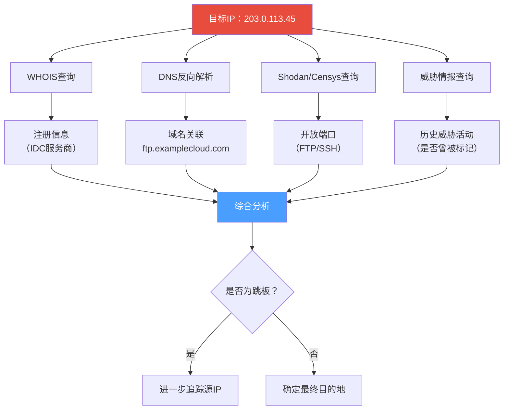

### 时间线重建

```mermaid
gantt
    title 关键事件时间线（2024-01-15）
    dateFormat  HH:mm
    axisFormat  %H:%M
    
    section 工作时
    正常上班到岗               :09:00, 0m
    USB设备首次连接            :09:23, 1m
    访问ProtonMail注册匿名邮箱 :12:30, 5m
    访问Dropbox/Google Drive   :13:15, 10m
    
    section 下班后
    开始访问核心设计文档       :22:00, 30m
    下载TrueCrypt安装包        :22:45, 2m
    安装TrueCrypt并创建加密卷   :22:50, 15m
    将文件复制到加密卷          :23:10, 10m
    下载并安装FileZilla         :23:20, 5m
    开始FTP上传加密文件         :23:30, 10m
    FTP传输完成                :23:40, 2m
    删除相关文件清理痕迹       :23:50, 15m
```

**时间线重建的方法论**：

时间线重建不是简单地按时间排序事件。需要考虑以下因素：

| 因素 | 考量 |
|------|------|
| 时间源可信度 | 不同证据源的时间精度不同（网络流量精确到毫秒，文件系统精确到秒） |
| 时区问题 | 确认所有时间戳的时区（UTC vs 本地时间） |
| 系统时钟偏差 | 检查系统时钟是否与标准时间同步（NTP日志） |
| 交叉验证 | 同一事件在不同证据源中的时间应一致 |

```bash
# 使用plaso生成超级时间线
log2timeline.py --storage-file timeline.plaso E:\evidence\case2024_001_disk.E01

# 导出为CSV格式
psort.py -o l2tcsv -w timeline.csv timeline.plaso

# 时间线分析脚本（Python）
import csv
from datetime import datetime

def analyze_timeline(csv_file, suspicious_start, suspicious_end):
    """分析时间线，标记可疑时间段的事件"""
    with open(csv_file, 'r', encoding='utf-8') as f:
        reader = csv.DictReader(f)
        suspicious_events = []
        
        for row in reader:
            timestamp = datetime.fromisoformat(row['datetime'])
            if suspicious_start <= timestamp <= suspicious_end:
                suspicious_events.append({
                    'time': timestamp,
                    'source': row['source'],
                    'type': row['type'],
                    'description': row['description']
                })
        
        # 按时间排序
        suspicious_events.sort(key=lambda x: x['time'])
        
        return suspicious_events

# 示例调用
events = analyze_timeline(
    'timeline.csv',
    datetime(2024, 1, 15, 22, 0, 0),  # 开始时间
    datetime(2024, 1, 16, 2, 0, 0)     # 结束时间
)
```

---

## 证据整合与结论

### 证据链逻辑

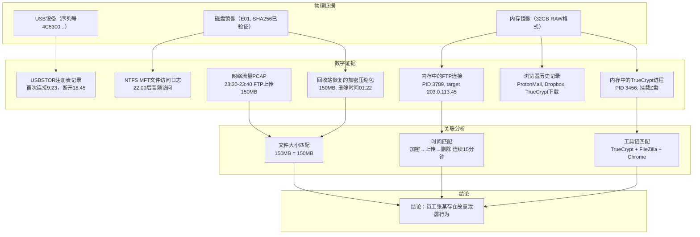

### 最终结论

通过磁盘取证、内存取证和网络取证三维度的证据关联分析，得出以下结论：

| 序号 | 发现 | 证据来源 | 可信度 | 法律价值 |
|------|------|----------|--------|---------|
| 1 | 张某在2024年1月15日使用USB存储设备（序列号4C5300...） | 注册表分析（USBSTOR） | ★★★★★ | 直接证据 |
| 2 | 张某于22:00-23:00下载并安装了TrueCrypt和FileZilla | Chrome历史+DNS缓存+内存进程 | ★★★★★ | 行为证据 |
| 3 | 张某使用TrueCrypt创建加密卷，将产品设计方案复制进去 | 内存进程分析+NTFS文件访问日志 | ★★★★★ | 直接证据 |
| 4 | 张某通过FileZilla将加密文件（~150MB）上传到203.0.113.45 | 内存netscan+PCAP流量还原 | ★★★★★ | 直接证据 |
| 5 | 张某在01:22删除相关文件试图销毁证据 | 回收站$R文件还原+USN日志 | ★★★★★ | 妨害证据 |
| 6 | 张某申请的辞职可能是为了规避调查（未发送的辞职信草稿） | Outlook回收的邮件草稿 | ★★★☆☆ | 间接证据 |

**整体结论**：有充分的电子证据证明张某在2024年1月15日有预谋、有步骤地将公司的核心产品设计方案通过"USB拷贝→加密压缩→FTP上传"的方式泄露给外部人员。该行为虽经过策划（选择晚间断网时间、使用加密工具、事后清理），但反取证手段不完善，所有关键证据均已从不同维度独立采集和验证。

### 取证报告结构

完整的取证报告应包含以下章节：

```text
一、案件概述（1页）
   - 案件编号、报告日期、调查范围
   
二、证据清单（2-3页）
   - 所有证据编号、描述、获取时间、哈希值
   - 证据保管链记录（谁、何时、从何处获得）
   
三、调查方法（1-2页）  
   - 使用的工具和版本
   - 遵循的标准（NIST SP 800-86, ISO 27037）
   
四、时间线（1页）
   - 关键事件时间线图表
   
五、详细发现（核心部分，10-20页）
   - 磁盘分析结果
   - 内存分析结果
   - 网络分析结果
   - 每个发现附有截图和原始输出
   
六、结论与建议（1-2页）
   - 调查结论（事实陈述，不包含主观判断）
   - 安全改进建议
   
七、附录
   - 工具哈希值校验记录
   - 双人见证签名记录
   - 法律授权文书副本
```

**报告撰写的法律注意事项**：

| 原则 | 要求 | 违反后果 |
|------|------|---------|
| 客观性 | 只陈述事实，不做主观推断 | 报告可信度下降 |
| 完整性 | 包含所有证据，包括对嫌疑人有利的证据 | 被指控隐瞒证据 |
| 可验证性 | 每个结论都有对应的证据编号 | 无法被第三方验证 |
| 专业性 | 使用技术术语时需解释其含义 | 非技术法官/陪审团无法理解 |

---

## 常见误区与陷阱

### 误区一：认为取证就是"找文件"

许多人认为取证就是"在硬盘上找到被删除的文件"。实际上，现代取证是一个多维度、交叉验证的过程：

| 错误做法 | 正确做法 | 原因 |
|----------|----------|------|
| 只找文件内容 | +内存+网络+注册表+日志 | 文件可以被加密或隐藏，但进程和网络连接是实时的 |
| 仅依赖一种工具 | 两种以上工具交叉验证 | 不同工具的解析方式不同，单一工具可能漏报 |
| 只看回收站 | 检查$MFT、USN日志、卷影副本 | 删除的文件可能从回收站消失，但文件系统日志中仍有记录 |

### 误区二：忽略内存取证的时序要求

```text
❌ 常见错误：到达现场后先拍照，然后拔电源拆硬盘
✅ 正确顺序：拍照→采集内存→采集硬盘→采集网络证据

原因：拔电源 = 永久丢失所有易失性证据
     包括：运行的加密工具、网络连接、未保存的数据、内存中的密钥
```

**内存获取的时间压力**：

内存数据的稳定性取决于多种因素：

| 因素 | 影响 | 应对策略 |
|------|------|---------|
| 系统休眠策略 | 系统可能在几分钟内自动休眠 | 尽快获取内存，避免触碰鼠标键盘 |
| 加密工具 | VeraCrypt等工具会定期擦除内存中的密钥 | 优先获取加密工具进程的内存 |
| 进程退出 | 嫌疑人可能远程关闭进程 | 使用脚本自动化内存获取流程 |
| Blue Screen | 系统崩溃会丢失内存数据 | 使用硬件内存获取工具（如内存芯片直接读取） |

### 误区三：忽视反取证手段

在本案例中，张某使用了多种反取证手段，但手法并不高明：

| 反取证手段 | 规避方法 | 本案中被发现的证据 |
|------------|----------|-------------------|
| 使用加密工具 | 扫描内存中的加密进程和密钥 | TrueCrypt进程在内存中 |
| 删除浏览历史 | 检查DNS缓存、预渲染文件、$UsnJrnl | Chrome下载历史仍有残留 |
| 下班后操作 | 检查文件访问时间的异常时间段 | NTFS MFT记录了夜间访问 |
| 使用匿名邮箱 | 检查注册的IP来源、访问设备指纹 | 登录ProtonMail的浏览器指纹无痕模式下仍可获取 |

### 误区四：忽略证据链完整性

```text
× 错误：单人操作证据、未记录操作过程、未计算哈希
√ 正确：双人见证、全程录像/记录、每步计算哈希

为什么重要？
→ 如果证据链断裂，辩护律师可以主张"证据可能被篡改"
→ 在中国司法实践中，证据链不完整的电子证据可能被法院不予采信
→ 最佳实践：证据保管链应记录到秒级精度，每个经手人都要签字
```

**证据链完整性的检查清单**：

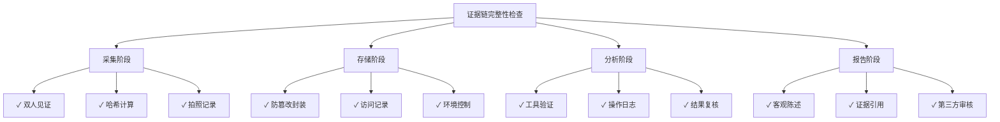

### 误区五：SSD取证未考虑TRIM影响

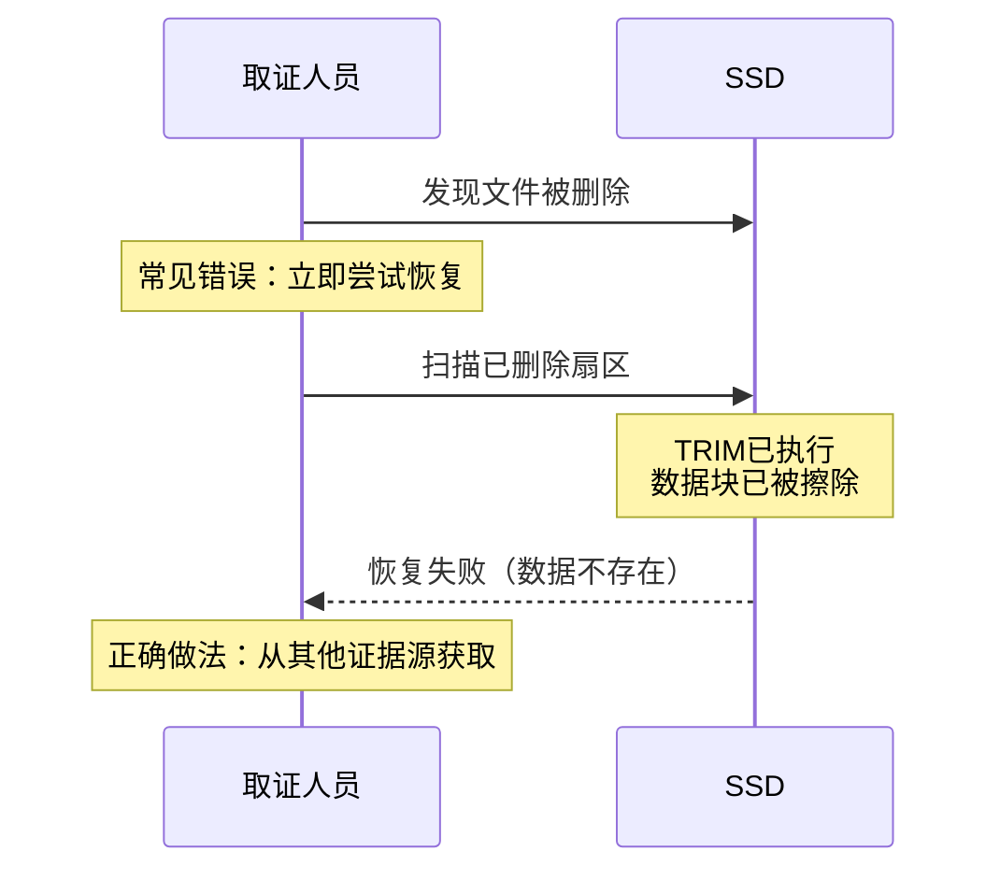

---

## 进阶内容

### 一、高级反取证对抗

对于有经验的内鬼，可能会使用更完善的反取证手段：

| 高级反取证技术 | 检测与对抗方法 |
|---------------|---------------|
| 使用RAM-only加密卷（VeraCrypt RAM disk） | 内存取证是唯一手段，需在开机时快速获取内存 |
| 使用TOR浏览器+加密货币购买VPS | 网络流量分析+区块链分析（更困难） |
| 修改NTFS时间戳（使用SetMACE等工具） | 对比$SI和$FN时间戳差异 |
| 使用磁盘擦除工具（BCWipe等）覆盖空闲空间 | 检查$UsnJrnl记录中的文件大小变化 |
| 在VMware虚拟机中完成所有操作 | 检查物理机上的VMware日志和.vmem文件 |
| 使用Timestomp修改文件元数据 | 对比MFT记录的$SI和$FN时间戳，以及卷影副本中的时间戳 |
| 使用隐写术隐藏数据 | StegExpose等隐写分析工具 |
| 使用云计算中转数据 | 检查浏览器缓存、Cookie、OAuth令牌 |

**高级反取证对抗的技术细节**：

#### 1. 时间戳篡改检测

```bash
# 使用SetMACE工具修改文件时间戳后，如何检测？

# 检测方法1：对比$SI和$FN时间戳
# $SI可以被用户修改，$FN由文件系统内核维护
# 如果两者不一致，说明时间戳被篡改

# 检测方法2：检查$UsnJrnl日志
# USN日志记录了文件的每一次修改，包括时间戳变更
# 如果文件在"Timestomped时间"之后被修改，说明时间戳是伪造的

# 检测方法3：对比卷影副本
# 卷影副本保存了文件的历史版本
# 如果卷影副本中的时间戳与当前不一致，说明被篡改

# 使用EnCase的Timeline分析功能自动检测时间戳异常
# EnCase会标记以下异常：
# - $SI时间 < $FN时间（创建时间在文件系统记录之前）
# - $SI时间 > 当前时间（未来时间戳）
# - $SI时间和$FN时间差异 > 1秒
```

#### 2. 虚拟机取证

```bash
# 如果嫌疑人在VMware虚拟机中完成所有操作

# 检查物理机上的VMware日志
# 路径：C:\ProgramData\VMware\vmware.log
# 包含虚拟机启动、关闭、快照操作的记录

# 检查.vmem文件（虚拟机内存文件）
# 路径：C:\Users\zhang\Documents\Virtual Machines\*.vmem
# 包含虚拟机运行时的完整内存状态

# 检查.vmdk文件（虚拟磁盘文件）
# 包含虚拟机的所有磁盘数据

# 检查快照文件（.vmsn）
# 可能包含操作过程中的状态快照

# 使用Volatility分析.vmem文件
python3 vol.py -f suspect_vm.vmem windows.info
python3 vol.py -f suspect_vm.vmem windows.pslist
```

#### 3. 云存储取证

```bash
# 如果嫌疑人使用云存储（OneDrive, Google Drive, Dropbox）

# 检查同步客户端的本地缓存
# OneDrive: %UserProfile%\OneDrive\
# Google Drive: %UserProfile%\Google Drive\
# Dropbox: %UserProfile%\Dropbox\

# 检查浏览器Cookie和OAuth令牌
# 可以重建云存储的访问会话

# 检查同步日志
# OneDrive: %UserProfile%\AppData\Local\Microsoft\OneDrive\logs\
# 包含文件上传/下载的记录

# 法律协助：向云服务提供商发送数据请求
# 需要法律授权（如搜查令或法院命令）
# 国际云服务可能需要通过MLAT流程
```

### 二、自动化取证脚本

对于大规模部署或定期审查，可以编写自动化的取证脚本：

```python
#!/usr/bin/env python3
"""
简易自动化取证脚本 - 用于初步证据采集
适用于Windows环境，需管理员权限
"""

import subprocess
import hashlib
import datetime
import json
import os

class QuickForensicCollector:
    def __init__(self, output_dir):
        self.output_dir = output_dir
        os.makedirs(output_dir, exist_ok=True)
        self.timestamp = datetime.datetime.now().strftime("%Y%m%d_%H%M%S")
        
    def collect_system_info(self):
        """采集基本系统信息"""
        commands = {
            "systeminfo": "systeminfo",
            "network_connections": "netstat -ano",
            "running_processes": "tasklist /v",
            "arp_table": "arp -a",
            "dns_cache": "ipconfig /displaydns",
            "scheduled_tasks": "schtasks /query /fo LIST /v",
        }
        
        for name, cmd in commands.items():
            output = subprocess.run(cmd, shell=True, capture_output=True, text=True)
            if output.returncode == 0:
                filepath = os.path.join(self.output_dir, f"{name}_{self.timestamp}.txt")
                with open(filepath, "w", encoding="utf-8") as f:
                    f.write(output.stdout)
                print(f"[✓] Collected: {name}")
                    
    def collect_recent_files(self, days=30):
        """采集最近修改的文件列表"""
        cmd = f'powershell "Get-ChildItem -Path C:\\Users -Recurse -ErrorAction SilentlyContinue | Where-Object {{$_.LastWriteTime -gt (Get-Date).AddDays(-{days})}} | Select-Object FullName, LastWriteTime, Length | Export-Csv -Path {os.path.join(self.output_dir, f"recent_files_{self.timestamp}.csv")} -NoTypeInformation"'
        subprocess.run(cmd, shell=True)
        print(f"[✓] Collected: Recent files (last {days} days)")
        
    def collect_event_logs(self, log_names=["Security", "System", "Application"]):
        """采集关键事件日志"""
        for log in log_names:
            cmd = f'powershell "wevtutil epl {log} {os.path.join(self.output_dir, f"{log}_{self.timestamp}.evtx")}"'
            subprocess.run(cmd, shell=True)
            print(f"[✓] Collected: {log} event log")
    
    def collect_usb_history(self):
        """采集USB设备连接历史"""
        cmd = 'powershell "Get-ItemProperty -Path \'HKLM:\\SYSTEM\\CurrentControlSet\\Enum\\USBSTOR\\*\\*\' | Select-Object FriendlyName, SerialNumber, Mfg | Export-Csv -Path ' + os.path.join(self.output_dir, f"usb_history_{self.timestamp}.csv") + ' -NoTypeInformation"'
        subprocess.run(cmd, shell=True)
        print(f"[✓] Collected: USB device history")
    
    def collect_browser_history(self):
        """采集浏览器历史摘要"""
        # Chrome历史数据库路径
        chrome_history = os.path.expanduser(r"~\AppData\Local\Google\Chrome\User Data\Default\History")
        if os.path.exists(chrome_history):
            # 复制数据库文件（Chrome运行时文件被锁定）
            import shutil
            dest = os.path.join(self.output_dir, f"chrome_history_{self.timestamp}.db")
            shutil.copy2(chrome_history, dest)
            print(f"[✓] Collected: Chrome history database")
    
    def generate_report(self):
        """生成采集报告"""
        # 计算所有采集文件的哈希值
        file_hashes = {}
        for root, dirs, files in os.walk(self.output_dir):
            for file in files:
                filepath = os.path.join(root, file)
                with open(filepath, 'rb') as f:
                    file_hash = hashlib.sha256(f.read()).hexdigest()
                file_hashes[filepath] = file_hash
        
        report = {
            "collection_time": self.timestamp,
            "collector": "QuickForensicCollector v1.0",
            "output_directory": self.output_dir,
            "files_collected": list(file_hashes.keys()),
            "file_hashes": file_hashes
        }
        
        report_path = os.path.join(self.output_dir, f"collection_report_{self.timestamp}.json")
        with open(report_path, "w", encoding="utf-8") as f:
            json.dump(report, f, indent=2, ensure_ascii=False)
        print(f"[✓] Report generated: {report_path}")

# 使用示例
if __name__ == "__main__":
    collector = QuickForensicCollector("E:\\quick_forensic_2024")
    collector.collect_system_info()
    collector.collect_recent_files(days=7)
    collector.collect_event_logs()
    collector.collect_usb_history()
    collector.collect_browser_history()
    collector.generate_report()
```

> **注意**：以上脚本仅用于初步"采证"，不能替代专业的磁盘镜像取证。所有操作应记录在案，并在正式取证前停止使用目标系统（写保护原则）。

**脚本的安全注意事项**：
- 脚本本身不应存储在目标电脑上，应从取证U盘运行
- 所有输出文件应存储在取证U盘或外部硬盘上
- 脚本执行前应计算自身哈希值，记录在案
- 脚本执行后应立即停止，不得继续操作目标系统

### 三、法律视角：电子证据的司法认定

在中国司法实践中，电子证据的认定需满足"三性"要求：

| 三性 | 要求 | 在取证中的体现 |
|------|------|---------------|
| **真实性** | 证据未被篡改 | 哈希验证、写保护、证据保管链 |
| **合法性** | 取证程序合法 | 授权书、双人见证、操作规范 |
| **关联性** | 证据与案件有关 | 多维交叉验证、时间线关联 |

**相关法律依据**：
- 《中华人民共和国电子签名法》
- 《最高人民法院关于互联网法院审理案件若干问题的规定》
- 《公安机关办理刑事案件电子数据取证规则》
- 《网络安全法》第21条：网络运营者应采取技术措施防止数据泄露
- 《个人信息保护法》第13条：为维护合法权益可在合理范围内处理个人信息

**电子证据的特殊挑战**：

| 挑战 | 描述 | 应对策略 |
|------|------|---------|
| 易篡改性 | 电子数据可以被无痕修改 | 哈希验证+写保护+完整证据链 |
| 技术门槛 | 法官/律师可能不理解技术细节 | 报告中用通俗语言解释技术原理 |
| 法律滞后 | 法律更新速度跟不上技术发展 | 引用最新司法解释和判例 |
| 跨境取证 | 证据可能存储在海外服务器 | 通过国际司法协助（MLAT）程序 |

**法庭证人准备**：

如果取证分析师需要出庭作证，需要准备以下内容：

| 准备事项 | 具体内容 |
|---------|---------|
| 专业资质证明 | EnCE、GCFE等认证证书 |
| 工具验证记录 | 所有使用的工具的版本号和哈希值 |
| 操作流程文档 | 每一步操作的详细记录 |
| 结论支撑材料 | 每个结论对应的原始证据和截图 |
| 技术解释准备 | 用非技术语言解释复杂概念的能力 |
| 质证应对 | 准备应对辩护律师可能提出的质疑 |

---

## 预防与改进建议

### 技术层面

| 措施 | 优先级 | 成本 | 效果 |
|------|--------|------|------|
| DLP（数据防泄露）系统：监控文件外传行为 | 高 | 中 | 可以在泄露发生时实时阻断 |
| USB端口管控：通过组策略禁用非授权USB存储设备 | 高 | 低 | 阻止通过物理介质窃取 |
| 数据水印：核心文档嵌入不可见数字水印 | 中 | 低 | 泄露后溯源 |
| 行为分析系统：UEBA（用户实体行为分析） | 中 | 高 | 发现异常行为模式 |
| 文件加密：所有核心文档强制加密，限制解密范围 | 高 | 中 | 即使文件被盗也无法打开 |
| 终端检测与响应（EDR） | 高 | 中 | 实时监控终端异常行为 |
| 网络流量分析（NTA） | 中 | 中 | 检测异常数据外传 |

**DLP系统部署建议**：

| DLP功能 | 作用 | 部署难度 |
|---------|------|---------|
| 内容检测 | 识别敏感文件（基于关键词、正则、指纹） | ★★★☆☆ |
| 传输监控 | 监控HTTP/HTTPS/FTP/Email传输 | ★★★★☆ |
| USB管控 | 阻止非授权USB设备连接 | ★★☆☆☆ |
| 打印监控 | 记录敏感文件的打印操作 | ★★☆☆☆ |
| 剪贴板监控 | 阻止敏感内容通过剪贴板复制 | ★★★★☆ |

### 管理层面

1. **权限最小化原则**：核心设计文档采用"按需授权"而非"默认可访问"
2. **离岗前审查**：员工离职前30天进行安全审查，监控异常行为
3. **安全意识培训**：定期进行数据安全培训，明确泄露后果
4. **举报机制**：建立匿名举报渠道，鼓励内部监督
5. **应急响应预案**：制定并演练数据泄露应急响应流程

**离职风险管控流程**：

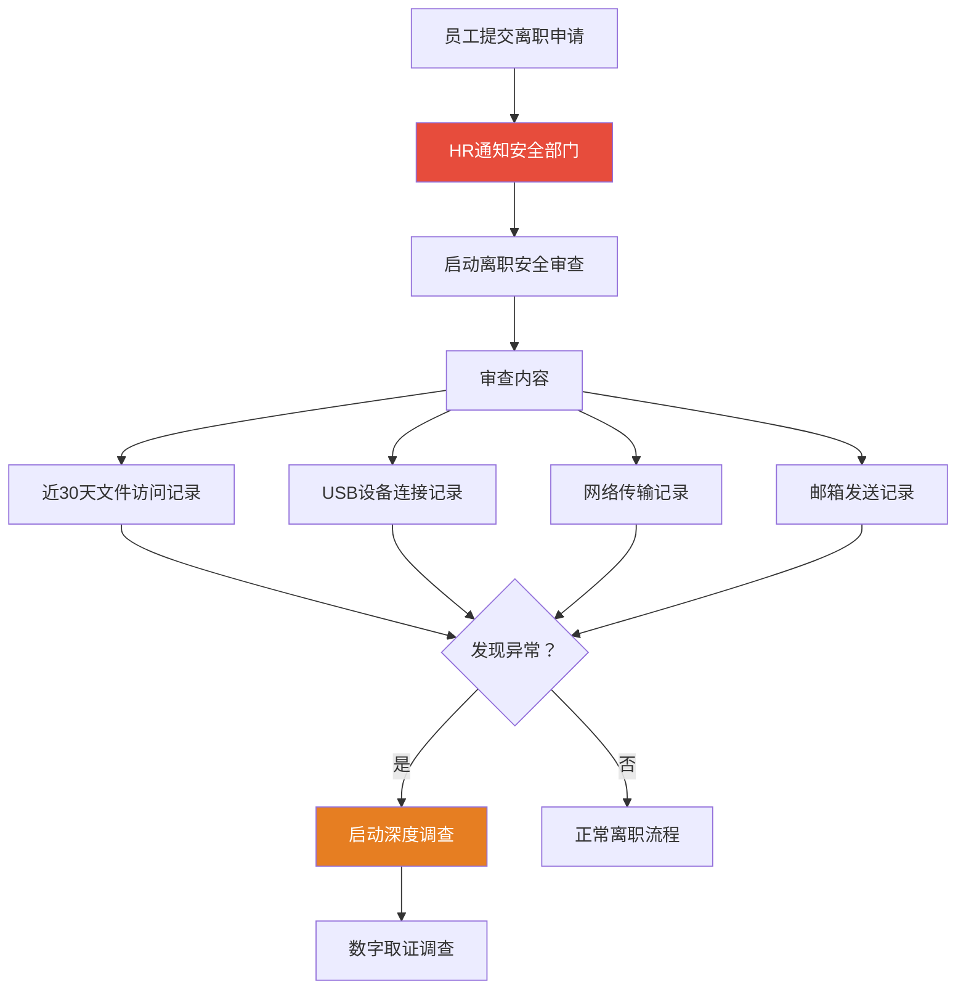

### 取证能力建设

1. **建立内部取证团队**：至少培养2-3名具备基本取证能力的员工
2. **采购取证工具箱**：配备写保护器、取证工作站等基础硬件
3. **日志集中管理**：确保所有关键系统的日志至少保留90天
4. **定期演练**：每季度进行一次内部取证演练，检验响应流程

**取证能力成熟度模型**：

| 等级 | 描述 | 能力要求 |
|------|------|---------|
| Level 1 | 基础响应 | 识别事件、保全证据、联系外部专家 |
| Level 2 | 内部初步 | 内存/磁盘镜像、基础分析、报告撰写 |
| Level 3 | 专业分析 | 多维证据关联、反取证对抗、法庭证人 |
| Level 4 | 主动防御 | 威胁狩猎、取证即服务（DFaaS）、自动化 |
| Level 5 | 专家级 | 0day漏洞取证、APT溯源、芯片级取证 |

---

## 总结

本案例展示了一次典型的企业内部数据泄露事件的完整取证流程。关键要点归纳：

1. **Order of Volatility（易失性顺序）** 是现场取证的第一原则——内存→磁盘→网络
2. **多维交叉验证** 是证据可靠性的保证——磁盘+内存+网络三轴联动
3. **反取证对抗** 是现代取证的常态——需要持续更新技术手段
4. **证据链完整性** 决定了证据在法庭上的可接受性
5. **预防重于取证**——好的安全体系能将泄露风险降低80%以上
6. **SSD取证** 需要特殊的硬件设备和技术理解——TRIM和磨损均衡是关键挑战
7. **法律合规** 是取证工作的前提——程序正义与实体正义同等重要

从更宏观的角度看，数字取证不仅仅是技术工作，更是**法律、管理、技术的结合体**。一个成功的取证调查，既需要扎实的技术功底，也需要严谨的法律意识和规范的操作流程。通过本案例，读者应能够建立完整的取证调查思维框架，为实际操作奠定基础。

> **延伸阅读**：
> - NIST SP 800-86《Integrating Forensic Techniques into Incident Response》
> - ISO/IEC 27037《Guidelines for identification, collection, acquisition and preservation of digital evidence》
> - 《公安机关办理刑事案件电子数据取证规则》（2019年版）
> - SANS FOR508《Advanced Incident Response, Threat Hunting, and Digital Forensics》
> - 《电子数据取证：原理与实践》（清华大学出版社）
