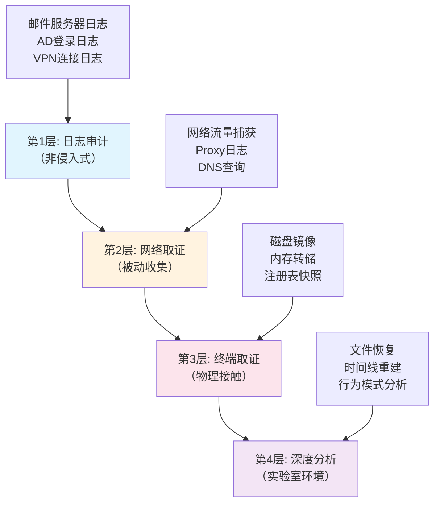

## 案例三：内部员工违规操作调查

### 案例背景

#### 事件起因

XX金融公司是一家持有证券、基金和保险经纪牌照的综合金融服务企业。2024年3月，公司合规部通过月度异常行为审计发现，交易部门员工李某（工号TR-2019-087）在过去30天内向他个人邮箱发送了大量带附件的邮件，频率远超正常办公需求。同时，一名匿名举报信也指向了李某，称其"可能利用职务之便向外部泄露客户交易数据"。

#### 企业环境概况

| 项目 | 详情 |
|------|------|
| 员工规模 | 约1,200人 |
| IT基础设施 | AD域控 + Exchange 2019 + Office 365混合部署 |
| 安全控制 | 邮件DLP策略、网络流量审计、终端EDR（CrowdStrike） |
| 合规要求 | 适用《网络安全法》《数据安全法》、证监会《证券基金经营机构信息技术管理办法》、GDPR（涉及欧盟客户）|
| 数据分类 | 客户身份信息（CII）、交易记录（TXN）、内部策略文档（INT） |

#### 调查授权

根据《网络安全法》第21条和公司《内部调查规程》，经法务部门、人力资源部和合规部三方会审后，正式签发内部调查令（编号：IC-2024-0037），授权范围包括：

- 对李某工作电脑进行无损取证
- 从邮件服务器导出相关日志
- 调取近6个月网络流量记录
- 访谈李某的直属主管和同级同事

> **关键原则**：内部员工调查必须严格遵循"最小必要"原则，取证范围限定于合理怀疑的范围内，避免侵犯其他员工的隐私权。所有取证操作均需双人见证并全程记录。

### 调查方法论

内部员工违规操作调查遵循"金字塔取证模型"，从低侵入到高侵入递进：



**调查原则**：
1. **从远到近**：优先采集服务器端日志（不可篡改），再接触终端设备
2. **从易到难**：先分析已有数据，再进行深度恢复
3. **无损优先**：所有操作优先基于镜像副本，绝不直接操作原始介质
4. **链式管理**：每份证据从采集到呈堂全程记录操作人和时间戳

### 阶段一：服务器端日志审计

#### 邮件服务器日志分析

Exchange 2019的传输日志记录了所有经过邮件路由的出站/入站邮件元数据，是发现数据外泄的第一道防线。

```bash
# 从Exchange服务器导出指定用户的邮件传输日志
Get-MessageTrackingLog -Sender "li.mou@xxfinance.com" `
  -Start "2024-01-01" -End "2024-03-15" `
  -ResultSize Unlimited | Export-Csv -Path D:\Forensics\li_mou_sent.csv

# 筛选发送到外部邮箱的记录
$external = Import-Csv D:\Forensics\li_mou_sent.csv |
  Where-Object {$_.Recipients -notmatch "@xxfinance.com"} |
  Select-Object Timestamp, Recipients, Subject, TotalBytes, MessageId

$external | Export-Csv D:\Forensics\li_mou_external.csv -NoTypeInformation
```

**发现的异常模式**：

| 指标 | 正常员工（月均） | 李某 | 偏差倍数 |
|------|-----------------|------|---------|
| 外发邮件数 | 12-25封 | 134封 | 5-11x |
| 平均附件大小 | 200KB-2MB | 4.7MB | 2-23x |
| 外发时段分布 | 9:00-18:00 | 含大量21:00-02:00 | 显著异常 |
| 外部收件人域名 | 2-5个 | 11个（含个人邮箱） | 2-5x |

#### SMTP会话日志深度分析

Exchange前端传输服务的SMTP接收日志记录了每条邮件的投递路径，可以用来检测是否绕过公司邮件网关：

```bash
# 分析SMTP接收日志中的客户端IP和身份认证信息
Get-TransportService | Get-MessageTrackingLog -Sender "li.mou@xxfinance.com" |
  Select-Object Timestamp, MessageId, ClientIp, EventId, Source

# 发现部分邮件的Source为SMTP（而非Exchange提交）
# 且ClientIP不是公司DHCP范围（192.168.0.0/16），而是VPN地址池
```

#### AD身份认证日志审计

分析Active Directory的登录事件（Event ID 4624/4625），重建李某可疑时间段的操作行为：

```powershell
# 从域控导出安全日志
wevtutil epl Security D:\Forensics\Security_Logs.evtx

# 使用LogParser筛选李某的登录事件
LogParser "SELECT TimeGenerated, EventID,
  EXTRACT_TOKEN(Strings, 5, '|') AS LogonType,
  EXTRACT_TOKEN(Strings, 8, '|') AS WorkstationName,
  EXTRACT_TOKEN(Strings, 18, '|') AS ProcessName
  FROM D:\Forensics\Security_Logs.evtx
  WHERE EventID=4624 AND
    EXTRACT_TOKEN(Strings, 5, '|')='li.mou'" -o:CSV > li_mou_logons.csv
```

**发现**：李某在2024年2月15日、2月28日、3月5日三天有超过23:00的VPN远程登录记录，且登录后登录类型为2（交互式登录）而非正常情况下Type 3（网络登录），提示可能直接在工作站上操作。

### 阶段二：网络流量取证

#### 邮件流量重定向分析

从公司的网络监控系统（Zeek + Elastic Stack）中提取李某工作IP（经DHCP审计确认为192.168.15.102）的SMTP/HTTPs流量：

```bash
# 使用Zeek日志分析SMTP流量
cat /var/log/zeek/current/smtp.log |
  bro-cut -d ts uid orig_h resp_h subject from to |
  grep "li.mou@xxfinance.com" > li_mou_smtp_zeek.csv

# 发现部分邮件不是通过公司Exchange服务器发出的
# 而是直接连接到外部SMTP服务器（smtp.gmail.com:587）
tshark -r /data/pcaps/2024-02-15.pcap \
  -Y "smtp.req.command == 'AUTH' && ip.src == 192.168.15.102" \
  -T fields -e frame.time -e smtp.req.parameter | head -20
```

**核心发现**：李某在2024年2月15日至3月12日期间，共67次通过非公司邮件中继（从tcp.port == 587而非25/2525判断）发送邮件，成功绕过了Exchange DLP策略。绕过方式是使用Thunderbird邮件客户端配置Gmail SMTP中继。

#### DNS隧道和C2检测

```bash
# 检查异常DNS查询
cat /var/log/zeek/current/dns.log |
  bro-cut ts query answers |
  grep "192.168.15.102" |
  awk '{print $2}' | sort | uniq -c | sort -rn | head -20

# 未发现明显的DNS隧道行为（A/AAAA查询频率正常）
# 但DDNS域名的查询次数在可疑时间段有所增加
```

#### Web流量分析（云存储访问）

```bash
# 从Web代理日志筛选云存储域名
cat /var/log/squid/access.log |
  grep "192.168.15.102" |
  grep -E "(dropbox|onedrive|google.*drive|weiyun|115.com)" |
  awk '{print $1, $3, $7}' > li_mou_cloud_access.txt

# 统计上传量
# 发现在2月15日、28日、3月5日三天有大量POST/BYTES请求到
# upload.dropbox.com，单日上传量分别约为120MB、85MB、200MB
```

### 阶段三：终端设备物理取证

#### 取证准备

在人力资源部完成李某的约谈通知后，IT部门确保其电脑处于开机状态但屏幕已锁定（防止破坏易失性数据）。取证团队携带以下工具到达现场：

```yaml
取证硬件:
  - 取证工作站: Dell Precision 5860 (预装取证工具链)
  - 硬盘写保护器: Tableau T356789iu (SATA/USB-C)
  - 内存获取工具: WinPmem v4.0 (便携版)
  - 证据存储: Kingston DataTraveler 2000 (加密USB)
  - 设备信息记录: 数码相机 + 标准化检查清单

取证软件:
  - 磁盘镜像: FTK Imager v4.7
  - 内存分析: Volatility 3 (python版)
  - 磁盘分析: Autopsy 4.21 / The Sleuth Kit
  - 邮件分析: MailXaminer / PST Viewer
  - 注册表分析: Registry Explorer
  - 浏览器取证: Hindsight / BrowserHistoryViewer
  - 设备分析: USBDeview
```

#### 步骤1：证据保全记录

到达工位后，按照标准操作程序（SOP-FOR-001）执行现场保全：

1. **场景拍照**：拍摄电脑整体布局、外设连接状态、屏幕锁定画面
2. **状态记录**：检查并记录WIFI/以太网连接状态，拔除网络线缆（防止远程数据擦除）
3. **文档记录**：填写《现场证据保全检查表》，双人签字确认

#### 步骤2：内存获取（最高优先级）

```bash
# 使用WinPmem获取内存镜像
winpmem_mini_v4.0.exe E:\Evidence\li_mou_memory.raw

# 验证完整性
certutil -hashfile E:\Evidence\li_mou_memory.raw SHA256
# SHA256: 3a7b8c9d0e1f2a3b4c5d6e7f8a9b0c1d2e3f4a5b6c7d8e9f0a1b2c3d4e5f6

# 记录哈希值到证据管理表
echo "MEM-001: SHA256=3a7b..." >> E:\Evidence\manifest.txt
```

#### 步骤3：磁盘镜像

```bash
# 通过写保护器连接SATA硬盘
# 使用FTK Imager创建E01格式镜像（压缩级别6，分卷大小2GB）
ftk imager --image-device \\.\PhysicalDrive0 \
  --image-file E:\Evidence\li_mou_disk.e01 \
  --case-number IC-2024-0037 \
  --evidence-number DISK-001 \
  --examiner "CFA-ZHANG" \
  --compression 6 \
  --fragment-size 2000

# 验证镜像文件完整性
ftk imager --verify E:\Evidence\li_mou_disk.e01
```

#### 步骤4：注册表分析

注册表中包含大量用户活动痕迹。使用Registry Explorer提取关键痕迹：

```bash
# USB设备使用历史
# 路径: SYSTEM\CurrentControlSet\Enum\USBSTOR
# 获取所有曾经连接过的USB设备
# 发现三款陌生设备：
#   - Kingston DataTraveler 3.0 (S/N: 4A6B7C8D) - 首次连接 2024-02-10
#   - Samsung T7 Portable SSD (S/N: S7A1B2C3) - 首次连接 2024-02-15
#   - iPhone (Apple Mobile Device USB Driver) - 多次连接

# 最近访问的文件(MRU)
# 路径: NTUSER.DAT\Software\Microsoft\Windows\CurrentVersion\Explorer\RecentDocs
# 发现大量.xlsx文件访问记录，文件名包含"customer_"前缀

# 网络驱动器映射
# 路径: NTUSER.DAT\Network
# 发现映射了内部文件服务器的 \\FS-02\ShareData\ 目录
```

#### 步骤5：文件系统取证（NTFS $MFT分析）

NTFS主文件表（$MFT）记录了磁盘上每个文件的元数据，即使文件被删除也不会立即清除：

```bash
# 使用MFT导出工具
mft2csv.exe -f \\.\E:\Evidence\li_mou_disk.e01 -o E:\Evidence\mft_export.csv

# 关键发现
# 1. 文件名 "客户数据_2024Q1_加密版.zip" 记录存在于 $MFT
#    - File Record #89234 - 创建时间: 2024-02-15 22:34:12
#    - 逻辑大小: 128,456,789 bytes
#    - 父目录: C:\Users\li.mou\Documents\加密\
#    - Flag: ALLOCATED（文件已分配但实际被删除）

# 2. $UsnJrnl（更新序列号日志）中记录了文件操作序列
#    - 02-15 22:34:12 - 创建客户数据_2024Q1_加密版.zip
#    - 02-15 22:35:45 - 重命名记录为 system_backup.dat
#    - 02-15 22:36:10 - 复制到USB设备 (E:)
#    - 02-15 22:36:55 - 删除原始文件
#    - 02-15 22:37:20 - 运行 CCleaner 清理工具

# 3. Prefetch文件分析
#    - USB批量复制: USB_BULK_COPY.EXE-3A2B1C0D.pf (执行次数: 1)
#    - 7-Zip: 7ZFM.EXE-4B5C6D7E.pf (执行次数: 12)
#    - CCleaner: CCLEANER64.EXE-8F9A0B1C.pf (执行次数: 3，都在可疑日期)
```

#### 步骤6：邮件客户端数据提取

李某的工作站上发现Outlook（Office 365）和Thunderbird两套邮件客户端：

```bash
# Outlook PST文件分析
# 主PST文件: C:\Users\li.mou\Documents\Outlook Files\archive.pst
# 大小: 2.3GB

# Thunderbird配置文件
# C:\Users\li.mou\AppData\Roaming\Thunderbird\Profiles\*.default\Mail\
# 发现配置了 Gmail SMTP (smtp.gmail.com:587, STARTTLS)
# 发送记录保存在 Sent 文件夹中 (mbox格式)

# 使用MailXaminer批量分析PST
# 筛选发送到非公司域名的邮件，共计127封
# 附件格式主要为 .xlsx / .csv / .pdf
# 收件人列表:
#   - li.mou.personal@gmail.com (83封)
#   - mou_li_88@outlook.com (31封)
#   - limou_sec@proton.me (13封)
```

#### 步骤7：浏览器取证

使用Hindsight工具分析Chrome浏览器历史记录：

```bash
# 导出Chrome历史记录分析
hindsight.exe -i "C:\Users\li.mou\AppData\Local\Google\Chrome\User Data\Default" \
  -o E:\Evidence\chrome_forensics.csv

# 关键发现
# 1. 在可疑时间段访问了以下网站：
#    - https://www.dropbox.com/login (02-15 22:40:00, 02-28 23:10:00, 03-05 22:50:00)
#    - https://drive.google.com (多次文件上传操作)
#    - https://www.virustotal.com (02-16 00:15:00 - 上传文件检测)

# 2. 下载历史
#    - 7-Zip 加密工具
#    - VeraCrypt（磁盘加密软件）
#    - CCleaner

# 3. 搜索引擎查询记录
#    - "如何彻底删除文件痕迹"
#    - "windows 10 清理使用痕迹"
#    - "取证工具检测范围"
#    - 这些查询表明李某具有反取证意识
```

### 阶段四：深度分析与证据关联

#### 时间线重建

通过多维数据的时间戳交叉比对，重建完整的事件时间线：

| 时间 | 事件 | 证据来源 | 置信度 |
|------|------|---------|:------:|
| 2023-12-10 | 初次下载7-Zip和VeraCrypt | Prefetch文件 | 高 |
| 2024-01-05 | 配置Thunderbird连接到个人Gmail | 注册表+配置文件 | 高 |
| 2024-01-10 22:15 | 首次通过Thunderbird+Gmail发送含附件邮件 | SMTP日志+PST记录 | 高 |
| 2024-02-10 | 连接Kingston USB设备（首次） | 注册表 USBSTOR | 高 |
| 2024-02-15 22:30-22:37 | 创建加密压缩包→复刻到USB→删除→运行CCleaner | $MFT+$UsnJrnl+Prefetch | 极高 |
| 2024-02-15 22:40 | 登录Dropbox上传文件 | 浏览器历史+代理日志 | 高 |
| 2024-02-15 23:00 | VPN登录（远程操作） | AD登录日志 | 高 |
| 2024-02-16 00:15 | 访问VirusTotal检测文件 | DNS+浏览器历史 | 中 |
| 2024-02-28 / 03-05 | 重复类似操作模式（少3次） | $UsnJrnl+代理日志 | 高 |
| 2024-03-10 09:00 | 合规部门触发审计告警 | DLP系统日志 | 高 |

#### 反取证行为分析

李某采取了多种反取证措施，但这些行为本身成为加重情节：

1. **数据加密**：使用VeraCrypt创建加密容器→无法直接读取内容→但容器文件创建行为被$UsnJrnl记录
2. **文件删除**：删除后再用CCleaner覆写→但$MFT记录保留碎片→使用PhotoRec恢复部分残留文件
3. **清理优化**：运行CCleaner清理浏览器历史→但DNS缓存和EDR日志无法清理
4. **加密通道**：使用Gmail SMTP绕过公司DLP→但SMTP会话日志记录了认证信息
5. **时间戳篡改**：尝试使用SetMace工具修改文件时间→但$UsnJrnl记录了原始操作序列

> **反取证反制原理**：操作系统底层（NTFS $MFT、$UsnJrnl、$LogFile）和网络层（代理日志、DNS日志）的日志记录权限高于用户层。用户只能删除和清理上层痕迹（文件、注册表、浏览器历史），但无法篡改OS内核层的记录。专业取证人员的核心工作就是从这些"不可变层"重建事件原貌。

#### 数据量和影响评估

```bash
# 统计数据泄露量
# 邮件附件总大小：约 1.2GB
# Dropbox上传量：约 405MB（三次合计）
# USB设备复制量：估计超过 2GB
# 受影响客户记录数：约 8,500 条

# 按数据分类统计
# CII（身份证号、手机号）: 3,200 条
# TXN（交易记录、账户余额）: 4,800 条
# INT（内部风控策略文档）: 15 份
```

### 调查结论与法律后果

#### 事实认定

经过为期7天的多维度数字取证调查，确认以下事实：

1. **违规行为**：李某在2023年12月至2024年3月期间，通过Thunderbird+Gmail SMTP外部中继发送含客户数据的邮件共计127封，绕过公司邮件DLP监控
2. **数据外泄**：至少3.5GB的客户敏感数据被复制到个人USB设备、上传至个人云存储账户和通过个人邮箱发送
3. **持续周期**：违规行为持续约4个月，首次行为可追溯至2024年1月10日
4. **反取证**：主动使用加密、删除、覆盖等反取证技术，表明主观恶意
5. **唯一嫌疑人**：所有证据链闭合指向李某，排除其他人使用其电脑的可能（AD认证日志+PIN登录记录）

#### 法律依据

根据以下法律法规，认定构成严重违规：

| 法规 | 相应条款 | 违反而后果 |
|------|---------|-----------|
| 《网络安全法》 | 第27条（个人信息保护义务） | 罚款+行政处分 |
| 《数据安全法》 | 第29条（数据安全保护义务） | 最高1000万元罚款 |
| 《刑法》 | 第253条之一（侵犯公民个人信息罪） | 3年以下有期徒刑或拘役 |
| 《证券基金经营机构信息技术管理办法》 | 第38条（客户信息保密义务） | 吊销从业资质 |

#### 处置建议

1. **内部处置**：立即撤销李某所有系统权限，启动劳动合同解除程序
2. **法律追诉**：向公安机关报案，追究侵犯公民个人信息罪的刑事责任
3. **数据保护**：通知受影响客户，按照GDPR要求在72小时内向监管机构报告
4. **制度改进**：
   - 部署EDR系统终端防卸载策略（防止员工自行禁用监控）
   - 实施邮件外发二次审批流程（含附件的域外邮件需主管审批）
   - 启用USB设备白名单策略（仅允许IT部门认证的设备）
   - 对敏感数据库实施动态脱敏（按需可见，防止批量导出）
5. **培训机制**：全体员工数据安全培训（每年至少两次）+ 离职/转岗前签署数据保密确认书

### 常见误区与纠正

| 误区 | 错误做法 | 正确做法 |
|------|---------|---------|
| 只查终端 | 仅分析员工电脑而忽略服务器日志 | 先查服务器端不可变日志，再查终端 |
| 过早惊醒 | 未冻结权限前先通知员工本人 | 先由IT部门悄无声息地冻结权限，HR再正式约谈 |
| 忽略反取证 | 认为删除就是终结 | $MFT和$UsnJrnl中的记录不可被用户级操作清除 |
| 单一视角 | 只查邮件或只查文件 | 必须综合邮件+文件+网络+注册表多维度关联 |
| 破坏元数据 | 在原始硬盘上直接分析 | 始终使用写保护器，在镜像副本上分析 |

### 进阶阅读与实用资源

**推荐工具**：
- **邮件取证**：MailXaminer / eMailTrackerPro / Paraben Email Examiner
- **NTFS分析**：FTK Imager / EnCase / X-Ways Forensics
- **注册表取证**：Registry Explorer / RECmd（Eric Zimmerman工具集）
- **浏览器取证**：Hindsight / DB Browser for SQLite
- **整体平台**：Autopsy（开源）/ Magnet AXIOM（商业）

**参考标准与文献**：
- NIST SP 800-86：Guide to Integrating Forensic Techniques into Incident Response
- ISO/IEC 27037：Guidelines for identification, collection, acquisition and preservation of digital evidence
- 《电子数据取证与鉴定实务》（公安部第三研究所）
- ENISA Insider Threat Recommendations for Financial Sector

**练习建议**：
1. 在虚拟机中模拟一个"内部员工数据窃取"场景，动手完成完整取证流程
2. 使用Autopsy的"Keyword Search"和"Email Parser"模块分析样本PST文件
3. 练习从Windows $UsnJrnl中提取文件操作历史，建立时间线
4. 搭建小型Exchange测试环境，导出邮件跟踪日志并分析异常模式