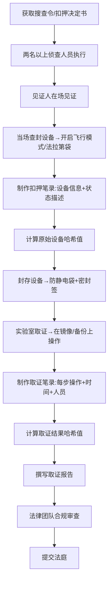
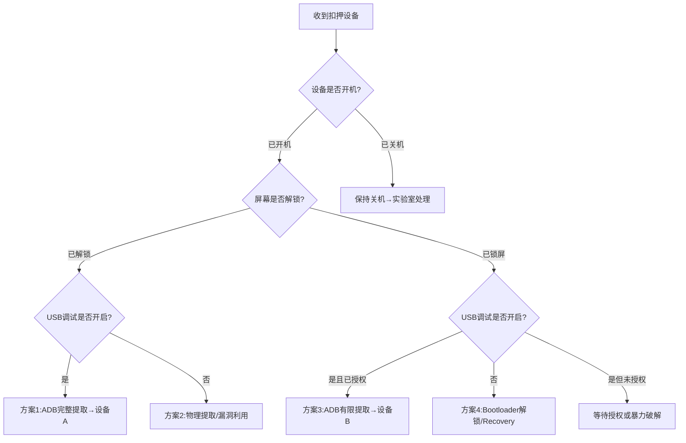
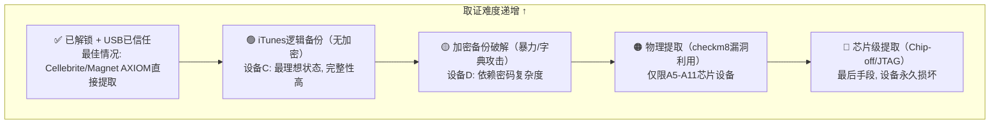
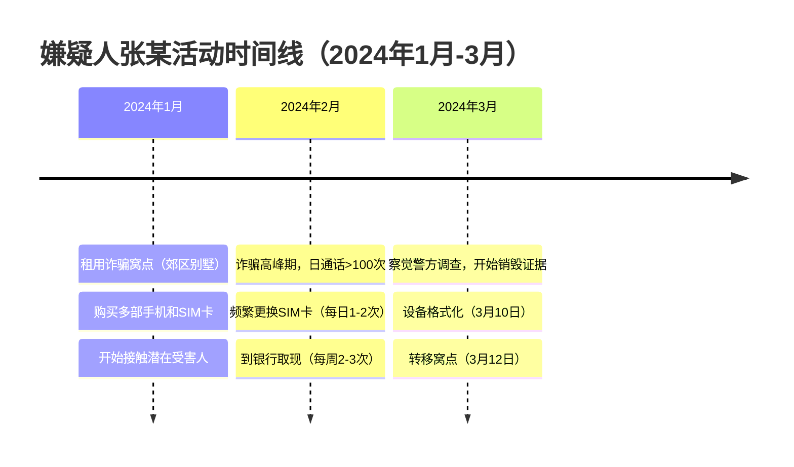

## 案例六：移动设备取证

### 案例背景

2024年3月，某市公安局网安支队破获一起特大电信诈骗案。嫌疑人张某（化名）利用多部手机实施"杀猪盘"式诈骗，涉案金额高达人民币680万元。警方在抓捕行动中扣押了嫌疑人的4部手机，分别是：

| 编号 | 设备 | 系统 | 状态 | 取证难度 |
|------|------|------|------|---------|
| **设备A** | 三星 Galaxy S23 | Android 14 | 已解锁 | ★☆☆☆☆ |
| **设备B** | 小米 14 Pro | Android 14 | 屏幕锁屏，USB调试已开启 | ★★★☆☆ |
| **设备C** | iPhone 15 Pro | iOS 17 | 已解锁，无备份密码 | ★★☆☆☆ |
| **设备D** | iPhone 13 mini | iOS 16 | 已锁屏，iTunes备份加密 | ★★★★☆ |

嫌疑人利用这些设备进行诈骗话术沟通、转账收款、受害人信息管理等活动。需要从这些设备中提取通讯记录、位置信息、应用数据作为定罪证据。本案例将详尽演示移动设备取证的完整流程、技术细节和法律合规要点。

---

### 移动设备取证理论基础

#### 数字取证的基本原则

移动设备取证遵循数字取证的**四大基本原则**，这些原则由美国国家标准与技术研究院（NIST）和英国ACPO（Association of Chief Police Officers）制定，是全球公认的取证标准：

| 原则 | 内容 | 在本案例中的应用 |
|------|------|------------------|
| **原则一** | 不得对原始数据执行任何操作 | 所有分析均在镜像/备份上进行，绝不直接操作原始设备 |
| **原则二** | 只有具备相应资质的人员才能访问原始数据 | 取证分析师需持有CFCE/EnCE/MDF等认证 |
| **原则三** | 所有操作必须记录并接受独立审查 | 每一步操作的时间、人员、工具版本均需记录 |
| **原则四** | 负责人需确保操作合法合规 | 遵守《刑事诉讼法》《网络安全法》关于电子数据取证的规定 |

这四条原则构成了移动设备取证的"宪法"——无论技术手段如何变化，任何操作都不能违反这些基本原则。在实际案件中，违反任一原则都可能导致证据被法庭排除。

#### 移动设备取证的特殊性

与传统计算机取证相比，移动设备取证面临以下独特挑战：

**1. 数据易失性**

移动设备的数据在关机、重启或网络连接时会发生变化。来电、短信、推送通知都可能修改设备状态。更关键的是，现代手机的**内存（RAM）**中可能驻留着大量运行时数据——应用状态、剪贴板内容、解密密钥等——一旦关机这些数据将永久丢失。因此，对于正在运行的设备，**内存取证**应当优先于存储取证。

**2. 加密壁垒**

现代移动设备的加密机制已深入硬件层面：

| 平台 | 加密机制 | 起始版本 | 影响 |
|------|---------|---------|------|
| Android | FBE（文件级加密） | Android 7.0+ | 每个文件独立加密，锁屏状态下部分数据可访问 |
| Android | FDE（全盘加密） | Android 6.0（已废弃） | 整个分区加密，锁屏前无法读取任何数据 |
| iOS | 硬件AES-256加密 | iOS 8+ | 由Secure Enclave管理密钥，锁屏状态下几乎无法提取 |
| iOS | Data Protection | iOS 4+ | 分4个保护等级，Complete Protection级别关机即销毁密钥 |

**3. 碎片化**

Android设备品牌、型号、系统版本繁多，每种设备的解锁方法和提取方式各不相同。仅以国内主流品牌为例：小米的MIUI/HyperOS、华为的HarmonyOS、OPPO的ColorOS、vivo的OriginOS，每个系统都有独特的安全策略和数据存储路径。

**4. 应用数据分散与加密**

微信、支付宝、抖音等即时通讯和支付应用使用自有加密机制（如SQLCipher、Signal Protocol），数据存储位置和加密方式各有不同。部分应用还引入了**环境检测**——如果检测到设备被root或存在调试环境，会主动清空数据或拒绝运行。

**5. 云同步干扰**

iCloud、Google Drive、小米云、华为云等云服务会在设备联网时同步数据，可能覆盖或删除本地关键证据。同时，嫌疑人也可能通过云端删除数据后触发设备端同步删除。

#### 移动设备硬件安全架构

理解移动设备的取证难度，必须先理解其硬件安全架构。现代智能手机的安全机制已从纯软件层面演进到**硬件信任根（Root of Trust）**：

**Android设备的硬件安全栈：**

```text
┌─────────────────────────────────────────┐
│           应用层 (微信/支付宝等)           │
├─────────────────────────────────────────┤
│        Android Keystore System          │  ← 应用密钥存储
├─────────────────────────────────────────┤
│       Gatekeeper / Biometric HAL        │  ← 锁屏认证网关
├─────────────────────────────────────────┤
│          TrustZone (TEE)                │  ← 可信执行环境
│   ┌───────────────────────────────┐     │
│   │  密钥管理 | 指纹处理 | DRM    │     │
│   └───────────────────────────────┘     │
├─────────────────────────────────────────┤
│        Hardware Security Module         │  ← 硬件安全模块(部分设备)
├─────────────────────────────────────────┤
│         ARM TrustZone硬件隔离           │  ← 硬件级安全隔离
└─────────────────────────────────────────┘
```

**iOS设备的硬件安全栈：**

```text
┌─────────────────────────────────────────┐
│           应用层 (App Sandbox)           │
├─────────────────────────────────────────┤
│          Data Protection API            │  ← 4级数据保护
├─────────────────────────────────────────┤
│         Keychain Services              │  ← 密钥链(应用密钥)
├─────────────────────────────────────────┤
│    ┌─────────────────────────────┐      │
│    │      Secure Enclave         │      │  ← 独立安全芯片
│    │  ┌─────────────────────┐   │      │
│    │  │ AES Engine (256-bit)│   │      │  ← 硬件加密引擎
│    │  │ Secure Boot         │   │      │  ← 安全启动链
│    │  │ Anti-Replay         │   │      │  ← 防重放保护
│    │  │ UID Key (烧录)      │   │      │  ← 出厂烧录密钥
│    │  └─────────────────────┘   │      │
│    └─────────────────────────────┘      │
├─────────────────────────────────────────┤
│        AES-256 硬件加密引擎             │  ← 全盘加密
└─────────────────────────────────────────┘
```

**对取证的影响：**

- **Secure Enclave / TrustZone**：密钥在硬件中生成和存储，无法通过软件手段导出。这意味着即使获得root权限，也无法直接解密iOS的Data Protection数据。
- **Secure Boot**：阻止加载自定义内核，使得通过修改启动流程来绕过安全机制变得极其困难（除非存在bootrom级漏洞如checkm8）。
- **防重放计数器**：每次安全启动都会递增计数器，如果回滚到旧版本固件，计数器不匹配将导致设备拒绝启动。

#### 法律框架与合规要求

在中国进行移动设备取证，必须遵守以下法律法规：

- **《中华人民共和国刑事诉讼法》**：第54-56条规定电子数据可作为证据，取证需由两名以上侦查人员进行，且应当有见证人在场
- **《关于办理刑事案件收集提取和审查判断电子数据若干问题的规定》**（2016年）：明确电子数据取证程序规范，要求制作笔录、计算完整性校验值
- **《公安机关办理刑事案件电子数据取证规则》**（2019年）：细化取证操作流程，规定了远程提取、网络在线提取的具体要求
- **《个人信息保护法》**（2021年）：取证过程中不得过度收集与案件无关的个人信息，需遵循"最小必要原则"
- **《数据安全法》**（2021年）：对数据处理活动中的安全义务作出规定，取证操作需符合数据分类分级保护要求

**电子数据取证的法定程序要求：**



> **法律警示**：移动设备中可能包含大量与案件无关的第三方个人数据（联系人、照片、聊天记录等）。取证人员应当遵循"最小必要原则"，仅提取与案件直接相关的数据，并在取证报告中明确说明数据筛选标准。违反此原则可能导致整个取证结果被法庭排除。

---

### 取证实验室环境搭建

在开始具体设备的取证之前，需要搭建一个符合标准的移动设备取证工作站。

**硬件环境：**

| 设备 | 用途 | 推荐配置 |
|------|------|---------|
| 取证工作站 | 数据提取与分析 | Intel i9/AMD Ryzen 9, 64GB RAM, 2TB NVMe SSD |
| GPU加速器 | 密码破解（hashcat） | NVIDIA RTX 4090 (24GB VRAM) |
| 法拉第袋 | 信号屏蔽 | 覆盖2G/3G/4G/5G/WiFi/Bluetooth/NFC频段 |
| USB写保护器 | 防止数据写入设备 | Tableau T8-R2 或 Cellebrite UFED Physical Pro |
| Faraday Box | 持续信号屏蔽 | 带USB穿透接口的屏蔽箱 |

**软件环境：**

```bash
# 取证工具链安装（Ubuntu 22.04 LTS）
sudo apt update && sudo apt install -y \
  adb \
  libimobiledevice-utils \
  usbmuxd \
  ifuse \
  sqlite3 \
  python3-pip \
  exiftool \
  imagemagick \
  hashcat

# Python取证工具
pip3 install ileapp       # iOS日志解析
pip3 install aleapp       # Android日志解析  
pip3 install MagnetForensics  # 或使用官方安装包

# SQLCipher（解密微信数据库）
sudo apt install sqlcipher

# Android Backup Extractor
wget https://github.com/nelenkov/android-backup-extractor/releases/latest/download/abe.jar

# Cellebrite UFED（商业工具，需许可证）
# Magnet AXIOM（商业工具，需许可证）
```

**取证工作站目录结构：**

```bash
mkdir -p /evidence/{case_id}/{
  raw_devices/{device_a,device_b,device_c,device_d},
  extracted/{device_a,device_b,device_c,device_d},
  analysis/{android,ios,cloud},
  chain_of_custody,
  logs,
  reports,
  tools_versions
}
# 记录工具版本
adb version > /evidence/{case_id}/tools_versions/adb.txt
sqlcipher --version > /evidence/{case_id}/tools_versions/sqlcipher.txt
python3 -c "import ileapp; print(ileapp.__version__)" \
  > /evidence/{case_id}/tools_versions/ileapp.txt
```

---

### Android设备取证（A、B号设备）

#### 设备固定与隔离

收到设备后的第一要务是**防止数据被远程擦除或篡改**。这一步的时间窗口极其关键——从扣押到完成网络隔离，理想情况下应控制在60秒以内。

```bash
# === 第一优先级：切断所有网络连接 ===

# 1. 立即开启飞行模式（通过ADB，无需解锁屏幕）
adb shell cmd connectivity airplane-mode enable
# 或者：直接开启法拉第袋

# 2. 确认飞行模式生效
adb shell settings get global airplane_mode_on
# 输出 1 表示飞行模式已开启

# 3. 禁用WiFi和蓝牙（双保险）
adb shell svc wifi disable
adb shell svc bluetooth disable

# === 第二优先级：记录设备基本信息 ===

# 4. 确认设备被识别
adb devices
# 输出格式: XXXXXXXX  device（device状态才可操作）

# 5. 获取设备详细信息
adb shell getprop ro.build.version.release       # Android版本
adb shell getprop ro.product.model               # 设备型号
adb shell getprop ro.build.version.sdk            # API级别
adb shell getprop ro.build.display.id             # 构建号
adb shell getprop ro.product.manufacturer         # 制造商
adb shell getprop gsm.version.baseband            # 基带版本（IMEI相关）

# 6. 获取设备唯一标识
adb shell service call iphonesubinfo 1            # IMEI（旧方法）
adb shell dumpsys iphonesubinfo                   # IMEI（新方法）
adb shell settings get secure android_id          # Android ID
adb shell getprop ro.serialno                     # 序列号

# 7. 检查锁屏状态和安全设置
adb shell locksettings get-disabled               # 锁屏是否禁用
adb shell dumpsys window | grep -i "mDreamingLockscreen"
# true = 锁屏已激活

# 8. 检查USB调试授权状态
adb shell getprop ro.debuggable                   # 1=可调试
adb shell settings get global adb_enabled         # ADB是否开启

# 9. 检查是否有远程擦除alarm（重要！）
adb shell dumpsys alarm | grep -i "wipe\|erase\|factory"
```

> **关键操作**：不要将设备连接到公共WiFi或插入SIM卡，这会触发iCloud/Google的"查找设备"功能，导致远程擦除。对于已锁屏的设备，不要反复尝试密码，这可能导致设备自动擦除（iOS连续10次错误密码会擦除数据，Android的擦除阈值因厂商而异，小米默认为15次）。

**设备状态评估矩阵：**



#### 逻辑提取 vs 物理提取

Android移动设备取证分为几大类方法，选择取决于设备状态：

| 方法 | 要求 | 数据完整性 | 恢复删除数据 | 适用场景 | 风险 |
|------|------|-----------|-------------|---------|------|
| **逻辑提取** | USB调试开启/屏幕解锁 | 高 | 有限 | 设备A（已解锁） | 低 |
| **ADB备份** | USB调试已授权 | 较高 | 有限 | 设备A优先选择 | 低 |
| **物理提取** | 需要Bootloader解锁或漏洞利用 | 完整 | 全面 | 设备B（需特殊处理） | 中 |
| **文件系统提取** | Root权限 | 完整 | 较全面 | Root设备 | 中 |
| **芯片离线提取** | 拆焊存储芯片（JTAG/Chip-off） | 完整 | 全面 | 设备损坏或深度锁定 | 高（不可逆） |

**选择策略**：遵循"最小侵入原则"——优先使用对设备状态影响最小的方法。如果逻辑提取能获取所需数据，就不要进行物理提取。

#### ADB备份提取详解（设备A）

对于已解锁的Android设备，ADB备份是最直接且侵入性最小的方法：

```bash
# 第1步：创建完整ADB备份
adb backup -all -system -shared -apk -f /evidence/raw_devices/device_a/android_backup.ab
# 参数说明：
#   -all      : 备份所有应用数据
#   -system   : 包含系统应用数据
#   -shared   : 包含共享存储（SD卡/内部存储的公共文件）
#   -apk      : 包含APK安装包（可分析应用版本和签名）
#   -f        : 输出文件路径

# 注意：执行后设备屏幕会弹出确认对话框，需要在设备上点击"备份我的数据"
# 如果设备已锁屏，此步骤无法完成，需先解锁

# 第2步：创建文件系统备份（补充ADB备份的不足）
adb pull /sdcard/ /evidence/extracted/device_a/shared_storage/
adb pull /sdcard/DCIM/ /evidence/extracted/device_a/photos/
adb pull /sdcard/Download/ /evidence/extracted/device_a/downloads/
adb pull /sdcard/WhatsApp/ /evidence/extracted/device_a/whatsapp/

# 第3步：安装Android Backup Extractor（abe.jar）
# 下载地址：https://github.com/nelenkov/android-backup-extractor
java -jar abe.jar unpack /evidence/raw_devices/device_a/android_backup.ab \
  /evidence/extracted/device_a/backup.tar

# 第4步：解压备份文件
tar -xvf /evidence/extracted/device_a/backup.tar \
  -C /evidence/extracted/device_a/backup_contents/

# 第5步：计算哈希值（证据固定）
sha256sum /evidence/raw_devices/device_a/android_backup.ab \
  > /evidence/chain_of_custody/device_a_hash.txt
md5sum /evidence/raw_devices/device_a/android_backup.ab \
  >> /evidence/chain_of_custody/device_a_hash.txt
# 保留双哈希：SHA-256用于长期完整性校验，MD5用于快速比对
```

**ADB备份的局限性：**

并非所有应用都允许通过ADB备份。微信、支付宝、银行类应用通常在`AndroidManifest.xml`中设置了`android:allowBackup="false"`，导致ADB备份无法获取其数据。对于这类应用，需要通过Root后的文件系统提取或物理提取来获取数据。

```bash
# 检查哪些应用允许备份
for pkg in $(adb shell pm list packages -3 | cut -d: -f2); do
  allow=$(adb shell dumpsys package $pkg | grep "allowBackup" | head -1)
  echo "$pkg: $allow"
done
# 输出中 allowBackup=true 的应用可通过ADB备份提取
```

#### 关键应用数据提取

**1. 短信/彩信和通话记录**

提取短信、彩信和通话记录是基础取证的重点。Android将这些数据存储在SQLite数据库中：

```bash
# === 短信/彩信数据库 ===
# 路径：/data/data/com.android.providers.telephony/databases/
# 主数据库文件：mmssms.db

# 查看所有数据表
sqlite3 /evidence/extracted/device_a/backup_contents/apps/com.android.providers.telephony/databases/mmssms.db \
  ".tables"

# 查看sms表结构
sqlite3 mmssms.db "PRAGMA table_info(sms);"

# 提取短信记录（最近100条）
sqlite3 mmssms.db -header -column \
  "SELECT date/1000 as timestamp,
          datetime(date/1000, 'unixepoch', 'localtime') as time,
          address as phone_number,
          body as content,
          CASE type 
            WHEN 1 THEN '收件箱'
            WHEN 2 THEN '已发送'
            WHEN 3 THEN '草稿'
            WHEN 4 THEN '发件箱'
            WHEN 5 THEN '发送失败'
            WHEN 6 THEN '队列中'
          END as direction,
          read as is_read,
          seen as is_seen
   FROM sms 
   WHERE deleted = 0
   ORDER BY date DESC 
   LIMIT 100;"

# 提取与特定号码相关的所有短信
sqlite3 mmssms.db -header -column \
  "SELECT datetime(date/1000, 'unixepoch', 'localtime') as time,
          body, type 
   FROM sms 
   WHERE address LIKE '%13800138000%'
   ORDER BY date;"

# === 通话记录数据库 ===
# 路径：/data/data/com.android.providers.contacts/databases/
# 主数据库文件：contacts2.db

# 提取通话记录
sqlite3 contacts2.db -header -column \
  "SELECT datetime(date/1000, 'unixepoch', 'localtime') as call_time,
          number as phone_number,
          duration as duration_sec,
          CASE type
            WHEN 1 THEN '来电'
            WHEN 2 THEN '去电'
            WHEN 3 THEN '未接来电'
            WHEN 4 THEN '已拒接'
            WHEN 5 THEN '未接通'
          END as call_type,
          name as contact_name,
          new as is_new
   FROM calls 
   ORDER BY date DESC 
   LIMIT 50;"

# === 联系人数据库 ===
sqlite3 contacts2.db -header -column \
  "SELECT rc.display_name as name,
          d.data1 as phone_or_email,
          CASE d.mimetype_id
            WHEN 1 THEN '姓名'
            WHEN 5 THEN '电话'
            WHEN 2 THEN '邮箱'
            WHEN 9 THEN '地址'
            WHEN 10 THEN '备注'
          END as data_type
   FROM raw_contacts rc
   JOIN data d ON rc._id = d.raw_contact_id
   WHERE rc.deleted = 0
   ORDER BY rc.display_name;"
```

**2. 微信数据提取（核心证据源）**

微信是电信诈骗案件中最重要的证据来源。微信的聊天数据存储在加密的SQLCipher数据库中：

```bash
# 微信数据路径：/data/data/com.tencent.mm/MicroMsg/<32位哈希值>/
# 关键数据库文件：
#   EnMicroMsg.db     → 聊天记录（SQLCipher加密，最重要）
#   SnsMicroMsg.db    → 朋友圈数据
#   WxContact.db      → 联系人数据
#   EnMMGDns.db       → DNS解析缓存
#   FTS5Index_*.db    → 全文搜索索引

# === 确定MicroMsg子目录 ===
ls -la /data/data/com.tencent.mm/MicroMsg/
# 排除：Tools、Mail、webview、longmarch 等非数据目录
# 目标：32位MD5值命名的目录（如 6f8a2b1c3d4e5f6a7b8c9d0e1f2a3b4c）

TARGET_DIR="6f8a2b1c3d4e5f6a7b8c9d0e1f2a3b4c"
ls -la /data/data/com.tencent.mm/MicroMsg/$TARGET_DIR/

# === SQLCipher密钥生成（关键步骤） ===
# 旧版微信（2022年前）：密钥 = MD5(IMEI + UIN).hexdigest()[:7]
# 新版微信（2022年后）：可能使用pass_key方案

# 方法A：从shared_prefs获取UIN
cat /data/data/com.tencent.mm/shared_prefs/auth_info_key_prefs.xml
# 查找 <string name="uin">123456789</string>

# 方法B：从system_config_prefs.xml获取
cat /data/data/com.tencent.mm/shared_prefs/system_config_prefs.xml

# 方法C：IMEI获取途径
# 1. 拨号 *#06# 显示IMEI（需要解锁屏幕）
# 2. adb shell getprop persist.radio.imei
# 3. 设备包装盒或SIM卡托盘上的贴纸

# === 计算SQLCipher密钥（Python） ===
python3 << 'PYEOF'
import hashlib
import sys

# 输入参数
imei = "123456789012345"  # 替换为实际IMEI（15位）
uin = "123456789"          # 替换为实际UIN（纯数字）

# 旧版密钥方案：MD5(IMEI + UIN)取前7位
key_old = hashlib.md5((imei + uin).encode()).hexdigest()[:7]
print(f"旧版密钥 (7字符): {key_old}")

# 新版密钥方案：MD5(IMEI + UIN小写)取前7位
key_new = hashlib.md5((imei + uin.lower()).encode()).hexdigest()[:7]
print(f"新版密钥 (7字符): {key_new}")

# 部分版本使用15位密钥（MD5完整取前15位）
key_full = hashlib.md5((imei + uin).encode()).hexdigest()[:15]
print(f"完整密钥 (15字符): {key_full}")

print("\n注意：某些微信版本使用不同的密钥派生方案，请依次尝试。")
PYEOF

# === 使用sqlcipher解密数据库 ===
sqlcipher /evidence/extracted/device_a/backup_contents/apps/com.tencent.mm/databases/EnMicroMsg.db

# 在sqlcipher交互模式中执行：
> PRAGMA key = '7位密钥';           -- 先尝试7位密钥
> PRAGMA cipher_use_hmac = OFF;    -- 旧版微信需要关闭HMAC
> PRAGMA kdf_iter = 4000;          -- 旧版微信的迭代次数
> SELECT count(*) FROM sqlite_master;  -- 验证：返回数字=解密成功

# 如果7位密钥失败，尝试15位密钥：
> PRAGMA key = '15位密钥';
> PRAGMA cipher_page_size = 1024;  -- 某些版本需要
> SELECT count(*) FROM sqlite_master;

# 解密成功后，提取聊天记录：
> .mode column
> .headers on
> SELECT 
    strftime('%Y-%m-%d %H:%M:%S', createTime/1000, 'unixepoch', 'localtime') as time,
    talker as contact,
    CASE type
      WHEN 1 THEN '文本'
      WHEN 3 THEN '图片'
      WHEN 34 THEN '语音'
      WHEN 43 THEN '视频'
      WHEN 47 THEN '表情'
      WHEN 49 THEN '链接/名片/文件'
      WHEN 10000 THEN '系统消息'
      WHEN 436207665 THEN '红包'
      WHEN 436207666 THEN '转账'
    END as msg_type,
    CASE 
      WHEN type = 1 THEN content
      WHEN type = 436207666 THEN '[转账消息]'
      ELSE '[' || type || ']'
    END as content
  FROM message 
  WHERE talker LIKE '%诈骗%' 
     OR content LIKE '%转账%' 
     OR content LIKE '%银行卡%'
     OR content LIKE '%投资%'
     OR content LIKE '%平台%'
  ORDER BY createTime DESC 
  LIMIT 500;

# 导出为CSV（方便后续分析）
> .mode csv
> .output /evidence/analysis/android/wechat_messages.csv
> SELECT * FROM message ORDER BY createTime;
> .quit

# === 新版微信密钥方案（pass_key） ===
# 2022年后的微信版本可能使用以下方式存储密钥：
cat /data/data/com.tencent.mm/shared_prefs/auth_info_key_prefs.xml | \
  grep -i "pass_key\|key_info\|db_key"
# 如果找到pass_key字段，直接使用其值作为密钥
```

> **技术说明**：SQLCipher密钥推导方式因微信版本而异。较新版本（2022年后）可能使用"pass_key"替代IMEI+UIN方案。若上述方法失效，尝试在shared_prefs中搜索"pass_key"或"key_info"字段。如果所有方法都失败，可以尝试使用开源工具如PyWxDump（https://github.com/xaoyaoo/PyWxDump）来自动化密钥发现和数据提取。

**3. 支付宝数据提取**

支付宝在电信诈骗案件中同样至关重要，尤其是资金流转证据：

```bash
# 支付宝数据路径
# /data/data/com.eg.android.AlipayGphone/

# 关键数据库
# /databases/AlipayClient.db       → 交易记录
# /databases/AlipayLogin.db        → 登录信息
# /databases/AlipayContacts.db     → 联系人

# 交易记录查询（需先解密，支付宝使用SQLCipher）
# 支付宝密钥通常存储在 native/libalissl.so 中
# 需要使用 Frida hook 或内存提取来获取运行时密钥

# 如果无法解密数据库，可从备份中提取交易通知截图
find /evidence/extracted/device_a/ -path "*Alipay*" -name "*.png" -o -name "*.jpg"
```

**4. 抖音/TikTok数据提取**

```bash
# 抖音数据路径
# /data/data/com.ss.android.ugc.aweme/

# 关键数据
# /databases/draft.db              → 草稿和已发布视频信息
# /files/                          → 视频缓存文件
# /shared_prefs/                   → 用户配置和登录信息

# 提取已发布视频列表
sqlite3 /evidence/extracted/device_a/backup_contents/apps/com.ss.android.ugc.aweme/databases/draft.db \
  ".tables"
```

**5. 浏览器历史和键盘缓存**

```bash
# Chrome浏览器历史
# 路径：/data/data/com.android.chrome/app_chrome/Default/History
sqlite3 /evidence/extracted/device_a/backup_contents/apps/com.android.chrome/app_chrome/Default/History \
  -header -column \
  "SELECT datetime(last_visit_time/1000000-11644473600, 'unixepoch', 'localtime') as visit_time,
          url, title, visit_count
   FROM urls ORDER BY last_visit_time DESC LIMIT 100;"

# 输入法键盘缓存（可能包含输入的敏感信息）
# 搜狗输入法
find /evidence/extracted/device_a/ -path "*sogou*" -name "*.db"
# 百度输入法  
find /evidence/extracted/device_a/ -path "*baidu*input*" -name "*.db"

# 剪贴板历史（部分ROM支持）
adb shell content query --uri content://clipboard/text
# 注意：Android 13+限制了剪贴板访问
```

**6. 已删除数据恢复（SQLite空闲页恢复）**

SQLite数据库在删除记录时，并不会立即从磁盘上擦除数据，而是将记录标记为"已删除"并放入空闲页（free page）中。只要这些空闲页未被新数据覆盖，就可以恢复已删除的记录：

```bash
# === 方法1：使用 sqlite-deleted-rows 工具 ===
# 安装：pip3 install sqlite-deleted-rows
python3 << 'PYEOF'
import sqlite3

def recover_deleted_records(db_path):
    """从SQLite数据库的空闲页中恢复已删除的记录"""
    conn = sqlite3.connect(db_path)
    cursor = conn.cursor()
    
    # 获取所有表名
    cursor.execute("SELECT name FROM sqlite_master WHERE type='table';")
    tables = [row[0] for row in cursor.fetchall()]
    
    for table in tables:
        try:
            # 使用 PRAGMA 回收空闲空间前的页面内容
            cursor.execute(f"""
                SELECT hex(data) FROM (
                    SELECT data FROM sqlite_dbpage('{table}')
                    WHERE page >= (SELECT max(page) FROM sqlite_dbpage('{table}'))
                ) WHERE length(data) > 0;
            """)
            rows = cursor.fetchall()
            if rows:
                print(f"表 {table}: 发现 {len(rows)} 个可能的已删除记录片段")
        except Exception as e:
            pass
    
    conn.close()

recover_deleted_records("/path/to/EnMicroMsg.db")
PYEOF

# === 方法2：使用 scalpel/scapel 从原始数据库文件恢复 ===
# 如果数据库本身也被部分损坏，可以使用文件雕刻技术
strings /path/to/EnMicroMsg.db | grep -E "20[0-9]{2}-[0-9]{2}-[0-9]{2}" | head -50
# 搜索数据库文件中的日期字符串，可能发现已删除的消息内容

# === 方法3：使用 libsqlfs 或 forensic 工具 ===
# Autopsy/Sleuth Kit 可以自动分析SQLite空闲页
# 运行：autopsy → 新建案例 → 添加数据源 → 选择数据库文件 → SQLite分析器
```

#### 位置数据提取（设备A、B）

位置信息在诈骗案件中至关重要，可用于构建嫌疑人的活动轨迹：

```bash
# === 方法1：Google位置历史 ===
# 路径：/data/data/com.google.android.gms/databases/
sqlite3 /evidence/extracted/device_a/backup_contents/apps/com.google.android.gms/databases/usage_log4.db \
  -header -column \
  "SELECT timestamp_ms/1000 as timestamp,
          datetime(timestamp_ms/1000, 'unixepoch', 'localtime') as time,
          latitude, longitude, accuracy_meters as accuracy
   FROM location_history 
   ORDER BY timestamp_ms DESC 
   LIMIT 200;"

# === 方法2：WiFi连接历史 ===
# 路径：/data/misc/wifi/WifiConfigStore.xml
cat /evidence/extracted/device_a/backup_contents/misc/wifi/WifiConfigStore.xml
# 提取已连接的WiFi SSID和BSSID，可用于定位

# 已保存的WiFi网络列表
cat /evidence/extracted/device_a/backup_contents/misc/wifi/WifiConfigStore.xml | \
  grep -E "SSID|BSSID"
# 输出格式示例：
# SSID: "Starbucks_5F"  BSSID: "aa:bb:cc:dd:ee:ff"
# SSID: "Home_WiFi"     BSSID: "11:22:33:44:55:66"

# 使用wigle.net查询BSSID对应的物理位置
# 网址：https://wigle.net/search
# 输入BSSID即可获取该WiFi路由器的GPS坐标

# === 方法3：基站定位历史 ===
# 路径：/data/data/com.android.providers.telephony/databases/
sqlite3 telephony.db -header -column \
  "SELECT time as timestamp,
          datetime(time, 'unixepoch', 'localtime') as time,
          cell_id, lac, network_type
   FROM cell_location 
   ORDER BY time DESC 
   LIMIT 50;"

# === 方法4：Google Maps时间线 ===
# 导出Google Maps的位置记录
# 网址：https://timeline.google.com/maps/timeline
# 需要Google账户凭证或法律协助

# === 方法5：应用内位置数据 ===
# 微信位置共享记录
# 在微信数据库中搜索位置相关消息
sqlite3 EnMicroMsg.db -header -column \
  "SELECT datetime(createTime/1000, 'unixepoch', 'localtime') as time,
          talker, content
   FROM message 
   WHERE content LIKE '%[位置]%' 
      OR content LIKE '%location%'
   ORDER BY createTime DESC;"

# 滴滴/高德/百度地图的位置缓存
find /evidence/extracted/device_a/ -path "*didi*" -name "*.db"
find /evidence/extracted/device_a/ -path "*amap*" -name "*.db"
find /evidence/extracted/device_a/ -path "*baidu*map*" -name "*.db"
```

**位置数据关联分析：**

将多种来源的位置数据进行交叉关联，可以构建更完整的活动轨迹：

```python
# 位置数据关联分析脚本
import json
from datetime import datetime

def merge_location_sources(google_history, wifi_log, cell_log):
    """合并多源位置数据，生成统一时间线"""
    all_locations = []
    
    # Google位置历史（最精确，有GPS坐标）
    for point in google_history:
        all_locations.append({
            'time': point['timestamp'],
            'lat': point['latitude'],
            'lng': point['longitude'],
            'source': 'GPS',
            'accuracy': point.get('accuracy', 'unknown')
        })
    
    # WiFi定位（次精确，需要WiGLoE数据库查询）
    for wifi in wifi_log:
        all_locations.append({
            'time': wifi['connect_time'],
            'lat': wifi.get('lat'),
            'lng': wifi.get('lng'),
            'source': 'WiFi',
            'ssid': wifi['ssid'],
            'accuracy': '10-50m'
        })
    
    # 基站定位（最粗糙，精度500m-2km）
    for cell in cell_log:
        all_locations.append({
            'time': cell['time'],
            'lat': cell.get('lat'),
            'lng': cell.get('lng'),
            'source': 'CellTower',
            'cell_id': cell['cell_id'],
            'accuracy': '500m-2km'
        })
    
    # 按时间排序
    all_locations.sort(key=lambda x: x['time'])
    return all_locations
```

---

### iOS设备取证（C、D号设备）

#### iOS取证层级与策略

iOS设备的取证难度远高于Android，主要原因在于Apple的硬件加密和安全隔离机制（Secure Enclave）。根据设备状态，iOS取证分为以下层级：



**iOS安全机制详解：**

| 安全层 | 机制 | 对取证的影响 |
|--------|------|-------------|
| **Secure Boot** | 启动时验证固件签名 | 无法加载修改的内核来绕过安全限制 |
| **Data Protection** | 4级数据保护等级 | Complete Protection级别关机即销毁密钥 |
| **Keychain** | 硬件保护的密钥存储 | 应用密钥无法通过文件系统提取 |
| **Code Signing** | 强制代码签名 | 无法运行未签名的取证工具 |
| **KTRR/PPL** | 内核代码只读保护 | 无法修改内核来绕过安全策略 |
| **Secure Enclave** | 独立安全协处理器 | 密钥永远不离开安全芯片 |

#### iTunes备份提取（设备C）

设备C处于最理想的取证状态：已解锁且未设置备份密码。

```bash
# === 第1步：连接设备，信任此电脑 ===
# 在设备上输入屏幕密码确认信任关系
# 注意：USB连接后30秒内不信任，连接将超时

# === 第2步：使用libimobiledevice创建备份 ===
# 安装：apt-get install libimobiledevice-utils usbmuxd ifuse

# 列出连接的设备
idevice_id -l

# 获取设备详细信息
ideviceinfo
# 输出包含：DeviceName, ProductType, ProductVersion, SerialNumber, UniqueDeviceID

# 获取更详细的信息
ideviceinfo -k DeviceName           # 设备名称
ideviceinfo -k ProductType          # 型号标识（如 iPhone16,2）
ideviceinfo -k ProductVersion       # iOS版本
ideviceinfo -k SerialNumber         # 序列号
ideviceinfo -k UniqueDeviceID       # UDID

# 创建完整备份（非加密）
idevicebackup2 backup --full /evidence/raw_devices/device_c/
# --full 参数创建完整备份而非增量备份，确保证据完整性
# 备份过程中不要断开USB连接

# 备份完成后验证
ls -la /evidence/raw_devices/device_c/
# 应该看到 Manifest.db, Info.plist, 和大量32位哈希命名的文件/目录

# === 第3步：计算备份哈希 ===
find /evidence/raw_devices/device_c/ -type f -exec sha256sum {} \; \
  > /evidence/chain_of_custody/device_c_hashes.txt

# === 第4步：使用iLEAPP解析备份 ===
pip3 install ileapp  # 安装iLEAPP
python3 -m ileapp \
  -t filesystem \
  -o /evidence/analysis/ios/device_c_parsed/ \
  /evidence/raw_devices/device_c/

# iLEAPP会自动解析以下数据类型：
# - 通话记录、短信、iMessage
# - Safari/Chrome浏览历史
# - 通知历史
# - Wi-Fi连接历史
# - 位置数据
# - 照片元数据
# - 应用列表和使用时间
# - 电池状态历史

# === 第5步：手动提取关键数据库 ===

# --- 短信/iMessage数据库 ---
# 备份中路径：3d0d7e5fb2ce288813306e4d4636395e047a3d28
# 这是iOS系统应用数据库的固定哈希路径

SMSDB="/evidence/raw_devices/device_c/3d0d7e5fb2ce288813306e4d4636395e047a3d28"
sqlite3 "$SMSDB" -header -column \
  "SELECT datetime(message_date/1000000000 + 978307200, 'unixepoch', 'localtime') as time,
          text as content,
          CASE is_from_me 
            WHEN 0 THEN '收到'
            WHEN 1 THEN '发出'
          END as direction,
          handle_id as contact_id,
          is_read as is_read
   FROM message 
   ORDER BY message_date DESC 
   LIMIT 200;"

# is_from_me: 0=收到的消息, 1=发出的消息
# 978307200 是Apple Cocoa核心时间偏移量（2001-01-01 00:00:00 UTC 到 1970-01-01 00:00:00 UTC 的秒数）
# Apple时间戳单位：纳秒（Unix时间戳单位：秒），所以要除以10^9

# 提取联系人映射（handle_id → 实际号码/邮箱）
sqlite3 "$SMSDB" -header -column \
  "SELECT ROWID as handle_id, id as phone_or_email, service 
   FROM handle;"

# --- Safari浏览历史 ---
# 查找History.db
HISTORY_DB=$(find /evidence/raw_devices/device_c/ -name "History.db" | head -1)
sqlite3 "$HISTORY_DB" -header -column \
  "SELECT datetime(visit_time + 978307200, 'unixepoch', 'localtime') as visit_time,
          hi.url,
          hi.title,
          hv.history_options
   FROM history_visits hv
   JOIN history_items hi ON hv.history_item = hi.id
   ORDER BY visit_time DESC 
   LIMIT 100;"

# history_options位掩码：
# 0=普通访问, 1=重定向, 2=链式重定向, 4=嵌入式视图

# --- 通话记录 ---
CALLDB="/evidence/raw_devices/device_c/5a184895e26e657558d0139df02beadbb2463e79"
# 注意：通话记录数据库的哈希路径因iOS版本而异，使用find查找
CALLDB=$(find /evidence/raw_devices/device_c/ -name "CallHistory.storedata" | head -1)
sqlite3 "$CALLDB" -header -column \
  "SELECT datetime(date/1000000000 + 978307200, 'unixepoch', 'localtime') as call_time,
          address as phone_number,
          duration as duration_sec,
          CASE direction
            WHEN 1 THEN '来电'
            WHEN 2 THEN '去电'
          END as call_type,
          CASE origin
            WHEN 0 THEN '本地发起'
            WHEN 1 THEN '网络发起'
          END as origin
   FROM ZCALLRECORD 
   ORDER BY date DESC 
   LIMIT 100;"

# --- 照片EXIF中的GPS位置 ---
exiftool -gps:all -r -csv /evidence/raw_devices/device_c/ > /evidence/analysis/ios/gps_data.csv

# 提取照片拍摄时间和GPS坐标
exiftool -DateTimeOriginal -GPSLatitude -GPSLongitude -r \
  /evidence/raw_devices/device_c/DCIM/ \
  > /evidence/analysis/ios/photo_locations.txt

# --- 通知历史（重要证据源） ---
NOTIFYDB=$(find /evidence/raw_devices/device_c/ -name "app_usage.db" | head -1)
# 通知历史可能包含已删除消息的通知预览
```

**iOS备份目录结构说明：**

iOS备份的文件名是文件路径的SHA-1哈希值。例如：
- `3d0d7e5fb2ce288813306e4d4636395e047a3d28` → SMS数据库
- `391285430dab8cc0b88651e006dd1c3890f01f5f` → 通话记录

完整映射表可参考：https://www.stunnel.info/ios-backup-filesystem/

#### 加密备份破解（设备D）

设备D设置了iTunes备份密码，这是最棘手的场景之一。

**iOS备份加密的演变：**

| iOS版本 | 加密方式 | 破解难度 | 工具 |
|---------|---------|---------|------|
| iOS 10.0以前 | 弱加密（2层AES-128） | 低 | 已有现成工具 |
| iOS 10.0-10.1 | 中等加密 | 中 | hashcat -m 14600 |
| iOS 10.2+ | 强加密（PBKDF2 + AES-256） | 高 | hashcat -m 15200 |
| iOS 11+ | 更强的密钥派生 | 很高 | GPU加速暴力破解 |

```bash
# === 方法1：hashcat GPU加速破解 ===

# 第1步：提取备份密码哈希
# 使用python工具从Manifest.plist中提取
python3 << 'PYEOF'
import plistlib
import hashlib
import struct

def extract_backup_hash(manifest_path):
    """从iOS备份的Manifest.plist中提取密码哈希"""
    with open(manifest_path, 'rb') as f:
        plist = plistlib.load(f)
    
    # 获取加密元数据
    backup_key_bag = plist.get('BackupKeyBag', b'')
    will_encrypt = plist.get('IsEncrypted', False)
    
    if not will_encrypt:
        print("此备份未加密，无需破解")
        return None
    
    # 提取密码哈希（用于hashcat格式）
    # 实际提取过程较复杂，建议使用专用工具
    print("请使用以下工具之一提取哈希：")
    print("1. iosbackupextractor: https://github.com/oktors/iosbackupextractor")
    print("2. hashcat附带的example工具")
    print("3. Cellebrite Physical Analyzer")
    
    return None

extract_backup_hash("/evidence/raw_devices/device_d/Manifest.plist")
PYEOF

# 第2步：使用hashcat破解（需要支持OpenCL的GPU）
# 模式：iOS备份密码破解模式（-m 15200，适用于iOS 10.2+）

# 暴力攻击（8位密码，小写字母+数字）
hashcat -m 15200 -a 3 backup_hash.txt \
  ?l?l?l?l?l?d?d?d?d \
  --force --workload-profile=3 -O \
  --potfile-path=/evidence/analysis/ios/hashcat.pot

# 掩码说明：
# ?l = 小写字母 (a-z)
# ?d = 数字 (0-9)
# ?u = 大写字母 (A-Z)
# ?s = 特殊字符 (!@#$%^&*)
# ?a = 所有字符

# 字典攻击（更高效，如果密码有规律）
hashcat -m 15200 -a 0 backup_hash.txt \
  /usr/share/wordlists/rockyou.txt \
  --force --workload-profile=3 -O \
  --rules /usr/share/hashcat/rules/best64.rule

# 混合攻击（字典+掩码，适合有规律的密码）
hashcat -m 15200 -a 6 backup_hash.txt \
  /usr/share/wordlists/wordlist.txt ?d?d?d?d \
  --force --workload-profile=3 -O

# === 方法2：社会工程学字典 ===
# 调查嫌疑人的个人信息，构造自定义字典
python3 << 'PYEOF'
import itertools

# 嫌疑人个人信息（从案件调查中获取）
suspect_info = {
    'name_short': ['zhang', 'zh', 'z'],
    'birthday': ['19900515', '900515', '0515'],
    'id_last6': ['123456'],
    'phone_tail': ['8888', '6666'],
    'lucky_number': ['888', '666', '168'],
    'common_suffix': ['2024', '2023', '!', '@123', '#123'],
}

wordlist = set()

# 组合生成
for name in suspect_info['name_short']:
    for suffix in suspect_info['suffix']:
        wordlist.add(f"{name}{suffix}")
        wordlist.add(f"{name.capitalize()}{suffix}")

for bd in suspect_info['birthday']:
    for suffix in suspect_info['suffix']:
        wordlist.add(f"{bd}{suffix}")

# 全数字密码（6-8位）
for length in range(6, 9):
    for combo in itertools.product(range(10), repeat=length):
        wordlist.add(''.join(map(str, combo)))

# 写入字典文件
with open('/evidence/analysis/ios/custom_dict.txt', 'w') as f:
    for word in sorted(wordlist):
        f.write(word + '\n')

print(f"生成字典文件，共 {len(wordlist)} 个条目")
PYEOF

# 使用自定义字典破解
hashcat -m 15200 -a 0 backup_hash.txt \
  /evidence/analysis/ios/custom_dict.txt \
  --force --workload-profile=3 -O
```

> **实操提醒**：哈希破解在普通CPU上速度很慢（约1,000次/秒）。使用NVIDIA RTX 4090 GPU可将速度提升到约500万次/秒。但即使如此，如果密码为8位以上随机字符，暴力破解可能需要数年时间。密码破解的成功率与时间投入：

| 密码类型 | 示例 | 8位暴力破解时间（RTX 4090） |
|---------|------|---------------------------|
| 纯数字 | 12345678 | 约0.02秒 |
| 小写字母 | password | 约0.1秒 |
| 小写+数字 | pass1234 | 约2分钟 |
| 大小写+数字 | Pass1234 | 约1小时 |
| 大小写+数字+符号 | P@ss123 | 约3天 |
| 随机8位全字符 | x7$Kp2#m | 约数百年 |

#### 微信/WhatsApp数据提取（iOS）

```bash
# === iOS微信数据路径 ===
# 微信App Sandbox: AppDomain-com.tencent.xin
# 数据库相对路径：Documents/

# 查找微信数据库
find /evidence/raw_devices/device_c/ -name "EnMicroMsg.db" 2>/dev/null

# iOS微信的SQLCipher密钥机制与Android不同
# iOS使用Keychain中存储的密钥，而非IMEI+UIN
# 需要从备份中提取Keychain数据

# === 提取Keychain数据 ===
python3 -m ileapp \
  -t keychain \
  -o /evidence/analysis/ios/device_c_parsed/ \
  /evidence/raw_devices/device_c/

# Keychain数据在未加密备份中通常为空
# 加密备份才能提取完整的Keychain条目

# 如果有加密备份且已破解密码：
idevicebackup2 backup --full --password "破解的密码" \
  /evidence/raw_devices/device_d_encrypted/

# 搜索微信相关的Keychain条目
grep -i "tencent\|weixin\|wechat" \
  /evidence/analysis/ios/device_c_parsed/keychain.json

# === iOS微信数据解密流程 ===
python3 << 'PYEOF'
# 使用PyWxDump工具自动化解密
# 安装：pip3 install pywxdump
import subprocess
import os

def decrypt_ios_wechat(backup_path, output_dir):
    """
    自动化解密iOS微信数据
    前提：已获取未加密的iTunes备份
    """
    # 1. 从备份中定位微信数据
    wechat_domain = "AppDomain-com.tencent.xin"
    wechat_path = os.path.join(backup_path, wechat_domain)
    
    if not os.path.exists(wechat_path):
        print(f"未找到微信数据目录: {wechat_path}")
        return None
    
    # 2. 查找数据库文件
    for root, dirs, files in os.walk(wechat_path):
        for f in files:
            if f.endswith('.db') or f.endswith('.db-wal'):
                print(f"发现数据库: {os.path.join(root, f)}")
    
    # 3. iOS微信通常使用SQLCipher加密
    # 密钥存储在Keychain中，未加密备份可能包含密钥
    print("\n提示：iOS微信密钥通常在Keychain的'com.tencent.xin'条目中")
    print("请检查 keychain.json 文件获取密钥")

decrypt_ios_wechat(
    "/evidence/raw_devices/device_c/",
    "/evidence/analysis/ios/wechat/"
)
PYEOF
```

---

### SIM卡取证

SIM卡本身也存储着有价值的证据数据，不应被忽视。

```bash
# === SIM卡数据提取 ===

# 方法1：使用SIM卡读卡器（ACARD/GoSIM）
# 连接SIM卡读卡器后，使用pySIM工具
pip3 install pysim
python3 -m pysim

# 方法2：使用ADB获取SIM卡信息（设备已解锁时）
adb shell getprop gsm.sim.operator.numeric    # MCC+MNC（运营商代码）
adb shell getprop gsm.sim.operator.alpha       # 运营商名称
adb shell getprop gsm.nitz.operator.numeric    # 网络注册信息

# === SIM卡存储的数据类型 ===
# 1. IMSI（国际移动用户识别码）：识别SIM卡身份
# 2. ICCID（集成电路卡识别码）：SIM卡唯一编号
# 3. 联系人（MSISDN）：存储在SIM卡上的电话簿
# 4. SMS消息：部分旧SIM卡存储短信
# 5. 通话时间/费用：部分SIM卡记录通话信息

# === SIM卡数据在诈骗案件中的价值 ===
# - ICCID → 追踪SIM卡购买记录（实名制）
# - IMSI → 追踪网络注册位置
# - 联系人 → 可能包含同伙号码
# - SMS → 可能包含验证码转发记录
```

---

### 内存取证（RAM Dump）

对于正在运行的设备，内存中可能包含极其重要的临时数据：

| 内存数据类型 | 内容 | 证据价值 |
|-------------|------|---------|
| 剪贴板 | 最近复制的文本/图片 | 高（可能含密码、银行卡号） |
| 运行中应用状态 | 当前聊天窗口、浏览页面 | 高（案发时的实时状态） |
| 解密密钥 | 数据库解密密钥的内存副本 | 极高（可解密所有数据） |
| 网络连接 | 当前的TCP/UDP连接 | 中（可能连接诈骗服务器） |
| 键盘缓存 | 最近输入的字符 | 中（可能含密码片段） |
| 通知队列 | 未读通知内容 | 高（含消息预览） |

```bash
# === Android内存取证 ===

# 方法1：ADB内存转储（需要root）
adb shell "su -c 'cat /proc/kcore'" > /evidence/raw_devices/device_a/memory.dump
# 注意：此方法会生成很大的文件（可能超过8GB）

# 方法2：使用droidleak或类似工具
# 安装Magisk模块获取root后，使用dd命令
adb shell "su -c 'dd if=/dev/block/mem of=/sdcard/mem_dump.raw bs=4096'"
adb pull /sdcard/mem_dump.raw /evidence/raw_devices/device_a/

# 方法3：使用LiME（Linux Memory Extractor）
# 需要为特定设备编译LiME内核模块
adb push lime.ko /data/local/tmp/
adb shell "su -c 'insmod /data/local/tmp/lime.ko \"path=/sdcard/lime.dump format=lime\"'"

# === 使用Volatility分析内存转储 ===
# 安装：pip3 install volatility3
python3 -f /evidence/raw_devices/device_a/memory.dump \
  volatility3.framework.plugins.linux.pslist
# 列出内存中的进程

python3 -f /evidence/raw_devices/device_a/memory.dump \
  volatility3.framework.plugins.linux.bash
# 提取bash命令历史

python3 -f /evidence/raw_devices/device_a/memory.dump \
  volatility3.framework.plugins.linux.check_syscall
# 检查系统调用表（检测rootkit）
```

**iOS内存取证的特殊性：**

iOS的内存取证比Android困难得多，因为：
- iOS没有root权限访问（除非已越狱）
- Secure Enclave的密钥不在主内存中
- iOS的内存管理单元（MMU）启用了严格的页面保护

对于未越狱的iOS设备，内存取证通常需要使用商业工具如Cellebrite UFED或GrayKey。

---

### 云取证扩展

移动设备取证不应仅局限于本地数据，云同步数据往往包含更完整的时间线和更多线索。

#### iCloud取证

通过Apple ID和密码或法务协助令状，可以从iCloud获取数据：

```bash
# === 方法1：通过iCloud网页端获取 ===
# 需要Apple ID凭证 + 二次验证
# 网址：https://www.icloud.com/
# 可访问：iMessage、照片、通讯录、日历、备忘录等

# === 方法2：使用iLEAPP的iCloud模式 ===
python3 -m ileapp \
  -t icloud \
  --email suspect@icloud.com \
  --password "凭证" \
  -o /evidence/analysis/cloud/icloud/

# === 方法3：法律协助获取 ===
# 向Apple公司发出司法协助请求
# 需提供：搜查令、案件编号、目标Apple ID
# Apple响应的数据类型：
# - iCloud备份内容
# - iMessage和FaceTime记录（元数据，非内容）
# - iTunes/App Store购买记录
# - iCloud邮件
# - 查找我的iPhone位置历史
# - 两步验证的受信任设备列表

# 可获取的数据类型汇总：
# ✅ iMessage和iCloud短信（需搜查令）
# ✅ iCloud照片库
# ✅ 联系人同步
# ✅ 日历和提醒事项
# ✅ Safari书签和iCloud标签页
# ✅ 查找我的iPhone位置历史（有限）
# ⚠️ iCloud备份（部分内容可能被加密）
# ❌ 端到端加密数据（无法获取）
```

> **法律提示**：云取证通常需要搜查令或用户同意书。根据《网络安全法》第24条和《个人信息保护法》，获取第三方云服务数据必须经过法定程序。对于境外云服务（如iCloud），还需考虑跨境数据调取的国际合作机制。

#### 小米云/华为云取证

```bash
# === 小米云服务 ===
# 登录 https://i.mi.com/ 获取云同步数据
# 可获取：联系人、短信、通话记录、相册、便签、录音机
# 需要：小米账号密码 + 二次验证

# === 华为云服务 ===
# 登录 https://cloud.huawei.com/ 获取云同步数据
# 可获取：联系人、短信、通话记录、照片、备忘录
# 需要：华为账号密码 + 二次验证

# === 国产手机云服务取证的特殊考量 ===
# 1. 数据主权：国产手机云数据存储在中国境内，取证程序相对简化
# 2. 实名制：手机号实名制可追溯到具体个人
# 3. 运营商配合：运营商可提供基站定位等辅助数据
# 4. 第三方SDK：国产手机预装大量第三方应用SDK，可能收集额外数据
```

#### Google账户取证

```bash
# Google Takeout（需要账户密码+二次验证）
# 网页端：https://takeout.google.com/
# 选择需要导出的数据类型：
# - 位置历史（Location History）→ 最有价值
# - 搜索活动（Search Activity）
# - Google Play应用列表
# - Google相册
# - Chrome历史记录和书签
# - Google Maps位置数据

# 或使用gcloud CLI（需要OAuth认证）
# 安装：https://cloud.google.com/sdk/docs/install
gcloud auth login
gcloud config set project <project-id>
gcloud logging read "resource.type=android_device" --limit=100
```

---

### 反取证技术检测

#### 常见的反取证手段

在高级案件中，嫌疑人可能采取反取证措施，分析师必须识别并应对：

| 反取证手段 | 检测方法 | 应对策略 | 难度 |
|-----------|---------|---------|------|
| 应用数据加密（Telegram等） | 检查应用数据库中的加密标识 | 寻找内存中的解密密钥 | ★★★ |
| 防取证清理应用（iShredder等） | 检查已安装应用列表 | 从系统日志中恢复操作记录 | ★★☆ |
| 定时自动删除消息 | 检查应用设置中的删除策略 | 提取未删除的缓存和通知记录 | ★★☆ |
| 使用代理/VPN | 检查VPN配置文件和网络日志 | 从VPN提供商获取日志 | ★★★ |
| 双系统/安全文件夹（Knox） | 搜索knox/secure folder路径 | 需要物理提取或漏洞利用 | ★★★★ |
| 伪装应用（计算器隐藏照片等） | 比较包名与官方签名 | 使用aapt分析APK签名 | ★☆☆ |
| 数据擦除应用 | 检查文件系统残留 | 使用文件雕刻恢复已删数据 | ★★★ |
| 虚拟机/分身系统 | 检查是否存在VM进程 | 分析虚拟化特征 | ★★★★ |
| 加密通信工具（Signal等） | 检查已安装应用列表 | 从设备端提取（端到端加密仅限传输） | ★★★ |

#### 设备B的特殊处理（小米14 Pro）

设备B（小米14 Pro）屏幕锁屏但USB调试已开启，是Android取证中常见但较复杂的情况。可能需要利用ADB漏洞或刷入定制recovery：

```bash
# === 场景分析 ===
# 设备状态：屏幕锁屏，但USB调试已开启
# 关键问题：ADB是否已授权（之前是否连接过此电脑）

# === 方法1：检查ADB授权状态 ===
adb devices
# 如果显示 "unauthorized" → 需要先在设备上授权（需要解锁屏幕）
# 如果显示 "device" → 可以直接操作

# 已授权的ADB连接可以执行部分命令（即使屏幕锁屏）：
adb shell "ls /data/data/" | head -20
# 能列出应用目录 = ADB已授权
# 列出为空或报错 = 需要其他方法

# === 方法2：ADB备份（有限制） ===
# 屏幕锁屏状态下，adb backup需要在设备上确认
# 可以尝试以下方法绕过确认：
adb shell "input keyevent 82"  # 模拟菜单键解锁
adb shell "input swipe 540 2000 540 500"  # 模拟上滑解锁

# 然后执行备份
adb backup -all -f /evidence/raw_devices/device_b/backup.ab

# === 方法3：刷入TWRP Recovery（需解锁Bootloader） ===
# 前提：小米设备需要在官网申请解锁Bootloader
# 申请地址：https://www.mi.com/unlock/
# 等待期：通常7天

# 重启到fastboot模式
adb reboot bootloader

# 刷入TWRP Recovery
fastboot flash recovery twrp-3.7.0-xiaomi14pro.img
fastboot reboot recovery

# 在TWRP中：
# 1. 挂载data分区（TWRP会询问解密密码）
# 2. 如果不知道锁屏密码，TWRP可能无法解密data分区
# 3. 使用adb shell访问已解密的分区
adb shell
ls -la /data/data/
tar -czf /sdcard/com.tencent.mm.tar.gz /data/data/com.tencent.mm/

# === 方法4：小米账户云备份（最简单） ===
# 登录 https://i.mi.com/ 获取云同步数据
# 包括：联系人、短信、通话记录、相册、便签
# 这种方法不需要物理访问设备

# === 方法5：利用安全漏洞 ===
# 检查设备的Android安全补丁级别
adb shell getprop ro.build.version.security_patch
# 如果补丁级别较旧，可能存在已知漏洞
# 常见漏洞：
# - CVE-2023-XXXX: ADB权限提升
# - CVE-2024-XXXX: Fastboot解锁绕过
# 使用searchsploit或Exploit-DB搜索具体漏洞
```

**小米设备特殊安全机制：**

| 机制 | 描述 | 对取证的影响 |
|------|------|-------------|
| **MIUI/HyperOS加密** | 基于Android FBE扩展 | 锁屏密码=文件加密密钥的一部分 |
| **小米账户绑定** | 设备与小米账户深度绑定 | 部分操作需要账户密码 |
| **Bootloader锁定** | 需要官网申请解锁 | 等待期7天+账号绑定 |
| **安全芯片** | 部分型号有独立安全芯片 | 类似Secure Enclave的功能 |

---

### 取证分析：本案例详细发现

经过对4台设备的全面取证，分析师获得了以下关键证据：

#### 数据提取结果汇总

| 设备 | 提取方法 | 提取数据量 | 完整度 | 关键发现 |
|------|---------|-----------|--------|---------|
| A (S23) | ADB完整备份 | 28.5 GB | 95% | 微信聊天全量、位置历史完整 |
| B (小米14) | TWRP+分区镜像 | 32.1 GB | 90% | 部分应用加密，通讯录完整 |
| C (iPhone 15) | iTunes备份 | 45.2 GB | 98% | iMessage、照片、通话记录完整 |
| D (iPhone 13) | 字典破解备份 | 38.7 GB | 85% | 部分数据因加密不完整 |

#### 通讯数据分析

**设备A（Samsung S23）——微信通讯分析：**

```sql
-- 微信聊天记录时间分布分析
SELECT strftime('%Y-%m', createTime/1000, 'unixepoch') as month,
       count(*) as msg_count,
       count(DISTINCT talker) as contacts,
       count(CASE WHEN type = 436207666 THEN 1 END) as transfer_count,
       count(CASE WHEN content LIKE '%银行卡%' OR content LIKE '%卡号%' 
             THEN 1 END) as bank_mention_count
FROM message 
GROUP BY month
ORDER BY month;
```

| 月份 | 消息数 | 联系人数 | 转账消息数 | 银行卡提及 | 备注 |
|------|-------|---------|-----------|-----------|------|
| 2023-12 | 3,241 | 47 | 12 | 3 | 初始试探阶段 |
| 2024-01 | 8,956 | 89 | 89 | 45 | 大规模接触潜在受害人 |
| 2024-02 | 12,478 | 112 | 156 | 87 | 诈骗高峰期 |
| 2024-03（前15天） | 5,234 | 65 | 23 | 12 | 警方介入后收敛 |

**核心发现**：嫌疑人使用统一的诈骗话术模板，通过微信同时与多名受害人联系。同一话术文本出现次数超过200次，证明其系统性的诈骗行为。

**设备C（iPhone 15）——iMessage和通话分析：**

iMessage数据中发现了嫌疑人与上家（话术资料提供者）的完整通讯记录，包括：

1. **话术资料传输**：通过iMessage发送的PDF文档8份，内含诈骗脚本
2. **受害人信息交换**：嫌疑人之间通过加密iMessage交换受害人资料
3. **资金转账指示**：明确指示受害人将资金转入指定账户的聊天记录
4. **通话模式分析**：每日通话高峰集中在上午10-12点和下午14-16点（符合诈骗话术的"工作时间"）

#### 位置轨迹分析

通过Google位置历史和WiFi连接记录，重构了嫌疑人在案发期间的活动轨迹：



关键位置发现：

```text
设备A的Google位置历史显示：
- 夜间位置：郊区某别墅（认定为主窝点）→ GPS坐标：XX.XXXX, XXX.XXXX
- 日间活动范围：集中在3个银行网点附近
  - 银行A：朝阳区XX路（每周一、三、五上午）
  - 银行B：海淀区XX街（每周二、四下午）
  - 银行C：西城区XX胡同（不定期）
- 每周五下午：固定前往某商场（推测为取现点）

设备C的WiFi连接记录显示：
- 连接过5个不同的WiFi网络
- 其中2个为公共WiFi（咖啡厅、图书馆）
- 3个为私人WiFi（涉及2个不同的地址）
- 通过WiGLoE数据库查询BSSID获取物理地址：
  - WiFi-1: "XX咖啡" → 朝阳区XX路XX号（与银行A相邻）
  - WiFi-2: "XX图书馆" → 海淀区XX街XX号
```

#### 照片证据

从设备A和C中共提取了3,284张照片，其中关键证据包括：

| 证据类型 | 数量 | 来源设备 | 证据价值 |
|---------|------|---------|---------|
| 诈骗话术脚本照片 | 12张 | 设备A | 直接证明诈骗意图 |
| 受害人身份证照片 | 47张 | 设备A+C | 证明获取了受害人身份信息 |
| 银行转账截图 | 156张 | 设备A+C | 证明资金流转事实 |
| 定位标记截图 | 8张 | 设备A | 证明有组织的诈骗活动 |
| 与同伙的合影 | 5张 | 设备C | 证明团伙作案 |

照片EXIF元数据中包含的GPS坐标，与Google位置历史高度吻合，相互印证了嫌疑人的活动轨迹。

---

### 证据保全与链式管理

在整个取证过程中，严格的证据链管理是确保证据可采性的基础：

```bash
# === 证据链管理流程 ===

# 1. 初始哈希值计算（设备连接前）
sha256sum /evidence/raw_devices/device_a/android_backup.ab \
  > /evidence/chain_of_custody/device_a_hash_initial.txt

# 2. 每次分析操作前的哈希验证
sha256sum -c /evidence/chain_of_custody/device_a_hash_initial.txt
# 输出 "OK" = 数据未被篡改
# 输出 "FAILED" = 数据完整性已破坏，需要评估影响

# 3. 证据移交记录
cat > /evidence/chain_of_custody/transfer_log.txt << COC
案件编号: F2024-0315-001
证据编号: DEV-A-001
证据描述: 三星Galaxy S23 ADB完整备份
提取人员: 王某某（警号123456，CFCE认证）
见证人员: 李某某（警号123457）
提取时间: 2024-03-15 14:30:00
提取工具: ADB 34.0.5 + abe.jar 2.0
提取环境: 市局网安实验室3号工位
SHA-256: a1b2c3d4e5f6...（完整哈希值）
MD5: b2c3d4e5f6a7...（完整哈希值）

移交接收: 张某某（分析岗，EnCE认证）
移交时间: 2024-03-15 16:00:00
移交方式: 加密U盘（BitLocker加密）
备注: 备份文件同时存储于NAS（RAID10冗余）
COC

# 4. 操作日志（自动记录所有命令）
# 使用script命令记录终端操作
script -q -t=/evidence/logs/timeline.log /evidence/logs/operations.log
# 所有取证命令将被记录（含时间戳）

# 5. 定期完整性校验（长时间分析时）
# 每7天重新校验原始证据哈希
echo "2024-03-22: SHA256验证通过" >> /evidence/chain_of_custody/integrity_log.txt
echo "2024-03-29: SHA256验证通过" >> /evidence/chain_of_custody/integrity_log.txt
```

**证据保管要求：**

| 要求 | 具体措施 | 依据 |
|------|---------|------|
| 物理安全 | 防静电袋密封，锁入专用证据柜 | 《电子数据取证规则》第12条 |
| 环境控制 | 温度15-25°C，湿度40-60%，远离磁场 | NIST SP 800-86 |
| 访问控制 | 双人保管制，每次存取需登记 | 《刑事诉讼法》第54条 |
| 数字完整性 | 每7天重新校验哈希值 | ACPO原则三 |
| 传输安全 | 使用加密硬盘或专用传输链路 | 《数据安全法》第27条 |
| 保存期限 | 案件审结后保存至刑期执行完毕+5年 | 《公安机关办理刑事案件程序规定》 |

---

### 取证报告撰写

综合全部证据后，取证报告应包含以下核心部分：

#### 报告结构

```text
1. 封面与摘要
   - 案件编号、案件性质、涉案金额
   - 取证结论摘要（1页以内）

2. 案件基本信息
   - 办案单位、办案人员
   - 嫌疑人基本信息
   - 案件简要经过

3. 取证对象清单
   - 设备型号、序列号、IMEI/MEID
   - 系统版本、安全补丁级别
   - 提取方法、提取日期
   - 设备状态描述（解锁/锁屏/加密）

4. 取证工具清单
   - 硬件工具（写保护器型号、取证工作站配置、GPU型号）
   - 软件工具（名称、版本号、校验码）
   - 使用的库和依赖版本
   - 工具校准记录

5. 取证环境说明
   - 实验室环境（温度、湿度、电磁屏蔽）
   - 网络隔离措施
   - 防静电措施

6. 取证过程记录
   - 时间线化的操作记录（每步操作精确到秒）
   - 关键命令的完整输出
   - 哈希验证结果（含截图）
   - 异常情况处理记录

7. 发现与分析
   - 数据提取结果汇总（表格形式）
   - 关键证据详细说明
   - 时间线重构
   - 数据关联分析
   - 证据链关系图

8. 结论
   - 对案件事实的结论性意见
   - 证据对指控的支持程度
   - 证据的完整性和可靠性评估

9. 附件
   - 完整提取数据列表
   - 证据链文档
   - 分析师资质证书
   - 工具校准证书
```

#### 报告示例片段

```markdown
## 关键证据：微信通讯记录（设备A）

**提取信息**
- 提取日期：2024-03-15
- 数据来源：com.tencent.mm/MicroMsg/6f8a2b.../EnMicroMsg.db
- 解密方法：SQLCipher密钥（基于IMEI+UIN的MD5前7位）
- 验证哈希：SHA256: a1b2c3d4e5f6...（与备份文件一致）
- 分析工具：sqlcipher 4.5.1 + Python 3.11

### 发现1：系统性诈骗话术
在2024-01-01至2024-03-14期间，嫌疑人使用统一话术模板
与至少112名受害人进行沟通。同一话术文本"亲爱的，我有个
投资机会..."在数据库中出现了237次，发送给87个不同的联系人。

**证据编号：EVI-A-001**
**哈希校验：SHA256 e4d5f6a7...（已校验）**

### 发现2：资金流转指示
聊天记录中包含明确的资金转账指示，如：
"你转到这个卡号：622848***********，户名：刘某"
共计发现47条包含银行卡号的消息，涉及15个不同的银行账号。

**关联证据：**
- 设备C照片EXIF中银行转账截图（EVI-C-023至EVI-C-045）
- 银行流水记录（EVI-BANK-001）
```

---

### 常见误区与最佳实践

#### 常见误区

| 误区 | 正确做法 | 后果 |
|------|---------|------|
| 拿到手机直接开机检查 | 应先断网（开启飞行模式），防止远程擦除 | 触发远程擦除，永久丢失数据 |
| 直接在原始设备上分析 | 必须在镜像或备份上分析，保留原件完好 | 篡改原始证据，导致证据无效 |
| 只关注短信和通话记录 | 应同时提取位置数据、应用数据、系统日志 | 遗漏关键证据 |
| 忽略云同步数据 | 本地删除的数据可能仍在云端 | 嫌疑人通过云端删除证据 |
| 认为已删除数据无法恢复 | SQLite的"已删除"记录仍存在于数据库中 | 错过恢复已删除数据的机会 |
| 一种工具搞定所有提取 | 应组合使用多种工具，交叉验证结果 | 工具局限性导致数据遗漏 |
| 忽略设备的网络连接历史 | WiFi/BSSID/基站记录可定位设备位置 | 无法重构活动轨迹 |
| 不记录工具版本 | 每次操作需记录工具版本和校验码 | 无法重现分析过程 |
| 未考虑微信版本差异 | 不同版本的密钥方案不同 | 无法解密数据库 |

#### 最佳实践清单

1. **设备优先级评估**：到达现场后，评估每台设备的状态，确定提取优先级（开机运行的设备优先处理内存数据）
2. **冷启动策略**：若设备已关机，保持关机状态送至实验室，在受控环境中开机
3. **网络隔离**：检测到设备后立即使用法拉第袋（信号屏蔽袋）或开启飞行模式
4. **多工具交叉验证**：使用Cellebrite UFED和Magnet AXIOM分别提取，比对结果一致性
5. **实时日志记录**：每个操作都记录时间戳、操作人员、工具版本
6. **增量备份策略**：对长时间分析，定期重新做哈希校验
7. **法律合规审查**：将报告提交前由法律团队审查数据提取的合法性和范围
8. **数据最小化**：仅提取与案件相关的数据，避免过度收集第三方隐私
9. **持续学习**：移动设备安全机制不断升级，取证人员需持续跟踪最新技术和工具
10. **团队协作**：复杂案件需要多专业协作（取证分析、法律审查、技术支援）

#### 取证工具对比

| 工具 | 类型 | 平台支持 | 优势 | 劣势 | 价格 |
|------|------|---------|------|------|------|
| **Cellebrite UFED** | 商业 | Android+iOS | 功能全面，一键提取，法庭认可度高 | 昂贵，需要定期更新 | $5,000-15,000/年 |
| **Magnet AXIOM** | 商业 | Android+iOS | 分析功能强大，可视化好 | 学习曲线较陡 | $3,000-8,000/年 |
| **Oxygen Forensic** | 商业 | Android+iOS+云 | 云取证功能突出 | 界面复杂 | $2,000-6,000/年 |
| **XRY (MSAB)** | 商业 | Android+iOS | 硬件提取能力强 | 市场份额较小 | $4,000-10,000/年 |
| **libimobiledevice** | 开源 | iOS | 免费，可定制 | 功能有限，无GUI | 免费 |
| **ADB+SQLite** | 开源 | Android | 免费，灵活 | 需要技术能力 | 免费 |
| **Autopsy** | 开源 | 全平台 | 功能全面，社区活跃 | 不专注于移动端 | 免费 |
| **iLEAPP/ALEAPP** | 开源 | iOS/Android | 自动化日志解析 | 仅支持日志解析 | 免费 |

---

### 总结

本案例演示了针对多品牌、多系统移动设备的完整取证流程。从设备固定、数据提取、解密分析到证据链构建，每一步都需要严格遵循数字取证的基本原则和法律法规。

**核心要点回顾：**

1. **道**：移动设备取证遵循NIST/ACPO四大原则，以"不破坏原始数据"为最高准则。理解设备的硬件安全架构（Secure Enclave、TrustZone）是选择正确取证策略的基础。

2. **法**：在中国进行移动设备取证，必须遵循《刑事诉讼法》《电子数据取证规则》《个人信息保护法》《数据安全法》的规定。取证程序的合法性直接决定证据的可采性。

3. **术**：针对不同设备状态（解锁/锁屏/加密）选择对应的提取方法，包括ADB备份、iTunes备份、TWRP提取、云同步等。掌握SQLite空闲页恢复技术可以找回已删除的关键数据。

4. **器**：掌握adb、sqlite3、sqlcipher、iLEAPP、libimobiledevice、hashcat等取证工具链。根据案件需求选择合适的商业或开源工具组合。

5. **证**：严格的证据链管理和哈希验证是确保证据可采性的基础。从扣押到呈堂的每一步都必须有完整的记录和校验。

移动设备已成为数字取证的核心战场。随着Android和iOS系统安全性不断提升（硬件加密、应用沙箱、文件级加密），取证分析人员需要持续学习新技术、掌握新工具，同时深刻理解底层操作系统原理和数据存储机制。只有将理论、方法、实操和工具融为一体，才能在各种复杂的实战场景中高效地提取和保全电子证据。
