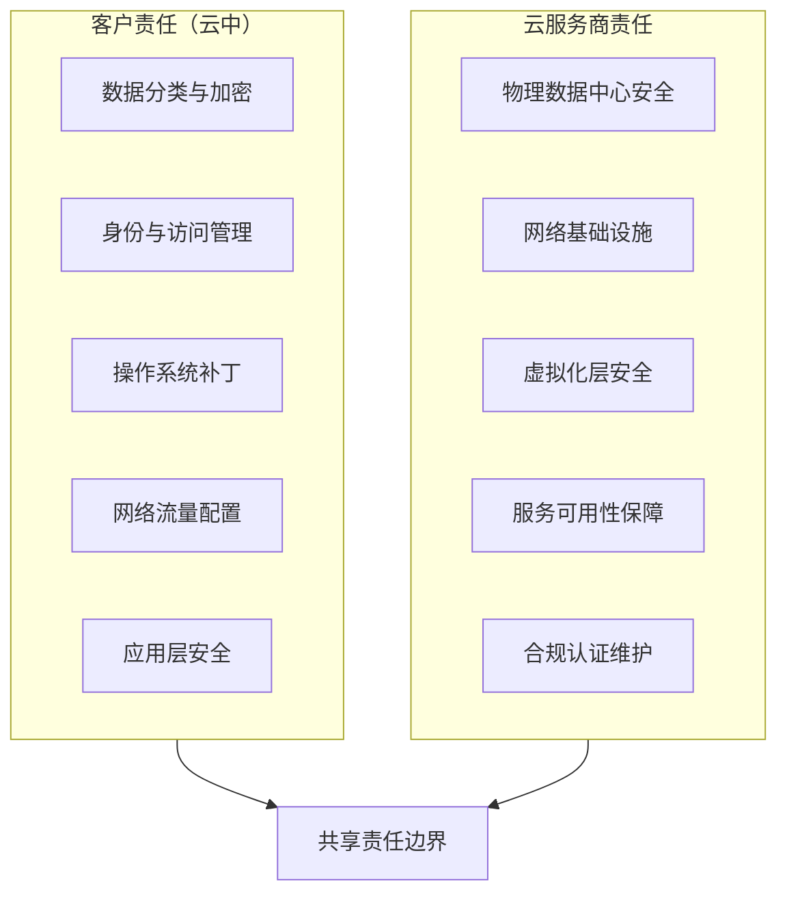
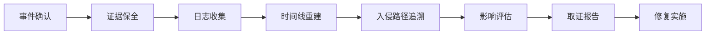

## 案例八：云环境数据泄露取证

云环境数据泄露是当前最复杂、最高发的数字取证场景之一。与传统取证不同，云取证没有物理硬盘可供镜像，没有网络设备可供抓包，所有证据都依赖云服务商提供的日志和API。本章通过一个真实案例，系统讲解云环境数据泄露取证的完整流程、方法论和实战技巧。

### 案例背景

某互联网公司的业务系统部署在 AWS 上，前端为 EC2 实例集群，后端数据库存储在 RDS，客户上传的文件存放在 S3 存储桶。2024年1月15日，安全团队收到 AWS GuardDuty 告警：检测到 S3 存储桶出现异常的批量 GetObject 操作，访问来源IP归属地为境外，请求频率远超正常业务模式。

公司立即启动应急响应，成立由安全工程师、云架构师和法务人员组成的取证小组，目标是：

- 确认数据泄露的范围和规模
- 追溯攻击者入侵路径和使用的技术手段
- 固定可用于法律诉讼的数字证据
- 制定止损和修复方案

### 云取证与传统取证的核心差异

理解云取证的特殊性是正确执行取证的前提。下表对比了两者的本质区别：

| 维度 | 传统取证 | 云取证 |
|------|---------|--------|
| 证据载体 | 物理硬盘、内存、网络设备 | API日志、审计记录、快照 |
| 证据控制权 | 完全由调查人员控制 | 由云服务商控制，需通过API获取 |
| 时间精度 | 硬件时钟，精度高 | NTP同步时钟，可能有毫秒级偏差 |
| 存储持久性 | 磁盘数据持久存在 | 日志有保留期限，EBS快照可能被删除 |
| 地理管辖 | 物理位置明确 | 数据可能跨多个区域/国家 |
| 取证工具 | EnCase、FTK等成熟工具 | 各厂商CLI工具，标准化程度低 |
| 共享基础设施 | 不适用 | 多租户环境，需隔离邻居数据 |

云取证的最大挑战在于：**证据是临时性的**。EBS卷可以被删除，CloudTrail日志有保留期限（默认90天），VPC Flow Logs默认不开启。取证人员必须在证据消失之前完成固定。

### 云安全责任共担模型

取证之前必须明确责任边界。AWS、Azure、GCP 三大云服务商都采用责任共担模型：



**对取证的意义**：云服务商不会向你提供底层物理日志（如虚拟机管理程序日志、物理网络流量抓包），你只能访问客户层面的日志。这意味着某些传统取证手段在云环境中完全不可用，必须依赖替代方案。

### 云取证流程框架

云环境数据泄露取证应遵循以下标准化流程：



每个阶段都有对应的工具和方法，下面逐一展开。

### 第一阶段：事件确认与证据固定

#### 事件确认

收到告警后，第一步不是急着分析日志，而是确认事件真实性并固定关键证据。在云环境中，某些资源是临时性的，必须立即保存快照。

```bash
# 1. 对涉事 EC2 实例创建 EBS 快照（保留磁盘状态）
INSTANCE_ID="i-0a1b2c3d4e5f67890"
VOLUME_IDS=$(aws ec2 describe-instances \
    --instance-ids $INSTANCE_ID \
    --query 'Reservations[*].Instances[*].BlockDeviceMappings[*].Ebs.VolumeId' \
    --output text)

for vol in $VOLUME_IDS; do
    aws ec2 create-snapshot \
        --volume-id $vol \
        --description "forensics-snapshot-20240115-$(date +%H%M%S)" \
        --tag-specifications "ResourceType=snapshot,Tags=[{Key=Purpose,Value=forensics},{Key=IncidentID,Value=INC-2024-0115}]"
done

# 2. 记录实例运行时状态
aws ec2 describe-instances --instance-ids $INSTANCE_ID > /evidence/ec2-state.json

# 3. 导出 CloudWatch Logs（如果有）
aws logs create-export-task \
    --log-group-name /aws/lambda/suspicious-function \
    --from 1705276800000 \
    --to 1705363200000 \
    --destination forensics-export-bucket

# 4. 如果可能，对实例做内存快照（需预装 SSM Agent）
aws ssm send-command \
    --instance-ids $INSTANCE_ID \
    --document-name "AWS-RunShellScript" \
    --parameters 'commands=["dd if=/dev/mem of=/tmp/memory.dump bs=1M && aws s3 cp /tmp/memory.dump s3://forensics-bucket/memory/"]'
```

#### 证据链完整性要求

云取证的证据链（Chain of Custody）必须记录：

| 项目 | 内容 |
|------|------|
| 证据标识 | 快照ID、日志文件哈希值 |
| 采集时间 | 精确到毫秒的UTC时间 |
| 采集人 | 操作人的IAM身份和ARN |
| 操作记录 | 完整的AWS CLI命令和输出 |
| 哈希校验 | SHA-256校验值 |
| 存储位置 | 证据存储桶路径和访问权限 |

```bash
# 为所有证据文件生成哈希校验值
find /evidence/ -type f -exec sha256sum {} \; > /evidence/integrity-checksums.txt

# 将证据存储桶设置为不可删除（Object Lock）
aws s3api put-object-lock-configuration \
    --bucket forensics-evidence-bucket \
    --object-lock-configuration '{ "ObjectLockEnabled": true, "Rule": { "DefaultRetention": { "Mode": "COMPLIANCE", "Years": 7 }}}'
```

### 第二阶段：CloudTrail 日志深度分析

CloudTrail 是 AWS 云取证的核心数据源，记录了几乎所有 API 调用。但默认配置存在严重局限——很多关键事件需要提前开启高级功能才能捕获。

#### CloudTrail 配置检查

```bash
# 检查当前 Trail 配置
aws cloudtrail get-trail-status --name main-trail
aws cloudtrail describe-trails --trail-name-list main-trail

# 关键检查项
# 1. IsLogging 是否为 true
# 2. LatestDeliveryTime 是否为近期
# 3. 是否启用了 Management Events
# 4. 是否配置了 Data Events（S3、Lambda）
# 5. 日志是否发送到 CloudWatch Logs
```

**实战经验**：很多公司的 CloudTrail 只记录 Management Events，不记录 Data Events。这意味着 S3 的 GetObject/PutObject 操作可能没有记录。本案中，幸好公司开启了 S3 Data Events 日志，否则无法追溯数据下载记录。

#### 异常行为检测

```bash
# 1. 查找所有来自异常IP的 API 调用
aws cloudtrail lookup-events \
    --lookup-attributes AttributeKey=EventName,AttributeValue=GetObject \
    --start-time 2024-01-14T00:00:00Z \
    --end-time 2024-01-16T00:00:00Z \
    --output json | jq '.Events[] | {
        eventTime: .EventTime,
        eventName: .EventName,
        userIdentity: .CloudTrailEvent | fromjson | .userIdentity,
        sourceIPAddress: .CloudTrailEvent | fromjson | .sourceIPAddress,
        resources: .Resources
    }'

# 2. 检测权限提升尝试（IAM相关操作）
aws cloudtrail lookup-events \
    --lookup-attributes AttributeKey=EventName,AttributeValue=CreateUser \
    --start-time 2024-01-14T00:00:00Z \
    --end-time 2024-01-16T00:00:00Z

# 3. 检测密钥创建（持久化后门）
aws cloudtrail lookup-events \
    --lookup-attributes AttributeKey=EventName,AttributeValue=CreateAccessKey

# 4. 检测安全组变更（可能为后续横向移动开路）
aws cloudtrail lookup-events \
    --lookup-attributes AttributeKey=EventName,AttributeValue=AuthorizeSecurityGroupIngress
```

#### 从 S3 访问日志重建数据泄露规模

```bash
# 从 CloudTrail 日志中统计 S3 数据下载量
# 注意：CloudTrail 的 GetObject 事件不直接包含字节数，
# 需要结合 S3 Server Access Logs 获取精确数据

# 启用 S3 Server Access Logs（如果未启用，事后无法获取）
aws s3api put-bucket-logging \
    --bucket target-bucket \
    --bucket-logging-status '{
        "LoggingEnabled": {
            "TargetBucket": "access-logs-bucket",
            "TargetPrefix": "s3-access-logs/"
        }
    }'

# 从 CloudTrail 中提取所有 GetObject 事件的请求参数
aws logs filter-log-events \
    --log-group-name CloudTrail/forensics \
    --filter-pattern '{ $.eventName = "GetObject" && $.sourceIPAddress = "45.33.*" }' \
    --start-time 1705276800000 \
    --end-time 1705363200000 \
    --output text | jq '.events[].message | fromjson | {
        time: .eventTime,
        bucket: .requestParameters.bucketName,
        key: .requestParameters.key,
        sourceIP: .sourceIPAddress,
        userAgent: .userAgent
    }'
```

本案中通过 CloudTrail 分析发现：攻击者在 2024-01-15T02:17:03Z 到 2024-01-15T05:42:18Z 期间（约3.5小时），发起了 4,217 次 GetObject 请求，下载了 2,847 个文件，涉及约 100GB 客户数据。

### 第三阶段：VPC Flow Logs 网络溯源

VPC Flow Logs 记录了 VPC 内所有网络接口的出入站流量元数据，是追溯数据外传路径的关键证据。

#### Flow Logs 分析

```bash
# 从 CloudWatch Logs 中查询 VPC Flow Logs
# 查找与异常IP的通信记录
aws logs filter-log-events \
    --log-group-name vpc-flow-logs \
    --filter-pattern '45.33.32.156' \
    --start-time 1705276800000 \
    --end-time 1705363200000

# 分析数据外传量（dstport=443 且为出站流量）
cat /evidence/vpc-flow-logs.log | \
    awk '$7 == "45.33.32.156" && $12 == "ACCEPT" {
        total_bytes += $10; count++
    } END {
        printf "总请求次数: %d\n总传输字节: %.2f GB\n", count, total_bytes/1024/1024/1024
    }'

# 查找攻击者的完整网络通信模式
cat /evidence/vpc-flow-logs.log | \
    awk '$7 == "45.33.32.156" { print $8, $10, $11, $12 }' | \
    sort | uniq -c | sort -rn | head -20
```

#### VPC Flow Logs 字段说明

VPC Flow Logs 默认格式包含以下关键字段，理解每个字段对取证至关重要：

| 字段位置 | 字段名 | 含义 | 取证价值 |
|---------|--------|------|---------|
| $1 | version | 日志版本 | 格式确认 |
| $2 | account-id | AWS账户ID | 确认归属 |
| $3 | interface-id | 网络接口ID | 定位具体实例 |
| $5 | srcaddr | 源IP地址 | 攻击者来源 |
| $6 | dstaddr | 目标IP地址 | 受害资源 |
| $8 | dstport | 目标端口 | 服务类型识别 |
| $10 | bytes | 传输字节数 | 泄露规模量化 |
| $12 | action | ACCEPT/REJECT | 流量是否放行 |
| $15 | vpc-id | VPC标识 | 网络隔离确认 |

### 第四阶段：IAM 身份与权限分析

IAM 是云环境的"门禁系统"，分析IAM活动可以追溯攻击者如何获得访问权限、执行了哪些操作、以及是否留下了持久化后门。

#### 凭据泄露溯源

本案中，攻击者使用的凭据来源是关键问题：

```bash
# 1. 查找泄露的 Access Key 在哪些代码仓库中出现
# 使用 GitHub 的代码搜索 API（如果代码托管在 GitHub）
curl -H "Authorization: token $GITHUB_TOKEN" \
    "https://api.github.com/search/code?q=YOUR_AWS_KEY_ID"

# 2. 使用 git-secrets 或 trufflehog 扫描所有仓库
trufflehog git https://github.com/company/internal-repo.git \
    --only-verified --json | jq '. | select(.DetectorName == "AWS")'

# 3. 检查该 Access Key 的所有使用记录
aws cloudtrail lookup-events \
    --lookup-attributes AttributeKey=AccessKeyId,AttributeValue=YOUR_AWS_KEY_ID \
    --output json | jq '.Events | length'

# 4. 检查攻击者是否创建了新的 IAM 用户或角色（持久化）
aws iam list-users --output json | jq '.Users[] | select(.CreateDate > "2024-01-15")'
aws iam list-roles --output json | jq '.Roles[] | select(.CreateDate > "2024-01-15")'
```

#### 权限分析与影响评估

```bash
# 查询被泄露凭据关联用户的权限策略
aws iam list-attached-user-policies --user-name compromised-user
aws iam list-user-policies --user-name compromised-user

# 检查是否有内联策略被修改
aws cloudtrail lookup-events \
    --lookup-attributes AttributeKey=EventName,AttributeValue=PutUserPolicy \
    --start-time 2024-01-14T00:00:00Z

# 检查 STS AssumeRole 调用（横向移动）
aws cloudtrail lookup-events \
    --lookup-attributes AttributeKey=EventName,AttributeValue=AssumeRole \
    --start-time 2024-01-14T00:00:00Z \
    --end-time 2024-01-16T00:00:00Z
```

### 第五阶段：时间线重建

将所有证据源的数据对齐到统一时间线，是还原攻击过程的关键步骤。

#### 攻击时间线

本案的完整攻击时间线如下：

| 时间 (UTC) | 事件 | 证据来源 |
|------------|------|---------|
| 2024-01-10 | 开发者将 Access Key 提交到公开 GitHub 仓库 | GitHub commit history |
| 2024-01-15 02:14:03 | 攻击者首次使用泄露的 Access Key 调用 STS GetCallerIdentity | CloudTrail |
| 2024-01-15 02:15:47 | 攻击者列出 S3 存储桶（ListBuckets） | CloudTrail |
| 2024-01-15 02:17:03 | 首次 GetObject 请求，开始批量下载 | CloudTrail + S3 Data Events |
| 2024-01-15 02:30:11 | 检测到 ListUsers 调用（侦察IAM用户） | CloudTrail |
| 2024-01-15 03:45:22 | 尝试 CreateUser，被 IAM 策略拒绝 | CloudTrail |
| 2024-01-15 04:12:08 | 尝试创建 Access Key（持久化），被拒绝 | CloudTrail |
| 2024-01-15 05:42:18 | 最后一次 GetObject 请求 | CloudTrail |
| 2024-01-15 06:01:33 | GuardDuty 生成告警 | GuardDuty Findings |
| 2024-01-15 06:15:00 | 安全团队收到告警通知 | CloudWatch Alarm |
| 2024-01-15 06:30:00 | 禁用泄露的 Access Key | IAM Console |

#### 自动化时间线分析脚本

```bash
#!/bin/bash
# cloud-timeline-builder.sh - 从多个AWS数据源构建统一时间线

EVIDENCE_DIR="/evidence/timeline"
mkdir -p "$EVIDENCE_DIR"

# 收集 CloudTrail 日志
aws logs filter-log-events \
    --log-group-name CloudTrail/forensics \
    --start-time 1705276800000 \
    --end-time 1705363200000 \
    --filter-pattern '{ $.sourceIPAddress = "45.33.*" }' \
    --output json > "$EVIDENCE_DIR/cloudtrail-raw.json"

# 提取关键字段并排序
jq -r '.events[] | .message | fromjson |
    "\(.eventTime)\t\(.eventName)\t\(.sourceIPAddress)\t\(.userIdentity.type)\t\(.errorCode // "OK")\t\(.requestParameters | tostring)"' \
    "$EVIDENCE_DIR/cloudtrail-raw.json" | \
    sort -t$'\t' -k1 > "$EVIDENCE_DIR/timeline-sorted.tsv"

# 汇总统计
echo "=== 事件统计 ==="
echo "总事件数: $(wc -l < "$EVIDENCE_DIR/timeline-sorted.tsv")"
echo "唯一IP数: $(cut -f3 "$EVIDENCE_DIR/timeline-sorted.tsv" | sort -u | wc -l)"
echo "操作类型分布:"
cut -f2 "$EVIDENCE_DIR/timeline-sorted.tsv" | sort | uniq -c | sort -rn | head -15
```

### 跨平台取证对比

本案使用的是 AWS，但很多企业使用 Azure 或 GCP。以下是三大云平台取证工具和数据源的对比：

| 取证维度 | AWS | Azure | GCP |
|---------|-----|-------|-----|
| **审计日志** | CloudTrail | Azure Activity Log + Entra ID Sign-in Logs | Cloud Audit Logs |
| **存储日志** | S3 Server Access Logs | Azure Storage Analytics | Cloud Storage Audit Logs |
| **网络日志** | VPC Flow Logs | NSG Flow Logs + Azure Firewall Logs | VPC Flow Logs |
| **威胁检测** | GuardDuty | Microsoft Defender for Cloud | Security Command Center |
| **配置审计** | Config | Azure Policy + Defender for Cloud | Cloud Asset Inventory |
| **日志查询** | CloudWatch Logs Insights | KQL (Log Analytics) | BigQuery / Log Explorer |
| **快照机制** | EBS Snapshot | Managed Disk Snapshot | Persistent Disk Snapshot |
| **最长保留** | CloudTrail 无限制（S3）| 90天（可扩展）| 400天（可配置）|

**Azure 特有优势**：Entra ID（原 Azure AD）的登录日志非常详细，包含登录IP、设备信息、条件访问策略评估结果，对身份攻击的溯源能力更强。

**GCP 特有优势**：Cloud Audit Logs 的 Admin Activity 日志默认开启且免费，不像 AWS 需要手动配置 CloudTrail。

### 常见误区与实战经验

#### 误区一：CloudTrail 日志等于完整的云活动记录

CloudTrail 默认只记录 Management Events（控制面操作），不记录 Data Events（数据面操作）。S3 的 GetObject、Lambda 的 Invoke 等数据操作需要额外配置 Data Events 才能捕获。而且 Data Events 会产生大量日志，费用显著增加。本案中，如果公司没有开启 S3 Data Events，就无法获取攻击者的文件下载记录。

#### 误区二：禁用 Access Key 就完成了处置

禁用 Access Key 只是止损的第一步。攻击者可能已经：
- 通过 AssumeRole 获取了临时凭据，临时凭据有独立的有效期
- 在被访问的 EC2 实例上植入了后门
- 读取了 Secrets Manager 中存储的其他凭据
- 导出了 RDS 数据库快照

处置必须全面排查，不能只修复入口点。

#### 误区三：IP 地址能直接定位攻击者

云环境中的源 IP 可能经过多层代理。攻击者常用的手段包括：
- 使用 Tor 出口节点
- 通过被攻陷的其他 AWS 账户的 EC2 实例发起请求
- 使用商业 VPN 服务
- 利用 Lambda 函数作为跳板

IP 地址只能作为线索，不能直接作为身份证据。

#### 误区四：快照创建就是证据固定

EBS 快照保存的是磁盘内容，但不包含：
- 运行中进程的内存状态
- 网络连接表（`ss -tlnp` 的输出）
- 内核模块列表
- 环境变量中的临时凭据

如果需要完整内存取证，必须在创建快照之前执行内存转储命令（前提是实例上已安装 SSM Agent）。

#### 误区五：日志没有异常就说明没有被入侵

攻击者可能使用了以下手段避免留下日志：
- 通过 AssumeRole 切换身份，日志中显示的是角色而非原始用户
- 使用 VPC Endpoint 直连 S3，流量不出 VPC，VPC Flow Logs 不记录
- 删除或篡改 CloudTrail 日志（需要启用日志文件完整性验证）
- 修改 CloudWatch Logs 的保留期限

```bash
# 验证 CloudTrail 日志文件完整性
aws cloudtrail validate-logs \
    --trail-arn arn:aws:cloudtrail:us-east-1:123456789012:trail/main-trail \
    --start-time 2024-01-15T00:00:00Z \
    --end-time 2024-01-16T00:00:00Z
```

### 取证报告规范

云取证报告应包含以下结构化内容，确保可作为法律证据使用：

```markdown
# 云环境数据泄露取证报告

## 1. 报告摘要
- 案件编号：INC-2024-0115
- 受影响系统：AWS 生产环境
- 泄露数据类型：客户个人信息（PII）
- 泄露规模：约 100GB，涉及约 50,000 条客户记录
- 攻击持续时间：2024-01-15 02:14 至 05:42 UTC（约 3.5 小时）
- 根本原因：IAM Access Key 泄露至公开代码仓库

## 2. 证据清单
| 编号 | 证据类型 | 来源 | SHA-256 哈希 | 采集时间 |
|------|---------|------|-------------|---------|
| E001 | EBS 快照 | snap-0a1b2c3d | sha256:abc... | 2024-01-15 06:30 |
| E002 | CloudTrail 日志 | S3://evidence/ct/ | sha256:def... | 2024-01-15 06:35 |
| E003 | VPC Flow Logs | CloudWatch | sha256:ghi... | 2024-01-15 06:40 |

## 3. 攻击时间线
（见上文时间线表格）

## 4. 技术分析
### 4.1 入侵路径
### 4.2 使用的技术手段（MITRE ATT&CK 映射）
### 4.3 数据泄露范围评估

## 5. 根本原因分析

## 6. 修复建议

## 7. 附件
```

#### MITRE ATT&CK Cloud 映射

本案涉及的 ATT&CK 技术：

| 阶段 | 技术ID | 技术名称 | 本案表现 |
|------|--------|---------|---------|
| 初始访问 | T1078.004 | 有效账户：云账户 | 使用泄露的 IAM Access Key |
| 发现 | T1580 | 云基础设施发现 | ListBuckets、ListUsers |
| 收集 | T1530 | 数据存储对象 | 批量 GetObject 下载 S3 文件 |
| 渗出 | T1537 | 传输数据到云账户 | 数据传输至境外服务器 |
| 持久化 | T1098 | 账户操纵 | 尝试 CreateUser 和 CreateAccessKey（被阻止） |

### 修复与长效防护

基于本案的发现，制定了分阶段修复计划：

**即时处置（0-4小时）**：
- 禁用并删除泄露的 Access Key
- 强制重置 compromised-user 的所有凭据
- 在安全组中封禁攻击者 IP（虽然效果有限，但记录在案）
- 通知法务和合规团队，评估数据泄露通报义务

**短期加固（1-7天）**：
- 对所有 IAM 用户强制启用 MFA
- 使用 AWS Secrets Manager 或 IAM Roles 替代 Access Key
- 配置 S3 存储桶策略，限制只允许 VPC Endpoint 访问
- 启用 GuardDuty 并配置 S3 保护功能

**长期治理（1-3个月）**：
- 实施 CI/CD 管道中的密钥扫描（git-secrets、trufflehog）
- 使用 AWS Organizations 的 SCP 限制高危操作
- 建立定期的 IAM 权限审计流程（Access Analyzer）
- 配置 CloudTrail 日志文件完整性验证
- 建立云取证响应预案和演练机制

```bash
# 配置 S3 存储桶仅允许 VPC Endpoint 访问（防止数据经公网外传）
aws s3api put-bucket-policy --bucket target-bucket --policy '{
    "Version": "2012-10-17",
    "Statement": [{
        "Sid": "DenyPublicAccess",
        "Effect": "Deny",
        "Principal": "*",
        "Action": "s3:*",
        "Resource": [
            "arn:aws:s3:::target-bucket",
            "arn:aws:s3:::target-bucket/*"
        ],
        "Condition": {
            "StringNotEquals": {
                "aws:sourceVpce": "vpce-0a1b2c3d4e5f"
            }
        }
    }]
}'

# 启用 IAM Access Analyzer
aws accessanalyzer create-analyzer \
    --analyzer-name org-analyzer \
    --type ORGANIZATION
```

### 进阶学习路径

云取证是一个快速发展的领域，以下是进一步提升的建议：

**技术深化**：
- 学习容器取证（ECS/EKS 中的 Pod、容器日志、镜像层分析）
- 学习 Serverless 取证（Lambda 函数的日志、冷启动行为、临时凭据）
- 学习 Kubernetes 审计日志（kube-apiserver 的 audit log）
- 掌握各云平台的原生取证工具（AWS Forensics Orchestrator、Azure VM 磁盘取证）

**认证路径**：
- GIAC Cloud Forensics Responder (GCFR)
- AWS Certified Security - Specialty
- Certified Cloud Security Professional (CCSP)

**自动化建设**：
- 构建云取证自动化工具链（自动化快照、日志收集、时间线生成）
- 集成 SOAR 平台实现告警自动响应
- 建立云取证证据管理平台（支持不可篡改存储和完整性校验）

云取证的核心挑战不在于工具操作，而在于**速度**——云资源的临时性意味着证据随时可能消失。建立预案、定期演练、自动化取证流程，是应对云环境数据泄露的关键能力。
