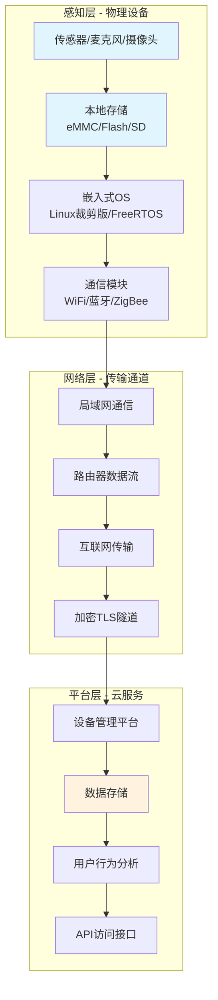
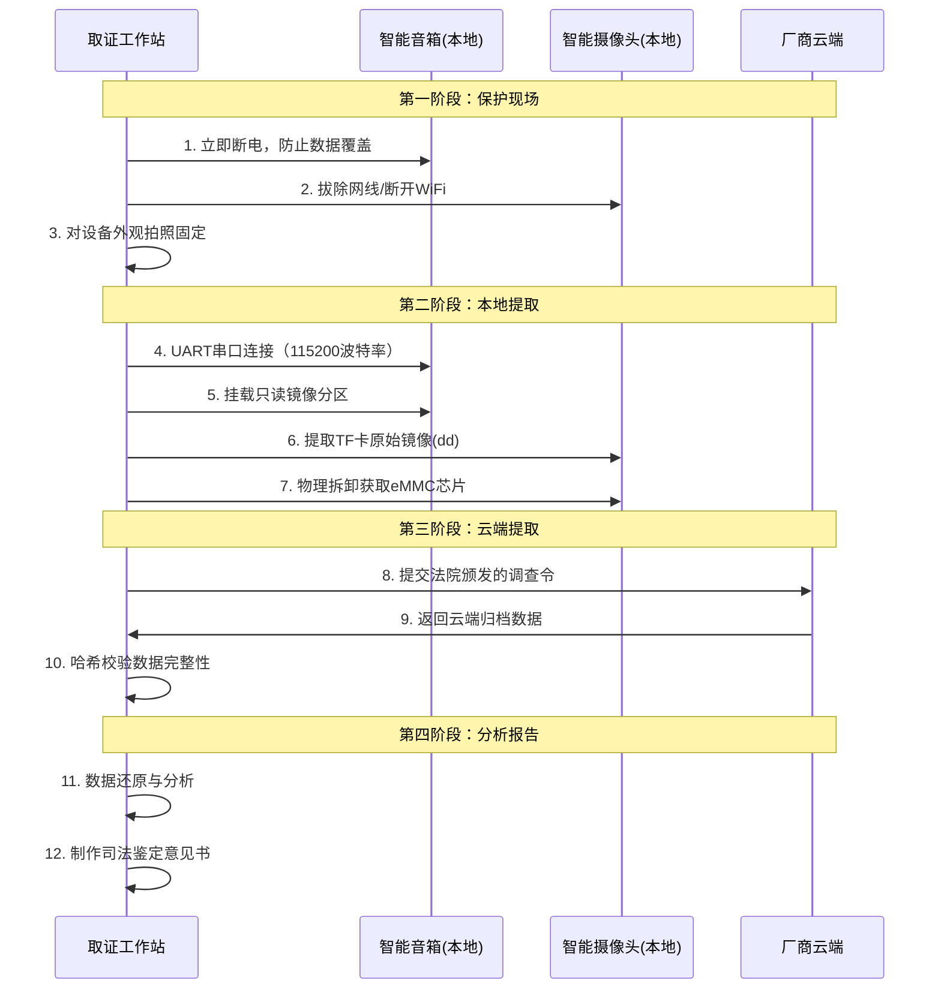

## 案例九：物联网设备取证

### 案例背景

2024年7月，某市发生一起家庭暴力案件。受害人李某长期遭受配偶张某的暴力行为，但一直因缺乏直接证据而无法立案。据受害人陈述，施暴行为多发生在客厅和卧室，恰好这两处均安装有**小米智能音箱（小爱同学Pro）**和**TP-Link Tapo C200智能摄像头**。警方在获得搜查令后，依法扣押了这两台设备，并委托电子取证实验室进行数据提取，目标是获取案发时间段（2024年6月15日至7月10日）的音频记录和视频片段。

本案的关键难点在于：智能音箱和摄像头均采用**端-云混合存储架构**，部分数据缓存在本地，部分上传至云端，且本地存储采用加密分区，常规文件系统挂载无法直接读取。

---

### 物联网取证知识体系

#### 物联网设备取证的特殊性

物联网（IoT）设备与传统计算机取证存在本质差异，主要体现在以下六个维度：

| 维度 | 传统取证 | 物联网取证 |
|------|---------|-----------|
| 数据持久性 | 数据长期保存在磁盘中 | 数据可能随断电丢失（RAM型） |
| 存储介质 | 标准文件系统（NTFS/ext4） | 闪存芯片、eMMC、SD卡，常含加密分区 |
| 操作系统 | Windows/macOS/Linux（已知结构） | 嵌入式RTOS/Linux裁剪版，高度定制化 |
| 接口访问 | 标准端口（USB/SATA/PCIe） | 需要JTAG/UART/SPI等硬件调试接口 |
| 数据归属 | 明确归设备所有者 | 设备厂商、云服务商、用户三方共有 |
| 证据时效性 | 数月至数年 | 云端数据可能几小时后被覆盖 |

#### 物联网设备的三层架构

从取证视角，物联网设备可以分为三个逻辑层次，每层有不同的取证关注点：



- **感知层**：物理设备本身，包含传感器、本地存储和嵌入式操作系统
- **网络层**：设备间通信和互联网传输路径
- **平台层**：厂商云服务平台，存储设备上报的历史数据

理解这三层架构对于制定取证策略至关重要——每条证据可能来自不同的层，每一层的提取难度和法律要求也各不相同。

---

### 取证策略与流程

#### 取证优先级模型

物联网设备取证应遵循**易失性递减原则**（Order of Volatility），优先获取最易丢失的数据：

1. **最高优先级**（数秒至数分钟级）：设备RAM中的数据——正在进行的录音、视频缓冲、加密密钥——断电即失
2. **高优先级**（数分钟至数小时级）：网络连接状态——设备与云端的实时通信链路、活跃会话
3. **中优先级**（数天至数周级）：本地持久存储——日志文件、缓存的音频/视频片段、配置文件
4. **低优先级**（数月至数年级）：云端存储——厂商服务器上的历史录音、事件记录

#### 本次取证的完整流程



---

### 本地数据提取（感知层）

#### 第一步：物理固定与现场保护

在扣押设备前，取证人员必须完成以下操作（按顺序执行，不可颠倒）：

1. **拍照固定**：对设备所处位置、连接状态、LED指示状态进行多角度拍照
2. **网络分离**：拔除网线或使用Faraday袋屏蔽无线信号——防止设备在扣押过程中接收远程擦除指令。**务必不要直接断电解锁设备后操作**，因为某些厂商（如小米、华为）支持远程擦除功能
3. **电源处理**：对于不可拆卸电池的设备，记录剩余电量后关机；可拆卸电池的设备直接取下电池


**关键教训**：某取证团队在扣押Amazon Echo设备时，先尝试在线登录设备管理员界面，结果操作触发了云端自动擦除指令（kill-switch），导致所有本地语音记录在30秒内被远程删除。因此，**断网是第一要务**。


#### 第二步：智能音箱本地提取（小爱同学Pro）

智能音箱通常运行裁剪版Android或Linux系统，可通过以下接口提取数据：

**方法A：UART串口提取（推荐）**

许多智能音箱的PCB上预留了UART调试接口（通常为4个焊盘：VCC、GND、TX、RX），可用于获取root shell访问权限：

```bash
# 1. 使用逻辑分析仪或万用表定位UART引脚
# TX引脚在空闲时为高电平（3.3V），RX通常有上拉电阻

# 2. 连接USB-TTL适配器
# USB-TTL适配器 GND → 设备GND
# USB-TTL适配器 RX  → 设备TX
# USB-TTL适配器 TX  → 设备RX
# 波特率通常为 115200 或 57600

# 3. 使用minicom或screen建立串口会话
screen /dev/ttyUSB0 115200

# 4. 登录后查看分区布局
cat /proc/mtd
# 或
cat /proc/partitions

# 5. 导出关键分区
# boot分区（引导加载程序）
dd if=/dev/mmcblk0p1 of=/tmp/boot_partition.img bs=4096

# 用户数据分区（包含录音、配置）
dd if=/dev/mmcblk0p3 of=/tmp/userdata_partition.img bs=4096

# 系统日志分区
dd if=/dev/mmcblk0p5 of=/tmp/log_partition.img bs=4096
```

**方法B：ADB提取（如果Android系统启用了ADB）**

部分智能音箱基于Android系统，如果ADB调试端口已开启，可通过网络连接提取：

```bash
# 1. 扫描设备IP的ADB端口（5555）
nmap -p 5555 192.168.1.0/24

# 2. 连接设备
adb connect 192.168.1.100:5555

# 3. 确认连接状态
adb devices

# 4. 提取录音缓存目录
adb pull /data/data/com.xiaomi.smarthome/cache/recordings/ ./speaker_recordings/

# 5. 提取设备日志
adb shell logcat -d -b all > full_device_log.txt

# 6. 提取应用数据库
adb pull /data/data/com.xiaomi.smarthome/databases/ ./speaker_databases/
```

**提取数据分析**：从小爱同学Pro本地提取的数据包含以下有价值内容：

| 数据类型 | 存储位置 | 格式 | 保留时限 | 取证价值 |
|---------|---------|------|---------|---------|
| 唤醒词音频 | `/data/.../wakeup/` | .PCM (16kHz, 16bit) | 约7天 | 录音频段验证 |
| 指令音频 | `/data/.../query/` | .PCM | 约7天 | 用户意图分析 |
| 语音助手日志 | `/data/.../log/` | 文本 | 约30天 | 操作时间轴 |
| WiFi连接记录 | `/data/misc/wifi/` | 文本 | 永久 | 定位辅助 |
| 设备配置 | `/data/.../config/` | JSON | 永久 | 设备状态 |

#### 第三步：智能摄像头本地提取（TP-Link Tapo C200）

Tapo C200使用嵌入式Linux系统，本地存储依赖TF卡。取证策略分两种情况：

**场景A：TF卡在位（推荐优先提取）**

```bash
# 1. 取出TF卡，使用只读写保护器（SD卡锁开关拨到LOCK位置）
# 2. 连接取证工作站，使用专业只读桥接器（如Tableau T35u）

# 3. 计算源媒体哈希（记录原始证据完整性）
sha256sum /dev/sdc > tf_card_original.hash

# 4. 创建物理镜像是所有后续分析的基础
dd if=/dev/sdc of=/evidence/tapo_sdcard.img bs=4M conv=noerror,sync status=progress

# 5. 验证镜像完整性
sha256sum /evidence/tapo_sdcard.img
# 与原始哈希对比
cat tf_card_original.hash

# 6. 使用Autopsy或FTK Imager分析镜像
# 注意：Tapo摄像头使用FAT32文件系统，视频存储在 /DCIM/ 目录下
# 视频格式为 .mp4（H.264编码），文件名格式：YYYYMMDD_HHMMSS.mp4
```

**场景B：无TF卡（仅设备内部存储）**

Tapo C200内置16MB SPI Flash，存储固件和配置文件。需要通过物理拆解提取：

```bash
# 1. 拆解设备外壳，定位SPI Flash芯片（通常是Winbond 25Q系列）
# 2. 使用SPI Flash编程器（如CH341A）连接芯片引脚

# 3. 读取SPI Flash完整内容
flashrom -p ch341a_spi -r /evidence/tapo_flash_dump.bin

# 4. 分析固件结构
binwalk /evidence/tapo_flash_dump.bin

# 5. 提取配置文件（包含WiFi密码、云端账户信息）
# 通常在偏移0x50000~0x60000区域
dd if=/evidence/tapo_flash_dump.bin of=/evidence/tapo_config.bin \
   bs=1 skip=$((0x50000)) count=$((0x10000))

# 6. 使用strings分析明文配置信息
strings /evidence/tapo_config.bin | grep -E '(ssid|password|token|cloud)'
```

---

### 云端数据提取（平台层）

#### 法律程序前置条件

向厂商请求云端数据前，必须完成以下法律程序：

1. **法院调查令**（《中华人民共和国民事诉讼法》第67条）：明确写明调取数据的范围、时间区间、具体设备标识
2. **设备所有权证明**：如设备购买凭证、小米账号注册信息等
3. **受害人授权书**：受害人明确同意数据调取（若受害者本人为设备注册人）
4. **厂商对接联系人确认**：各厂商都有专门的法务对接部门处理司法协助请求

#### 主流厂商司法协助流程

| 厂商 | 数据保留部门 | 响应时间 | 支持的数据类型 | 法律依据 |
|------|-------------|---------|--------------|---------|
| 小米 | 信息安全部 | 5-10个工作日 | 语音记录、设备操作日志、账号信息 | 法院调查令 |
| 华为 | 法务部 | 7-14个工作日 | 智慧屏、摄像头云端录像 | 法院调查令+保密函 |
| TP-Link | 法务部 | 3-7个工作日 | 云端录像、事件快照 | 法院调查令 |
| 阿里云 | 司法协助中心 | 5-10个工作日 | IoT设备云端数据 | 调证通知书 |

#### 云端数据提取请求步骤

```bash
# 步骤1：获取设备唯一标识
# 从小米音箱提取设备ID（UIID/SN）
adb shell getprop ro.serialno
# 输出示例: 5BXXXXXX00000001

# 步骤2：向厂商正式发函
# 需提供以下信息：
# - 设备SN/MAC地址
# - 绑定的小米账号
# - 请求的时间范围
# - 数据类型（语音/视频/日志/定位）

# 步骤3：厂商数据导出
# 厂商通常会提供加密压缩包，通过内部平台下载
# 文件格式示例: device_5BXXXXXX00000001_evidence.tar.gz.aes256

# 步骤4：解密与验证（密钥由厂商单独通过安全通道发送）
openssl enc -aes-256-cbc -d -in device_evidence.tar.gz.aes256 \
  -out device_evidence.tar.gz -pass file:/path/to/decryption_key

# 步骤5：解压并验证哈希
tar -xzf device_evidence.tar.gz
sha256sum device_evidence.tar.gz
# 与厂商提供的哈希值对比
```

#### 云端数据包含的证据类型

从TP-Link和小米云端获取的数据比本地更全面：

| 数据类型 | 本地存储 | 云端存储 | 云端保留时长 | 凭据价值 |
|---------|---------|---------|------------|---------|
| 所有唤醒录音 | ✓（缓存） | ✓（完整） | 180天（小米） | 语音证据核心 |
| 声纹特征 | ✓ | ✓ | 长期 | 身份确认 |
| 设备GPS位置 | ✗ | ✓ | 30天 | 时空定位 |
| 远程操作记录 | ✗ | ✓ | 90天 | 反证远程操控 |
| 设备绑定历史 | ✓ | ✓ | 永久 | 所有权证明 |
| 场景联动规则 | ✓ | ✓ | 永久 | 行为模式 |

---

### 数据分析与证据还原

#### 音频时间轴重建

将从本地和云端提取的音频数据按时间排序，可以重建案发时间段的完整声音事件序列：

| 时间戳（2024） | 设备 | 事件类型 | 内容摘要 | 证据编号 |
|---------------|------|---------|---------|---------|
| 06-20 22:15:03 | 小爱音箱 | 唤醒 | "小爱同学"——李某声音 | AUD-001 |
| 06-20 22:15:04 | 小爱音箱 | 指令 | "拨打110"——李某声音 | AUD-002 |
| 06-20 22:15:06 | 小爱音箱 | 系统 | 指令被取消（设备被遥控停止） | LOG-003 |
| 06-25 23:30:12 | Tapo C200 | 移动侦测 | 视频显示激烈争执场景 | VID-004 |
| 07-01 14:05:44 | 小爱音箱 | 唤醒 | "小爱同学"——张某声音 | AUD-005 |
| 07-01 14:05:45 | 小爱音箱 | 指令 | "删除今天录音"——张某声音 | AUD-006 |
| 07-01 14:05:46 | 小爱音箱 | 系统 | 本地录音删除执行 | LOG-007 |

**关键发现**：AUD-006显示张某曾操作智能音箱删除本地录音记录，但由于云端数据保留策略（保留180天），云端副本仍完整可读。这一行为本身也成为证明张某试图销毁证据的佐证。

#### 语音数据格式转换与分析

```bash
# 小米智能音箱录音文件为PCM格式（16kHz采样率，16bit，单声道）
# 转换为WAV格式以便在法庭播放

# 单个文件转换
ffmpeg -f s16le -ar 16000 -ac 1 -i recording_20240620_221503.pcm \
  recording_20240620_221503.wav

# 批量转换
for f in *.pcm; do
  ffmpeg -f s16le -ar 16000 -ac 1 -i "$f" "${f%.pcm}.wav"
done

# 声音增强（去除环境噪音）
ffmpeg -i recording_20240620_221503.wav -af afftdn=nr=15 \
  recording_20240620_221503_enhanced.wav

# 声纹比对（使用开源工具VoiceID或Python库resemblyzer）
# 确认AUD-005和AUD-006的说话人为张某
python3 << 'EOF'
from resemblyzer import VoiceEncoder
from pathlib import Path
import numpy as np

encoder = VoiceEncoder()

# 加载标准语音样本（张某被捕后的录音样本）
suspect_sample = encoder.embed_utterance(
    Path("suspect_voice_sample.wav"))

# 加载待比对录音
evidence_sample = encoder.embed_utterance(
    Path("recording_20240701_140545_enhanced.wav"))

# 计算余弦相似度
similarity = np.dot(suspect_sample, evidence_sample)
print(f"声纹相似度: {similarity:.3f}")
# 相似度 > 0.75 通常认定为同一说话人
EOF
```

#### 视频数据时间校准

Tapo C200摄像头的时间戳需进行校准验证，因为设备时间可能被人为修改：

```bash
# 方法1：提取EXIF元数据中的实际时间戳
exiftool VID_20240625_233012.mp4 | grep -i "Create Date\|Media Date"

# 方法2：对比多设备时间线
# 如果摄像头画面中出现其他已知时间源的设备（如手机屏幕、时钟），
# 可用这些参考点校准时间

# 方法3：通过NTP日志验证
# 在设备日志中查找NTP同步记录
grep "ntp\|time\|NTP" device_log.txt | head -20
# 输出示例:
# 06-25 23:25:00.123 NTP  time sync from 114.118.7.100 offset=+0.023s
```

---

### 证据链与法律可采性

#### 完整的证据链文档

物证提取和处理的全过程必须形成书面记录，确保在法庭上能够对抗质询：

```text
┌─────────────────────────────────────────────────────────┐
│                 电子证据提取记录表                        │
├─────────────────────────────────────────────────────────┤
│ 案件编号: 2024-XZ-0781                                  │
│ 提取日期: 2024-07-12                                   │
│ 提取地点: XX市公安局电子数据取证实验室                   │
│ 提取人员: 王XX（警号123456）、李XX（警号123457）        │
│ 见证人员: 赵XX（社区代表）                              │
├─────────────────────────────────────────────────────────┤
│ 设备1: 小米智能音箱 小爱同学Pro                         │
│   SN: 5BXXXXXX00000001                                 │
│   取证方法: UART串口提取 + 云端法律请求                  │
│   工具: USB-TTL(CH340G), minicom v2.8, dd (busybox)    │
│   提取时间: 2024-07-12 09:15 - 10:30                   │
│   哈希(SHA-256): A3F2...7E9D                           │
├─────────────────────────────────────────────────────────┤
│ 设备2: TP-Link Tapo C200摄像头                          │
│   SN: 224DXXXXXX0001                                   │
│   取证方法: TF卡物理镜像 + SPI Flash读取                │
│   工具: Tableau T35u 只读桥接器, CH341A 编程器          │
│   提取时间: 2024-07-12 10:45 - 12:20                   │
│   哈希(SHA-256): B7C1...4A5F                           │
├─────────────────────────────────────────────────────────┤
│ 见证人声明: 我见证了上述数据提取全过程，过程合法合规。    │
│ 签名: __________  日期: __________                      │
└─────────────────────────────────────────────────────────┘
```

#### 证据可采性的三个关键因素

**1. 原始性（Authenticity）**

法庭要求提供的电子证据必须是原始、未篡改的。实现方式：
- 对每份提取的数据计算SHA-256哈希并加盖时间戳
- 使用写保护器确保不会意外修改原始设备
- 全程录像取证过程

**2. 完整性（Integrity）**

证据链不能出现断裂：
```bash
# 每次证据转移都必须有签收记录
# 示例：将镜像从取证工作站移交到分析工作站
# 移交时需重新计算哈希，双方确认一致

# 移交记录格式
echo "2024-07-12 14:30  |  移交人: 王XX  |  接收人: 张XX  |  文件: tapo_sdcard.img  |  SHA256: B7C1...4A5F  |  备注: 哈希值一致，完整移交" >> evidence_chain.log
```

**3. 合法性（Legality）**

- 必须持有合法有效的搜查令/调查令
- 提取范围不得超过令状允许的范围
- 涉及第三方（非涉案人员）的录音应进行脱敏处理

---

### 常见误区与应对

| 误区 | 错误做法 | 正确做法 |
|------|---------|---------|
| 设备开机在线提取 | 直接连接WiFi后登录设备管理界面 | 先断网，再物理提取，最后考虑云端 |
| 忽视云端数据 | 只提取本地存储，认为云端等同备份 | 云端数据往往更完整、保留更久，务必同时申请 |
| 误删本地缓存 | 提取后未妥善关机，导致缓存被清理 | 提取操作应优先于任何系统交互 |
| 未记录设备状态 | 未记录LED指示、网络连接状态等 | 拍照和录像记录所有设备初始状态 |
| 低估加密挑战 | 认为直接dd镜像即可读取所有数据 | 部分设备使用FBE（基于文件的加密），需额外解密步骤 |

---

### 进阶知识：高级物联网取证技术

对于加密程度更高的物联网设备（如Apple HomePod、Google Nest Hub），常规串口提取可能无法获取有用数据。以下是进阶技术选型：

| 技术 | 适用场景 | 难度 | 成本 | 成功率 |
|------|---------|------|------|-------|
| **JTAG调试** | 芯片级数据提取，绕过软件加密 | ★★★★★ | 中 | 70% |
| **Chip-Off拆片** | NAND/eMMC芯片拆焊后直接读取 | ★★★★ | 高 | 85% |
| **SPI闪存编程** | 串行Flash固件提取 | ★★★ | 低 | 95% |
| **冷启动攻击** | 从RAM中恢复加密密钥 | ★★★★★ | 高 | 40% |
| **侧信道分析** | 通过功耗/电磁信号推断密钥 | ★★★★★★ | 极高 | 30% |

**Chip-Off实操概要**（以eMMC芯片为例）：

```bash
# 1. 热风枪加热至 280℃（无铅焊锡）或 240℃（有铅焊锡）
# 2. 小心分离芯片，清理焊盘残余焊锡
# 3. 放入eMMC编程器（如EasyJTAG Plus或RT809H）
# 4. 读取完整eMMC镜像
# 5. 使用PhotoRec或Foremost恢复已删除文件
# 6. 若启用加密，需先获取芯片内置的安全密钥（通常存储在OTP区域）
```


**法律风险提示**：Chip-Off拆片属于破坏性取证，可能在拆焊过程中损坏芯片导致数据永久丢失。根据《电子数据司法鉴定通用规范》（SF/T 0034-2019），只有在非破坏性取证方法不可行时，经办案机关书面批准方可采用。


---

### 小结

本案例通过智能音箱和摄像头取证实景，展示了物联网设备取证的完整流程：从现场保护、物理提取、云端获取到分析还原。核心要点总结如下：

**三个必须记住的原则**

1. **断网优先**——远程擦除是物联网取证最大的威胁，任何在线操作都可能触发kill-switch
2. **端云结合**——本地和云端的数据互为补充，单靠任何一方都可能遗漏关键证据
3. **法律先行**——物联网设备的数据涉及用户隐私和厂商权益，必须在合法授权范围内取证

**三个不可忽视的技术点**

1. 智能音箱本地录音通常保留7天，而云端保留180天，时间窗口差异巨大
2. 即便用户手动删除了本地录音，云端副本仍然完整可读
3. 设备日志中的NTP同步记录是验证时间戳可信度的重要依据

物联网取证是一个快速发展的领域，随着设备种类越来越多、加密程度越来越高、云端依赖越来越深，取证人员需要持续更新技术知识和法律意识，才能在这个日新月异的战场上立于不败之地。