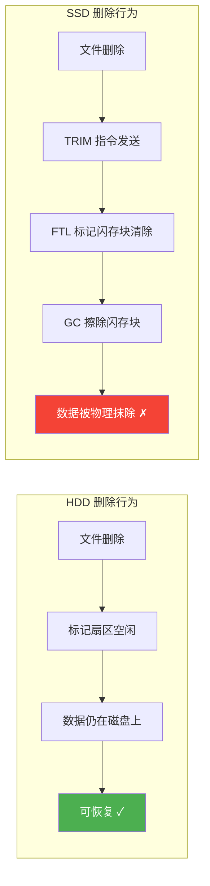
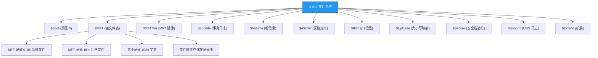
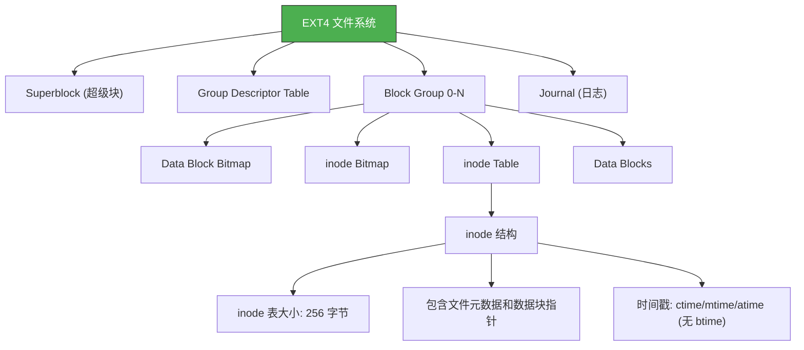
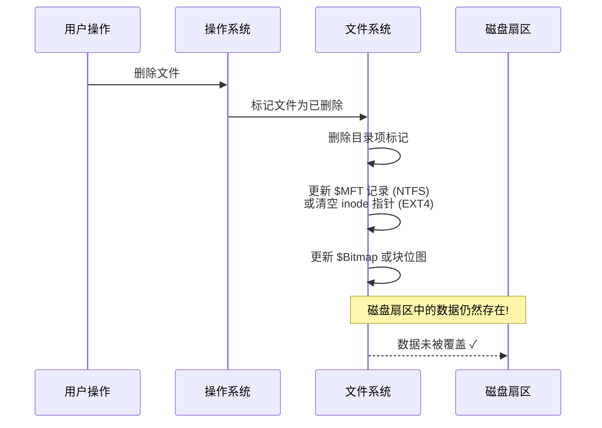
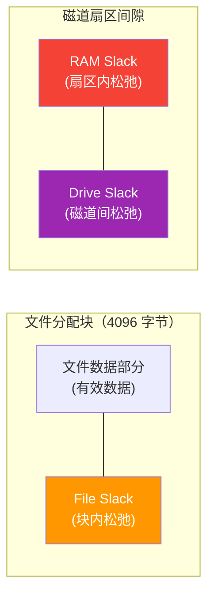
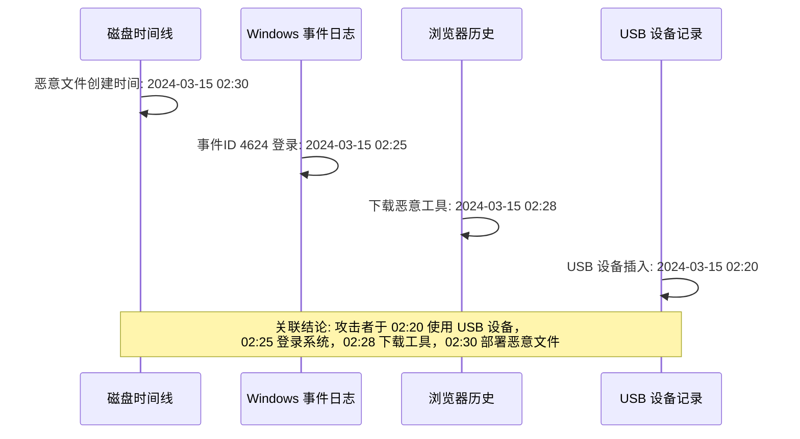

# 25.1 磁盘取证技术

磁盘取证是数字取证最基础也是最成熟的分支。攻击者留下的恶意程序、删除的日志文件、浏览器的历史记录——绝大部分证据都存储在磁盘上。根据 NIST SP 800-86《将取证技术集成到事件响应中的指南》，磁盘取证在整个数字取证流程中承担了约 60% 的证据采集量，是几乎所有数字犯罪案件的必经环节。

本节从存储介质的物理原理讲起，系统地介绍取证环境搭建、镜像制作、文件系统深度分析、已删除文件恢复和时间线重建技术，每一步都给出可复现的操作命令和真实场景说明。

```mermaid
graph TD
    A["💾 磁盘取证技术体系"] --> B["📀 镜像制作"]
    A --> C["📁 文件系统分析"]
    A --> D["🔄 已删除文件恢复"]
    A --> E["📅 时间线分析"]
    A --> F["🛡️ 反取证检测"]
    A --> G["🔐 磁盘加密取证"]
    A --> H["☁️ 虚拟化/云磁盘取证"]

    B --> B1["dd / dcfldd"]
    B --> B2["Guymager"]
    B --> B3["E01 / AFF 格式"]
    B --> B4["远程镜像采集"]

    C --> C1["NTFS: $MFT / $LogFile / $UsnJrnl"]
    C --> C2["EXT4: inode / journal / extent"]
    C --> C3["APFS: 容器与快照"]
    C --> C4["FAT/exFAT: 移动存储"]

    D --> D1["数据雕刻 (Data Carving)"]
    D --> D2["文件签名恢复"]
    D --> D3["SLACK空间分析"]
    D --> D4["NTFS MFT残留"]

    E --> E1["mactime bodyfile"]
    E --> E2["Plaso / log2timeline"]
    E --> E3["NTFS $UsnJrnl 时间线"]
    E --> E4["跨源关联分析"]

    F --> F1["Anti-Forensics检测"]
    F --> F2["隐藏分区识别"]
    F --> F3["数据擦除痕迹"]

    G --> G1["BitLocker / LUKS / FileVault"]
    G --> G2["VeraCrypt / TrueCrypt"]
    G --> G3["密钥提取与恢复"]

    H --> H1["VMDK / VHDX / qcow2"]
    H --> H2["快照与增量分析"]
    H --> H3["云存储取证"]

    style A fill:#E91E63,stroke:#333,color:#fff
    style B fill:#2196F3,stroke:#333,color:#fff
    style C fill:#4CAF50,stroke:#333,color:#fff
    style D fill:#FF9800,stroke:#333,color:#fff
    style E fill:#9C27B0,stroke:#333,color:#fff
    style F fill:#f44336,stroke:#333,color:#fff
    style G fill:#795548,stroke:#333,color:#fff
    style H fill:#607D8B,stroke:#333,color:#fff
```



## 25.1.1 磁盘物理结构与取证原理

### 磁盘存储基础

在开始任何磁盘取证操作之前，必须理解存储介质的物理结构——这决定了你能在什么层面看到数据、以及为什么某些数据"删除了还在"。不同存储介质的物理特性直接决定了取证策略的选择和证据存活概率。

**机械硬盘（HDD）**

机械硬盘由多个涂有磁性材料的盘片组成，数据通过磁头在盘片表面的磁化方向来表示 0 和 1。关键物理结构：

| 结构层次 | 说明 | 取证意义 |
|---------|------|---------|
| **盘片（Platter）** | 圆形磁性介质，每张盘片有上下两个记录面 | 一个物理磁盘可能有多个逻辑盘片 |
| **磁道（Track）** | 盘片上同心圆环，从外圈编号 0 开始 | 数据优先写入外圈（速度快） |
| **扇区（Sector）** | 磁道被划分为固定大小的块，传统为 512 字节，现代 4K 扇区为 4096 字节 | 文件系统块大小必须是扇区的整数倍 |
| **柱面（Cylinder）** | 所有盘片上相同半径的磁道集合 | 同柱面数据几乎同时被访问 |
| **HPA（Host Protected Area）** | 硬盘固件保留的隐藏区域，标准 ATA 命令不可见 | 攻击者可利用 HPA 隐藏数据 |
| **DCO（Device Configuration Overlay）** | 由硬盘厂商或工具创建的隐藏区域 | FTK Imager 和 dcfldd 可检测到 DCO |

HDD 的一个重要取证特征：**删除文件时，操作系统只标记空间可用，不擦除磁信号**。这意味着只要没有新的数据覆盖，已删除数据仍然存在于磁盘的物理扇区中。这就是数据恢复和数据雕刻（Data Carving）的物理基础。即使文件被覆写一次，由于磁头定位精度限制，相邻磁道上可能残留微弱的旧信号——这被称为"影子数据"（Shadow Data），但需要磁力显微镜（MFM）等昂贵的实验室设备才能检测，且成功率无法保证。

**固态硬盘（SSD）**

SSD 使用 NAND 闪存芯片存储数据，与 HDD 有根本性差异：



SSD 取证面临的核心挑战：

- **TRIM 机制**：操作系统在文件删除后会发送 TRIM 指令，SSD 控制器据此物理擦除闪存页面。启用 TRIM 的 SSD 上，已删除数据在数分钟到数小时内被永久擦除，传统数据雕刻基本失效。Windows 7+ 默认对 SSD 启用 TRIM，Linux 需要 `discard` 挂载选项或定期运行 `fstrim`。
- **磨损均衡（Wear Leveling）**：SSD 控制器在后台不断搬移数据块以平衡闪存芯片磨损，导致同一逻辑地址的数据可能存储在不同物理位置。这意味着简单地覆写某个文件，实际上可能只覆盖了旧数据的一个逻辑映射，原始数据仍然残留在其他物理块中。
- **垃圾回收（GC）**：SSD 控制器自主进行垃圾回收，即使没有 TRIM，长时间未使用的数据块也可能被擦除。GC 的触发时机由固件算法决定，不同厂商的行为差异很大。
- **写放大与过度配置（Over-Provisioning）**：SSD 预留的额外空间中可能保留着已删除数据的副本，但标准工具无法直接访问。通常 SSD 会预留 7%-28% 的容量用于过度配置，这些空间对操作系统不可见。
- **SLC 缓存（SLC Cache）**：现代 TLC/QLC SSD 使用部分 NAND 作为 SLC 缓存来提升写入性能。SLC 缓存中的数据状态与主存储区域不同，可能在 GC 触发前保留更长时间。

**SSD 取证应对策略**：

1. 优先使用硬件写保护设备，防止 TRIM 在连接时触发
2. 尽快完成镜像——SSD 上数据的"存活窗口"极短（可能只有几分钟）
3. 禁用操作系统的 TRIM（Windows: `fsutil behavior set DisableDeleteNotify 1`；Linux: 挂载时使用 `discard=off` 或移除 `/etc/fstab` 中的 `discard` 选项）
4. 考虑芯片级提取（Chip-Off）或使用 PC-3000 Flash 等专业设备读取原始 NAND 数据
5. 注意：写保护设备应位于 SSD 与系统之间，否则系统启动时可能已发送 TRIM
6. 对于已启用 TRIM 的 SSD，在取证报告中明确说明数据恢复的局限性

**NVMe SSD 的特殊取证考量**

NVMe（Non-Volatile Memory Express）SSD 通过 PCIe 总线直接连接，与传统 SATA SSD 有显著区别：

| 特性 | SATA SSD | NVMe SSD | 取证影响 |
|-----|----------|----------|---------|
| **接口协议** | AHCI | NVMe | 需要不同的写保护设备 |
| **命令队列深度** | 32 | 65535 | TRIM 执行更快，数据存活窗口更短 |
| **TRIM 命令** | 逐条处理 | 批量处理（Deallocate） | 批量 TRIM 导致数据大面积快速消失 |
| **加密** | 可选（ATA Security） | 通常内置（AES-256 自加密） | 密码遗忘后数据可能永久不可访问 |
| **物理形态** | 2.5 英寸 | M.2 / U.2 / AIC | 需要专用写保护适配器 |

```bash
# 识别 NVMe 设备
nvme list
# 输出示例：
# Node             SN                   Model                    Namespace Usage
# /dev/nvme0n1     S4EWNX0N123456       Samsung 980 PRO 1TB      1         500.11 GB / 1 TB

# 查看 NVMe 设备详细信息（取证前必做）
sudo nvme id-ctrl /dev/nvme0n1
# 关注以下字段：
# - OACS: Optional Admin Command Support（是否支持安全擦除命令）
# - TNVMUPC: Total NVM Capacity（物理总容量，含过度配置空间）
# - UNVMUPC: Unallocated NVM Capacity（未分配容量）

# 检查 TRIM/Deallocate 状态
sudo nvme get-feature /dev/nvme0n1 -f 0x0b
# 如果返回值 bit 0 = 1，表示 Deallocate 已启用

# NVMe 镜像制作（需要 NVMe 写保护设备）
# 推荐: Tableau T8-NVMe 或 WiebeTech NVMe Bridge
sudo dd if=/dev/nvme0n1 of=/mnt/evidence/case01_nvme.raw \
    bs=4096 conv=noerror,sync status=progress
```

**NVMe 自加密驱动器（SED）的取证挑战**

现代 NVMe SSD 通常内置 AES-256 自加密功能（符合 TCG Opal 规范）。即使不知道密码，数据在 NAND 芯片上始终以加密形式存储。取证影响：

- 如果设备处于"锁定"状态（断电后自动锁定），没有密码或恢复密钥，直接读取 NAND 得到的是加密数据
- 对于启用了 BitLocker + 硬件加密的 Windows 设备，恢复密钥可能存储在 Active Directory 或 Microsoft 账户中
- SED 的加密密钥通常在每次安全擦除时重新生成，旧密钥对应的数据不可恢复

### 存储介质取证难度对比

| 介质类型 | 删除后数据存活时间 | 数据雕刻可行性 | 典型取证场景 | 优先级 |
|---------|------------------|--------------|------------|-------|
| HDD（机械硬盘） | 永久（直到被覆盖） | ★★★★★ 非常高 | 企业服务器、旧台式机 | 高 |
| SATA SSD（TRIM 关闭） | 数天到数周 | ★★★☆☆ 中等 | 旧系统、服务器 | 高 |
| SATA SSD（TRIM 开启） | 数分钟到数小时 | ★☆☆☆☆ 极低 | 个人电脑、笔记本 | 中 |
| NVMe SSD | 数秒到数分钟 | ★☆☆☆☆ 极低 | 高端笔记本、工作站 | 低 |
| USB 闪存 | 数天到数月（取决于控制器） | ★★★☆☆ 中等 | 便携存储 | 中 |
| SD 卡 | 数周到数月 | ★★★★☆ 较高 | 相机、手机 | 中 |
| RAID 阵列 | 取决于底层介质 | 取决于 RAID 级别 | 服务器 | 高 |

## 25.1.2 取证环境准备

取证操作的可靠性始于环境准备。一个不规范的环境可能在第一步就破坏证据。根据 ISO 27037 标准，证据采集环境必须满足"不改变原始证据"的基本原则。

### 写保护设备

**硬件写保护（强烈推荐）**

硬件写保护是连接目标磁盘和取证计算机的物理设备，能从电气层面阻断写入信号——无论操作系统或软件如何操作，数据都无法被修改。

| 设备类型 | 代表产品 | 适用场景 | 价格区间 |
|---------|---------|---------|---------|
| **SATA/IDE 写保护器** | Tableau T35689iu、WiebeTech UltraDock | 常规 HDD/SSD 镜像 | ¥2000-8000 |
| **USB 写保护器** | Tableau T8-R2、WiebeTech USB 3.0 Bridge | U盘、移动硬盘 | ¥1500-5000 |
| **NVMe 写保护器** | Tableau T8-NVMe | M.2 NVMe SSD | ¥3000-10000 |
| **多功能一体机** | CRU Forensic UltraDock v5 | 多接口兼容 | ¥4000-12000 |
| **PCIe 写保护卡** | Tableau T356789 | 服务器环境直连 | ¥5000+ |

硬件写保护器通常有一个"写保护"物理开关。**上电前**必须确认开关处于保护位置。部分高端设备（如 Tableau 系列）带有 LED 指示灯，绿色表示写保护已激活，红色表示写入允许——取证场景下必须看到绿灯。

**软件写保护**

当没有硬件设备时，可以通过软件方式阻断写入（仅作为备选方案）：

```bash
# Linux: 使用 udev 规则设置设备为只读
# 编辑 /etc/udev/rules.d/99-write-block.rules
ACTION=="add", SUBSYSTEM=="block", ENV{ID_BUS}=="usb", ATTR{ro}="1"

# 或者在挂载时强制只读
mount -o ro,noexec,nouuid /dev/sdb1 /mnt/evidence

# 使用 blockdev 设置设备为只读
blockdev --setro /dev/sdb
# 验证
blockdev --getro /dev/sdb
# 应输出 1（只读）

# 使用 udev 禁用自动挂载
# 编辑 /etc/udev/rules.d/85-no-automount.rules
# ACTION=="add", SUBSYSTEM=="block", ENV{UDISKS_AUTO}="0"

# Windows: 使用注册表禁用自动挂载写入
# HKEY_LOCAL_MACHINE\SYSTEM\CurrentControlSet\Services\USBSTOR
# 设置值为 4 可禁止 USB 存储设备写入
# 或使用 FTK Imager 的"物理驱动器写保护"功能

# 验证 Windows 写保护状态
# fsutil behavior query DisableRemovableWriteCache
```

> ⚠️ **重要警告**：软件写保护不是万无一失的。在某些操作系统（特别是 Windows）中，自动挂载机制可能在你设置写保护之前就已经向设备发送了写入命令。对于 SSD，这种写入可能触发 TRIM。**永远优先使用硬件写保护**。

### 取证启动盘

为避免目标系统的操作系统修改磁盘数据（Windows 的自动挂载、SSD 的 TRIM、Linux 的 journal replay 等），取证操作通常在专用的取证启动环境中进行：

**CAINE（Computer Aided INvestigative Environment）**

CAINE 是专门设计的 Linux 取证发行版，特点：

- 所有挂载默认只读
- 内置主流取证工具（Autopsy、The Sleuth Kit、Guymager、Volatility 等）
- 写保护 udev 规则已预配置
- 启动后自动禁止网络连接（防止远程擦除）
- 提供 GUI 和 CLI 两种界面
- 支持自定义模块扩展

```bash
# 下载 CAINE（官网: https://www.caine-live.net/）
# 制作启动盘
sudo dd if=caine13.0.iso of=/dev/sdX bs=4M status=progress

# 启动后选择 "CAINE Forensics Mode"
# 该模式下：
# - 所有内部/外部磁盘自动只读挂载
# - swap 分区不激活
# - 系统不写入任何临时文件到目标磁盘
```

**SIFT Workstation（SANS Investigative Forensic Toolkit）**

SIFT 是 SANS 研究所维护的取证工具集，可以作为独立虚拟机或 Ubuntu 包安装：

```bash
# 安装 SIFT CLI
wget https://raw.githubusercontent.com/sans-dfir/sift-cli/master/sift-cli-linux
chmod +x sift-cli-linux
sudo mv sift-cli-linux /usr/local/bin/sift

# 安装 SIFT 工具集
sudo sift install

# 验证安装
sudo sift status
```

SIFT 的优势在于工具更新及时、社区活跃，且可以集成到已有的 Ubuntu 系统中，适合日常使用取证工具的安全团队。

**构建自定义取证 USB**

```bash
# 步骤 1: 创建持久化存储分区
sudo fdisk /dev/sdX
# 创建分区: 分区1 为 ISO（4GB+），分区2 为持久化数据

# 步骤 2: 写入 ISO
sudo dd if=sift.iso of=/dev/sdX1 bs=4M status=progress

# 步骤 3: 创建持久化分区
sudo mkfs.ext4 -L persistence /dev/sdX2
sudo mount /dev/sdX2 /mnt
echo "/ union" | sudo tee /mnt/persistence.conf
sudo umount /mnt

# 步骤 4: 安装自定义取证脚本到持久化分区
# 可以将常用脚本、哈希字典、YARA 规则等打包到持久化分区
```

### 证据编号与标记规范

在打开任何证据之前，必须建立标准化的编号系统。证据编号是证据链（Chain of Custody）的基础——如果无法证明证据从采集到法庭呈堂的每一个环节都受到妥善保护，证据可能被排除。

以下是一个实际案件的证据标记模板：

```yaml
# evidence_tag.yaml — 证据标签模板
case_id: "CASE-2024-0156"
examiner: "张三（司法鉴定人资质编号：XXXXX）"
collection_date: "2024-03-15T09:30:00+08:00"
collection_location: "北京市朝阳区XX大厦3层服务器机房"

evidence_items:
  - id: "E001"
    description: "嫌疑员工办公电脑主机（含 1 块 1TB SATA HDD）"
    serial_number: "WD-WCC4N6VKR123"
    condition: "已关机，电源线已拔除"
    hash_before: "SHA-256: a1b2c3d4e5f6..."  # 镜像前
    hash_after: "SHA-256: a1b2c3d4e5f6..."   # 镜像后（应一致）
    storage_location: "证据室 A-柜3-层2"
    custody_log:
      - time: "2024-03-15T09:30:00+08:00"
        action: "发现并扣押"
        person: "李四（安全主管）"
        witness: "王五（IT工程师）"
      - time: "2024-03-15T10:15:00+08:00"
        action: "移交取证实验室"
        from: "李四"
        to: "张三（鉴定人）"
```

### 法庭证据标准

磁盘取证结果要作为法庭证据使用，必须满足以下条件：

1. **相关性（Relevance）**：证据必须与案件事实相关
2. **完整性（Completeness）**：必须证明镜像完整复制了原始磁盘
3. **可靠性（Reliability）**：使用的工具和方法必须经过验证
4. **可重复性（Repeatability）**：其他合格取证人员使用相同方法应得到相同结果
5. **证据链完整性（Chain of Custody）**：从采集到呈堂的每一步都必须有记录

```bash
# 验证工具可靠性
# 1. 使用 NIST CFTT（Computer Forensic Tool Testing）认证的工具
#    https://www.nist.gov/programs-projects/computer-forensics-tool-testing
# 2. 记录所有工具的版本号
dcfldd --version
ewfinfo --version
fls -V

# 3. 对已知测试镜像进行验证（Known Good Test）
#    使用 CFReDS（Computer Forensic Reference Data Sets）提供的测试镜像
#    https://cfreds.nist.gov/
```

## 25.1.3 磁盘镜像制作

磁盘镜像是将目标存储介质的全部数据（包括已删除文件、未分配空间、Slack空间）按位复制到一个或多个文件中的过程。镜像是后续所有分析的基础——**永远不要直接在原始证据盘上进行分析**。

### dd：最基础的镜像工具

dd 是 Unix/Linux 系统内置的磁盘复制工具，功能简单但可靠。

```bash
# === 基础镜像制作 ===
# if=输入文件(设备), of=输出文件(镜像)
# bs=块大小, conv=noerror(遇错误继续) sync(填充零字节)
sudo dd if=/dev/sda of=/mnt/evidence/case01_sda.raw \
    bs=4096 conv=noerror,sync \
    status=progress 2>&1 | tee /mnt/evidence/dd_log.txt

# === 哈希验证（镜像前后必须做）===
# 镜像前：计算原始磁盘哈希
sudo sha256sum /dev/sda | tee /mnt/evidence/hash_source.txt
# 输出类似: a3f2b8c9d1e4...  /dev/sda

# 镜像后：计算镜像文件哈希
sha256sum /mnt/evidence/case01_sda.raw | tee /mnt/evidence/hash_image.txt
# 输出类似: a3f2b8c9d1e4...  /mnt/evidence/case01_sda.raw

# 比对两个哈希值，必须完全一致
diff /mnt/evidence/hash_source.txt /mnt/evidence/hash_image.txt
# 如果 diff 无输出 → 哈希一致 → 镜像完整 ✓
```

dd 的参数详解：

| 参数 | 含义 | 取证建议 |
|-----|------|---------|
| `if=` | 输入文件（设备路径或文件） | 设备路径如 `/dev/sda` |
| `of=` | 输出文件（镜像路径） | 存储在独立的证据盘上 |
| `bs=` | 每次读写的字节数 | 4096（4K 扇区兼容） |
| `conv=noerror` | 遇到读取错误继续 | **必须设置**，防止坏扇区导致中断 |
| `conv=sync` | 坏扇区填充零字节 | 与 noerror 配合，保持镜像大小一致 |
| `status=progress` | 显示实时进度 | 方便监控 |
| `count=` | 只复制前 N 个块 | 取证时不要设置（应复制全盘） |

**dd 的局限性**：

- 不支持并行读写（速度受限于单线程）
- 没有内置哈希校验（需手动计算）
- 坏扇区处理能力有限
- 不支持断点续传
- 无取证元数据记录

### dcfldd：取证增强版 dd

dcfldd 是美国国防部计算机取证实验室（DCFL）开发的 dd 增强版，专为取证场景设计：

```bash
# dcfldd 核心优势：内置哈希计算
sudo dcfldd if=/dev/sda \
    of=/mnt/evidence/case01_sda.raw \
    hash=sha256 \
    hashlog=/mnt/evidence/hash.log \
    hashwindow=1G \      # 每 GB 计算一次中间哈希
    bs=4096 \
    conv=noerror,sync \
    statusinterval=10 \  # 每 10 秒显示进度
    2>&1 | tee /mnt/evidence/dcfldd_log.txt

# hash.log 文件内容示例：
# Total (SHA-256): a3f2b8c9d1e4f5a6...
# 0-1073741824: b1c2d3e4f5a6b7c8...
# 1073741824-2147483648: d9e0f1a2b3c4d5e6...
# ...
```

**dcfldd 高级功能**：

```bash
# 功能 1: 分段镜像（当证据盘大于单个文件系统限制时）
sudo dcfldd if=/dev/sda \
    hash=sha256 hashlog=/mnt/evidence/hash.log \
    of=/mnt/evidence/case01_sda.raw \
    split=4G \           # 每 4GB 分割一个文件
    conv=noerror,sync bs=4096

# 功能 2: 多路输出（同时制作两份镜像，实现冗余）
sudo dcfldd if=/dev/sda \
    hash=sha256 hashlog=/mnt/evidence/hash.log \
    of=/mnt/evidence/case01_sda.raw \
    of=/mnt/evidence2/case01_sda_backup.raw \
    conv=noerror,sync bs=4096

# 功能 3: 模式匹配（在镜像过程中搜索关键字）
sudo dcfldd if=/dev/sda \
    of=/mnt/evidence/case01_sda.raw \
    pattern="password" \  # 在数据流中搜索 "password"
    conv=noerror,sync bs=4096

# 功能 4: 验证已有镜像
sudo dcfldd vf=/mnt/evidence/case01_sda.raw \
    verifylog=/mnt/evidence/verify.log

# 功能 5: 使用已知哈希验证镜像完整性
sudo dcfldd vf=/mnt/evidence/case01_sda.raw \
    hash=sha256 verifylog=/mnt/evidence/verify.log \
    2>&1 | tee /mnt/evidence/verify_output.txt
```

### Guymager：图形化取证镜像工具

Guymager 是开源社区最常用的 GUI 镜像工具，支持同时制作多个镜像、自动验证哈希，适合不习惯命令行的取证人员：

```bash
# 启动 Guymager（需要 root 权限）
sudo guymager

# GUI 操作流程：
# 1. 左侧面板列出所有检测到的磁盘设备
# 2. 右键目标设备 → "Acquire image"
# 3. 选择镜像格式：
#    - Linux dd raw (.raw/.dd/.001)
#    - Expert Witness Format (.E01)
#    - AFF (.aff)
# 4. 填写案件信息（案件编号、鉴定人、描述等）
# 5. 选择哈希算法（MD5 / SHA-1 / SHA-256）
# 6. 启动镜像 → 自动生成 .info 文件记录详细参数
```

Guymager 的 `.info` 文件包含完整的取证元数据，可作为证据链的补充材料。其格式如下：

```ini
[Info]
Description = 硬盘镜像
CaseNumber = CASE-2024-0156
Examiner = 张三
EvidenceNumber = E001
Notes = 嫌疑员工办公电脑主硬盘

[Image]
Type = dd
File = case01_sda.raw

[Acquisition]
Host = forensics-workstation
OS = Ubuntu 22.04
Tool = Guymager 0.8.13
Start = 2024-03-15 10:30:15
End = 2024-03-15 14:22:47
Duration = 13952

[Hashes]
SHA-256 = a3f2b8c9d1e4f5a6b7c8d9e0f1a2b3c4d5e6f7a8b9c0d1e2f3a4b5c6d7e8f9a0
```

### E01 与 AFF 格式对比

| 特性 | dd/raw | E01 (Expert Witness) | AFF (Advanced Forensic Format) |
|-----|--------|---------------------|-------------------------------|
| **压缩** | 不支持 | 内置（默认启用） | 内置（可选） |
| **元数据嵌入** | 不支持（需外部文件） | 内置案件信息、哈希、分段信息 | 内置，可扩展自定义字段 |
| **分段存储** | 需工具支持（dcfldd split） | 内置（默认每段 1.5MB） | 冯诺依曼式文件 |
| **哈希验证** | 外部计算 | 每段独立哈希 + 整体哈希 | 内嵌哈希 |
| **工具兼容性** | 所有工具都支持 | 主流商业/开源工具 | 开源工具为主 |
| **写入性能** | 最快（无压缩开销） | 压缩消耗 CPU | 压缩消耗 CPU |
| **法庭认可度** | 广泛接受 | **业界标准** | 开源社区认可 |
| **恢复能力** | 部分损坏不影响其他部分 | 单段损坏影响该段 | 部分损坏可恢复 |
| **压缩率** | 无（1:1） | 约 40%-70%（取决于数据内容） | 类似 E01 |

**推荐**：正式取证案件优先使用 **E01 格式**。E01 的内置元数据能力符合法庭证据标准，且被 EnCase、FTK、Autopsy、X-Ways 等所有主流取证平台原生支持。dd/raw 格式适合快速预览和学习练习。

```bash
# 使用 ewfacquire 制作 E01 镜像（libewf 工具包）
sudo ewfacquire /dev/sda \
    --case-number CASE-2024-0156 \
    --description "嫌疑员工主硬盘" \
    --examiner "张三" \
    --evidence-number E001 \
    --format E01 \
    --compression-type deflate \
    --segment-size 1500 \    # 每段 1500MB
    --sha256 \               # 计算 SHA-256
    --output /mnt/evidence/case01_sda

# 验证 E01 镜像完整性
sudo ewfverify /mnt/evidence/case01_sda.E01
# 输出：
# Verify: COMPLETE
# SHA-256 hash stored in file matches: YES

# ewfinfo: 查看 E01 镜像元数据
ewfinfo /mnt/evidence/case01_sda.E01

# ewfmount: 将 E01 挂载为只读目录
sudo mkdir /mnt/e01_mount
sudo ewfmount /mnt/evidence/case01_sda.E01 /mnt/e01_mount
# 挂载后会出现 ewf1 文件，可像 raw 镜像一样使用 TSK 工具分析
sudo fls -r -p /mnt/e01_mount/ewf1 | head -20
```

### 远程镜像采集

在无法物理接触目标机器的场景下（如远程数据中心、云服务器），可以通过 SSH 传输：

```bash
# 方案 1: SSH + dd（最简单）
ssh root@target-server "dd if=/dev/sda bs=4096 conv=noerror,sync" \
    | dd of=/mnt/evidence/remote_sda.raw bs=4096

# 方案 2: netcat（速度更快，无需 SSH 加密开销）
# 在取证机上监听
nc -l -p 9999 | dcfldd of=/mnt/evidence/remote_sda.raw \
    hash=sha256 hashlog=/mnt/evidence/hash.log bs=4096

# 在目标机上发送
dd if=/dev/sda bs=4096 conv=noerror,sync | nc forensics-host 9999

# 方案 3: 使用 F-Response（专业远程取证工具）
# F-Response 可以将远程磁盘映射为本地 iSCSI 设备
# 之后像本地盘一样进行镜像

# 方案 4: 使用 ssh + pv 监控进度
ssh root@target-server "dd if=/dev/sda bs=4096 conv=noerror,sync" \
    | pv -s 1T | dd of=/mnt/evidence/remote_sda.raw bs=4096
# pv 命令会显示传输速度、进度百分比和预计剩余时间
```

### 虚拟化磁盘镜像采集

虚拟化环境中的磁盘以文件形式存在，取证方法不同于物理磁盘：

```bash
# === VMware VMDK ===
# VMDK 可能是单文件或分段文件
# 单文件: disk.vmdk
# 分段: disk-s001.vmdk, disk-s002.vmdk, ...

# 使用 qemu-img 转换为 raw 格式
qemu-img convert -f vmdk -O raw /evidence/disk.vmdk /evidence/disk.raw

# 或使用 vmware-mount（需要 VMware Workstation）
vmware-mount /evidence/disk.vmdk /mnt/vmdk

# === Microsoft VHDX ===
# VHDX 是 Hyper-V 的磁盘格式
qemu-img convert -f vhdx -O raw /evidence/disk.vhdx /evidence/disk.raw

# 也可以使用 guestmount（libguestfs 工具包）
sudo apt install libguestfs-tools
sudo guestmount --add /evidence/disk.vhdx --ro --mount /mnt/vhdx

# === QEMU qcow2 ===
qemu-img convert -f qcow2 -O raw /evidence/disk.qcow2 /evidence/disk.raw

# === 虚拟化取证的特殊考量 ===
# 1. 快照分析：虚拟机快照可能保留已删除文件的状态
#    VMDK 快照链：base.vmdk → snap1.vmdk → snap2.vmdk
#    需要合并快照链才能看到完整数据
# 2. 内存快照：如果同时获取了 .vmem 文件，可以与磁盘关联分析
# 3. VM 配置文件：.vmx/.xml 包含虚拟硬件配置、网络设置等
# 4. 已暂停状态：.vmss 文件包含 CPU 寄存器和内存状态
```

### 镜像验证流程

制作镜像后，必须进行严格的完整性验证：

```bash
# 步骤 1: 计算多种哈希（至少两种独立算法）
sha256sum /mnt/evidence/case01_sda.raw > sha256_verify.txt
md5sum /mnt/evidence/case01_sda.raw > md5_verify.txt

# 步骤 2: 与镜像过程中记录的哈希比对
cat hash.log | grep -i "total"
cat sha256_verify.txt
# 两个 SHA-256 必须完全一致

# 步骤 3: 验证镜像大小是否与原始磁盘一致
sudo blockdev --getsize64 /dev/sda
# 原始: 1000204886016 bytes
stat --format="%s" /mnt/evidence/case01_sda.raw
# 镜像: 应该也是 1000204886016 bytes

# 步骤 4: 使用 The Sleuth Kit 验证文件系统可解析
fls /mnt/evidence/case01_sda.raw | head -20
# 应该能看到正常的目录结构

# 步骤 5: 检测镜像中的异常扇区
# 使用 badblocks 验证（仅适用于物理设备）
sudo badblocks -v /dev/sda > /mnt/evidence/badblocks_report.txt

# 步骤 6: 记录验证结果到证据报告
cat << 'REPORT' >> /mnt/evidence/verification_report.txt
镜像验证报告
============
案件编号: CASE-2024-0156
证据编号: E001
原始设备: /dev/sda (WD-WCC4N6VKR123, 1TB)
镜像文件: case01_sda.raw
镜像格式: dd raw
镜像工具: dcfldd 1.3.4-1
验证时间: 2024-03-15 14:30:00

哈希验证:
  原始 SHA-256: a3f2b8c9d1e4f5a6...
  镜像 SHA-256: a3f2b8c9d1e4f5a6...
  结果: ✅ 一致

大小验证:
  原始: 1000204886016 bytes
  镜像: 1000204886016 bytes
  结果: ✅ 一致

文件系统验证:
  fls 解析: ✅ 正常读取目录结构
  结论: 镜像完整可用
REPORT
```

## 25.1.4 文件系统分析

### NTFS 文件系统深度分析

NTFS（New Technology File System）是 Windows 系统的主要文件系统，也是企业环境中磁盘取证最常见的分析对象。NTFS 的核心结构比大多数取证人员意识到的要复杂得多。

**NTFS 关键数据结构**



**$MFT（主文件表）深度解析**

$MFT 是 NTFS 的核心，它是一个特殊的隐藏文件，记录了卷上每一个文件和目录的元数据。每个 MFT 记录固定 1024 字节（1 KB），由文件头和多个属性组成。

MFT 记录中最重要的取证属性：

| 属性类型 | 十六进制 ID | 取证价值 |
|---------|-----------|---------|
| `$STANDARD_INFORMATION` | 0x10 | 文件创建/修改/访问/MFT修改时间、文件属性（只读/隐藏/系统等） |
| `$FILE_NAME` | 0x30 | 文件名（Unicode）、父目录引用、同上四个时间戳但含义不同 |
| `$DATA` | 0x80 | 文件实际内容（小文件直接存在 MFT 记录中，称为"常驻属性"） |
| `$INDEX_ROOT` | 0x90 | 目录索引的根节点 |
| `$INDEX_ALLOCATION` | 0xA0 | 目录索引的扩展（大型目录） |
| `$BITMAP` | 0xB0 | 跟踪哪些 MFT 记录正在使用 |
| `$OBJECT_ID` | 0x40 | 文件的全局唯一标识符 |
| `$REPARSE_POINT` | 0xC0 | 符号链接、挂载点、文件系统过滤器标记 |

**关键取证发现点**：一个文件可能有**两套时间戳**——`$STANDARD_INFORMATION` 中的时间戳和 `$FILE_NAME` 中的时间戳。在大多数情况下它们一致，但：

- 使用 `copy` 命令复制文件时，`$STANDARD_INFORMATION` 的创建时间会被更新为复制时间，但 `$FILE_NAME` 中的时间戳保留原始值
- 某些工具（如 timestomp）会修改 `$STANDARD_INFORMATION` 的时间戳，但忘记修改 `$FILE_NAME` 中的时间戳
- **如果两套时间戳不一致，可能是时间戳篡改的证据**
- 在 NTFS 中，`$STANDARD_INFORMATION` 的位置是固定的（记录头部），而 `$FILE_NAME` 可能在记录的任何位置，这使得篡改 `$FILE_NAME` 时间戳更困难

```bash
# 使用 The Sleuth Kit 查看 MFT 记录详情
# 查看 inode 0（$MFT 本身）
sudo istat /mnt/evidence/case01_sda.raw 0

# 输出示例：
# MFT Entry Header Values:
# Entry: 0        Sequence: 1
# $LogFile Sequence Number: 12345
# ...
# Attributes:
# Type: $STANDARD_INFORMATION (0x10)
#   Created:  2024-01-15 08:30:00 (UTC)
#   Modified: 2024-03-14 22:15:00 (UTC)
#   Accessed: 2024-03-15 09:00:00 (UTC)
#   MFT Modified: 2024-03-14 22:15:00 (UTC)
# Type: $FILE_NAME (0x30)
#   Name: $MFT
#   Created:  2024-01-15 08:30:00 (UTC)
#   Modified: 2024-01-15 08:30:00 (UTC)
# ...

# 使用 fls 列出所有文件（包括已删除的）
# -r: 递归  -m: 输出 bodyfile 格式  -p: 显示路径
sudo fls -r -p -m / /mnt/evidence/case01_sda.raw > bodyfile.txt

# fls 输出中的标记含义：
# r/r: 活动的常规文件
# r/d: 活动的目录
# * r/r: 已删除的常规文件（MFT 记录未被覆盖）
# * r/d: 已删除的目录

# 使用 icat 提取特定文件的内容
sudo icat /mnt/evidence/case01_sda.raw 4567 > /recovery/extracted_file.bin
# 4567 是 MFT 记录编号（inode 号）

# 使用 mmls 查看分区表
sudo mmls /mnt/evidence/case01_sda.raw
# 输出：
# Slot    Start        End          Length       Description
# 00:  Meta    0000000000   0000000000   0000000001   Primary Table (#0)
# 01:  -----   0000000000   0000002047   0000002048   Unallocated
# 02:  00:00   0000002048   0002047999   0002045952   NTFS (0x07)
# 03:  -----   0002048000   0002048063   0000000064   Unallocated

# 获取分区起始偏移（上例中 NTFS 从扇区 2048 开始）
# 偏移 = 2048 × 512 = 1048576 字节
# 在后续命令中使用偏移量
sudo fls -r -p -f ntfs -o 2048 /mnt/evidence/case01_sda.raw > bodyfile.txt
```

**常驻属性与非常驻属性**

理解 NTFS 属性的存储方式对数据恢复至关重要：

- **常驻属性（Resident Attribute）**：当数据量小于 MFT 记录的可用空间（约 700-800 字节）时，数据直接存储在 MFT 记录中。这意味着即使文件的数据运行（Data Run）被清除，数据仍可能保留在 MFT 中。
- **非常驻属性（Non-Resident Attribute）**：数据量较大时，MFT 记录中只存储数据运行（Data Run）——即数据在磁盘上的位置列表。文件被删除后，数据运行可能被清零，但数据本身仍留在原来的磁盘位置。

```bash
# 使用 istat 查看属性是否常驻
sudo istat -f ntfs -o 2048 /mnt/evidence/case01_sda.raw 4567
# 如果 $DATA 属性显示 "Resident: yes"，数据在 MFT 中
# 如果 "Resident: no"，会显示数据运行（Data Run）列表

# 提取常驻数据的特殊情况
# 即使文件已被删除且 MFT 记录被标记为未分配
# 常驻数据可能仍保留在 MFT 的残留记录中
# 使用 analyzeMFT.py 扫描所有 MFT 记录寻找残留数据
```

**$LogFile（$MFT 记录 2）分析**

$LogFile 是 NTFS 的事务日志，记录了文件系统元数据的修改操作。当系统异常关机后，Windows 使用 $LogFile 进行回滚（Rollback）或重做（Redo），保证文件系统一致性。对取证而言，$LogFile 是一个信息宝库：

- 记录了文件的**创建、修改、重命名、删除**操作的事务
- 包含事务发生时的 MFT 记录编号
- 事务头包含序列号，可与 $UsnJrnl 关联
- $LogFile 的大小通常是文件系统总大小的 1%（可配置）

```bash
# 使用 UsnJrnl2Csv 解析 $LogFile（需要 Python 环境）
# 或使用 log_file_parser 项目（GitHub 上开源）
pip install ntfs-logfile-parser

# 使用 The Sleuth Kit 的 fsstat 查看文件系统配置
sudo fsstat -f ntfs -o 2048 /mnt/evidence/case01_sda.raw
# 注意输出中的 "$LogFile" 部分，包含日志大小等信息
```

**$UsnJrnl（$MFT 记录 32-35）分析**

$UsnJrnl（Update Sequence Number Journal）是 NTFS 的另一个重要取证来源。它记录了卷上所有文件的修改历史，包含：

- 修改类型（创建、删除、重命名、数据覆写等）
- 修改的文件名
- 修改的 MFT 记录编号
- 时间戳
- 父目录信息

```bash
# $UsnJrnl 存储在两个数据流中：
# $UsnJrnl:$J — 日志数据本身（环形缓冲区）
# $UsnJrnl:$MAX — 最大日志大小

# 使用 UsnJrnl2Csv 提取日志内容
# 下载: https://github.com/jschicht/UsnJrnl2Csv
UsnJrnl2Csv.exe /UsnJrnlFile:$J /OutputPath:C:\output\

# 或使用 Python 工具
pip install usnparser
python -m usnparser /mnt/evidence/case01_sda.raw --offset 2048 --output usn_log.csv

# UsnJrnl 日志字段说明：
# MajorVersion / MinorVersion: 日志格式版本
# FileReferenceNumber: MFT 记录号
# ParentFileReferenceNumber: 父目录 MFT 记录号
# Usn: 更新序列号（唯一递增）
# Timestamp: 操作时间
# Reason: 操作类型（十六进制代码）
#   0x00000001: DATA_EXTEND (文件数据扩展)
#   0x00000002: DATA_TRUNCATION (文件数据截断)
#   0x00000004: DATA_OVERWRITE (文件数据覆写)
#   0x00000010: FILE_CREATE (文件创建)
#   0x00000020: FILE_DELETE (文件删除)
#   0x00000040: RENAME_NEW_NAME (重命名为新名称)
#   0x00000080: RENAME_OLD_NAME (旧文件名)
#   0x00000100: CLOSE (文件关闭)
#   0x00008000: CLOSE (文件关闭，Windows 8+)
#   0x00200000: FILE_DELETE (文件删除, Windows 8+)
# FileName: 操作涉及的文件名
```

$UsnJrnl 的取证价值：即使攻击者删除了文件并清空了回收站，$UsnJrnl 中仍可能保留着文件被删除的记录（直到日志缓冲区被新记录覆盖）。它可以帮助回答"攻击者在什么时间删除了什么文件"这类关键问题。

**NTFS 回收站取证**

Windows 回收站保留了删除操作的关键元数据：

```bash
# Windows 回收站路径
# Windows Vista+: C:\$Recycle.Bin\<SID>\
# 每个已删除文件对应两个文件：
#   $I<随机名>.<扩展名> — 包含原始路径和删除时间
#   $R<随机名>.<扩展名> — 包含文件实际内容

# $I 文件格式（Windows Vista+）：
# 偏移 0x00: 头部大小（通常为 0x18 = 24 字节）
# 偏移 0x08: 文件大小（8 字节）
# 偏移 0x10: 删除时间（FILETIME 格式，8 字节）
# 偏移 0x18: 原始文件路径（Unicode）

# 使用 TSK 提取回收站内容
# 查找回收站目录
sudo fls -r -p -f ntfs -o 2048 /mnt/evidence/case01_sda.raw | grep -i "recycle"

# 提取 $I 文件并解析原始路径
# 使用 Python 脚本解析 $I 文件
python3 << 'PYTHON'
import struct
import sys

def parse_i_file(filepath):
    with open(filepath, 'rb') as f:
        header_size = struct.unpack('<Q', f.read(8))[0]
        file_size = struct.unpack('<Q', f.read(8))[0]
        filetime = struct.unpack('<Q', f.read(8))[0]
        # FILETIME 转 Unix 时间戳
        unix_ts = (filetime - 116444736000000000) / 10000000
        path = f.read(header_size - 24).decode('utf-16-le').rstrip('\x00')
        print(f"原始路径: {path}")
        print(f"文件大小: {file_size} bytes")
        print(f"删除时间: {unix_ts}")
PYTHON
```

### EXT4 文件系统深度分析

EXT4 是 Linux 系统最常用的文件系统，其结构与 NTFS 有本质区别。

**EXT4 关键结构**



**inode 结构详解**

每个 inode 占 256 字节（默认配置），包含以下关键信息：

| 字段 | 大小 | 取证价值 |
|-----|------|---------|
| `i_mode` | 2 字节 | 文件类型和权限（普通文件/目录/符号链接/设备等） |
| `i_size_lo / i_size_hi` | 8 字节 | 文件大小 |
| `i_atime` | 4 字节 | 最后访问时间 |
| `i_ctime` | 4 字节 | inode 变更时间（不是创建时间！） |
| `i_mtime` | 4 字节 | 最后数据修改时间 |
| `i_dtime` | 4 字节 | **删除时间**（文件删除时被设置，这是 EXT4 独有的取证线索） |
| `i_block` | 60 字节 | 数据块指针（前 12 个直接指针 + 间接/双间接/三间接指针，或 extent 树） |
| `i_flags` | 4 字节 | 文件标志（安全删除、不可变、追加模式等） |

**关键取证发现点**：EXT4 的 `i_dtime`（删除时间）字段在文件被删除时被设置为当前时间戳。通过扫描未分配的 inode，可以获取已删除文件的精确删除时间。这是 EXT4 取证中最有价值的发现之一。

```bash
# 使用 The Sleuth Kit 分析 EXT4

# 查看文件系统信息
sudo fsstat -f ext -o 0 /mnt/evidence/case01_sda.raw
# 输出包含：
# - 超级块信息（块大小、inode 大小、块组数量等）
# - 日志 inode 号
# - 挂载状态
# - 日志状态

# 列出所有文件（包括已删除的）
sudo fls -r -p -f ext /mnt/evidence/case01_sda.raw

# 查看 inode 详情（特别是 i_dtime）
sudo istat -f ext /mnt/evidence/case01_sda.raw 12345
# 输出：
# inode: 12345
# Allocated
# uid / gid: 1000 / 1000
# mode: rrw-r--r--
# size: 45678
# ...
# Accessed:  2024-03-14 22:00:00 (UTC)
# File Modified: 2024-03-14 21:30:00 (UTC)
# inode Changed: 2024-03-14 22:15:00 (UTC)
# Deleted: 2024-03-14 22:15:00 (UTC)  ← 删除时间

# 提取已删除文件
sudo tsk_recover /mnt/evidence/case01_sda.raw /recovery/

# 使用 debugfs 直接读取 EXT4 结构
sudo debugfs /mnt/evidence/case01_sda.raw
# debugfs 交互命令：
# stat <inode> — 查看 inode 详细信息
# ls -d <inode> — 列出目录内容（包括已删除的）
# dump <inode> <output_file> — 导出文件内容
# htree <inode> — 查看目录的 HTree 索引
# undelete <inode> <output_file> — 尝试恢复已删除文件（实验性）
```

**EXT4 日志（Journal）分析**

EXT4 日志记录了文件系统元数据的操作。日志通常存储在 inode 8 中：

```bash
# 查看日志 inode
sudo istat -f ext /mnt/evidence/case01_sda.raw 8

# 使用 journalctl 工具（如果镜像挂载为 loop 设备）
sudo losetup -f -P /mnt/evidence/case01_sda.raw
sudo mount -o ro /dev/loop0p1 /mnt/loop
sudo dmesg | grep ext4  # 查看内核日志中的 EXT4 操作

# EXT4 日志的三种模式：
# data=journal: 所有数据都写入日志（最慢但最安全）
# data=ordered: 只写元数据到日志，数据先于元数据提交（默认）
# data=writeback: 只写元数据到日志（最快但可能数据不一致）
# 取证意义：data=ordered 模式下，日志中的元数据记录可追溯数据操作

# 使用 jls 查看日志内容（The Sleuth Kit）
sudo jls -f ext -o 0 /mnt/evidence/case01_sda.raw
# 输出显示日志块号和对应的文件系统块

# 使用 jcat 提取特定日志块
sudo jcat -f ext -o 0 /mnt/evidence/case01_sda.raw 1234 > journal_block.bin
```

### FAT/exFAT 文件系统

FAT 文件系统仍然广泛用于 U 盘、SD 卡等移动存储设备：

```bash
# FAT 文件系统特征：
# - 没有日志
# - 没有安全属性（ACL）
# - 删除文件时：文件名首字节改为 0xE5，FAT 表清零
# - 目录条目包含：文件名、属性、创建时间、修改时间、起始簇号、大小

# 使用 fls 查看 FAT 文件系统
sudo fls -r -p -f fat /mnt/evidence/usb_image.raw
# 已删除文件显示为 * r/r，文件名的首字符可能丢失
# 但目录条目的其余信息（时间、大小、起始簇）可能保留

# 使用 testdisk 恢复 FAT 文件
sudo testdisk /mnt/evidence/usb_image.raw
# 选择 FAT → Advanced → 选择已删除文件 → Copy

# FAT 目录条目结构（32 字节）：
# 偏移 0x00: 文件名（8 字节）+ 扩展名（3 字节）
#   首字节 0xE5 = 已删除，0x00 = 后面无条目
# 偏移 0x0B: 文件属性（0x01=只读, 0x02=隐藏, 0x04=系统, 0x08=卷标, 0x0F=长文件名, 0x10=目录）
# 偏移 0x14: 创建时间（高 2 字节）+ 创建日期（高 2 字节）
# 偏移 0x16: 修改时间（2 字节）+ 修改日期（2 字节）
# 偏移 0x1A: 起始簇号（2 字节）— 关键恢复信息
# 偏移 0x1C: 文件大小（4 字节）

# exFAT 额外特征：
# - 支持大于 4GB 的文件
# - 有位图分配表（Bitmap Allocation Table）
# - 删除文件时位图表被清零，但仍可从目录条目获取起始簇和大小
```

### APFS 文件系统（macOS）

APFS（Apple File System）是 macOS 10.13+ 的默认文件系统，引入了容器（Container）和快照（Snapshot）的概念：

```bash
# APFS 特征：
# - 容器（Container）: 一个物理分区可包含多个 APFS 卷
# - 快照（Snapshot）: 文件系统的时间点副本，可能保留已删除数据
# - 克隆（Clone）: 文件复制时不立即占用额外空间
# - 加密（Encryption）: 支持全卷加密（FileVault）
# - 崩溃保护（Crash Protection）: 使用 copy-on-write 保证一致性

# 使用 APFS Fuse 在 Linux 上挂载
sudo mount -t apfs -o ro /mnt/evidence/macos.raw /mnt/apfs

# 使用 apfs-fuse 工具
# GitHub: https://github.com/sgan81/apfs-fuse
sudo apfs-fuse /mnt/evidence/macos.raw /mnt/apfs

# APFS 取证要点：
# 1. 快照分析：列出所有快照，比较快照间的差异
#    快照可能保留已删除文件的完整内容
# 2. 容器分析：一个容器可能包含系统卷、数据卷、恢复卷
#    使用 diskutil apfs list 查看容器结构
# 3. 加密卷：FileVault 2 使用 AES-XTS-128 加密
#    恢复密钥可能存储在 iCloud 或 MDM 中
# 4. 克隆文件：两个文件可能共享相同的数据块
#    修改一个文件不会影响另一个的旧数据
```

## 25.1.5 已删除文件恢复

文件被删除后，数据并不会立即从磁盘上消失。理解"删除"的本质是恢复技术的基础。

### 文件删除机制



三种删除级别的恢复难度：

| 删除方式 | 删除机制 | 恢复难度 | 恢复方法 |
|---------|---------|---------|---------|
| **常规删除** | 标记空间可用，元数据保留 | ★☆☆☆☆ 最容易 | 文件系统级恢复（extundelete、testdisk） |
| **Shift+Delete** | 跳过回收站，MFT/inode 标记删除 | ★★☆☆☆ 较易 | MFT 残留分析 + 数据雕刻 |
| **格式化** | 重建文件系统结构 | ★★★☆☆ 中等 | 数据雕刻（文件系统元数据丢失） |
| **快速格式化** | 仅重建根目录和文件系统表 | ★★☆☆☆ 较易 | 大部分数据仍可恢复 |
| **覆盖写入** | 用特定数据覆写扇区 | ★★★★★ 极难 | 磁力显微镜（MFM）等物理方法，成功率极低 |

### 数据雕刻（Data Carving）

数据雕刻是不依赖文件系统元数据的文件恢复技术。原理：大多数文件格式有固定的头部签名（Magic Number）和尾部标记，通过扫描磁盘镜像中所有扇区的字节模式来识别文件边界。

常见文件格式签名：

| 文件类型 | 头部签名（十六进制） | 尾部标记 | 说明 |
|---------|-----------------|---------|------|
| JPEG | `FF D8 FF E0` 或 `FF D8 FF E1` | `FF D9` | 最常见的图片格式 |
| PNG | `89 50 4E 47 0D 0A 1A 0A` | `IEND` + CRC | 无损图片格式 |
| PDF | `25 50 44 46`（%PDF） | `25 25 45 4F 46`（%%EOF） | 文档格式 |
| ZIP / DOCX / APK | `50 4B 03 04`（PK..） | 无固定尾部 | ZIP 格式容器 |
| MP4 / MOV | 任意 + `66 74 79 70`（ftyp） | 无固定尾部 | 视频格式 |
| RAR | `52 61 72 21 1A 07`（Rar!） | 无固定尾部 | 压缩格式 |
| 7z | `37 7A BC AF 27 1C` | 无固定尾部 | 压缩格式 |
| SQLite | `53 51 4C 69 74 65`（SQLite） | 无固定尾部 | 数据库格式 |
| EXE / DLL | `4D 5A`（MZ） | 无固定尾部 | Windows 可执行文件 |
| ELF | `7F 45 4C 46` | 无固定尾部 | Linux 可执行文件 |
| Word 97-2003 | `D0 CF 11 E0 A1 B1 1A E1` | 无固定尾部 | 旧版 Word 文档 |
| Office 2007+ | `50 4B 03 04`（同 ZIP） | `50 4B 05 06` | DOCX/XLSX/PPTX 均为 ZIP 容器 |
| OGG 音频 | `4F 67 67 53`（OggS） | `4F 67 67 53` | 流媒体格式，可嵌套 |
| WAV 音频 | `52 49 46 46`（RIFF） | 无固定尾部 | 无损音频 |

```bash
# === foremost：经典数据雕刻工具 ===
# -t all: 恢复所有支持的文件类型
# -i: 输入镜像  -o: 输出目录
sudo foremost -t all -i /mnt/evidence/case01_sda.raw -o /recovery/foremost/

# foremost 输出结构：
# /recovery/foremost/
# ├── audit.txt          # 恢复审计报告
# ├── jpg/               # 按类型分目录
# │   ├── 00000000.jpg
# │   ├── 00000001.jpg
# ├── pdf/
# ├── zip/
# └── ...

# === scalpel：foremost 的增强版 ===
# 自定义雕刻规则
cat > /tmp/scalpel.conf << 'EOF'
# 格式：文件类型  是否启用  最大大小  头部签名  尾部签名
pdf    y    20000000    %PDF    %%EOF\x0d
jpg    y    5000000     \xff\xd8\xff\xe0    \xff\xd9
png    y    10000000    \x89PNG\x0d\x0a\x1a\x0a    IEND
docx   y    50000000    PK\x03\x04    \x50\x4b\x05\x06
sqlite y    100000000   SQLite format 3    \x00\x00\x00
EOF

sudo scalpel /mnt/evidence/case01_sda.raw -o /recovery/scalpel/ -c /tmp/scalpel.conf

# === bulk_extractor：高级数据分析 ===
# 不仅恢复文件，还提取所有可识别的结构化数据
sudo bulk_extractor -o /recovery/bulk/ /mnt/evidence/case01_sda.raw

# bulk_extractor 输出文件：
# email.txt       — 提取到的所有邮箱地址
# url.txt         — 提取到的所有 URL
# domain.txt      — 提取到的所有域名
# ip.txt          — 提取到的所有 IP 地址
# ccn.txt         — 信用卡号码
# telephone.txt   — 电话号码
# pii.txt         — 个人信息
# aes_keys.txt    — 检测到的 AES 密钥
# elf.txt         — ELF 可执行文件头
# zip.txt         — ZIP 文件头

# === PhotoRec：跨平台数据雕刻 ===
# 交互式界面
sudo photorec /mnt/evidence/case01_sda.raw
# 选择分区 → 选择文件系统类型 → 选择输出目录 → 开始恢复
# PhotoRec 支持 480+ 种文件格式

# 批量模式
sudo photorec /cmd /mnt/evidence/case01_sda.raw fileopt,everything,enable \
    options,paranoid,keep_corrupted_files \
    /d /recovery/photorec/ search
```

### 未分配空间深度分析

未分配空间（Unallocated Space）是文件系统标记为"未使用"的区域，包含已删除文件的残留数据和从未被文件系统管理的原始数据：

```bash
# 提取所有未分配空间
sudo blkls /mnt/evidence/case01_sda.raw > unallocated.bin

# 统计未分配空间大小
sudo blkls /mnt/evidence/case01_sda.raw | wc -c

# 从未分配空间中提取可读文本
strings -n 10 unallocated.bin > unallocated_strings.txt

# 在未分配空间中搜索特定模式
# 搜索邮箱地址
grep -oE '[a-zA-Z0-9._%+-]+@[a-zA-Z0-9.-]+\.[a-zA-Z]{2,}' unallocated_strings.txt

# 搜索 URL
grep -oE 'https?://[^ ]+' unallocated_strings.txt

# 搜索 IP 地址
grep -oE '([0-9]{1,3}\.){3}[0-9]{1,3}' unallocated_strings.txt

# 搜索信用卡号（Luhn 校验）
grep -oE '[0-9]{4}[- ]?[0-9]{4}[- ]?[0-9]{4}[- ]?[0-9]{4}' unallocated_strings.txt

# 使用 binwalk 分析未分配空间中的嵌入文件
binwalk unallocated.bin
# binwalk 可以识别嵌入在其他数据中的文件头
```

### Slack 空间分析

Slack（松弛）空间是文件实际数据与文件系统分配空间之间的间隙。这是被大多数取证人员忽略的证据来源：



- **RAM Slack**：最后一个有效扇区中，文件数据结束到扇区结束的空间。系统可能用内存缓冲区中的随机数据填充。这些"随机数据"可能包含其他程序处理过的敏感信息——在取证案例中，RAM Slack 曾被发现包含密码、加密密钥和电子邮件片段。
- **Drive Slack**：最后一个有效扇区之后、分配块结束之前的所有完整扇区。这些扇区可能包含前一个占用该块的文件的残留数据。

```bash
# 使用 The Sleuth Kit 提取 slack 空间
# fls 的 bodyfile 输出包含文件的块分配信息
# 使用 blkls 提取未分配空间中的数据
sudo blkls -s /mnt/evidence/case01_sda.raw > slack_data.bin

# 使用 strings 从 slack 空间中提取可读文本
strings -n 8 slack_data.bin | head -100

# 使用 dflags 工具查看文件的 slack 大小
sudo ifind /mnt/evidence/case01_sda.raw /path/to/file
# 获取 inode 号后：
sudo fcat /mnt/evidence/case01_sda.raw <inode> > /dev/null 2>&1
# 查看文件占用的块和 slack

# 使用 Sleuth Kit 的 blkcat 提取特定块
# 先获取文件的块列表
sudo istat -f ntfs -o 2048 /mnt/evidence/case01_sda.raw <inode>
# 然后提取最后一个块的内容（包含 slack）
sudo blkcat -f ntfs -o 2048 /mnt/evidence/case01_sda.raw <last_block_number> > last_block.bin
# 分析最后一块中超出文件大小的部分
```

### MFT 残留分析（NTFS 特有）

在 NTFS 中，即使文件被删除且 MFT 记录被复用，旧的 MFT 记录数据可能仍残留在磁盘上。这是 NTFS 取证独有的恢复手段：

```bash
# 扫描整个 $MFT 文件，寻找未分配但仍有数据的记录
# 使用 analyzeMFT.py 工具
pip install analyzeMFT
python analyzeMFT.py -f /mnt/evidence/case01_sda.raw -o mft_analysis.csv

# 分析 MFT 记录中的 $DATA 属性
# 常驻数据（文件 < ~700 字节）直接存储在 MFT 记录中
# 即使文件被删除，常驻数据仍可能保留在 MFT 的未分配记录中

# 使用 MFT Explorer（Eric Zimmerman 工具）
# https://ericzimmerman.github.io/
MFTECmd.exe -f "$MFT" --csv "C:\output"
# 输出包含每个 MFT 记录的详细信息
# 特别关注 "IsDeleted" 列为 True 的记录
```

### 常见文件恢复工具对比

| 工具 | 类型 | 优势 | 劣势 | 适用场景 |
|-----|------|------|------|---------|
| **TestDisk** | 分区恢复 + 文件恢复 | 恢复丢失分区、修复引导扇区 | 不支持深度雕刻 | 分区表损坏、误格式化 |
| **PhotoRec** | 数据雕刻 | 支持 480+ 文件格式、跨平台 | 无法恢复文件名 | 格式化后恢复、深度雕刻 |
| **extundelete** | EXT3/EXT4 文件恢复 | 利用文件系统日志 | 仅支持 EXT3/EXT4 | Linux 删除文件恢复 |
| **foremost** | 数据雕刻 | 简单可靠、支持自定义规则 | 不再维护 | 教学和简单场景 |
| **scalpel** | 数据雕刻 | foremost 增强版、更快 | 配置相对复杂 | 生产环境数据雕刻 |
| **R-Studio** | 商业综合恢复 | 支持多文件系统、RAID | 商业授权费用 | 企业级恢复任务 |
| **UFS Explorer** | 商业综合恢复 | RAID 虚拟重组、高级分析 | 商业授权费用 | 复杂 RAID 和虚拟化环境 |
| **Autopsy** | 综合取证平台 | GUI、插件丰富、免费 | 资源消耗大 | 综合取证分析 |

## 25.1.6 时间线分析

时间线分析是将磁盘取证从"找到文件"提升到"理解事件"的关键步骤。单独的文件恢复只能告诉你"什么文件存在过"，而时间线分析能回答"攻击者在什么时间做了什么"。

### Bodyfile 与 mactime

Bodyfile 是 The Sleuth Kit 定义的标准化文件元数据格式，包含每个文件的完整时间戳信息：

```bash
# 步骤 1: 生成 bodyfile
sudo fls -r -p -m / -f ntfs -o 2048 /mnt/evidence/case01_sda.raw > bodyfile.txt

# bodyfile 格式（每行一个文件）：
# MD5|name|inode|mode_as_string|UID|GID|size|atime|mtime|ctime|crtime
# 0|/Users/suspect/Documents/secret.docx|4567|r/r-rw-rw-rw-|0|0|12800|1710422400|1710418800|1710426000|1710415200

# 步骤 2: 使用 mactime 生成时间线
# -b: bodyfile路径  -d: 输出为 delimited 格式
mactime -b bodyfile.txt -d > timeline_full.csv

# 步骤 3: 过滤特定时间段
# 关注事件发生前后的活动
mactime -b bodyfile.txt -d 2024-03-14..2024-03-16 > timeline_incident.csv

# 步骤 4: 过滤特定时间戳类型
# -z: 时区设置
mactime -b bodyfile.txt -d -z UTC 2024-03-14..2024-03-16 > timeline_utc.csv

# 步骤 5: 按特定文件类型过滤
mactime -b bodyfile.txt -d 2024-03-14..2024-03-16 | grep -i "\.exe\|\.dll\|\.bat\|\.ps1" > timeline_executables.csv
```

时间线 CSV 的关键列：

| 列名 | 含义 | 取证解读 |
|-----|------|---------|
| Date | 日期 | 事件发生日期 |
| Time | 时间 | 事件发生时间 |
| Size | 文件大小 | 大小突变可能表示内容被替换 |
| Type | 时间戳类型 | MACB = Modified/Accessed/Changed/Birth |
| Mode | 权限 | 异常权限可能指示后门 |
| File | 文件路径 | 关注 Temp、Downloads、Desktop 等敏感路径 |

### Plaso / log2timeline：超级时间线

Plaso（log2timeline）是 Google 开源的时间线分析框架，能从多种来源（磁盘镜像、日志文件、注册表、浏览器历史、Windows 事件日志等）提取时间信息并合并为统一的"超级时间线"：

```bash
# 步骤 1: 安装 Plaso
pip install plaso

# 步骤 2: 从磁盘镜像提取时间线
# --storage-file: 输出文件（SQLite 格式）
log2timeline.py --storage-file timeline.plaso /mnt/evidence/case01_sda.raw

# 步骤 3: 对时间线进行排序和过滤
# -o l2tcsv: 输出为 CSV 格式
# -w: 写入文件
psort.py -o l2tcsv timeline.plaso -w timeline_sorted.csv

# 步骤 4: 按时间范围过滤
psort.py -o l2tcsv timeline.plaso \
    --date-filter "2024-03-14 00:00:00" "2024-03-16 23:59:59" \
    -w timeline_incident.csv

# 步骤 5: 按来源类型过滤
# 常见来源类型：
# - filestat: 文件系统时间戳
# - winreg: Windows 注册表
# - chrome: Chrome 浏览器历史
# - firefox: Firefox 浏览器历史
# - winevt: Windows 事件日志
# - usnjrnl: NTFS USN 日志
# - lnk: Windows 快捷方式文件
# - prefetch: Windows 预读取文件
psort.py -o l2tcsv timeline.plaso \
    --source-type "filestat,winreg,chrome,winevt,usnjrnl,lnk,prefetch" \
    -w timeline_critical.csv

# 步骤 6: 使用 psort 的分析插件
# 使用 analyze_sessions 插件分析用户登录会话
psort.py -o l2tcsv timeline.plaso \
    --analysis-plugin sessionization \
    -w timeline_sessions.csv
```

Plaso 输出的 CSV 比 mactime 多了 `source_long`（数据来源类型）和 `extra`（附加信息）列，这使得时间线分析可以关联到具体的用户行为（浏览器访问了什么网站、USB 设备何时插入、用户何时登录等）。

### 时间线分析实战技巧

```bash
# === 技巧 1: 发现"异常窗口期" ===
# 快速统计每天的事件数量，发现活动异常的日子
cat timeline_full.csv | cut -d',' -f1 | sort | uniq -c | sort -rn | head -20
# 输出示例：
# 15234 2024-03-15   ← 事件发生日，活动量激增
#  8921 2024-03-14
#  2345 2024-03-13
#   456 2024-03-12   ← 正常活动水平

# === 技巧 2: 追踪可疑文件的"一生" ===
# 过滤包含特定文件名的所有事件
grep -i "mimikatz\|psexec\|nc\.exe\|rclone" timeline_full.csv
# 追踪：创建 → 执行 → 修改 → 删除 的完整生命周期

# === 技巧 3: 识别"擦除轨迹" ===
# 寻找时间线中的"空洞"——突然没有事件的时段
# 这可能意味着攻击者在该时段进行了清理操作
# 也可能是 SSD TRIM 或者垃圾回收的结果

# === 技巧 4: USB 设备时间线 ===
# 从注册表提取 USB 设备连接历史
# 关注 setupapi.dev.log 和 USBSTOR 注册表键
grep -i "usb\|removable\|usbstor" timeline_full.csv

# === 技巧 5: 浏览器活动重建 ===
# Chrome 历史记录存储在 SQLite 数据库中
# Plaso 会自动解析，但也可以手动查询
# Chrome History 路径: Users/<username>/AppData/Local/Google/Chrome/User Data/Default/History
sqlite3 History "SELECT url, title, datetime(last_visit_time/1000000-11644473600,'unixepoch') FROM urls ORDER BY last_visit_time DESC LIMIT 50;"

# === 技巧 6: 异常时间戳检测 ===
# 检查未来时间戳（可能是时间篡改或时区错误）
awk -F',' '$1 > "2024-12-31"' timeline_full.csv

# 检查深夜活动（00:00-06:00）
awk -F',' '$2 >= "00:00:00" && $2 <= "06:00:00"' timeline_full.csv

# === 技巧 7: 关键词时间线 ===
# 在时间线中搜索关键词
grep -i "password\|credential\|secret\|confidential" timeline_full.csv
```

### 跨源关联分析

时间线分析的最终目标是将多个证据来源的事件关联起来，还原完整的攻击过程：



```bash
# 使用 Plaso 将所有来源合并到一个时间线
log2timeline.py --storage-file full_timeline.plaso \
    /mnt/evidence/case01_sda.raw \
    /mnt/evidence/security.evtx \
    /mnt/evidence/system.evtx

# 使用 timesketch 进行可视化关联分析（Google 开源）
# Timesketch 提供 Web UI，支持多人协作分析
# 安装: https://github.com/google/timesketch
```

### Windows Prefetch 与 Shimcache 分析

Windows 特有的执行痕迹对时间线分析至关重要：

```bash
# Prefetch 文件分析
# Prefetch 记录了程序执行的最后 8 次时间和文件路径
# 位置: C:\Windows\Prefetch\程序名-哈希.pf

# 使用 PECmd（Eric Zimmerman 工具）解析
PECmd.exe -d "C:\Windows\Prefetch" --csv "C:\output"
# 输出包含：程序名、首次执行时间、最后执行时间、运行次数、加载的 DLL

# Shimcache（AppCompatCache）分析
# 注册表位置: HKLM\SYSTEM\CurrentControlSet\Control\Session Manager\AppCompatCache
# 记录了所有被文件系统接触过的可执行文件（不一定是执行）
# 使用 AppCompatCacheParser
AppCompatCacheParser.exe --csv "C:\output"

# Amcache.hve 分析
# 位置: C:\Windows\AppCompat\Programs\Amcache.hve
# 记录了程序安装、执行、卸载的详细信息
# 化程序执行时间
AmcacheParser.exe -f "C:\Windows\AppCompat\Programs\Amcache.hve" --csv "C:\output"

# SRUM（System Resource Usage Monitor）分析
# 记录了应用程序的资源使用情况，包括网络流量
# 位置: C:\Windows\System32\sru\SRUDB.dat
# 使用 SrumECmd
SrumECmd.exe -f "C:\Windows\System32\sru\SRUDB.dat" --csv "C:\output"
```

## 25.1.7 磁盘加密与密钥提取

磁盘加密是数据保护的标准做法，但对取证人员而言，加密意味着没有密钥就无法访问数据。了解主流加密方案的密钥存储机制是加密取证的基础。

### BitLocker（Windows）

BitLocker 是 Windows Vista+ 的全卷加密方案，使用 AES-128 或 AES-256：

```bash
# BitLocker 加密卷检测
# BitLocker 签名位于卷的第一个扇区
# 搜索 "FVE-FS" 或 "-FVE-FS-" 签名
sudo strings /mnt/evidence/case01_sda.raw | grep -i "FVE-FS"

# BitLocker 元数据位置：
# - 卷头部（扇区 0）：加密标识和元数据指针
# - FVE 元数据块（通常在卷末尾）：加密密钥包

# BitLocker 恢复密钥来源：
# 1. Active Directory（企业环境）
#    Get-ADObject -Filter {objectclass -eq 'msFVE-RecoveryInformation'} -Properties msFVE-RecoveryPassword
# 2. Microsoft 账户（个人设备）
#    https://account.microsoft.com/devices/recoverykey
# 3. Azure AD（Azure AD 加入的设备）
# 4. 恢复密钥文件（USB 或文件保存）
# 5. TPM + PIN（需要 TPM 芯片和用户 PIN）

# 使用 dislocker 在 Linux 上解密 BitLocker 卷
sudo apt install dislocker
sudo mkdir /mnt/bitlocker /mnt/dislocker

# 解密（需要恢复密钥或密码）
sudo dislocker -V /dev/sdb2 -p123456-123456-123456-123456-123456-123456-123456-123456 -- /mnt/dislocker
# 或使用恢复密钥文件
sudo dislocker -V /dev/sdb2 -f recovery.bek -- /mnt/dislocker

# 挂载解密后的卷
sudo mount -o ro /mnt/dislocker/dislocker-file /mnt/bitlocker
```

### LUKS（Linux）

LUKS（Linux Unified Key Setup）是 Linux 标准的磁盘加密方案：

```bash
# LUKS 卷检测
# LUKS 魔术字节: "LUKS\xba\xbe"
sudo grep -a -b "LUKS" /mnt/evidence/case01_sda.raw | head

# 查看 LUKS 卷信息
sudo cryptsetup luksDump /dev/sdb2
# 输出包含：
# - LUKS 版本（1 或 2）
# - 密钥槽信息（最多 8 个）
# - 加密算法（AES-XTS-plain64 等）
# - 哈希算法
# - 密钥派生函数（PBKDF2 或 Argon2id）

# LUKS 密钥恢复思路：
# 1. 密码暴力破解（使用 hashcat）
#    hashcat -m 14600 hash.txt wordlist.txt  # LUKS1
#    hashcat -m 29521 hash.txt wordlist.txt  # LUKS2
# 2. 从内存转储中提取主密钥（需要 Volatility）
# 3. 从挂载点的密钥文件中恢复
# 4. 从备份头中恢复（如果存在 luksHeaderBackup）

# 解密 LUKS 卷
sudo cryptsetup luksOpen /dev/sdb2 decrypted_vol
sudo mount -o ro /dev/mapper/decrypted_vol /mnt/decrypted
```

### FileVault（macOS）

```bash
# FileVault 2 使用 AES-XTS-128 加密
# 恢复密钥来源：
# 1. iCloud（如果用户启用了"在我的 Apple ID 中存储恢复密钥"）
# 2. MDM（企业环境中的移动设备管理平台）
# 3. 打印或手写的恢复密钥
# 4. 从 Keychain 中提取（需要用户密码）

# 使用 apfs-fuse 挂载加密的 APFS 卷
# 需要密码或恢复密钥
sudo apfs-fuse -o pass=PASSWORD /mnt/evidence/macos.raw /mnt/decrypted
```

### VeraCrypt / TrueCrypt

```bash
# VeraCrypt/TrueCrypt 卷检测
# 特征：卷头部的 64 字节（已知哈希值，无法直接识别内容）
# 使用 veracrypt 提取卷头部进行分析

# VeraCrypt 卷的常见位置：
# - 独立的 .hc/.tc 文件
# - 分区内的隐藏卷
# - 整盘加密

# 如果知道密码：
veracrypt --text --mount /mnt/evidence/hidden_volume.hc /mnt/veracrypt

# 暴力破解（非常耗时）：
# 使用 hashcat 提取 VeraCrypt 头部哈希
# hashcat -m 13721 hash.txt wordlist.txt
```

## 25.1.8 反取证技术检测

经验丰富的攻击者会使用反取证技术来隐藏行踪。作为取证人员，必须了解这些技术的原理和检测方法。

### 数据擦除

**常见擦除工具和特征**

| 工具 | 擦除方法 | 残留特征 |
|-----|---------|---------|
| **Eraser** | 多次覆写（DoD 5220.22-M, Gutmann） | 注册表中有安装记录，Prefetch 文件保留 |
| **Cipher /w** | Windows 内置，3次覆写未使用空间 | 事件日志 Event ID 可能记录命令执行 |
| **SDelete** | Sysinternals 工具，0填充或安全删除 | Prefetch 记录、命令行历史 |
| **BleachBit** | Linux/Windows 清理工具 | 配置文件保留清理规则 |
| **DBAN** | 启动盘全盘擦除 | 无法恢复任何数据，但 BIOS/UEFI 日志可能记录启动 |
| **shred** | Linux 命令行工具 | shell history 中的命令记录 |

```bash
# 检测数据擦除的线索：

# 1. 检查是否有大量扇区被零填充
# 统计镜像中零字节块的比例
sudo blkstat /mnt/evidence/case01_sda.raw
# 正常磁盘通常有 10%-40% 的未使用空间
# 如果未分配空间几乎全部为零 → 可能被擦除

# 2. 使用 entropy 分析
# 正常的未分配空间有高熵值（随机数据）
# 被擦除的空间熵值接近 0（全零）或完全均匀
# bulk_extractor 可以生成熵图
bulk_extractor -E entropy /mnt/evidence/case01_sda.raw

# 使用 binwalk 的熵分析功能
binwalk -E /mnt/evidence/case01_sda.raw
# 正常磁盘的熵图应有波动（不同区域熵值不同）
# 被擦除的区域熵值平坦（全部为 0 或全部为最大值）

# 3. 检查注册表和 Prefetch 中的擦除工具痕迹
# Prefetch 文件记录了程序执行历史（Windows）
# 路径: C:\Windows\Prefetch\
# 文件名格式: 程序名-哈希.pf
strings /mnt/evidence/case01_sda.raw | grep -i "eraser\|sdelete\|cipher\|bleachbit"

# 4. 检查 Windows 事件日志中的命令行执行
# Event ID 4688 (进程创建) + 命令行审计
# Event ID 1 (Sysmon) 记录进程创建和命令行参数

# 5. 检查 shell history（Linux）
# /root/.bash_history
# /home/*/.bash_history
# /home/*/.zsh_history
```

### 隐藏分区检测

```bash
# 使用 mmls 检查分区表
sudo mmls /mnt/evidence/case01_sda.raw
# 注意：所有扇区范围是否连续、是否有未解释的空间

# 使用 sleuthkit 的 img_stat 查看镜像大小 vs 文件系统大小
sudo img_stat /mnt/evidence/case01_sda.raw
# 比较镜像总扇区数与最后一个分区的结束扇区

# 使用 sfdisk 检查是否有隐藏分区
sudo sfdisk -d /dev/sda  # 仅适用于物理设备，不适用于镜像

# 检查 HPA 和 DCO
sudo hdparm -N /dev/sda  # 查看 HPA 设置
# 如果 max sectors > 实际 reported sectors → HPA 存在
# 注意：需要物理设备，镜像无法检测

# 搜索磁盘上的文件系统签名
# fsstat 会尝试在指定偏移解析文件系统
# 遍历整个镜像，每隔一定偏移尝试解析
sudo blkls /mnt/evidence/case01_sda.raw | strings | grep -i "NTFS\|EXT[234]\|FAT\|APFS"

# 使用 foremost 或 scalpel 的 raw 模式搜索隐藏文件系统

# 使用 fdisk 的高级模式查看 GPT 备份分区表
sudo fdisk -l /dev/sda
# GPT 磁盘有主分区表和备份分区表，两者不一致可能表示篡改
```

### 时间戳篡改检测

```bash
# NTFS 时间戳篡改检测
# 1. 比较 $STANDARD_INFORMATION 和 $FILE_NAME 的时间戳
# 使用 istat 查看两套时间戳
sudo istat -f ntfs -o 2048 /mnt/evidence/case01_sda.raw <inode>
# 如果两套时间戳差异超过合理范围（如几秒），可能是篡改

# 2. 检查 $UsnJrnl 中的操作记录是否与时间戳一致
# 如果文件的创建时间早于 $UsnJrnl 中 FILE_CREATE 记录的时间
# 说明创建时间可能被篡改

# 3. 检查 $LogFile 中的事务记录
# $LogFile 记录了 MFT 的修改历史
# 如果 $STANDARD_INFORMATION 的时间戳被修改，$LogFile 中会有对应的事务记录

# 4. 使用 timestomp 检测工具
# Timestomp 等工具修改时间戳时可能留下特征：
# - $STANDARD_INFORMATION 被修改但 $FILE_NAME 未修改
# - $STANDARD_INFORMATION 的 MFT 修改时间（$MFT Modified）与文件时间不匹配
# - 时间戳精度异常（正常 Windows 时间戳精度为 100 纳秒）

# EXT4 时间戳篡改检测
# 1. i_ctime 应该 >= i_mtime 和 i_atime
#    如果 i_ctime < i_mtime，可能被篡改
# 2. 使用 debugfs 的 logdump 命令查看日志记录
#    日志中的操作时间应与 inode 时间戳一致
```

## 25.1.9 综合取证平台：Autopsy 实战

Autopsy 是最广泛使用的开源数字取证平台，由 Basis Technology 开发维护。相比命令行工具，Autopsy 提供了 GUI 界面和自动化分析流程，适合处理大规模取证任务。

### Autopsy 安装与配置

```bash
# Ubuntu/Debian 安装
# 方式 1: 从官网下载 DEB 包
wget https://github.com/sleuthkit/autopsy/releases/download/autopsy-4.21.0/autopsy-4.21.0_amd64.deb
sudo dpkg -i autopsy-4.21.0_amd64.deb
sudo apt-get install -f  # 修复依赖

# 方式 2: 使用 SIFT Workstation（已预装）
sudo sift install

# 启动 Autopsy
autopsy &
# 默认访问: http://localhost:9999/autopsy
```

### Autopsy 案例创建与分析流程

```bash
# 步骤 1: 创建新案例
# File → New Case → 输入案例信息
# 案例名称、编号、检查员、描述

# 步骤 2: 添加数据源
# Add Data Source → 选择类型：
# - Disk Image or VM File（磁盘镜像或虚拟机文件）
# - Local Disk（本地磁盘，需要写保护）
# - Logical Files（逻辑文件集合）
# - Unallocated Space Image（未分配空间镜像）

# 步骤 3: 配置 ingest 模块
# Autopsy 的 ingest 模块包括：
# - Recent Activity: 浏览器历史、最近文档、USB 设备
# - Hash Lookup: 与已知文件哈希库比对（NSRL、自定义库）
# - File Type Identification: 基于文件头识别真实类型
# - Embedded File Extractor: 提取嵌入的文件（ZIP、OLE）
# - Email Parser: 解析邮件（PST、MBOX、EML）
# - Registry Analyzer: 解析 Windows 注册表
# - Web Artifacts: 提取浏览器数据
# - Interesting Files: 标记可疑文件
# - Photo Analyzer: 图片分析（EXIF、人脸识别）
# - Video Thumbnail: 视频缩略图生成
# - Virtual Machine Extractor: 虚拟机文件提取

# 步骤 4: 分析结果
# Autopsy 主要分析视图：
# - File Browser: 文件系统浏览（包括已删除文件）
# - Timeline: 时间线可视化
# - Keyword Search: 全文关键词搜索（支持正则表达式）
# - Hash Lookup Results: 已知恶意文件匹配
# - Email Results: 邮件内容
# - Web Artifacts: 浏览器活动
# - Interesting Items: 异常文件标记
# - Data Artifacts: 提取的结构化数据

# 步骤 5: 标记与导出
# 对重要发现添加标签（Tag）和注释（Comment）
# 生成报告：Generate Report → 选择格式（HTML、CSV、TSK bodyfile）
```

### Autopsy 高级功能

```bash
# 自定义关键词搜索
# 支持：普通文本、正则表达式、精确短语
# 搜索范围：所有文件内容、文件名、元数据

# 文件类型过滤
# Autopsy 可以按真实文件类型（基于文件头）过滤
# 而非仅依赖扩展名——这可以发现伪装的文件

# 已知文件过滤（Hash Filter）
# 使用 NSRL（National Software Reference Library）排除已知合法软件
# 使用自定义哈希列表标记已知恶意文件
# 减少需要人工审查的数据量

# 时间线功能
# Timeline → 选择时间范围
# 可以按小时/天/周/月缩放
# 高亮显示异常活动时间段

# 报告导出
# File → Generate Report
# 支持格式：
# - HTML（适合浏览和分享）
# - CSV（适合进一步分析）
# - Body File（TSK 格式，可导入其他工具）
```

## 25.1.10 常见误区与最佳实践

### 常见误区

**误区 1：在原始磁盘上直接分析**

> ❌ 错误做法：将嫌疑硬盘挂载到取证工作站，直接用 Autopsy 分析原始设备
>
> ✅ 正确做法：先制作比特级镜像，在镜像副本上进行所有分析。原因：Windows 可能自动挂载并写入数据（更新 $LogFile、修改卷序列号等）；Autopsy 等工具在分析时也会创建临时文件；对 SSD 还可能触发 TRIM。

**误区 2：忽略写保护**

> ❌ 错误做法：直接将嫌疑硬盘通过 SATA 线连接到工作站
>
> ✅ 正确做法：使用硬件写保护设备。软件写保护只在没有硬件选择时作为备用方案。特别是对 SSD，没有写保护时系统启动可能已在后台发送 TRIM 指令。

**误区 3：只计算一种哈希算法**

> ❌ 错误做法：只计算 MD5 哈希
>
> ✅ 正确做法：至少同时计算 SHA-256 和 MD5。SHA-256 是目前推荐的标准。如果对手可能构造 MD5 碰撞（已有已知攻击），SHA-256 提供额外保障。

**误区 4：忽视 SSD 特性**

> ❌ 错误做法：对 SSD 使用和 HDD 相同的取证流程
>
> ✅ 正确做法：SSD 镜像前，确认 TRIM 已被禁用；使用写保护设备阻断 TRIM；尽快完成镜像（SSD 上已删除数据的存活窗口有限）；在报告中注明 SSD 类型和可能的数据丢失情况。

**误区 5：过度依赖自动工具**

> ❌ 错误做法：只运行 Autopsy 的自动分析，不做任何手动验证
>
> ✅ 正确做法：自动工具用于快速概览和初步筛选，关键发现必须用独立工具验证。例如，Autopsy 报告的已删除文件，应使用 `icat` 或 `fcat` 验证是否能恢复实际数据。

**误区 6：忽略 Slack 空间**

> ❌ 错误做法：只分析文件系统标记为"已使用"的数据
>
> ✅ 正确做法：分析文件 Slack 空间，特别是敏感目录中的文件。RAM Slack 可能包含其他进程内存中的敏感数据；Drive Slack 可能包含之前占用该块的文件的残留内容。

**误区 7：忽略时区设置**

> ❌ 错误做法：假设所有时间戳都是本地时间
>
> ✅ 正确做法：明确记录目标系统的时区设置。NTFS 内部使用 UTC，但显示时会转换为本地时间。$UsnJrnl 使用 UTC。EXT4 的时间戳也是 UTC。在生成时间线时必须统一时区。不同来源的时间可能有几秒到几小时的偏差，需要在报告中说明。

**误区 8：只分析主分区**

> ❌ 错误做法：只查看主分区的文件系统
>
> ✅ 正确做法：检查整个磁盘镜像，包括未分配空间、隐藏分区、HPA/DCO 区域。攻击者可能在未分配空间中创建隐藏分区存储敏感数据。

### 最佳实践清单

```text
磁盘取证操作检查表
====================

□ 环境准备
  □ 确认取证启动盘可用（CAINE/SIFT）
  □ 确认硬件写保护设备就绪
  □ 确认证据盘有足够空间（至少为目标盘的 1.1 倍）
  □ 禁用目标机器的自动挂载
  □ 记录取证工作站的系统时间和时区

□ 证据接收
  □ 记录证据接收时间和地点
  □ 记录目标设备型号、序列号、外观状态
  □ 拍照记录设备原始状态
  □ 建立证据编号
  □ 确认证据链交接记录完整

□ 镜像制作
  □ 使用硬件写保护连接目标盘
  □ 确认写保护指示灯（绿灯）
  □ 镜像前计算原始盘哈希（SHA-256 + MD5）
  □ 使用 dcfldd/ewfacquire 制作镜像
  □ 镜像后计算哈希并比对
  □ 验证镜像完整性（mmls/fls）
  □ 记录所有操作日志（时间、工具、参数、结果）

□ 分析阶段
  □ 在镜像副本上进行分析，不碰原始盘
  □ 制作 bodyfile 时间线
  □ 使用 Plaso 生成超级时间线
  □ 扫描已删除文件（数据雕刻）
  □ 分析 Slack 空间
  □ 检查反取证痕迹（擦除、隐藏分区、时间戳篡改）
  □ 关联多源证据（磁盘、内存、网络、日志）
  □ 使用独立工具验证关键发现

□ 报告输出
  □ 记录所有使用的工具和版本
  □ 记录所有命令和参数
  □ 包含哈希验证结果
  □ 包含证据链信息
  □ 结论基于事实，不做推测
  □ 标注已知限制（如 SSD TRIM 导致的数据丢失）
```

### 工具速查表

| 任务 | 首选工具 | 备选工具 | 说明 |
|-----|---------|---------|------|
| 镜像制作 | dcfldd | Guymager、dd | dcfldd 内置哈希，Guymager 有 GUI |
| E01 镜像 | ewfacquire | Guymager | 法庭标准格式 |
| 文件列表 | fls (TSK) | Autopsy | TSK 命令行更灵活 |
| inode 详情 | istat (TSK) | debugfs (EXT4) | 通用分析用 istat |
| 文件提取 | icat (TSK) | tsk_recover | 按 inode 提取单个文件 |
| 数据雕刻 | scalpel | foremost、PhotoRec | scalpel 更快、规则更灵活 |
| 综合分析 | Autopsy | X-Ways、EnCase | 开源选 Autopsy，商业选 X-Ways |
| 时间线 | Plaso | mactime | Plaso 支持多源关联 |
| bulk 分析 | bulk_extractor | — | 快速提取结构化数据 |
| 分区恢复 | TestDisk | gdisk | 分区表损坏时使用 |
| 熵分析 | ent / bulk_extractor | binwalk | 检测加密、压缩、擦除 |
| Windows 注册表 | Registry Explorer | RegRipper | Eric Zimmerman 工具链 |
| Prefetch 分析 | PECmd | — | Eric Zimmerman 工具 |
| NTFS $MFT 解析 | MFTECmd | analyzeMFT | 批量 MFT 记录分析 |
| 加密卷解密 | dislocker (BitLocker) | cryptsetup (LUKS) | 需要密钥或密码 |
| 虚拟化磁盘 | qemu-img | guestmount | 格式转换和挂载 |
