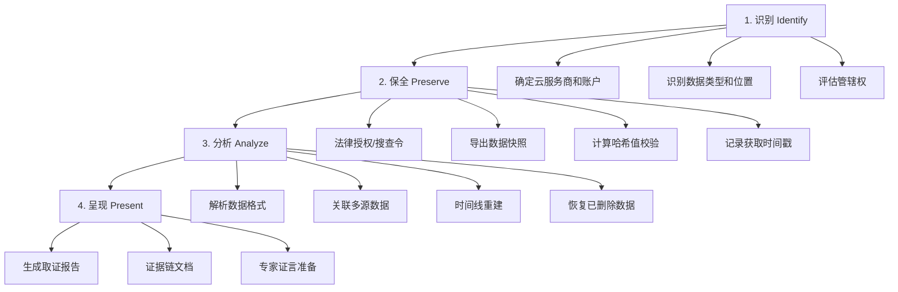

## 25.7 云端数据取证

云端数据取证（Cloud Forensics）是数字取证领域中增长最快、复杂度最高的分支之一。随着企业和个人将数据大规模迁移至云平台——Google Drive、iCloud、OneDrive、阿里云OSS、腾讯云COS、微信聊天记录云端备份等——取证人员必须具备从云端提取、保全和分析数据的完整能力。本章从方法论、法律框架到各平台实操，系统覆盖云端取证的方方面面。

### 25.7.1 云取证的挑战与基础框架

#### 云取证的三重困境

与本地设备取证不同，云端取证面临三个根本性挑战：

| 维度 | 挑战 | 具体表现 |
|------|------|----------|
| **物理控制权缺失** | 数据存储在第三方服务器 | 无法直接做磁盘镜像；取证人员依赖服务商配合 |
| **管辖权模糊** | 服务器可能分布在全球 | 数据在欧洲 GDPR 管辖、在美国 CLOUD Act 管辖、在中国《网络安全法》管辖，冲突时取证受阻 |
| **数据易变性** | 云端数据随时变更 | 用户删除、自动同步、版本覆盖都会导致证据灭失，时间窗口极短 |

这些挑战决定了云端取证的核心理念：**速度优先、法律先行、自动化辅助**。

#### 云取证方法论（NIST 扩展框架）

国际标准 NIST SP 800-86 为云端取证提供了四阶段方法论，针对云环境做了必要调整：



**识别阶段（Identify）** 是整个流程的起点。取证人员必须准确回答：数据存在哪个云平台？以什么形式存储（文件、数据库、日志、消息）？哪个账号持有？服务商位于哪个司法管辖区？

**保全阶段（Preserve）** 的核心是"尽快冻结现场"。云端数据不会"原地等待"，用户收到通知后可能删除或修改数据。因此保全动作必须在法律授权到位的瞬间立即执行。

**分析阶段（Analyze）** 需要处理异构数据格式——JSON 导出、MBOX 邮件、SQLite 数据库、CSV 元数据文件——并将它们关联成统一的时间线和证据链。

**呈现阶段（Present）** 要求生成可读性高、法律效力的报告。陪审团或法官不是技术专家，必须用清晰的语言解释技术细节。

### 25.7.2 法律授权与证据链保全

#### 获取云数据的合法路径

提取云端数据有四种合法途径，取证人员必须根据案情选择合适的方式：

| 途径 | 适用场景 | 时间 | 限制 |
|------|----------|------|------|
| **用户同意书** | 当事人自愿配合（如内部调查） | 最快，几小时内可完成 | 仅限该账户；当事人可随时撤回 |
| **搜查令/法院令** | 刑事调查或诉讼 | 数天到数周 | 需要具体条款和服务商配合流程 |
| **服务商法律请求门户** | 紧急情况或数据保留请求 | 取决于服务商响应速度 | Google/Apple/Microsoft 均有官方法律响应团队 |
| **数据保护法案请求** | GDPR/CCPA 数据主体访问请求 | 服务商有法定义务在 30 天内响应 | 只能获取请求者自己的数据 |

> ⚠️ **重要警告**：未经授权访问他人云端账户（即使知道密码）可能构成非法侵入计算机系统罪。在中国，根据《刑法》第 285 条，非法获取计算机信息系统数据罪可处三年以下有期徒刑或拘役。始终确保取证行动有明确的法律授权。

#### 证据链记录清单

每次云端取证操作必须记录以下信息，缺一不可：

```text
□ 操作日期和时间（精确到秒，标注时区）
□ 操作人员姓名和所属单位
□ 法律授权文件编号
□ 目标云服务商名称
□ 目标账户标识符（邮箱/用户ID）
□ 数据获取方式（API/手动导出/服务商提供）
□ 数据完整性哈希值（SHA-256）
□ 获取工具名称和版本号
□ 下载文件列表及大小
□ 数据交付方式和接收方签名
```

建议使用专门的证据链管理工具（如 EnCase 的 Evidence File 格式或 FTK 的 Chain of Custody 模板）来记录这些信息，而非手动记录。

### 25.7.3 Google 云端数据取证（Google Takeout + 高级技术）

#### Google 生态系统概述

Google 是目前全球最大的个人云服务提供商，其产品矩阵覆盖了用户数字生活的方方面面：

| 服务 | 数据类型 | 取证价值 |
|------|----------|----------|
| Gmail | 邮件正文、附件、标签、过滤规则 | 极高——通信记录和文件传输 |
| Google Drive | 文档、表格、幻灯片、上传文件 | 极高——工作文件和协作记录 |
| Google Photos | 照片、视频、人脸分组、位置标签 | 高——行踪和社交关系证据 |
| Chrome 同步 | 书签、密码、历史、扩展、支付信息 | 极高——上网行为全景 |
| 位置记录（Location History） | GPS 坐标、活动轨迹、通勤路线 | 极高——完整地理行踪 |
| YouTube | 观看历史、评论、订阅、私信 | 中——兴趣和社交证据 |
| Google 活动（My Activity） | 搜索记录、语音搜索、应用使用 | 高——行为模式分析 |
| Google Fit | 步数、心率、运动记录 | 低——健康行为佐证 |

#### Google Takeout 完整导出流程

**步骤 1：访问数据导出门户**

登录 https://takeout.google.com 后，Google 会列出所有可导出的服务。默认全选状态，但取证人员应**按需选择**而非全量导出——全量导出可能产生数十 GB 数据，耗时数天。

**步骤 2：选择导出范围和格式**

配置要点：

- **格式选择**：邮件建议选择 MBOX 格式（可被大多数取证工具直接解析），而非 HTML 或 PDF
- **文件大小**：建议单文件不超过 2GB（默认值），超过会拆分为多个 ZIP 压缩包
- **交付方式**：首选直接下载链接（有效期 7 天），而非发送到另一个云盘

**步骤 3：执行导出并监控进度**

大型导出可能需要数小时到数天。Google 会在完成后发送邮件通知。在此期间，取证人员应记录导出发起时间，并确保 Google 账户不会被注销或密码被更改。

**步骤 4：下载并验证数据完整性**

```bash
# 下载导出文件（示例：使用 wget 下载）
# 实际下载链接由 Google 在导出完成后提供
wget -c https://takeout.google.com/download/xxxxxxx.zip

# 计算 SHA-256 哈希值与 Google 提供的校验值对比
sha256sum takeout-20260625T120000Z-001.zip
# 输出：a7c9d8e2f1b3...  takeout-20260625T120000Z-001.zip

# 解压（超大文件建议使用 7z 或 unzip）
unzip takeout-20260625T120000Z-001.zip -d takeout_export/
```

> **注意**：Google Takeout 的 ZIP 文件本身包含一个 `takeout-<timestamp>.json` 元数据文件，记录了导出时间和文件清单，这是证据链的重要组成。

#### Takeout 导出数据的深度解析

```bash
takeout/
├── Takeout/                              # 主目录
│   ├── metadata.json                     # 导出元数据（时间戳、文件列表）
│   ├── Google Photos/                    # Google Photos
│   │   ├── Albums/                       # 相册结构
│   │   ├── Photos from 2026/             # 按年份自动分类
│   │   └── Archive_browser.html          # 可视化浏览索引
│   ├── Mail/                             # Gmail 导出（MBOX 格式）
│   │   ├── All mail Including Spam and Trash.mbox
│   │   ├── Sent.mbox
│   │   └── metadata.json                 # 邮件数量、时间范围
│   ├── Drive/                            # Google Drive 文件
│   │   └── <文件按原始目录结构存放>
│   ├── Chrome/                           # Chrome 浏览器数据
│   │   ├── Bookmarks.json                # 书签（含添加时间戳）
│   │   ├── History.json                  # 浏览历史（含访问时间）
│   │   ├── Passwords.json                # 已保存密码（加密导出）
│   │   └── Autofill.json                 # 自动填充数据
│   ├── Location History/                 # 位置记录
│   │   ├── Location History.json         # GPS 坐标点列表
│   │   └── Semantic Location History/    # 语义化位置（2024+）
│   │       └── 2026/                     # 按年/月组织
│   │           └── 2026_June.json
│   ├── YouTube/                          # YouTube 数据
│   │   ├── history/                      # 观看历史
│   │   ├── subscriptions/                # 订阅列表
│   │   └── comments/                     # 评论记录
│   ├── activity/                         # Google 活动记录
│   │   ├── Search/                       # Google 搜索历史
│   │   ├── YouTube/                      # YouTube 搜索和观看
│   │   └── MyActivity.json               # 完整活动日志
│   └── Fit/                              # Google Fit 数据
│       └── Daily Aggregations/           # 每日活动汇总
```

#### 核心数据格式解析实战

**Gmail MBOX 文件解析**：MBOX 是标准的邮箱归档格式，每个邮件以 `From ` 行开头（注意是 "From " 后跟空格），内容为 RFC 2822 格式。

```bash
# 统计 MBOX 中的邮件总数
grep -c "^From " All\ mail\ Including\ Spam\ and\ Trash.mbox

# 提取特定日期范围的邮件
# 使用 formail（procmail 工具集）或 awk
awk '/^From /{date=$NF} date ~ /2026-05-15/,/^From /{print}' \
    All\ mail\ Including\ Spam\ and\ Trash.mbox > may15_emails.txt

# 使用 Python 进行结构化解析
python3 << 'EOF'
import mailbox
import json

mbox = mailbox.mbox("All mail Including Spam and Trash.mbox")
results = []
for i, message in enumerate(mbox):
    # 过滤指定时间段
    if message.get("Date") and "May 2026" in message.get("Date"):
        results.append({
            "index": i,
            "from": message.get("From"),
            "to": message.get("To"),
            "subject": message.get("Subject"),
            "date": message.get("Date"),
            "has_attachment": len(message.get_payload() if not message.is_multipart() else message.get_payload())
        })
    if i >= 1000:  # 处理前 1000 封
        break

print(json.dumps(results[:20], indent=2, ensure_ascii=False))
EOF
```

**位置记录 JSON 解析**：Google 位置记录以 JSON 格式存储，每条记录包含时间戳、经纬度、精度和活动类型。

```json
{
  "timelineObjects": [
    {
      "activitySegment": {
        "startLocation": {
          "latitudeE7": 399160000,
          "longitudeE7": 1163972000
        },
        "endLocation": {
          "latitudeE7": 399050000,
          "longitudeE7": 1164060000
        },
        "duration": {
          "startTimestamp": "2026-06-01T08:30:00.000Z",
          "endTimestamp": "2026-06-01T08:45:00.000Z"
        },
        "activityType": "IN_PASSENGER_VEHICLE",
        "confidence": "HIGH"
      }
    },
    {
      "placeVisit": {
        "location": {
          "latitudeE7": 399160000,
          "longitudeE7": 1163972000,
          "placeId": "ChIJ...",
          "address": "北京市海淀区中关村大街1号",
          "name": "中关村创业大厦"
        },
        "duration": {
          "startTimestamp": "2026-06-01T09:00:00.000Z",
          "endTimestamp": "2026-06-01T12:30:00.000Z"
        }
      }
    }
  ]
}
```

位置记录的分析价值极高——它不仅能证明某人在某个时间点出现在某个地点，还能通过**活动类型**（步行、驾车、骑行）和**持续时间**推断行为模式。例如，某人声称某日不在案发现场，但位置记录显示其车辆行驶轨迹经过该区域，即可作为反驳证据。

```python
# 位置记录分析脚本——提取关键证据
import json
from datetime import datetime

with open("Location History.json", "r") as f:
    data = json.load(f)

# 提取指定日期范围内的位置点
target_date = "2026-06-15"
points = []
for obj in data.get("timelineObjects", []):
    for seg_type in ["activitySegment", "placeVisit"]:
        seg = obj.get(seg_type)
        if not seg:
            continue
        start = seg.get("duration", {}).get("startTimestamp", "")
        if target_date in start:
            points.append({
                "type": seg_type,
                "start": start,
                "lat": seg.get("startLocation", {}).get("latitudeE7", 0) / 1e7,
                "lon": seg.get("startLocation", {}).get("longitudeE7", 0) / 1e7
            })

print(f"目标日期 {target_date} 共 {len(points)} 个位置记录")
for p in points[:10]:
    print(f"  [{p['type']}] {p['start']} -> ({p['lat']:.6f}, {p['lon']:.6f})")
```

#### 高级 Google 取证技术

**Google Vault 企业级取证**：如果目标使用 Google Workspace（企业版），取证人员可通过 Google Vault 进行更精细的数据检索和导出。Vault 支持按日期范围、搜索词、收件人/发件人进行精确提取，并支持"法定保留"（Legal Hold）功能，防止用户删除数据。

```bash
# 通过 GAM（Google Workspace Admin）CLI 工具触发 Vault 导出
# GAM 是开源的管理命令行工具

# 安装 GAM（需要 Python 3 和 Google API 凭据）
# pip install gam

# 创建邮件导出任务
gam create datatransfer gmail \
    user target@company.com \
    search "from:suspect@external.com after:2026/01/01" \
    exportformat mbox

# 检查导出状态
gam show datatransfer <transfer_id>
```

**Google Drive 版本历史取证**：Google Drive 保留文件的版本历史记录。对于 Google 原生格式（文档、表格、幻灯片），版本历史更为详细。取证人员可通过 Drive API 获取历史版本，识别文件内容的演变过程——这在知识产权纠纷和文档篡改案件中至关重要。

```python
# 通过 Google Drive API 获取文件版本历史（需 OAuth2 凭据）
from googleapiclient.discovery import build
from google.oauth2.credentials import Credentials

creds = Credentials.from_authorized_user_file("token.json")
service = build("drive", "v3", credentials=creds)

# 获取文件修订版本
revisions = service.revisions().list(
    fileId="<FILE_ID>",
    fields="revisions(id,modifiedTime,size,keepForever,lastModifyingUser)"
).execute()

for rev in revisions.get("revisions", []):
    print(f"版本: {rev['id']}")
    print(f"  修改时间: {rev['modifiedTime']}")
    print(f"  大小: {rev.get('size', 'N/A')} 字节")
    print(f"  修改者: {rev.get('lastModifyingUser', {}).get('displayName', '未知')}")
    print("---")
```

### 25.7.4 Apple iCloud 数据取证

#### iCloud 数据全景

Apple 的 iCloud 生态以设备为中心，数据分布与 Google 有所不同：

| 数据类型 | 存储位置 | 可导出方式 | 取证难点 |
|----------|----------|------------|----------|
| iCloud 备份 | 完整设备备份（含应用数据） | 需要 Apple ID + 信任设备或 EPB | 端到端加密（高级数据保护） |
| iCloud 照片 | 照片流、共享相册 | iCloud.com 网页导出 | 数量大，批量导出慢 |
| iCloud 邮件 | iCloud.com 邮件账户 | IMAP 导出或网页下载 | 国内使用率低 |
| 联系人/日历 | CardDAV/CalDAV | 网页导出 vCard/ICS | 格式简单，直接解析 |
| Safari 同步 | 书签、历史、iCloud 标签页 | iCloud.com 或 iCloud 控制面板 | 需要 Windows/macOS 客户端 |
| iCloud Drive | 文件文档 | iCloud.com 下载 | 私密文件夹需额外密码 |
| 查找我的 | 设备位置历史 | 无法直接导出 | 仅限实时查询 |
| 健康数据 | 运动、心率、睡眠 | 需设备同步备份 | 端到端加密 |

#### iCloud 数据提取工具链

**Elcomsoft Phone Breaker（EPB）** 是目前最成熟的 iCloud 取证工具。它支持两种提取模式：

| 模式 | 前提条件 | 获取的数据 | 成功率 |
|------|----------|------------|--------|
| **令牌提取** | 有 Apple ID 密码 + 双因子认证码 | 大部分 iCloud 数据 | 高（70-90%） |
| **BRUT-FORCE 攻击** | 仅需 Apple ID 邮箱 | 加密哈希值，离线破解 | 取决于密码强度 |
| **设备备份提取** | 有 iTunes/Finder 备份密码 | 完整设备备份 | 中（需 Trust 关系） |

```bash
# Elcomsoft Phone Breaker 命令行模式（概念示例）
# 注意：EPB 是商业软件，需购买许可证

# 从 iCloud 提取数据
ecloud.exe /import:appleid@example.com /password:"user_password" \
    /2fa:trusted_device /output:D:\Case_001\iCloud\

# 提取指定数据类型
ecloud.exe /download:contacts /download:calendars \
    /download:photos /download:notes \
    /output:D:\Case_001\iCloud\

# 下载 iCloud 备份（需设备备份存在）
ecloud.exe /download:backup /device:"iPhone 15 Pro Max" \
    /output:D:\Case_001\Backup\

# 离线破解备份密码（BRUT-FORCE 模式）
ecloud.exe /bruteforce /output:D:\Case_001\Backup\
```

#### iCloud 网页端手动取证

当商业取证工具不可用时，iCloud.com 网页端提供了基本的数据导出功能：

```bash
# 使用 curl 模拟浏览器导出 iCloud 联系人（需要 cookie）
# 注意：iCloud.com 有严格的 CSRF 保护，建议使用浏览器自动化

# 更实用的方法：通过 Mac 系统的 iCloud 偏好设置同步后导出
# 联系人导出为 vCard
# 日历导出为 ICS
# Safari 书签导出为 HTML
```

**iCloud 高级数据保护（ADP）的影响**：2023 年起，Apple 推出了可选的高级数据保护（Advanced Data Protection, ADP），为大部分 iCloud 数据提供端到端加密。启用 ADP 后，即使 Apple 自身也无法解密用户数据，取证工具将无法提取消息、照片、备忘录等内容。这使得 iCloud 取证从"技术挑战"变成了"几乎不可能"——除非有用户的设备解锁密码或恢复密钥。

> **关键提示**：验证目标账户是否启用了 ADP，可以通过 iCloud.com 的设置页面查看。如果启用了 ADP，取证策略应转向设备本地取证（第 25.4 节）而非云端取证。

### 25.7.5 Microsoft 365 / OneDrive 企业取证

#### Microsoft 365 管理门户取证

在企业和组织调查中，Microsoft 365 是最常遇到的云服务平台。通过管理员权限，取证人员可以获得比 Google 和 Apple 更精细的数据控制。

**取证入口**：Microsoft 365 合规中心（https://compliance.microsoft.com）

```powershell
# 1. 连接到 Exchange Online
Connect-ExchangeOnline -UserPrincipalName admin@contoso.com

# 2. 创建合规性搜索（eDiscovery）
New-ComplianceSearch -Name "Case-2026-001" \
    -ExchangeLocation all \
    -SharePointLocation all \
    -OneDriveLocation all \
    -ContentMatchQuery "from:suspect@external.com AND received>=01/01/2026"

# 3. 启动搜索
Start-ComplianceSearch -Identity "Case-2026-001"

# 4. 检查搜索结果
Get-ComplianceSearch -Identity "Case-2026-001" | Format-List
# 输出包含：Items、Size、SearchStatus

# 5. 导出搜索结果
New-ComplianceSearchAction -SearchName "Case-2026-001" -Export
```

**OneDrive 与 SharePoint 联合取证**：OneDrive for Business 与 SharePoint Online 共享底层存储架构。用户的 OneDrive 实际上是 SharePoint 的个人站点（Personal Site）。这意味着你可以通过 SharePoint Online Management Shell 跨站点搜索文件。

```powershell
# 连接到 SharePoint Online
Connect-SPOService -Url https://contoso-admin.sharepoint.com

# 列出所有 OneDrive 站点
Get-SPOSite -IncludePersonalSite $true -Limit 500 | 
    Where-Object {$_.Template -eq "SPSPERS"} |
    Select-Object Url, Owner, StorageQuota, StorageUsage

# 获取特定用户的 OneDrive 文件变更历史
# 使用 SharePoint 的版本历史 API
# 站点 URL 模式：https://contoso-my.sharepoint.com/personal/user_domain_com

# 通过 Microsoft Graph API 获取文件元数据
$accessToken = Get-MsalToken -ClientId "xxx" -TenantId "yyy"
$headers = @{Authorization = "Bearer $($accessToken.AccessToken)"}

# 获取用户 OneDrive 根目录文件
Invoke-RestMethod -Uri "https://graph.microsoft.com/v1.0/users/admin@contoso.com/drive/root/children" `
    -Headers $headers | ConvertTo-Json -Depth 10
```

#### Microsoft 365 邮件的深度分析

Exchange Online 的邮件追踪日志（Message Trace Logs）记录了每封邮件的完整生命周期：谁发送、何时发送、是否送达、是否被规则拦截。

```powershell
# 获取指定时间段的邮件追踪日志
Get-MessageTrace -StartDate "2026-06-01" -EndDate "2026-06-25" |
    Select-Object Timestamp, SenderAddress, RecipientAddress, Subject, Status, MessageID

# 查看邮件详情（传输路径、延迟、规则命中）
Get-MessageTraceDetail -MessageTraceId <TraceId>

# 获取已删除邮件的审计日志
# 需要启用邮箱审计日志
Search-MailboxAuditLog -Identity user@contoso.com \
    -LogonTypes Owner,Admin \
    -StartDate "2026-06-01" -EndDate "2026-06-25" |
    Select-Object Operation, LastModifiedTime, ItemSubject, SourceFolder
```

**审计日志（Audit Log）** 是 Microsoft 365 取证的宝藏。统一审计日志记录了所有管理员和用户操作，包括文件访问、邮件删除、权限变更等关键行为。

```powershell
# 搜索统一审计日志
Search-UnifiedAuditLog -StartDate "2026-06-01" -EndDate "2026-06-25" |
    Select-Object CreationDate, Operation, UserIds, AuditData |
    ConvertTo-Json | Out-File "audit_log_export.json"

# 关键操作类型
# FileAccessed        - 文件被访问
# FileDeleted         - 文件被删除
# FileModified        - 文件被修改
# MailboxLogin        - 邮箱登录（含失败尝试）
# MailItemsAccessed   - 邮件被访问（可疑数据窃取）
# SendMail            - 发送邮件
# UserLoggedIn        - 用户登录
```

### 25.7.6 中国主流云平台取证

#### 微信聊天记录云端取证

微信是中国最普及的即时通讯工具，其云端备份机制与其他平台有显著差异。

**微信备份机制**：

| 备份方式 | 数据内容 | 可恢复性 | 取证方法 |
|----------|----------|----------|----------|
| **手机本地备份**（微信自带） | 全部聊天记录（含图片、文件） | 需同一手机 + 微信密码 | 手机取证工具提取（见第25.4节） |
| **电脑端备份**（微信PC版） | 聊天记录 + 文件传输 | 需原电脑 + 原微信账号 | 提取电脑端的 Decrypted DB |
| **iCloud/安卓云备份** | 微信数据包含在系统备份中 | 取决于云备份完整性 | 通过 iCloud/安卓云备份提取 |
| **WeChat Work 企业版** | 聊天记录服务端留存（需管理员开启） | 企业控制，可长期留存 | 通过企业微信管理后台导出 |

**微信取证要点**：

1. **本地数据库为主**：微信的云端备份不是"独立云服务"，而是设备备份的一部分。真正取证的突破口在手机/电脑本地
2. **SQLCipher 加密**：微信使用 SQLCipher 加密 `EnMicroMsg.db` 数据库，解密需要 IMEI + UIN（微信账号识别码），通过 `sqlcipher` 工具可尝试解密
3. **聊天记录恢复**：已删除的微信聊天记录在 SQLite 数据库中可能残留，使用 `sqlite3` 的 `RECOVER` 模块或商业工具（如 FonePaw、Dr.Fone）可尝试恢复

```bash
# 微信 SQLite 数据库结构（解密后）
# 常用表名：
# message           - 聊天消息
# chatroom          - 群聊信息
# contact           - 联系人
# img_flag          - 图片文件索引
# voice_message     - 语音消息

# 使用 sqlcipher 打开解密后的微信数据库（需要密钥）
sqlcipher EnMicroMsg.db
SQLCipher> PRAGMA key = 'your_decryption_key';
SQLCipher> .tables

# 查询指定时间段的聊天记录
SQLCipher> SELECT 
    m.createTime,
    m.content,
    m.type,
    c.nickname
FROM message m
LEFT JOIN contact c ON m.talker = c.username
WHERE m.createTime >= strftime('%s', '2026-01-01') 
    AND m.createTime <= strftime('%s', '2026-06-25')
ORDER BY m.createTime DESC
LIMIT 100;
```

#### 阿里云 OSS / 腾讯云 COS 取证

企业级中国云平台的取证通常涉及阿里云对象存储服务（OSS）和腾讯云对象存储（COS）。

**阿里云 OSS 取证**：

```bash
# 使用阿里云 CLI 工具 ossutil
# 安装：curl -o ossutil -L https://gosspublic.alicdn.com/ossutil/1.7.19/ossutil64

# 配置访问凭证
ossutil config -e oss-cn-beijing.aliyuncs.com \
    -i LTAI5txxxAccessKey \
    -k xxxxxSecretKey

# 列出存储空间（Bucket）
ossutil ls

# 列出指定 Bucket 中的所有文件（含版本信息）
ossutil ls oss://evidence-bucket/ --all-versions

# 下载特定前缀下的所有文件
ossutil cp oss://evidence-bucket/case-001/ ./local_evidence/ \
    --all-versions -r --include "*.pdf" --include "*.docx"

# 批量下载并计算哈希
ossutil cp oss://evidence-bucket/ ./evidence/ -r
find ./evidence/ -type f -exec sha256sum {} \; > evidence_hashes.txt
```

> ⚠️ **阿里云取证注意事项**：OSS 支持多版本控制（Versioning），如果启用，删除操作实际创建"删除标记"而非真正移除数据。务必使用 `--all-versions` 参数获取全部版本。此外，OSS 的访问日志（Access Log）记录了所有对 Bucket 的操作，包括访问 IP、时间、操作类型，应在第一时间导出。

**腾讯云 COS 取证**：

```bash
# 使用 COSCLI 工具
# 安装：pip install coscmd

# 配置（需要 SecretId 和 SecretKey）
coscmd config -a AKIDxxxxx -s xxxxxSecret -b evidence-bucket-1250000000 -r ap-beijing

# 列出对象
coscmd list

# 下载对象（保留目录结构）
coscmd download -r / /tmp/cos_evidence/

# 查看对象元数据（最后修改时间、ETag、存储类型）
coscmd info case-001/financial_report.xlsx
```

### 25.7.7 云取证工具全景

#### 商业取证工具

| 工具名称 | 开发商 | 支持平台 | 核心能力 | 价格参考 |
|----------|--------|----------|----------|----------|
| **Magnet AXIOM Cloud** | Magnet Forensics | Google/Apple/Microsoft/AWS | 云端数据获取、分析、时间线 | $5,000+/年 |
| **Cellebrite Cloud Analyzer** | Cellebrite | Google/Apple/Microsoft/微信 | 云端数据提取 + 本地关联 | $3,500+/年 |
| **Elcomsoft Cloud Explorer** | Elcomsoft | Apple iCloud 深度提取 | 备份解密、令牌提取、双因子绕过 | $799/年 |
| **Amped FIVE** | Amped Software | 多平台 | 图像/视频云端来源分析 | $3,000+/年 |
| **Nuix Discover** | Nuix | Microsoft/Google 企业版 | 法律发现、合规审查、批量处理 | 按需报价 |

#### 开源/免费工具

| 工具名称 | 用途 | 获取方式 |
|----------|------|----------|
| **GAM (Google Workspace Admin)** | Google Workspace 批量管理/取证 | https://github.com/googleworkspace/python-samples |
| **MFT (Microsoft Graph CLI)** | Microsoft 365 API 命令行 | `npm install -g @microsoft/microsoft-graph-cli` |
| **gdrive** | Google Drive CLI 客户端 | https://github.com/prasmussen/gdrive |
| **rclone** | 多云存储同步（支持 40+ 云平台） | https://rclone.org |
| **sqlite3** | SQLite 数据库分析和恢复 | 系统自带（Linux/macOS）或 `apt install sqlite3` |
| **curl + jq** | REST API 数据获取和 JSON 解析 | 系统自带或 `apt install curl jq` |

**rclone 多云取证方案**：rclone 是一个强大的多云同步工具，支持超过 40 个云存储服务。在取证场景中，rclone 可以充当"统一提取层"：

```bash
# 配置 Google Drive 远程连接
rclone config
# 按提示逐步配置 OAuth2 认证

# 以只读模式挂载 Google Drive（避免污染证据）
rclone mount remote:path /mnt/evidence --read-only \
    --daemon --vfs-cache-mode off

# 统计文件数量和时间分布
rclone size remote:Cases/2026-Evidence

# 以 JSON 格式导出文件树（用于证据清单）
rclone lsjson remote:Evidence/ > evidence_file_tree.json

# 加密传输到本地存储
rclone copy remote:Evidence/ /tmp/forensic_copy/ \
    --checksum --verbose --progress
```

### 25.7.8 云端证据链的完整示例

以下是一个典型的云端取证案例流程，综合了本章所有技术要点：

**案情**：某公司员工在离职前疑似窃取商业机密，通过 Google Drive 下载了大量设计文件，并发送到个人邮箱。

```bash
# ===== 阶段1：查封并保全 =====
# 1. 获取法院令状
# 2. 通知公司 IT 部门暂停该员工的账户删除权限
# 3. 创建 Google Vault Legal Hold 防止数据清除

# ===== 阶段2：提取 =====
# 4. 通过 Google Takeout 导出该员工的全量数据（取证人员操作，非员工自己操作）
# 5. 计算导出文件的 SHA-256 哈希
sha256sum Takeout-2026-06-25T120000Z.zip > Takeout_checksum.txt

# 6. 同时通过 Microsoft 365 eDiscovery 导出邮件和文件
# 7. 导出 Office 365 审计日志

# ===== 阶段3：分析 =====
# 8. 解析 Drive 文件的最后访问时间和下载历史
#    检查哪些文件在离职通知后仍被访问

# 9. 分析 Gmail 中的可疑外发邮件
#    关键词：附件、转发、个人邮箱

# 10. 对比 Google Drive 文件列表与公司 Git/SVN 提交记录
#     识别被下载但未提交的文件（可能的窃取目标）

# 11. 检查 Chrome 浏览历史，确认搜索过"如何清除痕迹"类关键词
jq '.BrowserHistory[] | select(.url | test("delete|remove|clear|wipe"; "i")) | {url, time_usec}' \
    Takeout/Chrome/History.json

# ===== 阶段4：呈现 =====
# 12. 整理时间线：
#     - 2026-05-20 09:15: 下载 Project-Aurora.zip（Drive 审计日志）
#     - 2026-05-20 09:17: 打开个人 Gmail 撰写邮件（Chrome 历史）
#     - 2026-05-20 09:20: 发送邮件含 2 个附件（邮箱审计日志）
#     - 2026-05-20 09:25: 删除 Drive 下载记录（缺失的时间段 -> 推断有意清除）

# 13. 生成取证报告（含所有哈希校验值）
```

### 25.7.9 常见误区与陷阱

理解以下误区能帮助取证人员避免致命错误：

**误区 1："数据在云端就会永久保留"**
实际上，大部分云服务有明确的删除策略：
- Google：回收站保留 30 天，超过后自动清除
- iCloud：删除照片后保留 30 天，备份只保留最近 3 份
- OneDrive：回收站保留 93 天（管理员可调整）
- 微信：聊天记录仅存在于端设备，云端无缝备份

**误区 2："Takeout 导出了全部数据"**
Google Takeout 不包含：
- Google 相册的元数据（人脸分组标签、位置标签）
- Google Play 应用购买记录
- Google 搜索的个性化结果数据
- 部分端到端加密的数据（如 Google Messages 的 RCS 加密消息）

**误区 3："获取密码就能获取全部数据"**
现代云服务大量使用 MFA（多因子认证）和设备信任机制。仅凭密码：
- Google：可能触发安全警报，要求验证码
- Apple iCloud：需要信任设备或短信验证码，还可能遇到高级数据保护
- Microsoft 365：需要管理员同意 + MFA 验证

**误区 4："取证工具自动处理了所有证据链"**
大部分商业工具会自动记录操作日志，但仍需人工验证：
- 时间戳是否与标准时间一致（NTP 校准）
- 哈希值是否与原始文件匹配
- 下载过程是否有中断或重试

### 25.7.10 云端取证的未来趋势

1. **端到端加密的普及**：Apple 高级数据保护、Google 端到端加密备份、Meta 加密消息正在成为默认选项。未来云端取证将从"直接读取"转向"元数据分析和设备侧取证"
2. **云原生数字取证即服务（DFaaS）**：AWS 和 Azure 推出内置的取证服务，允许取证人员在不直接访问存储的前提下，通过 API 完成合规的数据提取
3. **AI 辅助分析**：机器学习模型被用于自动识别异常的云端活动模式、标记潜在的数据泄露行为、以及从海量导出数据中提取关键证据
4. **跨平台关联分析**：单一平台的取证价值有限，多平台数据关联（如 Google 位置 + 微信聊天 + iCloud 照片）能构建出更完整的数字画像

这些趋势意味着取证人员需要持续学习新的技术和法律框架，云端取证不再是"会下载导出文件就行"的简单工作，而是一门融合法律、技术、数据分析的综合性专业。

### 25.7.11 小结

云端数据取证要求取证人员同时具备法律知识、技术能力和数据分析思维。本章从方法论入手，详细讲解了 Google、Apple、Microsoft 和中国主流云平台的数据提取和分析技术，涵盖商业工具与开源方案，从法律授权到证据呈现的全流程。核心要点归结为：

- **速度是生命线**——云端数据随时可能消失，必须在授权到位的瞬间立即行动
- **合法性不可妥协**——未经授权的访问不仅证据无效，自身也可能面临法律追究
- **校验贯穿始终**——从下载到分析到呈现，每个环节都要维护数据的完整性
- **多源关联验证**——单个平台的数据可能被篡改或缺失，交叉验证是可信的关键
- **持续学习**——云端取证技术在飞速演进，今天的方法明天可能就失效了