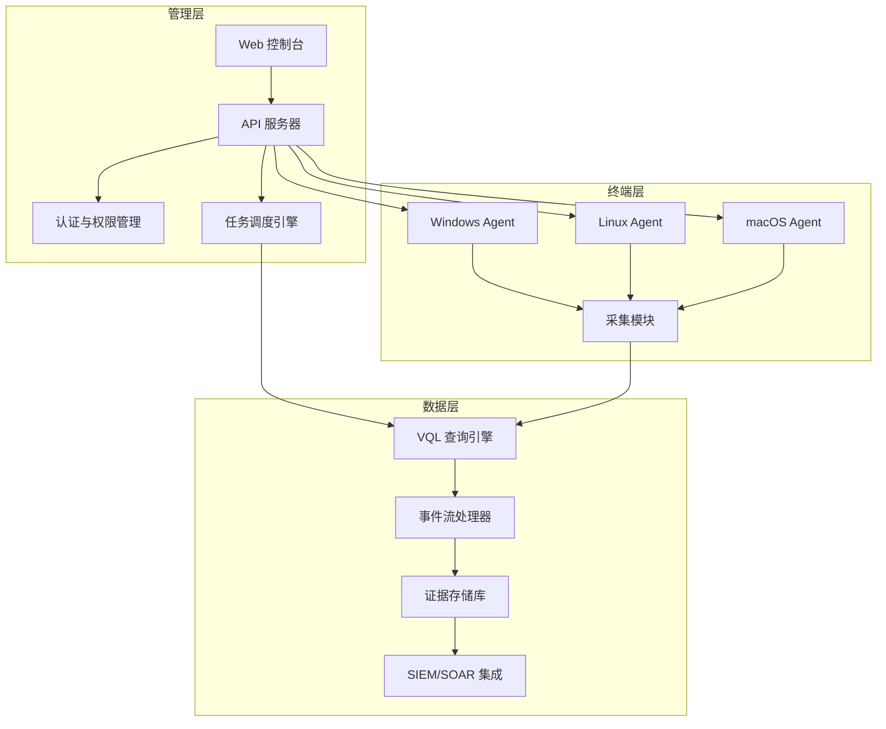
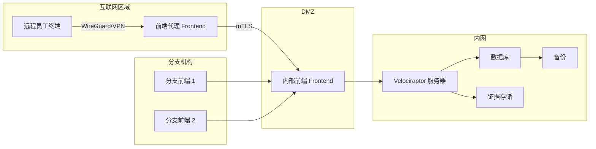

## 25.8 企业环境取证

企业环境取证与个人设备取证有本质区别：攻击面从一台设备扩展到数百乃至数万台终端，数据分散在本地、云端、容器和 SaaS 平台中，取证活动必须在不影响业务连续性的前提下完成，同时还要满足严格的合规与监管要求。本节从企业取证的核心挑战出发，系统讲解远程取证平台部署、VQL 查询引擎、批量证据收集与处理、网络流量自动化分析等关键技能，并覆盖合规审计、事件响应编排和实战案例。

### 25.8.1 企业取证的核心挑战

传统数字取证面对的是"一台机器、一块硬盘"的场景。企业环境将问题复杂度放大了数个量级。理解这些挑战是设计取证方案的前提。

#### 25.8.1.1 规模与分布性挑战

企业网络通常包含以下类型的终端：

| 终端类型 | 典型数量 | 数据特点 | 取证难度 |
|---------|---------|---------|---------|
| 员工工作站 | 数百到数万 | Windows/macOS/Linux 混合，用户行为痕迹丰富 | 高——需远程采集，不能逐一到场 |
| 服务器集群 | 数十到数百 | 承载核心业务，日志量巨大 | 极高——必须保证业务不中断 |
| 网络设备 | 数十到数百 | 路由器/交换机/防火墙日志 | 中——日志格式多样 |
| 云实例 | 动态伸缩 | 生命周期短，可能随时销毁 | 极高——取证窗口极短 |
| 移动终端 | 数百到数千 | BYOD 政策下设备多样 | 高——隐私合规问题 |
| IoT 设备 | 数十到数千 | 存储容量小，协议多样 | 高——缺乏标准取证接口 |

这些终端产生的日志总量可以达到每天数十 TB。传统"镜像整块磁盘"的方法在企业环境中完全不可行——一台 1TB 磁盘的镜像需要数小时，如果是 10000 台终端，需要的存储和带宽都是天文数字。

#### 25.8.1.2 业务连续性约束

企业取证必须在"不中断业务"的框架下进行。具体约束包括：

- **CPU/内存占用上限**：取证代理在终端上的资源消耗通常不能超过 5% CPU 和 200MB 内存
- **带宽限制**：大文件传输必须在非高峰时段进行，或使用增量采集
- **时间窗口**：关键证据（如内存、网络连接状态）可能在几分钟内消失，必须第一时间采集
- **服务可用性**：对数据库服务器、交易系统等核心服务，不能随意暂停或重启

#### 25.8.1.3 合规与法律约束

不同行业对数字取证有明确的法规要求：

| 法规/标准 | 适用行业 | 对取证的核心要求 |
|----------|---------|----------------|
| GDPR | 涉及欧盟数据 | 数据处理必须有合法基础，取证记录需包含数据处理依据 |
| SOX | 美国上市公司 | 财务系统日志必须保留 7 年，取证需证明审计线索完整性 |
| PCI-DSS | 支付卡行业 | 卡号数据取证需遵循加密传输要求，日志保留至少 1 年 |
| HIPAA | 医疗健康 | 受保护健康信息(PHI)取证需遵循最小必要原则 |
| 等保 2.0 | 中国各行各业 | 安全事件处置需在 24 小时内报告，日志保存不少于 6 个月 |
| ISO 27037 | 国际通用 | 定义了数字证据识别、收集、获取和保全的国际标准 |

合规要求直接影响取证方案的设计：证据保全流程必须可审计，数据跨境传输需要额外授权，涉及个人隐私的数据需要脱敏处理。

#### 25.8.1.4 多源异构数据整合

企业取证面临的数据来源极为分散：

- **终端日志**：Windows 事件日志、Syslog、EDR 告警
- **网络流量**：NetFlow、PCAP、IDS/IPS 告警
- **身份认证**：AD/LDAP 审计日志、SSO 登录记录、MFA 日志
- **应用层**：Web 应用日志、数据库审计日志、API 网关日志
- **云平台**：AWS CloudTrail、Azure Activity Log、阿里云 ActionTrail
- **邮件系统**：Exchange/M365 邮件追踪日志、网关过滤日志

将这些异构数据关联分析是企业取证的核心难点，需要统一的时间戳标准化、实体解析和关联分析能力。
#### 25.8.1.5 数据主权与跨境传输挑战

在全球化运营的企业中，取证活动常常涉及跨境数据传输，这引入了额外的法律和技术约束：

| 挑战维度 | 具体问题 | 应对策略 |
|---------|---------|---------|
| 数据本地化要求 | 中国《数据安全法》要求重要数据不出境，欧盟 GDPR 限制个人数据跨境 | 在各区域部署独立取证节点，分析结果脱敏后再汇总 |
| 云服务提供商管辖权 | AWS/Azure 的美国母公司可能受美国法律管辖（如 CLOUD Act） | 了解各云厂商的数据驻留承诺，在合同中明确取证数据访问条款 |
| 加密密钥管理 | 跨境传输的证据必须加密，但部分国家限制加密软件出口 | 使用符合各国法规的加密方案，保留密钥托管记录 |
| 司法协助流程 | 跨国调取证据需要通过司法协助条约（MLAT），耗时数月 | 预先在各法域建立取证授权框架，缩短响应时间 |
| 员工隐私保护 | 各国对员工监控和数据收集的法律差异巨大 | 取证前获得法务部门的合规审查意见，必要时获取员工同意 |

**实操建议：** 在企业 IR Playbook 中，为每个运营区域制定独立的取证数据处理流程。使用区域化的证据存储（如中国区证据存放在阿里云 OSS，欧盟区存放在 AWS eu-west-1），仅在分析阶段传输汇总后的结构化结果（而非原始证据）。所有跨境传输必须记录在证据链日志中，包含法律依据和授权人员签名。

#### 25.8.1.6 时间同步与钟差问题

企业取证的时间线关联分析严重依赖各终端时钟的准确性。即使数秒的钟差也可能导致因果关系误判——例如，无法确定是 A 主机先被入侵还是 B 主机先被入侵。

**NTP 配置最佳实践：**

```bash
# Linux: 使用 chrony 替代 ntpd（更精确，更适合虚拟化环境）
# /etc/chrony.conf
server ntp1.aliyun.com iburst
server ntp2.aliyun.com iburst
server time.asia.apple.com iburst
# 允许的误差范围：取证环境建议 < 100ms
maxdrift 0.0001

# Windows: 配置域控为权威时间源，成员服务器同步域控
w32tm /config /manualpeerlist:"ntp1.aliyun.com" /syncfromflags:manual /reliable:YES /update
w32tm /resync /force
# 验证钟差
w32tm /monitor /domain:corp.example.com
```

**取证中的时间校准方法：**

1. **记录钟差**：在采集证据时，记录终端时钟与 NTP 基准的偏差值（offset），后续分析时进行校正
2. **使用 UTC 统一**：所有取证日志和时间线统一使用 UTC，仅在最终报告中转换为本地时间
3. **网络时间证据**：从 PCAP 中提取的 TCP 时间戳、HTTP Date header 可作为辅助时间校准参考
4. **Velociraptor 时间处理**：VQL 查询结果中的时间戳默认为 UTC epoch，使用 `timestamp(epoch=...)` 转换为可读格式

```sql
-- VQL: 检查各终端的时钟偏差
SELECT
    ClientId,
    hostname,
    timestamp(epoch=now()) AS CurrentTime,
    timestamp(epoch=now() - client_info.clock_skew) AS CorrectedTime,
    client_info.clock_skew AS SkewSeconds
FROM clients()
WHERE client_info.clock_skew > 5 OR client_info.clock_skew < -5
```


### 25.8.2 企业远程取证平台架构

企业取证需要一个集中管理的远程取证平台，能够同时对数千台终端进行证据采集、查询和分析。目前主流的开源方案有三个：Velociraptor、GRR（Google Rapid Response）和 Osquery + Fleet。



#### 25.8.2.1 平台选型对比

| 特性 | Velociraptor | GRR | Osquery + Fleet |
|------|-------------|-----|-----------------|
| 开发商 | Velocidex（原 Google 开发） | Google | Facebook/Meta |
| 查询语言 | VQL（Velociraptor Query Language） | Python 猎杀规则 | SQL |
| 部署复杂度 | 中等（单二进制文件） | 高（依赖多组件） | 低（agent + server） |
| 终端覆盖 | Windows/Linux/macOS | Windows/Linux/macOS | 全平台 |
| 实时响应 | 支持（VQL 实时查询 + 事件流） | 支持 | 支持 |
| 离线分析 | 支持离线采集包 | 不支持 | 部分支持 |
| 社区活跃度 | 高（持续更新） | 中 | 高 |
| 适用场景 | 大规模事件响应 + 威胁猎杀 | 大型企业持续监控 | 资产清点 + 基础监控 |
| 学习曲线 | 中（需掌握 VQL） | 高（需 Python 开发能力） | 低（SQL 即可） |

在事件响应场景中，Velociraptor 因其轻量部署、强大 VQL 引擎和灵活的离线采集能力，成为当前社区的首选方案。

### 25.8.3 Velociraptor 深度实战

#### 25.8.3.1 服务端部署

Velociraptor 的部署模型有三种：单服务器、多前端分布式和云原生部署。

**单服务器部署（适合中小规模，< 5000 终端）：**

```bash
# 1. 下载最新版本
wget https://github.com/Velocidex/velociraptor/releases/latest/download/velociraptor-linux-amd64
chmod +x velociraptor-linux-amd64
sudo mv velociraptor-linux-amd64 /usr/local/bin/velociraptor

# 2. 交互式生成服务端配置
velociraptor config generate --interactive

# 该命令会引导你完成以下配置项：
#   - 服务端监听地址和端口（默认 0.0.0.0:8000）
#   - GUI 绑定地址（默认 127.0.0.1:8889）
#   - 数据存储目录（默认 /opt/velociraptor）
#   - 日志级别
#   - 认证方式（证书认证或 OIDC）

# 3. 创建管理员用户
velociraptor --config server.config.yaml user add admin --role administrator
# 系统会提示输入密码，建议使用强密码并妥善保管

# 4. 启动服务端
velociraptor --config server.config.yaml frontend
# 前端（Frontend）负责接收 Agent 连接
# 另开终端启动 GUI
velociraptor --config server.config.yaml gui
# GUI 默认监听 127.0.0.1:8889，可通过 SSH 隧道或反向代理访问
```

**生产环境加固要点：**

```yaml
# server.config.yaml 中的关键安全配置
GUI:
  bind_address: 127.0.0.1
  bind_port: 8889
  # 必须配置 TLS，不要暴露在公网
  use_plain_http: false

Frontend:
  bind_address: 0.0.0.0
  bind_port: 8000
  # 限制最大并发连接数，防止资源耗尽
  max_upload_size: 104857600  # 100MB
  # 启用客户端证书双向认证
  client_certificate_verification: true

Datastore:
  # 生产环境使用 MySQL 或 PostgreSQL 替代文件存储
  implementation: MySQL
  mysql:
    server: "db-host:3306"
    database: "velociraptor"
    credentials_username: "velociraptor"
    credentials_password: "<strong-password>"

Logging:
  # 启用审计日志，记录所有操作
  output_directory: /var/log/velociraptor
  separate_logs_per_component: true
```

#### 25.8.3.2 客户端部署与管理

**生成客户端安装包：**

```bash
# 生成 Windows 客户端 MSI 安装包
velociraptor --config server.config.yaml \
  client \
  --msi_output /tmp/velociraptor_client.msi

# 生成 Linux 客户端 DEB 包
velociraptor --config server.config.yaml \
  client \
  --deb_output /tmp/velociraptor_client.deb

# 生成 macOS 客户端 PKG 包
velociraptor --config server.config.yaml \
  client \
  --pkg_output /tmp/velociraptor_client.pkg
```

**通过 GPO/SCCM/Intune 批量部署（Windows 企业环境）：**

```powershell
# 通过组策略(GPO)部署 MSI 的标准流程：
# 1. 将 MSI 文件放在域控的 SYSVOL 共享目录
# 2. 打开组策略管理编辑器
# 3. 导航到：计算机配置 -> 策略 -> 软件设置 -> 软件安装
# 4. 右键 -> 新建 -> 数据包，选择 MSI 文件
# 5. 选择"已分配"（Assigned），计算机启动时自动安装

# 验证安装是否成功
Get-Service Velociraptor
# 预期输出：Running 状态

# 检查 Agent 连接状态
Get-Content "C:\Program Files\Velociraptor\velociraptor.log" -Tail 20
# 应包含 "Connected to wss://server:8000/" 的日志行
```

**大规模部署时的网络规划：**



#### 25.8.3.3 VQL 查询引擎详解

VQL（Velociraptor Query Language）是 Velociraptor 的核心能力，它基于 SQL 语法但扩展了插件（Plugin）和函数（Function）机制，可以直接查询终端上的实时数据。

**VQL 基础语法：**

```sql
-- 基本结构：SELECT ... FROM plugin() WHERE ...
-- plugin() 是数据源，类似于 SQL 的 FROM 表名
-- WHERE 支持标准的条件过滤

-- 示例 1：查询所有运行中的进程
SELECT Pid, Name, CommandLine, Username
FROM pslist()
WHERE Name != ""

-- 示例 2：查询 Windows 事件日志（Security 类别，登录事件）
SELECT EventTime, EventData.EventID, EventData.TargetUserName,
       EventData.IpAddress, EventData.LogonType
FROM parse_evtx(filename="C:/Windows/System32/winevt/Logs/Security.evtx")
WHERE EventData.EventID IN (4624, 4625, 4648)
ORDER BY EventTime DESC
LIMIT 100

-- 示例 3：搜索注册表中的可疑自启动项
SELECT Key, Name, FullPath, Data
FROM glob(g="HKU/S-1-5-21-*/Software/Microsoft/Windows/CurrentVersion/Run/*")
```

**VQL 进阶——Artifact 机制：**

Artifact 是 VQL 的"剧本"——预定义的查询模板，封装了完整的取证逻辑。Velociraptor 内置了数百个 Artifact，覆盖常见取证场景。

```yaml
# 自定义 Artifact 示例：检测可疑的 PowerShell 执行
name: Custom.DetectSuspiciousPowerShell
description: |
  检测可疑的 PowerShell 命令执行，包括：
  - 混淆的 Base64 命令
  - 下载并执行操作
  - AMSI 绕过尝试

author: Forensics Team

precondition:
  SELECT OS From info() WHERE OS = 'windows'

sources:
  - name: PowerShellScriptBlock
    query: |
      LET script_block = SELECT
          EventTime AS Timestamp,
          EventData.ScriptBlockText AS ScriptContent,
          EventData.ScriptBlockId AS BlockId,
          EventData.Path AS ScriptPath
      FROM parse_evtx(
          filename="C:/Windows/System32/winevt/Logs/Microsoft-Windows-PowerShell%4Operational.evtx"
      )
      WHERE EventData.EventID = 4104
        AND (
          ScriptContent =~ "FromBase64String"
          OR ScriptContent =~ "DownloadString"
          OR ScriptContent =~ "Invoke-Expression"
          OR ScriptContent =~ "Net.WebClient"
          OR ScriptContent =~ "AmsiUtils"
          OR ScriptContent =~ "-enc "
          OR ScriptContent =~ "bypass"
        )

      SELECT * FROM script_block

  - name: PowerShellModuleLog
    query: |
      SELECT
          EventTime AS Timestamp,
          EventData.ContextInfo AS Context,
          EventData.Payload AS Payload
      FROM parse_evtx(
          filename="C:/Windows/System32/winevt/Logs/Microsoft-Windows-PowerShell%4Operational.evtx"
      )
      WHERE EventData.EventID = 4103
        AND Payload =~ "(?i)(mimikatz|invoke-mimikatz|invoke-shellcode|invoke-dllinjection)"
```

**VQL 常用取证查询速查表：**

| 取证目标 | VQL 查询 |
|---------|---------|
| 运行中进程 | `SELECT * FROM pslist()` |
| 网络连接 | `SELECT * FROM netstat()` |
| 浏览器历史 | `SELECT * FROM chrome_history()` |
| 文件哈希 | `SELECT FullPath, hash(path=FullPath) FROM glob(g="/path/**")` |
| 注册表自启动 | `SELECT * FROM glob(g="HKLM/.../Run/**")` |
| 计划任务 | `SELECT * FROM glob(g="C:/Windows/System32/Tasks/**")` |
| 服务列表 | `SELECT * FROM wmi(query="SELECT * FROM Win32_Service")` |
| DNS 缓存 | `SELECT * FROM dns_cache()` |
| USB 设备历史 | `SELECT * FROM glob(g="HKLM/System/CurrentControlSet/Enum/USBSTOR/**")` |
| Windows 事件日志 | `SELECT * FROM parse_evtx(filename="path/to/file.evtx")` |
| 文件时间线 | `SELECT * FROM glob(g="/path/**") ORDER BY Mtime` |

**VQL 进阶模式——LET 子查询与 Artifact 链式调用：**

VQL 的 LET 子句支持定义中间变量和子查询，这使得复杂取证逻辑可以模块化编写。结合 Artifact 之间的参数传递，可以构建完整的取证分析链。

```sql
-- 模式 1：LET 定义中间变量，用于跨数据源关联
LET suspicious_ips = SELECT IpAddress
FROM parse_evtx(filename="C:/Windows/System32/winevt/Logs/Security.evtx")
WHERE EventData.EventID = 4625  -- 登录失败
GROUP BY EventData.IpAddress
WHERE count() > 20  -- 超过 20 次失败登录

LET connections = SELECT *
FROM netstat()
WHERE RemoteAddr IN (SELECT IpAddress FROM suspicious_ips)

SELECT * FROM connections

-- 模式 2：使用 foreach 插件进行批量文件操作
LET suspicious_files = SELECT FullPath
FROM glob(g="C:/Users/*/Downloads/*.exe")
WHERE Mtime > timestamp(epoch=now() - 86400)  -- 最近 24 小时

SELECT FullPath, hash(path=FullPath) AS Hash,
       timestamp(epoch=Mtime) AS Modified
FROM foreach(
    row=suspicious_files,
    query={
        SELECT FullPath, hash(path=FullPath) AS Hash,
               timestamp(epoch=Mtime) AS Modified
        FROM stat(filename=FullPath)
    }
)

-- 模式 3：Artifact 链式调用——先获取进程列表，再检查每个进程的网络连接
LET processes = SELECT Pid, Name, CommandLine
FROM pslist()
WHERE Name =~ "(?i)(powershell|cmd|wscript|mshta)"

SELECT Pid, Name, CommandLine,
       (SELECT LocalAddr, RemoteAddr, RemotePort
        FROM netstat(pid=Pid)) AS NetworkConnections
FROM processes
```

**VQL 常用内置函数速查：**

| 函数 | 用途 | 示例 |
|------|------|------|
| `timestamp(epoch=N)` | Unix 时间戳转可读时间 | `timestamp(epoch=1719360000)` |
| `now()` | 当前 UTC 时间（epoch） | `WHERE Mtime > now() - 3600` |
| `hash(path=F)` | 计算文件哈希（默认 SHA256） | `hash(path=FullPath)` |
| `split(string=S, sep=C)` | 字符串分割 | `split(string=Name, sep=".")` |
| `if(condition, then, else)` | 条件判断 | `if(OS='windows', 'Win', 'Other')` |
| `format(format=F, args=[])` | 格式化字符串 | `format(format="%s:%d", args=[IP,Port])` |
| `group_concat(column=C)` | 聚合拼接 | `GROUP BY User GROUP CONCAT(Name)` |
| `count()` | 计数聚合 | `GROUP BY IpAddress HAVING count() > 10` |


#### 25.8.3.4 批量猎杀（Hunt）操作

猎杀是企业取证的核心操作——向目标终端群组下发查询任务，收集并汇总结果。

```bash
# 通过 CLI 创建猎杀任务
velociraptor --config server.config.yaml \
  hunt create \
  --name "Detect CobaltStrike Beacon" \
  --artifact Windows.Detection.CobaltStrike \
  --timeout 3600 \
  --max_clients 5000

# 猎杀管理
velociraptor --config server.config.yaml hunt list
velociraptor --config server.config.yaml hunt results --hunt_id H.abc123

# 导出猎杀结果
velociraptor --config server.config.yaml \
  hunt results \
  --hunt_id H.abc123 \
  --format csv \
  --output /tmp/hunt_results.csv
```

**通过 Web GUI 创建猎杀的工作流：**

1. 登录 Velociraptor Web 控制台
2. 进入 "Hunt" 页面，点击 "New Hunt"
3. 选择 Artifact（如 `Windows.Network.NetstatEnriched`）
4. 设置参数（如排除特定 CIDR、限制采集数量）
5. 配置目标范围（全部终端、特定 Label、特定 OS）
6. 设置超时时间（建议 1-4 小时，避免长时间占用终端资源）
7. 设置流量限速（避免网络拥塞）
8. 启动猎杀，实时查看进度和结果

**猎杀结果分析示例：**

```python
import pandas as pd
import json

# 加载猎杀结果
results = []
with open('hunt_results.jsonl', 'r') as f:
    for line in f:
        results.append(json.loads(line))

df = pd.DataFrame(results)

# 1. 按终端统计发现数量
client_summary = df.groupby('ClientId').size().sort_values(ascending=False)
print("=== 各终端发现数量 ===")
print(client_summary.head(20))

# 2. 按攻击指标类型分类
if 'Type' in df.columns:
    type_summary = df['Type'].value_counts()
    print("\n=== 指标类型分布 ===")
    print(type_summary)

# 3. 时间线分析
df['Timestamp'] = pd.to_datetime(df.get('Timestamp', df.get('EventTime')))
timeline = df.set_index('Timestamp').resample('1H').size()
print("\n=== 时间分布（每小时） ===")
print(timeline[timeline > 0])

# 4. 高频出现的可疑项（如出现于超过 30% 终端的指标）
total_clients = df['ClientId'].nunique()
suspicious_items = df.groupby('Indicator')['ClientId'].nunique()
high_frequency = suspicious_items[suspicious_items > total_clients * 0.3]
print("\n=== 高频可疑指标（>30%终端） ===")
print(high_frequency)
```

### 25.8.4 KAPE 批量证据处理

KAPE（Kroll Artifact Parser and Extractor）是 Windows 取证的高效工具，专为快速证据收集和处理设计。在企业环境中，KAPE 通常与远程部署工具结合使用。

#### 25.8.4.1 KAPE 工作原理

KAPE 采用两阶段处理模型：

- **阶段一（Targets）**：从源系统收集原始文件到指定目录
- **阶段二（Modules）**：对收集的文件运行解析/分析模块


#### 25.8.4.2 企业级批量收集

```bash
# 基础收集：SANS 推荐的取证目标
kape.exe --tsource C: --tdest E:\evidence\host01 --target !SANS_Triage

# 完整 Windows 注册表收集
kape.exe --tsource C: --tdest E:\evidence\host01 --target RegistryHives

# 事件日志收集
kape.exe --tsource C: --tdest E:\evidence\host01 --target EventLogs

# 浏览器取证
kape.exe --tsource C: --tdest E:\evidence\host01 --target ChromeHistory,FirefoxHistory,EdgeHistory

# 自定义目标组合：快速事件响应
kape.exe --tsource C: --tdest E:\evidence\host01 \
  --target !SANS_Triage,EventLogs,RegistryHives,Prefetch,Amcache,ShimCache

# 使用模块处理收集的数据
kape.exe --msource E:\evidence\host01 --mdest E:\processed\host01 --module !EZParser

# 批量处理多个主机的证据
for host in host01 host02 host03; do
    kape.exe --msource E:\evidence\$host --mdest E:\processed\$host --module !EZParser
done
```

#### 25.8.4.3 KAPE 常用目标与模块

**取证目标（Targets）速查：**

| 目标名称 | 采集内容 | 取证价值 |
|---------|---------|---------|
| `!SANS_Triage` | SANS 推荐的综合取证集 | 通用事件响应首选 |
| `!BasicCollection` | 基础系统文件 | 快速初步分析 |
| `EventLogs` | 全部 Windows 事件日志 | 用户活动、登录、策略变更分析 |
| `RegistryHives` | 注册表配置单元 | 自启动、USB 历史、用户配置 |
| `Prefetch` | 预取文件 | 程序执行历史 |
| `Amcache` | Amcache.hve | 应用程序安装与执行历史 |
| `ShimCache` | 应用兼容性缓存 | 程序执行时间线 |
| `MFT` | 主文件表 | 文件系统时间线 |
| `USNJournal` | USN 日志 | 文件创建/修改/删除记录 |
| `BrowserHistory` | 浏览器历史数据库 | 用户上网行为 |
| `LNKFiles` | 快捷方式文件 | 文件访问历史 |
| `JumpLists` | 跳转列表 | 最近访问文件列表 |
| `ScheduledTasks` | 计划任务 XML | 持久化机制 |
| `WMI` | WMI 仓库 | 持久化机制 |

**处理模块（Modules）速查：**

| 模块名称 | 处理内容 | 输出格式 |
|---------|---------|---------|
| `!EZParser` | 综合解析器 | CSV/JSON |
| `MFTECmd` | MFT 解析 | CSV |
| `LECmd` | LNK 文件解析 | CSV |
| `JLECmd` | 跳转列表解析 | CSV |
| `PECmd` | Prefetch 解析 | CSV |
| `AmcacheParser` | Amcache 解析 | CSV |
| `EvtxECmd` | 事件日志解析 | CSV/JSON |
| `RECmd` | 注册表解析 | CSV |
| `SBECmd` | Shellbag 解析 | CSV |

### 25.8.5 企业级网络取证自动化

网络流量取证是企业事件响应的关键环节。以下提供一个完整的网络取证自动化框架，能够从 PCAP 文件中提取连接记录、DNS 查询、可疑通信模式，并生成结构化报告。

```python
#!/usr/bin/env python3
"""
企业级网络取证自动化分析器
支持：连接分析、DNS 查询分析、可疑模式检测、IoC 提取
"""

import dpkt
import socket
import json
import hashlib
import struct
from collections import defaultdict, Counter
from datetime import datetime, timezone
from pathlib import Path
from dataclasses import dataclass, field, asdict
from typing import Optional
import argparse


@dataclass
class Connection:
    """网络连接记录"""
    timestamp: float
    src_ip: str
    dst_ip: str
    src_port: int
    dst_port: int
    protocol: str
    flags: int = 0
    payload_size: int = 0
    payload_hash: Optional[str] = None


@dataclass
class DNSQuery:
    """DNS 查询记录"""
    timestamp: float
    source_ip: str
    query_name: str
    query_type: str
    response_code: int = 0
    answers: list = field(default_factory=list)


@dataclass
class SuspiciousIndicator:
    """可疑指标"""
    timestamp: float
    indicator_type: str
    description: str
    severity: str  # low/medium/high/critical
    source_ip: str
    destination_ip: str = ""
    raw_data: dict = field(default_factory=dict)


# 已知的可疑端口
SUSPICIOUS_PORTS = {
    4444: "Meterpreter 默认端口",
    5555: "Android Debug Bridge",
    8443: "常见 C2 端口",
    1234: "常见后门端口",
    31337: "Back Orifice",
    6667: "IRC（可能用于 C2）",
    6697: "IRC over SSL",
    53: "DNS（可能用于 DNS 隧道）",
}

# 常见 DGA 域名特征
DGA_PATTERNS = [
    lambda name: len(name) > 20 and '.' in name,
    lambda name: sum(1 for c in name.split('.')[0] if c.isdigit()) > 4,
    lambda name: len(set(name.split('.')[0])) > len(name.split('.')[0]) * 0.7,
]

# DNS 查询类型映射
DNS_TYPE_MAP = {
    1: 'A', 2: 'NS', 5: 'CNAME', 6: 'SOA',
    12: 'PTR', 15: 'MX', 16: 'TXT', 28: 'AAAA',
    33: 'SRV', 255: 'ANY', 65: 'HTTPS',
}


class EnterpriseNetworkForensics:
    """企业级网络取证分析器"""

    def __init__(self, pcap_file: str):
        self.pcap_file = Path(pcap_file)
        self.connections: list[Connection] = []
        self.dns_queries: list[DNSQuery] = []
        self.suspicious: list[SuspiciousIndicator] = []
        self.stats = {
            'total_packets': 0,
            'total_bytes': 0,
            'start_time': None,
            'end_time': None,
            'protocol_distribution': Counter(),
            'top_talkers': Counter(),
            'port_distribution': Counter(),
        }

    def analyze(self) -> dict:
        """执行完整的网络取证分析"""
        print(f"[*] 开始分析: {self.pcap_file}")

        with open(self.pcap_file, 'rb') as f:
            # 自动检测 pcap 格式
            magic = f.read(4)
            f.seek(0)

            if magic == b'\xd4\xc3\xb2\xa1':
                reader = dpkt.pcap.Reader(f)
            elif magic == b'\xa1\xb2\xc3\xd4':
                reader = dpkt.pcap.Reader(f)
            elif magic == b'\x0a\x0d\x0d\x0a':
                reader = dpkt.pcapng.Reader(f)
            else:
                raise ValueError(f"未知的 pcap 格式: {magic.hex()}")

            for timestamp, buf in reader:
                self.stats['total_packets'] += 1
                self.stats['total_bytes'] += len(buf)

                if self.stats['start_time'] is None:
                    self.stats['start_time'] = timestamp
                self.stats['end_time'] = timestamp

                try:
                    self._process_packet(timestamp, buf)
                except Exception:
                    continue

        # 执行可疑模式检测
        self._detect_suspicious_patterns()

        print(f"[*] 分析完成: {self.stats['total_packets']} 个数据包")
        return self._generate_report()

    def _process_packet(self, timestamp: float, buf: bytes):
        """处理单个数据包"""
        try:
            eth = dpkt.ethernet.Ethernet(buf)
        except dpkt.dpkt.NeedData:
            return

        if not isinstance(eth.data, dpkt.ip.IP):
            # 处理 VLAN 标记
            if isinstance(eth.data, dpkt.ethernet.ARP):
                return
            # 尝试解析 802.1Q VLAN
            if eth.type == 0x8100:
                try:
                    vlan_data = buf[14:]
                    vlan_tag = struct.unpack('!H', vlan_data[:2])[0]
                    eth_type = struct.unpack('!H', vlan_data[2:4])[0]
                    if eth_type == 0x0800:
                        ip = dpkt.ip.IP(vlan_data[4:])
                        self._process_ip(timestamp, ip)
                except Exception:
                    return
            return

        self._process_ip(timestamp, eth.data)

    def _process_ip(self, timestamp: float, ip):
        """处理 IP 数据包"""
        src = socket.inet_ntoa(ip.src)
        dst = socket.inet_ntoa(ip.dst)
        self.stats['top_talkers'][f"{src}->{dst}"] += 1

        if isinstance(ip.data, dpkt.tcp.TCP):
            self._process_tcp(timestamp, ip, src, dst)
        elif isinstance(ip.data, dpkt.udp.UDP):
            self._process_udp(timestamp, ip, src, dst)
        elif isinstance(ip.data, dpkt.icmp.ICMP):
            self.stats['protocol_distribution']['ICMP'] += 1

    def _process_tcp(self, timestamp: float, ip, src: str, dst: str):
        """处理 TCP 连接"""
        tcp = ip.data
        conn = Connection(
            timestamp=timestamp,
            src_ip=src, dst_ip=dst,
            src_port=tcp.sport, dst_port=tcp.dport,
            protocol='TCP',
            flags=tcp.flags,
            payload_size=len(tcp.data),
        )

        # 计算有效载荷哈希（用于检测重复 C2 通信）
        if tcp.data:
            conn.payload_hash = hashlib.sha256(tcp.data).hexdigest()[:16]

        self.connections.append(conn)
        self.stats['protocol_distribution']['TCP'] += 1
        self.stats['port_distribution'][f"tcp/{tcp.dport}"] += 1

        # TLS 握手检测
        if tcp.dport == 443 or tcp.sport == 443:
            if tcp.data and len(tcp.data) > 5:
                if tcp.data[0] == 0x16:  # TLS Handshake
                    self.stats['protocol_distribution']['TLS'] += 1

    def _process_udp(self, timestamp: float, ip, src: str, dst: str):
        """处理 UDP 数据包"""
        udp = ip.data
        conn = Connection(
            timestamp=timestamp,
            src_ip=src, dst_ip=dst,
            src_port=udp.sport, dst_port=udp.dport,
            protocol='UDP',
            payload_size=len(udp.data),
        )
        self.connections.append(conn)
        self.stats['protocol_distribution']['UDP'] += 1
        self.stats['port_distribution'][f"udp/{udp.dport}"] += 1

        # DNS 查询解析
        if udp.dport == 53:
            self._parse_dns(timestamp, udp.data, src)
        elif udp.sport == 53:
            self._parse_dns_response(timestamp, udp.data, src)

    def _parse_dns(self, timestamp: float, data: bytes, src: str):
        """解析 DNS 查询"""
        try:
            dns = dpkt.dns.DNS(data)
            if dns.qr == 0:  # 查询请求
                for q in dns.qd:
                    query_type = DNS_TYPE_MAP.get(q.type, f'TYPE{q.type}')
                    self.dns_queries.append(DNSQuery(
                        timestamp=timestamp,
                        source_ip=src,
                        query_name=q.name,
                        query_type=query_type,
                    ))
        except Exception:
            pass

    def _parse_dns_response(self, timestamp: float, data: bytes, src: str):
        """解析 DNS 响应，提取解析的 IP 地址"""
        try:
            dns = dpkt.dns.DNS(data)
            if dns.qr == 1 and dns.rcode == 0:
                answers = []
                for answer in dns.an:
                    if answer.type == 1:  # A 记录
                        try:
                            ip_addr = socket.inet_ntoa(answer.rdata)
                            answers.append(ip_addr)
                        except Exception:
                            pass
                if dns.qd:
                    query_name = dns.qd[0].name
                    self.dns_queries.append(DNSQuery(
                        timestamp=timestamp,
                        source_ip=src,
                        query_name=query_name,
                        query_type='RESPONSE',
                        response_code=dns.rcode,
                        answers=answers,
                    ))
        except Exception:
            pass

    def _detect_suspicious_patterns(self):
        """检测可疑网络模式"""
        # 1. 检测可疑端口通信
        for conn in self.connections:
            if conn.dst_port in SUSPICIOUS_PORTS:
                self.suspicious.append(SuspiciousIndicator(
                    timestamp=conn.timestamp,
                    indicator_type='suspicious_port',
                    description=f"可疑端口通信: {conn.dst_port} ({SUSPICIOUS_PORTS[conn.dst_port]})",
                    severity='medium',
                    source_ip=conn.src_ip,
                    destination_ip=conn.dst_ip,
                    raw_data={'port': conn.dst_port},
                ))

        # 2. 检测大量 DNS 查询（可能的 DNS 隧道）
        dns_by_source = Counter(q.source_ip for q in self.dns_queries)
        for ip, count in dns_by_source.items():
            if count > 1000:
                self.suspicious.append(SuspiciousIndicator(
                    timestamp=self.stats['start_time'],
                    indicator_type='dns_tunnel_suspect',
                    description=f"高频 DNS 查询: {ip} 发出 {count} 次查询",
                    severity='high',
                    source_ip=ip,
                    raw_data={'query_count': count},
                ))

        # 3. 检测可疑域名（DGA 特征）
        for q in self.dns_queries:
            domain = q.query_name.lower()
            for pattern_fn in DGA_PATTERNS:
                try:
                    if pattern_fn(domain):
                        self.suspicious.append(SuspiciousIndicator(
                            timestamp=q.timestamp,
                            indicator_type='dga_domain',
                            description=f"疑似 DGA 域名: {q.query_name}",
                            severity='medium',
                            source_ip=q.source_ip,
                            raw_data={'domain': q.query_name},
                        ))
                        break
                except Exception:
                    continue

        # 4. 检测重复的 payload（可能的 C2 心跳）
        payload_hashes = Counter()
        for conn in self.connections:
            if conn.payload_hash:
                payload_hashes[conn.payload_hash] += 1
        for h, count in payload_hashes.items():
            if count > 50:
                related = [c for c in self.connections if c.payload_hash == h]
                self.suspicious.append(SuspiciousIndicator(
                    timestamp=related[0].timestamp,
                    indicator_type='repeated_payload',
                    description=f"重复 payload 出现 {count} 次（可能的 C2 心跳）",
                    severity='high',
                    source_ip=related[0].src_ip,
                    destination_ip=related[0].dst_ip,
                    raw_data={'hash': h, 'count': count},
                ))

    def _generate_report(self) -> dict:
        """生成取证报告"""
        # 提取所有唯一 IP 地址
        all_ips = set()
        for conn in self.connections:
            all_ips.add(conn.src_ip)
            all_ips.add(conn.dst_ip)

        # 连接统计
        connection_pairs = Counter(
            f"{c.src_ip}:{c.src_port}->{c.dst_ip}:{c.dst_port}"
            for c in self.connections
        )

        # DNS 统计
        dns_domains = Counter(q.query_name for q in self.dns_queries)

        # 时间范围
        start_dt = datetime.fromtimestamp(self.stats['start_time'], tz=timezone.utc) \
            if self.stats['start_time'] else None
        end_dt = datetime.fromtimestamp(self.stats['end_time'], tz=timezone.utc) \
            if self.stats['end_time'] else None

        return {
            'summary': {
                'file': str(self.pcap_file),
                'total_packets': self.stats['total_packets'],
                'total_bytes': self.stats['total_bytes'],
                'total_connections': len(self.connections),
                'total_dns_queries': len(self.dns_queries),
                'unique_ips': len(all_ips),
                'time_range': {
                    'start': start_dt.isoformat() if start_dt else None,
                    'end': end_dt.isoformat() if end_dt else None,
                    'duration_seconds': (end_dt - start_dt).total_seconds()
                    if start_dt and end_dt else None,
                },
            },
            'protocol_distribution': dict(
                self.stats['protocol_distribution'].most_common(20)
            ),
            'top_connections': dict(connection_pairs.most_common(50)),
            'top_talkers': dict(self.stats['top_talkers'].most_common(20)),
            'port_distribution': dict(
                self.stats['port_distribution'].most_common(30)
            ),
            'dns_queries': [
                {
                    'time': datetime.fromtimestamp(q.timestamp, tz=timezone.utc).isoformat(),
                    'source': q.source_ip,
                    'query': q.query_name,
                    'type': q.query_type,
                    'answers': q.answers,
                }
                for q in self.dns_queries[:500]  # 限制输出量
            ],
            'dns_top_domains': dict(dns_domains.most_common(50)),
            'suspicious_indicators': [
                {
                    'time': datetime.fromtimestamp(s.timestamp, tz=timezone.utc).isoformat(),
                    'type': s.indicator_type,
                    'severity': s.severity,
                    'description': s.description,
                    'source': s.source_ip,
                    'destination': s.destination_ip,
                }
                for s in sorted(self.suspicious, key=lambda x: x.timestamp)
            ],
            'unique_ips': sorted(all_ips),
        }


def main():
    parser = argparse.ArgumentParser(
        description='企业级网络取证自动化分析器'
    )
    parser.add_argument('pcap_file', help='PCAP/PCAPNG 文件路径')
    parser.add_argument('-o', '--output', default='forensics_report.json',
                        help='输出报告路径（默认: forensics_report.json）')
    parser.add_argument('--csv', action='store_true',
                        help='同时输出 CSV 格式的连接记录')
    args = parser.parse_args()

    analyzer = EnterpriseNetworkForensics(args.pcap_file)
    report = analyzer.analyze()

    # 保存 JSON 报告
    with open(args.output, 'w', encoding='utf-8') as f:
        json.dump(report, f, indent=2, ensure_ascii=False, default=str)
    print(f"[+] 报告已保存: {args.output}")

    # 可选：输出 CSV
    if args.csv:
        import csv
        csv_path = args.output.replace('.json', '_connections.csv')
        with open(csv_path, 'w', newline='', encoding='utf-8') as f:
            writer = csv.writer(f)
            writer.writerow([
                'Timestamp', 'SrcIP', 'DstIP', 'SrcPort',
                'DstPort', 'Protocol', 'PayloadSize'
            ])
            for conn in analyzer.connections:
                writer.writerow([
                    datetime.fromtimestamp(conn.timestamp, tz=timezone.utc).isoformat(),
                    conn.src_ip, conn.dst_ip, conn.src_port,
                    conn.dst_port, conn.protocol, conn.payload_size,
                ])
        print(f"[+] CSV 已保存: {csv_path}")

    # 打印摘要
    summary = report['summary']
    print(f"\n{'='*60}")
    print(f"  网络取证分析摘要")
    print(f"{'='*60}")
    print(f"  文件: {summary['file']}")
    print(f"  时间范围: {summary['time_range']['start']} ~ {summary['time_range']['end']}")
    print(f"  持续时间: {summary['time_range']['duration_seconds']:.1f} 秒")
    print(f"  总数据包: {summary['total_packets']:,}")
    print(f"  总字节数: {summary['total_bytes']:,}")
    print(f"  连接数: {summary['total_connections']:,}")
    print(f"  DNS 查询数: {summary['total_dns_queries']:,}")
    print(f"  唯一 IP: {summary['unique_ips']:,}")

    suspicious = report['suspicious_indicators']
    if suspicious:
        print(f"\n  ⚠ 可疑指标: {len(suspicious)} 个")
        for s in suspicious[:10]:
            print(f"    [{s['severity'].upper()}] {s['description']}")

    print(f"{'='*60}")


if __name__ == '__main__':
    main()
```

**使用方式：**

```bash
# 安装依赖
pip install dpkt

# 基础分析
python network_forensics.py capture.pcap

# 指定输出文件，同时生成 CSV
python network_forensics.py capture.pcap -o /evidence/network_report.json --csv
```

**TLS/SSL 加密流量分析要点：**

当网络流量大部分被 TLS 加密时，直接分析明文内容已不可能，但仍可从元数据中提取大量取证价值：

```python
"""
TLS 指纹分析扩展（添加到 EnterpriseNetworkForensics 类中）
核心思路：JA3/JA3S 指纹 + 证书分析 + SNI 提取
"""
import hashlib
import struct

def extract_ja3_fingerprint(self, tcp_data: bytes) -> dict:
    """提取 JA3 客户端指纹（用于识别恶意 TLS 客户端）"""
    # TLS Client Hello 结构: ContentType(1) + Version(2) + Length(2) + HandshakeType(1) + ...
    if len(tcp_data) < 6 or tcp_data[0] != 0x16:
        return {}

    try:
        # 跳过 TLS Record Header (5 bytes) + Handshake Header (4 bytes)
        offset = 9
        # Client Version (2 bytes)
        version = struct.unpack('!H', tcp_data[offset:offset+2])[0]
        offset += 2 + 32  # Skip random (32 bytes)

        # Session ID
        session_id_len = tcp_data[offset]
        offset += 1 + session_id_len

        # Cipher Suites
        cs_len = struct.unpack('!H', tcp_data[offset:offset+2])[0]
        offset += 2
        cipher_suites = []
        for i in range(0, cs_len, 2):
            cs = struct.unpack('!H', tcp_data[offset+i:offset+i+2])[0]
            cipher_suites.append(str(cs))
        offset += cs_len

        # Compression Methods
        comp_len = tcp_data[offset]
        offset += 1 + comp_len

        # Extensions - extract SNI and supported groups
        ext_len = struct.unpack('!H', tcp_data[offset:offset+2])[0]
        offset += 2
        sni = ""
        extensions = []
        ext_offset = offset
        while ext_offset < offset + ext_len:
            ext_type = struct.unpack('!H', tcp_data[ext_offset:ext_offset+2])[0]
            ext_data_len = struct.unpack('!H', tcp_data[ext_offset+2:ext_offset+4])[0]
            extensions.append(str(ext_type))

            # SNI Extension (type 0)
            if ext_type == 0 and ext_data_len > 5:
                sni_len = struct.unpack('!H',
                    tcp_data[ext_offset+7:ext_offset+9])[0]
                sni = tcp_data[ext_offset+9:ext_offset+9+sni_len].decode('ascii', errors='ignore')

            ext_offset += 4 + ext_data_len

        ja3_str = f"{version},{','.join(cipher_suites)},{','.join(extensions)}"
        ja3_hash = hashlib.md5(ja3_str.encode()).hexdigest()

        return {
            'ja3_hash': ja3_hash,
            'sni': sni,
            'tls_version': version,
            'cipher_suites_count': len(cipher_suites),
        }
    except Exception:
        return {}

# 可疑 TLS 特征判定标准：
# 1. JA3 指纹与已知恶意工具匹配（CobaltStrike、Meterpreter 有固定 JA3）
# 2. SNI 与证书 CN 不匹配（可能的域名前置攻击）
# 3. TLS 版本异常低（TLS 1.0/1.1 在正常业务中已很少见）
# 4. 自签名证书或过期证书
# 5. 非标准端口上的 TLS 流量（如 8080、8443 以外的端口）

**JA3 指纹威胁情报对接：**

| JA3 Hash | 对应工具 | 严重级别 |
|----------|---------|---------|
| 72a589da586844d7f0818ce684948eea | CobaltStrike | Critical |
| 6734f37431670b3ab4292b8f60f29984 | Metasploit Meterpreter | Critical |
| b32309a26951912be7dba376398abc3b | Emotet | High |
| e7d705a3286e19ea42f587b344ee6865 | TrickBot | High |

已知恶意 JA3 指纹库可在 https://sslbl.abuse.ch/ja3-fingerprints/ 获取，建议集成到企业 NDR/NTA 系统中进行实时检测。


### 25.8.6 企业取证工作流与编排

#### 25.8.6.1 标准事件响应取证流程

企业取证不是孤立的技术操作，而是事件响应（Incident Response）流程的组成部分。完整的工作流如下：

```mermaid
graph TD
    A[告警触发] --> B[初步评估]
    B --> C{事件严重级别?}
    C -->|低| D[自动化响应]
    C -->|中| E[标准 IR 流程]
    C -->|高| F[紧急响应]
    D --> G[批量证据收集]
    E --> H[确定受影响范围]
    F --> I[隔离关键资产]
    H --> G
    I --> G
    G --> J[证据保存与校验]
    J --> K[分析与关联]
    K --> L[根因分析]
    L --> M[修复与恢复]
    M --> N[事后报告与复盘]
```text

#### 25.8.6.2 证据链管理

在企业环境中，证据链（Chain of Custody）的管理必须系统化。以下是标准化的证据登记模板：

```json
{
  "case_id": "IR-2026-0042",
  "evidence_id": "EVD-2026-0042-001",
  "description": "主机 DESKTOP-ABC123 的内存转储",
  "source_host": "DESKTOP-ABC123",
  "source_ip": "10.0.1.55",
  "collector": "张三 (Forensics Analyst)",
  "collection_time": "2026-06-25T14:30:00+08:00",
  "collection_method": "Velociraptor Windows.Memory.Acquisition",
  "hash_sha256": "a1b2c3d4e5f6...",
  "hash_md5": "1a2b3c4d5e6f...",
  "file_size_bytes": 8589934592,
  "storage_location": "/evidence/IR-2026-0042/EVD-001/",
  "encryption": "AES-256-GCM",
  "custody_log": [
    {
      "action": "collected",
      "by": "张三",
      "time": "2026-06-25T14:30:00+08:00",
      "notes": "使用 WinPMEM 通过 Velociraptor 远程采集"
    },
    {
      "action": "transferred",
      "from": "张三",
      "to": "李四",
      "time": "2026-06-25T15:00:00+08:00",
      "notes": "转交分析团队，哈希校验通过"
    }
  ]
}
```text

#### 25.8.6.3 与 SIEM/SOAR 的集成

企业取证平台需要与现有的安全运营基础设施集成：

```yaml
# Velociraptor 事件转发配置示例
# 将高优先级告警转发到 SIEM（如 Splunk/ELK）
- name: ForwardAlertsToSIEM
  description: 将高优先级检测结果转发到 SIEM
  query: |
    SELECT * FROM watch_monitoring(
      artifact="Server.Internal.ClientMonitoring",
      client_id=client_id
    )
    WHERE Priority = "high"
  
  actions:
    - type: http
      url: "https://siem.company.com/api/events"
      method: POST
      headers:
        Authorization: "Bearer <token>"
        Content-Type: "application/json"
      body: |
        {
          "event_type": "forensic_alert",
          "source": "velociraptor",
          "timestamp": "{{.Timestamp}}",
          "client": "{{.ClientId}}",
          "alert": "{{.Description}}"
        }
```text
**SOAR 自动化响应 Playbook 示例：**

当 SIEM 告警触发时，SOAR 平台可以自动编排取证动作，而非依赖人工操作。以下是一个基于 Velociraptor API 的自动化响应流程：

```python
"""
SOAR Playbook: 自动化恶意软件事件响应
触发条件: EDR 检测到恶意进程执行
"""
import requests
import json
import time

class ForensicsOrchestrator:
    def __init__(self, server_url: str, token: str):
        self.server = server_url.rstrip('/')
        self.headers = {
            'Authorization': f'Bearer {token}',
            'Content-Type': 'application/json'
        }

    def create_hunt(self, artifact: str, parameters: dict,
                    label: str = None, timeout: int = 3600) -> str:
        """创建猎杀任务"""
        payload = {
            'hunt': {
                'start_request': {
                    'artifacts': [artifact],
                    'specs': [{
                        'artifact': artifact,
                        'parameters': {'env': [
                            {'key': k, 'value': v}
                            for k, v in parameters.items()
                        ]}
                    }],
                    'timeout': timeout,
                },
                'description': f'SOAR Auto-Response: {artifact}',
            }
        }
        if label:
            payload['hunt']['start_request']['condition'] = {
                'labels': [label]
            }
        resp = requests.post(
            f'{self.server}/api/v1/CreateHunt',
            headers=self.headers, json=payload
        )
        return resp.json().get('hunt_id', '')

    def collect_from_client(self, client_id: str, artifact: str,
                           parameters: dict = None) -> str:
        """对单个客户端执行取证采集"""
        payload = {
            'client_id': client_id,
            'flow': {
                'artifacts': [artifact],
                'parameters': {'env': [
                    {'key': k, 'value': v}
                    for k, v in (parameters or {}).items()
                ]} if parameters else {}
            }
        }
        resp = requests.post(
            f'{self.server}/api/v1/CollectArtifact',
            headers=self.headers, json=payload
        )
        return resp.json().get('flow_id', '')

    def quarantine_host(self, client_id: str) -> bool:
        """隔离主机（通过防火墙规则阻断非管理流量）"""
        return self.collect_from_client(
            client_id,
            'Windows.Remediation.Quarantine',
            {'whitelist_cidr': '10.0.0.0/8,172.16.0.0/12'}
        ) != ''

# SOAR Playbook 主流程
def respond_to_malware_alert(alert: dict):
    orchestrator = ForensicsOrchestrator(
        'https://velo.internal:8000', '<api-token>'
    )
    client_id = alert['client_id']
    indicator = alert['indicator']

    # Step 1: 隔离受感染主机
    orchestrator.quarantine_host(client_id)

    # Step 2: 内存采集（优先，内存证据易失）
    orchestrator.collect_from_client(
        client_id, 'Windows.Memory.Acquisition',
        {'pid': indicator.get('pid', '')}
    )

    # Step 3: 收集可疑进程的全终端分布
    orchestrator.create_hunt(
        'Windows.Detection.ProcessName',
        {'process_name': indicator.get('process_name', '')},
        timeout=7200
    )

    # Step 4: 等待内存采集完成后，收集进程树
    time.sleep(60)
    orchestrator.collect_from_client(
        client_id, 'Windows.System.PsTree',
        {'pid': indicator.get('pid', '')}
    )
```text

#### 25.8.6.4 跨终端时间线关联分析

企业取证的核心难点之一是将来自不同终端、不同数据源的事件整合到统一的时间线中，还原攻击的完整路径。

**时间线关联的三个层次：**

| 层次 | 描述 | 方法 |
|------|------|------|
| L1 时间对齐 | 将各终端的本地时间校准为 UTC | 使用 NTP 偏移量（25.8.1.6 节）进行校正 |
| L2 实体关联 | 将 IP/用户名/主机名等实体统一解析 | AD 查询、DHCP 日志、DNS 正反向解析 |
| L3 因果推理 | 判断事件之间的因果关系而非仅仅是时间相邻 | 图分析：父进程→子进程、登录→文件访问→网络连接 |

**Python 时间线合并脚本：**

```python
"""
企业取证时间线关联分析器
合并多个终端的取证日志，基于实体关系进行关联
"""
import pandas as pd
from datetime import timedelta

class EnterpriseTimelineCorrelator:
    def __init__(self):
        self.events = []

    def load_velociraptor_results(self, jsonl_path: str, client_id: str):
        """加载 Velociraptor 猎杀结果"""
        import json
        with open(jsonl_path, 'r') as f:
            for line in f:
                record = json.loads(line)
                record['_source_client'] = client_id
                self.events.append(record)

    def load_evtx_export(self, csv_path: str, hostname: str):
        """加载 EvtxECmd 解析后的事件日志"""
        df = pd.read_csv(csv_path)
        df['_source_client'] = hostname
        self.events.extend(df.to_dict('records'))

    def normalize_timestamps(self):
        """统一时间戳为 UTC datetime"""
        for event in self.events:
            ts = event.get('Timestamp') or event.get('EventTime') or event.get('time')
            if ts:
                event['_utc_time'] = pd.to_datetime(ts, utc=True)

    def correlate_by_entity(self, entity_field: str, time_window: timedelta = timedelta(minutes=5)):
        """
        按实体（IP/用户名/主机名）关联事件
        在 time_window 内发生的同一实体的事件被标记为关联组
        """
        df = pd.DataFrame(self.events)
        if '_utc_time' not in df.columns:
            self.normalize_timestamps()

        df = df.sort_values('_utc_time')
        correlation_groups = []

        for entity, group in df.groupby(entity_field):
            group = group.sort_values('_utc_time')
            current_group = [group.iloc[0].to_dict()]

            for i in range(1, len(group)):
                prev_time = group.iloc[i-1]['_utc_time']
                curr_time = group.iloc[i]['_utc_time']
                if (curr_time - prev_time) <= time_window:
                    current_group.append(group.iloc[i].to_dict())
                else:
                    if len(current_group) >= 2:
                        correlation_groups.append({
                            'entity': entity,
                            'event_count': len(current_group),
                            'start_time': current_group[0]['_utc_time'],
                            'end_time': current_group[-1]['_utc_time'],
                            'events': current_group,
                        })
                    current_group = [group.iloc[i].to_dict()]

            if len(current_group) >= 2:
                correlation_groups.append({
                    'entity': entity,
                    'event_count': len(current_group),
                    'start_time': current_group[0]['_utc_time'],
                    'end_time': current_group[-1]['_utc_time'],
                    'events': current_group,
                })

        return sorted(correlation_groups, key=lambda x: x['start_time'])

    def export_unified_timeline(self, output_path: str):
        """导出统一时间线为 CSV，供可视化分析"""
        df = pd.DataFrame(self.events)
        if '_utc_time' in df.columns:
            df = df.sort_values('_utc_time')
        df.to_csv(output_path, index=False, encoding='utf-8-sig')
        return output_path

# 使用示例：
# correlator = EnterpriseTimelineCorrelator()
# correlator.load_velociraptor_results('hunt_001.jsonl', 'client-abc')
# correlator.load_evtx_export('security_log.csv', 'SERVER-DC01')
# correlator.normalize_timestamps()
# groups = correlator.correlate_by_entity('IpAddress', timedelta(minutes=3))
# correlator.export_unified_timeline('unified_timeline.csv')
```text


### 25.8.7 云环境取证要点

随着企业工作负载迁移到云端，云取证成为不可或缺的技能。云取证与传统取证有显著差异：

| 维度 | 传统取证 | 云取证 |
|------|---------|-------|
| 物理访问 | 可直接接触硬件 | 无法接触物理设备 |
| 数据获取 | 全盘镜像 | 快照/API 导出 |
| 证据完整性 | 物理写保护 | 依赖云平台审计日志 |
| 时效性 | 证据相对稳定 | 实例可能随时销毁 |
| 法律管辖 | 明确的物理管辖 | 可能跨多个司法管辖区 |
| 多租户 | 单一所有者 | 共享物理资源 |

**AWS 环境取证关键步骤：**

```bash
# 1. 立即创建 EBS 快照（防止实例销毁导致证据丢失）
aws ec2 create-snapshot \
  --volume-id vol-0123456789abcdef0 \
  --description "Forensic snapshot IR-2026-0042" \
  --tag-specifications 'ResourceType=snapshot,Tags=[{Key=Case,Value=IR-2026-0042}]'

# 2. 导出 CloudTrail 日志（记录所有 API 操作）
aws cloudtrail lookup-events \
  --lookup-attributes AttributeKey=ResourceName,AttributeValue=i-0123456789abcdef0 \
  --start-time 2026-06-24T00:00:00Z \
  --end-time 2026-06-25T23:59:59Z \
  --output json > cloudtrail_events.json

# 3. 收集 VPC Flow Logs
aws logs filter-log-events \
  --log-group-name "vpc-flow-logs" \
  --filter-pattern "10.0.1.55" \
  --start-time 1719273600000 \
  --end-time 1719360000000 \
  --output json > vpc_flow_logs.json

# 4. 收集 GuardDuty 发现
aws guardduty list-findings \
  --detector-id abc123 \
  --finding-criteria '{"Criterion":{"resource.instanceDetails.instanceId":{"Eq":["i-0123456789abcdef0"]}}}' \
  --output json > guardduty_findings.json
```text

**Azure 环境取证关键步骤：**

```bash
# 1. 创建受影响 VM 的磁盘快照（防止删除）
az snapshot create \
  --resource-group IR-2026-0042 \
  --name forensic-snapshot-vm01 \
  --source /subscriptions/{sub}/resourceGroups/{rg}/providers/Microsoft.Compute/disks/osdisk-vm01 \
  --copy-start

# 2. 导出 Activity Log（Azure 的 CloudTrail 等价物）
az monitor activity-log list \
  --resource-group {rg} \
  --start-time 2026-06-24T00:00:00Z \
  --end-time 2026-06-25T23:59:59Z \
  --query "[?resourceUri contains 'vm01']" \
  --output json > activity_log.json

# 3. 收集 NSG Flow Logs
az network watcher flow-log show \
  --nsg nsg-vm01 \
  --name vm01-flowlog \
  --query flowAnalyticsConfiguration.networkWatcherFlowAnalyticsConfiguration.workspaceResourceId

# 4. 导出 Azure AD 登录日志（检测横向移动）
az rest --method GET \
  --uri "https://graph.microsoft.com/v1.0/auditLogs/signIns?\$filter=servicePrincipalName eq 'vm01'" \
  --output json > aad_signins.json
```text

**阿里云取证关键步骤：**

```bash
# 1. 创建云盘快照
aliyun ecs CreateSnapshot \
  --DiskId d-bp1xxxxxxxxxxxxx \
  --SnapshotName "forensic-IR-2026-0042" \
  --Description "安全事件取证快照"

# 2. 导出 ActionTrail 审计日志（阿里云的 CloudTrail 等价物）
aliyun actiontrail LookupEvents \
  --StartTime "2026-06-24T00:00:00Z" \
  --EndTime "2026-06-25T23:59:59Z" \
  --ResourceName "i-bp1xxxxxxxxxxxxx" \
  --output json > actiontrail_events.json

# 3. 收集 VPC 流日志
aliyun vpc DescribeFlowLogs \
  --RegionId cn-hangzhou \
  --VpcId vpc-bp1xxxxxxxxxxxxx

# 4. 导出操作审计（操作记录服务）
aliyun bssopenapi QueryAuditList \
  --StartTime "2026-06-24T00:00:00Z" \
  --EndTime "2026-06-25T23:59:59Z"
```text

#### 25.8.7.2 容器与 Kubernetes 环境取证

容器化环境为取证带来了独特挑战：容器生命周期短、镜像层叠、编排器元数据分散。

```bash
# 1. 检查可疑容器的运行时状态（不中断容器）
docker inspect --format='{{.State.Pid}}' <container_id>
# 获取容器的主进程 PID，用于内存采集

# 2. 从容器文件系统提取证据（只读方式）
docker cp <container_id>:/var/log/app.log /evidence/container_logs/
docker cp <container_id>:/tmp/.hidden_backdoor /evidence/malware/

# 3. 导出容器层的变更文件（检测运行时篡改）
docker diff <container_id>
# A = Added, C = Changed, D = Deleted

# 4. 检查 Kubernetes 审计日志
kubectl get events --field-selector involvedObject.name=<pod_name> --sort-by=.lastTimestamp

# 5. 从 K8s etcd 导出资源快照（需 etcd 访问权限）
ETCDCTL_API=3 etcdctl get /registry/pods/default/<pod_name> --endpoints=https://127.0.0.1:2379 --cacert=/etc/kubernetes/pki/etcd/ca.crt --cert=/etc/kubernetes/pki/etcd/server.crt --key=/etc/kubernetes/pki/etcd/server.key

# 6. 检查 Pod 中的可疑挂载和环境变量
kubectl get pod <pod_name> -o yaml | grep -A 20 -E "volumes:|env:"
```text

**容器取证工具矩阵：**

| 工具 | 用途 | 适用场景 |
|------|------|---------|
| `docker-forensics` | 容器镜像取证分析 | 分析可疑镜像层 |
| `Sysdig Falco` | 运行时安全监控 | 实时检测容器异常行为 |
| `Aqua Security` | 容器漏洞扫描 + 取证 | 全生命周期安全 |
| `kube-audit` | K8s 审计日志收集 | API 操作追溯 |
| `Sysdig` | 容器运行时取证 | 内存/进程/网络快照 |
| `Notary/Cosign` | 镜像签名验证 | 验证镜像是否被篡改 |

#### 25.8.7.3 云取证证据保全关键提醒

云取证的最大挑战是时效性。一旦发现安全事件，必须第一时间对相关资源创建快照或保留策略，因为云实例可以随时被攻击者销毁。取证流程应该在 IR Playbook 中预配置，而非临时拼凑。

**云取证优先级清单（发现事件后立即执行）：**

1. **创建磁盘快照** — EBS Snapshot / Azure Disk Snapshot / 阿里云云盘快照，这是最优先的操作
2. **导出审计日志** — CloudTrail / ActionTrail / Azure Activity Log，这些日志可能被攻击者删除
3. **保留网络流日志** — VPC Flow Logs / NSG Flow Logs，记录所有网络通信
4. **捕获实例元数据** — 实例类型、安全组、IAM 角色、标签，用于后续关联分析
5. **隔离受影响资源** — 修改安全组规则阻断外网访问，但不要停止实例（内存证据会丢失）

### 25.8.8 企业取证最佳实践与常见误区

#### 最佳实践

1. **预建取证基础设施**：不要等到事件发生才部署取证工具。Velociraptor Agent 应该在所有终端上预装，配置文件和采集 Artifact 应该提前准备好
2. **分层采集策略**：第一轮快速采集关键指标（内存、网络连接、自启动项），第二轮按需深入（全盘镜像、特定目录）
3. **时间同步**：所有终端必须配置 NTP，否则跨终端的时间线关联分析完全不可靠
4. **自动化优先**：将常见取证流程封装为自动化脚本或 Velociraptor Artifact，减少人工操作的错误和时间消耗
5. **保留原始证据**：任何分析操作都应在副本上进行，原始证据必须保持只读状态

#### 常见误区

| 误区 | 正确做法 |
|------|---------|
| 事件发生后再安装取证工具 | 提前在所有终端部署 Agent |
| 直接在原始证据上分析 | 制作工作副本，原始证据只读 |
| 忽略内存取证 | 内存中的加密密钥、网络连接、恶意进程在磁盘上找不到 |
| 只关注受影响主机 | 需要分析相邻主机、域控制器、网络设备以确定横向移动路径 |
| 使用终端本地时间 | 统一使用 UTC，然后在报告中转换为本地时间 |
| 一次性收集所有数据 | 分层采集——先快速筛选，再深入分析 |
| 忽略云平台日志 | 云实例销毁后，CloudTrail/FlowLogs 可能是唯一的证据 |
| 证据哈希只算 MD5 | 至少使用 SHA-256，关键证据同时计算 SHA-256 + MD5 |

### 25.8.8.5 企业内存取证深度指南

内存取证在企业事件响应中的价值远超磁盘取证——内存中保留着加密密钥、解密后的密码、活跃的网络连接、注入的恶意代码，而这些信息在磁盘上根本找不到。在企业环境中，内存取证面临规模大、易失性强、业务不中断等独特约束。

#### 企业内存采集策略

| 采集方式 | 工具 | 适用场景 | 优点 | 缺点 |
|---------|------|---------|------|------|
| 远程采集 | Velociraptor `Windows.Memory.Acquisition` | 大规模终端批量采集 | 不需要到场，可批量操作 | 需要预装 Agent |
| 本地采集 | WinPMEM / DumpIt | 受影响主机的紧急采集 | 无需安装，开箱即用 | 需要物理接触或 RDP |
| 全盘采集 | Belkasoft RAM Capturer | 取证工作站上的离线分析 | 支持全内存转储 | 采集时间长，文件大 |
| 虚拟机快照 | VMware/Hyper-V API | 云/虚拟化环境 | 不影响运行中的 VM | 仅适用于虚拟化环境 |

**通过 Velociraptor 批量内存采集：**

```sql
-- Artifact: 批量内存采集（仅采集可疑主机，避免全网采集导致存储爆炸）
name: Enterprise.Memory.BatchAcquisition
description: |
  批量采集指定主机的内存转储，用于事后分析。
  注意：内存转储文件通常与物理内存等大（8-64GB），请确保有足够的存储空间。

precondition:
  SELECT OS From info() WHERE OS = 'windows'

parameters:
  - name: target_hosts
    type: csv
    description: 目标主机列表（hostname）
  - name: max_size_mb
    default: "0"
    description: 最大采集大小（0=不限制）

sources:
  - name: MemoryDump
    query: |
      LET hostname = SELECT hostname FROM info()
      LET size_limit = int(string=max_size_mb) * 1024 * 1024
      
      SELECT
          hostname AS Hostname,
          timestamp(epoch=now()) AS AcquisitionTime,
          upload(file=memory_dump_path) AS MemoryDump
      FROM (
          SELECT
              collect(
                  artifact="Windows.Memory.Acquisition",
                  args={}
              ) AS memory_dump_path
      )
```text

#### Volatility 3 企业分析实战

Volatility 3 是开源内存分析的行业标准。在企业环境中，通常需要自动化批量分析多个内存转储文件。

**关键分析插件与企业场景映射：**

| Volatility 3 插件 | 分析目标 | 企业场景 | 关键输出 |
|-------------------|---------|---------|---------|
| `windows.pslist` | 进程列表 | 检测隐藏进程、异常进程树 | PID、PPID、命令行、创建时间 |
| `windows.pstree` | 进程树 | 还原攻击链（父进程→子进程） | 进程层级关系、注入痕迹 |
| `windows.netscan` | 网络连接 | 检测 C2 通信、数据外传 | 活跃连接、监听端口、DNS 缓存 |
| `windows.dlllist` | DLL 加载列表 | 检测 DLL 注入、反射加载 | 异常路径 DLL、内存映射 |
| `windows.handles` | 句柄列表 | 检测进程间通信、文件锁定 | 打开的文件、注册表键、互斥量 |
| `windows.cmdline` | 命令行参数 | 检测混淆的 PowerShell、WMI 执行 | 完整命令行、环境变量 |
| `windows.filescan` | 文件扫描 | 恢复已删除文件、检测文件操作 | 文件元数据、MFT 记录 |
| `windows.registry.hivelist` | 注册表配置单元 | 检测注册表持久化、配置篡改 | 注册表 hive 路径、加载时间 |
| `windows.malfind` | 可疑内存区域 | 检测进程注入、无文件攻击 | 可疑内存页、PE 头、代码片段 |
| `windows.hashdump` | SAM 哈希提取 | Pass-the-Hash 攻击分析 | 用户名、LM/NTLM 哈希 |

**批量内存分析脚本：**

```python
#!/usr/bin/env python3
"""
企业级内存分析自动化脚本
基于 Volatility 3 框架，批量分析多个内存转储文件
"""
import subprocess
import json
import os
from pathlib import Path
from datetime import datetime
from concurrent.futures import ThreadPoolExecutor, as_completed


# 需要执行的分析插件（按优先级排序）
ANALYSIS_PLUGINS = [
    "windows.pslist",
    "windows.pstree",
    "windows.netscan",
    "windows.cmdline",
    "windows.dlllist",
    "windows.malfind",
    "windows.hashdump",
    "windows.filescan",
    "windows.registry.hivelist",
]

# 可疑指标阈值
SUSPICIOUS_THRESHOLDS = {
    "max_dns_queries": 500,       # 单主机 DNS 查询数上限
    "max_listening_ports": 20,     # 监听端口数上限
    "max_injected_modules": 5,     # 注入模块数上限
    "min_process_age_seconds": 10, # 进程最短存活时间（秒）
}


class EnterpriseMemoryAnalyzer:
    """企业级内存分析器"""
    
    def __init__(self, volatility_path: str = "vol3"):
        self.vol3 = volatility_path
        self.results = {}
    
    def analyze_single(self, dump_path: str) -> dict:
        """分析单个内存转储文件"""
        dump = Path(dump_path)
        if not dump.exists():
            return {"error": f"文件不存在: {dump_path}"}
        
        print(f"[*] 分析内存转储: {dump.name}")
        result = {
            "file": str(dump),
            "size_bytes": dump.stat().st_size,
            "analyzed_at": datetime.utcnow().isoformat(),
            "plugins": {},
            "suspicious_findings": [],
        }
        
        for plugin in ANALYSIS_PLUGINS:
            plugin_result = self._run_plugin(dump_path, plugin)
            result["plugins"][plugin] = plugin_result
            
            # 对关键插件结果进行可疑指标检测
            if plugin == "windows.netscan":
                result["suspicious_findings"].extend(
                    self._analyze_network(plugin_result)
                )
            elif plugin == "windows.malfind":
                result["suspicious_findings"].extend(
                    self._analyze_injections(plugin_result)
                )
            elif plugin == "windows.pslist":
                result["suspicious_findings"].extend(
                    self._analyze_processes(plugin_result)
                )
        
        return result
    
    def _run_plugin(self, dump_path: str, plugin: str) -> list:
        """运行单个 Volatility 3 插件"""
        cmd = [
            self.vol3, "-f", dump_path,
            "--output=json",
            plugin
        ]
        try:
            proc = subprocess.run(
                cmd, capture_output=True, text=True, timeout=600
            )
            if proc.returncode == 0 and proc.stdout.strip():
                data = json.loads(proc.stdout)
                return data.get("rows", [])
            return []
        except (subprocess.TimeoutExpired, json.JSONDecodeError) as e:
            return [{"error": str(e)}]
    
    def _analyze_network(self, netscan_data: list) -> list:
        """分析网络连接，检测可疑模式"""
        findings = []
        suspicious_ports = {4444, 5555, 8443, 1234, 31337, 6667, 6697}
        
        for row in netscan_data:
            if isinstance(row, dict):
                dport = row.get("ForeignPort", 0)
                if dport in suspicious_ports:
                    findings.append({
                        "type": "suspicious_network",
                        "severity": "high",
                        "detail": f"可疑端口连接: {dport} → {row.get('ForeignAddress', 'N/A')}",
                        "pid": row.get("PID", "?"),
                        "process": row.get("Process", "?"),
                    })
        return findings
    
    def _analyze_injections(self, malfind_data: list) -> list:
        """分析内存注入痕迹"""
        findings = []
        for row in malfind_data:
            if isinstance(row, dict) and row.get("Tag") == "PAGE_EXECUTE_READWRITE":
                findings.append({
                    "type": "memory_injection",
                    "severity": "high",
                    "detail": f"可疑内存页: PID={row.get('PID', '?')}, "
                              f"保护={row.get('Protection', '?')}, "
                              f"偏移={row.get('Offset', '?')}",
                })
        return findings
    
    def _analyze_processes(self, pslist_data: list) -> list:
        """分析进程列表，检测异常"""
        findings = []
        known_suspicious = {
            "mimikatz.exe", "lazagne.exe", "procdump.exe",
            "psexec.exe", "nc.exe", "ncat.exe",
        }
        for row in pslist_data:
            if isinstance(row, dict):
                name = row.get("ImageFileName", "").lower()
                if name in known_suspicious:
                    findings.append({
                        "type": "suspicious_process",
                        "severity": "critical",
                        "detail": f"已知攻击工具: {name}, PID={row.get('PID', '?')}",
                    })
        return findings
    
    def batch_analyze(self, dump_dir: str, max_workers: int = 4) -> dict:
        """批量分析目录下的所有内存转储文件"""
        dump_dir = Path(dump_dir)
        dump_files = list(dump_dir.glob("*.raw")) + list(dump_dir.glob("*.mem"))
        
        print(f"[*] 发现 {len(dump_files)} 个内存转储文件")
        
        all_results = {}
        all_findings = []
        
        with ThreadPoolExecutor(max_workers=max_workers) as executor:
            futures = {
                executor.submit(self.analyze_single, str(f)): f.name
                for f in dump_files
            }
            for future in as_completed(futures):
                name = futures[future]
                try:
                    result = future.result()
                    all_results[name] = result
                    all_findings.extend(result.get("suspicious_findings", []))
                except Exception as e:
                    all_results[name] = {"error": str(e)}
        
        # 生成汇总报告
        summary = {
            "total_dumps": len(dump_files),
            "analyzed_at": datetime.utcnow().isoformat(),
            "total_findings": len(all_findings),
            "critical_findings": sum(1 for f in all_findings if f.get("severity") == "critical"),
            "high_findings": sum(1 for f in all_findings if f.get("severity") == "high"),
            "results": all_results,
            "all_findings": sorted(all_findings, key=lambda x: x.get("severity", ""), reverse=True),
        }
        
        return summary
```text

**Volatility 3 企业实战查询示例：**

```bash
# 1. 快速查看进程列表（最常用的第一步）
vol3 -f evidence.mem windows.pslist

# 2. 查看进程树（检测父子进程异常）
vol3 -f evidence.mem windows.pstree

# 3. 检查网络连接（检测 C2 通信）
vol3 -f evidence.mem windows.netscan

# 4. 检测内存注入（无文件攻击检测）
vol3 -f evidence.mem windows.malfind --pid <可疑进程PID>

# 5. 提取命令行参数（还原攻击命令）
vol3 -f evidence.mem windows.cmdline

# 6. 检查 DLL 加载（检测 DLL 劫持/注入）
vol3 -f evidence.mem windows.dlllist --pid <可疑进程PID>

# 7. 提取 SAM 数据库哈希（Pass-the-Hash 分析）
vol3 -f evidence.mem windows.hashdump

# 8. 列出打开的句柄（检测进程间通信）
vol3 -f evidence.mem windows.handles --pid <可疑进程PID>

# 9. 扫描已删除文件痕迹（检测文件销毁）
vol3 -f evidence.mem windows.filescan --dump

# 10. 导出为 JSON 格式（自动化分析）
vol3 -f evidence.mem --output=json windows.netscan > netscan.json
```text

**内存取证中的关键时间线重建：**

内存中的时间信息极其宝贵，因为攻击者的活动会在多个维度留下时间戳：

| 数据源 | 时间字段 | 取证价值 |
|-------|---------|---------|
| 进程创建 | `CreateTime` | 还原攻击者执行命令的时间线 |
| 网络连接 | `CreateTime` | 确定 C2 通信的起始时间 |
| DLL 加载 | `LoadTime` | 检测反射式 DLL 注入的时间点 |
| 注册表修改 | `LastWrite` | 确定持久化机制的安装时间 |
| 文件操作 | `LastAccessTime` | 还原攻击者访问文件的时间线 |

将这些时间戳与磁盘取证的时间线（MFT、USN Journal、事件日志）交叉验证，可以构建出完整的攻击时间线——从初始入侵到数据渗出的每个步骤都有时间锚点支撑。

### 25.8.9 进阶：威胁猎杀（Threat Hunting）

企业取证不仅是事后响应，更是主动威胁猎杀的基础。威胁猎杀假设攻击者已经潜伏在你的网络中，通过主动搜索而非被动等待告警来发现威胁。据统计，企业检测到入侵的平均时间（dwell time）约为 200 天，而主动猎杀可以将这一时间缩短到数天。

#### 25.8.9.1 威胁猎杀方法论

威胁猎杀不是盲目扫描，而是基于假设、数据和推理的系统化过程。主流的猎杀框架包括三种：

```mermaid
graph TB
    A[威胁猎杀方法论] --> B[假设驱动猎杀]
    A --> C[IOC 驱动猎杀]
    A --> D[TTP 驱动猎杀]
    B --> B1[基于情报/直觉提出假设]
    B --> B2[设计 VQL 查询验证]
    B --> B3[分析结果确认/否定假设]
    C --> C1[导入已知 IoC 列表]
    C --> C2[在终端/网络中批量搜索匹配]
    C --> C3[发现匹配项进行深入分析]
    D --> D1[基于 MITRE ATT&CK 框架]
    D --> D2[针对特定战术的检测规则]
    D --> D3[发现攻击者的 TTP 痕迹]
```text

| 猎杀类型 | 核心思路 | 适用场景 | 示例 |
|---------|---------|---------|------|
| 假设驱动 | "我认为攻击者可能使用了 DNS 隧道" → 搜索高频 DNS 查询 | 有初步情报或直觉怀疑时 | 检查单个主机的异常 DNS 行为 |
| IOC 驱动 | 导入恶意 IP/域名/哈希列表，在全网搜索匹配 | 响应外部威胁情报 | 用 VirusTotal IOC 列表扫描终端 |
| TTP 驱动 | 基于 ATT&CK 战术，系统化搜索每种战术的痕迹 | 常态化安全运营 | 每月针对"持久化"战术进行一次全面猎杀 |

**MITRE ATT&CK 猎杀矩阵映射：**

在企业猎杀中，建议按 ATT&CK 战术阶段组织猎杀活动，确保覆盖完整的攻击链：

| ATT&CK 战术 | 猎杀重点 | Velociraptor Artifact |
|-------------|---------|----------------------|
| 初始访问 (TA0001) | 钓鱼邮件附件、RDP 暴露、VPN 弱口令 | `Windows.EventLogs.RDPAuth`, `Windows.Detection.PhishingAttachment` |
| 执行 (TA0002) | PowerShell 混淆、WMI 远程执行、脚本宿主滥用 | `Windows.Detection.SuspiciousPowerShell`, `Windows.System.PsTree` |
| 持久化 (TA0003) | 注册表自启动、计划任务、WMI 事件订阅 | `Windows.Persistence.*` 系列, `Custom.HuntFilelessAttack` |
| 提权 (TA0004) | Token 操纵、DLL 劫持、服务漏洞利用 | `Windows.Detection.PrivilegeEscalation`, `Windows.System.ServicePermissions` |
| 防御规避 (TA0005) | 日志清除、AMSI 绕过、进程注入 | `Windows.Detection.AMSIBypass`, `Windows.EventLogs.EventLogClear` |
| 横向移动 (TA0008) | Pass-the-Hash、WMI 横向、PsExec | `Windows.Detection.LateralMovement`, `Windows.Network.NetstatEnriched` |
| 数据渗出 (TA0010) | DNS 隧道、大文件外传、加密通道传输 | `Custom.HuntDataExfiltration`, `Windows.Detection.DNSTunnel` |

#### 25.8.9.2 威胁猎杀成熟度模型

企业在建设猎杀能力时，可以参考以下成熟度模型进行自我评估：

| 成熟度等级 | 描述 | 能力特征 |
|-----------|------|---------|
| Level 0 — 初始 | 被动响应，无猎杀能力 | 仅依赖 EDR/SIEM 自动告警，发现靠运气 |
| Level 1 — 最小化 | 定期手动搜索已知 IoC | 安全团队偶尔在日志中搜索恶意 IP/哈希 |
| Level 2 — 程序化 | 有固定的猎杀流程和工具 | 每月执行预定义的猎杀计划，使用 Velociraptor 等工具 |
| Level 3 — 创新化 | 基于假设和情报驱动猎杀 | 研究新技术/新攻击手法，自定义检测规则 |
| Level 4 — 主动化 | 自动化猎杀 + 机器学习辅助 | 部署 UEBA/异常检测模型，自动发现偏离基线的行为 |

**从 Level 0 到 Level 2 的建设路径：**

1. **部署可见性基础设施**（1-2 周）：在所有终端预装 Velociraptor Agent，配置基础日志采集
2. **建立猎杀 Artifact 库**（2-4 周）：从 Velociraptor 内置 Artifact 中筛选 20-30 个高频使用的猎杀模板
3. **制定猎杀日历**（1 周）：每周固定半天进行猎杀活动，按 ATT&CK 战术轮换
4. **建立 IoC 管道**（持续）：订阅 ThreatFox、Abuse.ch、MISP 等情报源，自动更新 IoC 列表

#### 25.8.9.3 实战猎杀示例

**猎杀 1：检测无文件攻击（Fileless Attack）**

无文件攻击是当前最流行的攻击手法之一——攻击者不向磁盘写入可执行文件，而是直接在内存中执行恶意代码。以下 Artifact 检测无文件攻击的常见特征：

```yaml
# Artifact: 检测无文件攻击痕迹
name: Custom.HuntFilelessAttack
description: |
  检测无文件攻击的常见特征：
  1. 可疑的 WMI 持久化
  2. PowerShell 内存中加载的可疑 DLL
  3. 反射式 DLL 注入痕迹

sources:
  - name: WMIPersistence
    query: |
      SELECT
          FullPath,
          Data,
          timestamp(epoch=Mtime) AS Modified
      FROM glob(g="C:/Windows/System32/wbem/Repository/objects.data")
      WHERE Data =~ "(?i)(powershell|cmd|wscript|cscript)"
  
  - name: SuspiciousPowerShellModules
    query: |
      LET modules = SELECT * FROM wmi(
          query="SELECT * FROM Win32_Process WHERE Name='powershell.exe'"
      )
      SELECT
          Pid, CommandLine, ExecutablePath,
          (SELECT * FROM modules(pid=Pid)) AS LoadedModules
      FROM pslist()
      WHERE Name =~ "(?i)powershell"
  
  - name: RecentScheduledTasks
    query: |
      SELECT FullPath, Data
      FROM glob(g="C:/Windows/System32/Tasks/**")
      WHERE Mtime > timestamp(epoch=now() - 86400)
        AND (Data =~ "(?i)powershell" OR Data =~ "(?i)cmd /c")
```text

**猎杀 2：检测 C2 通信（Cobalt Strike / Sliver）**

高级 C2 框架通常使用 HTTPS 加密通信，但可以通过行为模式检测：

```sql
-- Artifact: 检测 C2 通信特征
name: Custom.HuntC2Communication
description: |
  检测常见 C2 框架的通信特征：
  1. Beacon 定时通信模式（固定间隔心跳）
  2. 可疑的 HTTPS 连接（非标准 User-Agent、异常证书）
  3. DNS A 记录快速轮换（DGA 域名特征）

sources:
  - name: BeaconPattern
    query: |
      -- 检测固定间隔的网络连接（C2 心跳特征）
      LET connections = SELECT
          RemoteAddr, RemotePort,
          timestamp(epoch=Timestamp) AS ConnTime
      FROM netstat()
      WHERE RemotePort IN (443, 8443, 8080, 4443)
        AND RemoteAddr != "127.0.0.1"
      
      SELECT
          RemoteAddr,
          RemotePort,
          count() AS ConnectionCount,
          min(ConnTime) AS FirstSeen,
          max(ConnTime) AS LastSeen
      FROM connections
      GROUP BY RemoteAddr, RemotePort
      HAVING ConnectionCount > 10
  
  - name: SuspiciousProcesses
    query: |
      -- 检测已知 C2 工具进程特征
      SELECT Pid, Name, CommandLine, Exe,
             timestamp(epoch=CreateTime) AS Started
      FROM pslist()
      WHERE (
          -- Cobalt Strike 默认命名
          Name =~ "(?i)(beacon|injected|artifact)"
          -- Sliver 特征
          OR CommandLine =~ "(?i)(sliver|generate|mtls)"
          -- 内存映射异常（反射式加载）
          OR (Exe =~ "(?i)temp" AND Name =~ "(?i)(powershell|mshta|rundll32)")
      )
  
  - name: DGADomains
    query: |
      -- 检测 DGA 域名特征
      SELECT Query, Source, Answer
      FROM dns()
      WHERE (
          -- 长域名 + 随机字符比例高
          length(hostname(component=Query)) > 20
          -- 包含大量数字
          OR regex(g=Query, re="^[a-z0-9]{16,}\\.")
      )
```text

**猎杀 3：检测横向移动（Pass-the-Hash / Kerberoasting）**

```sql
-- Artifact: 检测横向移动技术
name: Custom.HuntLateralMovement
description: |
  检测常见的横向移动技术：
  1. Pass-the-Hash（异常的 NTLM 认证）
  2. Kerberoasting（大量 TGS 请求）
  3. WMI/SMB 横向执行

sources:
  - name: NTLMAuth
    query: |
      -- 检测可疑的 NTLM 认证事件（PtH 特征）
      SELECT
          EventTime,
          EventData.TargetUserName,
          EventData.IpAddress,
          EventData.LogonType,
          EventData.AuthenticationPackageName
      FROM parse_evtx(
          filename="C:/Windows/System32/winevt/Logs/Security.evtx"
      )
      WHERE EventData.EventID = 4624
        AND EventData.AuthenticationPackageName = "NTLM"
        AND EventData.LogonType = 3  -- 网络登录
        AND EventData.IpAddress != "-"
  
  - name: Kerberoasting
    query: |
      -- 检测 Kerberoasting（短时间内大量 TGS-REQ）
      SELECT
          EventTime,
          EventData.TargetUserName,
          EventData.IpAddress
      FROM parse_evtx(
          filename="C:/Windows/System32/winevt/Logs/Security.evtx"
      )
      WHERE EventData.EventID = 4769  -- TGS 请求
        AND EventData.TicketEncryptionType = "0x17"  -- RC4 加密（Kerberoasting 标志）
  
  - name: WMIExecution
    query: |
      -- 检测 WMI 远程执行痕迹
      SELECT
          EventTime,
          EventData.Properties.Value AS CommandLine
      FROM parse_evtx(
          filename="C:/Windows/System32/winevt/Logs/Microsoft-Windows-WMI-Activity%4Operational.evtx"
      )
      WHERE EventData.Properties.Value =~ "(?i)(cmd|powershell|mshta|rundll32)"
```text

#### 25.8.9.4 威胁猎杀自动化平台

在成熟度达到 Level 3 以上后，可以构建自动化猎杀平台，将手动猎杀流程转化为持续运行的检测引擎：

```python
"""
威胁猎杀自动化编排器
功能：定期执行猎杀计划、分析结果、生成报告
"""
import json
import time
from datetime import datetime, timedelta
from pathlib import Path


class ThreatHuntingOrchestrator:
    """自动化威胁猎杀平台"""
    
    def __init__(self, velociraptor_url: str, api_token: str):
        self.server = velociraptor_url
        self.token = api_token
        self.hunt_log = Path("hunt_history.jsonl")
    
    def run_hunt_campaign(self, campaign: dict) -> dict:
        """
        执行一个完整的猎杀活动（Campaign）
        campaign 结构：
        {
            "name": "Weekly C2 Detection Hunt",
            "artifacts": ["Custom.HuntC2Communication", "Custom.HuntFilelessAttack"],
            "target_labels": ["workstations", "servers"],
            "timeout_hours": 4,
            "notify_email": "soc@company.com"
        }
        """
        results = {
            "campaign": campaign["name"],
            "started_at": datetime.utcnow().isoformat(),
            "hunts": [],
            "total_findings": 0,
        }
        
        for artifact in campaign["artifacts"]:
            hunt_result = self._create_and_monitor_hunt(
                artifact=artifact,
                labels=campaign.get("target_labels", []),
                timeout=campaign.get("timeout_hours", 4) * 3600,
            )
            results["hunts"].append(hunt_result)
            results["total_findings"] += hunt_result.get("finding_count", 0)
        
        results["completed_at"] = datetime.utcnow().isoformat()
        
        # 保存猎杀历史
        with open(self.hunt_log, "a") as f:
            f.write(json.dumps(results, default=str) + "\n")
        
        return results
    
    def _create_and_monitor_hunt(self, artifact: str, labels: list,
                                  timeout: int) -> dict:
        """创建猎杀任务并监控完成状态"""
        # 实际实现中此处调用 Velociraptor API
        # POST /api/v1/CreateHunt
        hunt_config = {
            "artifacts": [artifact],
            "timeout": timeout,
        }
        if labels:
            hunt_config["condition"] = {"labels": labels}
        
        print(f"[*] 启动猎杀: {artifact}, 目标标签: {labels or 'ALL'}")
        # hunt_id = self._api_create_hunt(hunt_config)
        
        # 等待完成或超时
        # self._monitor_hunt(hunt_id, timeout)
        
        # 获取结果
        # findings = self._get_hunt_results(hunt_id)
        
        return {
            "artifact": artifact,
            "target_count": 0,  # 实际值来自 API
            "finding_count": 0,  # 实际值来自 API
            "status": "completed",
        }
    
    def generate_weekly_report(self) -> str:
        """生成每周猎杀报告"""
        report_lines = [
            "# 威胁猎杀周报",
            f"## 生成时间: {datetime.utcnow().strftime('%Y-%m-%d %H:%M UTC')}",
            "",
            "### 本周猎杀活动汇总",
        ]
        
        # 读取本周猎杀历史
        week_ago = datetime.utcnow() - timedelta(days=7)
        total_hunts = 0
        total_findings = 0
        
        if self.hunt_log.exists():
            for line in self.hunt_log.read_text().strip().split("\n"):
                if not line:
                    continue
                entry = json.loads(line)
                started = datetime.fromisoformat(entry["started_at"])
                if started > week_ago:
                    total_hunts += len(entry["hunts"])
                    total_findings += entry["total_findings"]
                    report_lines.append(
                        f"- {entry['campaign']}: "
                        f"{len(entry['hunts'])} 次猎杀, "
                        f"{entry['total_findings']} 个发现"
                    )
        
        report_lines.extend([
            "",
            f"**总计**: {total_hunts} 次猎杀任务, {total_findings} 个潜在发现",
            "",
            "### 下周猎杀计划",
            "- 按 ATT&CK 战术轮换：本周「持久化」→ 下周「横向移动」",
            "- 持续监控新 IoC：更新 ThreatFox/Abuse.ch 威胁情报源",
        ])
        
        return "\n".join(report_lines)


# 使用示例：配置每周猎杀活动
campaigns = [
    {
        "name": "Weekly C2 Detection",
        "artifacts": ["Custom.HuntC2Communication", "Custom.HuntFilelessAttack"],
        "target_labels": ["workstations"],
        "timeout_hours": 4,
    },
    {
        "name": "Weekly Lateral Movement",
        "artifacts": ["Custom.HuntLateralMovement"],
        "target_labels": ["servers", "workstations"],
        "timeout_hours": 6,
    },
    {
        "name": "Weekly Persistence Check",
        "artifacts": [
            "Windows.Persistence.ScheduledTasks",
            "Windows.Persistence.RegistryKeys",
            "Custom.HuntFilelessAttack",
        ],
        "target_labels": ["all"],
        "timeout_hours": 8,
    },
]
```text

#### 25.8.9.5 猎杀结果分析与误报管理

猎杀的核心挑战不是"找到东西"，而是"从噪声中筛选出真正的威胁"。高误报率是猎杀团队最常见的挫败感来源。

**误报分类与处理策略：**

| 误报类型 | 典型特征 | 处理方式 |
|---------|---------|---------|
| 基线偏差 | 某个系统管理员的正常操作触发告警 | 建立"白名单基线"，排除已知的合法行为模式 |
| 工具误判 | 合法工具（如 PsExec 用于运维）触发检测 | 按来源 IP/用户/时间窗口进行白名单过滤 |
| 阈值不当 | DNS 查询数量阈值设太低，正常业务触发 | 根据环境调整阈值，建立流量基线 |
| 上下文缺失 | 单独看是可疑的，但结合上下文是正常的 | 增加关联分析维度（用户角色、设备类型、业务时段） |

**减少误报的工程化方法：**

```python
"""
猎杀结果误报过滤器
基于多维度基线对比，自动标记高置信度发现
"""
import pandas as pd
from pathlib import Path


class HuntResultFilter:
    """猎杀结果误报过滤器"""
    
    def __init__(self, baseline_dir: str = "baselines"):
        self.baseline_dir = Path(baseline_dir)
        self.whitelists = self._load_whitelists()
    
    def _load_whitelists(self) -> dict:
        """加载白名单配置"""
        whitelist_file = self.baseline_dir / "whitelists.json"
        if whitelist_file.exists():
            return json.loads(whitelist_file.read_text())
        return {
            "known_good_ips": [],      # 已知合法的 IP（代理服务器、扫描器等）
            "known_good_users": [],     # 已知合法的高权限用户
            "known_good_processes": [], # 已知合法的可疑进程（运维工具）
            "business_hours": {         # 业务时间窗口
                "start": 9,  # 09:00
                "end": 18,   # 18:00
            },
        }
    
    def filter_findings(self, findings_df: pd.DataFrame) -> pd.DataFrame:
        """过滤猎杀结果，添加置信度评分"""
        df = findings_df.copy()
        df["confidence"] = "high"  # 默认高置信度
        df["filter_reason"] = ""
        
        # 规则 1: 排除白名单 IP
        if "source_ip" in df.columns:
            mask = df["source_ip"].isin(self.whitelists["known_good_ips"])
            df.loc[mask, "confidence"] = "low"
            df.loc[mask, "filter_reason"] = "已知合法IP"
        
        # 规则 2: 排除白名单用户
        if "username" in df.columns:
            mask = df["username"].isin(self.whitelists["known_good_users"])
            df.loc[mask, "confidence"] = "low"
            df.loc[mask, "filter_reason"] = "已知合法用户"
        
        # 规则 3: 非业务时间的发现提升置信度
        if "timestamp" in df.columns:
            hours = pd.to_datetime(df["timestamp"]).dt.hour
            is_business = hours.between(
                self.whitelists["business_hours"]["start"],
                self.whitelists["business_hours"]["end"]
            )
            # 非工作时间的可疑行为更可能是真正的威胁
            df.loc[~is_business & (df["confidence"] == "high"), "filter_reason"] = "非业务时间可疑行为"
        
        # 按置信度排序，高置信度在前
        df = df.sort_values("confidence", ascending=False)
        
        return df
    
    def update_baseline(self, false_positives: list):
        """将已确认的误报添加到白名单"""
        for fp in false_positives:
            if fp["type"] == "ip":
                self.whitelists["known_good_ips"].append(fp["value"])
            elif fp["type"] == "user":
                self.whitelists["known_good_users"].append(fp["value"])
            elif fp["type"] == "process":
                self.whitelists["known_good_processes"].append(fp["value"])
        
        # 保存更新后的白名单
        whitelist_file = self.baseline_dir / "whitelists.json"
        whitelist_file.parent.mkdir(parents=True, exist_ok=True)
        whitelist_file.write_text(json.dumps(self.whitelists, indent=2))
```text

#### 25.8.9.6 猎杀度量与持续改进

衡量猎杀效果的关键指标：

| 指标 | 计算方式 | 目标值 |
|------|---------|-------|
| 平均发现时间（MTTD） | 从威胁存在到被猎杀发现的平均时间 | < 24 小时 |
| 猎杀覆盖率 | 已覆盖的 ATT&CK 战术数 / 总战术数 | > 80% |
| 误报率 | 误报发现数 / 总发现数 | < 30% |
| 猎杀频率 | 每月执行的猎杀活动次数 | >= 4 次/月 |
| 新检测规则产出 | 每月新增/优化的检测规则数 | >= 2 条/月 |

威胁猎杀应成为安全团队的常态化工作，而非仅在事件发生后才进行。定期使用预定义的 Artifact 对全终端进行扫描，可以发现潜伏的威胁——很多 APT 攻击在初始入侵后会潜伏数周甚至数月才开始横向移动。一个成熟的猎杀计划应该做到：每周有固定猎杀活动、每月覆盖不同的 ATT&CK 战术、每季度回顾猎杀效果并更新检测规则库。

### 25.8.10 实战案例：企业勒索软件事件的完整取证复盘

本节通过一个完整的实战案例，展示企业环境取证的全流程——从告警触发到根因分析到修复复盘，串联前述所有技术点。

#### 案例背景

某中型企业（约 3000 台终端，200 台服务器，500 名员工），周五下午 14:30 收到多台工作站的 EDR 告警：检测到可疑的 PowerShell 执行和文件加密行为。15 分钟内，SOC 团队确认至少 12 台终端出现文件被加密的迹象，初步判断为勒索软件攻击。

#### 阶段一：紧急响应与隔离（14:35 - 15:00）

**决策：** 事件严重级别定为 P0（最高），启动紧急 IR 流程。

**执行动作：**

1. **网络隔离**（14:35-14:40）：通过 Velociraptor 对所有受感染终端执行网络隔离，仅允许管理流量（10.0.0.0/8）通行，阻断外网访问

```bash
# 通过 Velociraptor API 批量隔离受感染主机
curl -k -X POST https://velo.internal:8000/api/v1/CollectArtifact \
  -H "Authorization: Bearer $TOKEN" \
  -d '{
    "client_id": "C.1234",
    "flow": {
      "artifacts": ["Windows.Remediation.Quarantine"],
      "parameters": {"env": [
        {"key": "whitelist_cidr", "value": "10.0.0.0/8"}
      ]}
    }
  }'
```text

2. **紧急内存采集**（14:40-14:50）：对 3 台最早出现告警的终端进行内存采集，优先获取内存中的加密密钥和活跃连接

3. **全网猎杀启动**（14:45）：向所有 3000 台终端下发 `Windows.Detection.RansomwareIndicators` 猎杀任务，15 分钟内确定完整受影响范围

**阶段成果：** 确认 47 台终端被感染，范围包括 3 个部门的工作站。攻击尚未触及服务器集群和域控制器。

#### 阶段二：证据采集与初步分析（15:00 - 18:00）

**采集清单：**

| 证据类型 | 采集工具 | 采集目标 | 状态 |
|---------|---------|---------|------|
| 内存转储 | Velociraptor `Windows.Memory.Acquisition` | 47 台受感染终端 | 已完成 |
| 事件日志 | Velociraptor `Windows.EventLogs.Evtx` | 受感染终端 + 域控制器 | 已完成 |
| 注册表 | Velociraptor `Windows.Registry.AllKeys` | 5 台重点终端 | 已完成 |
| 网络流量 | 交换机端口镜像 + tcpdump | 核心交换机 | 已完成 |
| 快照 | VMware Snapshot API | 所有受感染 VM | 已完成 |
| CloudTrail | AWS CLI | 所有云资源 | 已完成 |

**初步分析发现：**

通过 Velociraptor 批量猎杀和内存分析，快速锁定攻击链：

```
时间线（所有时间已校准为 UTC）：

1. 2026-06-20 03:12:45 — 域控 4624 事件：从外部 IP 203.0.113.42 登录
   → 账户: zhang.wei (HR 部门员工)，VPN 账户
   → 登录类型: 10 (RDP), 认证包: NTLM
   → 分析: 疑似凭证泄露（该员工在暗网泄露数据库中出现）

2. 2026-06-20 03:15:22 — zhang.wei 工作站 4624 事件
   → 从域控 RDP 登录到工作站 DESKTOP-HR01
   → 合法操作路径，未触发告警

3. 2026-06-20 03:18:07 — DESKTOP-HR01 PowerShell 执行
   → 命令: powershell -enc JABjAGwAaQBl...（Base64 编码）
   → 翻译: 下载并执行 http://malware.evil.com/update.ps1
   → 这是初始入侵的投递点

4. 2026-06-20 03:19:33 — 恶意进程建立 C2 连接
   → 连接到 198.51.100.7:443（HTTPS，JA3 指纹匹配 CobaltStrike）
   → Beacon 心跳间隔: 60 秒

5. 2026-06-20 03:25:00 - 06-24 14:00:00 — 横向移动阶段（4天潜伏）
   → 使用 Pass-the-Hash 在内网横向移动到 12 台服务器
   → 提取域控 NTLM 哈希（DCSync 攻击）
   → 建立持久化: 注册表 RunKey + 计划任务 + WMI 事件订阅

6. 2026-06-24 14:15:00 — 数据准备阶段
   → 从 3 台文件服务器收集敏感数据
   → 数据打包并上传到云存储 (AWS S3 bucket)

7. 2026-06-26 14:30:00 — 勒索执行
   → 下载并执行勒索软件 payload
   → 使用 AES-256-GCM 加密文件，密钥通过 RSA-2048 加密
   → 47 台终端在 5 分钟内被加密
```text

#### 阶段三：深度分析与根因定位（18:00 - 次日 12:00）

**内存取证发现：**

```bash
# Volatility 3 分析 DESKTOP-HR01 内存转储
vol3 -f DESKTOP-HR01.mem windows.netscan
# → 发现与 198.51.100.7:443 的活跃连接
# → 连接创建时间与初始入侵时间吻合

vol3 -f DESKTOP-HR01.mem windows.malfind
# → PID 4567 (powershell.exe) 有一个 PAGE_EXECUTE_READWRITE 内存页
# → 内容为 CobaltStrike Beacon shellcode

vol3 -f DESKTOP-HR01.mem windows.hashdump
# → 提取到域控管理员哈希，确认 DCSync 攻击
```text

**JA3 指纹验证：**

通过网络流量分析提取的 JA3 指纹 `72a589da586844d7f0818ce684948eea` 与已知 CobaltStrike 指纹完全匹配，确认攻击者使用 CobaltStrike 作为 C2 框架。

**根因分析：**

| 根因层级 | 具体原因 | 改进措施 |
|---------|---------|---------|
| 直接原因 | VPN 账户凭证泄露（暗网购买） | 启用 MFA（所有 VPN 账户强制双因素） |
| 技术原因 | NTLM 认证未禁用，允许 PtH 攻击 | 升级到 Kerberos-only 认证，禁用 NTLM |
| 流程原因 | VPN 登录无异常检测（同一账户多地域登录） | 部署 UEBA，检测异常登录模式 |
| 架构原因 | 域控未部署特权访问工作站（PAW） | 建立 PAW，限制域控管理访问入口 |
| 监控原因 | 4 天横向移动未被检测到 | 部署 NDR 系统，检测内网异常认证模式 |

#### 阶段四：修复与恢复（次日 12:00 - 第 3 天）

1. **密码重置**：强制重置所有受影响账户 + 域管账户 + 服务账户密码
2. **持久化清除**：使用 Velociraptor 批量清除所有已发现的持久化机制（注册表、计划任务、WMI）
3. **系统恢复**：从 VMware 快照恢复受影响的 VM，从备份恢复被加密的文件
4. **网络修复**：更新防火墙规则，阻断所有已知 C2 IP/域名
5. **证书轮换**：更新 VPN 证书和域控证书

#### 阶段五：事后复盘与改进

**关键度量：**

| 指标 | 数值 | 评价 |
|------|------|------|
| 检测时间（dwell time） | 6 天（从初始入侵到勒索执行） | 不理想，横向移动阶段应更早发现 |
| 响应时间 | 5 分钟（从告警到隔离） | 优秀，得益于 Velociraptor 预部署 |
| 取证完成时间 | 2 小时（从告警到完整时间线） | 优秀，自动化工具发挥了关键作用 |
| 恢复时间 | 2 天（从告警到业务完全恢复） | 良好，有完善的备份策略 |
| 数据泄露 | 确认约 2GB 敏感数据外传 | 需报告监管机构（等保 2.0 要求 24 小时内） |

**改进清单（按优先级排序）：**

1. **[P0] 全面启用 MFA** — 所有 VPN、远程访问、域管操作强制双因素认证
2. **[P0] 禁用 NTLM** — 逐步迁移到 Kerberos-only，消除 Pass-the-Hash 攻击面
3. **[P1] 部署 NDR** — 在核心网络段部署网络检测与响应系统，检测横向移动
4. **[P1] 建立 UEBA** — 部署用户实体行为分析，检测异常登录和数据访问模式
5. **[P2] 优化备份策略** — 实施 3-2-1 备份规则，确保离线备份不可被勒索软件加密
6. **[P2] 定期猎杀** — 将本案例的检测规则转化为 Velociraptor Artifact，纳入每周猎杀计划

本案例展示了一个完整的"检测→响应→取证→分析→修复→改进"闭环。企业取证的核心价值不仅在于还原攻击过程，更在于通过每次事件持续提升组织的安全成熟度——每一次事件都是一次学习机会，关键是要将教训转化为可执行的改进措施，并验证这些措施是否真正生效。

```
