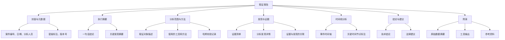
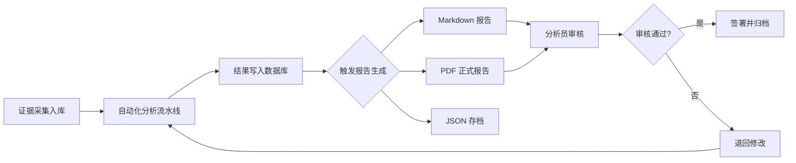

## 25.9 取证报告自动化生成

### 25.9.1 为什么需要自动化报告生成

数字取证分析的最终交付物是**取证报告**——它是连接技术分析与法律裁判的桥梁。一份合格的取证报告必须满足三个条件：**完整性**（覆盖所有关键发现）、**一致性**（格式统一、术语规范）、**可追溯性**（每个结论都有证据支撑）。

然而，手工编写报告面临诸多挑战：

| 痛点 | 具体表现 | 后果 |
|------|----------|------|
| 效率低下 | 一个复杂案件的报告需要 3-7 天手动编写 | 案件周期延长，积压严重 |
| 格式不一致 | 不同分析人员的报告结构、用语差异大 | 降低报告的专业性和可信度 |
| 遗漏风险 | 手动汇总容易遗漏关键发现 | 法庭质证时被动 |
| 版本混乱 | 多次修改后难以追踪变更历史 | 证据链完整性受损 |
| 合规困难 | 难以保证每次都符合标准模板要求 | 报告被法庭拒收 |

自动化报告生成系统通过**模板化 + 数据驱动 + 校验机制**，将上述问题系统性解决。成熟的取证实验室通常能在取证分析完成后 **30 分钟内**自动生成格式规范的报告初稿，分析人员只需进行最终审核和补充。

### 25.9.2 取证报告的结构标准

在构建自动化系统之前，首先需要理解一份合规取证报告的标准结构。国际上广泛认可的框架包括：

**NIST SP 800-86**（美国国家标准与技术研究院）定义的取证报告核心要素：



**ISO/IEC 27037**（数字证据识别、收集、获取和保存指南）要求报告中必须包含：

- **证据完整性声明**：每个证据项的哈希值（MD5 + SHA-256 双重校验）
- **监管链（Chain of Custody）记录**：证据从获取到提交的完整流转记录
- **方法论说明**：所用工具的版本、配置、已知局限性
- **分析人员资质**：持证情况（如 EnCE、CFCE、CCE）

### 25.9.3 报告生成引擎：核心架构

一个生产级的取证报告自动化系统由四个核心模块组成：

```text
┌─────────────────────────────────────────────┐
│              报告生成引擎                     │
├─────────┬──────────┬──────────┬─────────────┤
│ 数据采集 │ 模板引擎 │ 校验模块 │ 输出适配器  │
│  模块   │         │         │             │
├─────────┼──────────┼──────────┼─────────────┤
│ 解析取证 │ Jinja2  │ 完整性   │ Markdown    │
│ 工具输出 │ 模板渲染 │ 一致性   │ HTML/PDF    │
│ 提取关键 │ 变量注入 │ 合规性   │ DOCX        │
│ 发现数据 │ 条件渲染 │          │ JSON(存档)  │
└─────────┴──────────┴──────────┴─────────────┘
```

#### 核心数据模型

```python
from dataclasses import dataclass, field
from datetime import datetime
from enum import Enum
from typing import List, Optional
from hashlib import md5, sha256
import json


class Severity(Enum):
    """发现严重程度等级"""
    CRITICAL = "严重"      # 直接导致安全事件
    HIGH = "高"            # 存在可被利用的漏洞
    MEDIUM = "中"          # 违反安全策略但影响有限
    LOW = "低"             # 不符合最佳实践
    INFO = "信息"          # 值得关注但非问题


class EvidenceStatus(Enum):
    """证据状态"""
    ACQUIRED = "已获取"     # 原始证据已完成采集
    VERIFIED = "已验证"     # 哈希校验通过
    ANALYZING = "分析中"    # 正在进行分析
    ANALYZED = "已分析"     # 分析完成
    ARCHIVED = "已归档"     # 已安全存储


@dataclass
class Evidence:
    """证据项数据模型"""
    evidence_id: str               # 唯一编号，如 EVD-2026-001
    description: str               # 证据描述
    source: str                    # 来源（设备路径、网络地址等）
    hash_md5: str = ""             # MD5 哈希
    hash_sha256: str = ""          # SHA-256 哈希
    acquired_at: Optional[datetime] = None
    acquired_by: str = ""          # 采集人
    status: EvidenceStatus = EvidenceStatus.ACQUIRED
    file_size: int = 0             # 字节数
    format_type: str = ""          # 文件类型（E01、raw、pcap 等）
    custody_chain: List[dict] = field(default_factory=list)

    def verify_hash(self, file_path: str) -> bool:
        """验证证据文件的哈希完整性"""
        actual_md5 = md5()
        actual_sha = sha256()
        with open(file_path, "rb") as f:
            while chunk := f.read(8192):
                actual_md5.update(chunk)
                actual_sha.update(chunk)
        return (
            actual_md5.hexdigest() == self.hash_md5
            and actual_sha.hexdigest() == self.hash_sha256
        )

    def add_custody_event(self, handler: str, action: str, notes: str = ""):
        """记录监管链事件"""
        self.custody_chain.append({
            "timestamp": datetime.now().isoformat(),
            "handler": handler,
            "action": action,
            "notes": notes
        })


@dataclass
class Finding:
    """分析发现数据模型"""
    finding_id: str                # 唯一编号，如 FND-2026-001
    category: str                  # 分类：恶意软件、数据泄露、入侵痕迹等
    title: str                     # 发现标题
    description: str               # 详细描述
    severity: Severity             # 严重程度
    evidence_refs: List[str]       # 关联的证据编号
    timeline_entries: List[dict] = field(default_factory=list)
    recommendation: str = ""       # 建议措施
    confidence: float = 1.0        # 置信度 0.0-1.0
    analyst_notes: str = ""        # 分析人员备注


@dataclass
class CaseInfo:
    """案件基本信息"""
    case_id: str                   # 案件编号
    title: str                     # 案件标题
    client: str                    # 委托方
    classification: str = "机密"   # 密级
    lead_analyst: str = ""         # 主分析员
    team_members: List[str] = field(default_factory=list)
    created_at: datetime = field(default_factory=datetime.now)
    deadline: Optional[datetime] = None
    scope: str = ""                # 分析范围描述
    legal_authority: str = ""      # 法律授权文书编号
```

#### 报告生成器

```python
class ForensicsReportGenerator:
    """取证报告自动化生成器"""

    def __init__(self, case_info: CaseInfo):
        self.case = case_info
        self.findings: List[Finding] = []
        self.evidence: List[Evidence] = []
        self.timeline: List[dict] = []
        self.executive_summary: str = ""
        self.methodology: str = ""
        self.tools_used: List[dict] = []

    def add_finding(self, finding: Finding):
        """添加分析发现"""
        self.findings.append(finding)
        # 自动将发现的时间线条目合并到主时间线
        for entry in finding.timeline_entries:
            entry["finding_id"] = finding.finding_id
            self.timeline.append(entry)
        # 按时间排序
        self.timeline.sort(key=lambda x: x.get("timestamp", ""))

    def add_evidence(self, evidence: Evidence):
        """添加证据项"""
        self.evidence.append(evidence)

    def add_tool(self, name: str, version: str, purpose: str):
        """记录使用的取证工具"""
        self.tools_used.append({
            "name": name,
            "version": version,
            "purpose": purpose
        })

    def set_methodology(self, methodology: str):
        """设置分析方法论描述"""
        self.methodology = methodology

    def set_executive_summary(self, summary: str):
        """设置执行摘要"""
        self.executive_summary = summary

    def _validate_completeness(self) -> list:
        """校验报告完整性，返回缺失项列表"""
        issues = []
        if not self.executive_summary:
            issues.append("缺少执行摘要")
        if not self.methodology:
            issues.append("缺少方法论说明")
        if not self.findings:
            issues.append("没有任何分析发现")
        if not self.evidence:
            issues.append("没有关联证据")
        for f in self.findings:
            if not f.evidence_refs:
                issues.append(f"发现 {f.finding_id} 缺少关联证据")
            if not f.recommendation:
                issues.append(f"发现 {f.finding_id} 缺少处置建议")
        for ev in self.evidence:
            if not ev.hash_sha256:
                issues.append(f"证据 {ev.evidence_id} 缺少 SHA-256 哈希")
            if not ev.custody_chain:
                issues.append(f"证据 {ev.evidence_id} 缺少监管链记录")
        return issues

    def _build_findings_summary_table(self) -> str:
        """构建发现摘要表格"""
        if not self.findings:
            return "_暂无发现_\n"
        
        header = "| 编号 | 分类 | 标题 | 严重程度 | 置信度 | 证据数 |\n"
        separator = "|------|------|------|----------|--------|--------|\n"
        rows = ""
        for f in self.findings:
            rows += (
                f"| {f.finding_id} | {f.category} | {f.title} "
                f"| {f.severity.value} | {f.confidence:.0%} "
                f"| {len(f.evidence_refs)} |\n"
            )
        return header + separator + rows

    def _build_evidence_table(self) -> str:
        """构建证据清单表格"""
        if not self.evidence:
            return "_暂无证据_\n"
        
        header = "| 编号 | 描述 | 来源 | 类型 | 大小 | 状态 |\n"
        separator = "|------|------|------|------|------|------|\n"
        rows = ""
        for ev in self.evidence:
            size_str = self._format_size(ev.file_size)
            rows += (
                f"| {ev.evidence_id} | {ev.description} | {ev.source} "
                f"| {ev.format_type} | {size_str} | {ev.status.value} |\n"
            )
        return header + separator + rows

    def _build_timeline_section(self) -> str:
        """构建时间线分析章节"""
        if not self.timeline:
            return "_暂无时间线数据_\n"
        
        lines = ""
        for i, event in enumerate(self.timeline, 1):
            ts = event.get("timestamp", "未知时间")
            etype = event.get("type", "事件")
            desc = event.get("description", "")
            fid = event.get("finding_id", "")
            tag = f" `[关联: {fid}]`" if fid else ""
            lines += f"**{i}. [{ts}]** {etype}：{desc}{tag}\n\n"
        return lines

    def _build_custody_chain_section(self) -> str:
        """构建监管链记录章节"""
        sections = []
        for ev in self.evidence:
            if not ev.custody_chain:
                continue
            lines = f"#### 证据 {ev.evidence_id} 监管链\n\n"
            lines += "| 时间 | 操作人 | 操作 | 备注 |\n"
            lines += "|------|--------|------|------|\n"
            for event in ev.custody_chain:
                lines += (
                    f"| {event['timestamp']} | {event['handler']} "
                    f"| {event['action']} | {event.get('notes', '')} |\n"
                )
            sections.append(lines)
        return "\n".join(sections) if sections else "_无监管链记录_\n"

    @staticmethod
    def _format_size(size_bytes: int) -> str:
        """将字节数格式化为可读大小"""
        for unit in ["B", "KB", "MB", "GB", "TB"]:
            if size_bytes < 1024:
                return f"{size_bytes:.1f} {unit}"
            size_bytes /= 1024
        return f"{size_bytes:.1f} PB"

    def generate_markdown(self) -> str:
        """生成完整的 Markdown 格式报告"""
        # 先进行完整性校验
        issues = self._validate_completeness()
        
        report = []
        
        # === 封面 ===
        report.append(f"# 数字取证分析报告")
        report.append("")
        report.append(f"- **案件编号**：{self.case.case_id}")
        report.append(f"- **案件标题**：{self.case.title}")
        report.append(f"- **委托方**：{self.case.client}")
        report.append(f"- **密级**：{self.case.classification}")
        report.append(f"- **主分析员**：{self.case.lead_analyst}")
        report.append(f"- **团队成员**：{', '.join(self.case.team_members)}")
        report.append(f"- **报告生成时间**：{datetime.now().strftime('%Y-%m-%d %H:%M:%S')}")
        if self.case.deadline:
            report.append(f"- **截止日期**：{self.case.deadline.strftime('%Y-%m-%d')}")
        if self.case.legal_authority:
            report.append(f"- **法律授权**：{self.case.legal_authority}")
        report.append("")
        
        # === 执行摘要 ===
        report.append("## 执行摘要\n")
        report.append(self.executive_summary)
        report.append("")
        
        # === 发现摘要 ===
        report.append("## 发现摘要\n")
        severity_counts = {}
        for f in self.findings:
            key = f.severity.value
            severity_counts[key] = severity_counts.get(key, 0) + 1
        report.append(f"本次分析共发现 **{len(self.findings)}** 项问题：")
        for sev in ["严重", "高", "中", "低", "信息"]:
            if sev in severity_counts:
                report.append(f"- {sev}：{severity_counts[sev]} 项")
        report.append("")
        report.append(self._build_findings_summary_table())
        report.append("")
        
        # === 分析范围与方法 ===
        report.append("## 分析范围与方法\n")
        report.append("### 分析范围\n")
        report.append(self.case.scope)
        report.append("")
        report.append("### 分析方法\n")
        report.append(self.methodology)
        report.append("")
        report.append("### 使用工具\n")
        if self.tools_used:
            report.append("| 工具 | 版本 | 用途 |")
            report.append("|------|------|------|")
            for tool in self.tools_used:
                report.append(
                    f"| {tool['name']} | {tool['version']} | {tool['purpose']} |"
                )
        report.append("")
        
        # === 证据清单 ===
        report.append("## 证据清单\n")
        report.append(self._build_evidence_table())
        report.append("")
        
        # === 详细发现 ===
        report.append("## 详细发现\n")
        for f in self.findings:
            report.append(f"### {f.finding_id}：{f.title}\n")
            report.append(f"- **分类**：{f.category}")
            report.append(f"- **严重程度**：{f.severity.value}")
            report.append(f"- **置信度**：{f.confidence:.0%}")
            report.append(f"- **关联证据**：{', '.join(f.evidence_refs)}")
            report.append("")
            report.append(f"**描述**：\n{f.description}\n")
            if f.analyst_notes:
                report.append(f"**分析备注**：\n{f.analyst_notes}\n")
            report.append(f"**处置建议**：\n{f.recommendation}\n")
        
        # === 时间线分析 ===
        report.append("## 时间线分析\n")
        report.append(self._build_timeline_section())
        
        # === 结论 ===
        report.append("## 结论与建议\n")
        report.append("### 技术结论\n")
        critical_high = [
            f for f in self.findings
            if f.severity in (Severity.CRITICAL, Severity.HIGH)
        ]
        if critical_high:
            report.append(f"本次分析发现 {len(critical_high)} 项严重/高危问题，需立即处置：")
            for f in critical_high:
                report.append(f"- **{f.finding_id}**（{f.severity.value}）：{f.title}")
        else:
            report.append("未发现严重或高危安全问题。")
        report.append("")
        
        # === 监管链 ===
        report.append("## 监管链记录\n")
        report.append(self._build_custody_chain_section())
        
        # === 完整性校验报告 ===
        report.append("## 报告完整性校验\n")
        if issues:
            report.append("⚠️ 以下校验未通过，报告可能不完整：\n")
            for issue in issues:
                report.append(f"- [ ] {issue}")
        else:
            report.append("✅ 所有完整性校验通过。")
        report.append("")
        
        # === 附录 ===
        report.append("## 附录\n")
        report.append("### A. 证据哈希值对照表\n")
        if self.evidence:
            report.append("| 证据编号 | MD5 | SHA-256 |")
            report.append("|----------|-----|---------|")
            for ev in self.evidence:
                report.append(
                    f"| {ev.evidence_id} | `{ev.hash_md5}` | `{ev.hash_sha256}` |"
                )
        report.append("")
        
        report.append("### B. 免责声明\n")
        report.append(
            "本报告基于委托方提供的证据材料和分析范围进行分析，结论仅限于"
            "分析范围内所涉及的数据。本报告不构成法律意见，仅供委托方参考。"
        )
        report.append("")
        report.append("---")
        report.append(
            f"_报告生成器版本 v1.0 | 生成时间："
            f"{datetime.now().strftime('%Y-%m-%d %H:%M:%S')}_"
        )
        
        return "\n".join(report)

    def generate_json(self) -> str:
        """生成 JSON 格式的结构化报告（用于存档和二次处理）"""
        data = {
            "case": {
                "case_id": self.case.case_id,
                "title": self.case.title,
                "client": self.case.client,
                "classification": self.case.classification,
                "lead_analyst": self.case.lead_analyst,
                "team_members": self.case.team_members,
                "created_at": self.case.created_at.isoformat(),
                "scope": self.case.scope,
            },
            "executive_summary": self.executive_summary,
            "methodology": self.methodology,
            "tools_used": self.tools_used,
            "findings": [
                {
                    "finding_id": f.finding_id,
                    "category": f.category,
                    "title": f.title,
                    "severity": f.severity.value,
                    "confidence": f.confidence,
                    "evidence_refs": f.evidence_refs,
                    "recommendation": f.recommendation,
                }
                for f in self.findings
            ],
            "evidence": [
                {
                    "evidence_id": ev.evidence_id,
                    "description": ev.description,
                    "source": ev.source,
                    "hash_md5": ev.hash_md5,
                    "hash_sha256": ev.hash_sha256,
                    "status": ev.status.value,
                    "custody_chain": ev.custody_chain,
                }
                for ev in self.evidence
            ],
            "timeline": self.timeline,
            "validation_issues": self._validate_completeness(),
            "generated_at": datetime.now().isoformat(),
        }
        return json.dumps(data, ensure_ascii=False, indent=2)
```

### 25.9.4 HTML/PDF 报告模板

Markdown 适合快速查阅，但正式交付通常需要排版精美的 PDF 报告。通过 Jinja2 渲染 HTML 再转换为 PDF，是业界最常见的方案：

```python
from jinja2 import Template

HTML_TEMPLATE = """
<!DOCTYPE html>
<html lang="zh-CN">
<head>
    <meta charset="UTF-8">
    <style>
        body { font-family: "Microsoft YaHei", "SimSun", sans-serif;
               margin: 40px; line-height: 1.8; color: #333; }
        h1 { color: #1a1a2e; border-bottom: 3px solid #e94560;
             padding-bottom: 10px; }
        h2 { color: #16213e; border-bottom: 1px solid #ddd;
             padding-bottom: 5px; margin-top: 30px; }
        h3 { color: #0f3460; }
        table { border-collapse: collapse; width: 100%; margin: 15px 0; }
        th, td { border: 1px solid #ddd; padding: 8px 12px; text-align: left; }
        th { background-color: #1a1a2e; color: white; }
        tr:nth-child(even) { background-color: #f8f9fa; }
        .severity-critical { color: #dc3545; font-weight: bold; }
        .severity-high { color: #fd7e14; font-weight: bold; }
        .severity-medium { color: #ffc107; }
        .severity-low { color: #28a745; }
        .severity-info { color: #17a2b8; }
        .cover { text-align: center; padding: 100px 0; }
        .cover h1 { font-size: 28px; border: none; }
        .metadata { background: #f8f9fa; padding: 15px; border-radius: 5px;
                    margin: 20px 0; }
        .classification { background: #dc3545; color: white;
                         padding: 5px 15px; display: inline-block;
                         font-weight: bold; }
        code { background: #f4f4f4; padding: 2px 6px; border-radius: 3px;
               font-size: 0.9em; }
        .finding-box { border-left: 4px solid #e94560; padding: 10px 15px;
                       margin: 15px 0; background: #fff5f5; }
        .page-break { page-break-before: always; }
        .footer { text-align: center; color: #999; font-size: 0.8em;
                  margin-top: 50px; border-top: 1px solid #ddd; padding-top: 10px; }
    </style>
</head>
<body>
    <!-- 封面 -->
    <div class="cover">
        <div class="classification">{{ case.classification }}</div>
        <h1>数字取证分析报告</h1>
        <p>案件编号：{{ case.case_id }}</p>
        <p>{{ case.title }}</p>
        <div class="metadata">
            <p><strong>委托方：</strong>{{ case.client }}</p>
            <p><strong>主分析员：</strong>{{ case.lead_analyst }}</p>
            <p><strong>报告日期：</strong>{{ report_date }}</p>
        </div>
    </div>

    <div class="page-break"></div>

    <!-- 目录占位 -->
    <h2>目录</h2>
    <p><em>（使用 wkhtmltopdf 或 weasyprint 生成时可自动生成目录）</em></p>

    <div class="page-break"></div>

    <!-- 执行摘要 -->
    <h2>1. 执行摘要</h2>
    <p>{{ executive_summary }}</p>

    <!-- 发现摘要 -->
    <h2>2. 发现摘要</h2>
    <p>共发现 <strong>{{ findings|length }}</strong> 项问题：</p>
    <table>
        <thead>
            <tr>
                <th>编号</th><th>分类</th><th>标题</th>
                <th>严重程度</th><th>置信度</th>
            </tr>
        </thead>
        <tbody>
        
            <tr>
                <td>{{ f.finding_id }}</td>
                <td>{{ f.category }}</td>
                <td>{{ f.title }}</td>
                <td class="severity-{{ f.severity_class }}">{{ f.severity.value }}</td>
                <td>{{ "%.0f"|format(f.confidence * 100) }}%</td>
            </tr>
        
        </tbody>
    </table>

    <!-- 详细发现 -->
    <div class="page-break"></div>
    <h2>3. 详细发现</h2>
    
    <div class="finding-box">
        <h3>{{ f.finding_id }}：{{ f.title }}</h3>
        <p><strong>严重程度：</strong>
           <span class="severity-{{ f.severity_class }}">{{ f.severity.value }}</span>
        </p>
        <p><strong>关联证据：</strong>{{ f.evidence_refs|join(', ') }}</p>
        <p>{{ f.description }}</p>
        
        <p><strong>处置建议：</strong>{{ f.recommendation }}</p>
        
    </div>
    

    <!-- 证据清单 -->
    <div class="page-break"></div>
    <h2>4. 证据清单</h2>
    <table>
        <thead>
            <tr>
                <th>编号</th><th>描述</th><th>来源</th>
                <th>类型</th><th>SHA-256</th>
            </tr>
        </thead>
        <tbody>
        
            <tr>
                <td>{{ ev.evidence_id }}</td>
                <td>{{ ev.description }}</td>
                <td>{{ ev.source }}</td>
                <td>{{ ev.format_type }}</td>
                <td><code>{{ ev.hash_sha256[:16] }}...</code></td>
            </tr>
        
        </tbody>
    </table>

    <div class="footer">
        本报告由取证报告自动化生成系统 v1.0 生成 | {{ report_date }}
    </div>
</body>
</html>
"""


def render_html_report(generator: ForensicsReportGenerator) -> str:
    """将报告数据渲染为 HTML"""
    severity_class_map = {
        Severity.CRITICAL: "critical",
        Severity.HIGH: "high",
        Severity.MEDIUM: "medium",
        Severity.LOW: "low",
        Severity.INFO: "info",
    }
    
    findings_data = []
    for f in generator.findings:
        findings_data.append({
            **f.__dict__,
            "severity_class": severity_class_map.get(f.severity, "info"),
        })
    
    template = Template(HTML_TEMPLATE)
    return template.render(
        case=generator.case,
        findings=findings_data,
        evidence=generator.evidence,
        executive_summary=generator.executive_summary,
        report_date=datetime.now().strftime("%Y-%m-%d %H:%M:%S"),
    )


def html_to_pdf(html_content: str, output_path: str):
    """将 HTML 转换为 PDF（需要 weasyprint 或 wkhtmltopdf）"""
    try:
        from weasyprint import HTML
        HTML(string=html_content).write_pdf(output_path)
        print(f"PDF 报告已生成：{output_path}")
    except ImportError:
        # 备用方案：使用 wkhtmltopdf 命令行工具
        import subprocess
        import tempfile
        
        with tempfile.NamedTemporaryFile(
            mode="w", suffix=".html", delete=False, encoding="utf-8"
        ) as f:
            f.write(html_content)
            html_path = f.name
        
        result = subprocess.run(
            ["wkhtmltopdf", "--encoding", "utf-8", html_path, output_path],
            capture_output=True, text=True
        )
        if result.returncode == 0:
            print(f"PDF 报告已生成：{output_path}")
        else:
            print(f"PDF 生成失败：{result.stderr}")
```

### 25.9.5 与取证工具集成

自动化报告的真正价值在于能直接从主流取证工具的输出中提取数据。以下展示几个常见工具的集成模式：

#### Volatility 内存分析输出解析

```python
import re
import subprocess


def parse_volatility_output(memory_image: str, profile: str) -> dict:
    """解析 Volatility 内存分析结果"""
    results = {}
    
    # 进程列表
    proc_output = subprocess.run(
        ["volatility", "-f", memory_image, "--profile", profile,
         "pslist"],
        capture_output=True, text=True
    )
    results["processes"] = _parse_pslist(proc_output.stdout)
    
    # 网络连接
    net_output = subprocess.run(
        ["volatility", "-f", memory_image, "--profile", profile,
         "netscan"],
        capture_output=True, text=True
    )
    results["network"] = _parse_netscan(net_output.stdout)
    
    # 注册表分析
    reg_output = subprocess.run(
        ["volatility", "-f", memory_image, "--profile", profile,
         "hivelist"],
        capture_output=True, text=True
    )
    results["registry"] = _parse_hivelist(reg_output.stdout)
    
    return results


def _parse_pslist(output: str) -> list:
    """解析 pslist 输出为结构化数据"""
    processes = []
    lines = output.strip().split("\n")
    if len(lines) < 3:
        return processes
    
    # 跳过头部信息行
    for line in lines[2:]:
        parts = line.split()
        if len(parts) >= 7:
            processes.append({
                "pid": int(parts[1]),
                "ppid": int(parts[2]),
                "name": parts[3],
                "create_time": f"{parts[4]} {parts[5]}",
                "exit_time": f"{parts[6]} {parts[7]}" if len(parts) > 7 else "",
            })
    return processes


def _parse_netscan(output: str) -> list:
    """解析 netscan 输出"""
    connections = []
    lines = output.strip().split("\n")
    for line in lines[2:]:
        parts = line.split()
        if len(parts) >= 7:
            connections.append({
                "offset": parts[0],
                "proto": parts[1],
                "local_addr": parts[2],
                "local_port": parts[3],
                "remote_addr": parts[4],
                "remote_port": parts[5],
                "state": parts[6] if len(parts) > 6 else "",
            })
    return connections


def _parse_hivelist(output: str) -> list:
    """解析 hivelist 输出"""
    hives = []
    for line in output.strip().split("\n")[2:]:
        parts = line.split()
        if len(parts) >= 3:
            hives.append({
                "address": parts[0],
                "name": parts[-1],
            })
    return hives
```

#### Autopsy / Sleuth Kit 输出集成

```python
def parse_autopsy_blackboard(output_dir: str) -> list:
    """解析 Autopsy 黑板（Blackboard）输出"""
    import csv
    artifacts = []
    
    # Autopsy 可导出为 TSV/CSV
    for export_file in ["blackboard_artifacts.tsv", "blackboard_artifacts.csv"]:
        filepath = f"{output_dir}/{export_file}"
        try:
            delimiter = "\t" if export_file.endswith(".tsv") else ","
            with open(filepath, "r", encoding="utf-8") as f:
                reader = csv.DictReader(f, delimiter=delimiter)
                for row in reader:
                    artifacts.append({
                        "artifact_type": row.get("Artifact Type", ""),
                        "artifact_id": row.get("Artifact ID", ""),
                        "source_file": row.get("Source File Path", ""),
                        "attributes": {
                            k: v for k, v in row.items()
                            if k not in ("Artifact Type", "Artifact ID",
                                        "Source File Path")
                        }
                    })
            break  # 找到一个就停止
        except FileNotFoundError:
            continue
    
    return artifacts
```

#### Wireshark / tshark 网络取证

```python
def analyze_pcap(pcap_path: str, filters: list = None) -> dict:
    """使用 tshark 分析 PCAP 文件"""
    result = {"stats": {}, "conversations": [], "dns": [], "http": []}
    
    # 基本统计
    stats_output = subprocess.run(
        ["tshark", "-r", pcap_path, "-q", "-z", "io,phs"],
        capture_output=True, text=True
    )
    result["stats"]["protocol_hierarchy"] = stats_output.stdout
    
    # 会话列表
    conv_output = subprocess.run(
        ["tshark", "-r", pcap_path, "-q", "-z", "conv,ip"],
        capture_output=True, text=True
    )
    result["conversations_raw"] = conv_output.stdout
    
    # DNS 查询
    dns_output = subprocess.run(
        ["tshark", "-r", pcap_path, "-Y", "dns.qry.name",
         "-T", "fields", "-e", "dns.qry.name",
         "-e", "ip.dst", "-e", "frame.time"],
        capture_output=True, text=True
    )
    for line in dns_output.stdout.strip().split("\n"):
        if line.strip():
            fields = line.split("\t")
            if len(fields) >= 2:
                result["dns"].append({
                    "query": fields[0],
                    "server": fields[1],
                    "time": fields[2] if len(fields) > 2 else "",
                })
    
    return result
```

### 25.9.6 完整工作流示例

将所有模块组合成一个端到端的自动化流程：

```python
def run_full_report_pipeline(case_data_path: str, output_dir: str):
    """端到端取证报告生成流水线"""
    import os
    
    # 1. 加载案件数据
    with open(case_data_path, "r", encoding="utf-8") as f:
        case_data = json.load(f)
    
    case = CaseInfo(
        case_id=case_data["case_id"],
        title=case_data["title"],
        client=case_data["client"],
        classification=case_data.get("classification", "机密"),
        lead_analyst=case_data["lead_analyst"],
        team_members=case_data.get("team_members", []),
        scope=case_data.get("scope", ""),
        legal_authority=case_data.get("legal_authority", ""),
    )
    
    generator = ForensicsReportGenerator(case)
    
    # 2. 导入证据
    for ev_data in case_data.get("evidence", []):
        evidence = Evidence(
            evidence_id=ev_data["id"],
            description=ev_data["description"],
            source=ev_data["source"],
            hash_md5=ev_data.get("hash_md5", ""),
            hash_sha256=ev_data.get("hash_sha256", ""),
            file_size=ev_data.get("file_size", 0),
            format_type=ev_data.get("format_type", ""),
        )
        # 添加监管链
        for event in ev_data.get("custody_chain", []):
            evidence.add_custody_event(
                event["handler"], event["action"], event.get("notes", "")
            )
        generator.add_evidence(evidence)
    
    # 3. 导入分析发现
    for fnd_data in case_data.get("findings", []):
        severity_map = {
            "critical": Severity.CRITICAL, "high": Severity.HIGH,
            "medium": Severity.MEDIUM, "low": Severity.LOW,
            "info": Severity.INFO,
        }
        finding = Finding(
            finding_id=fnd_data["id"],
            category=fnd_data["category"],
            title=fnd_data["title"],
            description=fnd_data["description"],
            severity=severity_map.get(fnd_data.get("severity", "info"),
                                      Severity.INFO),
            evidence_refs=fnd_data.get("evidence_refs", []),
            recommendation=fnd_data.get("recommendation", ""),
            confidence=fnd_data.get("confidence", 1.0),
        )
        # 导入时间线条目
        for tl in fnd_data.get("timeline", []):
            finding.timeline_entries.append(tl)
        generator.add_finding(finding)
    
    # 4. 设置方法论和摘要
    generator.set_methodology(case_data.get("methodology", ""))
    generator.set_executive_summary(case_data.get("executive_summary", ""))
    
    # 5. 记录工具
    for tool in case_data.get("tools", []):
        generator.add_tool(tool["name"], tool["version"], tool["purpose"])
    
    # 6. 生成报告
    os.makedirs(output_dir, exist_ok=True)
    
    # Markdown
    md_content = generator.generate_markdown()
    md_path = os.path.join(output_dir, f"report_{case.case_id}.md")
    with open(md_path, "w", encoding="utf-8") as f:
        f.write(md_content)
    print(f"Markdown 报告：{md_path}")
    
    # JSON（存档）
    json_content = generator.generate_json()
    json_path = os.path.join(output_dir, f"report_{case.case_id}.json")
    with open(json_path, "w", encoding="utf-8") as f:
        f.write(json_content)
    print(f"JSON 存档：{json_path}")
    
    # HTML + PDF
    html_content = render_html_report(generator)
    html_path = os.path.join(output_dir, f"report_{case.case_id}.html")
    with open(html_path, "w", encoding="utf-8") as f:
        f.write(html_content)
    print(f"HTML 报告：{html_path}")
    
    pdf_path = os.path.join(output_dir, f"report_{case.case_id}.pdf")
    html_to_pdf(html_content, pdf_path)
    
    # 7. 校验结果
    issues = generator._validate_completeness()
    if issues:
        print(f"\n⚠️ 报告完整性校验发现 {len(issues)} 个问题：")
        for issue in issues:
            print(f"  - {issue}")
    else:
        print("\n✅ 报告完整性校验全部通过")
    
    return generator
```

### 25.9.7 常见陷阱与最佳实践

**陷阱 1：哈希值仅用 MD5**

MD5 已被证明存在碰撞攻击，仅使用 MD5 作为证据完整性校验在法庭上可能被质疑。**必须同时使用 MD5 和 SHA-256**（或更高版本），前者保证与历史记录兼容，后者提供更强的安全保证。

**陷阱 2：时间线未统一时区**

当涉及跨地域调查时，不同证据的时间戳可能来自不同时区。**务必在导入时统一转换为 UTC 或明确标注时区**，否则时间线会出现逻辑矛盾。

```python
from datetime import datetime, timezone
import pytz

def normalize_timestamp(ts_str: str, source_tz: str, 
                        target_tz: str = "UTC") -> str:
    """统一时间戳时区"""
    source = pytz.timezone(source_tz)
    target = pytz.timezone(target_tz)
    dt = datetime.strptime(ts_str, "%Y-%m-%d %H:%M:%S")
    dt = source.localize(dt)
    dt = dt.astimezone(target)
    return dt.strftime("%Y-%m-%d %H:%M:%S %Z")
```

**陷阱 3：报告模板不版本化**

当报告模板更新后，旧案件的报告如果用新模板重新生成，可能导致格式不一致。**模板文件必须和报告一起归档**，并记录模板版本号。

**陷阱 4：置信度评估缺失**

自动化生成容易给人"机器产出 = 客观事实"的错觉。**每个发现必须标注置信度**，由分析人员根据证据充分性进行评估。置信度低于 0.7 的发现在报告中应标注为"待进一步验证"。

**陷阱 5：忽略多语言需求**

面向国际案件的报告需要考虑多语言输出。使用 Jinja2 模板配合翻译资源文件，可以实现中英文双语报告生成：

```python
TRANSLATIONS = {
    "zh": {
        "report_title": "数字取证分析报告",
        "executive_summary": "执行摘要",
        "findings": "分析发现",
        "evidence": "证据",
        "severity_critical": "严重",
        "severity_high": "高",
    },
    "en": {
        "report_title": "Digital Forensic Analysis Report",
        "executive_summary": "Executive Summary",
        "findings": "Findings",
        "evidence": "Evidence",
        "severity_critical": "Critical",
        "severity_high": "High",
    }
}

def generate_bilingual_report(generator: ForensicsReportGenerator, 
                              output_dir: str):
    """生成中英文双语报告"""
    for lang, strings in TRANSLATIONS.items():
        generator.case.title_display = strings  # 注入翻译
        md = generator.generate_markdown()
        path = f"{output_dir}/report_{generator.case.case_id}_{lang}.md"
        with open(path, "w", encoding="utf-8") as f:
            f.write(md)
        print(f"双语报告已生成：{path}")
```

### 25.9.8 进阶：CI/CD 集成与持续监控

在大型取证实验室中，报告生成可以集成到持续工作流中：



**关键实践：**

- **数据库驱动**：所有分析结果存入 SQLite/PostgreSQL，报告生成器从数据库读取，实现数据与展示分离
- **增量更新**：新证据入库后自动追加到现有报告，而非重新生成
- **审核工作流**：报告生成后自动通知主分析员审核，审核状态记录在案
- **版本控制**：每次报告修改自动创建版本快照，支持任意版本回溯
- **模板热更新**：模板变更只影响新报告，已有报告保持原始格式

```python
import sqlite3
import hashlib
import os


class ReportDatabase:
    """报告数据库管理器"""
    
    def __init__(self, db_path: str):
        self.conn = sqlite3.connect(db_path)
        self._init_tables()
    
    def _init_tables(self):
        """初始化数据库表结构"""
        self.conn.executescript("""
            CREATE TABLE IF NOT EXISTS cases (
                case_id TEXT PRIMARY KEY,
                title TEXT,
                client TEXT,
                created_at TEXT
            );
            CREATE TABLE IF NOT EXISTS evidence (
                evidence_id TEXT PRIMARY KEY,
                case_id TEXT,
                description TEXT,
                hash_sha256 TEXT,
                status TEXT,
                FOREIGN KEY (case_id) REFERENCES cases(case_id)
            );
            CREATE TABLE IF NOT EXISTS findings (
                finding_id TEXT PRIMARY KEY,
                case_id TEXT,
                category TEXT,
                title TEXT,
                severity TEXT,
                confidence REAL,
                status TEXT DEFAULT 'draft',
                FOREIGN KEY (case_id) REFERENCES cases(case_id)
            );
            CREATE TABLE IF NOT EXISTS report_versions (
                version_id INTEGER PRIMARY KEY AUTOINCREMENT,
                case_id TEXT,
                template_version TEXT,
                file_path TEXT,
                file_hash TEXT,
                generated_at TEXT,
                FOREIGN KEY (case_id) REFERENCES cases(case_id)
            );
        """)
        self.conn.commit()
    
    def save_report_version(self, case_id: str, file_path: str,
                            template_version: str = "v1.0"):
        """保存报告版本快照"""
        with open(file_path, "rb") as f:
            file_hash = hashlib.sha256(f.read()).hexdigest()
        
        self.conn.execute(
            "INSERT INTO report_versions "
            "(case_id, template_version, file_path, file_hash, generated_at) "
            "VALUES (?, ?, ?, ?, ?)",
            (case_id, template_version, file_path, file_hash,
             datetime.now().isoformat())
        )
        self.conn.commit()
    
    def get_report_history(self, case_id: str) -> list:
        """获取报告版本历史"""
        cursor = self.conn.execute(
            "SELECT version_id, template_version, file_path, "
            "file_hash, generated_at "
            "FROM report_versions WHERE case_id = ? "
            "ORDER BY generated_at DESC",
            (case_id,)
        )
        return [
            {"version_id": r[0], "template_version": r[1],
             "file_path": r[2], "file_hash": r[3], "generated_at": r[4]}
            for r in cursor.fetchall()
        ]
```

### 25.9.9 本节小结

| 能力层级 | 内容 | 适用场景 |
|----------|------|----------|
| 基础 | Python 类封装 + Markdown 输出 | 小型案件、个人使用 |
| 进阶 | HTML/PDF 渲染 + 取证工具解析 | 实验室日常产出 |
| 高级 | 数据库驱动 + 版本控制 + 审核流程 | 大型机构、合规要求 |

自动化报告生成不是取代分析人员，而是将他们从重复性的格式工作中解放出来，把精力集中在**高价值的分析判断**上。一个好的自动化系统应该做到：数据录入规范 → 分析结果结构化 → 报告生成一键化 → 质量校验自动化 → 版本管理全程化。
