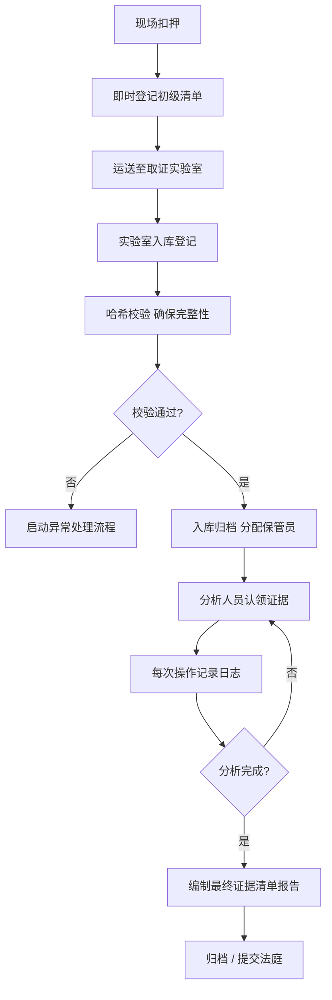

# 证据清单：从发现到呈堂的完整管理链路

## 概述

数字证据清单（Digital Evidence Inventory）是数字取证工作中最基础也最容易被忽视的环节。它远不止是一张简单的物品登记表，而是贯穿证据生命周期——从发现、固定、保存、分析到呈堂——的完整管理框架。在法律语境中，证据清单直接服务于 **证据链（Chain of Custody）** 的建立与维护，是法庭认可取证结论的基石。

> **核心命题：** 无法被追溯的证据，在法律上等同不存在。证据清单的质量决定了整个取证报告的法律效力。

本章从理论基础出发，逐层深入证据清单的编制方法、技术工具、质量管控与法律应对，覆盖从入门到精通的全链路知识。

---

## 第一章：证据清单的理论基础

### 1.1 什么是数字证据清单

数字证据清单是一份结构化记录，详细描述取证过程中所涉及每一件数字证据的：

- **身份标识**（证据编号、来源设备、获取时间）
- **物理/逻辑属性**（设备型号、序列号、文件路径、存储介质容量）
- **完整性凭证**（哈希值、数字签名、时间戳）
- **流转记录**（经手人员、操作内容、交接时间、保管地点）
- **状态标记**（未处理 / 正在分析 / 已完成 / 已归档 / 已返还）

与传统物证清单不同，数字证据清单必须同时处理**物理载具**（硬盘、手机、U盘）和**逻辑对象**（文件、数据库记录、网络流量抓包）两个层次，并建立两者之间的映射关系。

### 1.2 为什么需要证据清单：法律与技术的双重驱动

#### 法律层面

证据清单的法律基础源于英美法系的 **Chain of Custody（证据保管链）** 原则。该原则要求：

1. **连续性**：从证据被扣押到呈上法庭的每一分钟，都必须有人为其负责。
2. **完整性**：证明证据在此期间未被篡改、替换或污染。
3. **可追溯**：每一环节的操作人和操作内容必须记录在案。

在《联邦证据规则》（FRE 901）和《电子证据法庭采纳标准》（Daubert 标准）中，缺失证据清单可直接导致证据被排除。

> **典型案例**：2012 年 US v. Loughry 案中，FBI 取证人员在硬盘镜像制作后未及时记录哈希值，辩护律师据此质疑证据完整性，最终该硬盘数据被裁定不可作为定罪依据。

#### 技术层面

从工程角度看，证据清单解决了以下实际痛点：

- **大规模取证场景下的管理失控**：一次搜查可能涉及数十台设备、数百 TB 数据，无清单必然导致遗漏或重复。
- **多人协作的责任边界**：取证团队中谁负责镜像、谁负责分析、谁负责归档，清单提供了明确的职责分割。
- **回溯与复现**：当分析结论被质疑时，清单是唯一能准确还原操作历史的可靠记录。

### 1.3 证据清单的核心原则

| 原则 | 说明 | 违反后果 |
|------|------|----------|
| **完整性** | 所有接触过的证据都必须记录，无一遗漏 | 遗漏项无法被法庭引用 |
| **即时性** | 证据一旦获得立即记录，不可事后补写 | 记忆偏差导致记录失实 |
| **不可逆性** | 已记录的条目不得删除或覆盖，只能新增版本 | 伪造或篡改嫌疑 |
| **独立性** | 记录者不应同时是分析者，避免利益冲突 | 证据公信力受损 |
| **最小化** | 只记录必要信息，避免过度收集导致隐私争议 | 隐私侵权诉讼风险 |

---

## 第二章：证据清单的完整结构

### 2.1 标准字段体系

一份合规的数字证据清单至少应包含以下四个维度、二十余个字段：

#### 维度一：证据标识（身份层）

| 字段 | 描述 | 示例 |
|------|------|------|
| 证据编号 | 唯一流水号，推荐格式 `YYYYMMDD-NNN` | `20260625-001` |
| 证据名称 | 简明描述 | "iPhone 15 Pro（嫌疑人A主设备）" |
| 证据类别 | `物理载具` / `数字文件` / `网络数据` / `日志` | 物理载具 |
| 来源地址 | 扣押现场位置或源设备路径 | "3F 书房书桌右侧抽屉" |

#### 维度二：完整性凭证（校验层）

| 字段 | 描述 | 示例 |
|------|------|------|
| 原始文件/设备哈希值 | 取证前的 SHA-256 | `e3b0c44298fc1c149afbf4c8996fb92427ae41e4649b934ca495991b7852b855` |
| 镜像文件哈希值 | 镜像制作后的验证哈希 | 同上（应匹配） |
| 哈希算法 | 使用的算法名称 | `SHA-256` |
| 数字时间戳 | 经 RFC 3161 时间戳服务认证的时间 | `2026-06-25T09:30:00Z` |

#### 维度三：流转记录（保管链层）

| 字段 | 描述 | 示例 |
|------|------|------|
| 扣押/获取人 | 首次获取证据的人员 | "李四（警号 0817）" |
| 扣押时间 | ISO 8601 格式 | `2026-06-25T09:15:00+08:00` |
| 每次交接记录 | 人员 → 人员 + 时间 + 目的 | "2026-06-25 10:00 李四→王五，移交镜像制作" |
| 当前保管人 | 当前持有者 | "王五" |
| 保管地点 | 物理存放位置 | "证物柜 A-12 层" |
| 保管条件 | 温度、湿度、防磁等 | "23°C，45% RH，防静电袋" |

#### 维度四：状态与备注（管控层）

| 字段 | 描述 | 示例 |
|------|------|------|
| 当前状态 | `已扣押` / `镜像中` / `分析中` / `已完成` / `已归档` | 镜像中 |
| 关联证据编号 | 与此证据相关的其他证据 | `20260625-001`（原始盘）↔ `20260625-001-IMG`（镜像） |
| 备注 | 异常情况、特殊处理说明 | "设备处于飞行模式，已用 Faraday 袋封装" |
| 关联案件号 | 所属案件 | `CASE-2026-0618` |

### 2.2 推荐记录模板

#### 模板一：Excel / CSV 电子清单（适用团队协作）

```csv
证据编号,证据名称,类别,来源,哈希值(SHA-256),扣押人,扣押时间,当前保管人,状态,备注
20260625-001,iPhone 15 Pro,物理载具,书房抽屉,未计算(扣押时),李四,2026-06-25T09:15,李四,已扣押,"飞行模式,Faraday袋"
20260625-002,书房PC-1(SSD 1TB),物理载具,书房桌面,需提取后计算,李四,2026-06-25T09:18,李四,已扣押,密码锁定
20260625-003,Wi-Fi路由器日志,逻辑文件,书房,N/A(在线提取),王五,2026-06-25T09:30,王五,分析中,通过物理串口提取
```

#### 模板二：纸质标签（适用现场扣押）

```text
┌──────────────────────────────────┐
│ 证据编号: 20260625-001           │
│ 设备类型: iPhone 15 Pro          │
│ 颜色/容量: 深黑 / 256GB          │
│ IMEI: 3567XXXXXXXXXXX            │
│ 扣押位置: 3F书房右侧抽屉          │
│ 扣押时间: 2026-06-25 09:15       │
│ 扣押人: 李四 (签名)              │
│ 第一次交接: ___ → ___ / ___:___  │
│ 第二次交接: ___ → ___ / ___:___  │
└──────────────────────────────────┘
```

#### 模板三：数据库驱动（适用专业取证团队）

对于专业团队，应使用取证实验室管理系统（如 **FTK Lab**、**EnCase Evidence Processor**）的数据库模式，所有字段通过表单录入，自动关联案件和人员信息。核心表结构设计建议如下：

```sql
CREATE TABLE evidence_items (
    id VARCHAR(20) PRIMARY KEY,
    case_id VARCHAR(20) NOT NULL REFERENCES cases(id),
    name TEXT NOT NULL,
    category ENUM('physical', 'logical', 'network', 'log'),
    source_location TEXT,
    hash_original VARCHAR(128),
    hash_algo VARCHAR(20) DEFAULT 'SHA-256',
    timestamp_seized TIMESTAMP NOT NULL,
    seized_by VARCHAR(50) NOT NULL,
    current_custodian VARCHAR(50),
    storage_location VARCHAR(100),
    status ENUM('seized','imaging','analyzing','completed','archived','returned'),
    notes TEXT,
    created_at TIMESTAMP DEFAULT CURRENT_TIMESTAMP,
    updated_at TIMESTAMP DEFAULT CURRENT_TIMESTAMP ON UPDATE CURRENT_TIMESTAMP
);

CREATE TABLE chain_of_custody (
    id INT AUTO_INCREMENT PRIMARY KEY,
    evidence_id VARCHAR(20) NOT NULL REFERENCES evidence_items(id),
    from_person VARCHAR(50) NOT NULL,
    to_person VARCHAR(50) NOT NULL,
    transfer_time TIMESTAMP NOT NULL,
    purpose TEXT,
    signature_from TEXT,
    signature_to TEXT
);
```

---

## 第三章：证据清单的实操流程

### 3.1 流程概览



### 3.2 第一步：现场扣押与初级登记

在现场扣押阶段，速度与准确度同样重要。操作要点：

1. **拍照先行**：在触碰任何设备之前，先拍摄现场全景和近景照片，记录设备的摆放位置、连接状态、屏幕显示内容。
2. **隔离物理访问**：设备装入 Faraday 袋（手机等无线设备）或防静电袋（硬盘等），防止远程擦除或静电损坏。
3. **填写初级标签**：使用上述纸质模板，手写填写标识信息。**不要等待回实验室再填写**，现场记忆在 30 分钟后就会衰减。
4. **检查电源状态**：记录设备电量百分比。如电量 < 20%，立即连接便携电源，防止自动关机导致加密锁死。
5. **特殊标记**：对已加密设备、破损设备、正在运行的设备做醒目标记，提示后续操作需特殊处理。

### 3.3 第二步：实验室入库登记

证据运送至实验室后，由**证据管理员（Evidence Custodian）** 完成入库：

1. **核对初级登记**：对照现场照片和标签，确认物品无遗漏、无调换。
2. **录入系统**：将所有字段录入实验室管理系统，生成电子证据记录。
3. **分配永久编号**：系统自动生成 `YYYYMMDD-NNN` 格式编号，关联案件号。
4. **物理位置分配**：将证据放入对应保管柜，记录位置编号。
5. **通知案件负责人**：入库完成，案件负责人可在系统中查看所有可用证据。

### 3.4 第三步：镜像制作与哈希验证

这是保证数字证据完整性的**最关键环节**：

```bash
#!/bin/bash
# 证据镜像脚本 - 生成验证文件名与哈希记录

EVIDENCE_ID="$1"
SOURCE_DEVICE="$2"
IMG_DIR="/evidence_images/${EVIDENCE_ID}"

mkdir -p "${IMG_DIR}"

# 1. 先计算源设备哈希
echo "计算源设备哈希..."
sha256sum "${SOURCE_DEVICE}" > "${IMG_DIR}/${EVIDENCE_ID}.sha256"

# 2. 创建镜像（使用 dd 或 dc3dd，后者支持日志）
echo "开始镜像..."
dc3dd if="${SOURCE_DEVICE}" \
      of="${IMG_DIR}/${EVIDENCE_ID}.dd" \
      hash=sha256 \
      log="${IMG_DIR}/${EVIDENCE_ID}.log" \
      opts="bs=4M status=progress"

# 3. 验证镜像文件哈希与源哈希一致
echo "验证镜像完整性..."
MD5_IMG=$(sha256sum "${IMG_DIR}/${EVIDENCE_ID}.dd" | cut -d' ' -f1)
SHA_ORIG=$(cat "${IMG_DIR}/${EVIDENCE_ID}.sha256" | cut -d' ' -f1)

if [ "${MD5_IMG}" = "${SHA_ORIG}" ]; then
    echo "✅ 哈希匹配，镜像验证通过" | tee -a "${IMG_DIR}/${EVIDENCE_ID}_verify.log"
else
    echo "❌ 哈希不匹配！镜像可能损坏！" | tee -a "${IMG_DIR}/${EVIDENCE_ID}_verify.log"
fi
```

**验证结果需记录在证据清单的"完整性凭证"字段中**，并附上验证人签名和验证时间。

### 3.5 第四步：分析阶段的持续记录

在分析阶段，证据清单需要反映以下操作：

- **每次挂载/读取**：记录挂载时间、使用的只读锁（如 Tableau T35u）、机器编号。
- **每次提取文件**：记录提取的文件路径、提取工具、提取人、提取目的。
- **每次恢复操作**：记录恢复的文件列表、使用的恢复工具和参数。
- **每次分析结论**：记录分析工具输出的摘要，附截图。

建议使用实验室管理系统自动捕获这些操作。如果使用 **Autopsy** 或 **X-Ways Forensics**，这些工具本身会生成分析日志，将这些日志导入证据清单作为附件。

---

## 第四章：证据清单的核心工具

### 4.1 专用取证实验室管理系统

| 工具 | 特点 | 适用场景 |
|------|------|----------|
| **FTK Lab**（AccessData） | 完整的证据生命周期管理，支持多用户协作、自动化哈希校验 | 大型取证实验室 |
| **EnCase Evidence Processor** | 深度集成 EnCase 分析引擎，支持分布式处理 | 已在用 EnCase 的团队 |
| **Delinea (原 Thycotic) Secret Server + 取证模块** | 混合管理凭证与证据，适合处理加密设备 | 需要凭证管理的场景 |
| **OpenText EnCase eDiscovery** | 聚焦电子发现流程中的证据管理 | 企业合规调查 |

### 4.2 开源/轻量方案

| 工具 | GitHub / 地址 | 功能 |
|------|-------------|------|
| **OpenSupports** | opensupports.com | 轻量工单系统，可改编为证据管理 |
| **Redmine / OTRS** | redmine.org | 开源 ITSM，自定义字段适配证据管理 |
| **公证云** | notary.cn | 国内电子证据固化平台，提供司法鉴定对接 |
| **自建清单 + Git 仓库** | — | CSV 清单 + Git 提交记录作为不可篡改的日志 |

### 4.3 哈希验证工具

| 工具 | 命令示例 | 适用 |
|------|----------|------|
| `sha256sum` (Linux 内置) | `sha256sum /dev/sdb > evidence.hash` | 通用 |
| `dc3dd` (取证专用 dd) | `dc3dd if=/dev/sdb of=img.dd hash=sha256 log=log.txt` | 取证场景标准 |
| `Guymager` (GUI) | — | 图形化镜像+哈希 |
| `FTK Imager` (Windows GUI) | — | Windows 取证标准工具 |
| `HashCat` | — | 不用于验证，用于破解密码哈希 |

---

## 第五章：常见误区与纠偏

### 误区一：证据清单是分析阶段才需要准备的东西

**错误认知**："先把数据提取回来，最后再整理清单。"

**纠正**：证据清单应从**扣押那一刻**开始。事后补写的清单：
- 容易遗漏细节（如设备初始状态、屏幕内容、环境条件）
- 无法满足"即时性"原则，法庭上辩护律师会质疑其可信度
- 容易导致多条证据记混

**正确做法**：现场准备一份简版清单（纸质标签），回实验室 2 小时内补录完整电子版本。

### 误区二：哈希值计算一次就够了

**错误认知**：只有在镜像制作时计算一次哈希，之后就无需再校验。

**纠正**：哈希值应在以下**四个时间点**分别计算并记录：
1. 扣押时（现场快速计算，用便携设备）
2. 镜像制作后（验证镜像与源一致）
3. 每次分析操作前后（确保分析过程未造成污染）
4. 提交法庭前（最终完整性确认）

### 误区三：虚拟化和云环境不需要证据清单

**错误认知**："虚拟机文件就是证据本身，不需要额外的清单体系。"

**纠正**：云环境（AWS S3 快照、VMware vmdk、Docker 容器层）中的证据需要**双重清单**：
- **逻辑层**：文件路径、存储桶、区域、标签
- **元数据层**：创建时间、修改时间、访问日志、IAM 操作记录

云环境数据比物理设备更容易被无声无息地修改（生命周期策略、快照自动删除、版本控制覆盖），因此需要更高频率的清单更新和哈希校验。

### 误区四：证据清单自己能当作法庭证据

**错误认知**："只要我们的证据清单写得详细，法院就会采纳。"

**纠正**：证据清单本身只是**辅助记录**，不是证据。它需要与其他材料相互印证：
- 现场照片/视频（证明扣押过程）
- 时间戳服务（RFC 3161）回执（证明操作时间）
- 监控录像（证明实验室操作过程）
- 证人证言（证明交接过程）

证据清单的作用是**帮助这些材料形成逻辑闭环**，而不是替代它们。

---

## 第六章：典型场景与案例分析

### 场景一：企业内鬼调查

**背景**：某金融科技公司发现核心交易算法源码被泄露到 GitHub 匿名仓库，怀疑是内部员工所为。

**证据清单应用**：

```text
证据编号: 20260625-101
名称: 嫌疑人A 工作笔记本 (ThinkPad X1 Carbon)
来源: A工位 (32F-B15)
状态: 已扣押 → 镜像完成 → 分析中

关键记录：
- 扣押时间: 2026-06-25 08:30
- 扣押时状态: 开机状态，屏幕锁屏
- 哈希: SHA-256 = a1b2c3...（源盘）
- 镜像人: 王五
- 镜像时间: 2026-06-25 09:15-11:30
- 镜像设备: Tableau T35u + Guymager
- 镜像哈希: SHA-256 = a1b2c3...（匹配 ✅）
- 分析人: 赵六
- 提取文件: /Users/A/Documents/git_push_history.txt
- 提取工具: bulk_extractor
```

**关键教训**：由于 08:30 扣押时及时记录了屏幕锁屏状态，后续分析中排除了"远程擦除"的可能性。证据清单中的"开机状态"字段帮助分析团队选择了正确的数据提取策略（先做内存转储，再关机做磁盘镜像）。

### 场景二：跨省电信诈骗案

**背景**：专案组在三个省份同时收网，扣押 40 余台手机、20 台电脑、50 余张 SIM 卡和银行卡。

**挑战**：如何保证跨省证据不混淆、不丢失、不交叉污染？

**证据清单方案**：
1. **编号体系**：`GH-2026-SH-001`（省份-年份-城市-序号）预先印制，各抓捕组领取对应编号段的标签纸。
2. **现场登记员**：每组配备一名专职记录员，仅负责证据登记，不参与抓捕和扣押操作。
3. **微信群实时同步**：每件证据登记完毕后拍照上传，其他组可实时查看，避免重复编号。
4. **集中入库**：所有证据在 24 小时内集中送至主导省份的取证中心，由证据管理员统一切入园验收。

**结果**：案件中 87 件数字证据无一丢失，171 项证据清单记录全部在庭审中被采信，无辩护律师对保管链提出有效质疑。

### 场景三：手机取证中的"加密困局"

**背景**：扣押一台 iPhone 14 Pro，型号支持 USB Restricted Mode（USB 限制模式）。扣押时设备已锁屏超过 1 小时，Lightning 接口已禁用数据通信。

**证据清单中的特殊处理记录**：

```text
证据编号: 20260625-042
设备: iPhone 14 Pro (iOS 17.x)
特殊情况:
- 已锁屏超过1小时 → USB Restricted Mode 已激活
- 无法通过 USB 通信 → 无法使用 checkm8 等漏洞
- 当前电量: 34%
处理方案:
1. 立即放入 Faraday 袋防止远程擦除
2. 保持通电状态，电量降至 10% 前尝试磁吸充电宝
3. 物理方式获取 iCloud 备份授权（搜索相关 Apple ID 凭据）
4. 如无法获取，转入 APFS 逻辑分析（通过已解锁的关联 Mac 提取部分数据）
```

**关键教训**：没有证据清单中的"特殊情况"记录，后续分析团队可能会花费数小时尝试无效的 USB 提取方法。清单帮助团队快速评估现状并切换到最可行的方案。

---

## 第七章：进阶内容

### 7.1 区块链式证据清单设计

对于高度敏感的司法案件，可以引入区块链技术实现证据清单的不可篡改特性。核心思路：

1. **每件证据生成一条链上记录**，包含证据哈希和操作摘要。
2. **后续每次操作生成新区块**，链接到前一个操作记录。
3. **最终证据清单的 Merkle Root** 上传到公开区块链（如以太坊、Fabric 联盟链），供法庭独立验证。

```python
import hashlib
import json
from datetime import datetime

class Block:
    def __init__(self, index, evidence_id, operation, operator, prev_hash, timestamp=None):
        self.index = index
        self.evidence_id = evidence_id
        self.operation = operation
        self.operator = operator
        self.timestamp = timestamp or datetime.utcnow().isoformat()
        self.prev_hash = prev_hash
        self.data_hash = self._compute_data_hash()
        self.hash = self._compute_block_hash()

    def _compute_data_hash(self):
        payload = f"{self.evidence_id}{self.operation}{self.operator}{self.timestamp}"
        return hashlib.sha256(payload.encode()).hexdigest()

    def _compute_block_hash(self):
        payload = f"{self.index}{self.prev_hash}{self.data_hash}"
        return hashlib.sha256(payload.encode()).hexdigest()

class EvidenceChain:
    def __init__(self, evidence_id, initial_custodian):
        genesis = Block(0, evidence_id, "SEIZED", initial_custodian, "0" * 64)
        self.chain = [genesis]

    def add_operation(self, evidence_id, operation, operator):
        new_block = Block(
            len(self.chain),
            evidence_id,
            operation,
            operator,
            self.chain[-1].hash
        )
        self.chain.append(new_block)

    def validate(self):
        for i in range(1, len(self.chain)):
            prev = self.chain[i - 1]
            curr = self.chain[i]
            if curr.prev_hash != prev.hash:
                return False, f"Block {curr.index}: prev_hash mismatch"
            if curr.hash != curr._compute_block_hash():
                return False, f"Block {curr.index}: hash tampered"
        return True, "Chain valid"

# 使用示例
ec = EvidenceChain("20260625-001", "李四")
ec.add_operation("20260625-001", "IMAGING", "王五")
ec.add_operation("20260625-001", "ANALYSIS_START", "赵六")
ec.add_operation("20260625-001", "FILE_EXTRACTED: /path/to/evidence", "赵六")
print(ec.validate())
```

### 7.2 自动化证据清单生成

借助工具链实现全自动化，减少人为疏漏：

```yaml
# 自动化流程 pipeline（适用于实验室级别）
stages:
  - name: ingest
    action: 自动检测插入的存储设备，生成初始清单记录
    tool: udev rule + 自定义 Python 脚本
  - name: hash
    action: 自动计算并记录 SHA-256
    tool: sha256sum / udev 触发脚本
  - name: image
    action: 自动启动 dc3dd 镜像流程
    tool: bash + dc3dd
  - name: verify
    action: 镜像完成后自动比对哈希
    tool: sha256sum + diff
  - name: label
    action: 打印证据标签（含二维码，扫码可查）
    tool: labelprinter + Python + qrcode 库
  - name: archive
    action: 镜像归档至 NAS，记录存储路径
    tool: rsync + SQLite 数据库
```

### 7.3 与法律法规的衔接

不同司法管辖区对证据清单有不同要求：

| 地区 | 参考法规 | 特殊要求 |
|------|---------|---------|
| 中国 | 《电子数据取证与鉴定实验室能力认可准则》CNAS-CL27 | 要求实验室建立完整的证据保管链管理制度，设备需定期校准 |
| 美国 | FRE 901 / Daubert 标准 | 证据清单操作人需具备资质认证（如 GCFE、CCE） |
| 欧盟 | GDPR + e-Evidence Regulation | 证据清单需标注数据跨境传输情况，明确数据保护影响评估 |
| 英国 | PACE Code B / ACPO 原则 | 证据清单需遵守统一格式，需两名证人签字 |

---

## 第八章：检查清单与自评

### 完成证据清单后的自查项目

- [ ] 每件证据都有唯一编号，且编号与实物标签一致
- [ ] 每件证据的哈希值已记录，且在镜像后完成了交叉验证
- [ ] 每件证据的保管链流转记录完整，没有"时间空白期"
- [ ] 所有操作人员签名齐全，无代签、漏签
- [ ] 证据状态标记与实际情况一致
- [ ] 特殊情况（加密、破损、高安全性设备）已做醒目标记和备注
- [ ] 物理保管位置与系统记录一致
- [ ] 电子证据清单已做多副本备份（本地 + 网络 + 打印件）
- [ ] 已记录证据时间戳（RFC 3161）
- [ ] 清单中的时间全部使用 ISO 8601 格式并标注时区
- [ ] 如涉及云环境证据，已记录存储桶 / 区域 / 生命周期策略
- [ ] 所有证据的关联关系已建立（原始盘 ↔ 镜像 ↔ 分析结果）

---

## 总结

证据清单不是实验室里的一个文档，而是贯穿取证全生命周期的**管理主线**。从发现的那一刻起，每一件数字证据都应该被精确标识、完整记录、持续追踪。在这条链路上，经手人员的每一次签名、工具的每一次日志输出、时间的每一个标记，最终都会汇聚成法庭上无可辩驳的完整性证明。

> **一句话总结**：你能把证据链追溯得多清晰，你的取证结论就能站得多稳。

---

**关联阅读**：
- 第 25 章-数字取证/核心技巧/06-哈希校验.md
- 第 25 章-数字取证/核心技巧/07-镜像制作.md
- 第 25 章-数字取证/核心技巧/12-取证报告编写.md