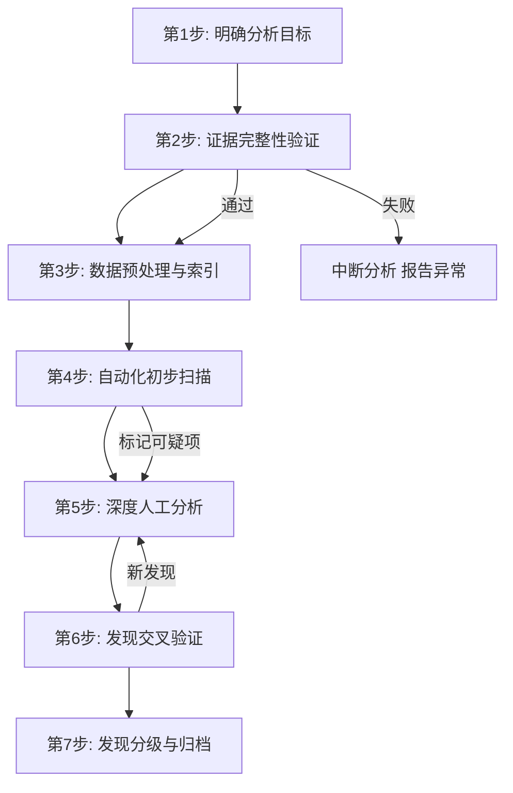
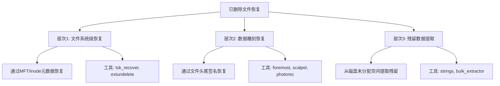

# 分析发现：从数据到证据的系统化方法

## 概述

数字取证的终极目标不是收集数据，而是从数据中提取有意义的**分析发现**（Analysis Findings）——能够回答调查核心问题、支撑法律追诉的结构化结论。分析发现是整个取证流程中从"技术操作"向"证据呈现"跨越的关键节点：前面所有的镜像制作、内存获取、日志收集，最终都要凝结为一份站得住脚的发现报告。

> **核心命题：** 数据不会自动变成证据。从原始数据到分析发现，需要的不仅是工具，更是一套系统化的分析方法论。本章聚焦于"怎么做"——从发现工具的选择、分析工作流的搭建，到具体场景的实操演示，覆盖取证分析师日常工作中最核心的实操技能。

本章是理论基础章节的实操延伸。理论章节定义了分析发现的层次模型、分类体系和文档规范；本章则手把手展示如何用工具和流程把这些理论落地。

---

## 一、分析发现的工具链与环境搭建

### 1.1 核心工具矩阵

取证分析工具按功能可分为六大类，每一类在分析发现的不同阶段发挥作用：

| 功能类别 | 工具 | 适用场景 | 关键优势 |
|----------|------|----------|----------|
| 综合分析平台 | Autopsy 4.x | 全流程取证分析 | 开源、图形化、插件丰富、支持并行分析 |
| 时间线生成 | Plaso (log2timeline) | 超级时间线构建 | 支持600+数据源格式、自动化程度高 |
| 时间线可视化 | Timesketch | 时间线协作分析 | Google开源、支持标注和协作、Web界面 |
| 文件系统分析 | The Sleuth Kit (TSK) | 底层文件系统操作 | 精确控制、脚本友好、学术标准 |
| Windows注册表/日志 | Eric Zimmerman 工具链 | Windows工件深度提取 | 业界标准、覆盖全Windows工件类型 |
| 十六进制验证 | WinHex / HxD | 原始数据手动验证 | 精确到字节级别、最终验证手段 |
| 恶意痕迹扫描 | YARA / YARA rules | 已知恶意特征匹配 | 规则驱动、可定制、批量处理能力强 |
| 关键词搜索 | Elasticsearch / strings | 全文检索与文本提取 | 支持复杂查询、索引加速 |
| 数据雕刻 | Foremost / Scalpel | 无文件系统元数据恢复 | 基于文件头尾签名、不依赖MFT |
| 内存分析 | Volatility 3 | 内存dump深度分析 | 开源标准、插件丰富、跨平台 |

### 1.2 取证工作站环境配置

一个标准化的取证分析环境应当遵循以下配置原则：

```bash
# 1. 创建专用取证工作目录结构
EVIDENCE_ROOT="/evidence/cases/CASE-2024-0618"
mkdir -p ${EVIDENCE_ROOT}/{raw,images,analysis,findings,reports,tools}
mkdir -p ${EVIDENCE_ROOT}/analysis/{timeline,keyword,file-system,memory,network}

# 2. 安装取证工具链（Ubuntu 22.04 LTS 基线）
sudo apt update
sudo apt install -y \
    sleuthkit autopsy \
    plaso-tools \
    foremost scalpel \
    bulk-extractor \
    exiftool \
    pdf-parser \
    binwalk \
    yara \
    volatility3

# 3. 安装 Eric Zimmerman 工具链（Windows 取证必需）
# 在取证工作站的 Windows 虚拟机中安装：
# https://ericzimmerman.github.io/#!index.md
# 核心工具：LECmd, MFTECmd, PECmd, EvtxECmd, RegRipper

# 4. 配置时间线分析环境
pip3 install timesketch-api-client

# 5. 创建工具版本记录文件
echo "=== 工具版本记录 ===" > ${EVIDENCE_ROOT}/tools/tool_versions.txt
echo "Date: $(date -u +%Y-%m-%dT%H:%M:%SZ)" >> ${EVIDENCE_ROOT}/tools/tool_versions.txt
echo "Autopsy: $(autopsy --version 2>/dev/null || echo 'N/A')" >> ${EVIDENCE_ROOT}/tools/tool_versions.txt
echo "TSK: $(fls -V 2>&1 | head -1)" >> ${EVIDENCE_ROOT}/tools/tool_versions.txt
echo "Plaso: $(log2timeline.py --version 2>&1 | head -1)" >> ${EVIDENCE_ROOT}/tools/tool_versions.txt
echo "Volatility3: $(vol.py --version 2>&1 | head -1)" >> ${EVIDENCE_ROOT}/tools/tool_versions.txt
```

### 1.3 证据完整性验证流程

在开始任何分析之前，必须先验证证据完整性——这是分析发现合法性的基础：

```bash
#!/bin/bash
# verify_evidence.sh - 证据完整性验证脚本
# 用法: ./verify_evidence.sh <证据文件> <预期SHA256>

EVIDENCE_FILE="$1"
EXPECTED_HASH="$2"
LOG_FILE="${EVIDENCE_FILE}.verify.log"

echo "========================================" | tee ${LOG_FILE}
echo "证据完整性验证" | tee -a ${LOG_FILE}
echo "文件: ${EVIDENCE_FILE}" | tee -a ${LOG_FILE}
echo "时间: $(date -u +%Y-%m-%dT%H:%M:%SZ)" | tee -a ${LOG_FILE}
echo "========================================" | tee -a ${LOG_FILE}

# 计算当前哈希
CURRENT_HASH=$(sha256sum "${EVIDENCE_FILE}" | cut -d' ' -f1)
echo "预期哈希: ${EXPECTED_HASH}" | tee -a ${LOG_FILE}
echo "当前哈希: ${CURRENT_HASH}" | tee -a ${LOG_FILE}

if [ "${CURRENT_HASH}" = "${EXPECTED_HASH}" ]; then
    echo "✅ 验证通过：证据完整性确认" | tee -a ${LOG_FILE}
    echo "结果: PASS" >> ${LOG_FILE}
else
    echo "❌ 验证失败：证据可能已被篡改或损坏！" | tee -a ${LOG_FILE}
    echo "结果: FAIL" >> ${LOG_FILE}
    exit 1
fi

# 额外检查：文件大小和时间戳
echo "" >> ${LOG_FILE}
echo "文件信息:" >> ${LOG_FILE}
ls -la "${EVIDENCE_FILE}" >> ${LOG_FILE}
file "${EVIDENCE_FILE}" >> ${LOG_FILE}
```

---

## 二、分析发现的核心工作流

### 2.1 七步分析法

基于NIST SP 800-86和DFRWS框架，结合实战经验，推荐以下七步分析工作流：



**第1步：明确分析目标**

在动手分析之前，必须回答以下问题：

| 问题 | 说明 | 示例 |
|------|------|------|
| 调查核心问题是什么？ | 案件需要回答的最终问题 | "机密文件是否被泄露？" |
| 时间窗口是什么？ | 需要关注的时间范围 | 2024-01-10 至 2024-01-16 |
| 最关键的数据源有哪些？ | 优先级排序 | ①MFT ②USN Journal ③Event Log |
| 分析方法选择 | 时间线/关键词/雕刻等 | 优先时间线分析，辅助关键词搜索 |
| 交付物要求 | 报告格式和详细程度 | 法庭级报告，需含完整溯源路径 |

> **实战教训**：没有分析计划就开始分析，是取证新手最常见的效率杀手。面对10TB磁盘镜像中的数百万文件，没有目标导向的分析会在"什么都看一眼但什么都不深入"的陷阱中耗尽数天时间。

**第2步：证据完整性验证**

使用1.3节中的验证流程确认证据哈希值与获取时一致。验证失败则立即停止分析，报告证据链可能断裂。

**第3步：数据预处理与索引**

```bash
# 时间戳归一化：将所有时间转换为UTC
# Plaso自动处理，但手动分析时需注意

# 建立全文索引（对文本类文件）
cd ${EVIDENCE_ROOT}/analysis/keyword
# 使用 strings 提取可读文本
strings -el ${RAW_EVIDENCE} > extracted_strings_utf16.txt
strings ${RAW_EVIDENCE} > extracted_strings_ascii.txt

# 使用bulk_extractor提取结构化信息
bulk_extractor -o bulk_output ${RAW_EVIDENCE}

# 哈希数据库比对：快速过滤已知文件
# 使用 NSRL (National Software Reference Library) 数据集
ssdeep -l -b ${EVIDENCE_ROOT}/raw/image.dd > ssdeep_hashes.txt
```

**第4步：自动化初步扫描**

```bash
# 使用 Autopsy 命令行模式（适用于批量处理）
# 或通过 Web 界面加载镜像进行分析

# 使用 Plaso 生成超级时间线
log2timeline.py \
    --storage-file ${EVIDENCE_ROOT}/analysis/timeline/supertimeline.plaso \
    ${EVIDENCE_ROOT}/raw/image.E01

# 过滤关键时间窗口
psort.py -o dynamic \
    -w ${EVIDENCE_ROOT}/analysis/timeline/filtered_timeline.csv \
    ${EVIDENCE_ROOT}/analysis/timeline/supertimeline.plaso \
    "date > '2024-01-10' AND date < '2024-01-17'"

# 使用 YARA 扫描恶意痕迹
yara -r /path/to/yara_rules/ ${EVIDENCE_ROOT}/raw/image.dd > yara_matches.txt

# 快速关键词搜索
grep -r -i "confidential\|secret\|密码\|password" \
    ${EVIDENCE_ROOT}/analysis/keyword/ \
    > keyword_hits.txt 2>/dev/null
```

**第5步：深度人工分析**

这是最耗费时间但价值最高的阶段。根据初步扫描结果，对可疑项逐一进行深度分析。具体技术将在后续章节详细展开。

**第6步：发现交叉验证**

每一个潜在发现必须经过至少两种方法的独立验证：

```bash
# 示例：验证文件删除发现
# 方法1：TSK fls 命令检查已删除文件
fls -r -d -m "/" /evidence/image.E01 | grep "confidential"

# 方法2：Autopsy 图形界面检查同一文件
# （通过 Web 界面导航至 MFT 记录）

# 方法3：十六进制直接查看 MFT 记录
# 使用 WinHex 或 xxd 查看 MFT 原始数据
xxd -s $((MFT_RECORD_OFFSET)) -l 1024 ${EVIDENCE_ROOT}/raw/image.dd | head -50
```

**第7步：发现分级与归档**

按照理论基础章节定义的四级分类（关键/重要/辅助/噪声），对所有发现进行分级并记录。

### 2.2 分析发现的记录规范

每个分析发现必须包含以下要素，缺一不可：

```text
╔══════════════════════════════════════════════════════════╗
║                    分析发现记录                           ║
╠══════════════════════════════════════════════════════════╣
║ 发现ID:        DF-2024-001                               ║
║ 级别:          关键发现（Level 1）                        ║
║ 标题:          机密文件被删除后成功恢复                    ║
║ 证据源:        E01_IMAGE_01 (SHA256: A3F2...)            ║
║               └─ 路径: \Users\Target\Documents\          ║
║ 发现工具:      TSK 4.12.1 + MFTECmd 1.0.0               ║
║ 发现人:        Zhang Wei                                  ║
║ 发现日期:      2024-01-16T10:30:00Z                       ║
╠══════════════════════════════════════════════════════════╣
║ 详细描述:                                                 ║
║ 在NTFS卷的证据文件中发现已删除文件 confidential.docx。   ║
║ MFT记录#12345的Flag字段显示为0x0000（已删除标记），      ║
║ 但数据流在偏移0x000A3F200处的起始簇尚未被覆盖。         ║
║ 通过 icat 命令成功提取完整文件内容。                      ║
║                                                          ║
║ 文件元数据:                                               ║
║ - 文件名:   confidential.docx                            ║
║ - 文件大小: 2,456,320 bytes                              ║
║ - 创建时间: 2024-01-14 14:15:30 UTC                      ║
║ - 修改时间: 2024-01-14 15:28:45 UTC                      ║
║ - MFT记录号: #12345                                      ║
╠══════════════════════════════════════════════════════════╣
║ 关联发现:                                                ║
║ DF-2024-002 (同一时间段的USB连接记录)                    ║
║ DF-2024-003 (文档最后一次打开后的打印操作)               ║
╠══════════════════════════════════════════════════════════╣
║ 验证状态:  ✅ 已验证（工具交叉验证 + 人工复核）          ║
║            首次验证: Zhang Wei, 2024-01-16                ║
║            独立复核: Li Ming, 2024-01-17                  ║
╚══════════════════════════════════════════════════════════╝
```

---

## 三、文件系统深度分析

### 3.1 MFT双时间戳分析

NTFS文件系统中的MFT（Master File Table）是文件系统取证的核心。MFT中的每个文件记录包含两组独立的时间戳——`$STANDARD_INFORMATION`和`$FILE_NAME`，它们是检测时间戳篡改的关键：

```bash
# 使用MFTECmd解析MFT
MFTECmd.exe -f "image.E01" --csv "mft_output" --csvf "mft_results.csv"

# 或使用 analyzeMFT (Python)
python3 analyzeMFT.py -f image.E01 -o mft_analysis.csv
```

**双时间戳比对分析**

| 情况 | $SI-Cr | $FN-Cr | 判断 |
|------|--------|--------|------|
| 正常文件 | 与$FN-Cr一致或略晚 | 基准时间 | 正常 |
| 时间戳被篡改 | 被修改为任意值 | 保留原始时间 | $SI-Cr ≠ $FN-Cr → 可疑 |
| 文件从其他卷复制 | 重置为当前时间 | 保留源文件时间 | $SI-Cr > $FN-Cr |
| 文件在同一卷内移动 | 保持不变 | 保持不变 | 两组时间戳均不变 |

**实战脚本：双时间戳异常检测**

```python
#!/usr/bin/env python3
"""
detect_timestomp.py - 检测NTFS时间戳篡改
分析MFTECmd输出，找出$SI和$FN时间戳不一致的文件
"""
import csv
import sys
from datetime import datetime, timedelta

THRESHOLD = timedelta(hours=1)  # 超过1小时的差异视为可疑

def parse_timestamp(ts_str):
    """解析MFTECmd输出的时间戳格式"""
    try:
        return datetime.strptime(ts_str.strip(), "%Y-%m-%d %H:%M:%S.%f")
    except (ValueError, AttributeError):
        return None

def analyze_mft_csv(csv_path):
    suspicious = []
    with open(csv_path, 'r', encoding='utf-8') as f:
        reader = csv.DictReader(f)
        for row in reader:
            si_cr = parse_timestamp(row.get('SI0 Creation', ''))
            fn_cr = parse_timestamp(row.get('FN0 Creation', ''))
            si_m = parse_timestamp(row.get('SI0 Last Modified', ''))
            fn_m = parse_timestamp(row.get('FN0 Last Modified', ''))

            # 检测创建时间差异
            if si_cr and fn_cr:
                diff = abs((si_cr - fn_cr).total_seconds())
                if diff > THRESHOLD.total_seconds():
                    suspicious.append({
                        'file': row.get('FileName', 'Unknown'),
                        'mft_record': row.get('MFTEntry', 'N/A'),
                        'si_cr': si_cr.isoformat(),
                        'fn_cr': fn_cr.isoformat(),
                        'diff_seconds': diff,
                        'type': 'Creation time mismatch'
                    })

            # 检测修改时间差异
            if si_m and fn_m:
                diff = abs((si_m - fn_m).total_seconds())
                if diff > THRESHOLD.total_seconds():
                    suspicious.append({
                        'file': row.get('FileName', 'Unknown'),
                        'mft_record': row.get('MFTEntry', 'N/A'),
                        'si_m': si_m.isoformat(),
                        'fn_m': fn_m.isoformat(),
                        'diff_seconds': diff,
                        'type': 'Modified time mismatch'
                    })

    return suspicious

if __name__ == '__main__':
    if len(sys.argv) < 2:
        print("用法: python3 detect_timestomp.py <MFTECmd_output.csv>")
        sys.exit(1)

    results = analyze_mft_csv(sys.argv[1])
    if results:
        print(f"发现 {len(results)} 个可疑时间戳:")
        for r in sorted(results, key=lambda x: x['diff_seconds'], reverse=True):
            print(f"  [{r['type']}] {r['file']} (MFT#{r['mft_record']})")
            print(f"    SI时间: {r.get('si_cr', r.get('si_m'))}")
            print(f"    FN时间: {r.get('fn_cr', r.get('fn_m'))}")
            print(f"    差异: {r['diff_seconds']:.0f}秒")
    else:
        print("未发现可疑时间戳差异")
```

### 3.2 USN Journal分析

USN Journal（Update Sequence Number Journal）记录了文件系统中所有文件的变更历史，是重建文件操作时间线的重要数据源：

```bash
# 使用 usn_parser 解析 USN Journal
# https://github.com/yalter/usn-parser
python3 usn_parser.py -i image.E01 -o usn_output.csv

# 关键字段说明
# - Reason: 变更原因（FILE_CREATE, FILE_DELETE, DATA_EXTEND等）
# - Timestamp: 变更时间
# - FileReferenceNumber: MFT文件引用号
# - ParentFileReferenceNumber: 父目录MFT引用号
```

**USN Journal中的关键变更原因：**

| Reason值 | 含义 | 取证意义 |
|----------|------|----------|
| USN_REASON_FILE_CREATE | 文件创建 | 确定文件首次出现时间 |
| USN_REASON_FILE_DELETE | 文件删除 | 确定文件删除时间 |
| USN_REASON_DATA_EXTEND | 数据扩展 | 文件内容被写入新数据 |
| USN_REASON_DATA_OVERWRITE | 数据覆盖 | 文件内容被修改 |
| USN_REASON_RENAME_OLD_NAME | 重命名（旧名） | 文件名变更前的记录 |
| USN_REASON_RENAME_NEW_NAME | 重命名（新名） | 文件名变更后的记录 |
| USN_REASON_EA_CHANGE | 扩展属性变更 | 文件属性被修改 |

**USN Journal时间线重建示例：**

```python
#!/usr/bin/env python3
"""
usn_timeline.py - 从USN Journal提取特定文件的操作历史
"""
import csv
import sys

TARGET_MFT = "12345"  # 目标文件的MFT引用号

def extract_file_history(usn_csv, target_mft):
    events = []
    with open(usn_csv, 'r') as f:
        reader = csv.DictReader(f)
        for row in reader:
            if row.get('FileReferenceNumber', '').strip() == target_mft:
                events.append({
                    'time': row['Timestamp'],
                    'reason': row['Reason'],
                    'name': row.get('FileName', ''),
                    'parent': row.get('ParentFileReferenceNumber', '')
                })
    return sorted(events, key=lambda x: x['time'])

if __name__ == '__main__':
    events = extract_file_history(sys.argv[1], TARGET_MFT)
    print(f"MFT #{TARGET_MFT} 操作历史 ({len(events)} 条记录):")
    print("-" * 70)
    for e in events:
        print(f"  {e['time']} | {e['reason']:<25} | {e['name']}")
```

### 3.3 已删除文件恢复与分析

已删除文件的恢复是取证分析中最基础也最重要的技能之一。文件恢复分为三个层次：



**层次1：文件系统级恢复**

```bash
# 方法1：使用 tsk_recover 恢复已删除文件
# 自动从文件系统中恢复所有可识别的已删除文件
tsk_recover -i ewf image.E01 /recovery/tsk/

# 方法2：使用 extundelete 恢复 ext3/ext4 文件
extundelete /dev/sda1 --restore-all --output-dir /recovery/extundelete/

# 方法3：使用 testdisk 恢复分区和文件
# 交互式工具，按向导操作
testdisk /dev/sda

# 方法4：使用 icat 精确提取特定文件
# 从MFT记录号12345提取文件内容
icat -i ewf image.E01 12345 > /recovery/confidential.docx
```

**层次2：数据雕刻恢复**

当文件系统元数据被破坏或文件系统不支持时，数据雕刻通过识别文件的特征签名来恢复文件：

```bash
# 使用 foremost 进行数据雕刻
# foremost 默认配置支持常见文件类型
foremost -t all -i image.dd -o /recovery/foremost/

# 自定义 foremost 配置（/etc/foremost.conf）
# 在配置文件中添加自定义文件类型
# 格式: 文件类型  是否启用  最大大小  开始标记  结束标记
# custom_db  y  50000000  0x00000000  0x00000000

# 使用 scalpel 进行数据雕刻
# scalpel 更灵活，支持自定义规则
scalpel image.dd -o /recovery/scalpel/

# 使用 photorec 恢复图片和文档
# 支持几乎所有常见文件格式
photorec /dev/sda
```

**层次3：残留数据提取**

```bash
# 从磁盘未分配空间提取可读文本
strings -n 8 image.dd > /recovery/strings_all.txt

# 提取UTF-16编码的文本（Windows常用）
strings -el -n 4 image.dd > /recovery/strings_utf16.txt

# 使用 bulk_extractor 提取结构化信息
# 自动提取：邮箱地址、URL、信用卡号、电话号码等
bulk_extractor -o /recovery/bulk_extractor image.dd

# 使用 binwalk 检查嵌入文件
binwalk image.dd > /recovery/binwalk_results.txt
```

---

## 四、事件日志深度分析

### 4.1 Windows事件日志分析

Windows事件日志是Windows取证中最重要的数据源之一。使用EvtxECmd进行解析：

```bash
# 使用 EvtxECmd 解析事件日志
# Eric Zimmerman工具链的核心组件
EvtxECmd.exe -d "C:\Windows\System32\winevt\Logs" --csv "evt_output" --csvf "events.csv"

# 解析单个日志文件
EvtxECmd.exe -f "Security.evtx" --csv "evt_output" --csvf "security.csv"
```

**关键安全事件ID速查表：**

| 事件ID | 含义 | 取证分析要点 |
|--------|------|-------------|
| 4624 | 登录成功 | 确认用户活动时间、登录类型（2=交互、3=网络、10=RDP） |
| 4625 | 登录失败 | 检测暴力破解、密码喷洒攻击 |
| 4634 | 注销 | 确认会话结束时间 |
| 4648 | 显式凭据登录 | 检测横向移动（runas、PsExec） |
| 4672 | 特权分配 | 确认管理员操作时间 |
| 4688 | 新进程创建 | 追踪程序执行序列，记录完整命令行 |
| 4698 | 计划任务创建 | 检测持久化机制 |
| 4700 | 计划任务启用 | 确认计划任务执行时间 |
| 4720 | 用户账户创建 | 检测后门账户建立 |
| 4732 | 安全组成员添加 | 检测权限提升 |
| 1102 | 安全日志清除 | **反取证信号**——发现此事件本身就是关键发现 |

**批量日志分析脚本：**

```python
#!/usr/bin/env python3
"""
analyze_security_events.py - Windows安全事件批量分析
"""
import csv
import sys
from collections import Counter, defaultdict

def analyze_events(csv_path):
    """分析EvtxECmd输出的CSV文件"""
    events = []
    with open(csv_path, 'r', encoding='utf-8') as f:
        reader = csv.DictReader(f)
        for row in reader:
            events.append(row)

    # 统计事件ID分布
    id_counter = Counter(e.get('EventId', 'Unknown') for e in events)
    print("=== 事件ID分布 ===")
    for eid, count in id_counter.most_common(20):
        print(f"  Event ID {eid}: {count} 条")

    # 检测可疑事件
    print("\n=== 可疑事件检测 ===")

    # 1. 检测日志清除
    log_clear = [e for e in events if e.get('EventId') == '1102']
    if log_clear:
        print(f"  ⚠️  发现 {len(log_clear)} 次日志清除操作!")
        for e in log_clear:
            print(f"     时间: {e.get('TimeCreated')}, 操作者: {e.get('SubjectUserName')}")

    # 2. 检测非工作时间登录
    suspicious_logins = []
    for e in events:
        if e.get('EventId') in ('4624', '4625'):
            time_str = e.get('TimeCreated', '')
            # 简单检查：是否在凌晨2-6点
            if ' 02:' in time_str or ' 03:' in time_str or ' 04:' in time_str or ' 05:' in time_str:
                suspicious_logins.append(e)
    if suspicious_logins:
        print(f"  ⚠️  发现 {len(suspicious_logins)} 次非工作时间登录")

    # 3. 检测短时间内多次登录失败（暴力破解）
    login_failures = [e for e in events if e.get('EventId') == '4625']
    if len(login_failures) > 10:
        print(f"  ⚠️  发现 {len(login_failures)} 次登录失败，可能存在暴力破解")

    # 4. 统计进程创建命令行
    process_creates = [e for e in events if e.get('EventId') == '4688']
    cmd_counter = Counter()
    for e in process_creates:
        cmd = e.get('NewProcessName', '')
        cmd_counter[cmd] += 1
    print(f"\n=== 进程创建统计 (Top 15) ===")
    for cmd, count in cmd_counter.most_common(15):
        print(f"  {cmd}: {count} 次")

if __name__ == '__main__':
    if len(sys.argv) < 2:
        print("用法: python3 analyze_security_events.py <EvtxECmd_output.csv>")
        sys.exit(1)
    analyze_events(sys.argv[1])
```

### 4.2 Linux日志分析

```bash
# Linux关键日志文件
# /var/log/auth.log - 认证日志（Ubuntu/Debian）
# /var/log/secure - 认证日志（CentOS/RHEL）
# /var/log/syslog - 系统日志
# /var/log/kern.log - 内核日志
# ~/.bash_history - 用户命令历史

# 分析认证日志
grep "Accepted\|Failed\|Failed password" /var/log/auth.log | \
    awk '{print $1,$2,$3,$9,$11}' > auth_summary.txt

# 分析登录时间分布
grep "Accepted" /var/log/auth.log | \
    awk '{print $3}' | sort | uniq -c | sort -rn > login_times.txt

# 检查SSH暴力破解
grep "Failed password" /var/log/auth.log | \
    awk '{print $(NF-3)}' | sort | uniq -c | sort -rn | head -20

# 分析crontab执行记录
grep "CRON" /var/log/syslog | awk '{print $1,$2,$3,$6,$7}' > cron_log.txt

# 提取用户命令历史（注意：需要HISTTIMEFORMAT配置才有时间戳）
cat /root/.bash_history | tail -100
```

### 4.3 网络日志分析

```bash
# 使用Zeek (Bro) 分析网络流量
# Zeek会自动生成多种日志文件
zeek -r capture.pcap

# 关键日志文件
# conn.log - 连接记录
# dns.log - DNS查询记录
# http.log - HTTP请求记录
# ssl.log - TLS/SSL握手记录
# files.log - 文件传输记录

# 分析异常连接（外部IP通信）
awk '{print $3, $5}' conn.log | grep -v "192.168." | sort | uniq -c | sort -rn | head -20

# 分析DNS查询（检测DGA域名）
awk '{print $9}' dns.log | sort | uniq -c | sort -rn | head -30

# 分析HTTP请求（检测可疑下载）
awk '$7 ~ /GET|POST/ {print $7, $8, $11}' http.log | head -50

# 使用NetworkMiner进行网络取证
# NetworkMiner会自动提取：主机信息、文件、图片、凭据等
# 在Windows取证工作站中启动GUI使用
```

---

## 五、内存取证分析

### 5.1 内存分析发现流程

内存取证是高级威胁分析中不可替代的手段。内存中保存着磁盘取证无法获取的易失性数据：

```bash
# 使用Volatility 3进行内存分析

# 1. 识别内存镜像信息
vol.py -f memory.dmp windows.info

# 2. 列出所有运行中的进程
vol.py -f memory.dmp windows.pslist

# 3. 检测进程注入（最关键的恶意代码检测手段）
vol.py -f memory.dmp windows.malfind

# 4. 提取恶意进程的内存映像
vol.py -f memory.dmp windows.dumpfiles --pid <PID> --dump-dir /evidence/

# 5. 检查网络连接
vol.py -f memory.dmp windows.netscan

# 6. 提取命令行历史
vol.py -f memory.dmp windows.cmdline

# 7. 提取剪贴板内容
vol.py -f memory.dmp windows.clipboard

# 8. 检查驱动程序
vol.py -f memory.dmp windows.driverscan

# 9. 检查注册表
vol.py -f memory.dmp windows.hivelist
vol.py -f memory.dmp windows.hashdump  # 提取密码哈希
```

### 5.2 内存发现的常见类型

| 发现类型 | 工具命令 | 证据价值 | 典型场景 |
|----------|----------|----------|----------|
| 进程注入 | windows.malfind | 极高 | 检测无文件攻击、DLL注入 |
| 网络连接 | windows.netscan | 高 | 追踪C2通信、数据外泄 |
| 密码明文 | windows.memmap + 字符串搜索 | 极高 | 提取内存中的明文密码 |
| 加密密钥 | windows.hashdump | 高 | 提取BitLocker/LUKS密钥 |
| 命令行历史 | windows.cmdline | 高 | 还原攻击者操作序列 |
| 已删除进程 | windows.pstree | 中 | 检测反取证行为 |
| 注册表修改 | windows.hivelist | 高 | 检测持久化后门 |

---

## 六、关联分析与证据链构建

### 6.1 三源验证法则

**任何关键发现至少要在三个独立的数据源中得到正向验证**，这是取证分析的黄金法则：

| 调查发现 | 数据源1 | 数据源2 | 数据源3 | 验证方法 |
|----------|---------|---------|---------|----------|
| 文件被删除 | MFT记录Flag=0x00 | USN Journal记录DELETE | Recycle Bin中缺失$R文件 | TSK + Autopsy + 手动检查 |
| 程序被执行 | Prefetch文件存在 | UserAssist记录 | ShimCache记录 | PECmd + RegRipper + 手动验证 |
| USB设备连接 | Event Log ID 4663 | 注册表USBStor键 | setupapi.dev.log | EvtxECmd + RegRipper + 手动检查 |
| 文件被外传 | Prefetch (压缩工具) | 网络日志出站流量 | 防火墙日志 | PECmd + Zeek + iptables日志 |

### 6.2 关联分析实操示例

**案例：证明文件被通过USB设备窃取**

```bash
# 第1步：检查USB设备连接历史
# 通过注册表分析
RegRipper.exe -r -f SOFTWARE /evidence/registry/SOFTWARE > usb_history.txt
# 或使用 Registry Explorer 查看
# 路径: HKLM\SYSTEM\CurrentControlSet\Enum\USBSTor

# 第2步：检查文件访问时间线
# MFT分析：目标文件的最后访问时间
MFTECmd.exe -f image.E01 --csv "mft_out" --csvf "target_file_mft.csv"
# 过滤目标文件
grep "confidential" mft_out/target_file_mft.csv

# 第3步：检查网络日志
# 确认是否同时有网络外传行为（排除其他传输方式）
awk '$3 == "2024-01-14" && $5 != "192.168.0.0/16"' /var/log/zeek/conn.log

# 第4步：检查事件日志
# Event ID 4663: 对象访问（文件被访问）
EvtxECmd.exe -f Security.evtx --csv "evt_out" --csvf "file_access.csv"
grep "confidential" evt_out/file_access.csv

# 第5步：检查回收站和临时文件
# 确认文件是否被复制（而非仅查看）
ls -la /evidence/recovery/\$Recycle.Bin/
strings /evidence/recovery/\$Recycle.Bin/\$R*.docx
```

### 6.3 缺失证据的价值

在关联分析中，**预期存在但实际缺失的证据同样是有价值的发现**：

| 缺失证据 | 正常情况 | 缺失的含义 | 调查方向 |
|----------|----------|------------|----------|
| Recycle Bin中的$R文件 | 删除后应有副本 | 使用Shift+Delete或命令行删除 | 故意销毁证据 |
| Event Log中该时间段记录 | 应有连续记录 | 日志被主动清除 | 反取证行为 |
| Prefetch文件 | 运行过的程序应有记录 | Prefetch被手动删除 | 隐藏程序执行痕迹 |
| 浏览器历史记录 | 应有访问记录 | 历史记录被清除 | 隐藏网络访问行为 |
| USB设备连接日志 | 插入后应有记录 | setupapi.dev.log被删除 | 隐藏USB使用记录 |

---

## 七、反取证行为的识别

### 7.1 常见反取证技术检测

| 反取证行为 | 检测特征 | 检测方法 | 工具 |
|-----------|----------|----------|------|
| 时间戳篡改 | $SI与$FN时间戳不一致 | 双时间戳比对分析 | MFTECmd, 自定义脚本 |
| 日志清除 | Event ID 1102出现 | 事件日志分析 | EvtxECmd |
| 文件擦除 | MFT记录已删除但数据簇全为0x00 | 十六进制检查 | WinHex, hexdump |
| Prefetch删除 | 已知程序执行但无对应Prefetch | 交叉验证 | PECmd + Process创建事件 |
| VSS卷影删除 | 无卷影副本可用 | 检查Event ID 8222 | vssadmin, Event Log |
| 磁盘加密 | 高熵值数据区域 | 熵值分析 | binwalk, 自定义脚本 |
| 安全工具禁用 | 防病毒/EDR服务停止 | 服务状态检查 | Event Log ID 7036 |

### 7.2 时间戳篡改检测实战

```bash
# 使用 analyzeMFT 进行批量双时间戳比对
python3 analyzeMFT.py -f image.E01 -o mft_full.csv

# 使用 Python 脚本分析差异
python3 detect_timestomp.py mft_full.csv

# 使用十六进制工具手动验证
# 1. 找到可疑文件的MFT记录号
# 2. 计算MFT记录在磁盘上的偏移
#    偏移 = (MFT记录号 × 1024) + MFT起始位置
# 3. 使用 xxd 或 WinHex 查看原始数据

# 计算示例
echo "MFT记录 #12345 的磁盘偏移:"
echo "12345 × 1024 = $((12345 * 1024)) bytes"

# 查看MFT记录的原始十六进制数据
xxd -s $((12345 * 1024 + MFT_START_OFFSET)) -l 1024 image.dd | head -64
```

---

## 八、分析发现的质量控制

### 8.1 发现分级标准

| 级别 | 标签 | 判定标准 | 报告位置 | 后续处理 |
|------|------|----------|----------|----------|
| 1 | 关键发现 | 直接回答调查核心问题，经三源验证 | 报告正文首段 | 详细记录溯源路径 |
| 2 | 重要发现 | 支撑关键发现，揭示重要行为 | 报告正文详细章节 | 完整记录上下文 |
| 3 | 辅助发现 | 提供上下文但不直接关联核心问题 | 报告附录 | 摘要记录 |
| 4 | 噪声 | 与案件无关的异常 | 内部工作记录 | 记录排除理由 |

### 8.2 常见分析错误与规避

| 错误 | 后果 | 规避方法 |
|------|------|----------|
| 从原始数据直接跳到结论发现 | 推理链断裂，法庭上被攻击 | 逐层构建：观察→关联→行为→结论 |
| 仅使用单一工具验证 | 工具误判无法被发现 | 至少两种不同工具交叉验证 |
| 忽略时区差异 | 时间线错乱，关联分析失败 | 统一转换为UTC，记录各数据源时区 |
| 分析前未验证证据完整性 | 整个分析结论可能无效 | 每次分析开始前重新验证哈希 |
| 选择性呈现证据 | 违反客观性原则，可能导致冤假错案 | 完整记录所有发现，包括不利于委托方的 |
| 不记录工具版本 | 结果不可复现 | 每个发现记录工具名+版本号 |
| 将"可能"表述为"确定" | 超出证据支撑范围 | 使用概率语言："证据支持…"而非"证据证明…" |

### 8.3 分析发现的可复现性保障

```bash
# 创建分析环境快照
# 使用Docker记录分析环境的完整状态

# 创建Dockerfile
cat > Dockerfile << 'EOF'
FROM ubuntu:22.04
RUN apt-get update && apt-get install -y \
    sleuthkit \
    plaso-tools \
    foremost \
    yara \
    volatility3 \
    python3-pip
RUN pip3 install analyzeMFT
COPY analysis_scripts/ /opt/analysis/
WORKDIR /opt/analysis
EOF

# 构建并记录环境
docker build -t forensic-analysis:v1.0 .
docker inspect forensic-analysis:v1.0 > environment_snapshot.json
docker save forensic-analysis:v1.0 > forensic-analysis-v1.0.tar

# 在取证报告中记录：
echo "分析环境: forensic-analysis:v1.0" >> report_metadata.txt
echo "Docker镜像哈希: $(sha256sum forensic-analysis-v1.0.tar | cut -d' ' -f1)" >> report_metadata.txt
```

---

## 九、实战案例：企业数据泄露分析发现

### 9.1 案件背景

某科技公司发现核心源代码疑似泄露，调查目标：确定泄露途径、泄露时间、泄露范围和责任人。

### 9.2 分析过程

```bash
# === 第1步：证据完整性验证 ===
sha256sum evidence.E01
# 对比获取时记录的哈希值：PASS

# === 第2步：生成超级时间线 ===
log2timeline.py --storage-file timeline.plaso evidence.E01

# 过滤关键时间窗口（公司报告泄露时间为2024-01-15前后）
psort.py -o dynamic -w timeline_filtered.csv timeline.plaso \
    "date > '2024-01-10' AND date < '2024-01-17'"

# === 第3步：MFT分析 ===
MFTECmd.exe -f evidence.E01 --csv mft_out --csvf mft_full.csv

# 搜索源代码相关文件
grep -i "\.py\|\.java\|\.go\|source\|src\|repo" mft_out/mft_full.csv > source_files.csv

# === 第4步：USN Journal分析 ===
python3 usn_parser.py -i evidence.E01 -o usn_out.csv

# 搜索文件删除操作
grep "FILE_DELETE" usn_out/usn_out.csv | grep -i "\.py\|\.java\|\.go" > deleted_source.csv

# === 第5步：注册表分析 - USB设备连接 ===
RegRipper.exe -r -f SYSTEM evidence/registry/SYSTEM > usb_history.txt

# 搜索USB设备信息
grep -i "USBSTor\|VendorId\|ProductId" usb_history.txt
```

### 9.3 分析发现汇总

```text
╔═══════════════════════════════════════════════════════════════╗
║                  分析发现汇总报告                              ║
╠═══════════════════════════════════════════════════════════════╣
║ 案件编号: CASE-2024-0618                                     ║
║ 分析人: Zhang Wei (首席分析师)                                ║
║ 复核人: Li Ming (高级分析师)                                  ║
║ 分析日期: 2024-01-16 至 2024-01-18                           ║
╠═══════════════════════════════════════════════════════════════╣
║                                                               ║
║ 【关键发现 DF-001】USB存储设备连接                             ║
║ 级别: Level 1 (关键)                                          ║
║ 发现: 在注册表USBSTor键中发现SanDisk Ultra 128GB USB         ║
║       设备连接记录，连接时间为2024-01-14 18:32:15             ║
║ 验证: 注册表时间戳 + Event Log ID 4663 + setupapi.dev.log     ║
║       三源验证通过 ✅                                         ║
║                                                               ║
║ 【关键发现 DF-002】大量源代码文件被复制到USB                   ║
║ 级别: Level 1 (关键)                                          ║
║ 发现: 在USN Journal中发现156个源代码文件(.py/.java/.go)       ║
║       在2024-01-14 18:33:00-18:35:42期间被复制到D:\盘         ║
║       (对应SanDisk USB设备)                                   ║
║ 验证: USN Journal + MFT时间戳 + Event Log文件访问记录          ║
║       三源验证通过 ✅                                         ║
║                                                               ║
║ 【重要发现 DF-003】文件删除反取证行为                          ║
║ 级别: Level 2 (重要)                                          ║
║ 发现: 18个源代码文件在复制后2小时内被使用Shift+Delete          ║
║       删除（跳过回收站），删除后USN Journal显示                ║
║       FILE_DELETE原因，但Recycle Bin中无对应记录              ║
║ 验证: USN Journal + MFT删除标记 + Recycle Bin缺失             ║
║       三源验证通过 ✅                                         ║
║                                                               ║
║ 【重要发现 DF-004】安全日志被清除                              ║
║ 级别: Level 2 (重要)                                          ║
║ 发现: Event Log中发现事件ID 1102（安全日志清除），            ║
║       清除时间为2024-01-14 20:45:30                           ║
║ 验证: Event Log ID 1102 + 日志文件大小突变                     ║
║       双源验证通过 ✅                                         ║
║                                                               ║
║ 【辅助发现 DF-005】用户浏览器历史                              ║
║ 级别: Level 3 (辅助)                                          ║
║ 发现: 在2024-01-14 17:00-18:30期间，用户访问了                ║
║       USB格式化教程网站和文件加密工具下载页面                  ║
║ 验证: Chrome History SQLite + Prefetch记录                     ║
║                                                               ║
╠═══════════════════════════════════════════════════════════════╣
║ 结论: 综合五个分析发现，证据链完整地支撑以下结论：             ║
║ 1. 嫌疑人在2024-01-14 18:32连接了USB存储设备                  ║
║ 2. 将156个源代码文件复制到USB设备                              ║
║ 3. 随后删除了18个文件试图掩盖痕迹                              ║
║ 4. 最后清除了安全日志试图反取证                                ║
║ 5. 事前浏览了相关教程，表明是有预谋的行为                      ║
╚═══════════════════════════════════════════════════════════════╝
```

---

## 十、常见误区与纠偏

### 误区一：自动化工具能替代人工分析

**错误认知**："Plaso/Autopsy已经生成了完整时间线，直接看输出就行。"

**纠正**：自动化工具是起点而非终点。工具生成的时间线可能包含数百万条记录，其中绝大多数是系统正常行为。真正的分析发现需要取证人员运用专业经验进行筛选、关联和解释。自动化工具解决的是"效率"问题，而"判断"始终是人的工作。

### 误区二：单个数据源的发现足够可靠

**错误认知**："MFT记录显示文件已删除，这就是铁证。"

**纠正**：任何单一数据源都可能被质疑。MFT记录本身可能被反取证工具伪造，日志可能被篡改，内存可能被注入。只有经过多源交叉验证的发现才具有足够的证据强度。坚持"三源验证法则"。

### 误区三：分析发现越详细越好

**错误认知**："把所有细节都写进报告，越多越好。"

**纠正**：分析发现的价值不在于数量而在于质量。一份包含100个噪声发现的报告，反而会稀释关键发现的影响力。正确的做法是按四级分类筛选：关键发现详述、重要发现完整记录、辅助发现摘要附录、噪声记录后归档。

### 误区四：时间戳是绝对可靠的

**错误认知**："时间戳显示文件在凌晨3点被修改，说明嫌疑人凌晨在操作。"

**纠正**：时间戳可以被篡改（timestomping），系统时间可以被修改，某些操作会重置时间戳（如文件复制）。时间戳必须与其他证据相互印证，不能单独作为定罪依据。特别注意：Windows系统时间与UTC的偏差、夏令时切换、NTP同步失败等问题都可能导致时间戳不准确。

### 误区五：发现反取证行为等于找到了罪犯

**错误认知**："嫌疑人清除了日志，说明他一定做了坏事。"

**纠正**：反取证行为确实高度可疑，但它只能说明"有人试图掩盖某些痕迹"，而不能直接证明"掩盖了什么"。一个IT管理员出于安全合规目的清除日志，和一个嫌疑人出于销毁证据目的清除日志，在技术上可能完全一致。反取证行为需要结合其他发现进行综合判断。

---

## 十一、进阶技巧

### 11.1 自动化发现生成脚本

```python
#!/usr/bin/env python3
"""
auto_finding.py - 自动化分析发现生成器
整合多种分析工具的输出，自动生成初步发现报告
"""
import json
import os
from datetime import datetime

class FindingGenerator:
    def __init__(self, case_id, evidence_dir):
        self.case_id = case_id
        self.evidence_dir = evidence_dir
        self.findings = []
        self.finding_counter = 0

    def add_finding(self, level, title, description, evidence_refs, tools, verifier=None):
        self.finding_counter += 1
        finding = {
            'id': f"DF-{self.case_id}-{self.finding_counter:03d}",
            'level': level,
            'title': title,
            'description': description,
            'evidence_refs': evidence_refs,
            'tools_used': tools,
            'date_found': datetime.utcnow().isoformat() + 'Z',
            'verifier': verifier,
            'status': 'pending_verification'
        }
        self.findings.append(finding)
        return finding

    def analyze_mft_output(self, mft_csv):
        """自动分析MFT输出，检测异常"""
        import csv
        with open(mft_csv, 'r') as f:
            reader = csv.DictReader(f)
            deleted_files = []
            for row in reader:
                if row.get('Flag') == '0x0000':
                    deleted_files.append(row)
            if deleted_files:
                self.add_finding(
                    level=2,
                    title=f"发现{len(deleted_files)}个已删除文件",
                    description=f"在MFT中发现{len(deleted_files)}个标记为已删除的文件记录",
                    evidence_refs=[mft_csv],
                    tools=['MFTECmd']
                )
        return deleted_files

    def analyze_event_log(self, evt_csv):
        """自动分析事件日志，检测可疑事件"""
        import csv
        with open(evt_csv, 'r') as f:
            reader = csv.DictReader(f)
            for row in reader:
                eid = row.get('EventId', '')
                if eid == '1102':
                    self.add_finding(
                        level=1,
                        title="检测到安全日志清除",
                        description=f"事件ID 1102: 安全日志被清除，时间: {row.get('TimeCreated')}",
                        evidence_refs=[evt_csv],
                        tools=['EvtxECmd'],
                        verifier='auto_detected'
                    )

    def generate_report(self):
        """生成分析发现报告"""
        report = {
            'case_id': self.case_id,
            'report_date': datetime.utcnow().isoformat() + 'Z',
            'total_findings': len(self.findings),
            'level_1_count': len([f for f in self.findings if f['level'] == 1]),
            'level_2_count': len([f for f in self.findings if f['level'] == 2]),
            'level_3_count': len([f for f in self.findings if f['level'] == 3]),
            'findings': self.findings
        }
        output_path = os.path.join(self.evidence_dir, 'findings_report.json')
        with open(output_path, 'w') as f:
            json.dump(report, f, indent=2, ensure_ascii=False)
        print(f"分析发现报告已生成: {output_path}")
        print(f"总发现数: {len(self.findings)}")
        print(f"  Level 1 (关键): {report['level_1_count']}")
        print(f"  Level 2 (重要): {report['level_2_count']}")
        print(f"  Level 3 (辅助): {report['level_3_count']}")
        return output_path

# 使用示例
gen = FindingGenerator("2024-0618", "/evidence/cases/CASE-2024-0618")
gen.analyze_mft_output("/evidence/mft_full.csv")
gen.analyze_event_log("/evidence/security_events.csv")
gen.generate_report()
```

### 11.2 大规模案件的发现管理

当案件涉及数十台设备、数千个发现时，需要使用数据库进行结构化管理：

```sql
-- 分析发现管理数据库
CREATE TABLE findings (
    id VARCHAR(20) PRIMARY KEY,           -- DF-CASE-001
    case_id VARCHAR(20) NOT NULL,
    level INTEGER NOT NULL CHECK(level IN (1,2,3,4)),
    title TEXT NOT NULL,
    description TEXT NOT NULL,
    evidence_source TEXT NOT NULL,         -- 证据文件路径
    evidence_path TEXT,                    -- 证据内部路径
    evidence_hash VARCHAR(128),
    tools_used TEXT,                       -- JSON数组
    analyst VARCHAR(50) NOT NULL,
    date_found TIMESTAMP NOT NULL,
    date_verified TIMESTAMP,
    verifier VARCHAR(50),
    status VARCHAR(20) DEFAULT 'pending',  -- pending/verified/reviewed/archived
    tags TEXT,                             -- JSON数组
    related_findings TEXT,                 -- JSON数组，关联发现ID
    created_at TIMESTAMP DEFAULT CURRENT_TIMESTAMP
);

-- 分析操作日志
CREATE TABLE analysis_log (
    id INTEGER PRIMARY KEY AUTOINCREMENT,
    finding_id VARCHAR(20) REFERENCES findings(id),
    action VARCHAR(50) NOT NULL,           -- created/verified/updated/reviewed
    operator VARCHAR(50) NOT NULL,
    timestamp TIMESTAMP DEFAULT CURRENT_TIMESTAMP,
    details TEXT
);

-- 查询：某案件所有关键发现
SELECT * FROM findings
WHERE case_id = 'CASE-2024-0618' AND level = 1
ORDER BY date_found;

-- 查询：尚未验证的发现
SELECT * FROM findings
WHERE status = 'pending'
ORDER BY level, date_found;

-- 查询：发现之间的关联关系
SELECT f1.id, f1.title, f2.id AS related_id, f2.title AS related_title
FROM findings f1, findings f2
WHERE f1.related_findings LIKE '%' || f2.id || '%';
```

---

## 十二、本节小结

| 核心概念 | 要点 |
|----------|------|
| 分析发现的本质 | 将碎片化的技术观察转化为结构化、可追溯、具有法律效力的结论 |
| 工具选择原则 | 自动化工具是起点，人工判断是核心，多工具交叉验证是保障 |
| 三源验证法则 | 任何关键发现至少在三个独立数据源中得到正向验证 |
| 发现分级 | 四级分类（关键/重要/辅助/噪声），宁可多分不遗漏 |
| 反取证识别 | 发现反取证行为本身就是高价值发现 |
| 质量控制 | 避免跳层推理、单一数据源依赖、时间戳盲目信任 |
| 记录规范 | 每个发现必须有唯一ID、完整溯源、工具版本、验证记录 |

> **最终忠告**：分析发现的质量决定取证工作的成败。一份薄弱的发现报告可能让精心收集的证据在法庭上被排除；一份扎实的发现报告则能将零散的技术细节编织成不可辩驳的证据链条。记住：**证据不会说话，分析发现让证据说话。**
