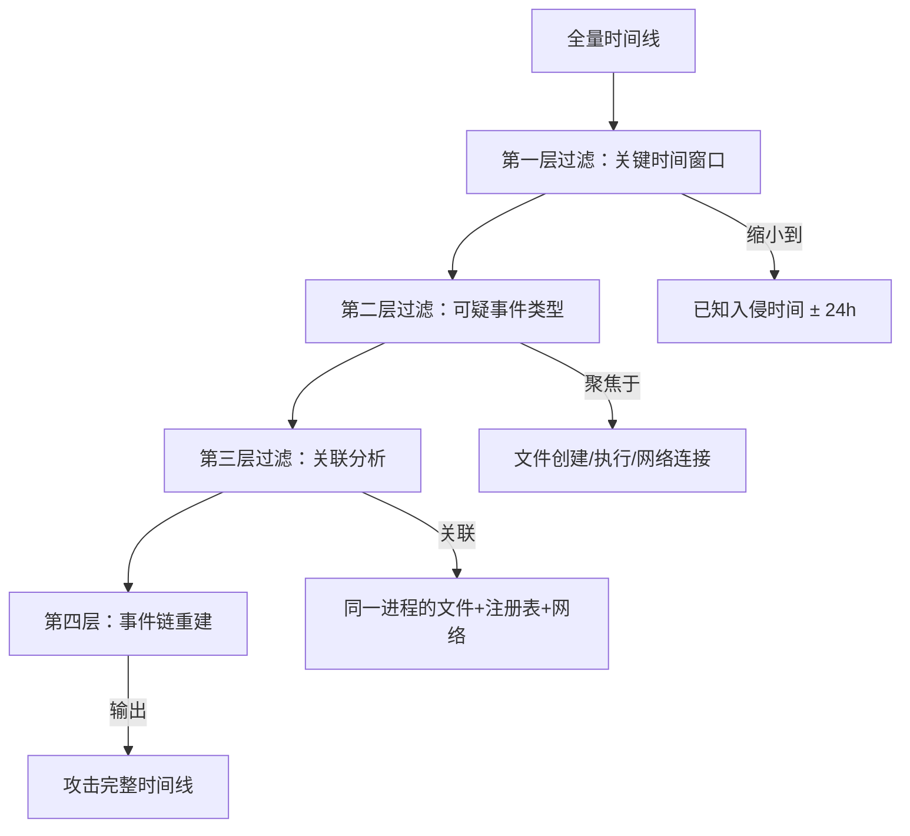

## 时间线分析概述

时间线分析（Timeline Analysis）是数字取证中最核心的技术之一。它的本质是**将分散在不同数据源中的事件按时间顺序排列，还原出计算机系统或网络中发生的真实活动序列**。

想象一个犯罪现场：散落的脚印、打翻的杯子、破碎的窗户——每一项物证单独看只能说明局部事实，但当它们按时间排列后，一个完整的故事就浮现出来。数字取证中的时间线分析正是这个原理在数字世界的映射。

### 为什么时间线分析如此重要

在数字取证中，单条日志往往无法说明问题。一条登录记录本身没有意义，但当你看到：

1. 02:15 用户通过RDP登录
2. 02:17 打开了注册表编辑器
3. 02:18 修改了Run键（持久化后门）
4. 02:20 上传了nc.exe
5. 02:21 建立了反向Shell连接
6. 02:30 清除了安全日志

这六条记录按时间排列后，一个攻击过程清晰可见。**时间线分析的价值就在于此——它让孤立的数据点变成有因果关系的事件链**。

### 时间线分析的核心目标

| 目标 | 说明 |
|------|------|
| 确定初始入侵时间 | 找到攻击者最早进入系统的时间点，帮助追溯攻击入口 |
| 还原攻击过程 | 按时间顺序串联攻击者的每一步操作 |
| 确定影响范围 | 识别攻击者访问了哪些文件、修改了哪些配置、删除了哪些数据 |
| 关联多源数据 | 将文件系统、日志、注册表、网络流量中的事件对齐到统一时间轴 |
| 建立因果关系 | 通过时间先后顺序推断事件之间的因果联系 |
| 支撑法律证据 | 完整的时间线是法庭上最具说服力的数字证据形式之一 |

## 时间线的数据源

构建时间线的第一步是识别所有可能包含时间戳信息的数据源。每一个现代操作系统都会在大量位置记录时间信息。

### 文件系统时间戳

文件系统是时间线分析最基础的数据源。每个文件通常携带多个时间戳：

**NTFS文件系统（Windows）**

NTFS使用MFT（Master File Table）记录文件的 `$STANDARD_INFORMATION` 和 `$FILE_NAME` 两组时间戳，每组包含四个时间：

| 缩写 | 全称 | 含义 |
|------|------|------|
| $SI-Cr | $STANDARD_INFORMATION → Creation | 文件在当前卷上创建的时间 |
| $SI-M | $STANDARD_INFORMATION → Modified | 文件内容最后一次被修改的时间 |
| $SI-A | $STANDARD_INFORMATION → Accessed | 文件最后一次被读取的时间 |
| $SI-E | $STANDARD_INFORMATION → Entry Modified | MFT记录本身的修改时间（元数据变更） |
| $FN-Cr | $FILE_NAME → Creation | 文件名在MFT中登记的时间 |
| $FN-M | $FILE_NAME → Modified | 文件名条目最后修改时间 |
| $FN-A | $FILE_NAME → Accessed | 文件名条目最后访问时间 |
| $FN-E | $FILE_NAME → Entry Modified | 文件名条目最后修改时间 |

**关键区别：** `$STANDARD_INFORMATION` 和 `$FILE_NAME` 的时间戳是独立维护的。攻击者使用某些工具修改时间时，可能只修改了 `$STANDARD_INFORMATION` 的时间戳，而 `$FILE_NAME` 的时间戳暴露了真实时间。这就是"时间戳篡改检测"的基本原理。

**ext文件系统（Linux）**

ext3/ext4文件系统记录以下时间戳：

- `atime`（Access Time）：文件最后被访问的时间
- `mtime`（Modify Time）：文件内容最后被修改的时间
- `ctime`（Change Time）：文件inode元数据最后被修改的时间
- `crtime`（Birth Time，仅ext4）：文件创建时间

Linux中的一个常见误区：很多人认为`ctime`是创建时间（Create Time），实际上它是`Change Time`，记录的是inode元数据（权限、所有者、硬链接数等）的变更时间，与文件内容变更无关。真正的创建时间仅在ext4中以`crtime`形式存在，需要使用`debugfs`工具才能读取：

```bash
# 读取ext4文件的创建时间（crtime）
sudo debugfs -R 'stat <inode_number>' /dev/sda1

# 使用stat查看普通时间戳
stat /path/to/file
# 输出示例：
# Access: 2024-01-15 08:30:00.000000000 +0800
# Modify: 2024-01-15 07:45:00.000000000 +0800
# Change: 2024-01-15 08:30:00.000000000 +0800
# Birth:  2024-01-14 10:00:00.000000000 +0800
```

**MACB时间的顺序分析**

理解MACB时间戳的变动规律是时间线分析的基本功：

- 文件被创建 → Cr=M, M=A（创建时间等于修改时间，修改时间等于访问时间）
- 文件被修改 → M更新，Cr保持不变
- 文件被复制 → Cr重置为当前时间，M保持源文件的修改时间
- 文件被移动（同卷） → 所有时间戳保持不变
- 文件被移动（跨卷） → Cr重置为当前时间，M保持不变

利用这些规律可以判断文件是否被移动、复制或篡改。

### Windows事件日志

Windows事件日志（Event Logs）是Windows时间线分析最重要的数据源之一。

**关键日志文件及路径**

| 日志文件 | 路径 | 用途 |
|----------|------|------|
| Security.evtx | `C:\Windows\System32\winevt\Logs\` | 登录/注销、权限变更、对象访问 |
| System.evtx | 同上 | 服务启动/停止、系统事件、驱动加载 |
| Application.evtx | 同上 | 应用程序事件 |
| PowerShell/Operational.evtx | 同上 | PowerShell命令执行记录 |
| Microsoft-Windows-TaskScheduler%4Operational.evtx | 同上 | 计划任务执行记录 |
| Microsoft-Windows-TerminalServices-LocalSessionManager%4Operational.evtx | 同上 | RDP会话记录 |
| Microsoft-Windows-Sysmon%4Operational.evtx | 同上 | Sysmon进程/网络/文件监控（需预先安装） |

**关键安全事件ID**

| 事件ID | 含义 | 时间线价值 |
|--------|------|-----------|
| 4624 | 登录成功 | 确认用户活动时间 |
| 4625 | 登录失败 | 暴力破解尝试时间 |
| 4648 | 显式凭据登录 | 横向移动信号 |
| 4672 | 特权分配 | 特权操作时间 |
| 4688 | 新进程创建 | 攻击工具执行时间 |
| 4698 | 计划任务创建 | 持久化机制建立时间 |
| 4720 | 用户账户创建 | 后门账户建立时间 |
| 4732 | 安全组成员添加 | 权限提升时间 |
| 1102 | 安全日志清除 | 反取证信号 |

### Windows注册表时间戳

Windows注册表中的键（Key）和值（Value）都可以携带时间信息：

- **Key LastWrite Time**：每个注册表键的最后修改时间，存储在键的元数据中
- **UserAssist**：`HKCU\Software\Microsoft\Windows\CurrentVersion\Explorer\UserAssist\{GUID}\Count` 中记录程序执行次数和最后执行时间（ROT13编码）
- **ShimCache / AppCompatCache**：`HKLM\SYSTEM\CurrentControlSet\Control\Session Manager\AppCompatCache` 记录文件执行历史
- **AmCache**：`C:\Windows\appcompat\Programs\Amcache.hve` 记录更详细的程序执行信息和安装时间
- **SRUM**：`C:\Windows\System32\sru\SRUDB.dat` 记录过去30天的应用资源使用情况
- **BAM/DAM**：后台活动监视器，记录程序的最后执行时间

### 浏览器历史记录

浏览器保留了大量带时间戳的访问记录：

- **Chrome**：SQLite数据库 `%LOCALAPPDATA%\Google\Chrome\User Data\Default\History`
- **Firefox**：SQLite数据库 `%APPDATA%\Mozilla\Firefox\Profiles\<profile>\places.sqlite`
- **Edge**：SQLite数据库 `%LOCALAPPDATA%\Microsoft\Edge\User Data\Default\History`

浏览器历史记录包含访问时间、URL、页面标题、下载记录等，是重建用户行为时间线的重要数据源。

### 文件系统日志

- **$LogFile（NTFS）**：NTFS事务日志，记录最近的文件系统操作
- **$UsnJrnl（NTFS）**：Update Sequence Number Journal，记录文件的创建、删除、修改、重命名等操作
- **$MFT**：主文件表，包含每个文件和目录的元数据及MACB时间戳
- **ext4 Journal**：ext4的日志，记录文件系统操作的事务记录

### 其他数据源

- **Prefetch（预读取）**：记录程序的执行时间和执行次数，路径 `C:\Windows\Prefetch\`
- **Jump Lists**：记录最近打开的文件和程序，路径 `%APPDATA%\Microsoft\Windows\Recent\AutomaticDestinations\`
- **Recent Files**：`%APPDATA%\Microsoft\Windows\Recent\` 目录下的快捷方式文件
- **Shellbags**：文件夹访问历史，存储在注册表中
- **Recycle Bin**：回收站，包含删除时间和原始路径
- **Windows Timeline / ActivitiesCache.db**：Windows 10+的活动历史记录
- **网络流量日志**：防火墙、IDS/IPS、代理服务器日志
- **邮件服务器日志**：Exchange、Postfix等邮件系统的收发记录
- **数据库审计日志**：SQL Server、MySQL等数据库的操作记录
- **云服务日志**：AWS CloudTrail、Azure Activity Log、GCP Audit Log等

## 时间线构建工具

### The Sleuth Kit（TSK）

The Sleuth Kit是最经典的数字取证工具集，可以提取文件系统时间戳并生成时间线。

```bash
# 使用fls递归列出所有文件的MACB时间戳
fls -r -m "/" /dev/sda1 > bodyfile.txt

# 使用mactime将bodyfile转换为可读的时间线
mactime -b bodyfile.txt -d > timeline.csv

# 输出格式：
# Date,Size,Type,Mode,UID,GID,Metadata,Filename
# 2024-01-15 07:45:00,1024,...,r/rrwxrwxrwx,0,0,12345,/etc/passwd

# 生成特定时间范围的时间线
mactime -b bodyfile.txt -d -s "2024-01-15 00:00:00" -e "2024-01-16 00:00:00" > filtered.csv

# 对磁盘镜像直接操作（E01格式需要先挂载）
fls -r -m "/" -i ewf image.E01 > bodyfile.txt
```

### log2timeline / plaso

plaso（Plaso Langar Að Safna Öllu）是目前最强大的超级时间线生成工具，可以从600多种数据源中提取时间信息并生成统一的时间线。

```bash
# 安装plaso
# Ubuntu/Debian
sudo apt install plaso-tools

# 或使用Docker
docker pull log2timeline/plaso

# 基本用法：从磁盘镜像提取时间线
log2timeline.py --storage-file timeline.plaso image.E01

# 或使用psort对已有存储文件排序输出
psort.py -o dynamic -w timeline.csv timeline.plaso

# 仅提取特定时间范围的数据
psort.py -o dynamic -w timeline.csv timeline.plaso "date > '2024-01-14' AND date < '2024-01-16'"

# 过滤特定数据源类型
log2timeline.py --storage-file timeline.plaso --parsers "win7_slow" image.E01

# 使用Docker运行（避免环境依赖问题）
docker run -v /path/to/image:/data log2timeline/plaso \
  log2timeline.py --storage-file /data/timeline.plaso /data/image.E01
```

plaso支持的解析器包括：Windows事件日志、注册表、Prefetch、文件系统时间戳、浏览器历史、电子邮件、聊天记录、移动设备备份等。

### Plaso + Timesketch

Timesketch是Google开源的时间线分析和协作平台，可以与plaso配合使用：

```bash
# 安装Timesketch（Docker方式）
git clone https://github.com/google/timesketch.git
cd timesketch/docker
docker-compose up -d

# 上传plaso生成的时间线到Timesketch
# 通过Web界面或API上传timeline.plaso文件
# Timesketch提供可视化、搜索、标签、分析等功能
```

### Velociraptor

Velociraptor是一款强大的终端取证和响应工具，支持实时时间线收集：

```yaml
# VQL查询：收集Windows文件系统时间线
SELECT
    timestamp(epoch=Mtime) AS Modified,
    timestamp(epoch=Atime) AS Accessed,
    timestamp(epoch=Ctime) AS Changed,
    FullPath
FROM glob(globs="C:/Users/**/*")
WHERE Mtime > timestamp(epoch="2024-01-15")
```

### 时间线格式标准

plaso使用的时间戳格式基于OPENTIMESTAMP和plaso内部事件格式：

```csv
datetime,timestamp_desc,source,source_long,message,parser,display_name,filename,inode
2024-01-15T08:30:00+08:00,Last access time,FILE,File stat,/etc/passwd,file_stat,/dev/sda1,/etc/passwd,12345
```

## 时间线分析方法论

构建时间线只是第一步，真正的挑战在于分析。以下是经过实践验证的分析方法。

### 漏斗式分析法

面对海量的时间线数据，直接逐行阅读是不现实的。正确的做法是从宏观到微观逐步聚焦：



**第一层：确定关键时间窗口**

如果已知入侵时间（如告警时间、勒索软件加密完成时间），以该时间点为中心向前扩展24-72小时。如果不知道入侵时间，先寻找明显的攻击指标：

- 安全日志被清除的时间（事件ID 1102）
- 异常的RDP登录（特别是非工作时间）
- 新建的用户账户
- 异常的计划任务

**第二层：聚焦可疑事件类型**

在关键时间窗口内，重点关注以下事件：

| 事件类别 | 具体指标 |
|----------|---------|
| 初始访问 | 可疑邮件附件打开、浏览器下载可执行文件、USB设备插入 |
| 执行 | 新进程创建、PowerShell执行、WMI调用、计划任务触发 |
| 持久化 | 注册表Run键修改、服务创建、计划任务创建、WMI订阅 |
| 权限提升 | 令牌操作、进程注入、漏洞利用痕迹 |
| 横向移动 | RDP连接、SMB文件访问、PsExec执行、WMI远程调用 |
| 数据收集 | 压缩工具执行、文件批量访问、剪贴板记录 |
| 数据外传 | 大量出站网络流量、DNS查询异常、邮件发送 |
| 清除痕迹 | 日志清除、文件删除、时间戳修改 |

**第三层：关联分析**

将同一攻击动作在不同数据源中的表现关联起来。例如，当看到 `nc.exe` 被执行时（Prefetch记录），同时查找同一时间附近的网络连接记录（Sysmon事件ID 3）和防火墙日志，就可以得到完整的攻击路径。

### 模式识别法

攻击者的行为会形成可识别的模式：

**异常登录模式**
- 非工作时间的登录（凌晨2点的管理员登录）
- 同一账户从多个地理位置同时登录
- 短时间内大量登录失败后紧随成功登录
- 使用默认或服务账户的交互式登录

**文件操作模式**
- 短时间内大量文件被访问（自动化扫描或数据收集）
- 可执行文件从临时目录启动
- 敏感文件在非正常时间被访问
- 系统文件的修改或替换

**网络行为模式**
- 新出现的外部IP连接
- DNS查询中出现域名生成算法（DGA）特征
- 大量小数据包向外传输（数据外泄）
- 非标准端口的通信

### 时序关联分析

使用SQL查询语言对结构化时间线进行关联分析：

```sql
-- 查找在可疑时间窗口内的所有PowerShell执行
SELECT datetime, timestamp_desc, message
FROM timeline
WHERE source = 'EVT'
  AND message LIKE '%PowerShell%'
  AND datetime BETWEEN '2024-01-15 00:00:00' AND '2024-01-16 00:00:00'
ORDER BY datetime;

-- 查找与可疑进程相关联的文件操作（5秒窗口内）
SELECT t1.datetime AS proc_time, t1.message AS process,
       t2.datetime AS file_time, t2.message AS file_access
FROM timeline t1
JOIN timeline t2
  ON ABS(strftime('%s', t1.datetime) - strftime('%s', t2.datetime)) <= 5
WHERE t1.source = 'EVT' AND t1.message LIKE '%4688%'
  AND t2.source = 'FILE'
  AND t1.datetime BETWEEN '2024-01-15 02:00:00' AND '2024-01-15 04:00:00'
ORDER BY t1.datetime;
```

### 时间异常检测

时间戳中的异常本身就能揭示攻击行为：

**时间戳不连续**

正常文件系统操作的时间戳分布应该是连续的，突然出现的时间空白可能意味着攻击者删除了文件或清除了日志：

```text
08:30:01 - 文件A被访问
08:30:02 - 文件B被访问
08:30:03 - 文件C被访问
（空白5分钟）
08:35:10 - 文件F被访问    ← 可疑，D和E可能被删除
```

**时间戳回溯**

正常系统中，文件时间戳应该是递增的。如果某个文件的创建时间晚于修改时间，可能是时间戳被篡改：

```text
文件X：
  $SI-Cr = 2024-01-15 10:00:00   ← 创建时间
  $SI-M  = 2024-01-10 08:00:00   ← 修改时间比创建时间早？
  → 可疑：可能被touch工具修改了时间戳
```

**$STANDARD_INFORMATION与$FILE_NAME时间不一致**

```text
文件Y：
  $SI-Cr  = 2024-01-01 00:00:00  ← 标准信息中的创建时间
  $FN-Cr  = 2024-01-15 09:00:00  ← 文件名信息中的创建时间
  → 可疑：$SI时间被篡改，$FN保留了真实时间
```

## 实战案例：APT攻击时间线分析

以下是一个完整的APT攻击时间线分析案例，展示从数据收集到时间线重建的完整流程。

### 背景

某企业安全部门在2024年1月16日凌晨发现财务服务器异常，初步检查发现疑似数据外泄迹象。取证团队介入调查。

### 第一步：数据收集

```bash
# 收集磁盘镜像（使用dc3dd或dd）
dc3dd if=/dev/sda of=/evidence/disk.img hash=sha256 log=/evidence/hash.log

# 收集内存镜像（使用AVML或WinPMEM）
avml /evidence/memory.lime

# 收集Windows事件日志
# 复制 C:\Windows\System32\winevt\Logs\*.evtx 到证据目录

# 使用Velociraptor收集终端数据（如果已部署）
velociraptor artifacts collect Windows.EventLogs.Historical --output /evidence/
```

### 第二步：生成超级时间线

```bash
# 使用plaso从磁盘镜像生成时间线
log2timeline.py --storage-file /evidence/supertimeline.plaso /evidence/disk.img

# 使用psort过滤关键时间窗口（已知入侵时间为1月15-16日）
psort.py -o dynamic \
  -w /evidence/timeline_jan15-16.csv \
  /evidence/supertimeline.plaso \
  "date > '2024-01-14' AND date < '2024-01-17'"

# 结合事件日志
psort.py -o dynamic \
  -w /evidence/timeline_evt.csv \
  /evidence/supertimeline.plaso \
  "source IN ('winevt', 'winevtx')"
```

### 第三步：分析结果

以下是分析还原出的攻击时间线（简化版）：

```text
2024-01-15 14:23:07 - [邮件] CFO收到钓鱼邮件，附件为"Q4财务报表.zip"
2024-01-15 14:25:15 - [文件] 用户解压附件到 Downloads\Q4财务报表\
2024-01-15 14:25:48 - [执行] Q4财务报表.exe 被双击执行（伪装PDF图标）
2024-01-15 14:25:50 - [进程] mshta.exe 被启动，执行混淆的VBScript
2024-01-15 14:25:52 - [进程] powershell.exe 被启动（-enc参数，Base64编码命令）
2024-01-15 14:25:55 - [网络] 连接到 C2服务器 198.51.100.23:443
2024-01-15 14:26:00 - [文件] 下载后门程序 svchost.exe 到 %TEMP% 目录
2024-01-15 14:26:05 - [注册表] 添加Run键持久化：HKCU\...\Run\WindowsUpdate = svchost.exe
2024-01-15 14:26:10 - [进程] svchost.exe 建立持久C2连接

2024-01-15 18:45:00 - [网络] C2发送命令，开始内网扫描
2024-01-15 18:47:23 - [执行] 攻击者使用Mimikatz提取内存凭据
2024-01-15 19:02:11 - [认证] 使用窃取的域管理员凭据横向移动到文件服务器
2024-01-15 19:05:30 - [认证] 使用相同凭据登录到财务服务器
2024-01-15 19:10:00 - [文件] 扫描并访问财务共享目录下的所有Excel和PDF文件
2024-01-15 19:30:00 - [文件] 使用rar压缩收集的文件到 temp\backup.rar
2024-01-15 20:15:00 - [网络] 分块上传 backup.rar 到外部服务器
2024-01-16 00:30:00 - [日志] 清除安全日志（事件ID 1102）
2024-01-16 00:30:05 - [文件] 删除下载的工具和压缩文件
```

### 第四步：报告输出

基于时间线的分析报告应包含以下要素：

```text
1. 摘要
   - 入侵时间窗口：2024-01-15 14:23 ~ 2024-01-16 00:30
   - 初始入侵向量：钓鱼邮件（附件为伪装的可执行文件）
   - 影响范围：CFO工作站、文件服务器、财务服务器
   - 数据泄露：财务相关文件（约2GB）

2. 详细时间线（见上文）

3. 攻击者TTP（战术、技术和过程）
   - MITRE ATT&CK映射：
     T1566.001 - 鱼叉式钓鱼附件
     T1059.001 - PowerShell
     T1547.001 - 注册表Run键持久化
     T1003.001 - LSASS内存凭据提取
     T1021.002 - SMB/Windows管理共享横向移动
     T1048 - 通过加密通道外传数据
     T1070.001 - 清除Windows事件日志

4. IOCs（入侵指标）
   - 恶意文件哈希
   - C2 IP地址和域名
   - 恶意注册表键值
   - 异常进程名称

5. 建议措施
   - 隔离受影响主机
   - 重置所有域管理员凭据
   - 更新邮件安全网关规则
   - 部署EDR和网络监控
```

## 高级技巧与常见陷阱

### 时间戳篡改检测与应对

攻击者常用的时间戳篡改手法：

**timestomp**

Mimikatz的timestomp功能可以直接修改NTFS时间戳：

```text
# 攻击者示例（仅供理解防御）
timestomp C:\malware.exe -M "01/01/2020 00:00:00"
timestomp C:\malware.exe -A "01/01/2020 00:00:00"
timestomp C:\malware.exe -C "01/01/2020 00:00:00"
timestomp C:\malware.exe -B "01/01/2020 00:00:00"
```

**检测方法：**

1. **$FILE_NAME对比**：timestomp通常只修改$STANDARD_INFORMATION的时间，$FILE_NAME的时间会暴露真实时间。使用TSK查看两个时间：

```bash
# 使用istat查看MFT记录详情
istat /dev/sda1 12345

# 输出包含两组时间戳，对比不一致即为篡改证据
```

2. **$UsnJrnl分析**：USN日志独立记录文件操作，不受timestomp影响：

```bash
# 使用usnjrnl工具提取USN日志
python3 parseusn.py /path/to/$UsnJrnl > usn_timeline.csv
```

3. **$LogFile分析**：NTFS事务日志保留了文件操作的原始记录

4. **父目录时间戳**：如果文件时间戳早于其所在目录的创建时间，明显是篡改

5. **上下文矛盾**：文件内容中引用了比文件时间戳更晚出现的技术或日期

### 时区问题

时间线分析中最常见的错误来源就是时区问题：

- **系统时区**：Windows注册表 `HKLM\SYSTEM\CurrentControlSet\Control\TimeZoneInformation` 记录了系统时区
- **BIOS时钟**：可能设为本地时间或UTC时间（Linux通常用UTC，Windows通常用本地时间）
- **日志时间戳**：不同日志可能使用不同的时区表示
- **网络设备**：可能使用UTC，可能使用设备所在地时间

**最佳实践：**

```bash
# 在plaso中指定源时区
log2timeline.py --parsers win7_slow \
  --source-timezone "Asia/Shanghai" \
  --storage-file timeline.plaso image.E01

# 统一输出为UTC
psort.py -o dynamic --output-timezone UTC -w timeline.csv timeline.plaso
```

### 夏令时（DST）陷阱

在美国、欧洲等实行夏令时的地区，时钟会在春季向前调一小时、秋季向后调一小时。这会导致：

- 春季：02:00-03:00之间的事件看起来像是"消失"了
- 秋季：01:00-02:00之间的事件会出现两次

在进行跨时区案件分析时，必须考虑源系统所在地区的夏令时规则。

### 虚拟化环境的时间线问题

虚拟化环境增加了时间线分析的复杂度：

- **快照回滚**：VM恢复快照后，时间线会出现时间跳跃
- **时间同步**：VM时钟可能与宿主机或NTP服务器不同步
- **热迁移**：VM在不同宿主机之间迁移可能导致时间线中断
- **嵌套虚拟化**：多层虚拟化使得时间关系更加复杂

### SSD和TRIM指令的影响

在SSD上，TRIM指令会在文件删除后通知固态硬盘可以回收数据块。这意味着：

- 被删除文件的数据块可能很快被物理清除
- 传统的文件恢复技术在SSD上效果有限
- $MFT中的文件记录可能被部分覆写
- 时间线中删除事件后的数据恢复变得更加困难

### 卷影副本（Volume Shadow Copy）

Windows卷影副本保留了文件系统的历史快照，可以用于时间线分析：

```powershell
# 列出所有卷影副本
vssadmin list shadows

# 使用vshadowmount挂载卷影副本（Linux下使用libvshadow）
vshadowmount /dev/sda1 /mnt/vss/

# 比较不同时间点的卷影副本，发现文件变更历史
diff <(fls -r /mnt/vss/shadow1/) <(fls -r /mnt/vss/shadow2/)
```

## 时间线分析检查清单

在完成时间线分析前，使用以下检查清单确保分析的完整性：

```text
□ 确认所有时间戳已统一到同一时区
□ 检查是否存在时间戳篡改的迹象
□ 对比$STANDARD_INFORMATION和$FILE_NAME时间戳
□ 分析$UsnJrnl中的文件操作记录
□ 检查Windows事件日志是否完整（是否被清除）
□ 审查Prefetch文件确认程序执行时间
□ 检查注册表中的UserAssist和ShimCache记录
□ 分析浏览器历史记录中的访问时间
□ 检查网络设备日志进行时间校准
□ 确认是否有卷影副本可用于时间点分析
□ 检查BIOS/系统时钟是否准确
□ 验证虚拟化环境的时间同步设置
□ 对比多台设备的时间线确认事件关联性
□ 标记所有无法解释的时间空白
□ 使用多种数据源交叉验证关键时间点
```
