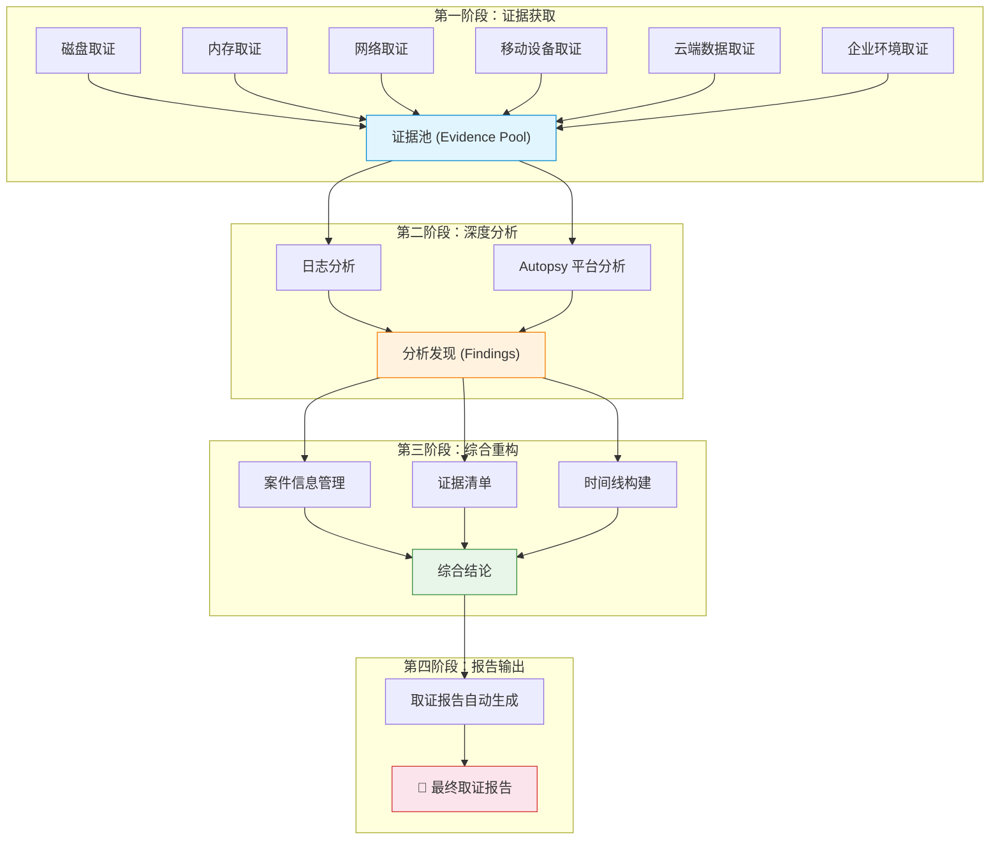
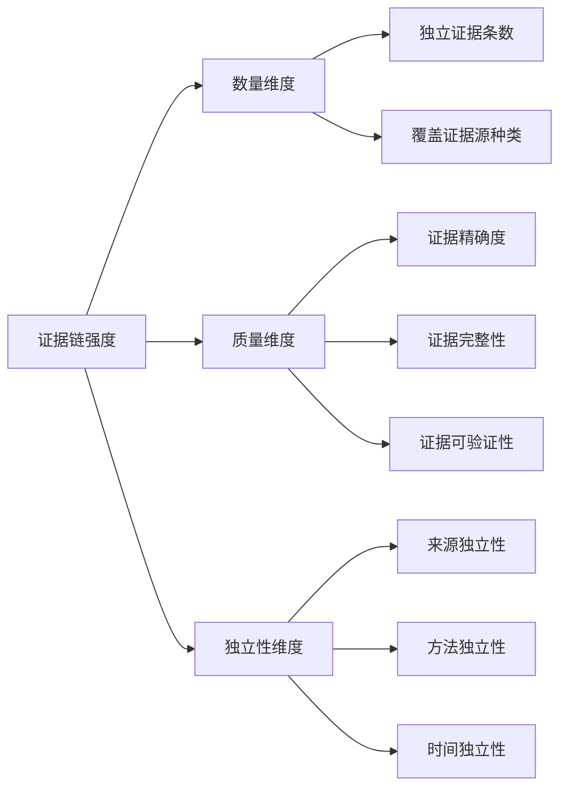
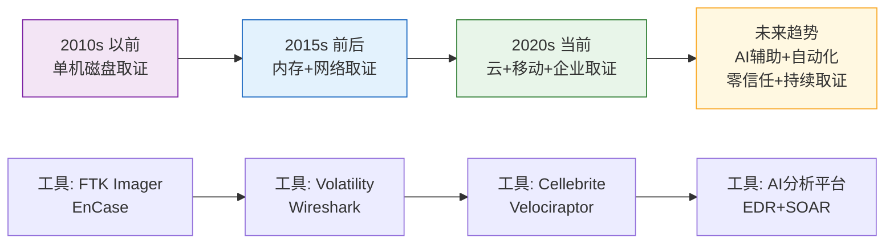
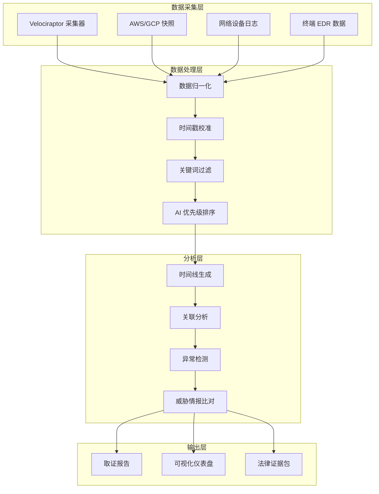

# 结论：数字取证核心技巧的系统整合与进阶之路

## 25.14 回眸与展望

数字取证是一门融合计算机科学、法律程序和调查方法的交叉学科。从 25.1 到 25.13，我们依次走过了磁盘取证、内存取证、网络取证、日志分析、Autopsy 平台、移动设备取证、云端数据取证、企业环境取证、报告自动生成，以及案件信息管理、证据清单、分析发现和时间线构建等全流程环节。本章将把这些分散的知识点整合为一套系统性的能力体系，帮助读者完成从"知道单个技术"到"掌握完整方法论"的跃迁。

### 25.14.0 数字取证四阶段方法论

数字取证的完整流程可以抽象为四个阶段，构成一个闭环的工作流：



**图 25-38：数字取证四阶段方法论**——证据获取、深度分析、综合重构、报告输出构成完整的取证闭环。每一阶段都依赖前一阶段的输出，任何环节的疏漏都会影响最终结论的可靠性。

#### 各阶段的关键产出物

| 阶段 | 关键产出物 | 质量检查点 |
|------|-----------|-----------|
| 证据获取 | 磁盘镜像 (.E01/.dd)、内存转储 (.raw)、网络捕获 (.pcap)、云端快照 | SHA-256 哈希校验通过、写保护确认、采集日志完整 |
| 深度分析 | 文件系统分析报告、进程/网络连接列表、日志事件序列、关键词命中结果 | 至少两种独立工具交叉验证、可疑项标记清晰 |
| 综合重构 | 证据清单 (Chain of Custody)、分析发现表、全局时间线 | 证据链无断裂、时间线无矛盾、发现与证据一一对应 |
| 报告输出 | 结构化取证报告 (PDF/HTML)、可操作建议 | 结论有证据支撑、区分事实与推断、可读性测试通过 |

#### 阶段间的依赖关系与风险传递

取证流程中，后一阶段的输入质量完全取决于前一阶段的输出质量。如果证据获取阶段没有正确执行写保护，后续所有分析结论都将失去法律效力；如果日志分析阶段遗漏了关键时间窗口，时间线构建就会出现断裂。这种依赖关系意味着**取证工作没有"补救"环节——每个阶段都必须一次做对**。

---

## 25.14.1 十项核心技巧能力矩阵

不同的取证场景需要不同的技术组合。以下能力矩阵帮助读者快速定位每种技术的适用场景、关键工具和技能等级要求：

| 核心技巧 | 适用场景 | 关键工具 | 所需技能等级 | 不可替代性 |
|---------|---------|---------|------------|-----------|
| 磁盘取证 | 数据恢复、文件分析、加密破解 | dd, Guymager, FTK Imager, Sleuth Kit | ★★★☆☆ 中级 | 基础必备，所有取证的起点 |
| 内存取证 | 恶意软件分析、rootkit 检测、加密密钥提取 | Volatility 3, Rekall, MemProcFS | ★★★★☆ 高级 | 检测无文件攻击的唯一手段 |
| 网络取证 | 入侵溯源、数据泄露调查、C2 通信分析 | Wireshark, tcpdump, Zeek, NetworkMiner | ★★★★☆ 高级 | 还原攻击路径的关键 |
| 日志分析 | 安全事件溯源、合规审计、异常检测 | ELK Stack, Splunk, Graylog, Loki | ★★★☆☆ 中级 | 覆盖范围最广的证据来源 |
| Autopsy 平台 | 综合取证分析、可视化时间线、报告生成 | Autopsy, The Sleuth Kit | ★★☆☆☆ 入门 | 降低取证门槛的集成平台 |
| 移动设备取证 | 手机调查、社交媒体提取、位置分析 | Cellebrite, Magnet AXIOM, ADB | ★★★★☆ 高级 | 现代犯罪调查的核心需求 |
| 云端数据取证 | SaaS 调查、云实例快照、容器分析 | AWS CLI, GCP Tools, Docker CLI, K8s API | ★★★★★ 专家 | 云原生时代的必备技能 |
| 企业环境取证 | 大规模终端调查、自动化采集、远程取证 | Velociraptor, GRR, osquery, DFIR-IRIS | ★★★★★ 专家 | SOC/CSIRT 团队的核心能力 |
| 报告自动生成 | 证据整理、发现汇总、结论输出 | Python Jinja2, LaTeX, Markdown | ★★☆☆☆ 入门 | 提升效率、保证一致性的关键 |

> **要点**：上表中"不可替代性"一列揭示了不同技术的定位差异。入门阶段应优先掌握磁盘取证、日志分析和报告生成；进阶阶段学习内存取证和网络取证；专家阶段攻克企业环境取证和云端数据取证。

### 技能等级自评指南

为了帮助读者准确评估自己的技能水平，以下是每个等级的具体标准：

- **★★☆☆☆ 入门**：能在指导下完成基本操作，理解工具的基本原理，能识别明显的异常。典型标志：能独立完成磁盘镜像制作和文件恢复。
- **★★★☆☆ 中级**：能独立完成完整取证流程，理解不同证据源之间的关联关系，能编写基本的自动化脚本。典型标志：能独立处理一起中等复杂度的安全事件。
- **★★★★☆ 高级**：能设计取证方案，处理复杂场景（加密、反取证、大规模数据），能培训初级分析师。典型标志：能在 48 小时内主导完成一起企业级数据泄露调查。
- **★★★★★ 专家**：能开发取证工具，应对 APT 级别威胁，在学术界或工业界有影响力。典型标志：能识别并对抗新型反取证技术，发表过相关论文或开源工具。

---

## 25.14.2 取证方法论：从碎片到拼图

数字取证的本质不是简单地运行工具、收集数据，而是**通过系统性的推理将碎片化的信息还原为完整的事故事实**。这一过程可以分解为四个思维层次：

### 25.14.2.1 证据链思维

每一条证据都不是孤立存在的，必须形成可验证的证据链。证据链包含三个核心要素：

- **物理层关联**：文件 A 和文件 B 是否存储在同一个磁盘扇区？进程 X 和进程 Y 是否共享同一块内存页面？物理层的关联往往是发现隐蔽证据的突破口。例如，在 NTFS 文件系统中，如果两个文件的 MFT 记录相邻且创建时间相近，它们很可能由同一个程序或用户操作产生。
- **时间层关联**：事件 A 发生在事件 B 之前还是之后？系统日志、文件时间戳和网络流量记录能否共同证实某个时间窗口？时间层关联是构建案件叙事的基础。一个经典案例是：攻击者在凌晨 2:15 执行了恶意脚本，2:16 创建了后门账户，2:17 开始外传数据——这三个事件的时间间隔仅 2 分钟，但通过文件系统时间戳、安全日志和网络流量三者的交叉验证，可以精确还原攻击序列。
- **逻辑层关联**：用户登录（日志）→ 文件下载（浏览器历史）→ 文件执行（Prefetch 文件）→ 网络连接（防火墙日志）——这四个事件之间是否存在因果关系？逻辑层关联回答"为什么"的问题。它要求分析师不仅知道"发生了什么"，还要理解"为什么会发生"。

#### 证据链的强度评估

证据链的强度取决于三个维度：**数量**（多少条独立证据支持同一结论）、**质量**（每条证据的可靠性和精确度）、**独立性**（证据来源是否相互独立）。一个由 5 条相互独立的证据（日志、网络、内存、磁盘、手机）共同支撑的结论，远比由 5 条来自同一来源的证据支撑的结论可靠。



### 25.14.2.2 假设驱动验证法

优秀的取证分析师不会盲目收集数据，而是先形成假设，再有针对性地验证。这种方法被称为"假设驱动取证"（Hypothesis-Driven Forensics），它将分析效率提升数倍。

```text
假设提出 → 确定验证所需证据 → 针对性采集 → 
分析验证 → 假设被证实或推翻 → 修订或提出新假设
```

#### 假设驱动取证的完整流程

1. **信息收集与假设生成**：基于案件背景、初始告警、用户报告等信息，生成多个可能的假设。例如，收到"系统变慢"的报告后，可能的假设包括：恶意软件感染、资源耗尽、配置错误、硬件故障。
2. **证据需求分析**：对每个假设，列出验证它所需要的证据类型。恶意软件感染需要内存扫描和网络流量分析；资源耗尽需要性能日志和进程分析；配置错误需要配置文件变更历史。
3. **优先级排序**：根据证据获取的难易程度和假设的可能性，确定采集顺序。通常优先采集易失性数据（内存），因为关机后这些数据会丢失。
4. **验证与迭代**：执行采集和分析，验证假设。如果假设被证实，深入调查；如果被推翻，回到步骤 1 生成新假设。

#### 实战案例：数据外泄假设验证

假设怀疑存在数据外泄：

1. **初始假设**：攻击者通过 FTP 将敏感文件上传到外部服务器
2. **验证所需**：检查防火墙日志中的出站 FTP 连接、文件系统访问日志中敏感文件的读取记录、进程创建日志中的 FTP 客户端执行痕迹
3. **采集与分析**：针对性采集上述三类日志，交叉比对时间窗口
4. **判断**：如果 FTP 连接时间与文件访问时间高度吻合，假设被证实；如果仅在日志中看到 SCP 连接而无 FTP 流量，则修订假设为"攻击者通过 SCP 外泄"

这种方法的优势在于避免了"大海捞针"式的盲目采集，将分析效率提升数倍。在大规模取证场景中（TB 级数据），假设驱动法可以将分析时间从数周缩短到数天。

### 25.14.2.3 交叉验证原则

任何单一证据都不足以得出最终结论。交叉验证是避免误判的黄金法则：

| 单一证据类型 | 潜在问题 | 交叉验证方式 |
|-------------|---------|-------------|
| 文件时间戳 | 可被 Manipulation（触摸时间戳工具）修改 | 用 $MFT 记录、$LogFile 和 USN Journal 交叉比对 |
| 日志记录 | 日志可能被删除或篡改 | 与网络流量和内存取证结果交叉比对 |
| 内存数据 | 关机后消失，无法二次确认 | 与磁盘上的持久化痕迹和网络日志比对 |
| 用户账户操作 | 账户可能被盗用 | 检查登录 IP、设备指纹和行为模式 |
| 杀毒软件告警 | 可能存在误报 | 手动分析样本，检查行为特征 |

#### 交叉验证的三层架构

1. **工具层交叉验证**：使用不同的工具分析同一份证据。例如，用 Autopsy 和 FTK Imager 分别分析同一个磁盘镜像，比较结果的一致性。
2. **证据源层交叉验证**：从不同的证据源验证同一事件。例如，用 Windows 事件日志、DNS 日志和防火墙日志三者交叉验证一次外连行为。
3. **方法层交叉验证**：用不同的分析方法验证同一结论。例如，用关键词搜索和文件雕刻两种方法寻找同一个已删除文件。

---

## 25.14.3 实战中的八大致命陷阱

即便掌握了所有技术，取证分析师仍可能在以下陷阱中犯错。每个陷阱都来自真实案例的教训总结：

### 陷阱一：污染检材

最不可挽回的错误。在未使用写保护器的情况下直接挂载嫌疑磁盘进行分析。

**正确做法**：
- 硬件写保护器（Tableau、Wiebetech）是标配，没有写保护器绝不对原始磁盘进行任何写入操作
- 软件写保护（如 Linux 的 `blkid` + `mount -o ro,loop`）仅适用于已知安全的测试环境
- 每次处理原始证据前，计算并记录 SHA-256 哈希值，分析完成后再次校验

**实际命令示例**：
```bash
# 计算原始磁盘的 SHA-256 哈希
sha256sum /dev/sdb > /evidence/sdb.sha256

# 使用只读方式挂载
mount -o ro,loop /dev/sdb1 /mnt/evidence

# 制作 E01 格式镜像（推荐）
dcfldd if=/dev/sdb of=/evidence/sdb.e01 hash=sha256 hashwindow=1M

# 验证镜像完整性
e2ls /evidence/sdb.e01 | grep SHA256
```

### 陷阱二：时序颠倒

将事件发生顺序搞反，导致对攻击者的意图和入侵路径产生根本性误判。

**正确做法**：
- 建立全局时间线前，校准所有设备的系统时间（NTP 偏移分析）
- 区分文件系统时间、日志记录时间和网络流量的时间戳——它们可能来自不同的时钟源
- 使用 $MFT 记录中的多个时间属性（Modified、Access、Changed、Birth）而不是单一时间戳

**时间校准的实际操作**：
```bash
# 检查系统 NTP 状态
timedatectl status
chronyc tracking

# 提取 Windows 事件日志中的系统时间偏移
wevtutil q System /q:"*[System[Provider[@Name='Microsoft-Windows-Time-Service']]]" /f:text

# 使用 Plaso 自动处理时间校准
log2timeline.py --workers 4 --storage-file timeline.plaso timeline.zip /path/to/evidence
```

### 陷阱三：工具依赖症

盲目相信单一工具的结论，不做交叉验证。

**案例**：某分析师使用工具 A 恢复了一个标记为"已删除"的文件，直接认定该文件是攻击者的恶意软件。后经交叉验证发现，该文件实际上是系统在正常更新操作中创建并删除的合法文件，与攻击事件无关。

**正确做法**：任何工具的输出都只是"线索"而非"结论"，必须经过至少两种独立方法的验证。

### 陷阱四：确认偏误

带着预设立场分析证据，只收集支持自己观点的证据，忽略或轻率地排除矛盾证据。

**案例**：分析师先入为主认定内部员工作案，于是将所有网络流量中的异常都解释为"内部人员行为"，忽略了外网 IP 的持续扫描痕迹——实际上这是一次外部入侵。

**正确做法**：每找到一个支持性证据，主动寻找三个反证。如果找不到反证，说明验证还不够深入。

**对抗确认偏误的实用技巧**：
- **"魔鬼代言人"练习**：指定一名团队成员专门寻找与主流结论矛盾的证据
- **"假设反转"法**：如果结论是"内部人员作案"，尝试论证"外部攻击"的可能性
- **"证据盲审"**：在不告知案件背景的情况下，让另一名分析师独立分析同一份证据

### 陷阱五：忽略取证上下文

脱离系统环境孤立分析单个文件或日志。

**案例**：在某事件中，分析人员发现一个名为 `svchost.exe` 的可疑文件，直接判定为恶意软件。但进一步分析发现，该系统使用的是德语版本的 Windows，该文件是位于 `C:\Windows\System32\` 的合法系统文件——只是文件名恰好与系统进程同名。分析人员忽略了文件签名校验和路径验证这两个基本步骤。

**正确做法**：分析任何文件前，先确认其路径、数字签名、哈希值与已知合法文件库的匹配情况。

### 陷阱六：低估日志时间偏差

不同系统的日志时间可能存在数秒甚至数分钟的偏差，不做校准直接叠加会导致时间线混乱。

**正确做法**：
- 取证开始时采集所有设备的 NTP 状态和本地时钟偏移量
- 在重建时间线时对每个日志源应用时间偏移校正
- 在最终报告中标注"所有时间均已校准至 UTC ± X 秒"

### 陷阱七：过度关注技术细节而忽略业务理解

完全不懂业务逻辑的分析师，可能在大规模数据泄露事件中浪费数天分析无关数据。

**正确做法**：证据分析开始前，花 30 分钟与业务方沟通以下问题：
- 哪些数据是核心资产？（数据库、知识产权、客户信息）
- 业务系统的正常流量模式是怎样的？（访问高峰、常用端口、典型用户行为）
- 系统中哪些告警是已知误报？（避免重复分析）

### 陷阱八：报告不足或过度

报告要么过于简略（只列出发现，缺少推理过程），要么过于冗长（事无巨细地罗列每一步操作）。

**正确做法**：每一份取证报告都应采用"金字塔原理"——结论先行，然后逐层展开支撑证据。决策者只需要看第一页就能了解核心结论；技术人员可以阅读附录中的详细分析过程。

---

## 25.14.4 综合案例分析：一起企业数据泄露事件

以下案例综合运用了本章所学的多项核心技巧，展示完整的取证工作流。

### 25.14.4.1 案件背景

某科技公司发现其核心源代码仓库（GitLab）出现了异常的访问记录。安全团队怀疑存在内部数据泄露，需要全面取证调查。

**案件基本信息**：
- 发现时间：2025年3月15日 09:30 UTC
- 受影响系统：GitLab CE 15.8（自托管）、500+ 员工工作站
- 核心资产：23 个代码仓库，总计约 1.2GB 源代码
- 初步线索：GitLab 审计日志显示凌晨异常克隆操作

### 25.14.4.2 调查过程

| 阶段 | 使用技术 | 发现 |
|------|---------|------|
| 日志分析 (25.4) | GitLab 审计日志 | 发现一个非工作时间（凌晨 2:00-3:00）的批量代码仓库克隆操作，操作用户为离职员工 A |
| 网络取证 (25.3) | 防火墙日志 + DNS 日志 | 在同一时间段，员工 A 的设备与多个外部云存储服务（Dropbox、Google Drive）建立了大量 HTTPS 连接 |
| 内存取证 (25.2) | 员工 A 工作站的 Volatility 分析 | 在内存中发现了 SCP（安全的文件传输协议）客户端进程，虽已被终止，但进程命令行参数字符串仍残留于内存非分页池中 |
| 磁盘取证 (25.1) | 员工 A 工作站的磁盘镜像分析 | 通过文件雕刻恢复出已删除的压缩包文件头部，发现包含以项目代码目录命名的 ZIP 包，时间戳与 GitLab 克隆操作吻合 |
| 移动设备取证 (25.6) | 员工 A 的公司手机 | 分析 WeChat/Slack 聊天记录，发现员工 A 与竞争对手公司 HR 的对话，讨论了工作机会和"带点样品过去" |
| 企业环境取证 (25.8) | Velociraptor 批量采集 | 对全公司 500+ 端点进行横向扫描，未发现其他设备被类似方式利用，排除账户被盗的可能 |

### 25.14.4.3 发现汇总

| 发现编号 | 证据来源 | 关键证据 | 可信度 |
|---------|---------|---------|-------|
| F-001 | GitLab 审计日志 | 凌晨 2:10-2:45 共克隆 23 个代码仓库，总计 1.2GB | ⭐⭐⭐⭐⭐ |
| F-002 | 防火墙日志 | 同时段员工 A 设备向 3 个外部存储服务上传 1.1GB 数据 | ⭐⭐⭐⭐⭐ |
| F-003 | 内存取证 | 残留的 SCP 命令行参数与代码仓库路径匹配 | ⭐⭐⭐⭐ |
| F-004 | 磁盘取证 | 文件雕刻恢复的 ZIP 包头部确认压缩了代码文件 | ⭐⭐⭐⭐ |
| F-005 | 移动设备取证 | WeChat 聊天记录显示了离职动机 | ⭐⭐⭐⭐ |
| F-006 | 企业环境取证 | 排除横向威胁，确认为单人行为 | ⭐⭐⭐⭐⭐ |

### 25.14.4.4 综合结论

多种独立证据来源（日志、网络、内存、磁盘、手机）相互印证，形成了完整的证据链。该调查确立了：

1. **行为事实**：员工 A 在离职前夜批量复刻公司核心源代码
2. **方法手段**：通过 GitLab 克隆 + SCP 传输 + 云存储上传，采用了多层传输方式避免单点阻断
3. **时间线**：精确到分钟级别的事件序列
4. **动机**：跳槽至竞争对手公司的准备工作
5. **影响范围**：23 个仓库受到影响，未发现其他员工被牵连

> **说明**：此案例为教学目的构建的合成案例，但其中的取证逻辑和方法完全来自真实调查实践。

### 25.14.4.5 案例复盘：如果重来一次会怎么做

**可以改进的地方**：
1. **响应速度**：从发现异常到启动取证调查间隔了 6 小时，如果建立了自动化告警和响应流程，可以在 30 分钟内启动
2. **证据采集顺序**：应该优先采集员工 A 工作站的内存（易失性数据），但实际先采集了磁盘镜像。虽然最终没有造成数据丢失，但这是一个程序性错误
3. **法律授权**：在采集移动设备数据前，应该先获取法律授权或员工同意，否则证据可能在法律程序中不被采纳

---

## 25.14.5 数字取证的能力进阶路线

| 阶段 | 目标 | 需掌握的技能 | 推荐实践方式 |
|------|------|-------------|-------------|
| L1 入门 | 能独立完成单机磁盘取证 | 磁盘镜像制作、文件恢复、Autopsy 基础操作、简单报告撰写 | 在自有设备上练习，参加 DFIR 挑战（如 DFIR Training CTF） |
| L2 基础 | 能处理常见恶意软件感染事件 | 内存取证（Volatility）、日志分析、网络流量基本分析 | 搭建家庭实验室（VirtualBox + REMnux + FlareVM） |
| L3 中级 | 能主导小型企业的事件响应 | 移动设备取证、云端数据采集、报告自动化、时间线重建 | 参与开源 DFIR 项目，贡献 YARA 规则 |
| L4 高级 | 能处理大规模企业安全事件 | Velociraptor/GRR 远程取证、VQL 编写、SIEM 集成、跨平台分析 | 获取 GCFE/GCFA 认证，参与公开漏洞调查 |
| L5 专家 | 能应对 APT 级别的高级威胁 | 恶意软件逆向、内存狩猎（Hunting）、反取证技术对抗、取证工具开发 | 在学术期刊发表论文，开发开源取证工具 |

### 25.14.5.1 推荐的持续学习资源

**在线训练平台**：
- **DFIR Training CTF**（dfir.training）—— 虚拟取证场景竞赛，适合初学到中级
- **Forensic Focus 社区**（forensicfocus.com）—— 全球最大的取证从业者社区
- **CyberDefenders**（cyberdefenders.org）—— 蓝队和取证方向的实战挑战平台
- **Blue Team Labs Online**（blueteamlabs.online）—— 提供真实的取证场景和日志分析挑战

**认证体系**：
- **GCFE**（GIAC Certified Forensic Examiner）—— 基础取证认证，覆盖 Windows 取证和磁盘分析
- **GCFA**（GIAC Certified Forensic Analyst）—— 高级取证认证，覆盖内存取证实战
- **CCFP**（ISC² Certified Cyber Forensics Professional）—— 综合取证认证，覆盖法律和取证流程
- **GCFA/GCFE** 认证考试费用约 $1,000-$1,500，建议在有 2-3 年实践经验后考取

**必读文献**：
- 《File System Forensic Analysis》—— Brian Carrier，文件系统取证圣经
- 《The Art of Memory Forensics》—— Michael Hale Ligh 等，内存取证权威著作
- 《Practical Forensic Imaging》—— Bruce Nikkel，磁盘镜像制作的技术详解
- 《Digital Forensics and Incident Response》—— Gerard Johansen，事件响应与取证实践
- 《Anti-Forensics, Counter-Forensics, and Steganography》—— Brian Swiss，反取证技术专著

**开源工具推荐**：
- **Plaso / log2timeline**：跨平台时间线生成工具
- **Volatility 3**：内存取证框架
- **Velociraptor**：企业级远程取证和威胁狩猎平台
- **DFIR-IRIS**：开源的 DFIR 案件管理平台
- **YARA**：恶意软件识别和分类工具

---

## 25.14.6 从工具使用者到方法论构建者

数字取证的核心不在于掌握了多少工具，而在于能否**根据案件特征快速设计出最优的取证方案**。本章从技术实现（磁盘/内存/网络/日志/移动/云端/企业）到流程管理（案件信息、证据清单、分析发现、时间线、报告）构建了一套完整的知识体系。

回顾本章的技术演进脉络，可以清晰看到数字取证的演变方向：



**图 25-39：数字取证技术的十年演进**——从单机磁盘分析走向云原生、自动化和 AI 辅助的大规模取证体系。

### 25.14.6.1 自动化的边界与人工判断的价值

自动化可以大幅提升取证效率，但下列环节目前（以及可预见的未来）仍然需要资深分析师的判断：

- **分析结论的形成**：自动化可以生成"文件 A 是恶意软件"的判定，但无法回答"攻击者为什么选择在这个时间点、通过这种方式入侵"的战略性问题
- **业务上下文的理解**：仅有技术背景的分析师可能将业务系统的一个正常功能误判为异常行为
- **法律与伦理判断**：取证调查中涉及的数据范围、隐私保护和司法管辖权问题，需要结合法律专业知识
- **对抗反取证**：高级攻击者会主动设计和部署反取证措施，识别这些措施需要人类分析师的创造力

### 25.14.6.2 AI 辅助取证：下一代数字取证

人工智能正在深刻改变数字取证的面貌。以下是 AI 在取证中的主要应用场景：

#### 自动化证据分类与优先级排序

AI 模型可以自动扫描 TB 级数据，识别出最可能包含关键证据的文件和日志条目。例如，使用自然语言处理（NLP）模型分析日志文本，自动标记出与攻击相关的关键词和模式。

```python
# 使用 AI 模型对取证数据进行优先级排序的伪代码示例
import openai

def prioritize_evidence(file_list, case_context):
    """使用 AI 对证据文件进行优先级排序"""
    prompt = f"""
    案件背景：{case_context}
    以下文件列表中，哪些最可能包含与案件相关的证据？
    请按优先级排序（1=最高优先级）：
    {file_list}
    """
    response = openai.ChatCompletion.create(
        model="gpt-4",
        messages=[{"role": "user", "content": prompt}]
    )
    return parse_priority_list(response.choices[0].message.content)
```

#### 异常检测与模式识别

机器学习模型可以学习正常系统行为模式，自动检测异常活动。例如：
- **用户行为分析（UBA）**：检测异常的登录时间、访问模式、文件操作
- **网络流量异常检测**：识别异常的 C2 通信、数据外泄模式
- **文件系统异常检测**：发现异常的创建/删除/修改模式

#### 自动化时间线生成

AI 可以自动从多个日志源中提取事件，构建初步时间线，然后由分析师进行人工审查和修正。这可以将时间线构建时间从数天缩短到数小时。

#### AI 辅助取证的风险与局限

- **误报与漏报**：AI 模型可能产生误报（将正常行为标记为异常）或漏报（忽略真正的威胁）
- **对抗性攻击**：攻击者可能针对 AI 模型设计对抗样本，绕过检测
- **可解释性不足**：深度学习模型的决策过程往往是"黑盒"，难以在法庭上解释
- **数据偏见**：训练数据的偏见可能导致 AI 模型对某些类型的证据产生系统性偏差

> **最佳实践**：将 AI 作为"助手"而非"决策者"。AI 负责初筛和排序，人类分析师负责最终判断和结论形成。

---

## 25.14.7 反取证技术与对抗策略

高级攻击者会主动部署反取证技术，试图掩盖入侵痕迹、混淆分析结果。了解这些技术是有效取证的前提。

### 常见反取证技术分类

| 技术类别 | 具体手段 | 检测与对抗方法 |
|---------|---------|-------------|
| 时间戳篡改 | 使用 `touch`、`Timestomp` 等工具修改文件时间戳 | 交叉比对 $MFT、$LogFile、USN Journal 中的时间记录 |
| 日志清除 | 使用 `wevtutil cl`、`journalctl --rotate` 清除日志 | 检查日志卷大小变化、$LogFile 中的删除记录、远程日志服务器备份 |
| 数据擦除 | 使用 `shred`、`DBAN` 等工具覆盖磁盘数据 | 检查磁盘扇区的写入模式、恢复残留数据片段 |
| 内存反取证 | 使用内存加密、进程隐藏技术 | 使用多个内存取证工具交叉验证、检查内核模块签名 |
| 网络反取证 | 使用加密隧道、C2 混淆技术 | 深度包检测（DPI）、DNS 流量分析、行为基线比对 |
| 文件隐藏 | 使用 NTFS 数据流、隐藏分区、加密容器 | 扫描所有 NTFS 数据流、检查分区表完整性、检测加密容器签名 |
| 反虚拟机 | 检测虚拟机环境，改变行为 | 使用硬件级监控、多虚拟机环境交叉验证 |
| 时间延迟 | 延迟执行恶意行为，避开监控窗口 | 长周期日志保留、异常行为模式检测 |

### 反取证检测的实战技巧

1. **基线比对**：建立系统正常状态的基线（文件列表、注册表项、网络连接），定期比对检测变化
2. **多工具交叉验证**：使用不同的取证工具分析同一份证据，比较结果的一致性
3. **元数据深度分析**：检查文件的元数据（创建者、修改者、应用程序版本）是否与文件内容一致
4. **行为分析**：不仅关注"是什么"，还要关注"为什么"——异常的行为模式往往比异常的文件更有价值

---

## 25.14.8 法律合规与证据可采性

数字取证不仅是技术工作，更是法律工作。证据的可采性（Admissibility）决定了调查结论能否在法律程序中被采纳。

### 证据可采性的核心要求

| 要求 | 说明 | 实现方法 |
|------|------|---------|
| 真实性 | 证据是原始的、未被篡改的 | SHA-256 哈希校验、写保护、证据保管链 |
| 完整性 | 证据在采集到分析的全过程中保持完整 | 完整的操作日志、每一步的哈希校验 |
| 相关性 | 证据与案件有直接关联 | 明确的案件背景说明、证据与指控的对应关系 |
| 合法性 | 证据的获取方式符合法律规定 | 搜查令、用户同意书、合规的采集程序 |
| 可重复性 | 其他分析师能够复现相同的分析结果 | 详细的操作步骤记录、使用的工具和版本 |

### 证据保管链（Chain of Custody）

证据保管链是记录证据从采集到法庭呈现全过程的文档。它必须包含：

1. **证据描述**：证据的物理特征、存储介质、容量
2. **采集信息**：采集时间、地点、采集人、使用的工具和方法
3. **哈希值**：采集时和每次转移时的 SHA-256 哈希值
4. **转移记录**：每一次证据转移的时间、转出人、接收人、转移原因
5. **存储条件**：证据的存储位置、环境条件（温度、湿度）
6. **访问记录**：谁在什么时间访问了证据、做了什么操作

### 跨境取证的法律挑战

在涉及跨国公司的数据泄露案件中，取证可能涉及多个司法管辖区。不同国家的法律对数据保护、隐私权和证据采集有不同的规定：

- **欧盟 GDPR**：对个人数据的采集和处理有严格限制，跨境传输需要特别授权
- **中国《个人信息保护法》**：对个人信息跨境传输有安全评估要求
- **美国 CLOUD Act**：允许美国政府要求美国公司提供存储在境外的数据

> **建议**：在涉及跨境取证的案件中，务必咨询具有相关司法管辖区经验的法律顾问。

---

## 25.14.9 大规模取证与自动化流水线

现代企业环境中的取证挑战已经从单机分析转向大规模、分布式分析。以下是应对大规模取证的关键策略：

### 大规模取证的核心挑战

1. **数据量爆炸**：一家中型企业的日志数据可能每天产生 TB 级数据
2. **时间压力**：安全事件要求快速响应，但大规模数据分析耗时很长
3. **资源限制**：取证分析师数量有限，无法同时处理多个大规模案件
4. **证据分散**：证据分布在物理服务器、虚拟机、云端、移动设备等多个位置

### 自动化取证流水线架构



### 大规模取证的最佳实践

1. **分阶段采集**：先采集易失性数据（内存、网络连接），再采集非易失性数据（磁盘、日志）
2. **并行处理**：使用分布式计算框架（如 Apache Spark）并行处理大规模数据
3. **增量分析**：对持续运行的系统，采用增量分析策略，只分析新增数据
4. **自动化报告**：使用模板化报告生成工具，确保报告格式一致、内容完整

---

## 25.14.10 新兴取证领域

数字取证正在向新的领域扩展，以下是几个值得关注的前沿方向：

### IoT 设备取证

物联网设备（智能家居、工业控制系统、可穿戴设备）产生了大量的新取证场景。IoT 取证面临独特挑战：

- **硬件多样性**：不同厂商的设备使用不同的芯片架构和操作系统
- **连接方式多样**：Wi-Fi、蓝牙、Zigbee、LoRa 等多种通信协议
- **数据量小但价值高**：单个 IoT 设备的数据量不大，但可能包含关键的地理位置或行为信息

### 区块链与加密货币取证

加密货币的匿名性使得追踪资金流向成为取证的新挑战：

- **链上分析**：使用区块链浏览器和链上分析工具（如 Chainalysis、Elliptic）追踪资金流向
- **交易所合作**：通过法律程序要求交易所提供用户身份信息
- **混币器检测**：识别使用混币器（如 Tornado Cash）的洗钱行为

### Deepfake 与 AI 生成内容取证

随着 AI 生成内容的普及，验证数字内容的真实性成为新的取证需求：

- **数字水印检测**：检测 AI 生成内容中的隐藏水印
- **元数据分析**：检查图像的 EXIF 数据、视频的编码信息
- **行为模式分析**：分析 Deepfake 视频中的人脸微表情和口型同步

---

## 25.14.11 总结与行动清单

数字取证的完整工作流可用一个简洁的行动清单来总结。在每一次调查中，对照以下清单进行检查：

### 启动阶段

- [ ] 明确案件范围和取证目标（是刑事调查、内部审计还是应急响应？）
- [ ] 确定证据优先级（最可能包含关键证据的目标设备应该是哪些？）
- [ ] 建立证据保管链文档（Chain of Custody），每一步操作都留下记录
- [ ] 获取法律授权（搜查令/批准/用户同意）
- [ ] 与业务方沟通，了解核心资产和正常业务模式
- [ ] 评估案件的法律风险和合规要求

### 采集阶段

- [ ] 对所有原始证据设备做写保护处理
- [ ] 使用哈希校验（SHA-256）对每个镜像进行采集前和采集后验证
- [ ] 按照优先级顺序采集：易失性数据（内存）→ 非易失性数据（磁盘）→ 远程数据（云端）
- [ ] 记录采集环境信息（系统时间、运行状态、网络连接）
- [ ] 对采集过程进行全程录像或详细日志记录
- [ ] 确认所有证据已安全存储，备份至少两份

### 分析阶段

- [ ] 建立统一的全局时间线（使用 25.13 时间线模板）
- [ ] 对所有发现进行分类整理（使用 25.12 分析发现模板）
- [ ] 对每个关键发现做交叉验证（至少使用两种独立技术验证同一发现）
- [ ] 记录分析过程中的每一步操作和判断理由
- [ ] 使用假设驱动法，避免盲目分析
- [ ] 定期与团队成员同步进展，避免信息孤岛

### 报告阶段

- [ ] 使用标准化的报告模板（25.9 报告自动生成框架）
- [ ] 确保报告中每个结论都有证据支撑
- [ ] 区分"确认事实"和"分析推断"两类结论
- [ ] 提供可操作的建议（不是只描述问题，还给出解决方向）
- [ ] 进行报告可读性测试（非技术人员能否理解核心结论？）
- [ ] 保留所有原始分析数据，以备后续审查

### 结案阶段

- [ ] 确认所有证据已安全归档
- [ ] 更新案件管理系统中的案件状态
- [ ] 进行案件复盘，总结经验教训
- [ ] 更新组织的取证流程和工具配置
- [ ] 将案件中的新发现（如新型攻击手法）纳入威胁情报库

---

## 25.14.12 最后一句话

数字取证不仅是技术工作，更是一项**责任**。你手中的工具可以揭示真相，也可能弄巧成拙。每一次取证操作都是一次"不可逆的探索"——错误的操作可能永久性地破坏证据，导致正义无法伸张。

> 取证分析师的座右铭：**"Entropy doesn't lie."**（熵不撒谎。）——任何系统在被操控后都会留下不可逆的痕迹，而你的任务就是找到这些痕迹，并让它们说出真相。

保持怀疑，交叉验证，永不停止学习。数字取证的魅力在于，每一台设备、每一个案件、每一次分析都是一场全新的智力挑战——而你现在已经拥有了应对这些挑战的完整工具箱。

**祝贺你完成了「第 25 章：数字取证」全部核心技巧的学习。**

---

*本章内容仅供合法的数字取证和安全研究使用。任何未经授权的系统分析和数据采集可能违反相关法律法规。*