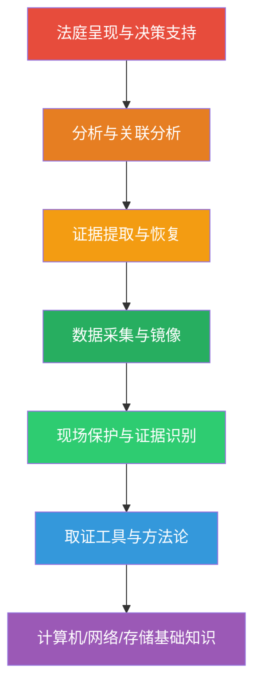
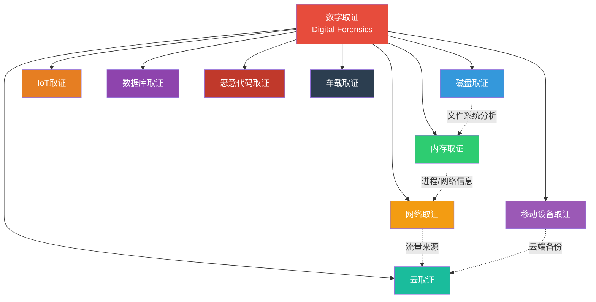
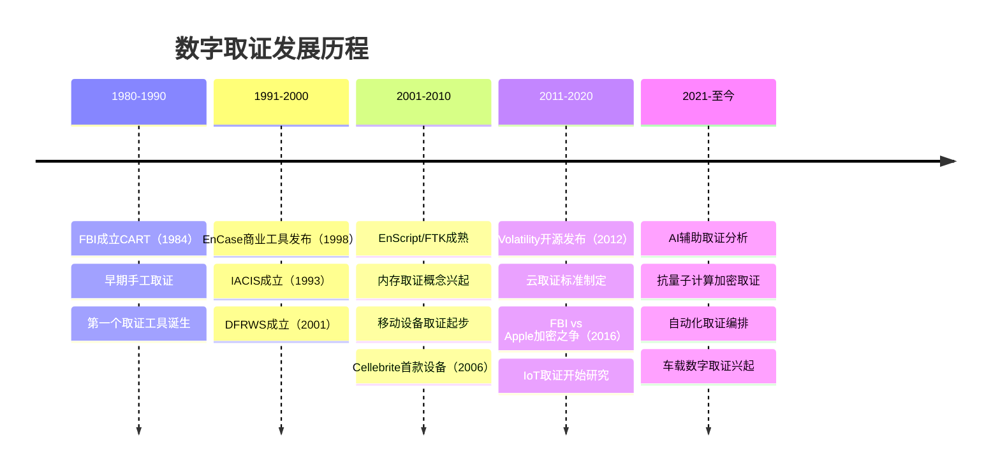
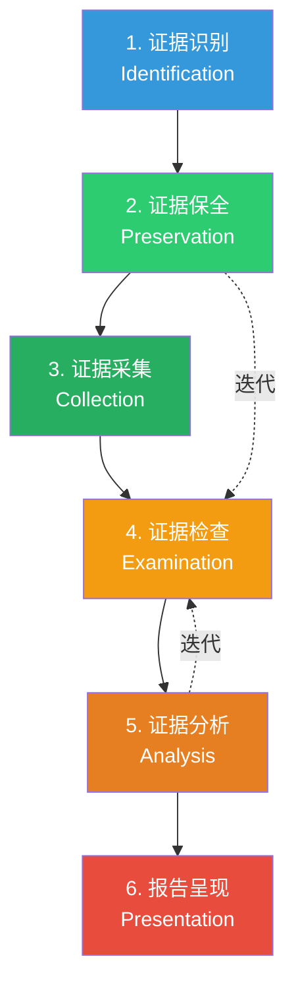
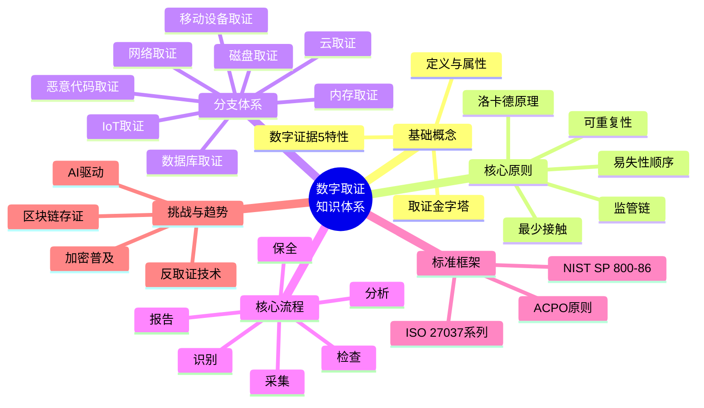

## 25.1 数字取证概述

数字取证（Digital Forensics）是网络安全领域最重要的分支之一——当防御失效、攻击发生后，数字取证是还原真相、追责溯源、修复漏洞的最后防线。它不是简单的"复制文件"或"看日志"，而是一套将科学方法论应用于数字犯罪调查的完整学科体系，涵盖从现场保护到法庭呈现的全链条。本章从零开始构建完整的数字取证知识体系，本节作为开篇，先厘清基本概念、分类体系、发展脉络和核心流程。

### 25.1.1 数字取证的定义与核心概念

#### 权威定义

数字取证是一个跨学科领域，融合了计算机科学、法学、犯罪学和法庭科学的方法论。不同组织和学者给出了各自的定义：

| 来源 | 定义核心 | 关键词 |
|------|----------|--------|
| ISO/IEC 27037:2012 | 应用经过验证的科学方法和技术手段，从数字资源中恢复、调查、分析和报告关于数字数据的事实 | 科学方法、事实呈现 |
| NIST SP 800-86 | 使用科学证明的技术，从数字来源收集、检查、分析和报告数字证据 | 科学证明、数字证据 |
| US-CERT | 对数字证据进行系统调查的过程，以确定数字事件的原因和影响 | 系统调查、原因确定 |
| SANS Institute | 应用调查和分析技术，以收集和保存来自特定计算设备的证据 | 调查技术、证据保存 |
| Nelson, Phillips & Steuart《Guide to Computer Forensics》 | 从计算资产中保存、识别、提取和归档数字证据的过程，用于在法庭上作为合法证据呈堂 | 法庭呈堂、合法性 |

这些定义虽然表述不同，但都有一个共同的核心理念——**用科学可验证的方式从数字世界中提取事实**。更准确地说，数字取证具有三重属性：

- **科学性**：遵循可重复、可验证的科学方法，每一个结论都必须有证据支撑
- **法律性**：取证过程和结果必须满足法庭证据的可采性（Admissibility）要求
- **技术性**：依赖计算机科学的专业技术手段实现数据提取、恢复和分析

#### 数字证据的特性

与传统物理证据（指纹、DNA、血迹）相比，数字证据有五个截然不同的特性，这些特性决定了取证方法必须与之适配：

1. **易复制性（Duplicability）**：数字证据可以被完全精确地无限复制，每个副本都是原件的"完美克隆"。这一特性既是优势——可以用副本分析而保护原件——也是挑战——难以区分"原件"和"副本"。传统物理证据（如一份纸质文件）的复印件显然不是原件，但数字证据的副本在比特层面与原件完全一致。因此，必须通过哈希校验和监管链来确定"原始证据"的身份。

2. **易篡改性（Malleability）**：数字证据可以在不留下明显痕迹的情况下被修改。修改文件的时间戳、编辑文档内容、改写日志条目，这些操作在数字世界可能只留下一行日志甚至不留痕迹。2016年，某案中辩护方成功质疑了电子证据的完整性——因为取证人员无法证明日志文件在采集前未被篡改。这要求取证必须使用写保护设备并计算原始哈希值。

3. **易销毁性（Fragility）**：一次格式化、一次覆写、一次系统重启，就可能让数字证据永久消失。这也是为什么取证的**第一原则**是"先做镜像，再分析原件"。特别要注意的是SSD的TRIM机制——操作系统在删除文件时会通知SSD控制器标记数据块为"可擦除"，SSD的垃圾回收（Garbage Collection）会在空闲时主动擦除这些数据块，这意味着SSD上的数据恢复窗口可能只有几分钟到几小时。

4. **元数据丰富性（Metadata-Rich）**：每个数字文件都附带大量元数据——创建时间、修改时间、访问时间、文件大小、所有者、权限、来源设备等。这些元数据本身可能就是关键证据。一张看似普通的照片可能包含：GPS坐标（精确到街道级别）、拍摄设备型号、精确到秒的拍摄时间、后期编辑软件信息、甚至社交媒体上传记录。这些元数据构成了一个隐含的证据网络。

5. **跨时空关联性（Cross-Temporal Correlation）**：数字证据可以将不同时间、不同地点的事件关联起来。一封邮件的发送时间、接收时间、转发路径，可以完整还原一个跨国犯罪的链条。与传统证据相比，数字证据的时间分辨率可以达到微秒级，空间分辨率可以跨越全球。

#### 数字取证金字塔

数字取证的实践结构可以用一个金字塔来概括——从底层的基础设施到顶层的决策输出，每一层都依赖下一层：

**图25-1：数字取证知识金字塔**。底层是计算机科学基础知识——操作系统原理、文件系统结构、网络协议栈、存储介质工作原理。往上一层是方法论和工具。再往上才是实际操作流程。顶层是分析、推理和呈现。任何一层的缺失都会导致整个取证工作的根基不稳。一个不懂文件系统结构的取证人员，即使拥有最先进的工具，也可能无法正确解读NTFS的$LogFile或Ext4的journal，从而遗漏关键的时间线信息。

#### 真实案例引入：从一起企业数据泄露看数字取证

在深入讨论原则和流程之前，先看一个简化的案例，感受数字取证在实际中如何运作：

> **案例：某互联网公司内部数据泄露事件**
>
> 2023年某月，某互联网公司发现其核心用户数据库（含2000万条用户记录）在暗网被出售。公司启动应急响应，引入数字取证团队。取证过程摘要如下：
>
> - **证据识别**：确定调查范围——数据库服务器、DBA工作站、网络流量日志、VPN日志、邮件系统
> - **证据保全**：发现嫌疑DBA的笔记本电脑仍在办公桌上。立即断网、拍照记录屏幕、通过LiME采集内存（获得运行中的SSH会话和数据库连接信息）、使用写保护器对笔记本硬盘创建镜像
> - **证据采集**：采集数据库服务器的binlog、binlog中发现异常的SELECT INTO OUTFILE操作；网络流量中发现DBA账号在非工作时间从境外VPN IP访问数据库服务器
> - **证据检查**：在镜像上恢复了DBA在凌晨2点删除的命令历史文件（.bash_history）；在浏览器缓存中找到其访问暗网市场的痕迹
> - **证据分析**：将SSH登录时间、数据库操作日志、网络连接记录关联到统一时间线，形成完整的攻击链：VPN登录→SSH连接→SQL查询→数据导出→压缩→上传至境外服务器→删除本地痕迹
> - **报告呈现**：生成面向公安的调查报告和面向公司管理层的风险评估报告

这个案例展示了数字取证六阶段流程的实际应用。接下来，我们系统地学习每一个概念。

### 25.1.2 数字取证的基本原则

数字取证不是简单的"把文件复制出来"，而是一套严谨的科学方法论。以下是经过国际公认的核心原则：

#### 洛卡德交换原理的数字演绎

法国犯罪学家埃德蒙·洛卡德（Edmond Locard）在20世纪初提出了著名的洛卡德交换原理——**"每一次接触都会留下痕迹"（Every contact leaves a trace）**。这个原理是整个法庭科学的基石，在数字世界有独特的演绎：

- 攻击者在系统上执行的每一条命令，都会在日志、内存、磁盘上留下痕迹——即使删除了.bash_history，shell进程的内存中可能仍保留着命令字符串
- 取证分析人员每次打开被检系统，也会留下访问痕迹——Windows系统会更新NTFS的$UsnJrnl（USN日志），记录文件的每次读取操作
- 关键挑战在于：数字痕迹可以被清除，而物理痕迹几乎无法完全清除。但完全清除数字痕迹比想象中困难得多——删除文件只是移除文件系统索引，数据块仍在磁盘上；清空日志可能被备份系统捕获；格式化磁盘只清除文件分配表

**数字洛卡德原理的实践意义**：取证人员不仅要分析"攻击者留下了什么"，还要意识到"我们的取证操作本身也会留下痕迹"。因此，取证团队应该记录自己的每一步操作，并在分析报告中明确区分"攻击者痕迹"和"取证人员痕迹"。

#### 证据保全原则（Chain of Custody）

**监管链（Chain of Custody）**是数字取证的法律基石。它记录了证据从被发现到呈堂的完整路径，每一步都必须有明确的记录：

**图25-2：证据监管链的完整路径**。每一步都必须记录：谁、何时、在何处、做了什么、为什么这么做、结果是什么。监管链一旦出现断裂，整个证据的法律效力就可能被推翻。美国法律体系中的"毒树之果"原则（Fruit of the Poisonous Tree）规定：如果证据获取过程违法，那么基于该证据衍生的所有后续证据都可能被排除。

监管链文档需要包含的核心信息：

| 字段 | 说明 | 示例 |
|------|------|------|
| 证据编号 | 唯一标识符 | DF-2024-001 |
| 采集人 | 操作者姓名 + 单位 | 张三，XX 市公安局网安支队 |
| 采集时间 | 精确到秒 | 2024-03-15 14:32:07 CST |
| 采集工具 | 工具名称 + 版本 + Hash | FTK Imager 4.7.1 (SHA256: A3F2...) |
| 证据描述 | 物理/逻辑描述 | Seagate 2TB HDD (SN: Z12345) |
| 哈希值 | MD5/SHA256（至少双算法） | MD5: 7B2F...C9A1, SHA256: 9E2A...F3B1 |
| 移交人→接收人 | 责任人变更 | 张→李，2024-03-15 16:00 |
| 存储位置 | 物理/逻辑位置 | 证据柜A-3，加密NAS卷DF001 |

**为什么需要双哈希？** 单一哈希算法存在理论上的碰撞风险（虽然SHA-256的实际碰撞在目前计算能力下不可行）。使用MD5+SHA256双算法可以在法律层面提供更强的证据完整性证明，也是多数司法管辖区的通行做法。

#### 易失性顺序原则（Order of Volatility）

数字证据的易失性各不相同——从微秒级消失的CPU寄存器数据，到可能保存数年的备份磁带。取证人员必须按照**从最易失到最不易失**的顺序采集数据。这就是 RFC 3227 定义的取证采集顺序：

| 优先级 | 数据类型 | 易失性 | 采集工具 | 时间窗口 |
|--------|----------|--------|----------|----------|
| 1 | CPU寄存器与缓存 | 微秒级 | 专用硬件（实践中几乎无法采集） | 系统运行中 |
| 2 | 内存/RAM | 秒-分钟级 | winpmem, LiME, F-Response | 断电前 |
| 3 | 网络状态 | 秒级 | `netstat`, `ss`, `arp -a` | 连接活跃期 |
| 4 | 运行进程 | 分钟级 | `ps`, `/proc/*/exe`, 进程树 | 未重启前 |
| 5 | 临时文件 | 小时-天 | 文件系统遍历 | 未被清理前 |
| 6 | 磁盘数据 | 小时-年 | dd, FTK Imager, EnCase | 未被覆写前 |
| 7 | 归档与备份 | 年 | 备份系统API | 保留期内 |

**违反这个顺序的代价**：如果先关机（终止了所有运行进程），再采集内存，那么所有进程信息（第4级）和网络连接（第3级）将永久丢失。更严重的是，如果设备使用全盘加密（BitLocker、FileVault），关机后重新启动，没有密钥就无法访问任何磁盘数据——这在"加密设备取证"中是一个灾难性的操作失误。

#### 最少接触原则（Least Intrusion）

取证分析应当**以最小程度改变被检查系统**。每多一次操作，就多一分污染证据的风险。这是取证科学性和法律可采性的基本保障。

- **推荐做法**：
  - 使用写保护设备（Write Blocker）挂载存储介质——硬件写保护器（如Tableau T356789、WiebeTech UltraDock）可以物理阻断写入信号
  - 在完整的位级镜像（bit-for-bit image）上进行分析，而非原设备
  - 如果必须使用运行中的系统，使用只读远程访问工具（如通过网络引导的取证环境）

- **不推荐做法**：
  - 直接启动被检系统（系统启动过程会修改大量文件——更新日志、创建临时文件、写入注册表）
  - 在原设备上安装或运行软件
  - 修改原系统的任何文件
  - 在嫌疑系统上使用USB设备（可能交叉污染）

**写保护设备选择指南**：

| 设备类型 | 代表产品 | 适用场景 | 价格区间 |
|----------|----------|----------|----------|
| 硬件写保护器 | Tableau T356789 | SATA/IDE硬盘，法庭级取证 | $300-800 |
| USB写保护器 | Tableau T8 | USB闪存驱动器、SD卡 | $50-150 |
| 软件写保护 | Linux mount -o ro | 临时调查、非法庭用途 | 免费 |
| 网络引导取证环境 | SIFT Workstation | 现场快速检查 | 免费（开源） |

#### 可重复性原则（Repeatability）

同一个取证过程，由不同的分析人员在相同的条件下执行，应当得到相同的结果。这是科学方法的基本要求，也是证据可采性的重要条件。

实现可重复性的三个关键措施：
- **使用经过验证的工具**：NIST的计算机取证工具测试（CFTT）项目对常见取证工具进行独立测试验证。参与CFTT测试的工具可以在NIST官网上查询其验证状态
- **记录完整的操作步骤**：包括工具版本号、命令参数、操作系统版本、硬件配置——任何一个变量的改变都可能导致不同的结果
- **保留原始镜像的哈希值**：在分析完成后，重新计算镜像哈希值，与采集时记录的哈希值比对，验证数据完整性未被破坏

### 25.1.3 数字取证的分类

根据调查对象和技术方法的不同，数字取证已经发展出多个分支。每个分支有其独特的工具链、方法论和挑战。

| 取证分支 | 调查对象 | 核心工具 | 主要挑战 |
|----------|----------|----------|----------|
| 磁盘取证 | HDD/SSD/U盘/存储卡 | FTK Imager, EnCase, Autopsy, The Sleuth Kit | SSD TRIM/擦除、加密磁盘、大容量数据 |
| 内存取证 | RAM/虚拟内存 | Volatility 3, Rekall, LiME, winpmem | 反取证工具、内核级Rootkit、加密内存 |
| 网络取证 | 网络流量/日志 | Wireshark, tcpdump, Zeek (Bro), NetworkMiner | 加密流量(TLS)、大数据量(10Gbps+) |
| 移动设备取证 | 手机/平板/穿戴设备 | Cellebrite UFED, XRY, MOBILedit!, checkra1n | 设备加密、Secure Enclave、iCloud/Google备份 |
| 云取证 | SaaS/PaaS/IaaS | 云提供商API、CloudForensics、Elcomsoft | 管辖权、数据隔离、多租户、日志访问 |
| 物联网取证 | IoT/智能设备/车载系统 | JTAG工具、芯片分析器、专用固件提取器 | 设备多样性(1000+型号)、固件加密、无标准接口 |
| 数据库取证 | 数据库系统 | SQLite Analyzer, ApexSQL, 专用解析器 | 事务日志、数据碎片、已提交读隔离级别 |
| 恶意代码取证 | 恶意软件样本 | IDA Pro, Ghidra, x64dbg, Any.Run | 代码混淆、反调试、反虚拟机、多态/变形 |

下面详细展开每个分支的核心技术要点：

#### 磁盘取证（Disk Forensics）

最传统也是最基础的取证分支。核心任务是从存储介质中恢复和分析数据：

- **已删除文件恢复**：通过解析文件系统的MFT（NTFS）、inode（Ext4）等元数据结构，恢复未被覆写的已删除文件。NTFS的MFT中，已删除文件的记录不会立即被清除，只是其文件名记录的`$FILE`属性被标记为"未使用"。Ext4的inode同样在删除后保持在磁盘上，直到被新文件覆写

- **文件系统分析**：深入分析底层结构——NTFS的$MFT（Master File Table，记录每个文件的所有属性）、$LogFile（事务日志）、备用数据流（ADS，可以隐藏数据）、稀疏文件；Ext4的journal、extent tree、目录哈希索引

- **数据雕刻（Data Carving）**：通过文件签名（File Signature/Magic Number）在未格式化或损坏的文件系统中提取文件——即使文件系统元数据已损坏，JPEG文件的 `FF D8 FF` 头标识 + `FF D9` 尾标识仍然可以定位完整文件。常见文件签名包括：PDF(`%PDF`)、ZIP(`PK`)、PNG(`89 50 4E 47`)、GIF(`47 49 46 38`)。Autopsy和Scalpel都内置了文件签名数据库

- **未分配空间分析**：分析磁盘上已标记为"可用"但尚未被覆写区域中的残留数据。这些区域可能包含：已删除文件的数据块、之前的文件系统结构、交换空间中的内存数据片段

- **时间线分析（MACB Timestamps）**：基于文件系统的四个时间戳重建事件序列——M（Modified，内容最后修改时间）、A（Accessed，最后访问时间）、C（$MFT Changed，元数据变更时间）、B（Birth/Created，创建时间）。Windows NTFS和Linux Ext4的时间戳粒度不同，跨系统比较时需要特别注意时区转换

- **注册表分析（Windows）**：Windows注册表（Registry）是取证的"金矿"——USB设备插入记录（SYSTEM\CurrentControlSet\Enum\USBSTOR）、最近打开的文件（NTUSER.DAT\Software\Microsoft\Windows\CurrentVersion\Recent）、程序安装记录（SOFTWARE\Microsoft\Windows\CurrentVersion\Uninstall）、网络配置（SYSTEM\CurrentControlSet\Services\Tcpip\Parameters\Interfaces）

#### 内存取证（Memory Forensics）

内存取证捕获的是系统运行时的"快照"。它解决的是磁盘取证无法触及的问题：

- **获取运行中的进程**：包括隐藏进程——通过DKOM（Direct Kernel Object Manipulation）技术篡改进程双向链表的Rootkit进程，在进程列表中不可见，但在内存的EPROCESS结构中仍然存在
- **提取网络连接信息**：当前活跃的TCP/UDP连接、端口监听状态、DNS缓存——即使网络监控工具未运行，操作系统内核中维护的连接表仍然保留着完整信息
- **恢复加密密钥**：程序运行时的加密密钥、口令、会话Token——例如BitLocker的全盘加密密钥在系统运行时以明文形式存储在内存中（LSASS进程）
- **提取恶意代码**：Rootkit注入的内核模块、无文件恶意软件（Fileless Malware）的Shellcode、进程注入（Process Injection）后的恶意代码段
- **分析内核数据结构**：内核模块列表（lsmod）、驱动加载状态、系统调用表（SSDT）是否被Hook

**Volatility 3常用插件速查**：

| 插件 | 功能 | 使用场景 |
|------|------|----------|
| `windows.pslist` | 列出所有进程 | 快速概览系统状态 |
| `windows.psscan` | 扫描内存中的EPROCESS结构 | 发现隐藏进程 |
| `windows.netscan` | 列出网络连接 | 追踪C2通信 |
| `windows.filescan` | 扫描文件对象 | 定位已删除文件 |
| `windows.hashdump` | 提取密码哈希 | 口令破解 |
| `windows.malfind` | 检测进程注入 | 发现恶意代码 |
| `windows.cmdline` | 提取进程命令行 | 还原攻击者操作 |

#### 网络取证（Network Forensics）

网络取证的关注点是**"线缆上的数据"**：

- **流量捕获（Packet Capture）**：使用 tcpdump/Wireshark 捕获网络数据包。全包捕获（Full Packet Capture）会产生海量数据——一条1Gbps的链路满载1小时约产生450GB数据。因此实际中常采用元数据捕获（NetFlow/sFlow/IPFIX）作为补充
- **流量分析**：还原TCP连接（TCP Stream Reassembly）、提取传输文件（通过协议解析从HTTP/FTP/SMB中提取文件）、分析协议交互（DNS查询、TLS握手、HTTP请求/响应）
- **入侵溯源**：追踪攻击者的IP链（通过CDN、代理、跳板机的逐层剥离）、识别C2通信模式（Beacon检测——规律性的心跳连接）、定位跳板机
- **数据泄露检测**：识别异常的数据外传行为——大流量出站（DLP告警）、DNS隧道（异常长的DNS查询域名）、ICMP隧道、隐蔽通道（Covert Channel）

**Zeek（原Bro）** 是网络取证中的重要工具——它不是传统的IDS/IPS，而是一个网络安全监控框架，能够将网络流量转化为结构化的日志（conn.log、http.log、dns.log、ssl.log等），极大提升了大规模流量分析效率。

#### 移动设备取证（Mobile Forensics）

移动设备取证面临三个层次的数据提取：

1. **逻辑提取（Logical Extraction）**：通过备份接口或ADB/iTunes获取用户数据——联系人、短信、通话记录、应用数据（SQLite数据库）。不需要越狱/root，但数据完整性有限，无法恢复已删除数据
2. **物理提取（Physical Extraction）**：获取完整的闪存镜像（类似于磁盘的位级复制），可以恢复已删除数据。通常需要越狱（iOS）或root（Android），或利用设备漏洞
3. **芯片提取（Chip-Off Extraction）**：从物理上拆下存储芯片（eMMC/UFS/NAND），通过JTAG接口或直接芯片读取器获取数据——这是最后的手段，操作风险最高（可能损坏芯片），且需要专业技术

**移动取证的关键挑战**：
- **iOS的Secure Enclave**：密钥从不离开安全芯片，即使物理提取闪存也无法直接解密数据
- **Android的File-Based Encryption（FBE）**：每个文件独立加密，不同用户分区使用不同密钥
- **云端数据**：iCloud/Google备份可能包含本地已删除的数据，但获取需要法律文书和账户凭证

#### 云取证（Cloud Forensics）与物联网取证（IoT Forensics）

两者是数字取证中面临最大挑战的新分支：

**云取证挑战**：
- 数据可能存储在地理位置未知的多个数据中心——一份云数据库可能分布在三个国家的五个可用区
- 多租户环境下数据隔离问题——物理服务器被多个客户共享，如何确保取证不影响其他租户
- 获取云提供商内部日志的权限壁垒——即使有搜查令，云提供商的日志保留策略可能已经覆盖了关键时间段的数据
- 法律管辖权跨越多个国家——一份AWS S3桶的数据可能同时受美国CLOUD Act和欧盟GDPR约束
- **云取证的核心方法**：优先通过云提供商的API/控制台导出数据（而非尝试从物理服务器提取），利用CloudTrail（AWS）、Activity Log（Azure）、Audit Log（GCP）等云原生审计日志

**物联网取证挑战**：
- 设备种类上千种，没有统一的文件系统或操作系统——智能音箱、智能门锁、智能摄像头、智能手表各有各的数据格式
- 大量设备没有标准的取证接口——很多IoT设备只有充电口，没有数据接口
- 数据可能只存储在云端而非本地——智能家居设备通常将数据实时上传云端，本地存储极少
- 设备空间极小，日志很快被覆盖——一个智能灯泡的存储可能只有几MB

#### 取证分支关系全景图

**图25-2：数字取证分支体系及关联关系**。各分支之间存在交叉——例如内存取证可以提取网络连接信息（与网络取证交叉），移动设备取证可能涉及云端数据（与云取证交叉）。

### 25.1.4 数字取证的发展历程

**图25-3：数字取证发展时间线**。从80年代初的萌芽期到今天，数字取证走过了近四十年的发展历程。

#### 1980-1990：萌芽与起源

1984年，美国联邦调查局（FBI）成立了**计算机分析与响应团队（CART，Computer Analysis and Response Team）**，这是全球第一个专门从事计算机取证的官方机构。这一时期的工作方式极其原始——分析人员使用 DOS 命令手工复制文件，用十六进制编辑器逐字节查看数据。没有写保护设备，没有哈希校验，取证过程的可靠性主要依赖操作人员的诚信。

1987年，国际上第一个专门讨论计算机取证的会议在夏威夷召开，标志着该领域开始形成学术共同体。

1988年，**Morris蠕虫事件**成为计算机取证的里程碑——这是第一个引起大规模关注的互联网安全事件，FBI对案件的调查推动了取证工具和方法的初步发展。

#### 1991-2000：商业化与工具化

1998年，Guidance Software 发布了 **EnCase**——第一款集成化的商业数字取证工具。它引入了"证据文件格式"（EnCase Evidence File Format，.E01），将镜像文件、哈希值、元数据打包在同一个容器中，极大提升了证据管理效率。同期，**FTK（Forensic Toolkit）** 由 AccessData 发布。

1993年，**国际计算机取证调查协会（IACIS）** 成立，开始为全球执法机构提供数字取证培训。IACIS至今仍是全球最权威的数字取证培训机构之一。

2001年，**数字取证研究工作组（DFRWS）** 成立，第一次系统地定义了数字取证的研究框架和核心挑战，并推动了学术界和产业界的对话。

#### 2001-2010：标准化与专业化

这一时期数字取证从"手艺"走向"科学"：

- **标准化**：NIST 发布 SP 800-86《计算机取证技术指南》；ISO 启动 27037/27041/27042/27043 系列标准制定
- **分支细化**：内存取证脱离磁盘取证成为独立分支——2005年，DFRWS 举办了第一次专门的内存取证挑战赛
- **开源工具崛起**：**The Sleuth Kit（TSK）** 和 **Autopsy** 提供了免费的磁盘取证替代方案，降低了取证的技术和经济门槛
- **移动取证萌芽**：智能手机普及催生了 Palm/BlackBerry 设备的取证需求，Cellebrite 公司于2006年推出首款移动取证设备

#### 2011-2020：智能化与多元化

- **内存取证成熟**：2012年 Volatility 2.0 正式开源发布，成为内存取证的事实标准。Volatility 3于2019年发布，采用Python 3重写，支持更多操作系统
- **云取证成为焦点**：2014年 NIST 发布 SP 800-189《云取证标准》，各国开始讨论云端数据的法律管辖权
- **加密带来的挑战**：2016年 FBI 与苹果的"圣贝纳迪诺事件"（iPhone加密解锁案）引发全球关于加密与取证的大讨论。FBI最终通过第三方工具（以色列公司Cellebrite或澳大利亚安全研究员Azhar Sheikh）解锁了iPhone 5C
- **IoT/OT取证兴起**：随着工业互联网和智能家居普及，对PLC（可编程逻辑控制器）、智能音箱、车载系统的取证需求涌现

#### 2021-至今：AI驱动与自动化

- **AI辅助取证**：机器学习被用于日志分析（异常检测、模式发现）、图片分类（自动识别非法图片）、evidence triage（优先级排序）。大语言模型（LLM）正在被实验性地用于辅助撰写取证报告、分析恶意代码
- **自动化取证编排（SOAR for Forensics）**：SOC中取证流程的自动化——从告警触发→证据采集→沙箱分析→报告生成全流程自动化
- **对抗性取证**：攻击者开始使用 AI 生成反取证工具（例如智能覆写、模拟正常行为的 Rootkit、AI生成的混淆代码）
- **量子计算威胁**：当前加密标准（AES-256、RSA-2048）在未来量子计算下的脆弱性，驱动取证领域的加密演进——后量子密码学（Post-Quantum Cryptography, PQC）成为研究热点

### 25.1.5 数字取证的标准化框架

数字取证的可信度建立在**标准之上**。以下是全球最核心的取证标准体系：

#### ISO/IEC 27037:2012——《数字证据识别、收集、获取和保存指南》

这是数字取证领域最基础的国际标准，规定了四个核心环节的要求：

- **证据识别（Identification）**：如何确定哪些数据可能是证据——需要评估数据的潜在相关性、完整性、和易失性
- **证据收集（Collection）**：在现场环境中安全收集数字设备——包括设备包装、运输条件（防静电、防磁、防震）、环境记录
- **证据获取（Acquisition）**：创建可验证的证据副本——必须使用经过验证的方法和工具，必须记录所有操作
- **证据保存（Preservation）**：确保证据在存储和传输过程中的完整性——加密存储、定期哈希校验、环境控制（温度、湿度）

关键要求：所有操作必须有文档记录；任何偏离标准程序的行为必须有正当理由和书面记录。

#### ISO/IEC 27041/27042/27043系列

| 标准 | 标题 | 关注点 |
|------|------|--------|
| ISO/IEC 27041:2015 | 调查方法保证指南 | 方法验证、工具确认、能力证明 |
| ISO/IEC 27042:2015 | 数字证据分析与解释指南 | 分析过程的科学性、结论的可靠性 |
| ISO/IEC 27043:2015 | 事件调查原则与过程 | 统一的调查框架、跨领域的通用原则 |

#### NIST SP 800-86——《计算机取证技术指南》

NIST（美国国家标准与技术研究院）的实践指南，涵盖四个阶段：

1. **收集（Collection）**：识别潜在数据源，使用适当的方法获取数据
2. **检查（Examination）**：使用自动和手动技术提取和分析数据——关注技术层面的数据处理
3. **分析（Analysis）**：对提取的数据进行分析，得出结论——关注逻辑层面的推理
4. **报告（Reporting）**：撰写和呈现调查结果——关注沟通层面的表达

#### ACPO原则（英国）

英国警察局长协会（ACPO）的数字取证原则是全球执法领域的参考标准，适用于所有涉及数字证据的调查活动：

| 原则 | 内容 | 实践含义 |
|------|------|----------|
| 原则1 | 任何负责数字证据的人员不得采取改变存储介质上可能用于法庭的数据的行为 | 使用写保护设备是强制要求，而非"建议" |
| 原则2 | 在必须访问原始数据的情况下，访问者必须经过授权且具备相关能力 | 仅限于合格取证人员操作，非技术人员不得接触证据 |
| 原则3 | 必须创建和保留完整的审计日志记录，记录所有对数字证据的操作 | 每一步操作都要有日志，日志本身也是证据 |
| 原则4 | 案件负责人（Person in Charge of the Investigation）对所有原则的遵守负最终责任 | 管理责任不可下放，即使实际操作由技术人员执行 |

### 25.1.6 数字取证的核心流程

尽管不同的取证类型（磁盘/内存/网络）在技术细节上差异很大，但它们遵循相同的高层流程框架——**六个阶段的取证生命周期**：

**图25-4：数字取证六阶段生命周期**。注意检查和分析之间可能存在多次迭代——初步分析发现新线索后，可能需要再次检查其他数据源。这并非"返工"，而是科学调查的正常过程。

#### 第一阶段：证据识别（Identification）

目标是**明确取证的范围和目标**——需要调查什么数据？数据的可能位置在哪里？

典型问题清单：
- 事件是什么时候发生的？（时间范围——确定日志保留期是否覆盖）
- 涉及哪些系统？（服务器、终端、网络设备、外部存储、云实例）
- 哪些用户可能涉及？（账号、权限级别、VPN凭证）
- 数据的敏感性/重要性？（涉及个人隐私？商业秘密？国家安全？）
- 需要优先保存哪些易失性数据？（内存→网络连接→进程→磁盘）
- 证据可能的法律用途？（内部调查？行政处分？刑事报案？民事诉讼？）

**实操注意**：此阶段最容易犯的错误是"取证范围过窄"——只取了服务器日志，忽略了员工终端和工作站；或者只取了主磁盘，忘了扩展存储设备。另一个常见错误是忽略了"云数据"——现代企业环境中，大量数据存储在SaaS应用（Office 365、Salesforce、Slack）中，这些数据可能不包含在传统的IT备份中。

#### 第二阶段：证据保全（Preservation）

目标是**确保证据不被修改、丢失或污染**。

标准操作：
1. **现场隔离**：断开被检设备的网络连接（拔网线，非直接关机），防止远程擦除——2019年某案中，嫌疑人在被捕前通过远程Wipe命令清除了手机数据，就是因为执法人员到达时未优先断网
2. **拍照记录**：对现场环境、设备连接状况、屏幕内容进行拍照——记录设备的物理状态（哪些线缆连接、哪些指示灯亮着）
3. **创建写保护镜像**：使用写保护设备连接目标存储设备，创建位级完整镜像。如果条件不允许使用硬件写保护器，至少使用Linux的只读挂载方式
4. **计算哈希值**：对原始设备和镜像文件分别计算 MD5 + SHA-256 哈希值，验证一致性。哈希计算可能耗时很长（一块4TB硬盘的SHA-256计算约需2-4小时），但不可省略
5. **安全存储**：原设备存放于防篡改证据袋中（贴封条、签名、记录编号）；镜像文件存放于加密存储设备中，独立备份

#### 第三阶段：证据采集（Collection）

将识别到的数据从原始位置**安全地复制到取证分析环境**中。

根据数据类型选择不同的采集方法：

| 数据类型 | 采集方法 | 工具示例 |
|----------|----------|----------|
| 磁盘镜像 | 位级复制 | `dd if=/dev/sda of=/evidence/image.dd bs=4k conv=noerror,sync status=progress` |
| 内存镜像 | 专用内存采集工具 | `winpmem -o memory.raw` (Windows) / `insmod lime.ko "path=/tmp/mem.lime format=lime"` (Linux LiME) |
| 网络流量 | 全包捕获 | `tcpdump -i eth0 -w capture.pcap -s 0 -G 3600 -W 24`（按小时轮转，保留24小时） |
| 日志文件 | 安全复制 + 哈希 | `rsync -a /var/log/* /evidence/logs/ && sha256sum /evidence/logs/*` |
| 云数据 | API导出/云取证工具 | AWS CLI: `aws s3 sync s3://bucket /evidence/cloud/` / Google Vault 导出 |
| 数据库 | 逻辑导出 + 一致性校验 | `mysqldump --all-databases > /evidence/db.sql` / SQLite `.backup` 命令 |

**关键原则**：在采集阶段**不要对原始数据进行任何修改**。不要解压文件、不要打开文档、不要运行程序。采集操作本身可能会改变文件的访问时间戳，如果使用写保护设备可以避免这个问题。

**常见镜像格式**：

| 格式 | 扩展名 | 特点 | 工具支持 |
|------|--------|------|----------|
| dd/raw | .dd, .raw, .img | 无压缩、无元数据，最原始的位级镜像 | 所有工具通用 |
| E01 (Expert Witness) | .E01 | 压缩、分段、内置哈希、元数据 | EnCase, FTK, Autopsy |
| AFF (Advanced Forensic Format) | .aff, .afd | 开源、可扩展、支持加密 | AFFLIB, Autopsy |
| VMDK | .vmdk | 虚拟磁盘格式，可直接在VM中挂载 | VMware, VirtualBox |

#### 第四阶段：证据检查（Examination）

在镜像副本上进行**自动化或半自动化数据提取**。这是将"原始字节"转化为"可分析的信息"的关键阶段。

典型操作：
- 文件系统解析（恢复文件目录树、解析元数据结构）
- 已删除文件恢复（通过MFT/inode残余记录、文件签名雕刻）
- 关键词搜索（特定文件类型、内容关键字、正则表达式、正交搜索语言）
- 时间戳提取和排序（MACB时间戳、日志时间戳、事件时间戳）
- 文件签名分析（识别被修改扩展名的文件——例如将.exe改名为.jpg）
- 元数据提取（EXIF地理信息、文档作者和修改历史、下载源URL、浏览器History）

#### 第五阶段：证据分析（Analysis）

将检查阶段提取的信息**关联起来，形成逻辑结论**。这是最需要经验和创造力的阶段。

分析维度：
- **时间线分析（Timeline Analysis）**：将文件时间戳、日志时间戳、网络连接时间戳关联到统一时间线上，还原事件顺序。这是最强大的分析手段之一——一条完整的时间线往往能直观展示攻击者的行为路径
- **关联分析（Correlation Analysis）**：将不同数据源的信息关联——"用户在10:01登录VPN，10:02开始大量下载文件，10:15通过电子邮件外发压缩包"
- **行为分析（Behavioral Analysis）**：识别用户的异常行为模式——"管理员账号凌晨3点登录系统，查看从未访问过的财务文件"——将行为与已知的攻击模式（MITRE ATT&CK框架）进行比对
- **痕迹分析（Artifact Analysis）**：查找特定应用留下的元数据——浏览器历史、最近打开文件列表（LNK/Recent）、USB设备插入记录（USBSTOR/Registry）、RDP连接记录（MRU列表）、WiFi连接历史

#### 第六阶段：报告呈现（Presentation）

将分析结果**以清晰、客观、法律上可接受的方式**呈现。

优秀取证报告的核心要素：
- **执行摘要**：面向非技术受众（法官、检察官、高管）——用日常语言说明调查结论，避免技术术语
- **技术细节**：面向技术受众（专家证人、辩护律师的技术顾问）——完整的技术分析过程、工具版本、参数设置、命令输出
- **证据附录**：完整的监管链文档、哈希值清单、工具输出原文、关键证据的截图
- **结论与建议**：基于证据的客观结论（"证据表明……"而非"我认为……"），以及安全改进建议
- **免责声明**：受限条件、不确定性因素、无法验证的部分、分析的时间范围限制

### 25.1.7 数字取证的伦理与法律考量

数字取证不仅是一项技术活动，更涉及深刻的伦理和法律问题。忽略这些考量可能导致证据被排除、调查人员被追责、甚至构成侵权。

#### 取证人员的职业伦理

| 伦理原则 | 具体要求 |
|----------|----------|
| 客观公正 | 无论调查结果有利于哪一方，都必须如实报告。不得选择性呈现证据 |
| 专业能力 | 仅在自己能力范围内接受委托。不得使用未验证的工具或方法 |
| 保密义务 | 对调查过程中接触的所有信息严格保密，未经授权不得泄露 |
| 利益冲突回避 | 与案件有利害关系时必须主动回避 |
| 遵守法律 | 取证操作必须有法律授权（搜查令、授权书），不得越权操作 |

#### 证据可采性（Admissibility）

在法庭上，数字证据必须满足以下条件才可能被采纳：

- **相关性（Relevance）**：证据与案件事实之间有逻辑关联
- **可靠性（Reliability）**：证据的获取过程科学可靠、可重复验证
- **完整性（Integrity）**：证据从采集到呈堂未被篡改（通过哈希校验和监管链证明）
- **合法性（Legality）**：证据的获取过程符合法律规定（有搜查令、遵循法定程序）

**主要证据规则**：
- **美国**：Federal Rules of Evidence（FRE）Rule 901(b)(9)——数字证据需通过"过程或系统产生准确结果"的证明来认证
- **中国**：《刑事诉讼法》第五十条——电子数据作为法定证据种类之一；《关于办理刑事案件收集提取和审查判断电子数据若干问题的规定》（2016）详细规定了电子数据的取证程序
- **欧盟**：eIDAS条例——电子签名和电子证据的法律效力

#### 隐私保护

取证调查可能涉及大量个人隐私数据。取证人员必须：
- 严格限定调查范围，不得"钓鱼式"搜索无关的个人数据
- 对涉及个人隐私的数据进行脱敏处理（在报告中隐去非涉案人员的个人信息）
- 遵循数据最小化原则（Data Minimization）——只采集和分析与案件直接相关的数据

### 25.1.8 数字取证实验室与工作站

一个专业的数字取证实验室是高质量取证工作的基础设施保障。

#### 硬件配置参考

| 组件 | 推荐配置 | 说明 |
|------|----------|------|
| CPU | Intel i9/Xeon（多核心） | 哈希计算和并行分析需要强CPU |
| 内存 | 128GB+ ECC RAM | Volatility分析大内存镜像需要大量RAM |
| 存储 | NVMe SSD (系统) + RAID阵列 (证据) | 系统盘用SSD保证速度；证据存储用RAID 5/6提供冗余 |
| 写保护设备 | Tableau T35u, WiebeTech UltraDock | 必须配备，不可省略 |
| 展示设备 | 多显示器（3-4屏） | 同时查看时间线、日志、文件内容 |
| 网络 | 隔离网络（无互联网连接） | 防止取证过程中被远程攻击或数据泄露 |

#### 软件工具集

| 类别 | 工具 | 用途 | 授权方式 |
|------|------|------|----------|
| 综合取证平台 | Autopsy 4.x | 磁盘/文件分析 | 开源免费 |
| 综合取证平台 | EnCase Forensic | 磁盘/网络分析 | 商业许可 |
| 内存取证 | Volatility 3 | RAM分析 | 开源免费 |
| 网络分析 | Wireshark | 协议分析 | 开源免费 |
| 取证环境 | SIFT Workstation | 预装取证工具的Linux发行版 | 开源免费 |
| 取证环境 | CAINE | 取证专用Linux发行版 | 开源免费 |
| 数据恢复 | PhotoRec/TestDisk | 文件恢复 | 开源免费 |
| 哈希工具 | hashdeep | 大批量文件哈希计算 | 开源免费 |

### 25.1.9 数字取证的常见误区

以下是在数字取证中反复出现的错误认识。明确这些误区有助于在实战中避免踩坑：

| 误区 | 错误认识 | 正确理解 | 后果 |
|------|----------|----------|------|
| 误区1 | 先关机再取证 | 关机会导致内存和进程数据永久丢失——应优先采集易失性数据 | 内存中的加密密钥、运行进程、网络连接全部丢失 |
| 误区2 | 直接操作系统分析 | 直接开机/登录被检系统会改变大量数据——应在写保护镜像上分析 | 文件时间戳被修改，日志被更新，证据被污染 |
| 误区3 | 有备份就不用取证 | 备份可能不包含关键数据（内存状态、网络连接、运行时进程） | 遗漏易失性证据，无法还原攻击的实时状态 |
| 误区4 | 删除等于消失 | 文件被删除后，只要数据块未被覆写，完全可以通过数据雕刻恢复 | 可能遗漏大量"已删除"但可恢复的关键文件 |
| 误区5 | 格式化就能清空数据 | 快速格式化只清除文件系统索引，不擦除数据块——专业工具可恢复 | 快速格式化的磁盘仍然是取证的丰富数据源 |
| 误区6 | SSD和HDD完全一样 | SSD的TRIM/垃圾回收机制会主动擦除已删除数据块——取证时间窗口极短 | SSD上的已删除文件可能在几分钟内被永久擦除 |
| 误区7 | 加密数据就无解了 | 加密数据虽然直接难以解密，但内存中可能存有解密密钥或明文副本 | 忽略了内存取证对加密设备的关键作用 |
| 误区8 | 取证工具绝对可信 | 任何工具都有局限和Bug——必须验证工具输出，交叉验证 | 过度依赖单一工具可能导致分析遗漏或错误 |
| 误区9 | 取证只是技术人员的事 | 取证涉及法律、管理、伦理多个维度——需要跨领域协作 | 技术上完美但法律上有瑕疵的证据可能被法庭排除 |
| 误区10 | 云环境无法取证 | 云环境有丰富的审计日志和API，取证方法不同于传统但同样有效 | 放弃对云环境的取证，遗漏关键证据 |

### 25.1.10 数字取证的当前挑战与发展趋势

#### 核心挑战

**1. 加密的全面普及**

全盘加密（BitLocker、FileVault、LUKS）已成为操作系统标配——Windows 11默认开启BitLocker，macOS的FileVault在激活时自动启用。取证人员必须在系统运行时（设备处于解锁状态）或拥有解密密钥的条件下获取数据。一旦设备关机重启，加密磁盘在没有密钥的情况下几乎不可破解（AES-256在目前的计算能力下无法暴力破解）。这对传统"扣押设备→带回实验室分析"的取证模式提出了根本性挑战。

**2. 数据量爆炸**

一个典型的企业案件可能涉及数TB到数十TB的数据。一个中等规模的数据库服务器每天产生50GB的日志；一个大型企业的邮件系统可能累积了10TB的历史邮件。全量分析在时间和资源上都不现实。需要**Triage前置（Triage Forensics）**——在采集前就对证据进行优先级排序，优先处理最可能包含关键证据的数据源。

**3. 反取证技术（Anti-Forensics）**

攻击者越来越多地使用反取证工具来对抗调查：

| 反取证技术 | 具体手段 | 取证应对 |
|------------|----------|----------|
| 数据擦除 | `wipe`、`shred`、`srm` 等工具覆写数据 | 未分配空间分析、磁盘映像比对、文件系统日志 |
| 时间戳混淆 | 修改文件系统时间戳伪造时间线 | 分析时间戳一致性（$STANDARD_INFORMATION vs $FILE_NAME）、日志交叉验证 |
| 日志清理 | 删除或修改系统日志、审计痕迹 | 系统日志备份、SIEM归档、其他数据源的日志交叉印证 |
| 加密与隐写 | 使用VeraCrypt加密容器、隐写术隐藏文件 | 内存取证（提取挂载的加密容器密钥）、统计分析检测隐写 |
| 无文件恶意软件 | 仅存在于内存中，不在磁盘上写文件 | 内存取证（Volatility）、实时监控 |
| 安全擦除 | 使用加密擦除（ATA Secure Erase） | 证据可能无法恢复，需要依赖其他数据源（网络日志、云端备份） |

**4. 法律与管辖权的复杂性**

云取证面临的最大障碍是**司法管辖权**——数据可能存储在美国、欧洲和中国的多个数据中心。获取证据需要遵循不同国家的数据保护法律（GDPR、CCPA、《网络安全法》），法律请求可能需要数月时间。一个跨境案件可能同时涉及5个以上国家的法律体系，取证团队需要法律专家的持续支持。

**5. 新型技术平台**

- **容器和微服务**：Kubernetes集群中的容器生命周期极短（分钟级），日志分散在多个Pod中，取证窗口极窄
- **Serverless（Lambda/函数计算）**：没有持久化存储的计算环境，取证几乎只能依赖云审计日志
- **区块链和加密货币**：虽然交易记录不可篡改，但钱包地址的匿名性使得资金追踪极具挑战
- **边缘计算**：数据在产生地就被处理和丢弃，中心化日志可能不包含原始数据

#### 发展趋势

**AI驱动自动取证**：机器学习模型可以从数百万条日志中自动识别异常模式、提取关键时间节点、甚至生成初步调查报告。具体应用包括：基于NLP的日志分析（自动提取IOC——Indicators of Compromise）、基于图像识别的证据分类（自动标记敏感图片）、基于聚类算法的证据优先级排序。大语言模型（LLM）正在被实验性地用于辅助撰写取证报告和分析恶意代码，但"AI生成的报告能否作为法庭证据"仍是一个悬而未决的法律问题。

**编排化取证（Orchestrated Forensics）**：类似于安全SOAR，取证流程正在被编排成可自动执行的剧本——当检测到特定告警时，自动启动内存捕获、磁盘镜像、日志导出、沙箱分析等一系列操作。Cortex XSOAR、Splunk SOAR等平台已经开始集成取证自动化剧本。

**区块链存证**：利用区块链的不可篡改特性，实现证据的分布式存证和监管链的自动化记录。中国已有多家法院和公证机构采用区块链存证系统——杭州互联网法院在2018年率先使用了司法区块链平台，北京、广州互联网法院随后跟进。证据上链后，监管链的每个环节都被记录在不可篡改的分布式账本上。

**车载取证（Vehicle Forensics）**：现代汽车是"轮子上的计算机"——包含数百个ECU（电子控制单元），运行CAN总线通信。车载取证可以提取：GPS轨迹数据、行车记录仪视频、事件数据记录器（EDR/黑匣子）中的碰撞数据、蓝牙配对历史、手机连接记录、OBD-II诊断日志。随着自动驾驶技术发展，车载取证在交通事故调查、犯罪追踪中的价值日益凸显。

**内存取证的深化**：随着反取证技术的进步，内存取证的重要性持续上升。GPU内存取证（提取显卡VRAM中的数据）、容器内存取证（分析Docker/K8s容器的内存状态）等新兴方向正在被研究。

### 25.1.11 数字取证资质认证

对于有志于从事数字取证的专业人士，以下是全球主要的资质认证体系：

| 认证 | 颁发机构 | 定位 | 考试要求 |
|------|----------|------|----------|
| GCFE (GIAC Certified Forensic Examiner) | GIAC/SANS | 磁盘/内存取证，偏技术实操 | 通过GIAC考试，有SANS培训要求 |
| GCFA (GIAC Certified Forensic Analyst) | GIAC/SANS | 高级取证分析，偏恶意代码和事件响应 | 先通过GCFE |
| EnCE (EnCase Certified Examiner) | OpenText (原Guidance) | EnCase工具专家认证 | 通过理论+实操考试 |
| CCE (Certified Computer Examiner) | ISFCE | 通用计算机取证 | 论文+实操考试 |
| CFCE (Certified Forensic Computer Examiner) | IACIS | 执法取证，面向执法人员 | 实操考试+案例分析 |
| MCFE (Magnet Certified Forensic Examiner) | Magnet Forensics | 移动设备+磁盘取证 | 在线考试 |
| CDFP (Certified Digital Forensics Professional) | DFI | 综合数字取证 | 多领域考试 |

**建议路径**：入门阶段可以从GIAC的GCFE开始（SANS FOR500课程），它是业界认可度最高的取证认证之一。如果侧重执法方向，IACIS的CFCE更合适。如果侧重商业工具使用，EnCE是好选择。

### 25.1.12 小结

数字取证是一门**将科学方法论应用于数字犯罪调查**的跨学科领域。从1984年FBI成立CART至今，它已经发展出涵盖磁盘、内存、网络、移动设备、云计算和物联网的完整分支体系。

**图25-5：数字取证知识体系思维导图**。

在本节中，我们系统性地学习了：

- **数字证据的五大特性**：易复制、易篡改、易销毁、元数据丰富、跨时空关联——这些特性决定了取证方法必须有别于传统物理证据
- **取证的四大核心原则**：洛卡德原理（每次接触留痕）、监管链（Chain of Custody）、易失性顺序（RFC 3227）、最少接触（Least Intrusion）
- **九大取证分支**：磁盘、内存、网络、移动设备、云、IoT、数据库、恶意代码、车载——每个分支有独立的工具链和方法论
- **六大标准化框架**：ISO 27037/27041-43、NIST SP 800-86、ACPO原则
- **六阶段取证生命周期**：识别→保全→采集→检查→分析→报告——这是所有取证类型的通用流程
- **伦理与法律考量**：取证人员职业伦理、证据可采性要求、隐私保护原则
- **实验室与工作站配置**：硬件、软件、环境的建设标准
- **十大常见误区**：从"先关机"到"云环境无法取证"，每个误区都可能导致灾难性后果
- **五大核心挑战**：加密普及、数据量爆炸、反取证技术、法律管辖权、新型技术平台
- **四大发展趋势**：AI驱动、编排化、区块链存证、车载取证

这些基础知识是后续深入每一类取证（磁盘、内存、网络、移动等）的理论前提。在接下来的章节中，我们将逐一深入每个分支的具体技术与实战操作。

---

**延伸阅读与参考资源：**

- ISO/IEC 27037:2012 - Information technology — Security techniques — Guidelines for identification, collection, acquisition and preservation of digital evidence
- ISO/IEC 27041:2015 - Information technology — Security techniques — Assurance requirements for incident management methods
- ISO/IEC 27042:2015 - Information technology — Security techniques — Guidelines for the analysis and interpretation of digital evidence
- ISO/IEC 27043:2015 - Information technology — Security techniques — Incident investigation principles and processes
- NIST SP 800-86 - Guide to Integrating Forensic Techniques into Incident Response
- RFC 3227 - Guidelines for Evidence Collection and Archiving
- DFRWS Digital Forensic Research Conference: https://dfrws.org
- SANS Digital Forensics and Incident Response: https://www.sans.org/cyber-security-courses/digital-forensics-incident-response/
- NIST Computer Forensics Tool Testing (CFTT) Program: https://www.nist.gov/itl/ssd/software-quality-group/computer-forensics-tool-testing-program-cftt
- Volatility 3 Documentation: https://volatility3.readthedocs.io/
-《电子数据取证与鉴定》（中国人民公安大学出版社）—— 国内数字取证权威教材
- SANS FOR500: Windows Forensic Analysis — 入门首选课程
- SANS FOR508: Incident Response, Threat Hunting, and Digital Forensics — 事件响应+取证进阶
