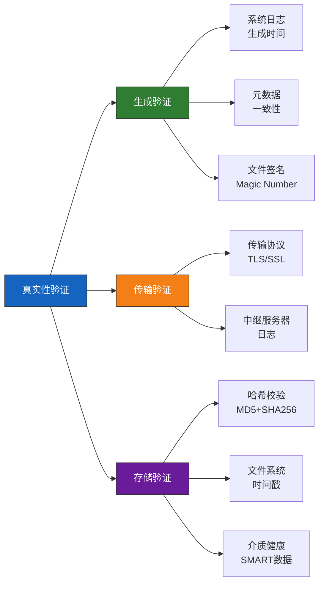
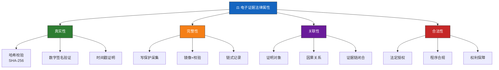
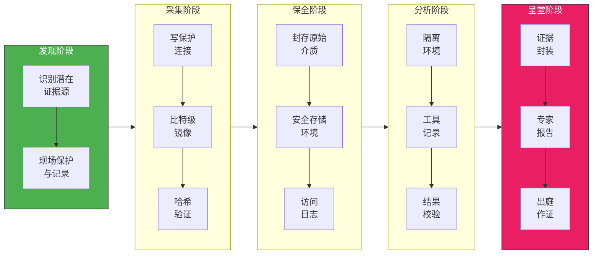
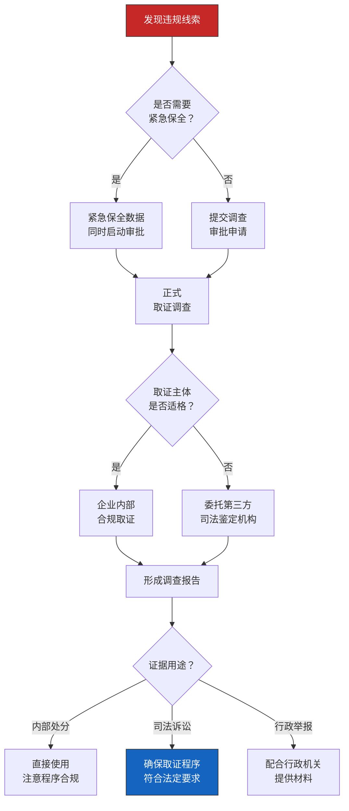
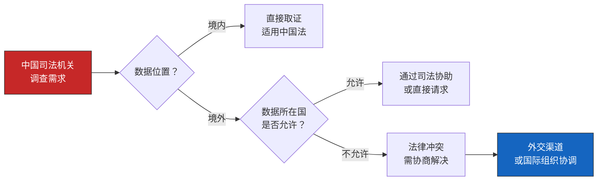
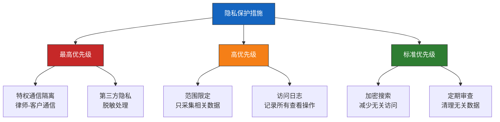
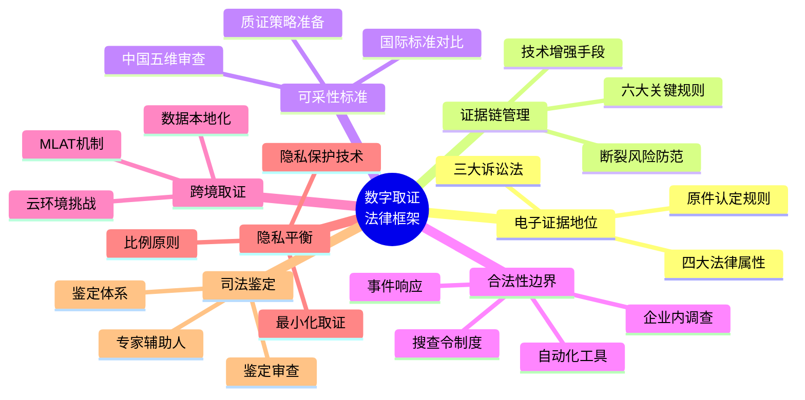

## 25.2 数字取证的法律框架

数字取证不仅是技术问题，更是一个法律问题。取证人员采集的每一份电子证据，最终都可能在法庭上接受检视。如果取证程序不符合法律规定，即使技术手段再精良，获取的数据也毫无法律价值。本章系统梳理数字取证的法律基础，涵盖中国法律体系、国际标准、证据规则、合规要求及实务应对策略。

---

### 25.2.1 电子证据的法律地位

#### 25.2.1.1 中国法律体系中的电子证据演进

电子证据在中国法律体系中经历了从模糊到明确、从附属到独立的演进过程：

**第一阶段：萌芽期（2004-2011）**

- **2004年《电子签名法》**：首次在法律层面承认了数据电文的法律效力，确立了"数据电文原件"的概念，但此时电子证据尚未被明确列为独立证据类型。该法第7条规定："数据电文不得仅因为其是以电子、光学、磁或者类似手段生成、发送、接收或者储存的而被拒绝作为证据使用。"
- 这一阶段，电子数据主要作为传统证据的辅助材料使用，缺乏独立的法律地位。

**第二阶段：确立期（2012-2015）**

- **2012年《刑事诉讼法》修订**：首次将"电子数据"列为第八种法定证据类型（第48条），与物证、书证、证人证言等并列。这是电子证据在中国刑事司法中获得独立地位的里程碑。
- **2012年修订的《民事诉讼法》**：同步将"电子数据"纳入证据类型（第63条），实现了三大诉讼法的统一。
- **2014年修订的《行政诉讼法》**：第33条将电子数据列为证据类型，至此三大诉讼法均确立了电子数据的独立证据地位。

**第三阶段：规范化期（2016-2020）**

- **2016年两高一部《关于办理刑事案件收集提取和审查判断电子数据若干问题的规定》**：这是目前中国电子取证领域最核心的操作规范，共28条，详细规定了电子数据的收集提取、移送展示和审查判断全流程。核心要点包括：
  - 收集电子数据时应当扣押原始存储介质（第8条）
  - 无法扣押原始介质时，应计算完整性校验值并记录（第8条）
  - 收集电子数据应当由2名以上侦查人员进行（第7条）
  - 应当邀请见证人在场（第10条）
  - 移送时应附完整性校验值（第14条）
- **2019年《最高人民法院关于修改〈关于民事诉讼证据的若干规定〉的决定》**：第14条明确了电子数据包括五类具体形式，大幅扩展了电子证据的外延：
  - 网页、博客、微博客等网络平台发布的信息
  - 手机短信、电子邮件、即时通信、通讯群组等网络应用服务的通信信息
  - 用户注册信息、身份认证信息、电子交易记录、通信记录、登录日志等信息
  - 文档、图片、音频、视频、数字证书、计算机程序等电子文件
  - 其他以数字化形式存储、处理、传输的能够证明案件事实的信息

**第四阶段：精细化期（2021至今）**

- **2021年《最高人民法院关于适用〈中华人民共和国刑事诉讼法〉的解释》**：第93条至第97条进一步细化了电子数据的审查标准，增加了对原始存储介质扣押、数据完整性校验、见证人制度等要求，并明确"电子数据的内容经审查属实"才可作为定案根据。
- **2021年《数据安全法》**：确立了数据分类分级保护制度和数据安全审查制度，为数字取证中的数据处理活动设定了新的合规边界。
- **2021年《个人信息保护法》**：确立了个人信息处理的合法性基础、最小必要原则、个人权利保障等制度，对取证过程中涉及的个人信息处理提出了严格要求。
- **2022年最高人民法院《关于加强区块链司法应用的意见》**：明确了区块链存证在司法领域的应用规范，为技术增强证据可信度提供了政策依据。

#### 25.2.1.2 核心法律依据全景

当前中国数字取证领域最核心的法律法规体系如下表所示：

| 法律法规 | 发布时间 | 核心要点 | 适用范围 |
|---------|---------|---------|---------|
| 《刑事诉讼法》（2018修订） | 2018.10 | 电子数据为独立证据类型；明确取证程序要求 | 刑事案件 |
| 《民事诉讼法》（2021修订） | 2021.12 | 电子数据为证据类型；电子送达 | 民事案件 |
| 《行政诉讼法》（2017修订） | 2017.06 | 电子数据为证据类型 | 行政案件 |
| 两高一部电子数据规定 | 2016.09 | 取证程序、审查标准、移送展示全流程规范 | 刑事案件 |
| 《网络安全法》 | 2016.11 | 网络运营者协助义务；日志留存不少于6个月 | 网络安全监管 |
| 《数据安全法》 | 2021.06 | 数据分类分级；数据出境安全评估；数据安全审查 | 数据处理活动 |
| 《个人信息保护法》 | 2021.08 | 个人信息处理规则；最小必要原则；个人权利 | 个人信息处理 |
| 《电子签名法》 | 2004.08（2019修订） | 电子签名法律效力；数据电文原件要求 | 电子交易 |
| 《网络安全审查办法》 | 2022.02 | 关键信息基础设施采购安全审查；数据出境审查 | 关键基础设施运营者 |
| 最高法区块链司法应用意见 | 2022.05 | 区块链存证司法认可；智能合约司法应用 | 司法领域 |

#### 25.2.1.3 电子数据的原件认定规则

电子数据的"原件"认定是数字取证中最容易引发争议的问题之一。传统证据法要求提交原件，但电子数据具有易复制、易修改的特性，"原件"概念需要重新界定。

**原始存储介质优先原则**

根据两高一部规定第8条，收集电子数据应当"优先扣押原始存储介质"。这意味着：

- 原始存储介质本身是最佳的"原件"
- 在原始介质上直接提取的电子数据，其真实性推定最高
- 如果原始介质损坏或无法扣押，需要有充分的理由说明

**替代方案：完整性校验值制度**

当无法提取原始存储介质时（如云数据、服务器实时数据、已销毁的介质），必须满足以下条件：

1. 在提取前对原始数据计算完整性校验值（MD5 + SHA-256双重校验）
2. 由2名以上侦查人员在见证人在场的情况下完成提取
3. 制作详细的提取笔录，记录提取时间、方法、工具、环境
4. 对提取过程进行全程录像（特殊情况除外）

**电子数据原件的审查标准**

法庭审查电子数据原件时，通常考察以下要素：

| 审查维度 | 审查内容 | 缺失后果 |
|---------|---------|---------|
| 物理原件 | 是否扣押原始存储介质 | 需要更严格的替代证明 |
| 数据原件 | 数据是否直接从原始介质提取 | 需要提供提取笔录和校验值 |
| 过程原件 | 提取过程是否符合法定程序 | 可能导致证据被排除 |
| 时间原件 | 数据的时间戳是否可信 | 时间事实无法认定 |

> **实务要点**：在民事诉讼中，原件认定相对灵活。最高人民法院《关于民事诉讼证据的若干规定》第15条规定，当事人以电子数据作为证据的，应当提供原件。原件包括电子数据的原始存储介质，也包括"电子数据的制作者或者与原件核对无异的复制件"。但在刑事诉讼中，对原件的要求更为严格。

#### 25.2.1.4 电子证据的四大法律属性

电子证据要获得法庭认可，必须同时满足以下四个核心属性，任何一个环节的缺失都可能导致证据被排除：

**（1）真实性（Authenticity）**

真实性要求电子证据的内容未被篡改、伪造或损坏。这是电子证据最容易被攻击的环节，因为电子数据本质上是可修改的二进制代码。判断真实性的核心维度：

- **生成环节**：数据是否由正常的系统、程序自动生成？有无人为干预痕迹？
- **存储环节**：数据在存储介质上是否保持原始状态？元数据是否完整？
- **传输环节**：数据在传输过程中是否经过加密保护？有无被中间人截获修改？
- **验证手段**：通过哈希值校验（MD5/SHA-1/SHA-256）、数字签名、时间戳等技术手段进行完整性验证

**真实性审查的三重验证框架：**

**（2）完整性（Integrity）**

完整性不仅指数据内容的完整无缺，更指数据采集、保存、分析全过程的可追溯性。实践中，完整性体现在：

- **物理完整性**：原始存储介质未被物理损坏或篡改
- **逻辑完整性**：数据内容未被添加、删除或修改
- **过程完整性**：从采集到呈堂的每一步都有记录可查（即证据链管理）
- **环境完整性**：存储环境的温度、湿度、电磁防护等条件符合要求

**（3）关联性（Relevance）**

电子证据必须与案件待证事实存在逻辑关联。取证人员需要清晰回答以下问题：

- 该证据证明什么事实？
- 该事实与本案争议焦点的关系是什么？
- 该证据是直接证据还是间接证据？
- 单一证据能否形成完整证据链？

**关联性判断的四层模型：**

| 关联层级 | 描述 | 示例 |
|---------|------|------|
| 直接关联 | 证据直接证明案件事实 | 聊天记录中嫌疑人承认作案 |
| 间接关联 | 证据通过推理链间接证明事实 | 案发时间嫌疑人手机GPS在案发现场 |
| 辅助关联 | 证据增强其他证据的可信度 | 服务器日志佐证聊天记录的时间线 |
| 排除关联 | 证据排除其他可能性 | 硬盘写入时间排除嫌疑人当时不在场 |

**（4）合法性（Legality）**

合法性是指证据的获取方式和程序必须符合法律规定。以下情形获取的电子证据可能被认定为非法证据而排除：

- 无搜查令或法定授权进行搜查扣押
- 通过非法侵入计算机系统获取数据
- 使用已被禁用的取证工具或方法
- 违反法定程序采集证据（如未邀请见证人）
- 侵犯宪法保护的通信秘密和个人隐私

**非法证据排除的"毒树之果"规则延伸**：在中国刑事司法实践中，通过非法手段获取的电子证据不仅本身可能被排除，基于该非法证据进一步获取的衍生证据（即"毒树之果"）也可能面临排除风险。例如，通过非法获取的IP地址定位到嫌疑人住址后，在该住址搜查获得的证据，其合法性也可能受到质疑。

> **四性关系**：真实性和完整性是技术层面的要求，关联性属于逻辑层面的判断，合法性则是司法程序层面的保障。四者缺一不可，共同构成电子证据的可采性基础。在实务中，四性的审查顺序通常是：先审查合法性（程序正义），再审查真实性（事实基础），然后审查完整性（内容完整），最后审查关联性（逻辑推理）。

---

### 25.2.2 证据链管理（Chain of Custody）

证据链管理是数字取证中最核心的法律实务要求。它要求在证据从发现、采集、保存、分析、传输到法庭呈现的每一个环节都有完整、准确、可验证的记录。证据链断裂意味着法庭无法确认证据在流转过程中未被篡改，该证据可能被排除。

#### 25.2.2.1 证据链的生命周期

**各阶段核心操作与风险点：**

| 阶段 | 核心操作 | 必须记录的内容 | 常见风险 |
|------|---------|--------------|---------|
| 发现 | 现场勘查、证据识别 | 发现时间、位置、设备状态、发现人 | 现场被污染、证据源未识别 |
| 采集 | 写保护连接、镜像制作 | 工具版本、校验值、操作人、见证人 | 未使用写保护、镜像不完整 |
| 保全 | 封存、安全存储 | 存储位置、环境条件、访问记录 | 未密封、存储环境不达标 |
| 分析 | 数据提取、关键词搜索 | 分析环境、工具参数、分析步骤 | 分析工具修改了原始数据 |
| 呈堂 | 证据封装、出庭 | 移交记录、专家资质、报告编号 | 证据包装不规范、报告不完整 |

#### 25.2.2.2 证据链文档模板

一个规范的证据链记录应包含以下信息。实务中可参考以下模板格式：

**证据采集记录表（示例）**

| 字段 | 内容 |
|------|------|
| 案件编号 | DF-2024-00123 |
| 证据编号 | EX-001 |
| 证据描述 | 涉案笔记本电脑（ThinkPad X1 Carbon，SN: PF3Z4K8T） |
| 发现时间 | 2024-06-15 14:32 |
| 发现地点 | 某市朝阳区XX大厦18层1805室 |
| 发现人 | 王XX（工号: DF-021） |
| 发现人签名 | _________________ |
| 见证人 | 李XX（物业管理人员） |
| 见证人签名 | _________________ |
| 设备状态 | 开机状态，屏幕锁定 |
| 采集方法 | 冷启动 → 写保护连接 → FTK Imager 镜像 |
| 原始介质哈希值(SHA-256) | 9F2E7A1B...（64位十六进制） |
| 镜像文件哈希值(SHA-256) | 9F2E7A1B...（与原始介质一致） |
| 采集工具 | FTK Imager 4.7.1 |
| 采集人 | 赵XX（工号: DF-035） |
| 采集人签名 | _________________ |
| 存储位置 | 证物柜C-03-12 |
| 移交记录 | 见附件《证据移交登记表》 |

**证据移交登记表（示例）**

| 字段 | 内容 |
|------|------|
| 移交编号 | TF-2024-0045 |
| 案件编号 | DF-2024-00123 |
| 证据编号 | EX-001 |
| 移交日期 | 2024-06-16 09:30 |
| 移交人 | 赵XX（采集人） |
| 接收人 | 陈XX（分析员，工号: DF-042） |
| 移交时哈希值(SHA-256) | 9F2E7A1B...（与采集时一致） |
| 移交原因 | 从采集阶段转入分析阶段 |
| 证据状态 | 密封完好，封条无破损 |
| 移交人签名 | _________________ |
| 接收人签名 | _________________ |
| 见证人签名 | _________________ |

#### 25.2.2.3 证据链管理的关键规则

**规则一：一人一操作一签名**

每一环节的操作必须由单人完成并当场签名确认。不允许事后补签或代签。在电子化的证据管理系统中，每次操作应使用PKI数字证书进行数字签名。

**规则二：最小接触原则**

只有经过授权且必要的人员才能接触证据。每一次接触都必须记录接触人、接触时间、接触目的和接触方式。未授权的接触将直接导致证据链断裂。

**规则三：写保护优先**

在对原始介质进行分析之前，必须使用硬件写保护设备（如Tableau T35es、CRU WriteBlock）或软件写保护机制，防止任何数据写入操作。写保护设备的型号和序列号也应记录在案。

**为什么写保护如此重要？** 即使是只读分析操作系统（如只读启动Linux），在挂载文件系统时也可能因操作系统自动更新文件系统元数据（如访问时间戳atime）而导致原始介质发生微量变化。硬件写保护设备通过物理阻断写入信号来从根本上消除这一风险。

**规则四：双重哈希验证**

在采集和移交的每一个节点，都应重新计算哈希值并与上一节点的哈希值进行比对。推荐使用MD5 + SHA-256双重校验：

- MD5：速度快，用于快速比对，但已知存在碰撞漏洞，不应作为唯一校验手段
- SHA-256：安全性高，用于最终确认，是当前司法实践中推荐的校验算法

**规则五：环境记录**

证据的存储环境条件（温度、湿度、电磁屏蔽状况）应持续记录。特别是对于固态硬盘（SSD）等对环境敏感的介质，环境记录尤为重要。SSD的TRIM机制可能在断电后自动清理已删除数据，因此在取证时应尽快完成镜像制作。

**规则六：时间连续性**

证据链中的时间记录必须连续，不应出现不可解释的时间间隔。例如，如果证据在14:00被采集，16:00被移交，但移交记录显示15:00才开始检查密封状态，这30分钟的空白需要有合理解释。

#### 25.2.2.4 证据链断裂的常见场景与后果

| 断裂场景 | 具体表现 | 法律后果 | 预防措施 |
|---------|---------|---------|---------|
| 证据无人看管 | 证据在无人看守状态下放置超过合理时间 | 对方律师可能质疑证据被篡改 | 全程录像+GPS追踪标签 |
| 交接手续不全 | 证据移交只有口头交接，无书面记录 | 无法证明证据在谁手中、做了什么操作 | 强制双人签字+电子化登记 |
| 多次复制无记录 | 对镜像文件进行了多次复制操作但未记录 | 无法区分原始镜像与复制版本 | 原始介质加锁封存 |
| 工具未校验 | 使用的取证工具哈希值未记录 | 无法证明工具本身未被篡改 | 每次使用前校验工具哈希 |
| 存储介质未密封 | 证据存放的介质未被封条密封 | 可能被质疑有人在封存后接触证据 | 使用防伪封条+拍照记录 |
| 全程无见证人 | 关键取证步骤无第三方见证人在场 | 程序不合规，证据可能被排除 | 提前安排见证人+备用录像 |
| 哈希值不匹配 | 移交时计算的哈希值与采集时不一致 | 证据可能已被篡改，直接排除 | 每次交接都验证哈希 |
| 工具版本变更 | 分析时使用的工具版本与采集时不同 | 可能产生不同结果，影响可信度 | 记录所有工具版本信息 |

#### 25.2.2.5 技术手段增强证据链可信度

现代数字取证实践中，越来越多的技术手段被用来增强证据链的可信度：

- **区块链存证**：将每一步操作的哈希值写入区块链，利用区块链的不可篡改特性固化证据链。2022年，最高人民法院发布了《关于加强区块链司法应用的意见》，鼓励在司法领域使用区块链技术。杭州互联网法院2018年审理的"杭州华泰一媒文化传媒有限公司诉深圳市道同科技发展有限公司侵害作品信息网络传播权纠纷案"是中国首个认可区块链存证效力的案件。
- **数字时间戳**：每次操作后立即申请可信时间戳（如联合信任时间戳服务中心TSA），证明操作发生在特定时间点之前。时间戳的核心价值在于证明"某数据在某时间点已经存在"，而非事后伪造。
- **PKI签名链**：每个操作人员的数字签名构成一条签名链，任何环节的签名断裂都能被立即发现。数字证书应由可信的CA机构签发，且在有效期内。
- **视频全程录像**：对关键取证操作进行全程高清录像，作为证据链的辅助证明材料。录像应包含时钟显示，且录像文件本身也应计算哈希值。

**技术增强手段的可信度对比：**

| 技术手段 | 防篡改能力 | 实施成本 | 法律认可度 | 适用场景 |
|---------|-----------|---------|-----------|---------|
| 区块链存证 | 极高 | 中高 | 高（有司法解释支持） | 重要案件、长期存证 |
| 数字时间戳 | 高 | 低 | 高（广泛认可） | 所有取证操作 |
| PKI签名链 | 高 | 中 | 高 | 多人协作取证 |
| 视频全程录像 | 中（可编辑） | 低 | 中高 | 现场取证、关键操作 |
| 写保护设备 | 高（物理阻断） | 中 | 高 | 存储介质分析 |

---

### 25.2.3 证据的可采性标准

电子证据的可采性（Admissibility）是指证据能够被法庭接受并作为定案依据的资格。各国对电子证据可采性的判断标准存在差异，但核心关注点一致：真实性、合法性、关联性和完整性。

#### 25.2.3.1 中国标准

根据两高一部《关于办理刑事案件收集提取和审查判断电子数据若干问题的规定》及相关司法解释，中国法庭审查电子证据可采性的核心标准包括：

**（1）原始性审查**

- 是否扣押、封存了原始存储介质？
- 在无法扣押原始介质的情况下（如云服务器中的数据、网络实时流量），提取过程是否合法合规？
- 电子数据是否有增加、删除、修改等情形？如存在修改，修改的原因和过程是否合理、有记录？
- 对于无法扣押原始介质的特殊情况，是否提供了合理的说明和替代性完整性保障措施？

**（2）程序合法性审查**

- 取证是否经过法定审批？是否有县级以上公安机关负责人批准？
- 是否邀请了见证人？见证人是否适格（不能是公安、检察人员，不能是案件当事人近亲属）？
- 对于无法邀请见证人的情况（如网络远程勘验），是否进行了全程录像？
- 对电子数据的检查、提取、分析是否遵循了国家标准或行业标准？
- 取证是否由2名以上具备资质的人员执行？

**（3）取证工具与方法审查**

- 使用的取证工具是否经过验证？是否具备司法鉴定资质？
- 取证方法是否符合国家标准（如GA/T 756、GA/T 976等公共安全行业标准）？
- 是否在分析过程中使用了与原始数据交互的软件（可能修改元数据）？
- 取证工具是否经过NIST或省级以上机构的性能验证？

**（4）完整性校验审查**

- 是否计算并记录了电子数据的完整性校验值（哈希值）？
- 移送和展示时，完整性校验值是否一致？
- 校验算法是否符合行业标准（推荐SHA-256）？
- 是否进行了多算法交叉验证（如MD5 + SHA-256）？

**（5）关联性审查**

- 电子数据与案件事实的逻辑关联是否清晰？
- 能否排除其他可能性？例如，登录IP地址是否可能被故意伪造或劫持？
- 电子数据是否能与其他证据相互印证？
- 证据是否能形成完整的证据链，而非孤立存在？

#### 25.2.3.2 国际标准对比

不同司法管辖区对电子证据可采性的判断标准有所不同：

| 标准 | 起源 | 核心要求 | 适用地区 |
|------|------|---------|---------|
| **Daubert标准** | 美国1993年Daubert诉Merrell Dow制药案 | Judge as gatekeeper：法官作为科学证据的守门人，评估（1）理论是否可检验（2）是否经过同行评议（3）已知或潜在错误率（4）是否被相关领域普遍接受 | 美国联邦法院及多数州 |
| **Frye标准** | 美国1923年Frye诉美国案 | 科学证据必须在其所属领域获得"普遍接受"（general acceptance） | 美国部分州（如加州） |
| **PACE 1984** | 英国《警察与刑事证据法》 | 要求取证程序符合Codes of Practice；对电子证据的扣押、检查、保存有详细规范 | 英国及威尔士 |
| **电子证据指南** | 国际刑警组织（INTERPOL） | 最佳实践框架：确保电子证据的完整性、真实性和可追溯性 | 国际执法合作 |
| **GDPR合规要求** | 欧盟《通用数据保护条例》 | 取证过程中必须保护数据主体的隐私权，遵循数据最小化原则 | 欧盟成员国 |
| **中国四性审查** | 两高一部规定及司法解释 | 真实性、完整性、关联性、合法性四性缺一不可 | 中国 |

**各标准的核心差异分析：**

- **美国Daubert vs Frye**：Daubert标准更灵活，法官可以根据科学方法论判断证据可靠性；Frye标准更保守，只接受领域内"普遍接受"的方法。在数字取证领域，Daubert标准更有利于引入新型取证技术。
- **中国四性审查**：相比美国标准，中国标准更强调程序合法性，对取证程序的合规性要求更高。这是因为中国法律体系更注重程序正义。
- **GDPR影响**：GDPR对数字取证的影响越来越大，即使是非欧盟国家的取证人员，在涉及欧盟公民数据时也必须考虑GDPR的合规要求。

> **实务提示**：在中国法庭上，电子证据的审查以中国法律和相关司法解释为准。但在涉及跨国案件或国际司法协助时，了解国际标准有助于取证人员在初期就按照最高标准操作，避免因标准不统一导致证据在域外法庭被排除。

#### 25.2.3.3 电子证据的质证策略

在法庭上，电子证据的质证（Cross-examination）通常围绕以下薄弱环节展开。取证人员需要提前预判并做好应对准备：

**常见质证攻击角度：**

1. **数据完整性怀疑**："你怎么证明这些数据没有被改过？能否提供从采集到现在的完整哈希校验记录？"
   - **应对**：准备好完整的证据链文档和哈希校验记录；如有区块链存证，可当场验证；提供从采集到呈堂的每一次校验记录

2. **工具可靠性质疑**："你用的这个取证工具经过验证了吗？错误率是多少？在哪些方面可能存在误差？"
   - **应对**：提供工具的NIST验证报告或司法鉴定机构出具的鉴定证书；说明工具的已知局限性和应对措施

3. **操作人员资质挑战**："你有司法鉴定人资质吗？你从事电子取证工作几年了？参加过哪些专业培训？"
   - **应对**：提供司法鉴定人执业证书、专业培训和资质证明；强调从业经验和成功案例

4. **替代解释可能性**："有没有可能是黑客入侵后伪造了这些数据？或者是系统自动生成的错误记录？"
   - **应对**：通过多源数据交叉印证（如服务器日志+客户端日志+第三方日志），排除替代假说；提供系统安全性分析报告

5. **程序合规性质疑**："为什么没有邀请见证人？为什么在采集时没有对原始介质进行写保护？"
   - **应对**：如实说明程序瑕疵的原因（如紧急情况），并提供合理解释和辅助证据（如全程录像）

6. **关联性质疑**："这个IP地址怎么证明就是被告使用的？有没有可能是共用网络或者VPN？"
   - **应对**：提供ISP日志、路由器MAC地址绑定记录、设备硬件指纹等辅助证据

7. **时间可信性质疑**："你怎么证明这些时间戳没有被人为修改？系统时间是否准确？"
   - **应对**：提供NTP服务器同步记录、多设备时间对比、可信时间戳服务记录

**质证准备清单：**

| 攻击角度 | 准备材料 | 应对策略 |
|---------|---------|---------|
| 完整性 | 证据链文档、哈希校验记录 | 全链条展示校验过程 |
| 工具可靠性 | NIST报告、鉴定证书 | 说明验证过程和局限性 |
| 人员资质 | 执业证书、培训证明 | 强调专业背景和经验 |
| 替代解释 | 多源日志、安全分析 | 交叉印证排除假说 |
| 程序合规 | 取证方案、审批文件、录像 | 解释瑕疵原因和补救 |
| 关联性 | ISP日志、MAC记录 | 建立设备-人-行为关联 |
| 时间可信 | NTP记录、时间戳 | 多源时间交叉验证 |

---

### 25.2.4 数字取证的合法性边界

取证人员必须在法律授权的范围内行事，超越边界获取的证据不仅无法使用，还可能使取证人员自身面临法律风险。

#### 25.2.4.1 搜查令与法定授权

在刑事案件中，对电子设备的搜查扣押必须持有搜查证。根据《刑事诉讼法》第136条至第140条：

- **有证搜查原则**：进行搜查必须向被搜查人出示搜查证
- **紧急例外**：在执行逮捕、拘留时，遇有紧急情况（如可能转移、销毁证据），可不用搜查证进行搜查，但事后必须及时补办手续（通常为24小时内）
- **范围限制**：搜查范围不得超过搜查证载明的范围。例如，搜查证仅针对"涉案台式计算机"，则不应随意搜查现场的移动硬盘和手机
- **见证人要求**：搜查应当有见证人在场见证

**搜查证申请的实务要点：**

| 要素 | 说明 |
|------|------|
| 申请主体 | 县级以上公安机关侦查人员 |
| 审批主体 | 县级以上公安机关负责人 |
| 必要内容 | 搜查对象、搜查范围、搜查理由、涉案证据描述 |
| 有效期 | 通常为签发后10日内执行 |
| 特殊情形 | 网络远程搜查需特别授权，技术含量更高 |

#### 25.2.4.2 同意搜查

在以下情形中，经当事人同意可以不需搜查证进行电子证据采集：

- 当事人书面签署《同意搜查/检查声明》，明确同意对其电子设备进行取证
- 同意必须是自愿、明示的，不能通过胁迫、欺骗方式获取
- 同意范围应具体明确（如"同意检查手机中的微信聊天记录"不包括"同意提取全部数据"）
- 同意可以被随时撤回，撤回后应立即停止取证

**同意搜查的法律风险提示：**

> 如果同意搜查的程序存在瑕疵（如同意非自愿、范围模糊），即使获取的证据在技术上是真实的，也可能因合法性不足而被排除。建议在同意搜查前，先取得书面同意声明，并由见证人在场。

#### 25.2.4.3 企业内调查的法律边界

企业内部的电子取证调查（如员工违规调查）需要特别注意：

- **劳动关系授权**：企业应在劳动合同或员工手册中明确约定对工作设备和网络进行监控的权利，并取得员工知情同意。未经事先告知的监控可能被认定为侵犯隐私权
- **区分工作与个人数据**：企业设备上的个人数据应受到合理保护，不应任意采集。最高人民法院《关于审理劳动争议案件适用法律问题的解释（一）》对此有相关保护精神
- **不得非法获取通信秘密**：即使在工作设备上，企业内部调查也不得非法截取员工的私人通信内容，这可能违反《刑法》第252条（侵犯通信自由罪）
- **证据效力受限**：企业内部调查获取的电子证据，在刑事诉讼中可能因取证主体不适格而被排除；在民事诉讼中也需要证明取证程序的合法性
- **第三方机构介入**：对于复杂的内部调查，建议委托具有司法鉴定资质的第三方机构进行，以增强证据的法律效力

**企业内调查的合规流程：**

#### 25.2.4.4 事件响应中的取证问题

在网络安全事件响应（Incident Response）过程中，取证行为常处于一个灰色地带：

- **紧急避险抗辩**：在正在进行的网络攻击中，为阻止攻击、保护数据安全而采取的数据采集行为，可主张紧急避险。根据《刑法》第21条，为了使国家、公共利益、本人或者他人的人身、财产和其他权利免受正在发生的危险，不得已采取的紧急避险行为，造成损害的，不负刑事责任
- **事后合规**：事件响应中的取证记录应完整保留，事后向公安机关报告时作为辅助材料
- **隐私影响评估**：根据《个人信息保护法》第55条，涉及大量个人信息的安全事件，应进行隐私影响评估
- **通知义务**：根据《个人信息保护法》第57条，发生个人信息泄露事件时，应立即采取补救措施并通知相关部门和个人，但通知前的取证操作不受此限

**事件响应取证的特殊挑战：**

| 挑战 | 说明 | 应对策略 |
|------|------|---------|
| 时间紧迫 | 需在攻击持续期间快速采集证据 | 预先准备取证脚本和工具包 |
| 环境动态 | 系统状态持续变化，内存数据随时丢失 | 优先采集内存转储，再采集磁盘镜像 |
| 证据易失 | 攻击者可能随时清除痕迹 | 实时监控+自动告警+自动保全 |
| 法律模糊 | 紧急情况下的取证边界不清晰 | 事后及时报告+完整记录+法律咨询 |

#### 25.2.4.5 自动化取证工具的法律挑战

随着人工智能和自动化技术在数字取证中的应用，一系列新的法律问题浮现：

- **自动化工具的可信度**：AI驱动的取证工具（如自动恶意软件分析、自动行为重建）的决策过程是"黑箱"的，其结果在法庭上可能面临Daubert标准的质疑——如果无法解释工具的推理过程，其结论可能不被采纳
- **算法偏差**：自动化工具可能存在算法偏差，导致对特定人群的不公正判断
- **责任归属**：当自动化工具产生错误分析导致冤案时，责任应由工具开发者、取证机构还是操作人员承担？
- **最新监管趋势**：2024年，国家互联网信息办公室发布了《生成式人工智能服务管理暂行办法》的配套细则，对AI在司法领域的应用提出了透明度要求

> **实务建议**：在使用自动化取证工具时，取证人员应保留完整的人工复核记录，确保能够解释每一项分析结论的技术依据。工具输出应作为辅助材料而非独立证据使用。

---

### 25.2.5 跨境电子取证的法律问题

随着云计算和全球化的发展，电子数据跨境流动日益频繁，跨境电子取证成为数字取证领域最具挑战性的法律问题之一。

#### 25.2.5.1 数据本地化要求

多个国家和地区实施了数据本地化政策：

- **中国**：《网络安全法》第37条要求关键信息基础设施运营者在中国境内收集和产生的个人信息和重要数据应当在境内存储。《数据安全法》第31条进一步扩大范围。《个人信息保护法》第38-40条建立了个人信息跨境提供的规则框架，包括安全评估、标准合同、认证等三条路径。
- **俄罗斯**：《个人数据法》（152-FZ）要求所有俄罗斯公民的个人数据必须存储在俄罗斯境内的服务器上，2015年9月起全面执行。
- **欧盟**：GDPR虽然没有直接要求数据本地化，但对数据出境设置了严格条件（充分性认定、标准合同条款SCC、约束性公司规则BCR）。2020年Schrems II判决后，SCC的有效性也面临挑战。
- **印度**：《数字个人数据保护法》（2023）要求政府可限制数据出境到未获批准的国家。

**数据本地化与跨境取证的冲突：**

#### 25.2.5.2 司法协助与MLAT

跨国电子取证通常通过以下渠道进行：

1. **司法协助条约（MLAT）**：两国之间通过正式的外交和司法渠道请求协助取证。MLAT是目前最正式的跨境取证途径，但过程缓慢，通常需要6个月至2年。中国已与60多个国家签署了刑事司法协助条约。
2. **双边刑事司法协助条约**：中国与美国、加拿大、澳大利亚等多国签署了双边刑事司法协助条约，其中包含电子取证协助条款。
3. **直接向服务商请求**：在某些情况下，可直接向在本地设有实体的国外服务商请求数据（如要求微软中国提供某账户数据）。需要注意服务商的当地法律义务可能与请求国的要求冲突。
4. **执法合作机制**：通过国际刑警组织（INTERPOL）、上海合作组织（SCO）等国际执法合作平台开展取证协作。中国还通过"猎狐行动"等专项活动加强跨境追逃追赃中的电子取证合作。
5. **双边数据共享协议**：中美之间在网络安全领域建立了执法对话机制，但在数据获取方面的合作仍然有限。

#### 25.2.5.3 云环境取证的法律挑战

云环境中的电子取证面临独特法律困境：

- **数据位于何处？** 云服务商的数据可能分布在全球多个数据中心，取证人员难以确定数据的物理位置。AWS、Azure、Google Cloud等主流云服务商的数据中心遍布全球
- **多租户环境**：一个物理服务器上运行着多个客户的虚拟机，隔离取证可能导致其他客户的数据被意外采集
- **服务商配合**：云服务商是否有义务配合？配合的范围是什么？是否需要用户的授权？不同国家的法律对此有不同规定
- **数据销毁风险**：云服务商的数据保留策略可能自动删除数据，取证人员必须在数据被删除之前采取保全措施
- **快照与备份**：云环境中的数据可能存储在快照、备份、冗余副本等多个位置，取证范围的确定需要与云服务商密切沟通

**云取证的最佳实践：**

| 实践要点 | 说明 |
|---------|------|
| 提前锁定数据位置 | 在事件发生后立即确定数据所在的区域和可用区 |
| 保存云服务商日志 | 要求云服务商保留相关日志，防止自动清理 |
| 获取云服务商配合 | 通过法律程序要求云服务商配合取证 |
| 记录访问凭证 | 保存所有相关的API密钥、访问令牌等 |
| 分层取证 | 区分元数据、日志数据、应用数据，分层采集 |

---

### 25.2.6 隐私权与取证的平衡

数字取证天然具有侵入性——取证行为不可避免地涉及对个人数据的访问和分析。如何在取证需求与隐私保护之间取得平衡，是法律框架必须解决的核心问题。

#### 25.2.6.1 比例原则

比例原则是衡量取证行为合法性的核心标准，源自德国行政法，后被广泛应用于刑事司法领域：

- **适当性**：所采取的取证措施是否有助于实现调查目的？能否使用侵入性更小的替代手段？例如，如果目标是证明嫌疑人发送了某条特定消息，全面提取其全部通信记录可能违反适当性原则
- **必要性**：在多种可选取证方案中，是否选择了对相对人权益侵害最小的那一种？这是比例原则的核心要求
- **均衡性**：取证所获取的证据价值是否与侵犯隐私的程度相称？例如，为调查一起小额盗窃案而全面提取嫌疑人的全部电子数据可能违反均衡性
- **程序保障**：取证行为应有相应的程序保障，包括事前审批、事中监督、事后救济

**比例原则的适用示例：**

| 案件类型 | 可能的取证措施 | 比例性评估 |
|---------|--------------|-----------|
| 小额网络诈骗 | 提取特定时间段的通信记录 | ✅ 适当、必要、均衡 |
| 小额盗窃案 | 全面提取嫌疑人所有电子数据 | ❌ 违反均衡性，应限定范围 |
| 恐怖主义调查 | 提取嫌疑人全部通信和位置数据 | ✅ 考虑案件严重性，可能适当 |
| 知识产权侵权 | 提取侵权作品传播记录 | ✅ 与案件直接相关 |

#### 25.2.6.2 最小化取证原则

参照《个人信息保护法》的"最小必要原则"，数字取证也应遵循最小化原则：

- **范围最小化**：只采集与案件相关的数据，不漫无目的地全面拷贝。在取证前应制定明确的数据采集范围，避免"先采集后筛选"
- **时间最小化**：取证操作应在最短时间内完成，减少对当事人正常使用设备的干扰。对于需要长期使用的设备，应考虑制作镜像后尽快归还原始设备
- **访问最小化**：只有必要时才查看数据内容，优先使用元数据和技术特征进行分析。例如，通过分析文件元数据（创建时间、修改时间、文件大小）可能已经足够建立事实，无需逐文件打开查看内容
- **存储最小化**：与案件无关的数据应在确认后及时销毁，不应长期保存。销毁过程也应记录并计算哈希值

#### 25.2.6.3 隐私保护技术措施

在取证过程中可采取以下技术措施保护无关个人隐私：

- **加密搜索**：使用关键词加密搜索技术，在不泄露无关内容的前提下定位相关数据。例如，只搜索包含特定关键词的文件名或内容，而不查看文件的具体内容
- **隔离分析**：先对镜像文件进行粗略分类，标记与案件相关的数据范围，仅对该范围进行深度分析。这需要先进行元数据分析和文件类型分类
- **外部专家审查**：涉及特权通信内容（如律师-客户通信、医生-患者通信），应申请独立外部专家审查，避免取证人员直接接触。特权通信可能涉及《刑事诉讼法》第54条规定的排除范围
- **数据脱敏**：在呈堂证据中对与案件无关的第三方个人信息进行脱敏处理。脱敏方法包括：遮蔽、泛化、假名化等
- **访问控制**：在取证环境中实施严格的访问控制，只有授权人员才能访问特定数据

**隐私保护措施的实施优先级：**

---

### 25.2.7 司法鉴定与专家证人制度

#### 25.2.7.1 中国的司法鉴定体系

在中国，电子数据司法鉴定需要遵循以下制度框架：

- **鉴定机构资质**：司法鉴定机构必须取得省级司法行政机关颁发的《司法鉴定许可证》，业务范围应包含"电子数据鉴定"。截至2024年，全国具有电子数据鉴定资质的机构约200余家
- **鉴定人资格**：司法鉴定人必须通过省级司法行政机关登记，取得《司法鉴定人执业证》。申请条件包括中级以上专业技术职称、相关专业本科以上学历、从事相关工作5年以上等
- **鉴定程序**：遵循《司法鉴定程序通则》（司法部令第147号），包括委托受理、鉴定实施、出具鉴定意见书等环节
- **鉴定标准**：现行国家标准和行业标准包括：
  - GB/T 29360-2012《数字证据数据固定与保全技术规范》
  - GB/T 29362-2012《数字证据数据获取工具检验检测方法》
  - GA/T 756-2008《数字化设备证据数据发现提取固定方法》
  - GA/T 976-2012《电子数据法庭鉴定通用规范》
  - GA/T 1770-2020《电子邮件鉴定技术规范》
  - SF/Z JD0400001-2014《电子数据司法鉴定通用实施规范》

**电子数据鉴定的主要类型：**

| 鉴定类型 | 主要内容 | 常见应用场景 |
|---------|---------|------------|
| 数据恢复鉴定 | 恢复已删除、格式化或损坏的数据 | 恢复被删除的聊天记录、文件 |
| 数据真实性鉴定 | 验证数据是否被篡改或伪造 | 验证电子合同是否被修改 |
| 数据同一性鉴定 | 比较两组数据是否来源相同 | 验证文件是否为原件的副本 |
| 数据时间鉴定 | 确定数据创建、修改、访问的时间 | 建立行为时间线 |
| 网络行为鉴定 | 分析网络行为（如攻击溯源） | 网络攻击来源追溯 |
| 软件功能鉴定 | 分析软件的功能和行为 | 恶意软件分析、功能验证 |

#### 25.2.7.2 鉴定意见的审查

法庭对电子数据鉴定意见的审查要点：

- **主体资格审查**：鉴定机构和鉴定人是否具有法定资质；鉴定人是否存在应当回避的情形（如与案件当事人有利害关系）
- **检材审查**：检材是否真实、完整、充分；检材的来源是否清晰可查
- **方法审查**：鉴定方法是否符合标准规范；使用的工具是否经过验证
- **程序审查**：鉴定过程是否符合法定程序；是否有见证人见证
- **形式审查**：鉴定意见的形式要件是否完备（签名、盖章、日期、编号等）
- **实质审查**：鉴定意见与在案其他证据是否存在矛盾；鉴定结论的逻辑推理是否合理

**鉴定意见书的标准结构：**

| 章节 | 内容要求 |
|------|---------|
| 封面 | 鉴定机构名称、鉴定意见书编号、委托单位 |
| 基本情况 | 委托事项、送检材料、鉴定日期、鉴定地点 |
| 检案摘要 | 案件背景、委托事项的简要说明 |
| 鉴定过程 | 使用的工具和方法、操作步骤、环境条件 |
| 分析说明 | 技术分析过程、数据发现、逻辑推理 |
| 鉴定意见 | 明确、具体的鉴定结论 |
| 附件 | 哈希值记录、操作日志、截图等 |
| 签章 | 鉴定人签名、鉴定机构盖章、日期 |

#### 25.2.7.3 专家辅助人制度

根据《刑事诉讼法》第197条，当事人可以申请人民法院通知有专门知识的人出庭，就鉴定人作出的鉴定意见提出意见。这就是"专家辅助人"制度，它在电子证据质证中发挥着越来越重要的作用。

专家辅助人的作用包括：

- 对鉴定方法和程序提出专业质疑
- 向鉴定人提问，暴露鉴定中的漏洞
- 向法庭解释电子证据的技术原理
- 提出替代性的技术分析意见

**专家辅助人 vs 司法鉴定人的区别：**

| 维度 | 司法鉴定人 | 专家辅助人 |
|------|-----------|-----------|
| 地位 | 独立第三方 | 代表申请方 |
| 资质 | 必须具备鉴定人资质 | 具有专门知识即可 |
| 职责 | 出具鉴定意见 | 提出专业意见、质询 |
| 出庭方式 | 法庭通知 | 当事人申请 |
| 意见效力 | 鉴定意见（证据） | 辅助性意见（参考） |
| 回避要求 | 需要回避 | 不需要回避 |

> **实务要点**：在涉及复杂技术问题的案件中，专家辅助人的作用往往决定了质证的成败。建议当事人尽早聘请具有相关技术领域经验的专家辅助人，以便在法庭上有效质疑对方的鉴定意见。

---

### 25.2.8 典型案例分析

通过分析真实案例，可以更直观地理解数字取证法律框架的实际应用。

#### 25.2.8.1 杭州互联网法院区块链存证第一案（2018）

**案件背景**：杭州华泰一媒文化传媒有限公司诉深圳市道同科技发展有限公司侵害作品信息网络传播权纠纷案。原告通过第三方存证平台"保全网"对被告侵权网页进行了区块链存证。

**法律意义**：

- 这是中国法院首次认可区块链存证的法律效力
- 法院认为，区块链技术可以用于电子证据的存证和验证，但需要满足以下条件：（1）存证平台具有中立性；（2）技术手段可靠；（3）存证过程可追溯
- 法院对区块链存证的审查要点包括：存证平台资质、技术可靠性、存证过程完整性
- 判决确立了"技术中立+个案审查"的司法态度

**对取证人员的启示**：区块链存证是增强电子证据可信度的有效手段，但不能替代传统的取证程序。取证人员应在遵循法定程序的基础上，利用区块链技术作为补充验证手段。

#### 25.2.8.2 某网络诈骗案电子证据排除案

**案件背景**：某公安机关在办理一起网络诈骗案时，因侦查人员仅1人进行电子数据提取，未邀请见证人，也未对提取过程进行录像，导致提取的电子数据被法院以程序违法为由排除。

**法律要点**：

- 两高一部规定明确要求：收集电子数据应当由2名以上侦查人员进行，并邀请见证人
- 在无法邀请见证人的特殊情况下，应当全程录像作为替代
- 程序违法获取的电子证据可能被直接排除，不因证据内容的真实性而豁免

**教训**：技术上的完美不等于法律上的有效。取证人员必须严格遵守法定程序，任何程序瑕疵都可能导致辛苦获取的证据付诸东流。

#### 25.2.8.3 跨境数据调取的中美博弈

**背景**：随着中国互联网企业的全球化发展，涉及跨境数据调取的案件日益增多。2018年美国《云法案》（CLOUD Act）允许美国执法机构要求美国科技公司提供存储在海外的数据，引发了中美之间的数据主权争议。

**法律冲突的核心**：

- 美国《云法案》要求美国公司提供其控制的数据，无论数据存储在何处
- 中国《数据安全法》和《个人信息保护法》限制重要数据和个人信息的跨境提供
- 两国法律在同一数据上产生了平行管辖冲突

**应对策略**：在涉及跨境数据调取的案件中，应尽早评估数据位置和法律适用问题，必要时通过外交渠道或国际司法协助机制解决管辖冲突。

---

### 25.2.9 常见法律误区与实务建议

#### 25.2.9.1 常见误区

| 误区 | 正确理解 |
|------|---------|
| 误以为技术正确=法律有效 | 技术上完美复制的镜像，如果采集程序违法（如无搜查令），仍然可能被排除 |
| 误以为电子证据=绝对可靠 | 电子证据可以被伪造、篡改、误读，法庭会对其真实性进行严格审查 |
| 误以为取证工具自动生成证据链 | 大部分取证工具需要手动记录操作过程和环境信息，不能完全依赖工具自动记录 |
| 误以为企业内部调查证据可直接用于刑事诉讼 | 企业非法取证获取的证据可能因取证主体不适格而被法院排除，甚至使取证人员承担法律责任 |
| 误以为时间戳可以完全证明时间真实性 | 计算机系统时间可以被修改，需要对系统时间进行独立验证（如NTP服务器记录） |
| 误以为证据链只要记录就行 | 记录必须详细、完整、可信，缺项或不规范的记录在法庭上同样会被质疑 |
| 误以为境外取证不受中国法律约束 | 涉及中国公民或中国境内数据的境外取证，仍需考虑中国法律的适用 |
| 误以为所有电子数据都必须原件 | 民事诉讼中，经核对无异的复制件也可作为证据使用（但刑事诉讼要求更严格） |

#### 25.2.9.2 实务建议清单

1. **取证前做好法律预研**：在开始取证之前，明确案件的类型（刑事/民事/行政）、取证的法律依据、需要遵守的程序规范。建议制作《取证法律预研报告》
2. **制定取证方案**：书面记录取证的总体方案、步骤、工具、人员分工和预期成果。方案应经法律审核后执行
3. **确保取证主体适格**：刑事案件取证应争取公安机关或具有司法鉴定资质的机构参与；企业内部调查应确保有明确的授权
4. **从头重视证据链**：从发现证据的第一秒就开始记录，不要等到"回头再补"。证据链是取证工作的生命线
5. **多准备一套方案**：如果首选取证方法存在法律风险，准备备选方案。特别是在跨境取证场景中，应同时准备多种渠道
6. **保留证据取证的证据**：对取证过程进行录像、截图、记录，保留"证据的证据"。这是应对程序性质疑的最后一道防线
7. **定期更新法律知识**：数字取证相关法律法规更新频繁，应定期参加培训和学习。关注最高人民法院、最高人民检察院发布的司法解释和指导性案例
8. **与国际法律顾问合作**：涉及跨境取证的案件，应尽早咨询国内外法律顾问。跨境数据调取涉及多国法律，需要专业法律支持

#### 25.2.9.3 取证人员的法律风险防范

| 风险类型 | 具体表现 | 防范措施 |
|---------|---------|---------|
| 越权取证 | 超出搜查证范围进行搜查 | 严格按搜查证载明范围操作 |
| 程序违法 | 未按规定邀请见证人、未全程录像 | 制定标准化操作流程并严格执行 |
| 侵犯隐私 | 采集与案件无关的个人数据 | 遵循最小化取证原则 |
| 证据灭失 | 未妥善保管导致证据损坏或丢失 | 使用标准化证据存储设施 |
| 资质缺失 | 不具备鉴定资质出具鉴定意见 | 确保持证上岗，不越权鉴定 |

---

### 25.2.10 总结与进阶阅读

数字取证的法律框架横跨刑事诉讼法、民事诉讼法、数据保护法、网络安全法等多个法律领域，是技术和法律的交叉地带。成功的数字取证不仅需要精通技术，更需要深入理解法律规则，确保每一步操作都能经得起法庭的检验。

**核心要点回顾：**

**进阶阅读推荐：**

- 《电子数据取证与鉴定实务指南》——公安部第三研究所
- 《数字取证的法律规制》——刘品新著，中国人民大学出版社
- 《电子证据法》——何家弘、刘品新著
- 最高人民法院、最高人民检察院《关于办理刑事案件收集提取和审查判断电子数据若干问题的规定》及配套解读
- GA/T 756—2008《数字化设备证据数据发现提取固定方法》
- National Institute of Justice（NIJ）"Electronic Crime Scene Investigation: A Guide for First Responders"
- 最高人民法院《关于加强区块链司法应用的意见》（2022）
- 《个人信息保护法》立法释义——全国人大常委会法工委编

> **下一节预告**：25.3 数字取证的关键技术，将介绍磁盘分析、内存分析、网络取证、移动设备取证等核心技术领域的原理与实战。
