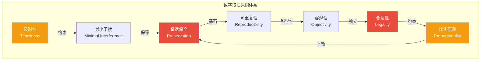
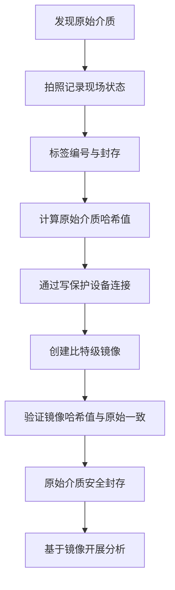
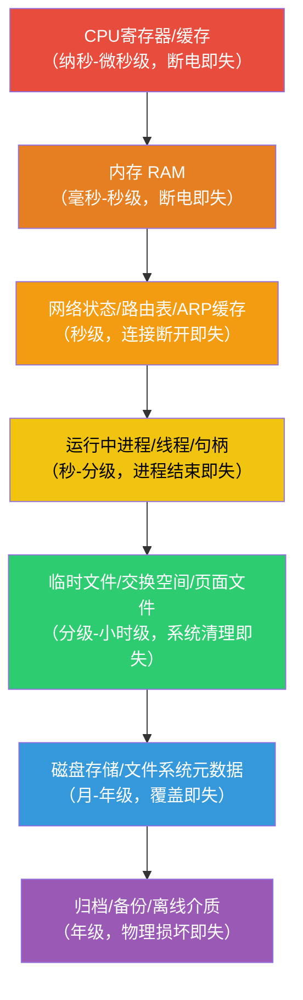
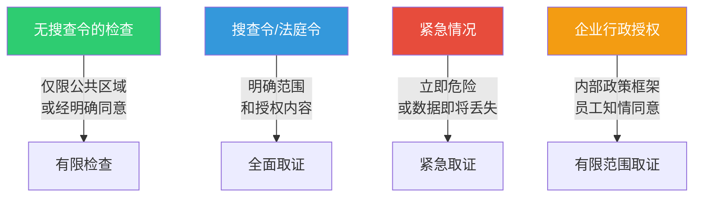
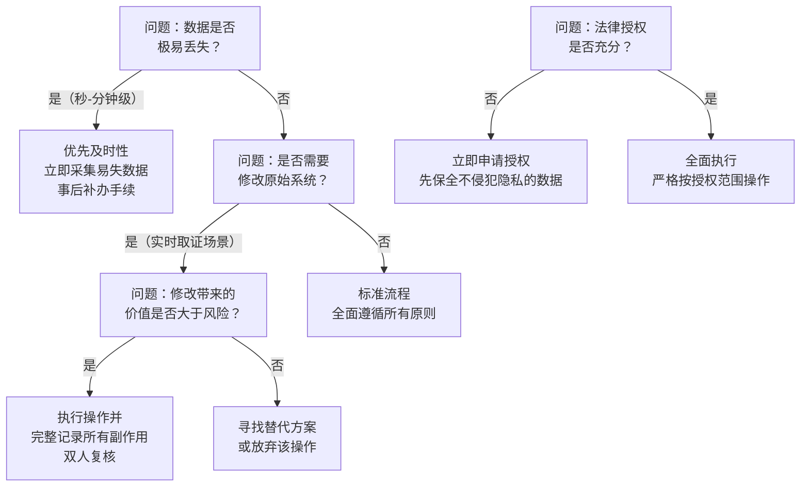

## 25.3 数字取证的基本原则

### 25.3.1 概述：原则体系与重要性

数字取证的基本原则是整个取证学科的理论基石。它们并非凭空产生的教条，而是经过数十年司法实践、技术演进和国际协作逐步沉淀形成的专业规范。这些原则确保了取证结果的**法律可采性（Admissibility）**、**科学可靠性（Reliability）**和**过程可追溯性（Traceability）**。

从历史演进来看，数字取证原则的发展大致经历了三个阶段：

1. **萌芽期（1980-1990年代）**：随着个人计算机的普及，最早的计算机犯罪调查依赖IT人员的经验操作，缺乏统一标准。1984年，美国FBI成立了计算机分析与响应团队（CART），开始系统化探索数字证据处理方法
2. **标准化期（1990-2010年代）**：多个国际组织开始制定取证标准。1991年，SWGDE成立；1995年，IOCE推动了国际协作；2000年代，NIST的CFTT项目为工具验证建立了基准
3. **成熟期（2010年代至今）**：ISO/IEC 27037（2012）提供了国际通用的数字证据处理框架，各国陆续建立国家级取证实验室认证体系

国际上，数字取证原则的标准化工作主要由以下组织推动：

| 组织 | 全称 | 主要贡献 | 总部/主导国家 |
|------|------|----------|---------------|
| SWGDE | Scientific Working Group on Digital Evidence | 制定数字证据最佳实践标准，涵盖移动设备、云存储等新兴领域 | 美国 |
| IOCE | International Organization on Computer Evidence | 推动跨国取证原则统一，协调各国标准差异 | 比利时 |
| NIST | National Institute of Standards and Technology | 工具验证（CFTT项目）与测试方法论，发布SP 800-86等指南 | 美国 |
| ACPO | Association of Chief Police Officers（现NPCC） | 制定ACPO数字取证原则（英国），强调四条核心准则 | 英国 |
| ISO/IEC 27037 | — | 数字证据识别、收集、获取和保存的国际标准 | 国际标准化组织 |
| CFTT | Computer Forensics Tool Testing Program | 标准化工具验证方法，发布EnCase、FTK等工具测试报告 | NIST下属 |
| IACIS | International Association of Computer Investigative Specialists | 认证培训与专业标准制定 | 国际性组织 |

这些原则共同构成了一个完整的框架，覆盖了从发现证据到法庭呈堂的全生命周期。理解并严格遵循这些原则，是将取证从"技术操作"升华为"法庭科学"的必要条件。



---

### 25.3.2 证据保全原则（Preservation）

**证据保全**是数字取证的**第一原则**，也是所有后续分析工作的前提。其核心思想是：原始证据必须保持与案发时完全一致的状态，任何分析都不得对原始数据造成不可逆的改变。

#### 原理与理论基础

证据保全原则的理论根基源自**洛卡德物质交换原理（Locard's Exchange Principle）** ——该原理在物理取证中表述为"每次接触都会留下痕迹"，在数字取证领域延伸为"**每次访问都会改变数据**"：连接存储设备会更新挂载日志，读取文件会修改访问时间，运行分析工具会在系统分区写入临时文件。因此，保全证据的本质是**隔离原始数据**，确保所有分析都在受控副本上进行。

从技术角度看，数字证据面临的保全挑战远超物理证据：

- **非直观性**：物理证据的破坏（如指纹被擦拭）通常可见，但数字证据的微小改变（如一个时间戳被更新）几乎无法通过肉眼察觉
- **连锁反应**：操作系统的后台进程（日志写入、缓存刷新、索引更新）在无人工干预的情况下也会持续改变系统状态
- **介质脆弱性**：SSD的磨损均衡和垃圾回收机制会在底层静默重写数据，即使没有任何用户操作
- **多副本性**：同一数据可能存在于本地、缓存、备份、云端等多个位置，任何一处的改变都可能影响证据的完整性

#### 实操流程

完整的证据保全流程包括以下步骤：



**第一步：现场固定**

- 对设备进行拍照和录像，记录设备状态（运行中/关机/休眠）、连接线缆、屏幕显示内容、外围设备（USB设备、外接显示器等）
- 使用防静电袋和专用包装材料进行物理封存
- 填写证据标签：案件编号、证据编号、提取人、提取时间、地点
- **运行中设备的特殊处理**：如果发现设备处于开机状态，记录屏幕内容后，通常应先进行实时取证（内存转储等），再进行关机和物理封存。**不要直接合上笔记本盖子**——部分系统的休眠行为会向硬盘写入大量数据

**第二步：写保护连接**

- **硬件写保护器**（首选方案）：
  - Tableau（T35u、T8等型号）—— 最广泛使用的取证写保护设备，支持USB 3.0和SATA
  - Wiebetech WriteBlocker —— 支持USB 3.0和Thunderbolt
  - CRU R/W Filter —— 支持IDE/SATA
  - M.2/NVMe专用适配器 —— 针对新型笔记本电脑SSD，需要注意NVMe协议的特殊性
  - DeepSpar USB Imager —— 同时提供写保护和数据获取功能
- **软件写保护**（仅限特定场景下使用）：
  - Linux: `mount -o ro,noexec,loop`
  - Windows: 注册表修改禁止写入
  - 但需注意：操作系统层面的写保护无法防止固件层面的写操作
- **重要警告**：软件写保护**不能完全信任**——操作系统层面的写保护无法防止固件层面的写操作，如SSD的垃圾回收（Garbage Collection）和磨损均衡（Wear Leveling），这些操作会在SSD内部物理擦除数据块

**第三步：比特级镜像**

使用 `dd`（Linux）或专业工具创建比特级镜像：

```bash
# Linux dd 镜像示例（推荐使用 md5sum/sha256sum 同步校验）
sudo dd if=/dev/sda of=/evidence/case001/image.dd bs=4M conv=noerror,sync status=progress 2>&1 | tee /evidence/case001/dd_log.txt

# 使用 Guymager（GUI 工具，推荐新手使用）
guymager

# 使用 dcfldd（增强版dd，支持哈希校验）
sudo dcfldd if=/dev/sda of=/evidence/case001/image.dd bs=4M hash=sha256 hashlog=/evidence/case001/hash.log

# 使用 dc3dd（NIST推荐的取证增强版dd）
sudo dc3dd if=/dev/sda of=/evidence/case001/image.dd log=/evidence/case001/dc3dd.log hlog=/evidence/case001/hash.log
```

镜像格式选择：

| 格式 | 特点 | 适用场景 | 工具支持 |
|------|------|----------|----------|
| DD/RAW | 无压缩，最原始，兼容性最佳 | 法庭呈堂，跨工具通用 | 所有取证工具 |
| E01（EnCase） | 支持压缩、校验和、元数据、断点续传 | 日常取证工作首选 | EnCase, FTK, Autopsy, X-Ways |
| AFF（Advanced Forensic Format） | 开源，支持压缩、加密与分段 | Linux/开源环境取证 | AFFLIB, Autopsy, Sleuth Kit |
| VMDK/VHD | 虚拟化磁盘格式 | 虚拟机取证 | VMware, Hyper-V, 大多数取证工具 |
| SMART | 支持压缩和元数据 | 磁盘诊断与取证结合 | SMART工具集 |

**第四步：哈希验证**

- 镜像前：计算原始介质哈希值（至少MD5 + SHA-256双校验）
- 镜像后：计算镜像文件哈希值
- 两者必须完全一致，这是数据完整性的数学保证

```bash
# 计算SHA-256哈希（推荐）
sha256sum /dev/sda
sha256sum /evidence/case001/image.dd

# 同时计算MD5和SHA-256（双重校验，更保险）
md5sum /dev/sda
md5sum /evidence/case001/image.dd
sha256sum /dev/sda
sha256sum /evidence/case001/image.dd

# 使用 dc3dd 同时计算（一次操作完成）
sudo dc3dd if=/dev/sda hash=sha256 log=/evidence/case001/verify.log
```

**注意**：MD5已不再推荐用于法庭呈堂（存在已知的碰撞攻击风险），应优先使用**SHA-256**或**SHA-3**。但在实际操作中，建议同时计算MD5和SHA-256——MD5的计算速度更快，可用于快速比对，SHA-256用于最终验证。

#### 监管链（Chain of Custody）

监管链是证据保全的**法律保障**，记录证据从发现到法庭示证全过程的所有流转信息。监管链文档必须包含：

- 证据的唯一标识符（如：CASE-2024-001-EVD-003）
- 每次交接的日期、时间和地点
- 移交人和接收人的全名和签名
- 证据的状态描述（原始封存/已开启分析/分析中/归还）
- 存储条件（温度、湿度等对存储介质有影响的环境因素——磁带存储尤其重要）
- 每次访问证据的目的和范围
- 访问方式（物理接触/远程读取/镜像副本）
- 证据容器的封条编号和完整性状态

> **案例警示**：2018年美国某州法院审理的金融欺诈案中，检方未能提供完整的监管链记录（缺少一次交接签名），法院裁定相关电子证据不可采信，直接导致主要指控被撤销。这个案例深刻说明：**没有完整监管链的数字证据，在法律上等同于没有证据**。

> **中国实践**：根据《最高人民法院关于适用〈中华人民共和国刑事诉讼法〉的解释》（2021）第113条，电子数据的审查应当包括"收集程序是否合法"，监管链记录是证明程序合法性的核心依据。

#### SSD取证的特殊挑战

随着SSD的普及，传统硬盘取证方法面临严峻挑战：

| 挑战 | 传统HDD | SSD | 影响 |
|------|---------|-----|------|
| TRIM命令 | 不存在 | 操作系统删除文件后发送TRIM，触发物理擦除 | 已删除文件可能无法恢复 |
| 磨损均衡 | 不存在 | 控制器自动将写入分散到不同块 | 逻辑地址与物理位置不对应 |
| 垃圾回收 | 不存在 | 后台自动擦除无效块 | 时间越久，可恢复数据越少 |
| 加密 | 通常无 | 部分SSD全盘加密（SED） | 断电后可能无法读取 |
| 快照/缓存 | 简单缓存 | 多级缓存（DRAM、SLC缓存区） | 部分数据可能仅存在于易失缓存 |

**SSD取证应对策略**：

1. **立即使用硬件写保护器**——不要依赖软件层面的阻止
2. **考虑冻结**：部分取证实验室将SSD放入法拉第袋后置于低温环境，试图延缓TRIM和垃圾回收（效果有限，仅能争取时间）
3. **优先进行实时取证**：在SSD连接写保护设备之前，如果系统仍在运行，应优先获取内存和运行状态信息
4. **使用专业SSD取证工具**：如 Magnet AXIOM、Cellebrite UFED 等，部分工具针对SSD特性做了优化

---

### 25.3.3 最小干扰原则（Minimal Interference）

最小干扰原则要求取证人员在执行取证活动时，将**对目标系统和数据的改变降至最低水平**。这一原则与证据保全原则相辅相成——保全强调结果（数据不变），最小干扰强调过程（操作影响最小）。

#### 易失性顺序（Order of Volatility）

RFC 3227（Guidelines for Evidence Collection and Archiving）明确定义了数字证据的易失性层次。取证人员必须按照**从最易失到最不易失**的顺序收集证据：



**实际操作顺序与工具：**

1. **采集内存数据**（优先级最高，系统断电即丢失全部RAM内容）
   - Windows: `winpmem`（开源，可创建物理内存转储）、`DumpIt`（无需安装，一键操作）
   - Linux: `LiME`（Linux Memory Extractor，以内核模块方式加载，最小化足迹）、`fmem`
   - macOS: `osxpmem`（Pmem Suite的一部分）
   - 跨平台: `Volatility Framework`（分析工具，需先获取内存转储文件）

2. **收集网络连接信息**
   ```bash
   # 连接状态
   netstat -an          # Windows/Linux
   ss -tuln             # Linux（更快更详细）
   lsof -i              # Linux（关联到进程）
   # ARP缓存（可能包含攻击者IP-MAC映射）
   arp -a
   ip neigh             # Linux
   # 路由表
   route print          # Windows
   ip route             # Linux
   ```

3. **获取运行进程列表**
   ```bash
   # Linux
   ps auxwwf            # 完整进程树
   ls -la /proc/[pid]/exe  # 进程可执行文件路径
   cat /proc/[pid]/cmdline  # 进程启动参数
   # Windows
   tasklist /v /fo csv  # 详细进程列表
   wmic process list full  # WMI获取完整进程信息
   ```

4. **捕获易失系统状态**
   - Linux: `/proc`文件系统、`/dev/shm`共享内存、内核日志（`dmesg`）
   - Windows: 注册表信息（运行`reg export`）、事件日志、剪贴板内容
   - 通用: 系统时间偏差（`timedatectl`或`w32tm /tz`）

5. **获取非易失存储**（硬盘、SSD、USB设备、SD卡）

#### 实时取证 vs. 离线取证

| 维度 | 实时取证（Live Forensics） | 离线取证（Dead Forensics） |
|------|---------------------------|---------------------------|
| 系统状态 | 系统正在运行 | 系统已关机或已拆除存储 |
| 数据范围 | 包含所有易失性数据（内存、进程、网络） | 仅限非易失存储数据 |
| 干扰程度 | 不可避免产生写入操作（工具运行痕迹） | 写保护下接近零干扰 |
| 工具要求 | 需静默部署、最小足迹（如便携版工具） | 标准取证工具链 |
| 适用场景 | 服务器/关键业务系统/内存中有重要数据 | 已关机/已扣押设备 |
| 错误风险 | 工具本身可能被恶意软件劫持 | 无法获取运行中状态 |
| 加密处理 | 可能在系统运行时获取解密密钥 | 全盘加密设备可能无法读取 |
| 法律挑战 | 对系统状态的改变更容易被辩护方质疑 | 证据链相对清晰 |

#### 最小干扰操作准则

1. **使用Live CD/USB启动**：从外部介质启动取证系统，避免接触目标系统硬盘上的操作系统，将写入降到接近零。推荐的取证Live系统：
   - **CAINE**（Computer Aided Investigative Environment）：基于Ubuntu，自动挂载所有外部设备为只读
   - **SIFT Workstation**：SANS研究所出品，集成大量取证工具
   - **Kali Linux**：渗透与取证兼顾，包含多种取证工具
   - **Paladin**：基于Ubuntu的取证预构建系统，支持一键镜像

2. **内存采集工具轻量化**：
   - Windows: winpmem（开源，~2MB）、DumpIt（McAfee，无安装，~1MB）
   - Linux: LiME（以内核模块方式加载，可定制采集范围）
   - macOS: osxpmem、Mac Memory Reader

3. **记录所有副作用**：每次操作都会改变系统文件访问时间、日志等内容，应在取证日志中逐条记录：

```bash
# 记录取证操作的标准化脚本
#!/bin/bash
LOG="/evidence/case001/forensic_log.txt"

log_action() {
    echo "[$(date -u '+%Y-%m-%dT%H:%M:%SZ')] [$(whoami)@$(hostname)] $1" >> "$LOG"
}

log_action "=== 取证操作开始 ==="
log_action "系统时间 (UTC): $(date -u '+%Y-%m-%dT%H:%M:%SZ')"
log_action "NTP同步状态: $(timedatectl show --property=NTPSynchronized 2>/dev/null || echo 'N/A')"

log_action "执行: ps auxwwf"
ps auxwwf >> "$LOG" 2>&1

log_action "执行: ss -tuln"
ss -tuln >> "$LOG" 2>&1

log_action "执行: netstat -an"
netstat -an >> "$LOG" 2>&1

log_action "执行: df -h"
df -h >> "$LOG" 2>&1

log_action "=== 易失性数据采集完成 ==="
```

#### 重要陷阱与应对

- **SSD的TRIM命令**：在SSD上进行取证操作时，TRIM命令会触发数据块物理擦除。应在连接SSD后**立即启用硬件写保护**，防止操作系统自动发送TRIM指令。Linux下可通过`fstrim -v /`确认TRIM状态，取证时应避免执行此命令
- **Windows SuperFetch/Prefetch**：Windows系统在启动或连接存储设备时会自动读取和更新文件访问信息，改变文件的最后访问时间戳。即使使用写保护设备，本地启动Windows也会触发此行为——必须使用外部取证系统
- **云存储同步**：连接网络时，Dropbox、OneDrive等云同步服务会自动下载/上传文件，改变本地数据状态和时间戳。取证前应先**物理断开网络连接**或**开启飞行模式**
- **BitLocker/FileVault加密**：Windows的BitLocker和macOS的FileVault在系统运行时通常已解密。关机后可能需要恢复密钥才能访问数据。如果可能，在系统运行时记录加密状态和恢复密钥位置
- **日志轮转（Log Rotation）**：系统日志文件通常有大小限制，旧日志会被压缩或删除。取证越晚，可获取的日志范围越小

---

### 25.3.4 可重复性原则（Reproducibility）

可重复性原则要求：**任何取证分析的结果，应当在相同条件下被其他合格取证人员复现**。这是数字取证区别于"个人经验判断"的关键特征——它使取证成为可检验的科学方法。

可重复性包含两个维度：

1. **工具可重复性**：使用相同工具和参数处理相同输入，应得到相同输出
2. **分析可重复性**：不同的合格分析师，使用相同或不同工具对同一证据进行分析，应得出一致的结论

#### 法律依据：Daubert标准

在美国联邦法院体系中，科学证据的可采性由**Daubert标准**（Daubert v. Merrell Dow Pharmaceuticals, 509 U.S. 579, 1993）决定，其核心要素直接对应于可重复性原则：

1. **理论是否可验证（Falsifiability）**——取证方法必须能够被检验和反驳。如果一个分析方法无法被证伪，它在科学上就不成立
2. **是否经过同行评审（Peer Review）**——方法和工具应公开发表并经过专业评审。开源工具和已发表的算法在法庭上更具说服力
3. **已知或潜在的错误率（Error Rate）**——工具和方法必须有明确的误差范围。例如，文件签名分析工具的已知误报率、时间戳解析工具的精度限制
4. **存在并维护操作标准（Standards）**——操作流程需遵循行业标准（如ISO/IEC 27037、SWGDE最佳实践）
5. **被相关领域广泛接受（General Acceptance）**——方法需获得专业共同体认可

**补充法律框架**：

- **Frye标准**（Frye v. United States, 1923）：美国部分州仍在使用的较早标准，要求科学方法在相关领域获得"普遍接受"。相比Daubert标准更保守
- **中国法律框架**：根据《刑事诉讼法》和相关司法解释，电子数据需经"查证属实"才能作为定案根据。2016年两高一部《关于办理刑事案件收集提取和审查判断电子数据若干问题的规定》对电子数据取证提出了规范化要求
- **英国框架**：ACPO数字取证原则要求取证过程由"受过适当培训的人员"按照"可重复的标准程序"执行

#### 工具验证

可重复性要求取证工具本身必须是经过验证的。NIST的**计算机取证工具测试项目（CFTT, Computer Forensics Tool Testing Program）**提供了标准化的工具验证方法。截至2024年，CFTT已发布涵盖硬盘取证、网络取证、手机取证等多个领域的测试报告。

工具验证报告应包含：

- 工具名称、版本号、开发者
- 验证日期和验证机构（NIST或第三方认证实验室）
- 测试用例和预期结果
- 实际测试结果（通过/失败，附具体数据）
- 已知限制和异常情况
- 验证环境（操作系统版本、硬件配置）

**示例**：NIST CFTT对EnCase Forensic v8.05的测试验证包括：

- 数据获取完整性测试（镜像与原始的逐位比较）
- 未分配空间采集正确性（是否包含完整未分配簇）
- 文件签名分析准确性（已知文件类型识别的正确率和误报率）
- 删除文件恢复成功率（不同文件系统和删除方式下的恢复能力）
- 报告生成完整性（报告是否包含所有必要元数据）
- 大文件处理（超过4GB的文件处理正确性）
- 分区表异常处理（MBR/GPT损坏情况下的表现）

**主流取证工具的验证状态参考**：

| 工具 | 开发商 | 最新验证版本 | 验证状态 | 备注 |
|------|--------|-------------|----------|------|
| EnCase Forensic | OpenText | v23.x | NIST CFTT通过 | 行业标准级工具 |
| FTK (Forensic Toolkit) | Exterro | v8.x | NIST CFTT通过 | 检索速度快 |
| Autopsy | Basis Technology | v4.x | 开源，社区验证 | 免费，适合预算有限的实验室 |
| X-Ways Forensics | X-Ways Software | v20.x | 独立验证 | 轻量高效 |
| Magnet AXIOM | Magnet Forensics | v7.x | 第三方验证 | 云取证能力强 |
| Cellebrite UFED | Cellebrite | — | 行业广泛采用 | 移动设备取证专用 |

#### 操作文档化标准

为保证可重复性，取证人员应使用结构化的操作记录模板：

```text
============================================
数字取证操作记录
============================================
案件编号：________________
证据编号：________________
操作人员：________________（姓名 + 取证认证编号）
操作日期：________________
操作环境：________________（操作系统版本、硬件配置）

使用的工具：
  1. 名称：___________ 版本：___________ 验证编号/状态：___________
  2. 名称：___________ 版本：___________ 验证编号/状态：___________

操作步骤：
  1. [步骤描述]
     命令/操作：_________
     输入：__________
     输出文件：__________
     预期结果：__________
     实际结果：__________
     时间戳：___________
     操作员签名：___________

  2. [步骤描述]
     ...（同上格式）

异常与偏差记录：
  - 步骤___出现异常：__________
  - 处理方式：__________
  - 对结果的可能影响：__________

分析结论：
  结论类型：□确定性结论  □可能性结论  □倾向性意见  □待确认发现
  _______________
  不确定性说明：_______________

审阅人签名：_______________ 日期：_______________
============================================
```

#### 自动化与流水线

使用自动化脚本可以显著提升可重复性。将取证步骤编写为可重复执行的脚本，确保每次分析使用相同的参数：

```bash
#!/bin/bash
# 可重复的取证分析流水线
# 用法: ./forensic_pipeline.sh <source_image> <output_dir>

SOURCE_IMAGE=$1
OUTPUT_DIR=$2
TIMESTAMP=$(date -u '+%Y-%m-%dT%H:%M:%SZ')

if [ -z "$SOURCE_IMAGE" ] || [ -z "$OUTPUT_DIR" ]; then
    echo "用法: $0 <source_image> <output_dir>"
    exit 1
fi

mkdir -p "$OUTPUT_DIR"

# 记录执行环境
echo "=== 取证分析流水线 ===" > "$OUTPUT_DIR/pipeline.log"
echo "执行时间: $TIMESTAMP" >> "$OUTPUT_DIR/pipeline.log"
echo "工具版本:" >> "$OUTPUT_DIR/pipeline.log"
echo "  fls: $(fls -V 2>&1 | head -1)" >> "$OUTPUT_DIR/pipeline.log"
echo "  sha256sum: $(sha256sum --version 2>&1 | head -1)" >> "$OUTPUT_DIR/pipeline.log"

# 步骤1：验证镜像完整性
echo "=== 验证镜像哈希 ===" | tee -a "$OUTPUT_DIR/pipeline.log"
sha256sum "$SOURCE_IMAGE" > "$OUTPUT_DIR/image_hash.txt"

# 步骤2：挂载镜像（只读）
echo "=== 挂载镜像 ===" | tee -a "$OUTPUT_DIR/pipeline.log"
mkdir -p "$OUTPUT_DIR/mount"
mount -o ro,loop,noexec "$SOURCE_IMAGE" "$OUTPUT_DIR/mount" 2>> "$OUTPUT_DIR/pipeline.log"

# 步骤3：文件系统分析
echo "=== 文件系统分析 ===" | tee -a "$OUTPUT_DIR/pipeline.log"
fls -r -d "$SOURCE_IMAGE" > "$OUTPUT_DIR/file_listing.txt" 2>> "$OUTPUT_DIR/pipeline.log"

# 步骤4：时间线分析
echo "=== 时间线生成 ===" | tee -a "$OUTPUT_DIR/pipeline.log"
fls -r -m "/" "$SOURCE_IMAGE" > "$OUTPUT_DIR/timeline_body.txt" 2>> "$OUTPUT_DIR/pipeline.log"

# 步骤5：字符串提取
echo "=== 字符串提取 ===" | tee -a "$OUTPUT_DIR/pipeline.log"
strings -n 8 "$SOURCE_IMAGE" > "$OUTPUT_DIR/strings_output.txt" 2>/dev/null

# 步骤6：卸载
umount "$OUTPUT_DIR/mount" 2>/dev/null

# 步骤7：生成报告
echo "=== 生成报告 ===" | tee -a "$OUTPUT_DIR/pipeline.log"
cat > "$OUTPUT_DIR/analysis_report.txt" << EOF
数字取证分析报告
================
镜像文件: $SOURCE_IMAGE
镜像哈希: $(cat "$OUTPUT_DIR/image_hash.txt")
分析时间: $TIMESTAMP
分析工具: $(cat "$OUTPUT_DIR/pipeline.log" | grep "fls:" | head -1)
文件数量: $(wc -l < "$OUTPUT_DIR/file_listing.txt")
字符串数量: $(wc -l < "$OUTPUT_DIR/strings_output.txt")
================
EOF

echo "分析完成。输出目录: $OUTPUT_DIR"
```

---

### 25.3.5 客观性原则（Objectivity）

客观性原则要求取证人员以**无偏见、公正、科学的态度**开展取证工作，避免先入为主的判断影响分析结果。客观性不仅是一种职业道德要求，更是科学方法论的核心——科学研究要求观察者不能因为预期结果而改变观察方式。

#### 认知偏差在数字取证中的表现

认知偏差（Cognitive Bias）是影响客观性的主要威胁。研究表明，即使是经验丰富的取证专家也难以完全避免认知偏差的影响。Stevens（2013）的研究发现，在缺乏盲测保护的情况下，取证人员的分析结论可能受到案件背景信息的显著影响：

| 偏差类型 | 表现 | 典型案例 | 影响程度 |
|----------|------|----------|----------|
| **确认偏差**（Confirmation Bias） | 倾向于寻找支持已有假设的证据，忽略相反证据 | 认定嫌疑人有罪后，只关注不利于他的数据，忽略可证明清白的日志片段 | ⚠️ 极高 |
| **锚定效应**（Anchoring Effect） | 早期获取的信息过度影响后续判断 | 探员一句"此人有前科"使取证人员对每个文件都产生怀疑 | ⚠️ 高 |
| **语境偏差**（Contextual Bias） | 案件背景信息干扰技术判断 | 知道案件性质为儿童色情后，对正常家庭照片也做出过度解读 | ⚠️ 高 |
| **过信偏差**（Overconfidence Bias） | 高估自己工具和方法的准确性 | 认为取证工具100%可靠，忽略工具误报和漏报 | ⚠️ 中 |
| **选择性注意**（Selective Attention） | 在海量数据中只看到自己关注的模式 | 在海量日志中只关注已知恶意IP，忽略其他异常流量 | ⚠️ 中 |
| **后见之明偏差**（Hindsight Bias） | 知道结果后认为结果"显而易见" | 看到攻击报告后认为所有线索"一目了然"，低估分析难度 | ⚠️ 中 |
| **群体思维**（Groupthink） | 团队中异议被压制，趋向一致结论 | 多人分析时，初级分析师不敢质疑资深分析师的结论 | ⚠️ 中 |

#### 客观性保障措施

1. **盲测分析（Blind Analysis）**：在可能的情况下，取证人员不应知晓案件的其他信息，仅基于数据做出技术判断。理想情况下，取证人员应该只收到原始数据和一个编号，不知道案件性质、嫌疑人信息或调查方向
2. **双人验证（Peer Review）**：每项关键发现至少由另一位合格取证人员独立验证，比较结论的一致性，记录差异并解决争议。独立验证意味着：两名分析师不应共享分析过程中的中间发现，各自独立得出结论后再比对
3. **结论的分级表述**：
   - **确定性结论**：有充分证据支持，排除其他合理解释（如："该文件的创建时间为2024-03-15 14:23:07 UTC"）
   - **可能性结论**：有较强证据支持，但存在其他可能性（如："该USB设备极有可能属于嫌疑人"）
   - **倾向性意见**：分析指向某个方向，但证据不够充分（如："网络流量模式暗示可能存在数据外泄"）
   - **待确认发现**：发现异常，但需要更多信息确认（如："发现未识别的加密文件，需要密码或密钥才能进一步分析"）
4. **记录不确定性**：在报告中明确说明数据不完整、工具限制、替代解释等信息。不确定性不是能力不足的表现，而是科学诚实的体现

#### 客观性原则的法律意义

法庭上的专家证人必须展示客观性。如果辩护律师能够证明取证人员存在偏见或有预设立场，整个鉴定意见的可靠性将受到质疑。**客观性原则不仅是职业道德要求，更是法律程序正义的基石**。

在中国司法实践中，根据《刑事诉讼法》第148条，鉴定人应当"依照法定程序"进行鉴定并"提出书面鉴定意见"。如果鉴定过程中存在偏见或不客观因素，法院可以不予采信该鉴定意见。

---

### 25.3.6 及时性原则（Timeliness）

数字证据具有极强的**时效性**。与物理证据不同，数字证据可以在数秒内消失——内存数据在断电后全部丢失，日志文件被滚动覆盖，联网设备可在远程被锁定或擦除。及时性原则要求取证团队**以最快的速度响应**，在证据消失之前完成采集。

#### 及时性要求的具体体现

1. **第一时间响应**：在安全事件发生后，取证人员应作为第一响应者之一立即介入。理想响应时间：
   - 内存取证：事件发生后 **30分钟内** 启动
   - 磁盘取证：事件发生后 **2小时内** 启动
   - 日志保全：事件发生后 **立即** 执行（日志服务器配置为远程集中存储的除外）

2. **易失性数据优先**：严格按照易失性顺序（RFC 3227），先采集最易消失的数据

3. **时间同步**：在开始取证前，记录系统时间与标准时间（NTP）的偏差，并记录到日志中
   ```bash
   # Linux
   timedatectl
   ntpq -p        # 检查NTP同步状态
   
   # Windows
   w32tm /query /status
   w32tm /tz       # 查看时区信息
   ```

#### 移动设备取证的时间窗口


**关键时间窗口说明：**

- **0-5分钟（黄金窗口）**：立即隔离网络信号（开启飞行模式或放入法拉第袋），防止远程擦除和锁定。对于iOS设备，开启飞行模式后尽快连接电源——iOS在低电量时会自动关机，导致部分加密密钥丢失
- **5-30分钟**：完成屏幕快照、内存转储、通知栏信息读取等易失性操作
- **30分钟-2小时**：执行完整数据提取（物理提取或逻辑提取）
- **2小时以上**：开展深度分析和文件恢复

#### 超时风险量化

| 延迟时间 | 可能丢失的数据类型 | 可恢复性 |
|----------|-------------------|----------|
| 秒级 | CPU缓存、寄存器内容 | ❌ 不可恢复 |
| 分钟级 | RAM内容（系统关机/重启后全部丢失）、网络连接状态、DNS缓存 | ❌ 不可恢复（断电后） |
| 小时级 | 临时文件被清理、日志缓冲被刷新覆盖、页面文件被重写 | ⚠️ 部分可恢复 |
| 天级 | 日志因滚动覆盖被删除、临时目录被系统清理、浏览器缓存过期 | ⚠️ 部分可恢复（从备份中） |
| 周级 | 未分配空间被新数据覆盖、备份被淘汰策略删除、云存储同步冲突解决 | ❌ 大部分不可恢复 |
| 月级 | SSD TRIM后数据块被物理擦除、磁带备份轮转覆盖 | ❌ 不可恢复 |

---

### 25.3.7 合法性原则（Legality）

数字取证必须在法律授权的框架内进行。违反合法性原则获取的证据，即使具有极高的证明价值，也可能被排除——这就是**非法证据排除规则**。程序正义的价值在此超越了实体发现的价值。

#### 法律授权的层次



#### 不同司法管辖区的法律框架对比

| 维度 | 美国 | 中国 | 欧盟 | 英国 |
|------|------|------|------|------|
| 核心法律 | 第四修正案、联邦证据规则 | 《刑事诉讼法》、《网络安全法》、《数据安全法》、《个人信息保护法》 | GDPR、e-Privacy指令 | RIPA 2000、Computer Misuse Act 1990 |
| 证据排除 | 严格排除规则（Fruit of Poisonous Tree） | 非法证据排除规则（刑诉法第56条） | 各成员国法律不同 | 非法证据可能被法官裁量排除 |
| 搜查令要求 | 法官签发（probable cause） | 公安机关负责人批准 | 各国司法令状 | 治安法官签发 |
| 企业调查 | 员工对公司设备隐私期待较低 | 依据企业内部规章制度 | GDPR限制较严 | 取决于雇佣合同条款 |
| 跨境数据 | CLOUD Act（可要求美国公司提供海外数据） | 数据出境安全评估 | 充分性认定机制 | adequacy decision |

#### 关键法律考量

1. **搜查许可范围**：检查权限仅限于授权范围内，不得超范围取证。例如，搜查令允许检查"嫌疑人使用的计算机"，不应扩展到其家人的手机
2. **隐私保护**：在多用户系统或共享计算机中，注意区分目标用户和无关用户的隐私数据。如果发现与案件无关的个人隐私信息（如医疗记录、私密照片），应避免在报告中详细描述
3. **跨境数据**：涉及跨境存储或传输的数据，需要关注不同司法管辖区的法律冲突。例如，存储在欧洲服务器上的数据受GDPR保护，美国执法机构通过CLOUD Act调取可能面临法律冲突
4. **律师-委托人特权**：可能包含受法律保护的特权通信（如与律师的邮件），需要特殊处理。在某些法域中，意外获取的特权通信必须立即停止分析并通知相关方
5. **企业内部调查**：员工对企业设备的合理隐私期待（Reasonable Expectation of Privacy）因法域而异。在美国，员工通常对公司设备没有隐私权（前提是公司有明确的使用政策）；在中国，《个人信息保护法》要求企业告知员工监控范围
6. **电子签名与时间戳**：部分法域承认电子签名的法律效力，取证过程中应注意保留相关的数字签名信息

#### 非法证据排除的后果

根据美国《联邦证据规则》和相关判例，通过非法手段获取的数字证据可能被排除。在中国，《刑事诉讼法》第56条同样规定了非法证据排除规则，2016年两高一部《关于办理刑事案件收集提取和审查判断电子数据若干问题的规定》进一步细化了电子数据取证的合法性要求。

> **警示案例**：某起商业间谍案中，调查人员在未取得搜查令的情况下直接复制了嫌疑人的公司电脑硬盘。法院裁定该取证行为违法，全盘排除相关电子证据，导致案件无法继续审理。**程序正义的价值在此超过了实体发现的价值**。

> **中国司法实践**：在一起网络诈骗案中，公安机关在未取得法院调取令的情况下，直接向第三方云服务商调取了嫌疑人的云端数据。法院认为该取证程序不合法，排除了该电子数据，最终影响了量刑结果。该案提醒取证人员：即使是"配合调查"的第三方数据调取，也必须依法进行。

---

### 25.3.8 比例原则（Proportionality）

比例原则要求取证的范围和深度与案件的性质和严重程度相匹配。一味追求"全面彻底"而无限制地扩大取证范围，既不经济，也可能侵犯不必要的隐私。这一原则在资源有限的现实环境中尤为重要。

#### 比例原则的三层考量

| 层次 | 核心问题 | 实际应用 | 判断标准 |
|------|----------|----------|----------|
| **适当性** | 采取的手段是否有助于达成取证目的？ | 如果只需验证文件是否存在，是否要做全盘镜像？ | 手段与目的之间存在合理关联 |
| **必要性** | 是否存在对权益侵害更小的替代手段？ | 能否通过文件哈希匹配而非全文搜索来定位目标文件？ | 在所有可行手段中选择侵害最小的 |
| **狭义比例** | 手段带来的侵害是否与案件价值相称？ | 调查轻微违法是否需要对整个服务器集群进行全量镜像？ | 收益大于成本，侵害不超过必要限度 |

#### 分阶段取证策略

分阶段取证是比例原则的最佳实践——通过逐步深入的方式，在获取足够证据的同时控制取证成本和隐私侵害：

```text
第一阶段：快速评估（30分钟内完成）
  目标：快速判断事件性质和严重程度
  操作：
  - 文件系统元数据分析（时间戳、文件大小、目录结构）
  - 关键目录快速检查（Temp、AppData、Desktop、Downloads）
  - 可疑文件签名识别（file 命令批量扫描）
  - 系统日志快速浏览（最近的登录记录、错误日志）
  输出：初步评估报告，是否需要进一步取证

第二阶段：定向采集（2-4小时内完成）
  目标：基于第一阶段发现，针对性提取数据
  操作：
  - 提取可疑文件和对应时间段的日志
  - 提取可疑进程的网络连接记录
  - 关键注册表项提取（Windows）
  - 浏览器历史记录和下载记录
  输出：定向证据集，支撑初步结论

第三阶段：全面镜像（仅当需要时）
  目标：获取完整的数据集用于深度分析
  触发条件：
  - 第二阶段发现重大线索需要全面分析
  - 案件严重程度升级
  - 辩方对前期证据提出质疑
  操作：
  - 对目标系统进行完整比特级镜像
  - 深度文件恢复（删除文件、文件碎片）
  - 全面时间线分析
  - 加密容器分析
  输出：完整证据集，支撑最终结论
```

**阶段性决策节点**：每个阶段结束后，取证负责人应评估：
1. 当前证据是否足以回答关键问题？
2. 继续扩大取证范围的边际价值如何？
3. 是否存在时间或资源限制需要考虑？
4. 是否需要向上级/检方报告以获取进一步授权？

---

### 25.3.9 原则之间的平衡与冲突

在实际取证工作中，各项原则之间可能产生冲突，需要取证人员根据具体场景做出专业判断。理解这些冲突并制定合理的权衡策略，是高级取证人员的核心能力。

#### 典型冲突场景

**场景一：实时取证 vs. 证据保全**
- **冲突**：实时取证为了获取易失性数据（内存、网络连接），不可避免地要在目标系统上运行工具，这违反了最小干扰原则
- **权衡**：如果易失性数据的价值大于少量写入操作带来的证据改变风险，则优先进行实时取证。关键在于**完整记录所有操作产生的副作用**
- **决策准则**：如果系统中存在全盘加密（BitLocker/FileVault），实时取证的优先级应大幅提高——因为关机后可能永远无法解密

**场景二：全面调查 vs. 比例原则**
- **冲突**：为了不遗漏任何证据，取证人员希望进行全盘镜像（支持保全原则），但这可能超出案件的合理需要
- **权衡**：先进行针对性采集，如果在分析中发现需要更多数据，再逐步扩大到全盘镜像
- **决策准则**：对于可能判处重刑的刑事案件（如谋杀、恐怖主义），比例原则对全面取证的限制相对较弱；对于轻微违法（如轻微网络骚扰），不应进行过度取证

**场景三：及时性 vs. 合法性**
- **冲突**：紧急情况下需要立即取证，但可能来不及取得搜查令
- **权衡**：在合法的紧急例外（Exigent Circumstances）范围内行动，同时尽快补办法律手续
- **决策准则**：紧急例外通常适用于：（1）存在人身安全威胁；（2）证据即将被销毁；（3）嫌疑人即将逃逸。必须有明确的事实依据支撑紧急判断

**场景四：客观性 vs. 时间压力**
- **冲突**：双人验证和盲测分析会增加时间成本，在紧急案件中可能延误取证时机
- **权衡**：优先完成数据采集（保证及时性和保全性），分析阶段再执行双人验证
- **决策准则**：数据采集可以先行，但最终报告的审查不应因时间压力而省略

**场景五：合法性 vs. 证据灭失风险**
- **冲突**：严格的法律程序可能延缓取证，导致关键证据被远程擦除
- **权衡**：在合法框架内采取最快行动——例如，通过紧急申请简化令状程序，或先采取不侵犯隐私的保全措施（如网络流量捕获）
- **决策准则**：永远不要为了"效率"而跳过法律授权——违法获取的证据等于没有证据

#### 决策框架



---

### 25.3.10 典型案例分析：APT攻击取证调查

**案件背景**：某金融机构发现核心数据库存在异常访问记录，怀疑遭受高级持续性威胁（APT）攻击。安全运营中心（SOC）在凌晨2:15检测到异常，取证团队于凌晨3:00介入。

#### 取证时间线

| 时间 | 操作 | 应用原则 | 产出 |
|------|------|----------|------|
| T+0 (02:15) | SOC检测到异常告警，初步排查确认 | — | 告警工单 |
| T+45min (03:00) | 取证团队介入，评估现场状态 | 及时性 | 评估报告 |
| T+50min (03:05) | 开始内存转储（winpmem） | 最小干扰、及时性 | 内存镜像（winpmem.raw） |
| T+70min (03:25) | 网络连接和ARP缓存采集 | 最小干扰、易失性优先 | netstat输出、ARP缓存 |
| T+80min (03:35) | 屏幕截图和运行进程记录 | 及时性、可重复性 | 进程列表截图 |
| T+90min (04:00) | 服务器安全关机 | 证据保全 | — |
| T+100min (04:10) | 硬盘物理拆卸并安装Tableau写保护 | 证据保全、最小干扰 | 写保护确认记录 |
| T+110min (04:20) | 开始全盘比特级镜像（E01格式） | 证据保全、比例原则 | 磁盘镜像（image.e01） |
| T+200min (06:00) | 镜像完成，SHA-256验证 | 证据保全、可重复性 | 哈希验证报告 |
| T+200min-24h | 镜像分析：内存转储+磁盘分析 | 全部原则 | 分析中间报告 |
| T+48h | 双人验证完成，报告定稿 | 客观性、可重复性 | 最终取证报告 |

#### 原则应用详解

| 原则 | 具体应用 | 备注 |
|------|----------|------|
| **证据保全** | 使用Tableau写保护设备创建E01镜像，SHA-256 + MD5双重校验 | 监管链文档从现场封存开始记录 |
| **最小干扰** | 优先通过winpmem获取内存转储（仅写入USB目标设备），Live系统启动分析 | 操作副作用在取证日志中逐条记录 |
| **及时性** | 发现异常后45分钟启动取证，成功捕获仍在内存中的恶意进程 | 内存中的Cobalt Strike Beacon在内存转储中被发现 |
| **客观性** | 两名取证人员独立分析镜像，结论交叉验证 | 最终结论使用"可能性结论"级别 |
| **合法性** | 依据法院紧急令状执行，取证范围明确限定于受影响服务器 | 紧急令状在取证启动后2小时内完成审批 |
| **比例原则** | 第一阶段仅采集异常访问相关的日志和文件（2小时），发现横向移动迹象后才扩展到关联系统 | 共涉及3台服务器的取证 |
| **可重复性** | 全程使用自动化脚本记录操作，工具版本和配置参数完整记录 | Volatility分析脚本可供复现 |

**关键发现**：通过内存转储发现了隐匿在svchost.exe进程中的Cobalt Strike Beacon，结合网络日志还原了攻击者从初始入侵到横向移动的完整链路。由于严格遵循取证原则，证据链完整，最终在法庭上被采信为有效证据。

---

### 25.3.11 常见误区与纠正

| 误区 | 错误做法 | 正确做法 | 后果 |
|------|----------|----------|------|
| "镜像就是复制文件" | 用普通文件复制命令（cp, copy）拷贝磁盘 | 使用专用工具创建比特级镜像，包含未分配空间、空闲空间和文件碎片 | 文件复制仅获取已分配文件，丢失大量关键数据（删除的文件、文件碎片、 slack空间） |
| "开机检查没问题" | 直接启动嫌疑计算机检查文件 | 使用Live CD/USB启动，或移除硬盘后连接写保护设备 | 开机即触发TRIM、日志写入、临时文件创建，破坏原始证据状态 |
| "工具运行过就行" | 使用取证工具但未记录版本和配置 | 详细记录工具版本、配置参数、验证状态和许可证编号 | 无法满足Daubert标准的可验证性要求，证据可能被排除 |
| "结果对就没错" | 只要分析结果"看着对"即可 | 需要完整的操作记录和可重复的分析流程，确保他人可复现 | 辩方律师可轻松质疑缺乏记录的分析过程 |
| "专家意见=结论" | 将专家意见等同于确定性证据 | 区分确定性结论和倾向性意见，如实报告不确定性 | 过度自信的表述可能被对方专家挑战，损害整体可信度 |
| "时间不重要" | 不记录操作时间或直接使用系统时间 | 同步NTP时间，记录每一步操作的精确UTC时间戳 | 多设备事件关联分析时，时间偏差可能导致错误结论 |
| "越多越好" | 对所有数据进行全盘镜像和深度分析 | 遵循比例原则，按需采集，分阶段逐步深入 | 过度取证浪费资源，可能侵犯无关人员隐私 |
| "加密=安全" | 忽略加密设备的取证可能性 | 在系统运行时获取解密密钥，或使用硬件写保护后进行冷取证 | 关机可能导致密钥丢失，永久无法访问数据 |
| "截图就够了" | 仅用截图记录系统状态 | 使用专业工具提取结构化数据，截图作为辅助 | 截图缺乏元数据，无法作为结构化证据使用 |

---

### 25.3.12 本章小结

数字取证的基本原则不是学术上的理论教条，而是确保取证结果在法律和技术层面都经得起检验的**实践指南**。本章涵盖的七项核心原则——证据保全、最小干扰、可重复性、客观性、及时性、合法性和比例原则——相互支撑、相互制约，共同构成了严谨的取证方法论框架。

**核心要点回顾：**

1. **证据保全是基石**：没有完整的证据链和镜像完整性，一切分析都失去法律意义。牢记洛卡德原理——每次访问都会改变数据
2. **最小干扰是底线**：减少对原始数据的改变是可靠取证的保障，每一步操作都要记录。特别是SSD环境下的TRIM和垃圾回收挑战
3. **可重复性是科学性的体现**：使取证从"个人经验"走向"可检验的科学"。工具验证、操作文档化、自动化流水线缺一不可
4. **客观性是职业道德的核心**：公正立场是专家证言在法庭上不被质疑的基础。警惕确认偏差、锚定效应等认知偏差
5. **及时性是实战的关键**：数字证据转瞬即逝，响应速度直接决定证据质量。内存数据在断电后完全丢失
6. **合法性是不可逾越的红线**：程序正义高于实体发现，违法取证得到的证据等于没有证据。在中国需特别注意《数据安全法》和《个人信息保护法》的合规要求
7. **比例原则是实践智慧**：恰到好处的取证范围比无原则的全面覆盖更高效、更合规。分阶段策略是最佳实践

在实际工作中，取证人员需要在原则之间进行**动态权衡**，根据具体场景做出专业判断。牢记原则背后的**目的**——确保数字证据在法律框架内被完整、可靠地采集和分析——而非机械地执行每一条具体规则，才是真正理解并掌握了数字取证的基本原则。每一条原则都有其存在的理由，忽略任何一条都可能给整个取证工作带来不可挽回的后果。

**延伸阅读建议**：

- NIST SP 800-86: Guide to Integrating Forensic Techniques into Incident Response
- ISO/IEC 27037:2012 — Guidelines for identification, collection, acquisition and preservation of digital evidence
- SANS FOR500: Windows Forensic Analysis（数字取证专业认证课程）
- 《电子数据取证与鉴定》（中国公安部物证鉴定中心编写）
-SWGDE Best Practices for Computer Forensic Acquisitions
