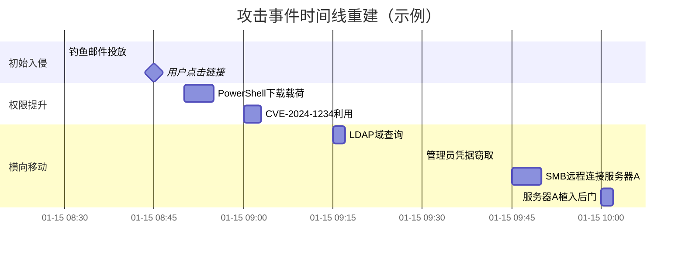
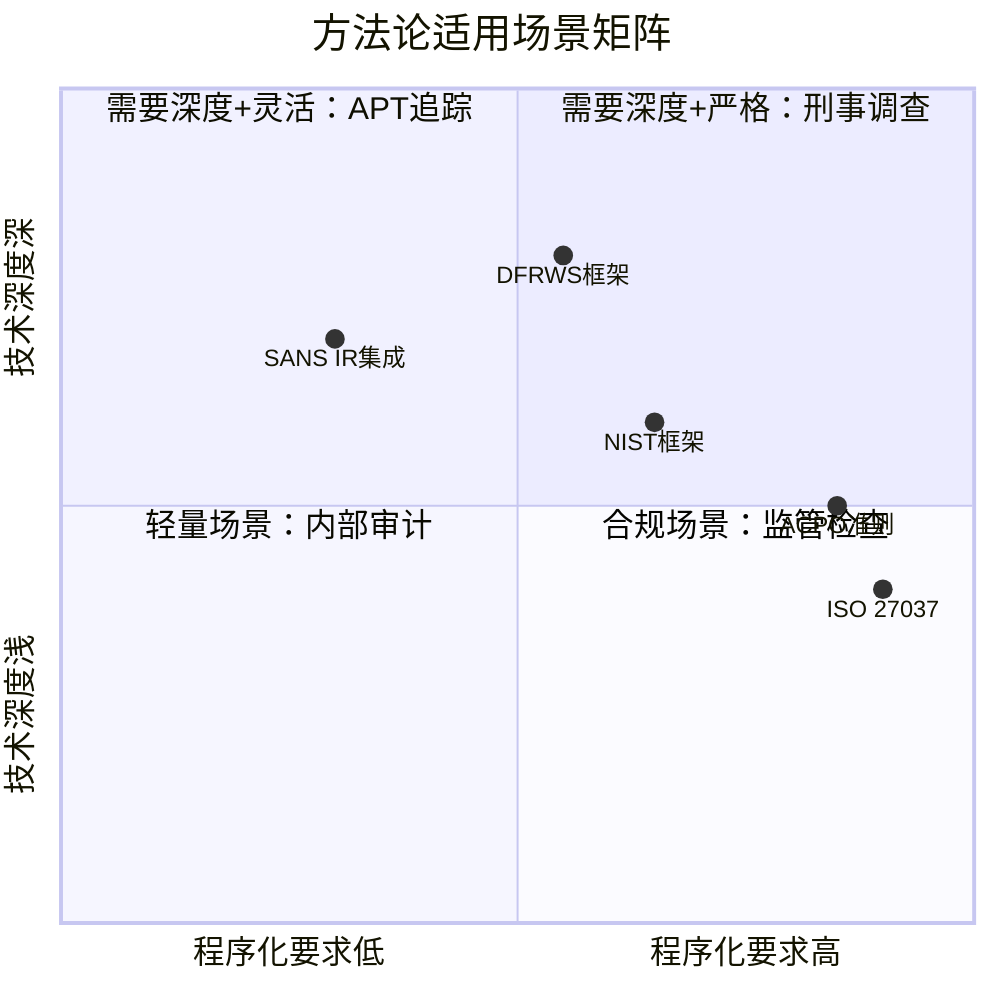
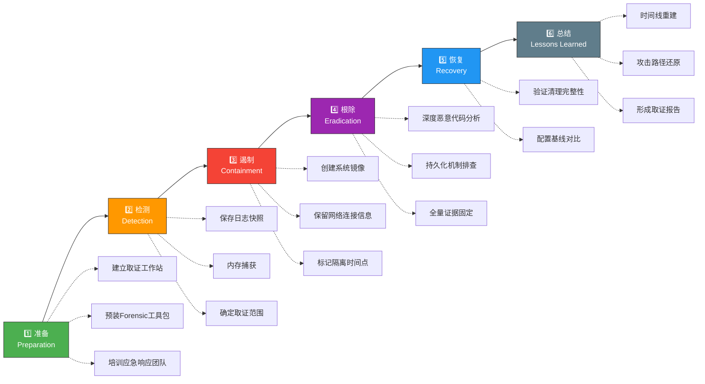

## 25.4 数字取证方法论

数字取证不是随意的数据翻找，而是一套严谨、可重复、被法律认可的方法论体系。从英国ACPO的四条基本原则到美国NIST的四阶段框架，从国际标准化组织的取证标准到各国司法实践，方法论为取证工作提供了"如何做"以及"如何确保结果被法庭采信"的系统指南。

本章以**道→法→术→器**为主线，系统介绍数字取证的主流方法论框架：

- **道**：取证的哲学基础——为什么需要方法论，数字证据的根本特性
- **法**：国际主流框架——ACPO、NIST、DFRWS、IOCE、ISO 27037及中国司法标准
- **术**：实战方法论——各场景下的具体操作流程与决策逻辑
- **器**：工具与验证——工具选择矩阵、自动化趋势、质量度量

---

### 25.4.1 道：方法论的哲学基础

在讨论具体框架之前，有必要从第一性原理出发，理解为什么数字取证需要严格的方法论。数字证据具有三个根本特性，决定了方法论的不可或缺性。

#### 数字证据的三大根本特性

**特性一：易失性（Volatility）**

数字数据极其脆弱。一次错误的启动、一次不当的文件访问、一次意外的电源中断，都可能导致关键证据永久丢失。计算机取证中有名的"易失性数据金字塔"（Volatile Data Pyramid）由SANS研究所提出，按数据易失程度从高到低排列：

```text
CPU寄存器/缓存
网络连接/ARP表
进程表/系统缓存
内存（RAM）
临时文件/页面文件
硬盘/SSD
网络日志/归档日志
离线备份
```

位于金字塔顶端的数据（寄存器、缓存）在断电后数微秒内消失，位于底端的数据（离线备份）可以保存数年。没有标准化的流程，操作者的每一步都是在"污染"证据。

**特性二：可复制性（Replicability）**

数字证据理论上可完美复制，但这也意味着原始的完整性必须被严格验证。哈希校验之所以成为标准操作，正是因为缺乏方法论框架时，无法证明复制的副本与原件一致。这引出了一个核心矛盾：**取证需要读取数据，而读取数据可能改变数据**。方法论的核心任务之一就是化解这一矛盾。

**特性三：法庭可采性（Admissibility）**

证据是否被法庭接受，不仅取决于内容本身，更取决于获取过程是否合法、完整、可追溯。世界上不乏因取证流程不当而导致铁证被排除的案例。

> **经典教训案例：洛林·琼斯案（2009）**
>
> 被告的计算机被查获后，取证人员在未创建完整镜像的情况下直接对原始硬盘进行操作，导致关键证据的完整性受到质疑。辩方律师成功质疑了证据链的完整性，最终案件审理受阻。这个案例被全球取证培训教材反复引用，核心教训只有一句话：**流程的正确性决定了证据的生命力。**

#### 方法论框架的核心目标

| 目标 | 含义 | 实现方式 |
|:--|:--|:--|
| **可重复性** | 不同取证人员面对同一份证据，采用相同流程应得到相同结论 | 标准化SOP、工具版本锁定、操作日志自动化 |
| **可审计性** | 每一步操作都有记录，第三方审查者能够追溯并验证 | 证据链文档、哈希验证、操作审计日志 |
| **合法性** | 取证过程符合法律要求，结果能够被法庭采信 | 搜查令/授权书、管辖权确认、合规性审查 |
| **完整性** | 证据从获取到呈现的全过程保持原始状态 | 写阻断器、哈希校验、物理封存 |
| **相关性** | 获取的证据与调查目标有直接关联 | 范围界定、优先级排序、数据筛选 |

---

### 25.4.2 法：国际主流方法论框架

#### 25.4.2.1 ACPO数字取证准则

英国警察局长协会（Association of Chief Police Officers，ACPO）制定的数字取证准则是全球最具影响力的取证准则之一，被英国、欧盟及多个英联邦国家的司法机关广泛采纳。

##### 四条核心原则详解

**原则一：执法机构不应采取任何可能改变存储介质上数据的行动**

这是数字取证的第一铁律，被形象地称为"不触碰原则"（Hands-Off Principle）。

- **核心含义**：只要有可能，所有取证操作必须在数据的**副本（镜像）**上执行，而非原始介质
- **适用范围**：从计算机硬盘、手机闪存到服务器SSD、云端存储卷
- **例外情况**：当原始介质存在物理损坏，无法完成镜像时，必须在严格受控的环境下操作，且操作者必须记录所有操作及其对数据的影响
- **实践建议**：现场取证时，优先使用写阻断器（Write Blocker）连接存储介质，确保操作系统无法对原始介质执行任何写入操作

> **写阻断器是硬件级别的防护工具**，将其连接到硬盘后再连接取证工作站，操作系统看到的硬盘是只读的。任何试图写入的行为都被硬件层拦截，不会到达原始介质。软件写阻断器（如Linux的loop设备+只读挂载）可作为备选方案，但硬件写阻断器在法庭上具有更强的说服力。

**原则二：在不可避免需要访问原始数据的情况下，相关人员必须具备相应能力，并能够解释其行为对证据的影响及其相关性**

- **核心含义**：如果需要操作原始数据（如获取正在运行的服务器内存），操作者必须：
  1. 具备足够的技术能力（如了解内存取证工具的原理）
  2. 记录操作的每一步
  3. 能够解释每一步操作对数据可能产生的影响
- **实践示例**：对运行中的Windows服务器进行内存转储
  ```bash
  # 使用DumpIt工具获取内存镜像（需管理员权限）
  # 此操作会对系统产生微量影响（内存占用、进程写入）
  # 操作者必须记录：源系统状态、获取时间、所用工具版本、哈希值
  dumpit.exe /OUTPUT server_memory_20250115.raw
  ```
- **法律意义**：如果取证人员在法庭上无法解释其操作对证据的影响，证据可能被认定为"污染"

**原则三：创建并记录所有用于调查的证据的审计轨迹，独立的第三方审查人员应能够检查并得出相同结论**

- **核心含义**：**证据链（Chain of Custody）**必须完整、清晰、不可篡改
- **关键要素**：
  - **谁**：每个接触过证据的人员身份
  - **何时**：每次交接的时间精确到分钟
  - **何地**：证据存储的位置（物理或逻辑）
  - **何事**：对证据执行了哪些操作
  - **何结果**：操作前后的哈希值验证记录
- **文档模板**：

```text
证据链管理记录
┌─────────────────────────────────────────────────┐
│ 证据编号：EVI-2025-00142                        │
│ 证据描述：Windows 10笔记本S/N W00123 - 500GB HDD │
│ 原始哈希（SHA-256）：a3f8...2b9d                │
├──────────┬────────────┬──────────┬───────────────┤
│ 日期时间 │ 移交人     │ 接收人   │ 操作说明     │
├──────────┼────────────┼──────────┼───────────────┤
│ 2025-01-15│ 张三(现场) │ 李四(实验室)│ 物理移交    │
│ 14:30    │            │          │ 哈希验证一致 │
├──────────┼────────────┼──────────┼───────────────┤
│ 2025-01-15│ 李四       │ 取证工作站│ 创建镜像    │
│ 15:10    │            │          │ FTK Imager  │
└──────────┴────────────┴──────────┴───────────────┘
```

**原则四：负责调查的人员有责任确保遵守相关法律和这些原则**

- **核心含义**：责任最终落脚在调查负责人身上
- **具体责任**：
  1. 确保团队所有成员接受过相应培训
  2. 确保使用合法的取证工具和授权
  3. 确保证据的存储符合数据保护法规（如欧盟GDPR）
  4. 确保取证工作不超出授权范围（如搜查令的限制）

##### ACPO准则的实际应用：现场取证示例

假设某公司员工涉嫌窃取商业机密，安全团队在报告后启动取证调查：

```text
场景：员工办公电脑（Windows 11，正在运行中）

Step 1 - 现场评估（遵循原则1）
  判断：系统正在运行？→ 是
  策略：不能直接关机（会丢失内存中的关键数据）
  操作：准备内存获取工具

Step 2 - 内存获取（遵循原则2）
  操作者：必须是有经验的取证工程师
  工具：使用经过验证的DumpIt或WinPmem
  记录：工具版本、获取时间、运行时进程列表

Step 3 - 镜像创建（遵循原则1）
  使用写阻断器连接硬盘
  创建比特级镜像：dd if=/dev/sdb of=/evidence/case001.dd
  验证哈希：sha256sum /evidence/case001.dd

Step 4 - 证据移交（遵循原则3）
  填写证据链表格
  双方签字确认哈希值一致
  存储于安保柜中

Step 5 - 授权审核（遵循原则4）
  确认搜查令/公司授权范围
  确认未超出授权范围的数据
```

#### 25.4.2.2 NIST数字取证框架

美国国家标准与技术研究院（National Institute of Standards and Technology）提出的NIST SP 800-86《数字取证技术指南》定义了四个核心阶段——这是全球数字取证领域引用最广泛的方法论框架。

```mermaid
graph TB
    subgraph "NIST 数字取证四阶段模型"
    direction TB

    C["📦 收集<br/>Collection"] --> E["🔍 检验<br/>Examination"]
    E --> A["📊 分析<br/>Analysis"]
    A --> R["📝 报告<br/>Reporting"]

    subgraph "阶段一：收集"
        C1["识别数据源"] --> C2["优先级排序"]
        C2 --> C3["获取数据"]
        C3 --> C4["完整性验证"]
    end

    subgraph "阶段二：检验"
        E1["数据筛选"] --> E2["格式转换"]
        E2 --> E3["提取证据项"]
        E3 --> E4["保留元数据"]
    end

    subgraph "阶段三：分析"
        A1["时间线分析"] --> A2["关联分析"]
        A2 --> A3["隐藏数据恢复"]
        A3 --> A4["结论形成"]
    end

    subgraph "阶段四：报告"
        R1["结构化文档"] --> R2["可追溯论证"]
        R2 --> R3["结论与建议"]
    end

    style C fill:#4CAF50,stroke:#333,color:#fff
    style E fill:#2196F3,stroke:#333,color:#fff
    style A fill:#FF9800,stroke:#333,color:#fff
    style R fill:#9C27B0,stroke:#333,color:#fff
```

##### 第一阶段：收集（Collection）

收集阶段的本质是**在证据被破坏之前，以最完整、最可靠的方式获取它**。

**识别数据源**：任何可能包含调查相关信息的数字载体

| 数据源类型 | 具体内容 | 获取优先级 | 易失性 |
|:--|:--|:--:|:--:|
| 内存（RAM） | 运行进程、网络连接、加密密钥 | 最高 | 极高（关闭电源则丢失） |
| 网络连接 | 活跃连接、监听端口、ARP缓存 | 高 | 极高 |
| 系统日志 | Event Log、Syslog、应用日志 | 高 | 中 |
| 硬盘/SSD | 文件系统、已删除文件、未分配空间 | 中 | 低 |
| 云端数据 | SaaS数据、对象存储、数据库快照 | 中 | 取决于服务商 |
| 外部存储 | USB、SD卡、移动硬盘 | 低 | 低 |

**数据获取方法**：

- **逻辑复制**：仅复制文件系统中的可见文件
  ```bash
  # Linux逻辑复制
  rsync -av /mnt/source/ /evidence/copy/
  ```
- **比特级镜像**：逐比特复制整个存储介质（包括空闲空间和已删除文件）
  ```bash
  # 使用dd创建比特级镜像（通过写阻断器）
  sudo dd if=/dev/sdb of=/evidence/server1.dd bs=4M conv=noerror,sync status=progress
  ```
- **实时获取**：对正在运行的系统获取易失性数据
  ```bash
  # 使用LiME获取Linux内存镜像
  insmod lime.ko "path=/evidence/mem.lime format=lime"
  ```

##### 第二阶段：检验（Examination）

检验阶段的目标是从原始数据中提取出**与调查相关的证据项**（Evidence Items），为后续分析做好准备。

**关键操作**：

1. **数据筛选**：使用关键字、文件类型、时间范围等条件缩小数据范围
2. **格式转换**：将原始数据转换为标准格式（如将EDB邮件数据库转为PST）
3. **密码恢复**：对加密容器进行密码破解尝试（在授权范围内）
4. **隐藏数据提取**：识别并提取NTFS流、隐藏分区、篡改扩展名的文件
5. **文件分类**：基于文件签名（Magic Bytes）而非扩展名进行分类
   ```bash
   # 使用file命令识别真实文件类型（绕过扩展名伪造）
   file -i /evidence/files/suspicious.doc
   # 输出：suspicious.doc: application/x-msdownload; charset=binary
   # 表明该文件实际上是PE可执行文件，而非Word文档
   ```

**检验阶段的输出**：一份经过筛选、分类、脱密的"证据项清单"，每个证据项带有元数据（位置、哈希、创建时间）。

##### 第三阶段：分析（Analysis）

分析阶段是取证工作中**最需要专业判断**的环节。分析人员需要将检验阶段提取的证据项与调查目标关联起来。

**常用分析方法**：

**时间线分析（Timeline Analysis）**：将所有文件操作、网络连接、用户活动按时间排序，重建事件序列



**关联分析（Correlation Analysis）**：将不同来源的数据联系起来，发现隐藏的攻击模式

- **网络流量 + 主机日志**：识别出某次横向移动时传输了哪些文件
- **事件日志 + 进程创建**：追踪攻击者使用的工具链条
- **注册表 + 计划任务**：发现持久化机制

**隐藏数据恢复（Data Recovery）**：
- 恢复已删除文件（使用PhotoRec、extundelete等）
- 恢复卷影副本（Volume Shadow Copy）
- 恢复未分配空间中的数据碎片

##### 第四阶段：报告（Reporting）

报告是取证工作的**最终交付物**，它的质量直接决定了调查的价值。优秀的取证报告需要满足：

**报告结构标准**：

```text
数字取证报告
├── 1. 案件信息（案件编号、委托方、调查范围）
├── 2. 调查摘要（500字以内，面向非技术人员）
├── 3. 取证方法（ACPO/NIST遵循声明、工具列表、版本号）
├── 4. 证据清单（每项证据的来源、哈希值、时间戳）
├── 5. 分析过程（按时间线展开，每个发现附有引用来源）
├── 6. 发现结论（每个结论必须有数据支撑，标注置信度）
├── 7. 建议措施（基于结论的行动建议）
├── 8. 附录（相关日志、截图、工具输出）
```

#### 25.4.2.3 DFRWS框架

数字取证研究工作组（Digital Forensic Research Workshop）提出的DFRWS框架是学术界广泛引用的模型，更侧重于**技术流程的细化**。

```text
DFRWS框架包含七大阶段：
识别(Identification) → 保存(Preservation) → 收集(Collection)
→ 检验(Examination) → 分析(Analysis) → 呈现(Presentation) → 决策(Decision)
```

DFRWS的独特价值在于增加了**识别**和**决策**两个环节：

- **识别**阶段强调在正式取证前对事件进行初步分类，判断是否需要启动完整取证流程。具体操作包括：事件分级（低/中/高/严重）、证据源初步评估、资源需求估算、是否需要外部专家介入
- **保存**阶段独立于收集阶段，强调在收集之前先固定易失性数据（如内存快照、网络状态），防止数据在收集过程中被破坏
- **决策**阶段强调取证的最终成果应支持决策制定（如起诉、纪律处分、系统加固），而非仅仅产出技术报告

**DFRWS框架的实操流程**：

```text
识别阶段：
  输入：安全告警 / 举报 / 异常检测
  输出：事件分级 + 取证必要性评估
  决策树：
    ├── 疑似刑事犯罪？ → 启动完整DFRWS流程
    ├── 内部违规？ → 启动简化取证流程
    └── 误报？ → 记录后关闭

保存阶段：
  操作：内存获取 → 网络状态记录 → 日志快照
  工具：WinPmem / LiME / netstat / journalctl
  输出：易失性数据快照包

收集阶段：
  操作：比特级镜像 / 逻辑复制 / 云端快照
  工具：dd / FTK Imager / AWS CLI
  输出：完整证据副本

检验阶段：
  操作：文件系统解析 / 关键字搜索 / 数据恢复
  工具：Autopsy / EnCase / PhotoRec
  输出：证据项清单

分析阶段：
  操作：时间线重建 / 关联分析 / 恶意代码分析
  工具：Volatility / Wireshark / Ghidra
  输出：分析发现报告

呈现阶段：
  操作：可视化报告 / 法庭演示准备
  输出：结构化取证报告

决策阶段：
  输入：分析发现
  输出：行动建议（起诉/处分/加固/监控）
```

#### 25.4.2.4 IOCE原则

国际计算机证据组织（International Organization on Computer Evidence）制定的原则主要针对**数字证据的跨司法管辖区互认**。

**核心原则**：

1. 数字证据的采集、保存、检验、传输和呈现必须遵循一致性标准
2. 司法管辖区之间的证据交换应基于"同等标准"原则
3. 取证程序应符合"最佳实践"而非最低标准
4. 负责数字证据的人员应接受持续培训

IOCE的原则在**跨国案件**中尤为重要。当证据在中国的服务器上、由美国的分析师处理、最终提交给英国法庭时，三方必须对取证流程有统一的认可标准。

**跨国取证实操要点**：

| 挑战 | 应对策略 |
|:--|:--|
| 管辖权冲突 | 提前确认MLAT（司法协助条约）适用性，必要时通过外交渠道 |
| 数据本地化法律 | 遵守各国数据出境规定（如中国《数据安全法》第36条） |
| 语言障碍 | 报告需有经认证的翻译版本，关键术语保留原文 |
| 时间标准差异 | 所有时间戳统一使用UTC，并在报告中注明本地时区 |
| 证据格式差异 | 使用国际标准格式（E01镜像、PDF/A报告、CSV日志） |

#### 25.4.2.5 ISO/IEC 27037:2012标准

ISO 27037是国际标准化组织颁布的《数字证据识别、收集、获取和保存指南》，提供了**组织层面的取证能力建设框架**。

**关键要求**：

- 组织必须建立数字证据处理的**标准操作规程（SOP）**
- 取证人员需具备对应的**技术能力和认证**
- 使用的工具需经过**验证和测试**
- 数字证据的存储环境需满足**物理安全要求**

ISO 27037将取证能力要求分为三个层次：

| 层次 | 能力要求 | 适用场景 |
|:--|:--|:--|
| 基础层 | 能够安全关机、物理保护设备 | 一线响应人员 |
| 进阶层 | 能够进行内存获取、比特镜像、日志导出 | IT安全团队 |
| 专家层 | 能够进行深度分析、逆向工程、法庭作证 | 专业取证实验室 |

#### 25.4.2.6 中国司法标准：电子数据规定

中国司法体系对数字证据（法律术语为"电子数据"）有独立的规范性要求，任何在中国境内进行的取证工作都必须遵守。

**核心法规**：

- **《最高人民法院关于适用〈中华人民共和国刑事诉讼法〉的解释》（2021）第63-73条**：明确电子数据的概念、收集提取程序、真实性审查标准
- **《公安机关办理刑事案件电子数据取证规则》（2019）**：公安机关电子数据取证的具体操作规程
- **《人民检察院刑事诉讼规则》（2019）第64-73条**：检察机关电子数据审查标准
- **《民事、行政诉讼中电子数据规定》（2019）**：民事诉讼中的电子数据规则

**中国电子数据取证的五大核心要求**：

1. **完整性校验**：收集提取电子数据，应当计算电子数据完整性校验值（哈希值），并记录在笔录中
2. **见证人在场**：收集提取电子数据，应当有见证人在场，并在笔录上签名
3. **封存保护**：对扣押的存储介质，应当予以封存，并在封条上签名
4. **原始性保证**：应当对电子数据的原始存储介质进行扣押；无法扣押的，应当封存并拍照记录
5. **笔录规范**：收集提取电子数据应当制作笔录，记录收集提取的过程、方法和结果

**中外取证标准对比**：

| 维度 | ACPO（英国） | NIST（美国） | 中国司法解释 |
|:--|:--|:--|:--|
| 核心原则 | 四条原则（不触碰/能力/审计/责任） | 四阶段模型 | 五大要求（完整性/见证人/封存/原始性/笔录） |
| 见证人要求 | 隐含在审计原则中 | 未强制要求 | **强制要求**，必须在笔录上签名 |
| 封存要求 | 证据链管理 | 完整性验证 | **强制要求**，封条签名 |
| 哈希算法 | 推荐SHA-256 | 推荐SHA-256 | 未指定算法，要求记录校验值 |
| 适用范围 | 刑事/民事 | 刑事/民事/企业 | 刑事/民事/行政全覆盖 |

---

### 25.4.3 术：实战方法论

#### 25.4.3.1 方法论对比与选择

不同方法论框架的侧重点不同，选择合适的框架取决于调查的性质和上下文。



**方法论选择指南**：

| 选型标准 | 推荐框架 | 理由 |
|:--|:--|:--|
| 刑事犯罪调查 | ACPO + ISO 27037 | 程序严格性最高，证据可采性保障最强 |
| 企业内部调查 | NIST或DFRWS | 兼顾效率与完整性 |
| APT攻击溯源 | SANS IR + DFRWS | 需要灵活处理动态环境 |
| 合规审计取证 | ISO 27037 | 强调流程文档化 |
| 跨司法管辖区 | ACPO + IOCE | 确保国际互认 |
| 中国境内调查 | 中国司法解释 + NIST | 满足本地法律要求 + 国际最佳实践 |

**实例说明**：

一家跨国公司的中国分公司遭遇数据泄露，总部要求进行数字取证调查。这种情况下：

1. **适用方法论**：中国司法解释（确保证据在中国法庭可采）+ IOCE原则（确保中国取证结果被美国总部认可）
2. **执行框架**：NIST四阶段模型（给团队一个清晰的执行路线图）
3. **组织标准**：ISO 27037（确保团队具备合规的取证能力）
4. **特殊要求**：必须有见证人在场，存储介质必须封存，笔录必须规范

#### 25.4.3.2 事件响应与取证的深度融合

在实际的安全事件处理中，数字取证绝非孤立进行，而是与**事件响应**（Incident Response，IR）密不可分。SANS研究所的事件响应六阶段模型中，取证活动贯穿始终。

##### SANS六阶段模型及取证活动



##### IR取证与传统取证的差异

| 维度 | 传统数字取证 | 事件响应取证 |
|:--|:--|:--|
| 触发条件 | 刑事调查、法律诉讼 | 安全事件、疑似攻击 |
| 时间压力 | 低（数周到数月） | 高（分钟到小时） |
| 完整性要求 | 最高（法庭标准） | 高（业务恢复优先） |
| 数据范围 | 全面获取 | 目标导向、范围可控 |
| 操作环境 | 实验室（受控环境） | 现场（生产环境） |
| 典型工具 | EnCase、FTK、X-Ways | Velociraptor、KAPE、CyLR |

##### IR-取证集成最佳实践

**第一阶段（检测阶段）的取证操作**：

发现可疑事件后，第一时间执行——不是关机和拔网线，而是**捕捉易失性数据**：

```bash
# Windows环境：KAPE（Kroll Artifact Parser and Extractor）自动化获取
kape.exe --tsource C: --tdest E:\KAPE_Output --target !SANS_Triage --tflush

# Linux环境：UAC（Unix Artifact Collector）
sudo python3 uac.py -p all -o /evidence/uac_output/

# macOS环境：mac_apt
sudo python3 mac_apt.py -o /evidence/mac_output/ -t / -i all
```

**第二阶段（遏制阶段）的取证操作**：

在进行网络隔离或系统下线之前，**必须完成**：

1. 记录当前的网络连接状态（`netstat -anob > connection_snapshot.txt`）
2. 获取当前运行进程列表（`tasklist /v /fo csv > process_snapshot.csv`）
3. 捕获系统内存（WinPmem、LiME）
4. 如果条件允许，创建系统镜像后再下线

**核心原则：先进取证，后下结论**

**一个常见但致命的错误**：发现攻击后立即拔网线+关机。这会：

- ❌ 丢失内存中的所有证据（进程注入、网络连接、加密密钥）
- ❌ 丢失临时文件（%TEMP%、/tmp中的攻击工具）
- ❌ 丢失攻击者是否还处于连接状态的轨迹信息

**正确的做法**：

```text
✓ 先捕获内存（5分钟）
✓ 再记录网络状态（3分钟）
✓ 然后创建系统镜像（30分钟，可后台运行）
✓ 最后安全下线
```

#### 25.4.3.3 移动端取证方法论

移动设备（智能手机、平板电脑）已成为数字取证中增长最快的证据源。2024年全球智能手机保有量超过67亿台，移动取证的需求呈指数级增长。

**移动取证的特殊挑战**：

| 挑战 | 说明 | 应对策略 |
|:--|:--|:--|
| 物理接口限制 | Lightning/USB-C接口，无法使用传统写阻断器 | 使用专用移动取证硬件（Cellebrite UFED、MSAB XRY） |
| 加密普及 | iOS/Android默认全盘加密 | 通过JTAG/芯片级提取或密码破解获取 |
| 云端同步 | 数据分散在设备、iCloud、Google Drive | 并行获取设备端和云端数据 |
| 应用生态 | 微信、WhatsApp等即时通讯应用数据加密存储 | 使用专用解析工具（如Oxygen Suite的微信解析模块） |
| 远程擦除 | 设备丢失后可能被远程清除 | 尽快物理获取设备，阻止远程擦除指令执行 |

**移动取证操作流程**：

```text
Step 1 - 设备隔离
  操作：将设备置于飞行模式或RF屏蔽袋中
  目的：阻止远程擦除、阻止数据同步、阻止位置上报

Step 2 - 物理提取
  工具：Cellebrite UFED / MSAB XRY / 开源工具（libimobiledevice）
  方法：物理提取（芯片级）> 芯片提取 > 文件系统提取 > 逻辑提取

Step 3 - 数据解析
  工具：Cellebrite Physical Analyzer / Oxygen Forensics / Autopsy Mobile
  重点：通话记录、短信、即时通讯、位置历史、应用数据

Step 4 - 云端取证
  操作：通过法律程序获取iCloud/Google备份数据
  注意：云端数据的时间戳可能与设备端不一致，需交叉验证

Step 5 - 证据固定
  操作：生成哈希值、填写证据链表格、封存原始设备
```

**微信数据取证要点**（中国场景特有）：

微信是中国使用最广泛的即时通讯工具，其数据取证有特殊要求：

- **数据存储位置**：Android: `/data/data/com.tencent.mm/MicroMsg/`；iOS: 沙盒中的Documents目录
- **数据库加密**：微信使用AES加密数据库，密钥存储在设备密钥链中
- **提取方法**：需要root/jailbreak后的文件系统提取，或使用Cellebrite等商业工具的微信解析模块
- **关键数据**：聊天记录（MSG.db）、联系人（Contact.db）、转账记录、位置共享
- **法律注意**：微信数据涉及个人隐私，取证需有明确授权，超出授权范围获取的数据不可作为证据

#### 25.4.3.4 网络取证方法论

网络取证（Network Forensics）专注于从网络流量数据中提取证据，与主机取证形成互补。

**网络取证的核心数据类型**：

| 数据类型 | 来源 | 价值 | 保留周期 |
|:--|:--|:--|:--|
| 全流量镜像（PCAP） | 交换机镜像端口/网络TAP | 最高——可还原完整会话 | 7-30天（取决于存储成本） |
| 网络元数据 | NetFlow/sFlow/IPFIX | 高——连接关系、流量统计 | 3-12个月 |
| 防火墙日志 | 防火墙/网关 | 中——允许/拒绝决策 | 90-365天 |
| IDS/IPS告警 | Snort/Suricata/Splunk | 中——攻击特征匹配 | 90-365天 |
| DNS日志 | DNS服务器 | 高——域名解析记录 | 30-90天 |
| 代理日志 | HTTP代理/Squid | 中——Web访问记录 | 30-90天 |

**网络取证操作流程**：

```text
Step 1 - 流量获取
  方法：交换机端口镜像 / 网络TAP / SPAN端口
  工具：tcpdump / Wireshark / Zeek
  注意：确保镜像端口带宽足够，避免丢包

Step 2 - 流量解析
  工具：Wireshark / Zeek / Bro
  重点：协议识别、会话重建、文件提取

Step 3 - 流量分析
  方法：异常检测 / 签名匹配 / 行为分析
  工具：Wireshark过滤器 / Zeek脚本 / Splunk
  重点：C2通信识别、数据外泄检测、横向移动发现

Step 4 - 证据固定
  操作：PCAP文件哈希验证、元数据导出、时间线对齐
```

**Wireshark实用取证过滤器**：

```text
# 过滤特定IP的所有流量
ip.addr == 192.168.1.100

# 过滤HTTP请求（可能包含敏感数据）
http.request

# 过滤DNS查询（可能包含C2域名）
dns.qry.name contains "suspicious-domain.com"

# 过滤特定端口的流量（如SMB横向移动）
tcp.port == 445

# 过滤异常大包（可能包含数据外泄）
frame.len > 10000
```

#### 25.4.3.5 云环境取证方法论

云取证对传统方法论提出了新挑战——数据在物理上不属于调查者，证据边界不清晰，司法管辖可能跨越国界。

**云取证的关键差异**：

- **数据所有权**：调查者无法物理访问服务器，需要云服务商配合
- **证据易失性**：虚拟机、容器可以秒级创建和销毁
- **日志完整性**：云服务商的日志可能被内部人员篡改
- **多租户问题**：取证操作可能意外获取其他租户的数据

**云取证操作流程**：

1. 通过云服务商的管理API创建虚拟机的**快照**（而非直接下载文件）
2. 请求云服务商提供**访问日志**（CloudTrail、审计日志等）
3. 在独立的分析环境中启动快照副本进行分析
4. 记录所有API调用和返回结果，作为证据链的一部分
5. 注意区分**租户数据**和**元数据**的法律地位差异

**主流云平台取证API速查**：

| 云平台 | 快照API | 日志API | 取证工具 |
|:--|:--|:--|:--|
| AWS | EC2 CreateSnapshot | CloudTrail / VPC Flow Logs | AWS CLI / Magnet RAMCapture |
| Azure | Disk CreateSnapshot | Azure Activity Log / NSG Flow Log | Azure CLI / Velociraptor |
| GCP | Disks CreateSnapshot | Cloud Audit Logs / VPC Flow Logs | gcloud CLI / GCP Forensics Toolkit |
| 阿里云 | CreateSnapshot | ActionTrail / VPC Flow Log | Alibaba Cloud CLI |
| 腾讯云 | CreateDiskBackup | Cloud Audit / VPC Flow Log | Tencent Cloud CLI |

#### 25.4.3.6 内存取证方法论

内存取证是整个数字取证领域中**增长最快的分支**，因为越来越多的攻击只在内存中活动，不在硬盘上留下痕迹。

**内存取证的关键原则**：

- **从操作系统的视角获取内存比"物理"转储更可靠**（使用内核模块而非/dev/mem）
- **获取工具必须经过验证**，不同工具对内存结构的访问方式不同
- **内存转储需要执行代码，这必然改变内存状态**——关键是记录和最小化这种改变

**常用内存取证命令速查**：

```bash
# 使用Volatility 3分析内存镜像
# 1. 识别操作系统类型
python3 vol.py -f mem.raw windows.info

# 2. 列出运行进程
python3 vol.py -f mem.raw windows.pslist

# 3. 检查网络连接
python3 vol.py -f mem.raw windows.netscan

# 4. 提取注册表配置单元（离线分析）
python3 vol.py -f mem.raw windows.registry.hivelist

# 5. 扫描恶意代码签名
python3 vol.py -f mem.raw windows.malfind

# 6. 提取命令行历史
python3 vol.py -f mem.raw windows.cmdline

# 7. 检查注入的代码段
python3 vol.py -f mem.raw windows.dlllist
```

**内存取证实战场景**：

| 场景 | 关键指标 | 分析命令 |
|:--|:--|:--|
| 无文件攻击检测 | 进程内存中的非文件代码 | `malfind` + `memdump` |
| 凭据窃取检测 | LSASS进程中的明文密码 | `lsadump` / `mimikatz`检测 |
| 持久化机制发现 | 注册表Run键、服务配置 | `hivelist` + `printkey` |
| C2通信检测 | 异常网络连接、DNS查询 | `netscan` + `connscan` |
| 进程注入检测 | 异常进程内存区域 | `malfind` + `pslist`对比 |

---

### 25.4.4 器：工具、验证与质量

#### 25.4.4.1 取证工具对比矩阵

选择正确的工具是取证成功的关键。以下是主流取证工具的全面对比：

| 工具 | 类型 | 平台 | 价格 | 优势 | 局限 |
|:--|:--|:--|:--|:--|:--|
| **FTK Imager** | 镜像创建 | Windows | 免费 | 业界标准镜像工具，支持E01/RAW | 仅镜像，无分析功能 |
| **Autopsy** | 综合分析 | 跨平台 | 免费（开源） | 功能全面，适合中小案件 | 处理大数据集较慢 |
| **EnCase** | 综合分析 | Windows | 商业 | 法庭认可度最高，功能最全面 | 价格昂贵，学习曲线陡峭 |
| **X-Ways Forensics** | 综合分析 | Windows | 商业 | 速度极快，内存占用低 | 界面简陋，无GUI友好性 |
| **Magnet AXIOM** | 综合分析 | Windows | 商业 | 关联分析强大，可视化优秀 | 价格高，需订阅 |
| **Volatility** | 内存分析 | 跨平台 | 免费（开源） | 内存取证事实标准 | 需手动解析，无GUI |
| **Wireshark** | 网络分析 | 跨平台 | 免费（开源） | 网络取证事实标准 | 仅网络数据，无主机分析 |
| **Cellebrite UFED** | 移动取证 | Windows | 商业 | 移动取证行业标杆 | 价格极高，仅限移动设备 |
| **KAPE** | 现场分诊 | Windows | 免费 | 快速现场数据获取 | 需自定义目标模板 |
| **Velociraptor** | EDR+取证 | 跨平台 | 开源 | 实时响应+取证一体化 | 需预部署代理 |

**工具选择决策树**：

```text
案件类型？
├─ 刑事调查（法庭呈堂）
│   → EnCase 或 FTK（法庭认可度最高）
│   → 配合 X-Ways 交叉验证
│
├─ 企业内部调查
│   → Autopsy（免费，功能全面）
│   → 配合 KAPE 快速分诊
│
├─ APT攻击溯源
│   → Velociraptor（实时响应）
│   → 配合 Volatility（内存分析）
│   → 配合 Wireshark（网络分析）
│
├─ 移动设备取证
│   → Cellebrite UFED（商业）
│   → 或 libimobiledevice（开源）
│
└─ 云环境取证
    → 云平台CLI + 自建分析环境
    → 配合 Magnet AXIOM（关联分析）
```

#### 25.4.4.2 证据链管理详解

证据链是数字取证的"生命线"。没有完整的证据链，再有力的证据也可能被排除。

##### 证据链的完整要素

一份完整的证据链记录必须包含：

```text
1. 证据的唯一标识符（如案件编号+序号）
2. 证据的类型和描述
3. 原始获取时间和地点
4. 获取人员的身份和签名
5. 原始数据的哈希值（MD5、SHA-256双哈希）
6. 每次证据移交的时间、移交人、接收人、目的
7. 每次操作后的哈希验证结果
8. 证据存储的环境条件（物理安全、温度、湿度）
9. 证据的最终处置信息（归档、销毁、返还）
```

##### 哈希验证的实操要点

```bash
# 创建镜像时生成哈希
sudo dd if=/dev/sdb of=/evidence/disk.dd bs=4M status=progress
sudo sha256sum /evidence/disk.dd > /evidence/disk.dd.sha256

# 验证镜像完整性（任何时候都可执行）
sha256sum -c /evidence/disk.dd.sha256

# 对单个文件生成多重哈希（防止哈希碰撞攻击）
sha256sum evidence.doc && md5sum evidence.doc
```

> **为什么用SHA-256而不是MD5？** MD5已被证明存在碰撞缺陷（2004年山东大学团队首次实现MD5碰撞），SHA-256在可预见的未来是安全的。严谨的取证工作中通常会同时使用两种哈希算法，形成"双哈希验证"，既保证效率（MD5校验速度快）又保证安全性（SHA-256抗碰撞能力强）。

##### 电子证据笔录模板

```text
                数字证据获取笔录
━━━━━━━━━━━━━━━━━━━━━━━━━━━━━━━━━━━━━━━━━━━
案件编号：IR-2025-00142
证据编号：EVI-2025-142-001
证据描述：Lenovo ThinkPad X1 Carbon S/N PF3X1234
          512GB NVMe SSD (Micron 2300)
获取地点：北京市朝阳区某某大厦12层 1206室
获取时间：2025-01-15 14:23
获取人员：李四（工号FS-0042）
见证人员：王五（工号HR-0089）
━━━━━━━━━━━━━━━━━━━━━━━━━━━━━━━━━━━━━━━━━━━

获取前状态：
  系统状态：关机（开机后约5分钟被入侵检测系统发现并人工切断电源）
  物理状态：无明显损坏，屏幕关闭，网线已拔除
  环境照片：附件EVI-142-001-env.jpg（显示设备摆放位置和连接情况）

获取过程：
  1. 使用Tableau T35es写阻断器连接SSD
  2. FTK Imager v4.7.1创建E01格式镜像
  3. 镜像文件存储在取证工作站F:\Cases\IR-2025-00142\Images\下

哈希验证：
  原始介质 SHA-256: a3f8c2d1...2b9d  (记录于获取前)
  镜像文件 SHA-256: a3f8c2d1...2b9d  (记录于获取后，一致 ✓)
                     a3f8c2d1...2b9d  (验证于2025-01-16 09:00，一致 ✓)

证据移交记录：
  2025-01-15 15:30  李四 → 王五（证据保管室）  物理移交
                   哈希一致，指纹验证通过，存放于机柜A-12

━━━━━━━━━━━━━━━━━━━━━━━━━━━━━━━━━━━━━━━━━━━
获取人签字：______  见证人签字：______  日期：______
━━━━━━━━━━━━━━━━━━━━━━━━━━━━━━━━━━━━━━━━━━━
```

#### 25.4.4.3 常见误区与纠正

##### 误区一："我经验丰富，不需要写文档"

**真相**：即使你是最资深的取证专家，缺少文档化的过程在法庭上等同于"没有发生"。

**纠正方法**：养成"每步必记"的习惯。使用**电子取证记录模板**，在操作的同时随手记录关键信息。工具方面，Autopsy、FTK等主流取证平台自动生成操作日志，可以有效减少记录负担。

##### 误区二："镜像创建完成后，原始证据就可以继续使用了"

**真相**：一旦创建了合法的镜像，原始介质应**立即封存**。继续操作原始介质会破坏证据链的纯粹性。

**正确做法**：创建镜像完成后，将原始介质放置于证据保管袋中密封，贴标签并填写日期和操作者。后续所有分析工作都在镜像上进行。

##### 误区三："哈希值一致，数据就没有被篡改"

**真相**：哈希验证只能证明**在哈希计算的时间点**数据是一致的。数据可能在哈希验证之后、操作过程中被篡改。

**正确做法**：在证据链的**每一次交接点**都重新计算哈希并比对。对于长周期案件，建议每周或每月重新验证哈希，确保证据在存储期间未被任何因素影响。

##### 误区四："取证工具的输出可以直接作为法庭证据"

**真相**：工具输出需要**经过验证和解释**才能成为证据。不同工具对同一数据的解析结果可能存在差异，工具本身的可靠性也需要证明。

**正确做法**：

1. 验证工具的NCSC/CFTT证书（美国国家标准与技术研究院的计算机取证工具测试项目）
2. 对关键发现使用至少两种独立工具交叉验证
3. 保留原始数据以便第三方验证
4. 在报告中注明所用工具的版本号和验证状态

##### 误区五："取证的目的是找出真相，不管用什么方法"

**真相**：在数字取证中，**正确的方法是真相的前提**。用非法或不规范的方法获取的证据，即使内容完全正确，也可能被法庭排除。这就是著名的"毒树之果"原则——证据获取过程的不当，会"毒化"证据本身的价值。

##### 误区六："云端数据不属于我，不需要取证"

**真相**：在SaaS、PaaS、IaaS环境中，数据的所有权和控制权分离。即使是企业自有数据，也可能存储在第三方云服务商的服务器上。忽略云取证将导致大量证据遗漏。

**正确做法**：将云端数据纳入取证范围，通过法律程序获取云服务商的配合，使用云平台的API和日志进行取证。

##### 误区七："手机取证和电脑取证是一样的"

**真相**：移动设备的取证复杂度远高于传统计算机。加密、应用沙盒、云端同步、物理接口限制等因素使得移动取证需要专门的工具和方法。

**正确做法**：使用专用的移动取证工具（Cellebrite、MSAB），掌握各操作系统的存储结构，了解主流应用的数据库格式。

#### 25.4.4.4 反取证对抗与应对

攻击者越来越意识到数字取证的存在，并开发了各种反取证技术来干扰调查。了解这些技术是有效取证的前提。

**常见反取证技术**：

| 反取证技术 | 原理 | 检测方法 | 应对策略 |
|:--|:--|:--|:--|
| 数据擦除 | 使用DBAN、Shred等工具覆盖数据 | 检查擦除工具残留、事件日志 | 从备份/卷影副本恢复 |
| 时间戳篡改 | 使用Touch、Timestomp修改文件时间 | 对比MFT记录与文件属性 | 使用NTFS日志重建时间线 |
| 日志清除 | 清除Event Log、Syslog | 检查日志文件大小突变、事件ID缺失 | 从远程日志服务器/SIEM获取 |
| 加密隐藏 | 使用VeraCrypt创建隐藏卷 | 检查磁盘空间利用率异常 | 密码破解/冷启动攻击 |
| 内存驻留 | 恶意代码仅存在于内存中 | 内存取证扫描 | Volatility malfind检测 |
| 反分析 | 检测调试器/虚拟机环境 | 行为分析、沙箱逃逸检测 | 使用硬件调试器 |
| 数据外泄 | 通过加密通道传输数据 | 网络流量分析 | 深度包检测（DPI） |

**反取证检测实战**：

```bash
# 检测时间戳篡改（对比MFT时间与文件属性时间）
# 使用X-Ways或FTK的MFT解析功能

# 检测日志清除
wevtutil ql Security /fh:10000  # 检查安全日志事件数量
# 如果事件数量异常少，可能存在日志清除

# 检测擦除工具残留
# 搜索已知擦除工具的特征字符串
grep -r "DBAN\|shred\|srm\|bleachbit" /evidence/

# 检测隐藏卷
# 检查磁盘分区表是否有未分配空间中的异常结构
fdisk -l /dev/sdb
```

#### 25.4.4.5 取证质量度量标准

如何判断一次取证工作的质量？以下是可量化的评估指标：

| 维度 | 指标 | 优秀标准 | 计算方法 |
|:--|:--|:--|:--|
| **完整性** | 证据覆盖率 | ≥95% | （已获取证据源数量 / 应获取证据源数量）× 100% |
| **可追溯性** | 证据链完整度 | 100% | 每个证据项都有完整的获取→移交→分析记录 |
| **准确性** | 交叉验证通过率 | ≥90% | 关键发现经两种以上工具验证的比例 |
| **时效性** | 响应时间 | 易失数据≤15分钟 | 从事件发现到易失数据获取的时间 |
| **可采性** | 法律合规度 | 100% | 取证过程符合适用法律要求的比例 |
| **可理解性** | 报告可读性 | 非技术人员可理解 | 报告摘要部分无需技术背景即可理解 |

**取证质量自检清单**：

```text
□ 所有证据源都已识别并记录
□ 易失性数据优先获取
□ 使用了写阻断器或等效措施
□ 每个证据项都有哈希值记录
□ 证据链文档完整、签字齐全
□ 使用了经过验证的取证工具
□ 关键发现经交叉验证
□ 报告包含面向非技术人员的摘要
□ 所有操作都有时间戳记录
□ 原始证据已封存保护
```

#### 25.4.4.6 取证自动化与AI趋势

数字取证领域正在经历一场由自动化和人工智能驱动的变革。

**当前自动化水平**：

| 取证环节 | 自动化程度 | 代表工具 | 发展方向 |
|:--|:--|:--|:--|
| 镜像创建 | 高 | dd、FTK Imager | 已高度自动化 |
| 数据解析 | 高 | Autopsy、Magnet AXIOM | AI辅助文件分类 |
| 关键字搜索 | 中 | FTK、EnCase | NLP语义搜索 |
| 时间线分析 | 中 | Autopsy Timeline | AI异常检测 |
| 关联分析 | 低 | Magnet AXIOM | 图神经网络 |
| 恶意代码分析 | 中 | Cuckoo Sandbox | 静态+动态AI分析 |
| 报告生成 | 低 | 人工为主 | LLM自动生成报告 |

**AI在数字取证中的应用前景**：

1. **智能证据筛选**：使用NLP模型自动识别与案件相关的文档、邮件、聊天记录，大幅减少人工审查工作量
2. **异常行为检测**：使用机器学习模型识别异常的用户行为模式、网络流量模式，自动标记可疑活动
3. **自动化时间线重建**：AI自动从海量日志中提取关键事件，构建时间线，识别异常时间间隔
4. **智能报告生成**：使用LLM根据分析结果自动生成结构化的取证报告初稿
5. **深度伪造检测**：AI检测被篡改的图片、音频、视频证据

**自动化取证的注意事项**：

- AI工具的输出需要人工验证，不能直接作为证据
- 自动化流程本身需要文档化和验证
- AI模型的训练数据可能存在偏见，需要评估
- 自动化取证的"黑盒"特性可能影响法庭可采性

---

### 25.4.5 综合案例：端到端取证方法论应用

为了将上述所有方法论融会贯通，以下是一个完整的端到端案例。

**案例背景**：

某金融科技公司发现内部数据异常——客户数据库中有大量记录被批量导出，导出时间集中在凌晨2-4点。安全团队怀疑是内部人员所为，启动数字取证调查。

**调查目标**：确定数据泄露的范围、责任人、方法和动机。

#### 阶段一：准备（Preparation）

```text
方法论框架选择：
  主框架：NIST四阶段模型
  辅助准则：ACPO四条原则 + 中国司法解释
  组织标准：ISO 27037

取证团队组建：
  取证负责人：1名（具备GCFE认证）
  取证工程师：2名（Windows/Linux取证经验）
  见证人：1名（HR部门，非技术背景）
  法律顾问：1名（确保证据可采性）

工具准备：
  镜像工具：FTK Imager v4.7.1
  分析工具：Autopsy v4.19 + Magnet AXIOM v10
  内存工具：WinPmem + Volatility 3
  网络工具：Wireshark + Zeek
  文档工具：取证记录模板（含见证人签字页）

环境准备：
  取证工作站：隔离网络，预装取证工具
  存储设备：10TB外部硬盘（用于镜像存储）
  写阻断器：Tableau T35es × 2
```

#### 阶段二：检测与收集（Detection & Collection）

```text
Step 1 - 事件确认
  时间：2025-01-15 09:00
  发现：SIEM系统告警——数据库异常查询（凌晨2-4点，10万+条记录）
  初步判断：内部人员使用合法凭据批量导出数据

Step 2 - 证据源识别
  高优先级：
    - 数据库服务器（Linux，含查询日志）
    - 可疑员工工作站（Windows 11，正在运行）
    - 网络核心交换机（含流量日志）
  中优先级：
    - 域控制器（含登录日志）
    - 邮件服务器（含通讯记录）
  低优先级：
    - 其他员工工作站
    - 备份系统

Step 3 - 易失性数据获取（遵循ACPO原则2）
  目标：可疑员工工作站（正在运行中）
  
  操作记录：
  时间：2025-01-15 09:15
  操作者：李四（工号FS-0042）
  见证人：王五（工号HR-0089）
  
  操作：
  1. 记录当前屏幕状态（拍照）
  2. 执行netstat -anob > connections.txt（记录网络连接）
  3. 执行tasklist /v /fo csv > processes.csv（记录进程）
  4. 执行WinPmem获取内存镜像（winpmem.exe -o mem.raw）
  5. 记录当前时间：2025-01-15 09:32
  6. 安全关机

Step 4 - 比特级镜像创建（遵循ACPO原则1）
  时间：2025-01-15 09:40
  操作：
  1. 使用Tableau T35es写阻断器连接硬盘
  2. FTK Imager创建E01格式镜像
  3. 镜像大小：467GB（原始硬盘512GB）
  4. SHA-256: a3f8c2d1e5b7...2b9d
  5. MD5: 7e3f9a2b1c4d...8e5f
  6. 镜像耗时：47分钟

Step 5 - 数据库服务器取证
  时间：2025-01-15 10:30
  操作：
  1. 创建数据库快照（不停机）
  2. 导出慢查询日志（2025-01-14 00:00 至 2025-01-15 09:00）
  3. 导出访问日志（含IP、用户、查询语句）
  4. 创建系统镜像（dd if=/dev/sda of=/evidence/dbserver.dd）

Step 6 - 网络数据获取
  时间：2025-01-15 11:00
  操作：
  1. 从核心交换机导出NetFlow数据
  2. 从防火墙导出访问日志
  3. 从SIEM系统导出相关告警
```

#### 阶段三：检验与分析（Examination & Analysis）

```text
Step 1 - 工作站镜像分析（Autopsy）
  发现1：用户文件夹中有大量CSV文件（共847个，总计12GB）
    - 文件名格式：export_YYYYMMDD_HHMM.csv
    - 内容：客户个人信息（姓名、电话、身份证号、银行卡号）
    - 创建时间：2025-01-14 02:15 至 04:30
  
  发现2：回收站中有数据库连接工具（Navicat Premium）
    - 安装时间：2025-01-10
    - 使用记录：2025-01-14凌晨多次连接数据库服务器
  
  发现3：浏览器历史记录显示搜索"如何批量导出数据库"
    - 搜索时间：2025-01-12
    - 访问了多个技术论坛的数据库导出教程

Step 2 - 内存镜像分析（Volatility）
  发现4：内存中存在Navicat进程的残留数据
    - 进程PID：3847
    - 命令行参数：包含数据库连接字符串
    - 内存中提取的明文密码：***（已脱敏）
  
  发现5：内存中存在剪贴板数据
    - 内容：数据库查询语句片段
    - 时间：与数据导出时间一致

Step 3 - 数据库日志分析
  发现6：凌晨2:15-4:30期间，可疑账户执行了17次批量查询
    - 查询语句：SELECT * FROM customers WHERE ...
    - 每次查询返回5000-10000条记录
    - 总计导出：约847,000条客户记录
  
  发现7：查询来源IP与可疑员工工作站IP一致

Step 4 - 网络流量分析（Wireshark）
  发现8：凌晨2-4点期间，工作站与数据库服务器之间有异常大量数据传输
    - 传输量：约12GB
    - 协议：MySQL（端口3306）+ HTTPS（端口443）
    - HTTPS流量疑似将数据上传至外部存储

Step 5 - 时间线重建
  2025-01-10 14:00 - 安装Navicat数据库工具
  2025-01-12 09:30 - 搜索"批量导出数据库"教程
  2025-01-14 02:15 - 开始批量查询数据库
  2025-01-14 02:15-04:30 - 持续导出数据（17次查询）
  2025-01-14 04:30 - 数据导出完成
  2025-01-14 04:45 - 通过HTTPS上传数据至外部服务器
  2025-01-14 05:00 - 清理浏览器历史记录（但不彻底）
  2025-01-15 09:00 - SIEM系统发现异常并告警
```

#### 阶段四：报告（Reporting）

**取证报告摘要（面向管理层）**：

> 经数字取证调查，确认员工张某（工号EMP-2024-0892）于2025年1月14日凌晨2:15至4:30期间，使用Navicat数据库工具从其办公电脑（IP: 192.168.10.45）连接公司客户数据库，批量导出了约847,000条客户个人信息记录（含姓名、电话、身份证号、银行卡号），并通过HTTPS协议上传至外部服务器。
>
> 证据包括：工作站硬盘镜像（SHA-256: a3f8...2b9d）、内存镜像、数据库查询日志、网络流量记录、浏览器历史记录。所有证据均已通过哈希验证，取证过程遵循ACPO准则和中国司法解释。
>
> 建议：立即停止该员工的所有系统访问权限，启动内部纪律程序，评估是否需要向公安机关报案，并通知受影响的客户。

**技术发现清单（面向技术团队）**：

| 编号 | 发现 | 证据来源 | 置信度 |
|:--|:--|:--|:--:|
| F1 | 工作站存在847个CSV导出文件（12GB） | 硬盘镜像 | 确定 |
| F2 | 安装并使用Navicat连接数据库 | 硬盘镜像+内存 | 确定 |
| F3 | 凌晨2-4点执行17次批量查询 | 数据库日志 | 确定 |
| F4 | 导出847,000条客户记录 | 数据库日志 | 确定 |
| F5 | 通过HTTPS上传数据至外部服务器 | 网络流量 | 高 |
| F6 | 搜索过数据库导出教程 | 浏览器历史 | 高 |
| F7 | 尝试清理痕迹但不彻底 | 硬盘镜像+浏览器缓存 | 中 |

#### 阶段五：决策与后续

基于取证发现，管理层做出以下决策：

1. **立即行动**：停止该员工所有系统访问权限，回收工牌和门禁卡
2. **内部程序**：启动内部纪律调查，收集动机证据（财务记录、通讯记录）
3. **法律程序**：评估是否构成刑事犯罪（侵犯公民个人信息罪），准备报案材料
4. **客户通知**：评估是否需要通知受影响的847,000名客户
5. **系统加固**：加强数据库访问审计、部署DLP系统、限制批量查询权限

---

### 25.4.6 总结：构建你自己的取证方法论体系

数字取证方法论不是一本"照搬的教条"，而是一个**可裁剪、可适配的框架体系**。不同的调查场景需要不同的方法论组合。

**快速选择指南**：

```text
你正在进行什么类型的调查？
│
├─ 刑事犯罪调查（需要最高证据标准）
│   → 基础框架：ACPO准则 + ISO 27037
│   → 执行模型：NIST四阶段
│   → 重点关注：证据链完整性、法庭可采性
│
├─ 企业内部调查（兼顾效率与严谨）
│   → 基础框架：NIST框架
│   → 执行模型：NIST四阶段 + SANS IR集成
│   → 重点关注：业务连续性、响应速度
│
├─ APT攻击溯源（需要技术深度）
│   → 基础框架：DFRWS框架
│   → 执行模型：SANS IR集成 + Volatility/其他工具
│   → 重点关注：时间线重建、攻击路径还原
│
├─ 中国境内调查
│   → 基础框架：中国司法解释 + ACPO准则
│   → 执行模型：NIST四阶段
│   → 重点关注：见证人在场、封存规范、笔录完整
│
├─ 移动端取证
│   → 基础框架：ACPO准则
│   → 工具：Cellebrite UFED / Oxygen Forensics
│   → 重点关注：设备隔离、云端数据、应用解析
│
└─ 合规审计取证（需要流程证明）
    → 基础框架：ISO 27037 + IOCE原则
    → 执行模型：NIST四阶段
    → 重点关注：文档完整性、流程可审计性
```

**最终检验标准**：无论选择哪种方法论，都可以用三个问题验证其质量：

1. **可重复性**：如果换一个取证人员接手，按照相同的流程和记录，能否得出相同的结论？
2. **可验证性**：所有操作都有记录吗？第三方审查者能否通过文档完全还原你的工作过程？
3. **可辩护性**：在法庭上，你的每一步操作都有充分理由吗？能否经受住交叉质询？

当你对这三个问题的回答都是肯定的"是"，你的取证工作就达到了出版级标准。

**方法论演进趋势**：

数字取证方法论仍在快速演进。随着云原生、AI、物联网、区块链等新技术的普及，取证方法论也在不断适应新的挑战。未来的取证方法论将更加注重：

- **实时性**：从"事后取证"向"实时取证"转变
- **自动化**：AI辅助的证据筛选和分析
- **跨域融合**：主机+网络+云+移动+IoT的统一取证框架
- **隐私保护**：在取证与隐私保护之间找到平衡
- **标准化**：国际标准的进一步统一和细化