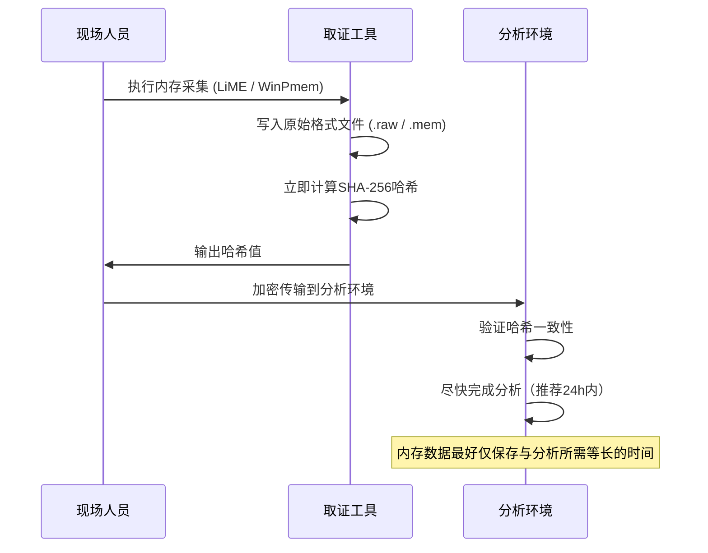
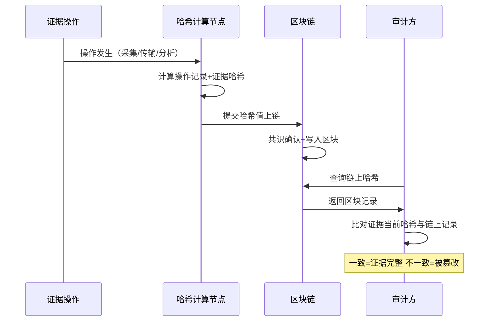

## 25.5 证据链管理实践

证据链（Chain of Custody / Chain of Evidence）是数字取证的生命线——它记录了证据从发现、采集、存储、分析到最终呈堂的完整流转过程。本章将从法律根基到实操工具，全面拆解证据链管理的每一个环节。

---

### 25.5.1 证据链的理论基础

#### 25.5.1.1 证据链的定义与法律意义

证据链本质上是一份连续的、可追溯的**书面+数字双轨记录**，它回答四个关键问题：

- **谁**接触了证据（Who）
- **何时**接触了证据（When）
- **做了什么操作**（What）
- **操作前后证据是否完整**（Integrity Proof）

法律意义上，证据链是法官和陪审团判断证据**可采性（Admissibility）**的核心依据。如果证据链出现断裂，即便证据本身内容完全正确，也可能被排除在法庭之外。这一原则在大陆法系和英美法系中均有明确体现——前者称为"证据的连续性原则"，后者称为"Chain of Custody Rule"。

#### 25.5.1.2 关键法律与标准框架

| 标准/法规 | 发布机构 | 核心要求 | 适用范围 |
|-----------|---------|---------|---------|
| ISO/IEC 27037:2012 | ISO | 数字证据的识别、收集、获取和保存指南 | 国际通用 |
| NIST SP 800-86 | NIST（美国） | 数字取证技术指南，含证据链管理 | 美国联邦机构 |
| Federal Rules of Evidence (FRE) 901 | 美国国会 | 证据鉴真要求（Authentication） | 美国联邦法院 |
| 《电子数据取证规则》（GA/T 1770-2020） | 公安部 | 电子数据取证全流程规范 | 中国 |
| 《最高人民法院关于互联网法院审理案件若干问题的规定》 | 最高法 | 电子数据真实性审查标准 | 中国 |
| ACPO Principles | ACPO（英国） | 数字证据处理的6项原则 | 英国 |
| SWGDE Best Practices | SWGDE | 数字证据标准化操作规范 | 国际执法机构 |

**核心原则——ACPO六原则：**

1. **最少操作原则**：取证人员不得对原始数据执行任何可能改变其内容或元数据的操作
2. **原始保存原则**：需要接触原始数据的人员必须经过充分培训和授权
3. **可追溯原则**：所有对证据的操作必须被完整记录并可供独立审计
4. **负责人原则**：证据链的每一环节必须指定明确的负责人
5. **完整性原则**：所有操作必须保证数字证据的完整性不受损害
6. **合规原则**：取证人员必须遵守所在司法管辖区的法律和程序要求

#### 25.5.1.3 证据链断裂的法律后果

证据链断裂在实践中并不罕见，一旦发生，后果往往是灾难性的：

- **证据被排除（Exclusion）**：法庭裁定该证据不予采信——这是最常见的后果
- **案件被驳回（Case Dismissal）**：当关键证据被排除后，控方可能无法完成举证责任
- **定罪被推翻（Conviction Overturned）**：上诉法院发现一审证据链存在问题，发回重审或直接改判
- **民事赔偿（Civil Liability）**：证据保管不当导致当事人权益受损，可追究保管方责任

**典型案例——OJ辛普森案的数字取证教训**：虽然该案主要争议不在数字证据，但其暴露的实物证据保管问题——血样标签错误、保管记录不完整——直接导致关键DNA证据被质疑，成为证据链管理的经典反面教材。数字取证领域类似的教训反复出现：2012年美国一起毒品案件中，警方硬盘镜像的SHA-1哈希值在移交时被重新计算，与原始记录不符，最终全部数字证据被排除。

---

### 25.5.2 证据标签规范

标签是证据链的"身份证"——每一份证据从诞生的第一秒起就必须拥有一个唯一且不可篡改的标识。

#### 25.5.2.1 标签内容构成

| 字段 | 说明 | 示例 |
|------|------|------|
| 证据编号 | 全局唯一，建议采用统一编码规则 | `DF-2026-00128-A` |
| 案件编号 | 关联案件档案 | `CASE-2026-0415` |
| 证据描述 | 精确说明证据内容，不含主观判断 | "嫌疑人张三的iPhone 15 Pro Max（IMEI: 3592xxxxxxxxxxx），已采集完整文件系统镜像" |
| 采集时间 | 精确到秒，采用UTC+8 | `2026-06-15 14:23:17 CST` |
| 采集地点 | 精确到物理地址 | "深圳市南山区科技南路18号，14楼1408室" |
| 采集人 | 姓名+工号+签名 | "李四（工号FOR-1024）——电子签名：LIS-2026-0615" |
| 证据类型 | 区分原始介质与镜像副本 | 原始介质 / 镜像副本(V1) / 镜像副本(V2) |
| 哈希值 | 双哈希（MD5+SHA-256） | `MD5: d41d8cd9...` / `SHA-256: e3b0c44...` |
| 证据状态 | 当前状态标识 | 已采集 / 已固定 / 已传输 / 已分析 / 已归档 / 已销毁 |
| 关联证据索引 | 关联同一案件的其他证据编号 | 关联：`DF-2026-00127`, `DF-2026-00129` |

#### 25.5.2.2 证据编号的编码规则

一个良好的证据编号体系应当体现：**案件归属、证据类型、序号与版本**。

推荐编码格式：

```text
[案件简码]-[证据类型码]-[年份]-[序号][版本后缀]
```

**类型码对照表：**

| 类型码 | 含义 |
|--------|------|
| PM | Physical Media（物理介质） |
| DI | Disk Image（磁盘镜像） |
| MM | Memory Memory（内存转储） |
| NW | Network Capture（网络流量） |
| MO | Mobile Device（移动设备） |
| CL | Cloud Evidence（云端证据） |
| LOG | Log File（日志文件） |
| DOC | Document（文档证据） |

**示例：**

- `CASE2026-PM-0001-A`：案件CASE2026的第1份物理介质证据，版本A
- `CASE2026-DI-0003-B`：同案件第3份磁盘镜像，版本B（已更新）

#### 25.5.2.3 物理标签规范

对于实物介质，标签应采用以下材料与工艺：

- **材质**：聚酯薄膜或防撕纸（不可移除型），防油防水
- **印刷**：激光打印，不可擦拭
- **固定方式**：自粘型，贴在介质**不可拆卸侧**，避免遮挡原始标签和接口
- **防篡改设计**：标签如被撕下，应留明显痕迹（如VOID字样或撕裂条纹）
- **备份标签**：同一介质应在包装袋外侧粘贴相同标签

对于光盘/U盘等小体积介质，可使用**环形标签**或**吊牌标签**，确保内容在小物件上也可读。

#### 25.5.2.4 数字标签规范

数字证据（镜像文件、日志、网络数据包）应在文件系统中嵌入元数据标签：

```yaml
# 证据元数据示例（建议嵌入到镜像文件本身或伴随的.META文件中）
evidence_id: "CASE2026-DI-0001-A"
case_id: "CASE-2026-0415"
description: "服务器/dev/sda1完整位流镜像"
acquired_by: "李四"
acquired_at: "2026-06-15T14:23:17+08:00"
device_info:
  model: "Dell PowerEdge R750"
  serial: "S1234567890"
  disk_size: "1.8TB"
hash:
  md5: "a1b2c3d4e5f6a7b8c9d0e1f2a3b4c5d6"
  sha256: "e3b0c44298fc1c149afbf4c8996fb92427ae41e4649b934ca495991b7852b855"
evidence_type: "disk_image"
status: "acquired"
```

---

### 25.5.3 证据链的完整生命周期

证据从诞生到消亡，经历六个阶段。每个阶段都是证据链上的一个环节，缺一不可。


#### 25.5.3.1 阶段一：证据采集（Acquisition）

**采集时的证据链操作：**

1. **现场拍照/录像**：证据在原始位置的状态记录，包含环境全景、证据特写、连接状态
2. **首次哈希计算**：在现场即计算原始介质的哈希值，记录于采集表单
3. **标签粘贴/数字标注**：按25.5.2节规范完成标签
4. **采集记录填写**：填写标准化的《证据采集记录单》
5. **现场见证人签名**：若无见证人，应使用执法记录仪全程录像

**现场哈希验证的实操示例：**

```bash
# Linux环境下现场计算硬盘哈希
# 注意：使用read-only模式挂载或直接对/dev设备计算
sudo sha256sum /dev/sda > /evidence/hashes/disk_sha256.txt
sudo md5sum /dev/sda >> /evidence/hashes/disk_md5.txt

# 验证结果
cat /evidence/hashes/disk_sha256.txt
# 输出：e3b0c44298fc1c149afbf4c8996fb92427ae41e4649b934ca495991b7852b855  /dev/sda
```

#### 25.5.3.2 阶段二：证据固定（Preservation）

固定阶段的目标是**创建一个可分析的工作副本**，原始介质被安全封存：

1. **Write Blocker验证**：使用硬件或软件写阻断器连接原始介质
2. **位流镜像（Bit-stream Image）**：创建原始介质的逐位副本
3. **双重哈希验证**：对镜像文件和原始介质分别计算哈希，确认完全一致
4. **原始介质封存**：将原始介质放入防静电袋，密封，双方签名封条
5. **镜像文件加密**：使用AES-256加密镜像文件，密钥由证据保管员管理

**FTK Imager镜像制作命令：**

```bash
# Windows环境——FTK Imager CLI
ftkimager.exe \\.\PHYSICALDRIVE2 D:\Evidence\CASE2026-DI-0001.E01 \
  --e01 --case-number "CASE-2026-0415" \
  --evidence-number "DI-0001" \
  --description "服务器系统盘镜像" \
  --examiner "李四" \
  --compress 1
```

**Linux环境——dd + sha256sum：**

```bash
# 使用dcfldd（增强版dd，可实时哈希）
# 安装：apt install dcfldd

dcfldd if=/dev/sda \
  hash=sha256 \
  hashwindow=10G \
  hashlog=/evidence/hashes/hash_log.txt \
  of=/evidence/images/CASE2026-DI-0001.dd \
  bs=4M \
  status=on

# 输出结果中包含每10GB的段哈希和整体哈希
```

#### 25.5.3.3 阶段三：证据存储（Storage）

存储不是简单的"放起来"，而是一个持续性的保护过程。以下按证据类型展开：

##### 物理介质存储要求

| 控制项 | 标准值 | 监控频率 | 偏离处理 |
|--------|--------|---------|---------|
| 温度 | 15-25°C | 每日 | >25°C启动备用空调，<15°C启动加热 |
| 相对湿度 | 40%-60% | 每日 | >60%启动除湿机，<40%启动加湿器 |
| 防静电 | 地板电阻<1×10^9Ω | 每月 | 重新涂导电地坪漆 |
| 防磁 | 磁场强度<3高斯 | 每季度 | 远离电机、变压器3米以上 |
| 防火 | 自动气体灭火系统 | 每半年 | 禁止使用水基灭火器 |
| 访问控制 | 双人双锁+生物识别 | 每次开门记录 | 参见访问审计日志 |

##### 数字镜像存储要求

- **加密标准**：AES-256（存储级）+ TLS 1.3（传输级）
- **冗余策略**：RAID 6 + 异地冷备份 + 云端热备份（三副本策略）
- **访问日志**：每次读取操作必须记录——谁、什么时候、读了哪个文件、是否创建了副本
- **完整性校验**：每30天自动触发全库哈希校验，与入库时的哈希值比对
- **存储格式**：推荐E01（EnCase证据文件格式，支持压缩+校验+元数据）或AFF（Advanced Forensic Format）

##### 内存转储（易失性证据）特殊处理

内存数据是取证中最易丢失的证据类型——系统关机、休眠、甚至只是长时间运行都可能导致关键数据被覆盖。处理原则：**采集即分析，存储是备选**。



#### 25.5.3.4 阶段四：证据分析（Analysis）

分析阶段的核心规则是：**永远不碰原始介质，永远记录每一次操作**。

| 原则 | 说明 | 违反后果 |
|------|------|---------|
| 仅限工作副本 | 分析只能在镜像副本上进行 | 原始介质损坏→证据灭失 |
| 操作全记录 | 每次工具调用、文件打开、关键词搜索都应有日志 | 无法证明分析过程合规 |
| 环境隔离 | 分析环境与生产网络物理隔离 | 交叉污染→证据真实性存疑 |
| 版本控制 | 分析过程中产生的任何中间产物都应有版本标识 | 无法区分分析各阶段状态 |
| 同行复核 | 关键结论应由2人独立分析并比对 | 单人误判影响结论准确性 |

**证据链中的分析记录示例：**

```yaml
analysis_log:
  - timestamp: "2026-06-16T09:00:12+08:00"
    analyst: "王五 (FOR-1025)"
    tool: "Autopsy 4.21.0"
    action: "加载镜像文件CASE2026-DI-0001.E01"
    hash_verify: "PASS"
    note: "镜像完整性验证通过"
  - timestamp: "2026-06-16T09:15:33+08:00"
    analyst: "王五 (FOR-1025)"
    tool: "Autopsy 4.21.0 - Keyword Search"
    action: "关键词搜索：[机密], [内部资料], password"
    hits: 127
    exported: "/evidence/analysis/case2026_keyword_hits.csv"
    note: "导出搜索结果供后续人工筛选"
  - timestamp: "2026-06-16T10:30:00+08:00"
    analyst: "王五 (FOR-1025)"
    tool: "Plaso (log2timeline)"
    action: "创建超级时间轴"
    output: "/evidence/analysis/case2026_timeline.csv"
```

#### 25.5.3.5 阶段五：证据呈堂（Presentation）

当证据进入法庭程序时，证据链的完整记录必须同时呈交：

1. **证据链汇总表**：从采集到分析的所有流转记录汇总，按时间线排列
2. **哈希一致性证明**：每环节的哈希校验记录，证明证据未被篡改
3. **操作日志摘要**：分析过程中的关键操作摘要，避免向法庭展示全部技术细节（容易淹没重点）
4. **专家证词**：取证人员（或独立专家）出庭说明证据链管理流程
5. **可视化呈现**：将复杂的证据链数据转化为时间轴图表，便于法官和陪审团理解

**证据链时间轴可视化示例：**

```text
2026-06-15 14:23 │采集│ 硬盘/dev/sda  哈希: SHA-256=e3b0c44...
2026-06-15 16:45 │固定│ 镜像E01创建  哈希: SHA-256=e3b0c44... ✅ 匹配
2026-06-15 16:50 │封存│ 原始介质密封  封条编号: SEAL-00128
2026-06-15 17:30 │传输│ 移交至实验室  保管员: 赵六  签名确认
2026-06-16 09:00 │分析│ 加载镜像      哈希验证: ✅ PASS
2026-06-16 15:00 │分析│ 分析完成      报告编号: RPT-2026-0415-01
2026-06-20 10:00 │呈堂│ 证据提交法院  证据编号: CASE2026-DI-0001
```

#### 25.5.3.6 阶段六：证据归档/销毁（Archive / Disposal）

| 场景 | 处理方式 | 保存期限 |
|------|---------|---------|
| 案件已结、未上诉 | 归档存储 | 结案后5年（依司法管辖区不同可能有差异） |
| 案件已上诉/再审中 | 持续保管 | 至最终裁定后3年 |
| 涉及未成年人 | 延长保存 | 至当事人年满28岁 |
| 证据已数字化且有完整哈希 | 销毁原始介质 | 销毁记录+公证文件永久保存 |
| 证据被法院要求销毁 | 第三方销毁+公证 | 销毁证书永久保存 |

**销毁流程规范：**

1. 由法务部门出具《证据销毁批准函》
2. 至少2人在场监督销毁过程
3. 全程录像/拍照取证
4. 签署《证据销毁确认书》
5. 销毁后更新证据链状态为"已销毁"，销毁记录永久留存

---

### 25.5.4 证据传输规范

证据在不同人员、不同机构或不同地点之间转移，是证据链最容易出现断裂的环节。

#### 25.5.4.1 传输单据标准模板

每次证据移交必须使用标准化表单。以下是推荐的表单字段结构：

```yaml
# 证据传输单字段定义
evidence_transfer_form:
  form_id: "TF-2026-0415-001"          # 传输单编号
  transfer_date: "2026-06-15 17:30"    # 移交时间
  transfer_location: "取证现场→实验室"  # 移交地点
  
  # 移交方信息
  sender:
    name: "李四"
    organization: "市局网安支队"
    badge: "FOR-1024"
    signature: "李四（电子签名）"
  
  # 接收方信息
  receiver:
    name: "赵六"
    organization: "电子物证实验室"
    badge: "LAB-2077"
    signature: "赵六（电子签名）"
  
  # 证据列表
  evidence_items:
    - id: "CASE2026-PM-0001"
      description: "Dell PowerEdge R750服务器（4TB SATA硬盘×8）"
      package_seal: "SEAL-00128（完好）"
      hash_md5: "a1b2c3d4e5f6..."
      hash_sha256: "e3b0c44298fc..."
    - id: "CASE2026-DI-0001"
      description: "服务器系统盘镜像文件（E01格式）"
      media: "WD 4TB加密移动硬盘（SN: WX123456）"
      hash_sha256: "9f86d081884c..."
  
  # 移交前哈希验证结果
  hash_verification:
    - evidence: "CASE2026-PM-0001"
      status: "PASS"
      verified_by: "李四+赵六"
    - evidence: "CASE2026-DI-0001"
      status: "PASS"
      verified_by: "李四+赵六"
```

#### 25.5.4.2 物理介质包装标准

| 介质类型 | 包装要求 | 运输标识 |
|---------|---------|---------|
| 硬盘（3.5/2.5寸） | 防静电袋+泡棉+硬质运输箱 | 易碎品+向上标识 |
| 固态硬盘/SSD | 防静电袋+泡棉盒 | 防静电标识 |
| 光盘/DVD/BD | 单盘盒+泡棉+防水袋 | 防刮擦标识 |
| U盘/存储卡 | 防静电袋+硬质塑料盒 | 防静电标识 |
| 手机/平板 | 法拉第袋（屏蔽信号）+泡棉箱 | 禁止信号+易碎品 |
| 纸质文档 | 防水文件袋+密封袋 | 防潮标识 |

**法拉第袋的使用**：手机等通信设备在传输过程中应放入法拉第袋，防止：
- 远程擦除命令（如Find My iPhone的远程抹除）
- 网络数据被篡改（远程注入恶意数据）
- 位置追踪干扰调查
- 接收新消息导致证据污染

#### 25.5.4.3 数字传输加密协议

推荐采用以下加密传输方案（优先级从高到低）：

| 方法 | 工具 | 适用场景 | 安全等级 |
|------|------|---------|---------|
| SFTP/SCP | OpenSSH | 局域网传输 | 高 |
| HTTPS（TLS 1.3） | Nginx/Apache | 远程传输 | 高 |
| AES-256加密后Rsync | openssl + rsync | 大文件批量传输 | 高 |
| 物理快递+加密硬盘 | — | 无法联网的环境 | 最高（物理隔离） |
| 普通邮件/微信 | — | ❌ **禁止使用** | 无加密，高危 |

#### 25.5.4.4 哈希验证实操流程

接收方收到证据后的标准验证流程：

```bash
# 步骤1：核对物理封条完整性
# 步骤2：记录包装状态（拍照存档）

# 步骤3：计算接收到的文件的哈希值
sha256sum CASE2026-DI-0001.E01 > /evidence/verify/received_sha256.txt
md5sum CASE2026-DI-0001.E01 > /evidence/verify/received_md5.txt

# 步骤4：与传输单上的哈希值比对
diff /evidence/verify/received_sha256.txt /evidence/verify/expected_sha256.txt
# 无输出 = 一致 ✅

# 步骤5：在传输单上签字确认
echo "哈希验证通过，证据接收确认——赵六（2026-06-15 17:35）" >> /evidence/log/transfer_log.txt
```

---

### 25.5.5 常见错误与误区

#### 误区1：认为哈希值计算一次就足够了

**错误理解**：只要在采集时算过哈希，以后就不用再验证了。

**纠正**：哈希值应在证据生命周期的**每个关键节点**重新验证并与初始值比对：
- 采集完成后（基准值）
- 移交时（出库前+入库后各一次）
- 分析前（加载镜像时自动验证）
- 分析后（确认分析过程未修改镜像）
- 归档时（长期存储后首次取用）
- 呈堂前（法庭出示前最后一次验证）

#### 误区2：物理介质随意堆叠

**错误做法**：将多个硬盘叠放、用普通塑料袋存放、标签贴在被遮挡面。

**纠正**：硬盘必须竖立放置（水平放置可能导致盘片变形），每个硬盘独立防静电袋，标签贴在硬盘顶部和防静电袋外侧两处。

#### 误区3：传输记录口头确认

**错误做法**：A喊一声"硬盘我拿走了"，B答"知道了"，没有书面记录。

**纠正**：**零口头移交原则**——哪怕是同一办公室内的移交，也必须有书面或电子签名记录。这是法庭上证明证据连续性的唯一凭证。

#### 误区4：缓存/临时文件被遗忘

**错误做法**：分析工具在工作目录中创建了大量临时文件和缓存，案件结束后没有清理。

**纠正**：案件结案时应执行完整的"数字清理"流程——清除分析工作站上的所有临时文件、缓存、搜索结果副本。保留的只有：原始镜像（归档）+ 分析报告（正式）+ 关键产物（经标注的导出文件）。

#### 误区5：多人协作时责任不清

**错误做法**：一个团队共同分析一份证据，大家轮流操作，但日志只记录了"团队分析"。

**纠正**：每次操作必须绑定到**个人**账户。团队协作时应使用：
- 每名分析师独立的操作系统账号
- 取证工具的多用户审计功能（如EnCase的Case Trust）
- 操作日志自动关联用户名

---

### 25.5.6 进阶：高级证据链技术

#### 25.5.6.1 区块链证据链

利用区块链的不可篡改特性，将每次证据操作的哈希值写入区块链，实现**去中心化的证据完整性证明**。



**推荐的区块链证据链平台**：
- **OpenTimestamps**：将哈希嵌入比特币区块链，成本最低
- **IBM Digital Chain**：企业级证据链管理，支持权限控制
- **Factom**：专门为证据数据设计的区块链协议
- **蚂蚁链（AntChain）**：中国司法存证常用平台，对接互联网法院

#### 25.5.6.2 数字签名与时间戳

数字签名解决"谁做了操作"的身份确认问题，时间戳解决"何时操作"的不可否认问题。

**数字签名流程：**

```bash
# 使用GPG对证据文件签名
gpg --sign --armor --output evidence.sig CASE2026-DI-0001.E01
# 验证签名
gpg --verify evidence.sig CASE2026-DI-0001.E01
```

**时间戳获取：**

```bash
# 使用RFC 3161时间戳服务器
# 安装：apt install openssl
openssl ts -query -data CASE2026-DI-0001.E01 \
  -no_nonce -sha512 -out timestamp.tsq

# 提交到TSA（Time Stamp Authority）
curl -H "Content-Type: application/timestamp-query" \
  --data-binary @timestamp.tsq \
  https://freetsa.org/tsr > timestamp.tsr

# 验证时间戳
openssl ts -verify -data CASE2026-DI-0001.E01 \
  -in timestamp.tsr -CAfile freetsa-cacert.pem
```

#### 25.5.6.3 自动化证据链管理工具

| 工具名称 | 类型 | 核心功能 | 开源/商业 |
|---------|------|---------|----------|
| **FTK Imager** | 取证采集 | 镜像制作+哈希验证+证据链文档生成 | 免费 |
| **EnCase Evidence Processor** | 证据管理 | 完整的Case Trust证据链审计系统 | 商业 |
| **Autopsy** | 取证分析 | 案例管理+时间轴+操作日志自动记录 | 开源 |
| **OpenText EnCase** | 企业级 | 支持分布式团队协作的证据链管理 | 商业 |
| **Cellebrite UFED** | 移动取证 | 针对手机证据的自动化链式管理 | 商业 |
| **X-Ways Forensics** | 综合取证 | 内置案例管理+证据标签+哈希数据库 | 商业 |
| **Chain of Custody Manager** | 专门工具 | 证据链全生命周期管理+区块链存证 | 开源/商业均有 |

#### 25.5.6.4 跨机构协作时的证据链对接

当案件涉及多个执法机构、跨省或跨国协作时，证据链的对接成为复杂挑战：

**核心问题清单：**

1. **标准差异**：不同机构使用的标签格式、编号体系不同
   - 解决方案：协商一致使用ISO 27037标准，保留各方原有编号作为辅助索引

2. **时区冲突**：跨时区传输的时间记录可能产生歧义
   - 解决方案：所有时间记录统一使用UTC+8（北京时间），并在括号内标注来源时区

3. **信任模型**：机构A是否信任机构B的哈希计算环境
   - 解决方案：引入中立第三方审计，或使用区块链存证消除信任依赖

4. **语言障碍**：跨国案件的记录使用不同语言
   - 解决方案：所有关键字段双语标注，争议字段以英语版本为准

---

### 25.5.7 证据链模板与检查清单

#### 25.5.7.1 证据采集现场记录模板

```yaml
现场证据采集记录
案件编号：________________
采集日期：________________
采集地点：________________

证据详情：
1. 证据编号：________
   证据描述：________
   证据位置：________
   采集前状态：________
   哈希值：________
   采集人：________   采集时间：________
   见证人：________   签名：________

2. ...（同上，每份证据单独一行）

现场照片/录像： □ 已拍摄   □ 已编号   □ 已归档
现场环境描述：________________________________
特殊注意事项：________________________________
```

#### 25.5.7.2 证据链完整性检查清单

- [ ] 每份证据都有唯一编号
- [ ] 每份证据的标签信息完整（含哈希值）
- [ ] 采集时已计算并记录首次哈希值
- [ ] 原始介质已安全封存（防静电袋+密封封条）
- [ ] 工作副本已从原始介质创建
- [ ] 工作副本的哈希与原始介质一致
- [ ] 所有传输都有签字确认的传输单
- [ ] 每次传输后都验证了哈希值
- [ ] 存储环境符合温湿度要求
- [ ] 存储区域有访问控制和监控记录
- [ ] 分析操作仅在工作副本上进行
- [ ] 所有分析操作都有日志记录
- [ ] 分析工作站与生产网络隔离
- [ ] 证据链记录已备份（至少双份）
- [ ] 结案后证据已按要求归档或销毁

---

### 25.5.8 本章小结

证据链管理不是取证的"后端事务"——它贯穿数字取证的每一个环节，从现场的第一张照片到法庭的最后一次质证。没有完整的证据链，再完美的技术分析也毫无意义，因为法庭不会采信一个"身份不明"的证据。

在实际工作中，建议将证据链管理融入日常操作习惯，而不是事后补录。使用自动化工具（如FTK Imager的Case管理功能或Autopsy的内置证据链记录）可以降低遗漏风险，而区块链存证则为高级场景提供了司法级的证明保障。

**核心备忘——证据链三问：**
- 这个证据**从哪里来**？（采集地点、时间、人员）
- 它**经过谁的手**？（每一环节的负责人）
- 有人**动过它吗**？（哈希值何时验证、是否一致）

如果这三个问题都能给出清晰、完整的答案，你的证据链就是经得起法庭考验的。