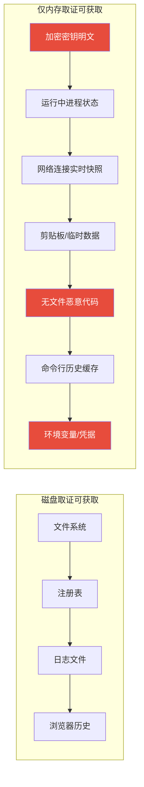
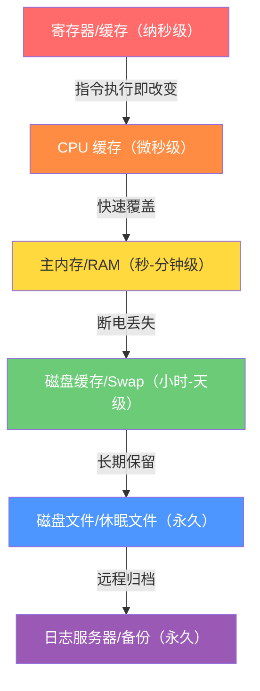
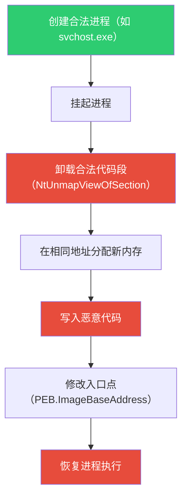
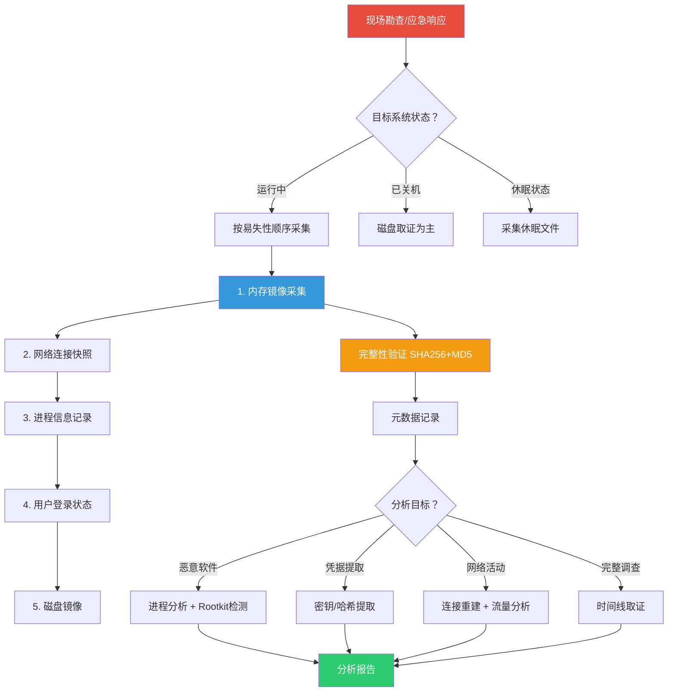

## 25.8 高级内存取证技术

内存是计算机系统中最"诚实"的证据源——操作系统无法像清理日志那样擦除内存中的运行时状态，恶意软件无法像隐藏文件那样将自身从 RAM 中完全隐匿。内存取证（Memory Forensics）通过对物理内存镜像的分析，还原系统在某一时刻的完整运行状态：哪些进程在运行、加载了哪些模块、建立了哪些网络连接、持有哪些加密密钥、执行了哪些命令。在无文件攻击日益普遍的今天，内存取证已成为数字取证的核心能力。

> **本章定位**：本章是第 25 章"数字取证"的技术高峰。前文已建立了取证的法律框架、基本原则、方法论和证据链管理基础。本章聚焦于内存这一最高易失性、最高价值的证据源，从理论到实操、从工具到对抗，构建完整的内存取证知识体系。本章内容要求读者具备操作系统原理（虚拟内存、进程管理）和基础命令行操作能力。

### 25.8.1 内存取证的理论基础

#### 为什么内存取证是不可替代的

磁盘取证处理的是静态数据——已删除的文件、注册表历史、日志记录——但攻击者已经学会了不在磁盘上留下痕迹。无文件攻击（Fileless Attack）通过以下策略完全规避磁盘取证：

| 攻击策略 | 技术实现 | 磁盘取证可见性 | 内存取证可见性 |
|----------|----------|--------------|--------------|
| 内存驻留 Shellcode | PowerShell Empire / Cobalt Strike Beacon | 不可见 | 可见 |
| 进程注入 | DLL 注入 / 反射式 DLL 加载 | 不可见 | 可见 |
| 进程镂空 | Process Hollowing / Process Doppelgänging | 仅原始文件可见 | 内存中的实际代码可见 |
| WMI 事件订阅 | 持久化通过 WMI 仓库 | 部分可见 | 运行时状态可见 |
| 注册表 Run 键 + 文件下载 | 写入后立即删除 | 删除后不可见 | 进程执行时可见 |
| 合法工具滥用（LOLBins） | 使用 powershell.exe / mshta.exe | 日志可能记录 | 进程命令行和内存状态可见 |
| JavaScript/VBScript 内存执行 | mshta.exe / wscript.exe 执行脚本 | 脚本不落盘 | 内存中可提取脚本内容 |
| .NET 反射加载 | Assembly.Load 从字节数组加载程序集 | 无文件 | 内存中可提取 IL 代码 |

根据 2024 年 SANS M-Trends 报告，超过 70% 的高级持续性威胁（APT）样本在内存中完成关键操作，包括凭据窃取、横向移动和数据外传。2023 年 CrowdStrike 全球威胁报告指出，90% 的初始入侵在 24 小时内无法通过传统端点检测发现，而内存取证可以将检测窗口缩短到分钟级。

内存中还保存着磁盘取证永远无法获取的数据：**加密密钥明文**（BitLocker VMK、DPAPI 主密钥、SSH 私钥）、**剪贴板内容**（可能包含密码或敏感信息）、**未保存的文档片段**（攻击者的临时笔记）、**网络连接的原始状态**（包括已关闭但仍有残留的连接）、**命令行历史**（cmd.exe / PowerShell 的输入缓存）。



#### 操作系统内存管理机制

理解操作系统内存管理是进行高级内存取证的前提。三大操作系统的内核数据结构各有特点，这些结构是内存分析工具解析内存镜像的"地图"：

| 特性 | Windows (x64) | Linux (x64) | macOS (x64/ARM) |
|------|--------------|-------------|-----------------|
| 内核空间起始 | 0xFFFF800000000000 | 0xFFFF800000000000 | 0xFFFFFF8000000000 |
| 进程管理结构 | EPROCESS | task_struct | proc_t |
| 模块链表 | PsLoadedModuleList | modules (list_head) | kmod_info |
| 系统调用表 | SSDT | sys_call_table | sysent |
| 网络连接结构 | _TCP_ENDPOINT / _UDP_ENDPOINT | tcp_sock / inet_connection_sock | socket / inpcb |
| 进程地址空间管理 | VAD 树（AVL 树） | mm_struct + VMA 链表 | vm_map_entry |
| 页表结构 | 4/5 级页表 | 4/5 级页表 | 4 级页表（ARM64 TTBR） |
| 默认页大小 | 4KB（大页 2MB/1GB） | 4KB（HugeTLB 可选） | 16KB（ARM64）/ 4KB（x64） |

**Windows 内存布局详解**

Windows 使用分页机制管理虚拟地址空间，64 位系统中虚拟地址空间被划分为用户空间（低 128TB）和内核空间（高 128TB）。核心结构 `EPROCESS`（Executive Process Block）是进程枚举的起点，它包含：

- **UniqueProcessId**：进程 ID（ULONG_PTR 类型，64 位系统为 8 字节）
- **InheritedFromUniqueProcessId**：父进程 ID
- **ActiveProcessLinks**：双向链表（LIST_ENTRY），链接所有活动进程——这是 `pslist` 插件的遍历基础
- **ThreadListHead**：线程链表头，链接该进程的所有 `ETHREAD` 对象
- **ObjectTable**：句柄表指针，包含该进程打开的所有内核对象
- **VadRoot**：VAD 树根节点（虚拟地址描述符），描述进程的整个虚拟地址空间布局
- **Peb**：进程环境块指针（PEB），用户态结构，包含命令行参数、环境变量、加载模块列表
- **ImageFileName**：进程名称（16 字节截断的 ANSI 字符串）
- **Token**：访问令牌指针，包含用户 SID、组 SID、权限列表
- **DirectoryTableBase**：CR3 寄存器的值，指向该进程的页表——这是地址空间转换的关键

Windows 11 22H2 引入的变化：EPROCESS 结构偏移量调整，部分字段被重命名或移除（如 `VadRoot` 在部分版本中改为 `AddressCreationLock` 附近的间接指针）。Volatility 3 通过符号表自动适配这些变化，但手动分析时需要特别注意版本差异。

**Linux 内存布局详解**

Linux 使用 `task_struct` 描述每个进程（在内核中约 6KB 大小，取决于配置选项），所有进程通过 `tasks` 双向链表和 PID 哈希表组织。关键字段包括：

- **comm**：进程名称（TASK_COMM_LEN = 16 字节）
- **pid / tgid**：线程 ID / 进程组 ID（Linux 中线程是轻量级进程，共享 tgid）
- **real_parent / parent**：父进程指针（real_parent 不会被 ptrace 修改，parent 会被）
- **mm**：指向 `mm_struct`（描述进程的地址空间，包含 VMA 链表、页表、内存统计）
- **files**：打开的文件描述符表（`files_struct`）
- **cred**：凭证结构（UID/GID/能力集），Linux 3.3+ 使用不可变的 `cred` 结构
- **nsproxy**：命名空间代理（PID/网络/挂载命名空间），容器隔离的基础
- **ptrace**：ptrace 标志位，用于检测调试器附加

Linux 5.x+ 内核的重要变化：引入 `memfd_create` 系统调用，允许创建内存中的匿名文件，恶意软件可利用此机制实现无文件持久化。`task_struct` 中的 `mm` 指针在 `memfd` 场景下可能指向特殊的内存映射，需要特别关注。

**macOS 内存布局特殊性**

macOS 基于 XNU 内核（Mach + BSD 混合架构），进程信息存储在 `proc_t` 结构中。两个独特机制影响内存取证：

1. **Mach 端口**：进程间通信基于 Mach 端口，每个端口有独立的安全令牌（task port、host port、right port），存储在内核内存中。Mach 端口是 macOS 上检测进程间异常通信的关键线索。
2. **Keychain 服务**：所有凭据（Wi-Fi 密码、证书私钥、网站密码、Apple ID 令牌）加密存储在 Keychain 数据库（`~/Library/Keychains/login.keychain-db`）中，但解密密钥（Keychain 主密码派生的密钥）缓存在用户态内存中——提取明文密码成为可能。
3. **SIP（系统完整性保护）**：从 macOS 10.11 开始，SIP 保护了关键系统目录和进程，限制了内核扩展的加载。在 macOS 10.15+ 上，SIP 进一步限制了内存取证工具的可用性。

#### 易失性数据的生命周期

NIST SP 800-86 定义了易失性数据的采集顺序（从最易失到最持久），内存取证必须遵循这一顺序以最大化证据保留：



**各层级详解**：

**第一层——寄存器与 CPU 缓存（纳秒-微秒级）**：当前正在执行的指令的临时计算结果、函数参数、返回地址、栈指针。取证几乎无法获取，除非使用硬件调试器（JTAG/ITP）或调试寄存器（DR0-DR7）。在极端场景下（如提取正在运行的加密密钥），可通过 CPU 性能计数器或侧信道攻击间接推断，但这属于高级研究领域。

**第二层——主内存/RAM（秒-分钟级）**：这是内存取证的核心目标。包含网络连接状态、进程状态、临时变量、加密密钥。数据随内存分配策略快速覆盖——当进程释放内存后，操作系统可能在几毫秒内将该页面分配给新进程。Windows 的 `VirtualFree` 和 Linux 的 `munmap` 都会触发页面回收。关键发现：即使进程已退出，如果其内存页尚未被重新分配，数据仍可在内存镜像中找到——这就是 `psscan` 插件能发现"已退出进程"的原理。

**第三层——Swap 分区/页面文件（小时-天级）**：当物理内存不足时，操作系统将不活跃的内存页交换到磁盘上的 swap 分区（Linux）或页面文件（Windows 的 `pagefile.sys`）。这些数据存活时间远长于主内存。关键价值：即使恶意进程已退出，其部分内存内容可能仍在 swap 中保留数小时甚至数天。Windows 的 `pagefile.sys` 在系统重启后不会被清空（除非启用"快速启动"的某些配置），这使得关机后的取证仍有可能获取内存数据。

**第四层——休眠文件与崩溃转储（永久）**：Windows 休眠文件 `hiberfil.sys` 保存了完整的内存快照（压缩格式，压缩率约 2:1）；崩溃转储 `memory.dmp`（完整内存转储）或 `MEMORY.DMP`（内核转储）保存了蓝屏时的内存状态。这些文件在磁盘上长期存在，是"免费"的内存镜像来源。注意：Windows 10 1809+ 的"快速启动"功能会在关机时写入类似休眠的数据，`hiberfil.sys` 可能包含关机前的内存状态。

**内存覆盖的实际影响**：分析 16GB 内存镜像时，如果目标系统在采集后继续运行了 5 分钟，可能已有 5-15% 的内存页被覆盖。这意味着分析结果反映的是"采集时刻的系统状态"，而非"事件发生时的状态"。对于时间敏感的调查，应优先采集内存。经验法则：在确认安全事件后，应在 30 秒内开始内存采集，在 5 分钟内完成采集。

#### 内存取证的学习路径

对于希望系统掌握内存取证的读者，建议遵循以下学习路径：


### 25.8.2 内存镜像采集技术

#### Windows 内存采集

Windows 平台有多种内存采集工具，选择取决于系统环境和取证需求：

| 工具 | 类型 | 格式 | 侵入性 | 适用场景 | 签名状态 |
|------|------|------|--------|----------|----------|
| WinPMEM | 内核驱动 | 原始 / AFF4 | 低 | 通用首选 | 无签名（需禁用驱动签名强制） |
| Magnet RAM Capture | 内核驱动 | 原始 | 低 | 执法机构常用 | 有签名 |
| DumpIt | 用户态 | 原始 | 中 | 快速采集 | 无签名 |
| FTK Imager | 内核驱动 | 原始 / E01 | 低 | 综合取证套件 | 有签名 |
| Belkasoft RAM Capturer | 内核驱动 | 原始 | 低 | 免费方案 | 有签名 |
| AVML | 内核驱动 | 原始 | 低 | 安全研究 | 无签名 |

> **驱动签名强制（DSE）说明**：Windows 10 1809+ 在 UEFI 安全启动环境下强制要求内核驱动签名。无签名的采集工具（如 WinPMEM）需要临时禁用 DSE（通过高级启动 → 启动设置 → 禁用驱动签名强制），这本身会改变系统状态。在法庭证据场景中，应记录 DSE 禁用的操作和恢复过程。

**WinPMEM 详细用法**：

```bash
# 下载 WinPMEM（Velocidex 项目维护，原 Rekall 项目）
# https://github.com/Velocidex/WinPMEM/releases

# 以管理员权限运行
# 基本采集（原始格式）
winpmem_mini_x64.exe memory.raw

# AFF4 格式采集（包含元数据和压缩，推荐用于正式取证）
winpmem_mini_x64.exe memory.aff4

# 指定输出路径和压缩
winpmem_mini_x64.exe --output D:\evidence\memory.aff4

# 验证采集完整性
certutil -hashfile memory.raw SHA256
certutil -hashfile memory.raw MD5

# 采集统计信息（采集速度、内存总量、缺失页数量）
# WinPMEM 在采集完成后会输出统计信息，包括：
# - Total physical memory
# - Pages read successfully
# - Pages failed (通常因硬件保护或 NUMA 节点)
```

**Magnet RAM Capture 用法**：

```bash
# 运行（无需安装，绿色工具）
MagnetRAMCapture64.exe

# GUI 模式：选择输出路径，点击 Start
# 命令行模式：
MagnetRAMCapture64.exe /accepteula /output D:\evidence\memory.raw

# 采集完成后自动计算 MD5 和 SHA1 哈希
# 输出示例：
# SHA1: a1b2c3d4e5f6...
# MD5:  1a2b3c4d5e6f...
```

**Windows 页面文件和休眠文件采集**：

```bash
# 页面文件（pagefile.sys）—— 系统运行时持续写入
# 需要管理员权限或离线访问（从另一系统挂载磁盘）
copy C:\pagefile.sys D:\evidence\pagefile.sys

# 休眠文件（hiberfil.sys）—— 休眠时写入
copy C:\hiberfil.sys D:\evidence\hiberfil.sys

# 解压休眠文件为原始内存格式（使用 Volatility 工具）
vol.py -f hiberfil.sys imagecopy --output-filename memory_from_hiber.raw

# 睡眠文件（swapfile.sys，Windows 8+）—— UWP 应用休眠数据
copy C:\swapfile.sys D:\evidence\swapfile.sys

# 注意：Windows 10 1809+ 的"快速启动"功能
# 即使正常关机，hiberfil.sys 也可能包含内存数据
# 检查快速启动是否启用：
powercfg /a  # 查看休眠是否可用
# 如果显示"休眠"可用，则快速启动可能已启用
```

#### Linux 内存采集

LiME（Linux Memory Extractor）是 Linux 平台上最成熟的内存获取工具，以内核模块方式运行，直接从内核层读取物理内存，绕过用户态访问限制。

**编译与部署**：

```bash
# LiME 要求与目标系统内核版本匹配的头文件
sudo apt install linux-headers-$(uname -r) build-essential
git clone https://github.com/504ensicsLabs/LiME.git
cd LiME/src

# 编译当前内核版本的 LiME 模块
make KVER=$(uname -r)

# 验证编译产物
file lime.ko
# 输出：ELF 64-bit LSB relocatable, x86-64, version 1 (SYSV)

# 注意：如果编译失败，常见原因：
# 1. 内核头文件版本不匹配（uname -r 与已安装的 headers 不一致）
# 2. 缺少 build-essential
# 3. 内核模块签名要求（Secure Boot 启用时）
# 解决方案：禁用 Secure Boot 或为模块签名
```

**三种采集模式**：

```bash
# 模式1：本地文件写入
# 适用于有足够存储空间的本地场景
insmod lime.ko "path=/evidence/memory.lime format=lime"

# 模式2：带完整性验证的本地写入
# 哈希验证确保镜像在传输过程中未被篡改
insmod lime.ko "path=/evidence/memory.lime format=lime \
  digest=sha256 digestpath=/evidence/hash.txt"

# 模式3：TCP 远程传输
# 适用于存储空间不足或远程取证场景
# 服务端（目标机器）：
insmod lime.ko "path=tcp:4444 format=lime"

# 接收端（取证工作站）：
nc -l -p 4444 > memory.lime
# 或使用 socat 获得更好的控制：
socat TCP-LISTEN:4444,reuseaddr FILE:memory.lime

# 模式4：UDP 传输（更快但不可靠，适合局域网）
insmod lime.ko "path=udp:192.168.1.100:4444 format=lime"

# 模式5：压缩传输（减少带宽占用）
insmod lime.ko "path=tcp:4444 format=lime compress=lzma"
```

**LiME 格式说明**：`format=lime` 使用 LiME 自定义格式，包含 40 字节头部（魔数 `0x4C694D45`、版本、起始地址、结束地址）和可选的 SHA256 哈希尾部。该格式比原始内存转储更适合取证分析，因为它保留了地址空间映射信息——每个内存段都有独立的头部记录物理地址范围。Volatility 3 原生支持 LiME 格式，无需转换。

**其他 Linux 采集方法**：

```bash
# 方法：/proc/kcore（需要 root，受限于内核配置）
# 不如 LiME 可靠，但不需要编译内核模块
# 注意：/proc/kcore 包含内核映射的整个地址空间，不仅仅是物理内存
sudo dd if=/proc/kcore of=/evidence/memory.raw bs=1M

# 方法：/dev/mem（需要内核编译 CONFIG_DEVKMEM=y）
# 现代内核默认禁用，不推荐
sudo dd if=/dev/mem of=/evidence/memory.raw bs=1M

# 远程采集通过 SSH
ssh target_host "insmod lime.ko 'path=tcp:4444 format=lime'" &
nc target_host 4444 > memory.lime

# 备选工具：AVML（Advanced Volatile Memory Extractor）
# 支持更多 Linux 发行版和内核版本
git clone https://github.com/microsoft/avml.git
cd avml
make
sudo ./avml -f /evidence/memory.bin
```

#### macOS 内存采集

| 工具 | 格式 | 侵入性 | SIP 兼容 | 适用场景 |
|------|------|--------|---------|----------|
| osxpmem | AFF4 | 低 | 需禁用 | 常规取证（推荐） |
| Apple RAWE | 原始 | 中 | 需禁用 | 内核级分析 |
| kmem_read | 原始 | 中 | 需禁用 | 研究用途 |
| 冷启动攻击 | 原始 | 高 | 不需要 | 关机场景 |

```bash
# 方法1：osxpmem（推荐）
pip install osxpmem
sudo osxpmem.mem.raw memory.aff4

# 方法2：Apple RAWE（需要禁用 SIP）
# 重启进入恢复模式（Cmd+R），打开终端执行
csrutil disable
# 重启后设置启动参数
sudo nvram boot-args="pmuflags=1"
# 重启后内存可通过 /dev/kmem 读取

# 方法3：kmem_read（macOS 10.12-10.14 有效）
# 需要禁用 SIP 和设置 boot-args
sudo kmem_read -o /evidence/memory.raw
```

**Apple Silicon 限制**：从 macOS 10.15 (Catalina) 开始，SIP 的强化版本使传统内存获取变得更加困难。在 M1/M2/M3 Mac 上，安全启动链进一步限制了内存获取能力，部分方案需要配合 DFU 模式或 Thunderbolt DMA 攻击。Apple Silicon 的内存加密（内存数据在 SoC 外部加密存储）使得物理内存提取变得几乎不可能——这是硬件级别的反取证保护。

#### 冷启动攻击（Cold Boot Attack）

冷启动攻击利用 DRAM 的数据残留特性——断电后 DRAM 中的数据不会立即消失，在低温条件下可保留数秒到数分钟。该技术主要用于提取磁盘加密密钥：

```bash
# 攻击流程：
# 1. 目标系统处于锁定/休眠状态（内存中有加密密钥）
# 2. 物理接触目标机器
# 3. 快速重启进入自定义启动介质（USB）
# 4. 在内存数据消失前转储全部 RAM
# 5. 从转储中提取加密密钥

# 低温增强（使用压缩空气或液氮）：
# - 室温下 DRAM 数据保留时间：1-5 秒
# - -50°C 下保留时间：30 秒 - 5 分钟
# - -70°C 下保留时间：5-15 分钟
# 这足以完成内存转储

# 工具：Fulldisk forensic ram dump tool
# 或者简单地使用 USB 启动的 Linux + dd
dd if=/dev/mem of=/tmp/memory.bin bs=1M

# 数据恢复：DRAM 断电后数据位会逐步翻转
# 通过多次重启和转储，可以重建原始数据
# 每次转储后，将相同位置的数据位进行多数投票
```

**适用场景**：BitLocker / FileVault / LUKS 加密卷的密钥提取。当目标系统处于锁定但未关机状态时，这是获取加密卷访问权限的少数可行方法之一。注意：现代笔记本电脑的 DRAM 刷新机制和快速启动功能显著缩短了数据残留时间，冷启动攻击的成功率正在下降。

**法律与伦理注意**：冷启动攻击需要物理接触目标设备，在大多数司法管辖区，未经授权的物理接触可能构成非法入侵。合法的冷启动攻击仅适用于执法行动（有搜查令）或授权渗透测试。

### 25.8.3 Volatility 3 架构与高级用法

#### Volatility 3 架构革新

Volatility 3 并非 Volatility 2 的简单升级，而是完全重写的框架：

| 维度 | Volatility 2 | Volatility 3 |
|------|------------|------------|
| 语言 | Python 2/3 混合 | Python 3（3.8+） |
| 插件系统 | 继承 `commands.Command` | 继承 `PluginInterface` |
| 符号表 | 格式自定义（profile） | 标准 DWARF/PDB 解析，自动下载 |
| 自动化 | 需手动指定 `--profile` | 自动识别操作系统版本 |
| 性能 | 阻塞 I/O | 异步 I/O + 分层缓存 |
| 命令格式 | `vol.py --profile=... -f file plugin` | `vol.py -f file plugin` |
| 地址空间 | 手动构建地址空间链 | 自动构建 TranslationLayer |
| 输出格式 | 仅文本 | 支持 JSON / CSV / XML / 文本 |
| 插件数量 | ~100 个 | ~200+ 个（社区贡献） |

**迁移要点**：Volatility 2 的许多插件名称在 Volatility 3 中需要加上操作系统前缀——`pslist` 变为 `windows.pslist`，`linux.pslist` 或 `mac.pslist`。Volatility 2 的 `--profile` 参数在 Volatility 3 中不再需要，框架会自动检测操作系统版本并下载匹配的符号表。

**安装与配置**：

```bash
# 安装 Volatility 3
pip3 install volatility3

# 验证安装
vol.py --help

# 符号表自动下载机制
# Volatility 3 首次分析时自动下载对应操作系统的符号表
# 符号表存储路径：~/.cache/volatility3/

# 手动下载符号表（网络受限环境）
# 从 https://downloads.volatilityfoundation.org/volatility3/symbols/ 下载
# 复制到 ~/.cache/volatility3/symbols/

# 配置代理（网络受限环境）
export HTTP_PROXY=http://proxy.company.com:8080
export HTTPS_PROXY=http://proxy.company.com:8080

# 输出格式选项
vol.py -f memory.dmp windows.pslist --output json > pslist.json
vol.py -f memory.dmp windows.pslist --output csv > pslist.csv
vol.py -f memory.dmp windows.pslist --output xml > pslist.xml
```

#### 核心分析命令详解

**Windows 内存分析**：

```bash
# ===== 进程分析 =====
# 进程列表（基于 EPROCESS 双向链表）
vol.py -f memory.dmp windows.pslist
# 输出：PID, PPID, ImageFileName, Offset, Threads, Handles, SessionId

# 进程树（父子关系可视化）
vol.py -f memory.dmp windows.pstree
# 输出：树形结构，缩进表示父子关系
# 异常检测：注意异常的父子关系（如 explorer.exe → powershell.exe → cmd.exe）

# 隐藏进程检测（基于 EPROCESS 链表 vs 扫描）
# pslist 遍历链表，psscan 扫描内存特征
# 两者结果的差异即为隐藏进程
vol.py -f memory.dmp windows.psscan
# 输出：包括被 Unlink 的隐藏进程

# 进程命令行参数
vol.py -f memory.dmp windows.cmdline
# 输出：PID, Process, Args（完整的命令行参数）
# 取证价值：PowerShell 的 -EncodedCommand 参数可能包含恶意载荷

# 进程环境变量
vol.py -f memory.dmp windows.envars
# 输出：PID, Process, Block, Variable, Value
# 取证价值：查找 SSLKEYLOGFILE、HTTP_PROXY 等可疑环境变量

# ===== 网络分析 =====
# 网络连接（TCP/UDP/监听端口）
vol.py -f memory.dmp windows.netscan
# 输出：Offset, Proto, LocalAddr, LocalPort, ForeignAddr, ForeignPort, State, PID, Owner

# 导出网络连接的原始数据包
vol.py -f memory.dmp windows.netscan --dump

# ===== 模块分析 =====
# 已加载模块列表
vol.py -f memory.dmp windows.modules
# 输出：Base, Size, Name, File

# 导出模块文件（用于哈希验证或恶意代码分析）
vol.py -f memory.dmp windows.modules --dump

# PE 文件头分析
vol.py -f memory.dmp windows.pefile

# ===== 注册表分析 =====
# 列出内存中的注册表 hive
vol.py -f memory.dmp windows.registry.hivelist

# 读取特定注册表键
vol.py -f memory.dmp windows.registry.printkey \
  --key "Software\Microsoft\Windows\CurrentVersion\Run"

# 提取 SAM 数据库（用户账户哈希）
vol.py -f memory.dmp windows.hashdump

# ===== 文件系统分析 =====
# 扫描内存中的文件对象
vol.py -f memory.dmp windows.filescan
# 输出：文件对象的偏移量、名称、大小

# 导出文件对象
vol.py -f memory.dmp windows.dumpfiles --pid <PID>
```

**Linux 内存分析**：

```bash
# 首先确认内核符号信息
vol.py -f memory.lime linux.banner
# 输出：内核版本字符串，如 "Linux version 5.15.0-..."

# 进程列表
vol.py -f memory.lime linux.pslist
# 输出：PID, PPID, UID, COMM, Start, Threads

# 进程树
vol.py -f memory.lime linux.pstree

# 网络连接
vol.py -f memory.lime linux.netscan

# 命令行历史（bash 进程内存中的 .bash_history 缓存）
vol.py -f memory.lime linux.bash
# 输出：进程名、PID、命令历史

# 内核模块列表
vol.py -f memory.lime linux.lsmod

# Rootkit 检测：系统调用表完整性
vol.py -f memory.lime linux.check_syscall
# 输出：调用号、符号名、预期地址、实际地址

# 内核模块完整性检查
vol.py -f memory.lime linux.check_modules
# 输出：模块名、磁盘路径、内存哈希、磁盘哈希

# 容器检测（Linux 5.x+）
vol.py -f memory.lime linux.cgroups
# 输出：cgroup 信息，可用于识别容器化进程
```

**macOS 内存分析**：

```bash
vol.py -f memory.aff4 mac.pslist
vol.py -f memory.aff4 mac.pstree
vol.py -f memory.aff4 mac.netscan

# macOS 特有：Keychain 数据提取
vol.py -f memory.aff4 mac.keychain
# 输出：服务名、账户名、密码明文、证书信息

# Mach 端口分析（进程间通信审计）
vol.py -f memory.aff4 mac.machtables
```

#### 自定义插件开发

Volatility 3 的插件框架基于三个核心抽象：`TranslationLayer`（地址转换层）、`ObjectTemplate`（对象模板）和 `PluginInterface`（插件接口）。

**基础插件模板**：

```python
from volatility3.framework import interfaces, renderers
from volatility3.framework.configuration import requirements
from volatility3.framework.objects import utility
from volatility3.plugins.windows import pslist
import re
import math
from collections import Counter

class MemScanner(interfaces.plugins.PluginInterface):
    """自定义内存扫描插件
    
    扫描所有进程的 VAD 树，查找符合特定模式的数据。
    支持正则匹配、熵值分析和字符串提取。
    可用于检测加密数据、Shellcode 特征或敏感信息残留。
    """
    
    _required_framework_version = (2, 0, 0)
    _version = (1, 0, 0)

    @classmethod
    def get_requirements(cls):
        return [
            requirements.TranslationLayerRequirement(name='primary'),
            requirements.SymbolTableRequirement(name='nt_symbols'),
            requirements.IntRequirement(
                name='min-size',
                description='最小匹配大小（字节）',
                default=16,
                optional=True
            ),
            requirements.StringRequirement(
                name='pattern',
                description='正则表达式搜索模式',
                optional=True
            ),
            requirements.BooleanRequirement(
                name='entropy',
                description='启用熵值分析（检测加密/压缩数据）',
                optional=True,
                default=False
            ),
            requirements.IntRequirement(
                name='entropy-threshold',
                description='熵值阈值（0-8，默认 7.0）',
                optional=True,
                default=70,  # 表示 7.0，除以 10
            ),
        ]
    
    @staticmethod
    def calculate_entropy(data):
        """计算数据块的香农熵（0-8 bits/byte）"""
        if not data:
            return 0.0
        freq = Counter(data)
        length = len(data)
        entropy = -sum(
            (count / length) * math.log2(count / length)
            for count in freq.values()
        )
        return round(entropy, 2)

    def run(self):
        kernel = self.context.modules[self.config['primary']]
        filter_func = pslist.PsList.create_pid_filter(
            self.config.get('pid', None)
        )
        
        results = []
        for proc in pslist.PsList.list_processes(
            self.context,
            kernel.layer_name,
            kernel.symbol_table_name,
            filter_func=filter_func
        ):
            proc_id = proc.UniqueProcessId
            proc_name = utility.array_to_string(proc.ImageFileName)
            proc_layer = self.context.layers[proc.add_process_layer()]
            
            for vad in proc.get_vad_root().traverse():
                start = vad.get_start()
                end = vad.get_end()
                size = end - start
                
                if size < self.config.get('min-size', 16):
                    continue
                
                try:
                    data = proc_layer.read(start, min(size, 1024*1024))
                    
                    # 模式匹配
                    if self.config.get('pattern'):
                        pattern = re.compile(
                            self.config.get('pattern').encode()
                        )
                        if not pattern.search(data):
                            continue
                    
                    # 熵值分析
                    if self.config.get('entropy'):
                        entropy = self.calculate_entropy(data[:4096])
                        threshold = self.config.get(
                            'entropy-threshold', 70
                        ) / 10.0
                        if entropy < threshold:
                            continue
                        results.append((
                            proc_id, proc_name, hex(start), 
                            size, f"entropy={entropy}"
                        ))
                    else:
                        results.append((
                            proc_id, proc_name, hex(start), size, ""
                        ))
                except Exception:
                    continue
        
        return renderers.TreeGrid(
            [
                ("PID", int), ("进程名", str), ("地址", str), 
                ("大小", int), ("备注", str)
            ],
            results
        )
```

**开发与测试流程**：

```bash
# 1. 将插件文件放入 Volatility 3 插件目录
cp mem_scanner.py volatility3/plugins/windows/

# 2. 测试：查找所有高熵值内存区域（可能是加密数据）
vol.py -f memory.dmp memscanner --entropy --entropy-threshold 70

# 3. 测试：查找包含特定模式的内存区域
vol.py -f memory.dmp memscanner --pattern "password|secret|key"

# 4. 测试：仅分析特定进程
vol.py -f memory.dmp memscanner --pid 1234 --min-size 1024
```

**高级插件技巧**：

- 使用 `self.context.symbol_space` 访问符号表，按名称查找任意内核结构
- 使用 `add_process_layer()` 为每个进程创建独立的地址转换层，避免跨进程读取错误
- 使用 `self.context.layers` 访问物理层和虚拟层，支持嵌套地址转换（如 WoW64 进程）
- 对于大内存镜像（>32GB），在 `run()` 中使用生成器（`yield`）而非列表积累结果
- 使用 `@interfaces.plugins.PluginInterface.version` 装饰器声明插件版本兼容性

#### Volatility 3 常见问题排查

| 错误信息 | 原因 | 解决方案 |
|----------|------|----------|
| `No suitable address space mapping found` | 内存镜像格式不被识别 | 转换格式：`vol.py -f image.raw imagecopy --output-filename image.lime` |
| `Requested symbol not found` | 内核版本符号表缺失 | 手动下载符号表到 `~/.cache/volatility3/symbols/` |
| `Layer is not memory mapped` | 进程地址空间未映射的区域 | 增加 `--min-size` 过滤，或忽略此错误（正常现象） |
| 分析速度极慢（>16GB 镜像） | 大量随机 I/O | 使用 SSD 存储；启用缓存 `--cache-path /tmp/vol_cache` |
| `PDB matching failed` | PDB 符号服务器不可达 | 配置代理或手动下载 `ntkrnlmp.pdb` |
| Python 内存不足 | 大镜像 + 复杂插件 | 使用 64 位 Python，增加系统内存，或分段分析 |

### 25.8.4 加密密钥提取实战

内存中存储着大量加密密钥——这是磁盘取证无法触及的领域。密钥必须驻留内存才能处理加解密操作，这是加密系统的根本限制。

#### 密钥残留场景

| 密钥类型 | 存储位置 | 提取难度 | 实战价值 |
|----------|----------|----------|----------|
| BitLocker VMK | 内核内存 | 中 | 解密整个系统卷 |
| VeraCrypt 主密钥 | 内核/用户内存 | 中 | 解密挂载的加密卷 |
| DPAPI 主密钥 | lsass.exe 进程内存 | 低 | 解密所有 DPAPI 保护的数据 |
| 浏览器保存的密码 | chrome.exe / firefox.exe 内存 | 低 | 获取网站凭据 |
| SSH 私钥 | ssh-agent 进程内存 | 低 | 远程服务器访问 |
| TLS 会话密钥 | lsass.exe / nginx 进程内存 | 中 | 解密网络流量 |
| Wi-Fi 密码 | Windows WLAN 服务内存 | 低 | 网络访问 |
| GPG 私钥 | gpg-agent 进程内存 | 中 | 解密 GPG 加密数据 |
| Kubernetes Service Account Token | kubelet 进程内存 | 低 | 集群权限提升 |

#### BitLocker 密钥提取

```bash
# BitLocker 工作原理：
# 1. 用户输入密码/插入 USB 密钥 → 解密 VMK（Volume Master Key）
# 2. VMK 解密 FVEK（Full Volume Encryption Key）
# 3. FVEK 用于加解密磁盘扇区
# 系统运行期间，VMK 和 FVEK 都驻留在内核内存中

# 使用 Volatility 3 提取 BitLocker 密钥
vol.py -f memory.dmp windows.bitlocker
# 输出：VMK（Volume Master Key）、FVEK（Full Volume Encryption Key）
# 使用提取的密钥可以直接挂载加密卷

# 备选工具：BitLocker Sleuth Kit
# 直接在内存镜像中搜索 BitLocker 密钥特征
python3 bitlocker_sleuth.py memory.dmp
```

#### DPAPI 主密钥提取

```bash
# DPAPI（Data Protection API）工作原理：
# 1. 用户登录 → 系统使用用户密码派生 DPAPI 主密钥
# 2. 主密钥加密存储在 %APPDATA%\Microsoft\Protect\<SID>\ 下
# 3. 应用程序使用主密钥加密敏感数据（浏览器密码、Wi-Fi 密码等）
# 4. 主密钥在 lsass.exe 进程内存中缓存为明文

# 提取 DPAPI 主密钥
vol.py -f memory.dmp windows.dpapi
# 输出：MasterKey GUID + 明文 Master Key

# 使用 mimikatz 集成插件提取凭据
vol.py -f memory.dmp windows.hashdump
# 输出：SAM 数据库中的 NTLM 哈希

vol.py -f memory.dmp windows.lsadump
# 输出：LSA Secrets（服务账户密码、自动登录密码等）
```

#### TrueCrypt/VeraCrypt 密钥提取

```bash
# TrueCrypt/VeraCrypt 在挂载状态下，主密钥保存在内存中
# 密钥位于驱动内核内存中，可通过特定签名定位

vol.py -f memory.dmp windows.truecrypt
# 输出：卷密码 + 主密钥 + 加密算法

# 手动搜索密钥特征（当插件不可用时）
# TrueCrypt 密钥区有特定的字节模式
python3 -c "
import sys
data = open(sys.argv[1], 'rb').read()
# TrueCrypt 密钥调度特征
tc_signature = b'\\x54\\x72\\x75\\x65\\x43\\x72\\x79\\x70\\x74'
offset = data.find(tc_signature)
if offset != -1:
    print(f'TrueCrypt key area found at offset: 0x{offset:x}')
" memory.dmp
```

#### 浏览器和 SSH 密钥提取

```bash
# 浏览器密码提取
# Chrome 在用户查看密码时，会在内存中短暂持有明文
vol.py -f memory.dmp windows.memmap --pid <chrome_pid> --dump
# 使用 strings 提取可能的密码
strings pid.<chrome_pid>.dmp | grep -E 'password|passwd|secret'

# SSH 私钥提取
# ssh-agent 在调用时将解密后的私钥缓存在内存中
vol.py -f memory.dmp linux.bash  # 查找 ssh-agent 的 PID
vol.py -f memory.dmp linux.proc_maps --pid <ssh_agent_pid>
# 使用 Volatility 的 procmemdump 导出进程内存
vol.py -f memory.dmp linux.proc.mem --pid <ssh_agent_pid> --dump

# TLS 会话密钥提取（用于解密网络流量）
# NSS（Firefox）会将 TLS 密钥写入 SSLKEYLOGFILE 环境变量指定的文件
# 如果该环境变量存在，密钥文件路径可能在进程内存中
vol.py -f memory.dmp windows.envars | grep SSLKEYLOGFILE
```

**关键注意事项**：内存镜像的采集必须在系统运行状态下进行。采集过程中尽量减少对目标系统内存的写入——使用只读的采集工具，避免在目标系统上安装软件或复制大文件。

### 25.8.5 恶意软件内存痕迹分析

现代恶意软件越来越倾向于"无文件"运行——全部代码驻留内存，不落盘，不写注册表。内存取证是检测此类威胁的唯一途径。

#### 进程镂空（Process Hollowing）检测

进程镂空是最常见的内存驻留技术：



**检测原理**：比较内存中的进程映像与磁盘文件。如果进程被镂空，内存中的代码与磁盘上的合法文件不一致。

```bash
# 检测进程镂空
vol.py -f memory.dmp windows.hollowfind
# 输出：内存地址、合法路径、实际内存哈希、磁盘哈希、差异百分比

# DLL 注入检测
# 列出进程加载的模块，对比正常模块列表
vol.py -f memory.dmp windows.ldrmodules
# 输出：每个模块的加载基址、大小、路径、是否在 PEB 中可见
# 异常标志：在内存中存在但 PEB 模块列表中不可见的模块

# 内核 Rootkit 检测：SSDT 钩子
vol.py -f memory.dmp windows.check_syscall
# 输出：系统调用号、预期地址、实际地址、是否被钩取
# 异常标志：地址指向非内核模块的系统调用

# 内核模块完整性
vol.py -f memory.dmp windows.modules --dump
# 导出所有内核模块，用于后续哈希验证
```

**进程镂空的变体检测**：

```bash
# Process Doppelgänging（利用 NTFS 事务）
# 原理：在 NTFS 事务中修改文件，创建 section 对象，回滚事务
# 检测方法：查找具有 IMAGE_SCN_MEM_EXECUTE 但无文件映射的内存区域
vol.py -f memory.dmp windows.vadinfo --pid <suspicious_pid>
# 查找 VadType 为 VadDeviceMap 或 VadNone 且保护属性含 EXECUTE 的条目

# Process Herpaderping（利用文件操作时间窗口）
# 检测方法：比较进程的文件映像时间戳与文件系统记录
vol.py -f memory.dmp windows.filescan | grep -i "<process_name>"
```

#### 无文件恶意代码检测

```bash
# PowerShell 脚本块日志（如果启用了 ScriptBlock Logging）
# 内存中可能保留已执行的 PowerShell 脚本片段
vol.py -f memory.dmp windows.pslist | grep -i powershell
vol.py -f memory.dmp windows.memmap --dump --pid <powershell_pid>
strings pid.<powershell_pid>.dmp | grep -i "invoke-|download|IEX|encodedcommand"

# .NET 程序集反射加载检测
# .NET 运行时将编译后的 IL 代码缓存在内存中
vol.py -f memory.dmp windows.malfind
# 输出：可疑内存区域的地址、保护属性、前 64 字节（用于判断是否为 PE/Shellcode）
# 标志：PAGE_EXECUTE_READWRITE 保护 + 无文件映射 + PE 头或 Shellcode 特征
```

#### YARA 规则扫描内存

YARA 是安全研究中广泛使用的模式匹配工具，可用于在内存镜像中扫描恶意软件特征。这是将威胁情报（IOC）转化为实际检测能力的关键技术。

```bash
# 安装 YARA
pip install yara-python

# 使用 YARA 扫描内存镜像
# 基本扫描
yara -r rules/ memory.dmp

# 扫描特定进程内存
# 先用 Volatility 导出进程内存
vol.py -f memory.dmp windows.pslist
vol.py -f memory.dmp windows.dumpfiles --pid <suspicious_pid>
# 然后用 YARA 扫描导出的内存
yara -r rules/ pid.<suspicious_pid>.dmp

# 示例 YARA 规则（检测 Cobalt Strike Beacon）
# 保存为 beacon.yar
rule Cobalt_Strike_Beacon {
    meta:
        description = "Detect Cobalt Strike Beacon in memory"
        author = "Security Researcher"
        date = "2024/01/01"
    strings:
        $beacon = "beacon" nocase
        $stager = "stager" nocase
        $sleep = { 8B 45 FC 8B 55 08 }  # 典型 Beacon 睡眠循环
    condition:
        2 of them
}

# 扫描
yara beacon.yar memory.dmp
```

#### 网络活动重建

```bash
# 网络连接完整列表
vol.py -f memory.dmp windows.netscan --dump
# 输出：建立的连接、监听端口、进程关联

# 从内存中提取的原始数据包可能包含：
# - DNS 查询记录（即使使用加密 DNS，本地缓存仍在内存中）
# - HTTP 请求/响应片段
# - SMTP 通信内容
# - C2 通信协议数据

# 注册表内存分析
# 内存中的注册表 hive 可能包含未持久化的恶意配置
vol.py -f memory.dmp windows.registry.hivelist
vol.py -f memory.dmp windows.registry.printkey \
  --key "Software\Microsoft\Windows\CurrentVersion\Run"
vol.py -f memory.dmp windows.registry.printkey \
  --key "Software\Microsoft\Windows\CurrentVersion\RunOnce"

# 命令行历史提取
vol.py -f memory.dmp windows.cmdline
vol.py -f memory.dmp windows.consoles
# cmd.exe / powershell.exe 的命令历史缓存在进程内存中
```

#### 堆喷射（Heap Spraying）检测

堆喷射通过在进程堆中分配大量包含 Shellcode 的内存块，使得跳转到任意大地址时都能命中恶意代码：

```python
# 堆喷射检测指标
def detect_heap_spraying(memory_data):
    """检测堆喷射的四个关键指标"""
    indicators = {}
    
    # 指标1：异常高的堆内存占用
    # 正常进程堆使用量有合理范围，堆喷射导致异常膨胀
    heap_size = len(memory_data)
    indicators['heap_size_anomaly'] = heap_size > 100 * 1024 * 1024  # >100MB
    
    # 指标2：重复的内存模式
    # 大量分配包含相同或相似内容的内存块
    chunk_size = 4096
    chunks = [
        memory_data[i:i+chunk_size] 
        for i in range(0, min(len(memory_data), 10*1024*1024), chunk_size)
    ]
    unique_chunks = len(set(chunks))
    indicators['repetition_ratio'] = 1 - (unique_chunks / max(len(chunks), 1))
    
    # 指标3：高熵值区域
    # 加密/压缩的 Shellcode 通常具有高熵值（>7.5 bits/byte）
    entropy = calculate_shannon_entropy(memory_data[:65536])
    indicators['high_entropy'] = entropy > 7.5
    
    # 指标4：NOP 滑板特征
    # 大量连续的 NOP 指令（0x90）或等效指令
    nop_count = memory_data.count(0x90)
    indicators['nop_sled'] = nop_count > len(memory_data) * 0.1
    
    return indicators
```

### 25.8.6 高级内存分析技术

#### 池标签扫描（Pool Tag Scanning）

Windows 内核使用池（Pool）分配器管理内核内存。每个分配块的头部包含一个 4 字节的标签（Tag），标识该内存块的用途。通过扫描特定标签，可以在不依赖进程链表的情况下定位内核对象——这对检测被 Rootkit 隐藏的进程尤为关键。

```python
# 常见内核池标签
POOL_TAGS = {
    'Proc': 'EPROCESS 进程对象',
    'Thre': 'ETHREAD 线程对象',
    'File': 'FILE_OBJECT 文件对象',
    'Key ': 'CM_KEY_NODE 注册表键',
    'TCPa': 'TCP_ENDPOINT TCP连接',
    'UDPa': 'UDP_ENDPOINT UDP连接',
    'MmSt': 'MMPTE 页表项',
    'NtFs': 'NTFS 缓存对象',
    'Toke': 'TOKEN 权限令牌',
    'Dri9': 'DRIVER_OBJECT 驱动对象',
    'Obtb': 'OBJECT_TYPE 对象类型',
    'MmCi': 'MM_SECTION 段对象',
}

def scan_pool_tags(memory_file, target_tags=None):
    """扫描内存镜像中的池标签
    
    原理：池分配器在每个块头部写入 4 字节标签。
    通过线性扫描内存查找这些标签，可以发现所有池分配的对象，
    包括被从进程链表中 Unlink 的隐藏进程。
    """
    if target_tags is None:
        target_tags = list(POOL_TAGS.keys())
    
    matches = []
    chunk_size = 4096 * 256  # 每次读取 1MB
    
    with open(memory_file, 'rb') as f:
        offset = 0
        while True:
            data = f.read(chunk_size)
            if not data:
                break
            
            for i in range(len(data) - 4):
                tag = data[i:i+4]
                if tag in [t.encode() for t in target_tags]:
                    # 提取标签后的上下文信息
                    context = data[max(0,i-16):i+20]
                    actual_offset = offset + i
                    matches.append({
                        'offset': actual_offset,
                        'tag': tag.decode('ascii', errors='replace'),
                        'description': POOL_TAGS.get(
                            tag.decode('ascii', errors='replace'), '未知'
                        ),
                        'context_hex': context.hex()
                    })
            
            offset += len(data)
    
    return matches
```

**应用场景**：当进程被 Rootkit 从 `ActiveProcessLinks` 双向链表中摘除（Unlinking）时，`windows.pslist` 遍历链表会遗漏该进程。但 EPROCESS 对象仍然存在于内核池中，池标签扫描可以发现这些"孤儿"进程。结合 `windows.psscan`（基于特征扫描）可以进一步提高检测率。

#### VAD（Virtual Address Descriptor）深度分析

VAD 树是 Windows 管理进程虚拟地址空间的核心结构——一棵自平衡的 AVL 树，每个节点描述一段连续的虚拟地址区域：

```bash
# 输出指定进程的完整 VAD 树
vol.py -f memory.dmp windows.vadinfo --pid 1234
# 输出：VAD 地址、起始/结束地址、保护属性、映射文件名、类型

# 导出所有可执行内存区域（用于恶意代码分析）
vol.py -f memory.dmp windows.vaddump --pid 1234
# 将每个 VAD 区域导出为独立文件

# VAD 树遍历（检测异常结构）
vol.py -f memory.dmp windows.vadwalk --pid 1234
# 输出：树形结构，可发现被篡改的 VAD 节点
```

**VAD 分析的取证价值**：

| VAD 特征 | 正常含义 | 异常含义 |
|----------|----------|----------|
| PAGE_EXECUTE_READWRITE + 无文件映射 | 可能是 JIT 编译（合法） | 高度可疑——可能是 Shellcode |
| PAGE_EXECUTE_WRITECOPY + 有文件映射 | 正常 DLL 加载 | 文件可能被篡改 |
| 大量连续的 PAGE_READONLY 无文件映射 | 可能是堆数据 | 可能是加密的 Shellcode |
| VAD 树节点数量异常（>10000） | 大型应用正常 | 可能是堆喷射 |
| 非标准保护属性（如 PAGE_GUARD + EXECUTE） | 极少见 | 可能是反调试或反分析技术 |

```python
# VAD 异常检测逻辑
def analyze_vad_anomalies(vad_entries):
    """分析 VAD 条目，标记可疑区域"""
    suspicious = []
    for vad in vad_entries:
        protection = vad['protection']
        has_file = bool(vad.get('file_name'))
        
        # 可执行 + 可写 + 无文件映射 = 高度可疑
        if 'EXECUTE' in protection and 'WRITE' in protection and not has_file:
            suspicious.append({
                'address': vad['start'],
                'size': vad['end'] - vad['start'],
                'reason': 'RWX 无文件映射（可能是 Shellcode）',
                'severity': 'HIGH'
            })
        
        # 可执行 + 保护属性与文件映射不匹配
        if has_file and 'EXECUTE' in protection:
            # 进一步检查：文件映像是否与磁盘一致
            suspicious.append({
                'address': vad['start'],
                'file': vad['file_name'],
                'reason': '可执行文件映射（需验证磁盘一致性）',
                'severity': 'MEDIUM'
            })
    
    return suspicious
```

#### 熵值分析（Entropy Analysis）

香农熵是衡量数据随机性的指标，取值范围 0-8 bits/byte。不同数据类型有特征性的熵值范围：

| 数据类型 | 典型熵值 | 说明 |
|----------|----------|------|
| 纯文本 / 代码 | 3.5 - 5.0 | 低熵，结构化数据 |
| 已编译的 PE/ELF | 5.5 - 6.5 | 中熵，含代码和数据段 |
| 压缩数据（ZIP/GZIP） | 7.0 - 7.5 | 高熵，接近随机 |
| 加密数据（AES） | 7.9 - 8.0 | 极高熵，统计上不可区分于随机 |
| 未初始化内存 | 0 或接近 0 | 全零或特定模式 |
| NOP 滑板 | 接近 0 | 大量重复字节 |

```python
import math
from collections import Counter

def calculate_shannon_entropy(data):
    """计算数据的香农熵（bits/byte）"""
    if not data:
        return 0.0
    freq = Counter(data)
    length = len(data)
    return -sum(
        (count / length) * math.log2(count / length)
        for count in freq.values()
    )

def entropy_scan(memory_file, block_size=4096, threshold=7.5):
    """扫描内存镜像，标记高熵区域
    
    高熵区域（>7.5）通常表示：
    - 加密密钥或加密数据
    - 压缩的 Shellcode
    - 隐藏的通信内容
    """
    high_entropy_regions = []
    
    with open(memory_file, 'rb') as f:
        offset = 0
        while True:
            block = f.read(block_size)
            if not block:
                break
            
            entropy = calculate_shannon_entropy(block)
            if entropy > threshold:
                high_entropy_regions.append({
                    'offset': offset,
                    'size': block_size,
                    'entropy': entropy,
                    'preview': block[:32].hex()
                })
            
            offset += block_size
    
    return high_entropy_regions
```

#### 时间线取证（Timeline Forensics）

内存时间线取证将内存中的所有事件按时间排序，构建完整的攻击链时间线。这是高级调查的核心方法——通过事件的时间关联，可以还原攻击者的行为序列。

```bash
# Volatility 3 时间线分析
vol.py -f memory.dmp timeliner
# 输出：时间戳、事件类型、进程、详细信息

# 时间线分析工作流（五步法）：
# 第1步：进程时间线
vol.py -f memory.dmp windows.pslist
# 记录每个进程的创建时间（CreateTime 字段）

# 第2步：网络连接时间线
vol.py -f memory.dmp windows.netscan
# 记录每个连接的建立时间

# 第3步：文件访问时间线
vol.py -f memory.dmp windows.filescan
# 记录文件对象的创建/访问时间

# 第4步：注册表修改时间线
vol.py -f memory.dmp windows.registry.hivelist
vol.py -f memory.dmp windows.registry.printkey --key "Software\Microsoft\Windows\CurrentVersion\Run"

# 第5步：合并时间线，标识异常窗口
# 异常标志：
# - 短时间内大量进程创建和退出
# - 非工作时间的进程活动
# - 进程创建 → 网络连接 → 进程退出 的快速序列
# - 异常的父子进程关系（如 winword.exe → powershell.exe）
```

**时间线分析的攻击链还原示例**：

```python
# 攻击链还原逻辑
ATTACK_CHAIN_INDICATORS = {
    'initial_access': [
        # Outlook/Word/Excel 创建子进程 → 可能是钓鱼攻击
        ('parent_name', ['OUTLOOK.EXE', 'WINWORD.EXE', 'EXCEL.EXE']),
        ('child_name', ['cmd.exe', 'powershell.exe', 'wscript.exe']),
    ],
    'execution': [
        # PowerShell 下载并执行
        ('process', 'powershell.exe'),
        ('cmdline_pattern', 'downloadstring|IEX|invoke-expression|encodedcommand'),
    ],
    'persistence': [
        # Run 键注册
        ('registry_key', 'CurrentVersion\\\\Run'),
        # 计划任务
        ('process', 'schtasks.exe'),
    ],
    'lateral_movement': [
        # WMI/PSExec 远程执行
        ('process', ['wmic.exe', 'psexesvc.exe']),
        ('network', '445'),  # SMB
    ],
    'exfiltration': [
        # 数据外传
        ('process', ['7z.exe', 'rar.exe', 'curl.exe']),
        ('network', ['443', '8080']),  # HTTPS
    ]
}
```

**实际案例：APT29 攻击链还原**

2020 年，安全研究人员通过分析内存镜像还原了 APT29（Cozy Bear）对某政府机构的攻击链：

1. **T+00:00**：Outlook 打开恶意附件 → `WINWORD.EXE` 创建 `powershell.exe` 子进程
2. **T+00:02**：PowerShell 下载第二阶段载荷（通过 `Invoke-WebRequest`）
3. **T+00:05**：载荷在内存中解密并执行（无文件落地）
4. **T+00:10**：建立到 C2 服务器的 HTTPS 连接（端口 443）
5. **T+00:15**：使用 `mimikatz` 提取域凭据（`lsass.exe` 内存扫描）
6. **T+01:00**：通过 RDP 横向移动到域控制器
7. **T+02:00**：部署持久化后门（WMI 事件订阅）

这个案例展示了内存取证在还原完整攻击链中的不可替代性——磁盘取证只能看到步骤 1 和 6 的部分痕迹，而内存取证可以还原全部 7 个步骤。

#### Swap/页面文件分析

Swap 分区（Linux）和页面文件（Windows）保存了从主内存换出的数据，是内存取证的重要补充：

```bash
# Windows 页面文件分析
# pagefile.sys 可能包含已退出进程的内存片段
vol.py -f pagefile.sys --page-file-analysis windows.pslist

# Linux swap 分析
# 从 swap 分区中提取换出的进程数据
vol.py -f memory.lime --swap linux.pslist

# 分析策略：
# 1. 在 swap 中搜索已知恶意代码签名
# 2. 提取 swap 中的字符串（可能包含命令历史、密码）
# 3. 对比 swap 中的数据与主内存数据，发现被覆盖的证据
strings pagefile.sys | grep -i "password\|secret\|key\|token"
```

### 25.8.7 内存取证工作流与证据链

#### 标准取证工作流



#### 证据链记录规范

每次内存镜像操作必须完整记录以下信息，确保证据在法庭上的可采信性：

| 字段 | 内容 | 格式要求 |
|------|------|----------|
| 案件编号 | 唯一标识符 | 机构编码 + 年份 + 序号 |
| 采集时间 | ISO 8601 格式（含时区） | 2024-06-15T14:30:00+08:00 |
| 目标系统 | 型号、OS 版本、内核版本 | 完整的系统信息 dump |
| 采集工具 | 工具名 + 版本 + SHA256 | 工具本身的完整性验证 |
| 操作人员 | 姓名 + 资质编号 | 机构认证编号 |
| 采集方式 | Live / Cold Boot / Suspend | 详细描述采集方法 |
| 哈希验证 | 镜像文件 SHA256 + MD5 | 双哈希交叉验证 |
| 存储位置 | 安全存储位置 + 访问记录 | 物理位置 + 访问日志 |
| 采集耗时 | 开始时间 → 结束时间 | 精确到秒 |
| 系统状态 | CPU 使用率、内存使用率 | 采集时的系统负载 |

**证据链模板**：

```yaml
# 证据链记录模板
case_id: "CASE-2024-0156"
examiner: "张三 (资质编号: DF-2024-0089)"
collection_time: "2024-06-15T14:30:00+08:00"
target_system:
  hostname: "WORKSTATION-01"
  os: "Windows 11 Pro 23H2"
  kernel: "10.0.22631"
  memory_size: "16384 MB"
  cpu: "Intel Core i7-12700K"
collection_tool:
  name: "WinPMEM"
  version: "4.0"
  sha256: "a1b2c3d4e5f6..."
collection_method: "Live acquisition via kernel driver"
image_file:
  path: "D:\\evidence\\CASE-2024-0156\\memory.raw"
  size: "17179869184 bytes"
  sha256: "f6e5d4c3b2a1..."
  md5: "1a2b3c4d5e6f..."
duration: "00:02:34"
system_state:
  cpu_usage: "23%"
  memory_usage: "67%"
notes: "系统运行正常，未发现异常中断"
chain_of_custody:
  - time: "2024-06-15T14:32:34+08:00"
    action: "镜像文件复制到取证工作站"
    by: "张三"
  - time: "2024-06-15T14:35:00+08:00"
    action: "哈希验证通过，存入证据柜"
    by: "张三"
```

### 25.8.8 反取证与对抗技术

攻击者了解内存取证的能力后，会采取反制措施。理解这些对抗技术对于制定有效的取证策略至关重要。

#### 内存擦除技术

| 技术 | 原理 | 效果 | 反制措施 |
|------|------|------|----------|
| 进程退出后清零 | 操作系统在进程退出时清零内存页 | 阻止事后从 swap 恢复 | 在进程运行时采集 |
| 安全删除工具（sdelete） | 用随机数据覆盖已释放的内存 | 降低内存残留 | 优先采集，缩短延迟 |
| 内存加密（Confidential Computing） | 硬件级内存加密（Intel SGX/SEV, AMD SME） | 无法读取加密区域 | 针对特定 enclave 采集 |
| 反虚拟化检测 | 检测 VM 环境后自毁 | 阻止在沙箱中分析 | 使用物理机分析 |
| 内存随机化（ASLR） | 随机化内存布局 | 增加特征扫描难度 | 使用结构扫描而非固定偏移 |
| 堆栈cookie/Canary | 检测内存破坏 | 阻止缓冲区溢出利用 | 分析canary值推断攻击 |

#### Rootkit 反检测技术

```bash
# 攻击者可能使用的技术：
# 1. DKOM（Direct Kernel Object Manipulation）
#    直接修改内核数据结构（如从进程链表中摘除 EPROCESS）
#    检测：使用池标签扫描或 psscan（基于特征而非链表）

# 2. 内核回调隐藏
#    注册内核回调函数拦截内存读取请求
#    检测：检查内核回调表的完整性

# 3. Hypervisor 级 Rootkit
#    在 hypervisor 层拦截所有内存访问
#    检测：使用硬件辅助取证（Intel VT-x）

# 反检测对策：多源交叉验证
# 1. 对比 pslist（链表遍历）与 psscan（特征扫描）
# 2. 对比 ldrmodules（PEB 模块列表）与 malfind（内存特征扫描）
# 3. 对比 SSDT 预期值与实际值
# 4. 使用池标签扫描验证内核对象数量
```

### 25.8.9 虚拟化与容器环境的内存取证

现代 IT 环境中大量使用虚拟化和容器技术，这给内存取证带来了新的挑战和机遇。

#### 虚拟机内存取证

```bash
# VMware 虚拟机
# .vmem 文件就是完整的内存镜像
cp vmware-snapshot.vmem /evidence/memory.raw
# 或使用 VMware 的快照功能创建内存快照
vmrun snapshot vmx-file.vmx snapshot_name

# Hyper-V 虚拟机
# 通过 Hyper-V Manager 创建检查点（包含内存）
# 或使用 PowerShell 导出内存
Export-VM -Name "TargetVM" -Path "D:\evidence\"

# KVM/QEMU 虚拟机
# 通过 QEMU Monitor 导出内存
(qemu) pmemsave 0 0x40000000 /evidence/memory.raw
# 或使用 libvirt API
virsh dumpxml target-vm | grep memory

# 云环境（AWS/Azure/GCP）
# AWS：创建实例的内存快照（通过 EC2 底层接口）
# Azure：使用 Azure 磁盘快照 + 内存转储
# 限制：云服务商的配合程度决定了取证的完整性
```

#### 容器环境的内存取证

```bash
# Docker 容器共享宿主机内核，但有独立的进程命名空间
# 容器进程的内存位于宿主机的物理内存中

# 方法1：对宿主机进行完整内存取证
# 容器进程会出现在宿主机的进程列表中
vol.py -f host_memory.lime linux.pslist | grep "container_process"

# 方法2：使用 cgroup 信息隔离容器进程
# 从 /proc/<pid>/cgroup 获取容器 ID
# 过滤特定容器的进程进行分析

# 方法3：容器运行时的内存快照
# CRIU (Checkpoint/Restore In Userspace) 可以冻结并导出容器内存
criu dump -D /evidence/container_checkpoint -t <container_pid>

# 注意事项：
# - 容器使用 overlayfs，文件系统层需要单独分析
# - 容器的网络命名空间独立于宿主机
# - Kubernetes Pod 可能跨节点迁移，内存状态不连续
```

#### GPU 显存取证

随着 GPU 在 AI 推理、加密货币挖矿和深度学习训练中的广泛应用，GPU 显存（VRAM）成为新的取证目标：

```bash
# GPU 显存取证场景：
# 1. 加密货币挖矿：挖矿软件在 GPU 显存中保存矿池连接信息
# 2. AI 模型窃取：训练中的模型参数缓存在 GPU 显存中
# 3. 恶意 GPU 计算：恶意软件利用 GPU 进行加密或数据处理

# NVIDIA GPU 显存提取（需要 root 权限和 NVIDIA 驱动）
# 方法1：使用 nvidia-smi 和 nvml
nvidia-smi --query-compute-apps=pid,name,used_memory --format=csv

# 方法2：直接读取 /dev/nvidiaX 设备（需要特定驱动支持）
# 注意：现代 NVIDIA 驱动限制了直接内存访问

# 方法3：使用 GPU-Z 或 HWiNFO64 在 Windows 上读取 GPU 信息
# 方法4：在虚拟机环境中，GPU 显存可能出现在宿主机的内存镜像中
```

### 25.8.10 常见陷阱与最佳实践

#### 采集阶段常见错误

| 错误 | 后果 | 正确做法 |
|------|------|----------|
| 使用用户态工具（如 `/dev/mem`） | 只能读取部分内存，Rootkit 可拦截 | 使用内核模块（LiME/WinPMEM） |
| 忘记验证镜像完整性 | 证据在法庭上不被采信 | 采集后立即计算 SHA256 + MD5 |
| 在目标系统上安装工具 | 覆盖内存数据，破坏证据 | 使用外部启动介质或网络传输 |
| 未记录系统时间偏移 | 时间线分析无意义 | 采集时同步记录 NTP 状态和时区 |
| 采集后继续使用系统 | 内存数据被覆盖 | 采集后立即关机或隔离 |
| 仅采集主内存 | 遗漏 swap/页面文件中的证据 | 同时采集 pagefile.sys 和 swap 分区 |
| 未记录采集工具哈希 | 工具完整性无法验证 | 在独立系统上验证工具 SHA256 |
| 忽略 NUMA 架构 | 多路服务器可能遗漏部分内存 | 使用支持 NUMA 的采集工具 |

#### 分析阶段常见错误

| 错误 | 后果 | 正确做法 |
|------|------|----------|
| 使用错误的内核符号 | 数据结构解析完全错误 | 采集时同步记录内核版本，使用匹配的符号表 |
| 忽略 swap 分区 | 遗漏换出的进程数据 | 将 swap 分区纳入分析范围 |
| 仅依赖自动化工具 | 漏检高级 Rootkit | 结合手动分析验证关键发现 |
| 未对比磁盘镜像 | 无法检测文件系统不一致 | 始终进行内存-磁盘关联分析 |
| 忽略时间因素 | 遗漏时间窗口内的证据 | 分析采集时间与事件时间的差异 |
| 误判 JIT 代码 | 将合法 JIT 代码误认为 Shellcode | 结合进程上下文（浏览器、JVM、.NET）判断 |
| 忽略 WoW64 进程 | 32 位进程在 64 位系统上的内存布局不同 | 使用 WoW64 专用的分析插件 |

#### Volatility 常见问题速查

```bash
# 问题1："No suitable address space mapping found"
# 原因：内存镜像格式不被识别
# 解决：转换格式
vol.py -f memory.raw imagecopy --output-filename memory.lime

# 问题2："Requested symbol not found in symbol table"
# 原因：内核版本符号表缺失
# 解决：手动下载符号表
# https://downloads.volatilityfoundation.org/volatility3/symbols/

# 问题3：分析速度极慢（>16GB 镜像）
# 原因：大量随机 I/O
# 解决：使用 SSD 存储 + 启用缓存
vol.py -f memory.dmp --cache-path /tmp/vol_cache windows.pslist

# 问题4：Python 内存不足
# 原因：大镜像 + 复杂插件
# 解决：使用 64 位 Python，分段分析

# 问题5：PDB 符号服务器不可达
# 原因：网络限制
# 解决：手动下载 PDB 文件
# 使用 symchk 工具或浏览器下载
```

#### 最佳实践清单

1. **采集优先级**：始终优先采集内存（最高易失性），然后是网络连接、进程信息、最后是磁盘
2. **完整性验证**：采集完成后立即计算两个以上哈希（SHA256 + MD5），记录在独立的证据报告中
3. **隔离分析**：分析在隔离的虚拟机或专用取证工作站中进行，避免污染证据
4. **完整文档**：每一步操作都记录在案——工具版本、参数、时间戳、操作人员
5. **交叉验证**：内存取证结论需要与其他证据源（磁盘、网络、日志）相互印证
6. **符号表管理**：操作系统更新后，内存结构可能变化，定期更新 Volatility 符号表
7. **自动化流水线**：对于批量案件，建立自动化分析流水线（采集 → 完整性验证 → 初步分析 → 深度分析 → 报告生成）
8. **持续培训**：内存取证技术快速演进，定期更新工具链和分析方法
9. **威胁情报集成**：将 YARA 规则与最新威胁情报（IOC）结合，提高检测率
10. **法律合规**：了解所在司法管辖区对内存取证的法律规定，确保证据的法庭可采信性

```bash
# 自动化分析流水线示例（bash 脚本）
#!/bin/bash
MEMORY_FILE="$1"
OUTPUT_DIR="$2"
CASE_ID="$3"

mkdir -p "$OUTPUT_DIR"

# 步骤1：完整性验证
sha256sum "$MEMORY_FILE" > "$OUTPUT_DIR/hash_sha256.txt"
md5sum "$MEMORY_FILE" > "$OUTPUT_DIR/hash_md5.txt"

# 步骤2：自动识别操作系统
OS_INFO=$(vol.py -f "$MEMORY_FILE" windows.info 2>/dev/null)
if [ $? -ne 0 ]; then
    OS_INFO=$(vol.py -f "$MEMORY_FILE" linux.banner 2>/dev/null)
    OS="linux"
else
    OS="windows"
fi

# 步骤3：批量执行分析命令
if [ "$OS" = "windows" ]; then
    vol.py -f "$MEMORY_FILE" windows.pslist > "$OUTPUT_DIR/pslist.txt"
    vol.py -f "$MEMORY_FILE" windows.netscan > "$OUTPUT_DIR/netscan.txt"
    vol.py -f "$MEMORY_FILE" windows.cmdline > "$OUTPUT_DIR/cmdline.txt"
    vol.py -f "$MEMORY_FILE" windows.hashdump > "$OUTPUT_DIR/hashdump.txt"
    vol.py -f "$MEMORY_FILE" windows.malfind > "$OUTPUT_DIR/malfind.txt"
    vol.py -f "$MEMORY_FILE" windows.hollowfind > "$OUTPUT_DIR/hollowfind.txt"
elif [ "$OS" = "linux" ]; then
    vol.py -f "$MEMORY_FILE" linux.pslist > "$OUTPUT_DIR/pslist.txt"
    vol.py -f "$MEMORY_FILE" linux.netscan > "$OUTPUT_DIR/netscan.txt"
    vol.py -f "$MEMORY_FILE" linux.bash > "$OUTPUT_DIR/bash_history.txt"
    vol.py -f "$MEMORY_FILE" linux.check_syscall > "$OUTPUT_DIR/check_syscall.txt"
    vol.py -f "$MEMORY_FILE" linux.check_modules > "$OUTPUT_DIR/check_modules.txt"
fi

# 步骤4：生成摘要报告
echo "=== 内存取证分析报告 ===" > "$OUTPUT_DIR/report.txt"
echo "案件编号: $CASE_ID" >> "$OUTPUT_DIR/report.txt"
echo "分析时间: $(date -Iseconds)" >> "$OUTPUT_DIR/report.txt"
echo "操作系统: $OS" >> "$OUTPUT_DIR/report.txt"
echo "镜像文件: $MEMORY_FILE" >> "$OUTPUT_DIR/report.txt"
echo "SHA256: $(cat $OUTPUT_DIR/hash_sha256.txt | awk '{print $1}')" >> "$OUTPUT_DIR/report.txt"
```

#### 替代工具对比

除了 Volatility 3，内存取证领域还有其他重要工具，各有优势：

| 工具 | 优势 | 劣势 | 适用场景 |
|------|------|------|----------|
| Volatility 3 | 开源、社区活跃、插件丰富 | 学习曲线陡峭 | 通用取证、研究 |
| Rekall | Volatility 3 的前身，仍有维护 | 更新频率低于 Volatility 3 | 遗留系统分析 |
| Redline (FireEye) | GUI 友好、商业支持 | 闭源、昂贵 | 企业安全运营 |
| AVML (Microsoft) | 微软官方、支持最新 Windows | 仅支持 Windows | Windows 取证 |
| Rekall (Google) | 历史最悠久、文档丰富 | 已停止主要开发 | 学习和参考 |
| MemProcFS | 实时内存分析、无需镜像 | 需要目标系统访问 | 实时威胁狩猎 |

选择工具时应考虑：目标操作系统、是否需要 GUI、预算、团队技能水平、法律合规要求。

### 25.8.11 小结

内存取证是数字取证皇冠上的明珠——它提供了磁盘取证永远无法获取的证据，是无文件攻击检测的唯一途径，是加密密钥提取的唯一希望。本章从理论基础到实操技术，从工具使用到对抗分析，构建了完整的内存取证知识体系。

掌握内存取证需要三个层次的积累：

1. **基础层**：理解操作系统内存管理机制（虚拟内存、进程结构、页表），熟练使用 Volatility 3 等工具进行基本分析
2. **进阶层**：掌握 VAD 分析、池标签扫描、熵值分析等高级技术，能够开发自定义插件，进行时间线取证
3. **专家层**：理解反取证技术，能够在虚拟化和容器环境中进行取证，将威胁情报与内存分析结合

内存取证不是一项可以"速成"的技能。它需要深厚的操作系统知识、敏锐的直觉和丰富的实战经验。但一旦掌握，它将成为你数字取证工具箱中最强大的武器。

> **延伸学习建议**：
> - 在线课程：SANS FOR500 (Memory Forensics)
> - 书籍：《Memory Forensics: Revealing Malware and Cyber Crime》(Michael Hale Ligh 等)
> - 实战平台：Malware Traffic Analysis (malware-traffic-analysis.net) 提供内存镜像练习
> - 社区：Volatility Foundation 论坛、Reddit r/netsec
> - 竞赛：SANS Holiday Hack Challenge、Google CTF 中的内存取证题目