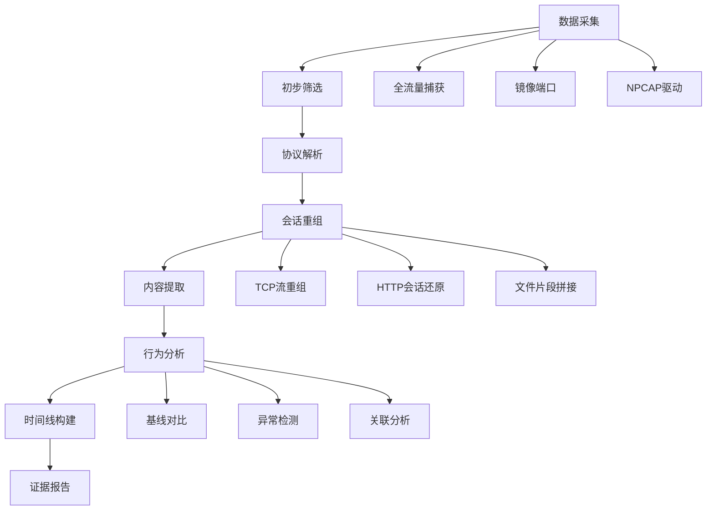

## 25.9 网络流量深度分析

网络流量分析是数字取证的核心能力之一。通过对网络数据包的捕获、解码、过滤和统计分析，取证人员能够还原攻击链条、追踪数据流向、识别恶意通信模式。本节从理论基础出发，系统讲解流量分析的方法论、关键技术和实战工具链，覆盖从基础PCAP解析到高级加密流量检测的完整知识体系。

### 25.9.1 流量分析方法论

#### 分析层级模型

网络流量分析遵循从物理层到应用层的分层解析方法，每个层级提供不同维度的取证信息：

| 分析层级 | 关注内容 | 取证价值 | 典型工具 |
|---------|---------|---------|---------|
| 链路层 | MAC地址、VLAN标签、ARP协议 | 设备识别、内网定位 | Wireshark、tcpdump |
| 网络层 | IP地址、路由路径、分片信息 | 通信拓扑、地理定位 | tshark、Zeek |
| 传输层 | 端口、序列号、重传、窗口大小 | 会话还原、性能分析 | Wireshark、NetworkMiner |
| 应用层 | 协议内容、HTTP头、DNS查询 | 数据提取、行为分析 | tshark、Suricata |
| 加密层 | TLS握手、证书、SNI | 服务识别、流量分类 | JA3/JA3S指纹 |

#### 取证分析流程



**第一阶段：数据采集** — 确保捕获完整的网络流量，包括元数据和有效载荷。使用镜像端口（SPAN）或网络TAP设备实现无损采集。对于加密流量，需配合SSLKEYLOGFILE获取密钥日志。

**第二阶段：初步筛选** — 通过BPF过滤器快速缩小分析范围。根据IP地址、端口、协议类型等条件过滤无关流量，聚焦可疑通信。

**第三阶段：协议解析** — 对筛选后的流量进行深度协议解码，识别各层协议头和有效载荷，重建通信上下文。

**第四阶段：会话重组** — 将离散的数据包按五元组（源IP、目的IP、源端口、目的端口、协议）重组为完整会话，还原通信全貌。

**第五阶段：内容提取** — 从重组的会话中提取传输的文件、DNS查询记录、HTTP请求参数等具体数据。

**第六阶段：行为分析** — 对提取的数据进行时序分析、频率统计和基线对比，识别异常行为模式。

**第七阶段：时间线构建** — 将所有发现的事件按时间排序，建立完整的攻击时间线。

**第八阶段：证据报告** — 生成结构化的取证报告，包含原始数据引用、分析方法、发现和结论。

#### BPF过滤语法精要

BPF（Berkeley Packet Filter）是流量分析的基础筛选语言，掌握其语法对高效取证至关重要：

```bash
# 基础过滤 —— 协议和地址
tcpdump 'host 192.168.1.100'                    # 特定主机的流量
tcpdump 'net 10.0.0.0/8'                        # 整个子网的流量
tcpdump 'src port 443'                           # 源端口443的流量
tcpdump 'dst port 53'                            # 目标端口53的DNS流量

# 组合过滤 —— 逻辑运算
tcpdump 'host 10.0.0.5 and port 80'             # 特定主机的HTTP
tcpdump 'src net 192.168.0.0/16 and not port 22' # 排除SSH的内网流量
tcpdump 'tcp[tcpflags] & (tcp-syn) != 0'        # 仅SYN包（新连接）

# 高级过滤 —— 协议字段
tcpdump 'tcp[tcpflags] & (tcp-rst) != 0'        # RST包（连接异常）
tcpdump 'ip[2:2] > 1000'                        # IP总长度>1000字节
tcpdump 'tcp[13] & 2 != 0'                       # SYN标志位
tcpdump 'udp and port 53 and less 100'           # 小DNS响应（可能隧道）

# 统计过滤 —— 频率分析
tcpdump -nn -q -i eth0 'tcp port 80' | \
    awk '{print $3}' | cut -d. -f1-4 | sort | uniq -c | sort -rn | head -20
```

### 25.9.2 TLS/SSL流量解密与分析

TLS加密流量占现代网络通信的90%以上，解密分析是取证的关键挑战。

#### SSLKEYLOGFILE方法

SSLKEYLOGFILE是最通用的TLS解密方法，适用于客户端可控的场景：

```bash
# ── 环境配置 ──
# Linux/macOS 设置环境变量（影响所有支持的应用）
export SSLKEYLOGFILE=/opt/forensics/sslkeys.log
export SSLKEYLOGFILE=/opt/forensics/sslkeys.log

# 仅对特定应用设置（Linux）
SSLKEYLOGFILE=/opt/forensics/sslkeys.log firefox &

# Windows PowerShell
$env:SSLKEYLOGFILE = "C:\forensics\sslkeys.log"
```

**Wireshark配置步骤：**
1. 打开Wireshark → Edit → Preferences → Protocols → TLS
2. 在 "(Pre)-Master-Secret log filename" 栏填入日志文件路径
3. 确保Wireshark以捕获模式运行或加载的pcap包含TLS握手

**tshark命令行解密：**

```bash
# 基础解密 —— 过滤HTTP明文
tshark -r encrypted_capture.pcap \
    -o "tls.keylog_file:/opt/forensics/sslkeys.log" \
    -Y "http" \
    -T fields -e http.request.method -e http.request.uri -e http.host

# 解密并提取完整HTTP请求
tshark -r encrypted_capture.pcap \
    -o "tls.keylog_file:/opt/forensics/sslkeys.log" \
    -Y "http.request" \
    -T fields -e frame.time -e ip.src -e ip.dst \
    -e http.request.method -e http.request.uri -e http.host

# 解密TLS握手并验证证书
tshark -r encrypted_capture.pcap \
    -o "tls.keylog_file:/opt/forensics/sslkeys.log" \
    -Y "tls.handshake.type == 11" \
    -T fields -e tls.handshake.certificate
```

**局限性与替代方案：**

| 方法 | 适用场景 | 局限性 |
|------|---------|--------|
| SSLKEYLOGFILE | 客户端可控，浏览器/Firefox | 需要预设环境变量 |
| 企业CA证书 | 企业网络TLS中间人 | 需要安装根证书 |
| 服务端私钥 | 拥有服务器证书私钥 | 仅支持RSA密钥交换 |
| 会话票据恢复 | TLS 1.3 会话恢复 | 需要session ticket密钥 |
| ECH绕过 | Encrypted Client Hello | 需要ECH配置密钥 |

#### TLS指纹识别（JA3/JA3S）

即使无法解密，TLS握手本身包含丰富的识别信息：

```bash
# JA3指纹 —— 客户端TLS握手特征
# JA3 = MD5(TLSVersion,Ciphers,Extensions,EllipticCurves,EllipticCurvePointFormats)
tshark -r capture.pcap -Y "tls.handshake.type == 1" \
    -T fields -e tls.handshake.ja3

# JA3S指纹 —— 服务端响应特征
# JA3S = MD5(TLSVersion,Cipher,Extensions)
tshark -r capture.pcap -Y "tls.handshake.type == 2" \
    -T fields -e tls.handshake.ja3s

# 批量提取JA3指纹用于威胁情报匹配
tshark -r capture.pcap -Y "tls.handshake.type == 1" \
    -T fields -e frame.time -e ip.src -e ip.dst \
    -e tls.handshake.ja3 -e tls.handshake.extensions_server_name

# 常见恶意软件JA3指纹示例
# Emotet:    51c64c77e60f3980eea90869b68c58a8
# TrickBot:  6734f37431670b3ab4292b8f60f29984
# QakBot:    a5c3bd327e6a4213f50108538ee7d505
```

**JA3指纹匹配数据库：**
- SSLBL（abuse.ch）：已知恶意软件TLS指纹库
- JA3er.com：社区维护的JA3指纹参考
- Trisul Network Analytics：JA3异常检测引擎

### 25.9.3 DNS流量深度分析

DNS是网络取证中信息密度最高的协议之一，几乎所有C2通信、数据外泄和域名生成算法（DGA）都会留下DNS痕迹。

#### DNS查询提取与统计

```bash
# ── 基础查询提取 ──
# 提取所有DNS查询名称并统计频率
tshark -r capture.pcap -Y "dns.flags.response == 0" \
    -T fields -e dns.qry.name | sort | uniq -c | sort -rn | head -30

# 提取DNS查询类型分布
tshark -r capture.pcap -Y "dns.flags.response == 0" \
    -T fields -e dns.qry.type | sort | uniq -c | sort -rn

# 提取DNS响应码分布（识别NXDOMAIN风暴）
tshark -r capture.pcap -Y "dns.flags.response == 1" \
    -T fields -e dns.flags.rcode | sort | uniq -c | sort -rn

# ── 时间维度分析 ──
# 按小时统计DNS查询量（识别定时行为）
tshark -r capture.pcap -Y "dns.flags.response == 0" \
    -T fields -e frame.time -e dns.qry.name | \
    awk '{split($1,t,":"); print t[1]":"t[2]}' | sort | uniq -c

# 检测DNS查询频率异常（每秒超过阈值的主机）
tshark -r capture.pcap -Y "dns.flags.response == 0" \
    -T fields -e ip.src -e frame.time_relative | \
    awk '{count[$1]++} END {for (h in count) if (count[h]>100) print count[h], h}' | sort -rn
```

#### DNS隧道检测

DNS隧道将数据编码在DNS查询中实现隐蔽通信，是高级持续性威胁（APT）的常用技术：

```bash
# ── 隧道特征检测 ──
# 检测异常长域名（编码数据导致查询名过长）
tshark -r capture.pcap -Y "dns.flags.response == 0" \
    -T fields -e dns.qry.name | \
    awk '{if(length($0) > 50) print length($0), $0}' | sort -rn | head -20

# 检测高熵域名（Base64/Base32编码特征）
tshark -r capture.pcap -Y "dns.flags.response == 0" \
    -T fields -e dns.qry.name | \
    awk '{
        # 计算字符集多样性
        split($0, chars, "");
        n = 0;
        for (i in chars) {
            if (index("abcdefghijklmnopqrstuvwxyz0123456789", chars[i]) > 0) n++;
        }
        entropy = n / length($0);
        if (entropy > 0.7 && length($0) > 30) print entropy, $0;
    }' | sort -rn | head -20

# 检测TXT记录隧道（数据量大）
tshark -r capture.pcap -Y "dns.qry.type == 16" \
    -T fields -e dns.qry.name -e dns.txt

# 检测NXDOMAIN响应风暴（DGA扫描特征）
tshark -r capture.pcap -Y "dns.flags.response == 1 and dns.flags.rcode == 3" \
    -T fields -e ip.src -e dns.qry.name | \
    awk '{count[$1]++} END {for (h in count) if (count[h]>50) print count[h], h}' | sort -rn
```

**DNS隧道工具识别特征：**

| 工具 | 独特特征 | 检测方法 |
|------|---------|---------|
| iodine | NULL/TXT子域名编码 | 查询名含连续null字符 |
| dnscat2 | CNAME/SOA隧道 | 异常CNAME链 |
| dns2tcp | KEY/DATA子域名 | 固定前缀模式 |
| Cobalt Strike DNS | 长Base32子域名 | JA3指纹+查询模式 |
| DNSExfiltrator | Base64编码子域名 | 高熵+长查询名 |

#### DGA（域名生成算法）检测

```bash
# ── DGA特征分析 ──
# 提取域名长度分布（DGA域名通常长度均匀）
tshark -r capture.pcap -Y "dns.flags.response == 0" \
    -T fields -e dns.qry.name | \
    awk '{print length($0)}' | sort -n | uniq -c | sort -rn

# 计算字符频率分布（DGA域名字符分布接近均匀）
tshark -r capture.pcap -Y "dns.flags.response == 0" \
    -T fields -e dns.qry.name | \
    tr -d '.' | fold -w1 | sort | uniq -c | sort -rn

# 检测特定DGA家族特征
# Emotet: 数字+字母混合，长度50-70
# TrickBot: 字母+数字，长度20-30
# QakBot: Base64编码，长度40-60

# 使用Python进行DGA概率评估
python3 << 'EOF'
import math
import sys

def shannon_entropy(s):
    """计算香农熵"""
    if not s:
        return 0
    freq = {}
    for c in s:
        freq[c] = freq.get(c, 0) + 1
    entropy = -sum((count/len(s)) * math.log2(count/len(s)) for count in freq.values())
    return entropy

def dga_score(domain):
    """DGA可能性评分（0-100）"""
    score = 0
    # 长度评分
    if len(domain) > 30:
        score += 30
    elif len(domain) > 20:
        score += 15
    # 熵值评分
    ent = shannon_entropy(domain.split('.')[0])
    if ent > 3.5:
        score += 30
    elif ent > 3.0:
        score += 15
    # 元音比例评分（DGA通常元音比例低）
    vowels = sum(1 for c in domain if c in 'aeiou')
    ratio = vowels / max(len(domain), 1)
    if ratio < 0.15:
        score += 20
    # 数字比例评分
    digits = sum(1 for c in domain if c.isdigit())
    if digits / max(len(domain), 1) > 0.3:
        score += 20
    return min(score, 100)

# 示例评估
domains = [
    "www.google.com",
    "xkq7b3m9a2.com",
    "a]b3k5n8m2p4.com",
    "malware-c2-server.evil.com"
]
for d in domains:
    score = dga_score(d)
    print(f"{score:3d}% | {d}")
EOF
```

#### DNS-over-HTTPS（DoH）检测

```bash
# 检测DoH流量（DNS查询被封装在HTTPS中）
tshark -r capture.pcap -Y "tls.handshake.extensions_server_name contains 'dns'" \
    -T fields -e frame.time -e ip.src -e ip.dst \
    -e tls.handshake.extensions_server_name

# 常见DoH服务器SNI
# dns.google (8.8.8.8)
# cloudflare-dns.com (1.1.1.1)
# dns.quad9.net (9.9.9.9)
# dns.alidns.com (223.5.5.5)

# 检测非标准DNS端口上的DNS流量
tshark -r capture.pcap -Y "dns and !(udp.port == 53 or tcp.port == 53)" \
    -T fields -e ip.src -e ip.dst -e udp.port -e tcp.port

# 统计DoH服务器分布
tshark -r capture.pcap -Y "tls.handshake.extensions_server_name matches 'dns'" \
    -T fields -e tls.handshake.extensions_server_name | \
    sort | uniq -c | sort -rn
```

### 25.9.4 高级协议分析

#### HTTP/2与gRPC分析

HTTP/2的多路复用特性使传统HTTP分析方法失效，需要专门的解析策略：

```bash
# ── HTTP/2分析 ──
# 提取HTTP/2请求方法和路径
tshark -r capture.pcap -Y "http2.headers.method" \
    -T fields -e frame.time -e ip.src -e ip.dst \
    -e http2.headers.method -e http2.headers.path \
    -e http2.headers.authority

# 提取HTTP/2头部字段
tshark -r capture.pcap -Y "http2.headers" \
    -T fields -e http2.headers.name -e http2.headers.value

# 统计HTTP/2流数量
tshark -r capture.pcap -Y "http2" \
    -T fields -e http2.streamid | sort -n | uniq -c | sort -rn

# ── gRPC分析 ──
# gRPC基于HTTP/2，使用protobuf序列化
# 检测gRPC通信
tshark -r capture.pcap -Y "grpc" \
    -T fields -e grpc.method -e grpc.service

# gRPC流式通信分析
tshark -r capture.pcap -Y "http2.headers.method == 'POST'" \
    -T fields -e http2.headers.path -e http2.headers.content_type | \
    grep "application/grpc"

# gRPC-Web检测（浏览器gRPC）
tshark -r capture.pcap -Y "http2.headers.content_type contains 'grpc-web'" \
    -T fields -e ip.src -e ip.dst -e http2.headers.path
```

#### WebSocket分析

WebSocket提供全双工通信，常用于实时数据传输和隐蔽C2通道：

```bash
# 检测WebSocket升级请求
tshark -r capture.pcap -Y "http.request.header contains 'Upgrade: websocket'" \
    -T fields -e frame.time -e ip.src -e ip.dst \
    -e http.request.uri -e http.host

# 提取WebSocket帧
tshark -r capture.pcap -Y "websocket" \
    -T fields -e websocket.opcode -e websocket.payload

# 检测异常WebSocket帧大小（可能隧道数据）
tshark -r capture.pcap -Y "websocket.payload" \
    -T fields -e ip.src -e frame.len | \
    awk '{count[$1]+=$2; frames[$1]++} END {for (h in count) print count[h]/frames[h], frames[h], h}' | sort -rn

# WebSocket C2检测特征
# 1. 固定间隔心跳
# 2. Base64/加密负载
# 3. 异常帧大小分布
# 4. 非标准端口
```

#### QUIC/HTTP3分析

QUIC协议基于UDP，提供0-RTT连接和内置加密，是流量分析的新挑战：

```bash
# 检测QUIC流量
tshark -r capture.pcap -Y "quic" \
    -T fields -e frame.time -e ip.src -e ip.dst \
    -e quic.connection.number -e quic.connection.belong

# QUIC版本检测
tshark -r capture.pcap -Y "quic" \
    -T fields -e quic.version | sort | uniq -c | sort -rn

# QUIC与传统TLS对比
# | 特性       | QUIC           | TCP+TLS       |
# | 传输层     | UDP            | TCP           |
# | 握手延迟   | 0-RTT/1-RTT    | 2-RTT         |
# | 多路复用   | 无队头阻塞     | 有队头阻塞    |
# | 加密范围   | 包含头部       | 仅载荷        |
# | 取证难度   | 高             | 中            |
```

### 25.9.5 流量模式分析与异常检测

#### 通信行为基线

```bash
# ── 连接统计 ──
# 按主机统计连接数
tshark -r capture.pcap -z conv,ip -q | head -30

# 按端口统计流量分布
tshark -r capture.pcap -z conv,tcp -q | \
    awk '{print $3}' | sort | uniq -c | sort -rn | head -20

# 统计协议分布
tshark -r capture.pcap -z io,phs -q

# ── 流量时间序列 ──
# 每分钟流量统计（检测突发）
tshark -r capture.pcap -z io,stat,60 -q

# 每秒包数统计（检测扫描行为）
tshark -r capture.pcap -z io,stat,1 -q

# ── 异常检测 ──
# 检测端口扫描（单源多目标同端口）
tshark -r capture.pcap -Y "tcp.flags.syn == 1 and tcp.flags.ack == 0" \
    -T fields -e ip.src -e ip.dst -e tcp.dstport | \
    awk '{key=$1":"$3; dst[key]++} END {for (k in dst) if (dst[k]>20) print dst[k], k}' | sort -rn | head -20

# 检测数据外泄（大流量上传）
tshark -r capture.pcap -z conv,ip -q | \
    awk 'NR>3 && $4>10000000 {print $4, "bytes:", $1, "->", $2}' | sort -rn

# 检测隧道心跳（固定间隔小包）
tshark -r capture.pcap -Y "frame.len < 100" \
    -T fields -e ip.src -e frame.time_relative | \
    awk '{
        key=$1;
        if (key in last) {
            diff = $2 - last[key];
            if (diff > 25 && diff < 35) count[key]++;
        }
        last[key] = $2;
    } END {for (k in count) if (count[k]>10) print count[k], "heartbeats:", k}'
```

#### 恶意流量特征库

| 特征类型 | 检测方法 | 可疑阈值 |
|---------|---------|---------|
| DNS查询频率 | 单主机查询数/分钟 | >100次/分钟 |
| DNS查询长度 | 域名字符数 | >50字符 |
| 连接间隔 | 心跳包间隔方差 | 方差<1秒 |
| 数据比 | 上行/下行比值 | >5:1 |
| 端口集中度 | 单端口连接占比 | >80% |
| 证书异常 | 自签名/过期/短有效期 | 有效期<24小时 |
| DNS响应码 | NXDOMAIN比例 | >30% |
| SYN/ACK比 | 新建连接比例 | >70% |

### 25.9.6 网络取证工具链

#### Zeek/Bro — 协议分析引擎

Zeek是工业级网络分析框架，提供丰富的协议日志和检测能力：

```bash
# ── 基础使用 ──
# 分析pcap文件
zeek -r capture.pcap

# 指定分析器
zeek -r capture.pcap ssh-detect  # 仅SSH分析

# 使用本地规则
zeek -r capture.pcap local

# ── 日志解析 ──
# 连接日志 —— 所有TCP/UDP连接摘要
cat conn.log | zeek-cut id.orig_h id.resp_h id.orig_p id.resp_p \
    proto service duration bytes.orig_bytes bytes.resp_bytes conn_state

# DNS日志 —— 所有DNS查询和响应
cat dns.log | zeek-cut query qtype_name answers rcode_name

# HTTP日志 —— 所有HTTP请求和响应
cat http.log | zeek-cut id.orig_h host method uri status_code content_type

# SSL/TLS日志 —— TLS握手信息
cat ssl.log | zeek-cut id.orig_h id.resp_h version cipher curve server_name

# 文件日志 —— 传输的文件
cat files.log | zeek-cut tx_hosts rx_hosts source filename mime_type md5

# ── 高级分析 ──
# 检测横向移动（内部主机间的SMB/RDP/WMI）
cat conn.log | zeek-cut id.orig_h id.resp_h service | \
    grep -E "smb|rdp|wmi" | sort | uniq -c | sort -rn

# 检测数据外泄（大文件传输）
cat files.log | zeek-cut tx_hosts rx_hosts filename size | \
    awk '$4 > 10000000 {print}'

# 检测可疑DNS行为
cat dns.log | zeek-cut query qtype_name answers | \
    awk '{print length($1), $0}' | sort -rn | head -20
```

#### Suricata — 入侵检测/预防系统

Suricata提供实时流量分析和签名匹配能力：

```bash
# ── 基础分析 ──
# 分析pcap文件
suricata -r capture.pcap -l /var/log/suricata/

# 使用自定义规则
suricata -r capture.pcap -l /var/log/suricata/ -s custom.rules

# 多线程分析
suricata -r capture.pcap -l /var/log/suricata/ -l 4

# ── 规则编写示例 ──
# 检测DNS隧道（长查询名）
alert dns any any -> any any (msg:"Potential DNS Tunnel - Long Query"; \
    dns.query; content:"|00|"; depth:60; sid:1000001; rev:1;)

# 检测可疑HTTPS通信（特定SNI）
alert tls any any -> any 443 (msg:"Suspicious TLS SNI"; \
    tls.sni; content:"malware-c2.evil.com"; sid:1000002; rev:1;)

# 检测ICMP隧道
alert icmp any any -> any any (msg:"Potential ICMP Tunnel - Large Payload"; \
    dsize:>512; sid:1000003; rev:1;)

# 检测横向移动（PsExec）
alert tcp any any -> any 445 (msg:"Possible PsExec Lateral Movement"; \
    content:"|FE 53 4D 42|"; offset:4; depth:4; \
    content:"|FF 53 4D 42|"; sid:1000004; rev:1;)

# ── EVE JSON输出分析 ──
# 提取所有告警
cat /var/log/suricata/eve.json | jq 'select(.event_type=="alert")'

# 提取DNS事件
cat /var/log/suricata/eve.json | jq 'select(.event_type=="dns")'

# 统计告警类型
cat /var/log/suricata/eve.json | jq -r 'select(.event_type=="alert") | .alert.signature' | \
    sort | uniq -c | sort -rn
```

#### NetworkMiner — 网络取证分析器

NetworkMiner提供图形化界面，自动提取网络会话中的各类数据：

```bash
# NetworkMiner主要功能（GUI工具）
# 1. 自动提取传输的文件、图片、凭据
# 2. 重建TCP会话
# 3. 提取DNS查询记录
# 4. 分析TLS证书信息
# 5. 生成通信拓扑图

# 命令行替代方案 —— 使用tcpxtract
tcpxtract -f capture.pcap -o /output/dir/

# 使用foremost提取文件
foremost -i capture.pcap -o /output/dir/

# 使用ngrep深度包检测
ngrep -I capture.pcap -q "password|login|auth"
```

#### Wireshark统计功能

```bash
# ── 流量统计 ──
# 协议层级统计（了解流量组成）
tshark -r capture.pcap -z io,phs -q

# 会话统计（按五元组聚合）
tshark -r capture.pcap -z conv,ip -q

# 端点统计（按主机聚合）
tshark -r capture.pcap -z endpoints,ip -q

# IO统计（时间序列）
tshark -r capture.pcap -z io,stat,60 -q

# ── 高级统计 ──
# HTTP请求统计
tshark -r capture.pcap -z http,tree -q

# DNS统计
tshark -r capture.pcap -z dns,tree -q

# TLS统计
tshark -r capture.pcap -z tls,tree -q

# Conversations（会话详细信息）
tshark -r capture.pcap -z conv,tcp -q

# Expert Info（协议异常和警告）
tshark -r capture.pcap -z expert -q
```

### 25.9.7 高级取证场景

#### 数据外泄检测

```bash
# ── 上行流量分析 ──
# 检测大流量上传
tshark -r capture.pcap -z conv,ip -q | \
    awk 'NR>3 && $4+0 > 10000000 {print $4, "bytes:", $1, "->", $2}' | sort -rn

# 检测HTTP POST大载荷
tshark -r capture.pcap -Y "http.request.method == POST" \
    -T fields -e ip.src -e http.content_length -e http.request.uri | \
    awk '$2+0 > 10000 {print}'

# 检测分片数据外泄
tshark -r capture.pcap -Y "ip.flags.mf == 1" \
    -T fields -e ip.src -e ip.dst | sort | uniq -c | sort -rn

# ── 隐蔽通道检测 ──
# ICMP隧道（ICMP载荷异常大）
tshark -r capture.pcap -Y "icmp" \
    -T fields -e ip.src -e ip.dst -e frame.len | \
    awk '$3 > 100 {print}'

# DNS隧道（高频长查询）
tshark -r capture.pcap -Y "dns.flags.response == 0" \
    -T fields -e ip.src -e dns.qry.name | \
    awk '{if(length($2) > 40) print length($2), $1, $2}' | sort -rn

# HTTP隐写（异常User-Agent或Cookie）
tshark -r capture.pcap -Y "http.request" \
    -T fields -e http.user_agent | sort | uniq -c | sort -rn

# ── 外泄数据重建 ──
# 提取HTTP上传内容
tshark -r capture.pcap -Y "http.request.method == POST" \
    -T fields -e http.request.uri -e http.content_type

# 重组TCP流中的数据
tshark -r capture.pcap -z follow,tcp,ascii,0 -q
```

#### C2（命令与控制）通信检测

```bash
# ── C2特征检测 ──
# 检测心跳模式（固定间隔通信）
tshark -r capture.pcap -z conv,tcp -q | \
    awk '$4+0 > 0 && $4+0 < 200 {print $1, $2, $3, $4}' | \
    head -50

# 检测Beaconing（定时回连）
tshark -r capture.pcap -Y "tcp.flags.syn == 1 and tcp.flags.ack == 0" \
    -T fields -e ip.src -e ip.dst -e frame.time_relative | \
    awk '{
        key = $1 " -> " $2;
        if (key in first) {
            interval = $3 - first[key];
            if (interval > 30 && interval < 60) count[key]++;
            intervals[key] = intervals[key] " " interval;
        } else {
            first[key] = $3;
        }
    } END {for (k in count) if (count[k] > 5) print count[k], k}'

# 检测加密C2通信（TLS到非标准端口）
tshark -r capture.pcap -Y "tls.handshake.type == 1 and !(tcp.port == 443)" \
    -T fields -e ip.src -e ip.dst -e tcp.dstport \
    -e tls.handshake.extensions_server_name

# 检测HTTP C2（特征性URI模式）
tshark -r capture.pcap -Y "http.request" \
    -T fields -e http.request.uri | \
    grep -E "(\?|&)(id|cmd|data|key|token)=" | sort | uniq -c | sort -rn

# ── 常见C2框架识别 ──
# Cobalt Strike: 默认443/80端口，Beacon心跳
# Sliver: mTLS，默认443
# Empire: HTTP/HTTPS，特定User-Agent
# Metasploit: 默认4444端口
```

#### 隧道通信分析

```bash
# ── 常见隧道类型检测 ──
# SSH隧道（端口转发）
tshark -r capture.pcap -Y "tcp.port == 22" \
    -T fields -e ip.src -e ip.dst -e tcp.srcport -e tcp.dstport

# HTTP隧道（CONNECT方法）
tshark -r capture.pcap -Y "http.request.method == CONNECT" \
    -T fields -e ip.src -e ip.dst -e http.request.uri

# SOCKS隧道
tshark -r capture.pcap -Y "tcp.port == 1080 or tcp.port == 1081" \
    -T fields -e ip.src -e ip.dst

# VPN隧道（WireGuard/IPSec）
tshark -r capture.pcap -Y "udp.port == 51820 or udp.port == 500" \
    -T fields -e ip.src -e ip.dst

# ── 隧道载荷分析 ──
# 提取隧道中的DNS查询（隧道DNS）
tshark -r capture.pcap -Y "dns" \
    -T fields -e ip.src -e ip.dst -e dns.qry.name | \
    awk '{if(length($3) > 30) print length($3), $1, "->", $2, $3}' | sort -rn

# 提取隧道中的HTTP数据
tshark -r capture.pcap -Y "http" \
    -T fields -e http.request.uri -e http.host | \
    awk '{if(length($1) > 100) print length($1), $0}'
```

### 25.9.8 PCAP文件管理与优化

#### 大型PCAP处理

```bash
# ── 文件分割 ──
# 按时间分割（每小时一个文件）
editcap -c 100000 -t 3600 capture.pcap split_%Y%m%d_%H%M%S.pcap

# 按大小分割（每个100MB）
editcap -c 100000 -S 100000000 capture.pcap split_%Y%m%d_%H%M%S.pcap

# 按主机过滤
tshark -r capture.pcap -Y "ip.addr == 192.168.1.100" -w filtered.pcap

# 按时间过滤
tshark -r capture.pcap -Y "frame.time >= \"2024-01-15 10:00:00\" and frame.time <= \"2024-01-15 11:00:00\"" -w time_filtered.pcap

# ── 文件合并 ──
# 合并多个pcap文件
mergecap -w merged.pcap capture1.pcap capture2.pcap capture3.pcap

# 按时间排序合并
mergecap -a -w merged_sorted.pcap capture_*.pcap

# ── 统计信息 ──
# 获取pcap文件基础信息
capinfos capture.pcap

# 获取详细统计
tshark -r capture.pcap -z io,phs -q

# 检测pcap完整性
editcap -t 1 capture.pcap /dev/null  # 检查时间戳异常
```

#### 内存优化分析

```bash
# ── 流式分析（避免内存溢出） ──
# 使用tshark流式处理大型pcap
tshark -r large_capture.pcap -Y "dns" \
    -T fields -e dns.qry.name -w dns_only.pcap

# 分块处理（每1000个包处理一次）
tshark -r capture.pcap -c 1000 -w chunk_001.pcap
tshark -r capture.pcap -c 1000 -Y "frame.number > 1000" -w chunk_002.pcap

# 使用tcpdump进行预过滤
tcpdump -r capture.pcap -w dns_traffic.pcap 'udp port 53'

# ── 并行分析 ──
# 使用GNU parallel并行处理多个pcap
parallel tshark -r {} -z io,phs -q ::: *.pcap

# 使用split预分割后并行分析
split -b 100M -d capture.pcap chunk_
parallel tshark -r chunk_{} -z conv,ip -q ::: $(seq -w 00 09)
```

### 25.9.9 常见误区与最佳实践

#### 常见错误

| 错误类型 | 具体表现 | 正确做法 |
|---------|---------|---------|
| 采集不完整 | 仅捕获部分流量 | 使用镜像端口或TAP设备 |
| 时间不同步 | 多源pcap时间戳不一致 | 使用NTP同步所有采集设备 |
| 忽略加密流量 | 仅分析明文协议 | 配合SSLKEYLOGFILE解密 |
| 过度过滤 | BPF过滤过严遗漏信息 | 先全量捕获再精细过滤 |
| 工具依赖 | 仅使用单一工具 | 多工具交叉验证 |
| 忽略元数据 | 仅关注载荷内容 | 分析包大小、间隔、频率等元数据 |
| 缺乏基线 | 无正常流量参考 | 建立网络行为基线 |
| 结论过早 | 未充分验证就下结论 | 保留原始证据，多角度验证 |

#### 取证分析最佳实践

**采集阶段：**
- 始终保留原始pcap文件的完整性（计算并记录哈希值）
- 使用write模式避免直接操作原始文件
- 记录采集时间窗口、网络拓扑和设备配置
- 对加密流量配合密钥日志采集

**分析阶段：**
- 先宏观后微观：先看统计概览，再深入细节
- 交叉验证：使用至少两种工具验证关键发现
- 保留工作日志：记录每一步操作和发现
- 关注时间序列：异常行为往往体现在时间模式中

**报告阶段：**
- 引用原始数据：每个结论都要有对应的pcap包号
- 解释分析方法：说明使用的工具和过滤条件
- 量化发现：用具体数据而非模糊描述
- 区分事实和推测：明确标注不确定的结论

### 25.9.10 进阶：自动化流量分析平台

#### 构建分析流水线

```bash
#!/bin/bash
# 自动化PCAP分析脚本
# 用法: ./analyze_pcap.sh <capture.pcap>

PCAP=$1
REPORT_DIR="/opt/forensics/reports/$(date +%Y%m%d_%H%M%S)"
mkdir -p "$REPORT_DIR"

echo "=== 网络流量取证分析 ==="
echo "输入文件: $PCAP"
echo "报告目录: $REPORT_DIR"

# 1. 基础信息
echo "[1/8] 采集基础信息..."
capinfos "$PCAP" > "$REPORT_DIR/01_basic_info.txt"

# 2. 协议分布
echo "[2/8] 分析协议分布..."
tshark -r "$PCAP" -z io,phs -q > "$REPORT_DIR/02_protocol_hierarchy.txt"

# 3. 会话统计
echo "[3/8] 统计会话信息..."
tshark -r "$PCAP" -z conv,ip -q > "$REPORT_DIR/03_conversations.txt"

# 4. DNS分析
echo "[4/8] 分析DNS流量..."
tshark -r "$PCAP" -Y "dns" \
    -T fields -e frame.time -e ip.src -e ip.dst \
    -e dns.qry.name -e dns.qry.type -e dns.flags.response \
    > "$REPORT_DIR/04_dns_queries.tsv"

# 5. HTTP分析
echo "[5/8] 分析HTTP流量..."
tshark -r "$PCAP" -Y "http.request" \
    -T fields -e frame.time -e ip.src -e ip.dst \
    -e http.request.method -e http.host -e http.request.uri \
    > "$REPORT_DIR/05_http_requests.tsv"

# 6. TLS分析
echo "[6/8] 分析TLS流量..."
tshark -r "$PCAP" -Y "tls.handshake.type == 1" \
    -T fields -e frame.time -e ip.src -e ip.dst \
    -e tls.handshake.extensions_server_name \
    > "$REPORT_DIR/06_tls_connections.tsv"

# 7. 异常检测
echo "[7/8] 检测异常行为..."
{
    echo "=== 端口扫描检测 ==="
    tshark -r "$PCAP" -Y "tcp.flags.syn == 1 and tcp.flags.ack == 0" \
        -T fields -e ip.src -e ip.dst -e tcp.dstport | \
        awk '{key=$1; dst[key]++} END {for (k in dst) if (dst[k]>20) print dst[k], k}' | sort -rn

    echo ""
    echo "=== 大流量检测 ==="
    tshark -r "$PCAP" -z conv,ip -q | \
        awk '$4+0 > 10000000 {print $4, "bytes:", $1, "->", $2}' | sort -rn

    echo ""
    echo "=== DNS异常检测 ==="
    tshark -r "$PCAP" -Y "dns.qry.name" \
        -T fields -e dns.qry.name | \
        awk '{if(length($0) > 50) print length($0), $0}' | sort -rn | head -10
} > "$REPORT_DIR/07_anomalies.txt"

# 8. 生成总结
echo "[8/8] 生成分析总结..."
{
    echo "=== 分析总结 ==="
    echo "分析时间: $(date)"
    echo ""
    echo "基础信息:"
    cat "$REPORT_DIR/01_basic_info.txt"
    echo ""
    echo "协议分布（前10）:"
    head -20 "$REPORT_DIR/02_protocol_hierarchy.txt"
    echo ""
    echo "Top 10 会话:"
    head -15 "$REPORT_DIR/03_conversations.txt"
    echo ""
    echo "异常检测结果:"
    cat "$REPORT_DIR/07_anomalies.txt"
} > "$REPORT_DIR/08_summary.txt"

echo ""
echo "=== 分析完成 ==="
echo "报告目录: $REPORT_DIR"
echo "查看总结: cat $REPORT_DIR/08_summary.txt"
```

#### Python自动化分析框架

```python
#!/usr/bin/env python3
"""
网络流量取证自动化分析工具
使用Scapy库进行pcap解析和分析
"""

import sys
import json
from collections import Counter, defaultdict
from datetime import datetime

try:
    from scapy.all import rdpcap, IP, TCP, UDP, DNS, Raw
except ImportError:
    print("需要安装scapy: pip install scapy")
    sys.exit(1)

def analyze_pcap(pcap_file):
    """分析pcap文件"""
    packets = rdpcap(pcap_file)
    
    stats = {
        'total_packets': len(packets),
        'protocols': Counter(),
        'src_ips': Counter(),
        'dst_ips': Counter(),
        'dns_queries': [],
        'http_requests': [],
        'tls_sni': [],
        'large_transfers': [],
        'timestamp_range': (None, None),
    }
    
    for pkt in packets:
        # 时间范围
        ts = float(pkt.time)
        if stats['timestamp_range'][0] is None:
            stats['timestamp_range'] = (ts, ts)
        else:
            stats['timestamp_range'] = (min(stats['timestamp_range'][0], ts),
                                       max(stats['timestamp_range'][1], ts))
        
        # IP层统计
        if IP in pkt:
            stats['src_ips'][pkt[IP].src] += 1
            stats['dst_ips'][pkt[IP].dst] += 1
            
            # 协议统计
            if TCP in pkt:
                stats['protocols']['TCP'] += 1
                # DNS检测
                if pkt[TCP].dport == 53 or pkt[TCP].sport == 53:
                    stats['protocols']['DNS_over_TCP'] += 1
                # HTTP检测
                if pkt[TCP].dport == 80 or pkt[TCP].sport == 80:
                    stats['protocols']['HTTP'] += 1
                # TLS检测
                if pkt[TCP].dport == 443 or pkt[TCP].sport == 443:
                    stats['protocols']['TLS'] += 1
            elif UDP in pkt:
                stats['protocols']['UDP'] += 1
                # DNS检测
                if pkt[UDP].dport == 53 or pkt[UDP].sport == 53:
                    stats['protocols']['DNS'] += 1
        
        # DNS查询提取
        if DNS in pkt and pkt[DNS].qr == 0:
            try:
                query = pkt[DNS].qd.qname.decode('utf-8', errors='ignore')
                stats['dns_queries'].append({
                    'src': pkt[IP].src,
                    'query': query,
                    'length': len(query)
                })
            except:
                pass
        
        # HTTP请求检测
        if Raw in pkt and TCP in pkt:
            try:
                payload = pkt[Raw].load.decode('utf-8', errors='ignore')
                if 'HTTP/' in payload and 'Host:' in payload:
                    lines = payload.split('\r\n')
                    for line in lines:
                        if line.startswith('Host:'):
                            stats['http_requests'].append({
                                'src': pkt[IP].src,
                                'host': line.split(':', 1)[1].strip(),
                                'ts': datetime.fromtimestamp(float(pkt.time)).isoformat()
                            })
                            break
            except:
                pass
        
        # 大流量检测
        if Raw in pkt and len(pkt[Raw].load) > 1000:
            stats['large_transfers'].append({
                'src': pkt[IP].src if IP in pkt else 'unknown',
                'dst': pkt[IP].dst if IP in pkt else 'unknown',
                'size': len(pkt[Raw].load),
                'ts': datetime.fromtimestamp(float(pkt.time)).isoformat()
            })
    
    return stats

def generate_report(stats):
    """生成分析报告"""
    report = []
    report.append("=" * 60)
    report.append("网络流量取证分析报告")
    report.append("=" * 60)
    
    # 基础统计
    report.append(f"\n总数据包数: {stats['total_packets']}")
    if stats['timestamp_range'][0]:
        start = datetime.fromtimestamp(stats['timestamp_range'][0])
        end = datetime.fromtimestamp(stats['timestamp_range'][1])
        report.append(f"时间范围: {start} ~ {end}")
        duration = stats['timestamp_range'][1] - stats['timestamp_range'][0]
        report.append(f"持续时间: {duration:.2f} 秒")
    
    # 协议分布
    report.append("\n--- 协议分布 ---")
    for proto, count in stats['protocols'].most_common(10):
        pct = count / stats['total_packets'] * 100
        report.append(f"  {proto}: {count} ({pct:.1f}%)")
    
    # Top 10 源IP
    report.append("\n--- Top 10 源IP ---")
    for ip, count in stats['src_ips'].most_common(10):
        report.append(f"  {ip}: {count}")
    
    # Top 10 DNS查询
    report.append("\n--- Top 10 DNS查询 ---")
    dns_counter = Counter(d['query'] for d in stats['dns_queries'])
    for query, count in dns_counter.most_common(10):
        report.append(f"  {query}: {count}")
    
    # 长域名检测（潜在DNS隧道）
    long_dns = [d for d in stats['dns_queries'] if d['length'] > 50]
    if long_dns:
        report.append(f"\n--- 潜在DNS隧道（域名长度>50）: {len(long_dns)} 条 ---")
        for d in sorted(long_dns, key=lambda x: -x['length'])[:10]:
            report.append(f"  [{d['src']}] {d['query']}")
    
    # HTTP主机分布
    report.append("\n--- HTTP Host分布 ---")
    http_hosts = Counter(r['host'] for r in stats['http_requests'])
    for host, count in http_hosts.most_common(10):
        report.append(f"  {host}: {count}")
    
    # 大流量检测
    if stats['large_transfers']:
        report.append(f"\n--- 大流量传输（>1KB）: {len(stats['large_transfers'])} 条 ---")
        # 按源IP聚合
        src_sizes = defaultdict(int)
        for t in stats['large_transfers']:
            src_sizes[t['src']] += t['size']
        for src, size in sorted(src_sizes.items(), key=lambda x: -x[1])[:10]:
            report.append(f"  {src}: {size/1024/1024:.2f} MB")
    
    return '\n'.join(report)

if __name__ == '__main__':
    if len(sys.argv) < 2:
        print(f"用法: {sys.argv[0]} <pcap_file>")
        sys.exit(1)
    
    print(f"正在分析: {sys.argv[1]}")
    stats = analyze_pcap(sys.argv[1])
    report = generate_report(stats)
    print(report)
    
    # 保存报告
    report_file = sys.argv[1] + '.analysis.txt'
    with open(report_file, 'w') as f:
        f.write(report)
    print(f"\n报告已保存: {report_file}")
```

### 25.9.11 实战案例：APT流量分析

#### 案例场景

某企业网络中发现可疑外联活动，安全团队捕获了以下流量特征：
- 内网主机192.168.1.105每30秒向外部IP发送DNS查询
- DNS查询域名长度均为55字符，字符集为a-z和0-9
- 每次查询后收到40字节的TXT响应
- 同时存在向91.215.85.x:443的TLS连接

#### 分析步骤

```bash
# 1. 验证可疑DNS活动
tshark -r apt_capture.pcap -Y "ip.src == 192.168.1.105 and dns" \
    -T fields -e frame.time -e dns.qry.name -e dns.txt -e dns.flags.response

# 2. 分析DNS时间模式
tshark -r apt_capture.pcap -Y "ip.src == 192.168.1.105 and dns.flags.response == 0" \
    -T fields -e frame.time_relative | \
    awk '{if(NR>1) print $1-prev; prev=$1}' | sort -n | uniq -c

# 3. 解密TLS连接
tshark -r apt_capture.pcap \
    -o "tls.keylog_file:/opt/forensics/sslkeys.log" \
    -Y "ip.addr == 91.215.85.x" \
    -T fields -e frame.time -e ip.src -e ip.dst \
    -e tls.handshake.extensions_server_name

# 4. 提取外泄数据
tshark -r apt_capture.pcap \
    -o "tls.keylog_file:/opt/forensics/sslkeys.log" \
    -Y "http.request.method == POST" \
    -T fields -e http.request.uri -e http.content_length

# 5. 构建时间线
tshark -r apt_capture.pcap -Y "ip.addr == 192.168.1.105" \
    -T fields -e frame.time -e ip.src -e ip.dst \
    -e _ws.col.Protocol -e _ws.col.Info | head -100
```

#### 分析结论

通过流量分析确认：
- 该主机感染了DNS隧道后门（类似iodine/dnscat2）
- DNS查询中编码了主机信息和命令执行结果
- TXT响应中包含C2服务器下发的指令
- TLS连接用于传输加密的文件数据
- 攻击持续时间约4小时，外泄数据约2.3MB

### 25.9.12 工具选择指南

| 场景 | 推荐工具 | 选择理由 |
|------|---------|---------|
| 实时抓包 | tcpdump | 轻量级，适合远程服务器 |
| 深度分析 | Wireshark | GUI直观，协议解码全面 |
| 脚本自动化 | tshark | 命令行友好，输出格式灵活 |
| 协议日志 | Zeek/Bro | 自动生成结构化日志 |
| 入侵检测 | Suricata | 实时规则匹配，高性能 |
| 文件提取 | NetworkMiner | 自动提取传输内容 |
| 大型pcap | tcpdump + split | 流式处理，内存友好 |
| 编程分析 | Scapy/Dpkt | Python生态，灵活扩展 |

---

**本节小结：** 网络流量深度分析是数字取证的核心技能，要求取证人员掌握协议原理、工具使用和分析方法论。在实际取证中，应建立系统化的分析流程，从宏观统计到微观细节层层深入，结合多种工具交叉验证，最终形成有证据支撑的分析结论。面对加密流量日益普及的趋势，取证人员需要持续关注新技术（如JA3指纹、Encrypted Client Hello）的发展，不断提升应对新型威胁的能力。
