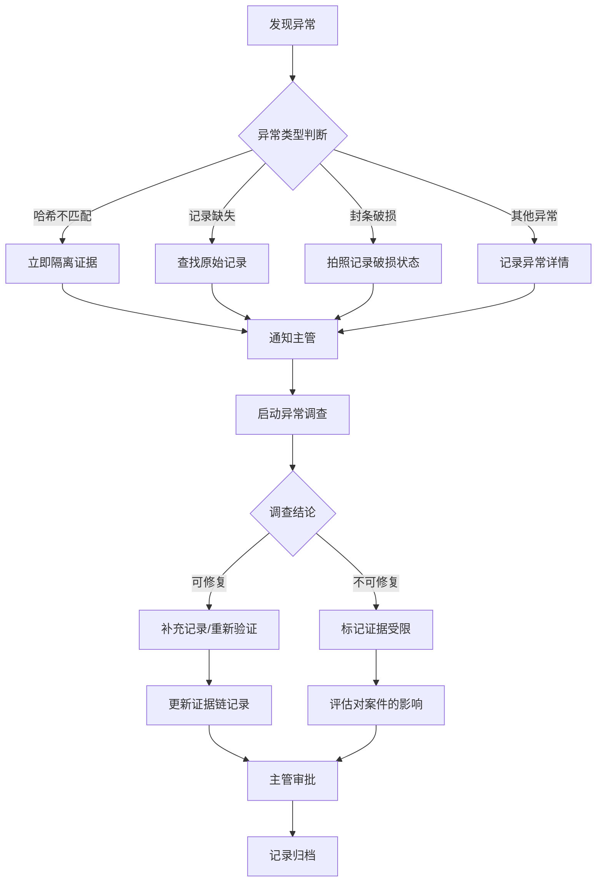
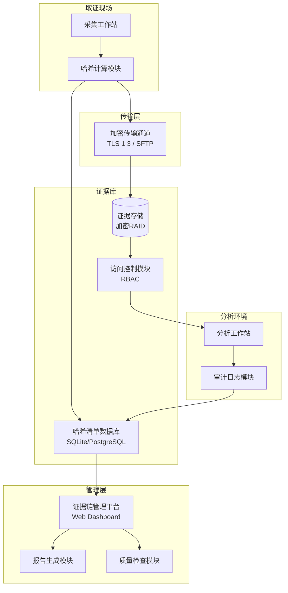

## 25.10 证据链管理最佳实践

证据链管理是数字取证中最容易被忽视、却最致命的环节。2019年《美国联邦调查局网络犯罪年度报告》显示，在所有因证据问题被排除的案件中，**超过62%源于证据链记录不完整或断裂**，而非证据本身的技术缺陷。一个哈希值不匹配、一次口头移交、一张缺失的签名——任何一处疏漏都可能导致整个案件的证据体系崩塌。

本章不重复25.5节的理论框架，而是聚焦**可落地的最佳实践**：标准模板、验证脚本、质量检查清单、自动化工作流、以及真实案例中的经验教训。目标是让每一位取证人员拿到本章就能直接上手操作，无需再翻阅其他资料。

---

### 25.10.1 证据链记录模板体系

一套完整的证据链管理需要**三类模板**协同工作：采集记录单、传输交接单、分析日志单。三者通过统一的证据编号串联，形成闭环。

#### 25.10.1.1 证据采集记录单（标准模板）

采集记录单是证据链的起点，必须在现场一次性填写完整，不允许事后补记。

```text
╔══════════════════════════════════════════════════════════════════╗
║                      数字证据采集记录单                            ║
╠══════════════════════════════════════════════════════════════════╣
║ 案件编号：CASE-2026-0415                                          ║
║ 证据编号：CASE2026-DI-0001-A                                      ║
║ 记录时间：2026-06-15 14:23:17 CST                                 ║
╠══════════════════════════════════════════════════════════════════╣
║ 【证据基本信息】                                                   ║
║ 证据描述：Dell PowerEdge R750服务器系统盘（/dev/sda，1.8TB）       ║
║ 证据类型：□物理介质  ☑磁盘镜像  □内存转储  □网络流量  □其他       ║
║ 来源位置：深圳市南山区科技南路18号14楼1408室机房                   ║
║ 发现方式：□现场搜查  ☑协查调取  □主动提交  □其他                 ║
╠══════════════════════════════════════════════════════════════════╣
║ 【采集环境】                                                       ║
║ 采集工具：Tableau T356789（硬件写保护器）+ FTK Imager v4.8.1      ║
║ 写保护状态：☑已启用（绿灯常亮）                                    ║
║ 操作环境：离线取证工作站（IP: 192.168.100.50，与外网物理隔离）     ║
║ 操作系统：Ubuntu 22.04 LTS（只读镜像启动）                        ║
╠══════════════════════════════════════════════════════════════════╣
║ 【哈希校验】                                                       ║
║ 原始介质哈希（采集前）：                                          ║
║   MD5:    a1b2c3d4e5f6a7b8c9d0e1f2a3b4c5d6                       ║
║   SHA-256: e3b0c44298fc1c149afbf4c8996fb92427ae41e4649b934ca495   ║
║           991b7852b855                                           ║
║ 镜像文件哈希（采集后）：                                          ║
║   MD5:    a1b2c3d4e5f6a7b8c9d0e1f2a3b4c5d6                       ║
║   SHA-256: e3b0c44298fc1c149afbf4c8996fb92427ae41e4649b934ca495   ║
║           991b7852b855                                           ║
║ 校验结果：☑MD5一致  ☑SHA-256一致  □不一致（需说明原因）          ║
╠══════════════════════════════════════════════════════════════════╣
║ 【人员信息】                                                       ║
║ 采集人：李四（警号FOR-1024）  签名：____________                   ║
║ 见证人：王五（警号FOR-1025）  签名：____________                   ║
║ 嫌疑人/持有人：张三（身份证号：4403**********1234）               ║
║ 嫌疑人确认：☑已告知取证行为  □拒绝配合（已记录）                  ║
╠══════════════════════════════════════════════════════════════════╣
║ 【备注】                                                           ║
║ 特殊说明：服务器处于运行状态，采用热采集方式；已通知系统管理员      ║
║          赵六（工号IT-3001）在场协助。                            ║
╚══════════════════════════════════════════════════════════════════╝
```

**模板设计要点：**

- **强制字段与可选字段区分**：哈希值、采集人、见证人等为必填项，缺失则采集记录无效
- **复选框设计**：证据类型、写保护状态等使用复选框而非自由文本，减少录入错误
- **双人签名机制**：采集人和见证人必须同时签名，见证人不得为同一执法单位的直接下属（避免利益关联）
- **嫌疑人确认栏**：记录是否告知取证行为，这关系到程序合法性

#### 25.10.1.2 证据传输交接单（标准模板）

传输交接单是证据链中最容易出问题的环节——每次移交都是断裂风险点。标准模板要求**移交前和接收后各做一次哈希校验**，形成"双验证"机制。

```text
╔══════════════════════════════════════════════════════════════════╗
║                      数字证据传输交接单                            ║
╠══════════════════════════════════════════════════════════════════╣
║ 交接单编号：TF-2026-0415-003                                      ║
║ 交接日期：2026-06-15 17:30:00 CST                                 ║
║ 交接地点：市局网安支队取证现场→电子物证实验室                      ║
╠══════════════════════════════════════════════════════════════════╣
║ 【移交方】                                                         ║
║ 姓名：李四    单位：市局网安支队    警号：FOR-1024                ║
║ 联系方式：138****1234                                              ║
╠══════════════════════════════════════════════════════════════════╣
║ 【接收方】                                                         ║
║ 姓名：赵六    单位：电子物证实验室    工号：LAB-2077              ║
║ 联系方式：139****5678                                              ║
╠══════════════════════════════════════════════════════════════════╣
║ 【证据清单】                                                       ║
║ ┌──────┬──────────────────┬──────────────┬──────────────┬──────┐ ║
║ │序号  │ 证据编号          │ 描述          │ 封条编号      │状态   │ ║
║ ├──────┼──────────────────┼──────────────┼──────────────┼──────┤ ║
║ │ 1    │ CASE2026-PM-0001 │ Dell服务器    │ SEAL-00128   │完好   │ ║
║ │ 2    │ CASE2026-DI-0001 │ 系统盘镜像E01 │ SEAL-00129   │完好   │ ║
║ │ 3    │ CASE2026-MM-0001 │ 内存转储.raw  │ SEAL-00130   │完好   │ ║
║ └──────┴──────────────────┴──────────────┴──────────────┴──────┘ ║
╠══════════════════════════════════════════════════════════════════╣
║ 【哈希校验——移交前（由移交方执行）】                               ║
║ CASE2026-PM-0001: SHA-256 = e3b0c44298fc... ✅                    ║
║ CASE2026-DI-0001: SHA-256 = 9f86d081884c... ✅                    ║
║ CASE2026-MM-0001: SHA-256 = 5e884898da28... ✅                    ║
║ 校验人：李四    时间：2026-06-15 17:25                             ║
╠══════════════════════════════════════════════════════════════════╣
║ 【哈希校验——接收后（由接收方执行）】                               ║
║ CASE2026-PM-0001: SHA-256 = e3b0c44298fc... ✅                    ║
║ CASE2026-DI-0001: SHA-256 = 9f86d081884c... ✅                    ║
║ CASE2026-MM-0001: SHA-256 = 5e884898da28... ✅                    ║
║ 校验人：赵六    时间：2026-06-15 17:35                             ║
╠══════════════════════════════════════════════════════════════════╣
║ 【双方确认】                                                       ║
║ 移交方签名：____________    日期：2026-06-15                       ║
║ 接收方签名：____________    日期：2026-06-15                       ║
║ 见证人签名：____________    日期：2026-06-15（可选）               ║
╚══════════════════════════════════════════════════════════════════╝
```

**双验证机制的核心逻辑：**

移交前由移交方计算哈希并记录，接收后由接收方独立计算哈希并比对。两次计算由不同人员在不同时间完成，任何一方都无法单独篡改哈希记录而不被发现。如果两次结果不一致，说明传输过程中发生了数据损坏或篡改，必须立即启动异常处理流程。

#### 25.10.1.3 分析日志单（标准模板）

分析阶段的操作记录需要达到**可重现**的粒度——另一个分析师拿到这份日志，应当能够完全复现分析过程并得出相同结论。

```yaml
# 分析日志标准格式（YAML）
analysis_session:
  case_id: "CASE-2026-0415"
  evidence_id: "CASE2026-DI-0001-A"
  analyst: "王五 (FOR-1025)"
  session_start: "2026-06-16T09:00:00+08:00"
  session_end: "2026-06-16T16:30:00+08:00"
  workstation: "取证工作站WS-03 (IP: 192.168.100.53)"
  os_image: "Ubuntu 22.04 LTS (只读启动, SHA-256: 7f3a...)"

  operations:
    - timestamp: "2026-06-16T09:00:12+08:00"
      action: "加载镜像文件"
      tool: "Autopsy 4.21.0"
      parameters:
        file: "/evidence/images/CASE2026-DI-0001.E01"
        mount_mode: "read-only"
      hash_verify:
        expected_sha256: "9f86d081884c706e485289d666611819..."
        computed_sha256: "9f86d081884c706e485289d666611819..."
        result: "PASS"
      output: "Autopsy case created: /analysis/case2026_di001/"

    - timestamp: "2026-06-16T09:15:33+08:00"
      action: "关键词搜索"
      tool: "Autopsy Keyword Search"
      parameters:
        keywords:
          - "机密"
          - "内部资料"
          - "password"
          - "confidential"
        case_sensitive: false
        file_types: "all"
      hits: 127
      output: "/analysis/case2026_di001/keyword_hits.csv"
      note: "导出搜索结果供人工筛选，其中12条高相关度条目已标记"

    - timestamp: "2026-06-16T10:30:00+08:00"
      action: "时间线分析"
      tool: "Plaso (log2timeline)"
      parameters:
        command: "log2timeline.py --workers 8 case2026_timeline.plaso CASE2026-DI-0001.E01"
        output_format: "plaso"
      output: "/analysis/case2026_di001/case2026_timeline.plaso"
      event_count: 2847563
      note: "已使用timesketch进行可视化分析，关键时间线节点已标注"

    - timestamp: "2026-06-16T14:00:00+08:00"
      action: "文件恢复分析"
      tool: "Autopsy File Analysis"
      parameters:
        focus: "deleted_files"
        file_types: "documents,images,spreadsheets"
      recovered_files: 342
      output: "/analysis/case2026_di001/recovered_files/"
      note: "发现342个已删除文件，其中15个文档与案件高度相关"

    - timestamp: "2026-06-16T15:30:00+08:00"
      action: "镜像完整性终验"
      tool: "sha256sum"
      parameters:
        file: "/evidence/images/CASE2026-DI-0001.E01"
      hash_verify:
        expected_sha256: "9f86d081884c706e485289d666611819..."
        computed_sha256: "9f86d081884c706e485289d666611819..."
        result: "PASS"
      note: "分析全程镜像完整性保持，无修改痕迹"
```

**分析日志的关键设计原则：**

- **时间戳精确到秒**：所有操作必须有精确时间记录，便于法庭上建立操作时间线
- **工具版本必须标注**：不同版本的取证工具可能产生不同的结果，版本信息是结论可重现的前提
- **参数完整记录**：不仅记录"做了什么"，还要记录"用什么参数做的"——关键词搜索是否区分大小写、文件类型过滤器设置等细节都可能影响结果
- **输出路径明确**：每个分析步骤的产出物必须有明确的存储路径，便于后续复核
- **分析前后双哈希**：分析开始前验证镜像哈希，分析结束后再次验证，确保分析过程没有修改原始镜像

---

### 25.10.2 证据完整性验证脚本

25.5节介绍了哈希校验的基本原理，本节提供**可直接部署的自动化验证脚本**，覆盖日常巡检、批量验证、异常告警等场景。

#### 25.10.2.1 单文件验证脚本

适用于现场快速验证单个证据文件的完整性。

```bash
#!/bin/bash
# evidence_verify.sh - 证据完整性验证脚本
# 用法: ./evidence_verify.sh <文件路径> <预期MD5> <预期SHA256>
# 示例: ./evidence_verify.sh /evidence/disk_image.dd "a1b2c3..." "e3b0c4..."

set -euo pipefail

# ── 颜色输出 ──────────────────────────────────────────────
RED='\033[0;31m'
GREEN='\033[0;32m'
YELLOW='\033[1;33m'
NC='\033[0m' # No Color

# ── 参数校验 ──────────────────────────────────────────────
if [ $# -lt 3 ]; then
    echo "用法: $0 <文件路径> <预期MD5> <预期SHA256>"
    echo "示例: $0 /evidence/disk_image.dd a1b2c3d4... e3b0c442..."
    exit 1
fi

FILE="$1"
EXPECTED_MD5="$2"
EXPECTED_SHA256="$3"
LOG_FILE="/evidence/verification.log"
TIMESTAMP=$(date '+%Y-%m-%d %H:%M:%S')

# ── 文件存在性检查 ────────────────────────────────────────
if [ ! -f "$FILE" ]; then
    echo -e "${RED}[ERROR]${NC} 文件不存在: $FILE"
    echo "[$TIMESTAMP] [ERROR] File not found: $FILE" >> "$LOG_FILE"
    exit 2
fi

echo "=============================================="
echo "  证据完整性验证报告"
echo "  时间: $TIMESTAMP"
echo "  文件: $FILE"
echo "=============================================="

# ── 计算哈希值 ────────────────────────────────────────────
echo ""
echo "正在计算哈希值（大文件可能需要较长时间）..."

CURRENT_MD5=$(md5sum "$FILE" | awk '{print $1}')
CURRENT_SHA256=$(sha256sum "$FILE" | awk '{print $1}')

# ── MD5验证 ───────────────────────────────────────────────
echo ""
echo "── MD5 校验 ──"
echo "  预期: $EXPECTED_MD5"
echo "  实际: $CURRENT_MD5"

if [ "$CURRENT_MD5" = "$EXPECTED_MD5" ]; then
    echo -e "  结果: ${GREEN}✅ 通过${NC}"
    MD5_STATUS="PASS"
else
    echo -e "  结果: ${RED}❌ 不匹配！证据可能已被篡改！${NC}"
    MD5_STATUS="FAIL"
fi

# ── SHA-256验证 ───────────────────────────────────────────
echo ""
echo "── SHA-256 校验 ──"
echo "  预期: $EXPECTED_SHA256"
echo "  实际: $CURRENT_SHA256"

if [ "$CURRENT_SHA256" = "$EXPECTED_SHA256" ]; then
    echo -e "  结果: ${GREEN}✅ 通过${NC}"
    SHA256_STATUS="PASS"
else
    echo -e "  结果: ${RED}❌ 不匹配！证据可能已被篡改！${NC}"
    SHA256_STATUS="FAIL"
fi

# ── 综合结论 ──────────────────────────────────────────────
echo ""
echo "=============================================="
if [ "$MD5_STATUS" = "PASS" ] && [ "$SHA256_STATUS" = "PASS" ]; then
    echo -e "  综合结论: ${GREEN}✅ 证据完整性验证通过${NC}"
    FINAL_STATUS="PASS"
else
    echo -e "  综合结论: ${RED}❌ 证据完整性验证失败！${NC}"
    echo "  ⚠️  请立即启动异常处理流程！"
    FINAL_STATUS="FAIL"
fi
echo "=============================================="

# ── 写入日志 ──────────────────────────────────────────────
echo "[$TIMESTAMP] [$FINAL_STATUS] File: $FILE | MD5: $MD5_STATUS | SHA256: $SHA256_STATUS" >> "$LOG_FILE"

# ── 退出码 ────────────────────────────────────────────────
if [ "$FINAL_STATUS" = "FAIL" ]; then
    exit 3
fi
exit 0
```

#### 25.10.2.2 批量验证脚本

适用于证据库的定期巡检，自动扫描所有证据文件并生成验证报告。

```bash
#!/bin/bash
# evidence_batch_verify.sh - 证据库批量完整性验证
# 用法: ./evidence_batch_verify.sh <证据目录> <哈希清单文件>
# 哈希清单格式: <文件路径> <MD5> <SHA256>（每行一条，空格分隔）

set -euo pipefail

EVIDENCE_DIR="${1:-/evidence}"
HASH_MANIFEST="${2:-/evidence/hash_manifest.txt}"
REPORT_FILE="/evidence/reports/batch_verify_$(date '+%Y%m%d_%H%M%S').html"
LOG_FILE="/evidence/batch_verify.log"

mkdir -p "$(dirname "$REPORT_FILE")"

# ── 初始化报告 ────────────────────────────────────────────
cat > "$REPORT_FILE" << 'HTML_HEAD'
<!DOCTYPE html>
<html lang="zh-CN">
<head>
<meta charset="UTF-8">
<title>证据批量验证报告</title>
<style>
  body { font-family: 'Microsoft YaHei', sans-serif; margin: 20px; background: #f5f5f5; }
  h1 { color: #333; border-bottom: 3px solid #1a73e8; padding-bottom: 10px; }
  table { border-collapse: collapse; width: 100%; background: white; box-shadow: 0 1px 3px rgba(0,0,0,0.1); }
  th, td { border: 1px solid #ddd; padding: 10px 12px; text-align: left; font-size: 13px; }
  th { background: #1a73e8; color: white; }
  tr:nth-child(even) { background: #f8f9fa; }
  .pass { color: #0d904f; font-weight: bold; }
  .fail { color: #d93025; font-weight: bold; }
  .summary { background: white; padding: 15px; border-radius: 5px; margin: 15px 0; box-shadow: 0 1px 3px rgba(0,0,0,0.1); }
  .pass-badge { background: #0d904f; color: white; padding: 2px 8px; border-radius: 3px; }
  .fail-badge { background: #d93025; color: white; padding: 2px 8px; border-radius: 3px; }
</style>
</head>
<body>
HTML_HEAD

echo "<h1>证据批量完整性验证报告</h1>" >> "$REPORT_FILE"
echo "<p>生成时间: $(date '+%Y-%m-%d %H:%M:%S')</p>" >> "$REPORT_FILE"
echo "<p>证据目录: $EVIDENCE_DIR</p>" >> "$REPORT_FILE"

# ── 统计变量 ──────────────────────────────────────────────
TOTAL=0
PASS_COUNT=0
FAIL_COUNT=0
MISSING_COUNT=0

echo "<table>" >> "$REPORT_FILE"
echo "<tr><th>序号</th><th>文件路径</th><th>MD5校验</th><th>SHA-256校验</th><th>综合结果</th><th>验证时间</th></tr>" >> "$REPORT_FILE"

# ── 逐行读取哈希清单并验证 ────────────────────────────────
while IFS=' ' read -r filepath expected_md5 expected_sha256 || [ -n "$filepath" ]; do
    # 跳过空行和注释行
    [[ -z "$filepath" || "$filepath" =~ ^# ]] && continue

    TOTAL=$((TOTAL + 1))
    VERIFY_TIME=$(date '+%H:%M:%S')

    if [ ! -f "$filepath" ]; then
        MISSING_COUNT=$((MISSING_COUNT + 1))
        echo "<tr><td>$TOTAL</td><td>$filepath</td><td class='fail'>文件不存在</td><td class='fail'>文件不存在</td><td class='fail-badge'>缺失</td><td>$VERIFY_TIME</td></tr>" >> "$REPORT_FILE"
        echo "[$(date '+%Y-%m-%d %H:%M:%S')] [MISSING] $filepath" >> "$LOG_FILE"
        continue
    fi

    CURRENT_MD5=$(md5sum "$filepath" | awk '{print $1}')
    CURRENT_SHA256=$(sha256sum "$filepath" | awk '{print $1}')

    MD5_OK=$([ "$CURRENT_MD5" = "$expected_md5" ] && echo "true" || echo "false")
    SHA_OK=$([ "$CURRENT_SHA256" = "$expected_sha256" ] && echo "true" || echo "false")

    if [ "$MD5_OK" = "true" ] && [ "$SHA_OK" = "true" ]; then
        PASS_COUNT=$((PASS_COUNT + 1))
        MD5_DISPLAY="<span class='pass'>✅ 通过</span>"
        SHA_DISPLAY="<span class='pass'>✅ 通过</span>"
        FINAL_DISPLAY="<span class='pass-badge'>通过</span>"
        echo "[$(date '+%Y-%m-%d %H:%M:%S')] [PASS] $filepath" >> "$LOG_FILE"
    else
        FAIL_COUNT=$((FAIL_COUNT + 1))
        MD5_DISPLAY=$([ "$MD5_OK" = "true" ] && echo "<span class='pass'>✅</span>" || echo "<span class='fail'>❌ 不匹配</span>")
        SHA_DISPLAY=$([ "$SHA_OK" = "true" ] && echo "<span class='pass'>✅</span>" || echo "<span class='fail'>❌ 不匹配</span>")
        FINAL_DISPLAY="<span class='fail-badge'>失败</span>"
        echo "[$(date '+%Y-%m-%d %H:%M:%S')] [FAIL] $filepath MD5:$MD5_OK SHA:$SHA_OK" >> "$LOG_FILE"
    fi

    echo "<tr><td>$TOTAL</td><td>$filepath</td><td>$MD5_DISPLAY</td><td>$SHA_DISPLAY</td><td>$FINAL_DISPLAY</td><td>$VERIFY_TIME</td></tr>" >> "$REPORT_FILE"

done < "$HASH_MANIFEST"

echo "</table>" >> "$REPORT_FILE"

# ── 汇总统计 ──────────────────────────────────────────────
echo "<div class='summary'>" >> "$REPORT_FILE"
echo "<h3>验证汇总</h3>"
echo "<p>总证据数: <strong>$TOTAL</strong></p>"
echo "<p>验证通过: <span class='pass-badge'>$PASS_COUNT</span></p>"
echo "<p>验证失败: <span class='fail-badge'>$FAIL_COUNT</span></p>"
echo "<p>文件缺失: <span class='fail-badge'>$MISSING_COUNT</span></p>"
echo "<p>通过率: <strong>$(( TOTAL > 0 ? PASS_COUNT * 100 / TOTAL : 0 ))%</strong></p>"
echo "</div>" >> "$REPORT_FILE"

echo "</body></html>" >> "$REPORT_FILE"

echo ""
echo "=============================================="
echo "  批量验证完成"
echo "  总计: $TOTAL | 通过: $PASS_COUNT | 失败: $FAIL_COUNT | 缺失: $MISSING_COUNT"
echo "  报告路径: $REPORT_FILE"
echo "=============================================="
```

#### 25.10.2.3 哈希清单管理脚本

哈希清单是批量验证的基础，此脚本用于生成和维护哈希清单。

```bash
#!/bin/bash
# hash_manifest_manager.sh - 哈希清单管理工具
# 用法:
#   ./hash_manifest_manager.sh generate <证据目录> [输出文件]
#   ./hash_manifest_manager.sh add <文件路径> [清单文件]
#   ./hash_manifest_manager.sh verify <清单文件>

set -euo pipefail

ACTION="${1:-help}"
TARGET="${2:-}"
OUTPUT="${3:-/evidence/hash_manifest.txt}"

case "$ACTION" in
    generate)
        # 扫描指定目录，为所有证据文件生成哈希清单
        echo "# 证据哈希清单 - 自动生成于 $(date '+%Y-%m-%d %H:%M:%S')" > "$OUTPUT"
        echo "# 格式: <文件路径> <MD5> <SHA-256>" >> "$OUTPUT"
        echo "# 生成目录: $TARGET" >> "$OUTPUT"
        echo "" >> "$OUTPUT"

        find "$TARGET" -type f \( -name "*.E01" -o -name "*.dd" -o -name "*.raw" -o -name "*.aff" -o -name "*.md5" -o -name "*.sha256" \) | sort | while read -r file; do
            MD5=$(md5sum "$file" | awk '{print $1}')
            SHA256=$(sha256sum "$file" | awk '{print $1}')
            echo "$file $MD5 $SHA256" >> "$OUTPUT"
            echo "  已处理: $file"
        done
        echo ""
        echo "哈希清单已生成: $OUTPUT"
        ;;

    add)
        # 为单个文件添加哈希记录
        if [ ! -f "$TARGET" ]; then
            echo "错误: 文件不存在 - $TARGET"
            exit 1
        fi
        MD5=$(md5sum "$TARGET" | awk '{print $1}')
        SHA256=$(sha256sum "$TARGET" | awk '{print $1}')
        echo "$TARGET $MD5 $SHA256" >> "$OUTPUT"
        echo "已添加到清单: $TARGET"
        ;;

    verify)
        # 验证清单中所有记录的完整性
        if [ ! -f "$TARGET" ]; then
            echo "错误: 清单文件不存在 - $TARGET"
            exit 1
        fi
        echo "正在验证清单: $TARGET"
        grep -v '^#' "$TARGET" | grep -v '^$' | while IFS=' ' read -r filepath expected_md5 expected_sha256; do
            if [ -f "$filepath" ]; then
                current_md5=$(md5sum "$filepath" | awk '{print $1}')
                current_sha256=$(sha256sum "$filepath" | awk '{print $1}')
                if [ "$current_md5" = "$expected_md5" ] && [ "$current_sha256" = "$expected_sha256" ]; then
                    echo "  ✅ $filepath"
                else
                    echo "  ❌ $filepath (哈希不匹配)"
                fi
            else
                echo "  ⚠️  $filepath (文件不存在)"
            fi
        done
        ;;

    *)
        echo "用法:"
        echo "  $0 generate <证据目录> [输出文件]  - 生成哈希清单"
        echo "  $0 add <文件路径> [清单文件]       - 添加单个文件"
        echo "  $0 verify <清单文件>               - 验证清单完整性"
        ;;
esac
```

---

### 25.10.3 取证报告生成模板

取证报告是证据链管理的最终产出，也是法庭上呈堂的核心文件。一份合格的取证报告必须做到：**结论可追溯、过程可重现、逻辑可验证**。

#### 25.10.3.1 报告结构框架

```markdown
# 数字取证分析报告

## 文档信息
| 字段 | 内容 |
|------|------|
| 报告编号 | RPT-2026-0415-001 |
| 案件编号 | CASE-2026-0415 |
| 委托单位 | XX市公安局网安支队 |
| 分析人员 | 王五（取证分析师，资质编号：DF-2024-0089） |
| 报告日期 | 2026-06-20 |
| 密级 | 机密 |

## 摘要
> 本报告对案件CASE-2026-0415中的数字证据进行了全面分析。分析对象为嫌疑人张三的Dell PowerEdge R750服务器系统盘（证据编号：CASE2026-DI-0001-A）。分析发现[核心发现摘要，3-5句话概括]。

## 1. 案件背景
### 1.1 委托事项
[简述案件基本情况、委托分析的具体问题]

### 1.2 分析目标
1. [具体目标1]
2. [具体目标2]
3. [具体目标3]

## 2. 证据清单与完整性验证
### 2.1 证据清单
| 证据编号 | 描述 | 类型 | 哈希值(SHA-256) |
|---------|------|------|----------------|
| CASE2026-DI-0001-A | 服务器系统盘镜像 | 磁盘镜像(E01) | 9f86d081884c... |
| CASE2026-MM-0001 | 内存转储 | 内存镜像(.raw) | 5e884898da28... |

### 2.2 完整性验证
所有证据在分析前均进行了哈希校验，结果如下：
- CASE2026-DI-0001-A: SHA-256 ✅ 匹配（与采集记录一致）
- CASE2026-MM-0001: SHA-256 ✅ 匹配（与采集记录一致）

## 3. 分析方法与工具
### 3.1 使用工具
| 工具名称 | 版本 | 用途 |
|---------|------|------|
| FTK Imager | v4.8.1 | 镜像制作与查看 |
| Autopsy | v4.21.0 | 文件系统分析、关键词搜索 |
| Plaso (log2timeline) | v20230807 | 时间线分析 |
| Volatility 3 | v3.1.0 | 内存分析 |
| Wireshark | v4.2.0 | 网络流量分析 |

### 3.2 分析环境
- 操作系统：Ubuntu 22.04 LTS（只读启动镜像）
- 工作站：取证工作站WS-03（与外网物理隔离）
- 环境哈希：SHA-256 = 7f3a...

## 4. 分析过程与发现
### 4.1 [发现1：具体发现标题]
**分析过程**：[详细描述操作步骤]
**发现内容**：[具体发现]
**证据引用**：[引用具体文件路径、时间戳等]
**可信度评估**：[高/中/低 + 理由]

### 4.2 [发现2：具体发现标题]
[同上结构]

## 5. 结论
基于以上分析，得出以下结论：
1. [结论1]
2. [结论2]
3. [结论3]

## 6. 局限性说明
- [说明分析方法的局限性]
- [说明未能覆盖的证据范围]
- [说明可能影响结论准确性的因素]

## 7. 附件
- 附件A：证据链记录表
- 附件B：分析日志
- 附件C：关键截图
- 附件D：导出文件清单

---
**分析人员签名**：____________    **日期**：2026-06-20
**复核人员签名**：____________    **日期**：2026-06-20
```

#### 25.10.3.2 报告质量检查清单

报告完成后，必须通过以下检查清单方可提交：

| 检查项 | 检查方法 | 通过标准 |
|--------|---------|---------|
| 证据编号一致性 | 全文搜索所有证据编号 | 所有引用与证据清单完全一致 |
| 哈希值一致性 | 核对报告中的哈希值与原始记录 | 零误差 |
| 时间线逻辑性 | 检查所有时间戳的先后顺序 | 无时间倒流或矛盾 |
| 结论可追溯性 | 每个结论都能追溯到具体发现 | 100%可追溯 |
| 工具版本标注 | 检查所有工具是否标注版本 | 无遗漏 |
| 术语规范性 | 检查专业术语使用是否准确 | 符合行业标准 |
| 语言客观性 | 检查是否含主观判断词汇 | 仅使用客观描述 |
| 格式规范性 | 检查标题层级、编号、表格 | 符合模板要求 |
| 附件完整性 | 核对附件清单与实际附件 | 一一对应 |
| 双人复核 | 由第二名分析师独立复核 | 复核意见已记录 |

---

### 25.10.4 证据链质量保障体系

#### 25.10.4.1 三级检查制度

| 级别 | 执行人 | 检查内容 | 检查时机 |
|------|--------|---------|---------|
| 一级自检 | 操作人本人 | 操作后即时自检（哈希校验、记录填写） | 每个操作完成后 |
| 二级互检 | 同组另一名分析师 | 交叉检查关键操作记录 | 分析阶段结束时 |
| 三级抽检 | 质量管理员/主管 | 随机抽检案件，全面审查证据链 | 每月/每案 |

#### 25.10.4.2 证据链异常处理流程

当发现证据链异常时（如哈希不匹配、记录缺失、封条破损），必须立即启动以下流程：



**异常分类与处理时限：**

| 异常等级 | 定义 | 处理时限 | 报告对象 |
|---------|------|---------|---------|
| 紧急 | 哈希不匹配、证据丢失 | 立即（30分钟内） | 主管+法务 |
| 重要 | 记录缺失、封条破损 | 4小时内 | 主管 |
| 一般 | 格式错误、笔误 | 24小时内 | 质量管理员 |

---

### 25.10.5 自动化与工具集成

#### 25.10.5.1 证据链管理系统架构

对于大规模取证场景，建议部署集中的证据链管理系统。以下是一个轻量级系统架构：



#### 25.10.5.2 推荐工具链

| 功能 | 推荐工具 | 类型 | 适用场景 |
|------|---------|------|---------|
| 镜像制作 | FTK Imager / dd / dcfldd | 命令行/GUI | 所有场景 |
| 写保护 | Tableau T35 / Tableau T56 | 硬件 | 物理介质采集 |
| 文件系统分析 | Autopsy / EnCase / X-Ways | GUI | 磁盘镜像分析 |
| 内存分析 | Volatility 3 / Rekall | 命令行 | 内存转储分析 |
| 时间线分析 | Plaso + Timesketch | 命令行+Web | 大规模日志分析 |
| 关键词搜索 | Autopsy / GREP / ripgrep | 混合 | 文本内容搜索 |
| 网络流量分析 | Wireshark / NetworkMiner | GUI | PCAP文件分析 |
| 证据链管理 | 自研系统 / iACQUIRE / X-Ways | 商业/自研 | 大型机构 |
| 哈希校验 | sha256sum / md5sum / HashTab | 系统自带 | 日常校验 |

---

### 25.10.6 常见错误与纠正方法

#### 错误1：哈希值记录不完整

**现象**：采集记录中只记录了MD5，没有SHA-256；或者哈希值被截断（如只记录了前16位）。

**风险**：MD5已被证明存在碰撞攻击漏洞（2004年王小云团队破解），单独使用MD5不足以证明证据完整性。截断的哈希值更无法用于比对。

**纠正方法**：
- 强制执行**双哈希标准**：MD5 + SHA-256，两者缺一不可
- 哈希值必须记录**完整64位十六进制字符串**，不得截断
- 使用自动化脚本验证，避免人工抄写错误

#### 错误2：时间戳不一致

**现象**：采集记录的时间、哈希计算日志的时间、传输单的时间存在矛盾（如采集记录写14:00，但哈希计算日志显示13:55）。

**风险**：时间矛盾会被辩护方抓住，质疑整个取证过程的真实性，可能导致证据被排除。

**纠正方法**：
- 所有取证工作站统一配置**NTP时间同步**，时间偏差控制在1秒以内
- 使用UTC时间记录，避免时区混淆
- 建立时间戳交叉校验机制：采集时间 ≤ 哈希计算时间 ≤ 传输时间

#### 错误3：分析环境与生产环境混用

**现象**：分析师在连接互联网的普通办公电脑上直接打开证据镜像进行分析。

**风险**：
- 系统自动更新可能修改镜像文件的访问时间戳
- 防病毒软件可能扫描并修改镜像内容
- 网络攻击可能导致证据被远程篡改
- 分析工具的临时文件可能污染原始证据

**纠正方法**：
- 分析环境必须与外网**物理隔离**
- 使用只读启动的取证专用操作系统
- 分析前禁用所有自动运行服务（自动更新、防病毒、索引服务等）
- 分析完成后执行环境清理，清除所有临时文件

#### 错误4：证据编号重复或混乱

**现象**：同一案件中出现两个"CASE2026-DI-0001"，或者编号规则不统一（有的用横线分隔，有的用下划线）。

**风险**：编号混乱会导致证据链记录无法准确对应具体证据，在法庭上造成严重混乱。

**纠正方法**：
- 建立**全局唯一的编号生成机制**（如数据库自增ID + 案件前缀）
- 编号规则文档化，所有人员必须遵循
- 在证据链管理系统中设置编号唯一性校验

#### 错误5：分析结论超出证据范围

**现象**：报告中出现"嫌疑人明显有罪""证据确凿"等主观结论，而非客观描述发现。

**风险**：取证分析师的职责是**呈现客观发现**，而非做出法律判断。主观结论会被法庭质疑专业性，甚至被认定为越权。

**纠正方法**：
- 使用客观描述性语言："在证据中发现X文件，内容为Y"而非"嫌疑人做了X"
- 结论部分仅陈述技术发现，不涉及法律定性
- 建立报告语言审查机制，由非本案人员检查主观性表述

---

### 25.10.7 实战案例：证据链断裂的代价

#### 案例：2018年某金融诈骗案

**背景**：某地警方破获一起涉及金额超过5000万元的网络金融诈骗案，抓获嫌疑人12名，扣押服务器3台、手机8部、硬盘15块。

**证据链断裂经过**：
1. 现场采集时，一名警员在填写采集记录单时将一台服务器的硬盘编号写错（将HDD-003写成HDD-008）
2. 该错误在后续传输、分析环节未被发现，所有记录均沿用了错误的编号
3. 案件进入审判阶段后，辩护律师通过比对现场照片中的硬盘序列号，发现编号与实际不符
4. 法庭要求警方说明编号不一致的原因，警方无法提供合理解释
5. 最终，涉及该服务器的全部数字证据（包括从中提取的关键交易记录）被法庭排除

**后果**：
- 该服务器上的证据是证明主犯犯罪事实的核心证据
- 核心证据被排除后，控方无法完成举证责任
- 主犯被改判较轻罪名，刑期从15年减至7年
- 涉案金额认定从5000万降至1200万

**教训**：
- 编号错误看似是"小问题"，但在证据链管理中，**任何一处断裂都是致命的**
- 必须建立编号交叉校验机制：现场照片中的物理标识与记录单编号必须一致
- 双人复核制度不能流于形式——复核人必须逐项核对，而非简单签字

#### 案例：2020年某企业数据泄露案

**背景**：某科技公司发现核心代码被泄露，委托第三方取证机构调查。

**最佳实践示范**：
1. 取证机构到达现场后，首先对现场进行了**全景拍照和录像**，记录了所有设备的位置和状态
2. 使用硬件写保护器连接每台设备，**现场即计算哈希值**并记录
3. 所有证据使用**统一编号体系**：`TECH2020-PM-001`至`TECH2020-PM-012`
4. 传输过程中使用**加密硬盘+双人押运**，传输单上有移交方和接收方的哈希校验记录
5. 分析阶段，分析师使用**只读启动的取证系统**，所有操作自动记录到审计日志
6. 分析完成后，**再次验证所有镜像的哈希值**，确认分析过程未修改原始证据
7. 最终报告包含完整的证据链时间轴，每一处操作都有时间戳和人员签名

**结果**：
- 证据链完整无断裂，所有证据被法庭采信
- 成功锁定内部泄密人员，追回经济损失
- 该案的证据链管理流程被行业协会评为"最佳实践案例"

---

### 25.10.8 总结：证据链管理的核心原则

证据链管理的本质是**用过程保证结果的可信度**。再完美的技术发现，如果证据链断裂，也只是一纸空文。以下五条原则应当成为每一位取证人员的职业信条：

| 原则 | 核心要求 | 一句话总结 |
|------|---------|-----------|
| **全程记录** | 从采集到销毁，每个环节都有书面/电子记录 | 没有记录，就没有发生过 |
| **哈希为证** | 每个关键节点都进行哈希校验并记录 | 哈希值就是证据的DNA |
| **双人确认** | 关键操作必须有第二人在场见证并签名 | 一个人可以犯错，两个人同时犯错的概率极低 |
| **环境隔离** | 分析环境与生产环境物理隔离 | 隔离是防止污染的第一道防线 |
| **可重现性** | 任何分析结论都能被独立第三方复现 | 不可重现的发现不是科学发现 |

证据链管理不是一项可以"差不多就行"的工作——它要么完美，要么不存在。