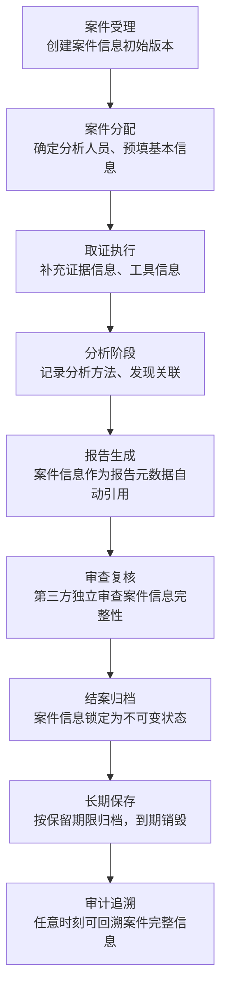
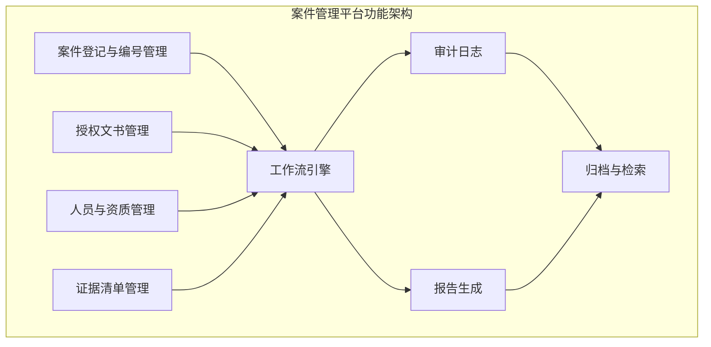

# 案件信息：数字取证的元数据锚点与法律基石

## 概述

案件信息（Case Information / Case Metadata）是数字取证全流程中最基础也最关键的结构化数据。它不是"填个表格"这么简单——从法律角度看，案件信息是证据可采性（Admissibility）的第一道门槛；从管理角度看，它是案件全生命周期的索引枢纽；从技术角度看，它是所有取证产物的元数据锚点。

本章从法律框架、标准体系、信息模型、生命周期管理、质量保证等维度，系统阐述案件信息的理论基础，帮助读者理解"为什么案件信息如此重要"以及"案件信息的设计应该遵循什么原则"。

> **与本章实操篇的关系**：理论基础篇聚焦于"为什么"和"应该怎样"，核心技巧篇聚焦于"具体怎么做"。读者在理解理论后，可进入[案件信息实操篇](../核心技巧/10-案件信息.md)获取模板、代码和自动化方案。

---

## 一、案件信息的法律根基

### 1.1 证据可采性与监管链

数字证据在法庭上能否被采信，取决于其是否满足三大法律要件：

| 要件 | 含义 | 与案件信息的关系 |
|------|------|-----------------|
| **真实性（Authenticity）** | 证据确实来源于所述出处 | 案件信息记录了证据的来源、采集人、采集时间，是证明真实性的基础 |
| **完整性（Integrity）** | 证据自采集后未被篡改 | 案件信息中的哈希校验值、环境快照是完整性的数学证明 |
| **关联性（Relevance）** | 证据与案件事实有逻辑关联 | 案件信息定义了取证范围和授权边界，明确了证据与案件的关联 |

这三大要件的实现，完全依赖于一条完整的**监管链（Chain of Custody）**。而监管链的第一环，正是案件信息——它定义了"谁在什么时间、因什么事由、以何种授权、对什么目标执行了取证"。

根据《联邦证据规则》（FRE 901(a)）的表述：

> "鉴真或识别证据，必须提出足以支持该证据即为提出者所主张之证据的证明。"

换言之，每一项数字证据在呈堂前都必须回答："这是什么？从哪里来？谁取的？什么时候取的？在什么条件下取的？"——这些答案全部来自案件信息。

### 1.2 国际标准框架

全球主要司法管辖区和国际组织对数字取证中的案件信息管理都有明确要求：

| 标准/法规 | 发布机构 | 案件信息相关核心要求 | 适用范围 |
|-----------|---------|---------------------|---------|
| **ISO/IEC 27037:2012** | ISO/IEC | 数字证据的识别、收集、获取和保存须有完整的元数据记录，包括案件标识、操作人员资质、时间戳 | 国际通用 |
| **NIST SP 800-86** | NIST（美国） | 事件响应中的取证操作须维护完整的案件文档，含案件编号、范围、参与者、时间线 | 美国联邦机构 |
| **NIST SP 800-101 Rev.1** | NIST（美国） | 移动设备取证须记录设备信息、案件编号、分析环境、工具版本 | 移动取证 |
| **ACPO数字证据原则** | 英国警察局长协会 | 六项原则中第四条明确要求"证据链每一环节必须有明确负责人" | 英国执法 |
| **《电子数据取证规则》GA/T 1770-2020** | 中国公安部 | 电子数据的提取、固定、移送须附完整的案件信息和操作记录 | 中国执法 |
| **《关于办理刑事案件收集提取和审查判断电子数据若干问题的规定》** | 最高法/最高检/公安部 | 电子数据须附"提取、复制、制作的过程说明"和"提取人、复制人、制作人签名" | 中国刑事司法 |
| **SWGDE Best Practices** | SWGDE | 数字证据标准化操作要求完整的案件元数据文档 | 国际执法机构 |

**关键洞察**：虽然各标准的表述不同，但核心要求高度一致——案件信息必须完整记录"谁、何时、何地、何事、何权"五要素。这不是某一个标准的特殊要求，而是全球司法实践的共识。

### 1.3 中国法律体系中的案件信息要求

中国法律体系对电子数据案件信息的要求经历了从无到有、从粗到细的演变过程：

**第一阶段：基础要求（2012年以前）**

2012年《刑事诉讼法》修正案首次将"电子数据"列为独立的法定证据类型（第50条），但对案件信息的具体要求尚不明确。

**第二阶段：细化规范（2012-2020年）**

《最高人民法院关于适用〈中华人民共和国刑事诉讼法〉的解释》（2012版）第93条开始对电子数据的审查标准提出具体要求，包括：
- 是否载明制作人、制作时间、制作方法
- 是否附有完整的提取笔录和清单
- 提取过程中是否有见证人在场

**第三阶段：全面规范（2020年至今）**

2020年发布的《电子数据取证规则》（GA/T 1770-2020）和最高法/最高检/公安部联合发布的《关于办理刑事案件收集提取和审查判断电子数据若干问题的规定》标志着中国电子数据案件信息管理进入了系统化阶段。核心要求包括：

1. **提取笔录**必须记载：案件编号、持有人/所有人信息、提取时间地点、提取方法和工具、见证人信息
2. **移送清单**必须包含：证据编号、名称、数量、特征描述、保存方式
3. **完整性校验**：提取和移送时必须计算并记录哈希值

**典型案例——案件信息不完整的法律后果**

在2019年某省一起网络诈骗案中，侦查机关提交的电子数据取证笔录缺少见证人签名，且提取时间仅记录日期未记录具体时间。辩方据此申请排除相关电子数据，法院最终认定该取证程序存在重大瑕疵，虽然未完全排除证据，但将其证明力大幅降低，作为"需要其他证据佐证"的辅助证据处理。这说明案件信息的完整性直接影响证据的证明力等级。

### 1.4 案件信息与"非法证据排除"

在刑事诉讼中，非法证据排除规则（中国《刑事诉讼法》第56条）是案件信息完整性的重要约束。虽然电子数据的非法排除主要针对"非法获取"而非"信息不完整"，但实务中案件信息的缺陷往往成为质疑取证合法性的突破口：

- **缺少授权文书编号** → 质疑取证行为的法律依据
- **缺少见证人记录** → 质疑取证过程的透明性
- **缺少时间戳或时区信息** → 质疑证据采集的时效性和准确性
- **分析人员无资质记录** → 质疑取证操作的专业性

因此，案件信息不仅是程序性要求，更是实质性的法律防御工事。

---

## 二、案件信息的信息架构理论

### 2.1 案件信息的元数据本质

从信息科学的角度看，案件信息本质上是一组**元数据（Metadata）**——关于数据的数据。具体来说：

```text
案件信息 = 证据数据的元数据 + 取证行为的元数据 + 法律授权的元数据

┌───────────────────────────────────────────────────────┐
│                     案件信息的三层结构                    │
├───────────────────────────────────────────────────────┤
│                                                       │
│   第一层：身份层（Identity Layer）                      │
│   ├── 案件编号 → 全局唯一标识                            │
│   ├── 案件名称 → 人类可读描述                            │
│   └── 案件类型 → 分类索引                               │
│                                                       │
│   第二层：授权层（Authorization Layer）                  │
│   ├── 委托单位 → 法律委托关系                            │
│   ├── 授权文书 → 法律正当性基础                           │
│   ├── 取证范围 → 授权边界                               │
│   └── 保密等级 → 访问控制依据                            │
│                                                       │
│   第三层：执行层（Execution Layer）                      │
│   ├── 分析人员 → 操作责任主体                            │
│   ├── 分析日期 → 时间锚点                               │
│   ├── 工具信息 → 可重复性保障                            │
│   └── 环境信息 → 可验证性保障                            │
│                                                       │
└───────────────────────────────────────────────────────┘
```

三层之间存在严格的逻辑依赖：执行层依赖授权层（没有授权就没有合法执行），授权层依赖身份层（没有案件编号就无法关联授权文书）。这就是为什么案件编号必须是第一个确定的字段——它是整个信息架构的根键。

### 2.2 案件信息的"指纹效应"

案件信息具有类似指纹的特性——一旦生成，其核心要素（案件编号、委托方、授权文书、初始时间戳）不应被修改，只能追加。这一特性源于法律证据的基本要求：

**不可变性原则**：案件编号一旦签发，即成为法律文件的引用锚点。修改案件编号等同于伪造法律文书。

**可追溯性原则**：案件信息的每次变更都必须留下审计轨迹，记录"谁在什么时间修改了什么字段，从什么值改为什么值"。

**最小变更原则**：核心字段（案件编号、委托单位、初始授权）只读；非核心字段（联系方式、补充信息）允许修改但需记录。

### 2.3 案件信息与证据元数据的关系

案件信息（Case Metadata）与证据元数据（Evidence Metadata）是两个不同层次但紧密关联的概念：

| 对比维度 | 案件信息 | 证据元数据 |
|----------|---------|-----------|
| **粒度** | 案件级（一个案件一组） | 证据级（每份证据一组） |
| **内容** | 案件编号、委托方、分析人员、授权信息 | 证据编号、哈希值、采集方式、物理/逻辑特征 |
| **生命周期** | 案件开始时创建，结案后归档 | 证据采集时创建，随证据存在而存在 |
| **关系** | 1:N（一个案件对应多份证据） | N:1（多份证据关联一个案件） |
| **法律功能** | 证明取证行为的合法性 | 证明证据本身的真实性和完整性 |

两者通过**案件编号**建立关联。案件信息是"容器"，证据元数据是"内容"——没有容器，内容就失去了归属和合法性基础。

---

## 三、案件信息的全生命周期管理

### 3.1 生命周期模型

案件信息不是一次性的表单填写，而是贯穿案件全生命周期的动态管理过程：



### 3.2 各阶段的案件信息管理要点

#### 阶段一：案件受理与创建

这是案件信息的"诞生"时刻。核心任务：

1. **分配案件编号**：按照机构编号规则签发唯一编号
2. **记录委托信息**：委托单位全称、联系人、授权文书编号
3. **确定保密等级**：影响后续所有信息的存储和流转方式
4. **记录受理时间**：使用ISO 8601格式，精确到秒，标注时区

**关键原则**：此时的信息应当是"最小充分集"——足够定义案件的法律身份，但不必等待所有信息才开始流程。例如，联系人的详细信息可以在后续补充，但案件编号和授权文书编号必须在受理时确定。

#### 阶段二：分配与预填充

将案件分配给具体分析人员时，需要：

1. **记录分析人员信息**：姓名、证书编号、角色（主分析/协助/复核）
2. **预填充证据范围**：已知的证据来源和大致数量
3. **确认授权范围**：分析人员的取证权限是否与授权文书一致
4. **签署保密协议**：记录NDA签署状态

#### 阶段三：取证执行中的动态更新

取证过程中，案件信息会持续更新：

- **新增证据来源**：每采集一份新证据，追加到案件信息的证据清单中
- **追加分析人员**：新参与的人员需要登记信息
- **补充授权信息**：如发现需要扩大取证范围，记录授权变更
- **更新时间线**：各环节的实际开始和结束时间

**关键约束**：取证执行阶段的更新必须遵循"只追加、不修改"原则。已记录的信息不允许被覆盖，只能通过"变更记录"进行修订。

#### 阶段四：报告生成中的自动引用

案件信息应当作为报告模板的自动引用源，而非手动复制。这是为了避免人为抄写错误，同时保证报告与案件信息的一致性。

#### 阶段五：结案归档与长期保存

结案时，案件信息进入"锁定"状态：

- 所有核心字段变为只读
- 变更日志冻结
- 生成最终的案件信息快照
- 按保密等级和保留期限进行归档

**保留期限的法律依据**：不同案件类型的证据保留期限不同。例如，中国《电子数据取证规则》要求刑事案件电子数据"至少保存至案件判决生效后二年"；行政案件"至少保存至行政处罚决定作出后二年"。

### 3.3 版本控制理论

案件信息的变更管理本质上是一个**版本控制**问题。推荐的版本控制模型：

```text
版本号格式：v{主版本}.{次版本}

v1.0  → 初始创建（案件受理时）
v1.1  → 非核心字段修改（如更新联系电话）
v1.2  → 新增非核心信息（如补充授权文书）
v2.0  → 核心字段变更（如授权范围扩大——这在法律上需要特别授权）
```

每次版本变更必须记录：
- 变更时间（UTC+时区偏移）
- 变更人（姓名+工号）
- 变更字段
- 变更前的值
- 变更后的值
- 变更原因

这一模型借鉴了软件工程中的版本控制思想，但在法律语境下增加了"变更原因"的要求——法律文件的每次修改都必须有正当理由。

---

## 四、案件信息的国际比较

### 4.1 英美法系 vs 大陆法系的案件信息要求

两大法系对案件信息的要求存在显著差异：

| 维度 | 英美法系（如美国、英国） | 大陆法系（如中国、德国） |
|------|------------------------|------------------------|
| **法律传统** | 判例法，强调程序正义 | 成文法，强调实体正义 |
| **案件信息重点** | 证据的"可采性"（Admissibility）——程序合法性优先 | 证据的"证明力"（Probative Value）——实质内容优先 |
| **鉴真要求** | FRE 901要求严格鉴真（Authentication），案件信息是鉴真的核心支撑 | 《刑事诉讼法》要求审查"真实性、关联性、合法性"，三者并重 |
| **见证人制度** | 英国ACPO要求，美国视案件类型而定 | 中国《电子数据取证规则》明确要求有见证人在场 |
| **标准化程度** | 高度标准化（NIST、SWGGDE等大量规范性文件） | 标准化程度在提升，但基层执行力参差不齐 |

### 4.2 跨境取证的案件信息挑战

在全球化背景下，跨境数字取证日益频繁。跨境案件的信息管理面临额外挑战：

1. **时区对齐**：不同国家的取证时间必须统一转换为UTC进行比较
2. **法律管辖权冲突**：同一案件可能涉及多个司法管辖区，需记录每个管辖区的法律依据
3. **语言差异**：案件信息可能需要多语言版本，核心字段（如案件编号）应使用通用编码
4. **数据保护法规**：GDPR（欧盟）、《个人信息保护法》（中国）等法规对案件信息中包含的个人信息有特殊保护要求
5. **证据互认**：跨境证据的案件信息需要满足双方司法管辖区的基本要求

### 4.3 云环境取证的案件信息扩展

云计算环境下的数字取证对传统案件信息模型提出了新的扩展需求：

| 传统案件信息 | 云环境扩展字段 |
|-------------|---------------|
| 证据来源 | 云服务商名称、账户ID、区域（Region） |
| 存储位置 | 云存储类型（S3 Blob/SQL/NoSQL）、逻辑路径 |
| 采集方式 | 云API调用日志、数据导出方式 |
| 采集环境 | 云服务商的API版本、认证方式 |
| 法律管辖权 | 数据中心所在国家/地区 |

云取证还引入了一个新的法律问题——**数据主权**：存储在境外的数据是否受境内法律管辖？案件信息中必须明确记录数据的物理存储位置和法律管辖权声明，以便后续法律审查。

---

## 五、案件信息的质量保证体系

### 5.1 质量维度模型

高质量的案件信息应满足以下质量维度：

```text
                    完整性
                      │
          准确性 ─────┼───── 一致性
                      │
                    时效性

        ┌──────────────────────┐
        │   高质量案件信息的     │
        │   四维质量模型         │
        └──────────────────────┘

准确性（Accuracy）：每个字段的值都是真实、正确的
完整性（Completeness）：所有必要字段都已填写
一致性（Consistency）：案件信息内部各字段不矛盾，且与证据元数据一致
时效性（Timeliness）：信息在正确的时间节点被记录和更新
```

### 5.2 常见质量缺陷与影响

| 质量缺陷 | 具体表现 | 法律后果 | 管理后果 |
|----------|---------|---------|---------|
| **信息缺失** | 未填写授权文书编号 | 无法证明取证合法性 | 无法追溯案件来源 |
| **信息错误** | 案件编号重复或格式错误 | 证据与案件的关联断裂 | 检索混乱，管理失控 |
| **信息过时** | 分析人员变更后未更新 | 出庭作证时人证不符 | 责任归属不清 |
| **信息不一致** | 案件信息中的时间与证据时间戳矛盾 | 质证时被攻击 | 分析结论可信度降低 |
| **信息不规范** | 使用非标准格式记录日期 | 跨系统交互失败 | 自动化流水线中断 |

### 5.3 自动化校验框架

在成熟的取证团队中，案件信息的质量保证不应仅依赖人工检查，而应建立自动化校验机制。校验规则可分为三个层次：

**第一层：格式校验（Format Validation）**

- 案件编号是否符合命名规范（如正则匹配 `^[A-Z]+-\d{4}-\d{4,6}$`）
- 日期时间是否为有效的ISO 8601格式
- 哈希值长度和字符集是否正确
- 必填字段是否为空

**第二层：逻辑校验（Logical Validation）**

- 分析结束日期不得早于开始日期
- 证据哈希值在采集和分析阶段是否一致
- 分析人员的证书编号格式是否有效
- 保密等级与信息脱敏状态是否匹配

**第三层：一致性校验（Consistency Validation）**

- 案件信息中的证据列表与实际采集清单是否一一对应
- 不同时间点记录的案件编号是否一致
- 案件信息中的授权范围与实际取证操作范围是否一致
- 多人协作时，各环节人员记录是否衔接

### 5.4 人工审核的关键节点

自动化校验无法替代人工审核。以下关键节点必须由资深取证人员或案件管理人员进行人工审查：

1. **案件受理审核**：确认授权文书的真实性和有效性
2. **证据采集审核**：确认采集操作是否在授权范围内
3. **报告签发审核**：确认案件信息与报告内容的一致性
4. **结案归档审核**：确认案件信息完整且无遗留问题

---

## 六、案件信息的数字化管理演进

### 6.1 从纸质到数字：管理范式的变迁

| 阶段 | 管理方式 | 优势 | 劣势 |
|------|---------|------|------|
| **纸质时代** | 手写案件登记簿 | 签名具有法律效力 | 检索困难，易丢失，协作效率低 |
| **电子表格时代** | Excel管理 | 便于排序和筛选 | 版本冲突严重，缺乏权限控制 |
| **数据库时代** | 关系型数据库 | 结构化查询，支持并发 | 部署成本较高，需要IT支持 |
| **平台化时代** | 专业取证管理平台 | 全流程自动化，内置合规校验 | 采购成本高，定制化困难 |
| **智能化时代** | AI辅助案件管理 | 智能分类、自动填充、异常检测 | 技术成熟度有待验证 |

### 6.2 现代案件管理系统的功能架构

一个成熟的案件管理平台应当包含以下核心功能模块：



各模块的设计原则：

- **案件登记与编号管理**：支持自动编号生成，防止编号冲突，支持多级子编号
- **授权文书管理**：关联案件编号，支持文书扫描件存储和到期提醒
- **人员与资质管理**：维护分析人员信息库，自动匹配证书有效性
- **证据清单管理**：支持多证据源登记，自动计算和验证哈希值
- **工作流引擎**：驱动案件从受理到归档的状态流转，支持并发和分支
- **审计日志**：记录所有操作的who/when/what，不可删除
- **报告生成**：基于案件信息自动填充报告模板，支持多人协作编辑
- **归档与检索**：支持多维度检索（案件编号、日期范围、案件类型、分析人员等）

---

## 七、常见误区与深度解析

### 误区一："案件信息只是行政手续，和取证技术无关"

**深层原因**：技术导向的取证人员往往重视工具操作，忽视文档记录。

**纠正**：案件信息是技术与法律的交汇点。即使你使用最先进的工具、执行最精确的分析，如果案件信息不完整，整个取证结果在法庭上的可信度会大打折扣。在多个司法管辖区的判例中，技术上完美的取证结果因为"程序性瑕疵"（即案件信息缺陷）而被排除。

**经验法则**：案件信息的记录投入应占整个取证工作量的5%-10%。这10%的投入保护的是其余90%的工作成果不被推翻。

### 误区二："一个人可以同时担任分析师和审核员"

**深层原因**：小团队资源有限，难以实现严格的职责分离。

**纠正**：ISO/IEC 27037:2012和ACPO原则都要求取证过程中的职责分离（Segregation of Duties）。分析人员和审核人员必须是不同的人，原因在于：

1. **独立性保障**：审核的目的是独立验证分析结论，自己审自己等于没有审核
2. **法庭可信度**：辩护律师会质疑"同一个人做的分析和审核，如何保证客观性？"
3. **错误发现率**：独立审核发现错误的概率显著高于自我审查

**最低要求**：即使只有两名取证人员，也应该实行交叉审核——A审核B的案件，B审核A的案件。

### 误区三："时间只写日期就够了，不需要精确到秒"

**深层原因**：对数字证据的时间敏感性认识不足。

**纠正**：数字证据的时间精度要求远高于传统物证。原因在于：

1. **时间线重建**：数字取证的核心技术之一是时间线分析，秒级甚至毫秒级的时间差可能决定行为的因果关系
2. **并发分析**：多台服务器同时被入侵时，精确的时间戳用于判断攻击的先后顺序和传播路径
3. **系统时钟偏差**：不同设备的系统时钟可能存在偏差，需要通过精确记录来校准
4. **法律时效**：某些违法行为的认定有严格的时间窗口

**标准格式**：`2026-06-25T14:30:17.234+08:00`（ISO 8601，精确到毫秒，含时区偏移）

### 误区四："案件信息一旦创建就不能修改"

**深层原因**：混淆了"核心字段不可变"与"全部字段不可变"。

**纠正**：案件信息的不可变性是分层次的：

- **核心字段（不可变）**：案件编号、初始委托单位、初始授权文书编号、初始创建时间——这些字段一旦确定，任何修改都需要特殊授权和完整的审计日志
- **执行字段（可追加）**：分析人员列表、证据清单、工作日志——随案件进展可以追加新信息
- **辅助字段（可修改）**：联系方式、备注信息——允许修改，但每次修改需记录变更日志

### 误区五："跨境案件只需要一份案件信息"

**深层原因**：未认识到不同司法管辖区对案件信息的不同要求。

**纠正**：跨境案件可能需要维护多套案件信息：

1. **境内案件信息**：按照本国法律标准记录
2. **境外协助信息**：按照对方国家/地区的法律要求记录
3. **国际协调信息**：按照国际刑警组织或双边司法协助协定的格式记录

三套信息之间通过案件编号建立关联，但各自的格式和必填字段可能不同。

---

## 八、进阶：案件信息的智能化趋势

### 8.1 AI辅助案件信息管理

人工智能技术正在改变案件信息管理的方式：

1. **智能编号生成**：基于历史案件数据，自动推荐案件编号和分类
2. **自动填充**：从案件受理的初始信息（如报案记录、委托函）中自动提取关键字段
3. **异常检测**：识别案件信息中的逻辑矛盾和遗漏（如证据采集时间晚于分析开始时间）
4. **智能分类**：基于案件描述文本，自动推荐案件类型和优先级
5. **关联发现**：自动识别新案件与历史案件的潜在关联

### 8.2 区块链存证

区块链技术为案件信息的不可篡改性提供了新的技术路径：

- **时间戳服务**：将案件信息的哈希值上链，提供不可篡改的时间证明
- **完整性校验**：通过链上哈希值验证案件信息是否被篡改
- **跨境互信**：区块链的去中心化特性有助于解决跨境案件中的信息互信问题

目前，中国多地法院已经开始探索区块链在电子证据存证中的应用（如最高人民法院的"人民法院统一司法区块链平台"），案件信息的区块链存证是这一趋势的自然延伸。

### 8.3 标准化与互操作性

随着数字取证行业的成熟，案件信息的标准化和互操作性成为重要发展方向：

- **CASE（Cyber-investigation Analysis Standard Expression）**：MITRE提出的网络调查分析标准表达，旨在实现取证工具之间的案件信息互操作
- **CIF（Common Intelligence Format）**：威胁情报共享的通用格式，部分字段与案件信息重叠
- **STIX/TAXII**：网络威胁情报共享标准，与案件信息管理系统的集成

这些标准虽然目前主要应用于威胁情报领域，但其设计理念对案件信息的标准化管理有重要借鉴意义。

---

## 九、总结

案件信息是数字取证全流程的**元数据锚点**，也是**法律正当性的根基**。

| 层级 | 核心认知 | 行动指引 |
|------|---------|---------|
| **入门** | 案件信息不只是行政手续，而是法律文件 | 使用标准化模板，不遗漏任何必填字段 |
| **进阶** | 案件信息的质量直接决定证据的法律效力 | 建立版本控制和变更管理机制 |
| **精通** | 案件信息管理是一个系统工程 | 设计机构级的信息架构和质量保证体系 |

**一句话总结**：案件信息填得好，法庭之上少烦恼。每一笔记录，都是在为证据的合法性修筑防线。

---

> **延伸阅读**：
> - ISO/IEC 27037:2012 — 电子证据识别、收集、获取和保存指南
> - NIST SP 800-86 — 事件响应中的取证技术指南
> - 《电子数据取证规则》（GA/T 1770-2020）— 中国公安部
> - 《最高人民法院关于适用〈中华人民共和国刑事诉讼法〉的解释》第93条
> - ACPO Principles of Digital Evidence — 英国警察局长协会
> - SWGDE Best Practices for Computer Forensics — 国际数字证据科学工作组
> - MITRE CASE — 网络调查分析标准表达框架
