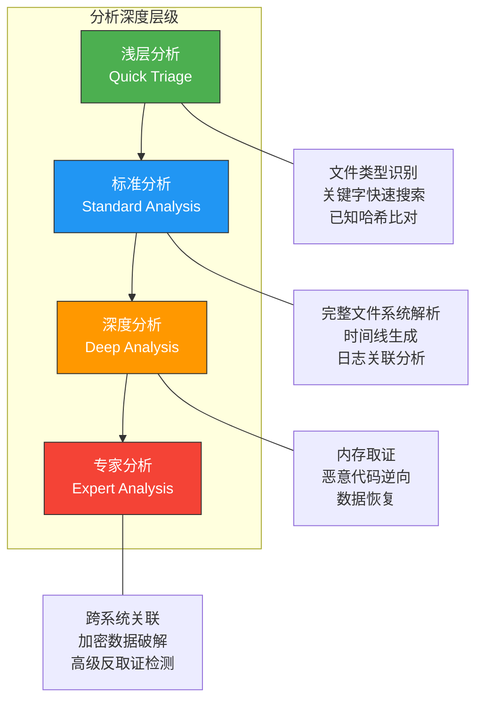

## 25.13 数字取证分析方法

分析方法是数字取证的核心技术环节——当证据已经收集完毕、检验阶段完成筛选之后，取证人员如何从海量数据中提炼出有价值的信息、还原出事件真相，依赖的正是系统化的分析方法。本章从方法论层面出发，系统介绍数字取证中所有主流分析方法的原理、适用场景、操作流程与工具选择。

分析方法不是孤立的技术手段，而是与取证流程紧密耦合的方法体系。它承接前面章节的取证原则与证据链管理，又为后续的分析发现与结论提供技术支撑。理解分析方法的关键在于：**不是学会每种工具的使用，而是掌握在面对不同类型的案件时，如何选择正确的分析路径**。

---

### 25.13.1 分析方法的分类体系

数字取证分析方法可以从多个维度进行分类。理解分类体系有助于在面对具体案件时快速定位合适的分析路径。

#### 按数据类型分类

| 分析类型 | 数据对象 | 核心目标 | 典型工具 |
|:--|:--|:--|:--|
| 文件系统分析 | 磁盘镜像、分区、文件系统结构 | 还原文件操作历史、恢复已删除数据 | Autopsy, EnCase, The Sleuth Kit |
| 内存分析 | RAM转储、休眠文件 | 提取运行时数据：进程、网络连接、加密密钥 | Volatility, Rekall, LiME |
| 网络流量分析 | PCAP文件、NetFlow数据 | 重建网络会话、识别恶意通信 | Wireshark, Zeek, NetworkMiner |
| 日志分析 | 系统日志、应用日志、安全设备日志 | 提取事件序列、识别异常行为 | ELK Stack, Splunk, LogParser |
| 注册表分析 | Windows注册表蜂巢文件 | 用户行为分析、持久化检测 | Registry Explorer, RegRipper |
| 邮件分析 | PST、OST、MBOX、EML文件 | 邮件通信重建、附件分析 | Aid4Mail, Kernel Email Viewer |
| 移动设备分析 | 手机镜像、备份文件 | App数据、通话记录、位置信息 | Cellebrite UFED, MDF |
| 云环境分析 | 云平台审计日志、API调用记录 | 云上行为重建 | Prowler, ScoutSuite, CloudTrail |

#### 按分析深度分类



| 层级 | 分析深度 | 耗时 | 适用场景 | 人员要求 |
|:--|:--|:--|:--|:--|
| 浅层分析 | 快速筛选 | 分钟级 | 现场初筛、大量设备排查 | 一线响应人员 |
| 标准分析 | 全面检查 | 小时至天级 | 常规案件、内部调查 | 取证分析师 |
| 深度分析 | 深入挖掘 | 天至周级 | APT溯源、复杂案件 | 高级取证专家 |
| 专家分析 | 极限突破 | 周至月级 | 高度对抗、加密破解 | 取证实验室团队 |

#### 按推理模式分类

**归纳推理法（Inductive Analysis）**

从具体数据出发，逐步归纳出整体结论。这是最常见的分析方式——先看到具体的日志、文件、网络连接，然后总结出攻击模式。

```text
观察1：多个工作站上发现了相同的可疑进程
观察2：这些进程都与同一外部IP通信
观察3：通信时间集中在凌晨2-4点
归纳结论：存在一个协调的后门程序网络
```

**演绎推理法（Deductive Analysis）**

先提出假设，然后用数据验证或推翻。适用于有初步情报的案件。

```text
假设：攻击者通过RDP暴力破解入侵
验证步骤：
  1. 检查安全日志中的4625（登录失败）事件 → 发现凌晨大量失败
  2. 检查4624（登录成功）事件 → 失败后紧接成功
  3. 检查来源IP → 来自已知的代理IP段
  结论：假设成立，确认为RDP暴力破解
```

**溯因推理法（Abductive Analysis）**

从异常结果出发，反向推导最可能的原因。这是高级取证分析师的核心能力。

```text
异常现象：服务器磁盘空间突然减少50GB
排除过程：
  - 检查日志 → 无大量文件写入记录（排除正常写入）
  - 检查文件系统 → 发现大量隐藏的加密文件（排除磁盘故障）
  - 检查时间线 → 加密操作发生在安全日志被清除之后
最可能解释：攻击者先清除日志，再加密文件（勒索软件）
```

---

### 25.13.2 文件系统分析

文件系统分析是数字取证中最基础也是最重要的分析方法。它通过解析存储介质上的文件系统结构，获取文件元数据、目录结构、已删除文件痕迹等关键信息。

#### 文件系统分析的核心内容

**MFT/Inode分析**

NTFS的MFT（Master File Table）和Linux的inode是文件系统分析的核心数据结构。每个MFT记录或inode都包含文件的完整元数据：

| 字段 | NTFS MFT | Linux Inode | 分析价值 |
|:--|:--|:--|:--|
| 创建时间 | $SI-CrTime | crtime（ext4） | 文件最早存在的时间 |
| 修改时间 | $SI-ModTime | mtime | 内容最后变更时间 |
| 访问时间 | $SI-AccTime | atime | 最后读取时间 |
| 元数据变更时间 | $SI-MFTModTime | ctime | 权限/所有者变更 |
| 文件大小 | $FILE_NAME | inode.size | 数据量评估 |
| 数据属性 | $DATA（常驻/非常驻） | inode.block | 数据存储位置 |
| 文件名 | $FILE_NAME | 目录项 | 原始文件名（含备用流） |

```bash
# 使用The Sleuth Kit分析MFT
# 列出MFT中所有文件记录
fls -r -m "/" /evidence/disk.E01 > bodyfile.txt

# 查看特定文件的详细元数据
istat /evidence/disk.E01 <inode_number>

# 提取MFT原始数据
icat /evidence/disk.E01 <inode_number> > extracted_mft_entry.dat

# 分析NTFS备用数据流（ADS）
fls -r /evidence/disk.E01  # 检查输出中的 ":$DATA" 标记
```

**已删除文件恢复**

文件删除的本质是文件系统标记该空间为"可用"，但实际数据仍保留在磁盘上，直到被新数据覆盖。文件系统分析可以恢复这些"已删除"的文件。

恢复策略取决于文件系统类型：

```text
NTFS已删除文件恢复：
├── 方法一：MFT记录仍然存在
│   ├── 直接通过MFT记录中的数据属性恢复
│   └── 工具：Autopsy, EnCase, R-Studio
├── 方法二：MFT记录已被部分覆盖
│   ├── 通过文件头签名（Magic Bytes）在空闲空间中搜索
│   └── 工具：Foremost, Scalpel, PhotoRec
└── 方法三：文件被覆写多次
    └── 可能无法完整恢复，只能提取数据碎片

Linux已删除文件恢复：
├── ext3：日志中可能保留文件内容片段
│   └── 工具：extundelete
├── ext4：支持日志模式恢复
│   └── 工具：extundelete, photorec
└── 文件签名扫描（适用于所有文件系统）
    └── 工具：foremost, scalpel
```

```bash
# 使用PhotoRec恢复已删除文件（基于文件签名）
photorec /evidence/disk.E01

# 使用foremost恢复特定类型文件
foremost -t pdf,doc,xls -i /evidence/disk.E01 -o /output/recovered/

# 使用extundelete恢复ext4文件系统中的已删除文件
extundelete /dev/sda1 --restore-all --output-dir /output/recovered/
```

**文件系统日志分析**

NTFS和ext4都维护了文件系统日志，记录文件操作的历史记录，这是文件系统分析中经常被忽视但极具价值的数据源：

- **NTFS $UsnJrnl**：记录文件的创建、删除、修改、重命名、加密等操作，包含时间戳和操作类型。即使文件已被删除，日志中仍保留操作记录
- **NTFS $LogFile**：NTFS事务日志，记录文件系统级别的元数据操作
- **ext4 Journal**：ext4的日志，通过 `debugfs -R 'ls -l -d <journal_inode> /dev/sda1'` 可以读取

#### 工具选择矩阵

| 工具 | 类型 | 核心优势 | 适用场景 | 许可证 |
|:--|:--|:--|:--|:--|
| Autopsy | 开源GUI | 模块化插件、时间线集成、开源可审计 | 通用取证分析 | Apache 2.0 |
| EnCase | 商业 | 法庭认可度最高、深度解析能力强 | 刑事/法庭取证 | 商业许可 |
| FTK | 商业 | 搜索速度快、索引功能强大 | 大容量磁盘分析 | 商业许可 |
| The Sleuth Kit | 开源CLI | 轻量、可脚本化、跨平台 | 自动化分析、脚本集成 | GPL |
| X-Ways Forensics | 商业 | 小巧高效、资源占用低 | 低配置环境、快速分析 | 商业许可 |
| Magnet AXIOM | 商业 | 云+本地+移动设备统一分析 | 多源数据融合 | 商业许可 |

---

### 25.13.3 内存分析

内存取证是数字取证中最具挑战性的分析方法之一。内存中保留了系统运行时的完整状态——包括已从磁盘删除的文件内容、网络连接状态、加密密钥、运行中的恶意代码等。这些信息在断电后将永久丢失，因此内存分析既是高价值也是高风险的分析手段。

#### 内存分析的数据价值

内存中可以提取的信息远比多数人想象的丰富：

| 数据类别 | 可提取信息 | 攻击者视角 | 取证价值 |
|:--|:--|:--|:--|
| 进程信息 | 进程名、PID、父子关系、命令行参数 | 隐藏恶意进程 | 识别无文件攻击、进程注入 |
| 网络连接 | 本地/远程IP、端口、连接状态 | C2通信 | 还原C2地址、通信内容 |
| 注册表 | 注册表键值的内存映像 | 持久化配置 | 恢复内存中的注册表修改 |
| 文件句柄 | 打开的文件、映射的DLL | 操作痕迹 | 确认文件访问行为 |
| 凭据信息 | 密码哈希、明文凭据、Kerberos票据 | 凭据窃取 | 还原攻击者获取的凭据 |
| 命令历史 | 已执行的命令、PowerShell脚本 | 攻击操作 | 重建攻击者操作序列 |
| 加密密钥 | BitLocker密钥、PGP密钥 | 数据保护 | 解密被加密的数据 |

#### 内存分析的工作流程

```text
内存分析标准流程：
│
├── 第一步：内存镜像格式识别
│   ├── Raw格式（.raw/.mem）→ 直接加载
│   ├── LiME格式（.lime）→ Volatility原生支持
│   ├── AFF格式（.aff）→ 需要afflib
│   └── 休眠文件（hiberfil.sys）→ 需要专用工具转换
│
├── 第二步：操作系统识别
│   ├── 使用 imageinfo/banner 命令识别OS版本和架构
│   ├── 选择正确的Profile（Volatility 2）或直接检测（Volatility 3）
│   └── 确认内核版本、补丁级别
│
├── 第三步：基础信息提取
│   ├── 进程列表（pslist/pstree）
│   ├── 网络连接（netscan）
│   ├── 命令行历史（cmdscan/consoles）
│   └── DLL列表（dlllist）
│
├── 第四步：深度分析
│   ├── 进程内存转储（procdump/memdump）
│   ├── 注册表蜂巢提取（hivelist/hivedump）
│   ├── 文件提取（dumpfiles）
│   └── 恶意代码检测（malfind/yarascan）
│
└── 第五步：关联分析
    ├── 将内存中的发现与磁盘分析结果交叉验证
    ├── 构建完整的事件时间线
    └── 评估攻击影响范围
```

#### Volatility 3实战操作

```bash
# Volatility 3 基础信息提取

# 1. 识别内存镜像信息
vol3 -f /evidence/memory.raw windows.info

# 2. 列出所有进程（带父子关系的树形视图）
vol3 -f /evidence/memory.raw windows.pstree

# 3. 检测网络连接（包括已关闭的连接残留）
vol3 -f /evidence/memory.raw windows.netscan

# 4. 提取命令行历史
vol3 -f /evidence/memory.raw windows.cmdline

# 5. 提取控制台历史（比cmdline更完整）
vol3 -evidence/memory.raw windows.consoles

# 6. 扫描可疑进程内存（检测进程注入）
vol3 -f /evidence/memory.raw windows.malfind

# 7. 使用YARA规则扫描内存
vol3 -f /evidence/memory.raw yarascan.YaraScan --yara-file /rules/suspicious.yar

# 8. 提取特定进程的内存转储
vol3 -f /evidence/memory.raw windows.memmap --pid 1234 --dump

# 9. 提取注册表蜂巢
vol3 -f /evidence/memory.raw registry.hivelist

# 10. 提取文件列表
vol3 -f /evidence/memory.raw windows.filescan

# 11. 提取MFT信息
vol3 -f /evidence/memory.raw windows.mftscan

# 12. 检测回调函数（高级持久化检测）
vol3 -f /evidence/memory.raw windows.callbacks

# 13. 检测内核模块
vol3 -f /evidence/memory.raw windows.modules

# 14. 检测驱动程序
vol3 -f /evidence/memory.raw windows.driverscan
```

#### 内存分析的常见误区

| 误区 | 正确理解 |
|:--|:--|
| "内存镜像拿到就能分析" | 必须先确认OS版本，选择正确的Profile，否则分析结果不准确 |
| "进程列表就是当时运行的" | pslist可能遗漏被rootkit隐藏的进程，必须结合psscan（扫描进程池） |
| "内存中的数据都是真实的" | 操作系统可能修改内存中的某些字段，需要交叉验证 |
| "Volatility 2和3结果一样" | 两者在插件实现、解析逻辑上有显著差异，推荐统一使用Volatility 3 |
| "内存镜像越早获取越好" | 正确，但不能因为追求速度而跳过ACPO原则，必须在受控环境下获取 |

---

### 25.13.4 网络流量分析

网络流量分析通过捕获和分析网络数据包，还原网络通信行为。它是追踪数据泄露路径、识别C2通信、分析网络攻击过程的关键方法。

#### 网络流量分析的核心维度

**协议分析**

每种网络协议都有特定的分析价值：

| 协议 | 分析价值 | 常见攻击场景 | 分析重点 |
|:--|:--|:--|:--|
| DNS | 域名查询记录揭示C2通信、数据外泄 | DGA域名、DNS隧道、DNS over HTTPS | 查询频率、域名长度、NXDOMAIN比例 |
| HTTP/HTTPS | Web通信内容、下载行为 | 恶意软件下载、数据上传 | URI模式、User-Agent、证书信息 |
| SMB/CIFS | Windows文件共享 | 横向移动、文件窃取 | 访问路径、认证事件、文件传输量 |
| RDP | 远程桌面连接 | 横向移动、远程控制 | 连接时间、源IP、会话时长 |
| SMTP | 邮件发送 | 数据外泄、钓鱼邮件 | 收件人、附件大小、发送时间 |
| FTP | 文件传输 | 数据外泄、工具上传 | 传输文件名、大小、方向 |
| ICMP | 网络探测 | 隧道通信、数据外泄 | 包大小、频率、payload内容 |
| TLS/SSL | 加密通信 | 隐藏的C2通道 | 证书信息、JA3指纹、SNI |

**流量统计分析**

```python
# 使用Scapy进行流量统计分析示例
from scapy.all import *
from collections import Counter

# 读取PCAP文件
packets = rdpcap('/evidence/capture.pcap')

# 统计源IP分布
src_ips = Counter(p[IP].src for p in packets if IP in p)
print("=== 源IP分布（Top 10）===")
for ip, count in src_ips.most_common(10):
    print(f"  {ip}: {count} packets")

# 统计目的端口分布
dst_ports = Counter(p[TCP].dport for p in packets if TCP in p)
print("\n=== 目的端口分布（Top 10）===")
for port, count in dst_ports.most_common(10):
    print(f"  Port {port}: {count} packets")

# 检测异常DNS查询（长域名）
dns_queries = [p for p in packets if DNS in p and p[DNS].qr == 0]
long_dns = [q for q in dns_queries if len(q[DNS].qname) > 50]
print(f"\n=== 疑似DGA域名（>50字符）===")
for q in long_dns:
    print(f"  {q[DNS].qname.decode()} -> 可疑")
```

#### Wireshark关键过滤器

Wireshark是网络流量分析最常用的工具。掌握以下过滤器是高效分析的基础：

```text
# 基础过滤
ip.addr == 192.168.1.100              # 特定IP的流量
tcp.port == 443                       # HTTPS流量
dns                                  # DNS流量
http                                 # HTTP流量

# 攻击检测过滤
tcp.flags.syn == 1 && tcp.flags.ack == 0   # SYN扫描检测
dns.qry.name contains "xyz"                # 包含特定域名的DNS查询
http.user_agent contains "curl"            # 非浏览器的HTTP请求
tcp.analysis.retransmission                # TCP重传（可能的网络异常）

# 数据外泄检测
frame.len > 1400 && tcp.dstport == 443     # 大包+443端口（HTTPS上传）
dns.qry.len > 50                           # 长域名DNS查询（DNS隧道）

# 横向移动检测
tcp.dstport == 445 || tcp.dstport == 3389  # SMB/RDP连接
kerberos.CNameString == "admin$"           # 特定服务账号的Kerberos

# 统计分析
Statistics → Conversations    # 查看所有网络会话
Statistics → Protocol Hierarchy  # 协议分布
Statistics → Endpoints        # 通信端点统计
```

#### 网络流量分析的实战流程

```text
网络流量分析标准流程：
│
├── 第一步：流量概览
│   ├── 协议分布统计（Protocol Hierarchy）
│   ├── 通信端点统计（Endpoints）
│   ├── 会话统计（Conversations）
│   └── 确定分析的时间范围和重点关注的IP/端口
│
├── 第二步：异常识别
│   ├── DNS异常：高频率查询、长域名、新注册域名
│   ├── HTTP异常：异常User-Agent、非标端口、大量POST请求
│   ├── 加密流量异常：异常证书、JA3指纹不匹配
│   └── 流量模式异常：周期性通信（心跳）、突发大流量
│
├── 第三步：深度解析
│   ├── 提取可疑文件（File → Export Objects）
│   ├── 重建TCP会话（Follow → TCP Stream）
│   ├── 解析DNS隧道数据
│   └── 分析TLS/SSL元数据
│
└── 第四步：证据固定
    ├── 导出关键数据包
    ├── 生成流量分析报告
    └── 与主机分析结果交叉验证
```

---

### 25.13.5 日志分析

日志是数字取证中最可靠的数据源之一。与文件系统元数据不同，日志是系统有意识地记录的事件，具有更强的语义价值。日志分析的目标是从海量日志中提取与调查相关的事件序列。

#### Windows事件日志分析

Windows事件日志包含安全、系统、应用程序等多个日志文件，是Windows取证分析的核心数据源。

```bash
# 使用EvtxECmd（Eric Zimmerman工具）解析事件日志
EvtxECmd.exe -f "C:\Windows\System32\winevt\Logs\Security.evtx" --csv /output/ --csvf security.csv

# 使用LogParser查询事件日志
LogParser "SELECT TimeGenerated, EventID, Message 
           FROM 'C:\Logs\Security.evtx' 
           WHERE EventID IN (4624, 4625, 4648, 4688, 1102)
           ORDER BY TimeGenerated"

# 使用PowerShell分析事件日志
Get-WinEvent -FilterHashtable @{LogName='Security'; ID=4624} -MaxEvents 100 |
  Select-Object TimeCreated, Id, Message |
  Format-Table -AutoSize

# 提取安全日志中所有登录事件
Get-WinEvent -FilterHashtable @{LogName='Security'; ID=4624} |
  Where-Object { $_.Properties[8].Value -eq 10 } |  # 类型10：远程交互式
  Select-Object TimeCreated, @{N='SourceIP';E={$_.Properties[18].Value}}
```

**关键安全事件ID速查表**

| 事件ID | 含义 | 分析价值 | 取证关注点 |
|:--|:--|:--|:--|
| 4624 | 登录成功 | 确认用户活动 | 登录类型、来源IP、账户名 |
| 4625 | 登录失败 | 暴力破解检测 | 失败原因、来源IP、频率 |
| 4648 | 显式凭据登录 | 横向移动信号 | 使用runas/psexec的登录 |
| 4672 | 特权分配 | 特权操作确认 | 管理员登录时间 |
| 4688 | 新进程创建 | 攻击工具执行 | 进程名、父进程、命令行 |
| 4698 | 计划任务创建 | 持久化检测 | 任务名称、执行命令 |
| 4720 | 用户账户创建 | 后门账户 | 创建的账户名、操作者 |
| 4732 | 安全组成员添加 | 权限提升 | 添加到管理员组的账户 |
| 4776 | NTLM认证 | 凭据验证 | 认证是否成功、来源 |
| 1102 | 安全日志清除 | 反取证信号 | 清除者身份、清除时间 |

#### Linux日志分析

```bash
# 使用log2timeline/plaso分析Linux日志
log2timeline.py --storage-file timeline.plaso /evidence/disk.E01

# 关键日志文件位置
# /var/log/auth.log — 认证日志
grep -i "failed\|accepted\|invalid" /var/log/auth.log

# /var/log/syslog — 系统日志
grep -i "error\|warning\|critical" /var/log/syslog

# /var/log/secure — 安全日志（RHEL/CentOS）
awk '/Failed password/{print $1,$2,$3,$9,$11}' /var/log/secure | sort | uniq -c | sort -rn

# 检测SSH暴力破解
grep "Failed password" /var/log/auth.log | awk '{print $(NF-3)}' | sort | uniq -c | sort -rn | head -20

# 使用journalctl分析systemd日志
journalctl --since "2024-01-15 00:00" --until "2024-01-16 00:00" -u sshd --no-pager

# 分析cron日志
grep CRON /var/log/syslog | awk '{print $1,$2,$3,$6,$NF}'
```

#### 日志关联分析技术

日志关联是将不同来源的日志事件联系起来，构建完整事件链的技术：

```text
日志关联分析示例：
│
├── 网络层：防火墙日志 → 记录了192.168.1.100的RDP连接
│   └── 时间：2024-01-15 02:15:00
│
├── 认证层：Windows安全日志 → 4624（登录成功），类型10
│   └── 时间：2024-01-15 02:15:03
│
├── 进程层：Sysmon日志 → 4688（新进程创建），cmd.exe
│   └── 时间：2024-01-15 02:15:10
│
├── 命令层：PowerShell日志 → 执行了Get-WmiObject查询
│   └── 时间：2024-01-15 02:15:15
│
└── 关联结论：攻击者通过RDP登录后，执行了WMI枚举命令
```

---

### 25.13.6 注册表分析

Windows注册表是Windows系统的核心配置数据库，在取证分析中具有极高的价值。注册表几乎记录了系统的所有配置状态和用户活动。

#### 注册表分析的关键位置

| 注册表路径 | 分析价值 | 提取工具 |
|:--|:--|:--|
| `HKLM\SOFTWARE\Microsoft\Windows NT\CurrentVersion` | 系统版本、安装时间、产品密钥 | Registry Explorer |
| `HKLM\SYSTEM\CurrentControlSet\Services` | 已安装的服务（持久化检测） | RegRipper |
| `HKLM\SOFTWARE\Microsoft\Windows\CurrentVersion\Run` | 自启动程序（持久化） | Registry Explorer |
| `HKCU\Software\Microsoft\Windows\CurrentVersion\Explorer\RunMRU` | 最近运行命令 | RegRipper |
| `HKCU\Software\Microsoft\Windows\CurrentVersion\Explorer\TypedURLs` | 浏览器地址栏历史 | Registry Explorer |
| `HKLM\SYSTEM\MountedDevices` | 已挂载的磁盘设备（USB使用记录） | Registry Explorer |
| `HKLM\SOFTWARE\Microsoft\Windows\CurrentVersion\Uninstall` | 已安装软件列表 | RegRipper |
| `NTUSER.DAT`（用户蜂巢） | 用户级所有配置 | Autopsy |

```bash
# 使用RegRipper提取注册表信息
# 提取自启动项
rip.pl -r registry.hive -p autoclass

# 提取USB设备历史
rip.pl -r registry.hive -p usbstor

# 提取用户操作历史
rip.pl -r registry.hive -p userassist

# 使用Registry Explorer分析（GUI工具）
# 加载SYSTEM和NTUSER.DAT蜂巢文件
# 自动解析时间戳、关联用户、生成报告
```

---

### 25.13.7 时间线分析

时间线分析是将所有数据源中的事件按时间顺序排列，还原完整事件序列的方法。它是串联所有分析结果的"粘合剂"。

> 详细的工具和技巧请参见核心技巧部分的"时间线分析"章节。此处仅概述方法论层面的内容。

时间线分析的核心步骤：


**关键原则：**

- **多源数据融合**：不要只看单一日志源。将文件系统时间戳、事件日志、注册表时间、网络连接时间合并到一个时间轴上
- **时区对齐**：不同数据源可能使用不同时区。所有时间戳必须统一转换为UTC后再进行排序
- **时间窗口聚焦**：先确定可疑时间窗口，再在窗口内进行深度分析，避免在海量数据中迷失
- **异常检测**：关注时间戳的不连续、回溯、跳跃等异常——这些往往是攻击者活动的痕迹

---

### 25.13.8 恶意代码分析

当取证过程中发现可疑文件时，恶意代码分析是判断其性质、功能和影响的关键方法。

#### 静态分析与动态分析

| 分析类型 | 操作方式 | 优点 | 缺点 | 适用场景 |
|:--|:--|:--|:--|:--|
| 静态分析 | 不运行恶意代码，直接分析二进制 | 安全、快速、可审计 | 受加壳/混淆影响大 | 初步分类、快速IOC提取 |
| 动态分析 | 在沙箱中运行恶意代码 | 观察真实行为 | 风险高、可能被检测 | 行为分析、C2通信识别 |
| 混合分析 | 先静态后动态，交叉验证 | 最全面 | 耗时长 | 复杂恶意代码、APT样本 |

#### 静态分析流程

```bash
# 1. 文件基本信息
file suspicious.exe
strings -n 8 suspicious.exe > strings_output.txt
xxd suspicious.exe | head -20  # 查看文件头

# 2. 哈希计算（用于IOC提取）
sha256sum suspicious.exe
md5sum suspicious.exe

# 3. PE头分析（Windows可执行文件）
# 使用pefile（Python）
python3 -c "
import pefile
pe = pefile.PE('suspicious.exe')
print(f'Machine: {hex(pe.FILE_HEADER.Machine)}')
print(f'Timestamp: {pe.FILE_HEADER.TimeDateStamp}')
print(f'Sections:')
for s in pe.sections:
    print(f'  {s.Name.decode():8s} VirtualSize={hex(s.Misc_VirtualSize)}')
"

# 4. YARA规则匹配
yara -r /rules/malware.yar suspicious.exe

# 5. VirusTotal查询（需要API密钥）
# curl -X POST https://www.virustotal.com/api/v3/files -H "x-apikey: YOUR_KEY" -F "file=@suspicious.exe"
```

#### 动态分析环境搭建

```text
动态分析沙箱配置：
│
├── 操作系统：Windows 10/11 虚拟机
│   ├── 关闭Windows Defender（排除分析工具目录）
│   ├── 关闭自动更新
│   └── 启用网络监控（Wireshark/InetSim）
│
├── 网络环境：
│   ├── 使用INetSim模拟DNS/HTTP/FTP等服务
│   ├── 配置虚拟网络隔离（防止真实互联网连接）
│   └── 部署tcpdump/NetworkMiner捕获流量
│
├── 监控工具：
│   ├── Process Monitor（进程/文件/注册表监控）
│   ├── Process Explorer（进程信息、DLL列表）
│   ├── Regshot（注册表变更快照对比）
│   └── Wireshark（网络流量捕获）
│
└── 快照管理：
    ├── 执行前创建虚拟机快照
    ├── 执行样本，观察行为（建议5-10分钟）
    ├── 分析结果后恢复快照
    └── 记录所有观察到的行为
```

---

### 25.13.9 数据恢复与提取

数据恢复是数字取证中的关键技术，旨在从存储介质中恢复已被删除、损坏或隐藏的数据。

#### 数据恢复的方法层次

```text
数据恢复技术栈：
│
├── 第一层：文件系统级恢复
│   ├── NTFS：$MFT中残留的文件记录
│   ├── ext4：inode中残留的文件信息
│   ├── FAT：目录项中的文件片段
│   └── 工具：Autopsy, R-Studio, UFS Explorer
│
├── 第二层：签名扫描恢复
│   ├── 搜索文件头签名（Magic Bytes）
│   ├── 适用于文件系统元数据已损坏的情况
│   └── 工具：PhotoRec, Foremost, Scalpel
│
├── 第三层：数据雕刻恢复
│   ├── 从原始磁盘数据中重建文件结构
│   ├── 需要了解文件格式的内部结构
│   └── 工具：Custom scripts, hex editors
│
└── 第四层：加密数据处理
    ├── 密码猜测/字典攻击
    ├── 内存中提取加密密钥
    ├── 卷影副本恢复
    └── 工具：Hashcat, John the Ripper, Volatility
```

#### 关键文件格式的Magic Bytes

| 文件类型 | 文件头（十六进制） | ASCII标识 |
|:--|:--|:--|
| PDF | `25 50 44 46` | `%PDF` |
| ZIP/Office | `50 4B 03 04` | `PK..` |
| RAR | `52 61 72 21` | `Rar!` |
| JPEG | `FF D8 FF E0` | `ÿØÿ` |
| PNG | `89 50 4E 47` | `.PNG` |
| ELF (Linux) | `7F 45 4C 46` | `.ELF` |
| PE (Windows) | `4D 5A` | `MZ` |
| SQLite | `53 51 4C 69` | `SQLi` |

```bash
# 使用binwalk提取嵌入的文件
binwalk -e suspicious_file.bin

# 使用foremost恢复特定类型文件
foremost -t pdf,doc,xlsx -i /evidence/disk.E01 -o /output/

# 使用dd+strings从磁盘特定区域提取数据
dd if=/evidence/disk.E01 bs=512 skip=1000 count=100 | strings > extracted_region.txt
```

---

### 25.13.10 分析方法的选择与组合

面对具体案件，选择合适的分析方法组合是取证分析师的核心能力。以下矩阵提供了常见案件类型的分析方法组合建议：

#### 案件类型与分析方法映射

| 案件类型 | 必选分析方法 | 推荐分析方法 | 分析优先级 |
|:--|:--|:--|:--|
| 数据泄露 | 网络流量分析、日志分析 | 文件系统分析、内存分析 | 网络 > 日志 > 文件 |
| 恶意软件感染 | 文件系统分析、恶意代码分析 | 内存分析、注册表分析 | 文件 > 恶意代码 > 内存 |
| 内部威胁 | 日志分析、文件系统分析 | 邮件分析、注册表分析 | 日志 > 文件 > 邮件 |
| 服务器入侵 | 内存分析、日志分析 | 网络流量分析、文件系统分析 | 内存 > 日志 > 网络 |
| 移动设备取证 | 文件系统分析、应用数据提取 | 恢复已删除数据 | 文件 > 应用 > 恢复 |
| 合规审计 | 日志分析、注册表分析 | 文件系统分析 | 日志 > 注册表 > 文件 |

#### 分析组合策略

```text
典型分析组合策略：

策略一：自上而下（Top-Down）
适用场景：有明确线索的案件
流程：线索 → 针对性分析 → 扩展验证
示例：已知攻击者IP → 过滤网络流量 → 关联主机日志 → 提取恶意文件

策略二：自下而上（Bottom-Up）
适用场景：原因不明的事件
流程：全量数据 → 广泛分析 → 模式识别 → 聚焦
示例：异常告警 → 生成超级时间线 → 识别异常模式 → 深度分析

策略三：多源融合（Multi-Source Fusion）
适用场景：复杂攻击、需要完整还原
流程：并行多源分析 → 交叉验证 → 统一时间线 → 综合结论
示例：同时进行内存分析+磁盘分析+网络分析 → 关联结果 → 重建攻击
```

---

### 25.13.11 分析质量控制

分析结果的可靠性直接影响取证工作的价值。以下措施确保分析过程和结果的质量：

#### 分析过程的质量控制

| 控制措施 | 实施方法 | 目的 |
|:--|:--|:--|
| 工具验证 | 分析前使用已知样本验证工具行为 | 确认工具输出准确 |
| 交叉验证 | 使用两个不同工具分析同一数据 | 排除工具Bug导致的误判 |
| 哈希校验 | 分析前后验证镜像哈希 | 确认数据完整性 |
| 操作日志 | 记录每一步操作和工具参数 | 可重复性保障 |
| 独立复核 | 由第二人独立分析同一份证据 | 排除主观偏见 |
| 结论标注 | 每个结论标注置信度和数据来源 | 透明性保障 |

#### 常见分析误区

| 误区 | 风险 | 纠正方法 |
|:--|:--|:--|
| 过度依赖单一数据源 | 可能遗漏关键信息或被伪造数据误导 | 至少两个独立数据源交叉验证 |
| 时间戳未经时区对齐 | 事件序列混乱 | 所有时间戳统一转换为UTC |
| 忽略反取证技术 | 攻击者可能修改/删除关键证据 | 分析时间戳一致性、检测日志间隙 |
| 分析范围过大 | 在海量数据中迷失方向 | 先确定时间窗口和攻击向量再聚焦 |
| 结论先行 | 先有结论再找数据支持（确认偏见） | 保持客观，从数据出发推导结论 |
| 工具输出不加验证 | 工具可能出错或受环境影响 | 用其他工具或手动验证关键发现 |

---

### 25.13.12 本章小结

数字取证分析方法是一套系统化的方法体系，涵盖了文件系统分析、内存分析、网络流量分析、日志分析、注册表分析、时间线分析、恶意代码分析和数据恢复等多个维度。选择合适的分析方法并将其有机组合，是取证分析师的核心能力。

关键要点：

- **方法选择有依据**：根据案件类型、可用证据、调查目标选择分析方法，而非盲目地"什么都分析"
- **多源数据融合**：单一数据源的结论往往不可靠，多源交叉验证是分析质量的基本保障
- **时间线是核心**：所有分析结果最终都要汇聚到统一时间线上，时间线是还原事件真相的核心工具
- **质量控制贯穿始终**：工具验证、交叉验证、操作日志、独立复核——这些不是额外负担，而是分析结果被法庭采信的必要条件
- **保持客观性**：从数据出发推导结论，而非从结论出发寻找数据支持
