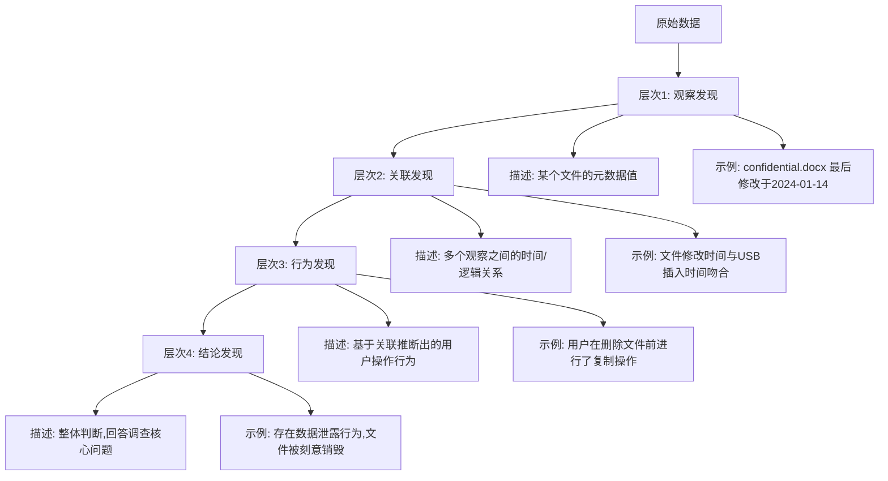
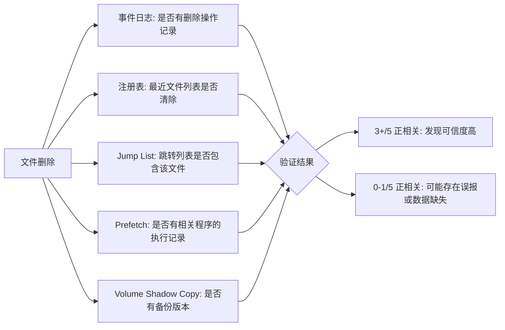
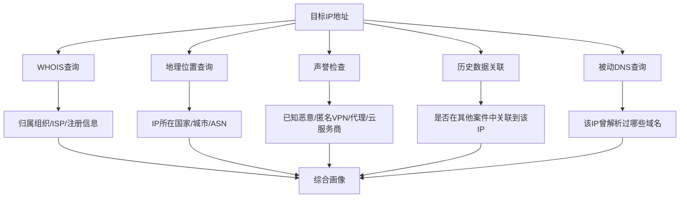

# 分析发现

## 概述

分析发现（Analysis Findings）是数字取证流程中的核心产出环节，也是整个取证工作从"技术操作"向"证据呈现"跨越的关键节点。在完成证据获取、数据预处理和初步分析之后，调查人员面临的最大挑战并非数据本身——而是如何将碎片化的技术观察转化为结构化、可追溯、具有法律效力的发现报告。

分析发现的质量直接决定了案件的走向：一份薄弱的分析发现可能让关键证据在法庭上被排除，而一份扎实的分析发现则能将零散的技术细节编织成不可辩驳的证据链条。正如数字取证领域的经典论述所言：**证据不会说话，分析发现让证据说话。**

本章将从理论基础出发，系统阐述分析发现的方法论、分类体系、文档规范、质量控制和实践技巧，帮助读者从"发现了什么"进阶到"如何证明发现了什么"，并掌握在复杂案件中系统化地管理和呈现发现的能力。

---

## 一、分析发现的理论基础

### 1.1 什么是分析发现

在数字取证语境下，分析发现（Analysis Finding）是指调查人员通过对电子证据进行系统检查、关联分析和解释后得出的具体结论。注意，分析发现不等于原始数据观察——它是在观察基础上，经过推理和验证后形成的结构化判断。

每一个合格的分析发现都应满足以下四个条件：

- **可观测性**：发现基于可重复查看的证据数据。任何人使用相同工具、相同参数，应当能看到相同的数据呈现。如果一个发现依赖于无法复现的操作环境或主观感受，它就不是合格的分析发现。
- **可溯源性**：能从发现追溯到原始证据来源。完整的溯源路径包括：原始镜像文件→分区/卷→文件系统→具体文件/记录→字段/偏移量。例如"confidential.docx 已删除"这一发现必须能精确指向 `evidence.E01 → partition 2 → MFT record #12345 → Flag field = 0x0000`。
- **可解释性**：有合理的理论或逻辑支撑发现的含义。说"文件被删除"是不够的，需要解释"文件的MFT记录Flag字段从0x01变为0x00，父目录索引中该文件条目已被移除，这些特征与NTFS文件删除操作一致"。
- **可证伪性**：存在反证的可能性，而非不可质疑的"绝对结论"。科学方法论要求分析发现应当是可以被推翻的。例如"文件被用户主动删除"这一结论可以被反证：如果发现同一时间段存在系统清理任务或防病毒软件自动删除行为，该结论就需要修正。

### 1.2 分析发现的层次模型

分析发现并非扁平罗列，而是具有层次结构。根据数字取证成熟度模型（DFRWS框架）和实务经验，可将分析发现分为四个层次：



**表1：分析发现的四个层次**

| 层次 | 名称 | 证据强度 | 主观程度 | 信息量 | 典型示例 |
|------|------|----------|----------|--------|----------|
| 1 | 观察发现 | 高 | 低 | 有限 | 文件MFT记录显示Flag为0x0000（已删除标记） |
| 2 | 关联发现 | 中高 | 中低 | 中等 | 登录日志中的用户SID与文件最后访问者一致 |
| 3 | 行为发现 | 中 | 中 | 丰富 | 用户在删除文件前先执行了复制操作，疑似数据窃取 |
| 4 | 结论发现 | 因人而异 | 高 | 最丰富 | 此次数据泄露系内部人员利用工作权限实施 |

**理解这一层次模型至关重要。** 低层次的发现更客观、更难被质疑，但信息量有限；高层次的发现信息丰富、更能回答调查核心问题，但包含更多推断成分，在法庭上更容易受到挑战。优秀的分析报告应当让每一层发现都有下层发现作为支撑，形成一条完整的证据链——就像建筑的地基、框架、墙体、屋顶，缺一不可。

一个常见的错误是"跳层"：直接从原始数据跳到结论发现，中间缺少关联发现和行为发现作为桥梁。例如，仅凭"MFT显示文件已删除"就得出"嫌疑人故意销毁证据"的结论——这个推理跳跃太大，任何一个合格的辩护律师都能攻击其逻辑漏洞。正确的做法是逐层构建证据，让每一层推断都有下层事实支撑。

### 1.3 分析发现的权威分类

根据美国国家标准与技术研究院（NIST SP 800-86《数字取证技术指南》）、英国ACPO数字证据原则以及中国《电子数据取证规则》（GA/T 1570—2019），分析发现可按照证据类型分为以下大类：

| 证据大类 | 子类 | 典型来源 | 关键分析要点 |
|----------|------|----------|-------------|
| 文件系统证据 | 文件创建/修改/删除/访问时间、隐藏文件、碎片残留 | NTFS MFT、FAT表、ext4 journal、APFS | MACB时间戳一致性、文件名与$STANDARD_INFORMATION比对 |
| 用户活动证据 | 浏览历史、登录记录、应用程序使用痕迹 | 浏览器SQLite、Windows Event Log、bash_history | 时间段分析、用户行为基线对比 |
| 网络通信证据 | 连接记录、数据传输、DNS查询 | pcap抓包、防火墙日志、代理日志、Zeek日志 | 连接模式、数据量异常、域名信誉 |
| 内存碎片证据 | 进程信息、网络连接、加密密钥、密码明文 | RAM dump、pagefile.sys、hiberfil.sys | 进程注入检测、密钥残留提取 |
| 元数据证据 | EXIF信息、文档作者、修改历史、创作软件 | Office Compound Document、JPEG EXIF、PDF元数据 | 时间线构建、作者身份关联 |
| 注册表证据 | 启动项、最近打开文件、设备连接历史、用户配置 | Windows Registry SAM/SOFTWARE/NTUSER.DAT | 时间线分析、USB设备历史 |
| 日志证据 | 系统日志、安全日志、应用日志、审计日志 | Event Log、syslog、auditd、journald | 日志完整性检查、时间序列分析 |
| 云与虚拟化证据 | 虚拟机快照、云存储同步记录、容器日志 | AWS CloudTrail、Azure Activity Log、VMware VMDK | 跨环境关联、时区处理 |

### 1.4 分析发现的证据价值评估

并非所有发现都具有同等价值。评估一个发现的证据价值需要考虑以下维度：

- **直接性**：发现是否直接回答调查核心问题？例如，"文件被删除"比"用户登录了系统"更直接关联数据销毁调查。
- **独立性**：发现是否依赖其他发现才能成立？独立性强的发现更难被质疑。例如，MFT记录是一个独立发现，而"用户删除文件"是一个依赖性发现（需要MFT记录+用户身份确认）。
- **时效性**：发现指向的时间点是否在关键时间窗口内？案件发生后3天的文件创建记录，可能不如案件发生前2小时的文件删除记录重要。
- **排他性**：发现是否能排除其他解释？如果同一组时间戳可以被解释为"用户操作"也可以被解释为"系统自动任务"，其排他性就较弱。

---

## 二、分析发现的方法论

### 2.1 发现过程标准流程

分析发现的生成不是随机的，而应遵循系统化的流程。推荐的七步流程如下：

**第一步：制定分析计划**

在开始分析前，必须明确调查目标和范围。分析计划应包含：
- 本次调查要回答的核心问题（通常由案件负责人或委托方定义）
- 需要关注的时间窗口（事件发生前后的时间范围）
- 最可能包含关键证据的数据源（优先级排序）
- 分析方法的选择（时间线分析、关键词搜索、文件雕刻等）
- 预期交付物（发现报告的格式和详细程度）

没有分析计划就动手分析，是最常见的效率杀手。调查人员面对海量数据，如果没有明确的目标导向，很容易陷入"什么都看一点但什么都不深入"的陷阱。

**第二步：数据预处理**

对原始证据进行规范化处理：
- **时间戳归一化**：将所有时间戳转换为统一时区（推荐UTC+0），处理Windows FILETIME、Unix timestamp、macOS HFS+时间、WebKit时间等不同格式的转换
- **数据去重**：对相同内容的文件（如跨分区的重复文件、回收站中的副本）进行去重，避免重复计数
- **建立索引**：为文本内容建立全文索引（如使用Elasticsearch或Autopsy的内置索引），大幅提升关键词搜索效率
- **哈希数据库**：对所有文件计算哈希值，与已知恶意软件库（NSRL/RDS）、已知无害文件库（hashkeep）进行比对，快速过滤无关文件

**第三步：初步扫描（Triage）**

使用自动化工具对证据进行快速扫描，识别明显的可疑项：

- **Autopsy**（Sleuth Kit 图形版）：支持一键式时间线分析、关键词搜索、已知文件过滤、嵌入式提取
- **Plaso（log2timeline）**：高效的事件时间线生成器，支持200+种数据源格式
- **YARA**：基于规则的恶意痕迹扫描，可自定义检测规则
- **Eric Zimmerman工具链**：Windows取证的黄金标准，包括Registry Explorer、LECmd、MFTECmd等

初步扫描的目标不是发现全部证据，而是快速建立全局视图，识别需要深度分析的高价值区域。

**第四步：深度分析**

对初步扫描标记的可疑项进行人工验证和深入分析。此阶段需要调查人员的专业经验，常见的分析方法包括：

- **时间线分析**：将不同来源的事件按时间排列，构建行为序列（详见2.2节）
- **关联分析**：识别不同数据源之间的关联关系（详见2.3节）
- **痕迹重建**：还原文件的创建、修改、删除、复制过程，包括MFT双时间戳分析（$STANDARD_INFORMATION vs $FILE_NAME）
- **隐藏数据分析**：检查备用数据流（ADS）、隐藏分区、隐写（Steganography）、加密容器
- **用户行为分析**：从多个数据源综合还原用户操作模式，建立行为基线

**第五步：发现确认**

每一个潜在发现都必须经过严格的交叉验证。验证方法包括：

- **工具交叉验证**：使用至少两种不同工具确认同一发现。例如用The Sleuth Kit的`fls`命令和Autopsy的删除文件列表进行对比，确保结果一致
- **人工复核**：由第二名调查人员独立审查发现。这是防止个人偏见和工具误判的最后一道防线
- **哈希校验**：确保证据完整性未被破坏。在分析过程中定期重新计算哈希值，与获取时的原始哈希值比对
- **链路测试**：确保发现可按证据链追溯至原始来源。从最终报告中的发现出发，逆向验证每一步推导都有证据支撑

**第六步：发现分级**

对确认后的发现进行重要性分级：

| 级别 | 标签 | 定义 | 处理方式 | 报告位置 |
|------|------|------|----------|----------|
| 1 | 关键发现 | 直接回答调查核心问题 | 详细记录，优先呈报，必须包含完整溯源路径 | 报告正文首段 |
| 2 | 重要发现 | 支撑关键发现或揭示重要行为 | 完整记录，交叉验证，提供充分上下文 | 报告正文详细章节 |
| 3 | 辅助发现 | 提供上下文但不直接关联核心问题 | 摘要记录，可归档至附录 | 报告附录或附表 |
| 4 | 噪声 | 与案件无关的异常或系统自动生成的记录 | 简要注明排除理由后归档 | 内部工作记录 |

分级的关键原则：宁可多分不遗漏，也不可少分不负责。一个初期被判定为"噪声"的发现，可能在后续调查中变得至关重要——保留记录比丢弃记录的成本低得多。

**第七步：结果归档**

将发现按照统一格式记录到取证报告中，确保每一份发现都包含完整元数据（详见第三章文档规范）。

### 2.2 时间线分析技术

时间线分析是数字取证中最核心、最强大的分析技术之一。其基本原理是：**人的操作行为在数字系统中必然留下时间戳痕迹，而这些痕迹的排列顺序可以揭示行为的因果关系。**

**时间戳来源的完整矩阵：**

| 数据源 | 时间戳类型 | 精度 | 时区处理 | 常见工具 |
|--------|-----------|------|----------|----------|
| NTFS MFT ($STANDARD_INFORMATION) | 创建/修改/访问/ MFT变化 | 100ns | UTC内部存储，显示时转换 | MFTECmd, NTFS Log Tracker |
| NTFS MFT ($FILE_NAME) | 创建/修改/访问 | 100ns | 同上，用于时间戳篡改检测 | MFTECmd, analyzeMFT |
| NTFS $LogFile | LSN关联的事务时间 | 100ns | UTC | NTFS Log Tracker |
| NTFS USN Journal | 变更原因+时间 | 100ns | UTC | usn_parser, Autopsy |
| Windows Event Log | 事件发生时间 | 1ms | 原始时区存储 | EvtxECmd, LogParser |
| Windows Prefetch | 最后运行时间/运行次数 | 2s | 本地时区 | PECmd, WinPrefetchView |
| Windows SRUM | 应用执行时间/网络使用 | 1s | UTC | SRUM-Dump |
| Linux /var/log/syslog | 事件日志时间 | 1s | 原始时区 | log2timeline, Autopsy |
| Linux .bash_history | 命令执行时间（如配置HISTTIMEFORMAT） | 1s | 本地时区 | 直接解析 |
| macOS .DS_Store / knowledgeC.db | 文件访问/应用使用 | 1s | UTC（knowledgeC.db） | mactime, macOS考古工具 |
| 浏览器 SQLite | 访问时间 | µs（Chrome）| UTC（Chrome） | pyewf, Autopsy |
| JPEG EXIF | 拍摄时间/GPS时间 | 1s | 本地时区 | ExifTool, jhead |
| PDF元数据 | 创建/修改时间 | 1s | 本地时区 | ExifTool, pdfinfo |

**典型时间线构建步骤：**

```text
1. 收集所有时间戳来源
   ├── 文件系统时间戳 (MACB: Modified/Accessed/Changed/Birth)
   ├── 日志时间戳 (EventLog ID + TimeGenerated)
   ├── 注册表时间戳 (LastWrite Time)
   ├── 浏览器历史记录 (visit_time / last_visit_time)
   ├── 应用程序日志 (应用自有时间字段)
   └── 云同步/邮件时间戳 (服务器时间 vs 本地时间)

2. 时间戳归一化
   ├── 将所有时间戳转换为统一时区（建议UTC+0）
   ├── 处理夏令时问题（注意：某些时区在夏令时切换时会回拨1小时，可能导致时间倒流的假象）
   └── 处理时间格式转换:
       ├── Windows FILETIME (100ns since 1601-01-01) → Unix epoch
       ├── HFS+ (秒 since 2001-01-01) → Unix epoch
       └── WebKit time (微秒 since 1601-01-01) → Unix epoch

3. 事件排序与去重
   ├── 按时间排序所有事件
   ├── 合并同一秒内的多条日志（注意保留来源标记）
   └── 标记自动生成的事件（如系统计划任务、AV扫描）

4. 行为模式识别
   ├── 识别异常时间段（深夜操作、非工作时间登录）
   ├── 识别操作序列（打开→编辑→保存→删除）
   ├── 识别行为跳跃（可疑的长时间空白）
   └── 识别反常模式（同一秒内多个不相关操作）
```

**实战技巧：时间线间隙分析**

时间线中的"空白"往往比"存在"更能说明问题。如果在正常工作时间段内出现1小时的数据空白，且该空白前后有文件删除操作——这类间隙本身就是重要发现。常见的造成时间线间隙的原因包括：

| 原因 | 特征 | 检测方法 | 调查方向 |
|------|------|----------|----------|
| 系统休眠/关机 | 所有事件同时中断 | 检查Power Event 42（睡眠）、Event ID 6005/6006（事件日志服务启动/停止） | 记录休眠/关机时间，排查是否为有意规避监控 |
| 日志被清理 | 特定日志源中断，其他日志正常 | 检查EventLog清理事件ID 1102，检查日志文件大小突变 | 记录清理行为本身作为证据 |
| 时间篡改 | 时间戳出现跳跃或倒流 | 比较系统时钟与外部时间源（NTP日志、邮件服务器时间），检查事件ID 1/12/22（时间服务） | 检查修改系统时间的程序和动机 |
| 虚拟机快照恢复 | 数据被回滚到旧状态，后续时间戳断裂 | 检查VSS卷影副本、VMware快照链、Hyper-V检查点 | 对比快照前后状态差异 |
| 故意脱机操作 | 在无网络环境下操作，网络日志中断 | 检查Wi-Fi连接日志、DHCP租约时间、本地残留证据 | 追查物理位置和在场证明 |
| 加密容器挂载 | 加密卷操作不会体现在常规文件系统日志中 | 检查VeraCrypt/cryptsetup挂载痕迹、内存残留 | 提取内存dump中的挂载密钥 |

**高级技巧：多源时间线对齐**

在实际案件中，不同数据源的时间可能存在微小偏差。例如：
- Windows系统时间与硬件时钟可能偏差数秒
- 不同操作系统的时间记录精度不同（Windows 100ns vs Linux 1s）
- 网络设备（路由器/交换机）的时间可能与主机不同步
- 多台主机的时间可能存在网络延迟导致的偏差

处理方法：首先识别各数据源的时间偏差（通过交叉事件如NTP同步记录、邮件收发记录等建立时间锚点），然后在分析时考虑偏差容限（通常±2秒足够覆盖大多数场景）。

### 2.3 关联分析方法

单一数据来源的发现很容易被质疑。**关联分析**通过跨数据源验证，大幅提升发现的证据价值。关联分析的核心思想是：**如果一个结论是真实的，它应该在多个独立的数据源中留下痕迹。**

**关联分析矩阵模板：**



**最佳实践：三源验证法则**

一个被广泛接受的经验法则是"三源验证"——**任何关键发现至少要在三个独立的数据源中得到正向验证**。例如，证明"用户有意删除文件"这一发现，可以综合以下证据（以NTFS文件系统为例）：

| 数据源 | 具体证据 | 独立性 | 验证方法 |
|--------|---------|--------|----------|
| $MFT记录 | Flag字段从0x01变为0x00 | 高 | MFTECmd解析或手动十六进制查看 |
| USN Journal | Reason字段记录了USN_REASON_FILE_DELETE | 高 | usn_parser或Autopsy |
| Recycle Bin | $I文件记录（若清空回收站则缺失，缺失本身也是发现） | 高 | 手动检查$Recycle.Bin目录 |
| Prefetch文件 | 相关程序（如explorer.exe、cmd.exe）在该时间段的执行记录 | 中 | PECmd解析 |
| Event Log ID 4656/4663 | 对该文件的权限访问请求和对象访问 | 中 | EvtxECmd + 过滤 |
| USN Journal中的先前记录 | 文件的创建/修改历史 | 高 | usn_parser时间线输出 |

**关联分析中的"缺失证据"价值**

在关联分析中，不仅正向匹配有价值，**缺失的预期证据同样是有价值的发现**。例如：
- 如果文件删除后，回收站中找不到对应的$R文件——这说明删除操作跳过了回收站（Shift+Delete或命令行删除），增加了"故意删除"的可能性
- 如果系统日志中没有任何删除操作的记录，但文件确实被删除了——这可能说明日志被主动清除
- 如果用户声称从未访问过某个文件，但Prefetch和Jump List中都包含该文件的记录——"缺失的否认"与"存在的痕迹"形成矛盾

### 2.4 反取证行为的发现

高级用户或有预谋的嫌疑人会使用反取证技术掩盖痕迹。调查人员需要识别这些行为模式——**发现反取证行为本身就是一项极有价值的发现**，因为它揭示了嫌疑人的意图和认知水平。

**常见反取证技术及检测方法：**

| 反取证技术 | 行为表现 | 检测方法 | 工具示例 |
|-----------|----------|----------|----------|
| 文件擦除（Wiping） | 文件被多次覆盖后删除，MFT中数据簇被写入0或随机数据 | 检查MFT中由文件记录变为全0或高熵值随机数据；检查$LogFile中的写操作记录 | hexdump, binwalk, 自定义熵值分析脚本 |
| 时间戳篡改（Timestomping） | 文件的MACB时间被修改为任意值 | 比较$STANDARD_INFORMATION与$FILE_NAME的时间戳——NTFS中这两个区域的时间戳独立存储，篡改通常只能改一个；检查$LogFile中的元数据修改记录 | MFTECmd, analyzeMFT, 自定义对比脚本 |
| 日志清除（Log Clearing） | Event Log存在非自然截断或大小突变 | 检查Event ID 1102（日志清除审计）、Event ID 1100（日志服务关闭）；检查日志文件大小与预期增长曲线是否一致 | EvtxECmd, LogParser, Event Log Explorer |
| 磁盘加密 | 仅加密部分分区或使用加密容器 | 检查分区头的熵值分布（全盘加密后熵值接近最大值）；检查VeraCrypt/cryptsetup的配置文件残留 | Entropy分析, 隐写检测工具 |
| 程序/服务禁用 | 取证工具所需的服务被停止或启动类型被修改 | 检查服务启动类型变更事件（Event ID 7045/7040）；检查最近停止的服务列表 | 服务配置快照对比, Event Log分析 |
| 文件伪装（Extension Spoofing） | 文件扩展名被篡改以隐藏真实类型 | 检查文件魔数（magic bytes）与扩展名是否一致；使用`file`命令或TrID检测真实文件类型 | file, TrID, ExifTool, PEiD |
| 备份/副本清除 | 删除VSS卷影副本、清除备份文件 | 检查vssadmin list shadows命令的执行痕迹；检查Event ID 8222/8224（VSS删除） | vssadmin, ShadowExplorer, Event Log |
| 内存取证对抗 | 使用工具清除内存中的敏感信息 | 检查已知内存清理工具（如Mimikatz的sekurlsa::purge）的执行痕迹 | Volatility, Rekall, 广义进程异常检测 |

> **重要提醒**：发现反取证行为本身就是一项高价值的分析发现。在很多案件中，"嫌疑人试图掩盖什么"比"掩盖了什么"对案件定性更有帮助。一个精心擦拭过磁盘的嫌疑人，和一个只是误删了文件的员工，在法庭上的处境完全不同。

### 2.5 跨平台分析差异

数字取证并非仅限于Windows系统。Linux和macOS各有独特的取证特征：

| 特征 | Windows | Linux | macOS |
|------|---------|-------|-------|
| 文件系统 | NTFS（主流）、exFAT | ext4（主流）、XFS、Btrfs | APFS（主流）、HFS+ |
| 文件删除机制 | MFT标记删除 + 回收站 | inode引用计数清零 + .trash | APFS快照 + .Trashes |
| 时间戳精度 | 100纳秒 | 1秒（ext4）/ 纳秒级（XFS） | 1秒（HFS+）/ 纳秒级（APFS） |
| 日志系统 | Event Log（.evtx） | syslog/journald/auditd | unified_log（.logarchive） |
| 注册表/配置 | Windows Registry | /etc配置文件 + 系统日志 | plist文件 + 系统日志 + knowledgeC.db |
| 用户痕迹 | Prefetch/Jump List/Recent | .bash_history/.viminfo | knowledgeC.db/Recents/Safari State |
| 加密 | BitLocker | LUKS/dm-crypt | FileVault |
| 权限模型 | DAC + UAC | DAC + SELinux/AppArmor | SIP + TCC（透明同意控制） |

**关键差异提示**：Linux系统的时间戳篡改检测与Windows不同——Linux没有类似NTFS双时间戳（$STANDARD_INFORMATION vs $FILE_NAME）的内置机制，但ext4的 journal 和 atime/mtime/ctime 组合可以提供类似的验证能力。macOS的APFS快照机制使得"删除"文件实际上可能从未真正消失——APFS快照是只读的文件系统视图，即使用户删除了文件，快照中仍然保留着完整副本。

---

## 三、发现文档规范

### 3.1 单个发现的标准记录格式

每个分析发现应当以统一格式记录，确保可读性、可追溯性和可复现性。推荐以下模板：

```text
╔═══════════════════════════════════════════════════╗
║                   分析发现记录                      ║
╠═══════════════════════════════════════════════════╣
║ 发现ID:      DF-2024-001                          ║
║ 级别:        关键发现（Level 1）                    ║
║ 标题:        机密文件被删除后成功恢复                ║
║ 证据源:      E01_IMAGE_01 (SHA256: A3F2...)       ║
║              └─ 路径: \Users\Target\Documents\    ║
║ 发现工具:    FTK Imager 4.7.1 + The Sleuth Kit    ║
║              4.12.1                               ║
║ 发现人:      Zhang Wei                            ║
║ 发现日期:    2024-01-16 10:30 UTC                  ║
╠═══════════════════════════════════════════════════╣
║ 详细描述:                                          ║
║ 在NTFS卷的证据文件中发现已删除文件                  ║
║ confidential.docx。文件MFT记录中的Flag字段         ║
║ 显示为0x0000（标记删除），但数据流偏移               ║
║ 0x000A3F200处的起始簇尚未被覆盖。通过               ║
║ icat命令成功提取完整文件内容。                      ║
║                                                   ║
║ 文件元数据:                                         ║
║ - 文件名:   confidential.docx                     ║
║ - 文件大小: 2,456,320 bytes                        ║
║ - 创建时间: 2024-01-14 14:15:30 UTC               ║
║ - 修改时间: 2024-01-14 15:28:45 UTC               ║
║ - 删除时间: 2024-01-14 15:30:00 UTC               ║
║ - 父路径:   \Users\Target\Documents\              ║
║ - MFT记录号: #12345                               ║
║                                                   ║
║ 内容摘要:                                           ║
║ 文档包含2024年度财务预算表，涉及项目编号            ║
║ PROJ-2024-Q1至Q4的预算分配。                       ║
╠═══════════════════════════════════════════════════╣
║ 关联发现:                                           ║
║ DF-2024-002 (同一时间段的USB连接记录)               ║
║ DF-2024-003 (文档最后一次打开后的打印操作)          ║
║ DF-2024-005 (网络文件传输记录)                      ║
╠═══════════════════════════════════════════════════╣
║ 验证状态:   ✅ 已验证（工具交叉验证 + 人工复核）    ║
║             首次验证: Zhang Wei, 2024-01-16         ║
║             独立复核: Li Ming, 2024-01-17           ║
║             验证工具: TSK 4.12.1 + WinHex 21.1     ║
╚═══════════════════════════════════════════════════╝
```

**关键设计原则：**

- **唯一ID**：每个发现必须有唯一标识符（推荐格式：DF-YYYY-NNN），便于在报告和交叉引用中定位
- **级别标记**：明确标注发现级别，便于阅读者快速判断重要性
- **完整溯源**：从证据源到具体路径，任何人可以找到同一数据
- **工具记录**：精确到版本号，确保结果可复现
- **验证记录**：包含验证人和验证日期，增强可信度

### 3.2 证据链记录

每一份分析发现都必须维护完整的证据链信息。根据司法证据规则，证据链（Chain of Custody）记录应包括：

| 字段 | 说明 | 示例 |
|------|------|------|
| 证据标识 | 唯一标识证据项的编号 | EXH-A-001 |
| 获取者 | 执行获取操作的人员 | Zhang Wei |
| 获取时间 | 精确到秒的获取时间 | 2024-01-14 16:00:00 UTC |
| 获取方法 | 使用的工具和方法 | FTK Imager 4.7.1, write-blocked, Tableau T35es |
| 原始哈希 | 获取时计算的完整性哈希 | SHA256: A3F2B7... |
| 移交记录 | 证据从谁手中转移到谁手中 | Zhang Wei → Li Ming, 2024-01-15 09:00:00 UTC |
| 移交时哈希 | 每次交接重新计算的哈希值 | SHA256: A3F2B7...（与原始一致=完整性确认） |
| 存储位置 | 证据所在物理/逻辑位置 | 安全存储柜 #3, 设备ID: F3-2024-001 |
| 访问日志 | 谁在什么时间访问了证据 | 2024-01-16 10:00 Zhang Wei - 分析用途 |
| 环境条件 | 存储环境（温度、湿度等） | 温度22°C, 湿度45%, 防静电柜 |

**证据链断裂的后果**：如果证据链中任何一个环节出现不连续（如无法说明某段时间证据在谁手中），辩护律师可以主张证据可能被篡改，导致证据被法庭排除。这是数字取证中最严重的程序性错误之一。

### 3.3 工具版本与环境记录

分析发现的有效性与使用工具的版本和环境密切相关。每个发现都应当记录：

```yaml
工具环境记录:
  分析日期: 2024-01-16
  操作系统: Windows 10 Enterprise 22H2 (Build 19045.3803)
  分析工作站: WS-FORENSIC-01 (硬件编号: DELL-XPS-2024-003)
  写保护设备: Tableau T35es (固件 v2.3.1)
  主要工具:
    - FTK Imager 4.7.1.8 (哈希: SHA256: xxx)
    - Autopsy 4.21.0
    - The Sleuth Kit 4.12.1
    - Plaso 20240115
    - HxD Hex Editor 2.5.0.0
  验证工具:
    - WinHex 21.1 (用于手动十六进制验证)
    - X-Ways Forensics 21.1 (交叉验证)
  脚本/自定义工具:
    - analyze_mft.py v2.1 (自研MFT分析脚本)
    - timeline_merge.py v1.0 (多源时间线合并脚本)
  网络环境:
    - 取证工作站处于离线状态，禁止外网连接
    - 使用本地NTP服务器同步时间
```

> **为什么工具版本如此重要？** 不同版本的取证工具在解析同一数据格式时可能产生不同结果。例如，早期版本的Autopsy在解析NTFS $LogFile时可能遗漏某些已记录的更新操作；不同版本的Plaso对同一组时间戳可能产生不同的归一化结果。在法庭上，辩护律师可能会质疑："您使用的工具版本是否已被证实存在该解析差异？"——必须能回答这个问题。记录工具的哈希值则进一步确保证据链中使用的工具本身未被篡改。

### 3.4 发现的结构化存储

当案件涉及大量发现时，推荐使用结构化格式（如JSON或SQLite）存储发现数据，便于检索和统计：

```json
{
  "finding_id": "DF-2024-001",
  "level": 1,
  "title": "机密文件confidential.docx被删除后恢复",
  "status": "verified",
  "evidence_source": {
    "image_file": "E01_IMAGE_01.E01",
    "sha256": "A3F2B7...",
    "internal_path": "partition2/NTFS/$MFT/#12345"
  },
  "tools_used": [
    {"name": "TSK", "version": "4.12.1", "command": "icat evidence.E01 12345"},
    {"name": "WinHex", "version": "21.1", "action": "hex verification"}
  ],
  "analyst": "Zhang Wei",
  "date_found": "2024-01-16T10:30:00Z",
  "date_verified": "2024-01-17T14:00:00Z",
  "verifier": "Li Ming",
  "related_findings": ["DF-2024-002", "DF-2024-003"],
  "tags": ["file-deletion", "data-recovery", "confidential"]
}
```

---

## 四、发现详解：删除文件的恢复与分析

### 4.1 发现详情

```yaml
发现ID: DF-2024-001
标题: 机密文件confidential.docx被删除后的恢复
文件路径: \Users\Target\Documents\confidential.docx
证据来源: E01_IMAGE_01.E01 (SHA256: A3F2B7C4D8E9...)
```

### 4.2 文件删除的底层原理

理解文件删除的底层机制，是评估"是否能恢复"以及"如何恢复"的前提。不同的文件系统有不同的删除机制：

**NTFS卷上的文件删除机制（Windows主流）：**

当用户在Windows中删除文件时（非Shift+Delete），操作系统执行以下操作：

1. **MFT标记**：文件在$MFT中的记录项的Flag字段从`0x01`（已分配/在用）变为`0x00`（未分配/已删除）。注意：MFT记录本身并未被清除，只是标记为可重用
2. **目录项移除**：从父目录的索引（Index Allocation）中移除该文件的条目
3. **回收站记录**：在`$Recycle.Bin`目录下创建两个文件：
   - `$I<随机ID>.<原扩展名>`：存储原始文件元数据（原路径、删除时间、文件大小）
   - `$R<随机ID>.<原扩展名>`：文件数据本身的副本（注意：这会额外占用磁盘空间）
4. **位图更新**：文件所占用的簇在$Bitmap中标记为"空闲"
5. **日志记录**：NTFS的$LogFile（事务日志）和USN Journal记录此次变更

**关键事实**：文件数据本身并未被清除，只是其占用的簇被标记为可重用。只要这些簇尚未被新数据覆盖，文件就可以被恢复。这就是NTFS数据恢复的基本原理。但需要注意：操作系统不会主动覆盖"空闲"簇——覆盖只在新数据写入时发生。因此，删除后立即恢复的成功率最高，随着时间推移和磁盘使用增加，恢复成功率逐步下降。

**Shift+Delete删除**：跳过第3步回收站操作，文件直接从目录中移除，MFT标记删除，位图标记为空。恢复难度稍高（无法从回收站直接恢复），但通过MFT记录或文件雕刻仍然可以恢复。

**Linux ext4卷上的文件删除机制：**

ext4使用inode引用计数机制：
1. **引用计数清零**：文件被删除时，inode的链接计数（i_nlink）从1减到0
2. **inode释放**：inode被标记为可用，但inode中的数据指针（extent信息）在短期内仍然保留
3. **数据块释放**：数据块被标记为可重用，但内容未被清除
4. **日志更新**：ext4 journal记录此次变更

与NTFS类似，ext4的删除也是"标记删除"而非"数据擦除"。但ext4没有类似NTFS回收站的系统级机制（~/.local/share/Trash/是桌面环境的实现，非文件系统层面）。

**APFS（macOS）的文件删除机制：**

APFS引入了快照（Snapshot）机制，使得文件删除更加复杂：
1. **文件标记删除**：类似其他文件系统，文件被标记为已删除
2. **快照保留**：APFS快照是只读的文件系统视图，即使用户删除了文件，快照中仍然保留着完整副本
3. **空间回收**：只有当所有引用该数据块的快照都被删除后，数据块才会被真正回收

这意味着：在启用了Time Machine的macOS系统上，即使用户清空了废纸篓，文件数据可能仍然保留在Time Machine的APFS快照中。

### 4.3 恢复方法对比

| 恢复方法 | 适用场景 | 成功概率 | 工具示例 | 注意事项 |
|----------|----------|----------|----------|----------|
| 回收站直接恢复 | 文件在回收站中未被清空 | 100% | Windows GUI / `mv ~/.local/share/Trash/files/* .` | 最简单但成功率有限 |
| MFT记录恢复 | MFT记录未被覆盖但标记为删除 | 高（数据完整） | The Sleuth Kit (`icat`), WinHex | 需要确认数据簇未被覆盖 |
| 文件雕刻（Carving） | MFT记录被覆盖但文件数据仍在原始位置 | 中高（取决于碎片程度） | PhotoRec, Foremost, Scalpel | 基于文件头尾特征匹配，可能产生碎片文件 |
| 卷影副本恢复 | 系统启用了VSS且快照未被删除 | 高 | vssadmin, ShadowExplorer, PowerShadow | VSS可能被嫌疑人主动删除 |
| ext4 journal恢复 | ext4日志中保留了文件元数据 | 中高 | extundelete, ext4magic | 依赖journal是否被覆盖 |
| APFS快照恢复 | macOS Time Machine快照中保留副本 | 高 | `tmutil listlocalsnapshots`, 数据恢复工具 | 需要管理员权限 |
| 专业数据恢复 | 文件数据部分被覆盖 | 低中 | R-Studio, GetDataBack, UFS Explorer | 仅恢复未被覆盖的部分 |
| 内存dump提取 | 文件在内存中仍有残留（如刚打开过的文件） | 低（时效性强） | Volatility, strings + grep | 需要在关机前获取内存dump |

### 4.4 实战恢复命令

**使用 The Sleuth Kit 恢复 NTFS 删除文件：**

```bash
# 步骤1: 使用mmls查看分区布局，确认NTFS分区的偏移量
mmls evidence.E01
# 输出示例:
# 00:  -----  0000000000  0000000000  0000000001  Meta/GPT
# 01:  -----  0000000001  0000000204  0000000204  Unallocated
# 02:  0x000  0000000205  0020479999  0020479795  NTFS (0x07)

# 步骤2: 使用fls列出已删除文件（-d标记已删除, -r递归, -p包含完整路径）
fls -r -d -p evidence.E01 > deleted_files_list.txt
# 查看输出中是否有目标文件
grep -i "confidential" deleted_files_list.txt
# 输出示例: r/r * 12345: deleted/confidential.docx

# 步骤3: 使用icat提取已删除文件（inode号12345来自上一步）
icat evidence.E01 12345 > recovered_confidential.docx

# 步骤4: 验证恢复文件的完整性
sha256sum recovered_confidential.docx
# 如果原始文件的哈希值已知（如从其他副本获得），可直接比对

# 步骤5: 检查恢复文件元数据，确认内容完整
istat evidence.E01 12345
# 检查文件的分配状态、大小、时间戳等信息

# 步骤6: 验证文件内容是否可读
file recovered_confidential.docx
# 确认文件类型正确（如 "Microsoft Word 2007+ document"）
```

**使用 PhotoRec 进行文件雕刻（当MFT记录不可用时）：**

```bash
# 当MFT记录被覆盖时，使用文件雕刻技术
# PhotoRec基于文件头尾特征匹配，不依赖文件系统元数据

# 基本用法：指定输出目录
photorec /d /output/recovered_files/ evidence.E01

# 交互式模式：选择分区和文件类型
photorec evidence.E01
# 选择分区 → 选择文件系统类型 → 选择要恢复的文件类型 → 指定输出目录

# 提示：文件雕刻可能产生大量无关文件，需要后续筛选
# 恢复的文件可能不完整（特别是大文件或碎片化严重的文件）
```

### 4.5 时间线分析

```text
时间线重建结果:

2024-01-14 14:15:30 UTC  →  文件创建（Create）
    ├── 创建者: User:Target
    ├── 创建位置: \Users\Target\Documents\
    └── 创建方式: Microsoft Word 2019 (基于Prefetch: WINWORD.EXE)

2024-01-14 14:15:30 ~ 15:28:45 UTC  →  文件存在期间（多次修改）
    ├── 14:45:12 - 第一次保存（MFT SI.Modified）
    ├── 15:12:03 - 第二次保存（USN Journal: USN_REASON_DATA_EXTEND）
    └── 15:25:18 - 第三次保存（最后一次自动保存）

2024-01-14 15:28:45 UTC  →  最后修改（Content Modified）
    ├── 修改者: User:Target（Event ID 4663 确认）
    └── 修改内容: 文档内容最后一次变更

2024-01-14 15:30:00 UTC  →  文件被删除（Delete）
    ├── 删除方式: Shift+Delete（回收站中无对应$I/$R文件）
    ├── 删除工具: Windows Explorer（Prefetch: EXPLORER.EXE）
    └── 删除命令行: 无（排除命令行删除）

关键观察:
├─ 文件从创建到最后修改: 约1小时13分钟
├─ 从最后修改到删除: 仅1分15秒（极短间隔，高度可疑）
├─ 删除方式为Shift+Delete（不经过回收站，表明有意删除）
├─ 同一时间段无系统自动清理任务记录
└─ 结论: 文件被人为故意删除，且删除前进行了最后修改
```

### 4.6 相关性分析

该文件被删除的行为本身就是一个重要发现。需要进一步调查的问题链：

- **谁删除了这个文件？** → 排查系统登录账号、用户SID、Event ID 4624（登录）和4634（注销）
- **删除前是否有复制操作？** → 检查USB连接记录（Event ID 2003/2010）、网络共享访问（Event ID 5140）、文件复制日志
- **删除前文件是否被打开查看？** → 检查Prefetch（WINWORD.EXE）、Jump List（最近打开文档）、Shellbag记录
- **是否有其他副本存在？** → 检查VSS卷影副本、邮件附件、OneDrive/Dropbox同步日志、打印队列
- **删除操作的精确时间是否与外部事件吻合？** → 对比网络通信时间线、USB设备连接/断开时间

---

## 五、发现详解：网络通信记录的分析

### 5.1 发现详情

```yaml
发现ID: DF-2024-002
标题: 可疑的网络文件传输记录
目标IP: 203.0.113.50
通信时间: 2024-01-14 15:35:00 UTC
传输协议: HTTP（端口80）
传输内容: 文件上传（根据POST请求和Content-Type分析）
传输大小: 2,458,176 bytes（与删除文件大小2,456,320 bytes接近）
```

### 5.2 IP地址分析

在实际案件中，分析目标IP时应进行以下工作：



**IP分析实战命令：**

```bash
# WHOIS查询 — 获取IP归属信息
whois 203.0.113.50

# 地理位置查询 — 使用GeoLite2数据库
mmdblookup -f GeoLite2-City.mmdb -i 203.0.113.50 city names en
mmdblookup -f GeoLite2-Country.mmdb -i 203.0.113.50 country iso_code

# 威胁情报查询 — 多平台交叉验证
# VirusTotal
curl -s -X GET "https://www.virustotal.com/api/v3/ip_addresses/203.0.113.50" \
  -H "x-apikey: $VT_API_KEY" | jq '.data.attributes'

# AbuseIPDB
curl -s "https://api.abuseipdb.com/api/v2/check?ipAddress=203.0.113.50" \
  -H "Key: $ABUSEIPDB_KEY" -H "Accept: application/json"

# Shodan（互联网设备扫描）
curl -s "https://api.shodan.io/shodan/host/203.0.113.50?key=$SHODAN_KEY"

# 被动DNS查询 — 了解IP的历史域名解析记录
# 使用SecurityTrails或PassiveTotal等平台

# DNS反向查询
nslookup 203.0.113.50
dig -x 203.0.113.50
dig -x 203.0.113.50 +trace

# 检查IP是否属于云服务商（重要：如果是云IP，嫌疑人可能使用了云服务中转）
curl -s "https://ipinfo.io/203.0.113.50" | jq '.org'
```

### 5.3 网络协议分析

根据流量特征确定传输协议类型：

| 协议 | 端口 | 特征 | 文件传输方式 | 证据留存 | 可提取内容 |
|------|------|------|-------------|----------|-----------|
| FTP | 21/20 | 明文传输用户名密码 | STOR/RETR命令 | 可从pcap提取完整文件 | 完整文件+认证凭据 |
| SFTP/SCP | 22 | SSH加密隧道 | 加密通道内传输 | 仅能检测到文件传输事件，内容不可见 | 传输时间和大小 |
| HTTP | 80 | Web上传/下载 | POST/PUT请求 | 代理日志、pcap | URL、Header、可提取Body |
| HTTPS | 443 | 加密Web传输 | POST/PUT请求 | 仅域名和证书信息（中间人解密除外） | 域名、SNI、证书信息 |
| SMTP | 25/587 | 邮件附件 | MIME附件编码 | 邮件日志、网关日志 | 非加密邮件附件原文 |
| SMB/CIFS | 445 | Windows文件共享 | 文件复制操作 | Windows Event Log 5140/5142 | 共享路径、文件名、大小 |
| RDP | 3389 | 远程桌面 | 剪贴板重定向/磁盘映射 | Event Log 4624 Type 10 | 连接用户、时间 |
| 企业IM | 各异 | Teams/Slack/钉钉 | 文件消息发送 | 需从客户端本地数据库提取 | 聊天记录+附件 |

### 5.4 PCAP分析实战

```bash
# 步骤1: 查看会话统计 — 快速了解通信全貌
tshark -r capture.pcap -q -z conv,tcp
# 输出：源IP、目标IP、数据包数、字节数、持续时间

# 步骤2: 过滤特定IP的所有通信
tshark -r capture.pcap -Y "ip.addr == 203.0.113.50" \
  -T fields -e frame.time -e ip.src -e ip.dst \
  -e tcp.srcport -e tcp.dstport -e frame.len

# 步骤3: 检查HTTP协议特征
# 查看所有HTTP请求
tshark -r capture.pcap -Y "http.request" \
  -T fields -e http.request.method -e http.request.uri \
  -e http.host -e http.content_type

# 查看POST请求（最可能用于文件上传）
tshark -r capture.pcap -Y "http.request.method == POST" \
  -T fields -e http.request.uri -e http.content_length

# 步骤4: 使用foremost从pcap提取文件
foremost -t all -i capture.pcap -o extracted_files/
# 在extracted_files/目录中查看提取的文件

# 步骤5: 检查DNS查询记录（可能暴露C2通信或文件上传目标域名）
tshark -r capture.pcap -Y "dns" \
  -T fields -e dns.qry.name -e dns.flags.response \
  -e dns.a

# 步骤6: 构建详细时间线
tshark -r capture.pcap -Y "ip.addr == 203.0.113.50" \
  -T fields -e frame.time_epoch -e ip.src -e ip.dst \
  -e tcp.srcport -e tcp.dstport -e tcp.len \
  | sort -n  # 按时间戳排序

# 步骤7: 检查TLS握手（如果是HTTPS通信）
tshark -r capture.pcap -Y "tls.handshake.type == 1" \
  -T fields -e tls.handshake.extensions_server_name
# 获取SNI（服务器名称指示），确认目标域名
```

### 5.5 时间线关联与因果推理

将发现2的通信时间与发现1的删除时间进行关联：

```text
时间线关联分析:

15:28:45  文件最后修改 (发现1)
              ↓ 间隔1分15秒
15:30:00  文件被删除 - Shift+Delete (发现1)
              ↓ 间隔5分钟
15:35:00  网络文件传输开始 (发现2)
              ├── 传输协议: HTTP POST
              ├── 传输大小: 2,458,176 bytes ≈ 文件大小2,456,320 bytes
              └── 目标IP: 203.0.113.50

时间相关性分析:
├─ 从修改到删除: 75秒（极短，删除可能是"编辑完就删"模式）
├─ 从删除到传输: 5分钟（删除后立即上传，高度可疑）
├─ 传输大小与文件大小差异: 1,856 bytes（0.08%，可能为HTTP头/编码差异）
├─ 同一时间段无其他文件传输记录
└─ 传输使用HTTP明文协议（未加密，可能是匆忙操作或技术水平有限）
```

**因果推理的审慎原则**：

虽然时间上的紧邻关系高度可疑，但调查人员必须考虑替代解释：
1. **巧合可能性**：文件删除和网络传输是否可能由不同的用户/程序独立触发？
2. **自动同步**：是否存在云同步服务（如OneDrive）在文件修改后自动上传副本？
3. **系统行为**：是否有防病毒软件或DLP策略在检测到敏感文件后自动隔离并上报？
4. **第三方程序**：是否有后台程序（如备份软件）在特定时间触发文件操作？

要排除这些可能性，需要检查：系统已安装的同步服务列表、DLP代理进程记录、防病毒软件日志、计划任务列表。只有排除了合理的替代解释后，才能建立因果关系。

---

## 六、发现的质量控制

### 6.1 常见的发现错误

分析发现中最常见的错误类型及防范方法：

| 错误类型 | 描述 | 真实案例 | 后果 | 防范方法 |
|----------|------|----------|------|----------|
| 确认偏误 | 倾向于寻找支持自己假设的证据 | 预设嫌疑人有罪，忽略其无害操作记录 | 关键无罪证据被遗漏 | 记录所有发现（包括与假设矛盾的）；建立反假设清单 |
| 工具误信 | 盲目相信工具输出，不理解底层原理 | Autopsy显示文件"已删除"→手工验证发现MFT实际正常 | 无辜者被错误指控 | 至少手工验证关键发现的原始数据（十六进制查看） |
| 时间线谬误 | 未考虑时区差异或系统时间偏差 | 分析时未校准被害者的系统时钟偏移（实际偏差+30分钟） | 行为时间点与嫌疑人不在场证明重合 | 取证前确认系统时间与UTC的偏差；建立时间锚点 |
| 相关性当作因果 | 两件事先后发生就推断存在因果关系 | 用户登录了系统→文件被删除→认为是用户干的（实际是计划任务） | 错误归因 | 排除其他可能性后再建立因果关系；记录推理链 |
| 取证污染 | 分析过程中修改了原始证据 | 直接在原盘上运行chkdsk；双击打开已删除文件 | 原始证据被破坏，关键数据丢失 | 始终使用写保护设备+工作副本；绝不在原盘上操作 |
| 过度解读 | 从有限数据中得出超出证据支持的结论 | 从单次USB连接推断"系统性数据窃取" | 结论被法庭推翻 | 严格区分"事实"和"推断"；使用概率性语言 |
| 选择性报告 | 只报告支持特定立场的发现 | 律师委托的调查只呈现对己方有利的发现 | 报告失去公信力 | 全面记录所有发现，由独立审查员复核 |

### 6.2 反确认偏误的实践方法

确认偏误是数字取证中最危险的认知陷阱。以下是一套系统化的反偏误方法：

**1. 建立反假设清单**

在分析开始前，不仅列出"嫌疑人有罪"的假设，也列出"嫌疑人无罪"的替代假设：

```text
主假设（H1）: 嫌疑人故意删除机密文件以掩盖数据泄露
替代假设（H2）: 文件被系统自动清理任务删除
替代假设（H3）: 文件被其他有权限的用户删除
替代假设（H4）: 文件被恶意软件自动删除
替代假设（H5）: 文件删除与数据泄露是独立事件（巧合）
```

**2. 预定义验证标准**

为每个假设预定义"什么证据能证实"和"什么证据能推翻"：

```text
H1验证标准:
  ✓ 证实: 操作日志显示目标用户执行了删除操作
  ✓ 证实: 删除操作为Shift+Delete（不经过回收站）
  ✓ 推翻: 系统存在自动清理任务在该时间段执行
  ✓ 推翻: Event Log显示其他用户在该时间段有登录记录
```

**3. 证据清单审查**

完成分析后，强制检查：
- 是否有与主假设矛盾的证据？如果有，是否已充分评估？
- 是否有支持替代假设的证据？如果有，是否已排除？
- 是否有被忽略的"噪声"数据？某些看似无关的数据可能在新的视角下变得重要？

### 6.3 同行审查机制

在正式环境中，所有关键发现应当经过独立审查：

**审查流程**：
1. 主调查员完成发现记录（含所有原始数据和推理过程）
2. 将发现记录（不含最终结论）提交给审查员
3. 审查员独立检查原始证据，尝试复现发现
4. 审查员撰写审查意见：同意 / 不同意 / 需补充
5. 如不一致，展开讨论和补充分析
6. 双方签署确认最终发现

**审查员的职责**：
- 复现分析步骤，确认结果一致性
- 检查推理链的逻辑严密性
- 评估工具选择的合理性
- 检查是否存在未被考虑的替代解释
- 确认文档的完整性和准确性

**何时需要外部审查**：
- 案件涉及死刑或长期监禁
- 发现基于新型或未经充分验证的分析方法
- 辩方专家对分析方法提出质疑
- 案件涉及公众利益或高度关注

### 6.4 发现的可视化呈现

复杂发现应当辅以可视化工具呈现，减少歧义，提高非技术人员（律师、法官、陪审团）的理解能力：

| 可视化类型 | 适用场景 | 推荐工具 | 制作要点 |
|-----------|----------|----------|----------|
| 事件时间线 | 展示行为序列和时间关联 | Plaso Timeline, TimeLineExplorer, Timesketch | 标注关键事件、使用颜色区分事件类型、包含UTC时间标注 |
| 实体关系图 | 展示人、设备、文件、IP之间的关系 | Maltego, Neo4j, draw.io | 区分已证实和推测的关系、使用标准图例 |
| 网络拓扑图 | 展示网络连接和数据流向 | Wireshark IO Graphs, Analyst Network Mapper | 标注协议类型和数据量、区分入站/出站流量 |
| 热力图 | 展示活动密集时间区域 | 自定义Python脚本（matplotlib/seaborn） | 使用标准色阶、标注异常密集区域 |
| 桑基图 | 展示数据流向（如文件从哪里来、到哪里去） | D3.js, ECharts | 节点宽度表示数据量、颜色表示风险等级 |
| 地理分布图 | 展示IP地址的地理分布 | Google Earth, Leaflet.js | 使用准确的地理编码、标注关键位置 |

### 6.5 发现报告的常见缺陷

| 缺陷 | 表现 | 纠正方法 |
|------|------|----------|
| 缺少上下文 | "发现已删除文件" — 没有说明在什么场景下、什么调查目标下发现的 | 每个发现都应包含调查背景和与核心问题的关联 |
| 术语堆砌 | 大量专业术语，非技术人员无法理解 | 采用"技术描述+通俗解释"的双层结构 |
| 逻辑跳跃 | 从原始数据直接跳到结论 | 逐层构建：观察→关联→行为→结论 |
| 选择性呈现 | 只呈现有利证据，忽略不利证据 | 全面记录，不利证据标注排除理由 |
| 缺少不确定性声明 | 给出100%确定的结论 | 使用置信度语言："基于现有证据，高度可能..." |
| 工具记录不完整 | 只写"使用Autopsy分析" | 精确记录版本号、参数、自定义脚本 |

---

## 七、进阶话题

### 7.1 大规模数据分析中的发现管理

当涉及TB级证据和上万条发现时，手动管理已不可行，需要引入系统化的管理方法：

**案例管理系统选择：**

| 系统 | 类型 | 优势 | 适用场景 |
|------|------|------|----------|
| Autopsy Case | 开源 | 与分析工具深度集成、支持多用户协作 | 中小型案件 |
| X-Ways Forensics Case | 商业 | 高效、支持脚本自动化 | 大型案件、重复性工作 |
| EnCase | 商业 | 企业级、完善的审计跟踪 | 大型企业案件、法律合规 |
| DFIR-ORC | 开源 | 轻量、专注Windows事件日志 | 日志分析为主的案件 |
| Timesketch | 开源 | 协作式时间线分析 | 多人协作的大型案件 |

**发现管理最佳实践：**

1. **统一标签体系**：建立标准化的标签分类，确保团队一致性
   - 主题标签：#file-deletion, #network-exfil, #credential-theft, #anti-forensics
   - 状态标签：#verified, #pending-review, #disputed, #archived
   - 优先级标签：#critical, #important, #supplementary
   - 证据标签：#windows, #linux, #macos, #mobile, #cloud

2. **自动关联引擎**：编写脚本自动匹配相关发现
   ```python
   # 示例：基于时间窗口自动关联发现
   def auto_correlate(findings, time_window_seconds=300):
       """自动关联时间窗口内的发现"""
       correlations = []
       for i, f1 in enumerate(findings):
           for f2 in findings[i+1:]:
               time_diff = abs(f1.timestamp - f2.timestamp)
               if time_diff <= time_window_seconds:
                   correlations.append({
                       'finding_1': f1.id,
                       'finding_2': f2.id,
                       'time_diff': time_diff,
                       'correlation_type': 'temporal'
                   })
       return correlations
   ```

3. **仪表盘**：管理大量发现时，需要全局视图了解覆盖哪些方面、哪些区域尚为空白。推荐使用Elasticsearch + Kibana或Grafana搭建取证仪表盘。

### 7.2 法律标准对发现的要求

不同法域对数字取证发现的可采性有不同要求，调查人员必须了解目标法域的标准：

| 法域 | 主要标准 | 核心要求 | 特有要求 | 对分析发现的影响 |
|------|----------|----------|----------|-----------------|
| 美国 | FRE 702、Daubert标准 | 方法需被科学界接受，错误率需已知，有同行评审，有普遍接受的标准 | 专家证人需通过资格审查 | 必须说明方法的科学基础和错误率 |
| 英国 | PACE 1984、ACPO原则 | 数字证据须保持完整性、可靠性，取证过程须记录 | 遵循ACPO四原则（完整性、培训、审计、责任） | 必须提供完整的审计跟踪 |
| 欧盟 | GDPR + E-Evidence Regulation | 数据保护需考虑，跨境数据需司法互助 | GDPR合规（数据最小化、目的限制） | 只收集与案件相关的数据 |
| 中国 | 《电子数据取证规则》(GA/T 1570-2019) | 取证过程需同步录像，见证人签字 | 县级以上公安机关两名以上侦查员；电子数据需附提取笔录 | 取证过程必须有见证人在场并签字 |
| 澳大利亚 | Evidence Act 1995 + AGD Guide | 可靠性、完整性、可验证性 | 遵循AGD《数字取证最佳实践指南》 | 需提供方法论的详细说明 |

### 7.3 AI辅助发现分析

现代数字取证越来越多地使用AI和机器学习技术辅助发现分析。以下是最具实用价值的应用场景：

**1. 异常检测（Anomaly Detection）**

使用无监督学习识别偏离基线行为的事件：
- **网络流量异常**：基于历史流量模式，自动识别异常的外联连接、数据量突增、非工作时间的数据传输
- **用户行为异常**：基于用户历史操作模式（如通常在9-18点工作、通常访问特定文件夹），自动标记偏离基线的行为
- **文件系统异常**：检测异常的文件创建/删除速率、异常的文件类型分布变化

**2. 文档分类与内容分析**

自动对恢复的文档进行分类：
- **敏感度分类**：使用NLP模型自动识别文档中的敏感信息（财务数据、个人信息、知识产权）
- **主题分类**：自动将文档归类为工作/个人/财务/法律等类别
- **语言检测**：识别文档的主要语言，辅助确定作者背景

**3. 图像与多媒体分析**

- **OCR提取**：自动识别截图、照片中的文字内容
- **人脸识别**：识别照片中的人物，建立社交关系图
- **内容审查**：自动检测违规内容（如CSAM、暴力内容），减少调查人员的心理负担

**4. 模式识别与行为画像**

- **操作模式聚类**：从大量用户操作中自动识别反复出现的操作模式
- **时间模式分析**：自动识别用户的作息规律、工作节奏
- **工具使用模式**：识别嫌疑人偏好的工具和技术手段

> ⚠️ **AI使用的红线**：
> - AI辅助分析的结果**不能直接作为发现**，必须经过人工验证和确认
> - 在法庭上，调查人员需要对AI方法的科学基础做出解释——AI的"黑箱"特性可能成为质证的焦点
> - AI模型可能存在偏见和误判，必须设置人工复核环节
> - 使用AI工具时，必须记录模型版本、训练数据来源、置信度阈值等参数
> - 保留原始数据和AI处理前后的对比记录，确保可复现性

### 7.4 报告整合与最终交付

最终，所有分析发现需要整合到正式调查报告中。高质量的分析报告应当具备以下特点：

**报告结构模板：**

```text
调查报告
├── 1. 执行摘要（Executive Summary）
│   ├── 调查背景与委托事项
│   ├── 关键发现概述（1-2页，面向非技术人员）
│   └── 建议措施
├── 2. 调查范围与方法
│   ├── 调查目标
│   ├── 证据范围
│   ├── 分析方法说明
│   └── 工具与环境记录
├── 3. 证据概述
│   ├── 证据来源清单
│   ├── 证据链记录
│   └── 证据完整性验证
├── 4. 分析发现（核心章节）
│   ├── 4.1 关键发现（按重要性排序）
│   ├── 4.2 重要发现
│   ├── 4.3 辅助发现
│   └── 4.4 已排除的发现（附排除理由）
├── 5. 综合分析与结论
│   ├── 证据链整合
│   ├── 因果推理
│   └── 不确定性声明
├── 附录
│   ├── A. 详细技术数据
│   ├── B. 工具版本与配置
│   ├── C. 完整时间线
│   └── D. 原始数据索引
└── 参考资料
```

**报告质量检查清单：**

| 检查项 | 要求 | 状态 |
|--------|------|------|
| 完整性 | 覆盖所有相关发现，不遗漏重要信息 | □ |
| 清晰性 | 非技术人员（律师、法官、业务主管）也能理解关键内容 | □ |
| 客观性 | 区分事实、推断和意见，不混淆 | □ |
| 可追溯性 | 每个发现都能追溯到原始证据 | □ |
| 可操作性 | 读者知道下一步该做什么 | □ |
| 可复现性 | 另一名调查人员可以用同样的方法得到同样的发现 | □ |
| 时间标注 | 所有时间使用UTC，并注明原始时区 | □ |
| 工具记录 | 所有工具精确记录版本号 | □ |
| 哈希验证 | 所有证据的哈希值已记录并验证 | □ |
| 审查签署 | 关键发现已通过独立审查 | □ |

### 7.5 常见取证分析陷阱

以下是数字取证分析中容易被忽视的陷阱，每个都可能导致严重后果：

| 陷阱 | 描述 | 后果 | 防范措施 |
|------|------|------|----------|
| NTFS双时间戳陷阱 | 只看$STANDARD_INFORMATION时间戳，忽略$FILE_NAME时间戳 | 时间戳篡改未被发现 | 始终对比两个时间戳区域 |
| 时区混淆 | 混用本地时间和UTC时间，未标注 | 时间线错误，行为推断错误 | 所有时间统一转换为UTC，标注来源 |
| 日志覆盖窗口 | 未考虑Windows Event Log的覆盖策略（默认512KB-20MB） | 关键日志已被覆盖，分析基于不完整数据 | 取证前检查日志文件大小和覆盖策略 |
| 预存在证据 | 混淆"案件发生前已存在"和"案件期间产生"的证据 | 将正常行为误判为异常行为 | 建立用户行为基线（正常操作模式） |
| 副本混淆 | 将回收站中的副本当作独立文件计数 | 文件数量和数据量被夸大 | 识别$R文件与原始文件的对应关系 |
| 符号链接陷阱 | 忽略符号链接/硬链接可能指向不同路径的同一文件 | 同一文件被重复计数 | 使用inode号确认文件唯一性 |

---

## 八、本章总结

分析发现是数字取证从技术工作转化为法律证据的关键环节。一个可靠的分析发现，需要具备五个核心要素：

1. **坚实的技术基础**——理解文件系统、日志系统和网络协议的底层原理，才能准确解读数据
2. **系统的方法论**——遵循标准化的发现流程（七步法），避免遗漏和混乱
3. **严格的文档规范**——记录完整、可追溯、格式统一，经得起时间考验
4. **多层验证机制**——工具交叉验证、同行审查、证据链完整性检查
5. **清醒的认知边界**——知道发现了什么、没发现什么、发现了但无法解释什么

从原始的"删除了一个文件"到有力的"嫌疑人于特定时间通过特定方式删除了包含特定内容的文件，并在5分钟后将文件通过HTTP协议发送至外部服务器"——分析发现的价值在于将碎片化的技术观察编织成具有说服力的证据链条。

**最终原则**：分析发现的质量，不在于发现了多少，而在于每一个发现经得起多大的挑战。一份经得起法庭质证的分析发现，是技术能力、法律意识和科学素养的综合体现。

---

## 参考资料

1. NIST SP 800-86: Guide to Integrating Forensic Techniques into Incident Response
2. DFRWS (Digital Forensic Research Workshop) Framework — https://www.dfrws.org
3. Casey, E. (2018). *Digital Evidence and Computer Crime* (4th Ed.). Academic Press.
4. Carrier, B. (2005). *File System Forensic Analysis*. Addison-Wesley.
5. ACPO Good Practice Guide for Digital Evidence (2012)
6. Harlan Carvey, *Windows Forensic Analysis Toolkit* (5th Ed.), Syngress
7. 中华人民共和国公共安全行业标准 GA/T 1570—2019《电子数据取证规则》
8. Nelson, B., Phillips, A., & Steuart, C. (2021). *Guide to Computer Forensics and Investigations* (6th Ed.). Cengage Learning.
9. SANS FOR508: Advanced Incident Response, Threat Hunting, and Digital Forensics — https://www.sans.org
10. Volatility Foundation. *The Volatility Framework* — https://www.volatilityfoundation.org
