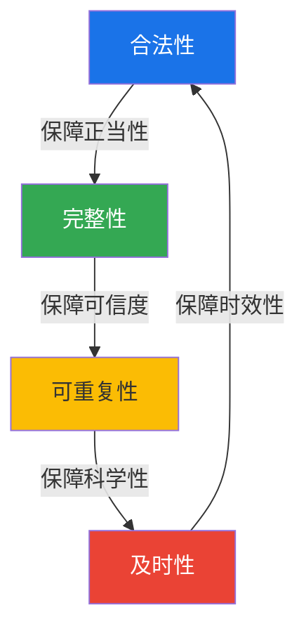
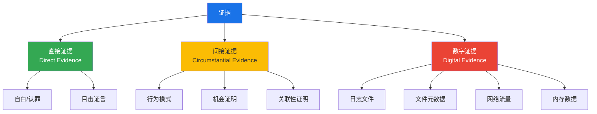
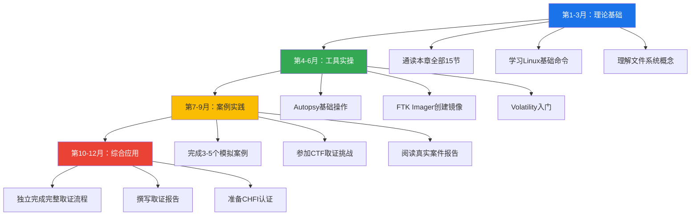
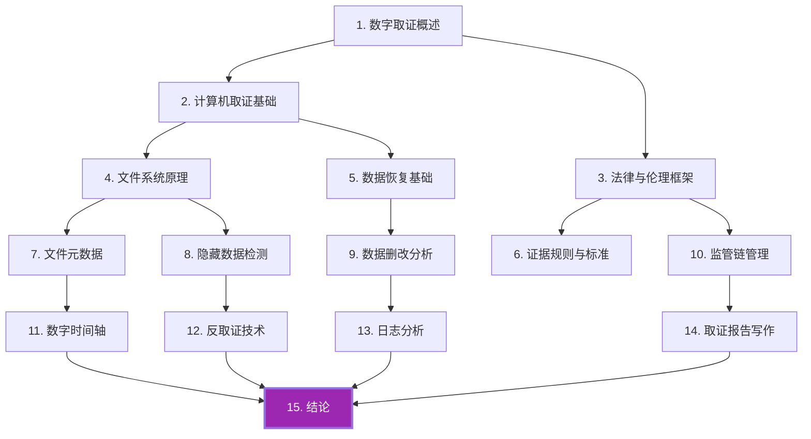

## 结论

数字取证作为网络安全领域最关键的响应环节，经历了从经验驱动到科学驱动、从手工操作到自动化分析、从本地存储到云端取证的三重深刻变革。本章15节内容从概念奠基到前沿展望，构建了一个完整的数字取证知识体系。作为收官之篇，本节将全章知识进行系统整合与升华，为读者提供一份可长期参考的知识地图。

---

## 一、数字取证的核心原则回顾

### 1.1 四大核心原则的深层理解

数字取证的**四大核心原则**构成了整个学科的理论基石。它们不是孤立的规则，而是一个相互支撑的有机整体：

| 原则 | 核心要求 | 实践意义 | 违反后果 |
|------|----------|----------|----------|
| **合法性** | 取证行为必须有法律授权 | 证据可采性的前提条件 | 整条证据链被排除（毒树之果原则） |
| **完整性** | 证据不得被篡改或破坏 | 通过哈希校验（SHA-256）保障 | 证据真实性受质疑，丧失证明力 |
| **可重复性** | 同一方法应得到相同结果 | 科学取证的基本要求 | 结论无法被同行验证，不具说服力 |
| **及时性** | 证据具有时效性，易失性数据优先 | 遵循"易失性顺序"采集原则 | 关键易失性数据永久丢失，案件线索断裂 |

**原则间的逻辑关系**：



合法性是起点——没有合法授权，后续一切操作都是非法入侵；完整性是核心——证据被污染，一切分析都是空中楼阁；可重复性是验证——只有可重复的结果才经得起法庭质证；及时性是保障——错过时间窗口，再完美的方法也无法挽回已消逝的数据。

### 1.2 洛卡德交换原理的数字延伸

法国犯罪学家埃德蒙·洛卡德（Edmond Locard）在20世纪初提出了"每次接触都会留下痕迹"的经典原理。在数字世界，这一原理以更精密的形式呈现：

| 痕迹类型 | 产生机制 | 持续时间 | 典型载体 |
|----------|----------|----------|----------|
| **操作系统日志** | 每次文件访问、进程创建、网络连接自动记录 | 数月至数年（取决于日志轮转策略） | Windows事件日志、syslog、journald |
| **文件系统元数据** | 创建时间、修改时间、访问时间（MAC时间）自动维护 | 与文件生命周期一致 | NTFS $MFT、ext4 inode、APFS |
| **内存残留** | 程序退出后数据仍可能在RAM中残留 | 数十秒至数分钟 | 物理内存、页面交换文件、休眠文件 |
| **网络痕迹** | 数据包经过的每一台网络设备都可能保留转发记录 | 秒级至天级（取决于设备缓冲策略） | NetFlow、PCAP、路由器日志 |
| **云服务日志** | API调用、存储操作、权限变更由云平台自动审计 | 30天至1年（取决于服务等级协议） | CloudTrail、Azure Monitor、GCP Audit |
| **固件痕迹** | 硬件控制器（BIOS/UEFI、硬盘固件）的操作日志 | 设备生命周期 | UEFI事件日志、S.M.A.R.T.数据 |

> **关键洞察**：数字空间的洛卡德原理比物理世界更"可信"——因为数字痕迹由系统自动生成，不存在人为遗漏或记忆偏差。但同时，数字痕迹也更容易被批量删除、覆盖或伪造。取证人员必须像考古学家一样，在层层覆盖的"数字地层"中寻找被刻意隐藏的真相。

### 1.3 数字证据的五维特性

数字证据与传统物理证据有五个根本差异，这些特性决定了取证方法必须与之适配：

1. **易复制性（Duplicability）**：数字证据可以被完全精确地无限复制，每个副本都是原件的"完美克隆"。这既是优势（用副本分析保护原件），也是挑战（难以区分"原件"和"副本"）。
2. **易变性（Volatility）**：许多数字证据是瞬态的——内存数据在断电后消失，网络连接在关闭后不可追溯，临时文件在系统清理后无法恢复。
3. **可传播性（Disseminability）**：数字证据可以以极低成本、极快速度在全球范围内传播，一份证据可能在毫秒间被复制到数十个国家的服务器上。
4. **依赖性（Technology Dependence）**：数字证据的解读依赖于特定的软硬件环境，同样的数据在不同系统上可能呈现不同含义。
5. **隐蔽性（Stealth）**：数字证据往往"隐藏"在海量正常数据中，需要专业工具和方法才能发现和提取。

---

## 二、数字取证方法论体系

### 2.1 五大阶段的闭环流程

数字取证的标准流程可归纳为五个阶段，形成一个从发现到反馈的闭环：


**各阶段核心任务、关键考量与常见失败原因**：

| 阶段 | 核心任务 | 常见误区 | 关键成功因素 | 失败代价 |
|------|----------|----------|-------------|----------|
| **识别** | 确定证据范围、类型、优先级 | 遗漏云证据或内存证据 | 建立全面的证据清单模板 | 关键证据被遗漏，案件无法推进 |
| **保全** | 创建镜像、计算哈希值、物理隔离 | 直接对原始介质操作 | 使用写保护器（Write Blocker） | 证据被污染，整条证据链断裂 |
| **采集** | 按易失性顺序提取数据 | 顺序颠倒导致易失数据丢失 | 遵循RFC 3227标准 | 易失性数据永久丢失，关键线索断裂 |
| **分析** | 时间线重构、关键词搜索、关联分析 | 仅依赖自动化工具 | 结合手动分析与工具辅助 | 误判或遗漏关键发现 |
| **报告** | 形成可读性强的法律文档 | 使用过多技术术语 | 面向法官/陪审团的语言表达 | 技术发现无法转化为法律证据 |

### 2.2 采集的优先级规则（易失性顺序）

根据RFC 3227建议，数字证据的采集必须遵循从**最易失到最不易失**的顺序：

| 优先级 | 证据类型 | 持续时间 | 采集工具 | 典型场景 |
|--------|----------|----------|----------|----------|
| 1 | 寄存器与CPU缓存 | 纳秒级 | 专用硬件（极少实际操作） | 仅用于最高级别实验室 |
| 2 | 系统内存（RAM） | 秒级至分钟级 | FTK Imager、LiME、DumpIt、Belkasoft RAM Capturer | 活跃系统必须第一步采集 |
| 3 | 网络连接状态 | 秒级至分钟级 | `netstat`、`ss`、Wireshark实时抓包 | 正在进行的网络攻击溯源 |
| 4 | 运行中的进程信息 | 分钟级 | `ps`、`tasklist`、Process Explorer | 恶意进程检测与分析 |
| 5 | 临时文件系统 | 分钟级至小时级 | 浏览器历史、临时目录、回收站 | 用户行为重建 |
| 6 | 磁盘存储 | 持久 | dd、FTK Imager、Guymager | 文件系统级分析 |
| 7 | 远程日志与备份 | 持久 | API调用、远程备份系统 | 云环境和企业环境 |
| 8 | 归档与磁带 | 长期持久 | 专用归档读取设备 | 历史案件追溯 |

> **实操准则**：对于一个正在运行的嫌疑系统，**首先进行内存采集**（使用工具如FTK Imager、LiME、DumpIt），再执行安全关机（`shutdown /s /t 0` 而非直接断电），最后对磁盘进行镜像。切勿在未采集内存的情况下强行关机——这将永久丢失关键的易失性数据。在紧急情况下，甚至可以使用USB启动盘中的取证Linux系统直接采集，而无需启动原系统。

### 2.3 科学取证方法论

数字取证不仅仅是技术的堆砌，更是一门需要遵循科学方法论的系统工程：

**假设驱动分析（Hypothesis-Driven Analysis）**：

1. **提出假设**："攻击者通过钓鱼邮件获得了初始访问权限"
2. **寻找证据**：检查邮件日志、附件哈希、用户行为记录、URL点击日志
3. **验证/证伪**：所有证据是否一致？是否有反证？邮件时间戳与入侵时间是否匹配？
4. **迭代**：根据新发现调整或更新假设。如果邮件时间晚于入侵时间，则假设不成立，需要寻找其他入侵向量

**证据分类分析框架**：



**重要提醒**：数字证据绝大多数属于间接证据——它能证明"发生了什么"，但不能直接证明"谁做的"。只有当多条间接证据形成完整逻辑链条时，才能得出可靠的结论。这是数字取证与传统刑侦的核心区别之一。

### 2.4 多源证据关联分析

单一证据源往往不足以还原完整事实。成熟的取证分析需要将来自不同来源的证据进行关联：

| 证据源 | 可提供信息 | 关联价值 | 典型分析方法 |
|--------|-----------|----------|-------------|
| 文件系统日志 | 文件创建/修改/删除时间 | 构建文件级时间线 | $MFT分析、文件雕刻 |
| Windows事件日志 | 登录、进程创建、策略变更 | 构建用户行为时间线 | Evtx解析、日志关联 |
| 网络流量 | 连接时间、数据量、目标地址 | 构建网络通信图谱 | PCAP分析、NetFlow可视化 |
| 内存镜像 | 运行中的进程、网络连接、解密密钥 | 还原运行时状态 | Volatility插件分析 |
| 注册表 | 安装软件、USB设备、用户配置 | 构建设备使用历史 | RegRipper分析 |
| DNS缓存 | 最近访问的域名 | 确认网络访问行为 | ipconfig /displaydns |

---

## 三、监管链（Chain of Custody）的完整保障

### 3.1 监管链的法律意义

监管链是数字取证**最脆弱也最关键**的环节。在法庭上，辩方律师最常见的攻击策略之一就是质疑证据的监管链完整性——"您能证明从采集到呈堂，这份证据从未被篡改过吗？"

**监管链必须记录的信息要素**：

```text
┌─────────────────────────────────────────────────┐
│           监管链记录表单（模板）                     │
├─────────────────────────────────────────────────┤
│ 证据标识：DF-2024-001-IMG                       │
│ 描述：嫌疑人笔记本电脑SSD的完整位镜像               │
│ 哈希值（SHA-256）：A3F2...8B1C                   │
├─────────────────────────────────────────────────┤
│ 采集人：张三（工号：LS-0042）                     │
│ 时间：2024-01-15 09:30 - 09:45                  │
│ 地点：C栋12楼 取证实验室                           │
│ 工具版本：FTK Imager 4.7.1.2                     │
│ 写保护器型号：Tableau T35689iu                    │
│ 移交人：张三 → 接收人：李四                        │
│ 时间：2024-01-15 09:45 - 09:50                  │
│ 目的：证据存储归档                                │
│ 存储位置：证据柜B-3-12                            │
│ 安全措施：双人监管、指纹锁、温湿度监控               │
│ ─────────────────────────────────────────────── │
│ 后续每次流转重复以上记录                            │
└─────────────────────────────────────────────────┘
```

### 3.2 常见监管链断裂场景及防范

| 断裂场景 | 风险等级 | 防范措施 | 法律后果 |
|----------|----------|----------|----------|
| 未记录交接时间 | ⚠️ 高 | 每次交接立即记录，精确到分钟 | 证据"真空期"被质疑 |
| 哈希值未在采集时计算 | ⚠️ 极高 | 采集完成后**立即**计算并写入记录 | 无法证明证据完整性 |
| 证据存放无人值守 | ⚠️ 中 | 使用双人监管制度、监控摄像头 | 推定证据可能被篡改 |
| 数字哈希值被篡改 | ⚠️ 极高 | 将哈希值同步至区块链或第三方存证平台 | 整条证据链不可信 |
| 多人共用取证账号 | ⚠️ 高 | 每人独立账号，禁用共享账号 | 无法确定谁执行了具体操作 |
| 原始介质未写保护 | ⚠️ 极高 | 始终使用硬件写保护器 | 证据被污染，不可逆转 |
| 取证报告与原始证据不符 | ⚠️ 高 | 报告撰写前重新校验哈希值 | 报告可信度归零 |

### 3.3 国际标准参考

| 标准编号 | 标准名称 | 核心内容 | 适用范围 |
|----------|----------|----------|----------|
| **ISO/IEC 27037:2012** | 数字证据的识别、收集、获取和保存指南 | 取证基础操作规范 | 全球通用 |
| **ISO/IEC 27041:2015** | 数字取证方法适用性指南 | 方法论评估框架 | 取证方法论设计 |
| **ISO/IEC 27042:2015** | 数字证据分析指南 | 分析过程规范 | 分析阶段 |
| **ISO/IEC 27043:2015** | 数字取证事件响应原则和过程 | 事件响应流程 | 安全事件响应 |
| **NIST SP 800-86** | 数字取证技术指南 | 完整的取证技术框架 | 美国联邦机构（全球参考） |
| **ACPO原则（英国）** | 数字取证的四项基本原则 | 英国执法机构操作指南 | 英国及英联邦国家 |

---

## 四、数字取证的主要挑战与应对策略

### 4.1 技术挑战

#### 4.1.1 加密技术的普及

**问题描述**：全盘加密（BitLocker、FileVault、LUKS）和端到端加密通信已成为主流，调查人员面临"门锁在眼前但钥匙不在手中"的困境。Windows 11默认启用设备加密，macOS从Catalina开始默认启用FileVault，这使得传统磁盘镜像分析方法面临根本性挑战。

**应对策略**：

| 策略 | 原理 | 适用场景 | 成功率 | 局限性 |
|------|------|----------|--------|--------|
| **内存中寻找密钥** | 系统运行时解密密钥通常存在于RAM中 | 目标系统仍在运行 | 60-80%（取决于系统配置） | 系统可能启用了内存保护（如Kernel DMA Protection） |
| **冷启动攻击** | 对内存模块进行物理冷却，延长数据残留时间 | 目标系统刚刚关机 | 40-70%（取决于环境温度） | 需要物理接触，且操作窗口极短 |
| **密钥恢复代理** | 在企业环境中部署密钥托管服务 | 企业环境 | 接近100%（如果有部署） | 个人设备通常不适用 |
| **侧信道分析** | 通过功耗、电磁辐射等物理信号分析密钥 | 高级实验室环境 | 变化很大 | 需要专业设备，成本极高 |
| **法律途径** | 依据《密码法》或相关法律要求解密 | 有法律依据时 | 取决于嫌疑人配合度 | 耗时长，且嫌疑人可能主张沉默权 |
| **硬件密钥提取** | 直接从TPM/安全芯片中提取密钥 | 特定硬件配置 | 技术上极具挑战 | 需要逆向工程能力 |

#### 4.1.2 反取证技术（Anti-Forensics）

反取证技术是指攻击者或嫌疑人为了干扰、阻碍或破坏数字取证调查而采用的技术手段。取证人员必须能够识别和应对这些技术：

| 手段 | 原理 | 检测方法 | 检测难度 |
|------|------|----------|----------|
| **数据擦除**（BleachBit/CCleaner） | 多次覆写存储介质 | 检查$MFT日志、NTFS日志文件、空闲空间残留 | ⭐⭐⭐ |
| **时间戳篡改**（Timestomp） | 使用工具修改文件时间属性 | 比较$STANDARD_INFORMATION与$FILE_NAME时间差异 | ⭐⭐ |
| **日志清除** | 删除系统日志条目 | 检查Windows事件日志备份、$LogFile、ELF序列号间隙 | ⭐⭐⭐ |
| **隐写术** | 将数据隐藏在图片/音频中 | 统计分析像素分布、检测LSB异常、StegDetect工具 | ⭐⭐⭐⭐ |
| **数据混淆** | 通过编码/加密隐藏内容 | 熵分析、已知文件签名扫描、binwalk分析 | ⭐⭐⭐ |
| **内存痕迹清除** | 终止进程前主动清除内存 | 页面交换文件残留、$UsnJrnl记录、Prefetch文件 | ⭐⭐⭐⭐ |
| **SSD TRIM** | 利用SSD的TRIM机制快速清零数据 | TRIM执行后数据不可恢复，需依赖日志和元数据 | ⭐⭐⭐⭐⭐ |
| **日志轮转攻击** | 利用日志轮转机制让旧日志被新日志覆盖 | 分析日志轮转策略，寻找备份和归档副本 | ⭐⭐⭐ |

#### 4.1.3 云取证挑战

**核心难点**：

- **管辖权争议**：数据可能存储在不同国家/地区的服务器上，涉及不同法律体系
- **多租户环境**：同一物理服务器运行多个客户虚拟机，数据隔离边界模糊
- **数据实时变动**：无法对云数据创建传统意义上的"静态镜像"
- **API限速**：云服务商的API速率限制影响数据采集效率（如AWS CloudTrail API默认限速为每秒10次请求）
- **日志保留周期**：大部分云服务日志只保留30-90天，过期自动删除
- **无物理接触**：无法像传统取证那样接触物理介质，完全依赖API和远程工具

**云取证最佳实践**：

1. **第一时间**通过云服务商的管理API创建快照（如AWS EBS Snapshot、Azure Disk Snapshot）
2. **启用全部审计日志**（CloudTrail、Azure Monitor、GCP Audit Logs），并将日志转发至独立存储
3. **记录API调用的时间戳和请求ID**作为证据，这些信息具有法律效力
4. **获取服务商的数据驻留证明**，明确数据存储的物理位置
5. **必要时启动跨国司法协助程序（MLAT）**，或利用CLOUD Act等快速通道
6. **定期执行云环境取证演练**，确保在真正需要时能快速响应

#### 4.1.4 新兴技术挑战

| 挑战领域 | 核心问题 | 取证影响 | 应对方向 |
|----------|----------|----------|----------|
| **量子计算** | 量子计算机可能破解当前主流加密算法（RSA、ECC） | 已加密的历史证据可能被"回溯解密" | 后量子密码学（PQC）迁移、量子安全加密标准 |
| **AI生成内容** | Deepfake视频、AI生成文本、合成语音 | 难以区分真实内容与AI生成内容 | 数字水印、内容来源验证、AI检测工具 |
| **边缘计算** | 数据在边缘节点处理，不回传中心 | 分布式证据源增加采集复杂度 | 边缘取证工具、分布式证据收集框架 |
| **5G网络** | 超高速率、超低延迟、网络切片 | 网络日志量激增、切片隔离增加取证难度 | 实时分析工具、切片级日志采集 |

### 4.2 法律挑战

#### 4.2.1 跨境数据取证

数字犯罪往往跨越国界，但法律框架的差异构成了巨大障碍：

| 法律框架 | 适用范围 | 核心特点 | 对取证的影响 |
|----------|----------|----------|-------------|
| **美国CLOUD Act** | 美国云服务商存储的全球数据 | 允许美国执法机构直接要求数据披露 | 绕过传统MLAT，速度更快 |
| **欧盟GDPR** | 欧盟公民个人数据 | 严格限制个人数据的跨境传输 | 跨境取证需数据保护评估 |
| **布达佩斯网络犯罪公约** | 197个签署国 | 目前最广泛的网络犯罪国际公约 | 提供多边合作框架 |
| **司法协助条约（MLAT）** | 双边/多边 | 传统司法合作途径 | 通常需要6个月至2年 |
| **中国《网络安全法》** | 中国境内网络运营者 | 数据本地化要求，跨境传输需安全评估 | 外国取证请求需通过特定程序 |

#### 4.2.2 隐私权与取证的平衡

数字取证操作不可避免地会接触到大量与被调查无关的第三方数据。如何在取证效率与公民隐私权之间取得平衡，是一个持续存在的法律伦理问题：

- **最小范围原则**：只采集与分析问题直接相关的数据，避免"地毯式搜索"
- **中立审查机制**：由第三方审查取证过程中的隐私保护措施
- **数据限期保留**：无关数据在分析确认后立即删除，不无限制保留
- **透明度报告**：向受影响方公开取证范围和措施（在不影响调查的前提下）
- **比例原则**：取证措施的强度应与案件严重程度成比例

---

## 五、数字取证的未来趋势

### 5.1 人工智能与自动化的深度融合

AI正在从根本上改变数字取证的效率和能力边界：

| 应用方向 | 当前能力 | 未来展望 | 预期时间线 |
|----------|----------|----------|-----------|
| **证据筛选** | 基于规则的自动化分类 | AI驱动的智能证据关联与推理 | 2-3年 |
| **异常检测** | 统计基线+阈值告警 | 深度行为模型识别零日攻击 | 3-5年 |
| **时间线分析** | 基于时序的关联 | 多维度跨系统因果推理 | 3-5年 |
| **报告生成** | 模板化的文档输出 | 自然语言生成的定制化报告 | 1-2年 |
| **取证效率** | 人工+半自动 | 全流程智能编排与执行 | 5-10年 |
| **语言分析** | 关键词搜索 | 语义理解与意图识别 | 2-3年 |
| **图像分析** | 人工筛查 | 自动识别敏感内容与关联人物 | 2-4年 |

**AI取证的风险与挑战**：

- **可解释性问题**：AI的决策过程是"黑箱"，法庭可能质疑其结论的可解释性
- **对抗性攻击**：攻击者可能使用对抗样本欺骗AI取证工具
- **训练数据偏差**：AI模型的准确性取决于训练数据的质量和多样性
- **法律地位模糊**：AI生成的分析报告是否具有法律效力尚无定论

### 5.2 物联网（IoT）取证

物联网设备数量预计在2025年将超过750亿台，每一台设备都可能成为证据源：

| 设备类型 | 典型数据 | 取证价值 | 采集难度 |
|----------|----------|----------|----------|
| **智能家居设备**（Alexa/小爱同学） | 语音指令、控制记录、时间戳 | 证明在场/不在场、行为模式 | ⭐⭐⭐（需API或云访问） |
| **智能门锁** | 开锁记录、指纹/人脸数据 | 证明出入行为 | ⭐⭐（通常有管理后台） |
| **智能摄像头** | 视频流、移动侦测日志 | 直接视觉证据 | ⭐⭐⭐（存储通常有限） |
| **可穿戴设备**（Apple Watch/小米手环） | 心率、步数、位置轨迹 | 证明活动状态和位置 | ⭐⭐⭐⭐（数据格式碎片化） |
| **车联网**（EDR/车载系统） | 碰撞数据、行驶记录、GPS轨迹 | 事故重建、责任认定 | ⭐⭐（EDR有标准接口） |
| **工业控制系统**（SCADA/PLC） | 操作日志、控制命令 | 攻击溯源、责任认定 | ⭐⭐⭐⭐⭐（专业协议、实时性要求） |

**IoT取证面临的特殊挑战**：

- 存储容量极小，日志覆盖周期短（很多设备只有几天的日志缓冲）
- 数据格式高度碎片化，缺乏统一标准（每家厂商的数据格式不同）
- 设备固件更新频繁，取证方法需持续适配
- 很多设备不具备物理接口，只能通过无线方式交互
- 生命周期短，设备可能在案件审理期间停产或数据被清除

### 5.3 区块链取证

区块链的不可篡改性为取证提供了"双刃剑"：

**有利面**：

- 交易记录公开透明，可追溯——任何人都可以验证链上交易
- 智能合约的执行过程可审计——代码即法律，执行过程不可篡改
- 去中心化存储（IPFS/Filecoin）的固定内容可验证——内容哈希不变

**不利面**：

- 加密钱包的匿名性（混币服务、隐私币如Monero/Zcash）
- 去中心化交易所（DEX）缺乏KYC信息
- 跨链桥和闪电网络增加了追踪难度
- 零知识证明技术进一步增强匿名性

**取证技术演进**：

- **链上分析**：通过交易图谱识别钱包集群（如Chainalysis、Elliptic的工具）
- **交易所配合**：大多数用户通过中心化交易所出入金，可依法调取KYC信息
- **链下情报**：暗网论坛、社交媒体上的交易信息
- **地址聚类**：通过共同输入、找零地址等启发式方法识别同一实体的多个地址

### 5.4 取证即服务（Forensics as a Service）

云计算的发展促进了取证服务的集中化和专业化：

```text
传统取证模式         →      取证即服务（FaaS）
┌─────────────┐              ┌─────────────┐
│ 自购工具授权     │              │ 按需付费          │
│ 自建实验室       │              │ 云上分析环境       │
│ 本地存储镜像     │              │ 云端存储          │
│ 单机分析         │              │ 分布式并行分析     │
│ 版本更新滞后     │              │ 工具持续更新       │
└─────────────┘              └─────────────┘
```

**代表性FaaS平台**：

| 平台 | 核心能力 | 适用场景 | 定价模式 |
|------|----------|----------|----------|
| **Cellebrite Cloud** | 移动设备证据的云端分析 | 移动取证 | 订阅制 |
| **Magnet AUTOMATE** | 自动化取证流程编排 | 企业级取证 | 按案件计费 |
| **Digital Detective** | 分布式分析和协作平台 | 团队协作取证 | 按使用量计费 |
| **SIFT Workstation** | 开源取证工具集（SANS） | 学习与研究 | 免费 |

---

## 六、关键工具速查表

以下是数字取证全阶段常用工具的快速参考：

### 6.1 磁盘与文件系统取证

| 工具名称 | 类型 | 平台 | 核心功能 | 许可证 |
|----------|------|------|----------|--------|
| **Autopsy** | 综合取证平台 | Windows/Linux | 文件分析、时间线、关键词搜索 | 开源（Apache 2.0） |
| **FTK Imager** | 镜像创建工具 | Windows | 磁盘镜像、哈希计算 | 免费 |
| **Guymager** | 镜像创建工具 | Linux | 磁盘镜像、多种格式支持 | 开源（GPL） |
| **X-Ways Forensics** | 综合取证平台 | Windows | 磁盘分析、文件恢复 | 商业许可 |
| **EnCase** | 综合取证平台 | Windows | 企业级取证分析 | 商业许可 |
| **Sleuth Kit** | 命令行工具集 | Linux/macOS | 文件系统分析、时间线 | 开源（GPL） |

### 6.2 内存取证

| 工具名称 | 平台 | 核心功能 | 许可证 |
|----------|------|----------|--------|
| **Volatility 3** | 跨平台 | 内存镜像分析、进程/网络/注册表提取 | 开源（VSL） |
| **LiME** | Linux/Android | Linux内存采集 | 开源（GPL） |
| **DumpIt** | Windows | Windows内存采集 | 免费（Comae） |
| **Belkasoft RAM Capturer** | Windows | Windows内存采集 | 免费版可用 |

### 6.3 网络取证

| 工具名称 | 核心功能 | 适用场景 | 许可证 |
|----------|----------|----------|--------|
| **Wireshark** | 网络包捕获与分析 | 深度网络分析 | 开源（GPL） |
| **NetworkMiner** | 网络取证分析 | 文件提取、主机识别 | 开源版可用 |
| **Zeek（Bro）** | 网络监控与日志 | 大规模网络日志采集 | 开源（BSD） |
| **tcpdump** | 命令行抓包 | 快速网络抓包 | 开源（BSD） |

### 6.4 日志分析

| 工具名称 | 核心功能 | 适用场景 | 许可证 |
|----------|----------|----------|--------|
| **Log2Timeline/Plaso** | 超级时间线生成 | 多源日志关联分析 | 开源（Apache 2.0） |
| **ELK Stack** | 日志聚合与搜索 | 大规模日志分析 | 开源（SSPL） |
| **Chainsaw** | Windows事件日志分析 | 快速日志搜索与匹配 | 开源（GPL） |

---

## 七、面向不同读者的行动建议

### 7.1 入门者（0-1年经验）

**目标**：建立正确的取证思维，掌握基本操作

**学习路径**：



**具体练习任务**：

1. 使用 `dd` 或 `FTK Imager` 创建磁盘镜像，并验证SHA-256哈希值
2. 使用 `Autopsy` 分析一个公开的取证镜像（如NIST CFReDS样本）
3. 使用 `Volatility` 读取内存镜像，提取进程列表和网络连接
4. 使用 `Log2Timeline` 生成一个磁盘的时间线

**推荐的入门读物**：
- 《计算机取证》（Computer Forensics）- Bill Nelson
- 《数字取证与数据恢复》- 梁永生
- NIST SP 800-86《数字取证技术指南》
- SANS FOR508课程教材

### 7.2 进阶者（1-3年经验）

**目标**：独立完成取证任务，撰写专业报告

**重点突破方向**：

| 领域 | 学习内容 | 实践方式 |
|------|----------|----------|
| **文件系统深入** | NTFS内部结构、$MFT解析、$LogFile分析 | 手工解析磁盘扇区 |
| **注册表取证** | SAM、SYSTEM、SOFTWARE配置单元分析 | 使用RegRipper+手工分析 |
| **内存取证进阶** | Volatility插件开发、恶意软件内存分析 | 分析恶意软件内存样本 |
| **网络取证** | PCAP深度分析、NetFlow关联、加密流量识别 | 分析真实网络攻击PCAP |
| **报告写作** | 面向法律专业人士的取证报告 | 模仿真实法庭报告格式 |

**推荐认证**：
- **CHFI**（Computer Hacking Forensic Investigator）- EC-Council
- **GCFE**（GIAC Certified Forensic Examiner）- SANS
- **EnCE**（EnCase Certified Examiner）- OpenText

### 7.3 高级从业者（3年以上经验）

**目标**：处理复杂案件，建立方法论体系

**重点发展方向**：

- **反取证检测与对抗**：深入研究各种反取证技术的检测方法
- **云取证**：掌握AWS/Azure/GCP的取证流程和API
- **移动设备取证**：iOS/Android系统级取证、应用数据提取
- **自动化工具开发**：开发或定制取证工具，提高分析效率
- **法庭专家证人**：学习法庭程序，提升出庭作证能力
- **前沿研究**：AI取证、IoT取证、区块链取证、后量子密码学

---

## 八、本章知识体系总览

以下思维导图完整展示了本章15个章节之间的逻辑脉络：



---

## 九、核心术语速查

| 术语 | 英文 | 定义 | 首次出现章节 |
|------|------|------|-------------|
| 数字取证 | Digital Forensics | 应用科学方法和技术从数字资源中提取、分析和报告证据 | 25.1 |
| 监管链 | Chain of Custody | 证据从采集到呈堂的完整流转记录 | 25.5 |
| 易失性顺序 | Volatility Order | 按证据消失速度从快到慢的采集优先级 | 25.1 |
| 洛卡德原理 | Locard's Principle | "每次接触都会留下痕迹"的犯罪学原理 | 25.1 |
| 写保护器 | Write Blocker | 防止对原始存储介质进行写操作的硬件设备 | 25.1 |
| 哈希校验 | Hash Verification | 使用SHA-256等算法验证数据完整性 | 25.1 |
| 时间线分析 | Timeline Analysis | 按时间顺序重组事件以还原事实 | 25.11 |
| 反取证 | Anti-Forensics | 干扰或破坏数字取证调查的技术手段 | 25.12 |
| 云取证 | Cloud Forensics | 针对云环境的数字取证方法 | 25.4 |
| 取证即服务 | Forensics as a Service | 云端化的数字取证工具和平台 | 25.4 |
| 内存取证 | Memory Forensics | 对系统内存镜像进行分析的技术 | 25.8 |
| 文件雕刻 | File Carving | 从磁盘原始数据中重建文件的技术 | 25.5 |
| $MFT | Master File Table | NTFS文件系统的核心元数据结构 | 25.4 |
| MLAT | Mutual Legal Assistance Treaty | 司法协助条约，用于跨境取证合作 | 25.2 |

---

## 十、结语

数字取证是一门融合了**计算机科学、法学、侦查学和伦理学**的交叉学科。它既是技术活——需要精通操作系统、文件系统、网络协议等底层知识；也是"侦探活"——需要敏锐的观察力、严谨的逻辑推理和不懈的探索精神。

本章从理论基础出发，建立了数字取证的系统认知框架。但请记住：**理论是地图，实践才是双脚**。真正优秀的数字取证专家，是在无数次"假设→验证→修正"的迭代中成长起来的。每一份镜像、每一行日志、每一次时间线重构，都是通往精通之路的必经阶梯。

> **最后的提醒**：在数字取证的世界里，细节决定成败——一个被忽视的时间戳可能改变案件走向，一段被遗漏的日志可能掩盖关键证据，一个错误的哈希值可能让整条证据链崩溃。保持怀疑、保持严谨、保持对真相的敬畏，这是一个取证从业者最重要的品质。

---

**关键词**：数字取证、监管链、易失性顺序、反取证、云取证、IoT取证、洛卡德交换原理、法庭证据、内存取证、时间线分析、文件雕刻、写保护器、哈希校验、跨境取证
