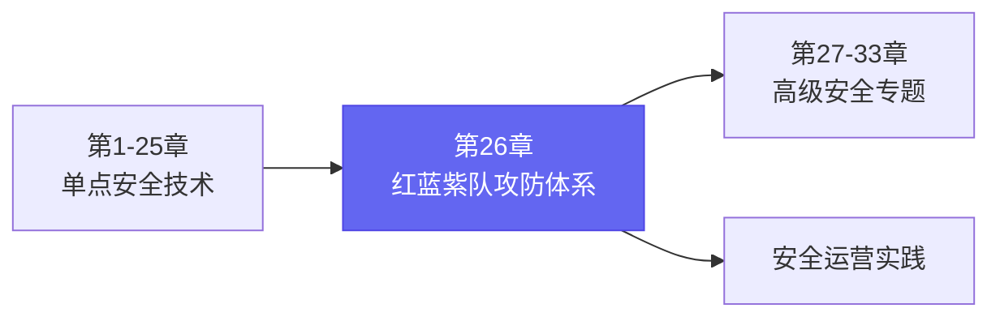
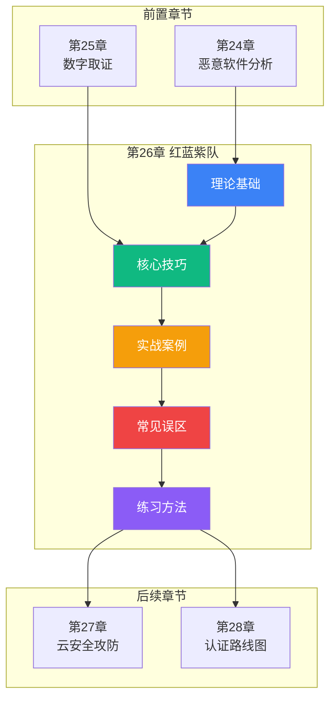

# 第26章 红队蓝队紫队

## 本章定位

在本书的知识体系中，第26章处于从单点安全技术（漏洞利用、逆向工程、密码学等）向体系化安全运营过渡的关键枢纽位置。前面的章节解决的是"怎么攻"和"怎么防"的单点问题，而本章要回答的是一个更高维度的问题：**如何组织一场系统性的攻防对抗，让攻击和防御能力同步提升？**



这不是简单地把攻击和防御技术叠加在一起，而是一套完整的方法论和组织架构。理解了这套体系，你才能从一个"会用工具的人"成长为"能建设安全体系的人"。

---

## 什么是红队、蓝队、紫队

### 红队（Red Team）—— 模拟敌人的猎手

红队是安全攻防体系中的**进攻方**，其核心使命是模拟真实世界的高级威胁行为者（APT组织、有组织犯罪团伙、内部威胁者），对目标组织发起全维度的攻击模拟。

红队与传统渗透测试的本质区别在于：

| 维度 | 传统渗透测试 | 红队行动 |
|------|-------------|---------|
| **目标范围** | 特定资产或应用 | 组织整体安全态势 |
| **测试边界** | 明确的测试范围 | 最小化约束，模拟真实攻击路径 |
| **时间跨度** | 数天到数周 | 数周到数月（持续性行动） |
| **攻击手法** | 覆盖已知漏洞 | 运用完整攻击链，包括社会工程 |
| **隐蔽性要求** | 通常无需隐蔽 | 高度隐蔽，避免触发防御 |
| **衡量标准** | 发现的漏洞数量和严重程度 | 能否达成预设业务目标（如获取核心数据） |
| **输出产物** | 漏洞报告 | 模拟攻击的完整叙事和防御差距分析 |

红队行动遵循MITRE ATT&CK框架中的14个战术阶段，从侦察（Reconnaissance）到影响（Impact），完整复现高级攻击者的攻击生命周期。典型的红队行动会使用以下技术和战术：

- **侦察阶段**：OSINT信息收集、目标网络枚举、人员画像构建
- **武器化阶段**：定制化载荷开发、免杀技术、鱼叉式钓鱼邮件构造
- **投递阶段**：鱼叉钓鱼、水坑攻击、供应链投递、物理入侵
- **利用阶段**：初始访问、权限提升、横向移动、持久化
- **行动阶段**：数据窃取、业务中断模拟、横向渗透到关键资产

红队成员需要具备的不仅是技术能力，更需要**威胁情报思维**——理解目标组织的行业背景、业务特点、安全投入水平和潜在的攻击动机，从而制定有针对性的攻击策略。

### 蓝队（Blue Team）—— 守护疆域的盾卫

蓝队是安全攻防体系中的**防御方**，负责构建和维护组织的整体安全防御体系。蓝队的工作不是被动地等待攻击发生，而是主动地建设和优化防御能力。

蓝队的职责涵盖四个核心领域：

**1. 安全监控与检测**
- 部署和运维SIEM（如Splunk、ELK Stack、Microsoft Sentinel）
- 编写和优化检测规则（Sigma规则、YARA规则、Snort/Suricata签名）
- 构建威胁狩猎（Threat Hunting）能力，主动寻找潜伏威胁
- 管理EDR/NDR/XDR终端检测系统

**2. 事件响应与遏制**
- 建立事件响应流程（PICERL模型：准备→识别→遏制→根除→恢复→总结）
- 执行数字取证分析，还原攻击路径
- 协调跨部门的应急响应（IT运维、法务、公关、管理层）
- 管理安全事件的沟通和报告

**3. 安全加固与防护**
- 系统和网络的安全基线配置
- 补丁管理策略制定与执行
- 访问控制和身份管理优化
- 网络分段和微隔离策略

**4. 安全运营优化**
- SOC（安全运营中心）日常运营
- 安全策略和流程的持续迭代
- 安全度量指标体系的建立和跟踪
- 威胁情报的整合与利用

蓝队能力的高低直接决定了组织的**安全基线**——也就是在没有红队介入时，组织抵御常规攻击的能力水平。蓝队不是红队的"陪练"，而是组织安全能力的真正基石。

### 紫队（Purple Team）—— 打破壁垒的黏合剂

紫队不是一个独立的团队编制，而是一种**协作模式和组织理念**。紫队的核心价值在于解决红蓝对抗中最大的痛点：**信息不对称和能力脱节**。

在传统的红蓝对抗模式中，存在一个普遍困境——红队发现了攻击路径，但防御方的检测规则没有覆盖；蓝队建设了防御体系，但不知道攻击者的真实行为模式。这种"各自为战"的模式导致攻防双方的投入产出比严重失衡。

紫队协作模式通过以下机制打破这个困局：

```text
┌─────────────────────────────────────────────────────┐
│                   紫队协作模型                        │
├─────────────────────────────────────────────────────┤
│                                                     │
│   红队攻击模拟                                        │
│       │                                             │
│       ▼                                             │
│   实时共享攻击行为数据                                 │
│       │                                             │
│       ├──▶ 蓝队即时分析检测能力缺口                     │
│       │                                             │
│       ├──▶ 编写/优化检测规则                           │
│       │                                             │
│       └──▶ 验证规则是否能检测该攻击                      │
│                                                     │
│   形成闭环：攻击→检测→验证→改进→再次攻击                  │
│                                                     │
└─────────────────────────────────────────────────────┘
```

紫队协作的典型场景包括：

- **攻击技术验证**：红队演示一个新攻击手法，蓝队现场编写检测规则，然后红队验证规则的有效性
- **检测覆盖评估**：对照ATT&CK矩阵，逐项评估当前检测能力，识别覆盖空白
- **防御优先级排序**：基于真实攻击路径的数据，确定最需要优先加强的防御领域
- **知识转移**：红队向蓝队传授攻击者视角的思维方式，提升蓝队的威胁狩猎能力

紫队模式的落地需要组织层面的制度保障，包括：明确的协作流程、共享的技术平台、统一的度量标准，以及管理层对攻防协同理念的支持。

---

## 为什么本章重要

### 行业背景：攻防对抗的新常态

2020年代以来，网络安全攻防对抗已经从"技术竞赛"演变为"体系对抗"。几个关键趋势推动了这一变化：

**1. 勒索软件的工业化**

现代勒索软件组织（如LockBit、BlackCat、Cl0p）已经形成了完整的产业链——初始访问代理、勒索软件即服务（RaaS）、数据泄露市场、洗钱网络。单点防御已经无法应对这种体系化的威胁。

**2. 供应链攻击的常态化**

从SolarWinds到Kaseya，从Codecov到Log4Shell，供应链攻击已经成为高级威胁行为者的首选策略。这类攻击需要红蓝双方在更广的攻击面上进行对抗。

**3. 云环境的安全挑战**

云原生架构（容器、微服务、Serverless）引入了新的攻击面和防御盲区。传统基于网络边界的防御模型需要根本性的升级。

**4. 合规驱动的攻防演练**

全球各地的监管机构越来越要求企业进行定期的安全测试和攻防演练。中国的网络安全等级保护（等保2.0）、美国的SEC网络安全披露规则、欧盟的NIS2指令都对企业的安全检测能力提出了明确要求。

### 个人能力提升的价值

对于安全从业者而言，红蓝紫队体系提供了清晰的职业发展路径：

```text
初级安全工程师
    │
    ├──▶ 蓝队路线：安全运营 → 威胁分析师 → SOC经理 → CISO
    │
    ├──▶ 红队路线：渗透测试 → 红队工程师 → 首席红队 → 安全咨询
    │
    └──▶ 紫队路线：安全工程师 → 紫队协调员 → 安全架构师 → VP Security
```

无论选择哪条路线，理解完整的攻防体系都是成为高级安全专业人员的必经之路。

---

## 本章学习目标

通过本章的学习，读者将能够：

1. **建立完整的攻防对抗知识框架**
   - 掌握MITRE ATT&CK框架的14个战术阶段和数百种攻击技术
   - 理解攻击链模型、钻石模型、OODA循环等核心理论的适用场景
   - 区分红队行动、渗透测试、漏洞评估的本质差异

2. **掌握红队攻击技术体系**
   - 构建从侦察到影响的完整攻击能力栈
   - 掌握免杀、横向移动、持久化等高级攻击技术
   - 学会使用MITRE Caldera等自动化攻击模拟平台

3. **建设蓝队防御运营能力**
   - 设计和运维企业级SOC架构
   - 编写高质量的检测规则（Sigma、YARA、Suricata）
   - 建立威胁狩猎和事件响应的成熟流程

4. **落地紫队协作方法论**
   - 设计紫队协作的工作流程和技术平台
   - 实施基于ATT&CK的检测覆盖率评估
   - 建立攻防双方的度量指标和持续改进机制

5. **分析真实攻防案例**
   - 通过金融、供应链、云环境等多领域案例理解攻防实战
   - 学习案例中的决策过程和经验教训
   - 提炼可复用的攻防策略和战术模式

6. **识别和避免常见误区**
   - 理解"红队过度追求技术炫技"等典型问题
   - 掌握攻防演练中的合规和风险管理要点
   - 建立正确的攻防对抗价值观

---

## 本章结构

本章分为五个核心部分，按照"理论→方法→实践→反思→提升"的逻辑递进展开：

| 部分 | 文件 | 核心主题 | 核心内容 |
|------|------|---------|---------|
| 理论基础 | 01-10 | 攻防对抗的理论根基 | 攻防历史演进、MITRE ATT&CK框架、攻击链模型、钻石模型、OODA循环、假设驱动安全、威胁情报、安全度量、SOC架构 |
| 核心技巧 | 01-13 | 红蓝紫队的实战方法论 | 红队攻击技术体系、蓝队防御体系、紫队协作方法论、红队工具链、蓝队检测工程、MITRE Caldera自动化攻击模拟、ATT&CK覆盖率评估 |
| 实战案例 | 01-07 | 真实场景的攻防实战 | 金融企业红蓝对抗、供应链攻击紫队协作、大型企业内网渗透、云环境红蓝对抗、勒索软件应急响应、API安全红蓝对抗、最佳实践总结 |
| 常见误区 | 04 | 攻防演练中的典型陷阱 | 十大典型误区与纠正方法 |
| 练习方法 | 05 | 持续提升攻防能力 | 靶场平台、CTF竞赛、自建实验环境 |
| 本章小结 | 06 | 核心要点回顾 | 关键知识点总结与进阶方向 |
| 深度拓展 | 07 | 进阶学习路径 | 行业趋势、前沿研究、职业发展 |

### 推荐阅读顺序

对于不同背景的读者，建议的学习路径有所不同：

**安全工程师（防御方向）**：
1. 理论基础（建立攻防认知）→ 2. 核心技巧（聚焦蓝队部分）→ 3. 实战案例 → 4. 常见误区

**渗透测试人员（攻击方向）**：
1. 理论基础 → 2. 核心技巧（聚焦红队部分）→ 3. 实战案例 → 5. 练习方法

**安全管理者**：
1. 章节概览（本文件）→ 2. 理论基础（概览即可）→ 3. 实战案例 → 4. 常见误区 → 6. 本章小结

**网络安全学生**：
完整按顺序阅读，重点理解理论基础中的框架模型，多在练习方法部分的平台上实践

---

## 适用读者

本章内容适用于以下读者群体：

- **安全工程师**：希望系统了解攻防演练体系，提升实战能力，从单点防御转向体系化安全建设
- **安全管理者**：需要规划和组织企业级攻防演练项目，理解攻防对抗的商业价值和ROI
- **渗透测试人员**：希望从单一的渗透测试扩展到红队作战视角，掌握更完整的攻击方法论
- **安全运营人员**：希望理解攻击者思维以提升检测和响应能力，建立更高效的SOC运营体系
- **安全架构师**：需要设计攻防演练的整体架构和技术平台，评估和优化组织的安全态势
- **网络安全学生**：希望建立攻防对抗的完整知识体系，为未来的职业发展打下坚实基础

---

## 前置知识

学习本章前，读者应具备以下基础知识：

**网络基础**：
- TCP/IP协议栈、HTTP/HTTPS协议、DNS解析流程
- 基本的网络拓扑和路由概念

**操作系统基础**：
- Windows域环境（Active Directory）的基本概念
- Linux系统管理（权限、进程、网络配置）
- 常见服务的部署和配置

**安全基础**：
- OWASP Top 10 Web应用安全风险
- 常见漏洞类型（SQL注入、XSS、RCE、提权等）
- 基本的加密概念（对称/非对称加密、哈希、数字证书）

**工具使用**：
- Nmap网络扫描
- Burp Suite Web应用测试
- Wireshark流量分析
- Metasploit框架的基本使用

> 💡 **提示**：如果你在某些前置知识上有所欠缺，不必急于补充全部内容。本章会在涉及具体技术时提供必要的背景说明。建议先通读本章概览和理论基础部分，建立整体认知后再深入各个技术环节。

---

## 关键术语

| 术语 | 英文 | 说明 | 本章出现频率 |
|------|------|------|-------------|
| TTPs | Tactics, Techniques and Procedures | 战术、技术和流程，描述攻击者行为模式的三个层级 | ★★★★★ |
| APT | Advanced Persistent Threat | 高级持续性威胁，具有明确目标、长期潜伏和高级技术能力的威胁组织 | ★★★★ |
| IoC | Indicator of Compromise | 入侵指标，用于识别已发生的安全事件的证据（IP、哈希、域名等） | ★★★★ |
| ATT&CK | Adversarial Tactics, Techniques & Common Knowledge | MITRE建立的对抗知识库，系统化描述攻击者行为 | ★★★★★ |
| SIEM | Security Information and Event Management | 安全信息和事件管理平台，用于集中收集和分析安全日志 | ★★★★ |
| EDR | Endpoint Detection and Response | 终端检测与响应，提供终端级别的威胁检测和响应能力 | ★★★★ |
| SOC | Security Operations Center | 安全运营中心，组织安全监控和事件响应的集中化团队 | ★★★★ |
| OPSEC | Operations Security | 操作安全，红队行动中保护己方信息不被发现的实践 | ★★★ |
| Sigma | - | 通用检测规则格式，可在多个SIEM平台间共享检测逻辑 | ★★★ |
| YARA | - | 恶意软件识别和分类的模式匹配工具 | ★★★ |
| Threat Hunting | - | 威胁狩猎，主动在环境中搜索潜伏威胁的安全实践 | ★★★ |
| Playbook | - | 安全事件响应剧本，预定义的标准化响应流程 | ★★ |
| Purple Teaming | - | 紫队协作，红蓝双方实时协同的工作模式 | ★★★★ |
| Ransomware-as-a-Service | - | 勒索软件即服务，攻击者将勒索软件工具化的商业模式 | ★★ |

---

## 与前后章节的关联



- **前置依赖**：第24章（恶意软件分析）中的逆向分析和行为分析技术是红队武器化阶段的基础；第25章（数字取证）中的取证方法论是蓝队事件响应的核心能力
- **本章核心**：红蓝紫队体系将前面的单点技术整合为体系化的攻防能力
- **后续延伸**：第27章（云安全攻防）是红蓝对抗在云环境的具体应用；第28章（认证路线图）中的OSCP、CRTO等认证与本章的攻防技能直接相关

---

> ⚠️ **安全警告与免责声明**
>
> 本章内容仅供**合法的安全测试与教育目的**使用。所有技术、工具和方法的讨论均旨在帮助安全从业者在**获得明确授权**的前提下进行防御性安全研究。
>
> - 🚫 **未经授权**对任何系统、网络或应用进行安全测试是**违法行为**，可能面临刑事追诉
> - ✅ 所有实践活动应在**隔离的实验环境**中进行（如虚拟机、CTF平台、专用靶场）
> - ✅ 遵守所在国家和地区的**网络安全法律法规**（如《中华人民共和国网络安全法》《数据安全法》《个人信息保护法》）
> - ✅ 遵循**负责任的漏洞披露**原则，发现漏洞后应通过合法渠道向厂商报告
> - ✅ 红队行动必须获得**书面授权**，明确测试范围、时间窗口和免责条款
>
> 作者不对因滥用本章内容造成的任何后果承担责任。
