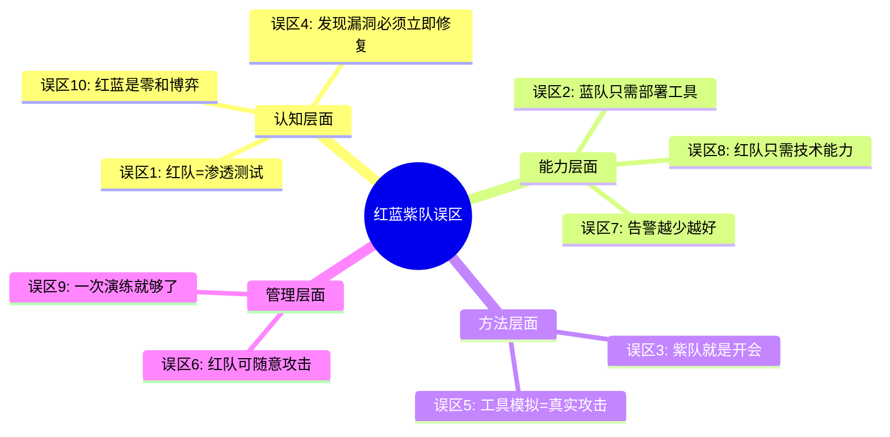

# 26.4 常见误区与纠偏指南

在红队蓝队紫队的实践中，组织反复陷入相同的认知陷阱。这些误区并非偶然——它们源于对攻防体系的片面理解、业界营销话术的误导，以及将复杂系统简化为线性思维的本能倾向。本节系统梳理十大常见误区，剖析其成因，给出可执行的纠偏路径，并通过真实案例说明误入歧途的代价。

## 误区全景图

在深入每个误区之前，先通过一张分类图理清它们的逻辑关系：



这十个误区按**认知、能力、方法、管理**四个维度组织，下面逐一剖析。

---

## 误区一：红队演练就是高级版渗透测试

### 误区描述

许多组织将红队演练等同于渗透测试，只是时间更长、范围更广、费用更高。项目计划中写着"红队演练"，实际执行的却是标准渗透测试的流程。这是业界最普遍、也最危险的认知偏差。

### 为什么这个误区如此普遍

1. **供应商推波助澜**：部分安全厂商将渗透测试包装为"红队服务"以提高报价
2. **术语混用**：行业媒体、会议演讲中"红队"与"渗透测试"经常互换使用
3. **缺乏对比认知**：大多数组织只做过渗透测试，没有红队经验作为参照
4. **交付物相似**：两者最终都产出一份漏洞报告，让人误以为过程也相同

### 本质差异：一张表说清楚

| 维度 | 渗透测试 | 红队演练 |
|------|---------|---------|
| **核心目标** | 尽可能多地发现漏洞 | 检验能否达成特定攻击目标 |
| **评估对象** | 系统和技术漏洞 | 整体安全防御体系（人+流程+技术） |
| **攻击策略** | 广撒网，追求覆盖率 | 深度聚焦，追求隐蔽性和有效性 |
| **时间范围** | 通常1-4周 | 通常2-12周，甚至更长 |
| **攻击者画像** | 通用攻击者 | 模拟特定威胁组织（APT）的TTP |
| **与蓝队关系** | 通常独立进行，蓝队不知情 | 可包含紫队协同，有结构化反馈 |
| **衡量指标** | 漏洞数量和严重级别 | 目标达成率、检测响应时间、MTTD/MTTR |
| **报告重点** | 漏洞详情和修复建议 | 攻击路径分析、防御缺口、战略改进建议 |

### 真实案例

某金融机构花费 80 万元购买"红队服务"，供应商用 Nessus + Metasploit 跑了两周，交付了一份 200 页的漏洞扫描报告。报告列出了 347 个漏洞，但没有回答最关键的问题：**如果 APT 组织盯上我们的核心交易系统，他们能不能进来？能待多久？能带走什么？** 这就是典型的"披着红队外衣的渗透测试"。

### 正确做法

**决策矩阵：何时选择哪种评估方式**

```text
评估目的 → 选择方式
─────────────────────────────────
合规要求（等保/ISO）      → 渗透测试
漏洞管理有效性验证        → 渗透测试
新系统上线前安全检查      → 渗透测试
整体安全防御能力评估      → 红队演练
模拟特定APT组织威胁       → 红队演练
安全团队实战能力检验      → 红队演练
检测和响应能力验证        → 紫队协作
持续安全能力迭代          → 紫队协作
```

在项目启动前，向供应商明确问三个问题：
1. 你们的红队演练是否模拟特定威胁组织的 TTP？
2. 演练过程中是否与蓝队进行实时协同（紫队模式）？
3. 最终报告是否包含攻击路径分析和防御体系评估，而不只是漏洞清单？

如果三个问题的答案都是否定的，那这大概率不是真正的红队演练。

---

## 误区二：蓝队只需要部署安全工具

### 误区描述

许多组织认为购买并部署了 SIEM、EDR、NDR、防火墙、WAF 等安全产品，蓝队就具备了防御能力。预算花在设备采购上，却忽略了更关键的人和流程。

### 为什么这个误区如此普遍

1. **工具可见，能力无形**：部署了什么设备是看得见的，分析人员的能力是无形的
2. **采购驱动文化**：IT 部门习惯用采购来"解决问题"，因为有明确的发票和合同
3. **厂商话术**：安全厂商的 PPT 总在强调"部署后即可获得 XX 能力"
4. **缺乏度量**：大多数组织无法量化"安全运营成熟度"，只能数设备数量

### 工具≠能力：一个公式

```text
安全防御能力 = f(工具 × 人员技能 × 流程成熟度 × 持续优化)
```

注意这是**乘法关系**，任何一项为零，整体能力趋近于零。具体来说：

- **工具有，人员弱**：SIEM 每天产生 10 万条告警，3 个分析师根本看不过来，大量威胁淹没在噪音中
- **人员强，工具有但没调优**：分析师知道怎么查日志，但 SIEM 规则是默认配置，很多攻击行为根本不会触发告警
- **工具和人都有，流程缺失**：发现威胁后不知道该通知谁、怎么响应、怎么取证、怎么溯源

### 真实案例

某电商企业部署了全套 EDR + SIEM + NDR 方案，号称"全栈防护"。一次红队演练中，红队仅用社会工程获取了一个员工的 VPN 凭证，然后通过合法 VPN 通道横向移动，最终拿到核心数据库权限。蓝队的 EDR 没有触发任何告警——因为红队全程使用了合法工具和凭证，EDR 的默认策略将这些操作标记为"正常业务行为"。

事后分析发现：
- EDR 的自定义规则为零，全部使用默认策略
- SIEM 只接入了防火墙日志，未接入终端行为日志
- NDR 部署了但从未有人分析过流量基线

### 正确做法

建立**安全运营能力成熟度**的持续评估机制：

```text
Level 1 - 工具部署：设备上线，基本策略配置
Level 2 - 基本运营：日志接入，告警分级，7×24值守
Level 3 - 调优迭代：规则优化，误报率降至可接受水平，建立检测工程体系
Level 4 - 主动验证：通过紫队协作持续验证和提升检测能力
Level 5 - 智能运营：自动化编排（SOAR），威胁狩猎常态化，数据驱动决策
```

**投入比例建议**：总安全预算中，工具采购不超过 40%，人员培养和流程建设至少占 40%，演练和验证占 20%。

---

## 误区三：紫队就是红队和蓝队一起开会

### 误区描述

认为紫队只是红蓝双方在演练结束后坐在一起开个总结会，交换信息，然后各回各家。

### 为什么这个误区如此普遍

1. **紫队概念较新**：MITRE 在 2020 年才正式推广 Purple Teaming，很多组织理解不深
2. **执行成本高**：真正的紫队协作需要红蓝双方在演练期间实时协同，时间成本远高于事后开会
3. **组织壁垒**：红队和蓝队往往分属不同部门或不同供应商，实时协同涉及协调和授权
4. **效果难量化**：事后开会有会议纪要可以交付，实时协同的效果难以在短期内显性化

### 紫队≠事后总结：对比理解

```text
事后总结模式（伪紫队）：
  红队攻击 ──────→ 结束 → 开会 → 报告 → 各自行动
                                    ↑
                               时间线断裂
                           信息单向流动

真紫队协作模式：
  红队：攻击 ─→ 发现 ─→ 共享 ─→ 攻击 ─→ 发现 ─→ ...
  蓝队：        监测 ← 检测 ← 改进 ← 监测 ← 检测 ← ...
                  ↑___________________________________↑
                        实时双向反馈闭环
```

### 紫队协作的四个关键环节

**1. 同步攻击模拟（Attack Simulation Synchronization）**

红队每执行一步攻击操作，蓝队同步在检测平台上观察。不是等红队"打完"再回看日志，而是实时观看。

具体操作：红队在执行攻击前通知蓝队"我现在要执行 Kerberoasting"，蓝队在 SIEM/EDR 中打开对应监控面板，确认是否能检测到该行为。

**2. 实时检测验证（Detection Validation）**

蓝队确认检测结果后，立即与红队沟通：
- 检测到了：告警内容是什么？分级是否正确？响应流程是否顺畅？
- 没检测到：是规则缺失、日志未采集，还是攻击技术超出当前检测范围？

**3. 即时差距分析（Gap Analysis）**

对每个未检出的攻击技术，当场分析根因：
- 日志层面：所需日志是否已采集？
- 规则层面：是否有对应检测规则？规则是否有效？
- 能力层面：是否需要新的检测技术或工具？

**4. 快速改进验证（Rapid Improvement Loop）**

对发现的检测差距，蓝队当场编写或调整检测规则，红队重新执行攻击验证改进效果。这个循环可能在一天内迭代多次。

### 正确做法

建立结构化的紫队协作 SOP：

```text
08:00 - 08:30  当日攻击计划同步（红队讲解，蓝队确认监控就绪）
08:30 - 12:00  攻击-检测-验证循环
12:00 - 13:00  午间汇总：上午发现、未检出项、改进进度
13:00 - 17:00  攻击-检测-验证循环（含改进后的再验证）
17:00 - 17:30  当日总结：检出率变化、新发现、待跟进项
```

**关键成功因素**：红蓝双方共享同一物理或虚拟空间，建立即时通信渠道（专用 Slack 频道或对讲机），确保信息零延迟流动。

---

## 误区四：红队演练发现的漏洞必须立即修复

### 误区描述

认为红队演练中发现的所有问题都需要在演练结束后立即修复，不修复就是"不负责任"。

### 为什么这个误区如此普遍

1. **管理者焦虑**：领导看到红队报告后产生恐慌，要求"马上修"
2. **缺乏风险评估框架**：不知道怎么区分"必须立即修"和"可以排期修"
3. **合规压力**：担心监管机构检查时发现问题
4. **红线思维**：将安全问题等同于系统 bug，认为发现就该修复

### 分层响应框架

红队发现的问题不应"一刀切"处理，而应按风险等级分层响应：

| 风险等级 | 判定标准 | 响应时限 | 典型场景 |
|---------|---------|---------|---------|
| **P0 - 紧急** | 可直接导致核心数据泄露或系统瘫痪 | 24小时内临时缓解 | 未授权的数据库公网暴露、核心系统RCE |
| **P1 - 高危** | 可被利用但需要一定条件组合 | 1周内制定方案，1月内实施 | 域管理员弱口令、关键系统缺少MFA |
| **P2 - 中危** | 需要特定条件才能利用 | 1季度内排期修复 | 内网横向移动路径、权限配置不当 |
| **P3 - 低危** | 理论可利用但实际风险较低 | 纳入年度改进计划 | 信息泄露、低权限功能滥用 |
| **战略级** | 需要架构层面调整 | 纳入安全架构演进路线图 | 缺乏网络分段、身份治理体系缺失 |

### 真实案例

某互联网公司红队演练后产出 47 个发现项。安全负责人要求"两周内全部修复"，结果：
- 开发团队疲于应对，优先修了容易修的 P3 问题，P0 问题反而被搁置
- 紧急修补引入了新 bug，导致线上事故
- 三个月后复查，30% 的修复已经被回滚

如果当时按分层框架处理，P0 在 24 小时内用 WAF 规则临时缓解，P1 在一个月内完成身份认证加固，P2 和 P3 纳入常规迭代，效果会好得多。

### 正确做法

**短期-中期-长期改进路线图模板**

```text
短期（1-30天）：
  ├── P0 临时缓解措施（不一定彻底修复，但要阻断攻击路径）
  ├── P1 修复方案制定和评审
  └── 高价值检测规则上线（覆盖红队使用的关键技术）

中期（1-6月）：
  ├── P1 完整修复和验证
  ├── P2 排期修复
  ├── 检测能力体系化提升
  └── 安全开发流程改进（将红队发现纳入 SDL）

长期（6-12月+）：
  ├── 安全架构优化（网络分段、零信任、身份治理）
  ├── 安全度量体系建设
  └── 攻防文化制度化
```

---

## 误区五：攻击模拟工具等同于真实红队演练

### 误区描述

认为使用 MITRE Caldera、Atomic Red Team、Infection Monkey 等自动化攻击模拟工具运行 ATT&CK 技术测试，就等于完成了红队演练。

### 为什么这个误区如此普遍

1. **成本差异悬殊**：自动化工具几乎免费，专业红队团队收费数十万到数百万
2. **可重复执行**：工具可以反复运行，结果可量化对比
3. **技术光环**：这些工具基于 MITRE ATT&CK 框架，听起来很专业
4. **供应商营销**：部分安全厂商将自家产品包装为"自动化红队"

### 工具模拟 vs 真实红队：关键差异

| 维度 | 自动化工具模拟 | 真实红队演练 |
|------|--------------|-------------|
| **攻击深度** | 单个技术点验证 | 多步骤攻击链，有战术纵深 |
| **自适应性** | 按预设脚本执行，遇到防御就停 | 根据防御反馈实时调整攻击策略 |
| **创造性** | 只能测试已知技术 | 能发现未知攻击路径和零日利用 |
| **社会工程** | 通常不包含 | 通常作为核心攻击向量 |
| **持久化** | 有限的后渗透模拟 | 真实的持久化、C2通信、数据外泄模拟 |
| **隐蔽性** | 触发告警是"预期行为" | 刻意规避检测，测试蓝队发现能力 |
| **评估范围** | 技术层面检测能力 | 人员+流程+技术综合防御能力 |

### 工具的正确定位

自动化工具不是红队的替代品，而是**紫队日常验证**的核心基础设施：

```text
日常（每周/月）：自动化工具执行技术级检测验证
  ↓ 发现检测缺口
定期（每季度）：人工红队进行小范围定向攻击模拟
  ↓ 发现自动化无法覆盖的战术级问题
年度：完整红队演练，全面评估防御体系
  ↓ 战略级安全能力评估
  ↓ 反馈到日常自动化规则库
```

### 正确做法

将自动化攻击模拟整合到持续安全验证流程中：

```bash
# Atomic Red Team 示例：定期执行并对比结果
# 第1步：执行基线测试
Invoke-AtomicRedTeam -TestNumbers T1003,T1059,T1053 -OutputFormat JUnit -Path ./results/baseline.xml

# 第2步：改进检测后再次执行
Invoke-AtomicRedTeam -TestNumbers T1003,T1059,T1053 -OutputFormat JUnit -Path ./results/post-fix.xml

# 第3步：对比两次结果，量化改进效果
# 基线检出率: 45% → 改进后检出率: 82%
```

**关键原则**：自动化验证覆盖"已知的已知"，人工红队发现"未知的未知"，两者互补而非替代。

---

## 误区六：红队可以在任何时间对任何目标进行攻击

### 误区描述

认为红队获得高层授权后就可以不受限制地进行攻击，"为了安全"可以不择手段。

### 为什么这个误区如此普遍

1. **"安全豁免"心态**：认为安全团队拥有超越业务规则的特权
2. **规则缺失**：组织第一次做红队演练，没有现成的规则模板
3. **边界模糊**：现代 IT 环境中，内网、云端、SaaS、第三方系统的边界难以明确界定
4. **过度自信**：红队成员过于自信，认为自己能控制风险

### 这个误区的严重后果

- **业务中断**：攻击生产数据库导致服务不可用，损失以分钟计
- **法律风险**：未授权测试第三方系统可能触犯计算机犯罪法律
- **信任崩塌**：一次事故可能导致管理层永久取消攻防演练项目
- **供应链影响**：攻击波及合作伙伴或供应商系统

### 真实案例

某企业红队演练期间，红队成员通过内网横向移动到了财务系统，发现了一个 SQL 注入漏洞后"顺手"验证了利用可行性——但财务系统正在执行月度结账。利用操作导致数据库锁死，月度结账延迟 6 小时，直接经济损失超过 50 万元。更严重的是，CEO 因此否决了后续所有红队演练预算。

### Rules of Engagement（作战规则）模板

每次红队演练前必须签订书面作战规则，至少包含以下要素：

```text
Rules of Engagement（作战规则）
─────────────────────────────────────────────

1. 授权范围
   - 明确列出可以攻击的系统、网络、应用清单
   - 明确列出禁止攻击的系统（生产数据库、财务系统、SCADA等）
   - 明确允许使用的攻击手段（社会工程、物理渗透、无线攻击等）

2. 时间窗口
   - 允许攻击的时间段（如仅工作日 09:00-18:00）
   - 禁止攻击的时间窗口（如月末结账期、业务高峰期）

3. 紧急停止机制
   - 紧急联系人及联系方式（至少2人，含手机号）
   - 紧急停止口令（如"HALT"）
   - 停止后的恢复流程和责任人

4. 数据安全
   - 禁止访问或复制的真实业务数据类型
   - 发现敏感数据后的处理方式
   - 演练期间获取的所有数据的销毁时限

5. 法律免责
   - 授权文件的签署方和法律效力
   - 保险覆盖范围
   - 第三方责任界定

6. 报告义务
   - 发现严重安全事件时的上报流程
   - 演练结果的保密等级和分发范围
```

---

## 误区七：蓝队告警越少越好

### 误区描述

认为安全运营的终极目标是消除所有告警噪音，只保留精确告警，告警数量趋近于零代表"安全运营做到了极致"。

### 为什么这个误区如此普遍

1. **KPI 导向**：管理层将"告警数量下降"视为安全运营改善的指标
2. **疲劳驱动**：分析师被海量告警淹没，本能地想要减少数量
3. **工具厂商话术**："我们的产品可以将告警减少 90%"——但减少的是什么？
4. **混淆概念**：将"减少误报"等同于"减少告警总数"

### 精确率-召回率的两难困境

安全检测本质上是一个分类问题，需要在精确率（Precision）和召回率（Recall）之间取得平衡：

```text
精确率 = 真阳性 / (真阳性 + 假阳性)    → "告警中有多少是真的攻击？"
召回率 = 真阳性 / (真阳性 + 假阴性)    → "所有攻击中有多少被检测到了？"
```

**极端调优的代价**：

```text
追求高精确率（减少误报）：
  ├── 检测规则过于严格
  ├── 低置信度的攻击行为被忽略
  ├── APT的低速渗透完美绕过
  └── 结果：漏报真实攻击，精确率99%但召回率30%

追求高召回率（减少漏报）：
  ├── 检测规则过于宽松
  ├── 大量正常行为触发告警
  ├── 分析师疲劳，开始跳过告警
  └── 结果：淹没在噪音中，召回率95%但有效响应率20%
```

### 正确做法：分层告警机制

```text
┌─────────────────────────────────────────┐
│            告警分层架构                    │
├─────────────────────────────────────────┤
│                                         │
│  Tier 1 - 自动响应（精确率 > 95%）       │
│  ├── 已知恶意 IOC 匹配                   │
│  ├── 高置信度行为异常（UEBA 评分 > 90）   │
│  └── 触发：自动封锁、隔离、通知          │
│                                         │
│  Tier 2 - 快速研判（精确率 70-95%）      │
│  ├── 规则告警 + 上下文关联               │
│  ├── 中等置信度行为异常                  │
│  └── 触发：15分钟内人工研判              │
│                                         │
│  Tier 3 - 深度分析（精确率 30-70%）      │
│  ├── 低置信度但高召回率规则              │
│  ├── 新增检测规则的试运行期              │
│  └── 触发：批量分析、威胁狩猎中处理      │
│                                         │
│  Tier 4 - 态势感知（元数据级）           │
│  ├── 趋势分析、基线偏离                  │
│  ├── 不产生单条告警，输出统计报告        │
│  └── 触发：每周/月安全态势报告           │
│                                         │
└─────────────────────────────────────────┘
```

**度量指标不是告警数量，而是**：
- 平均检测时间（MTTD）
- 平均响应时间（MTTR）
- 检测规则覆盖率（按 ATT&CK 技术映射）
- 误报率与漏报率的平衡趋势

---

## 误区八：红队只需要技术能力

### 误区描述

认为红队成员只需要精通渗透测试、漏洞利用和安全工具即可，技术越强越好。

### 为什么这个误区如此普遍

1. **黑客文化影响**：技术能力是黑客社区的核心价值标准
2. **招聘导向**：HR 和技术面试侧重考察技术能力
3. **可见性偏差**：技术成果（如成功入侵）容易量化，软技能难以衡量
4. **培训缺失**：大多数安全培训只关注技术技能

### 红队能力三棱镜

优秀的红队成员需要三个维度的能力，缺一不可：

```text
        技术能力
       /        \
      /          \
     /    红队     \
    /    核心能力    \
   /________________\
  报告能力 ———————— 沟通能力
```

**1. 技术能力（大家都知道的）**

- 渗透测试和漏洞利用
- 内网渗透和横向移动
- 社会工程和物理渗透
- 自定义工具开发
- 对抗检测和规避防御

**2. 报告能力（常被忽略但极其关键）**

红队的交付物是报告，不是入侵。报告需要：

- **分层叙述**：面向不同受众（技术团队看攻击路径，管理层看业务影响，CISO 看战略差距）
- **攻击故事线**：用时间线串联所有发现，让读者理解完整攻击链
- **可操作建议**：每个发现都有具体的、可执行的改进建议
- **量化影响**：用业务语言描述风险（"可能导致 X 万元损失"而不是"CVSS 评分 9.1"）

**3. 沟通能力（决定红队价值能否落地）**

- 向管理层汇报时，用业务语言而非技术术语
- 向开发团队反馈时，提供修复建议而非指责
- 在紫队协作中，有效传达攻击意图和发现
- 在演练冲突中，保持专业和建设性

### 真实案例

某红队技术专家在一次演练中成功突破了目标组织的所有防御，获取了域管理员权限。但他的报告是一份 15 页的技术日志堆砌，满屏都是命令行截图，没有攻击路径总结，没有业务影响分析，没有改进建议。CEO 看不懂，CISO 转述不清，报告被束之高阁，三个月后同样的攻击路径再次被利用。

### 正确做法

红队培训体系应覆盖三个维度：

```text
技术培训：
  ├── 渗透测试核心技术（年度更新）
  ├── ATT&CK 框架与技术映射
  ├── 自定义工具开发
  └── 对抗最新防御技术

报告培训：
  ├── 技术报告写作（面向技术受众）
  ├── 执行摘要写作（面向管理层）
  ├── 攻击故事线构建
  └── 可视化和数据呈现

沟通培训：
  ├── 紫队协作沟通技巧
  ├── 风险沟通和业务影响分析
  ├── 冲突管理和专业素养
  └── 演示和汇报技巧
```

---

## 误区九：一次红蓝对抗演练就够了

### 误区描述

认为开展了一次成功的红蓝对抗演练就证明了组织的安全能力，可以"高枕无忧"。

### 为什么这个误区如此普遍

1. **成本考量**：红队演练费用高昂，管理层不愿频繁投入
2. **项目思维**：将安全视为"项目"而非"持续运营"
3. **疲劳效应**：演练过程压力巨大，参与者本能地想要远离
4. **缺乏度量**：没有建立演练效果的长期跟踪机制

### 安全是动态过程，不是静态结果

```text
时间 ──────────────────────────────────────→

攻击技术演进：  ████████████████████████████████
                新漏洞、新工具、新TTP持续出现

IT环境变化：    ████████████████████████████████
                新系统上线、架构变更、人员流动

防御能力：      ████____████____████____████____
                只在演练后短暂提升，随后衰减

                    ↑              ↑           ↑
                 演练A          演练B       演练C
```

安全能力会随时间衰减，就像肌肉不锻炼会萎缩。一次演练的效果通常在 3-6 个月后显著衰减，原因包括：
- 参与演练的人员离职或转岗
- 演练后修复的配置被后续变更覆盖
- 新增的系统和应用未经安全验证
- 攻击技术已经演进，上次的检测规则不再有效

### 正确做法：制度化攻防演练体系

```text
年度演练节奏：

Q1：自动化攻击模拟基线测试（每周执行，持续对比）
     ├── Atomic Red Team / Caldera
     ├── 覆盖 ATT&CK 核心技术
     └── 输出：检测覆盖率报告

Q2：紫队协作演练（2-4周）
     ├── 红蓝实时协同
     ├── 检测规则验证和改进
     └── 输出：检测能力提升报告

Q3：专项红队演练（针对新系统/高风险区域）
     ├── 定向攻击模拟
     ├── 新攻击技术验证
     └── 输出：针对性改进建议

Q4：年度全面红队演练（4-6周）
     ├── 模拟特定APT组织
     ├── 全面评估防御体系
     └── 输出：年度安全能力评估报告

持续：威胁狩猎（每月）
     ├── 基于情报的主动搜索
     ├── 验证假设性威胁
     └── 输出：威胁狩猎报告
```

---

## 误区十：红蓝对抗结果是零和博弈

### 误区描述

将红蓝对抗视为"红队赢了蓝队就输了"的对抗关系，用红蓝胜负来评判团队绩效。

### 为什么这个误区如此普遍

1. **竞技文化**：人类本能地将对抗视为竞技比赛
2. **绩效考核驱动**：管理层习惯用"输赢"来评价团队
3. **团队归属感**：红队和蓝队各有自己的 KPI，容易形成部门壁垒
4. **汇报框架**：向高层汇报时，"红队成功突破 X 次"比"蓝队检测到 X%"更有冲击力

### 零和思维的破坏性后果

```text
零和思维下的行为模式：

红队：
  ├── 炫耀技术，故意使用高调攻击手段
  ├── 隐藏发现，不愿分享给蓝队
  ├── 追求"攻破"数量而非"改进"质量
  └── 报告聚焦"蓝队没发现什么"而非"如何改进"

蓝队：
  ├── 防守而非学习，以"不被突破"为目标
  ├── 抱怨红队特权，而非反思检测缺口
  ├── 隐藏响应能力，避免暴露弱点
  └── 演练后松懈，而非持续改进

结果：
  ├── 红蓝互不信任，紫队协作名存实亡
  ├── 信息不对称，改进停滞
  ├── 组织安全能力原地踏步
  └── 安全文化恶化
```

### 正确做法：共赢导向的衡量体系

**不衡量谁赢谁输，衡量组织安全能力的提升幅度：**

| 衡量指标 | 定义 | 目标趋势 |
|---------|------|---------|
| **检测覆盖率** | ATT&CK 技术中被检出的比例 | 逐次演练提升 |
| **MTTD（平均检测时间）** | 从攻击发生到被检测到的时间 | 持续缩短 |
| **MTTR（平均响应时间）** | 从检测到响应的时间 | 持续缩短 |
| **攻击链深度** | 红队能深入到攻击链的哪个阶段 | 红队越浅越好（说明蓝队阻断有效） |
| **改进闭环率** | 发现的问题在规定时限内修复的比例 | 逐次提升 |
| **规则有效性** | 检测规则的精确率和召回率 | 两者均提升 |

**文化转变的关键动作**：

1. **联合复盘**：红蓝双方共同参与演练复盘，不追究"谁的锅"
2. **联合 KPI**：红队和蓝队共享"组织安全能力提升"这一核心指标
3. **角色轮换**：定期让红队成员参与蓝队值班，蓝队成员参与红队攻击，增进理解
4. **知识共享**：红队的攻击技术文档向蓝队开放，蓝队的检测规则向红队公开
5. **表彰机制**：同时表彰"最有效攻击"和"最快速检测"，而非只表彰"攻破了"

---

## 误区总结与自检清单

在启动红蓝紫队项目时，用以下清单自查是否踩入误区：

```text
□ 误区1 检查：我们的演练方案是否包含特定威胁组织的TTP模拟？
            是否有紫队协同环节？还是独立的漏洞扫描？

□ 误区2 检查：安全预算中人员培养和流程建设的占比是否 ≥ 40%？
            安全工具的规则是否经过调优？

□ 误区3 检查：紫队协作是否在演练期间实时进行？
            还是只在演练结束后开总结会？

□ 误区4 检查：是否有分层的风险响应框架？
            P0-P3的响应时限是否明确定义？

□ 误区5 检查：自动化工具模拟和人工红队演练是否互补使用？
            还是用工具模拟替代了人工红队？

□ 误区6 检查：每次演练前是否签署Rules of Engagement？
            紧急停止机制是否经过测试？

□ 误区7 检查：告警评价指标是否包含精确率和召回率？
            是否建立了分层告警机制？

□ 误区8 检查：红队培训是否覆盖技术、报告、沟通三个维度？
            红队报告是否包含分层叙述和业务影响分析？

□ 误区9 检查：是否有年度演练计划和持续验证机制？
            还是"演练一次就够了"？

□ 误区10 检查：红蓝双方是否共享组织安全能力提升的KPI？
             演练结果是否用于改进而非评判团队绩效？
```

避开这些误区，不是为了"做对"，而是为了让每一次攻防投入都真正转化为组织安全能力的提升。安全是一场没有终点的长跑，正确的认知是跑完全程的基础。
