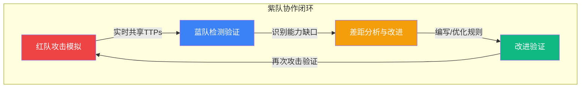
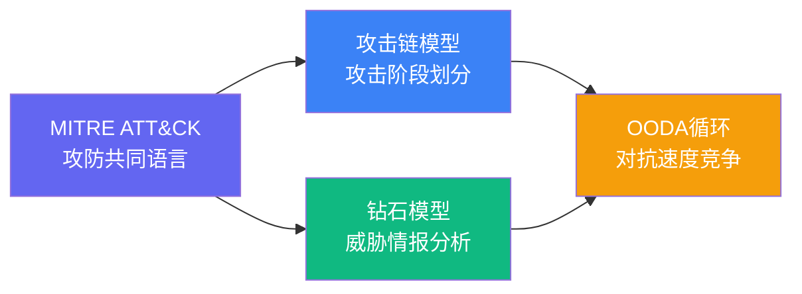
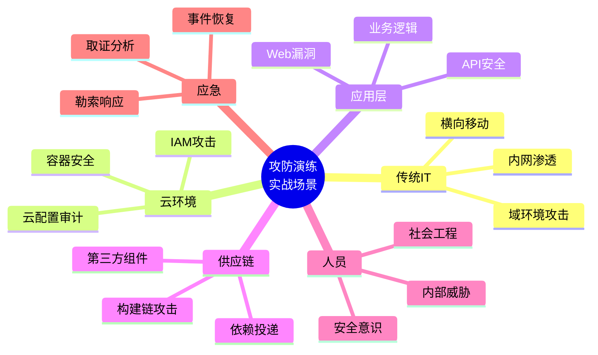
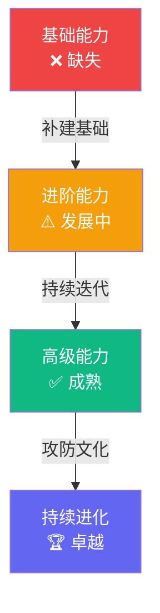

# 26.6 本章小结

## 一句话回顾

本章构建了从**单点攻防技术**到**体系化安全运营**的完整知识桥梁——通过红队（攻击验证）、蓝队（防御运营）、紫队（协同迭代）三位一体的攻防框架，让组织的安全能力从"被动修补"跃升为"主动进化"。

---

## 核心概念速查

### 三种攻防角色对比

| 维度 | 红队（Red Team） | 蓝队（Blue Team） | 紫队（Purple Team） |
|------|-----------------|-------------------|-------------------|
| **角色定位** | 模拟真实攻击者的进攻方 | 构建安全防线的防御方 | 红蓝协同的桥梁与催化剂 |
| **核心使命** | 发现攻击路径，验证防御盲区 | 构建检测、响应、恢复能力 | 打破信息不对称，驱动能力迭代 |
| **工作方式** | 目标驱动、隐蔽执行、全维度覆盖 | 持续监控、主动狩猎、快速响应 | 边攻边防、实时反馈、闭环改进 |
| **衡量标准** | 能否达成预设攻击目标 | 检测率、响应时间、恢复速度 | ATT&CK覆盖率提升速度 |
| **典型产出** | 攻击叙事报告 + 差距分析 | 安全基线 + 检测规则库 | 覆盖率评估 + 改进路线图 |
| **组织关系** | 独立团队或外部顾问 | SOC核心团队 | 协作模式（非独立编制） |

### 红队核心能力栈

红队不同于传统渗透测试，它强调**目标驱动、隐蔽执行、全维度覆盖和持续对抗**。完整的红队能力栈包含六个层次：

1. **侦察情报收集**：OSINT信息挖掘、目标画像构建、攻击面枚举
2. **边界突破**：鱼叉钓鱼、水坑攻击、供应链投递、物理入侵
3. **权限提升**：Windows/Linux本地提权、域环境攻击、凭证窃取
4. **横向移动**：Pass-the-Hash、Kerberoasting、DCSync、委派攻击
5. **隐蔽通信**：C2通道构建、流量加密混淆、域前置技术
6. **持久化维持**：计划任务、注册表、WMI事件订阅、Golden Ticket

### 蓝队四大职责领域

| 领域 | 核心任务 | 关键工具/框架 |
|------|---------|-------------|
| **安全监控与检测** | 日志集中分析、检测规则编写、威胁狩猎 | SIEM（Splunk/ELK/Sentinel）、Sigma、YARA、Snort/Suricata |
| **事件响应与遏制** | PICERL全流程响应、数字取证、跨部门协调 | SOAR平台、Velociraptor、Volatility、Autopsy |
| **安全加固与防护** | 基线配置、补丁管理、访问控制、网络分段 | CIS Benchmarks、AD安全基线、微隔离 |
| **安全运营优化** | SOC日常运营、流程迭代、安全度量 | SOC-CMM、安全KPI体系、威胁情报平台 |

---

## 四大理论框架总结

本章介绍的理论框架是攻防对抗的"思维工具箱"，每个框架有其独特的适用场景：

| 框架 | 核心思想 | 适用场景 | 实际应用 |
|------|---------|---------|---------|
| **MITRE ATT&CK** | 攻击技术的标准化分类知识库 | 红蓝紫队协作的共同语言；检测覆盖率评估 | ATT&CK矩阵映射、检测规则设计、差距分析 |
| **攻击链模型** | 攻击分阶段、有生命周期 | 理解攻击全貌、设计纵深防御 | Lockheed Martin杀伤链、MITRE攻击链 |
| **钻石模型** | 对手-能力-基础设施-受害者四维度 | 威胁情报分析、APT组织画像 | IoC关联分析、攻击基础设施追踪 |
| **OODA循环** | 观察→判断→决策→行动的快速迭代 | 攻防对抗的速度竞争、应急响应决策 | 蓝队响应速度优化、红队战术调整 |

**框架之间的关系：**

- **ATT&CK** 提供"语言"——让红蓝双方用同一套术语描述攻防行为
- **攻击链** 提供"骨架"——将零散的攻击技术串联成完整的攻击叙事
- **钻石模型** 提供"透镜"——从四个维度深度剖析安全事件
- **OODA循环** 提供"节奏"——决定攻防对抗中谁能更快适应和调整

---

## 六大实战案例复盘

本章通过六个真实场景案例，展示了攻防体系在不同领域的具体应用：

| 案例 | 场景 | 核心发现 | 关键教训 |
|------|------|---------|---------|
| **金融企业红蓝对抗** | 传统金融IT环境 | 资产盲区、日志缺失、检测规则不足 | 安全投入需覆盖预防、检测、响应全环节 |
| **供应链攻击紫队协作** | 第三方组件/服务 | 新型威胁场景下紫队协作的价值 | 自动化攻击模拟 + 实时检测验证 = 快速能力提升 |
| **大型企业内网渗透** | 复杂域环境 | AD配置缺陷、横向移动路径丰富 | 域安全是大型企业防御的重中之重 |
| **云环境红蓝对抗** | 云原生架构 | 云配置错误、容器逃逸、IAM滥用 | 云安全需要全新的攻防思维模型 |
| **勒索软件应急响应** | 实时应急场景 | 演练暴露响应流程漏洞 | 应急响应能力必须通过实战验证 |
| **API安全红蓝对抗** | API驱动的应用 | 认证绕过、数据泄露、业务逻辑漏洞 | API已成为现代应用的最大攻击面 |

**案例覆盖的攻击面：**

---

## 十大常见误区警示

以下是本章总结的十大典型误区，每一条都可能让组织的攻防投入大打折扣：

| 序号 | 误区 | 正确理解 | 危害程度 |
|------|------|---------|---------|
| 1 | 红队就是高级渗透测试 | 红队是目标驱动、全维度模拟，渗透测试是漏洞覆盖 | ★★★★ |
| 2 | 蓝队只需部署安全工具 | 工具只是载体，人员技能和流程成熟度才是核心 | ★★★★★ |
| 3 | 紫队就是红蓝一起开会 | 紫队是实时攻防协同，不是事后总结会 | ★★★★ |
| 4 | 红队发现必须立即修复 | 应分类评估、分阶段改进，不能头痛医头 | ★★★ |
| 5 | 自动化工具等于真实攻击 | 工具验证"已知的已知"，红队发现"未知的未知" | ★★★★ |
| 6 | 获得授权就可以随意攻击 | 必须有明确范围、规则和紧急停止机制 | ★★★★★ |
| 7 | 蓝队告警越少越好 | 过度优化精确率会导致漏报，需平衡精确率和召回率 | ★★★ |
| 8 | 红队只需技术能力 | 报告能力、沟通能力、业务理解同样关键 | ★★★★ |
| 9 | 一次演练就足够了 | 安全是动态过程，需持续演练和迭代 | ★★★★ |
| 10 | 红蓝对抗是零和博弈 | 真正价值是双方共同提升组织安全能力 | ★★★★★ |

**特别警惕的三个核心误区：**

1. **"部署了SIEM就安全了"**（误区2）——一个经验丰富的分析师配合优化过的检测规则，远比堆砌10个未调优的安全产品有效。安全工具的投资回报率取决于运营成熟度，而非产品数量。

2. **"红队和蓝队比谁赢"**（误区10）——健康的攻防文化应该以"组织安全能力是否提升"为唯一衡量标准。红队的每一次成功突破都是蓝队的改进机会，蓝队的每一次成功检测都是对红队能力的促进。

3. **"紫队就是开个会"**（误区3）——紫队协作需要结构化的流程：同步攻击模拟 → 实时检测验证 → 差距分析 → 规则编写 → 攻击再验证。没有闭环的紫队只是形式主义。

---

## 攻防演练实施路线图

### 阶段一：基础建设（1-3个月）

| 任务 | 负责方 | 产出物 |
|------|--------|-------|
| 建立安全基线配置 | 蓝队 | 基线文档 + 自动化检查脚本 |
| 部署日志收集与SIEM | 蓝队 | 集中式日志平台 + 基础告警规则 |
| 制定红队行动规则（ROE） | 管理层 + 红队 | 书面授权 + 范围定义 + 紧急停止流程 |
| 组建紫队协作机制 | 全员 | 协作流程文档 + 沟通渠道 + 共享平台 |

### 阶段二：首次演练（1-2个月）

| 任务 | 负责方 | 产出物 |
|------|--------|-------|
| 红队侦察与攻击模拟 | 红队 | 攻击路径报告 + ATT&CK映射 |
| 蓝队实战响应 | 蓝队 | 检测记录 + 响应时间统计 |
| 紫队实时协同 | 紫队 | 差距分析报告 + 即时改进清单 |
| 演练复盘与报告 | 全员 | 综合报告 + 改进计划 |

### 阶段三：持续迭代（持续进行）

| 任务 | 频率 | 目标 |
|------|------|------|
| ATT&CK覆盖率评估 | 每季度 | 追踪检测能力提升曲线 |
| 紫队协作演练 | 每月 | 持续验证和优化检测规则 |
| 完整红队演练 | 每年 | 全面评估组织安全态势 |
| 威胁情报更新 | 持续 | 将最新威胁纳入检测范围 |

---

## 关键度量指标

攻防体系的成熟度需要可量化的指标来衡量：

| 指标类别 | 具体指标 | 目标值（参考） |
|---------|---------|-------------|
| **检测能力** | ATT&CK技术覆盖率 | ≥60%（初始）→ ≥85%（成熟） |
| **检测能力** | 平均检测时间（MTTD） | ≤24小时（初始）→ ≤1小时（成熟） |
| **响应能力** | 平均响应时间（MTTR） | ≤4小时（初始）→ ≤30分钟（成熟） |
| **响应能力** | 事件遏制成功率 | ≥90% |
| **红队效能** | 攻击目标达成率 | 首次演练作为基线 |
| **红队效能** | 攻击路径多样性 | 每次演练发现新的攻击向量 |
| **紫队效能** | 检测规则优化周期 | ≤72小时（从发现到规则上线） |
| **紫队效能** | 攻击技术复现率 | ≥80%（规则能检测到模拟攻击） |

---

## 团队组建参考

### 红队建议配置（5-8人）

| 角色 | 人数 | 核心技能 |
|------|------|---------|
| 首席红队 | 1 | 攻击策略规划、威胁情报分析、项目管理 |
| 渗透工程师 | 2-3 | Web/App渗透、漏洞利用开发、免杀技术 |
| 横向移动专家 | 1-2 | AD攻击、权限提升、域渗透 |
| 社会工程专家 | 1 | 鱼叉钓鱼、物理入侵、人员画像 |
| 报告工程师 | 1 | 攻击叙事撰写、差距分析、改进建议 |

### 蓝队建议配置（8-12人）

| 角色 | 人数 | 核心技能 |
|------|------|---------|
| SOC经理 | 1 | 安全运营全局管理、指标体系设计 |
| 威胁分析师 | 2-3 | 日志分析、威胁情报研判、ATT&CK映射 |
| 检测工程师 | 2-3 | Sigma/YARA规则编写、检测逻辑设计 |
| 事件响应专家 | 2 | PICERL流程执行、数字取证、恶意软件分析 |
| 威胁猎人 | 1-2 | 假设驱动搜索、异常行为分析、主动发现 |
| 安全架构师 | 1 | 防御架构设计、安全基线、技术选型 |

### 紫队协作角色（嵌入式）

紫队不是独立编制，而是在红蓝双方之间建立的**协作层**。建议设置1-2名**紫队协调员**，负责：

- 协调红蓝双方的演练时间窗口
- 管理ATT&CK覆盖率评估
- 跟踪改进计划的执行进度
- 维护攻防知识库和检测规则库

---

## 自我评估清单

读完本章后，用以下清单评估你的组织当前所处的阶段：

**基础能力（缺失则需立即补建）：**

- [ ] 是否有书面的攻防演练授权和行动规则（ROE）
- [ ] 是否建立了集中式日志收集和SIEM平台
- [ ] 是否有基本的事件响应流程（PICERL）
- [ ] 是否定义了安全基线配置标准

**进阶能力（提升安全运营成熟度）：**

- [ ] 是否能基于ATT&CK框架评估检测覆盖率
- [ ] 是否建立了Sigma/YARA检测规则库
- [ ] 是否有规律性的威胁狩猎活动（至少每月一次）
- [ ] 是否有紫队协作机制和流程

**高级能力（接近成熟安全运营）：**

- [ ] 是否能量化MTTD/MTTR并持续优化
- [ ] 是否将攻防演练制度化（每年至少一次完整红队演练）
- [ ] 是否建立了攻防知识库和经验传承机制
- [ ] 是否推动了安全文化建设（全员安全意识提升）

---

## 三大进阶方向

### 红队方向——成为"攻击艺术大师"

| 阶段 | 学习内容 | 推荐资源 |
|------|---------|---------|
| **入门** | 渗透测试基础、Metasploit、Burp Suite | OSCP教材、HTB初级靶场 |
| **进阶** | APT TTPs研究、恶意软件开发、EDR对抗 | CRTO课程、Maldev Academy、HTB Pro Labs |
| **精通** | 定制化攻击框架、0day研究、国家级攻防 | 威胁情报报告、黑帽/DEFCON会议、开源红队项目贡献 |

**认证路线：** eJPT → OSCP → CRTO → OSEP → CRTO II

### 蓝队方向——成为"防御体系架构师"

| 阶段 | 学习内容 | 推荐资源 |
|------|---------|---------|
| **入门** | SIEM运维、基础日志分析、事件响应 | BTL1课程、Splunk Fundamentals |
| **进阶** | 检测工程（Sigma/YARA）、威胁狩猎、SOAR | BTL2课程、Detection Engineering社区 |
| **精通** | SOC架构设计、安全度量体系、攻防演练规划 | SANS课程、SOC-CMM评估框架 |

**认证路线：** Security+ → BTL1 → BTL2 → GCIH → GCFA

### 紫队/安全管理方向——成为"安全战略家"

| 阶段 | 学习内容 | 推荐资源 |
|------|---------|---------|
| **入门** | 攻防演练组织、ATT&CK框架应用 | ATT&CK官方文档、紫队实践指南 |
| **进阶** | 安全度量体系、SOC成熟度评估 | ISO 27001、NIST CSF、SOC-CMM |
| **精通** | 安全治理、预算规划、跨部门协作、安全文化建设 | CISSP/CISM认证、安全领导力课程 |

---

## 核心要点速记卡

用以下口诀记住本章的精华：

> **红队模拟真攻击，目标驱动找盲区；**
> **蓝队运营筑防线，检测响应保基线；**
> **紫队协作搭桥梁，攻防闭环促迭代；**
> **ATT&CK是共同语言，四大框架是思维工具；**
> **安全不是终点站，持续改进是旅程。**

---

## 思考题

读完本章，试着回答以下问题来检验你的理解：

1. **红队和渗透测试的核心区别是什么？** 从目标驱动性、隐蔽性要求、衡量标准三个维度回答。

2. **为什么"部署安全工具≠具备防御能力"？** 举一个具体的例子说明工具和运营成熟度的关系。

3. **如何设计一次有效的紫队协作？** 画出从攻击模拟到检测改进的完整闭环流程。

4. **你的组织目前处于攻防成熟度的哪个阶段？** 参照自我评估清单，列出最需要补建的3项能力。

5. **OODA循环在蓝队应急响应中如何应用？** 描述一次真实或假设的安全事件中OODA循环的运作过程。

---

## 延伸阅读

完成本章学习后，建议进一步探索以下方向：

- **第27章 云安全攻防**：本章攻防体系在云原生环境的具体落地
- **第28章 认证路线图**：OSCP、CRTO、BTL1/BTL2等认证的详细备考指南
- **深度拓展（07节）**：行业趋势、前沿研究、职业发展的深度分析
- **练习方法（05节）**：HTB、TryHackMe、CyberDefenders等靶场平台的实战指引

---

**最终寄语：**

攻防对抗是网络安全的本质特征。技术在不断演进，攻击手法在持续变化，唯有建立**持续学习和迭代改进**的机制，才能在攻防对抗中保持主动。记住——**安全不是终点，而是持续改进的旅程。** 从今天开始，选择一个方向，迈出第一步。
