# 第26章 红队蓝队紫队 - 深度拓展

> 本节在前文理论、技巧与实战案例的基础上，深入挖掘攻防对抗领域的前沿议题与高阶实践。内容面向已有基础的读者，聚焦于可落地的深度知识，而非重复入门概念。

---

## 一、红队行动的高阶方法论

### 1.1 从杀伤链到ATT&CK：攻击建模的演进逻辑

前文已介绍过洛克希德·马丁杀伤链和MITRE ATT&CK的基本概念，此处聚焦于两者的核心差异以及为什么行业从杀伤链转向了ATT&CK。

**杀伤链的根本局限：** 杀伤链是一个线性的7步模型，假设攻击者按固定顺序推进。但在真实对抗中，高级威胁行为者（如APT组织）会跳步、并行推进、甚至逆序操作。例如，攻击者可能先通过合法凭证直接登录（跳过武器化和投递），或者在横向移动的同时持续进行C2通信。另一个被忽视的问题是：杀伤链无法描述"失败后重试"的攻击模式——攻击者在投递失败后可能切换攻击向量重新来过，而非简单地回到链头。

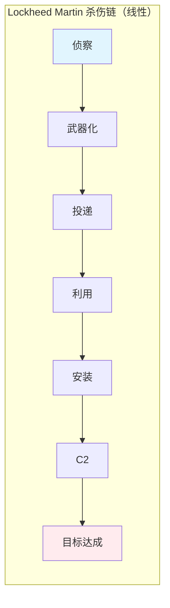

**ATT&CK的网格化优势：** ATT&CK将攻击行为分解为14个战术（Tactics）、200+个技术（Techniques）和400+个子技术（Sub-techniques），形成一个矩阵。每个技术都有对应的检测方法、缓解措施和已知使用案例。这种网格化结构使得红队行动可以：

- 精确规划攻击路径（选择特定的战术-技术组合）
- 量化评估防御覆盖率（哪些技术有检测，哪些没有）
- 追踪威胁行为者（通过技术指纹关联APT组织）
- 对比多次演练结果（用同一框架衡量安全能力变化）

**实战建议：** 红队行动规划时，不要简单套用杀伤链的7个阶段，而是基于目标组织的防御态势，在ATT&CK矩阵中绘制多条攻击路径，优先选择防御覆盖薄弱的技术节点。具体做法是：先通过信息收集识别目标的技术栈和安全产品，然后在ATT&CK Navigator中标记已知防御措施，最后选择"高价值×低防御"的技术节点作为主攻方向。

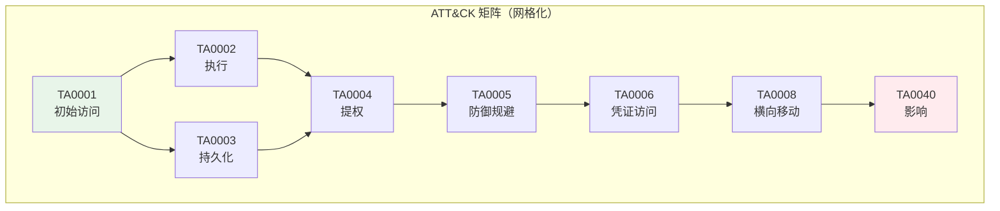

### 1.2 红队行动的规则设计（Rules of Engagement）

红队行动的效果高度依赖规则设计的质量。规则过松可能导致业务中断，规则过严则无法检验真实防御能力。

**Rules of Engagement（RoE）核心要素：**

| 要素 | 说明 | 关键决策 |
|------|------|----------|
| 目标范围 | 明确哪些系统、IP、域名在测试范围内 | 绘制资产边界图，列出白名单和黑名单 |
| 时间窗口 | 定义行动的起止时间和允许操作的时段 | 避开业务高峰期，预留缓冲时间 |
| 攻击边界 | 明确哪些攻击手段允许使用 | 是否允许物理入侵？是否允许社工内部员工？ |
| 通信协议 | 红队与管理层、蓝队的通信方式和紧急联络人 | 建立带外通信通道，防止C2被封导致失联 |
| 退出条件 | 定义行动终止的条件 | 发现高危漏洞立即报告？业务中断立即停止？ |
| 报告要求 | 报告的格式、内容、提交时间 | 按MITRE ATT&CK格式记录每个攻击步骤 |
| 法律合规 | 确保行动在法律允许范围内 | 获取书面授权，咨询法务团队 |
| 数据处理 | 测试中获取的敏感数据如何处理 | 明确数据留存期限、脱敏要求、销毁方式 |

**实战经验：** 最常见的规则设计缺陷是"范围模糊"。例如，"测试内部网络"没有明确是否包含生产数据库、是否允许使用零日漏洞、是否可以影响非目标系统。建议在RoE中使用"明确列举"而非"概括描述"。

```markdown
# RoE 范围示例（错误 vs 正确）

## 错误写法
"红队可以测试所有内部系统和应用程序。"

## 正确写法
"红队可以测试以下IP段：10.0.1.0/24, 10.0.2.0/24
包括的系统：Web应用（app.example.com）、数据库（db.internal）
明确排除：核心业务系统（10.0.0.0/24）、生产数据库备份服务器
禁止手段：零日漏洞利用、对生产环境的DoS攻击
允许手段：钓鱼邮件、凭证窃取、横向移动、权限提升
数据处理：测试中获取的凭证和数据在行动结束后72小时内销毁
责任约定：如因红队操作导致非预期业务中断，由安全总监裁定是否暂停行动"
```

**RoE审核清单（行动前必检）：**

1. 是否有书面的高层授权？是否获得法务确认？
2. 资产范围是否与资产管理系统同步？是否有遗漏的资产？
3. 紧急联络人列表是否包含非工作时间的联系方式？
4. 是否有明确的"暂停/终止"触发条件？
5. 是否通知了关键基础设施的运维团队？
6. 是否确认了保险覆盖范围（网络安全保险是否覆盖授权渗透测试）？

### 1.3 高级持久化威胁（APT）模拟策略

模拟APT组织的红队行动与普通渗透测试有本质区别。APT模拟需要：

**1. 情报驱动的攻击规划**

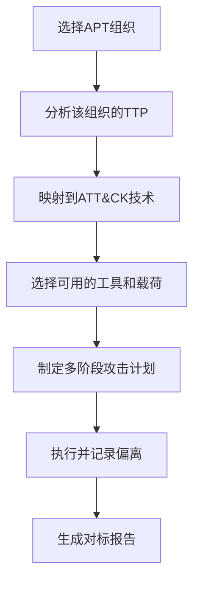

不同APT组织的TTP差异极大：

| APT组织 | 典型初始访问 | 常用持久化 | 横向移动偏好 | 数据渗出方式 |
|---------|-------------|-----------|-------------|-------------|
| APT29 (Cozy Bear) | 鱼叉式钓鱼+供应链植入 | 计划任务、WMI事件订阅 | Kerberoasting、Pass-the-Hash | 加密隧道外传 |
| APT41 (Double Dragon) | 水坑攻击、VPN漏洞 | Web Shell、DLL劫持 | RDP跳板、SSH隧道 | DNS隐蔽传输 |
| Lazarus Group | 社交工程+水坑 | 伪装合法软件更新 | 利用被盗凭证 | 加密文件打包外传 |
| APT38 (Bluenoroff) | 供应链攻击 | 合法系统工具滥用 | 直接利用网络共享 | SWIFT系统操作 |
| Sandworm Team | VPN漏洞利用 | VPN设备持久化 | 内部工具利用 | 多通道并行外传 |
| FIN7 | 鱼叉式钓鱼 | VBS/PowerShell后门 | PsExec、WMI | 加密压缩外传 |

**2. 攻击痕迹的可控性**

APT模拟的关键挑战是：如何在模拟真实攻击的同时，控制对目标环境的影响。解决方案是建立"攻击沙箱"——在关键操作点设置检查点，确认无业务影响后再继续。

```text
攻击路径检查点示例：
Checkpoint_1: 钓鱼投递前 → 确认目标邮箱列表正确
Checkpoint_2: 利用漏洞前 → 确认目标系统在测试范围内
Checkpoint_3: 横向移动前 → 确认不会触及生产核心系统
Checkpoint_4: 数据渗出前 → 确认渗出通道不会影响正常业务流量
Checkpoint_5: 持久化植入前 → 确认植入方式可干净移除
Checkpoint_6: 行动结束前 → 确认所有测试后门已清除
```

**3. 多阶段攻击时间线设计**

一个典型的APT模拟行动可能持续4-8周，分为以下阶段：

| 阶段 | 持续时间 | 核心活动 | ATT&CK战术 |
|------|---------|---------|-----------|
| 侦察 | 1-2周 | OSINT、DNS枚举、员工信息收集 | TA0043 侦察 |
| 武器化 | 1周 | 定制化钓鱼载荷、C2基础设施搭建 | TA0001 初始访问 |
| 初始突破 | 1-2天 | 钓鱼投递、获取初始立足点 | TA0001 + TA0002 |
| 建立据点 | 1-3天 | 持久化、防御规避、凭证收集 | TA0003 + TA0005 + TA0006 |
| 横向扩展 | 1-2周 | 内网渗透、域权限提升 | TA0008 + TA0004 |
| 目标达成 | 1周 | 数据访问、业务逻辑利用 | TA0009 + TA0040 |
| 渗出与清理 | 1-3天 | 数据外传、痕迹清理 | TA0010 + TA0070 |

### 1.4 红队工具的自定义开发

商业和开源红队工具虽然强大，但顶级红队必须具备自定义开发能力，因为：

- **检测规避：** 主流工具（Cobalt Strike、Metasploit）已被安全产品高度签名化
- **场景适配：** 标准工具无法覆盖所有攻击场景
- **隐蔽性：** 自研工具在目标环境中更难被识别
- **可控性：** 自研工具可以精确控制行为，降低意外风险

**自定义C2框架的核心模块：**

```python
# 简化版C2框架架构示意
class C2Framework:
    """自定义C2框架核心模块"""
    
    def __init__(self):
        self.encryption = AESEncryption()    # 通信加密
        self.encoding = DNSEncoder()          # 隐蔽编码
        self.evasion = EvasionEngine()        # 检测规避
        self.payload = PayloadGenerator()     # 载荷生成
    
    def generate_beacon(self, target_os):
        """生成目标平台的Beacon"""
        beacon = self.payload.build(target_os)
        beacon.set_callback(self.get_c2_address())
        beacon.set_sleep_jitter(0.3)  # 30%抖动，避免固定间隔被检测
        beacon.enable_amsi_bypass()    # 绕过AMSI
        beacon.enable_etw_patch()      # 修补ETW日志
        return beacon
    
    def encode_traffic(self, raw_data):
        """将C2流量编码为合法协议"""
        # 方案1: DNS隧道（将数据编码到子域名中）
        # 方案2: HTTPS隧道（通过合法云服务中转）
        # 方案3: 协议伪装（将C2流量伪装为正常HTTP请求）
        return self.encoding.encode(raw_data, method="dns")
```

**C2通信隐蔽技术对比：**

| 技术 | 原理 | 优势 | 劣势 | 检测难度 |
|------|------|------|------|----------|
| DNS隧道 | 将数据编码到DNS查询中 | 绕过大多数防火墙 | 带宽低、延迟高 | 中等（DNS日志分析） |
| HTTPS中转 | 通过合法云服务转发 | 流量难以区分 | 依赖外部服务 | 较难（需TLS解密） |
| 协议伪装 | 将C2流量伪装为正常应用协议 | 自然融入环境 | 实现复杂 | 较难（需深度包检测） |
| 域前置 | 利用CDN的Host头路由 | 利用合法基础设施 | 部分云厂商已修补 | 困难（需行为分析） |
| 社交平台中转 | 利用Slack/Discord等平台传输 | 极难区分 | 数据格式受限、有审计风险 | 困难（需内容分析） |
| 云函数中转 | 利用AWS Lambda/Azure Functions | 无固定IP、弹性伸缩 | 冷启动延迟 | 困难（需行为基线） |

**自定义红队工具开发的最佳实践：**

- 使用目标环境中常见的编程语言（如PowerShell、Python、Go）
- 工具行为模式要与合法软件相似（避免高CPU/内存使用峰值）
- 所有工具必须有完整的日志记录（用于行动复盘和证据留存）
- 建立内部工具仓库，按用途分类管理（信息收集/利用/后渗透/C2）
- 定期更新工具签名特征，避免被安全产品过快签名化

---

## 二、蓝队检测工程的深度实践

### 2.1 检测工程的方法论框架

检测工程（Detection Engineering）不是简单地写几条告警规则，而是建立一套系统化的流程，确保防御措施能够有效覆盖攻击面。

**检测工程的PDCA循环：**

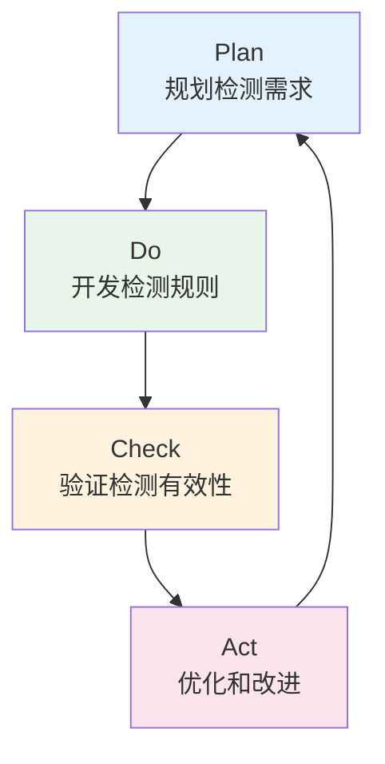

**阶段一：检测需求规划**

基于威胁情报和ATT&CK矩阵，确定需要覆盖的攻击技术。优先级评估矩阵：

| 优先级 | 评估维度 | 判断标准 |
|--------|---------|---------|
| P0-紧急 | 威胁迫近度 | 近30天内有在野利用的漏洞或技术 |
| P1-高 | 业务影响 | 被利用后可能导致数据泄露或业务中断 |
| P2-中 | 覆盖缺口 | 当前无任何检测覆盖的技术 |
| P3-低 | 已有缓解 | 已有其他控制措施，检测为补充验证 |

**阶段二：检测规则开发**

Sigma规则是目前最主流的开源检测规则格式。一条高质量的Sigma规则应该包含：

```yaml
title: Suspicious PowerShell Encoded Command Execution
id: a1b2c3d4-e5f6-7890-abcd-ef1234567890
status: stable
description: Detects execution of PowerShell with encoded commands, commonly used by attackers to obfuscate malicious scripts
references:
    - https://attack.mitre.org/techniques/T1059/001/
author: Security Team
date: 2024/01/15
modified: 2024/06/01
tags:
    - attack.execution
    - attack.t1059.001
logsource:
    category: process_creation
    product: windows
detection:
    selection:
        Image|endswith: '\powershell.exe'
        CommandLine|contains|all:
            - '-enc'
            - '-e '
            - '-encodedcommand'
            - '-ec '
    filter:
        ParentImage|endswith:
            - '\sccm.exe'
            - '\configmgr.exe'
    condition: selection and not filter
falsepositives:
    - SCCM configuration scripts
    - Automated deployment tools
level: high
```

**Sigma规则编写质量检查清单：**

1. 是否有唯一的UUID作为规则ID？
2. 是否映射到具体的ATT&CK技术ID？
3. 是否包含误报过滤条件（filter）？
4. 是否标注了falsepositives场景？
5. 是否指定了正确的数据源（logsource）？
6. detection逻辑是否简洁且不易被绕过？

**阶段三：检测验证**

使用Atomic Red Team等工具验证检测规则是否有效：

```bash
# 执行Atomic Red Team测试用例验证检测
# 测试T1059.001 - PowerShell编码命令执行
Invoke-AtomicTest T1059.001 -TestNumbers 2

# 检查SIEM是否生成了对应告警
# 期望告警：Suspicious PowerShell Encoded Command Execution
# 级别：HIGH
```

**阶段四：规则维护**

检测规则不是写完就结束了。规则需要持续维护：

- **定期回顾：** 每季度检查规则是否仍然有效（新的攻击手法可能绕过）
- **误报调优：** 根据SOC反馈调整过滤条件，降低误报率
- **性能优化：** 高频触发的规则可能影响SIEM性能，需要优化查询逻辑
- **版本管理：** 所有规则变更通过版本控制系统管理，支持回滚

### 2.2 高级检测技术

#### 2.2.1 基于日志的攻击链重建

单条告警往往价值有限，真正的检测能力在于将多条低置信度告警关联成完整的攻击链。

**攻击链关联示例：**

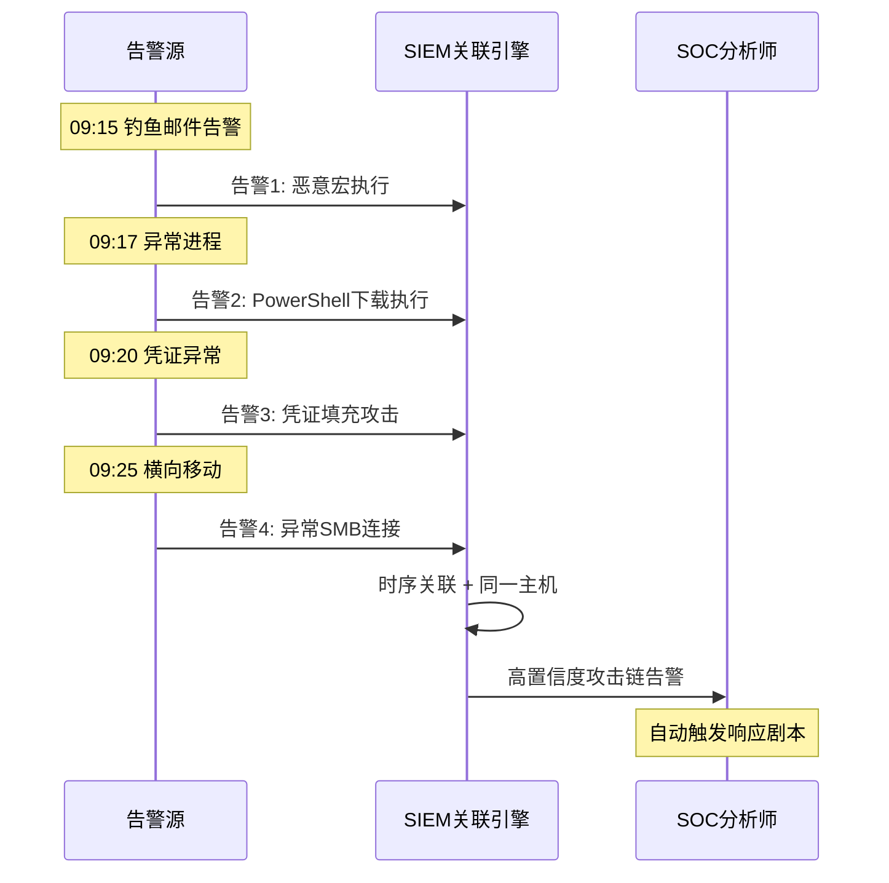

**关联规则设计原则：**

1. **时序关联：** 同一实体在短时间内触发多条告警（如15分钟内同一IP触发3+告警）
2. **实体关联：** 同一用户/IP/主机在不同数据源中出现异常（如VPN登录后立即触发终端告警）
3. **行为关联：** 多个低风险行为组合构成高风险模式（如正常登录+异常时间+异常位置）
4. **上下文关联：** 结合资产重要性、用户角色等上下文评估风险（CFO的异常行为比实习生的权重更高）
5. **地理关联：** 同一账号在不同地理位置短时间内登录（不可能旅行检测）

#### 2.2.2 基于行为的检测

传统的签名检测只能识别已知攻击，基于行为的检测通过建模正常行为基线来识别异常：

| 检测方法 | 原理 | 优势 | 劣势 |
|---------|------|------|------|
| 阈值告警 | 统计指标超过阈值 | 简单、低误报 | 无法检测慢速攻击 |
| 基线对比 | 与历史行为模式对比 | 能检测偏离行为 | 需要足够的学习期 |
| 图分析 | 分析实体关系图变化 | 能发现隐藏关联 | 实现复杂、资源消耗大 |
| 时序异常检测 | 分析时间序列模式 | 能检测周期性异常 | 需要大量训练数据 |
| UEBA | 用户和实体行为分析 | 综合多维度分析 | 误报率高、需要调优 |

**UEBA实施的关键步骤：**

1. **数据收集：** 统一收集认证日志、终端日志、网络流量、邮件日志、DLP告警
2. **实体建模：** 为每个用户、设备、应用建立行为基线（通常需要30-90天学习期）
3. **特征工程：** 提取关键行为特征（登录时间分布、访问资源类型、数据传输量等）
4. **模型训练：** 使用无监督学习（如Isolation Forest）建立异常检测模型
5. **风险评分：** 将模型输出转化为0-100的风险评分，设置分级响应策略
6. **反馈循环：** SOC分析师的确认/误报反馈用于持续优化模型

### 2.3 SOC成熟度提升路径

从初级SOC到高级SOC的演进不是一蹴而就的，需要系统化的规划：

**SOC成熟度阶段模型：**

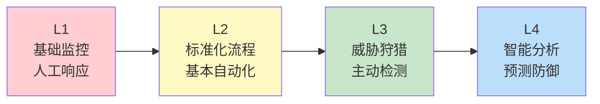

| 阶段 | 核心能力 | 关键指标 | 典型工具 |
|------|---------|---------|---------|
| L1 | 基础监控 | MTTD（平均检测时间）> 24h | 基础SIEM |
| L2 | 标准化响应 | MTTD < 8h, MTTR（平均响应时间）< 4h | SIEM + SOAR |
| L3 | 主动狩猎 | MTTD < 1h, MTTR < 1h | SIEM + SOAR + 威胁狩猎平台 |
| L4 | 预测防御 | MTTD < 15min, MTTR < 30min | AI增强的全栈安全平台 |

**从L2到L3的关键跨越：** 大多数组织停留在L2阶段，核心瓶颈是缺乏"威胁狩猎"能力。威胁狩猎不是等待告警触发，而是主动假设威胁存在，通过假设驱动的搜索来发现隐藏的攻击。威胁狩猎的基本流程：

1. **假设形成：** 基于威胁情报或直觉提出假设（如"APT组织可能通过DNS隧道渗出数据"）
2. **数据收集：** 收集相关日志和数据（DNS查询日志、网络流量、进程日志）
3. **假设检验：** 使用查询和分析验证假设（查找异常DNS查询模式）
4. **结果评估：** 如果发现异常，深入调查；如果未发现，记录并形成新假设
5. **知识沉淀：** 将狩猎结果（无论正负）记录到知识库，丰富组织的威胁画像

**威胁狩猎查询示例（KQL/SIEM）：**

```kql
// 假设：攻击者可能使用PowerShell下载执行恶意载荷
// 检测：进程创建时命令行包含下载+执行的组合
DeviceProcessEvents
| where Timestamp > ago(7d)
| where FileName =~ "powershell.exe"
| where ProcessCommandLine has_any ("Invoke-WebRequest", "iwr", "curl", "wget", "Net.WebClient")
| where ProcessCommandLine has_any ("-OutFile", "Invoke-Expression", "IEX", "DownloadString")
| project Timestamp, DeviceName, AccountName, ProcessCommandLine
| order by Timestamp desc
```

---

## 三、紫队协作的高阶实践

### 3.1 紫队协作的成熟度模型

紫队不是一个团队，而是一种协作机制。其成熟度直接决定攻防演练的效果：

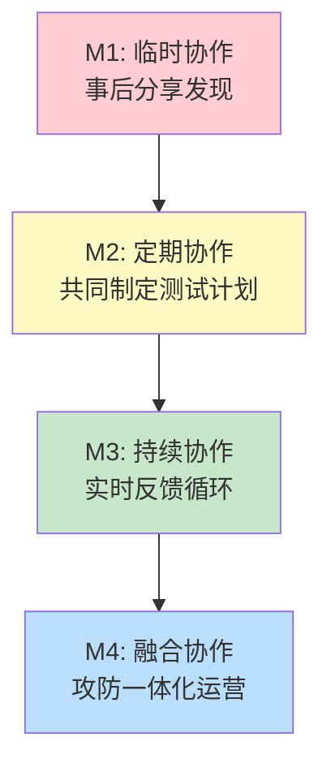

| 成熟度 | 红队行为 | 蓝队行为 | 协作方式 | 效果 |
|--------|---------|---------|---------|------|
| M1 | 独立执行，事后提供报告 | 被动接收报告 | 年度报告会 | 低：信息不对称严重 |
| M2 | 红蓝双方共享部分计划 | 蓝队参与范围讨论 | 季度演练 + 联合复盘 | 中：初步形成反馈循环 |
| M3 | 红队实时通知攻击进展 | 蓝队实时调整检测策略 | 持续演练 + 实时沟通 | 高：快速验证和改进 |
| M4 | 红蓝团队共享工具和知识 | 蓝队参与攻击模拟设计 | 日常攻防融合运营 | 极高：攻防能力持续进化 |

### 3.2 紫队协作的具体场景与操作流程

#### 场景一：检测规则的联合开发与验证

这是紫队协作最常见的场景。传统模式是蓝队独立开发检测规则，红队通过行动暴露检测盲区后，蓝队再被动修复。紫队模式下，红蓝双方从一开始就协作：

```text
紫队协作流程（检测规则开发）：
1. 红队提供：选定的攻击技术（ATT&CK Technique）
2. 蓝队提供：当前检测能力和数据源
3. 共同分析：确定检测差距
4. 红队提供：该技术的具体攻击行为特征
5. 蓝队开发：检测规则初稿
6. 红队验证：使用真实攻击手法测试规则
7. 共同优化：调整规则阈值、减少误报
8. 红队确认：规则有效且难以绕过
9. 文档化：记录检测逻辑和局限性
```

#### 场景二：安全控制有效性验证

```text
安全控制验证矩阵（示例）：
| 安全控制 | 红队验证方法 | 期望结果 | 实际结果 | 改进措施 |
|---------|-------------|---------|---------|---------|
| EDR防护 | 未签名载荷投递 | 拦截 | 拦截 | 通过 |
| EDR防护 | 无文件攻击 | 拦截 | 未拦截 | 增加内存扫描规则 |
| 邮件网关 | 恶意链接检测 | 拦截 | 拦截 | 通过 |
| 邮件网关 | 零日钓鱼 | 拦截 | 部分拦截 | 增加沙箱检测 |
| 网络IDS | 横向移动检测 | 告警 | 未告警 | 增加SMB异常检测 |
| IAM | 异常登录检测 | 告警 | 告警 | 通过 |
```

#### 场景三：紫队演练的完整模板

以下是一个可直接复用的紫队演练模板，覆盖从准备到复盘的完整流程：

```text
紫队演练模板 v1.0

【准备阶段】（演练前1-2周）
├── 确定演练目标（3-5个ATT&CK技术）
├── 制定RoE（含范围、时间、通信协议）
├── 红队准备攻击载荷和基础设施
├── 蓝队确认日志采集完整性
└── 建立共享的沟通频道（Teams/Slack专用频道）

【执行阶段】（演练期间）
├── 红队按计划执行攻击
│   ├── 每个攻击步骤后通知蓝队
│   ├── 蓝队确认是否检出
│   └── 记录检测延迟时间
├── 蓝队实时分析检测效果
│   ├── 确认告警是否触发
│   ├── 评估告警质量（是否有足够上下文）
│   └── 尝试关联分析构建攻击链
└── 双方实时沟通改进方向

【复盘阶段】（演练后1周内）
├── 红队提交完整攻击路径报告
├── 蓝队提交检测能力评估报告
├── 联合复盘会议
│   ├── 逐个技术回顾检测效果
│   ├── 识别检测盲区
│   └── 制定改进计划和时间表
└── 更新ATT&CK覆盖度热力图
```

### 3.3 BAS（Breach and Attack Simulation）平台深度对比

BAS平台是实现持续紫队协作的关键工具。以下是主流BAS平台的深度对比：

| 维度 | SafeBreach | AttackIQ | Cymulate | Picus Security |
|------|-----------|----------|----------|----------------|
| ATT&CK覆盖 | 300+技术 | 250+技术 | 200+技术 | 200+技术 |
| 部署模式 | SaaS + On-prem | SaaS + On-prem | SaaS | SaaS + On-prem |
| 自动化程度 | 高 | 高 | 中高 | 高 |
| 集成生态 | SIEM/SOAR/XDR | SIEM/SOAR | SIEM/SOAR | SIEM/SOAR |
| 报告能力 | 强（可视化仪表盘） | 中 | 中 | 强 |
| 定价模式 | 按资产数 | 按资产数 | 按测试次数 | 按资产数 |
| 开放性 | 封闭 | 封闭 | 部分开源 | 封闭 |
| 适合场景 | 大型企业 | 中大型企业 | 中小企业 | 大型企业 |

**开源替代方案：** 对于预算有限的组织，可以组合使用以下开源工具构建"BAS-like"能力：

- **MITRE Caldera：** 自动化攻击模拟，支持ATT&CK技术
- **Atomic Red Team：** 轻量级ATT&CK测试库
- **Infection Monkey：** 网络传播模拟，验证分段效果
- **DVCA（Damn Vulnerable Cloud Application）：** 云环境攻击靶场

**开源BAS方案搭建指南：**

```bash
# 搭建MITRE Caldera
git clone https://github.com/mitre/caldera.git --recursive
cd caldera
pip install -r requirements.txt
python server.py --insecure

# 导入Atomic Red Team测试用例
# 在Caldera界面中导入atomic-red-team的 adversary profiles

# 配合ELK Stack收集结果
# Filebeat → Logstash → Elasticsearch → Kibana
```

---

## 四、云原生环境的攻防深度实战

### 4.1 Kubernetes环境的攻击面分析

Kubernetes已成为云原生基础设施的事实标准，但其复杂性也带来了巨大的攻击面。以下按ATT&CK框架分析K8s环境的攻击路径：

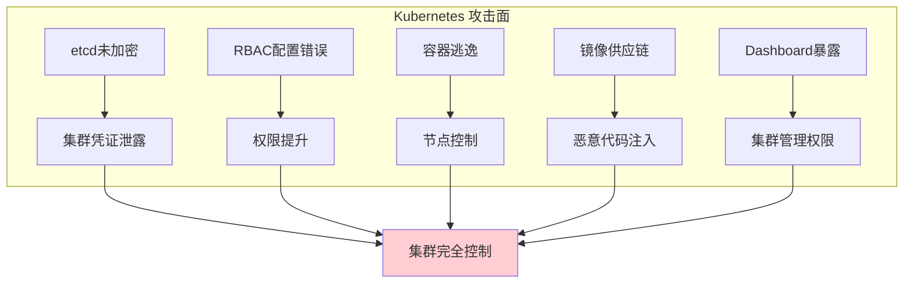

**Kubernetes攻击技术详解：**

| 攻击技术 | ATT&CK映射 | 具体手法 | 检测方法 |
|---------|-----------|---------|---------|
| etcd数据访问 | T1552 | 未授权访问etcd API获取所有集群数据 | 审计etcd访问日志，监控异常查询 |
| RBAC提权 | T1078 | 利用过宽的ClusterRole绑定提权 | 监控ClusterRoleBinding创建事件 |
| 容器逃逸 | T1611 | 利用内核漏洞或配置错误逃逸到宿主机 | 监控特权容器创建、异常系统调用 |
| 镜像投毒 | T1195.002 | 在CI/CD管道中注入恶意代码 | 镜像签名验证、供应链审计 |
| Pod劫持 | T1053 | 创建特权Pod执行恶意命令 | 监控异常Pod创建、审计kubectl操作 |
| 密钥窃取 | T1552.007 | 从环境变量或Secret中获取凭证 | 监控Secret访问、启用RBAC审计 |
| 服务网格攻击 | T1557 | 利用Istio等服务网格的配置缺陷 | 监控服务网格配置变更 |
| 云元数据利用 | T1619 | 通过SSRF访问云厂商元数据服务 | 限制Pod访问169.254.169.254 |

**Kubernetes安全加固检查清单：**

```yaml
# Kubernetes安全基线配置示例
apiVersion: v1
kind: Pod
metadata:
  name: secure-pod
spec:
  # 1. 禁止特权容器
  containers:
  - name: app
    securityContext:
      privileged: false
      allowPrivilegeEscalation: false
      readOnlyRootFilesystem: true
      runAsNonRoot: true
      runAsUser: 1000
      capabilities:
        drop:
          - ALL  # 删除所有Linux能力
    resources:
      limits:
        memory: "256Mi"
        cpu: "500m"
    # 2. 禁止挂载宿主机路径
    volumeMounts: []
  # 3. 使用只读根文件系统
  volumes: []
  # 4. 设置Pod安全策略
  automountServiceAccountToken: false
```

**Kubernetes网络策略加固：**

```yaml
# 默认拒绝所有入站流量
apiVersion: networking.k8s.io/v1
kind: NetworkPolicy
metadata:
  name: default-deny-ingress
  namespace: production
spec:
  podSelector: {}
  policyTypes:
  - Ingress

# 仅允许特定Pod间的通信
apiVersion: networking.k8s.io/v1
kind: NetworkPolicy
metadata:
  name: allow-frontend-to-backend
  namespace: production
spec:
  podSelector:
    matchLabels:
      app: backend
  ingress:
  - from:
    - podSelector:
        matchLabels:
          app: frontend
    ports:
    - protocol: TCP
      port: 8080
```

### 4.2 容器逃逸技术与检测

容器逃逸是Kubernetes环境中最严重的攻击之一。攻击者从容器内部突破隔离，获取宿主机或集群的控制权。

**常见逃逸路径：**

| 逃逸类型 | 利用条件 | 具体技术 | 防御措施 |
|---------|---------|---------|---------|
| 内核漏洞 | 宿主机内核版本有漏洞 | CVE-2022-0185、CVE-2022-0492 | 及时更新内核、使用容器优化OS |
| 特权容器 | 容器以特权模式运行 | 挂载宿主机文件系统 | 禁止特权模式、使用OPA策略 |
| 服务账号滥用 | Pod绑定了过宽的ServiceAccount | 通过API Server提权 | 最小化SA权限、禁用自动挂载 |
| 逃逸工具 | 容器内有curl/wget等工具 | 下载并运行逃逸exploit | 限制容器网络、只读根文件系统 |
| 卷挂载逃逸 | 宿主机路径被挂载到容器 | 直接修改宿主机文件 | 禁止挂载敏感路径 |
| Docker Socket | 挂载了/var/run/docker.sock | 通过Docker API创建特权容器 | 禁止挂载Docker Socket |
| cgroup逃逸 | cgroup v1配置不当 | 通过release_agent执行宿主机命令 | 升级到cgroup v2 |

**容器逃逸检测方案：**

```bash
# 检测特权容器运行
kubectl get pods --all-namespaces -o json | jq '.items[] | select(.spec.containers[].securityContext.privileged==true) | .metadata'

# 检测异常的宿主机路径挂载
kubectl get pods --all-namespaces -o json | jq '.items[] | select(.spec.volumes[]?.hostPath != null) | {name: .metadata.name, paths: [.spec.volumes[]?.hostPath.path]}'

# 使用Falco检测运行时异常行为
# falco规则示例：检测容器内执行shell
- rule: Terminal shell in container
  desc: A shell was used as the entrypoint/exec point into a container
  condition: >
    spawned_process and container and shell_procs and proc.tty != 0
  output: >
    Shell spawned in container (user=%user.name container=%container.name shell=%proc.name parent=%proc.pname cmdline=%proc.cmdline)
  priority: WARNING
```

### 4.3 云环境红队工具链

**云原生红队工具矩阵：**

| 工具 | 用途 | 云平台 | 开源/商业 |
|------|------|--------|----------|
| Pacu | AWS渗透测试框架 | AWS | 开源 |
| ScoutSuite | 多云安全审计 | AWS/Azure/GCP | 开源 |
| CloudMapper | AWS可视化和审计 | AWS | 开源 |
| Stormspotter | Azure攻击路径分析 | Azure | 开源 |
| GCPOrchestration | GCP攻击模拟 | GCP | 开源 |
| Kubestriker | Kubernetes安全审计 | K8s | 开源 |
| Peirates | K8s渗透工具 | K8s | 开源 |
| CubeEscape | 容器逃逸工具 | K8s | 开源 |
| CloudFox | 云环境攻击路径发现 | AWS/Azure/GCP | 开源 |
| Stratus Red Team | 云原生攻击模拟 | AWS/Azure/GCP/K8s | 开源 |

**云环境红队操作流程：**

```text
云环境红队攻击路径（以AWS为例）：

阶段1: 信息收集
├── 枚举S3桶（aws s3 ls）
├── 获取IAM角色信息（aws sts get-caller-identity）
├── 检查元数据服务（curl http://169.254.169.254/latest/meta-data/）
└── 枚举Lambda函数和API Gateway

阶段2: 权限提升
├── 利用过宽的IAM策略提权
├── 利用EC2实例角色获取临时凭证
├── 利用跨账户信任关系横向移动
└── 利用S3策略缺陷访问敏感数据

阶段3: 横向移动
├── 使用窃取的凭证访问其他AWS服务
├── 利用SSRF访问内部服务
├── 利用VPC对等连接跨账户移动
└── 利用CloudTrail日志反侦察

阶段4: 目标达成
├── 访问敏感数据（S3/RDS/DynamoDB）
├── 修改基础设施配置（Security Group/IAM）
├── 建立持久化（后门Lambda/IAM用户）
└── 数据渗出（S3复制/API代理）
```

---

## 五、供应链攻击的红蓝对抗

### 5.1 供应链攻击的分类与案例

供应链攻击是近年来增长最快的攻击类型之一，其核心在于利用供应链中的信任关系进行攻击。

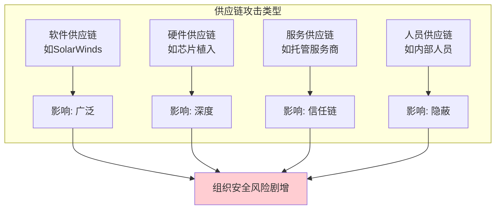

**重大供应链攻击案例分析：**

| 事件 | 时间 | 攻击方式 | 影响范围 | 关键教训 |
|------|------|---------|---------|---------|
| SolarWinds | 2020 | 在软件更新中植入后门 | 18000+组织 | 构建系统需要深度防御 |
| Codecov | 2021 | 篡改CI/CD脚本 | 数千家开发企业 | CI/CD管道是高价值目标 |
| Log4Shell | 2021 | 开源组件漏洞 | 全球范围 | 软件物料清单的重要性 |
| 3CX | 2023 | 供应链投毒+桌面应用 | 60万+企业 | 信任链传递风险 |
| xz Utils | 2024 | 长期渗透开源维护者 | Linux发行版 | 开源维护者是关键节点 |
| Polyfill.io | 2024 | CDN域名接管注入恶意代码 | 10万+网站 | CDN信任是攻击面 |

### 5.2 供应链安全红队模拟

供应链攻击的红队模拟需要特别谨慎，因为不当操作可能造成严重后果。

**模拟场景设计：**

| 模拟场景 | 攻击目标 | 验证能力 | 风险等级 |
|---------|---------|---------|---------|
| 恶意npm包投递 | 开发者依赖管理 | 能否检测到恶意依赖 | 低（使用内部测试包） |
| CI/CD管道劫持 | 构建服务器 | 能否检测构建过程异常 | 中（不影响生产构建） |
| 镜像仓库投递 | 容器部署流程 | 能否验证镜像签名 | 中（使用测试仓库） |
| 更新服务器劫持 | 自动更新机制 | 能否验证更新完整性 | 高（需严格隔离） |
| 开源贡献投毒 | 代码审查流程 | 能否识别恶意代码提交 | 中（使用模拟仓库） |

**供应链安全防御技术栈：**

```text
供应链安全防御层次：

1. 源代码层
   - 代码签名（GPG/SSH签名）
   - 分支保护和PR审查
   - SAST（静态应用安全测试）
   - 代码审查自动化（如CodeQL扫描）

2. 构建层
   - 构建环境隔离
   - 构建过程审计日志
   - SBOM（软件物料清单）生成
   - 依赖锁定和哈希验证
   - 构建可重现性验证

3. 分发层
   - 镜像签名（Cosign/Notary）
   - 制品仓库访问控制
   - 恶意软件扫描（Trivy/Grype）
   - 完整性验证（Sigstore）
   - 分发渠道加密

4. 运行层
   - 只读文件系统
   - 网络策略限制
   - 运行时行为监控
   - 凭证最小化
   - 运行时保护（如Falco）
```

**开源组件安全管理流程：**

```text
开源组件全生命周期管理：

1. 引入阶段
   ├── 评估组件活跃度（贡献者数量、更新频率）
   ├── 审查已知漏洞（NVD、GitHub Advisory）
   ├── 检查许可证兼容性
   └── 记录引入原因和用途

2. 使用阶段
   ├── 持续监控新漏洞（Dependabot/Snyk）
   ├── 定期更新依赖版本
   ├── 验证更新的完整性
   └── 监控组件行为异常

3. 淘汰阶段
   ├── 评估替代方案
   ├── 平滑迁移
   ├── 移除残留依赖
   └── 更新SBOM
```

---

## 六、AI在攻防对抗中的深度应用

### 6.1 红队AI增强：自动化攻击

AI正在深刻改变红队的操作方式，但也带来了新的挑战。

**AI增强的攻击技术详解：**

| 技术领域 | AI应用 | 具体能力 | 成熟度 | 风险等级 |
|---------|--------|---------|--------|---------|
| 漏洞发现 | LLM辅助代码审计 | 自动识别潜在漏洞模式 | 中 | 高（可能产生误报） |
| 载荷生成 | 生成式AI | 创建定制化钓鱼内容 | 高 | 高（社会工程增强） |
| 自动化渗透 | AI Agent | 自主执行多步攻击 | 低-中 | 极高（自主攻击） |
| 隐蔽通信 | 生成模型 | 将C2数据伪装为正常流量 | 中 | 中（对抗性检测） |
| 目标画像 | NLP + OSINT | 自动收集和分析目标信息 | 高 | 中（信息收集增强） |

**AI驱动的钓鱼攻击模拟（防御验证用途）：**

```python
# AI辅助钓鱼模拟框架示意（用于安全培训）
class AIPhishingSimulator:
    """AI辅助的钓鱼模拟工具 - 用于安全意识培训"""
    
    def generate_targeted_content(self, target_profile):
        """
        基于目标画像生成定制化钓鱼内容
        注意：仅用于授权的安全意识培训
        """
        # 1. 分析目标的公开信息（LinkedIn、官网等）
        interests = self.analyze_public_profile(target_profile)
        
        # 2. 生成情境化钓鱼模板
        template = self.create_context_template(
            scenario="invoice_payment",  # 财务类场景
            tone="formal",               # 正式语气
            urgency="medium"             # 中等紧迫感
        )
        
        # 3. 生成个性化钓鱼邮件
        phishing_email = self.personalize(template, interests)
        
        # 4. 验证内容合规性
        if not self.compliance_check(phishing_email):
            raise ValueError("生成内容不符合安全培训规范")
        
        return phishing_email
    
    def measure_effectiveness(self, campaign_results):
        """
        评估培训效果
        """
        metrics = {
            "open_rate": campaign_results.opened / campaign_results.sent,
            "click_rate": campaign_results.clicked / campaign_results.opened,
            "report_rate": campaign_results.reported / campaign_results.sent,
            "credential_rate": campaign_results.credentials_entered / campaign_results.clicked
        }
        return metrics
```

### 6.2 蓝队AI增强：智能防御

**AI增强的防御技术详解：**

| 技术领域 | AI应用 | 具体能力 | 技术栈 |
|---------|--------|---------|--------|
| 异常检测 | 无监督学习 | 识别偏离正常行为的活动 | Isolation Forest、Autoencoder |
| 威胁情报 | NLP分析 | 自动提取IoC和TTP | BERT、GPT + 信息抽取 |
| 事件响应 | AI编排 | 自动化剧本执行 | SOAR + ML决策引擎 |
| 恶意软件分析 | 深度学习 | 识别未知恶意软件变种 | CNN、RNN、Transformer |
| 用户行为分析 | UEBA | 检测内部威胁和账号泄露 | 图神经网络、时序模型 |

**基于AI的异常检测实战架构：**

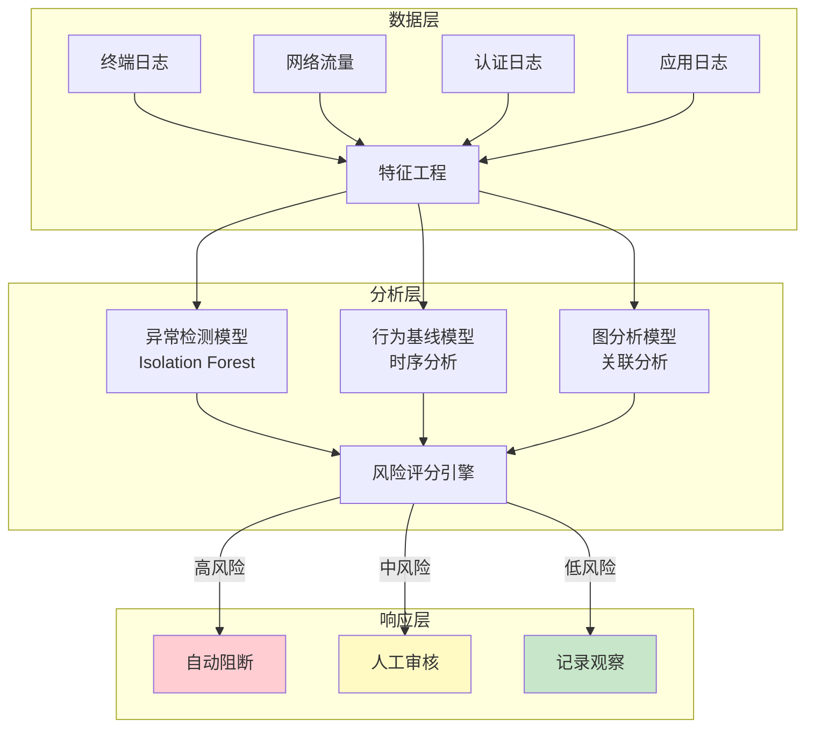

### 6.3 AI攻防的对抗性本质

AI在安全领域的应用本质上是一场新的军备竞赛。攻击者使用AI增强攻击，防御者使用AI增强防御，形成新的对抗循环。

**对抗性AI的关键挑战：**

| 挑战 | 说明 | 应对策略 |
|------|------|---------|
| 对抗样本 | 攻击者可以生成欺骗AI模型的输入 | 对抗训练、集成学习 |
| 数据投毒 | 攻击者在训练数据中注入恶意样本 | 数据验证、异常检测 |
| 模型窃取 | 攻击者通过查询推断模型参数 | 差分隐私、查询限制 |
| 提示注入 | LLM被恶意输入操纵 | 输入过滤、权限隔离 |
| 深度伪造 | AI生成的虚假音视频用于社工 | 多因素验证、数字水印 |
| 自动化漏洞利用 | AI自动生成exploit | 漏洞赏金+自动化防御 |

---

## 七、零信任环境下的攻防对抗

### 7.1 零信任架构对攻防的影响

零信任架构（Zero Trust Architecture）的核心原则是"永不信任，始终验证"。这一范式转变对红蓝对抗产生了深远影响。

**零信任对红队的挑战：**

| 传统环境 | 零信任环境 | 红队应对策略 |
|---------|-----------|-------------|
| 一次认证即可横向移动 | 每次访问都需要重新认证 | 窃取长期有效的认证令牌 |
| VPN接入后内网可达 | 微分段限制访问范围 | 利用已授权的应用作为跳板 |
| 固定网络位置可信任 | 设备健康状态影响访问 | 篡改设备健康检查报告 |
| 静态凭证可长期使用 | 动态凭证短期有效 | 实时利用窃取的短期凭证 |
| 内网流量不受检查 | 持续监控所有流量 | 加密和混淆C2通信 |

**零信任对蓝队的增强：**

| 能力维度 | 传统环境 | 零信任环境 |
|---------|---------|-----------|
| 可见性 | 网络边界内流量难以监控 | 所有流量经过策略引擎，全面可见 |
| 访问控制 | 基于网络位置的粗粒度控制 | 基于身份+设备+上下文的细粒度控制 |
| 响应速度 | 检测后需要手动隔离 | 策略引擎实时调整访问权限 |
| 信任评估 | 一次认证，持续信任 | 持续评估，动态调整信任等级 |

### 7.2 零信任环境下的红队攻击路径

在零信任环境中，红队需要新的攻击策略：

**攻击路径一：身份供应链攻击**
```text
1. 攻击目标：身份提供商（如Azure AD、Okta）
2. 攻击手法：利用SSO的信任链
3. 关键步骤：
   a. 窃取SSO令牌或刷新令牌
   b. 利用令牌访问受保护的应用
   c. 在令牌有效期内完成攻击
4. 防御验证：监控令牌使用异常、异常地理位置访问
```

**攻击路径二：设备信任利用**
```text
1. 攻击目标：受信任的设备
2. 攻击手法：利用设备健康状态的信任
3. 关键步骤：
   a. 获取已注册设备的访问权限
   b. 修改设备健康检查报告
   c. 通过设备信任获得网络访问
4. 防御验证：设备完整性验证、异常设备行为监控
```

**攻击路径三：微分段绕过**
```text
1. 攻击目标：分段间的合法通道
2. 攻击手法：利用合法应用间的数据流
3. 关键步骤：
   a. 识别分段间的合法API调用
   b. 利用已授权的API进行数据提取
   c. 通过合法通道绕过分段限制
4. 防御验证：API调用异常检测、数据流审计
```

**攻击路径四：策略引擎操纵**
```text
1. 攻击目标：零信任策略决策点（PDP）
2. 攻击手法：影响策略引擎的决策依据
3. 关键步骤：
   a. 篡改设备指纹或用户上下文信息
   b. 利用策略引擎的信任评估逻辑缺陷
   c. 通过伪造上下文提升信任等级
4. 防御验证：策略引擎日志审计、上下文完整性校验
```

---

## 八、IoT与工控安全的红蓝对抗

### 8.1 IoT设备攻击面分析

物联网设备由于资源受限、更新困难、默认配置等问题，形成了独特的攻击面。

**IoT设备攻击向量分类：**

| 攻击向量 | 目标 | 具体手法 | 影响 |
|---------|------|---------|------|
| 固件漏洞 | 设备固件 | 提取固件→逆向分析→发现漏洞 | 设备完全控制 |
| 通信协议 | MQTT/CoAP/Zigbee | 协议实现缺陷、未加密通信 | 数据窃取、指令注入 |
| 默认凭证 | 管理界面 | 使用默认用户名密码登录 | 设备接管 |
| 物理接口 | UART/JTAG/调试口 | 通过物理调试接口获取shell | 固件提取、密钥获取 |
| 云端API | IoT云平台 | API鉴权缺陷、IDOR漏洞 | 批量设备控制 |
| 固件更新 | OTA更新机制 | 更新包未签名/未加密 | 恶意固件注入 |

**IoT红队工具链：**

| 工具 | 用途 | 适用场景 |
|------|------|---------|
| Firmwalker | 固件文件系统分析 | 固件提取后的自动化分析 |
| Binwalk | 固件解包和逆向 | 固件提取、文件系统解析 |
| JTAGulator | JTAG/UART引脚识别 | 物理接口探测 |
| MQTT Explorer | MQTT协议分析 | IoT通信分析 |
| Shodan | IoT设备搜索 | 互联网暴露的IoT设备发现 |
| IoT Inspector | IoT流量分析 | 设备通信行为分析 |

### 8.2 工控系统（ICS/SCADA）安全

工控系统安全与传统IT安全有本质区别，因为可用性（不停机）远比保密性重要。

**工控系统攻击案例：**

| 事件 | 时间 | 攻击方式 | 影响 | 教训 |
|------|------|---------|------|------|
| 坎特伯雷水处理厂 | 2021 | 远程访问+修改化学品浓度 | 公共安全威胁 | 远程访问必须严格控制 |
| Colonial Pipeline | 2021 | IT系统勒索→OT系统停产 | 燃油供应中断 | IT/OT隔离不彻底 |
| 乌克兰电网 | 2015 | BlackEnergy→Industroyer | 大规模停电 | 工控协议本身缺乏安全机制 |
| Oldsmar水厂 | 2021 | TeamViewer远程访问 | 修改氢氧化钠含量 | 操作审计和双重确认 |

**工控系统红队操作的特殊考量：**

```text
工控红队操作红线（不可逾越）：

1. 绝对禁止在生产环境中测试
   - 必须使用仿真环境或数字孪生
   - 不得向实际PLC/DCS发送测试载荷

2. 必须有工控工程师全程在场
   - 理解工艺流程和安全联锁
   - 能够判断测试是否影响生产

3. 物理安全优先
   - 不得绕过安全联锁系统
   - 不得修改安全参数
   - 不得停止安全监控

4. 通信安全
   - 不得在生产网络中扫描
   - 测试流量必须标记和隔离
   - 禁止使用可能阻塞工控协议的工具
```

---

## 九、攻防度量体系

### 9.1 关键安全指标（KPIs）

没有度量就没有改进。攻防对抗需要建立系统化的度量体系来评估安全能力。

**核心安全指标体系：**

| 指标类别 | 指标名称 | 定义 | 目标值 | 度量方法 |
|---------|---------|------|--------|---------|
| 检测能力 | MTTD | 平均检测时间 | < 1小时 | 从攻击发生到检测告警的时间 |
| 响应能力 | MTTR | 平均响应时间 | < 4小时 | 从告警触发到事件遏制的时间 |
| 检测覆盖 | ATT&CK覆盖率 | 已检测技术/总技术数 | > 70% | 基于ATT&CK矩阵评估 |
| 漏洞管理 | MTTP | 平均修复时间 | < 30天（高危） | 从漏洞发现到修复的时间 |
| 攻防效果 | 红队成功率 | 红队达成目标的比例 | 目标：逐年下降 | 红队行动报告统计 |
| 攻防效果 | 蓝队检出率 | 蓝队独立检出攻击的比例 | > 80% | 红队行动中蓝队检出统计 |
| 培训效果 | 钓鱼测试通过率 | 员工识别钓鱼的比例 | > 90% | 钓鱼模拟测试统计 |

**安全投资ROI计算模型：**

```text
安全ROI = (避免的损失 - 安全投入) / 安全投入 × 100%

其中：
避免的损失 = 单次事件平均损失 × 预防的事件数
安全投入 = 工具成本 + 人员成本 + 培训成本 + 运营成本

示例计算：
- 平均数据泄露损失：450万美元（IBM 2024年报告）
- 年度安全投入：100万美元
- 预防的事件数：0.5次/年（基于行业基准）
- 避免的损失：450万 × 0.5 = 225万美元
- ROI = (225 - 100) / 100 × 100% = 125%
```

### 9.2 ATT&CK覆盖率评估

ATT&CK覆盖率是衡量检测能力最直观的指标。评估方法：

```text
ATT&CK覆盖率评估流程：

1. 获取最新的ATT&CK矩阵（Enterprise v14+）
2. 对每个技术标注当前检测状态：
   - 已检测（Detected）：有有效检测规则
   - 部分检测（Partially Detected）：有检测但覆盖不完整
   - 未检测（Not Detected）：无任何检测
   - 不适用（Not Applicable）：与组织环境无关

3. 计算覆盖率：
   覆盖率 = (已检测 + 部分检测×0.5) / (总技术数 - 不适用数) × 100%

4. 生成可视化报告：
   - 按战术维度的覆盖率热力图
   - 按威胁组的针对性覆盖率
   - 按数据源的检测依赖分析
   - 与上次评估的对比变化
```

**ATT&CK覆盖率热力图解读：**

| 热力图颜色 | 含义 | 行动建议 |
|-----------|------|---------|
| 深绿 | 覆盖率 > 80% | 持续监控，定期验证 |
| 浅绿 | 覆盖率 50-80% | 补充检测规则，提升覆盖 |
| 黄色 | 覆盖率 20-50% | 优先投入资源提升覆盖 |
| 红色 | 覆盖率 < 20% | 紧急填补检测盲区 |

### 9.3 红队行动的效果评估框架

红队行动结束后，需要系统化地评估行动效果，而不仅仅是列出发现的漏洞。

**红队行动效果评估维度：**

| 评估维度 | 评估内容 | 量化方法 |
|---------|---------|---------|
| 攻击成功率 | 红队达成预设目标的比例 | 目标达成数/总目标数 |
| 时间效率 | 完成攻击链各阶段的耗时 | 各阶段平均耗时对比 |
| 检出率 | 蓝队独立检出的比例 | 检出事件数/总攻击事件数 |
| 响应质量 | 蓝队响应的及时性和有效性 | MTTR、遏制措施有效性 |
| 改进效果 | 与上次演练相比的改善 | 关键指标的变化趋势 |
| 覆盖分析 | 防御覆盖的缺口分布 | 未检出技术的ATT&CK分布 |

**红队行动复盘模板：**

```text
红队行动复盘会议议程（2-3小时）

1. 行动概览（15分钟）
   ├── 行动目标和范围
   ├── 行动时间线
   └── 关键发现摘要

2. 攻击路径回顾（45分钟）
   ├── 逐阶段回顾攻击路径
   ├── 每个阶段的检出情况
   └── 攻击成功/失败原因分析

3. 蓝队响应评估（30分钟）
   ├── 检测能力评估
   ├── 响应流程评估
   └── 沟通协作评估

4. 改进建议（30分钟）
   ├── 短期改进（1-2周）
   ├── 中期改进（1-3月）
   └── 长期改进（3-6月）

5. 行动量化指标（15分钟）
   ├── ATT&CK覆盖率变化
   ├── MTTD/MTTR变化
   └── 红队成功率趋势

6. 下次行动计划（15分钟）
   └── 确定改进优先级和负责人
```

---

## 十、行业前沿趋势

### 10.1 持续性安全验证（Continuous Security Validation）

传统的年度渗透测试正在被持续性的安全验证取代。这一趋势的驱动力包括：

- **云环境的动态性：** 基础设施频繁变更，年度测试无法跟上变化速度
- **攻击面的扩大：** 新应用、新服务不断上线，需要持续验证新资产的安全性
- **合规要求的提升：** PCI DSS 4.0等新标准要求更频繁的安全评估
- **BAS平台的成熟：** 自动化攻击模拟工具使得持续验证成为可能

**持续验证的技术架构：**

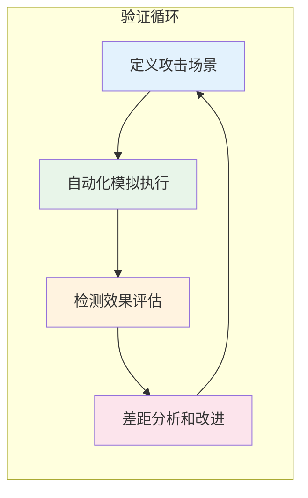

### 10.2 AI Agent驱动的自主红队

2024-2025年最前沿的发展之一是使用AI Agent进行自主渗透测试。与传统的自动化工具不同，AI Agent具有推理、规划和自主决策能力。

**AI Agent红队的能力边界：**

| 能力 | 当前状态 | 成熟度 | 风险 |
|------|---------|--------|------|
| 自主信息收集 | 可以自动搜索和分析目标信息 | 中 | 低（信息收集风险可控） |
| 自主漏洞利用 | 能够选择和执行exploit | 低-中 | 高（可能造成意外破坏） |
| 自主横向移动 | 能够规划和执行横向移动路径 | 低 | 极高（难以预测行为） |
| 自主目标达成 | 能够自主判断攻击进度 | 很低 | 极高（完全不可控） |

**现实评估：** AI Agent红队目前仍处于实验阶段，距离实际部署还有很大距离。核心瓶颈是：（1）AI的推理能力不足以应对复杂的真实环境；（2）自主攻击的风险难以控制；（3）法律和伦理问题尚未解决。短期内，AI Agent更适合作为红队的辅助工具（如自动化信息收集、报告生成），而非替代人工红队。

### 10.3 量子计算对密码学的威胁

虽然大规模量子计算机还需要10-20年，但组织需要提前规划"后量子密码学"迁移：

- **NIST后量子密码标准：** 2024年正式发布，包括CRYSTALS-Kyber（密钥封装）和CRYSTALS-Dilithium（数字签名）
- **"现在收集，将来解密"威胁：** 攻击者可能现在收集加密数据，等待量子计算机成熟后解密
- **迁移策略：** 优先迁移到混合加密方案（传统+后量子算法），逐步淘汰纯传统加密

**后量子密码迁移路线图：**

```text
阶段1: 评估（当前 - 2025年底）
├── 盘点组织内所有加密资产
├── 识别使用RSA/ECC的系统
├── 评估数据敏感性和留存期限
└── 制定迁移优先级

阶段2: 试点（2026 - 2027）
├── 在非关键系统试点后量子算法
├── 测试CRYSTALS-Kyber/Dilithium性能
├── 验证与现有系统的兼容性
└── 培训开发团队

阶段3: 迁移（2028 - 2030）
├── 关键系统切换到混合加密方案
├── 逐步淘汰纯传统加密
├── 更新所有证书和密钥
└── 验证端到端加密安全性

阶段4: 完成（2030+）
├── 全面采用后量子密码标准
├── 淘汰所有传统加密算法
└── 持续监控量子计算进展
```

### 10.4 安全左移与DevSecOps

安全正在从部署后的"检查点"转变为开发过程中的"内建能力"：

| 传统模式 | DevSecOps模式 | 关键变化 |
|---------|--------------|---------|
| 安全是独立阶段 | 安全是持续过程 | 安全融入CI/CD |
| 漏洞在生产发现 | 漏洞在开发阶段发现 | SAST/DAST集成 |
| 安全团队独立运作 | 安全是所有人的责任 | 安全冠军制度 |
| 合规驱动 | 风险驱动 | 安全需求前置 |

**DevSecOps工具链示例：**

```text
代码提交 → Pre-commit Hooks（密钥检测）
    ↓
PR创建 → SAST扫描（CodeQL/Semgrep）+ 依赖漏洞扫描（Dependabot/Snyk）
    ↓
合并 → 构建时镜像扫描（Trivy/Grype）+ SBOM生成（Syft）
    ↓
部署前 → DAST扫描（OWASP ZAP）+ 容器安全检查（OPA/Gatekeeper）
    ↓
运行时 → 运行时保护（Falco/Tetragon）+ WAF（ModSecurity）
    ↓
监控 → SIEM日志分析 + 威胁情报关联
```

---

## 十一、安全组织与团队建设

### 11.1 红队组织模型

不同规模的组织需要不同的红队组织模型：

| 组织规模 | 推荐模型 | 红队规模 | 核心能力要求 |
|---------|---------|---------|-------------|
| 小型（<500人） | 外部红队+内部蓝队 | 0（全部外包） | 蓝队具备理解报告能力 |
| 中型（500-5000人） | 混合模式 | 2-3人 | 渗透测试+基础红队能力 |
| 大型（5000+人） | 独立红队+紫队协调 | 5-10人 | 全面红队能力+APT模拟 |
| 超大型/跨国 | 区域红队+全球紫队 | 10+人 | 专业分工+全球协调 |

**红队内部角色分工：**

```text
红队组织架构：

红队负责人
├── 攻击手（Operator）
│   ├── 初始访问专家（钓鱼、漏洞利用）
│   ├── 后渗透专家（提权、横向移动、数据渗出）
│   └── 云安全专家（云环境攻击）
├── 工具开发（Developer）
│   ├── C2框架开发和维护
│   ├── 自定义载荷开发
│   └── 自动化脚本开发
├── 情报分析（Analyst）
│   ├── 威胁情报分析
│   ├── 目标画像
│   └── 行动报告编写
└── 紫队协调（Purple Team Lead）
    ├── 与蓝队沟通协调
    ├── 检测规则联合开发
    └── 演练计划制定
```

### 11.2 红队人才培养体系

**红队人才的能力模型：**

| 能力维度 | 初级（0-2年） | 中级（2-5年） | 高级（5-8年） | 专家（8年+） |
|---------|-------------|-------------|-------------|-------------|
| 渗透测试 | 基础渗透流程 | 高级漏洞利用 | 0day研究 | 战略级攻击规划 |
| 编程能力 | Python/Shell脚本 | C/Go工具开发 | 框架级开发 | 架构设计 |
| 网络安全 | TCP/IP、常见协议 | 协议分析、流量操控 | 协议级漏洞利用 | 网络架构安全 |
| 操作系统 | Linux/Windows基础 | 内核机制、驱动分析 | 内核漏洞利用 | 系统安全架构 |
| 云安全 | 云服务基础 | 云环境渗透 | 多云攻防 | 云安全架构 |
| 社工能力 | 基础钓鱼 | 高级社工 | APT级社工 | 社工策略设计 |
| 报告能力 | 技术报告编写 | 业务影响分析 | 战略建议 | 安全咨询 |
| 沟通协作 | 团队内协作 | 跨团队协调 | 管理层沟通 | 行业影响力 |

**推荐认证路径：**

```text
初级阶段：
├── CompTIA Security+（安全基础）
├── eJPT（入门渗透测试）
└── CEH（道德黑客基础）

中级阶段：
├── OSCP（渗透测试实操）
├── OSWE（Web应用安全）
├── CRTP/CRTE（Active Directory安全）
└── GPEN/GWAPT（SANS渗透测试）

高级阶段：
├── OSEP（高级渗透测试）
├── OSCE3（高级漏洞利用）
├── SANS SEC660/760（高级攻防）
└── CKA/CKS（Kubernetes安全）

专家阶段：
├── GXPN（漏洞研究与利用）
├── GREM（恶意软件分析）
└── 行业专项认证（云安全、工控安全等）
```

### 11.3 安全预算与ROI论证

向管理层论证安全投入的价值是安全团队的关键能力：

**安全预算分配建议（基于NIST CSF）：**

| CSF功能 | 预算占比 | 核心投入 |
|---------|---------|---------|
| 识别（Identify） | 10-15% | 资产管理、风险评估、安全审计 |
| 保护（Protect） | 30-40% | 访问控制、安全培训、数据安全、基础设施安全 |
| 检测（Detect） | 20-25% | SIEM、EDR、NDR、威胁狩猎 |
| 响应（Respond） | 15-20% | 事件响应、SOAR、取证工具 |
| 恢复（Recover） | 10-15% | 备份恢复、业务连续性、事后改进 |

**安全投入的商业论证框架：**

```text
1. 风险量化
   ├── 识别关键资产及其价值
   ├── 评估威胁发生的可能性
   ├── 估算潜在损失（直接+间接）
   └── 计算年度预期损失（ALE）

2. 方案对比
   ├── 不投入的预期损失
   ├── 投入方案的成本
   ├── 预期的风险降低效果
   └── 投资回报率（ROI）

3. 合规驱动
   ├── 适用的合规要求（等保/GDPR/PCI DSS）
   ├── 不合规的罚款和声誉损失
   └── 合规所需的最低投入

4. 竞争优势
   ├── 客户对安全的信任
   ├── 招投标中的安全资质
   └── 品牌声誉保护
```

---

## 十二、深度思考与进阶讨论

### 12.1 红队行动的伦理边界

红队行动必须在严格的伦理框架内进行。以下是需要特别关注的伦理问题：

| 伦理问题 | 风险场景 | 应对原则 |
|---------|---------|---------|
| 隐私侵犯 | 社工过程中获取员工个人信息 | 最小必要原则，获取后立即删除 |
| 业务中断 | 攻击测试导致系统宕机 | 严格RoE，准备回滚方案 |
| 心理影响 | 钓鱼测试对员工造成心理压力 | 选择合适的测试强度，事后告知 |
| 法律风险 | 跨境攻击测试可能触及法律 | 咨询法务，获取书面授权 |
| 第三方影响 | 测试可能影响供应商或客户 | 明确范围，通知相关方 |

### 12.2 红队报告的编写艺术

红队报告的质量直接决定了行动的价值。一份优秀的红队报告应该做到：

**报告结构模板：**

```text
1. 执行摘要（面向管理层）
   - 一句话总结整体安全态势
   - 关键发现的业务影响
   - 优先改进建议（Top 3）

2. 技术详情（面向安全团队）
   - 攻击路径全景图（含ATT&CK映射）
   - 每个发现的详细描述：
     * 攻击手法
     * 成功条件
     * 影响范围
     * 证据（截图/日志）
     * 检测情况（是否被发现）
     * 修复建议

3. 防御评估（面向蓝队）
   - ATT&CK覆盖率热力图
   - 检测能力评分
   - 防御改进建议（按优先级排序）

4. 附录
   - 完整的技术细节
   - 使用的工具和载荷列表
   - 时间线
```

**报告质量检查清单：**

- [ ] 每个发现都有明确的业务影响说明
- [ ] 每个建议都有具体的实施步骤
- [ ] 技术描述准确，没有夸大或缩小
- [ ] 证据充分，可复现
- [ ] ATT&CK映射准确
- [ ] 不同受众的内容层次分明
- [ ] 风险评级使用统一标准（如CVSS或组织内部标准）
- [ ] 改进建议有明确的优先级和时间线

### 12.3 红队人才的培养路径

红队成员需要跨领域的综合能力。以下是推荐的成长路径：

| 阶段 | 技能要求 | 学习路径 | 预计时间 |
|------|---------|---------|---------|
| 初级（0-2年） | 渗透测试基础、Linux/Windows系统、网络协议 | OSCP/OSCE认证、CTF训练 | 1-2年 |
| 中级（2-5年） | 高级漏洞利用、C2开发、社工技术 | SANS SEC560/660、自研工具开发 | 2-3年 |
| 高级（5-8年） | APT模拟、云安全、0day研究 | SANS SEC760、漏洞研究、行业分享 | 3-5年 |
| 专家（8年+） | 战略规划、团队管理、安全架构 | 安全咨询、行业标准制定、人才培养 | 持续 |

---

## 推荐学习资源

### 经典书籍

1. **《Red Team Development and Operations》** - Joe Vest & James Tubberville
   - 红队行动的系统化方法论
   - 出版：Leanpub，2020
   - 适合有经验的安全从业者

2. **《Operator Handbook: Red Team + Blue Team + OSINT》** - Joshua Picolet
   - 红蓝队实战参考手册
   - 出版：Independently Published，2020
   - 快速查找攻击和防御技术

3. **《Purple Team Strategies》** - Miriam Wiesner & Dean Herrington
   - 紫队协作的实用指南
   - 出版：Packt Publishing，2022
   - 从理论到实践的完整覆盖

4. **《The Hacker Playbook 3》** - Peter Kim
   - 渗透测试实战指南
   - 出版：CreateSpace，2018
   - 红队行动的实操案例

5. **《Cybersecurity Attack and Defense Strategies》** - Yuri Diogenes & Dr. Erdal Ozkaya
   - 攻防策略全景
   - 出版：Packt Publishing，2021
   - 适合理解攻防对抗全局

### 在线资源

| 资源名称 | 类型 | 核心内容 | 链接 |
|---------|------|---------|------|
| MITRE ATT&CK | 框架 | 攻击技术知识库 | attack.mitre.org |
| Atomic Red Team | 工具库 | ATT&CK测试用例 | github.com/redcanaryco/atomic-red-team |
| MITRE Caldera | 平台 | 自动化攻击模拟 | github.com/mitre/caldera |
| Detection Engineering | 社区 | 检测规则开发 | detectionengineering.net |
| Security Onion | 平台 | 开源安全监控 | securityonionsolutions.com |
| SANS Red Team | 培训 | 专业红队课程 | sans.org/red-team |
| ATT&CK Navigator | 工具 | ATT&CK矩阵可视化 | github.com/mitre/attack-navigator |
| Stratus Red Team | 工具 | 云原生攻击模拟 | github.com/DataDog/stratus-red-team |

### 工具推荐

| 工具 | 类型 | 核心功能 | 适用场景 |
|------|------|---------|---------|
| Sliver | 开源C2 | 跨平台后渗透 | 替代Cobalt Strike |
| Mythic | 开源C2 | 现代化C2框架 | 团队协作渗透 |
| Caldera | 攻击模拟 | 自动化红队行动 | 持续安全验证 |
| Velociraptor | 端点监控 | 高效数据收集 | 蓝队取证和监控 |
| Sigma | 检测规则 | 标准化检测逻辑 | 检测工程 |
| YARA | 恶意软件识别 | 模式匹配 | 恶意软件分析 |
| Stratus | 云攻击 | AWS/Azure/GCP模拟 | 云安全验证 |
| Infection Monkey | 网络模拟 | 网络传播模拟 | 分段验证 |

---

## 思考题

1. **攻防平衡：** 在一个资源有限的组织中，如何平衡红队（攻击）和蓝队（防御）的投入？什么样的比例是合理的？请结合组织规模和发展阶段分析。

2. **AI与人工：** AI Agent能否最终替代人工红队？从技术可行性、法律合规、风险控制三个维度分析，并讨论在哪些场景下必须使用人工红队。

3. **零信任对抗：** 如果你是一名红队成员，面对一个完全实施零信任架构的目标组织，你会设计怎样的攻击路径？列出至少3种绕过零信任控制的技术方案。

4. **供应链信任：** 开源软件供应链安全是一个全球性挑战。作为企业安全负责人，你会如何建立一套完整的开源组件安全管理流程？

5. **度量驱动：** 如何设计一套攻防度量体系，使得安全投入的ROI（投资回报率）可以被量化？关键指标有哪些？如何收集和分析这些数据？

6. **IoT安全：** 一家智能家电厂商希望对其产品进行安全评估。请设计一份IoT设备安全测试方案，覆盖固件、通信协议、云端API和移动端应用四个维度。

7. **工控安全：** 某制造企业计划对其SCADA系统进行安全评估。在"不影响生产"的前提下，你会设计怎样的测试方案？需要哪些特殊的安全措施？

---

## 实践建议

1. **搭建个人靶场：** 使用Vulnhub、HackTheBox或TryHackMe搭建个人练习环境，每周至少完成2-3个靶机

2. **ATT&CK技术覆盖：** 选择10个核心ATT&CK技术，使用Atomic Red Team逐一测试，记录每个技术的检测效果

3. **Sigma规则编写：** 为自己的靶场环境编写5条Sigma检测规则，涵盖进程创建、网络连接、认证日志等数据源

4. **C2框架学习：** 学习并搭建Sliver或Mythic C2框架，理解其架构和通信机制

5. **威胁狩猎练习：** 使用Security Onion或ELK搭建日志分析平台，进行至少3次假设驱动的威胁狩猎

6. **紫队演练：** 组织一次完整的紫队演练，从规则设计到攻击模拟到检测验证，记录全过程

7. **报告写作：** 模拟编写一份完整的红队行动报告，包含执行摘要、技术详情、防御评估三个部分

8. **云安全实践：** 使用Stratus Red Team在AWS/Azure沙箱中模拟至少5种云环境攻击技术

9. **供应链安全：** 对自己参与的项目运行一次完整的依赖审计（使用Snyk/Trivy），并尝试修复发现的漏洞

10. **持续学习：** 每周阅读1篇ATT&CK技术文档，每月完成1个HackTheBox挑战，每季度参加1次安全社区分享

---

> **本章寄语：** 攻防对抗是一场永无止境的军备竞赛。红队的每一次突破都是蓝队进步的契机，蓝队的每一道防线都推动红队创新攻击手法。紫队协作打破了攻防之间的壁垒，让安全能力的提升不再是零和博弈。在这个快速变化的领域，持续学习和实践是保持竞争力的唯一途径。记住：最好的防御不是最强的城墙，而是最敏锐的眼睛和最快的速度。
