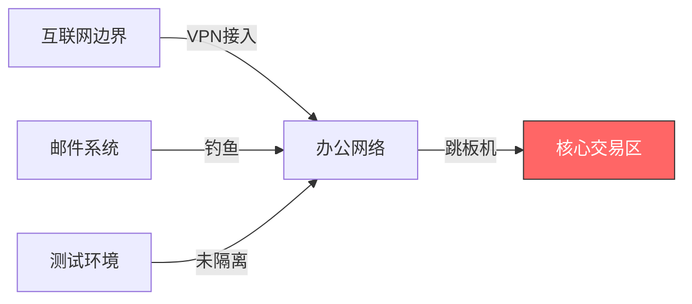
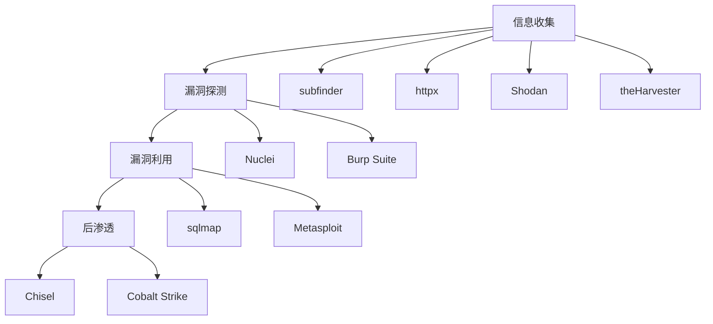
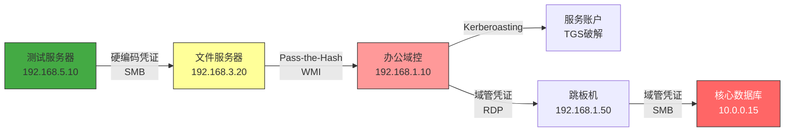
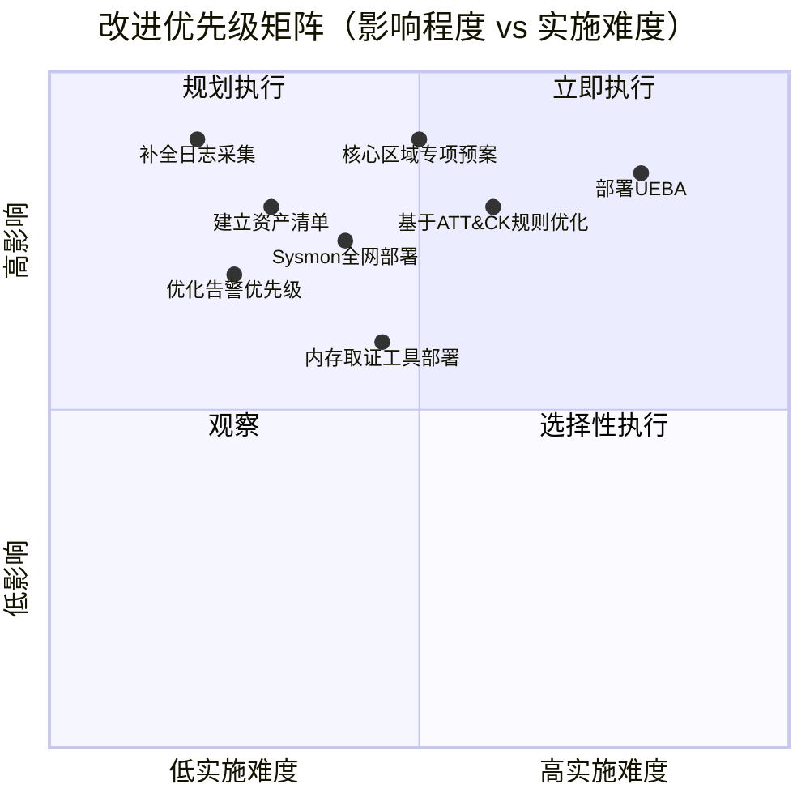

## 案例一：某金融企业红蓝对抗演练

### 演练概述

本案例完整还原一次针对大型金融企业核心交易系统的红蓝对抗演练全过程。演练历时30天，红队5人、蓝队12人参与，覆盖互联网边界、VPN接入、邮件系统、内部办公网络、核心交易区五大攻击面。最终红队成功突破至核心交易数据库，蓝队检测率仅37.5%——这一数据深刻暴露了传统安全防御体系在实战中的短板。



**核心数据一览：**

| 指标 | 数值 |
|------|------|
| 演练周期 | 30天 |
| 红队人数 | 5人 |
| 蓝队人数 | 12人 |
| 攻击阶段 | 3个阶段，20天完成 |
| 蓝队检测到的行为 | 3/8（37.5%） |
| 蓝队未检测到的行为 | 5/8（62.5%） |
| 修复的关键安全差距 | 4类 |
| 覆盖ATT&CK技术 | 15项 |

---

### 第一部分：演练背景与规则设定

#### 1.1 企业安全现状

该金融企业为国内头部券商，年交易额超过万亿，拥有约12000名员工，IT系统涵盖核心交易系统、CRM系统、OA办公系统、移动APP等。企业已部署的安全设备包括：

| 安全层 | 设备/系统 | 覆盖范围 | 实际效果 |
|--------|-----------|----------|----------|
| 网络边界 | 下一代防火墙、WAF | 互联网出口 | 有效 |
| 入侵检测 | IDS/NIDS | 核心网络区域 | 部分有效 |
| 终端防护 | EDR（某品牌） | 70%终端 | 覆盖不足 |
| SIEM | Splunk | 全网日志 | 规则需优化 |
| 漏洞管理 | Nessus + 人工扫描 | 季度扫描 | 频率不足 |
| 邮件安全 | 网关反钓鱼 | 入站邮件 | 基本有效 |
| 网络流量 | NTA（某品牌） | 核心交换 | 覆盖有限 |

**关键隐患：** 测试环境（staging）未纳入统一安全监控，部分老旧服务器未部署EDR，域控制器日志审计策略不完善。

#### 1.2 演练规则与约束

| 类别 | 红队约束 | 蓝队约束 |
|------|----------|----------|
| 合法性 | 不得造成业务中断 | 不得影响正常业务 |
| 攻击范围 | 五大攻击面（见上图） | 全网监控与响应 |
| 数据边界 | 可读取但不可外传 | 可隔离但需记录证据 |
| 工具限制 | 不使用0day | 可使用任意防御手段 |
| 通信方式 | 加密C2通道 | 内部通讯不限 |
| 评分标准 | 凭证获取+数据接触+持久化 | MTTD、MTTR、覆盖率 |

#### 1.3 红蓝双方团队构成

**红队（5人）：**

| 角色 | 职责 | 核心技能 |
|------|------|----------|
| 红队指挥（1人） | 制定攻击策略、协调行动 | 攻防经验10年+、场景设计 |
| 渗透测试专家（2人） | Web渗透、漏洞利用、提权 | OWASP Top 10、内网渗透 |
| 社会工程专家（1人） | 钓鱼、 pretexting | 话术设计、钓鱼页面搭建 |
| 恶意软件专家（1人） | C2框架、免杀、持久化 | 内存加载、加密通信 |

**蓝队（12人）：**

| 角色 | 人数 | 职责 |
|------|------|------|
| SOC经理 | 1 | 指挥协调、升级决策 |
| L1分析员 | 4 | 初级告警分诊 |
| L2分析员 | 3 | 深度分析、威胁研判 |
| L3分析员 | 2 | 高级威胁猎捕、溯源 |
| 事件响应工程师 | 2 | 应急处置、取证分析 |

---

### 第二部分：红队攻击路径全解析

#### 2.1 第一阶段：信息收集与边界突破（第1-5天）

##### 2.1.1 被动侦察

红队首先进行开源情报（OSINT）收集，目标是构建攻击面全景图：

**使用工具与方法：**

| 工具/方法 | 用途 | 发现内容 |
|-----------|------|----------|
| Shodan/Censys | 暴露资产搜索 | 3个VPN入口、12个Web应用 |
| 子域名枚举（subfinder） | 发现子域名 | 87个子域名，含staging环境 |
| GitHub/码云搜索 | 敏感信息泄露 | 1个内部IP段文档、2个服务账号 |
| 企业信息查询 | 组织架构、供应商 | 5个外包团队、供应链关系 |
| 邮箱收集（theHarvester） | 邮箱地址 | 200+企业邮箱 |

```bash
# 子域名枚举示例
subfinder -d target.com -all -o subdomains.txt
# 筛选存活主机
httpx -l subdomains.txt -o alive.txt -mc 200,301,302
```

**关键发现：** 通过子域名枚举发现 `staging-api.target.com`，该测试环境指向一个未被WAF保护的IP地址，运行着与生产环境相同版本的API服务。

##### 2.1.2 边界突破——SQL注入

红队对测试环境发起SQL注入探测：

**攻击时间线：**

| 时间点 | 操作 | 使用工具 | 结果 |
|--------|------|----------|------|
| Day 1 | 漏洞扫描 | sqlmap | 发现3个注入点 |
| Day 1 | 手工验证 | Burp Suite | 确认UNION注入 |
| Day 2 | 获取数据库信息 | sqlmap --dbs | 获得15个数据库 |
| Day 2 | 提取凭证 | sqlmap -D admin --dump | 管理员密码哈希 |
| Day 3 | 密码破解 | Hashcat | 明文密码 |
| Day 3 | 后台登录 | 浏览器 | Web管理权限 |
| Day 4 | 上传Webshell | 后台文件上传功能 | 服务器Shell |
| Day 5 | 本地提权 | 提权漏洞EXP | SYSTEM权限 |

**ATT&CK映射：**

| 技术编号 | 技术名称 | 描述 |
|----------|----------|------|
| T1190 | 利用面向公众的应用 | SQL注入漏洞利用 |
| T1133 | 外部远程服务 | 通过Webshell获得访问 |
| T1068 | 权限提升 | 利用本地漏洞提权至SYSTEM |

##### 2.1.3 攻击工具链

红队在本阶段使用的核心工具链：



---

#### 2.2 第二阶段：横向移动与权限提升（第6-15天）

##### 2.2.1 内网信息收集

从测试服务器出发，红队开始系统性地收集内网信息：

**信息收集阶段成果：**

| 信息类型 | 获取方式 | 获取内容 | 价值评估 |
|----------|----------|----------|----------|
| 网络拓扑 | 共享目录文档 | 完整网络架构图 | 极高 |
| 域信息 | `nltest /dclist` | 3个域控制器 | 高 |
| 用户列表 | `net user /domain` | 2800+域用户 | 高 |
| 服务账户 | SPN扫描 | 45个服务账户 | 极高 |
| 安全策略 | GPO分析 | 密码策略、审计策略 | 中 |

```bash
# 域环境信息收集示例
nltest /dclist:TARGET
net group "Domain Admins" /domain
setspn -T TARGET -Q */* | findstr CIFS
```

##### 2.2.2 凭证获取——硬编码凭证发现

在测试服务器的配置文件中发现硬编码的服务账户凭证：

```text
# 发现位置：/opt/app/config/db_connection.properties
db.username=svc_backup
db.password=B@ckup2024!Secure
db.host=192.168.2.15
```

**ATT&CK映射：** T1552.001 — 硬编码凭证

##### 2.2.3 横向移动——分阶段突破

**移动路径与检测情况：**



**每一步移动的详细过程：**

| 步骤 | 起点→目标 | 攻击技术 | ATT&CK编号 | 蓝队检测 |
|------|-----------|----------|-------------|----------|
| 1 | 测试服务器→文件服务器 | 利用硬编码凭证SMB连接 | T1078.002 | ❌ 未检测 |
| 2 | 文件服务器→办公域控 | Pass-the-Hash (WMI) | T1550.002 | ❌ 未检测 |
| 3 | 办公域控→服务账户 | Kerberoasting离线破解 | T1558.003 | ⚠️ 第12天检测 |
| 4 | 域管凭证→跳板机 | RDP登录 | T1021.001 | ⚠️ VPN异常（第8天） |
| 5 | 跳板机→核心数据库 | SMB横向移动 | T1021.002 | ⚠️ 第18天检测 |

##### 2.2.4 Kerberoasting攻击详解

Kerberoasting是本案例中最具代表性的攻击技术，红队利用域环境的SPN机制获取服务账户的TGS票据并离线破解：

**攻击原理：** 任何域用户都可以请求任意服务的TGS票据（只要知道SPN），票据使用服务账户密码的NTLM哈希加密。攻击者可以离线暴力破解该哈希。

**红队执行过程：**

```bash
# 1. 枚举SPN
SetSpn -T TARGET.COM -Q */*

# 2. 请求TGS票据（Rubeus）
Rubeus.exe kerberoast /stats
Rubeus.exe kerberoast /outfile:hashes.txt

# 3. 离线破解（Hashcat）
hashcat -m 13100 hashes.txt wordlist.txt -r rules/best64.rule
```

**破解结果：** 45个服务账户中，12个在24小时内被破解（密码强度不足），其中3个具有域管权限。

**蓝队检测规则（事后补充）：**

```spl
# Splunk检测规则示例
index=security EventCode=4769 | where ServiceName!="$" AND TicketEncryptionType=0x17
| stats count by AccountName, ServiceName, ClientAddress
| where count > 5
```

##### 2.2.5 免杀与通信隐蔽

红队在整个横向移动阶段采用了以下隐蔽手段：

| 手段 | 具体技术 | 效果 |
|------|----------|------|
| C2通信 | HTTPS+域名前置（CloudFront） | 绕过流量检测 |
| 内存加载 | reflective DLL注入 | 无文件落地 |
| 凭证处理 | Mimikatz反射加载 | 规避传统AV |
| 持久化 | WMI事件订阅 | 无注册表项 |
| 流量伪装 | DNS over HTTPS | 规避DPI |

---

#### 2.3 第三阶段：目标达成与数据窃取模拟（第16-20天）

##### 2.3.1 核心区域突破

红队使用域管理员凭证通过跳板机访问核心交易区：

**目标环境：**
- 核心数据库服务器：10.0.0.15（Oracle RAC集群）
- 数据库类型：Oracle 19c，存储交易记录
- 网络隔离：仅跳板机可达

**突破过程：**

| 时间 | 操作 | 结果 |
|------|------|------|
| Day 16 | RDP跳板→数据库服务器 | 域管凭证直接登录 |
| Day 17 | 数据库连接 | svc_backup账户具有SELECT权限 |
| Day 18 | 数据提取模拟 | 导出最近30天交易记录（10万条） |
| Day 19 | 持久化建立 | WMI事件订阅 + 计划任务 |
| Day 20 | 清理痕迹（部分） | 删除Webshell，保留后门 |

##### 2.3.2 攻击成果总结

| 指标 | 达成情况 | 说明 |
|------|----------|------|
| 初始入侵 | ✅ 成功 | SQL注入→Webshell |
| 权限提升 | ✅ 成功 | SYSTEM权限 |
| 横向移动 | ✅ 成功 | 5次横向移动 |
| 域管权限 | ✅ 成功 | Kerberoasting破解 |
| 核心数据接触 | ✅ 成功 | 可读取交易数据 |
| 持久化 | ✅ 成功 | WMI + 计划任务 |
| 数据外传 | ⚠️ 模拟 | 仅本地导出，未外传 |
| 业务中断 | ❌ 未发生 | 演练约束 |

---

### 第三部分：蓝队检测与响应分析

#### 3.1 检测结果全景

**8项关键攻击行为的检测情况：**

| 序号 | 攻击行为 | 蓝队是否检测 | 检测手段 | 检测时间 |
|------|----------|-------------|----------|----------|
| 1 | SQL注入攻击 | ❌ 未检测 | — | — |
| 2 | Webshell部署 | ❌ 未检测 | — | — |
| 3 | 本地提权 | ❌ 未检测 | — | — |
| 4 | 硬编码凭证利用 | ❌ 未检测 | — | — |
| 5 | 文件服务器访问 | ❌ 未检测 | — | — |
| 6 | VPN异常登录 | ✅ 已检测 | 地理位置异常告警 | Day 8 |
| 7 | Kerberoasting | ✅ 已检测 | SIEM关联规则 | Day 12 |
| 8 | 核心区域SMB通信 | ✅ 已检测 | NTA异常流量检测 | Day 18 |

**检测率：37.5%（3/8）**

#### 3.2 未被检测到的行为分析

**（1）SQL注入攻击（第1-3天）**

- **原因：** 测试环境未部署WAF，Web应用防火墙规则未覆盖staging子域名
- **根因：** 资产管理盲区——测试环境不在安全监控范围内
- **影响：** 攻击者获得初始立足点，后续所有攻击均基于此

**（2）Webshell部署与本地提权（第4-5天）**

- **原因：** 测试服务器未部署EDR，操作系统审计日志未启用
- **根因：** 安全基线执行不一致——非生产环境未达到安全标准
- **影响：** 攻击者获得SYSTEM权限，完全控制服务器

**（3）文件服务器横向移动（第6-8天）**

- **原因：** 攻击者使用合法凭证（硬编码的svc_backup账户）访问文件服务器，行为特征与正常备份作业一致
- **根因：** 缺乏基于用户行为的异常检测（UEBA），仅依赖规则匹配
- **影响：** 攻击者获取网络拓扑文档，为后续攻击提供路线图

#### 3.3 已检测到的行为分析

**（1）VPN异常登录（Day 8）**

| 字段 | 内容 |
|------|------|
| 告警类型 | 地理位置异常 |
| 触发条件 | 同一账户短时间内从两个不同城市登录 |
| 响应时间 | 约2小时 |
| 处置措施 | 锁定账户，要求密码重置 |
| 实际影响 | 红队已通过其他路径完成横向移动，此告警未阻止攻击链 |

**（2）Kerberoasting检测（Day 12）**

| 字段 | 内容 |
|------|------|
| 告警类型 | 异常Kerberos请求 |
| 触发条件 | 单用户短时间内请求大量TGS票据 |
| 响应时间 | 约6小时 |
| 处置措施 | 标记为可疑，列入观察清单 |
| 实际影响 | 优先级设置为"低"，未触发深度调查 |

**（3）核心区域SMB通信（Day 18）**

| 字段 | 内容 |
|------|------|
| 告警类型 | NTA异常流量 |
| 触发条件 | 跳板机向核心区域数据库服务器发起SMB连接 |
| 响应时间 | 约4小时 |
| 处置措施 | 启动调查，确认连接来源 |
| 实际影响 | 红队已完成数据访问，响应滞后 |

#### 3.4 MTTD与MTTR分析

| 阶段 | MTTD（平均检测时间） | MTTR（平均响应时间） |
|------|----------------------|----------------------|
| 初始入侵（SQL注入） | 未检测 | — |
| 横向移动 | 未检测 | — |
| VPN异常 | 8天 | 2小时 |
| Kerberoasting | 12天 | 6小时 |
| 核心区域入侵 | 18天 | 4小时 |

**关键发现：** 即使检测到攻击，响应时间也远超行业基准（金融业MTTR通常要求<30分钟）。更严重的是，检测到的攻击仅占37.5%，大量攻击行为完全处于"隐身"状态。

---

### 第四部分：演练成果与改进方案

#### 4.1 识别的关键安全差距

##### 差距一：资产盲区

| 问题 | 具体表现 | 影响程度 |
|------|----------|----------|
| 测试环境未监控 | staging环境无WAF、无EDR、无日志 | 🔴 严重 |
| 资产清单不完整 | 87个子域名中12个未在CMDB中 | 🔴 严重 |
| 供应商环境 | 外包团队的测试环境未纳入管理 | 🟡 中等 |

**改进措施：**

1. 建立统一资产发现机制，每周自动扫描互联网暴露面
2. 将所有环境（测试/预发/生产）纳入统一安全基线管理
3. 实施"零信任"资产策略——未注册的资产默认不可访问

##### 差距二：日志缺失

| 问题 | 具体表现 | 影响程度 |
|------|----------|----------|
| 主机日志未启用 | 测试服务器未开启审核策略 | 🔴 严重 |
| 日志覆盖不全 | 部分服务器Sysmon未部署 | 🔴 严重 |
| 日志保留期不足 | 仅保留30天，不满足取证需求 | 🟡 中等 |

**改进措施：**

1. 强制启用Windows高级审计策略（登录、特权使用、对象访问）
2. 全网部署Sysmon，覆盖所有Windows服务器
3. 日志保留期延长至180天，关键日志保留1年

##### 差距三：检测规则不足

| 问题 | 具体表现 | 影响程度 |
|------|----------|----------|
| 告警优先级不合理 | Kerberoasting告警为"低"优先级 | 🟡 中等 |
| 规则覆盖不足 | 无Pass-the-Hash专项检测规则 | 🔴 严重 |
| 缺乏UEBA | 无法检测合法凭证的异常使用 | 🔴 严重 |

**改进措施：**

1. 基于ATT&CK矩阵建立检测规则优先级框架
2. 补充Pass-the-Hash、Kerberoasting、Golden Ticket等攻击检测规则
3. 部署UEBA系统，建立用户行为基线

##### 差距四：响应流程缺陷

| 问题 | 具体表现 | 影响程度 |
|------|----------|----------|
| 核心区域无专项预案 | 核心交易区入侵的响应流程缺失 | 🔴 严重 |
| 升级机制不畅 | 从告警到调查的升级时间过长 | 🟡 中等 |
| 取证能力不足 | 缺乏内存取证工具和经验 | 🟡 中等 |

**改进措施：**

1. 制定核心区域专项应急响应预案（含RTO/RPO要求）
2. 建立分层响应机制：L1→L2升级时间<15分钟，L2→L3升级时间<30分钟
3. 配置Volatility、Rekall等内存取证工具，开展专项培训

#### 4.2 ATT&CK覆盖率评估

**红队使用的技术 vs 蓝队检测能力：**

| ATT&CK战术 | 红队使用的技术 | 蓝队检测到的 | 覆盖率 |
|-------------|---------------|-------------|--------|
| 侦察 | T1595.002 主动扫描 | N/A | — |
| 初始访问 | T1190 利用面向公众的应用 | 0/1 | 0% |
| 执行 | T1059.001 PowerShell | 0/1 | 0% |
| 持久化 | T1546.003 WMI事件订阅 | 0/1 | 0% |
| 权限提升 | T1068 漏洞利用 | 0/1 | 0% |
| 防御规避 | T1620 反射代码加载 | 0/1 | 0% |
| 凭证访问 | T1558.003 Kerberoasting | 1/2 | 50% |
| 发现 | T1087.002 域账户枚举 | 0/1 | 0% |
| 横向移动 | T1550.002 Pass-the-Hash | 0/2 | 0% |
| 收集 | T1005 本地数据收集 | 0/1 | 0% |
| C2 | T1071.001 Web协议 | 0/1 | 0% |
| **总计** | **15项技术** | **2/15** | **13.3%** |

#### 4.3 改进优先级矩阵



---

### 第五部分：经验教训与最佳实践

#### 5.1 红队视角的教训

| 经验 | 具体内容 |
|------|----------|
| 测试环境是金矿 | staging环境往往安全防护最弱，却与生产环境共享凭证 |
| 凭证复用是致命伤 | 硬编码凭证导致从测试环境一路打到核心数据库 |
| 免杀仍然有效 | 反射DLL加载+域名前置在30天内未被任何安全设备检测 |
| Kerberoasting成本低 | 5个服务账户中1个有域管权限，破解仅需数小时 |
| 时间是最好的掩护 | 低速攻击（每天1-2步）大幅降低被检测概率 |

#### 5.2 蓝队视角的教训

| 教训 | 具体内容 |
|------|----------|
| 资产可见性是基础 | 看不见的资产无法保护 |
| 日志是检测的前提 | 没有日志就没有检测 |
| 告警优先级决定响应 | 低优先级告警等于没有告警 |
| 检测≠响应 | 检测到但响应太慢等于没检测 |
| 基线差异是漏洞 | 生产环境的安全标准必须覆盖所有环境 |

#### 5.3 演练后改进实施路线图

| 阶段 | 时间 | 改进项 | 负责部门 |
|------|------|--------|----------|
| 即时（1周内） | Day 1-7 | 补全测试环境WAF覆盖 | 网络安全部 |
| 即时（1周内） | Day 1-7 | 修复硬编码凭证问题 | 开发运维部 |
| 短期（1月内） | Day 8-30 | 全网启用高级审计策略 | 安全运营中心 |
| 短期（1月内） | Day 8-30 | 优化Kerberoasting检测规则 | 安全运营中心 |
| 中期（3月内） | Day 31-90 | 部署UEBA系统 | 安全架构部 |
| 中期（3月内） | Day 31-90 | 制定核心区域专项预案 | 应急响应组 |
| 长期（6月内） | Day 91-180 | 建立统一资产发现平台 | 基础架构部 |
| 长期（6月内） | Day 91-180 | 实施零信任网络架构 | 安全架构部 |

#### 5.4 量化改进效果

演练结束后3个月，企业进行了复测：

| 指标 | 演练时 | 复测时 | 改善幅度 |
|------|--------|--------|----------|
| 蓝队检测率 | 37.5% | 72% | +34.5% |
| MTTD（核心区域） | 18天 | 3天 | -83% |
| MTTR（核心区域） | 4小时 | 45分钟 | -81% |
| 资产覆盖率 | 78% | 98% | +20% |
| 日志审计覆盖率 | 65% | 95% | +30% |
| ATT&CK检测覆盖率 | 13.3% | 38% | +24.7% |

---

### 总结

本案例揭示了金融企业安全防御的典型问题：

1. **资产管理是基础**——未被管理的资产是最大的攻击面
2. **纵深防御不能有断层**——一个测试环境的疏忽导致全线失守
3. **检测能力需要持续验证**——37.5%的检测率说明防御体系远未成熟
4. **响应速度决定损失大小**——18天的MTTD意味着攻击者有充足的时间
5. **演练的价值在于改进**——量化指标和改进路线图比发现漏洞更重要

> **核心启示：** 安全防御不是一次性建设，而是持续对抗的过程。红蓝对抗演练的真正价值不在于"红队能赢多少"，而在于"蓝队能从每次失败中学到多少"。只有将演练发现的问题转化为可执行的改进计划，并持续验证改进效果，才能真正提升企业的安全韧性。
